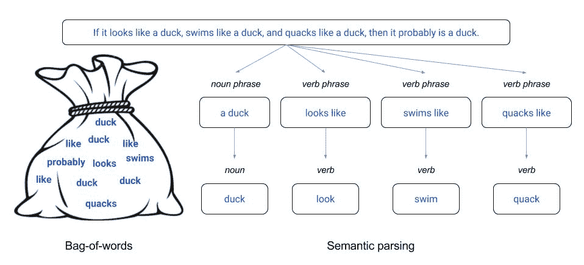
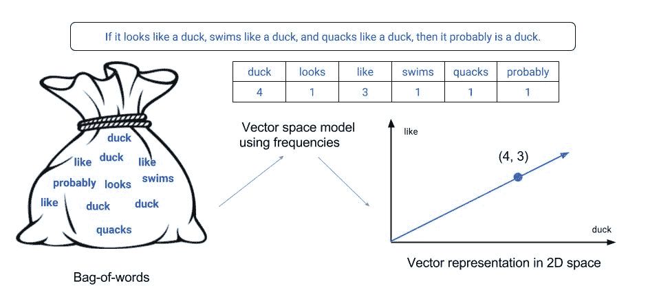
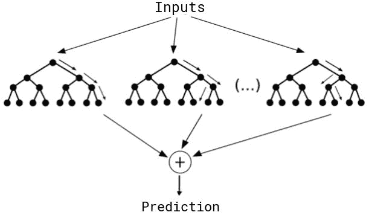
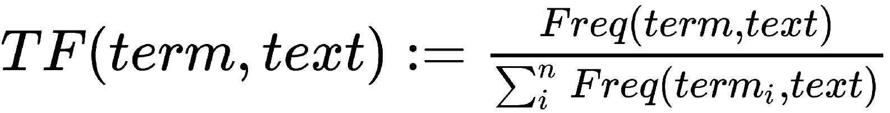
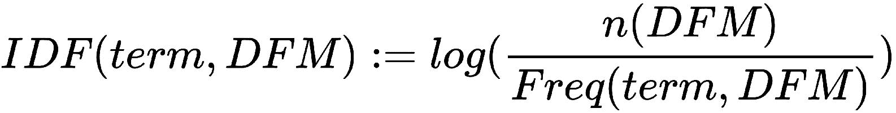
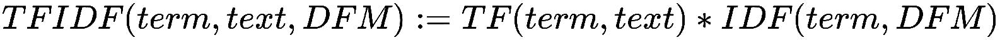
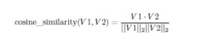

# 第六章：通过文本分析理解评论

众所周知，很大一部分相关信息以非结构化的形式存在，其中重要的参与者是文本数据。文本分析、**自然语言处理**（**NLP**）、**信息检索**（**IR**）和**统计学习**（**SL**）是一些专注于开发处理这些数据的技术和流程的领域。这些技术和流程发现并呈现知识、事实、业务规则、关系等，否则这些内容以文本形式锁定，对自动化处理来说是不可渗透的。

鉴于如今文本数据的爆炸式增长，对于统计学家和数据科学家等分析师来说，一项重要的技能是能够高效地处理这些数据并找到他们所寻找的见解。在本章中，我们将尝试根据发送给蛋糕工厂的评论来预测客户是否会进行重复购买。

由于文本分析是一个非常广泛的研究领域，我们需要将本章中将要探讨的技术缩小到最重要的几个。我们将采用帕累托方法，专注于在文本分析中使用 80%的时间的 20%的技术。本章涵盖的一些重要主题如下：

+   文档特征矩阵作为基本的数据结构

+   使用文本数据预测建模的随机森林

+   词语频率-逆文档频率用于衡量重要性

+   N-gram 建模将顺序带回分析

+   用于降维的奇异向量分解

+   使用余弦相似度查找相似的特征向量

+   将情感分析作为附加的向量特征

# 本章所需的包

由于一些包依赖于操作系统库，这些库可能因计算机而异，因此设置本章所需的包可能有些繁琐。请参阅附录*，所需包*，获取有关如何在您的操作系统上安装它们的特定说明。

| **包名** | **原因** |
| --- | --- |
| `lsa` | 余弦相似度计算 |
| `rilba` | 高效的 SVD 分解 |
| `caret` | 机器学习框架 |
| `twitteR` | Twitter API 接口 |
| `quanteda` | 文本数据处理 |
| `sentimentr` | 文本数据情感分析 |
| `randomForest` | 随机森林模型 |

我们将使用`rilba`包（它依赖于 C 代码）通过 Baglama 和 Reichel 在 2005 年提出的*增强隐式重启兰索斯双带对角化方法*，有效地计算**奇异值分解**（**SVD**）的一部分。[`www.math.uri.edu/~jbaglama/papers/paper14.pdf`](http://www.math.uri.edu/~jbaglama/papers/paper14.pdf))。

我们将使用`parallel`包来进行并行处理，因为一些文本分析可能需要大量的计算。目前`parallel`包是 R 中最通用的并行化包，但据报道在某些系统中它可能无法正确工作。其他选项包括`doParallel`、`doMC`和`doSNOW`。如果你在使用其中一个`parallel`时遇到问题，尝试切换到其他包之一。使它们工作的代码非常相似。

关于文本数据，在 R 中你可以使用一些包。最常见的是`tm`包和`quanteda`包。两者都非常优秀，主要区别在于风格。本章中我们将看到的所有功能都可以使用其中任何一个包来实现，但我们选择使用`quanteda`包。它是用`stringi`包来处理文本，`data.table`包来处理大量文档，以及`Matrix`包来处理稀疏对象构建的。因此，你可以期待它非常快速，并且很好地处理 Unicode 和 UTF-8。 

如果你不知道 Unicode 和 UTF-8 是什么，我建议你了解一下。非常粗略地，你可以将 Unicode 视为字符的 ID 标准，而 UTF-8 则是将这些 ID 转换为计算机可以理解的字节。在本章中，我们不会担心编码（所有数据都在 UTF-8 中），但这是在处理文本数据时经常出现的问题，并且正确处理它非常重要。

# 什么是文本分析以及它是如何工作的？

文本分析是从文本中提取信息的过程。信息通常通过诸如信息检索（IR）、自然语言处理（NLP）和句法分析（SL）等技术来提取，它包括对文本进行结构化、从结构化数据中推导模式，以及最终评估和解释输出。用于文本分析的基本模型包括词袋模型、向量空间模型和语义解析模型。

词袋模型是一种简化的文本表示，其中文本（在我们的例子中是评论）被表示为其术语（单词）的集合，不考虑语法和单词顺序，但保持多重性（因此得名“词袋”）。在将文本转换为词袋并将其结构化为语料库（结构化文本数据集合）之后，我们可以计算各种度量来将文本特征化为向量空间。词袋模型在句法分析方法中常用，我们将在本章中使用随机森林来使用它。在实践中，它被用作特征生成工具。以下图像解释了词袋模型：



词袋模型与语义解析的比较

向量空间模型使用从文档中提取的词袋来为每个文本创建一个特征向量，其中每个特征是一个术语，特征值是术语权重。术语权重可能是一个二进制值（1 表示术语在文档中出现过，0 表示没有），一个**术语频率**（**TF**）值（表示术语在文档中出现的次数），或者一个**术语频率-逆文档频率**（**TF-IDF**）值（表示术语对于一个文本给定其语料库的重要性）。存在更多复杂的加权机制，它们专注于特定问题，但这些都是最常见的，也是我们将要关注的。

根据我们之前提到的，一个文本最终会变成一个特征向量，每个特征向量对应于向量空间中的一个点。这个向量空间模型的构建方式是，对于词汇表中的每个术语都有一个轴，因此这个向量空间是*n*-维的，其中*n*是所有被分析数据中词汇表的大小（这可以非常大）。有时，从几何角度思考这些概念会有所帮助。词袋模型和向量空间模型分别指代了表征文本的不同方面，并且它们相互补充。以下图像解释了向量空间模型：



词袋到向量空间

词袋模型的一个重要弱点是它忽略了术语的语义上下文。存在更复杂的模型试图纠正这些不足。语义解析就是其中之一，它是将自然语言句子映射到其意义的形式表示的过程。它主要使用归纳逻辑编程和统计学习的组合。这些类型的技术在处理复杂文本时更有用。尽管我们在这本书中不会进一步探讨它们，但它们是强大的工具，并且是一个非常有意思的研究领域。

例如，如果你尝试用词袋模型和语义解析模型来思考以下引语的表示，你可能直觉上会认为第一个可能会给出无意义的结果，而第二个至少可以提供一些理解，你的判断是正确的。

“鱼网的存在是因为鱼。一旦你得到了鱼，你就可以忘记网。兔子的陷阱存在是因为兔子。一旦你得到了兔子，你就可以忘记陷阱。文字的存在是因为意义。一旦你得到了意义，你就可以忘记文字。我在哪里能找到一个已经忘记了文字的人，我可以和他交谈？”

– 《庄子》著作，公元前 4 世纪（原文为中文）

# 准备、训练和测试数据

和往常一样，我们将从设置数据开始。在这种情况下，数据是我们幻想公司蛋糕工厂收到的消息。这些消息在第四章中创建的`client_messages.RDS`文件中，*模拟销售数据和数据库操作*。数据包含 300 个观测值和 8 个变量：`SALE_ID`、`DATE`、`STARS`、`SUMMARY`、`MESSAGE`、`LAT`、`LNG`和`MULT_PURCHASES`。在本章中，我们将处理`MESSAGE`和`MULT_PURCHASES`变量。

我们将设置种子以获得可重复的结果。请注意，这应该在涉及随机化的每个函数调用之前完成。我们在这里只展示一次以节省空间并避免重复，但当你尝试生成可重复结果时要记住这一点：

```py
set.seed(12345)
```

接下来，我们需要确保相关变量中没有缺失数据。为此，我们使用`complete.cases()`函数以及否定(`!`)和`sum()`函数来获取每个变量中`NA`值的总数。正如你所看到的，我们没有缺失数据：

```py
sum(!complete.cases(client_messages$MESSAGE))
#> 0

sum(!complete.cases(client_messages$MULT_PURCHASES))
#> 0
```

如果你存在缺失数据，而不是使用通常在数据分析场景中进行的某些插补机制，你希望从这些数据中删除这些观测值，因为由于文本数据的非连续特性，这更容易出错：

当你在预测分析中处理有趣的现实世界问题时，你经常会发现需要处理不均衡的数据。在这种情况下，正如所示代码所示，我们有大约 63%的多次购买。这并不非常不均衡，但我们仍然必须保持训练和测试数据具有相似的比例，以确保安全：

```py
prop.table(table(client_messages$MULT_PURCHASES))
#>     FALSE      TRUE
#> 0.3621262 0.6378738
```

对于存在不均衡问题的数据，保持测试和训练集中相同的比例对于获得准确的结果非常重要。因此，我们需要确保我们的采样方法保持这些比例。为此，我们将使用`caret`包中的`createDataPartition()`函数来提取每个训练和测试集的索引。它将创建平衡的数据分割，在这种情况下，它将使用 70%的数据进行训练，并使用单个分区：

```py
indexes <- createDataPartition(
    client_messages$MULT_PURCHASES,
    list = FALSE,
    times = 1,
    p = 0.7
)
train <- client_messages[ indexes, ]
test <- client_messages[-indexes, ]
```

为了确保我们的比例保持不变，我们可以像之前对完整数据那样逐个检查它们：

```py
prop.table(table(train$MULT_PURCHASES))
#>     FALSE      TRUE
#> 0.3632075 0.6367925

prop.table(table(test$MULT_PURCHASES))
#>     FALSE      TRUE
#> 0.3595506 0.6404494
```

现在我们已经准备好了训练和测试集，我们可以开始清理和设置我们的文本数据，就像我们在下一节将要做的那样。

# 使用分词和数据清洗构建语料库

当我们处理文本数据时，需要创建的第一件事是从中提取将要用于创建语料库的标记。简单来说，这些标记是我们数据中每个文本中找到的所有术语的总和，去除了顺序或语法上下文。为了创建它们，我们使用 `tokens()` 函数和来自 `quanteda` 包的相关函数。如您所想象，我们的数据不仅包含单词，还包括标点符号、数字、符号和其他字符，如连字符。根据您处理的问题的上下文，您可能会发现像我们这里这样做，移除所有这些特殊字符非常有用。然而，请记住，在某些上下文中，这些特殊字符可能是有意义的（例如，分析推特数据时，井号符号（#）可能是相关的）：

```py
tokens <- tokens(
    train$MESSAGE,
    remove_punct = TRUE,
    remove_numbers = TRUE,
    remove_symbols = TRUE,
    remove_hyphens = TRUE
)
```

如您所想象，数据中将有大量的标记，因为我们必须为数据中的每个唯一单词都有一个标记。如果我们不应用一些过滤，这些原始标记可能毫无用处（信号/噪声比低），因此，我们将首先忽略大小写。在我们的语境中，*something* 和 *something* 应该是等效的。因此，我们使用 `tokens_tolower()` 函数将所有标记转换为小写：

```py
tokens <- tokens_tolower(tokens)
```

此外，请记住，像 *the*、*a* 和 *to* 这样的常用词几乎总是文本中频率最高的术语，并且对于得出见解并不特别重要。因此，我们应该使用 `tokens_select()` 函数将它们移除，就像我们做的那样：

```py
tokens <- tokens_select(tokens, stopwords(), selection = "remove")
```

词根允许我们减少具有相同意义的标记数量。例如，单词 *probability*、*probably* 和 *probable* 很可能具有相同的意义，它们之间的差异主要是句法的。因此，我们可以用单个标记 *probab* 来表示它们，从而大大减少我们的特征空间。请注意，所有这些过滤器都基于我们处理的问题的假设，您应该确保这些假设是有效的。在我们的情况下，它们如下： 

```py
tokens <- tokens_wordstem(tokens, language = "english")
```

而不是每次都要手动重复这个过程来创建标记，我们希望创建标记；我们可以将这些过滤器包装在一个单独的函数中，使我们的工作稍微轻松一些。仔细的读者会注意到 `token_ngrams()` 函数和相应的 `n_grams = 1` 默认参数。我们将在稍后的部分中对此进行专门介绍，但就目前而言，只需知道 `n_grams = 1` 意味着我们希望在标记中包含单个单词：

```py
build_tokens <- function(data, n_grams = 1) {
    tokens <- tokens(
        data,
        remove_punct = TRUE,
        remove_numbers = TRUE,
        remove_symbols = TRUE,
       remove_hyphens = TRUE
    )
    tokens <- tokens_tolower(tokens)
    tokens <- tokens_select(tokens, stopwords(), selection = "remove")
    tokens <- tokens_wordstem(tokens, language = "english")
    tokens <- tokens_ngrams(tokens, n = 1:n_grams)
    return(tokens)
}
```

现在，尽管我们已经展示了用于本章示例的代码，但我们将使用一个更小的示例（一句话），以便您可以直观地了解每个步骤中发生的情况。您绝对应该养成自己这样做以探索问题的习惯，以确保一切按预期工作。我们将所有步骤的代码都放在这里，在阅读前面的段落之后，您应该能够识别出每个步骤中的差异：

```py
sentence <- "If it looks like a duck, swims like a duck,
             and quacks like a duck, then it probably is a duck."

tokens <- tokens(sentence)
tokens
#> tokens from 1 document.
#> text1 :
#>  [1] "If"       "it"       "looks"    "like"     "a"        "duck"
#>  [7] ","        "swims"    "like"     "a"        "duck"     ","
#> [13] "and"      "quacks"   "like"     "a"        "duck"     ","
#> [19] "then"     "it"       "probably" "is"       "a"        "duck"
#> [25] "."

tokens <- tokens(sentence, remove_punct = TRUE)
tokens
#> tokens from 1 document.
#> text1 :
#>  [1] "If"       "it"       "looks"    "like"     "a"        "duck"
#>  [7] "swims"    "like"     "a"        "duck"     "and"      "quacks"
#> [13] "like"     "a"        "duck"     "then"     "it"       "probably"
#> [19] "is"       "a"        "duck"

tokens <- tokens_tolower(tokens)
tokens
#> tokens from 1 document.
#> text1 :
#>  [1] "if"       "it"       "looks"    "like"     "a"        "duck"
#>  [7] "swims"    "like"     "a"        "duck"     "and"      "quacks"
#> [13] "like"     "a"        "duck"     "then"     "it"       "probably"
#> [19] "is"       "a"        "duck"

tokens <- tokens_select(tokens, stopwords(), selection = "remove")
tokens
#> tokens from 1 document.
#> text1 :
#>  [1] "looks"    "like"     "duck"     "swims"    "like"     "duck"
#>  [7] "quacks"   "like"     "duck"     "probably" "duck"

tokens <- tokens_wordstem(tokens, language = "english")
tokens
#> tokens from 1 document.
#> text1 :
#>  [1] "look"    "like"    "duck"    "swim"    "like"    "duck"    "quack"
#>  [8] "like"    "duck"    "probabl" "duck"
```

# 文档特征矩阵

一旦我们准备好了标记，我们需要创建我们的语料库。在最基本层面上，一个 **语料库** 是一个包含每个文本特定文档级变量的文本集合。最基本的 *语料库* 使用词袋和向量空间模型创建一个矩阵，其中每一行代表我们集合中的一个文本（在我们的例子中是一个客户消息），每一列代表一个术语。矩阵中的每个值将是一个 1 或 0，表示一个特定的术语是否包含在特定的文本中。这是一个非常基本的表示，我们不会使用。我们将使用 **文档-特征矩阵** （**DFM**），它具有相同的结构，但不是使用指示变量（1s 和 0s），而是包含一个术语在文本中出现的次数，使用词袋模型的多重特性。为了创建它，我们使用 `quanteda` 包中的 `dfm()` 函数：

```py
train.dfm <- dfm(tokens)
```

为了获得一个直观的例子，这里展示了上一节中所示示例的 DFM。我们可以看到一些东西。首先，这是一个具有一些元数据的特殊对象，包括文档数量（在我们的例子中是一个句子），特征数量（即标记的数量），维度以及我们数据中每个文本的实际值。这是我们语料库。如果我们有多个句子，我们会在其中看到多行：

```py
dfm(tokens)
#> Document-feature matrix of: 1 document, 6 features (0% sparse).
#> 1 x 6 sparse Matrix of class "dfmSparse"
#>        features
#>  docs  look like duck swim quack probabl
#> text1  1    3    4    1    1     1
```

现在，忘记那个单句示例，让我们回到我们的客户消息示例。在这种情况下，`tokens` 对象将会更大。通常，我们以相同的方式分词并创建我们的 DFM。因此，我们创建了一个使这个过程对我们来说更容易一些的函数：

```py
build_dfm <- function(data, n_grams = 1) {
    tokens <- build_tokens(data, n_grams)
    return(dfm(tokens))
}
```

现在，我们可以使用以下方法轻松创建我们的 DFM：

```py
train.dfm <- build_dfm(train$MESSAGE)
```

要了解我们 DFM 的特征，你可以简单地打印它。正如你所见，我们的训练 DFM 有 212 个文档（客户消息）和 2,007 个特征（标记）。显然，大多数文档不会包含大多数特征。因此，我们有一个稀疏结构，这意味着 DFM 中的 98.4%的条目实际上是零。有经验的读者会将其识别为机器学习中常见的维度诅咒问题，在文本分析中尤其有害。正如我们稍后将会看到的，这可能会成为一个计算瓶颈，我们需要处理：

```py
train.dfm
#> Document-feature matrix of: 212 documents, 2,007 features (98.4% sparse)
```

通常，分词需要一些额外的预处理。正如你所知，我们在分词过程中找到的标记最终会成为我们的 DFM 中的列（特征）名称。如果这些名称包含符号或以数字开头（例如，*something&odd* 或 *45pieces*），那么我们的某些分析算法会通过抛出错误来抱怨。我们希望在将我们的 DFM 转换为数据框时防止这种情况发生。我们可以使用方便的 `make.names()` 函数做到这一点。在此处，我们还将添加 `MULT_PURCHASES` 值（我们的因变量）到我们新创建的数据框中：

```py
dfm.df <- cbind(MULT_PURCHASES = train$MULT_PURCHASES, data.frame(dfm))
names(dfm.df) <- make.names(names(dfm.df))
```

再次，为了避免重复这段样板代码，我们可以创建自己的函数来封装这个功能，并轻松地创建用于分析的数据框：

```py
build_dfm_df <- function(data, dfm) {
    df <- cbind(MULT_PURCHASES = data$MULT_PURCHASES, data.frame(dfm))
    names(df) <- make.names(names(df))
    return(df)
}
train.dfm.df <- build_dfm_df(train, train.dfm)
```

到目前为止，我们的训练数据已经准备好以数据框的形式进行分析，这些数据框可以被我们的预测模型使用。为了完成本节，如果你想了解数据中最频繁出现的术语，可以使用`topfeatures()`函数。在这种情况下，大多数特征可以根据其上下文直观地猜测。唯一可能需要一些解释的是`br`特征。它来自我们的数据来自包含`<br>`字符串的 HTML 页面，这些字符串表示文本中的新行（一个中断，因此称为`br`）。如果我们想的话，我们可以移除这个特征，但现在我们将保留它：

```py
topfeatures(train.dfm)
#>     br    like    tast  flavor     one    just   coffe    good     tri product
#>    220     107     101      87      82      75      72      71      70      67
```

# 使用交叉验证训练模型

在本节中，我们将高效地训练本例的第一个预测模型，并构建相应的混淆矩阵。大部分功能都来自优秀的`caret`包。你可以在其文档中找到更多关于这个包内丰富功能的信息，我们将在本书中不进行探索（[`topepo.github.io/caret/index.html`](http://topepo.github.io/caret/index.html)）。

# 训练我们的第一个预测模型

按照最佳实践，我们将使用**交叉验证**（**CV**）作为建模过程的基础。使用 CV，我们可以创建模型在未见数据上的表现估计。CV 功能强大，但缺点是它需要更多的处理，因此需要更多的时间。如果你能够承受计算复杂性，你绝对应该在项目中利用它。

探讨 CV 背后的数学原理超出了本书的范围。如果你感兴趣，你可以在维基百科上找到更多信息（[`en.wikipedia.org/wiki/Cross-validation_(statistics)`](https://en.wikipedia.org/wiki/Cross-validation_(statistics))). 基本思想是将训练数据分成各个部分，然后逐个将这些部分从其余训练数据中取出，同时保留所有剩余的部分。保留在一起的部分将用于训练模型，而被取出的部分将用于测试，并且通过旋转部分来重复这个过程，使得每个部分都被取出一次。这允许你在使用测试数据进行最终测试之前，更彻底地测试训练过程。

我们使用`trainControl()`函数来设置我们的重复交叉验证机制，包含五个分割和两次重复。这个对象将被传递给我们的预测模型，这些模型是用`caret`包创建的，以便在它们内部自动应用这个控制机制：

```py
cv.control <- trainControl(method = "repeatedcv", number = 5, repeats = 2)
```

我们为这个例子选择的预测模型是 R*andom Forests*（RF）。我们将非常简要地解释 RF 是什么，但感兴趣的读者被鼓励去查阅 James, Witten, Hastie 和 Tibshirani 的优秀的"*统计学习*"（Springer，2013）。RF 是一种非线性模型，用于生成预测。*树*是一种结构，通过分支模型提供从输入到特定输出的清晰路径。在预测建模中，它们用于找到在提供预测时表现良好的有限输入空间区域。RF 创建了许多这样的树，并使用一种机制将此树提供的预测聚合为单个预测。它们是一个非常强大且流行的机器学习模型。

让我们看看随机森林的例子：



随机森林聚合树

为了训练我们的模型，我们使用`train()`函数，传递一个公式，指示 R 使用`MULT_PURCHASES`作为因变量，并将所有其他内容（`~ .`）作为自变量，即标记频率。它还指定了数据、方法（`"rf"`代表随机森林）、我们刚刚创建的控制机制以及要使用的调整场景数量：

```py
model.1 <- train(
    MULT_PURCHASES ~ .,
    data = train.dfm.df,
    method = "rf",
    trControl = cv.control,
    tuneLength = 5
)
```

# 使用并行化提高速度

如果您在阅读此内容之前已经在您的计算机上实际执行了前面的代码，您可能会发现它花费了很长时间才完成（在我们的例子中是 8.41 分钟）。正如我们之前提到的，文本分析受到非常高的维数结构的影响，这需要很长时间来处理。此外，使用交叉验证运行将需要很长时间。为了减少总执行时间，使用`doParallel`包允许多核计算机并行进行训练，从而显著减少时间。

我们继续创建`train_model()`函数，该函数接受数据和控制机制作为参数。然后，它使用`makeCluster()`函数创建一个集群对象，其可用核心（处理器）数量等于通过`detectCores()`函数检测到的计算机中的核心数量。请注意，如果您计划在训练模型的同时使用计算机进行其他任务，您应该留出一到两个核心以避免系统过载（您可以使用`makeCluster(detectCores() - 2)`来完成此操作）。之后，我们开始时间测量机制，训练我们的模型，打印总时间，停止集群，并返回结果模型。

```py
train_model <- function(data, cv.control) {
    cluster <- makeCluster(detectCores())
    registerDoParallel(cluster)
    start.time <- Sys.time()
    model <- train(
        MULT_PURCHASES ~ .,
        data = data,
        method = "rf",
        trControl = cv.control,
        tuneLength = 5
    )
    print(Sys.time() - start.time)
    stopCluster(cluster)
    return(model)
}
```

现在我们可以更快地重新训练相同的模型。时间减少将取决于你的计算机可用资源。在一个具有 8 个核心和 32GB 内存的系统上，总时间是 3.34 分钟，而不是之前的 8.41 分钟，这意味着通过并行化，它只用了原始时间的 39%。不是很好吗？我们将更深入地研究并行化的机制及其优缺点，更多内容请参见第九章，*实现高效的简单移动平均*。让我们看看模型是如何训练的：

```py
model.1 <- train_model(train.dfm.df, cv.control)
```

# 计算预测准确度和混淆矩阵

现在我们已经训练好了我们的模型，我们可以查看其结果并要求它计算一些预测准确度指标。我们首先简单地打印出从`train()`函数返回的对象。如所见，我们有一些有用的元数据，但我们现在关心的是预测准确度，这显示在`Accuracy`列中。从我们告诉函数使用的五个测试场景中，当使用了 2,007 个可用特征（标记）中的 356 个时，我们达到了最佳模型。在这种情况下，我们的预测准确度为 65.36%。

如果考虑到我们的数据中案例的比例大约是 63%的多笔购买，我们已经取得了进步。这可以通过以下事实看出：如果我们只是猜测所有观察值中观察值最多的类别（`MULT_PURCHASES`为真），我们只有 63%的准确率，但使用我们的模型，我们能够将准确率提高到 65%。这是一个 3%的提高。我们将尝试在阅读本章时进一步提高这个提高。

请记住，这是一个随机过程，每次训练这些模型时结果都会不同。这就是为什么我们想要重复的交叉验证以及各种测试场景，以确保我们的结果是稳健的：

```py
model.1
#> Random Forest
#>
#>  212 samples
#> 2007 predictors
#>    2 classes: 'FALSE', 'TRUE'
#>
#> No pre-processing
#> Resampling: Cross-Validated (5 fold, repeated 2 times)
#> Summary of sample sizes: 170, 169, 170, 169, 170, 169, ...
#> Resampling results across tuning parameters:
#>
#>   mtry  Accuracy   Kappa
#>      2  0.6368771  0.00000000
#>     11  0.6439092  0.03436849
#>     63  0.6462901  0.07827322
#>    356  0.6536545  0.16160573
#>   2006  0.6512735  0.16892126
#>
#> Accuracy was used to select the optimal model using  the largest value.
#> The final value used for the model was mtry = 356.
```

要创建一个混淆矩阵，我们可以使用`confusionMatrix()`函数，首先发送模型的预测，然后是真实值。这不仅会为我们创建混淆矩阵，还会计算一些有用的指标，如敏感性和特异性。我们不会深入探讨这些指标的含义或如何解释它们，因为那超出了本书的范围，但我们强烈鼓励读者使用本章中引用的资源来学习它们：

```py
confusionMatrix(model.1$finalModel$predicted, train$MULT_PURCHASES)
#> Confusion Matrix and Statistics
#>
#>           Reference
#> Prediction FALSE TRUE
#>      FALSE    18   19
#>      TRUE     59  116
#>
#>                Accuracy : 0.6321
#>                  95% CI : (0.5633, 0.6971)
#>     No Information Rate : 0.6368
#>     P-Value [Acc > NIR] : 0.5872
#>
#>                   Kappa : 0.1047
#>  Mcnemar's Test P-Value : 1.006e-05
#>
#>             Sensitivity : 0.23377
#>             Specificity : 0.85926
#>          Pos Pred Value : 0.48649
#>          Neg Pred Value : 0.66286
#>              Prevalence : 0.36321
#>          Detection Rate : 0.08491
#>    Detection Prevalence : 0.17453
#>       Balanced Accuracy : 0.54651
#>
#>        'Positive' Class : FALSE
```

# 使用 TF-IDF 改进我们的结果

在文本分析的一般情况下，一个术语在文本中的原始计数高并不一定意味着该术语对文本更重要。将术语频率归一化最重要的方法之一是按术语在文本中出现的频率以及在整个语料库中出现的频率来权衡术语。

一个词在给定文本中出现的次数越多，在整个语料库中出现的次数越少，这意味着它可能对该特定文本很重要。然而，如果一个术语在文本中出现的次数很多，但在语料库中的其他文本中也出现很多，那么它可能对该特定文本不重要，而是对整个语料库很重要，这会稀释它的预测能力。

在信息检索（IR）中，TF-IDF 是最受欢迎的术语加权方案之一，它是前一段中表达的想法的数学实现。TF-IDF 值与一个词在给定文本中出现的次数成正比，但被整个语料库（不仅仅是给定文本）中该词的频率所稀释，这有助于调整一些词在一般情况下出现频率较高的实际情况。它是一种增强 DFM 中包含的信息的强大技术。

TF 将语料库中的所有文档归一化到长度无关。**逆文档频率**（**IDF**）考虑了语料库中所有文档中术语出现的频率。TF 与 IDF 的乘积通过相乘考虑了这两个概念。数学定义如下：

*n(DFM):= DFM 中的文本数量*

*Freq(term, text):= 文本中术语的计数*

*Freq(term, DFM):= DFM 中术语的计数*



现在我们将展示如何使用 R 函数来编程 TF-IDF 统计。请记住，我们正在处理一个 `dfm`，因此我们可以使用向量操作来使我们的函数更高效且易于编程。前三个函数 `term_frequency()`、`inverse_document_frequency()` 和 `tf_idf()` 应该很容易理解。

`build_tf_idf()` 函数利用这些函数来实际构建 TF-IDF 加权后的 DFM。其想法是我们需要使用 `apply()` 函数将我们创建的函数应用于行或列。我们需要将得到的结构转置，以便将文本放在行中，将特征放在列中，这就是为什么我们在中途使用 `t()` 函数的原因。最后，我们需要意识到有时我们会得到某些数据组合的 NA 值（尝试自己找出这些情况以确保你理解）并且我们需要用零来替换它们：

```py
build_tf_idf <- function(dfm, idf = NULL) {
    tf <- apply(as.matrix(dfm), 1, term_frequency)
    if (is.null(idf)) {
        idf <- apply(as.matrix(dfm), 2, inverse_document_frequency)
    }
    tfidf <- t(apply(tf, 2, tf_idf, idf = idf))
    incomplete_cases <- which(!complete.cases(tfidf))
    tfidf[incomplete_cases, ] <- rep(0.0, ncol(tfidf))
    return(tfidf)
}
```

现在我们可以轻松地使用我们的 `build_tf_df()` 函数构建 TF-IDF 加权后的 DFM，并创建相应的数据框，就像我们之前做的那样：

```py
train.tfidf <- build_tf_idf(train.dfm)
train.tfidf.df <- build_dfm_df(train, train.tfidf)
```

现在我们 TF-IDF 加权后的 DFM 中的值不仅将是整数，它们对应于频率计数，而且将是浮点值，对应于 TF-IDF 权重。我们可以使用之前使用的相同 `train_model()` 函数来训练我们的下一个模型：

```py
model.2 <- train_model(train.tfidf.df, cv.control)
```

这次，我们的训练过程耗时 2.97 分钟。要查看结果，只需打印模型对象。记住，我们之前的预测准确率为 65.36%。现在我们使用了 TF-IDF 加权的 DFM，它增加到了 66.48%。这不是一个显著的改进，这归因于我们正在处理的具体数据。当处理其他数据或领域时，你可以预期这种增加会更大：

```py
model.2
#> Random Forest
#>
#>  212 samples
#> 2007 predictors
#>    2 classes: 'FALSE', 'TRUE'
#>
#> No pre-processing
#> Resampling: Cross-Validated (5 fold, repeated 2 times)
#> Summary of sample sizes: 170, 170, 170, 169, 169, 169, ...
#> Resampling results across tuning parameters:
#>
#>   mtry  Accuracy   Kappa
#>      2  0.6368771  0.00000000
#>     11  0.6368771  0.00000000
#>     63  0.6392580  0.01588785
#>    356  0.6603544  0.13818300
#>   2006  0.6648948  0.18269878
#>
#> Accuracy was used to select the optimal model using  the largest value.
#> The final value used for the model was mtry = 2006.
```

# 通过 N-gram 增加灵活性

词袋模型考虑了被称为**unigrams**的孤立术语。这丢失了单词的顺序，在某些情况下这可能很重要。这种技术的推广称为 n-grams，其中我们使用单个单词以及单词对或单词三元组，在二元组和三元组的情况下分别。n-gram 指的是保持数据中最多`n`个单词的一般情况。自然地，这种表示具有不利的组合复杂性特征，并使数据呈指数增长。当处理大型语料库时，这可能会消耗大量的计算能力。

使用我们之前创建的`sentence`对象来举例说明标记化过程是如何工作的（它包含句子：“如果它看起来像鸭子，游泳像鸭子，嘎嘎叫像鸭子，那么它可能就是一只鸭子。”）和带有`n_grams`参数的`build_dfm()`函数，你可以比较`n_grams = 2`的结果 DFM 与`n_grams = 1`的结果。在分析这个 DFM 中的特征后，你应该对标记化过程如何过滤一些数据以及二元组是如何创建的有一个清晰的认识。正如你所见，n-gram 有可能恢复一些丢失的单词顺序，这在某些情况下可能非常有用：

```py
build_dfm(sentence, n_grams = 2)
#> Document-feature matrix of: 1 document, 14 features (0% sparse).
#> 1 x 14 sparse Matrix of class "dfmSparse"
#>          features
#>  docs    look like duck swim quack probabl look_like like_duck duck_swim
#> text1    1    3    4    1    1     1       1         3         1
#>          features
#>  docs    swim_like duck_quack quack_like duck_probabl probabl_duck
#> text1    1         1          1          1            1
```

为了重新训练我们的完整模型，我们将这次重新创建带有二元组的 TF-IDF 加权的 DFM 及其对应的数据框。使用我们之前创建的函数，可以通过以下代码轻松完成：

```py
train.bigrams.dfm <- build_dfm(train$MESSAGE, n_grams = 2)
train.bigrams.tfidf <- build_tf_idf(train.bigrams.dfm)
train.bigrams.tfidf.df <- build_dfm_df(train, train.bigrams.tfidf)
```

现在我们将重新训练模型并分析其结果。这可能会根据你用于训练的计算机而花费大量时间。在我们的 8 核计算机和 32GB 内存上，当并行执行时，耗时 21.62 分钟。这是因为预测因子数量的显著增加。正如你所见，我们现在有 9,366 个预测因子，而不是之前的 2,007 个。这种巨大的 4 倍增加归因于二元组。

在这个特定的情况下，添加的二元组复杂性并没有增加我们的预测准确率。事实上，它降低了。这可能有几个原因，其中之一是稀疏度的增加，这意味着信号/噪声比降低。在下一节中，我们将尝试提高这个比率，同时保持二元组：

```py
model.3 <- train_model(train.bigrams.tfidf.df, cv.control)
model.3
#> Random Forest
#>
#>  212 samples
#> 9366 predictors
#>    2 classes: 'FALSE', 'TRUE'
#>
#> No pre-processing
#> Resampling: Cross-Validated (5 fold, repeated 2 times)
#> Summary of sample sizes: 170, 170, 169, 170, 169, 170, ...
#> Resampling results across tuning parameters:
#>
#>   mtry  Accuracy   Kappa
#>      2  0.6368771   0.000000000
#>     16  0.6368771   0.000000000
#>    136  0.6344961  -0.004672897
#>   1132  0.6133998  -0.007950251
#>   9365  0.6109081   0.051144597
#>
#> Accuracy was used to select the optimal model using  the largest value.
#> The final value used for the model was mtry = 2.
```

# 通过 SVD 降低维度

如前文所述，由于 n-gram 技术，我们的数据维度发生了放大。我们希望能够使用 n-gram 将单词顺序带回到我们的 DFM 中，同时我们希望减少特征空间。为了实现这一点，我们可以使用多种不同的降维技术。在本例中，我们将展示如何使用 SVD。

SVD 通过使用其奇异向量而不是原始特征来压缩数据。该技术背后的数学超出了本书的范围，但我们鼓励你查阅 Meyer 的《矩阵分析与应用线性代数》（2000 年）。基本上，你可以将奇异向量视为数据中的重要方向，因此我们可以在具有最大信号/噪声比的可能变换空间中使用这些奇异向量，而不是使用我们的*正常*轴。计算完整的 SVD 可能需要非常多的时间，而我们实际上并不需要所有的奇异向量。因此，我们将使用`irlba`包来利用**隐式重启兰索斯双向对角化算法**（**IRLBA**）进行快速的部分 SVD，这要快得多。

当我们将部分奇异值分解（SVD）作为我们的降维方法（DFM）时，我们实际上是在一个不同的向量空间中工作，其中每个特征不再是单个标记，而是一系列标记的组合。这些新的特征不易理解，你不应该试图去理解它们。将其视为一个*黑盒*模型，知道你在比开始时更高的信号/噪声比空间中操作，同时大幅减少了其维度。在我们的案例中，我们将新空间缩小到原始空间的 1/4。为此，我们将创建一个包装函数来测量实际计算部分 SVD 所需的时间。实际的计算将通过`irlba()`函数完成，将 TF-IDF 加权的二元组 DFM 和我们要的奇异向量数（可能的 1/4）作为`nv`参数发送：

```py
build_svd <- function(dfm) {
    dfm <- t(dfm)
    start.time <- Sys.time()
    svd <- irlba(dfm, nv = min(nrow(dfm), ncol(dfm)) / 4)
    print(Sys.time() - start.time)
    return(svd)
}
```

现在我们可以轻松地创建部分 SVD 和相应的数据框。我们还继续重新训练我们的模型。请注意，尽管它是概念性的，但`train.bigrams.svd`是我们的新 DFM，在实践中，在 R 中，它是一个包含我们的 DFM 以及其他数据的对象。我们的 DFM 位于`train.bigrams.svd`对象中的`v`对象内，这是我们发送给`buildf_dfm_df()`函数的内容。`train.bigrams.svd`中的另一个重要对象是`d`，它包含分解的奇异值。

如你所见，我们的特征空间被大幅减少到只有 53 个特征（这大约是 212 个样本的 1/4）。然而，我们的预测准确度也没有比之前的结果更高。这意味着对于这个问题，二元组可能并没有增加太多信息：

```py
train.bigrams.svd <- build_svd(train.bigrams.tfidf)
train.bigrams.svd.df <- build_dfm_df(train, train.bigrams.svd$v)
model.4 <- train_model(train.bigrams.svd.df, cv.control)
model.4
#> Random Forest
#>
#> 212 samples
#>  53 predictors
#>   2 classes: 'FALSE', 'TRUE'
#>
#> No pre-processing
#> Resampling: Cross-Validated (5 fold, repeated 2 times)
#> Summary of sample sizes: 169, 170, 170, 170, 169, 170, ...
#> Resampling results across tuning parameters:
#>
#>   mtry  Accuracy   Kappa
#>    2    0.6344408  0.05602509
#>   14    0.6225360  0.06239153
#>   27    0.6272979  0.09265294
#>   40    0.6485604  0.13698858
#>   53    0.6366002  0.12574827
#>
#> Accuracy was used to select the optimal model using  the largest value.
#> The final value used for the model was mtry = 40.
```

# 使用余弦相似度扩展我们的分析

现在我们继续探讨线性代数中的一种熟悉技术，该技术作用于向量空间。这种技术被称为**余弦相似度**（**CS**），其目的是找到彼此相似（或不同）的向量。想法是测量客户消息之间的方向相似度（而不是大小），并尝试在涉及多次购买时预测相似的结果。当向量正交时，余弦相似度为 0；当向量垂直时，余弦相似度为 1。然而，这种相似度不应被解释为百分比，因为余弦函数的移动速率不是线性的。这意味着从 0.2 到 0.3 的移动并不代表从 0.8 到 0.9 的相似移动幅度。

给定两个向量（在我们的 DFM 中的行），它们之间的余弦相似度是通过计算它们的点积并将其除以欧几里得范数的乘积来计算的。为了回顾这些概念的含义，请参阅 Meyer 的《矩阵分析与应用线性代数，2000》。



我们创建`cosine_similarties()`函数，它将使用`lsa`包中的`cosine()`函数。我们发送一个数据框，并移除第一列，这对应于因变量`MULT_PURCHASES`，并使用转置来确保我们使用的是正确的方向：

```py
cosine_similarities <- function(df) {
    return(cosine(t(as.matrix(df[, -c(1)]))))
}
```

现在我们创建`mean_cosine_similarities()`函数，它将计算对应于执行过多次购买的客户的文本之间的余弦相似度，并将这些相似度的平均值取出来。我们需要取平均值，因为我们正在计算许多向量之间的许多相似度，并且我们希望为每个向量聚合它们。我们可以使用其他聚合机制，但现在平均值就足够了：

```py
mean_cosine_similarities <- function(df) {
    similarities <- cosine_similarities(df)
    indexes <- which(df$MULT_PURCHASES == TRUE)
    df$MULT_PURCHASES_SIMILARITY <- rep(0.0, nrow(df))
    for (i in 1:nrow(df)) {
        df$MULT_PURCHASES_SIMILARITY[i] <- mean(similarities[i, indexes])
    }
    return(df)
}
```

现在我们可以使用这个函数生成一个新的 DFM 数据框，该数据框将用于训练一个新的模型，该模型将考虑文本之间的余弦相似度。正如我们之前看到的，对于这种特定的数据，使用双词组并没有太大的帮助。在下一节中，我们将尝试一种不同且非常有趣的技术，即情感分析。让我们看看下面的代码：

```py
train.bigrams.svd.sim.df <- mean_cosine_similarities(train.bigrams.svd.df)
model.5 <- train_model(train.bigrams.svd.sim.df, cv.control)
model.5
#> Random Forest
#>
#> 212 samples
#>  54 predictors
#>   2 classes: 'FALSE', 'TRUE'
#>
#> No pre-processing
#> Resampling: Cross-Validated (5 fold, repeated 2 times)
#> Summary of sample sizes: 169, 170, 170, 170, 169, 170, ...
#> Resampling results across tuning parameters:
#>
#>   mtry  Accuracy   Kappa
#>    2    0.6460687  0.08590598
#>   15    0.6227021  0.05793928
#>   28    0.6437431  0.12111778
#>   41    0.6296788  0.09535957
#>   54    0.6227021  0.07662715
#>
#> Accuracy was used to select the optimal model using  the largest value.
#> The final value used for the model was mtry = 2.
```

# 情感分析的深入挖掘

我们已经看到，在预测模型的准确性方面，向量空间操作并没有很好地工作。在本节中，我们将尝试一种非常不同的技术，它更接近于我们在本章开头提到的语义解析模型。我们将尝试情感分析。

我们不仅会考虑文本中的单词，还会考虑位移词（即否定词、放大器、去放大器和对抗性连词）。一个否定词会翻转极化词的符号（例如，我不喜欢它）。一个放大器会增加极化词的影响（例如，我真的很喜欢它）。一个去放大器会减少极化词的影响（例如，我几乎不喜欢它）。一个对抗性连词会覆盖包含极化词的前一个子句（例如，我喜欢它，但它不值得）。这在某些类型的数据中可能非常有力量。

我们的情感分析将产生一个数字，该数字将指示从文本中测量的情感。这些数字是无界的，可以是正数或负数，对应于积极或消极的情感。数字越大，推断出的情感越强烈。为了实现这项技术，我们将使用`sentimentr`包，该包包含一个巧妙的算法来计算这些情感。对于爱好者来说，方程式的详细信息可以在其文档中找到（[`cran.r-project.org/web/packages/sentimentr/sentimentr.pdf`](https://cran.r-project.org/web/packages/sentimentr/sentimentr.pdf)）。

要应用这项技术，我们向`sentiment_by()`函数发送消息。这将返回一个包含多个值的对象，其中包括`word_count`值和`ave_sentiment`，后者是在给定文本中的所有句子中测量的平均情感（`sentinmentr`内部将每个文本分割成其组成部分（句子）并为每个部分测量情感）。然后我们将此对象添加到我们的 DFM 中并继续训练我们的模型。

如您所见，这次我们的模型预测准确性大幅提高，达到 71.73%。这意味着与我们在前几节中构建的其他特征相比，情感特征具有高度的预测性。尽管我们可以继续混合模型并探索，看看是否可以获得更高的预测准确性，但我们将在这一点上停止，因为您现在可能已经理解了如何自己进行这些操作：

```py
train.sentiment <- sentiment_by(train$MESSAGE)
train.sentiments.df <- cbind(
    train.tfidf.df,
    WORD_COUNT = train.sentiment$word_count,
    SENTIMENT = train.sentiment$ave_sentiment
)
model.6 <- train_model(train.sentiments.df, cv.control)
model.6
#> Random Forest
#>
#>  212 samples
#> 2009 predictors
#>    2 classes: 'FALSE', 'TRUE'
#>
#> No pre-processing
#> Resampling: Cross-Validated (5 fold, repeated 2 times)
#> Summary of sample sizes: 170, 170, 169, 170, 169, 170, ...
#> Resampling results across tuning parameters:
#>
#>   mtry  Accuracy   Kappa
#>      2  0.6368771  0.00000000
#>     11  0.6440753  0.04219596
#>     63  0.6863787  0.22495962
#>    356  0.6935770  0.28332726
#>   2008  0.7173198  0.31705425
#>
#> Accuracy was used to select the optimal model using  the largest value.
#> The final value used for the model was mtry = 2008.
```

尽管由于`sentimentr`包的存在，情感分析看起来非常简单，因为它不需要很多代码，但实际上这是一个非常困难的领域，背后有活跃的研究。对于公司来说，了解他们的客户如何看待他们非常重要，并且需要准确地进行。这现在并将继续成为一个非常有趣的研究领域。

# 使用未见数据测试我们的预测模型

现在我们有了最终模型，我们需要通过使用未见数据对其进行测试来验证其结果。这将使我们确信我们的模型训练良好，并且在新数据提供给我们时可能会产生类似的结果。

一个细心的读者应该已经注意到，我们在创建情感分析数据时使用了 TF-IDF 数据框，而不是我们后来创建的任何结合了二元组、SVD 和余弦相似度的数据框，因为它们在原始 DFM 的变换中处于不同的语义空间。因此，在我们实际上可以使用训练好的模型对测试数据进行预测之前，我们需要将其转换成与训练数据等效的空间。否则，我们就会比较苹果和橘子，这会给出荒谬的结果。

为了确保我们在相同的语义空间中工作，我们将 TF-IDF 权重应用于我们的测试数据。然而，如果你仔细想想，我们的测试数据中可能有很多术语在训练数据中并不存在。因此，我们的训练集和测试集的 DFM 将具有不同的维度。这是一个问题，我们需要确保它们是相同的。为了实现这一点，我们为测试数据构建 DFM 并对其应用一个过滤器，只保留在训练 DFM 中存在的术语：

```py
test.dfm <- build_dfm(test)
test.dfm <- dfm_select(test.dfm, pattern = train.dfm, selection = "keep")
```

此外，如果你仔细想想，TF-IDF 的语料库加权部分，即 IDF，也会因为语料库术语空间的变化而与这两个数据集不同。因此，我们需要确保我们忽略那些新的术语（即在训练数据中未见过）并使用训练过程中的 IDF 来确保我们的测试是有效的。为了实现这一点，我们将首先只计算训练数据的 TF-IDF 的 IDF 部分，并在计算测试数据的 TF-IDF 时使用它：

```py
train.idf <- apply(as.matrix(train.dfm), 2, inverse_document_frequency)
test.tfidf <- build_tf_idf(test.dfm, idf = train.idf)
test.tfidf.df <- build_dfm_df(test, test.tfidf)
```

现在我们已经将测试数据映射到训练数据的向量空间中，我们可以对新的测试 DFM 进行情感分析并计算我们的预测结果：

```py
test.sentiment <- sentiment_by(test$MESSAGE)
test.sentiments.df <- cbind(
    test.tfidf.df,
    WORD_COUNT = test.sentiment$word_count,
    SENTIMENT = test.sentiment$ave_sentiment
)
```

注意，在这种情况下，我们并没有训练一个新的模型，我们只是使用我们创建的最后一个模型，并使用它来为测试 DFM 提供预测：

```py
predictions <- predict(model.6, test.sentiments.df)
```

要知道我们的预测效果如何，我们只需像之前一样打印一个模型即可，因为我们只是查看训练过程中的结果，这些结果不包括测试数据的预测。我们需要做的是创建一个混淆矩阵并计算预测准确度指标，就像我们之前使用`confusionMatrix()`函数所做的那样。

如你所见，我们的结果似乎有效，因为我们用 71.91%的预测准确度对未见过的数据进行预测，这非常接近训练数据的预测准确度，并且比仅仅猜测实际多次购买比例高出 12%。对于文本数据和我们所处理的问题，这些结果相当不错。

如果你知道如何解释其他指标，请确保将它们与我们第一个模型中的指标进行比较，以了解我们在本章中结果是如何演变的。

如果您不熟悉这些内容，我们建议您查阅 James, Witten, Hastie 和 Tibshirani 的《统计学习，2013》：

```py
confusionMatrix(predictions, test$MULT_PURCHASES)
#> Confusion Matrix and Statistics
#>
#>           Reference
#> Prediction FALSE TRUE
#>      FALSE    11    4
#>      TRUE     21   53
#>
#>                Accuracy : 0.7191
#>                  95% CI : (0.6138, 0.8093)
#>     No Information Rate : 0.6404
#>     P-Value [Acc > NIR] : 0.073666
#>
#>                   Kappa : 0.3096
#>  Mcnemar's Test P-Value : 0.001374
#>
#>             Sensitivity : 0.3438

#>             Specificity : 0.9298
#>          Pos Pred Value : 0.7333
#>          Neg Pred Value : 0.7162
#>              Prevalence : 0.3596
#>          Detection Rate : 0.1236
#>    Detection Prevalence : 0.1685
#>       Balanced Accuracy : 0.6368
#>
#>        'Positive' Class : FALSE
```

如果您打算使用通过 SVD 创建的 DFM 进行测试，您需要在生成任何预测之前进行相应的转换，以确保您在正确的语义空间中工作。如果您使用了本章中展示的程序，您需要将测试 DFM（与您的训练 DFM 具有类似的转换）左乘以由 sigma 调整的奇异值向量，并相应地转置结构。确切的转换将取决于您使用的数据结构和您对其应用的过程，但请始终确保您的训练数据和测试数据在相同的语义空间中操作：

```py
sigma.inverse <- 1 / train.bigrams.svd$d
u.transpose <- t(train.bigrams.svd$u)
test.bigrams.svd <- t(sigma.inverse * u.transpose %*% t(test.bigrams.tfidf))
test.bigrams.svd.df <- build_dfm_df(test, test.bigrams.svd)
```

# 从 Twitter 检索文本数据

在我们结束本章之前，我们将非常简要地触及一个完全不同但非常受欢迎的主题，即从 Twitter 获取数据。如果您想应用预测模型，您需要将 Twitter 数据链接到您想要预测的变量，这通常来自其他数据。然而，您可以轻松做到的是，使用我们在前一部分展示的技术来衡量一个主题周围的情感。

`twitteR`包实际上使我们能够非常容易地检索 Twitter 数据。为此，我们将在 Twitter 内部创建一个**Twitter 应用**，这将使我们能够访问数据源。为了完成此操作，我们需要在您的 Twitter 账户中生成四个字符串，这些字符串将是使用 API 的密钥。这些密钥用于验证您的权限并监控您的总体使用情况。具体来说，您需要四个字符串，即`consumer_key`值、`consumer_secret`、`access_token`和`access_secret`。要检索它们，请访问 Twitter Apps 网站([`apps.twitter.com/`](https://apps.twitter.com/))，点击创建新应用，并输入所需的信息。您的 Twitter 应用名称必须在所有 Twitter 应用中是唯一的。不用担心选择一个复杂的名称，您永远不会再次使用那个字符串。此外，请确保您阅读了 Twitter 开发者协议，并且您同意它。

一旦进入您应用的仪表板，请转到“密钥和访问令牌”选项卡，并生成一个密钥和访问令牌及其相应的密钥。确保您准确无误地复制这些字符串，因为它们将授予您访问数据源的权利。用它们替换这里显示的（由于本书编写后已删除，因此不再有效），并执行`setup_twitter_oauth()`函数。如果一切如预期进行，现在您应该已经将您的 R 会话连接到了数据源：

```py
consumer_key <- "b9SGfRpz4b1rnHFtN2HtiQ9xl"
consumer_secret <- "YMifSUmCJ4dlgB8RVxKRNcTLQw7Y4IBwDwBRkdz2Va1vcQjOP0"
access_token <- "171370802-RTl4RBpMDaSFdVf5q9xrSWQKxtae4Wi3y76Ka4Lz"
access_secret <- "dHfbMtmpeA2QdOH5cYPXO5b4hF8Nj6LjxELfOMSwHoUB8"
setup_twitter_oauth(consumer_key, consumer_secret, access_token, access_secret)
```

为了检索数据，我们将创建一个包装函数，这样我们就不必每次需要新数据时都重复编写样板代码。`get_twitter_data()` 函数接受我们在 Twitter 中搜索的关键词以及我们想要检索的消息数量。然后，它继续使用 `searchTwitter()` 函数（英文）从 Twitter 获取数据，使用 `twListToDF()` 函数将结果转换成数据框，并将数据发送回用户：

```py
get_twitter_data <- function(keyword, n) {
    return(twListToDF(searchTwitter(keyword, n, lang = "en")))
}
```

现在，我们可以通过执行以下代码轻松搜索包含单词 "*cake*" 的消息。如您所见，我们不仅获得了消息，还获得了大量元数据，例如推文是否已被收藏；如果是，收藏了多少次；是否为回复；创建时间；如果可用，推文发送的坐标，以及其他事项：

```py
cake_data <- get_twitter_data("cake", 250)

names(cake_data)
#>  [1] "text"          "favorited"     "favoriteCount" "replyToSN"
#>  [5] "created"       "truncated"     "replyToSID"    "id"
#>  [9] "replyToUID"    "statusSource"  "screenName"    "retweetCount"
#> [13] "isRetweet"     "retweeted"     "longitude"     "latitude"
```

作为一项练习，使用前面展示的机制从 Twitter 获取数据，并使用它创建一个世界地图，显示推文的来源，并使用从推文中推断出的情感来着色推文的位置。拥有这样的代码片段可以很有趣，可以和朋友一起玩耍和开玩笑，也可以用于做出真正的商业决策。

# 摘要

在本章中，我们展示了如何使用文本数据进行预测分析。为此，我们展示了如何对文本进行分词以提取相关单词，如何构建和使用**文档-特征矩阵**（**DFMs**），如何对 DFMs 应用转换以使用词频-逆文档频率权重、n-gram、部分奇异值分解和余弦相似度探索不同的预测模型，以及如何在随机森林中使用这些数据结构来生成预测。您学习了为什么这些技术对于某些问题可能很重要，以及如何将它们结合起来。我们还展示了如何将文本中推断出的情感分析包括进来，以增强我们模型的预测能力。最后，我们展示了如何从 Twitter 获取实时数据，这些数据可以用来分析人们在说出他们的观点后不久在社交网络中说些什么。

我们鼓励您将本章的知识与之前章节的知识结合起来，以尝试获得更深入的见解。例如，如果我们使用四元组的三角元会发生什么？如果我们将其他特征（例如，坐标或客户端 ID）包含在数据中会发生什么？以及，如果我们使用支持向量机等而不是随机森林作为预测模型会发生什么？

在下一章中，我们将探讨如何使用前三个章节中我们所做的工作来生成当从蛋糕工厂收到新数据时可以自动生成的报告。我们将介绍如何自动生成 PDF，如何创建可以自动更新的演示文稿，以及其他有趣的报告技术。
