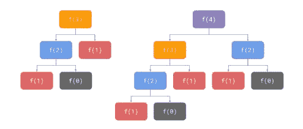
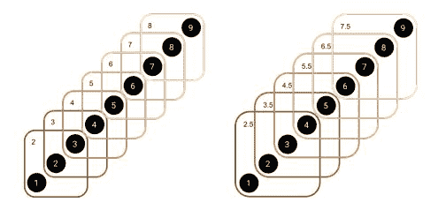
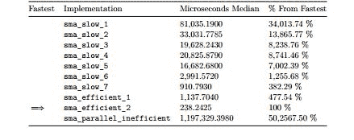
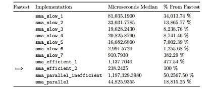
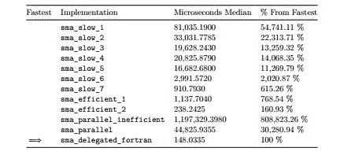

# 第九章：实现高效的简单移动平均

在过去几十年中，随着数据量的增加和模型的复杂化，对计算能力的需求稳步增长。显然，最小化这些计算所需的时间已成为一项重要任务，并且存在明显的性能问题需要解决。这些性能问题源于数据量与现有分析方法之间的不匹配。最终，数据分析技术将需要进行根本性的转变，但就目前而言，我们必须满足于提高我们实现的效率。

R 被设计为一种具有高级表达性的解释型语言，这也是它缺乏许多支持高性能代码的细粒度控制和基本结构的原因之一。正如阿罗拉在 2016 年 Springer 出版的《用高性能计算征服大数据》一书中所说：“虽然 R 显然是一种高生产力语言，但它并不一定是一种高性能语言。”

R 程序的执行时间以小时或甚至以天来衡量并不罕见。随着要分析的数据量的增加，执行时间可能会变得过长，数据科学家和统计学家常常会遇到这些瓶颈。当这种情况发生时，如果他们对性能优化了解不多，他们可能会满足于减少数据量，这可能会阻碍他们的分析。然而，不用担心；R 程序可能会慢，但编写良好的 R 程序通常足够快，我们将探讨你可以使用的各种技术来提高你的 R 代码性能。

本章的目的不是让你成为一个性能优化专家，而是提供一个概述，介绍你如何尝试提高代码性能时可以使用的各种技术。我们将探讨许多不同的技术，每个技术都可能有自己的章节甚至书籍，因此我们只能从非常高的层面来看待它们，但如果你发现自己经常受到计算资源的限制，那么这些内容是你需要进一步深入了解的。

本章涵盖的一些重要主题如下：

+   决定实现必须有多快

+   使用良好算法的重要性

+   为什么 R 有时会慢或效率低下

+   小的改变可能对性能产生的影响

+   测量代码性能以找到瓶颈

+   比较不同实现之间的差异

+   通过并行化从计算机中获得最大效益

+   通过与其他语言接口提高性能

# 需要的包

我们已经使用了一些本章所需的包，例如 `ggplot2` 和 `lubridate`。其他三个包被介绍用于基准函数，并比较它们之间的性能，以及用于高级优化技术如**委托**和**并行化**，这些将在各自的章节中解释。

为了能够复制本章中的所有示例，你还需要为 Fortran 和 C++ 代码安装可工作的编译器。有关如何在您的操作系统上安装它们的说明，请参阅附录，*所需包*。

让我们看一下以下表格，描述了所需包的用途：

| **包** | **原因** |
| --- | --- |
| `ggplot2` | 高质量图表 |
| `lubridate` | 容易转换日期 |
| `microbenchmark` | 基准函数的性能 |

# 从使用好的算法开始

为了能够清楚地传达本章包含的思想，首先我需要提供一些简单的定义。当我提到一个*算法*时，我指的是一个过程的抽象规范。当我提到一个*实现*时，我指的是算法实际编程的方式。最后，当我提到一个*程序*或*应用*时，我指的是一组这样的算法实现协同工作。有了这些，很容易看出一个算法可以以许多不同的方式实现（例如，一个实现可能使用列表，而另一个可能使用数组）。这些实现中的每一个都会有不同的性能，并且它们与算法的时间复杂度相关，但并不等价。

对于那些不熟悉最后一个术语的人来说，每个算法都有以下两个基本属性

+   **时间复杂度**：这个属性指的是算法需要执行的计算次数，与它接收到的输入大小相关。有各种数学工具可以测量这种复杂性，最常见的是大 O 符号，它衡量算法的最坏情况。

+   **空间复杂度**：这个属性指的是执行算法所需的内存量，再次与它接收到的输入大小相关，也可以用相同的数学工具来衡量。

众所周知，一个效率低下的算法即使实现得非常高效，也可能比一个效率高的算法实现得低效慢得多。这意味着，大多数情况下，算法选择比实现优化更重要。

在评估算法时，除了之前提到的复杂度之外，还有许多其他因素需要考虑，例如效率资源使用（例如，互联网带宽），以及其他属性，如安全性或实现难度。在这本书中，我们不会深入探讨这些主题。然而，如果你想让你的代码表现良好，你必须正式地学习数据结构和算法。这些主题的入门资源包括 Cormen、Leiserson、Rivest 和 Stein 合著的书籍，书名为《算法导论》，由 MIT 出版社于 2009 年出版，以及 Skiena 的《算法设计手册》，由 Springer 出版社于 2008 年出版。

# 算法选择可以产生多大的影响？

计算斐波那契数是教授递归性的传统例子。在这里，我们将用它来比较两种算法的性能，一种是递归的，另一种是顺序的。

如果你不熟悉它们，斐波那契数是在一个序列中递归定义的，其中下一个数是前两个数的和，前两个数都是 1（我们的基本情况）。实际的序列是 1, 1, 2, 3, 5, 8, 13, 21, 34, 55, 89, 144，等等。这被称为斐波那契序列，它表现出有趣的性质，例如与黄金比例相关，如果你不知道它是什么，你绝对应该查找一下。

我们的`fibonacci_recursive()`函数接收我们想要计算的斐波那契数的位置`n`，限制为大于或等于 1 的整数。如果`n`是基本情况，即如果它小于 1，我们将简单地返回它（不是如果我们正在计算第二个位置的斐波那契数，我们的操作`n - 2`将是零，这不是一个有效的位置，这就是为什么我们需要使用`<=`而不是`==`）。否则，我们将返回对前两个递归调用的和，即`fibonacci_recursive(n - 1)`和`fibonacci_recursive(n - 2)`，如下面的代码片段所示：

```py
fibonacci_recursive <- function(n) {
    if(n <= 1) { return(n) }
    return(fibonacci_recursive(n - 1) + fibonacci_recursive(n - 2)) 
}
th or 40th Fibonacci number? As you may experience when running this code, the further the Fibonacci number is from the base cases, the more time it will take, and somewhere around the 30th position, it starts being noticeably slower. If you try to compute the 100th Fibonacci number, you'll be waiting for a long while before you get the result:
```

```py
fibonacci_recursive(1)
#> [1] 1

fibonacci_recursive(2)
#> [1] 1

fibonacci_recursive(3)
#> [1] 2

fibonacci_recursive(4)
#> [1] 3

fibonacci_recursive(5)
 #> [1] 5

fibonacci_recursive(35)
#> [1] 9227465
```

为什么会发生这种情况？答案是，这个算法做了很多不必要的操作，使其成为一个糟糕的算法。为了理解原因，让我们在脑海中回顾一下计算第三个和第四个斐波那契数的算法执行过程，并制作相应的执行树，如下所示：



在前面的图中，**f(n**)是`fibonacci_recursive(n)`的简称，这样我们就可以将所有对象都放入其中，颜色用于显示哪些函数调用是重复的。正如你所看到的，当你执行`fibonacci_recusive(3)`时，`fibonacci_recursive(1)`调用执行了两次。当执行`fibonacci_recursive(4)`时，相同的调用执行了三次。`fibonacci_recursive(5)`和`fibonacci_recursive(6)`将执行多少次？这是一个练习，留给读者去完成，你会发现，这个数字呈指数增长。

技术上讲，算法的时间复杂度是 O(2^n)，这是最糟糕的情况。此外，大多数计算都是完全不必要的，因为它们是重复的。算法是正确的，但它的性能是最差的。正如我们之前提到的，即使您为这个算法提供了可能的最有效实现，它也将比一个更有效算法的低效实现慢得多。

如果我们设计一个正确的算法，避免进行所有不必要的计算，我们可以拥有一个运行速度更快的程序，这正是以下算法所做到的。我们不会构建递归调用的树，而是简单地按顺序计算我们要求的斐波那契数。我们将简单地添加前两个数，并将结果存储在数组`f`中，该数组将有`n`个整数。我们指定两个基本情况，并继续计算，如下面的代码片段所示：

```py
fibonacci_sequential <- function(n) {
    if (n <= 2) { return(1) }
    f <- integer(n)
    f[1] <- 1
    f[2] <- 1
    for (i in 3:n) { 
        f[i] <- f[i-2] + f[i-1]
    }
    return(f[n])
}
```

如您所见，每个数字只计算一次，这是我们为这个问题能设计的最有效算法。这避免了递归算法的所有开销，并使我们保持线性时间复杂度 O(n)。即使我们不关心性能优化地编写这个算法，它的执行时间也将快得多。

使用这个算法，我们实际上可以计算出第 1476 个斐波那契数，这是 R 语言内部架构允许的最大值。如果我们尝试计算第 1477 个斐波那契数，由于 R 语言存储整数所使用的机制，我们将得到无穷大（`Inf`）作为响应，这个机制我们不会深入探讨。此外，计算第 1476 个斐波那契数几乎是瞬间的，这展示了在选择算法之前优化它的重要性：

```py
fibonacci_sequential(1476)
#[1] 1.306989e+308

fibonacci_sequential(1477)
#[1] Inf
```

最后，请注意，我们是在牺牲更多内存使用的情况下提高了速度。递归算法在计算完每个斐波那契数后就会丢弃它，而顺序算法则将每个数都保留在内存中。对于这个问题，这似乎是一个很好的权衡。在性能优化中，时间和空间之间的权衡是常见的。

既然我们已经看到了算法选择的重要性，那么在接下来的章节中，我们将使用一个单一的算法，并专注于优化其实现。然而，选择一个高效的算法比高效地实现它更重要。

# 多快才算快？

假设您已经选择了一个好的算法，并且没有过多考虑优化地实现了它，这在第一次尝试中很常见。您是否应该投入时间去优化它？性能优化可能是一项非常昂贵的活动。除非您必须这样做，否则不要尝试优化您的代码。您的时间很宝贵，可能最好花在其他事情上。

假设由于某种原因，你必须使你的实现更快。你必须首先决定的是多快才算足够快。你的算法是否只需要在几小时内完成，而不是几天，或者你需要降低到微秒级别？这是一个绝对要求，还是你只需要在特定时间内尽你所能做好？在优化代码之前，你必须考虑这些问题，有时解决方案甚至不是优化。

客户更喜欢花费更多金钱使用某种类型的云资源来解决性能问题，而不是花费宝贵的时间优化算法的性能，这种情况并不少见，尤其是如果他们可以通过做其他事情提供更多商业价值的话。

除了之前提到的机器时间与人类时间的权衡之外，在决定是否优化算法实现时，还有其他需要考虑的因素。你希望你的代码易于阅读吗？你希望你的代码可以共享吗？通常情况下，性能更好的代码也更难以理解。此外，如果你正在开发并行执行的代码，它将对可以执行它的系统类型施加一系列限制，你需要记住这一点。

我建议你坚持最小化优化的数量；这将帮助你实现关于实现运行速度的目标，并且不要超过这个范围。这个过程将会很简单：找出最重要的瓶颈，移除它（或者至少减少其影响），检查你的实现是否足够快，如果不是，就重复这个过程。我们将在本章中多次经历这个循环，尽管在回顾时它看起来很简单，但在现实中可能会相当困难，尤其是在处理复杂算法时。

# 低效地计算简单移动平均

我们将在本章剩余部分使用的算法被称为**简单移动平均**（**SMA**）。它是进行时间序列技术分析的一个非常著名的工具，特别是用于金融市场和交易。SMA 背后的想法是，你将通过回顾预定义的周期数来计算每个时间点的平均值。例如，假设你正在查看每分钟的时间序列，并且你将计算 SMA(30)。这意味着在你的时间序列中的每个观察点，你将取从特定观察点开始对应于之前 30 分钟的观察值（30 个观察值），并将这些 30 个观察值的平均值保存为该时间点的 SMA(30)值。

在后面的图中，你可以可视化 SMA 背后的思想。该图显示了一个单调递增的时间序列，每个时间单位增加一个值单位，两者都从 1 开始（也就是说，它在时间**1**的值是**1**，在时间**2**的值是**2**，依此类推），以及一些围绕 SMA 计算将采用的观察值组的图形。正如你所看到的，对于 SMA(3)，我们在时间序列的每个点上得到最后三个元素；同样，对于 SMA(4)，我们得到最后四个元素。当你计算图中元素子集的平均值时，你得到的是左上角的数字，这些数字对应于特定 SMA 时间序列的计算。具体来说，对于这样的时间序列，对于 SMA(3)的情况，结果是 NA，NA，**2**，**3**，**4**，**5**，**6**，**7**，和**8**，而对于 SMA(4)的情况，结果是 NA，NA，NA，**2.5**，**3.5**，**4.5**，**5.5**，**6.5**，和**7.5**。

关于 SMA，我们应该注意以下两个属性：

+   首先，请注意，SMA(3)和 SMA(4)都是包含与原始时间序列相同数量的观察值的序列，**9**个在这个例子中。

+   第二点，请注意，它们两者都以一个等于 SMA 参数减一的 NA 数量开始。这是因为，在 SMA(3)的情况下，在时间**2**时，我们并没有三个观察值，我们只有两个。因此，使用 NA 来表示在那个点上无法计算 SMA(3)。同样的解释适用于所有其他的 NA 值。

+   第三点也是最后一点，请注意，每次我们移动一个时间单位，我们就会向当前子集中添加一个观察值，并移除另一个观察值（即尾部）。

看一下以下描述先前属性的图：



# 模拟时间序列

当然，自从你实现了我们在上一章开发的面向对象系统的个人版本以来，你一直在收集加密货币市场的数据，对吧？我只是在开玩笑。如果你已经这样做了，那么可能对于我们将在本章中要做的事情来说，数据量可能还不够，所以这里有一小段代码，它将模拟比特币和莱特币的美元价格的两个时间序列。数据结构类似于上一章中使用的结构，这使得我们在这里开发的代码对于那个系统也是有用的。

我们不会深入探讨函数的工作原理，因为此时你应该已经很清楚，除了指出我们正在使用我们在上一章中开发的`time_to_timestamp.TimeStamp()`函数，以及`simulate_prices()`函数在 ARIMA 模拟之上使用二次模型。如果你不知道 ARIMA 模型是什么，不必过于担心（它对本章的理解不是必需的）。如果你对它感兴趣并想了解更多，可以查看 Shumway 和 Stoffer 的书籍，《时间序列分析及其应用：带 R 示例，Springer，2011》。我们使用二次模型是因为比特币的价格在过去几个月中一直在加速（本书在 2017 年 11 月撰写）。让我们看一下以下代码：

```py
source("../chapter-08/cryptocurrencies/utilities/time-stamp.R")
library(lubridate)
N <- 60 * 24 * 365

simulate_market <- function(name, symbol, now, n, base, sd, x) {
    dates <- seq(now - minutes(n - 1), now, by = "min")
    ts <- unlist(lapply(lapply (
                            dates, 
                            time_to_timestamp.TimeStamp), 
                            unclass))
    price_usd <- simulate_prices(n, base, sd, x)
    data <- data.frame(timestamp = ts, price_usd = price_usd) 
    data$name <- name
    data$symbol <- symbol
    return(data)
}

simulate_prices <- function(n, base, sd, x) {
    ts <- arima.sim(list(15, 15, 15), n = n, sd = sd)
    quadratic_model <- base + (x - 1) * base / (n²) * (1:n)²
    return(as.numeric(ts + quadratic_model))
}

now <- Sys.time()
btc <- simulate_market("Bitcoin", "BTC", now, N, 8000, 8, 2)
ltc <- simulate_market("Litecoin", "LTC", now, N, 80, 0.08, 1.5)
data <- rbind(btc, ltc)
data <- data[order(data$timestamp), ]
write.csv(data, "./data.csv", row.names = FALSE) 
```

注意，用于调用`simulate_market()`函数的参数试图与目前比特币和莱特币价格中看到的情况相似，但请记住，这是一个非常简单的模型，所以不要期望它像这些资产的实际价格时间序列那样表现。最后，我们对每个资产模拟了 525,600 个观察值，这大约等于一年中的分钟数（`N <- 60 * 24 * 365`，其中包含每小时的秒数、每天的小时数和每年的天数）。这意味着我们正在模拟每分钟的数据。

为了可视化我们模拟的比特币价格，你可以使用以下代码。它简单地生成一个图表，使用全年的 1,000 个样本元素（更多的元素是不必要的，因为你无法感知更多的点，而且会减慢计算速度）；此外，还会生成另一个图表，它展示了数据中第一小时的放大效果：

```py
s <- sample(1:nrow(btc), 1000)
plot(btc[s[order(s)], "price_usd"], xlab="Minutes", ylab="Price", xaxt='n')
title(main="Bitcoin price simulation for 1 year")
lines(btc[s[order(s)], "price_usd"])
plot(btc[1:60, "price_usd"], xlab="Minutes", ylab="Price", xaxt='n')
title(main="Bitcoin price simulation for 1 hour")
lines(btc[1:60, "price_usd"])
```

如所示，在查看全年的模拟时，存在一个明显的上升趋势，但如果你将时间范围缩小，你会看到相当多的价格波动，这允许进行有用的简单移动平均（SMA）实现。让我们看一下以下图表：


# 我们对 SMA 的第一个（非常低效）尝试

如前所述，我们将在本章的剩余部分使用 SMA 实现。为了区分它们，我们将为每个后续实现更改函数名称，从`sma_slow_1()`开始。所有 SMA 实现都将接收以下参数：

+   `period`：指定用于 SMA 的观察值数量。

+   `symbol`：表示我们想要进行计算的资产

    +   在这个例子中，选项将是`BTC`表示比特币或`LTC`表示莱特币。然而，当你自己执行系统时，你可以根据需要将其扩展到任何加密货币符号。

+   `data`：包含每个资产价格时间序列的实际数据。

我们将对 `data` 做两个假设——`timestamp` 列是递增的，并且时间序列中没有空缺，这意味着我们每分钟都有价格数据。这允许我们跳过任何排序程序，并检查当没有数据时 SMA 是否应该内部包含 `NA`。请注意，这两个假设都由我们的数据模拟满足。

现在，我们将解释 `sma_slow_1()` 函数是如何工作的。请注意，这是一个非常低效的实现，你绝对应该避免以这种方式编程。然而，这些是人们常犯的错误，在我们测量它们对代码速度的实际影响时，我们将逐一移除它们。让我们通过以下步骤来查看它是如何完成的：

1.  首先，我们创建一个名为 `result` 的空数据框，它包含一个名为 `sma` 的单列。

1.  然后，我们遍历数据中的所有行；`end` 表示正在考虑的简单移动平均（SMA）区间的结束，或右端点。

1.  我们创建一个 `position` 整数，每次开始循环时它与 `end` 相同，以及一个 `sma` 对象，它将包含实际 SMA 计算的末尾位置，一个 `n_accumulated` 整数，用于跟踪我们累积的观测值数量，以及一个 `period_prices` 数据框，它包含一个单列来存储当前 SMA 计算的价格。

1.  接下来，我们检查当前 `end` 位置的观测值是否对应于我们感兴趣的 `symbol`。如果不是，我们简单地忽略这次迭代，但如果它是，我们将从 `end` 位置开始累积 `period_prices`，向后直到累积的价格数量等于我们感兴趣的 `period` 或当前 `position` 低于 1（这意味着我们处于时间序列的开始）。为此，我们使用一个 while 循环来检查之前提到的条件，当找到具有相同 `symbol` 的观测值并将其数据附加到 `period_prices` 数据框时，增加 `n_accumulated`，并且无论观测值是否有用，都增加 `position`，这样我们才不会陷入困境。

1.  当 while 循环完成后，我们知道我们已经累积了等于我们感兴趣的 `period` 的价格数量，或者我们遇到了时间序列的开始。在前一种情况下，我们通过遍历 `period_prices` 数据框来计算这些价格的均值，并将其作为当前 `end` 位置的 `sma` 值。在第二种情况下，我们简单地记录一个 `NA` 值，因为我们无法计算完整的 SMA。请看以下代码片段：

```py
sma_slow_1 <- function(period, symbol, data) {
    result <- data.frame(sma=numeric())
    for(end in 1:nrow(data)) {
        position <- end
        sma <- NA
        n_accumulated <- 0
        period_prices <- data.frame(price=numeric()) 
        if (data[end, "symbol"] == symbol) {
            while(n_accumulated < period & position >= 1) {
                if (data[position, "symbol"] == symbol) {
                    period_prices <- rbind(
                        period_prices,
                        data.frame(price=data[position, "price_usd"])
                    )
                    n_accumulated <- n_accumulated + 1
                }
                position <- position - 1
            }
            if (n_accumulated == period) {
                sma <- 0
                for (price in period_prices$price) {
                    sma <- sma + price
                }
                sma <- sma / period
            } else {
                sma <- NA
            }
            result <- rbind(result, data.frame(sma=sma))
        }
    }
    return(result)
} 
```

如果实现看起来很复杂，那是因为它确实如此。当我们开始改进我们的代码时，它自然会简化，这将使其更容易理解。

1.  现在，我们想要真正看到它是否工作。为此，我们将`sma-slow.R`文件（其中包含所有慢速实现）以及数据载入内存（如下代码片段所示）：

```py
source("./sma-slow.R")
data_original <- read.csv("./data.csv")
```

注意，我们只取前 100 个观测值，这对应于 50 分钟的比特币价格波动（记住这 100 个观测值中只有 50 个是比特币的；其他 50 个是莱特币的）。我们可以看到，比特币的 SMA(5)是有意义的，包括前四个 NA（你可以手动检查这些数字，但请记住使用你自己的数据模拟的数据和结果）：

```py
data   <- data_original[1:100, ]
symbol <- "BTC"
period <- 5

sma_1 <- sma_slow_1(period, symbol, data)
sma_1
#>         sma
#> 1        NA
#> 2        NA
#> 3        NA
#> 4        NA
#> 5  7999.639
#> 6  7997.138
#> 7  8000.098
#> 8  8001.677
#> 9  8000.633
#> 10 8000.182
(Truncated output)
```

在我们了解如何修复这段代码之前，我们需要了解为什么 R 可能会慢，以及如何衡量我们在改进它时所产生的影响。

# 理解为什么 R 可能会慢

理解为什么一种编程语言可能会慢，是能够提高其实现速度的基本技能。任何编程语言中的任何实现都会受到算法的时间和内存复杂性的影响，因为它们是算法，而不是实现属性。然而，语言处理特定实现的方式可能会有很大差异，这就是我们现在要关注的。

在 R 的情况下，人们经常发现以下四个主要瓶颈：

+   对象不可变性

+   解释型动态类型

+   内存密集型进程

+   单线程进程

绝对不能说这个列表是完整的，或者在每个实现中都会遇到。这仅仅是我看到人们遇到的最常见的瓶颈，而且这些瓶颈在修复后，产生了最大的速度提升。它们通常是很好的起点，但每个实现都是不同的，因此很难提出通用的性能优化规则，你应该记住这一点。

# 对象不可变性

提高 R 实现的性能并不一定需要高级优化技术，例如并行化。实际上，有一些简单的调整，虽然并不总是显而易见，但可以使 R 运行得更快。人们在使用 R 时遇到的最常见的瓶颈是对其对象不可变性属性缺乏理解，以及复制此类对象时产生的开销。仅仅注意这一点就可以产生显著的性能提升，一旦你了解了如何做到这一点，这并不太难。这是一个很好的起点，开始寻找优化。

作为可能出现的一些问题的例子，假设你有一个名为`a`的数字数组。现在，假设你想要将`a`的第一个元素更新为`10`，如下代码片段所示：

```py
a[1] <- 10
```

这个任务比看起来要复杂得多。实际上，它是通过这个调用和赋值中的`` `"<-"` ``替换函数来实现的：

```py
a <- `"[<-"`(a, 1, value = 10)
```

最初，你可能觉得这种语法非常奇怪，但记住，正如我们在[第一章“R 语言简介”中看到的，我们可以有表示对象（包括函数）的字符串，就像这里的情况一样。```py "[<-"` `` parts of the line is actually a function name being called with the `a`, `1`, and `value = 10` parameters. If you execute the previous two lines, you should get the same result; that is the first element in `a` being equal to `10`.

What actually happens is that an internal copy of `a` is made; the first element of such an object is changed to `10` and the resulting object is reassigned to `a`. Even though we are simply changing just one element of the array, in reality, the entire vector is recomputed. The larger the vector, the worse the problem is, and this can considerably slow down your implementation. It's even worse when you're using heavy data structures, such as data frames.

Languages that allow for mutabilty, such as Fortran or C++, will simply change a specific value in the array instead of producing a new copy of the full array. That's why it's often the case where code that would be just fine in other languages produces a very large, and often unnecessary, overhead when programmed similarly in R. We will see ways to mitigate this impact as we go through the chapter.

# Interpreted dynamic typings

The second most important bottleneck people find is R's nature of being an interpreted and dynamically-typed language. This means that at any given line in your program, an object may be an integer, in the next line it may be a data frame, then a string, and it may be a list of data frames two lines later. This is the nature of not having fixed types for your objects, and since the interpreter can't know how to handle such objects in advance because they may be entirely different each time, it must check the object's type every time it wants to apply some kind of operation on it. This is a little exaggerated, but the point remains that since it's possible that an object's type changed, it must be continuously checked.

We will see how to avoid some of these checks to increase performance, but to deal with the interpreted and dynamically typed nature, we will have to resort to other programming languages, such as Fortran or C++, as we will show you later in the chapter. These languages fix an object's type when it's created and if you attempt to change it at some point, the program will throw an error. This may seen like an unnecessary restriction, but actually it can be very powerful when communicating some code's intent as well as to allow compilers to provide powerful optimizations for handling such objects.

# Memory-bound processes

The third most important bottleneck people find is that R must have all objects in memory. This means that the computer being used for the analysis must have enough RAM to hold the entire data at once, as well as intermediate and resulting objects, and keep in mind that this RAM is shared with all the other applications running in the computer.

If R doesn't have enough RAM to hold every object in memory, the operating system will perform a **swapping** operation that, within R, will look as if you had all data in memory but data will be written and read from the hard drive in reality. Reading and writing from hard drives is orders of magnitude slower than doing equivalent operations in-memory, and R won't let you know that this is happening since it really can't (this is done by the operating system). To detect that this is happening, you should keep an eye on the tool provided by your operating system to monitor your system's resources.

Even though this is the third bottleneck in the list, when it happens, it's by far the most damaging one, as we have a disk input/output bottleneck on top of the memory bottleneck. When you encounter this problem, you'll be able to tell because R will seem to have frozen or will be unresponsive. If it's happening to you, you should definitely look for ways to eliminate it. It's the third in the list because it's not encountered as often as the previous two, not because it has less of an impact.

# Single-threaded processes

The fourth most important bottleneck people encounter is the fact that R language has no explicit constructs for parallelism. An out-of-the-box R installation cannot take advantage of multiple CPUs, and it does not matter if you install R on a powerful server with 64 CPU cores, R will only use one of them.

The way to fix this is to introduce parallelism in your implementations. However, doing so is not an easy task at all. In fact, serious parallelization efforts require deep hardware and software knowledge, and often depend on the specific hardware used to execute an implementation.

Even though it's a very difficult thing to do, and maybe even because of that, R has a lot of packages whose objectives are to provide parallel solutions for specific R functions. There are some general packages you may use to create your own parallel implementations, as we will see later in the chapter, but it's definitely not the first place to start looking for performance enhancements.

Now that you understand why R can be slow, we will use this knowledge to gradually improve the SMA implementation we showed earlier, but before we do that, we must learn to measure our code's performance, and that's the focus of the next section.

# Measuring by profiling and benchmarking

There's a common saying which states that you can't change what you can't measure. Even though you can technically change your code's performance in R, you definitely won't be able to know whether a change is worth it if you don't measure it. In this section, we will introduce three tools you can use to measure your code: `Rprof()`, `system.time()`, and `microbenchmark()`. The first two are included in R, and the third one requires the `microbenchmark` package to be installed. The `Rprof()` tool is used to profile code, while `system.time()` and `microbenchmark()` are used to benchmark code.

*   **Profiling** means that you measure how much time a particular implementation is spending on each of its parts.
*   **Benchmarking** means that you compare the total amount of time to execute different implementations to compare them among themselves, without regard for their internal parts.

# Profiling fundamentals with Rprof()

Even experienced programmers have a hard time identifying bottlenecks in their code. Unless you have quite a bit of experience and a good sense of what parts of your code are slowing down its execution, you're probably better-off profiling your code before you start optimizing it. Only once you've identified the most important bottlenecks can you attempt to eliminate them. It's difficult to provide general advice on improving performance since every implementation is quite different.

The `Rprof()` function is a built-in tool for profiling the execution of R functions. At regular intervals, the profiler stops the interpreter, records the current function call stack, and saves the information to a file. We can then look at summaries of such information to find out where our implementation is spending the most time.

Keep in mind that the results from `Rprof()` are stochastic. Each time we use it, the results will be slightly different, depending on many things specific to your system, which are out of R's control. Therefore, the results we get from `Rprof()` are estimates and can vary within the sample implementation.

To use the `Rprof()` function, we simply call it without parameters before we call the code we want to measure, and then we call it again, this time sending the `NULL` parameter. The results are saved to a file in your hard drive and can be invoked with the `summaryRprof()` function call.

In this particular case, note that we sent the first 10,000 elements. If we had sent a small amount of data, the `sma_slow_1()` function would have finished so fast that we would not have any meaningful output (remember that `Rprof()` measures by time intervals). Also, the results shown here are truncated, since the actual results are much larger because they show many function calls our code used. We left the top five results for each table.

Both tables have the same information. The difference is that the `$by.self` table (the first one) is ordered by `self`, while the `$by.total` table (the second one) is ordered by `total`; `self` indicates how much time a function call took without regard for its child function calls, while `total` information includes the child function calls. This means that `self` data must sum to `100`, while aggregated total data will commonly sum to much more than `100`:

```

Rprof()

sma_1 <- sma_slow_1(period, symbol, data_original[1:10000, ])

Rprof(NULL)

summaryRprof()

#> $by.self

#>                         self.time self.pct total.time total.pct

#> "rbind"                      1.06    10.84       6.16     62.99

#> "structure"                  0.82     8.38       0.94      9.61

#> "data.frame"                 0.68     6.95       4.32     44.17

#> "[.data.frame"               0.54     5.52       1.76     18.00

#> "sma_slow_1"                 0.48     4.91       9.78    100.00

#> (输出截断)

#>

#> $by.total

#>                         total.time total.pct self.time self.pct

#> "sma_slow_1"                  9.78    100.00      0.48     4.91

#> "rbind"                       6.16     62.99      1.06    10.84

#> "data.frame"                  4.32     44.17      0.68     6.95

#> "["                           1.88     19.22      0.20     2.04

#> "as.data.frame"               1.86     19.02      0.10     1.02

#> (输出截断)

#>

#> $sample.interval

#> [1] 0.02

#>

#> $sampling.time

#> [1] 9.78

```py

As you can see in the results, the first column indicates a function call in the stack, and the numbers indicate how much time was spent in a particular function call, either in absolute (`time`) or relative terms (`pct`). Normally, you'll want to focus on the top values in the `self.pct` column of the `$by.self` table, since they show the functions that are taking the most amount of time by themselves. In this particular case, `rbind`, `structure`, and `data.frame` are the functions taking the most amount of time.

Finally, you should know that some of the names found in the functions call stack can be very cryptic, and sometimes you'll have a hard time finding references or documentation for them. This is because they are probably internal R implementations that are not meant to be used directly by R users. What I suggest is that you simply try to fix those function calls that you recognize, unless you're dealing with situations where highly-optimized code is an absolute requirement, but in that case, you would be better off reading a specialized book on the subject.

# Benchmarking manually with system.time()

Now, we will look into how to benchmark your code. If you're looking for a simple measurement of execution time, `system.time()` is a good choice. You simply call a function inside of it, and it will print the following three time measures for you: .

*   `user`: It is the `user` time that we should pay more attention to, since it measures the CPU time used by R to execute the code
*   `system`: The `system` time is a measure of time spent by the system to be able to execute the function
*   `elapsed`:  The `elapsed` time is total time it took to execute the code, even if it was slowed down due to other system processes

Sometimes, `elapsed` time is longer than the sum of `user` time and `system` time because the CPU is multitasking on other processes, or it has to wait for resources such as files and network connections to be available. Other times, elapsed time is shorter than the sum of `user` time and `system` time. This can happen when multiple threads or CPUs are used to execute the expression. For example, a task that takes 10 seconds of user time can be completed in 5 seconds if there are two CPUs sharing the load.

Most of the time, however, we are interested in the total elapsed time to execute the given expression. When the expression is executed on a single thread (the default for R), the elapsed time is usually very close to the sum of the `user` time and `system` time. If that is not the case, either the expression has spent time waiting for resources to be available, or there were many other processes on the system competing for the CPU's time. In any case, if you're suspicious of your measurements, try measuring the same code various times while the computer is not spending resources in other applications.

In this particular case, we see that the execution took approximately 9 seconds to complete, which is roughly equivalent to the same time it took to execute it when measured by `Rprof()` in the previous section, as can be seen in the column  `total.time` on the `sma_slow_1` observation of the `$by.total` table.

```

system.time(sma_slow_1(period, symbol, data_original[1:10000, ]))

#>   user  system elapsed

#> 9.251   0.015   9.277

```py

If you want to measure multiple functions to compare their times, you will have to use the `system.time()` function on each of them, so it's somewhat of a manual process. A better alternative for such a thing is the `microbenchmark()` function shown in the next section.

# Benchmarking automatically with microbenchmark()

If you have identified a function that is called many times in your code and needs to be accelerated, you can write several implementations for it and use the `microbenchmark()` function from the `microbenchmark` package to compare them. Its results will also normally be more reliable because, by default, it runs each function 100 times and thus is able to produce statistics on its performance.

To use the `microbenchmark()` function, you simply wrap it around a piece of code you want to measure. Some handy features are that you can make an assignment, within which it's very handy to measure and use the results in one go; also, you can pass various function calls separated by commas, and it will give you results for each of them. This way, you can automatically benchmark various functions at the same time.

Here, we will assign the results of `sma_slow_1()` to `sma_1`, as we did previously, but since it's wrapped with the `microbenchmark()` function, it will also be measured and the performance results will be stored in the `performance` data frame. This object contains the following columns: `expr` is a string that contains the function call used, `neval` is the number of times the function was executed (by default, it's `100`), and the `min`, `lq` (first quartile), `mean`, `median`, `uq` (third quartile), and `max` statistics:

```

performance <- microbenchmark(

    sma_1 <- sma_slow_1(period, symbol, data),

    unit = "us"

)

summary(performance)$median

#> [1] 81035.19

```py

If you want to look at the full performance data frame, simply print it. Here, we only showed that the `median` time it took when executing the `sma_slow_1()` function call was `81,035.19` microseconds (which was the unit specified with the `unit = "us"` parameter). By default, this would have used milliseconds instead of microseconds, but we want to provide the same units for all comparisons we perform along the chapter, and microseconds is a better option for that.

We will continue to add records to the following table. Each row will contain an implementation identifier, the median microseconds it took to execute such a function, indication of the fastest implementation so far, and a percentage when being compared to the fastest one we have so far. In this particular case, since it's the only one we have done, it is obviously the fastest one and is also 100% from the best one, which is itself:

| **Fastest** | **Implementation** | **Microseconds median** | **% From Fastest** |
| `    ⇒` | `sma_slow_1` | `81,035.19` | `100%` |

The objective of the rest of the chapter is to extend this table to provide precise measurements of just how much performance improvements we're making as we improve our SMA implementation.

# Easily achieving high benefit - cost improvements

In this section, we will show how the efficiency of R can be drastically improved without resorting to advanced techniques such as delegating to other programming languages or implementing parallelization. Those techniques will be shown in the later sections.

# Using the simple data structure for the job

Many R users would agree that data frame as a data structure is a basic tool for data analysis. It provides an intuitive way to represent a typical structured dataset with rows and columns representing observations and variables, respectively, but it provides more flexibility than a matrix by allowing variables of different types (such as character and numeric variables in a single structure). Furthermore, when data frames contain only numeric variables, basic matrix operations conveniently become applicable to it without any explicit coercing required. This convenience, however, comes with a performance cost that people often don't mention.

Here, we avoid repeating the `Rprof()` results we got from profiling the `sma_slow_1()` function. However, if you look back at them, you will see that `rbind()` and `data.frame()` were among the functions that took the most time. This is precisely the performance cost mentioned earlier. If you want your implementations to be faster, avoiding using data frames can be a good start. Data frames can be a great tool for data analysis, but not when writing fast code.

As you can see in `sma_slow_2()`, the code is practically the same as `sma_slow_1()`, except that the `period_prices` object is no longer a data frame. Instead, it has become a vector, which is extended with the `c()` function in place of the `rbind()` function. Note that we are still dynamically expanding the size of an object when calling the `c()` function, which is something you shouldn't be doing for performant code, but we will take it step-by-step:

```

sma_slow_2 <- function(period, symbol, data) {

    result <- data.frame(sma=numeric())

    for(end in 1:nrow(data)) {

        position <- end

        sma <- NA

        n_accumulated <- 0

        period_prices <- NULL

        如果(data[end, "symbol"] == symbol) {

            while(n_accumulated < period & position >= 1) {

                if(data[position, "symbol"] == symbol) {

                    period_prices <- c(period_prices,

                        data[position, "price_usd"])

                    n_accumulated <- n_accumulated + 1

                }

                position <- position - 1

            }

            if (n_accumulated == period) {

                sma <- 0

                for (price in period_prices) {

                    sma <- sma + price

                }

                sma <- sma / period

            } else {

                sma <- NA

            }

            result <- rbind(result, data.frame(sma=sma))

        }

    }

    return(result)

}

```py

In this case, we measure its execution time just as we did earlier, but we also perform a very important verification, which is often overlooked. We verify that the values we get from `sma_slow_1()` are the same as those we get from `sma_slow_2()`. It wouldn't be a correct comparison if we measured implementations that do different things. Performing the check is also useful to increase our confidence that every change we make does not introduce unexpected behavior. As can be seen, all values are the same, so we can proceed with confidence:

```

performance <- microbenchmark(

    sma_2 <- sma_slow_2(period, symbol, data),

    unit = "us"

)

all(sma_1$sma == sma_2$sma, na.rm = TRUE)

#> TRUE

summary(performance)$median

#> [1] 33031.7785

```py

We record our results in our table, and realize that removing this data frame structure allowed us to remove two-thirds of the execution time. That's pretty good for such an easy change, isn't it? Since our base case (the fastest implementation we have so far) is `sma_slow_2()`, we can see that `sma_slow_1()` would take approximately 145% more time to execute:

| **Fastest** | **Implementation** | **Microseconds median** | **% from fastest** |
|  | `sma_slow_1` | `81,035.1900` | `245.32%` |
| ⇒ | `sma_slow_2` | `33,031.7785` | `100%` |

Now that we realize what an impact unnecessary data frames can have in the performance of our code, we proceed to also remove the other data frame we were using for the `result` object. We also replace it with a vector, and use the `c()` function to append to it. The same dynamic expansion problem mentioned earlier appears here, too. As you can see, everything else is kept the same.

We proceed to benchmark as we did earlier, and also check that the results we got are also the same. The cautious reader may have noted that the previous check was performed with an equality operator, while this one is performed with an inequality operator. In reality, when checking real numbers, you're better off checking that they are close enough as opposed to exactly the same. If you checked for identical numbers, you may get a `FALSE` result due to one of the numbers having a difference of `0.000000001`, which is not significant in our case. Therefore, we establish what is a significant check for our specific use case, and test that each pair of numbers has a difference not larger than that threshold, just as we do here, with our threshold being `0.001`:

```

performance <- microbenchmark(

    sma_3 <- sma_slow_3(period, symbol, data),

    unit = "us"

)

all(sma_1$sma - sma_3 <= 0.001, na.rm = TRUE)

#> TRUE

summary(performance)$median

#> [1] 19628.243

```py

In this case, the median time it took to execute `sma_slow_3()` was of `19,628.243` microseconds. We go ahead and record that into our table, and recalculate the percentage from the best, which is `sma_slow_3()` at this point. Note that we are able to remove close to half the time from the already improved `sma_slow_2()` function, and that using the original `sma_slow_1()` function will take 312% more time than the latest one. It can be surprising how much performance gain you can get by simply using a simpler data structure.

# Vectorizing as much as possible

Vectorization means removing a manual looping mechanism in favor of an operation optimized to do the same thing without a need for an explicit loop. It is very helpful because it helps avoid the overhead incurred on by explicit loops in R. Vectorizing is a fundamental tool in R, and you should get used to programming using it instead of using explicit loops whenever possible, without waiting until a performance stage comes into play. Once you understand how it works, it will come naturally. A good read for this topic is Ross's blog post, *Vectorization in R: Why?* ([`www.noamross.net/blog/2014/4/16/vectorization-in-r--why.html`](http://www.noamross.net/blog/2014/4/16/vectorization-in-r--why.html)).

Explicit loops may be efficient in other languages, such as Fortran and C++. However, in R, you're better off using vectorization most of the time.

There are various ways of vectorizing operations. For example, if you want to perform a matrix-vector multiplication, instead of iterating over the elements of vector and the matrix, multiplying the appropriate coefficients, and adding them together as is normally done in other programming languages, you can simply do something like `A %*% b` to perform all of those operations in a vectorized manner in R. Vectorization provides more expressive code that is easier to understand as well as more performant, and that's why you should always attempt to use it.

Another way of vectorizing is using the family of the `apply()` function R provides (for example, `lapply()`, `sapply()`, and so on). This will produce simpler code than explicit loops and will also make your implementation faster. In reality, the `apply()` function is a special case since it's not as optimized as the other functions in its family, so the performance gains won't be as much as with the other functions, but the code clarity will indeed increase.

Another way of vectorizing code is to replace loops with R built-in functions, and that's the case we will use in the next modification. In the third `if` in the code, the one after the `while` loop has finished, there's a `for` loop that adds the elements we have in the `period_prices` vector, and then it is divided by the `period` vector to produce the mean. We can simply use the `mean()` function instead of using such a loop, and that's what we do.

Now, when you read that part of the code, it reads easily as if the number accumulated prices is equal to the period, making the SMA equal to the mean of the accumulated prices. It's much easier to understand code than using the loop:

```

sma_slow_4 <- function(period, symbol, data) {

    result <- NULL

    for(end in 1:nrow(data)) {

        position <- end

        sma <- NA

        n_accumulated <- 0

        period_prices <- NULL

        if (data[end, "symbol"] == symbol) {

            while(n_accumulated < period & position >= 1) {

                if (data[position, "symbol"] == symbol) {

                    period_prices <- c(period_prices,

                        data[position, "price_usd"])

                    n_accumulated <- n_accumulated + 1

                }

                position <- position - 1

            }

            if (n_accumulated == period) {

                sma <- mean(period_prices)

            } else {

                sma <- NA

            }

            result <- c(result, sma)

        }

    }

    return(result)

}

```py

Again, we benchmark and check correctness. However, in this case, we find that the median time is `20,825.879` microseconds, which is more than the current minimum from `sma_slow_3()`. Wasn't vectorized code supposed to be faster? The answer is that most of the time it is, but in situations like this, there's an overhead within the `mean()` function, due to the fact that it needs to check what type of object it's dealing with, before using it for any operations, which can cause an implementation to be slower. When we were using the explicit loop, the sums and the division incurred in a much lower overhead because they could be applied to a much smaller set of objects. Therefore, as you see in the table below, `sma_slow_4()` takes 6% more time than `sma_slow_3()`. This is not much, and since I prefer expressive code, I'll keep the change:

```

performance <- microbenchmark(

    sma_4 <- sma_slow_4(period, symbol, data),

    unit = "us"

)

all(sma_1$sma - sma_4 <= 0.001, na.rm = TRUE)

#> TRUE

summary(performance)$median

#> [1] 20825.8790

```py

Take a look at the following table:

| **Fastest** | **Implementation** | **Microseconds median** | **% from fastest** |
|  | `sma_slow_1` | `81,035.1900` | `412.84 %` |
|  | `sma_slow_2` | `33,031.7785` | `168.28 %` |
| ⇒ | `sma_slow_3` | `19,628.2430` | `100 %` |
|  | `sma_slow_4` | `20,825.8790` | `106.10 %` |

If you want to compare the overhead of the `mean()` function to the overhead of other ways of doing the same calculation, take a look at the following benchmark. The `.Internal(mean(x))` function avoids the dispatch mechanism for methods we showed in the previous chapter and skips directly to a C implementation of the `mean()` function, as shown in the following code snippet:

```

x <- sample(100)

performance <- microbenchmark(

    mean(x),

    sum(x) / length(x),

    .Internal(mean(x)),

    times = 1e+05

)

performance

#> Unit: nanoseconds

#>                expr  min   lq      mean median   uq      max neval

#>             mean(x) 1518 1797 2238.2607   1987 2230  2335285 1e+05

#>    sum(x)/length(x)  291  345  750.2324    403  488 27016544 1e+05

#>  .Internal(mean(x))  138  153  187.0588    160  176    34513 1e+05

```py

# Removing unnecessary logic

There are times when simple logic shows us that there are parts of our implementations that are unnecessary. In this particular case, the accumulation of `period_prices` can be avoided by setting `sma` to `0` initially instead of `NA`, and adding to it each price. However, when doing so, we lose track of the number of elements in the vector, so the `mean()` function doesn't make sense any more, and we proceed to simply divide the sum by `period` as we were doing earlier:

```

sma_slow_5 <- function(period, symbol, data) {

    result <- NULL

    for(end in 1:nrow(data)) {

        position <- end

        sma <- 0

        n_accumulated <- 0

        if (data[end, "symbol"] == symbol) {

            while(n_accumulated < period & position >= 1) {

                if (data[position, "symbol"] == symbol) {

                    sma <- sma + data[position, "price_usd"]

                    n_accumulated <- n_accumulated + 1

                }

                position <- position - 1

            }

            if (n_accumulated == period) {

                sma <- sma / period

            } else {

                sma <- NA

            }

            result <- c(result, sma)

        }

    }

    return(result)

}

```py

Again, we benchmark and check correctness, as shown in the following code snippet:

```

performance <- microbenchmark(

    sma_5 <- sma_slow_5(period, symbol, data),

    unit = "us"

)

all(sma_1$sma - sma_5 <= 0.001, na.rm = TRUE)

#> TRUE

summary(performance)$median

#> [1] 16682.68

```py

In this case, our median time was `16682.68` microseconds, making this our fastest implementation so far. Again, note how a very simple change produced a reduction of around 17% with respect to the previously fastest implementation:

| **Fastest** | **Implementation** | **Microseconds median** | **% from fastest** |
|  | `sma_slow_1` | `81,035.1900` | `485.74 %` |
|  | `sma_slow_2` | `33,031.7785` | `198.00 %` |
|  | `sma_slow_3` | `19,628.2430` | `117.65 %` |
|  | `sma_slow_4` | `20,825.8790` | `124.83 %` |
| ⇒ | `sma_slow_5` | `16,682.6800` | `100 %` |

# Moving checks out of iterative processes

Suppose that we're stuck in our optimization process and don't know what we should change next. What should we do? Well, as we mentioned earlier, we should profile our code to find out our current bottlenecks, and that's what we do here. We use the `Rprof()` function again to profile our `sma_slow_5()` implementation.

The results show that the `[.data.frame` and `[` functions are our biggest bottlenecks, and although their names are a bit cryptic, we can guess that they are related to subsetting data frames (which they are). This means that our current most important bottleneck is checking whether we are at an observation that corresponds to `symbol` we are using, and we are performing such checks at different places in our code:

```

Rprof()

sma_5 <- sma_slow_5(period, symbol, data_original[1:10000, ])

Rprof(NULL)

summaryRprof()

#> $by.self

#>                self.time self.pct total.time total.pct

#> "[.data.frame"      0.54    26.21       1.24     60.19

#> "["                 0.22    10.68       1.34     65.05

#> "NextMethod"        0.20     9.71       0.20      9.71

#> "sma_slow_5"        0.14     6.80       2.06    100.00

#> "Ops.factor"        0.12     5.83       0.52     25.24

#> (Truncated output)

#>

#> $by.total

#>                  total.time total.pct self.time self.pct

#> "sma_slow_5"           2.06    100.00      0.14     6.80

#> "["                    1.34     65.05      0.22    10.68

#> "[.data.frame"         1.24     60.19      0.54    26.21

#> "Ops.factor"           0.52     25.24      0.12     5.83

#> "NextMethod"           0.20      9.71      0.20     9.71

#> (Truncated output)

```py

Now that we know our current largest bottleneck, we can remove it by avoiding to check whether the current observation corresponds `symbol` we receive as a parameter. To accomplish this, we simply introduce a filter at the beginning of the function that keeps only observations that contain the correct symbol.

Note that this simple filter allows us to remove the two checks we were performing earlier, since we are sure that all observations have the correct symbol. This reduces two indentation levels in our code, since these checks were nested. Doing so feels great, doesn't it? Now it seems that we have a very simple implementation which will intuitively perform much better.

To verify this, we proceed to benchmark and check for correctness, as earlier:

```

performance <- microbenchmark(

    sma_6 <- sma_slow_6(period, symbol, data),

    unit = "us"

)

all(sma_1$sma - sma_6 <= 0.001, na.rm = TRUE)

#> TRUE

summary(performance)$median

#> [1] 2991.5720

```py

Also, our intuition is confirmed; our median time for `sma_slow_6()` is `2,991.57`. That's only 17% from the previously fastest implementation we had, which was `sma_slow_5()`, and it takes only 3% of the time that our initial implementation took. Is this awesome or what? Take a look at the following table:

| **Fastest** | **Implementation** | **Microseconds median** | **% from fastest** |
|  | `sma_slow_1` | `81,035.1900` | `2,708.78 %` |
|  | `sma_slow_2` | `33,031.7785` | `1,104.16 %` |
|  | `sma_slow_3` | `19,628.2430` | `656.11 %` |
|  | `sma_slow_4` | `20,825.8790` | `696.15 %` |
|  | `sma_slow_5` | `16,682.6800` | `557.65 %` |
| ⇒ | `sma_slow_6` | `2,991.5720` | `100 %` |

# If you can, avoid iterating at all

In the previous section, we realized how large an impact can unnecessary overhead within iterations have on our implementation's performance. However, what if we could avoid iterating at all? Now that would be better, wouldn't it? Well, as we mentioned earlier, doing so is achievable with vectorization.

In this case, we will remove the `while` loop and replace it with a vectorized mean over the `start` and `end` positions, where `end` continues to be defined as it has been so far, and `start` is defined as the `end` position minus `period` we receive as a parameter, plus one. This ensures that we get the exact number of prices we need, and we can create an interval with `start:end` that will take the specific subset we need from `data` so that we can apply the `mean()` function to it:

```

sma_slow_7 <- function(period, symbol, data) {

    data <- data[data$symbol == symbol, ]

    result <- NULL

    for(end in 1:nrow(data)) {

        start <- end - period + 1

        if (start >= 1) {

            sma <- mean(data[start:end, "price_usd"])

        } else {

            sma <- NA

        }

        result <- c(result, sma)

    }

    return(result)

}

```py

Note that this change would not have been possible if we had not filtered the data at the top of the function, since we would have observations that correspond to different symbols mixed among themselves and our `start:end` interval would pick observations that contain other symbols. This goes to show that sometimes optimizations depend on each other, and one can't be applied without applying a previous one, and these relations are often found accidentally.

As always, we benchmark and check for correctness as shown  in the following code snippet:

```

performance <- microbenchmark(

    sma_7 <- sma_slow_7(period, symbol, data),

    unit = "us"

)

all(sma_1$sma - sma_7 <= 0.001, na.rm = TRUE)

#> TRUE

summary(performance)$median

#> [1] 910.793

```py

The median time is now `910.793` microseconds. This was expected as we know that removing explicit loops can produce big performance improvements. In this case, we were able to reduce to a little under one-third of the time from our previously fastest implementation. Note that we are now dealing with hundreds of microseconds, instead of thousands of microseconds. This means that we have achieved performance improvements in the orders of magnitude. Take a look at the following table:

| **Fastest** | **Implementation** | **Microseconds median** | **% from fastest** |
|  | `sma_slow_1` | `81,035.1900` | `8,897.21 %` |
|  | `sma_slow_2` | `33,031.7785` | `3,626.70 %` |
|  | `sma_slow_3` | `19,628.2430` | `2,155.07 %` |
|  | `sma_slow_4` | `20,825.8790` | `2,286.56 %` |
|  | `sma_slow_5` | `16,682.68` | `1,831.66 %` |
|  | `sma_slow_6` | `2,991.5720` | `328.45 %` |
| ⇒ | `sma_slow_7` | `910.7930` | `100 %` |

# Using R's way of iterating efficiently

At this point, we're left with a single `for` loop, which we would like to remove. However, there's a bit of logic in there that gets in the way. This is where the `lapply()` function comes in handy. As you know from Chapter 1, *Introduction to R*, this function receives a list of objects that will be sent to a function provided as a second argument, and it will return the results from such function calls in a list. An added benefit of the `lapply()` function is that it takes care of the memory preallocation for us, which is a very efficient way to reduce execution time in R.

In this case, we encapsulate the logic inside our `for` loop in a separate function called `sma_from_position_1()` and use it within our `lapply()` function call. Our `sma_from_position_1()` function receives the `end`, `period`, and `data` objects we have been working with, and they keep the same meaning and perform the same vectorized mean computation we were doing earlier. However, instead of using an explicit `if…else` conditional, it uses the `ifelse()` function we introduced in Chapter 1, *Introduction to R*, which takes the condition to be checked as its first argument, the desired result in case of the condition being met as its second argument, and the desired result in case the condition is not met as its third argument. In our case, these are `start >= 1`, `mean(data[start:end]`, `price_usd`, and `NA`, respectively.

The result we get from the function calls to  `sma_from_position_1()` are unlisted into a single vector so that we get a vector result instead of a list, and that is in turn returned by `sma_efficient_1()`. Note the change in the name? At this point, this implementation can be considered an efficient one. Hurray! Take a look at the following code snippet:

```

sma_efficient_1 <- function(period, symbol, data) {

    data <- data[data$symbol == symbol, ]

    return(unlist(lapply(1:nrow(data),

                        sma_from_position_1,

                        period, data)))

}

sma_from_position_1 <- function(end, period, data) {

    start <- end - period + 1

    return(ifelse(start >= 1,

                mean(data[start:end, "price_usd"]), NA))

}

```py

Just in case you don't remember the mechanics of the `lapply()` function and you're a bit confused about the way it's being used here, let me remind you that it will take each of the elements in the list provided as the first argument, and feed them as the first argument to the function provided in the second argument. If the said function requires more parameters, those can also be passed after the function object has been provided to the `lapply()` function, which is the case of the `period` and `data` arguments you see toward the end.

Again, benchmark and check for correctness, as shown in the following code snippet:

```

performance <- microbenchmark(

    sma_8 <- sma_efficient_1(period, symbol, data),

    unit = "us"

)

all(sma_1$sma - sma_8 <= 0.001, na.rm = TRUE)

#> TRUE

summary(performance)$median

#> [1] 1137.704

```py

This time, our median time is `1,137.704` microseconds. This is more than our previously fastest implementation. What happened? If you want to know the details, you should profile the function, but in essence, the problem is that we're adding a function call that is executed many times (`sma_from_position_1()`) and function calls can be expensive, and also adding a transformation from a list to a vector we were not doing before (`unlist()`). However, we prefer to advance with version for reasons that shall become clear in a later section. Take a look at the following table:

| **Fastest** | **Implementation** | **Microseconds median** | **% from fastest** |
|  | `sma_slow_1` | `81,035.1900` | `8,897.21 %` |
|  | `sma_slow_2` | `33,031.7785` | `3,626.70 %` |
|  | `sma_slow_3` | `19,628.2430` | `2,155.07 %` |
|  | `sma_slow_4` | `20,825.8790` | `2,286.56 %` |
|  | `sma_slow_5` | `16,682.68` | `1,466.63 %` |
|  | `sma_slow_6` | `2,991.5720` | `328.45 %` |
| ⇒ | `sma_slow_7` | `910.7930` | `100 %` |
|  | `sma_efficient_1`  | `1,137.7040`  | `124.91 %`  |

Thera are many other vectorized functions in R that may help speed your code. Some examples are `which()`, `where()`, `any()`, `all()`, `cumsum()`, and `cumprod()`. When working with matrices, you may use `rowSums()`, `colSums()`, `lower.tri()`, `upper.tri()`, and others, and when working with combinations, you may use `combin()`. There are many more, and when dealing with something that seems like it could be vectorized, chances are that there's already a function for that.

# Avoiding sending data structures with overheads

We know that operating on heavy data structures such as data frames should be avoided when possible, and here it seems that it's still possible to do just that. What if instead of passing our data frame, we extract the `price_usd` variable we're interested in and simply use that? That seems promising.

To accomplish this, at the top of the function, we not only filter for observations containing `symbol` we want, but we also extract the `price_usd` variable at that point. Now, we may send this lower-overhead data structure to our slightly modified the `sma_from_position_2()` function. It is simply modified to work with this vector instead of the full data frame:

```

sma_efficient_2 <- function(period, symbol, data) {

    data <- data[data$symbol == symbol, "price_usd"]

    return(unlist(lapply(1:length(data),

                        sma_from_position_2,

                        period, data)))

}

sma_from_position_2 <- function(end, period, data) {

    start <- end - period + 1

    return(ifelse(start >= 1, sum(data[start:end]) / period, NA))

}

```py

Again, benchmark and check for correctness, as shown in the following code snippet:

```

performance <- microbenchmark(

    sma_9 <- sma_efficient_2(period, symbol, data),

    unit = "us"

)

all(sma_1$sma - sma_9 <= 0.001, na.rm = TRUE)

#> TRUE

summary(performance)$median

#> [1] 238.2425

```py

This time, our mean time is `238.2425` microseconds. That's a big change. In fact, it's the largest performance improvement we have been able to produce pondered by the amount of change required, with respect to the previously fastest implementation.

Do you realize how drastic the performance improvement has been? Our first implementation takes approximately 33,900% more time to execute. Inversely, our `sma_efficient_2()` implementation takes only around 0.2% of the time that our `sma_slow_1()` implementation took. Were you expecting such a large time reduction by only writing better R code when we started this chapter? Take a look at the following table:

| **Fastest** | **Implementation** | **Microseconds median** | **% from fastest** |
|  | `sma_slow_1` | `81,035.1900` | `34,013.74 %` |
|  | `sma_slow_2` | `33,031.7785` | `13,865.77 %` |
|  | `sma_slow_3` | `19,628.2430` | `8,238.76 %` |
|  | `sma_slow_4` | `20,825.8790` | `8,741.46 %` |
|  | `sma_slow_5` | `16,682.6800` | `7,002.39 %` |
|  | `sma_slow_6` | `2,991.5720` | `1,255.68 %` |
| ⇒ | `sma_slow_7` | `910.7930` | `382.29 %` |
|  | `sma_efficient_1`  | `1,137.7040`  | `477.54 %` |
|  | `sma_efficient_2` | `238.2425`  | `100%` |

Let's assume that we are very picky, and we want to further improve performance. What should we do? Well, let's profile our code again to find out. As you can see here, the number of function calls is reduced to just one in the `$by.self` table and only five in the `$by.total` table. Unfortunately, these results don't show us any way we can further improve performance, since all the functions shown are highly optimized already. The only thing you can attempt is to replace the `mean()` function with one of the faster alternatives shown earlier, but we won't do it in this case, since the effect of doing so was already shown previously:

```

Rprof()

sma_9 <- sma_efficient_2(period, symbol, data_original[1:10000, ])

Rprof(NULL)

summaryRprof()

#> $by.self

#>          self.time self.pct total.time total.pct

#> "ifelse"      0.02      100       0.02       100

#>

#> $by.total

#>                   total.time total.pct self.time self.pct

#> "ifelse"                0.02       100      0.02      100

#> "FUN"                   0.02       100      0.00        0

#> "lapply"                0.02       100      0.00        0

#> "sma_efficient_2"       0.02       100      0.00        0

#> "unlist"                0.02       100      0.00        0

```py

To further reduce the execution time of our implementation, we will have to resort to more advanced techniques such as parallelization and delegation, which are the subjects of the following sections.

Note that that's where `Rprof()` will stop being useful most of the time, since we will start using advanced tools, outside of R, to continue to improve performance, and such tools require their own profiling techniques and knowledge that we won't go into in this book.

# Using parallelization to divide and conquer

So far, we have learned various ways to optimize the performance of R programs running serially, that is, in a single thread. This does not take advantage of the multiple CPU cores most computers have nowadays. Parallel computing allows us to tap into them by splitting our implementations in multiple parts that are sent to these processors independently, and it has the potential to accelerate programs when a single thread is an important bottleneck.

Parallelizing real-world applications can be a very challenging task, and it requires deep software as well as hardware knowledge. The extent of possible parallelization depends on the particular algorithm we're working with, and there are many types of parallelizations available. Furthermore, parallelization is not a yes/no decision; it involves a continuous scale. On one side of the scale, we have embarrassingly parallel tasks, where there are no dependencies between the parallel subtasks, thus making them great candidates for parallelization. On the other side, we have tasks that cannot be parallelized at all, since each step of the task depends on the results of previous steps. Most algorithms fall in between these two extremes, and most real-world parallelized applications perform some tasks serially and others in parallel.

Some tasks that are relatively easy to implement in parallel (some of them would be classified as embarrassingly parallel tasks) are converting hundreds of images from color to grayscale, adding millions of numbers, brute-force searches, and Monte Carlo simulations. The common property among these is that each subtask can be done independently of the others. For example, each image can be processed independently, or we can add various subgroups of numbers and then add the results together, and so on. The moment we introduce an order-dependency, parallelization breaks out.

# How deep does the parallelization rabbit hole go?

With parallelizing and algorithm, there are a lot of decisions that must be made. First of all, we must decide what parts of the algorithm will be implemented in parallel and which parts will be implemented serially, and how to manage these parts to work correctly among themselves. Next we must decide, whether explicitly or implicitly, whether the parallelized parts will have shared or distributed memory, whether we will do data or task parallelization, whether we need to introduce some type of distributed or concurrent mechanism, and if so, what protocol will be used to coordinate them. Once we have established those high-level decisions, we must take care of the fine-grained decisions regarding the number and architecture of the processors we will use as well as the amount of memory and control permissions.

Don't worry too much about the concepts mentioned earlier; they are for more advanced usage than the intended level for this book. I will provide very general and simple explanations here to ensure that you understand the type of parallelization we will implement ourselves, but feel free to skip this section if you want.

**Shared memory** systems share objects stored in-memory across different processes, which can be very resource efficient, but also dangerous since one process may modify an object that is used by another process without it knowing that it happened. Another disadvantage of such systems is that they don't scale well. A more powerful, but also more complex alternative, is **distributed memory**, which makes copies of the data needed for different processes that may reside in different systems altogether. This approach can scale to thousands of CPUs, but comes at the cost of complex coordination among processes.

**Data parallelism** is when data is partitioned and each task is executed using a different partition. These types of parallelization help algorithm scale as more data is acquired, since we can simply create more partitions. Note that using data parallelism does not necessarily imply distributed memory, and vice versa. **Task parallelism** is when tasks are sent to different processors to be executed in parallel and they may or may not be working on top of the same data.

A disadvantage of parallel computing is that people run code on different machines, and if you are writing software that you expect to share with others, you need to be careful that your implementation is useful even when executed in different hardware configurations.

All the decisions mentioned earlier require deep technical knowledge to be properly taken, and if they seem complex, it's because they really are. Implementing parallelization can be quite complex activity, depending on the level of control you want to have over it.

Most importantly, remember that R is an interpreted language, so speed gains from utilizing compiled languages will almost always exceed speed gains from parallelizing `for` loops or other loop-hiding functions.

# Practical parallelization with R

In this section, we will show you how to take advantage of multiple cores with R. We will show you how to perform a shared memory single system with multiple cores approach. This is the simplest parallel technique you can implement.

A deep look at various parallelization mechanisms available in R can be found in Theubl's doctoral thesis, *Applied High Performance Computing Using R, by Wirtschafts Universitat, 2007*.

Implementing parallel programs with R has become increasingly easier with time since it's a topic of much interest, and many people have provided, and continue to provide, better ways of doing so. Currently, there are over 70 packages in CRAN that provide some kind of parallelization functionality. Choosing the right package for the right problem, or simply knowing that a variety of options exist, remains a challenge.

In this case, we will use the `parallel` package that comes preinstalled in the recent versions of R. Other very popular packages are `doSNOW`, `doMC`, and `foreach`, but it really depends on what kind of parallelization you want to perform.

The most common parallelization technique in R is to use parallelized replacements of the `lapply()`, `sapply()`, and `apply()` functions. In the case of the `parallel` package, we have the `parLapply()`, `parSapply()`, and `parApply()` functions available, respectively. The fact that signatures among this function pairs are very similar makes the barrier to using this form of parallelization very low, and that's why I decided to showcase this technique.

Implementing the parallelization technique we will showcase is simple enough, and it involves the following three main steps once you have loaded the `parallel` package:

1.  Create a cluster with the `makeCluster()` function
2.  Replace a `apply()` function with one a `par*pply()` one
3.  Stop the cluster you created in the first step

For our case, we will replace the `lapply()` function with `parLapply()` in our `sma_efficient_2()` implementation. However, you should avoid a common mistake done by people just starting with parallelization. Normally, they will create and later destroy a cluster within the function called to perform a task, instead of receiving a cluster from the outside and using it within. This creates performance problems, because the cluster will potentially be started many times, and starting a parallelization cluster can have quite a bit of overhead. A function that makes such a mistake is the `sma_parallel_inefficient()` function, as follows:

```

library(parallel)

sma_parallel_inefficient <- function(period, symbol, data) {

    data <- as.numeric(data[data$symbol == symbol, "price_usd"])

    cluster <- makeCluster(detectCores())

    result <- unlist(parLapply(

    cluster, 1:length(data), sma_from_position_2, period, data))

    stopCluster(cluster)

    return(result)

}

```py

As you can see, `sma_parallel_inefficient()` is just `sma_efficient_2()` with the added logic for the cluster creation and deletion, and the `lapply()` replacement with `parLapply()`. You shouldn't really use this function, but it's put here to showcase how bad it can be for performance if you do. As always, we benchmark and check for correctness, as shown in the following code snippet:

```

performance <- microbenchmark(

    sma_10 <- sma_parallel_inefficient(period, symbol, data),

    unit = "us"

)

all(sma_1$sma - sma_10 <= 0.001, na.rm = TRUE)

#> TRUE

summary(performance)$median

#> [1] 1197329.3980

```py

In this case, our median time is `1,197,329.398` microseconds, which should not be too surprising after mentioning that creating and destroying a cluster multiple times can be quite inefficient. Take a look at the following table:



Now, we proceed to remove the logic that creates and destroys the cluster out of the function, and instead receive the `cluster` as a parameter to `sma_parallel()`. In that case, our implementation looks just like the one we had before, except for the use of `parLapply()`. It's nice to be able to achieve something as complex as parallelization with simply this change, but it's really a product of having simplified our code up to what we have now. If we attempted to parallelize our initial `sma_slow_1()` implementation, we would have a hard time doing so. Take a look at the following code snippet:

```

sma_parallel <- function(period, symbol, data, cluster) {

    data <- as.numeric(data[data$symbol == symbol, "price_usd"])

    return(unlist(parLapply(

        cluster, 1:length(data), sma_from_position_2, period, data)))

}

```py

Again, we benchmark and check for correctness, as shown in the following code snippet:

```

cluster <- makeCluster(detectCores())

performance <- microbenchmark(

    sma_11 <- sma_parallel(period, symbol, data, cluster),

    unit = "us"

)

all(sma_1$sma - sma_11 <= 0.001, na.rm = TRUE)

#> TRUE

summary(performance)$median

#> [1] 44825.9355

```py

In this case, our median time is `44,825.9355` microseconds, which is roughly worse than we were able to achieve with `sma_slow_2()`. Wasn't parallelization supposed to be much faster? The answer is yes, when working with larger inputs. When we use data that has millions of observations (not the 100 observations we have been using for these tests), it will be faster, because its execution time won't increase as much as the one for other implementations. Right now, `sma_paralle()` is paying a big fixed cost that is not a good investment when working with small datasets, but as we start working with larger datasets, the fixed cost starts being small as compared to the performance gains. Take a look at the following table:



To finalize the section, remember to call `stopCluster(cluster)` when you want to stop using the cluster. In this case, we will leave it running as we will continue to perform more benchmarks through the rest of the chapter.

# Using C++ and Fortran to accelerate calculations

Sometimes, R code just isn't fast enough. Sometimes, you've used profiling to figure out where your bottlenecks are, and you've done everything you can think of within R, but your code still isn't fast enough. In those cases, a useful alternative can be to delegate some parts of the implementation to more efficient languages such as Fortran and C++. This is an advanced technique that can often prove to be quite useful if know how to program in such languages.

Delegating code to other languages can address bottlenecks such as the following:

*   Loops that can't be easily vectorized due to iteration dependencies
*   Processes that involve calling functions millions of times
*   Inefficient but necessary data structures that are slow in R

Delegating code to other languages can provide great performance benefits, but it also incurs the cost of being more explicit and careful with the types of objects that are being moved around. In R, you can get away with simple things such as being imprecise about a number being an integer or a real. In these other languages, you can't; every object must have a precise type, and it remains fixed for the entire execution.

# Using an old-school approach with Fortran

We will start with an old-school approach using Fortran first. If you are not familiar with it, Fortran is the oldest programming language still under use today. It was designed to perform lots of calculations very efficiently and with very few resources. There are a lot of numerical libraries developed with it, and many high-performance systems nowadays still use it, either directly or indirectly.

Here's our implementation, named `sma_fortran()`. The syntax may throw you off if you're not used to working with Fortran code, but it's simple enough to understand. First, note that to define a function technically known as a `subroutine` in Fortran, we use the `subroutine` keyword before the name of the function. As our previous implementations do, it receives the `period` and `data` (we use the `dataa` name with an extra `a` at the end because Fortran has a reserved keyword `data`, which we shouldn't use in this case), and we will assume that the data is already filtered for the correct symbol at this point.

Next, note that we are sending new arguments that we did not send before, namely `smas` and `n`. Fortran is a peculiar language in the sense that it does not return values, it uses side effects instead. This means that instead of expecting something back from a call to a Fortran subroutine, we should expect that subroutine to change one of the objects that was passed to it, and we should treat that as our `return` value. In this case, `smas` fulfills that role; initially, it will be sent as an array of undefined real values, and the objective is to modify its contents with the appropriate SMA values. Finally, the `n` represents the number of elements in the data we send. Classic Fortran doesn't have a way to determine the size of an array being passed to it, and it needs us to specify the size manually; that's why we need to send `n`. In reality, there are ways to work around this, but since this is not a book about Fortran, we will keep the code as simple as possible.

Next, note that we need to declare the type of objects we're dealing with as well as their size in case they are arrays. We proceed to declare `pos` (which takes the place of position in our previous implementation, because Fortran imposes a limit on the length of each line, which we don't want to violate), `n`, `endd` (again, `end` is a keyword in Fortran, so we use the name `endd` instead), and `period` as integers. We also declare `dataa(n)`, `smas(n)`, and `sma` as reals because they will contain decimal parts. Note that we specify the size of the array with the `(n)` part in the first two objects.

Once we have declared everything we will use, we proceed with our logic. We first create a `for` loop, which is done with the `do` keyword in Fortran, followed by a unique identifier (which are normally named with multiples of tens or hundreds), the variable name that will be used to iterate, and the values that it will take, `endd` and `1` to `n` in this case, respectively.

Within the `for` loop, we assign `pos` to be equal to `endd` and `sma` to be equal to `0`, just as we did in some of our previous implementations. Next, we create a `while` loop with the `do…while` keyword combination, and we provide the condition that should be checked to decide when to break out of it. Note that Fortran uses a very different syntax for the comparison operators. Specifically, the `.lt.` operator stand for less-than, while the `.ge.` operator stands for greater-than-or-equal-to. If any of the two conditions specified is not met, then we will exit the `while` loop.

Having said that, the rest of the code should be self-explanatory. The only other uncommon syntax property is that the code is indented to the sixth position. This indentation has meaning within Fortran, and it should be kept as it is. Also, the number IDs provided in the first columns in the code should match the corresponding looping mechanisms, and they should be kept toward the left of the logic-code.

For a good introduction to Fortran, you may take a look at *Stanford's Fortran 77 Tutorial* ([`web.stanford.edu/class/me200c/tutorial_77/`](https://web.stanford.edu/class/me200c/tutorial_77/)). You should know that there are various Fortran versions, and the 77 version is one of the oldest ones. However, it's also one of the better supported ones:

```

    subroutine sma_fortran(period, dataa, smas, n)

    integer pos, n, endd, period

    real dataa(n), smas(n), sma

    do 10 endd = 1, n

        pos = endd

        sma = 0.0

        do 20 while ((endd - pos .lt. period) .and. (pos .ge. 1))

            sma = sma + dataa(pos)

            pos = pos - 1

20      end do

        if (endd - pos .eq. period) then

            sma = sma / period

        else

            sma = 0

        end if

        smas(endd) = sma

10  continue

    end

```py

Once your code is finished, you need to compile it before it can be executed within R. Compilation is the process of translating code into machine-level instructions. You have two options when compiling Fortran code: you can either do it manually outside of R or you can do it within R. The second one is recommended since you can take advantage of R's tools for doing so. However, we show both of them. The first one can be achieved with the following code:

```

$ gfortran -c sma-delegated-fortran.f -o sma-delegated-fortran.so

```py

This code should be executed in a Bash terminal (which can be found in Linux or Mac operating systems). We must ensure that we have the `gfortran` compiler installed, which was probably installed when R was. Then, we call it, telling it to compile (using the `-c` option) the `sma-delegated-fortran.f` file (which contains the Fortran code we showed before) and provide an output file (with the `-o` option) named `sma-delegated-fortran.so`. Our objective is to get this `.so` file, which is what we need within R to execute the Fortran code.

The way to compile within R, which is the recommended way, is to use the following line:

```

system("R CMD SHLIB sma-delegated-fortran.f")

```py

It basically tells R to execute the command that produces a shared library derived from the `sma-delegated-fortran.f` file. Note that the `system()` function simply sends the string it receives to a terminal in the operating system, which means that you could have used that same command in the Bash terminal used to compile the code manually.

To load the shared library into R's memory, we use the `dyn.load()` function, providing the location of the `.so` file we want to use, and to actually call the shared library that contains the Fortran implementation, we use the `.Fortran()` function. This function requires type checking and coercion to be explicitly performed by the user before calling it.

To provide a similar signature as the one provided by the previous functions, we will create a function named `sma_delegated_fortran()`, which receives the `period`, `symbol`, and `data` parameters as we did before, also filters the data as we did earlier, calculates the length of the data and puts it in `n`, and uses the `.Fortran()` function to call the `sma_fortran()` subroutine, providing the appropriate parameters. Note that we're wrapping the parameters around functions that coerce the types of these objects as required by our Fortran code. The `results` list created by the `.Fortran()` function contains the `period`, `dataa`, `smas`, and `n` objects, corresponding to the parameters sent to the subroutine, with the contents left in them after the subroutine was executed. As we mentioned earlier, we are interested in the contents of the `sma` object since they contain the values we're looking for. That's why we send only that part back after converting it to a `numeric` type within R.

The transformations you see before sending objects to Fortran and after getting them back is something that you need to be very careful with. For example, if instead of using `single(n)` and `as.single(data)`, we use `double(n)` and `as.double(data)`, our Fortran implementation will not work. This is something that can be ignored within R, but it can't be ignored in the case of Fortran:

```

system("R CMD SHLIB sma-delegated-fortran.f")

dyn.load("sma-delegated-fortran.so")

sma_delegated_fortran <- function(period, symbol, data) {

    data <- data[which(data$symbol == symbol), "price_usd"]

    n <- length(data)

    results <- .Fortran(

        "sma_fortran",

        period = as.integer(period),

        dataa = as.single(data),

        smas = single(n),

        n = as.integer(n)

    )

    return(as.numeric(results$smas))

}

```py

Just as we did earlier, we benchmark and test for correctness:

```

performance <- microbenchmark(

    sma_12 <- sma_delegated_fortran(period, symboo, data),

    unit = "us"

)

all(sma_1$sma - sma_12 <= 0.001, na.rm = TRUE)

#> TRUE

summary(performance)$median

#> [1] 148.0335

```py

In this case, our median time is of `148.0335` microseconds, making this the fastest implementation up to this point. Note that it's barely over half of the time from the most efficient implementation we were able to come up with using only R. Take a look at the following table:



# Using a modern approach with C++

Now, we will show you how to use a more modern approach using C++. The aim of this section is to provide just enough information for you to start experimenting using C++ within R on your own. We will only look at a tiny piece of what can be done by interfacing R with C++ through the `Rcpp` package (which is installed by default in R), but it should be enough to get you started.

If you have never heard of C++, it's a language used mostly when resource restrictions play an important role and performance optimization is of paramount importance. Some good resources to learn more about C++ are Meyer's books on the topic, a popular one being *Effective C++* (Addison-Wesley, 2005), and specifically for the `Rcpp` package, Eddelbuettel's *Seamless R and C++ integration with Rcpp* *by Springer, 2013*, is great.

Before we continue, you need to ensure that you have a C++ compiler in your system. On Linux, you should be able to use `gcc`. On Mac, you should install Xcode from the application store. O n Windows, you should install Rtools. Once you test your compiler and know that it's working, you should be able to follow this section. We'll cover more on how to do this in Appendix, *Required Packages*.

C++ is more readable than Fortran code because it follows more syntax conventions we're used to nowadays. However, just because the example we will use is readable, don't think that C++ in general is an easy language to use; it's not. It's a very low-level language and using it correctly requires a good amount of knowledge. Having said that, let's begin.

The `#include` line is used to bring variable and function definitions from R into this file when it's compiled. Literally, the contents of the `Rcpp.h` file are pasted right where the `include` statement is. Files ending with the `.h` extensions are called header files, and they are used to provide some common definitions between a code's user and its developers. They play a similar role to what we called an interface in the previous chapter.

The `using namespace Rcpp` line allows you to use shorter names for your function. Instead of having to specify `Rcpp::NumericVector`, we can simply use `NumericVector` to define the type of the `data` object. Doing so in this example may not be too beneficial, but when you start developing for complex C++ code, it will really come in handy.

Next, you will notice the `// [[Rcpp::export(sma_delegated_cpp)]]` code. This is a tag that marks the function right below it so that R know that it should import it and make it available within R code. The argument sent to `export()` is the name of the function that will be accessible within R, and it does not necessarily have to match the name of the function in C++. In this case, `sma_delegated_cpp()` will be the function we call within R, and it will call the  `smaDelegated()` function within C++:

```

#include

using namespace Rcpp;

// [[Rcpp::export(sma_delegated_cpp)]]

NumericVector smaDelegated(int period, NumericVector data) {

    int position, n = data.size();

    NumericVector result(n);

    double sma;

    for (int end = 0; end < n; end++) {

        position = end;

        sma = 0;

        while(end - position < period && position >= 0) {

            sma = sma + data[position];

            position = position - 1;

        }

        if (end - position == period) {

            sma = sma / period;

        } else {

            sma = NA_REAL;

        }

        result[end] = sma;

    }

    return result;

}

```py

Next, we will explain the actual `smaDelegated()` function. Since you have a good idea of what it's doing at this point, we won't explain its logic, only the syntax that is not so obvious. The first thing to note is that the function name has a keyword before it, which is the type of the `return` value for the function. In this case, it's `NumericVector`, which is provided in the `Rcpp.h` file. This is an object designed to interface vectors between R and C++. Other types of vector provided by `Rcpp` are `IntegerVector`, `LogicalVector`, and `CharacterVector`. You also have `IntegerMatrix`, `NumericMatrix`, `LogicalMatrix`, and `CharacterMatrix` available.

Next, you should note that the parameters received by the function also have types associated with them. Specifically, `period` is an integer (`int`), and `data` is `NumericVector`, just like the output of the function. In this case, we did not have to pass the `output` or `length` objects as we did with Fortran. Since functions in C++ do have output values, it also has an easy enough way of computing the length of objects.

The first line in the function declare a variables `position` and `n`, and assigns the length of the data to the latter one. You may use commas, as we do, to declare various objects of the same type one after another instead of splitting the declarations and assignments into its own lines. We also declare the vector `result` with length `n`; note that this notation is similar to Fortran's. Finally, instead of using the `real` keyword as we do in Fortran, we use the `float` or `double` keyword here to denote such numbers. Technically, there's a difference regarding the precision allowed by such keywords, and they are not interchangeable, but we won't worry about that here.

The rest of the function should be clear, except for maybe the `sma = NA_REAL` assignment. This `NA_REAL` object is also provided by `Rcpp` as a way to denote what should be sent to R as an `NA`. Everything else should result familiar.

Now that our function is ready, we save it in a file called `sma-delegated-cpp.cpp` and use R's `sourceCpp()` function to bring compile it for us and bring it into R. The `.cpp` extension denotes contents written in the C++ language. Keep in mind that functions brought into R from C++ files cannot be saved in a `.Rdata` file for a later session. The nature of C++ is to be very dependent on the hardware under which it's compiled, and doing so will probably produce various errors for you. Every time you want to use a C++ function, you should compile it and load it with the `sourceCpp()` function at the moment of usage.

```

library(Rcpp)

sourceCpp("./sma-delegated-cpp.cpp")

sma_delegated_cpp <- function(period, symbol, data) {

    data <- as.numeric(data[which(data$symbol == symbol), "price_usd"])

    return(sma_cpp(period, data))

}

```py

If everything worked fine, our function should be usable within R, so we benchmark and test for correctness. I promise this is the last one:

```

performance <- microbenchmark(

    sma_13 <- sma_delegated_cpp(period, symboo, data),

    unit = "us"

)

all(sma_1$sma - sma_13 <= 0.001, na.rm = TRUE)

#> TRUE

summary(performance)$median

#> [1] 80.6415

```py

This time, our median time was `80.6415` microseconds, which is three orders of magnitude faster than our first implementation. Think about it this way: if you provide an input for `sma_delegated_cpp()` so that it took around one hour for it to execute, `sma_slow_1()` would take around 1,000 hours, which is roughly 41 days. Isn't that a surprising difference? When you are in situations that take that much execution time, it's definitely worth it to try and make your implementations as optimized as possible.

You may use the `cppFunction()` function to write your C++ code directly inside an `.R` file, but you should not do so. Keep that just for testing small pieces of code. Separating your C++ implementation into its own files allows you to use the power of your editor of choice (or IDE) to guide you through the development as well as perform deeper syntax checks for you.

# Looking back at what we have achieved

As you know, up to now, we have benchmarked our code using a subset of the data that contains only the first 100 observations. However, as we saw at the beginning of the chapter, performance can vary for different implementations, depending on the size of the input. To bring together all our efforts in the chapter, we will create a couple of functions that will help us measure how the execution times for our implementations change as we use more observations from our data. 

First, we bring our requirements into R, mainly, the `microbenchmark` and `ggplot2` packages and the files that contain our implementations.

Next, we create the `sma_performance()` function that takes a `symbol`, a `period`, the `original_data`, a list named `sizes` whose elements are the number of observations that will be taken from `original_data` to test our implementations, a `cluster` to avoid the overhead of initializing it within our `sma_parallel()` function as we saw in the corresponding section, and the number of times we want to measure each implementation.

As you can see, for each size in sizes, we take the corresponding number of observations in the `data` object, and we send it along with the other necessary arguments for the `sma_microbenchmark()` function. Then, we add the `size` value into the `result` data frame, which is provided by the `summary()` function applied on top of the resulting object from the `microbenchmark()` function from `sma_microbenchmark()`. We need to add this ourselves because the `microbenchmark()` function doesn't have any knowledge about the size of the data it's dealing with. Finally, we flatten the list of data frames in the `results` list with the `do.call("rbind", results)` function call, which sends a single data frame as output.

The `sma_microbenchmark()` function is very simple. It only receives some parameters and passes them forward to each of the implementations that will be measured by the `microbenchmark()` function. Note that we are leaving inside the `sma_paralel_inefficient()` function, but it's commented out to avoid any scale issues in the graph we will end up producing (since it is very slow, it will skew our graph).

The resulting object from the `sma_performance()` function returns a data frame with the results for all the tests, which is used as input for the `graph_sma_performance()` function in the form of `results` objects. It also receives the `sizes`, which will be used to define the values in the x axis. As you can see, we call `remove_arguments()`, which we mention as we move ahead. It creates a graph using the `ggplot()`, `geom_point()`, and `geom_line()` functions as we saw earlier, and we use logarithmic scales for both axes.

The `remove_arguments()` function does exactly what it says—it removes the parenthesis and the arguments from the function calls so that we keep only the function name. This is done to reduce the space in the graph's legend. To accomplish this, we use the `gsub()` function we saw in Chapter 1, *Introduction to R*.

To use the code we just presented, we simply create the `sizes` list we are missing and use all the other objects we had defined previously in this chapter. In this particular case, we want to measure the first 10, 100, 1,000, and 10,000 observations. If you want, you can increase this list with larger amounts. Remember that the total amount of observations in the simulated data is a little over 1,000,000.

The resulting graph shows the number of observations in the *x* axis and the microseconds median in the *y* axis. Both axes use logarithmic scale, so keep in mind when interpreting the relations. As you can see, when the size of the input is smaller (toward the left of the graph) the execution time difference is smaller, and as we increase the input size, differences start being larger and larger, specially considering the logarithmic scales.

Some interesting things to note are as listed as follows:

*   `sma_efficient_1()`: The function was shown to be slower than the `sma_slow_7()` for 100 observations, is actually faster when using 10,000 observations. This shows that the tradeoff made sense, specially as inputs increase.
*   `sma_efficient_2()`: This implementation is faster, for 10 observations, than the Fortran implementation. That's pretty surprising and shows that the overhead incurred in calling Fortran code is not worth it for that input size. However, `sma_efficient_2()` quickly becomes slower as input size increases.
*   `sma_parallel()`: This implementation is slow due to all the overhead it incurs as we saw in the corresponding section, but it's also the implementation where percentage time increase is the least as input size increases. This should makes us wonder what happens when we're dealing with the full data? Will it be faster, at that point, that the Fortran or C++ implementations which seem to be increasing faster? That's left as an exercise for the reader.

Finally, for the curious reader, what do you think will happen if you use the `sma_delegated_cpp()` implementation along with the parallelization approach we showed? If you want to know the answer, you should definitely try it yourself.

# Other topics of interest to enhance performance

We saw an overview of the most important and common techniques used to optimize R implementations. However, there is still a lot we have not covered. In the following sections, we will briefly mention some of them.

# Preallocating memory to avoid duplication

Memory preallocation is an important technique we covered implicitly when we used the `lapply()` function, since it does preallocation for us. However, a more explicit explanation can be useful. As we have already seen, dynamically growing objects in R is not great for performance. Instead, you should define an object with the full size you will need and then perform updates on its elements instead of recreating them. To accomplish this, you may use something like `double(10)` to define an vector of doubles that will contain 10 elements at most. Whenever you define an object's size before you start using it, will help you avoid recreating new objects each time its size is increased and will save you a lot of time.

However, accurate preallocation is not always feasible because it requires that we know the total number prior to the iteration. Sometimes, we can only ask for a result to store repeatedly without knowing the exact total number. In this case, maybe it is still a good idea to preallocate a list or vector with a reasonable length. When the iteration is over, if the number of iterations does not reach the preallocated length, we can take a subset of the list or vector. In this way, we can avoid intensive reallocation of data structures.

When it comes to preallocating memory, R is no different from the other programming languages. However, being an interpreted language, it imposes less restrictions; thus, it is easy for users to overlook this types of issues. R will not throw any compilation error if a vector's memory is not preallocated. You should keep this in mind when writing fast code.

# Making R code a bit faster with byte code compilation

Even though R is an interpreted language, it can go through a small phase before code execution called **byte code compilation**, which is a less strict compilation procedure. Under some scenarios, it can save between 5% to 10% of time if already optimized functions are not being used heavily. All base R functions are byte code compiled by default.

To byte code compile your functions, you use the `cmpfunc()` function wrapped around the function you want to compile, after loading the `compiler` package. You may also send an `options` arguments such as `options = list(optimize = 3))`, where the optimize element should be an integer between `0` and `3`. The higher the number, the more effort R will put into optimizing the compilation. The following lines show how to create a function called `sma_efficient_2_compiled()`, which is a compiled version of the `sma_efficient_2()` function:

```

library(compiler)

sma_efficient_2_compiled <-

    cmpfun(sma_efficient_2, options = list(optimize = e))

```py

# Just-in-time (JIT) compilation of R code

R also supports **Just-in-time** (**JIT**) compilation. When JIT compilation is enabled, R will automatically byte code compile any code that is executed without explicitly having called one of the compile functions. To activate JIT compilation, use the `enableJIT()` function.

The level argument tells R how much code to compile before execution; `0` disables `JIT`, `1` compiles functions before their first use, `2` also compiles functions before they are duplicated, and `3` also compiles loops before they are executed:

```

library(compiler)

enableJIT(level = 3)

```

**JIT** 编译可以通过在启动 R 之前在操作系统中设置 `R_ENABLE_JIT` 环境变量来启用。`R_ENABLE_JIT` 的值应设置为 level 参数的值。

# 使用记忆化或缓存层

如果你具有确定性的算法，每次提供相同的输入时，你应该收到相同的输出，如果情况如此，并且从输入到输出的过程非常耗时，你可以使用记忆化或缓存层。基本思想是存储一些输入和输出的副本，每次将输入发送到函数时，在计算输出之前，检查该特定输入的输出是否已经计算过。如果是，发送它而不是再次做所有的工作。这意味着你只需为每个输入计算一次输出。

你应该尝试在本书开头创建的 `fibonacci_recursive()` 函数中实现这样的层，以了解这类技术即使在使用慢速算法时也能产生多大的影响。

有时，即使给定输入的输出随时间变化，也会使用这类技术。在这种情况下，你只需要提供一个机制，在特定时间后使存储的输入/输出关系失效或删除，以便下次使用输入时实际上重新计算。

# 提高我们的数据和内存管理

R，作为任何编程语言，都受限于 CPU、RAM 和 I/O，在本章中，我们专注于提高 CPU 部分的效率。然而，通过使我们的 RAM 和 I/O 使用更加高效，也可以实现相当大的性能提升。

在 R 之外使用操作系统提供的工具来测量 RAM（内存）使用情况是最佳做法，这些工具正是为此目的而设计的。这些工具报告的信息会根据操作系统而有所不同，但以下是一些你应该关注的关键指标：CPU 使用率、空闲内存、物理内存、交换空间大小以及每秒读取/写入的字节数。

如果你遇到高 CPU 利用率，CPU 很可能是 R 性能的主要瓶颈。使用本章中介绍的性能分析技术来识别代码中占用 CPU 时间最多的部分是解决问题的方法。

如果你遇到足够的空闲系统内存和高磁盘 I/O 的情况，你的代码可能正在执行大量的磁盘读取/写入操作。移除任何不必要的 I/O 操作，并在有足够内存的情况下将中间数据存储在内存中。

如果你遇到 CPU 利用率低、空闲系统内存低以及大交换空间的情况，系统可能正在耗尽物理内存，因此将内存交换到磁盘上。在这种情况下，检查你是否拥有足够的资源来处理发送给 R 的负载，如果有，尝试使用`rm()`函数从 R 会话中删除等待内存的未使用对象。

如果你遇到与上一个情况类似的情况，但你知道你没有足够的内存来处理你正在处理的全数据，即使你这样做得很高效，你可以尝试对数据进行分区。你能通过部分处理数据，然后将结果汇总吗？如果是这样，你应该尝试这样做。例如，如果你的全部数据不适合内存，你正在尝试找到最大值，你可能想将数据分成四部分，一次加载一个，计算每个的最大值，然后在计算完之后从内存中删除它们，同时保留最大值，然后得到四个单独计算出的最大值中的最大值。

对于类似前一种情况的可能性，你可以简单地迁移你的数据处理到数据库。数据库是专门用于处理数据的工具，可以避免数据成为 R 的瓶颈，因为只有你需要的数据预处理子集被带入 R。如今的大多数数据库也执行非常高效的简单操作，如查找最大值。你可以利用我们在第四章中展示的技术，*模拟销售数据和数据库操作*，来完成这项工作。

# 使用专门的性能包

提高你实现性能的另一种好方法是寻找在 CRAN 软件包或其他地方发布的专用函数。在你开始修改自己的代码之前，先看看是否可以在其他地方找到一个非常高效的实现。CRAN 软件包的质量和速度差异很大，但利用它们肯定可以为你节省大量时间。

有两个非常强大的软件包可以帮助你开发高效的实现，分别是 `data.table` 和 `dplyr` 软件包。它们可以提供处理数据框的高效方法，在 `dplyr` 的情况下还可以处理其他对象。**基本线性代数子程序**（**BLAS**）库在执行线性代数操作时也非常有帮助。它是用 Fortran 编写的，并且高度优化。

# 云计算带来的灵活性和强大功能

有时候，你甚至不需要更多的计算能力或高效的资源使用。有时候，你只需要在其他计算机上运行 R，而不用占用你自己的计算机数小时或数天。在这些情况下，使用云计算资源可能非常有用。

云计算资源不仅在你想使用额外机器时很有用，而且是一种非常有效的方式来获取超级计算机为你做一些工作。构建一个具有 64 个 CPU 核心和 512 GB RAM 的机器非常容易。使用这样的系统可能比你想象的要便宜，并且可以用于非常昂贵的计算，这些计算在通用硬件上会花费太多时间。

# 专业的 R 分布

最后，如果你之前尝试的选项都没有奏效，你也可以使用专业的 R 分布。这些分布是独立于常见的 R 分布维护的，并且专注于优化 R 中的特定方面。其中一些是为了提供细粒度控制的并行化而构建的，而另一些则是自动为你完成。学习使用这些分布可能需要大量的时间投入，这对你具体情况可能有益也可能无益。

# 摘要

在本章中，我们看到了导致 R 代码运行缓慢的最重要原因：在不理解对象不可变性的情况下编程、解释动态类型的特点、内存受限的过程以及单线程过程。我们了解到，第一个可以通过正确使用 R 来减少，第二个可以通过委托给 Fortran 或 C++ 等统计类型语言来减少，第三个可以通过使用更强大的计算机（特别是具有更多 RAM 的计算机）来减少，最后，第四个可以通过并行化来减少。

我们还提到了一些变量，这些变量在决定是否优化我们的实现时可能需要考虑，一个很小的实现差异可能带来大的性能提升，以及随着输入规模的增长，这些提升的性能可以变得更大。最后，我们还学习了如何进行性能分析和基准测试以改进我们的实现。

在下一章和最后一章中，我们将学习如何使用`Shiny`包来创建交互式仪表板，这些仪表板将利用本章中我们开发的全局移动平均（SMA）实现。
