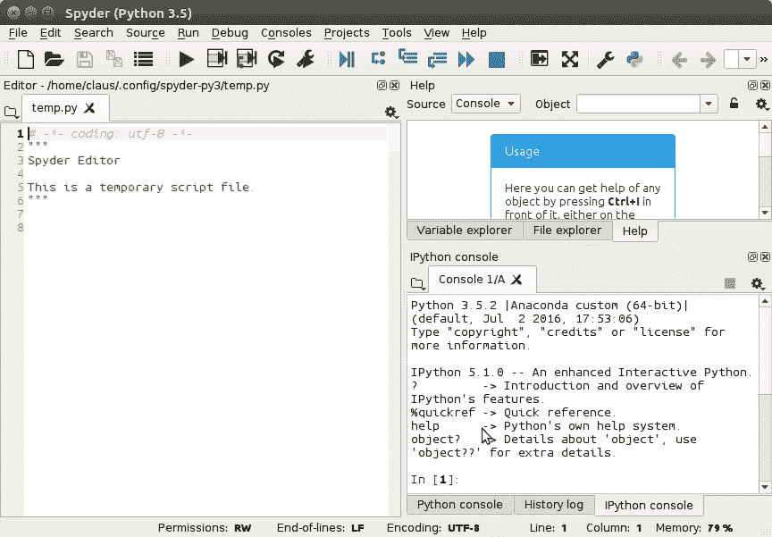
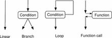
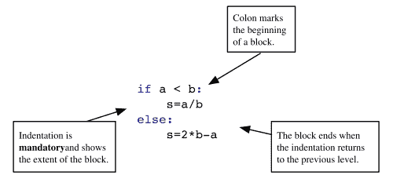
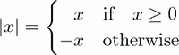
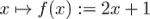
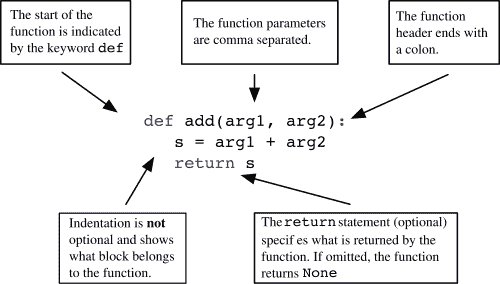

# 第一章 入门

在本章中，我们将简要介绍 Python 的主要语法元素。对于刚开始学习编程的读者，我们将通过本书引导他们。每个主题在这里都以“如何做”的方式呈现，并在本书的后续部分以更深入的概念方式解释，并丰富许多应用和扩展。

对于已经熟悉其他编程语言的读者，在本章中，他们会遇到 Python 实现经典语言结构的 Python 方式。这为他们提供了 Python 编程的快速入门。

鼓励两种类型的读者将本章作为在书中穿梭时的简要指南。然而，在我们开始之前，我们必须确保一切就绪，并且您已经安装了正确的 Python 版本，以及科学计算的主要模块和工具，例如一个好的编辑器和 Shell，这些工具有助于代码开发和测试。

即使您已经可以访问安装了 Python 的计算机，也请阅读以下章节。您可能需要调整一些设置，以便拥有一个符合本书展示的演示环境的工作环境。

# 安装和配置说明

在深入本书的主题之前，您应该在您的计算机上安装所有相关的工具。我们将为您提供一些建议，并推荐您可能想要使用的工具。我们只描述公共领域和免费工具。

## 安装

目前 Python 有两个主要版本；*2.x*分支和新的*3.x*分支。这两个分支之间存在语言不兼容性，必须注意使用哪个版本。本书基于*3.x*分支，考虑到语言版本至*3.5*。

对于本书，您需要安装以下内容：

+   解释器：Python *3.5*（或更高版本）

+   科学计算模块：SciPy 与 NumPy

+   数学结果图形表示模块：matplotlib

+   Shell：IPython

+   一个与 Python 相关的编辑器：Spyder（参见图 1.1，*Spyder*），Geany

这些软件的安装可以通过所谓的发行版软件包来简化。我们建议您使用 Anaconda。Spyder 的默认界面包括左侧的编辑窗口、位于右下角的控制台窗口，该窗口可以访问 IPython shell，以及位于右上角的帮助窗口，如图所示：



图 1.1：Spyder 的默认界面包括左侧的编辑窗口，右下角的控制台窗口，该窗口可以访问 IPython shell，以及右上角的帮助窗口。

## Anaconda

即使您的计算机上已经预装了 Python，我们也建议您创建个人 Python 环境，这样您就可以在没有风险的情况下工作，不会意外影响可能依赖于计算机功能的软件。使用虚拟环境，如 Anaconda，您可以自由更改语言版本和安装包，而不会产生意外的副作用。

如果情况最糟，您完全搞砸了，只需删除 Anaconda 目录并重新开始。运行 Anaconda 安装程序将安装 Python、Python 开发环境和编辑器（Spyder）、shell IPython 以及数值计算最重要的包，例如 SciPy、NumPy 和 matplotlib。

您可以在 Anaconda 创建的虚拟环境中使用`conda install`安装额外的包（有关官方文档，请参阅[[2]](apa.html "附录。参考文献")）。

## 配置

大多数 Python 代码都将收集在文件中。我们建议您在所有 Python 文件中使用以下标题：

```py
from scipy import *
from matplotlib.pyplot import *
```

使用这种方法，您可以确保本书中使用的所有标准模块和函数，例如 SciPy，都被导入。如果不进行此步骤，本书中的大多数示例都会引发错误。许多编辑器，如 Spyder，都提供创建文件模板的可能性。查找此功能并将前面的标题放入模板中。

## Python Shell

Python shell 虽然不错，但不是交互式脚本的理想选择。因此，我们建议使用 IPython（有关官方文档，请参阅[[26]](apa.html "附录。参考文献")）。IPython 可以通过不同的方式启动：

+   在终端 shell 中，通过运行以下命令`ipython`。

+   通过直接点击名为 Jupyter QT Console 的图标


+   当使用 Spyder 时，应使用 IPython 控制台（请参阅*图 1.1*，*Spyder*）。

## 执行脚本

您经常需要执行文件内容。根据文件在您计算机上的位置，在执行文件内容之前，您可能需要导航到正确的位置。

+   在 IPython 中使用`cd`命令来移动到文件所在的目录。

+   要执行名为`myfile.py`的文件内容，只需在 IPython shell 中运行以下命令

```py
 run myfile

```

## 获取帮助

这里有一些关于如何使用 IPython 的提示：

+   要获取对象的帮助，只需在对象名称后输入`?`然后按回车。

+   使用箭头键重复使用最后执行的命令。

+   您可以使用*Tab*键进行自动完成（即，您写下变量或方法的第一个字母，IPython 就会显示一个包含所有可能完成项的菜单）。

+   使用*Ctrl+D*退出。

+   使用 IPython 的魔术函数。您可以通过在命令提示符中应用`%magic`来找到列表和解释。

### 小贴士

您可以在 IPython 的在线文档中找到更多关于 IPython 的信息，[[15]](apa.html "附录。参考文献")*.*

## Jupyter – Python 笔记本

Jupyter 笔记本是演示您工作的绝佳工具。学生可能想用它来制作和记录作业和练习，教师也可以用它准备讲座，甚至制作幻灯片和网页。

如果您通过 Anaconda 安装了 Python，您已经拥有了 Jupyter 所需的一切。您可以在终端窗口中运行以下命令来调用笔记本：

```py
jupyter notebook

```

将会打开一个浏览器窗口，您可以通过您的网络浏览器与 Python 进行交互。

# 程序和程序流程

程序是一系列按自顶向下顺序执行的语句。这种线性执行顺序有一些重要的例外：

+   可能会执行条件语句的替代语句组（块），我们称之为分支。

+   存在重复执行的代码块，这被称为循环（参见图 1.2，程序流程）。

+   存在函数调用，它们是对其他代码段的引用，在主程序流程恢复之前执行。函数调用中断线性执行并暂停程序单元的执行，同时将控制权传递给另一个单元——一个函数。当它完成时，其控制权返回到调用单元。



图 1.2：程序流程

Python 使用特殊语法来标记语句块：一个关键字，一个冒号，以及属于该块的缩进语句序列（参见图 1.3，块命令）。



图 1.3：块命令

## 注释

如果程序中的一行包含符号 `#`，则该行后面的所有内容都被视为注释：

```py
# This is a comment of the following statement
a = 3  # ... which might get a further comment here  
```

## 行连接

行尾的反斜杠 `\` 标记下一行为续行，即显式行连接。如果行在所有括号关闭之前结束，则下一行将自动被识别为续行，即隐式行连接。

# 基本类型

让我们回顾一下您将在 Python 中遇到的几种基本数据类型。

## 数字

一个数字可能是一个整数、一个实数或一个复数。通常的操作有：

+   加法和减法，`+` 和 `-`

+   乘法和除法，`*` 和 `/`

+   幂，`**`

这里有一个例子：

```py
2 ** (2 + 2) # 16
1j ** 2 # -1
1\. + 3.0j
```

### 注意

**复数的符号**

`j` 是表示复数虚部的符号。它是一个语法元素，不应与变量的乘法混淆。有关复数的更多信息，请参阅第二章的 *数值类型* 部分，*变量和基本类型*。

## 字符串

字符串是由简单或双引号包围的字符序列：

```py
'valid string'
"string with double quotes"
"you shouldn't forget comments"
'these are double quotes: ".." '
```

您还可以使用三引号来表示多行字符串：

```py
"""This is
 a long,
 long string"""
```

## 变量

变量是对对象的引用。一个对象可能有多个引用。使用赋值运算符 `=` 将值赋给变量：

```py
x = [3, 4] # a list object is created
y = x # this object now has two labels: x and y
del x # we delete one of the labels
del y # both labels are removed: the object is deleted
```

变量的值可以通过 `print` 函数显示：

```py
x = [3, 4] # a list object is created
print(x)
```

## 列表

列表是一个非常有用的构造，也是 Python 中的基本类型之一。Python 列表是由方括号包围的有序对象列表。可以使用方括号内的零基于索引访问列表的元素：

```py
L1 = [5, 6]
L1[0] # 5
L1[1] # 6
L1[2] # raises IndexError
L2 = ['a', 1, [3, 4]]
L2[0] # 'a'
L2[2][0] # 3
L2[-1] # last element: [3,4]
L2[-2] # second to last: 1
```

元素的索引从零开始。可以在列表中放置任何类型的对象，甚至其他列表。以下是一些基本的列表函数：

+   `list(range(n))` 创建一个包含 `n` 个元素且从零开始的列表：

```py
      print(list(range(5))) # returns [0, 1, 2, 3, 4]
```

+   `len` 返回列表的长度：

```py
      len(['a', 1, 2, 34]) # returns 4
```

+   `append` 用于向列表中添加一个元素：

```py
      L = ['a', 'b', 'c']
      L[-1] # 'c'
      L.append('d')
      L # L is now ['a', 'b', 'c', 'd']
      L[-1] # 'd'
```

## 列表操作

+   运算符 `+` 连接两个列表：

    ```py
          L1 = [1, 2]
          L2 = [3, 4]
          L = L1 + L2 # [1, 2, 3, 4]
    ```

+   如预期的那样，将列表与整数相乘会将列表与自身连接多次：

    `n*L` 等同于进行 *n* 次加法操作。

    ```py
          L = [1, 2]
          3 * L # [1, 2, 1, 2, 1, 2]
    ```

## 布尔表达式

布尔表达式是一个可能具有 `True` 或 `False` 值的表达式。一些常见的产生条件表达式的运算符如下：

+   等于，`==`

+   不等于，`!=`

+   小于，小于等于，`<`，`<=`

+   大于，大于等于，`>`，`>=`

可以使用 `or` 和 `and` 将不同的布尔值组合起来。关键字 `not` 给出后续表达式的逻辑否定。比较可以链式使用，例如，`x < y < z` 等价于 `x < y and y < z`。区别在于第一个例子中 `y` 只被评估一次。在两种情况下，当第一个条件 `x < y` 评估为 `False` 时，`z` 都不会被评估：

```py
2 >= 4  # False
2 < 3 < 4 # True
2 < 3 and 3 < 2 # False
2 != 3 < 4 or False # True
2 <= 2 and 2 >= 2 # True
not 2 == 3 # True
not False or True and False # True!
```

### 注意

**优先级规则**

`<`、`>`、`<=`、`>=`、`!=` 和 `==` 运算符的优先级高于 `not`。运算符 `and`、`or` 的优先级最低。优先级高的运算符先于优先级低的运算符进行评估。

# 使用循环重复语句

循环用于在每次迭代中重复执行一系列语句，同时改变一个变量。这个变量称为索引变量。它依次赋值给列表的元素，（参考第九章，*迭代)*：

```py
L = [1, 2, 10]
for s in L:
    print(s * 2) # output: 2 4 20
```

`for` 循环中需要重复的部分必须正确缩进：

```py
for elt in my_list:
    do_something
    something_else
print("loop finished") # outside the for block
```

## 循环重复任务

`for` 循环的一个典型用途是重复执行固定次数的任务：

```py
n = 30
for iteration in range(n):
    do_something # this gets executed n times
```

## Break 和 else

`for` 语句有两个重要的关键字：`break` 和 `else`。`break` 即使迭代的列表未耗尽也会退出 `for` 循环：

```py
for x in x_values:
   if x > threshold:
     break
   print(x)
```

最终的 `else` 语句检查 `for` 循环是否被 `break` 关键字中断。如果没有被中断，则执行 `else` 关键字后面的代码块：

```py
for x in x_values:
    if x > threshold:
       break
else:
    print("all the x are below the threshold")
```

# 条件语句

本节介绍如何使用条件进行分支、中断或其他方式控制代码。条件语句定义了一个在条件为真时将执行的代码块。一个可选的块，以关键字 `else` 开头，将在条件不满足时执行（参见图 1.3，*块命令* 图）。我们通过打印 `|x|`，即 *x* 的绝对值来演示这一点：



Python 的等效操作如下：

```py
x = ...
if x >= 0:
    print(x)
else:
    print(-x)
```

任何对象都可以被测试其真值，用于 `if` 或 `while` 语句中。如何获得真值的规则在 第二章 的布尔部分中解释，*变量和基本类型*。

# 使用函数封装代码

函数对于将相似的代码片段集中在一起非常有用。考虑以下数学函数：



Python 的等效操作如下：

```py
def f(x):
    return 2*x + 1
```

在图 1.4 “函数的解剖结构”中，解释了函数块中的元素。

+   关键字 `def` 告诉 Python 我们正在定义一个函数。

+   `f` 是函数的名称。

+   `x` 是函数的参数，或输入。

+   `return` 之后的内容被称为函数的输出。



图 1.4：函数的解剖结构

函数定义后，可以使用以下代码调用它：

```py
f(2) # 5
f(1) # 3
```

# 脚本和模块

文件中的语句集合（通常具有 `py` 扩展名）被称为脚本。假设我们将以下代码的内容放入一个名为 `smartscript.py` 的文件中：

```py
def f(x):
    return 2*x + 1
z = []
for x in range(10):
    if f(x) > pi:
        z.append(x)
    else:
        z.append(-1)
print(z)
```

在 Python 或 IPython shell 中，打开并读取文件后，可以使用 `exec` 命令执行这样的脚本。将其写为单行代码，它看起来是这样的：

```py
exec(open('smartscript.py').read())
```

IPython shell 提供了魔法命令 `%run` 作为执行脚本的便捷替代方法：

```py
%run smartscript

```

## 简单模块 - 收集函数

通常会将函数收集在脚本中。这创建了一个具有额外 Python 功能的模块。为了演示这一点，我们通过在一个文件中收集函数来创建一个模块，例如 `smartfunctions.py`：

```py
def f(x):
    return 2*x + 1
def g(x):
    return x**2 + 4*x - 5
def h(x):
    return 1/f(x)
```

+   这些函数现在可以被任何外部脚本或直接在 IPython 环境中使用。

+   模块内的函数可以相互依赖。

+   将具有共同主题或目的的函数分组，可以创建可以共享和供他人使用的模块。

再次，命令 `exec(open('smartfunctions.py').read())` 使得这些函数可用于您的 IPython shell（注意，还有 IPython 的魔法函数 `run`）。在 Python 术语中，可以说它们被放入实际的命名空间中。

## 使用模块和命名空间

或者，可以使用 `import` 命令导入模块。它创建一个命名命名空间。命令 `from` 将函数放入通用命名空间：

```py
import smartfunctions
print(smartfunctions.f(2))      # 5

from smartfunctions import g    #import just this function
print(g(1)) # 0

from smartfunctions import *    #import all
print(h(2)*f(2))                # 1.0
```

### 小贴士

**导入**

命令 `import` 和 `from` 只将函数一次性导入到相应的命名空间中。导入后更改函数对当前 Python 会话没有影响。关于模块的更多信息，请参阅第十一章*命名空间、作用域和模块*中的*模块*部分。第十一章，*命名空间、作用域和模块*。

# 解释器

Python 解释器执行以下步骤：

+   首先，运行语法。

+   然后逐行执行代码。

+   函数或类声明内部的代码*不会*执行（但会检查语法）。

```py
      def f(x):
          return y**2  
      a = 3   # here both a and f are defined
```

你可以运行前面的程序，因为没有语法错误。只有在调用函数 `f` 时才会出现错误。

```py
f(2) # error, y is not defined
```

# 摘要

在本章中，我们简要介绍了 Python 的主要语言元素，而没有深入探讨。现在你应该能够开始尝试一些小段代码，并测试不同的程序结构。所有这些都是为了为以下章节做铺垫，在那些章节中，我们将提供详细信息、示例、练习以及更多背景信息。
