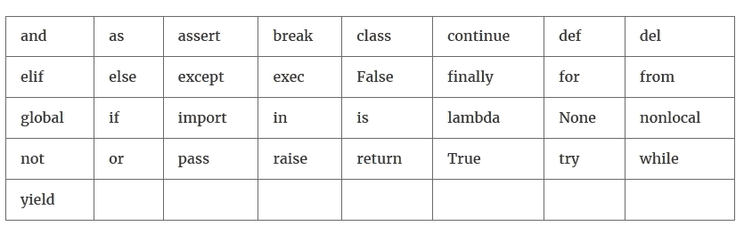
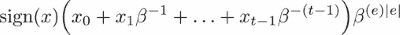
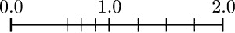
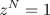
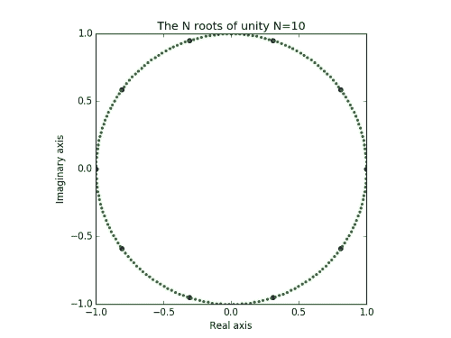
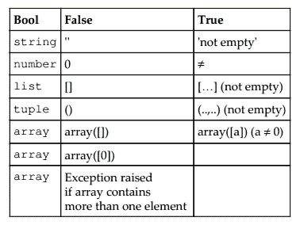
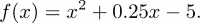
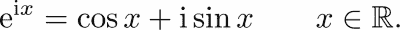
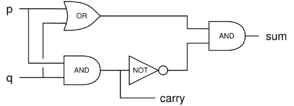
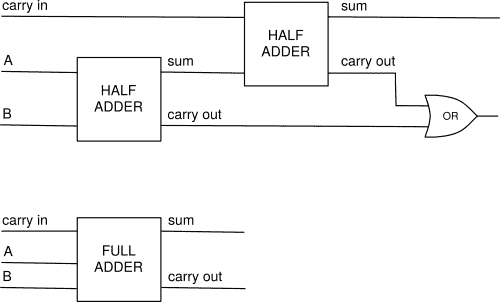

# 第二章 变量和基本类型

在本章中，我们将介绍 Python 中最重要的基本类型。什么是类型？它是一个由数据内容、其表示和所有可能的操作组成的集合。在本书的后面部分，当我们介绍第八章 类 中的类概念时，我们将对这个定义进行更精确的阐述。

# 变量

变量是 Python 对象的引用。它们通过赋值创建，例如：

```py
a = 1 
diameter = 3.
height = 5.
cylinder = [diameter, height] # reference to a list
```

变量可以由大写和小写字母、下划线 `_` 和数字的任意组合命名。变量名不能以数字开头。请注意，变量名是区分大小写的。良好的变量命名是文档化您工作的一个基本部分，因此我们建议您使用描述性的变量名。

Python 有一些 *保留关键字*，不能用作变量名（请参阅下表，*表 2.1*）。尝试将此类关键字用作变量名将引发语法错误。



表 2.1：保留的 Python 关键字。

与其他编程语言不同，变量不需要类型声明。您可以使用多个赋值语句创建多个变量：

```py
a = b = c = 1   # a, b and c get the same value 1
```

变量在其定义之后也可以被修改：

```py
a = 1 
a = a + 1 # a gets the value 2 
a = 3 * a   # a gets the value 6
```

最后两个语句可以通过直接使用增量运算符将两个操作合并为一个赋值语句来编写：

```py
a += 1  # same as a = a + 1 
a *= 3  # same as a = 3 * a
```

# 数字类型

在某个时候，您将不得不处理数字，因此我们首先考虑 Python 中不同形式的数字类型。在数学中，我们区分自然数（ℕ）、整数（ℤ）、有理数（ℚ）、实数（ℝ）和复数（ℂ）。这些都是无限数字集。这些集合之间的操作不同，甚至可能没有定义。例如，ℤ 中两个数的通常除法可能不会得到一个整数——它不在 ℤ 上定义。

在 Python 中，就像许多其他计算机语言一样，我们有数字类型：

+   数字类型 `int`，至少在理论上它是整个整数集 ℤ

+   数字类型 `float`，它是实数集 ℝ 的有限子集

+   数字类型 `complex`，它是复数集 ℂ 的有限子集

有限集有最小和最大的数字，并且两个数字之间存在最小间隔；有关更多详细信息，请参阅 *浮点表示* 部分。

## 整数

最简单的数值类型是整数类型。

### 纯整数

语句 `k = 3` 将变量 `k` 赋值为一个整数。

将类型为 `+`、`-` 或 `*` 的操作应用于整数返回一个整数。除法运算符 `//` 返回一个整数，而 `/` 可能返回一个 `float`：

```py
6 // 2  # 3
7 // 2  # 3
7 / 2   # 3.5
```

Python 中的整数集是无限的；没有最大的整数。这里的限制是计算机的内存，而不是语言给出的任何固定值。

### 小贴士

如果示例中的除法运算符 (`/`) 返回 3，您可能没有安装正确的 Python 版本。

## 浮点数

如果你执行 Python 中的语句 `a = 3.0`，你将创建一个浮点数（Python 类型：`float`）。这些数字构成了有理数集 ℚ 的一个子集。

或者，常数可以用指数表示法给出，例如 `a = 30.0e-1` 或简单地 `a = 30.e-1`。符号 `e` 将指数与尾数分开，数学表示法中表达式读作 *a = 30.0 × 10^(−1)*。名称 *浮点数* 指的是这些数字的内部表示，并反映了在考虑广泛范围内的数字时小数点的浮动位置。

将基本数学运算 `+`、`-`、`*` 和 `/` 应用于两个浮点数或一个整数和一个浮点数，返回一个浮点数。浮点数之间的操作很少返回期望的精确结果：

```py
0.4 - 0.3 # returns 0.10000000000000003
```

这个事实在比较浮点数时很重要：

```py
0.4 - 0.3 == 0.1 # returns False
```

### 浮点数表示

内部，浮点数由四个量表示：符号、尾数、指数符号和指数：



with *β* ϵ *ℕ* 和 *x[0]*≠ 0, 0 ≤ *x[i]≤ β*

*x*[0]...x[t-1] 被称为尾数，*β* 为基数，*e* 为指数 *|e| ≤ U* . *t* 被称为尾数长度。条件 *x*[0] ≠ 0 使得表示唯一，并且在二进制情况下 (*β* = 2) 节省了一个比特。

存在两个浮点零 +0 和 -0，它们都由尾数 0 表示。

在典型的英特尔处理器上，*β* = 2。为了表示 `float` 类型的数字，使用 64 位，即 2 位用于符号，*t* = 52 位用于尾数，10 位用于指数 `|e|`。因此，指数的上限 *U* 为 2¹⁰-1 *=* 102*3*。

使用这些数据，可以表示的最小正数是

fl[min] = 1.0 *×* 2^(-1023) ≈ 10^(-308) 和最大的是  fl[max] = 1.111...1 *×* 2¹⁰²³ ≈ 10³⁰⁸*.*

注意，浮点数在 [0, fl[max]] 区间内不是等间距的。特别是在零处有一个间隙（参见图 [[29]](apa.html "附录 . 参考文献")）。0 和第一个正数之间的距离是 2^(-1023)，而第一个和第二个之间的距离小一个因子 *2*^(-52)*≈ 2.2* *×* 10^(-16)。这种由规范化 *x*[0] *≠ 0* 引起的效果在 *图 2.1* 中得到了可视化。

这个间隙被等距地填充了子正常浮点数，这些结果被四舍五入到这些数。子正常浮点数具有可能的最小指数，并且不遵循首位数字 *x[0]* 必须与零不同的惯例；参见图 [[13]](apa.html "附录 . 参考文献")。

### 无穷大和非数字

总共有 个浮点数。有时数值算法会计算这个范围之外的浮点数。

这会产生数值溢出或下溢。在 SciPy 中，特殊浮点数`inf`被分配给溢出结果：

```py
exp(1000.) # inf 
a = inf
3 - a   # -inf
3 + a   # inf
```

使用`inf`可能会导致数学上未定义的结果。在 Python 中，通过将结果分配给另一个特殊浮点数`nan`来表示这一点。这代表“非数字”，即数学运算的未定义结果：

```py
a + a # inf
a - a # nan 
a / a # nan
```

对于`nan`和`inf`的操作有一些特殊规则。例如，`nan`与任何东西（甚至与自身）比较时总是返回`False`：

```py
x = nan 
x < 0 # False
x > 0 # False
x == x # False
```

请参阅*练习 4*，了解`nan`永远不会等于它自己的事实的一些令人惊讶的后果。

浮点`inf`的行为与预期更为一致：

```py
0 < inf     # True 
inf <= inf  # True 
inf == inf  # True 
-inf < inf  # True 
inf - inf   # nan 
exp(-inf)   # 0 
exp(1 / inf)  # 1
```

检查`nan`和`inf`的一种方法是用`isnan`和`isinf`函数。通常，当变量变为`nan`或`inf`时，人们希望直接做出反应。这可以通过使用 NumPy 命令`seterr`来实现。以下命令

```py
seterr(all = 'raise')
```

如果计算返回这些值之一，将引发错误。

### 下溢 - 计算机 epsilon

当一个操作的结果是一个落在零间隙中的有理数时，会发生下溢；参见图 2.1。



图 2.1：零处的浮点间隙，此处 t = 3，U = 1

*机器 epsilon*或舍入单位是最大的数*ε*，使得 float(*1.0 *+ ε) =* 1.0。

注意，*ε* ≈ *β*^(1-t)/2 = 1.1102 × 10^(-16)在大多数今天的计算机上。您在机器上运行的代码的有效值可以通过以下命令访问：

```py
import sys 
sys.float_info.epsilon # 2.220446049250313e-16 (something like that)
```

变量`sys.float_info`包含了关于您机器上浮点类型内部表示的更多信息。

函数`float`将其他类型转换为浮点数（如果可能）。当将适当的字符串转换为数字时，此函数特别有用：

```py
a = float('1.356')
```

### NumPy 中的其他浮点类型

NumPy 还提供了其他浮点类型，在其他编程语言中称为双精度和单精度数字，即`float64`和`float32`：

```py
a = pi            # returns 3.141592653589793 
a1 = float64(a)   # returns 3.1415926535897931 
a2 = float32(a)   # returns 3.1415927 
a - a1            # returns 0.0 
a - a2            # returns -8.7422780126189537e-08
```

最后一行展示了`a`和`a1`在精度上没有差异。在前两行中，它们只是显示方式不同。精度上的真正差异在于`a`和它的单精度对应物`a2`之间。

NumPy 函数`finfo`可以用来显示这些浮点类型的信息：

```py
f32 = finfo(float32) 
f32.precision   # 6 (decimal digits) 
f64 = finfo(float64) 
f64.precision   # 15 (decimal digits) 
f = finfo(float) 
f.precision     # 15 (decimal digits) 
f64.max         # 1.7976931348623157e+308 (largest number) 
f32.max         # 3.4028235e+38 (largest number) 
help(finfo)     # Check for more options
```

## 复数

复数是实数的扩展，在许多科学和工程领域中经常使用。

### 数学中的复数

复数由两个浮点数组成，即数的实部*a*和它的虚部*b*。在数学中，复数写作*z=a+b*i，其中 i 定义为 i*² =* -1 是虚数单位。*z*的共轭复数对应物为。

如果实部*a*为零，则该数被称为虚数。

### j 表示法

在 Python 中，虚数通过在浮点数后附加字母`j`来表示，例如，`z = 5.2j`。复数是通过浮点数和虚数的和形成的，例如，`z = 3.5 + 5.2j`。

虽然在数学中，虚部表示为实数*b*与虚数单位 i 的乘积，但 Python 表示虚数的方式不是乘积：`j`只是一个后缀，表示该数是虚数。

这可以通过以下小型实验来演示：

```py
b = 5.2 
z = bj   # returns a NameError 
z = b*j  # returns a NameError
z = b*1j # is correct
```

`conjugate`方法返回`z`的共轭：

```py
z = 3.2 + 5.2j 
z.conjugate() # returns (3.2-5.2j)
```

### 实部和虚部

可以使用`real`和`imag`属性访问复数*z*的实部和虚部。这些属性是只读的：

```py
z = 1j 
z.real       # 0.0 
z.imag       # 1.0 
z.imag = 2   # AttributeError: readonly attribute
```

无法将复数转换为实数：

```py
z = 1 + 0j 
z == 1     # True 
float(z)   # TypeError
```

有趣的是，`real`和`imag`属性以及共轭方法对复数数组*(第四章，*线性代数 - 数组)*同样有效。我们通过计算单位根的*N*次方来演示这一点，即方程的*N*个解：

```py
N = 10
# the following vector contains the Nth roots of unity: 
unity_roots = array([exp(1j*2*pi*k/N) for k in range(N)])
# access all the real or imaginary parts with real or imag:
axes(aspect='equal')
plot(unity_roots.real, unity_roots.imag, 'o')
allclose(unity_roots**N, 1) # True
```

结果图（*图 2.2*）显示了单位圆上的单位根。 (有关如何制作图表的更多详细信息，请参阅第六章，*绘图*）



图 2.2：单位根与单位圆一起

当然，可以混合使用之前的方法，如下面的示例所示：

```py
z = 3.2+5.2j 
(z + z.conjugate()) / 2\.   # returns (3.2+0j) 
((z + z.conjugate()) / 2.).real   # returns 3.2 
(z - z.conjugate()) / 2\.   # returns 5.2j 
((z - z.conjugate()) / 2.).imag   # returns 5.2 
sqrt(z * z.conjugate())   # returns (6.1057350089894991+0j)
```

# 布尔值

布尔值是一种以*乔治·布尔*（1815-1864）命名的数据类型。布尔变量只能取两个值，`True`或`False`。这种类型的主要用途是在逻辑表达式中。以下是一些示例：

```py
a = True 
b = 30 > 45   # b gets the value False
```

布尔表达式通常与`if`语句一起使用：

```py
if x > 0:
   print("positive")
else:
   print("nonpositive)
```

## 布尔运算符

在 Python 中，布尔运算使用`and`、`or`和`not`关键字执行：

```py
True and False # False
False or True # True
(30 > 45) or (27 < 30) # True
not True # False
not (3 > 4) # True
```

运算符遵循一些优先级规则（请参阅第一章中的*执行脚本*部分，*入门*），这将使第三行和最后一行的括号变得多余（尽管如此，使用它们来提高代码的可读性仍然是一个好习惯）。请注意，`and`运算符在以下布尔表达式中是隐式链式的：

```py
a < b < c     # same as: a < b and b < c 
a == b == c   # same as: a == b and b == c
```

转换为布尔值的规则：



表 2.2：转换为布尔值的规则

## 布尔类型转换

Python 中的大多数对象都可以转换为布尔值；这被称为*布尔类型转换*。内置函数`bool`执行这种转换。请注意，大多数对象都转换为`True`，除了`0`、空元组、空列表、空字符串或空数组。这些都被转换为`False`。

将数组转换为布尔值是不可能的，除非它们不包含任何元素或只包含一个元素；这将在第五章中进一步解释，*高级数组概念*。前一个表格包含了布尔转换的总结性规则。一些用法示例：

```py
bool([])   # False 
bool(0)   # False 
bool(' ')   # True 
bool('')   # False 
bool('hello')   # True 
bool(1.2)   # True 
bool(array([1]))   # True 
bool(array([1,2]))   # Exception raised!
```

## 自动布尔转换

使用非布尔类型的`if`语句将将其转换为布尔值。换句话说，以下两个语句始终等价：

```py
if a:
   ...
if bool(a): # exactly the same as above
   ...
```

一个典型的例子是测试列表是否为空：

```py
# L is a list
if L:
    print("list not empty")
else:
    print("list is empty")
```

空数组、列表或元组将返回`False`。您也可以在`if`语句中使用变量，例如，一个整数：

```py
# n is an integer
if n % 2:
    print("n is odd")
else:
    print("n is even")
```

注意，我们使用了`%`进行取模运算，它返回整数除法的余数。在这种情况下，它返回`0`或`1`作为取模`2`后的余数。

在这个最后的例子中，值`0`或`1`被转换为`bool`。布尔运算符`or`、`and`和`not`也会隐式地将它们的某些参数转换为布尔值。

## `and`和`or`的返回值

注意，运算符`and`和`or`不一定产生布尔值。表达式`*x* and *y*`等同于：

```py
def and_as_function(x,y):
    if not x:
        return x
    else:
        return y
```

并且表达式`x or y`等同于：

```py
def or_as_function(x,y):
    if x:
        return x
    else:
        return y
```

有趣的是，这意味着在执行`True or x`语句时，变量`x`甚至不需要定义！对于`False and x`也是同样的情况。

注意，与数学逻辑中的对应运算符不同，这些运算符在 Python 中不再是交换的。确实，以下表达式并不等价：

```py
[1] or 'a' # produces [1] 
'a' or [1] # produces 'a'
```

## 布尔值和整数

事实上，布尔值和整数是相同的。唯一的区别在于 0 和 1 的字符串表示，在布尔值中分别是`False`和`True`。这允许构建如下（有关格式化方法，请参阅*字符串格式化*部分）：

```py
def print_ispositive(x):
    possibilities = ['nonpositive', 'positive']
    return "x is {}".format(possibilities[x>0])
```

我们注意到，对于已经熟悉子类概念的读者，类型`bool`是类型`int`的子类（请参阅第八章，*类*）。实际上，所有四个查询`isinstance(True, bool)`、`isinstance(False, bool)`、`isinstance(True, int)`和`isinstance(False, int)`都返回值`True`（请参阅第三章，*容器类型*中的*类型检查*部分）。

即使很少使用的语句，如`True+13`，也是语法正确的。

# 字符串

`string`类型是用于文本的类型：

```py
name = 'Johan Carlsson'
child = "Åsa is Johan Carlsson's daughter"
book = """Aunt Julia 
       and the Scriptwriter"""
```

字符串由单引号或双引号包围。如果字符串包含多行，它必须由三个双引号`"""`或三个单引号`'''`包围。

字符串可以使用简单索引或切片进行索引（有关切片的全面解释，请参阅第三章，*容器类型*）：

```py
book[-1] # returns 'r' 
book[-12:] # returns 'Scriptwriter'
```

字符串是不可变的；也就是说，项目不能被更改。它们与元组共享这个属性。命令**`book[1] = 'a'`**返回：

```py
TypeError: 'str' object does not support item assignment
```

字符串 `'\n'` 用于插入换行符，而 `'t'` 将水平制表符（TAB）插入字符串以对齐多行：

```py
print('Temperature:\t20\tC\nPressure:\t5\tPa')
```

这些字符串是转义序列的例子。转义序列始终以反斜杠 `\` 开头。多行字符串自动包含转义序列：

```py
a=""" 
A multiline 
example""" 
a #  returns '\nA multiline \nexample'
```

特殊转义序列是 `""`，它代表文本中的反斜杠符号：

```py
latexfontsize="\\tiny"
```

使用原始字符串也可以达到相同的效果：

```py
latexfs=r"\tiny"   # returns "\tiny"
latexfontsize == latexfs  # returns True
```

注意，在原始字符串中，反斜杠仍然保留在字符串中，并用于转义一些特殊字符：

```py
r"\"\"   # returns  '\\"'
r"\\"   # returns  '\\\\'
r"\"    # returns an error
```

## 字符串操作和字符串方法

字符串的相加意味着连接：

```py
last_name = 'Carlsson'
first_name = 'Johanna'
full_name = first_name + ' ' + last_name
                              # returns 'Johanna Carlsson'
```

乘法只是重复加法：

```py
game = 2 * 'Yo' # returns 'YoYo'
```

当比较字符串时，使用字典序，大写字母形式排在相同字母的小写字母形式之前：

```py
'Anna' > 'Arvi' # returns false 
'ANNA' < 'anna'  # returns true 
'10B' < '11A'    # returns true
```

在众多字符串方法中，我们在此仅提及最重要的几个：

+   **分割字符串**：此方法通过使用单个或多个空格作为分隔符，从一个字符串生成一个列表。或者，可以通过指定一个特定的字符串作为分隔符来提供一个参数：

    ```py
          text = 'quod erat    demonstrandum'
          text.split() # returns ['quod', 'erat', 'demonstrandum']
          table = 'Johan;Carlsson;19890327'
          table.split(';') # returns ['Johan','Carlsson','19890327']
          king = 'CarlXVIGustaf'
          king.split('XVI')  # returns ['Carl','Gustaf']

    ```

+   **将列表连接到字符串**：这是分割操作的逆操作：

    ```py
          sep = ';'
          sep.join(['Johan','Carlsson','19890327']) 
          # returns 'Johan;Carlsson;19890327'

    ```

+   **在字符串中搜索**：此方法返回给定搜索子字符串在字符串中开始的第一个索引：

    ```py
          birthday = '20101210'
          birthday.find('10') # returns 2 
    ```

    如果搜索字符串未找到，该方法返回的值是 -1 。

### 字符串格式化

使用 `format` 方法进行字符串格式化：

```py
course_code = "NUMA21"
print("This course's name is {}".format(course_code)) 
# This course's name is NUMA21
```

`format` 函数是一个字符串方法；它扫描字符串以查找占位符的出现，这些占位符由大括号包围。这些占位符会根据格式方法参数指定的方式被替换。它们是如何被替换的取决于每个 `{}` 对中的格式规范。格式规范由冒号 `:` 作为其前缀指示。

格式方法提供了一系列可能性，可以根据对象的类型自定义其格式化。在科学计算中，特别有用的是 `float` 类型的格式规范。可以选择使用带有 `{:f}` 的标准格式或带有 `{:e}` 的指数表示法：

```py
quantity = 33.45
print("{:f}".format(quantity)) # 33.450000
print("{:1.1f}".format(quantity)) # 33.5
print("{:.2e}".format(quantity)) # 3.35e+01
```

格式规范允许指定舍入精度（小数点后的数字表示）。还可以设置表示数字时包括前导空格在内的总符号数。

在此示例中，获取其值插入的对象的名称作为格式方法的参数给出。第一个 `{}` 对被第一个参数替换，后续对由后续参数替换。或者，也可以方便地使用键值语法：

```py
print("{name} {value:.1f}".format(name="quantity",value=quantity))
# prints "quantity 33.5"
```

在这里，处理了两个值，一个没有格式说明符的字符串 `name` 和一个以小数点后一位固定点表示法打印的浮点数 `value`。（有关字符串格式化的详细信息，请参阅完整的参考文档 [[34]](apa.html "附录。参考文献")）。

### 提示

**字符串中的大括号**

有时，一个字符串可能包含一对大括号，不应将其视为 `format` 方法的占位符。在这种情况下，使用双大括号：

`r"我们 {} 在 LaTeX \begin{{equation}}".format('喜欢')`

这返回以下字符串： `'我们喜欢在 LaTeX \\begin{equation}'`。

# 概述

在本章中，你遇到了 Python 中的基本数据类型，并看到了相应的语法元素。我们将主要使用数值类型，如整数、浮点数和复数。

布尔值用于设置条件，并且通过使用字符串，我们通常传达结果和消息。

# 练习

**例 1 **→ 检查函数的零点 *x =* 2.3：



**例 2→** 根据棣莫弗公式，以下成立：


选择数字 *n* 和 *x* 并在 Python 中验证该公式。

**例 3→** 复数。以相同的方式验证欧拉公式：



**例 4→** 假设我们正在尝试检查一个发散序列的收敛性（这里序列由递归关系 *u[n]*[+1]= 2*u[n]* 和 u[0] = 1.0 定义）：

```py
u = 1.0 # you have to use a float here!
uold = 10\. 
for iteration in range(2000):
    if not abs(u-uold) > 1.e-8:
         print('Convergence')
         break # sequence has converged
    uold = u
    u = 2*u
else:
    print('No convergence')
```

1.  由于序列没有收敛，代码应该打印出 `没有收敛` 的消息。执行它以查看会发生什么。

1.  如果你将以下行替换掉会发生什么：

    ```py
          if not abs(u-uold) > 1.e-8
    ```

    使用：

    ```py
          if abs(u-uold) < 1.e-8
    ```

    它应该给出完全相同的结果，不是吗？再次运行代码以查看会发生什么。

1.  如果你将 *u=1.0* 替换为 *u=1*（不带小数点）。运行代码以检查你的预测。

1.  解释这个代码的意外行为。理解发生的关键是 `inf` 评估为 `nan`，并且 `nan` 与任何其他东西的比较总是返回值 `False` 。

**例 5→** 蕴含 *C = (A ⇒ B)* 是一个布尔表达式，定义为

+   *C* 为 `True` 当 *A* 为 `False` 或 *A* 和 *B* 都为 `True`

+   *C* 否则 `False`

    编写一个 Python 函数 `implication(A, B)`。

**例 6→** 这个练习是为了训练布尔运算。使用一个称为**半加器**的逻辑设备将两个二进制位（比特）相加。它产生一个进位位（下一个更高值的数字）和以下表格中定义的和，以及半加器电路。

| **p** | **q** | **和** | **进位** |
| --- | --- | --- | --- |
| 1 | 1 | 0 | 1 |
| 1 | 0 | 1 | 0 |
| 0 | 1 | 1 | 0 |
| 0 | 0 | 0 | 0 |

半加器操作的定义



图 2.3：半加器电路

全加器由两个半加器组成，它将两个位和一个额外的进位位相加（参见图以下）：



图 2.4：全加器电路

编写一个实现半加器的函数，另一个实现全加器的函数。测试这些函数。
