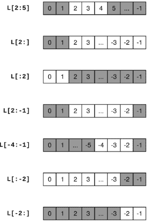
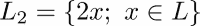
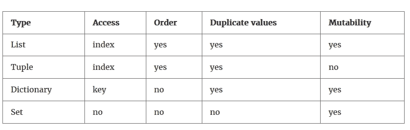
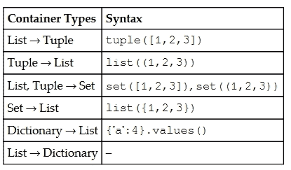
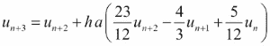

# 第三章。容器类型

容器类型用于将对象分组在一起。不同容器类型之间的主要区别在于访问单个元素的方式以及定义操作的方式。

# 列表

列表，正如其名所示，是任何类型对象的列表：

```py
L = ['a' 20.0, 5]
M = [3,['a', -3.0, 5]]
```

通过将每个元素分配一个索引来枚举单个对象。列表中的第一个元素得到索引 0。这种基于零的索引在数学符号中经常使用。考虑多项式系数的常规索引。

索引使我们能够访问以下对象：

```py
L[1] # returns 20.0
L[0] # returns 'a'
M[1] # returns ['a',-3.0,5]
M[1][2] # returns 5
```

这里的括号表示法对应于数学公式中下标的用法。`L` 是一个简单的列表，而 `M` 本身包含一个列表，因此需要两个索引来访问内部列表的元素。

可以通过命令 `range` 轻松生成包含连续整数的列表：

```py
L=list(range(4)) # generates a list with four elements: [0, 1, 2 ,3]
```

更通用的用法是向此命令提供起始、停止和步长参数：

```py
L=list(range(17,29,4)) # generates [17, 21, 25]
```

命令 `len` 返回列表的长度：

```py
len(L) # returns 3
```

## 切片

在 `i` 和 `j` 之间切片列表会创建一个新列表，该列表包含从 `index i` 开始到 `j` 前结束的元素。

对于切片，必须给出一个索引范围。`L[i:j]` 表示通过从 `L` 中取 `L[i]` 开始直到 `L[j-1]` 的所有元素来创建一个列表。换句话说，新列表是通过从 `L` 中移除前 `i` 个元素并取下一个 `j-i` 个元素（对于 *j* > *i* ≥ 0）获得的。请参阅以下图（*图 3.1*）以获取更多示例：



图 3.1：一些典型的切片情况

在这里，`L[i:]` 表示移除前 *i* 个元素，`L[:i]` 表示只取前 *i* 个元素，同样地，`L[:-i]` 表示移除最后 *i* 个元素，而 `L[-i:]` 表示只取最后 *i* 个元素。这可以组合成 `L[i:-j]` 来移除前 *i* 个和最后 *j* 个元素：

```py
L = ['C', 'l', 'o', 'u', 'd', 's']
L[1:5] # remove one element and take four from there:
# returns ['l', 'o', 'u', 'd']
```

可以省略范围中的第一个或最后一个边界：

```py
L = ['C', 'l', 'o', 'u','d', 's']
L[1:] # ['l', 'o', 'u', 'd','s']
L[:5] # ['C', 'l', 'o','u','d']
L[:] # the entire list
```

Python 允许使用负索引从右侧计数。特别是，元素 `L[-1]` 是列表 `L` 中的最后一个元素。

一些列表索引描述：

+   `L[i:]` 等同于取除了前 *i* 个元素之外的所有元素

+   `L[:i]` 等同于取前 *i* 个元素

+   `L[-i:]` 等同于取最后 *i* 个元素

+   `L[:-i]` 等同于取除了最后 *i* 个元素之外的所有元素

这里有一个例子：

```py
L = ['C', 'l', 'o', 'u', 'd', 's']
L[-2:] # ['d', 's']
L[:-2] # ['C', 'l', 'o','u']
```

在范围中省略一个索引对应于实数域中的半开区间。半开区间 (∞, *a*) 表示，取所有严格小于 *a* 的数；这与语法 `L[:j]` 类似。

### 注意

**越界切片**

注意，你永远不会在越界切片时得到索引错误。可能，你可能会获得空列表。

这里有一个例子：

```py
L = list(range(4)) # [0, 1, 2, 3]
L[4] # IndexError: list index out of range
L[1:100] # same as L[1:]
L[-100:-1] # same as L[:-1]
L[-100:100] # same as L[:]
L[5:0] # empty list []
L[-2:2] # empty list []
```

当使用可能变为负数的变量进行索引时，请小心，因为这会完全改变切片。这可能会导致意外结果：

```py
a = [1,2,3]
 for iteration in range(4): 
     print(sum(a[0:iteration-1]))
```

结果是 `3`，`0`，`1`，`3`，而预期的是 `0`，`0`，`1`，`3`。

## 步长

在计算切片时，也可以指定步长，即从一个索引到另一个索引的步长长度。默认步长为 1。以下是一个示例：

```py
L = list(range(100))
L[:10:2] # [0, 2, 4, 6, 8]
L[::20] # [0, 20, 40, 60, 80]
L[10:20:3] # [10, 13, 16, 19]
```

注意步长也可以是负数：

```py
L[20:10:-3] # [20, 17, 14, 11]
```

也可以使用负步长创建一个新的反转列表，使用负步长（在 *原地操作* 部分查找关于反转方法的更多信息）：

```py
L = [1, 2, 3]
R = L[::-1] # L is not modified
R # [3, 2, 1]
```

## 修改列表

列表的典型操作是元素的插入和删除以及列表连接。使用切片表示法，列表的插入和删除变得明显；删除就是用一个空列表 `[]` 替换列表的一部分：

```py
L = ['a', 1, 2, 3, 4]
L[2:3] = [] # ['a', 1, 3, 4]
L[3:] = [] # ['a', 1, 3]
```

插入意味着用一个要插入的列表替换一个空的切片：

```py
L[1:1] = [1000, 2000] # ['a', 1000, 2000, 1, 3]
```

两个列表可以通过加号运算符 `+` 连接：

```py
L = [1, -17]
M = [-23.5, 18.3, 5.0]
L + M # gives [1, -17, 23.5, 18.3, 5.0]
```

将列表 `n` 次与自身连接，促使使用乘号运算符 `*`：

```py
n = 3
n * [1.,17,3] # gives [1., 17, 3, 1., 17, 3, 1., 17, 3]
[0] * 5 # gives [0,0,0,0,0]
```

列表上没有算术运算，例如逐元素求和或除法。对于此类运算，我们使用数组（请参考 *数组* 部分）。

## 属于列表

可以使用关键字 `in` 和 `not in` 来确定一个元素是否属于列表，这与数学中的  和  类似：

```py
L = ['a', 1, 'b', 2]
'a' in L # True
3 in L # False
4 not in L # True
```

## 列表方法

以下表格 3.1 收集了 `list` 类型的几个有用方法：

| **命令** | **操作** |
| --- | --- |
| `list.append(x)` | 将元素 `x` 添加到列表的末尾。 |
| `list.expand(L)` | 通过列表 `L` 的元素扩展列表。 |
| `list.insert(i,x)` | 在位置 `i` 插入元素 `x`。 |
| `list.remove(x)` | 移除列表中第一个值为 `x` 的元素。 |
| `list.count(x)` | `x` 在列表中出现的次数。 |
| `list.sort()` | 在原地对列表的元素进行排序。 |
| `list.reverse()` | 在原地反转列表的元素。 |
| `list.pop()` | 在原地移除列表的最后一个元素。 |

表 3.1：列表数据类型的方法

列表方法有两种行为方式：

+   他们可以直接修改列表，即原地操作。

+   它们会生成一个新对象。

## 原地操作

所有导致生成新列表的方法都是原地操作方法，例如 `reverse`：

```py
L = [1, 2, 3]
L.reverse() # the list
L is now reversed
L # [3, 2, 1]
```

注意原地操作。有人可能会想写：

```py
L=[3, 4, 4, 5]
newL = L.sort()
```

这段代码是正确的 Python 代码。但它可能导致变量 `newL` 中的 `L` 发生意外交替，其值为 `None`。原因是 `sort` 是原地操作。

这里我们演示原地操作方法：

```py
L = [0, 1, 2, 3, 4]
L.append(5) # [0, 1, 2, 3, 4, 5]
L.reverse() # [5, 4, 3, 2, 1, 0]
L.sort() # [0, 1, 2, 3, 4, 5]
L.remove(0) # [1, 2, 3, 4, 5]
L.pop() # [1, 2, 3, 4]
L.pop() # [1, 2, 3]
L.extend(['a','b','c']) # [1, 2, 3, 'a', 'b', 'c']
```

`L` 被修改。`count` 方法是一个生成新对象的示例：

```py
L.count(2) # returns 1
```

## 列表合并 – zip

列表的一个特别有用的函数是 `zip`。它可以将两个给定的列表合并成一个新的列表，通过配对原始列表的元素。结果是元组列表（更多信息请参考 *元组* 部分）：

```py
ind = [0,1,2,3,4]
color = ["red", "green", "blue", "alpha"]
list(zip(color,ind)) # gives [('red', 0), ('green', 1), 
                                          ('blue', 2), ('alpha', 3)]
```

这个例子还演示了如果列表长度不同会发生什么。合并后的列表长度是两个输入列表中较短的那个。`zip` 创建了一个特殊的可迭代对象，可以通过应用 `list` 函数将其转换为列表，就像前面的例子一样。更多信息请参考第九章中 *迭代器* 部分 Chapter 9，*迭代*。

## 列表推导式

通过使用列表推导式构造列表是一种方便的方法，可能包含一个条件。列表推导式的语法是：

```py
[<expr> for <variable> in <list>]
```

或者更普遍地：

```py
[<expr> for <variable> in <list> if <condition>]
```

这里有一个例子：

```py
L = [2, 3, 10, 1, 5]
L2 = [x*2 for x in L] # [4, 6, 20, 2, 10]
L3 = [x*2 for x in L if 4 < x <= 10] # [20, 10]
```

在列表推导式中可以包含多个 `for` 循环：

```py
M = [[1,2,3],[4,5,6]]
flat = [M[i][j] for i in range(2) for j in range(3)] 
# returns [1, 2, 3, 4, 5, 6]
```

在处理数组时，这一点尤其有趣。

### 小贴士

**集合表示法**

列表推导式与集合的数学表示法密切相关。比较： 和 `L2 = [2*x for x in L]`。

尽管有一个很大的不同，那就是列表是有序的，而集合不是（更多信息请参考 *集合* 部分）。

# 数组

NumPy 包提供了数组，它是用于在数学中操作向量、矩阵甚至更高阶张量的容器结构。在本节中，我们指出数组与列表之间的相似性。但数组需要更广泛的介绍，这将在第四章 Chapter 4，*线性代数 – 数组* 和第五章 Chapter 5，*高级数组概念* 中给出。

数组是通过 `array` 函数从列表构建的：

```py
v = array([1.,2.,3.])
A = array([[1.,2.,3.],[4.,5.,6.]])
```

要访问向量的一个元素，我们需要一个索引，而矩阵的元素通过两个索引来定位：

```py
v[2]     # returns 3.0
A[1,2]   # returns 6.0
```

乍一看，数组与列表相似，但要注意它们在本质上有所不同，这可以通过以下几点来解释：

+   访问数组数据与列表的访问方式相对应，使用方括号和切片。它们也可以用来修改数组：

    ```py
            M = array([[1.,2.],[3.,4.]])
            v = array([1., 2., 3.])
            v[0] # 1
            v[:2] # array([1.,2.])
            M[0,1] # 2
            v[:2] = [10, 20] # v is now array([10., 20., 3.])
    ```

+   向量的元素数量或矩阵的行数可以通过 `len` 函数获得：

    ```py
            len(v) # 3
    ```

+   数组只存储相同数值类型的元素（通常是 `float` 或 `complex`，但也包括 `int`）。更多信息请参考第四章中 *数组属性* 部分 Chapter 4，*线性代数 – 数组*。

+   操作 `+`、`*`、`/` 和 `-` 都是逐元素操作。`dot` 函数和 Python 3.5 及以上版本中的中缀运算符 `@` 用于标量积和相应的矩阵运算。

+   与列表不同，数组没有 `append` 方法。尽管如此，有一些特殊方法可以通过堆叠更小的数组来构建数组（更多信息请参考第四章中 *堆叠* 部分 Chapter 4，*线性代数 - 数组*）。相关的一点是，数组不像列表那样具有弹性；不能使用切片来改变它们的长度。

+   向量切片是视图；也就是说，它们可以用来修改原始数组。有关更多信息，请参阅第五章中的*数组视图和副本*部分 第五章，*高级数组概念*。

# 元组

元组是不可变列表。不可变意味着它不能被修改。元组只是对象（没有括号的列表）的逗号分隔序列。为了提高可读性，人们经常将元组括在一对括号中：

```py
my_tuple = 1, 2, 3     # our first tuple
my_tuple = (1, 2, 3)   # the same
my_tuple = 1, 2, 3,    # again the same
len(my_tuple) # 3, same as for lists
my_tuple[0] = 'a'   # error! tuples are immutable
```

逗号表示该对象是一个元组：

```py
singleton = 1,   # note the comma
len(singleton)   # 1
```

当一组值需要一起使用时，元组很有用；例如，它们用于从函数中返回多个值（请参阅第七章中的*返回值*部分 第七章，*函数*。可以通过展开列表或元组一次分配多个变量）。

```py
a, b = 0, 1 # a gets 0 and b gets 1
a, b = [0, 1] # exactly the same effect
(a, b) = 0, 1 # same
[a,b] = [0,1] # same thing
```

### 小贴士

**交换技巧**

使用打包和拆包来交换两个变量的内容：`a, b = b, a`

总结如下：

+   元组不过是不可变列表，没有括号的表示法。

+   在大多数情况下，可以使用列表代替元组。

+   无括号的表示法很方便，但也很危险。当你不确定时，应该使用括号：

```py
      a, b = b, a # the swap trick; equivalent to:
      (a, b) = (b, a)
      # but
      1, 2 == 3, 4 # returns (1, False, 4) 
      (1, 2) == (3, 4) # returns False
```

# 字典

列表、元组和数组是有序对象集合。根据它们在列表中的位置插入、访问和处理单个对象。另一方面，字典是无序的键值对集合。通过键访问字典数据。

## 创建和修改字典

例如，我们可以创建一个包含力学中刚体数据的字典，如下所示：

```py
truck_wheel = {'name':'wheel','mass':5.7,
               'Ix':20.0,'Iy':1.,'Iz':17.,
               'center of mass':[0.,0.,0.]}
```

键/数据对由冒号 `:` 表示。这些对由逗号分隔，并放在一对花括号 `{}` 内。

通过键访问单个元素：

```py
truck_wheel['name']   # returns 'wheel'
truck_wheel['mass']   # returns 5.7
```

通过创建新的键向字典中添加新对象：

```py
truck_wheel['Ixy'] = 0.0
```

字典也用于向函数提供参数（有关更多信息，请参阅第七章中的*参数和参数*部分 第七章，*函数*）。字典中的键可以是字符串、函数、包含不可变元素的元组以及类。键不能是列表或数组。`dict` 命令可以从键值对列表生成字典：

```py
truck_wheel = dict([('name','wheel'),('mass',5.7),('Ix',20.0), 
                    ('Iy',1.), ('Iz',17.), 
                    ('center of mass',[0.,0.,0.])])
```

在这个上下文中，`zip` 函数可能很有用（请参阅*合并列表*部分）。

## 遍历字典

遍历字典主要有三种方式：

+   通过键：

```py
        for key in truck_wheel.keys():
            print(key) # prints (in any order) 'Ix', 'Iy', 'name',...
```

或者等价地：

```py
        for key in truck_wheel:
            print(key) # prints (in any order) 'Ix', 'Iy', 'name',...
```

+   通过值：

```py
        for value in truck_wheel.value():
            print(value) 
               # prints (in any order) 1.0, 20.0, 17.0, 'wheel', ...
```

+   通过项，即键/值对：

```py
        for item in truck_wheel.items():
            print(item) 
               # prints (in any order) ('Iy', 1.0), ('Ix, 20.0),...
```

请参考第十二章中的*书架*部分 第十二章，*输入和输出*，以了解用于文件访问的特殊字典对象。

# 集合

集合是具有数学集合属性和操作的容器。数学集合是一组不同的对象。以下是一些数学集合表达式：


以及它们的 Python 对应物：

```py
A = {1,2,3,4}
B = {5}
C = A.union(B)   # returns set([1,2,3,4,5])
D = A.intersection(C)   # returns set([1,2,3,4])
E = C.difference(A)   # returns set([5])
5 in C   # returns True
```

集合只包含一个元素，对应上述定义：

```py
A = {1,2,3,3,3}
B = {1,2,3}
A == B # returns True
```

并且集合是无序的；也就是说，集合中元素的顺序没有定义：

```py
A = {1,2,3}
B = {1,3,2}
A == B # returns True
```

Python 中的集合可以包含所有类型的可哈希对象，即数值对象、字符串和布尔值。

有`union`和`intersection`方法：

```py
A={1,2,3,4}
A.union({5})
A.intersection({2,4,6}) # returns set([2, 4])
```

此外，可以使用`issubset`和`issuperset`方法进行比较：

```py
{2,4}.issubset({1,2,3,4,5}) # returns True
{1,2,3,4,5}.issuperset({2,4}) # returns True
```

### 小贴士

**空集**

在 Python 中，空集是通过`empty_set=set([])`定义的，而不是通过`{}`，后者会定义一个空字典！

# 容器转换

我们在以下*表 3.2*中总结了迄今为止所展示的容器类型的最重要属性。数组将在第四章，“线性代数 - 数组”中处理。



表 3.2：容器类型

如前表所示，访问容器元素存在差异，集合和字典是无序的。

由于各种容器类型的不同特性，我们经常将一种类型转换为另一种类型：



# 类型检查

查看变量类型的直接方法是使用`type`命令：

```py
label = 'local error'
type(label) # returns str
x = [1, 2] # list
type(x) # returns list
```

然而，如果你想测试一个变量是否为特定类型，你应该使用`isinstance`（而不是使用`type`比较类型）：

```py
isinstance(x, list) # True
```

使用`isinstance`的原因在阅读了第八章、“类”以及第八章中“子类化和继承”部分（第八章，“类”）的概念后变得明显。简而言之，不同类型通常与一些基本类型共享一些共同属性。经典的例子是类型`bool`，它是通过从更通用的类型`int`中子类化得到的。在这种情况下，我们看到如何更通用地使用`isinstance`命令：

```py
test = True
isinstance(test, bool) # True
isinstance(test, int) # True
type(test) == int # False
type(test) == bool # True
```

因此，为了确保变量`test`尽可能像一个整数（特定的类型可能无关紧要），你应该检查它是否是`integer`的实例：

```py
if isinstance(test, int):
    print("The variable is an integer")
```

### 注意

**类型检查**

Python 不是一种类型语言。这意味着对象是通过它们能做什么来识别的，而不是它们是什么。例如，如果你有一个通过使用`len`方法对对象进行操作的字符串处理函数，那么你的函数可能对任何实现该方法的对象都很有用。

到目前为止，我们已经遇到了不同的类型：`float`、`int`、`bool`、`complex`、`list`、`tuple`、`module`、`function`、`str`、`dict`和`array`。

# 摘要

在本章中，你学习了如何处理容器类型，主要是列表。了解如何填充这些容器以及如何访问它们的内容是很重要的。我们看到可以通过位置或关键字进行访问。

在下一章关于数组的章节中，我们将再次遇到切片这个重要概念。这些容器是专门为数学运算设计的。

# 练习

**例 1**→ 执行以下语句：

```py
    L = [1, 2]
    L3 = 3*L
```

1.  `L3`的内容是什么？

1.  尝试预测以下命令的结果：

    ```py
          L3[0]
          L3[-1]
          L3[10]
    ```

1.  以下命令做什么？

    ```py
           L4 = [k**2 for k in L3]
    ```

1.  将 `L3` 和 `L4` 连接到一个新的列表 `L5`。

**例 2** → 使用 `range` 命令和列表推导生成一个包含 100 个等间距值（介于 0 和 1 之间）的列表。

**例 3** → 假设以下信号存储在一个列表中：

```py
    L = [0,1,2,1,0,-1,-2,-1,0]
```

以下命令的结果是什么？

```py
L[0]
L[-1]
L[:-1]
L + L[1:-1] + L
L[2:2] = [-3]
L[3:4] = []
L[2:5] = [-5]
```

仅通过检查来完成此练习，也就是说，不使用你的 Python Shell。

**例 4** → 考虑以下 Python 语句：

```py
L = [n-m/2 for n in range(m)]
ans = 1 + L[0] + L[-1]
```

假设变量 `m` 已经被分配了一个整数值。`ans` 的值是多少？在不执行 Python 中的语句的情况下回答这个问题。

**例 5** → 考虑以下递归公式：



当 *n* = 0,..., 1000，*h*= 1/1000，和 *a* = -0.5 时。

1.  创建一个列表 `u`。将其前三个元素存储为 *e⁰*，*e^(ha)*，和 *e^(2ha)*。这些代表给定公式中的起始值 *u*[0]，*u*[1]，和 *u*[2]。从递归公式构建完整的列表。

1.  构建第二个列表，`td`，在其中存储值 *nh*，其中 *n* = 0, ..., 1000。绘制 `td` 与 `u` 的关系图（参考第六章中的 *基本绘图* 部分 Chapter 6，*绘图*，获取更多信息）。绘制第二个图，其中绘制差值，即 *|e^(at[n]) - u[n]|*，其中 *t[n]* 表示向量 `td` 中的值。设置坐标轴标签和标题。

递归是一个多步公式，用于求解微分方程 *u' = au*，初始值为 *u(0) = u[0] = 1*。*u[n]* 近似于 *u(nh) = e^(anh)u*[0]。

**例 6** → 设 *A* 和 *B* 为集合。集合 (A \ B) ∪ (B \ A) 被称为两个集合的对称差。编写一个执行此操作的函数。将你的结果与以下命令的结果进行比较：

```py
A.symmetric_difference(B).
```

**例 7** → 在 Python 中验证空集是任何集合的子集。

**例 8** → 研究集合的其他操作。您可以通过使用 `IPython` 的命令补全功能找到完整的列表。特别是，研究 `update` 和 `intersection_update` 方法。`intersection` 和 `intersection_update` 之间有什么区别？
