# 第四章。线性代数 – 数组

线性代数是计算数学的基本构建块之一。线性代数的对象是向量和矩阵。NumPy 包含了操作这些对象所需的所有必要工具。

第一项任务是构建矩阵和向量，或者通过切片修改现有的矩阵和向量。另一个主要任务是 `dot` 操作，它包含了大多数线性代数操作（标量积、矩阵-向量积和矩阵-矩阵积）。最后，有各种方法可以解决线性问题。

# 数组类型概述

对于急于求成的人来说，这里简要介绍如何使用数组。但请注意，数组的行为一开始可能会令人惊讶，所以我们鼓励你在本介绍性章节之后继续阅读。

## 向量和矩阵

创建向量与使用 `array` 函数将列表转换为数组一样简单：

```py
v = array([1.,2.,3.])
```

对象 `v` 现在是一个行为线性代数中的向量。我们已强调它与 Python 中的列表对象的区别（参见 第三章 中的 *数组* 部分，*容器类型)*。以下是向量上基本线性代数操作的示例：

```py
# two vectors with three components
v1 = array([1., 2., 3.])
v2 = array([2, 0, 1.])

# scalar multiplications/divisions
2*v1 # array([2., 4., 6.])
v1/2 # array([0.5, 1., 1.5])

# linear combinations
3*v1 # array([ 3., 6., 9.])
3*v1 + 2*v2 # array([ 7., 6., 11.])

# norm
from scipy.linalg import norm
norm(v1) # 3.7416573867739413
# scalar product
dot(v1, v2) # 5.
v1 @ v2 # 5 ; alternative formulation
```

注意，所有基本算术运算都是逐元素执行的：

```py
# elementwise operations:
v1 * v2 # array([2., 0., 3.])
v2 / v1 # array([2.,0.,.333333])
v1 - v2 # array([-1., 2., 2.])
v1 + v2 # array([ 3., 2., 4.])
```

一些函数也对数组进行逐元素操作：

```py
cos(v1) # cosine, elementwise: array([ 0.5403,
                                 -0.4161, -0.9899])
```

这个主题将在 *作用在数组上的函数* 这一部分进行讲解。

矩阵的创建方式与向量类似，但它是从列表的列表中创建的：

```py
M = array([[1.,2],[0.,1]])
```

### 注意

**向量既不是列矩阵也不是行矩阵**

即使它们包含相同的数据，*n* 向量、一个 *n* × 1 的矩阵和一个 1 × n 的矩阵仍然是三个不同的对象。

要创建一个包含与向量 `v = array([1., 2., 1.])` 相同数据的行矩阵，我们这样做：

```py
R = array([[1.,2.,1.]]) # notice the double brackets: 
                        # this is a matrix
shape(R)                # (1,3): this is a row matrix
```

通过 `reshape` 方法可以得到相应的列矩阵：

```py
C = array([1., 2., 1.]).reshape(3, 1)
shape(C) # (3,1): this is a column matrix
```

## 索引和切片

索引和切片与列表类似。主要区别在于，当数组是矩阵时，可能会有多个索引或切片。这个主题将在 *数组索引* 这一部分进行深入讲解；在这里，我们只给出一些索引和切片的示例：

```py
v = array([1., 2., 3])
M = array([[1., 2],[3., 4]])

v[0] # works as for lists
v[1:] # array([2., 3.])

M[0, 0] # 1.
M[1:] # returns the matrix array([[3., 4]])
M[1] # returns the vector array([3., 4.])

# access
v[0] # 1.
v[0] = 10

# slices
v[:2] # array([10., 2.])
v[:2] = [0, 1] # now v == array([0., 1., 3.])
v[:2] = [1, 2, 3] # error!
```

## 线性代数运算

执行线性代数大多数常规操作的必要运算符是 Python 函数 `dot`。它用于矩阵-向量乘法：

```py
dot(M, v) # matrix vector multiplication; returns a vector
M @ v # alternative formulation
```

它可以用来计算两个向量之间的标量积：

```py
dot(v, w) # scalar product; the result is a scalar
v @ w # alternative formulation
```

最后，它用于计算矩阵-矩阵积：

```py
dot(M, N) # results in a matrix
M @ N # alternative formulation
```

### 求解线性系统

如果 *A* 是一个矩阵，而 *b* 是一个向量，你可以求解线性方程：

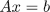

使用 `solve` 方法，其语法如下：

```py
from scipy.linalg import solve
x = solve(A, b)
```

例如，我们想要求解：

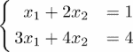

这是前面方程的解：

```py
from scipy.linalg import solve
A = array([[1., 2.], [3., 4.]])
b = array([1., 4.])
x = solve(A, b)
allclose(dot(A, x), b) # True
allclose(A @ x, b) # alternative formulation
```

命令 `allclose` 在这里用于比较两个向量。如果它们彼此足够接近，此命令将返回 `True`。可以设置一个容差值。有关与线性方程系统相关的方法，请参阅 *SciPy 中的线性代数方法* 部分。

# 数学预备知识

为了理解 NumPy 中数组的工作方式，了解通过索引访问张量（矩阵和向量）元素与通过提供参数评估数学函数之间的数学平行是有用的。我们还在本节中介绍了点积作为降维算子的推广。

## 数组作为函数

数组可以从几个不同的角度来考虑。我们认为，为了理解数组，最有成效的角度是将其视为多个变量的函数。

例如，选择 *ℝ*^(*n*) 中给定向量的一个分量可以仅仅被视为从集合 ℕ[*n*] 到 ℝ 的函数，其中我们定义该集合：

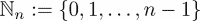

在这里，集合 ℕ[n] 有 *n* 个元素。Python 函数 `range` 生成 ℕ[*n*]。

另一方面，选择给定矩阵的一个元素是两个参数的函数，其值在 ℝ 中。因此，选择一个 *m* × *n* 矩阵的特定元素可以被视为从 ℕ[*m*] × ℕ[*n*] 到 ℝ 的函数。

## 元素级运算

NumPy 数组基本上被视为数学函数。这在运算中尤其如此。考虑两个在相同定义域上定义并取实数值的函数 *f* 和 *g*。这两个函数的乘积 *f g* 定义为点积，即：


注意，这种构造适用于两个函数之间的任何操作。对于定义在两个标量上的任意操作，我们在这里用 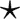 表示，我们可以如下定义 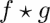：

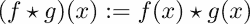

这无害的评论使我们能够理解 NumPy 对运算的态度；数组中的所有运算都是元素级的。例如，两个矩阵 *m* 和 *n* 的乘积定义为，与函数一样，如下所示：

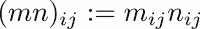

## 形状和维度数

在以下内容中，我们可以清楚地区分一个：

+   **标量**：无参数的函数

+   **向量**：具有一个参数的函数

+   **矩阵**：具有两个参数的函数

+   **高阶张量**：具有两个以上参数的函数

在接下来的内容中，维度数是函数的参数数。形状基本上对应于函数的定义域。

例如，一个大小为 *n* 的向量是从集合 ℕ[*n*] 到 ℝ 的函数。因此，其定义域是 ℕ[*n*]。其形状定义为单元素 (*n,*）。同样，一个大小为 *m* × *n* 的矩阵是在集合 ℕ[*m*] × ℕ[*m*] 上定义的函数。相应的形状简单地是 (*m*, *n*）。数组的形状可以通过 `numpy.shape` 函数获得，维数可以通过 `numpy.ndim` 函数获得。

## 点积操作

将数组视为函数，虽然功能强大，但完全忽略了我们所熟悉的线性代数结构，即矩阵-向量和矩阵-矩阵操作。幸运的是，所有这些线性代数操作都可以用类似统一的形式表示：

向量-向量操作：

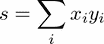

矩阵-向量操作：

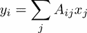

矩阵-矩阵操作：

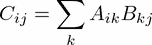

向量-矩阵操作：

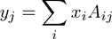

核心数学概念是归约。对于一个矩阵-向量操作，归约由以下公式给出：

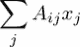

通常，定义在两个张量 *T* 和 *U* 之间（分别具有 *m* 和 *n* 个维度）的归约操作可以定义为：

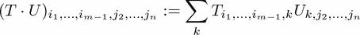

显然，张量的形状必须兼容，这样操作才有意义。这个要求对于矩阵-矩阵乘法是熟悉的。矩阵 *M* 和 *N* 的乘积 *M N* 只有在 *M* 的列数等于 *N* 的行数时才有意义。

归约操作的另一个后果是它产生了一个具有 *m + n - 2* 维度的新张量。在下面的表中，我们收集了涉及矩阵和向量的常见归约操作输出：

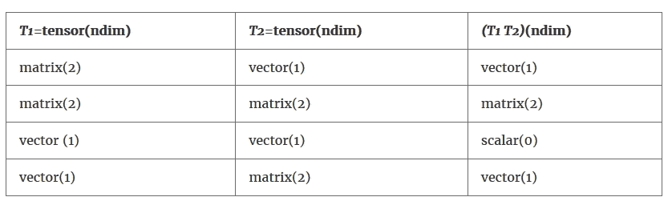

表 4.1：涉及矩阵和向量的常见归约操作输出

在 Python 中，所有归约操作都是通过 `dot` 函数来执行的：

```py
angle = pi/3
M = array([[cos(angle), -sin(angle)], 
           [sin(angle), cos(angle)]])
v = array([1., 0.])
y = dot(M, v)
```

正如数学教科书中所描述的，在现代 Python（版本 3.5 及更高版本）中，点积有时更倾向于以操作符形式书写，即 `dot(M, v)`，或者使用更方便的中缀表示法，`M @ v`。从现在开始，我们将坚持使用操作符形式；如果您更喜欢其他形式，可以修改示例。

### 注意

**逐元素与矩阵乘法**

乘法操作符 `*` 总是逐元素操作。它与点积无关。即使 *A* 是一个矩阵，*v* 是一个向量，*A*v* 仍然是一个合法的操作。

矩阵-向量乘法是通过 `dot` 函数执行的。有关更多信息，请参阅第五章 *高级数组概念* 中的 *广播* 部分。

# 数组类型

用于在 NumPy 中操作向量、矩阵和更一般的张量的对象称为数组。在本节中，我们检查它们的本质属性、如何创建它们以及如何访问它们的信息。

## 数组属性

数组本质上由三个属性来表征，如下表所示（*表 4.2*）：

| **名称** | **描述** |
| --- | --- |
| `shape` | 它描述了数据应该如何被解释，作为一个向量、一个矩阵或一个更高阶的张量，并给出了相应的维度。它通过 `shape` 属性来访问。 |
| `dtype` | 它给出了底层数据类型（浮点数、复数、整数等）。 |
| `strides` | 此属性指定了数据应该以何种顺序读取。例如，一个矩阵可以在内存中连续地按列存储（FORTRAN 习惯），或者按行存储（C 习惯）。该属性是一个元组，包含到达下一行和到达下一列需要跳过的字节数。`strides` 属性甚至允许对内存中的数据进行更灵活的解释，这就是数组视图成为可能的原因。 |

表 4.2 : 数组的属性

考虑以下数组：

```py
A = array([[1, 2, 3], [3, 4, 6]])
A.shape   # (2, 3)
A.dtype   # dtype('int64')
A.strides # (24, 8)
```

它们的元素类型为 `'int64'`；也就是说，它们在内存中使用 64 位或 8 字节。整个数组以行的方式存储在内存中。因此，从 `A[0, 0]` 到下一行 `A[1,0]` 的第一个元素在内存中的距离是 24 字节（三个矩阵元素）。相应地，`A[0,0]` 和 `A[0,1]` 在内存中的距离是 8 字节（一个矩阵元素）。这些值存储在 `strides` 属性中。

## 从列表创建数组

创建数组的通用语法是 `array` 函数。创建实向量的语法将是：

```py
V = array([1., 2., 1.], dtype=float)
```

要创建具有相同数据的复向量：

```py
V = array([1., 2., 1.], dtype=complex)
```

当没有指定类型时，类型会被猜测。`array` 函数会选择允许存储所有指定值的类型：

```py
V = array([1, 2]) # [1, 2] is a list of integers
V.dtype # int
V = array([1., 2]) # [1., 2] mix float/integer
V.dtype # float
V = array([1\. + 0j, 2.]) # mix float/complex
V.dtype # complex
```

**静默类型转换** NumPy 静默地将浮点数转换为整数，这可能会产生意外的结果：

```py
a = array([1, 2, 3])
a[0] = 0.5
a # now: array([0, 2, 3])
```

从复数到浮点数的数组类型转换通常也是意外的。

**数组和 Python 括号**

正如我们在第一章 程序和程序流程 中的 *程序和程序流程* 节所注意到的，Python 允许在某个开括号或括号未关闭时进行换行。这允许创建数组的方便语法，这使得它对人类眼睛来说更加令人愉悦：

```py
 # the identity matrix in 2D
 Id = array([[1., 0.], [0., 1.]])
 # Python allows this:
 Id = array([[1., 0.],
             [0., 1.]])
 # which is more readable
```

# 访问数组元素

数组元素通过索引访问。与向量系数不同，访问矩阵系数需要两个索引。这些索引在一个括号对中给出。这区分了数组语法和列表的列表。在那里，需要两个括号对来访问元素。

```py
M = array([[1., 2.],[3., 4.]])
M[0, 0] # first row, first column: 1.
M[-1, 0] # last row, first column: 3.
```

## 基本数组切片

切片与列表的切片类似，但现在可能有多个维度：

+   `M[i,:]` 是由 *M* 的第 *i* 行填充的向量。

+   `M[:,j]` 是由 *M* 的列 *i* 填充的向量。

+   `M[2:4,:]` 是对行 `2:4` 的切片。

+   `M[2:4,1:4]` 是对行和列的切片。

矩阵切片的结果在以下图中给出（*图 4.1*）：

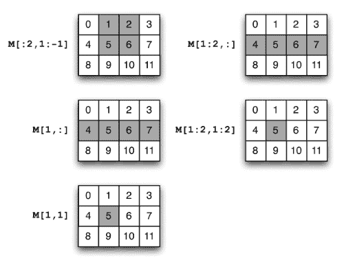

图 4.1：矩阵切片的结果

### 注意

**省略一个维度**

如果你省略了一个索引或切片，NumPy 假设你只取行。`M[3]` 是一个视图，它是 *M* 的第三行，而 `M[1:3]` 是一个视图，它是 *M* 的第二行和第三行。

切片中的元素更改会影响整个数组：

```py
v = array([1., 2., 3.])
v1 = v[:2] # v1 is array([1., 2.])
v1[0] = 0\. # if v1 is changed ...
v # ... v is changed too: array([0., 2., 3.])
```

通用切片规则在以下表格中给出（*表 4.3*）：

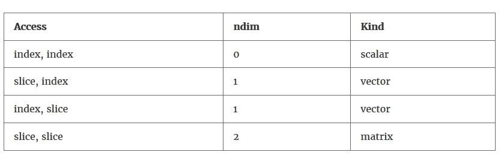

表 4.3：通用切片规则

形状为 *(4, 4)* 的数组 `M` 的切片操作结果如下表（*表 4.4*）所示：

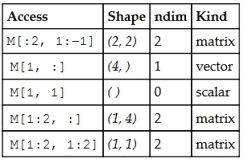

表 4.4：形状为 (4,4) 的数组 M 的切片操作结果

## 使用切片更改数组

你可以使用切片或直接访问来更改数组。以下更改了一个 5 × 3 矩阵 `M` 中的一个元素：

```py
M[1, 3] = 2.0 # scalar
```

但我们可能改变矩阵的一整行：

```py
M[2, :] = [1., 2., 3.] # vector
```

我们也可以替换一个完整的子矩阵：

```py
M[1:3, :] = array([[1., 2., 3.],[-1.,-2., -3.]])
```

### 注意

列矩阵和向量之间有一个区别。以下使用列矩阵的赋值没有错误 `M[1:4, 2:3] = array([[1.],[0.],[-1.0]])`，而使用向量的赋值会返回一个 `ValueError` 错误 `M[1:4, 2:3] = array([1., 0., -1.0]) #  错误`

通用切片规则在 *表 4.2* 中显示。前例中的矩阵和向量必须具有正确的大小，以便适合矩阵 *M*。你也可以使用广播规则（更多信息，请参阅第五章的 *Broadcasting* 部分，*高级数组概念*），以确定替换数组的允许大小。如果替换数组没有正确的大小，将引发 `ValueError` 异常。

# 构建数组的函数

设置数组的最常见方式是通过列表。但也有一些方便的方法可以生成特殊数组，以下表格（*表 4.5*）中给出了这些方法：

| **方法** | **形状** | **生成** |
| --- | --- | --- |
|  `zeros((n,m))` | *(n,m)* | 用零填充的矩阵 |
| `ones((n,m)) ` | *(n,m)* | 用一填充的矩阵 |
| `diag(v,k) ` | *(n,n)* | 从向量 *v* 生成的（子-，超-）对角矩阵 |
| `random.rand(n,m) ` | *(n,m)* | 用在 (0,1) 中均匀分布的随机数填充的矩阵 |
|  `arange(n)` | *(n,)* | 前 *n* 个整数 |
| `linspace(a,b,n) ` | *(n,)* | 在 *a* 和 *b* 之间有 *n* 个等间距点的向量 |

表 4.5：创建数组的命令

这些命令可能需要额外的参数。特别是，`zeros`、`ones` 和 `arange` 命令接受 `dtype` 作为可选参数。默认类型是 `float`，除了 `arange`。还有像 `zeros_like` 和 `ones_like` 这样的方法，是前面方法的轻微变体。例如，`zeros_like(A)` 方法等同于 `zeros(shape(A))`。

这里是 `identity` 函数，它构建一个给定大小的单位矩阵：

```py
I = identity(3)
```

命令与以下命令相同：

```py
I = array([[ 1., 0., 0.],
           [ 0., 1., 0.],
           [ 0., 0., 1.]])
```

# 访问和更改形状

维度数是区分向量和矩阵的因素。**形状**是区分不同大小的向量或矩阵的因素。在本节中，我们将探讨如何获取和更改数组的形状。

## 形状函数

矩阵的形状是其维度的元组。一个 n × m 矩阵的形状是元组 `(n, m)`。可以通过 `shape` 函数获得：

```py
M = identity(3)
shape(M) # (3, 3)
```

对于向量，形状是一个包含该向量长度的单元素：

```py
v = array([1., 2., 1., 4.])
shape(v) # (4,) <- singleton (1-tuple)
```

另一种选择是使用数组属性 `shape`，它给出相同的结果：

```py
M = array([[1.,2.]])
shape(M) # (1,2)
M.shape # (1,2)
```

然而，使用 `shape` 作为函数的优势在于，这个函数也可以用于标量和列表。当代码需要同时处理标量和数组时，这可能会很有用：

```py
shape(1.) # ()
shape([1,2]) # (2,)
shape([[1,2]]) # (1,2)
```

## 维度数

数组的维度数可以通过函数 `numpy.ndim` 或使用数组属性 `ndarray.ndim` 获取：

```py
ndim(A) # 2
A.ndim # 2
```

注意，张量 `T`（一个向量、矩阵或更高阶的张量）的维度数，由函数 `ndim` 给出，总是等于其形状的长度：

```py
T = zeros((2,2,3)) # tensor of shape (2,2,3); three dimensions
ndim(T) # 3
len(shape(T)) # 3
```

## 重塑

方法 `reshape` 给出了数组的新视图，具有新的形状，而不复制数据：

```py
v = array([0,1,2,3,4,5])
M = v.reshape(2,3)
shape(M) # returns (2,3)
M[0,0] = 10 # now v[0] is 10
```

### 小贴士

**重塑不复制**

重新塑形不会创建一个新的数组。它更像是给现有的数组提供了一个新的视图。在先前的例子中，更改 `M` 中的一个元素将自动导致 `v` 中相应元素的变化。当这种行为不可接受时，你需要复制数据。

下图给出了由 `arange(6)` 定义的数组上 `reshape` 方法的各种效果：

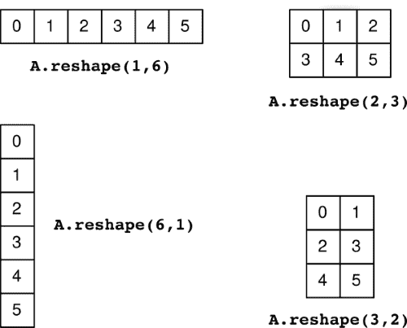

图 4.2：由 `arange(6)` 定义的数组上重塑方法的多种效果

如果尝试将形状乘积不等于原始形状的数组进行重塑，将引发错误：

```py
 ValueError: total size of new array must be unchanged.
```

有时，指定一个形状参数并让 Python 以乘积等于原始形状的方式确定其他参数是很方便的。这是通过将自由形状参数设置为 `-1` 来实现的：

```py
v = array([1, 2, 3, 4, 5, 6, 7, 8])
M = v.reshape(2, -1)
shape(M) # returns (2, 4)
M = v.reshape(-1, 2)
shape(M) # returns (4,2 )
M = v.reshape(3,- 1) # returns error
```

### 转置

重新塑形的一种特殊形式是转置。它只是交换矩阵的两个形状元素。矩阵 *A* 的转置是一个矩阵 *B*，使得：

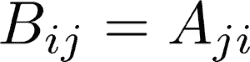

这以下列方式解决：

```py
A = ...
shape(A) # 3,4

B = A.T # A transpose
shape(B) # 4,3
```

### 小贴士

**转置不复制**

转置与重塑非常相似。特别是，它也不复制数据，只是返回对同一数组的视图：

```py
A= array([[ 1., 2.],[ 3., 4.]])
B=A.T
A[1,1]=5.
B[1,1] # 5
```

转置向量没有意义，因为向量是一维的张量，即一元函数。然而，NumPy 会遵守并返回完全相同的对象：

```py
v = array([1., 2., 3.])
v.T # exactly the same vector!
```

当你想转置一个向量时，你可能在想创建一个行矩阵或列矩阵。这是使用`reshape`完成的：

```py
v.reshape(-1, 1) # column matrix containing v
v.reshape(1, -1) # row matrix containing v
```

# 堆叠

从一对（匹配的）子矩阵构建矩阵的通用方法是`concatenate`。其语法如下：

```py
concatenate((a1, a2, ...), axis = 0)
```

当指定`axis=0`时，此命令将子矩阵垂直堆叠（彼此之上）。使用`axis=1`参数时，它们将水平堆叠，并且这种通用性适用于更多维度的数组。此功能由以下几个方便的函数调用：

+   `hstack`：用于水平堆叠矩阵

+   `vstack`：用于垂直堆叠矩阵

+   `columnstack`：用于按列堆叠向量

## 堆叠向量

可以使用`vstack`和`column_stack`按行或按列堆叠向量，如下图所示：


### 小贴士

`hstack`将产生 v1 和 v2 的连接。

以向量堆叠为例，让我们考虑辛排列：我们有一个大小为 2*n*的向量。我们想要对具有偶数个分量的向量执行辛变换，即交换向量的前半部分与后半部分，并改变符号：

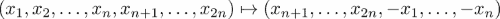

此操作在 Python 中的解析如下：

```py
# v is supposed to have an even length.
def symp(v):
    n = len(v) // 2 # use the integer division //
    return hstack([v[-n:], -v[:n]])
```

# 作用于数组的函数

有不同类型的函数作用于数组。一些逐元素作用，并返回具有相同形状的数组。这些被称为通用函数。其他数组函数返回不同形状的数组。

## 通用函数

通用函数是逐元素作用于数组的函数。因此，它们的输出数组与输入数组具有相同的形状。这些函数允许我们一次性计算整个数组上的标量函数的结果。

### 内置通用函数

典型例子是`cos`函数（NumPy 提供的）：

```py
cos(pi) # -1
cos(array([[0, pi/2, pi]])) # array([[1, 0, -1]])
```

注意，通用函数以分组件方式作用于数组。这也适用于运算符，如乘法或指数：

```py
2 * array([2, 4]) # array([4, 8])
array([1, 2]) * array([1, 8]) # array([1, 16])
array([1, 2])**2 # array([1, 4])
2**array([1, 2]) # array([1, 4])
array([1, 2])**array([1, 2]) # array([1, 4])
```

### 创建通用函数

如果你的函数只使用通用函数，则该函数将自动成为通用函数。然而，如果你的函数使用非通用函数，则在尝试将它们应用于数组时可能会得到标量结果，甚至出现错误：

```py
def const(x):
    return 1
const(array([0, 2])) # returns 1 instead of array([1, 1])
```

另一个例子如下：

```py
def heaviside(x):
    if x >= 0:
        return 1.
    else: 
        return 0.

heaviside(array([-1, 2])) # error
```

预期的行为是，将`heaviside`函数应用于向量`[*a*, *b*]`将返回`[heaviside(*a*), heaviside(*b*)]`。然而，这不起作用，因为该函数总是返回一个标量，无论输入参数的大小如何。此外，使用数组输入该函数将引发异常。NumPy 函数`vectorize`允许我们快速解决这个问题：

```py
vheaviside = vectorize(heaviside)
vheaviside(array([-1, 2])) # array([0, 1]) as expected
```

此方法的典型应用是在绘制函数时使用：

```py
xvals = linspace(-1, 1, 100)
plot(xvals, vectorize(heaviside)(xvals))
axis([-1.5, 1.5, -0.5, 1.5])
```

下面的图表显示了 Heaviside 函数：

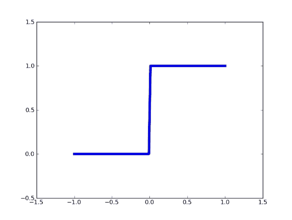

### 提示

`vectorize` 函数并不会提高性能*.* 它只提供了一个方便的方式来快速转换一个函数，使其能够逐元素地对列表和数组进行操作。

## 数组函数

有许多作用于数组的函数不是逐分量操作的。这类函数的例子有 `max`、`min` 和 `sum`。这些函数可以作用于整个矩阵、按行或按列操作。如果没有提供参数，它们作用于整个矩阵。假设 `A` 是以下矩阵：

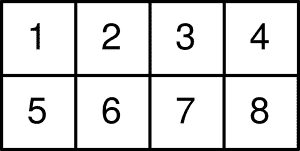

对该矩阵作用的 `sum` 函数返回一个标量：

```py
sum(A) # 36
```

命令有一个可选参数，`axis`。它允许我们选择在哪个轴上执行操作。例如，如果轴是 *0*，则表示总和应该沿着第一个轴计算。形状为 (*m*, *n*) 的数组的轴 *0* 的总和将是一个长度为 *n* 的向量。

假设我们沿着轴 0 计算 `A` 的总和：

```py
sum(A, axis=0) # array([ 6, 8, 10, 12])
```

这相当于在列上计算总和：

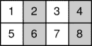

结果是一个向量：

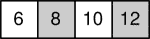

现在假设我们沿着轴 *1* 计算总和：

```py
A.sum(axis=1) # array([10, 26])
```

这相当于在行上计算总和：

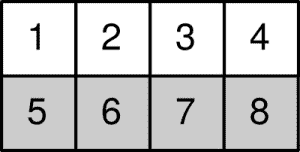

结果是一个向量：

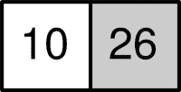

# SciPy 中的线性代数方法

SciPy 在其 `scipy.linalg` 模块中提供了大量数值线性代数方法。其中许多方法都是 Python 对 `LAPACK` 程序的封装，`LAPACK` 是一组经过良好验证的 FORTRAN 子例程集合，用于解决线性方程组和特征值问题。线性代数方法是任何科学计算方法的核心，而 SciPy 使用封装而不是纯 Python 代码的事实使得这些核心方法非常快速。我们在此详细介绍了如何使用 SciPy 解决两个线性代数问题，以让您了解此模块。

## 使用 LU 解多个线性方程组

设 *A* 为一个 *n × n* 矩阵，*b[1]*、*b[2]*、...、*b[k]* 是一个 *n*-向量的序列。我们考虑的问题是找到 *n* 个向量 *x[i]*，使得：

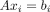

我们假设向量 *b[i]* 不是同时已知的。特别是，在 *i*^(th) 问题必须解决之后 *b[i+1]* 才可用的情形相当常见。

LU 分解是将经典的 Gauss 消元法组织成两步计算的方式：

+   将矩阵 *A* 分解以得到三角矩阵的步骤

+   一个相对便宜的向后和向前消除步骤，它作用于 *b[i]* 并从更耗时的分解步骤中受益

此方法还利用了如果 *P* 是一个排列矩阵，使得 *PA* 是通过行排列的原始矩阵这一事实。

这两个系统

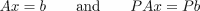

具有相同的解。

*LU* 分解找到一个置换矩阵 *P*，一个下三角矩阵 *L*，和一个上三角矩阵 *U*，使得：

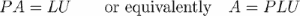 .

这样的分解总是存在的。此外，*L* 可以这样确定，使得 *L[ii] = 1*. 因此，必须存储的 *L* 的基本数据是 *L[ij]*，其中 *i > j*. 因此，*L* 和 *U* 可以存储在一个 *n* × *n* 数组中，而关于置换矩阵 *P* 的信息只需要一个 *n* 整数向量——主元向量。

在 SciPy 中，有两种方法来计算 *LU* 分解。标准的方法是 `scipy.linalg.lu`，它返回三个矩阵 `L`、`U` 和 `P`。另一种方法是 `lu_factor.` 那是我们在这里描述的方法，因为它将方便地与 `lu_solve` 结合使用：

```py
import scipy.linalg as sl
[LU,piv] = sl.lu_factor(A)
```

这里，`A` 矩阵被分解，并返回一个包含关于 `L` 和 `U` 的信息的数组，以及主元向量。有了这些信息，可以通过根据主元向量中存储的信息进行向量 *b[i]* 的行交换，使用 *U* 进行回代，最后使用 *L* 进行前向代换来求解系统。这被捆绑在 Python 的 `lu_solve` 方法中。以下代码片段显示了在执行 *LU* 分解并将结果存储在元组 `(LU, piv)` 中后，如何求解系统 *Ax[i] = b[i]*：

```py
import scipy.linalg as sl
xi = sl.lu_solve((LU, piv), bi)
```

## 使用奇异值分解求解最小二乘问题

线性方程组 *Ax = b*，其中 *A* 是一个 *m* × *n* 矩阵且 *m* > *n*，被称为超定线性方程组。一般来说，它没有经典解，人们寻求一个向量 *x**   ℝ^(*n*)，它具有以下性质：

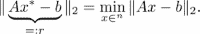

这里， 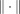 表示欧几里得向量范数 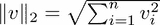.

这个问题被称为最小二乘问题。解决它的一个稳定方法是基于分解 *A = U*Σ*V^T*，其中 *U* 是一个 *m* × *m* 正交矩阵，*V* 是一个 *n* × *n* 正交矩阵，Σ = (σ[*ij*]) 是一个 *m* × *n* 矩阵，其性质是 σ[*ij*] = 0 对于所有 *i* ≠*j*。这种分解被称为**奇异值分解**(**SVD**)。

我们写，

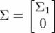

使用对角线 *n* × *n* 矩阵 Σ[*1*]. 如果我们假设 *A* 具有满秩，那么 Σ[*1*]  是可逆的，并且可以证明，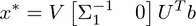. 如果我们把 *U* = [*U[1] U[2]*] 分解，其中 *U[1]* 是一个 *m* × *n* 子矩阵，那么前面的方程可以简化为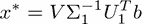.

SciPy 提供了一个名为`svd`的函数，我们用它来解决这个问题：

```py
import scipy.linalg as sl 
[U1, Sigma_1, VT] = sl.svd(A, full_matrices = False,
                              compute_uv = True) 
xast = dot(VT.T, dot(U1.T, b) / Sigma_1)
r = dot(A, xast) - b # computes the residual
nr = sl.norm(r, 2) # computes the Euclidean norm of r
```

关键字`full_matrices`表示只需要计算*U*的*U[1]*部分。由于经常使用`svd`来计算仅奇值σ[*ii*]，我们必须明确要求通过使用关键字`compute_uv`来计算*U*和*V*。SciPy 函数`scipy.linalg.lstsq`通过使用奇异值分解以类似的方式解决最小二乘问题。

## 更多方法

在之前的例子中，你遇到了线性代数中计算任务的几种方法，例如，`solve`。在执行命令`import scipy.linalg as sl`之后，大多数常用方法都可用。我们参考它们的文档以获取更多信息。以下表格（*表 4.6*）给出了`scipy.linalg`模块的一些线性代数函数：

| **方法** | **描述（矩阵方法）** |
| --- | --- |
| `sl.det` | 矩阵行列式 |
| `sl.eig` | 矩阵的特征值和特征向量 |
| `sl.inv` | 矩阵逆 |
| `sl.pinv` | 矩阵伪逆 |
| `sl.norm` | 矩阵或向量范数 |
| `sl.svd` | 矩阵奇异值分解 |
| `sl.lu` | LU 分解 |
| `sl.qr` | QR 分解 |
| `sl.cholesky` | Cholesky 分解 |
| `sl.solve` | 解一般或对称线性系统：*Ax = b* |
| `sl.solve.banded` | 同样适用于带状矩阵 |
| `sl.lstsq` | 最小二乘解 |

表 4.6：**scipy.linalg**模块的线性代数函数

首先执行`import scipy.linalg as sl`。

# 摘要

在本章中，我们处理了线性代数中最重要的对象——向量和矩阵。为此，我们学习了如何定义数组，并遇到了重要的数组方法。一小节展示了如何使用`scipy.linalg`模块中的模块来解决线性代数中的核心任务。

# 练习

**例 1** → 考虑一个 4 × 3 矩阵*M*：

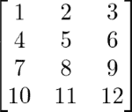

1.  使用函数`array`在 Python 中构建此矩阵。

1.  使用函数`arange`后跟适当的 reshape 构建相同的矩阵。

1.  表达式`M[2,:]`的结果是什么？类似的表达式`M[2:]`的结果是什么？

**例 2** → 给定一个向量*x*，在 Python 中构建以下矩阵：

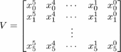

在这里，*x[i]*是向量*x*的分量（从零开始编号）。给定一个向量*y*，在 Python 中求解线性方程组*Va = y*。设*a*的分量表示为*a[i]，i = 0, ..., 5*。编写一个名为`poly`的函数，该函数以*a*和*z*作为输入，并计算多项式：

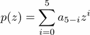

绘制这个多项式，并在同一张图上描绘点（*x[i]*，*y[i]*）作为小星星。尝试使用以下向量：

+   *x = (0.0, 0.5, 1.0, 1.5, 2.0, 2.5)*

+   *y = (-2.0, 0.5, -2.0, 1.0, -0.5, 1.0)*

**Ex. 3** → *Ex. 2* 中的矩阵 *V* 被称为范德蒙德矩阵。可以直接使用命令 `vander` 在 Python 中设置它。通过 Python 命令 `polyval` 计算由系数向量定义的多项式。通过使用这些命令重复 *Ex. 2*。

**Ex. 4** → 设 *u* 为一维数组。构造另一个数组 ξ，其值为 ξ*[i] = (u[1] + u[i+1] + u[i+2])/3*。在统计学中，这个数组被称为 *u* 的移动平均。在逼近理论中，它扮演着三次样条的重格林斯比斯的角色。尝试在脚本中避免使用循环。

**Ex. 5** →

1.  从 *Ex. 2* 中给出的矩阵 *V* 中删除 *V* 的第一列，构建一个矩阵 *A*。

1.  构造矩阵 *B = (A^T A)^(-1) A^T*。

1.  使用 *y* 从 *Ex. 2* 中计算 *c = B y*。

1.  使用 *c* 和 `polyval` 绘制由 *c* 定义的多项式。再次在同一张图中绘制点 (*x[i]*, *y[i]*)。

**Ex. 6** → *Ex. 5* 描述了最小二乘法。重复该练习，但使用 SciPy 的 `scipy.linalg.lstsq` 方法。

**Ex. 7** → 设 *v* 为一个以 3 × 1 矩阵 [1 -1 1]*^T* 的坐标形式写成的向量。构建投影矩阵：

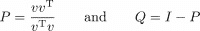。

通过实验证明 *v* 是矩阵 *P* 和 *Q* 的特征向量。相应的特征值是什么？

**Ex. 8** → 在数值线性代数中，具有该性质的 *m* × *m* 矩阵 *A*：

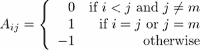

在进行 *LU* 分解时，被用作极端增长因子的例子。

在 Python 中设置这个矩阵，对于各种 *m*，使用命令 `scipy.linalg.lu` 计算其 *LU* 分解，并通过实验推导出关于增长因子的陈述。

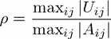

与 *m* 相关。
