# 第五章。高级数组概念

在本章中，我们将解释数组的一些更高级的方面。首先，我们将介绍数组视图的概念，然后是布尔数组以及如何比较数组。我们将简要描述索引和向量化，解释稀疏数组，以及广播等一些特殊主题。

# 数组视图和副本

为了精确控制内存的使用，NumPy 提供了数组的视图概念。视图是较小的数组，与较大的数组共享相同的数据。这就像对一个单一对象的引用（参见第一章中的*基本类型*部分，*入门*）。

## 数组视图

视图的简单示例是数组的切片：

```py
M = array([[1.,2.],[3.,4.]])
v = M[0,:] # first row of M
```

前面的切片是`M`的视图。它与`M`共享相同的数据。修改`v`也会修改`M`：

```py
v[-1] = 0.
v # array([[1.,0.]])
M # array([[1.,0.],[3.,4.]]) # M is modified as well
```

可以使用数组的`base`属性访问拥有数据的对象：

```py
v.base # array([[1.,0.],[3.,4.]])
v.base is M # True
```

如果数组拥有自己的数据，则基础属性为 none：

```py
M.base # None
```

## 作为视图的切片

有关于哪些切片会返回视图以及哪些会返回副本的精确规则。只有基本切片（主要是带有`:`的索引表达式）会返回视图，而任何高级选择（例如使用布尔值的切片）都会返回数据的副本。例如，可以通过列表（或数组）索引创建新的矩阵： 

```py
a = arange(4) # array([0.,1.,2.,3.])
b = a[[2,3]] # the index is a list [2,3]
b # array([2.,3.])
b.base is None # True, the data was copied
c = a[1:3]
c.base is None # False, this is just a view
```

在前面的例子中，数组`b`不是一个视图，而通过更简单的切片获得的数组`c`是一个视图。

有一个特别简单的数组切片可以返回整个数组的视图：

```py
N = M[:] # this is a view of the whole array M
```

## 转置和重塑作为视图

一些其他重要操作会返回视图。例如，转置会返回一个视图：

```py
M = random.random_sample((3,3))
N = M.T
N.base is M # True
```

对于所有重塑操作也适用：

```py
v = arange(10)
C = v.reshape(-1,1) # column matrix
C.base is v # True
```

## 数组复制

有时需要显式请求复制数据。这可以通过 NumPy 函数`array`简单地实现：

```py
M = array([[1.,2.],[3.,4.]])
N = array(M.T) # copy of M.T
```

我们可以验证数据确实已被复制：

```py
N.base is None # True
```

# 比较数组

比较两个数组并不像看起来那么简单。考虑以下代码，其目的是检查两个矩阵是否接近：

```py
A = array([0.,0.])
B = array([0.,0.])
if abs(B-A) < 1e-10: # an exception is raised here
    print("The two arrays are close enough")
```

当执行`if`语句时，此代码会引发异常：

```py
ValueError: The truth value of an array with more than one element is ambiguous. Use a.any() or a.all()
```

在本节中，我们将解释为什么会这样，以及如何纠正这种情况。

## 布尔数组

布尔数组对于高级数组索引很有用（参见*使用布尔数组索引*部分）。布尔数组是一个条目类型为`bool`的数组：

```py
A = array([True,False]) # Boolean array
A.dtype # dtype('bool')
```

任何作用于数组的比较运算符都会创建一个布尔数组而不是简单的布尔值：

```py
M = array([[2, 3],
           [1, 4]])
M > 2 # array([[False, True],
             # [False, True]])
M == 0 # array([[False, False],
             # [False, False]])
N = array([[2, 3],
           [0, 0]])
M == N # array([[True, True],
              # [False, False]])
...
```

注意，由于数组比较会创建布尔数组，因此不能直接在条件语句（例如`if`语句）中使用数组比较。解决方案是使用`all`和`any`方法：

```py
A = array([[1,2],[3,4]])
B = array([[1,2],[3,3]])
A == B # creates array([[True, True], [True, False]]) 
(A == B).all() # False
(A != B).any() # True
if (abs(B-A) < 1e-10).all():
    print("The two arrays are close enough")
```

### 检查相等性

检查两个浮点数组的相等性并不直接，因为两个浮点数可能非常接近但不相等。在 NumPy 中，可以使用`allclose`来检查相等性。此函数检查两个数组在给定精度下的相等性：

```py
data = random.rand(2)*1e-3
small_error = random.rand(2)*1e-16
data == data + small_error # False
allclose(data, data + small_error, rtol=1.e-5, atol=1.e-8)   # True
```

容忍度以相对容忍度界限`rtol`和绝对误差界限`atol`的形式给出。`allclose`命令是以下短语的缩写：`(abs(A-B) < atol+rtol*abs(B)).all()`。

注意，`allclose`也可以应用于标量：

```py
data = 1e-3
error = 1e-16
data == data + error # False
allclose(data, data + error, rtol=1.e-5, atol=1.e-8)  #True
```

# 数组上的布尔运算

你不能在布尔数组上使用 `and`、`or` 和 `not`。实际上，这些运算符强制将数组转换为布尔类型，这是不允许的。相反，我们可以使用下表中给出的运算符（*表 5.1*）来进行布尔数组的逐元素逻辑运算：

| **逻辑运算符** | **布尔数组的替代** |
| --- | --- |
| `A and B` | `A & B` |
| `A or B` | `A &#124; B` |
| `not A` | `~ A` |

表 5.1 逻辑运算符 and、or 和 not 不适用于数组。

```py
A = array([True, True, False, False])
B = array([True, False, True, False])
A and B # error!
A & B # array([True, False, False, False])
A | B # array([True, True, True, False])
~A # array([False, False, True, True])
```

这里是使用布尔数组逻辑运算符的一个示例用法：

假设我们有一系列带有测量错误的数据。进一步假设我们运行回归分析，并为每个值提供一个偏差。我们希望获得所有异常值以及低于给定阈值的偏差很小的值：

```py
data = linspace(1,100,100) # data
deviation = random.normal(size=100) # the deviations 
           #don't forget the parentheses in next statement!
exceptional = data[(deviation<-0.5)|(deviation>0.5)] 
exceptional = data[abs(deviation)>0.5] # same result 
small = data[(abs(deviation)<0.1)&(data<5.)] # small deviation and data
```

# 数组索引

我们已经看到可以通过切片和整数的组合来索引数组，这是基本的切片技术。然而，还有许多其他可能性，这允许以多种方式访问和修改数组元素。

## 布尔数组索引

有时，根据数组的值，访问和修改数组的一部分是有用的。例如，可能想要访问数组中的所有正元素。这实际上可以通过布尔数组来实现，它们充当掩码以仅选择数组的某些元素。这种索引的结果*总是*是一个向量。例如，考虑以下示例：

```py
B = array([[True, False],
           [False, True]])
M = array([[2, 3],
           [1, 4]])
M[B] # array([2,4]), a vector
```

实际上，`M[B]`调用等同于`M.flatten()[B]`。然后可以用另一个向量替换结果向量。例如，可以将所有元素替换为零（有关更多信息，请参阅*广播*部分）：

```py
M[B] = 0
M # [[0, 3], [1, 0]]
```

或者，也可以用其他值替换所有选定的值：

```py
M[B] = 10, 20
M # [[10, 3], [1, 20]]
```

通过组合布尔数组的创建（`M > 2`）、智能索引（使用布尔数组索引）和广播，可以使用以下优雅的语法：

```py
M[M>2] = 0    # all the elements > 2 are replaced by 0
```

这里提到的表达式广播是指将标量 0 隐式转换为适当形状的向量。

## 使用 where

`where`命令提供了一个有用的结构，可以接受布尔数组作为条件，并返回满足条件的数组元素的索引，或者根据布尔数组中的值返回不同的值。

基本结构是：

```py
where(condition, a, b)
```

当条件为`True`时，这将返回`a`的值，当条件为`False`时，返回`b`的值。

例如，考虑一个*海维赛德*函数：

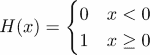

以下代码实现了一个海维赛德函数：

```py
def H(x):
    return where(x < 0, 0, 1)
x = linspace(-1,1,11)  # [-1\. -0.8 -0.6 -0.4 -0.2 0\. 0.2 0.4 0.6 0.8 1\. ]
print(H(x))            # [0 0 0 0 0 1 1 1 1 1 1]
```

第二个和第三个参数可以是与条件（布尔数组）大小相同的数组或标量。我们给出两个更多示例，以展示如何根据条件从数组或标量中操作元素：

```py
x = linspace(-4,4,5)
# [-4\. -2.  0.  2.  4.]

print(where(x > 0, sqrt(x), 0))
# [ 0.+0.j 0.+0.j 0.+0.j 1.41421356+0.j  2.+0.j ]
print(where(x > 0, 1, -1)) # [-1 -1 -1  1  1]
```

如果省略第二个和第三个参数，则返回满足条件的元素的索引组成的元组。

例如，考虑以下代码中`where`只使用一个参数的使用：

```py
a = arange(9)
b = a.reshape((3,3))

print(where(a > 5))   # (array([6, 7, 8]),)

print(where(b > 5))   # (array([2, 2, 2]), array([0, 1, 2]))
```

# 性能和向量化

当谈到 Python 代码的性能时，这通常归结为解释代码和编译代码之间的差异。Python 是一种解释型编程语言，基本的 Python 代码是直接执行，而不需要任何中间编译成机器代码。对于编译型语言，代码在执行之前需要被翻译成机器指令。

解释型语言的优点很多，但解释型代码在速度上无法与编译型代码竞争。为了使你的代码更快，你可以用像 FORTRAN、C 或 C++这样的编译型语言编写一些部分。这正是 NumPy 和 SciPy 所做的事情。

因此，在可能的情况下，最好使用 NumPy 和 SciPy 中的函数，而不是解释型版本。NumPy 数组操作，如矩阵乘法、矩阵-向量乘法、矩阵分解、标量积等，比任何纯 Python 等价物都要快得多。考虑标量积的简单情况。标量积比编译型 NumPy 函数`dot(a,b)`慢得多（对于大约有 100 个元素的数组，慢 100 多倍）：

```py
def my_prod(a,b):
    val = 0
    for aa,bb in zip(a,b):
        val += aa*bb
    return val
```

测量函数的速度是科学计算的一个重要方面。有关测量执行时间的详细信息，请参阅第十三章中的*测量执行时间*部分，*测试*。

## 向量化

为了提高性能，必须经常向量化代码。用 NumPy 切片、操作和函数替换`for`循环和其他较慢的代码部分可以带来显著的改进。例如，通过遍历元素将标量加到向量上的简单操作非常慢：

```py
for i in range(len(v)):
    w[i] = v[i] + 5
```

其中使用 NumPy 的加法要快得多：

```py
w = v + 5
```

使用 NumPy 切片也可以在迭代`for`循环时提供显著的性能提升。为了演示这一点，让我们考虑在一个二维数组中形成邻居的平均值：

```py
def my_avg(A):
    m,n = A.shape
    B = A.copy()
    for i in range(1,m-1):
        for j in range(1,n-1):
            B[i,j] = (A[i-1,j] + A[i+1,j] + A[i,j-1] + A[i,j+1])/4
    return B

def slicing_avg(A):
    A[1:-1,1:-1] = (A[:-2,1:-1] + A[2:,1:-1] +
    A[1:-1,:-2] + A[1:-1,2:])/4
    return A
```

这些函数都给每个元素分配了其四个邻居的平均值。第二种版本，使用切片，要快得多。

除了用 NumPy 函数替换 `for` 循环和其他较慢的结构之外，还有一个有用的函数叫做 `vectorize`，请参考第四章中的*作用在数组上的函数*部分，*线性代数 - 数组*。这将创建一个函数，并生成一个向量化版本，该版本尽可能使用函数在数组的所有元素上应用该函数。

考虑以下将函数向量化的例子：

```py
def my_func(x):
    y = x**3 - 2*x + 5
    if y>0.5:
        return y-0.5
    else:
        return 0
```

通过遍历数组应用这个方法非常慢：

```py
for i in range(len(v)):
    v[i] = my_func(v[i])
```

相反，使用 `vectorize` 创建一个新的函数，如下所示：

```py
my_vecfunc = vectorize(my_func)
```

这个函数可以直接应用于数组：

```py
v = my_vecfunc(v)
```

向量化选项要快得多（对于长度为 100 的数组，大约快 10 倍）。

# 广播

NumPy 中的广播表示猜测两个数组之间共同、兼容的形状的能力。例如，当将一个向量（一维数组）和一个标量（零维数组）相加时，标量被扩展为一个向量，以便进行加法。这种一般机制称为广播。我们首先将从数学角度回顾该机制，然后继续给出 NumPy 中广播的精确规则。

## 数学视角

广播在数学中经常进行，主要是隐式的。例如，有如 *f(x) + C* 或 *f(x) + g(y)* 这样的表达式。我们将在本节中给出该技术的明确描述。

我们想到了函数和 NumPy 数组之间非常紧密的关系，正如第四章中的*数学预备知识*部分所描述的，*线性代数 - 数组*。

### 常函数

广播最常见的一个例子是将函数和常数相加；如果 *C* 是一个标量，人们经常写成：

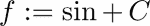

这是一种符号滥用，因为不应该能够将函数和常数相加。然而，常数却隐式地广播到函数中。常数 *C* 的广播版本是以下定义的函数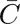：

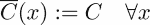

现在将两个函数相加是有意义的：

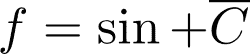

我们并不是为了吹毛求疵，而是因为类似的情况可能出现在数组中，如下面的代码所示：

```py
vector = arange(4) # array([0.,1.,2.,3.])
vector + 1\.        # array([1.,2.,3.,4.])
```

在这个例子中，所有的事情都像是将标量 `1.` 转换为与 `vector` 相同长度的数组，即 `array([1.,1.,1.,1.])`，然后添加到 `vector` 一样发生。

这个例子非常简单，所以我们继续展示更不明显的情况。

### 多变量函数

当构建多变量函数时，广播的一个更复杂的例子出现了。例如，假设我们被给出了两个一元函数，*f* 和 *g*，并且我们想要根据以下公式构建一个新的函数 *F*：

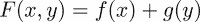

这显然是一个有效的数学定义。我们希望将这个定义表达为两个变量的两个函数之和，这两个函数定义为

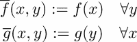

现在我们可以简单地写成：

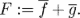

这种情况与添加列矩阵和行矩阵时出现的情况相似：

```py
C = arange(2).reshape(-1,1) # column
R = arange(2).reshape(1,-1) # row
C + R                       # valid addition: array([[0.,1.],[1.,2.]])
```

这在采样两个变量的函数时特别有用，如*典型示例*部分所示。

### 通用机制

我们已经看到了如何将一个函数和一个标量相加，以及如何从一个一变量的函数构建一个两个变量的函数。现在让我们关注使这成为可能的一般机制。一般机制由两个步骤组成：重塑和扩展。

首先，函数*g*被重塑为一个接受两个参数的函数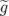。其中一个参数是一个虚拟参数，我们将其取为零，作为惯例：

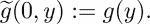

从数学上讲，的定义域现在是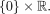。然后函数*f*以类似的方式重塑：

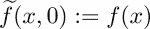

现在，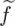和都接受两个参数，尽管其中一个始终为零。我们继续进行下一步，扩展。这是将常数转换为常数函数的相同步骤（参考常数函数示例）。

函数被扩展为：

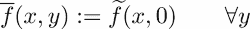

函数被扩展为：

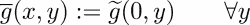

现在，两个变量的函数*F*，它被粗略地定义为*F(x,y) = f(x) + g(y)*，可以不参考其参数来定义：


例如，让我们描述一下常数的前置机制。常数是一个标量，也就是说，一个零参数的函数。因此，重塑步骤就是定义一个只有一个（空）变量的函数：

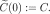

现在扩展步骤简单地通过以下方式继续进行：

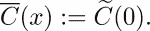

### 习惯用法

最后一个要素是关于如何向函数添加额外参数的惯例，即如何自动执行重塑。按照惯例，函数通过在左侧添加零自动重塑。

例如，如果一个两个参数的函数*g*需要被重塑为三个参数，新的函数将通过以下方式定义：

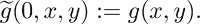

## 广播数组

我们现在重复观察，数组仅仅是几个变量的函数（请参阅第四章中的*数学预备知识*部分，*线性代数 - 数组*）。因此，数组广播严格遵循上述数学函数中解释的相同程序。NumPy 中自动执行广播。

在下图（*图 5.1*）中，我们展示了将形状为 (4, 3) 的矩阵添加到形状为 (1, 3) 的矩阵时会发生什么。第二个矩阵的形状为 (4, 3)：

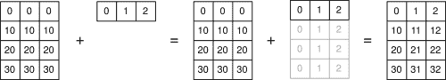

图 5.1：矩阵和向量之间的广播。

### 广播问题

当 NumPy 被给出两个形状不同的数组，并被要求执行需要两个形状相同才能进行的操作时，两个数组都会广播到公共形状。

假设两个数组的形状为 *s[1]* 和 *s[2]*。此广播分为两个步骤进行：

1.  如果形状 *s[1]* 比形状 *s[2]* 短，则会在形状 *s[1]* 的左侧添加一些 ones。这是一个重塑操作。

1.  当形状长度相同时，数组会扩展以匹配形状 *s[2]*（如果可能的话）。

假设我们想要将形状为 (3, ) 的向量添加到形状为 (4, 3) 的矩阵中。该向量需要被广播。第一个操作是重塑；向量的形状从 (3, ) 转换为 (1, 3)。第二个操作是扩展；形状从 (1, 3) 转换为 (4, 3)。

例如，假设一个大小为 *n* 的向量要广播到形状 (*m, n*)：

1.  *v* 将自动重塑为 (1, *n*)。

1.  *v* 被扩展到 (*m*, *n*)。

为了演示这一点，我们考虑一个由以下矩阵定义：

```py
M = array([[11, 12, 13, 14],
           [21, 22, 23, 24],
           [31, 32, 33, 34]])
```

以及由以下向量给出：

```py
v = array([100, 200, 300, 400])
```

现在我们可以直接添加 `M` 和 `v`：

```py
M + v # works directly
```

结果是这个矩阵：

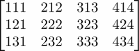

### 形状不匹配

无法自动将长度为 `n` 的向量 `v` 广播到形状 `(n,m)`。这在下图中进行了说明：

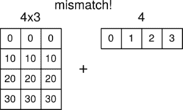

广播将失败，因为形状 `(n,)` 可能无法自动广播到形状 `(m, n)`。解决方案是手动将 `v` 重塑为形状 `(n,1)`。现在广播将像往常一样工作（仅通过扩展）：

```py
M + v.reshape(-1,1)
```

这里是另一个例子，定义一个矩阵 如下：

```py
M = array([[11, 12, 13, 14],
           [21, 22, 23, 24],
           [31, 32, 33, 34]])
```

和一个向量：

```py
v = array([100, 200, 300])
```

现在自动广播将失败，因为自动重塑不起作用：

```py
M + v # shape mismatch error
```

因此，解决方案是手动处理重塑。在这种情况下，我们想要在右侧添加 1，即把向量转换成一个列矩阵。然后广播将直接工作：

```py
M + v.reshape(-1,1)
```

对于形状参数 -1，请参阅第四章中的*访问和更改形状*部分，*线性代数 - 数组*。结果是这个矩阵：

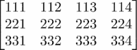

## 典型示例

让我们考察一些典型的例子，在这些例子中广播可能很有用。

### 重缩放行

假设 `M` 是一个 *n* × *m* 矩阵，并且我们想要将每一行乘以一个系数。这些系数存储在具有 *n* 个组件的向量 `coeff` 中。在这种情况下，自动重塑将不起作用，我们必须执行：

```py
rescaled = M*coeff.reshape(-1,1)
```

### 重新缩放列

这里设置是相同的，但我们希望将每个列通过存储在长度为 *m* 的向量 `coeff` 中的系数进行缩放。在这种情况下，自动重塑将起作用：

```py
rescaled = M*coeff
```

显然，我们也可以手动重塑并达到相同的结果：

```py
rescaled = M*coeff.reshape(1,-1)
```

### 二维函数的图像

假设 *u* 和 *v* 是向量，并且我们想要形成元素 *w[ij] = u[i] + v[j]* 的矩阵 *W*。这对应于函数 *F(x, y) = x + y*。矩阵 *W* 仅通过以下方式定义：

```py
W=u.reshape(-1,1) + v
```

如果向量 *u* 和 *v* 分别是 [0, 1] 和 [0, 1, 2]，则结果是：

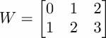

更一般地，假设我们想要采样函数 *w*(*x, y*) *:=* cos(*x*) *+* sin(2*y*)。假设向量 *x* 和 *y* 已经定义，那么采样值矩阵 *w* 通过以下方式获得：

```py
w = cos(x).reshape(-1,1) + sin(2*y)
```

注意，这通常与 `ogrid` 结合使用。从 `ogrid` 获得的向量已经方便地塑形，适用于广播。这允许以下优雅的函数 cos(*x*) *+* sin(2*y*) 的采样：

```py
x,y = ogrid[0:1:3j,0:1:3j] 
# x,y are vectors with the contents of linspace(0,1,3)
w = cos(x) + sin(2*y)
```

`ogrid` 的语法需要一些解释。首先，`ogrid` 不是一个函数。它是一个具有 `__getitem__` 方法的类的一个实例（参考第八章中的 *Attributes* 部分 [ch08.html "第八章。类"]，*Classes*）。这就是为什么它使用方括号而不是圆括号的原因。

这两个命令是等效的：

```py
x,y = ogrid[0:1:3j, 0:1:3j]
x,y = ogrid.__getitem__((slice(0, 1, 3j),slice(0, 1, 3j)))
```

在前面的例子中，步长参数是一个复数。这是为了表明它是步数而不是步长。步长参数的规则一开始可能看起来有些令人困惑：

+   如果步长是一个实数，那么它定义了起始点和终点之间的步长大小，并且终点不包含在列表中。

+   如果步长是一个复数 `s`，那么 `s.imag` 的整数部分定义了起始点和终点之间的步数，并且终点包含在列表中。

`ogrid` 的另一个输出示例是一个包含两个数组的元组，可以用于广播：

```py
x,y = ogrid[0:1:3j, 0:1:3j]
```

给出：

```py
array([[ 0\. ],
       [ 0.5],
       [ 1\. ]])
array([[ 0\. ,  0.5,  1\. ]])
```

这相当于：

```py
x,y = ogrid[0:1.5:.5, 0:1.5:.5]
```

# 稀疏矩阵

具有少量非零元素的矩阵称为**稀疏矩阵**。稀疏矩阵在科学计算中很常见，例如在数值求解偏微分方程时描述离散微分算子。

稀疏矩阵通常具有很大的维度，有时甚至大到整个矩阵（包含零元素）都无法适应可用的内存。这是为稀疏矩阵创建特殊类型的一个动机。另一个动机是避免零矩阵元素的操作可以更好地提高性能。

线性代数中，对于通用、无结构的稀疏矩阵，只有非常有限数量的算法。大多数都是迭代的，并且基于稀疏矩阵矩阵-向量乘法的有效实现。

稀疏矩阵的例子包括对角矩阵或带状矩阵。这些矩阵的简单模式允许直接存储策略；主对角线和次对角线存储在 1D 数组中。通过 `diag` 命令可以将稀疏表示转换为经典数组类型，反之亦然。

通常，没有如此简单的结构，稀疏矩阵的描述需要特殊的技术和标准。在这里，我们展示了稀疏矩阵的行和列导向类型，两者都可通过模块 `scipy.sparse` 获取。

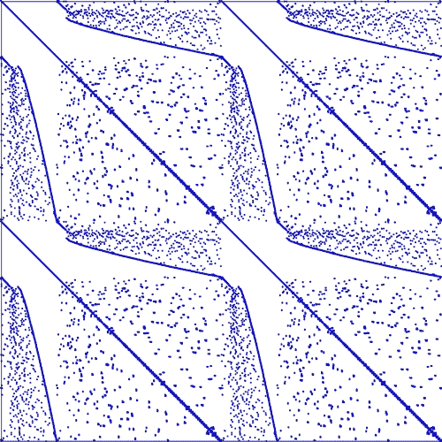

图 5.2：弹性板有限元模型的刚度矩阵。像素表示 1250 × 1250 矩阵中的非零项

## 稀疏矩阵格式

`scipy.sparse` 模块提供了许多不同的稀疏矩阵存储格式。我们在这里只描述最重要的几种：CSR、CSC 和 LIL。LIL 格式应用于生成和修改稀疏矩阵；CSR 和 CSC 是矩阵-矩阵和矩阵-向量操作的效率格式。

### 压缩稀疏行

压缩稀疏行格式（CSR）使用三个数组：`data`、`indptr` 和 `indices`：

+   1D 数组 `data` 按顺序存储所有非零值。它包含与非零元素数量相同的元素，通常用变量 `nnz` 表示。

+   1D 数组 `indptr` 包含整数，使得 `indptr[i]` 是 `data` 中元素的索引，它是行 *i* 的第一个非零元素。如果行 *i* 的所有元素都是零，则 `indptr[i]==indptr[i+1]`。如果原始矩阵有 *m* 行，则 `len(indptr)==m+1`。

+   1D 数组 `indices` 包含列索引信息，使得 `indices[indptr[i]:indptr[i+1]]` 是一个整数数组，包含行 *i* 中非零元素的列索引。显然，`len(indices)==len(data)==nnz`。

让我们看看一个例子：矩阵的 CSR 格式：

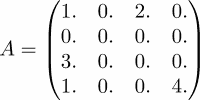

由三个数组给出：

```py
data = (1\. 2\. 3\. 4.)
indptr = (0 2 2 3 5)
indices = (0 2 0 0 3)
```

`scipy.sparse` 模块提供了一个类型 `csr_matrix`，它有一个构造函数，可以按以下方式使用：

+   使用 2D 数组作为参数

+   在 `scipy.sparse` 中的其他稀疏格式之一中

+   使用形状参数 `(m,n)` 生成 CSR 格式的零矩阵

+   通过一个 1D 数组 `data` 和一个形状为 `(2,len(data))` 的整数数组 `ij`，其中 `ij[0,k]` 是矩阵中 `data[k]` 的行索引，`ij[1,k]` 是列索引

+   可以直接将三个参数 `data`、`indptr` 和 `indices` 传递给构造函数

前两种选项用于转换目的，而最后两种直接定义稀疏矩阵。

考虑上述示例在 Python 中的样子：

```py
import scipy.sparse as sp
A = array([[1,0,2,0],[0,0,0,0],[3.,0.,0.,0.],[1.,0.,0.,4.]])
AS = sp.csr_matrix(A)
```

在其他方面，以下属性被提供：

```py
AS.data      # returns array([ 1., 2., 3., 1., 4.]) 
AS.indptr    # returns array([0, 2, 2, 3, 5])
AS.indices   # returns array([0, 2, 0, 0, 3])
AS.nnz       # returns 5
```

### 压缩稀疏列

CSR 格式有一个列向量的双胞胎 - 压缩稀疏列 (CSC) 格式。与 CSR 格式相比，唯一的区别是 `indptr` 和 `indices` 数组的定义，现在与列相关。CSC 格式的类型是 `csc_matrix`，其使用与之前本节中解释的 `csr_matrix` 相对应。

继续以 CSC 格式相同的示例：

```py
import scipy.sparse as sp
A = array([[1,0,2,0],[0,0,0,0],[3.,0.,0.,0.],[1.,0.,0.,4.]])
AS = sp.csc_matrix(A)
AS.data         # returns array([ 1., 3., 1., 2., 4.]) 
AS.indptr       # returns array([0, 3, 3, 4, 5])
AS.indices      # returns array([0, 2, 3, 0, 3])
AS.nnz          # returns 5
```

### 基于行的链表格式

链表稀疏格式将非零矩阵项按行存储在列表 `data` 中，使得 `data[k]` 是行 *k* 中非零项的列表。如果该行的所有项都是 0，则包含一个空列表。

第二个列表，`rows`，在位置 *k* 处包含行 *k* 中非零元素的列索引列表。以下是一个 **基于行的链表格式 (LIL)** 格式的示例：

```py
import scipy.sparse as sp
A = array([[1,0,2,0],[0,0,0,0], [3.,0.,0.,0.], [1.,0.,0.,4.]]) 
AS = sp.lil_matrix(A)
AS.data     # returns array([[1.0, 2.0], [], [3.0], [1.0, 4.0]], dtype=object)
AS.rows     # returns array([[0, 2], [], [0], [0, 3]], dtype=object)
AS.nnz      # returns 5
```

#### 在 LIL 格式中修改和切片矩阵

LIL 格式最适合切片，即以 LIL 格式提取子矩阵，以及通过插入非零元素来更改稀疏模式。以下示例演示了切片：

```py
BS = AS[1:3,0:2]
BS.data     # returns array([[], [3.0]], dtype=object)
BS.rows     # returns array([[], [0]], dtype=object)
```

插入新的非零元素会自动更新属性：

```py
AS[0,1] = 17 
AS.data # returns array([[1.0, 17.0, 2.0], [], [3.0], [1.0, 4.0]])
AS.rows              # returns array([[0, 1, 2], [], [0], [0, 3]])
AS.nnz               # returns 6
```

在其他稀疏矩阵格式中不鼓励这些操作，因为它们效率极低。

## 生成稀疏矩阵

NumPy 命令 `eye`、`identity`、`diag` 和 `rand` 有它们的稀疏对应物。它们接受一个额外的参数；它指定了结果矩阵的稀疏矩阵格式。

以下命令生成单位矩阵，但以不同的稀疏矩阵格式：

```py
import scipy.sparse as sp
sp.eye(20,20,format = 'lil') 
sp.spdiags(ones((20,)),0,20,20, format = 'csr') 
sp.identity(20,format ='csc')
```

`sp.rand` 命令接受一个额外的参数，用于描述生成的随机矩阵的密度。密集矩阵的密度为 1，而零矩阵的密度为 0：

```py
import scipy.sparse as sp 
AS=sp.rand(20,200,density=0.1,format=’csr’)
AS.nnz # returns 400
```

与 NumPy 命令 `zeroes` 没有直接对应关系。完全填充零的矩阵通过使用形状参数作为构造函数参数实例化相应的类型来生成：

```py
import scipy.sparse as sp
Z=sp.csr_matrix((20,200))
Z.nnz    # returns 0
```

## 稀疏矩阵方法

有方法可以将一种稀疏类型转换为另一种类型或转换为数组：

```py
AS.toarray # converts sparse formats to a numpy array 
AS.tocsr
AS.tocsc
AS.tolil
```

可以通过方法 `issparse`、`isspmatrix_lil`、`isspmatrix_csr` 和 `isspmatrix_csc` 检查稀疏矩阵的类型。

稀疏矩阵上的逐元素操作 `+`、`*`、`/` 和 `**` 定义与 NumPy 数组相同。无论操作数的稀疏矩阵格式如何，结果总是 `csr_matrix`。将逐元素操作函数应用于稀疏矩阵需要首先将它们转换为 CSR 或 CSC 格式，并对其 `data` 属性应用函数，如下例所示。

稀疏矩阵的逐元素正弦可以通过对其 `data` 属性的操作来定义：

```py
import scipy.sparse as sp
def sparse_sin(A):
    if not (sp.isspmatrix_csr(A) or sp.isspmatrix_csc(A)):
        A = A.tocsr()
A.data = sin(A.data)
return A
```

对于矩阵-矩阵或矩阵-向量乘法，有一个稀疏矩阵方法 `dot`。它返回 `csr_matrix` 或 1D NumPy `array`：

```py
import scipy.sparse as sp
A = array([[1,0,2,0],[0,0,0,0],[3.,0.,0.,0.],[1.,0.,0.,4.]])
AS = sp.csr_matrix(A)
b = array([1,2,3,4])
c = AS.dot(b)      # returns array([ 7., 0., 3., 17.]) 
C = AS.dot(AS)     # returns  csr_matrix
d = dot(AS,b)      # does not return the expected result! 

```

### 小贴士

避免在稀疏矩阵上使用 NumPy 的 `dot` 命令，因为这可能会导致意外结果。请使用 `scipy.sparse` 中的 `dot` 命令。

其他线性代数操作，如系统求解、最小二乘法、特征值和奇异值，由 `scipy.sparse.linalg` 模块提供。

# 摘要

视图的概念是您应该从本章中学到的重点之一。错过这个主题，在调试代码时可能会给您带来困难。布尔数组在本书的各个地方都有出现。它们是处理数组时避免冗长的 `if` 语句和循环的便捷且紧凑的工具。在几乎所有的大型计算项目中，稀疏矩阵都会成为一个问题。您已经看到了如何处理这些问题以及哪些相关方法可用。
