# 第六章 绘图

使用 Python 绘图可以通过 matplotlib 模块的 `pyplot` 部分完成。使用 matplotlib，您可以创建高质量的图形和图形，并绘制和可视化您的结果。Matplotlib 是开源软件，可以免费获得，[[21]](apa.html "附录 . 参考文献")。matplotlib 网站还包含带有示例的优秀文档，[[35]](apa.html "附录 . 参考文献")。在本节中，我们将向您展示如何使用最常用的功能。即将到来的章节中的示例假设您已导入模块，如下所示：

```py
from matplotlib.pyplot import *
```

如果您想在 IPython 中使用绘图命令，建议在启动 IPython shell 后直接运行 `%matplotlib` 魔法命令。这将为 IPython 准备交互式绘图。

# 基本绘图

标准绘图函数是 `plot`。调用 `plot(x,y)` 会创建一个包含 *y* 作为 *x* 函数的图形窗口。输入参数是长度相等的数组（或列表）。也可以使用 `plot(y)`，在这种情况下，*y* 中的值将与其索引相对应进行绘图，即 `plot(y)` 是 `plot(range(len(y)),y)` 的简写形式。

下面是一个示例，展示了如何使用 200 个样本点绘制 *x* ϵ [-2π, 2π] 的 sin(*x*)，并在每个第四个点设置标记：

```py
# plot sin(x) for some interval
x = linspace(-2*pi,2*pi,200)
plot(x,sin(x))

# plot marker for every 4th point
samples = x[::4]
plot(samples,sin(samples),'r*')

# add title and grid lines
title('Function sin(x) and some points plotted')
grid()
```

结果如下所示（*图 6.1*）：

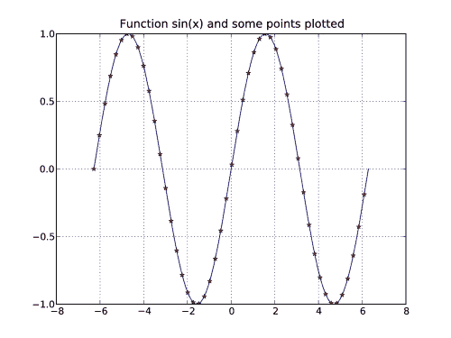

图 6.1：函数 sin(x) 的绘图，显示了网格线。

如您所见，标准绘图是一个实心蓝色曲线。每个轴都会自动缩放以适应值，但也可以手动设置。颜色和绘图选项可以在前两个输入参数之后给出。这里，`r*` 表示红色星形标记。格式化将在下一节中更详细地介绍。`title` 命令在绘图区域上方放置标题文本字符串。

多次调用 `plot` 将在同一窗口中叠加绘图。要获取一个新干净的图形窗口，请使用 `figure()`。`figure` 命令可能包含一个整数，例如 `figure(2)`，这可以用来在图形窗口之间切换。如果没有带有该数字的图形窗口，将创建一个新的窗口，否则，该窗口将被激活以进行绘图，并且所有后续的绘图命令都将应用于该窗口。

可以使用 `legend` 函数以及为每个绘图调用添加标签来解释多个绘图。以下示例使用 `polyfit` 和 `polyval` 命令将多项式拟合到一组点，并带有图例进行绘图：

```py
# —Polyfit example—
x = range(5)
y = [1,2,1,3,5]
p2 = polyfit(x,y,2)
p4 = polyfit(x,y,4)

# plot the polynomials and points
xx = linspace(-1,5,200) 
plot(xx, polyval(p2, xx), label='fitting polynomial of degree 2')
plot(xx, polyval(p4, xx),
                label='interpolating polynomial of degree 4') 
plot(x,y,'*')

# set the axis and legend
axis([-1,5,0,6])
legend(loc='upper left', fontsize='small')
```

在这里，您还可以看到如何使用 `axis([xmin,xmax,ymin,ymax])` 手动设置轴的范围。`legend` 命令接受可选的放置和格式化参数；在这种情况下，图例放置在右上角，并以小字体格式化，如下所示（*图 6.2*）。

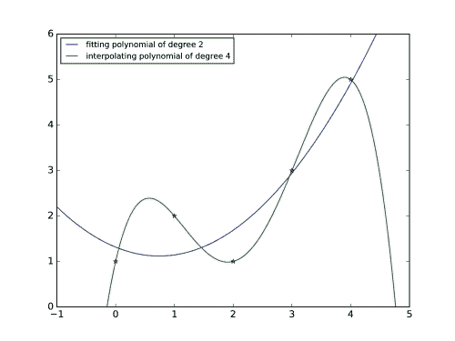

图 6.2：拟合到相同点的两个多项式。

作为基本绘图的最终示例，我们演示如何在二维中执行散点图和对数图。

2D 点散点图的示例：

```py
# create random 2D points
import numpy
x1 = 2*numpy.random.standard_normal((2,100))
x2 = 0.8*numpy.random.standard_normal((2,100)) + array([[6],[2]])
plot(x1[0],x1[1],'*')
plot(x2[0],x2[1],'r*')
title('2D scatter plot')
```

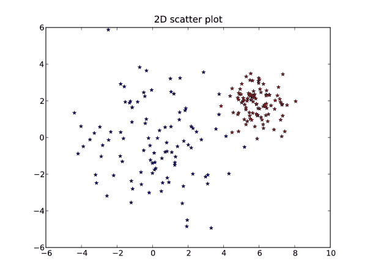

图 6.3(a)：散点图的示例

以下代码是使用`loglog`进行对数图的示例：

```py
# log both x and y axis 
x = linspace(0,10,200) 
loglog(x,2*x**2, label = 'quadratic polynomial',
                            linestyle = '-', linewidth = 3)
loglog(x,4*x**4, label = '4th degree polynomial',
                            linestyle = '-.', linewidth = 3)
loglog(x,5*exp(x), label = 'exponential function', linewidth = 3)
title('Logarithmic plots')
legend(loc = 'best')
```

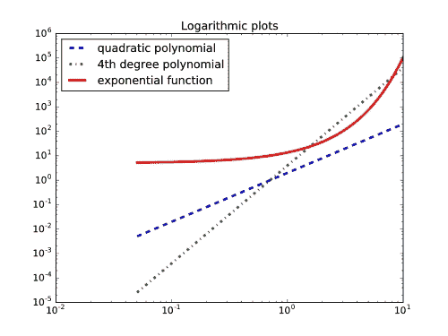

图 6.3(b)：具有对数 x 和 y 轴的绘图示例

前面图表（*图 6.3(a)*和*图 6.3(b)*）中显示的示例使用了`plot`和`loglog`的一些参数，这些参数允许特殊格式化。在下一节中，我们将更详细地解释这些参数。

# 格式化

图表和图形的外观可以风格化和自定义，以看起来像您想要的样子。一些重要的变量是`linewidth`，它控制图形线的粗细；`xlabel`、`ylabel`，它们设置轴标签，`color`用于图形颜色，`transparent`用于透明度。本节将告诉您如何使用其中的一些。以下是一个包含更多关键字的示例：

```py
k = 0.2
x = [sin(2*n*k) for n in range(20)]
plot(x, color='green', linestyle='dashed', marker='o', 
                       markerfacecolor='blue', markersize=12, linewidth=6)
```

如果您只需要基本的样式更改，可以使用简短命令，例如设置颜色和线型。以下表格（*表 6.1*）显示了这些格式化命令的一些示例。您可以使用简短的字符串语法`plot(...,'ro-')`，或者更明确的语法`plot(..., marker='o', color='r', linestyle='-')`。

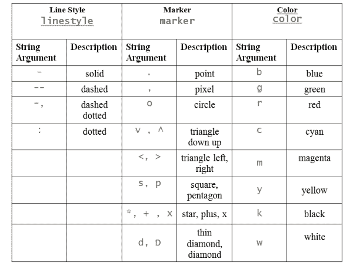

表 6.1：一些常见的绘图格式化参数

要将颜色设置为绿色并使用`'o'`标记，我们写入：

```py
plot(x,'go')
```

要绘制直方图而不是常规图形，请使用`hist`命令：

```py
# random vector with normal distribution
sigma, mu = 2, 10
x = sigma*numpy.random.standard_normal(10000)+mu 
hist(x,50,normed=1)
z = linspace(0,20,200)
plot(z, (1/sqrt(2*pi*sigma**2))*exp(-(z-mu)**2/(2*sigma**2)),'g')
# title with LaTeX formatting 
title('Histogram with '.format(mu,sigma))
```

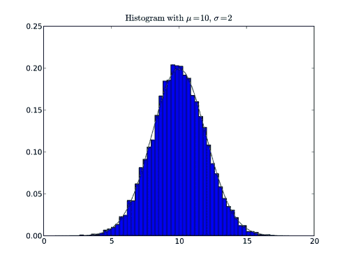

图 6.4：具有 50 个桶和表示真实分布的绿色曲线的正态分布

结果的图表看起来与前面的图（*图 6.4*）相似。标题和任何其他文本都可以使用 LaTeX 进行格式化以显示数学公式。LaTeX 格式化被包含在一对`$`符号内。此外，请注意使用`format`方法进行的字符串格式化，请参阅第二章中的*字符串*部分，*变量和基本类型*。

有时字符串格式化的括号会与 LaTeX 括号环境冲突。如果发生这种情况，请将 LaTeX 括号替换为双括号，例如，`x_{1}`应替换为`x_{{1}}`。文本可能包含与字符串转义序列重叠的序列，例如，`\tau`将被解释为制表符`\t`。一个简单的解决方案是在字符串前添加`r`，例如`r'\tau'`；这使得它成为一个原始字符串。

使用`subplot`命令可以在一个图形窗口中放置多个图形。考虑以下示例，它迭代地平均正弦曲线上的噪声。

```py
def avg(x):
    """ simple running average """
    return (roll(x,1) + x + roll(x,-1)) / 3
# sine function with noise
x = linspace(-2*pi, 2*pi,200)
y = sin(x) + 0.4*rand(200)

# make successive subplots
for iteration in range(3):
    subplot(3, 1, iteration + 1)
    plot(x,y, label = '{:d} average{}'.format(iteration, 's' if iteration > 1 else ''))
    yticks([])
    legend(loc = 'lower left', frameon = False)
    y = avg(y) #apply running average 
subplots_adjust(hspace = 0.7)
```

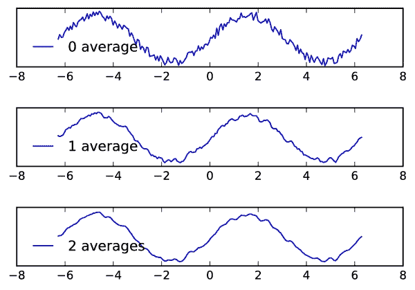

图 6.5：在同一图形窗口中多次绘图的示例

函数 `avg` 使用 `roll` 调用来移动数组中的所有值。`subplot` 接受三个参数：垂直图的数量、水平图的数量以及一个索引，指示要绘制的位置（按行计数）。请注意，我们使用了 `subplots_adjust` 命令来添加额外空间以调整子图之间的距离。

一个有用的命令是 `savefig`，它允许你将图形保存为图像（这也可以从图形窗口中完成）。此命令支持许多图像和文件格式，它们通过文件名的扩展名指定，如下所示：

```py
savefig('test.pdf')  # save to pdf
```

或者

```py
savefig('test.svg')  # save to svg (editable format)
```

你可以将图像放置在非白色背景上，例如，网页。为此，可以将 `transparent` 参数设置为使图形的背景透明：

```py
savefig('test.pdf', transparent=True)
```

如果你打算将图形嵌入到 LaTeX 文档中，建议通过将图形的边界框紧贴绘图来减少周围的白空间，如图所示：

```py
savefig('test.pdf', bbox_inches='tight')
```

# 网格和等高线

一个常见任务是图形化表示矩形上的标量函数：

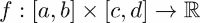

为了做到这一点，我们首先必须在矩形 [*a*,*b*] x [*c*,*d*] 上生成一个网格。这是通过 `meshgrid` 命令完成的：

```py
n = ... # number of discretization points along the x-axis
m = ... # number of discretization points along the x-axis 
X,Y = meshgrid(linspace(a,b,n), linspace(c,d,m))
```

`X` 和 `Y` 是形状为 `(n,m)` 的数组，其中 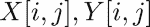 包含网格点 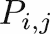 的坐标，如图中下一个图 *(图 6.6)* 所示：

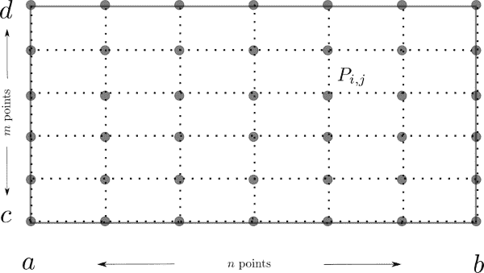

图 6.6：由 meshgrid 离散化的矩形

使用 `meshgrid` 离散化的矩形将用于可视化迭代的行性行为。但首先，我们将使用它来绘制函数的水平曲线。这是通过 `contour` 命令完成的。

作为例子，我们选择了 Rosenbrock 的香蕉函数：

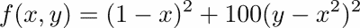

它用于挑战优化方法。函数值下降到一个香蕉形状的谷地，而这个谷地本身又缓慢地下降到函数的全局最小值 (1, 1)。

首先，我们使用 `contour` 显示水平曲线。

```py
rosenbrockfunction = lambda x,y: (1-x)**2+100*(y-x**2)**2 
X,Y = meshgrid(linspace(-.5,2.,100), linspace(-1.5,4.,100))
Z = rosenbrockfunction(X,Y) 
contour(X,Y,Z,logspace(-0.5,3.5,20,base=10),cmap='gray') 
title('Rosenbrock Function: ')
xlabel('x')
ylabel('y')
```

此图绘制了由第四个参数给出的水平曲线，并使用了 `gray` 色彩映射。此外，我们使用了从 10^(0.5) 到 10³ 的对数间隔步骤，通过 `logscale` 函数定义水平，如图中下一个图所示。

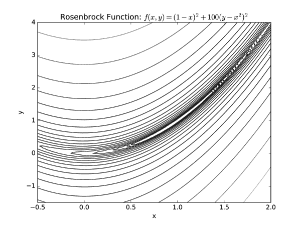

图 6.7：Rosenbrock 函数的等高线图

在前面的例子中，使用关键字 `lambda` 指示的匿名函数被用来使代码紧凑。匿名函数在 第七章 的 *匿名函数 - lambda 关键字* 部分中解释，*函数*，*匿名函数*。如果没有将水平作为参数传递给 `contour`，函数会自行选择适当的水平。

`contourf` 函数执行与 `contour` 相同的功能，但根据不同的级别用颜色填充绘图。轮廓图非常适合可视化数值方法的行为。我们在这里通过展示优化方法的迭代来展示这一点。

我们继续前面的例子，并描绘了由 Powell 方法生成的 Rosenbrock 函数最小值的步骤，[[27]](apa.html "附录 . 参考文献")，我们将应用它来找到 Rosenbrock 函数的最小值：

```py
import scipy.optimize as so
rosenbrockfunction = lambda x,y: (1-x)**2+100*(y-x**2)**2
X,Y=meshgrid(linspace(-.5,2.,100),linspace(-1.5,4.,100))
Z=rosenbrockfunction(X,Y)
cs=contour(X,Y,Z,logspace(0,3.5,7,base=10),cmap='gray')
rosen=lambda x: rosenbrockfunction(x[0],x[1])
solution, iterates = so.fmin_powell(rosen,x0=array([0,-0.7]),retall=True)
x,y=zip(*iterates)
plot(x,y,'ko') # plot black bullets
plot(x,y,'k:',linewidth=1) # plot black dotted lines
title("Steps of Powell's method to compute a  minimum")
clabel(cs)
```

迭代方法 `fmin_powell` 将 Powell 方法应用于寻找最小值。它从一个给定的起始值 *x[0]* 开始，并在选项 `retall=True` 被给出时报告所有迭代。经过十六次迭代后，找到了解 *x=*0*, y=*0*。这些迭代在下面的轮廓图中以项目符号的形式表示（*图 6.8*）。

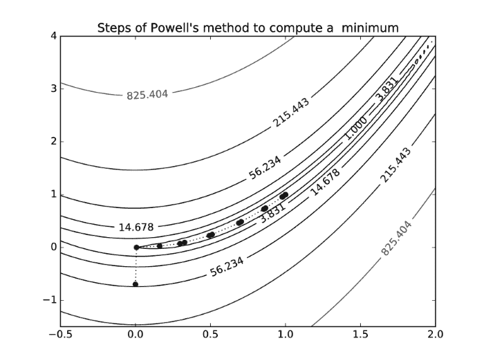

图 6.8：Rosenbrock 函数的轮廓图，以及优化方法的搜索路径

`contour` 还创建了一个轮廓集对象，我们将其分配给变量 `cs`。然后，`clabel` 使用它来注释相应函数值的级别，如图中所示（*图 6.8*）。

# 图像和轮廓

让我们看看一些将数组可视化为例的例子。以下函数将创建 Mandelbrot 分形**的颜色值矩阵**。在这里，我们考虑一个依赖于复数参数 *c* 的定点迭代：

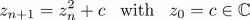

根据这个参数的选择，它可能或可能不会创建一个有界的复数值序列 *z[n]*。

对于每个 *c* 的值，我们检查 *z[n]* 是否超过一个规定的界限。如果在 `maxit` 次迭代内保持低于该界限，我们假设该序列是有界的。

注意，在下面的代码片段中，`meshgrid` 被用来生成一个复数参数值 *c:* 的矩阵。

```py
def mandelbrot(h,w, maxit=20):
    X,Y = meshgrid(linspace(-2, 0.8, w), linspace(-1.4, 1.4, h))
    c = X + Y*1j
    z = c
    exceeds = zeros(z.shape, dtype=bool)

    for iteration in range(maxit):
        z  = z**2 + c
        exceeded = abs(z) > 4
        exceeds_now = exceeded & (logical_not(exceeds))  
        exceeds[exceeds_now] = True        
        z[exceeded] = 2  # limit the values to avoid overflow
    return exceeds

imshow(mandelbrot(400,400),cmap='gray')
axis('off')
```

命令 `imshow` 显示矩阵作为图像。选定的颜色图显示了序列出现无界区域的白色和其他黑色。在这里，我们使用了 `axis('off')` 来关闭坐标轴，因为这可能对图像不是那么有用。

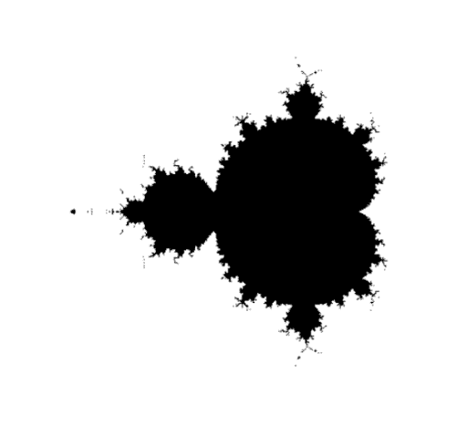

图 6.9：使用 imshow 将矩阵作为图像可视化的示例。

默认情况下，`imshow` 使用插值来使图像看起来更美观。当矩阵较小时，这一点很明显。下一个图显示了使用以下方法的差异：

```py
imshow(mandelbrot(40,40),cmap='gray')
```

和

```py
imshow(mandelbrot(40,40), interpolation='nearest', cmap='gray')
```

在第二个例子中，像素值只是被复制。

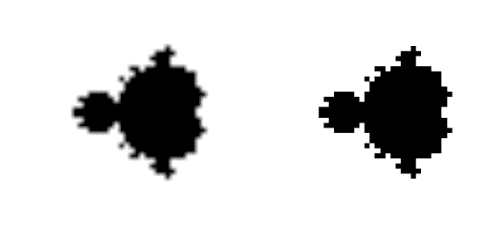

图 6.10：使用 imshow 的线性插值与使用最近邻插值之间的差异

有关使用 Python 处理和绘制图像的更多详细信息，请参阅 [[30]](apa.html "附录 . 参考文献")。

# Matplotlib 对象

到目前为止，我们使用了 matplotlib 的`pyplot`模块。此模块使我们能够直接使用最重要的绘图命令。通常，我们感兴趣的是创建一个图形并立即显示它。有时，尽管如此，我们想要生成一个稍后可以通过更改其一些属性进行修改的图形。这要求我们以面向对象的方式处理图形对象。在本节中，我们将介绍一些修改图形的基本步骤。对于更复杂的 Python 绘图面向对象方法，您必须离开`pyplot`并直接深入到具有广泛文档的`matplotlib`。

## 坐标轴对象

当创建一个稍后需要修改的图表时，我们需要引用一个图形对象和一个坐标轴对象。为此，我们首先需要创建一个图形，然后定义一些坐标轴及其在图形中的位置。我们不应忘记将这些对象分配给一个变量：

```py
fig = figure()
ax = subplot(111)
```

根据子图的使用，一个图形可以有几个坐标轴对象。在第二步中，将绘图与给定的坐标轴对象关联起来：

```py
fig = figure(1)
ax = subplot(111)
x = linspace(0,2*pi,100) 
# We set up a function that modulates the amplitude of the sin function
amod_sin = lambda x: (1.-0.1*sin(25*x))*sin(x)
# and plot both...
ax.plot(x,sin(x),label = 'sin') 
ax.plot(x, amod_sin(x), label = 'modsin')
```

这里我们使用了一个由`lambda`关键字指示的匿名函数。我们将在第七章的*匿名函数 - lambda 关键字*部分中解释这个结构，*函数*。实际上，这两个绘图命令将两个`Lines2D`对象填充到`ax.lines`列表中：

```py
ax.lines #[<matplotlib.lines.Line2D at ...>, <matplotlib.lines.Line2D at ...>]
```

使用标签是一个好习惯，这样我们就可以以后以简单的方式识别对象：

```py
for il,line in enumerate(ax.lines):
    if line.get_label() == 'sin':
       break
```

我们现在以允许进一步修改的方式设置了一些事情。到目前为止得到的图形在先前的图形中显示（图 6.11，左）。

## 修改线属性

我们只是通过其标签识别了一个特定的线对象。它是`ax.lines`列表中的一个元素，索引为`il`。所有属性都收集在一个字典中

```py
dict_keys(['marker', 'markeredgewidth', 'data', 'clip_box', 'solid_capstyle', 'clip_on', 'rasterized', 'dash_capstyle', 'path', 'ydata', 'markeredgecolor', 'xdata', 'label', 'alpha', 'linestyle', 'antialiased', 'snap', 'transform', 'url', 'transformed_clip_path_and_affine', 'clip_path', 'path_effects', 'animated', 'contains', 'fillstyle', 'sketch_params', 'xydata', 'drawstyle', 'markersize', 'linewidth', 'figure', 'markerfacecolor', 'pickradius', 'agg_filter', 'dash_joinstyle', 'color', 'solid_joinstyle', 'picker', 'markevery', 'axes', 'children', 'gid', 'zorder', 'visible', 'markerfacecoloralt'])
```

这可以通过以下命令获得：

```py
ax.lines[il].properties()
```

它们可以通过相应的设置方法进行更改。让我们更改正弦曲线的线型：

```py
ax.lines[il].set_linestyle('-.')
ax.lines[il].set_linewidth(2)
```

我们甚至可以修改数据，如下所示：

```py
ydata=ax.lines[il].get_ydata()
ydata[-1]=-0.5
ax.lines[il].set_ydata(ydata)
```

结果在下一幅图中显示（图 6.11，右）：

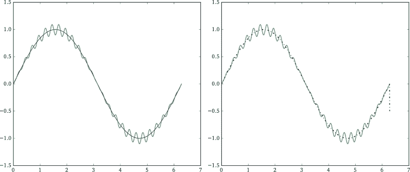

图 6.11：调幅正弦函数（左）和最后一个数据点损坏的曲线（右）。

## 注释

一个有用的坐标轴方法是`annotate`。它在一个给定的位置设置注释，并用箭头指向绘图中的另一个位置。箭头可以在字典中指定属性：

```py
annot1=ax.annotate('amplitude modulated\n curve', (2.1,1.0),(3.2,0.5),
       arrowprops={'width':2,'color':'k', 'connectionstyle':'arc3,rad=+0.5', 
                   'shrink':0.05},
       verticalalignment='bottom', horizontalalignment='left',fontsize=15, 
                   bbox={'facecolor':'gray', 'alpha':0.1, 'pad':10})
annot2=ax.annotate('corrupted data', (6.3,-0.5),(6.1,-1.1),
       arrowprops={'width':0.5,'color':'k','shrink':0.1},
       horizontalalignment='center', fontsize=12)
```

在上面的第一个注释示例中，箭头指向坐标为(*2.1, 1.0*)的点，文本的左下角坐标是(*3.2, 0.5*)。如果不作其他说明，坐标以方便的数据坐标系给出，该坐标系指的是用于生成绘图的数据。

此外，我们还演示了由 `arrowprop` 字典指定的几个箭头属性。您可以通过 `shrink` 键来缩放箭头。设置 `'shrink':0.05` 将箭头大小减少 5%，以保持与它指向的曲线的距离。您可以让箭头跟随样条弧线或使用 `connectionstyle` 键给出其他形状。

通过将额外的关键字参数传递给注释方法，可以创建文本属性或文本周围的边界框，请参考以下图（*图 6.12，左*）：

在进行注释实验时，有时需要移除我们希望拒绝的尝试。因此，我们将注释对象分配给一个变量，这使得我们可以通过其 `remove` 方法移除注释：

```py
annot1.remove()
```

## 在曲线之间填充区域

填充是一个理想的工具，可以突出曲线之间的差异，例如预期数据上的噪声、近似与精确函数等。

填充是通过轴方法完成的

```py
ax.fill_between(x,y1,y2)
```

对于下一张图，我们使用了：

```py
axf = ax.fill_between(x, sin(x), amod_sin(x), facecolor='gray')
```

`where` 是一个非常方便的参数，需要一个布尔数组来指定额外的填充条件。

```py
axf = ax.fill_between(x, sin(x), amod_sin(x),where=amod_sin(x)-sin(x) > 0, facecolor=’gray’)
```

选择填充区域的布尔数组是 `amod_sin(x)-sin(x) > 0`。

下一个图显示了具有两种填充区域变体的曲线：

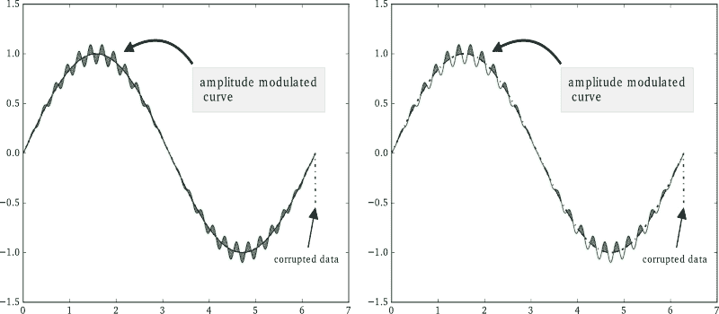

图 6.12：带有注释和填充区域的振幅调制正弦函数（左）以及仅使用 `where` 参数部分填充区域的修改后的图形（右）。

如果您亲自测试这些命令，不要忘记在尝试部分填充之前移除完整的填充，否则您将看不到任何变化：

```py
axf.remove()
```

相关的填充命令是 `fill` 和 `fill_betweenx`。

## 刻度和刻度标签

在演讲、海报和出版物中的图形，如果不过度加载不必要的信息，看起来会更好。您希望引导观众关注包含信息的部分。在我们的例子中，我们通过移除 *x* 轴和 *y* 轴上的刻度以及引入与问题相关的刻度标签来清理图片：

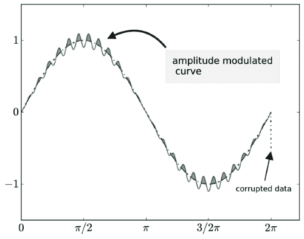

图 6.13：带有注释和填充区域以及修改后的刻度和刻度标签的振幅调制正弦函数的完整示例。

```py
ax.set_xticks(array([0,pi/2,pi,3/2*pi,2*pi]))
ax.set_xticklabels(('$0$','$\pi/2$','$\pi$','$3/2 \pi$','$2 \pi$'),fontsize=18)
ax.set_yticks(array([-1.,0.,1]))
ax.set_yticklabels(('$-1$','$0$','$1$'),fontsize=18)
```

注意，我们在字符串中使用了 LaTeX 格式化来表示希腊字母，以正确设置公式，并使用 LaTeX 字体。将字体大小增加以使最终图形可以缩小到文本文档中而不影响轴的可读性也是一个好习惯。此引导示例的最终结果在上一张图中显示（*图 6.13*）。

# 制作 3D 图

有一些有用的 `matplotlib` 工具包和模块，可以用于各种特殊目的。在本节中，我们描述了一种生成 3D 图的方法。

`mplot3d`工具包提供了点、线、等高线、表面以及所有其他基本组件的 3D 绘图，以及 3D 旋转和缩放。通过在轴对象中添加关键字`projection='3d'`来制作 3D 图，如下例所示：

```py
from mpl_toolkits.mplot3d import axes3d

fig = figure()
ax = fig.gca(projection='3d')
# plot points in 3D
class1 = 0.6 * random.standard_normal((200,3))
ax.plot(class1[:,0],class1[:,1],class1[:,2],'o')
class2 = 1.2 * random.standard_normal((200,3)) + array([5,4,0])
ax.plot(class2[:,0],class2[:,1],class2[:,2],'o')
class3 = 0.3 * random.standard_normal((200,3)) + array([0,3,2])
ax.plot(class3[:,0],class3[:,1],class3[:,2],'o')
```

如您所见，您需要从`mplot3d`导入`axes3D`类型。生成的图像显示了以下图中的散点 3D 数据（*图 6.14*）

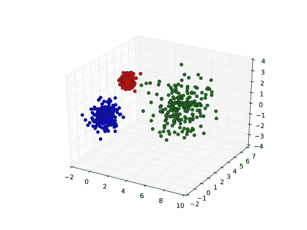

图 6.14：使用 mplot3d 工具包绘制 3D 数据

绘制表面与绘制图形一样简单。以下示例使用内置函数`get_test_data`创建用于绘制表面的样本数据。考虑以下具有透明度的表面图示例。

```py
X,Y,Z = axes3d.get_test_data(0.05)

fig = figure()
ax = fig.gca(projection='3d')
# surface plot with transparency 0.5 
ax.plot_surface(X,Y,Z,alpha=0.5)
```

*alpha*值设置透明度。表面图如下所示（*图 6.15*）。

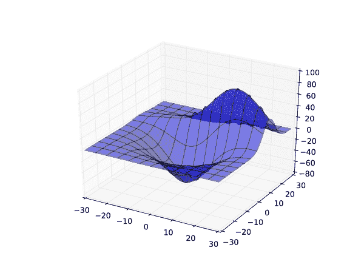

图 6.15：绘制表面网格的三个 2D 投影示例

您还可以在坐标投影中绘制等高线，如下一个示例所示。

```py
fig = figure()
ax = fig.gca(projection = '3d')
ax.plot_wireframe(X,Y,Z,rstride = 5,cstride = 5)

# plot contour projection on each axis plane
ax.contour(X,Y,Z, zdir='z',offset = -100)
ax.contour(X,Y,Z, zdir='x',offset = -40)
ax.contour(X,Y,Z, zdir='y',offset = 40)

# set axis limits
ax.set_xlim3d(-40,40)
ax.set_ylim3d(-40,40)
ax.set_zlim3d(-100,100)

# set labels
ax.set_xlabel('X axis')
ax.set_ylabel('Y axis')
ax.set_zlabel('Z axis')
```

注意设置轴限制的命令。设置轴限制的标准`matplotlib`命令是`axis([-40, 40, -40, 40])`，这对于 2D 图形来说效果很好。然而，`axis([-40,40,-40,40,-40,40])`不起作用。对于 3D 图形，您需要使用命令的对象化版本，例如`ax.set_xlim3d(-40,40)`以及类似的方法。对于标签轴也是如此；注意设置标签的命令。对于 2D 图形，您可以执行`xlabel('X 轴')`和`ylabel('Y 轴')`，但没有`zlabel`命令。相反，在 3D 图形中，您需要使用`ax.set_xlabel('X 轴')`以及类似的方法，如前例所示。

此代码生成的图像如下

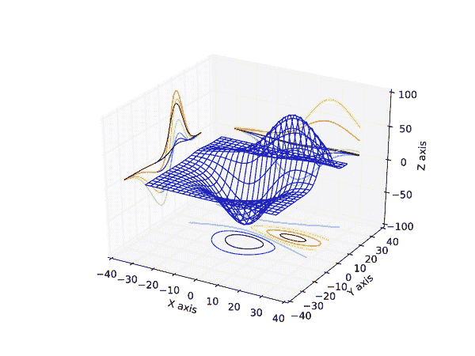

对于格式化图形的外观有许多选项，包括表面的颜色和透明度。有关详细信息，请参阅`mplot3d`文档网站，[[23]](apa.html "附录. 参考文献")。

# 从图中制作电影

如果你有一些演变的数据，你可能想将其保存为电影，除了在图窗口中显示之外，类似于`savefig`命令。一种方法是在 visvis 模块中这样做，该模块可在 visvis（有关更多信息，请参阅[[37]](apa.html "附录. 参考文献")）中找到。

这里有一个使用隐式表示演变圆圈的简单示例。让圆由函数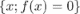的零水平面表示。。或者，考虑零集内部的圆盘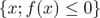。如果*f*的值以速率*v*减少，则圆将以的速率向外移动。

这可以实施如下：

```py
import visvis.vvmovie as vv

# create initial function values
x = linspace(-255,255,511)
X,Y = meshgrid(x,x)
f = sqrt(X*X+Y*Y) - 40 #radius 40

# evolve and store in a list
imlist = []
for iteration in range(200):
    imlist.append((f>0)*255)
    f -= 1 # move outwards one pixel
vv.images2swf.writeSwf('circle_evolution.swf',imlist)
```

结果是一个不断扩大的黑色圆圈 Flash 电影（*.swf 文件），如图 6.16 所示：


图 6.16：圆形演变的示例

在这个例子中，使用数组列表创建电影。`visvis`模块还可以保存 GIF 动画，在某些平台上还可以保存 AVI 动画（*.gif 和*.avi 文件），还可以直接从图形窗口捕获电影帧。然而，这些选项需要安装一些额外的系统包（例如，`PyOpenGL`和`PIL`，Python 图像库）。有关更多详细信息，请参阅`visvis`网页上的文档。

另一个选项是使用`savefig`创建图像，每个帧一个。

```py
# create initial function values
x = linspace(-255,255,511)
X,Y = meshgrid(x,x)
f = sqrt(X*X+Y*Y) - 40 #radius 40
for iteration in range(200):
    imshow((f>0)*255)
    gray()
    axis('off')
    savefig('circle_evolution_{:d}.png'.format(iteration))
    f -= 1
```

然后，可以使用标准的视频编辑软件将这些图像组合起来，例如 Mencoder 或 ImageMagick。这种方法的优势在于，您可以通过保存高分辨率图像来制作高分辨率视频。

# 摘要

图形表示是呈现数学结果或算法行为最紧凑的形式。本章为您提供了绘图的基本工具，并介绍了以面向对象的方式处理图形对象（如图形、坐标轴和线条）的更复杂方法。

在本章中，您学习了如何制作图表，不仅包括经典的 x/y 图表，还包括 3D 图表和直方图。我们还为您提供了制作电影的入门知识。您还看到了如何将图表视为具有相关方法属性的图形对象，这些方法可以设置、删除或修改。

# 练习

**例 1** → 编写一个函数，用于根据其中心坐标（*x,y*）、半轴*a*和*b*以及旋转角度θ绘制椭圆。

**例 2** → 编写一个简短的程序，该程序接受一个二维数组，例如前面的 Mandelbrot 轮廓图像，并迭代地将每个值替换为其邻居的平均值。在一个图形窗口中更新数组的轮廓图，以动画化轮廓的演变。解释其行为。

**例 3** → 考虑一个*N × N*矩阵或具有整数值的图像。映射

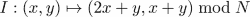

是将点阵的环面网格映射到其自身的一个示例。它有一个有趣的特点，即通过剪切和移动图像外的碎片来扭曲图像，然后使用模函数`mod`将它们移回图像内。迭代应用，这会导致图像随机化，最终返回原始图像。实现以下序列：

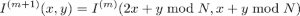

并将前 N 步保存到文件中或在一个图形窗口中绘制它们。

作为示例图像，您可以使用来自`scipy.misc`的经典 512 *×* 512 Lena 测试图像。

```py
from scipy.misc import lena
I = lena()
```

结果应该看起来像这样：

|  | 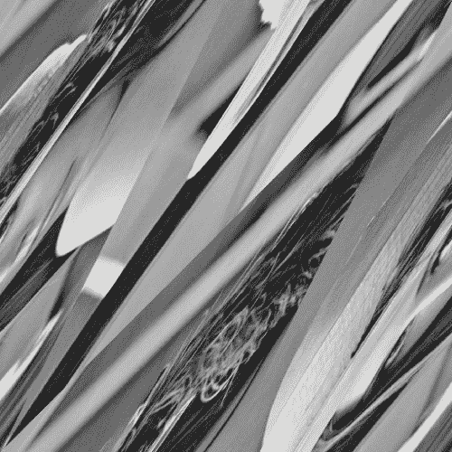 | … | 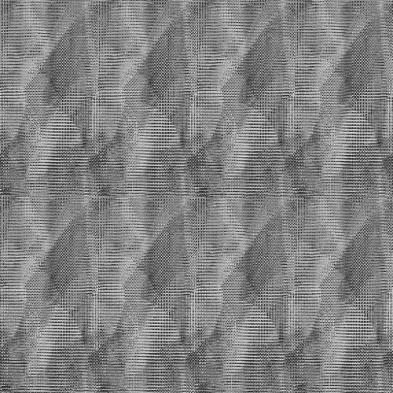 | … |  | … |  |  |
| --- | --- | --- | --- | --- | --- | --- | --- | --- |
| 0 | 1 |  | 128 |  | 256 |  | 511 | 512 |

### 小贴士

计算映射的 *x* 和 *y*，并使用数组索引（参考 第五章 中的 *数组索引* 部分，*高级数组概念*）来复制像素值。

**例 4** → 在图像上读取和绘图。SciPy 包含了 `imread` 函数（位于 `scipy.misc` 模块中），用于读取图像，（参考第十二章 *读取和写入图像* 部分，第十二章，*输入和输出*）。编写一个简短的程序，从文件中读取图像，并在给定的灰度级别值上绘制原始图像的轮廓。

### 小贴士

您可以通过如下方式获取图像的灰度版本：`mean(im,axis=2)`

**例 5** → 图像边缘。二维拉普拉斯算子的零交叉是图像边缘的良好指示。修改前一个练习中的程序，使用 `scipy.ndimage` 模块中的 `gaussian_laplace` 或 `laplace` 函数来计算二维拉普拉斯算子，并将边缘叠加到图像上。

**例 6** → 使用 `ogrid` 而不是 `meshgrid` 重新表述 Mandelbrot 分形示例（参见 *图像和轮廓* 部分），也请参阅 第五章 中 *两个变量的函数* 部分的 `ogrid` 解释，*高级数组概念*。`orgid`、`mgrid` 和 `meshgrid` 之间有什么区别？
