# 第七章 函数

本章介绍了函数，这是编程中的基本构建块。我们展示了如何定义它们，如何处理输入和输出，如何正确使用它们，以及如何将它们视为对象。

# 基础

在数学中，函数被写成一种映射，它将范围 *R* 中的元素 *y* 唯一地分配给定义域 *D* 中的每个元素 *x*。

这可以用 *f : D → R* 来表示

或者，在考虑特定的元素 *x* 和 *y* 时，可以写成 *f : x → y*

在这里，*f* 被称为函数的名称，*f(x)* 是将其应用于 *x* 时的值。在这里，*x* 有时被称为 *f* 的参数。在我们考虑 Python 中的函数之前，让我们先看看一个例子。

例如，*D =* ℝ x ℝ，*y = f(x[1], x[2]) = x[1] - x[2]*。这个函数将两个实数映射到它们的差。

在数学中，函数可以有数字、向量、矩阵，甚至其他函数作为参数。以下是一个具有混合参数的函数示例：

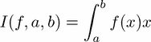.

在这种情况下，返回一个数字。当与函数一起工作时，我们必须区分两个不同的步骤：

+   函数的定义

+   函数的评估，即对于给定的 *x* 计算 *f(x)*

第一步只做一次，而第二步可以针对各种参数多次执行。编程语言中的函数遵循相同的概念，并将其应用于广泛的输入参数类型，例如字符串、列表或任何对象。我们通过考虑给定的示例来演示函数的定义：

```py
def subtract(x1, x2):
    return x1 - x2
```

关键字 `def` 表示我们将要定义一个函数。`subtract` 是函数的名称，`x1` 和 `*x2*` 是其参数。冒号表示我们正在使用块命令，函数返回的值位于 `return` 关键字之后。现在，我们可以评估这个函数。这个函数通过用输入参数替换其参数来调用：

```py
r = subtract(5.0, 4.3)
```

计算结果 0.7 并将其分配给 `r` 变量。

# 参数和参数

定义函数时，其输入变量被称为函数的参数。在执行函数时使用的输入称为其参数。

## 通过位置和关键字传递参数

我们将再次考虑之前的示例，其中函数接受两个参数，即 `x1` 和 `x2`。

它们的名字用于区分这两个数字，在这种情况下，如果不改变结果则不能互换。第一个参数定义了从第二个参数中减去的数字。当调用 `subtract` 时，每个参数都被替换为参数。只有参数的顺序很重要；参数可以是任何对象。例如，我们可以调用以下内容：

```py
z = 3 
e = subtract(5,z)
```

除了通过位置传递参数的标准调用函数的方式之外，有时使用关键字传递参数可能更方便。参数的名称是关键字；考虑以下实例：

```py
z = 3 
e = subtract(x2 = z, x1 = 5)
```

在这里，参数是通过名称而不是调用中的位置分配给参数的。两种调用函数的方式可以结合使用，使得按位置提供的参数先于按关键字提供的参数。我们通过使用在第六章*绘图*中描述的`plot`函数来展示这一点：

```py
plot(xp, yp, linewidth = 2,label = 'y-values')
```

## 更改参数

参数的目的是为函数提供必要的输入数据。在函数内部更改参数的值通常不会对其函数外部的值产生影响：

```py
def subtract(x1, x2):
    z = x1 - x2
    x2 = 50.
    return z
a = 20.
b = subtract(10, a)    # returns -10
a    # still has the value 20
```

这适用于所有不可变参数，例如字符串、数字和元组。如果可变参数，如列表或字典，被更改，则情况不同。

例如，将可变输入参数传递给函数并在函数内部更改它们也会在函数外部更改它们：

```py
def subtract(x):
    z = x[0] - x[1]
    x[1] = 50.
    return z
a = [10,20]
b = subtract(a)    # returns -10
a    # is now [10, 50.0]
```

这样的函数滥用其参数以返回结果。我们强烈建议您不要采用这种结构，并建议您不要在函数内部更改输入参数（更多信息请参阅*默认参数*部分）。

## 访问局部命名空间外定义的变量

Python 允许函数访问其任何封装程序单元中定义的变量。这些被称为全局变量，与局部变量相对。后者仅在函数内部可访问。例如，考虑以下代码：

```py
import numpy as np # here the variable np is defined
def sqrt(x):
    return np.sqrt(x) # we use np inside the function
```

这种特性不应被滥用。以下代码是一个不应该做的例子：

```py
a = 3
def multiply(x):
    return a * x # bad style: access to the variable a defined outside
```

当更改变量`a`的函数`multiply`时，它隐式地改变了其行为：

```py
a=3
multiply(4)  # returns 12
a=4
multiply(4)  # returns 16
```

在那种情况下，最好通过参数列表将变量作为参数提供：

```py
def multiply(x, a):
    return a * x
```

在使用闭包工作时，全局变量可能很有用。命名空间和作用域在第十一章*命名空间、作用域和模块*中讨论得更为详细。

## 默认参数

一些函数可能有多个参数，其中一些可能在非标准情况下才有兴趣。如果参数可以自动设置为标准（默认）值，那就实用了。我们通过查看`scipy.linalg`模块中的`norm`命令来演示默认参数的使用。它计算矩阵和向量的各种范数。

以下代码片段要求计算**Frobenius 范数**的*3×3*单位矩阵是等效的（有关矩阵范数的更多信息，请参阅[[10]](apa.html "附录。参考文献"))):

```py
import scipy.linalg as sl
sl.norm(identity(3))
sl.norm(identity(3), ord = 'fro')
sl.norm(identity(3), 'fro')
```

注意，在第一次调用中，没有提供关于`ord`关键字的信息。Python 是如何知道应该计算 Frobenius 范数而不是另一个范数，例如欧几里得 2 范数的？

之前问题的答案是使用默认值。默认值是函数定义中已经给出的值。如果函数调用时没有提供此参数，Python 将使用程序员在定义函数时提供的值。

假设我们只给`subtract`函数传递一个参数；我们会得到一个错误信息：

```py
TypeError: subtract() takes exactly 2 arguments (1 given)
```

为了允许省略参数`x2`，函数的定义必须提供一个默认值，例如：

```py
def subtract(x1, x2 = 0): 
    return x1 - x2
```

总结来说，参数可以作为位置参数和关键字参数提供。所有位置参数都必须首先提供。只要省略的参数在函数定义中有默认值，就不需要提供所有关键字参数。

### 小心可变默认参数

默认参数是在函数定义时设置的。在处理默认值时，在函数内部更改可变参数会有副作用，例如：

```py
def my_list(x1, x2 = []):
    x2.append(x1)
    return x2
my_list(1)  # returns [1]
my_list(2)  # returns [1,2]
```

# 可变数量的参数

列表和字典可以用来定义或调用具有可变数量参数的函数。让我们如下定义一个列表和一个字典：

```py
data = [[1,2],[3,4]]    
style = dict({'linewidth':3,'marker':'o','color':'green'})
```

然后，我们可以使用带星号的（`*`）参数调用`plot`函数：

```py
plot(*data,**style)
```

以`*`开头的前缀变量名，例如前一个例子中的`*data`，表示在函数调用中提供的列表被解包。这样，列表生成位置参数。同样，以`**`开头的前缀变量名，例如例子中的`**style`，将字典解包为关键字参数。参考以下图示（*图 7.1*）：


图 7.1：函数调用中的带星号参数

你可能还想使用相反的过程，即当传递给函数时，所有给定的位置参数被打包成一个列表，所有关键字参数被打包成一个字典。

在函数定义中，这通过分别以`*`和`**`开头的前缀参数来表示。你经常在代码文档中找到`*args`和`**kwargs`参数，参考*图 7.2*。

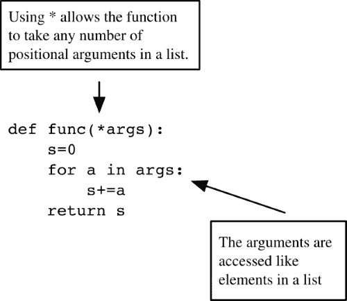

图 7.2：函数定义中的带星号参数

# 返回值

Python 中的函数总是返回一个单一的对象。如果一个函数必须返回多个对象，这些对象会被打包并作为一个单一的元组对象返回。

例如，以下函数接受一个复数*z*，并返回其极坐标表示，即模*r*和角度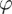，根据欧拉公式：

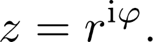

而 Python 的对应写法会是这样的：

```py
def complex_to_polar(z):
    r = sqrt(z.real ** 2 + z.imag ** 2)
    phi = arctan2(z.imag, z.real)
    return (r,phi)  # here the return object is formed
```

在这里，我们使用了 NumPy 的`sqrt(x)`函数来计算数字`x`的平方根，以及`arctan2(x,y)`来表示 tan^(-1)(*x/y*)的表达式。

让我们尝试我们的函数：

```py
z = 3 + 5j  # here we define a complex number
a = complex_to_polar(z)
r = a[0]
phi = a[1]
```

最后三个语句可以更优雅地写在一行中：

```py
r,phi = complex_to_polar(z)
```

我们可以通过调用`polar_to_comp`来测试我们的函数；参考*练习 1*。

如果一个函数没有 `return` 语句，它返回值 `None`。有许多情况下函数不需要返回任何值。这可能是因为传递给函数的变量可能受到修改。例如，考虑以下函数：

```py
def append_to_list(L, x):
    L.append(x)
```

前面的函数不返回任何内容，因为它修改了作为参数给出的对象之一。我们在 *参数和参数* 部分提到了为什么这很有用。有许多方法以相同的方式表现。仅举列表方法为例，`append`、`extend`、`reverse` 和 `sort` 方法不返回任何内容（即，它们返回 `None`）。当一个对象以这种方式被方法修改时，这种修改被称为就地修改。很难知道一个方法是否改变了对象，除非查看代码或文档。

函数或方法不返回任何内容的另一个原因是当它打印消息或写入文件时。

执行在第一个出现的 `return` 语句处停止。该语句之后的行是死代码，永远不会被执行：

```py
def function_with_dead_code(x):
    return 2 * x
    y = x ** 2 # these two lines ...
    return y   # ... are never executed!
```

# 递归函数

在数学中，许多函数都是通过递归定义的。在本节中，我们将展示即使在编程一个函数时，这个概念也可以被使用。这使得程序与其数学对应物之间的关系非常清晰，这可能会使程序的可读性变得更容易。

尽管如此，我们建议您在使用这种编程技术时要小心，尤其是在科学计算中。在大多数应用中，更直接的迭代方法更有效。这一点可以从下面的例子中立即看出。

切比雪夫多项式通过一个三项递归定义：

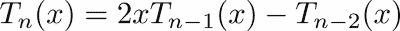

这种递归需要初始化，即 *T*0 =1, *T*1 = *x*。

在 Python 中，这个三项递归可以通过以下函数定义实现：

```py
def chebyshev(n, x):
    if n == 0:
        return 1.
    elif n == 1:
        return x
    else:
        return 2\. * x * chebyshev(n - 1, x) 
                      - chebyshev(n - 2 ,x)

```

函数的调用方式如下：

```py
chebyshev(5, 0.52) # returns 0.39616645119999994
```

这个例子也说明了大量浪费计算时间的风险。函数评估的数量随着递归层级的增加而呈指数增长，其中大部分评估只是先前计算的重复。虽然使用递归程序来展示代码与数学定义之间强烈的关系可能很有吸引力，但生产代码将避免这种编程技术（参考 *练习* 6）。我们还提到了一种称为记忆化的技术（参考 [[22]](apa.html "附录 . 参考文献") 以获取更多详细信息），它将递归编程与缓存技术相结合，以节省重复的函数评估。

递归函数通常有一个层级参数。在前面的例子中，它是 *n*。它用于控制函数的两个主要部分：

+   基本情况，这里的前两个 `if` 分支

+   递归体，其中函数本身一次或多次以较小的层级参数被调用。

递归函数执行过程中传递的层数称为递归深度。这个数量不应该太大；否则计算可能不再有效，在最终情况下，将引发以下错误：

```py
RuntimeError: maximum recursion depth exceeded
```

最大递归深度取决于您使用的计算机的内存。当函数定义中缺少初始化步骤时，也会发生此错误。我们鼓励在非常小的递归深度上使用递归程序（更多信息，请参阅第九章 *无限迭代* 的 *迭代* 部分）。

# 函数文档

您应该使用字符串在函数开头进行文档说明。这被称为文档字符串：

```py
def newton(f, x0):
    """
    Newton's method for computing a zero of a function
    on input:
    f  (function) given function f(x)
    x0 (float) initial guess 
    on return:
    y  (float) the approximated zero of f
    """
     ...
```

当调用 `help(newton)` 时，您将看到此文档字符串与该函数的调用一起显示：

```py
Help on function newton in module __main__:

newton(f, x0)
     Newton's method for computing a zero of a function
     on input:
     f  (function) given function f(x)
     x0 (float) initial guess
     on return:
     y  (float) the approximated zero of f
```

文档字符串在内部被保存为给定函数的一个属性，`__doc__`。在示例中，它是 `newton.__doc__`。在文档字符串中，您应该提供的最基本信息是函数的目的以及输入和输出对象的描述。有工具可以自动通过收集程序中的所有文档字符串来生成完整的代码文档（更多信息请参阅 [[32]](apa.html "附录 . 参考文献")）。

# 函数是对象

函数是对象，就像 Python 中的其他一切一样。可以传递函数作为参数，更改它们的名称，或者删除它们。例如：

```py
def square(x):
    """
    Return the square of x
    """
    return x ** 2
square(4) # 16
sq = square # now sq is the same as square
sq(4) # 16
del square # square doesn't exist anymore
print(newton(sq, .2)) # passing as argument
```

在科学计算中应用算法时，将函数作为参数传递是非常常见的。`scipy.optimize` 中的 `fsolve` 函数用于计算给定函数的零点，或者 `scipy.integrate` 中的 `quad` 函数用于计算积分，这些都是典型的例子。

函数本身可以有不同数量的参数，这些参数类型不同。因此，当将您的函数 `f` 作为参数传递给另一个函数 `g` 时，请确保 `f` 的形式与 `g` 的文档字符串中描述的完全一致。

`fsolve` 的文档字符串提供了关于其 `func` 参数的信息：

```py
func -- A Python function or method which takes at least one
               (possibly vector) argument.
```

## 部分应用

让我们从具有两个变量的函数的例子开始。

函数 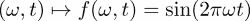 可以被视为一个关于两个变量的函数。通常，人们将 ω 不视为一个自由变量，而是将作为一个函数族 *f*[ω] 的固定参数：

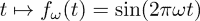

这种解释将两个变量的函数简化为一个变量 `t` 的函数，给定一个固定的参数值 *ω*。通过固定（冻结）函数的一个或多个参数来定义新函数的过程称为部分应用。

使用 Python 模块 `functools` 可以轻松创建部分应用，该模块提供了一个名为 `partial` 的函数，专门为此目的。我们通过构建一个返回给定频率的正弦函数的函数来说明这一点：

```py
import functools
def sin_omega(t, freq):
    return sin(2 * pi * freq * t)

def make_sine(frequency):
    return functools.partial(sin_omega, freq = frequency)
```

### 使用闭包

使用函数是对象的观点，可以通过编写一个函数，该函数本身返回一个新的函数，具有较少的输入参数来实现部分应用。例如，该函数可以定义为以下形式：

```py
def make_sine(freq):
    "Make a sine function with frequency freq"
    def mysine(t):
        return sin_omega(t, freq)
    return mysine
```

在这个例子中，内部函数`mysine`可以访问变量`freq`；它既不是该函数的局部变量，也不是通过参数列表传递给它的。Python 允许这种构造（请参阅第十一章中的*命名空间*部分，*命名空间、作用域和模块*）。

# 匿名函数 - lambda 关键字

在 Python 中，关键字 lambda 用于定义匿名函数，即没有名称且由单个表达式描述的函数。你可能只想对一个可以用简单表达式表示的操作进行操作，而不需要命名这个函数，也不需要通过冗长的`def`块来定义这个函数。

### 注意

名称*lambda*起源于微积分和数学逻辑的一个特殊分支，即-微积分。

例如，要计算以下表达式，我们可以使用 SciPy 的函数`quad`，它需要将待积分的函数作为第一个参数，积分界限作为接下来的两个参数：

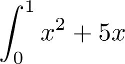

在这里，要积分的函数只是一个简单的单行函数，我们使用`lambda`关键字来定义它：

```py
import scipy.integrate as si
si.quad(lambda x: x ** 2 + 5, 0, 1)
```

语法如下：

```py
lambda parameter_list: expression
```

`lambda`函数的定义只能由一个表达式组成，并且特别不能包含循环。`lambda`函数就像其他函数一样，是对象，可以被分配给变量：

```py
parabola = lambda x: x ** 2 + 5
parabola(3) # gives 14
```

## lambda 构造总是可以替换的

重要的是要注意，lambda 构造在 Python 中只是语法糖。任何 lambda 构造都可以用显式的函数定义来替换：

```py
parabola = lambda x: x**2+5 
# the following code is equivalent
def parabola(x):
    return x ** 2 + 5
```

使用这种构造的主要原因是对于非常简单的函数，当完整的函数定义过于繁琐时。

`lambda`函数提供了一种创建闭包的第三种方法，正如我们在上一个示例中继续展示的那样：

我们使用`sin_omega`函数来计算不同频率的正弦函数的积分：

```py
import scipy.integrate as si
for iteration in range(3):
    print(si.quad(lambda x: sin_omega(x, iteration*pi), 0, pi/2.) )
```

# 函数作为装饰器

在部分应用部分，我们看到了如何使用一个函数来修改另一个函数。装饰器是 Python 中的一个语法元素，它方便地允许我们改变函数的行为，而无需更改函数本身的定义。让我们从一个以下情况开始：

假设我们有一个函数，用于确定矩阵的稀疏程度：

```py
def how_sparse(A):
    return len(A.reshape(-1).nonzero()[0])
```

如果这个函数不是用数组对象作为输入调用，它将返回错误。更确切地说，它将无法与不实现 `reshape` 方法的对象一起工作。例如，`how_sparse` 函数将无法与列表一起工作，因为列表没有 `reshape` 方法。以下辅助函数修改任何只有一个输入参数的函数，使其尝试将类型转换为数组：

```py
def cast2array(f):
    def new_function(obj):
        fA = f(array(obj))
        return fA
    return new_function
```

因此，修改后的函数 `how_sparse = cast2array(how_sparse)` 可以应用于任何可以转换为数组的对象。如果 `how_sparse` 的定义用类型转换函数装饰，也可以实现相同的功能。还建议考虑使用 `functools.wraps`（有关更多详细信息，请参阅 [[8]](apa.html "附录 . 参考文献"))：

```py
@cast2array
def how_sparse(A):
    return len(A.reshape(-1).nonzero()[0])
```

要定义一个装饰器，你需要一个可调用对象，例如一个函数，它修改要装饰的函数的定义。主要目的是：

+   通过将不直接服务于函数功能的部分（例如，缓存）从函数中分离出来，可以增加代码的可读性。

+   将一组类似函数的共同前导和后置部分放在一个共同的地方（例如，类型检查）。

+   能够轻松地开启和关闭函数的附加功能（例如，测试打印，跟踪）。

# 摘要

函数不仅是使你的程序模块化的理想工具，而且也反映了数学思维。你学习了函数定义的语法，以及如何区分定义和调用函数。

我们将函数视为可以被其他函数修改的对象。在处理函数时，了解变量的作用域以及信息如何通过参数传递到函数中是很重要的。

有时，使用所谓的匿名函数动态定义函数是很方便的。为此，我们引入了关键字 lambda。

# 练习

**例 1** → 编写一个函数 `polar_to_comp`，它接受两个参数 *r* 和 ，并返回复数 。使用 NumPy 函数 `exp` 进行指数函数。

**例 2** → 在 Python 模块 `functools` 的描述中（有关 `functools` 的更多详细信息，请参阅 [[8]](apa.html "附录 . 参考文献"))，你可以找到以下 Python 函数：

```py
def partial(func, *args, **keywords):
    def newfunc(*fargs, **fkeywords):
        newkeywords = keywords.copy()
        newkeywords.update(fkeywords)
        return func(*(args + fargs), **newkeywords)
    newfunc.func = func
    newfunc.args = args
    newfunc.keywords = keywords
    return newfunc
```

解释并测试这个函数。

**例 3** → 为函数 `how_sparse` 编写一个装饰器，该装饰器通过将小于 1.e-16 的元素设置为零来清理输入矩阵 *A*（考虑 *函数作为装饰器* 部分的示例）。

**例 4** → 一个连续函数 *f*，其中 *f*(*a*)*f*(*b*) < 0 在区间 [*a, b*] 内改变其符号，并且在这个区间内至少有一个根（零）。这样的根可以用二分法找到。这种方法从给定的区间开始。然后它调查子区间中的符号变化，

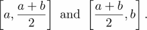

如果第一个子区间 *b* 中的符号变化被重新定义为：

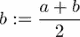

否则，它将以相同的方式重新定义：

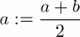

并且重复这个过程，直到 *b-a* 小于给定的容差。

+   将此方法实现为一个函数，该函数接受以下参数：

    +   – 函数 *f*

    +   – 初始区间 [*a, b*]

    +   – 容差

+   这个函数 `bisec` 应该返回最终区间及其中点。

+   使用函数 `arctan` 和多项式 *f(x) = 3 x² -5* 在区间 [1.1, 1.4]*，*以及交替在 [1.3, 1.4]。

**例 5** → 两个整数的最大公约数可以使用以下递归描述的欧几里得算法计算：

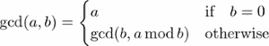

编写一个函数，计算两个整数的最大公约数。再编写另一个函数，使用以下关系计算这些数的最小公倍数：

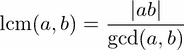

**例 6** → 研究切比雪夫多项式的递归实现，考虑 *递归函数* 章节中的例子。将程序以非递归方式重写，并研究计算时间与多项式次数的关系（也请参阅 `timeit` 模块）。
