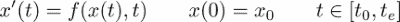
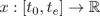
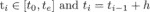
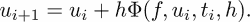
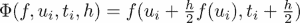
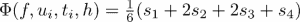
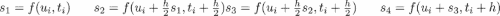
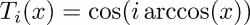
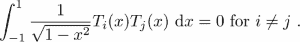
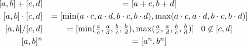

# 第八章 类

在数学中，当我们写 sin 时，我们指的是一个我们知道许多初等微积分方法的数学对象。例如：

+   我们可能想要计算 *x* 在 *x=0.5* 时的正弦值，即计算 sin(0.5)，它返回一个实数

+   我们可能想要计算它的导数，这将给我们另一个数学对象，cos

+   我们可能想要计算其泰勒多项式的第一个三个系数

这些方法不仅可以应用于正弦函数，还可以应用于其他足够平滑的函数。然而，对于其他数学对象（例如，数字 *5*），这些方法没有意义。具有相同方法的对象被分组到抽象类中，例如，函数。可以应用于函数的每个语句和每个方法特别适用于正弦或余弦。此类类的其他例子可能包括有理数，它有一个分子和分母方法；区间，它有左边界和右边界方法；无限序列，我们可以询问它是否有极限，等等。

在这种情况下，sin 被称为类的实例。数学短语 *设 g 为一个函数...* 在这个上下文中被称为实例化。在这里，*g* 是函数的名称；可以分配给它许多属性之一。另一个属性可能是它的定义域。

数学对象 *p(x) = 2x²- 5* 就像正弦函数一样。每个函数方法都适用于 *p*，但我们也可以为 *p* 定义特殊方法。例如，我们可以要求 *p* 的系数。这些方法可以用来定义多项式的类。因为多项式是函数，它们还继承了函数类的所有方法。

在数学中，我们经常使用相同的运算符符号来表示完全不同的操作。例如，在 5+4 和 sin *+* cos 中，运算符符号 + 有不同的含义。通过使用相同的符号，人们试图表达数学操作的相似性。我们通过将它们应用于数学示例来从面向对象编程中引入了这些术语：

+   类

+   实例和实例化

+   继承

+   方法

+   属性

+   运算符重载

在本章中，我们将展示这些概念在 Python 中的应用。

# 类介绍

我们将通过有理数的例子来说明类的概念，即形式为 *q= q*[N] *⁄ q*[D] 的数，其中 *q*[N] 和 *q*[D] 是整数。


图 8.1：类声明的示例

我们在这里使用有理数只是为了作为类概念的示例。对于 Python 中未来的有理数工作，请使用 *fractions* 模块（参考 [[6]](apa.html "附录 . 参考文献")）。

## 类语法

类的定义是通过一个带有 `class` 关键字、类名和块中的某些语句的命令块来完成的（参考 *图 8.1*）：

```py
class RationalNumber: 
      pass
```

创建这个类的实例（或者换句话说，创建`RationalNumber`类型的对象）是通过

```py
r = RationalNumber()
```

并且一个查询`type(a)`返回答案是，`<class'__main__.RationalNumber'>`。如果我们想调查一个对象是否是这个类的实例，我们可以使用这个：

```py
if isinstance(a, RationalNumber):
    print('Indeed it belongs to the class RationalNumber')  
```

到目前为止，我们已经生成了一个`RationalNumber`类型的对象，它还没有数据。此外，还没有定义用于对这些对象执行操作的方法。这将是下一节的主题。

## `__init__`方法

现在我们为我们提供的示例类添加一些属性；也就是说，我们给它定义数据。在我们的情况下，这些数据将是分母和分子的值。为此，我们必须定义一个方法，`__init__`，用于使用这些值初始化类：

```py
class RationalNumber:
    def __init__(self, numerator, denominator):
        self.numerator = numerator
        self.denominator = denominator
```

在我们解释我们添加到类中的特殊`__init__`函数之前，我们演示了`RationalNumber`对象的实例化：

```py
q = RationalNumber(10, 20)    # Defines a new object
q.numerator    # returns 10
q.denominator    # returns 20
```

通过使用类名作为函数来创建`RationalNumber`类型的新对象。这个语句做了两件事：

+   它首先创建一个空对象，`q`。

+   然后它将`__init__`函数应用于它；也就是说，执行`q.__init__(10, 20)`。

`__init__`的第一个参数指的是新对象本身。在函数调用时，这个第一个参数被对象实例所替换。这适用于类的所有方法，而不仅仅是特殊的`__init__`方法。这个第一个参数的特殊作用体现在将其命名为`self`的约定上。在先前的例子中，`__init__`函数定义了新对象的两个属性，`numerator`和`denominator`。

# 属性和方法

与类一起工作的一个主要原因是对象可以被分组并绑定到一个公共对象上。我们在查看有理数时已经看到了这一点；分母和分子是两个绑定到`RationalNumber`类实例上的对象。它们被称为实例的属性。一个对象是类实例的属性的事实，从它们被引用的方式中变得明显，这是我们之前已经隐含使用过的：

```py
<object>.attribute
```

这里有一些实例化和属性引用的例子：

```py
q = RationalNumber(3, 5) # instantiation
q.numerator     # attribute access
q.denominator

a = array([1, 2])    # instantiation
a.shape

z = 5 + 4j    # instantiation
z.imag
```

一旦定义了实例，我们就可以设置、更改或删除该特定实例的属性。语法与常规变量相同：

```py
q = RationalNumber(3, 5) 
r = RationalNumber(7, 3)
q.numerator = 17
del r.denominator
```

修改或删除属性可能会产生不期望的副作用，甚至可能使对象变得无用。我们将在*相互依赖的属性*这一节中了解更多这方面的内容。由于函数也是对象，我们也可以将函数用作属性；它们被称为实例的方法：

```py
<object>.method(<arguments...>)
```

例如，让我们向`RationalNumber`类添加一个将数字转换为浮点数的方法：

```py
class RationalNumber:
...
    def convert2float(self):
        return float(self.numerator) / float(self.denominator)
```

再次，这个方法将其第一个（也是唯一一个）参数，`self`，作为对对象本身的引用。我们使用这个方法进行常规的函数调用：

```py
q = RationalNumber(10, 20)    # Defines a new object
q.convert2float() # returns 0.5   
```

这相当于以下调用：

```py
RationalNumber.convert2float(q)
```

再次注意，对象实例被插入为函数的第一个参数。这种对第一个参数的使用解释了如果使用此特定方法时出现额外参数将产生的错误信息：

调用 `q.convert2float(15)` 会导致以下错误信息：

```py
TypeError: convert2float() takes exactly 1 argument (2 given)
```

这之所以不工作，是因为 `q.convert2float(15)` 与 `RationalNumber.convert2float(q,15)` 完全等价，而后者失败，因为 `RationalNumber.convert2float` 只接受一个参数。

## 特殊方法

特殊方法 `__repr__` 给我们定义了在 Python 解释器中对象表示方式的能力。对于有理数，此方法的一个可能定义如下：

```py
class RationalNumber:
 ...
    def __repr__(self):
        return '{} / {}'.format(self.numerator,self.denominator)
```

定义了此方法后，只需键入 `q` 就会返回 10 / 20。

我们希望有一个方法来执行两个有理数的加法。一个初步尝试可能得到如下方法：

```py
class RationalNumber:
...
    def add(self, other):
        p1, q1 = self.numerator, self.denominator
        if isinstance(other, int):
            p2, q2 = other, 1
        else:
            p2, q2 = other.numerator, other.denominator
        return RationalNumber(p1 * q2 + p2 * q1, q1 * q2)
```

调用此方法的形式如下：

```py
q = RationalNumber(1, 2)
p = RationalNumber(1, 3)
q.add(p)   # returns the RationalNumber for 5/6
```

如果我们可以写 `q + p` 会更好。但到目前为止，加号对 `RationalNumber` 类型尚未定义。这是通过使用 `__add__` 特殊方法来完成的。因此，只需将 `add` 重命名为 `__add__`，就可以使用有理数的加号：

```py
q = RationalNumber(1, 2)
p = RationalNumber(1, 3)
q + p # RationalNumber(5, 6)
```

表达式 `q + p` 实际上是 `q.__add__(p)` 的别名。在表 (*表 8.1*) 中，你可以找到二元运算符的特殊方法，如 `+`、`-` 或 `*`。

| **运算符** | **方法** | **运算符** | **方法** |
| --- | --- | --- | --- |
| `+` | `__add__` | `+=` | `__iadd__` |
| `*` | `__mul__` | `*=` | `__imul__` |
| `-` | `__sub__` | `-=` | `__isub__` |
| `/` | `__truediv__` | `/=` | `__itruediv__` |
| `//` | `__floordiv__` | `//=` | `__ifloordiv__` |
| `**` | `__pow__` |  |  |
| `==` | `__eq__` | `!=` | `__ne__` |
| `<=` | `__le__` | `<` | `__lt__` |
| `>=` | `__ge__` | `>` | `__gt__` |
| `()` | `__call__` | `[]` | `__getitem__` |

表 8.1：一些 Python 运算符及其对应的类方法，完整列表请见 [[31]](apa.html "附录。参考文献")

为新类实现这些运算符的过程称为运算符重载。运算符重载的另一个例子是检查两个有理数是否相同的方法：

```py
class RationalNumber:
...
    def __eq__(self, other):
        return self.denominator * other.numerator == 
            self.numerator * other.denominator
```

它的使用方式如下：

```py
p = RationalNumber(1, 2) # instantiation
q = RationalNumber(2, 4) # instantiation
p == q # True
```

不同类对象之间的操作需要特别注意：

```py
p = RationalNumber(1, 2) # instantiation
p + 5  # corresponds to p.__add__(5)  
5 + p  # returns an error
```

默认情况下，`+` 运算符调用左操作数的 `__add__` 方法。我们编程使其允许 `int` 类型和 `RationalNumber` 类型的对象。在语句 `5 + p` 中，操作数交换，并调用内置 `int` 类型的 `__add__` 方法。由于该方法不知道如何处理有理数，因此返回错误。此情况可以通过 `__radd__` 方法来处理，我们现在将为 `RationalNumber` 类添加此方法。`__radd__` 方法称为逆加法。

### 逆操作

如果将`+`等操作应用于不同类型的两个操作数，则首先调用左操作数的相应方法（在这种情况下，`__add__`）。如果这引发异常，则调用右操作数的反向方法（在这里，`__radd__`）。如果此方法不存在，则引发`TypeError`异常。

考虑一个逆操作的例子。为了使操作 5+*p*（其中*p*是`RationalNumber`的实例）成为可能，我们定义如下：

```py
class RationalNumber:
   ....
    def __radd__(self, other):
        return self + other
```

注意，`__radd__`交换了参数的顺序；`self`是类型为`RationalNumber`的对象，而`other`是要转换的对象。

使用类实例与括号* *（* *）或[ , ]一起调用，会调用特殊方法`__call__`或`__getitem__`之一，使实例具有函数或可迭代对象的行为（有关这些和其他特殊方法，请参阅表 8.1）。 

```py
class Polynomial:
...
    def __call__(self, x):
        return self.eval(x)
```

现在可以这样使用：

```py
p = Polynomial(...)
p(3.) # value of p at 3.
```

如果类提供了一个迭代器，则`__getitem__`特殊方法是有意义的（在考虑以下示例之前，建议您查阅第九章的*迭代器*部分 Chapter 9，*迭代*）。

递归*u[i+1] = a*[1]*u[i]*+ *a*[0]*u[i]*[-1]被称为三*-*项递归。它在应用数学中起着重要作用，特别是在正交多项式的构造中。我们可以以下面的方式将三项递归设置为一个类：

```py
import itertools

class  Recursion3Term:
    def __init__(self, a0, a1, u0, u1):
        self.coeff = [a1, a0]
        self.initial = [u1, u0]
    def __iter__(self):
        u1, u0 = self.initial
        yield u0  # (see also Iterators section in Chapter 9) 
        yield u1
        a1, a0 = self.coeff
        while True :
            u1, u0 = a1 * u1 + a0 * u0, u1
            yield u1
    def __getitem__(self, k):
        return list(itertools.islice(self, k, k + 1))[0]
```

在这里，`__iter__`方法定义了一个生成器对象，这使得我们可以将类的实例用作迭代器：

```py
r3 = Recursion3Term(-0.35, 1.2, 1, 1)
for i, r in enumerate(r3):
    if i == 7:
        print(r)  # returns 0.194167
        break
```

`__getitem__`方法使我们能够直接访问迭代器，就像`r3`是一个列表一样：

```py
r3[7] # returns 0.194167
```

注意，我们在编写`__getitem__`方法时使用了`itertools.islice`（有关更多信息，请参阅第九章的*迭代器*部分 Chapter 9，*迭代*）。在第五章的*高级数组概念*部分中，给出了使用`__getitem__`与切片和函数`ogrid`的示例。

# 相互依赖的属性

实例的属性可以通过简单地分配它们一个值来更改（或创建）。然而，如果其他属性依赖于刚刚更改的属性，则同时更改这些属性是可取的：

让我们考虑一个类，它从三个给定的点定义一个平面三角形对象。设置这样一个类的第一次尝试可能如下所示：

```py
class Triangle:
    def __init__(self,  A, B, C):
        self.A = array(A)
        self.B = array(B)
        self.C = array(C)
        self.a = self.C - self.B
        self.b = self.C - self.A
        self.c = self.B - self.A
    def area(self):
        return abs(cross(self.b, self.c)) / 2
```

通过以下方式创建此三角形的实例：

```py
tr = Triangle([0., 0.], [1., 0.], [0., 1.])
```

其面积是通过以下方式计算的：

```py
tr.area() # returns 0.5
```

如果我们更改一个属性，例如点*B*，则相应的边*a*和*c*不会自动更新，并且计算出的面积是错误的：

```py
tr.B = [12., 0.]
tr.area() # still returns 0.5, should be 6 instead.
```

一种补救方法是定义一个在属性更改时执行的方法；这样的方法称为 setter 方法。相应地，人们可能会要求一个在请求属性值时执行的方法；这样的方法称为 getter 方法。

## 属性函数

函数 `property` 将一个属性链接到这样的获取器、设置器和删除器方法。它也可以用来为属性分配文档字符串：

```py
attribute = property(fget = get_attr, fset = set_attr, 
                     fdel = del_attr, doc = string)
```

我们继续使用之前的例子，带有设置器方法，再次考虑 `Trinagle` 类。如果在 `Triangle` 中包含以下语句

```py
B = property(fget = get_B, fset = set_B, fdel = del_B, doc = ’The point B of a triangle’)
```

一个命令

```py
tr.B = <something>
```

调用设置器方法，`set_B`。

让我们修改三角形类：

```py
class Triangle:
    def __init__(self, A, B, C):
        self._A = array(A)
        self._B = array(B)
        self._C = array(C)
        self._a = self._C - self._B
        self._b = self._C - self._A
        self._c = self._B - self._A
    def area(self):
        return abs(cross(self._c, self._b)) / 2.
    def set_B(self, B):
        self._B = B
        self._a = self._C - self._B
        self._c = self._B - self._A
    def get_B(self):
        return self._B
    def del_Pt(self):
        raise Exception('A triangle point cannot be deleted')
    B = property(fget = get_B, fset = set_B, fdel = del_Pt)
```

如果属性 `B` 发生变化，那么 `set_B` 方法会将新值存储在内部属性 `_B` 中，并改变所有依赖属性：

```py
tr.B = [12., 0.]
tr.area() # returns 6.0
```

这里使用 `deleter` 方法的目的是防止删除属性：

```py
del tr.B # raises an exception
```

将下划线用作属性名称的前缀是一种约定，用于指示这些属性不是设计为直接访问的。它们旨在为由设置器和获取器处理的属性持有数据。这些属性在其他编程语言中不是私有的；它们只是不打算直接访问。

# 绑定和非绑定方法

我们现在将更详细地研究那些是方法的属性。让我们考虑一个例子：

```py
class A:
    def func(self,arg):
        pass
```

稍微检查一下，我们可以看到在创建实例后 `func` 的性质如何改变：

```py
A.func  # <unbound method A.func>
instA = A()  # we create an instance
instA.func  #  <bound method A.func of ... >
```

例如，调用 `A.func(3)` 将会得到如下错误信息：

```py
TypeError: func() missing 1 required positional argument: 'arg'
```

`instA.func(3)` 如预期执行。在创建实例时，`func` 方法被绑定到该实例。`self` 参数被分配给实例作为其值。将方法绑定到实例使得该方法可以作为函数使用。在此之前，它没有任何用处。我们稍后会考虑的类方法在这方面是不同的。

# 类属性

在类声明中指定的属性称为类属性。考虑以下示例：

```py
class Newton:
    tol = 1e-8 # this is a class attribute
    def __init__(self,f):
        self.f = f # this is not a class attribute
    ....
```

类属性对于模拟默认值很有用，如果需要重置值，可以使用：

```py
N1 = Newton(f)
N2 = Newton(g)
```

两个实例都有一个属性 `tol`，其值在类定义中初始化：

```py
N1.tol # 1e-8
N2.tol # 1e-8
```

修改类属性会自动影响所有实例的相应属性：

```py
Newton.tol = 1e-10
N1.tol # 1e-10
N2.tol # 1e-10
```

修改一个实例的 `tol` 不会影响其他实例：

```py
N2.tol = 1.e-4
N1.tol  # still 1.e-10
```

但现在 `N2.tol` 已经与类属性分离。改变 `Newton.tol` 对 `N2.tol` 不再有任何影响：

```py
Newton.tol = 1e-5 # now all instances of the Newton classes have 1e-5
N1.tol # 1.e-5
N2.tol # 1e-4 but not N2.
```

# 类方法

在上一节关于*绑定和非绑定方法*中，我们看到了方法要么绑定到类的实例上，要么保持非绑定状态。类方法不同，它们总是绑定方法。它们绑定到类本身。

我们将首先描述语法细节，然后给出一些示例来展示这些方法可以用作什么。为了表明一个方法是类方法，装饰器行位于方法定义之前：

```py
@classmethod
```

虽然标准方法通过使用它们的第一个参数来引用实例，但类方法的第一个参数引用的是类本身。按照惯例，第一个参数在标准方法中称为 `self`，在类方法中称为 `cls`。

+   标准情况：

```py
      class A:
          def func(self,*args):
               <...>
```

+   类方法示例：

```py
      class B:
          @classmethod
          def func(cls,*args):
               <...>
```

在实践中，类方法可能在创建实例之前执行命令时很有用，例如，在预处理步骤中。请参见以下示例：

在这个例子中，我们展示了如何使用类方法在创建实例之前准备数据：

```py
class Polynomial:
    def __init__(self, coeff):
        self.coeff = array(coeff)
    @classmethod
    def by_points(cls, x, y):
        degree = x.shape[0] - 1
        coeff = polyfit(x, y, degree)
        return cls(coeff) 
    def __eq__(self, other):
        return allclose(self.coeff, other.coeff)
```

类的设计是这样的，通过指定其系数来创建一个多项式对象。或者，`by_points`类方法允许我们通过插值点定义一个多项式。即使没有 Polynomial 的实例，我们也可以将插值数据转换为多项式系数：

```py
p1 = Polynomial.by_points(array([0., 1.]), array([0., 1.]))
p2 = Polynomial([1., 0.])

print(p1 == p2)  # prints True
```

本章后面的例子中提供了一个类方法的另一个示例。在那个例子中，类方法被用来访问与这个类中的几个（或所有）实例相关的信息。

# 子类化和继承

在本节中，我们将介绍面向对象编程的一些核心概念：抽象类、子类和继承。为了帮助您理解这些概念，我们考虑另一个数学例子：求解微分方程的一步方法。普通初值问题的通用形式是



数据是右手边函数*f*、初始值*x[0]*和感兴趣的区间[*t*[0]*, t*[e]]。这个问题的解是一个函数。数值算法将这个解作为一个离散值向量*u*，其中*u[i]*是*x*(*t[i]*)的近似。在这里，是独立变量*t*的离散化值，在物理模型中通常代表时间。

一步方法通过递归步骤构建解值*u[i]*：



这里，Φ是一个步进函数，它表征了各个方法（参见[[28]](apa.html "附录 . 参考文献"))：

+   **显式欧拉法**: 

+   **中点法**: 

+   **龙格-库塔 4 法**: 与

我们在这里所做的是描述数学算法的典型方式。我们首先通过其思想描述了一个方法，以抽象的方式给出其步骤。为了实际使用它，我们必须填写一个具体方法的参数，在这个例子中，是函数Φ。这也是面向对象编程中解释事物的方式。首先，我们设置一个具有方法抽象描述的类：

```py
class OneStepMethod:
    def __init__(self, f, x0, interval, N):
        self.f = f
        self.x0 = x0
        self.interval = [t0, te] = interval
        self.grid = linspace(t0, te, N)
        self.h = (te - t0) / N

    def generate(self):
        ti, ui = self.grid[0], self.x0
        yield ti, ui
        for t in self.grid[1:]:
            ui = ui + self.h * self.step(self.f, ui, ti)
            ti = t
            yield ti, ui

    def solve(self):
        self.solution = array(list(self.generate()))

    def plot(self):
        plot(self.solution[:, 0], self.solution[:, 1])

    def step(self, f, u, t):
        raise NotImplementedError()
```

这个具有方法的抽象类被用作各个方法的模板：

```py
class ExplicitEuler(OneStepMethod):
    def step(self, f, u, t):
        return f(u, t)

class MidPointRule(OneStepMethod):
    def step(self, f, u, t):
        return f(u + self.h / 2 * f(u, t), t + self.h / 2)
```

注意，在类定义中，我们用作模板的抽象类`OneStepMethod`的名称被作为一个额外的参数给出：

```py
class ExplicitEuler(OneStepMethod)
```

那个类被称为父类。只要它们没有被覆盖，父类的所有方法和属性都会被子类继承。如果它们在子类中被重新定义，它们就会被覆盖。`step` 方法在子类中被重新定义，而 `generate` 方法对整个家族来说是通用的，因此从父类继承。在考虑更多细节之前，我们将演示如何使用这三个类：

```py
def f(x, t):
    return -0.5 * x

euler = ExplicitEuler(f, 15., [0., 10.], 20)
euler.solve()
euler.plot()
hold(True)
midpoint = MidPointRule(f, 15., [0., 10.], 20)

midpoint.solve()
midpoint.plot()
```

您可以通过使用星号运算符（请参阅第七章 *可变数量参数* 中的 *变量数量参数* 部分，*函数* 以获取更多详细信息）来避免重复常见的参数列表：

```py
...
argument_list = [f, 15., [0., 10.], 20]
euler = ExplicitEuler(*argument_list)
...
midpoint = MidPointRule(*argument_list)
...
```

注意，抽象类从未被用来创建实例。由于 `step` 方法没有完全定义，调用它将引发类型为 `NotImplementedError` 的异常。

有时必须访问父类的方法或属性。这是通过命令 `super` 来完成的。当子类使用自己的 `__init__` 方法来扩展父类时，这很有用：

例如，假设我们想要给每个求解器类提供一个带有求解器名称的字符串变量。为此，我们提供了一个 `__init__` 方法，因为它覆盖了父类的 `__init__` 方法。如果两种方法都应该使用，我们必须通过命令 `super` 来引用父类的方法：

```py
class ExplicitEuler(OneStepMethod):
    def __init__(self,*args, **kwargs):
        self.name='Explicit Euler Method'
        super(ExplicitEuler, self).__init__(*args,**kwargs)
    def step(self, f, u, t):
        return f(u, t)
```

注意，可以使用父类的名称。使用 `super` 而不是这样做允许我们更改父类的名称，而无需更改对父类的所有引用。

# 封装

有时使用继承是不切实际的，甚至是不可能的。这促使我们使用封装。我们将通过考虑 Python 函数来解释封装的概念，即 Python 类型 `function` 的对象，我们将它们封装在一个新的类 `Function` 中，并为其提供一些相关的方法：

```py
class Function:
    def __init__(self, f):
        self.f = f
    def __call__(self, x):
        return self.f(x)
    def __add__(self, g):
        def sum(x):
            return self(x) + g(x)
        return type(self)(sum) 
    def __mul__(self, g): 
        def prod(x):
            return self.f(x) * g(x)
        return type(self)(prod)
    def __radd__(self, g):
        return self + g
    def __rmul__(self, g):
        return self * g
```

注意，`__add__` 和 `__mul__` 操作应该返回同一类的实例。这是通过 `return type(self)(sum)` 语句实现的，在这种情况下，这是一种更通用的写法 `return Function(sum)`。我们现在可以通过继承来派生子类：

以 Chebyshev 多项式为例，这些多项式可以在区间 [1,-1] 内通过以下方式计算：

.

我们构建一个 Chebyshev 多项式作为 `Function` 类的一个实例：

```py
T5 = Function(lambda x: cos(5 * arccos(x)))
T6 = Function(lambda x: cos(6 * arccos(x)))
```

在某种意义上，Chebyshev 多项式是正交的：



这可以通过以下构造轻松检查：

```py
import scipy.integrate as sci

weight = Function(lambda x: 1 / sqrt((1 - x ** 2)))
[integral, errorestimate] = 
        sci.quad(weight * T5 * T6, -1, 1) # (6.510878470473995e-17, 1.3237018925525037e-14)
```

没有封装，我们不能像写 `weight * T5 * T6` 这样简单地乘以函数。

# 类作为装饰器

在第七章的*函数作为装饰器*部分中，我们看到了如何通过应用另一个函数作为装饰器来修改函数。在之前的例子中，我们看到了如何使类表现得像函数一样，只要它们提供了`__call__`方法。我们将在这里使用这个方法来展示如何使用类作为装饰器。

假设我们想要以某种方式改变一些函数的行为，即在函数被调用之前，打印所有输入参数。这可能在调试目的上很有用。我们将这种情况作为一个例子来解释装饰器类的使用：

```py
class echo:
    text = 'Input parameters of {name}n'+
        'Positional parameters {args}n'+
        'Keyword parameters {kwargs}n'
    def __init__(self, f):
        self.f = f
    def __call__(self, *args, **kwargs):
        print(self.text.format(name = self.f.__name__,
              args = args, kwargs = kwargs))
        return self.f(*args, **kwargs)
```

我们使用这个类来装饰函数定义，

```py
@echo
def line(m, b, x):
    return m * x + b
```

然后像平常一样调用函数，

```py
line(2., 5., 3.)
line(2., 5., x=3.)
```

在第二次调用时，我们得到以下输出：

```py
Input parameters of line
Positional parameters (2.0, 5.0)
Keyword parameters {'x': 3.0}

11.0
```

这个例子表明，类和函数都可以用作装饰器。类允许更多的可能性，因为它们可以用来收集数据。

事实上，我们观察到：

+   每个装饰过的函数都会创建装饰器类的一个新实例。

+   通过一个实例收集的数据可以通过类属性（参考第八章的*属性*部分，Chapter 8，*类*）保存并使另一个实例可访问。

最后一点强调了与函数装饰器的区别。我们现在通过一个装饰器来展示这一点，该装饰器计算函数调用次数并将结果存储在一个以函数为键的字典中。

为了分析算法的性能，可能需要计算特定函数的调用次数。我们可以在不更改函数定义的情况下获取计数器信息。这是对[[4]](apa.html "附录. 参考文献")中给出的示例的轻微修改。

```py
class CountCalls:
    """
    Decorator that keeps track of the number of times 
    a function is called.
    """
    instances = {} 
    def __init__(self, f):
        self.f = f
        self.numcalls = 0
        self.instances[f] = self
    def __call__(self, *args, **kwargs):
        self.numcalls += 1
        return self.f(*args, **kwargs)
    @classmethod
    def counts(cls):
        """
        Return a dict of {function: # of calls} for all 
        registered functions.
        """
        return dict([(f.__name__, cls.instances[f].numcalls) 
                                    for f in cls.instances])
```

在这里，我们使用类属性`CountCalls.instances`来存储每个单独实例的计数器。让我们看看这个装饰器是如何工作的：

```py
@CountCalls
def line(m, b, x):
    return m * x + b
@CountCalls 
def parabola(a, b, c, x):
    return a * x ** 2 + b * x + c
line(3., -1., 1.)
parabola(4., 5., -1., 2.)

CountCalls.counts() # returns {'line': 1, 'parabola': 1}
parabola.numcalls # returns 1
```

# 摘要

现代计算机科学中最重要的编程概念之一是面向对象编程。在本章中，我们学习了如何将对象定义为类的实例，我们为这些类提供了方法和属性。方法的第一参数，通常表示为`self`，扮演着重要和特殊的角色。你看到了可以用于定义基本操作的方法，例如为你的类定义`+`和`*`。

虽然在其他编程语言中，属性和方法可以防止意外使用，但 Python 允许一种技术来隐藏属性并通过特殊的 getter 和 setter 方法访问这些隐藏的属性。为此，你遇到了一个重要的函数，`property`。

# 练习

**例 1** → 向类`RationalNumber`中编写一个`simplify`方法。该方法应返回分数的简化版本作为元组。

**例 2** → 为了提供带有置信区间的结果，在数值数学中引入了一种特殊的微积分，称为区间算术；（参考 [[3, 14]](apa.html "附录。参考文献")*)*. 定义一个名为 `Interval` 的类，并为其提供加法、减法、除法、乘法和幂（仅限正整数）的方法。这些操作遵循以下规则：

.

为这个类提供方法，允许进行类型为 *a* + *I, a I, I* + *a, I a* 的操作，其中 *I* 是一个区间，*a* 是一个整数或浮点数。首先将整数或浮点数转换为区间 `[a,a]`。（提示：你可能想为此使用函数装饰器；（参考第七章中的 *函数作为装饰器* 部分，第七章，*函数*）。此外，实现 `__contains__` 方法，它允许你使用 `x in I` 语法检查给定的数字是否属于区间 `I`，其中 `I` 是类型为区间的对象。通过将多项式 `f=lambda x: 25*x**2-4*x+1` 应用到区间来测试你的类。

**例 3** → 考虑在 *类作为装饰器* 部分下的示例。扩展这个示例以获得一个 *函数装饰器*，它统计某个函数被调用的次数。

**例 4** → 比较在 `RationalNumber` 类中实现 `__radd__` 方法两种方式的效果：一种是在 *特殊方法* 部分的示例中给出的，另一种是这里给出的：

```py
class RationalNumber:
    ....
    def __radd__(self, other):
        return other + self
```

你期望在这个版本中出错吗？错误是什么，你是如何解释的？通过执行以下命令来测试你的答案：

```py
q = RationalNumber(10, 15)
5 + q
```

**例 4** → 考虑在 *类作为装饰器* 部分中的示例。为这个类提供一个方法，`reset`，它将字典 `CountCalls.instances` 中所有函数的计数器设置为零。如果将字典替换为空字典会发生什么？
