# 第九章。迭代

在本章中，我们将通过循环和迭代器展示迭代。我们将展示如何使用列表和生成器来实现这一点。迭代是计算机有用的基本操作之一。传统上，迭代是通过 `for` 循环实现的。`for` 循环是一系列指令的重复执行，执行次数是确定的。在循环内部，可以访问一个循环变量，其中存储了迭代次数。

Python 的习惯用法略有不同。Python 中的 `for` 循环主要是设计用来耗尽列表，即枚举列表的元素。如果使用包含前 *n* 个整数的列表，效果与前面描述的重复效果相似。

`for` 循环一次只需要列表中的一个元素。因此，最好使用能够按需逐个创建这些元素的 `for` 循环，这正是 Python 中的迭代器所实现的。

# for 语句

`for` 语句的主要目的是遍历列表：

```py
for s in ['a', 'b', 'c']:
    print(s), # a b c
```

在这个例子中，循环变量 *s* 依次赋值给列表中的一个元素。请注意，循环变量在循环结束后仍然可用。这有时可能很有用；例如，可以参考 *控制循环内部的流程* 这一部分的例子。

`for` 循环最频繁的用途之一是重复执行定义次数的任务，使用 `range` 函数（请参阅 第一章 的 *列表* 部分，*入门*）。

```py
for iteration in range(n): # repeat the following code n times
    ...
```

如果循环的目的是遍历列表，许多语言（包括 Python）都提供了以下模式：

```py
for k in range(...):
    ...
    element = my_list[k]
```

如果该代码的目的是遍历 `my_list` 列表，前面的代码可能不太清楚。因此，更好的表达方式如下：

```py
for element in my_list:
    ...
```

现在很明显，前面的代码遍历了 `my_list` 列表。请注意，如果您确实需要索引变量 *k*，您可以将前面的代码替换为以下代码：

```py
for k, element in enumerate(my_list):
    ...
```

这段代码的意图是在遍历 `my_list` 的同时保持索引变量 *k* 可用。对于数组，类似的构造是命令 `ndenumerate`。

# 控制循环内部的流程

有时需要跳出循环或直接跳到下一次循环迭代。这两个操作由 `break` 和 `continue` 命令执行。正如其名所示，`break` 关键字会中断循环。循环中断可能发生两种情况：

+   循环已完全执行。

+   循环在完全执行之前被跳出（`break`）。

对于第一种情况，可以在 `else` 块中定义特殊操作，该块在遍历整个列表时执行。如果 `for` 循环的目的是查找某个东西并停止，这通常很有用。例如，可以在列表中搜索满足特定属性的元素。如果找不到这样的元素，则执行 `else` 块。

这是在科学计算中的一种常见用法。通常，我们使用一个不一定成功的迭代算法。在这种情况下，最好使用（大）有限循环，这样程序就不会陷入无限循环。`for`/`else` 构造允许这种实现：

```py
maxIteration = 10000
for iteration in range(maxIteration):
    residual = compute() # some computation
    if residual < tolerance:
        break
else: # only executed if the for loop is not broken
    raise Exception("The algorithm did not converge")
print("The algorithm converged in {} steps".format(iteration+1))
```

# 迭代器

`for` 循环主要用于遍历列表，但它一次只选择列表中的一个元素。特别是，不需要将整个列表存储在内存中，循环才能正常工作。允许 `for` 循环在没有列表的情况下工作的机制是迭代器。

可迭代对象产生对象（传递给 `for` 循环）。这样的对象 `obj` 可以在 `for` 循环中使用，如下所示：

```py
for element in obj:
    ...
```

因此，迭代器的概念扩展了列表的想法。最简单的可迭代对象示例是列表。产生的对象只是列表中存储的对象：

```py
L = ['A', 'B', 'C']
for element in L:
    print(element)
```

可迭代对象不需要产生现有的对象。对象可以即时产生。

一个典型的可迭代对象是由函数 `range` 返回的对象。这个函数的工作方式就像它会生成一个整数列表一样，但事实上，当需要时，连续的整数会即时生成：

```py
for iteration in range(100000000):
    # Note: the 100000000 integers are not created at once
    if iteration > 10:
        break
```

如果真的需要一个包含 0 到 100,000,000 之间所有整数的列表，那么必须显式地形成它：

```py
l=list(range(100000000))
```

## 生成器

你可以使用 `yield` 关键字创建自己的迭代器。例如，可以定义一个小于 *n* 的奇数生成器：

```py
def odd_numbers(n):
    "generator for odd numbers less than n"
    for k in range(n):
        if k % 2 == 1:
            yield k
```

然后，你可以这样使用它：

```py
g = odd_numbers(10)
for k in g:
    ...    # do something with k
```

或者甚至可以这样：

```py
for k in odd_numbers(10):
    ... # do something with k
```

## 迭代器是可丢弃的

迭代器的一个显著特点是它们只能使用一次。为了再次使用迭代器，你必须创建一个新的迭代器对象。请注意，可迭代对象能够根据需要创建任意数量的新迭代器。让我们来考察一下列表的情况：

```py
L = ['a', 'b', 'c']
iterator = iter(L)
list(iterator) # ['a', 'b', 'c']
list(iterator) # [] empty list, because the iterator is exhausted

new_iterator = iter(L) # new iterator, ready to be used
list(new_iterator) # ['a', 'b', 'c']
```

每次调用生成器对象时，它都会创建一个新的迭代器。因此，当该迭代器耗尽时，必须再次调用生成器以获取新的迭代器：

```py
g = odd_numbers(10)
for k in g:
    ... # do something with k

# now the iterator is exhausted:
for k in g: # nothing will happen!!
    ...

# to loop through it again, create a new one:
g = odd_numbers(10)
for k in g:.
    ...
```

## 迭代器工具

这里有一些经常非常有用的迭代器工具：

+   `enumerate` 用于对另一个迭代器进行编号。它产生一个新的迭代器，产生一对（迭代，元素），其中 `iteration` 存储迭代的索引：

```py
      A = ['a', 'b', 'c']
      for iteration, x in enumerate(A):
          print(iteration, x)
      # result: (0, 'a') (1, 'b') (2, 'c')
```

+   `reversed` 通过遍历列表的逆序来从一个列表创建一个迭代器。请注意，这与创建逆序列表是不同的：

```py
      A = [0, 1, 2]
      for elt in reversed(A):,
          print(elt)
          # result: 2 1 0
```

+   `itertools.count` 是一个可能无限的整数迭代器：

```py
      for iteration in itertools.count():
          if iteration > 100:
              break # without this, the loop goes on forever
          print("integer {}".format(iteration))
          # prints the 100 first integer
```

+   `intertools.islice` 使用熟悉的 `切片` 语法截断迭代器；请参阅第三章，*容器类型*。一个应用是从无限迭代器创建有限迭代器：

```py
      from itertools import count, islice
      for iteration in islice(count(), 10): 
          # same effect as range(10)
          ...
```

例如，让我们通过结合 `islice` 和无限生成器来找到一些奇数。首先，我们修改奇数生成器，使其成为一个无限生成器：

```py
def odd_numbers():
    k=-1
    while True:
        k+=1
        if k%2==1:
        yield k
```

然后，我们使用 `islice` 来获取一些奇数的列表：

```py
list(itertools.islice(odd_numbers(),10,30,8)) # returns [21, 37, 53]
```

## 递归序列生成器

假设一个序列由归纳公式给出。例如，考虑斐波那契序列，由递归公式定义：*u[n] = u[n]*[-1] + *u*[*n*-2]。

这个序列依赖于两个初始值，即 *u*[0] 和 *u*[1]，尽管对于标准的斐波那契序列，这些数字分别取为 0 和 1。通过使用生成器编程生成此类序列是一种巧妙的方法，如下所示：

```py
def fibonacci(u0, u1):
    """
    Infinite generator of the Fibonacci sequence.
    """
    yield u0
    yield u1
    while True:
        u0, u1 = u1, u0+u1
        yield u1
```

这可能被用于，例如，如下所示：

```py
# sequence of the 100 first Fibonacci numbers:
list(itertools.islice(fibonacci(0, 1), 100))
```

### 算术几何平均

基于迭代计算算术和几何平均的迭代称为 **AGM 迭代**（更多信息请参考 [[1, p. 598]](apa.html "附录 . 参考文献")）：

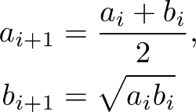

它有一个迷人的性质，即对于 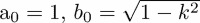 :

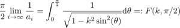

右侧的积分称为第一类完全椭圆积分。我们现在继续计算这个椭圆积分。我们使用生成器来描述迭代：

```py
def arithmetic_geometric_mean(a, b):
    """
    Generator for the arithmetic and geometric mean
    a, b initial values
    """ 
    while True:    # infinite loop
         a, b = (a+b)/2, sqrt(a*b)
         yield a, b
```

由于序列 `{*a[i]*}` 是收敛的，由 `{*c[i]*}` = (*a[i]–b[i]*)/2 定义的序列 `{*c*[*i*]}` 收敛到零——这是一个将在计算椭圆积分的程序中终止迭代的性质：

```py
def elliptic_integral(k, tolerance=1e-5):
    """
    Compute an elliptic integral of the first kind.
    """
    a_0, b_0 = 1., sqrt(1-k**2)
    for a, b in arithmetic_geometric_mean(a_0, b_0):
        if abs(a-b) < tolerance:
            return pi/(2*a)
```

我们必须确保算法停止。请注意，此代码完全依赖于数学陈述，即算术几何平均迭代收敛（快速）。在实际计算中，我们必须在应用理论结果时小心，因为它们在有限精度算术中可能不再有效。使前面的代码安全的方法是使用 `itertools.islice`。安全的代码如下（有关 `for`/`else` 语句的另一种典型用法，请参阅 *控制循环内部的流程* 部分的示例）：

```py
from itertools import islice
def elliptic_integral(k, tolerance=1e-5, maxiter=100):
    """
    Compute an elliptic integral of the first kind.
    """
    a_0, b_0 = 1., sqrt(1-k**2)
    for a, b in islice(arithmetic_geometric_mean(a_0, b_0), 
                                                  maxiter):
        if abs(a-b) < tolerance:
            return pi/(2*a)
    else:
        raise Exception("Algorithm did not converge")
```

作为应用，椭圆积分可以用来计算长度为 *L* 的摆的周期，起始角度为 θ（更多信息请参考 [[18, p.114]](apa.html "附录 . 参考文献")）使用：

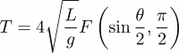

使用这个公式，很容易得到摆的周期：

```py
def pendulum_period(L, theta, g=9.81):
    return 4*sqrt(L/g)*elliptic_integral(sin(theta/2))
```

# 收敛加速

我们给出一个使用生成器进行收敛加速的应用示例。这个演示紧密遵循 *Pramode C.E* 在 *Python Generator Tricks* 中给出的示例（更多信息请参考 [[9]](apa.html "附录 . 参考文献")）。

注意，生成器可以接受另一个生成器作为输入参数。例如，假设我们定义了一个生成器，用于生成收敛序列的元素。然后，可以通过 *Euler* 和 *Aitken* 的加速技术（通常称为 Aitken 的 Δ² 方法）来提高收敛速度（更多信息请参考 [[33]](apa.html "附录 . 参考文献")）。它通过定义将序列 *s[i]* 转换为另一个序列：

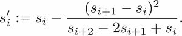

这两个序列都有相同的极限，但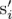序列收敛得显著更快。一个可能的实现如下：

```py
def Euler_accelerate(sequence):
    """
    Accelerate the iterator in the variable `sequence`.
    """
    s0 = next(sequence) # Si
    s1 = next(sequence) # Si+1
    s2 = next(sequence) # Si+2
    while True:
        yield s0 - ((s1 - s0)**2)/(s2 - 2*s1 + s0)
  s0, s1, s2 = s1, s2, next(sequence)
```

例如，我们使用经典的级数：

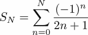

它收敛于π/4*.* 我们在以下代码中将这个级数实现为一个生成器：

```py
def pi_series():
    sum = 0.
    j = 1
    for i in itertools.cycle([1, -1]):
        yield sum
        sum += i/j
        j += 2
```

我们现在可以使用这个序列的加速版本：

```py
Euler_accelerate(pi_series())
```

因此，使用以下方法可以获得该加速序列的前*N*个元素：

```py
itertools.islice(Euler_accelerate(pi_series()), N)
```

例如，以下图（*图 9.1*）显示了由上述公式定义的序列的标准版本及其加速版本的误差对数的收敛率：

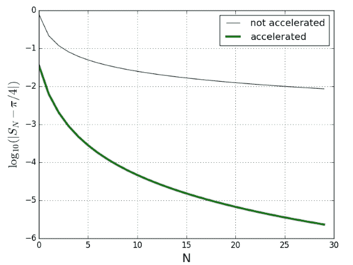

图 9.1：定义的序列及其加速版本的比较

# 列表填充模式

在本节中，我们将比较不同的填充列表的方法。它们在计算效率上不同，在代码可读性上也有所不同。

## 使用 append 方法填充列表

一种普遍的编程模式是计算元素并将它们存储在一个列表中：

```py
L = []
for k in range(n):
    # call various functions here
    # that compute "result"
    L.append(result)
```

这种方法有几个缺点：

+   迭代次数是预先决定的。如果有`break`指令，则前面的代码负责生成值和决定何时停止。这并不理想，缺乏灵活性。

+   它假设用户想要整个计算的历史记录，对于所有迭代。假设我们只对所有计算值的总和感兴趣。如果有许多计算值，存储它们是没有意义的，因为逐个相加要高效得多。

## 从迭代器生成列表

迭代器为我们提供了一个优雅的解决方案来解决之前讨论过的问题：

```py
def result_iterator():
    for k in itertools.count(): # infinite iterator
        # call various functions here
        # that compute "result"
        ...
        yield result
```

使用迭代器，我们分离了生成计算值的任务，而不必担心停止条件或存储。如果该代码的用户想要存储前*n*个值，这很容易通过使用`list`构造函数来完成：

```py
L = list(itertools.islice(result_iterator(), n)) # no append needed!
```

如果用户想要前*n*个生成值的总和，建议使用以下构造：

```py
# make sure that you do not use scipy.sum here
s = sum(itertools.islice(result_iterator(), n))
```

我们在这里所做的是一方面分离元素的生成，另一方面存储这些元素。

如果目的是真正构建一个列表，并且每个步骤的结果不依赖于先前计算过的元素，则可以使用列表推导语法（有关更多信息，请参阅第三章的*列表*部分，*容器类型*）：

```py
L = [some_function(k) for k in range(n)]
```

当迭代计算依赖于先前计算值的值时，列表推导无法提供帮助。

## 存储生成的值

使用迭代器填充列表在大多数情况下都会很顺利，但当计算新值的算法可能抛出异常时，这种模式会有一些复杂性；如果迭代器在过程中抛出异常，列表将不可用！以下示例说明了这个问题。

假设我们生成一个递归定义的序列，其定义为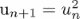。如果初始数据*u*[0]大于一，这个序列会迅速发散到无穷大。让我们用生成器生成它：

```py
import itertools
def power_sequence(u0):
    u = u0
    while True:
        yield u
        u = u**2
```

如果你尝试通过执行来获取序列（由*u[0] = 2*初始化）的前*20*个元素，

```py
list(itertools.islice(power_sequence(2.), 20))
```

如果在执行过程中抛出异常，将会引发异常，并且将无法访问任何列表，甚至包括异常抛出之前的元素列表。目前尚无从可能存在问题的生成器中获取部分填充列表的方法。唯一的解决方案是使用包含异常捕获块的`append`方法（有关详细信息，请参阅第十章的*异常*部分，第十章，*错误处理*）：

```py
generator = power_sequence(2.)
L = []
for iteration in range(20):
    try:
        L.append(next(generator))
    except Exception:
        ...
```

# 当迭代器表现得像列表一样

一些列表操作也适用于迭代器。我们现在将检查*列表推导式*和*列表 zip*的等价物（有关详细信息，请参阅第三章的*列表*部分，第三章，*容器类型*）。

## 生成器表达式

对于生成器，也存在列表推导式的等价物。这种构造称为生成器表达式：

```py
g = (n for n in range(1000) if not n % 100)
# generator for  100, 200, ... , 900
```

这特别有用，尤其是在计算和或积时，因为这些操作是增量式的；它们只需要一次一个元素：

```py
sum(n for n in range(1000) if not n % 100) # returns 4500 
```

在那段代码中，你会注意到`sum`函数只接受一个参数，即一个生成器表达式。请注意，Python 语法允许我们在将生成器用作函数的唯一参数时省略生成器的括号。

让我们计算黎曼ζeta 函数，其表达式为

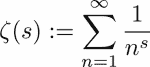

使用生成器表达式，我们可以一行计算这个级数的部分和：

```py
sum(1/n**s for n in itertools.islice(itertools.count(1), N))
```

注意，我们也可以按照以下方式定义一个序列 1/n^s 的生成器：

```py
def generate_zeta(s):
    for n in itertools.count(1):
        yield 1/n**s
```

然后，我们只需使用以下方法来简单地获取前*N*项的和：

```py
def zeta(N, s):
    # make sure that you do not use the scipy.sum here
    return sum(itertools.islice(generate_zeta(s), N))
```

我们指出，我们使用这种方式计算ζeta（ζ）函数是为了展示以优雅的方式使用生成器。这当然不是评估此函数最准确和计算效率最高的方法。

## 迭代器 zip

我们在第三章的*列表*部分中看到，第三章，*容器类型*，可以创建一个列表，通过将两个列表进行 zip 操作。对于迭代器，也存在相同的操作：

```py
xg = x_iterator()  # some iterator
yg = y_iterator()  # another iterator

for x, y in zip(xg, yg):
    print(x, y)
```

当一个迭代器耗尽时，zipped 迭代器就会停止。这与列表上的 zip 操作行为相同。

# 迭代器对象

如我们之前提到的，`for`循环只需要一个可迭代的对象。特别是列表是可迭代的。这意味着列表能够从其内容中创建一个迭代器。实际上，这是任何对象（不仅仅是列表）的普遍情况：任何对象都可以变得可迭代。

这是通过`__iter__`方法实现的，该方法应该返回一个迭代器。这里我们给出一个`__iter__`方法是一个生成器的例子：

```py
class OdeStore:
    """
    Class to store results of ode computations
    """
    def __init__(self, data):
        "data is a list of the form [[t0, u0], [t1, u1],...]"
        self.data = data

    def __iter__(self):
        "By default, we iterate on the values u0, u1,..."
        for t, u in self.data:
            yield u

store = OdeStore([[0, 1], [0.1, 1.1], [0.2, 1.3]])
for u in store:
    print(u)
# result: 1, 1.1, 1.3
list(store) # [1, 1.1, 1.3]
```

如果你尝试在一个不可迭代的对象上使用迭代器的功能，将会引发异常：

```py
>>> list(3)
TypeError: 'int' object is not iterable
```

在这个例子中，列表函数试图通过调用`__iter__`方法来迭代对象*3*。但是，这个方法没有为整数实现，因此会引发异常。如果我们尝试遍历一个不可迭代的对象，也会发生同样的事情：

```py
>>> for iteration in 3: pass
TypeError: 'int' object is not iterable
```

# 无限迭代

无限迭代可以通过无限迭代器、`while`循环或递归来获得。显然，在实际情况下，某些条件会停止迭代。与有限迭代不同的是，仅通过代码的快速检查，我们无法确定迭代是否会停止。

## `while`循环

`while`循环可以用来重复执行一个代码块，直到满足某个条件：

```py
while condition:
    <code>
```

`while`循环等价于以下代码：

```py
for iteration in itertools.count():
    if not condition:
        break
    <code>
```

因此，`while`循环等价于一个无限迭代器，如果满足某个条件，它可能会停止。这种构造的危险性是显而易见的：如果条件永远不会满足，代码可能会陷入无限循环。

科学计算中的问题在于，人们并不总是能确定一个算法是否会收敛。例如，牛顿迭代法可能根本不会收敛。如果这个算法被实现在一个`while`循环中，相应的代码可能会因为某些初始条件的选择而陷入无限循环。

因此，我们建议有限迭代器通常更适合这样的任务。以下构造通常可以有效地替代`while`循环的使用：

```py
maxit = 100
for nb_iterations in range(max_it):
    ...
else:
    raise Exception("No convergence in {} iterations".format(maxit))
```

第一个优点是，无论发生什么情况，代码都保证在有限的时间内执行。第二个优点是，变量`nb_iterations`包含了算法收敛所需的迭代次数。

## 递归

当一个函数调用自身时，就会发生递归（参见第七章中的*递归函数*部分 Chapter 7，*函数*）。

在进行递归时，是递归深度，即迭代次数，将计算机推向极限。我们在这里通过考虑一个简单的递归来说明这一点，实际上这个递归根本不包含任何计算。它只将值零赋给迭代项：

```py
def f(N):
    if N == 0: 
        return 0
    return f(N-1)
```

根据你的系统，此程序可能在 *N ≥ 10000* 时崩溃（使用了太多内存）。结果是 Python 解释器在没有进一步异常的情况下崩溃。Python 提供了一种机制，当检测到过深的递归深度时，会引发异常。此最大递归深度可以通过执行以下操作来更改：

```py
import sys 
sys.setrecursionlimit(1000)
```

实际的递归限制值可以通过 `sys.getrecursionlimit()` 获取。

但是请注意，选择过高的数字可能会危及你代码的稳定性，因为 Python 可能会在达到最大深度之前崩溃。因此，通常明智的做法是保留递归限制不变。

相比之下，以下非递归程序在没有任何问题的前提下运行了数千万次迭代：

```py
for iteration in range(10000000):
    pass
```

我们主张，如果可能的话，在 Python 中应避免递归。这显然仅适用于有适当的替代迭代算法可用的情况。第一个原因是深度为 *N* 的递归涉及 *N* 个函数调用同时进行，这可能会导致显著的开销。第二个原因是它是无限迭代，也就是说，很难给出递归结束前所需步骤数量的上界。

注意，在某些非常特殊的情况下（树遍历），递归是不可避免的。此外，在某些情况下（递归深度较小），由于可读性，递归程序可能更受欢迎。

# 概述

在本章中，我们研究了迭代器，这是一个接近迭代方法数学描述的编程结构。你看到了 `yield` 关键字，并遇到了有限和无限迭代器。

我们展示了迭代器可以被耗尽。通过示例的帮助，介绍了更多特殊方面，如迭代器推导和递归迭代器。

# 练习

**例 1** → 计算求和的值：

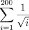

**例 2** → 创建一个生成器，该生成器通过关系式计算序列：

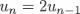

**例 3** → 生成所有偶数。

**例 4** → 令 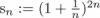。在微积分中，已经证明 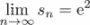。通过实验确定最小的数字 *n*，使得 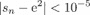。为此任务使用生成器。

**例 5** → 生成小于给定整数的所有质数。使用称为埃拉托斯特尼筛法的算法。

**例 6** → 通过应用显式欧拉方法求解微分方程 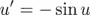 导致递归：

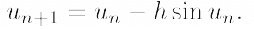

编写一个生成器，用于计算给定初始值 *u*[0] 和给定的时间步长 *h* 的解值 *u[n]*。

**例 7** → 使用公式计算 π：

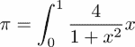

可以使用复合梯形规则近似积分，即通过此公式：


其中 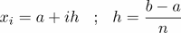。

编写一个 *生成器* 用于计算值 *y[i] = f(x[i])*，并通过逐项求和来评估公式。将你的结果与 SciPy 的 `quad` 函数进行比较。

**例 8** → 令 *x* = [1, 2, 3] 和 *y* = [-1, -2, -3]。代码 `zip(*zip(x, y))` 的效果是什么？解释它是如何工作的。

**例 9** → 可以通过函数 `scipy.special.ellipk` 计算完全椭圆积分。编写一个函数，该函数计算使用 AGM 迭代直到结果达到给定容差所需的迭代次数（注意，`ellipk` 中的输入参数 *m* 对应于 *Arithmetic geometric mean* 部分定义中的 *k²*）。

**例 10** → 考虑由以下序列定义：


它单调收敛到零：*E[1] >E[2] > . . . > 0*。通过分部积分，可以证明序列 *E[n]* 满足以下递归：

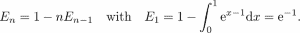

通过使用适当的生成器计算递归的前 20 项，并将结果与使用 `scipy.integrate.quad` 进行数值积分得到的结果进行比较。通过反转递归进行同样的操作：

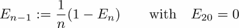

使用 `exp` 函数来评估指数函数。你观察到了什么？你有解释吗？（参考 [[29]](apa.html "附录 . 参考文献")*）

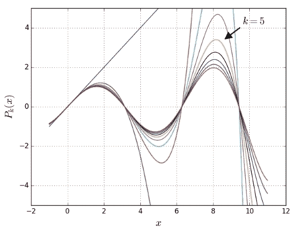

图 9.2：逼近 sin(x) 的函数的收敛性研究

**例 11** → 正弦函数可以像欧拉那样表示

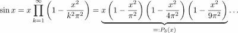

编写一个生成器，用于生成函数值 *Pk*。设置 `x=linspace(-1,3.5*pi,200)` 并通过图形演示 *Pk* 随 *k* 增加对 sin 的逼近效果。在之前的图（图 9.2）中显示了可能的结果（参考 [[11, Th. 5.2, p. 65]](apa.html "附录 . 参考文献")）。
