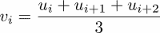

# 第十三章 测试

在本章中，我们将关注科学编程测试的两个方面。第一个方面是科学计算中经常难以处理的测试主题。第二个方面涵盖了如何测试的问题。我们将区分手动测试和自动化测试。手动测试是每个程序员为了快速检查实现是否工作而执行的操作。自动化测试是这种想法的改进和自动化版本。我们将介绍一些通用的自动化测试工具，并关注科学计算的特殊情况。

# 手动测试

在代码开发过程中，你进行很多小测试以测试其功能。这可以被称为手动测试。通常，你会通过在交互式环境中手动测试函数来检查给定的函数是否按预期工作。例如，假设你实现了二分查找算法。这是一个寻找标量非线性函数零点（根）的算法。要启动算法，必须给出一个区间，该区间具有函数在区间边界上取不同符号的性质，参见*练习 4*，第七章，*函数*，了解更多信息。

然后，你将测试该算法的实现，通常通过检查以下内容：

+   当函数在区间边界上有相反的符号时，找到解决方案。

+   当函数在区间边界上有相同的符号时，引发异常。

尽管手动测试可能看起来是必要的，但它并不令人满意。一旦你确信代码做了它应该做的事情，你就会制定相对较少的演示示例来让其他人相信代码的质量。在那个阶段，人们往往对开发过程中进行的测试失去兴趣，它们被遗忘甚至删除。一旦你更改了细节，事情不再正确工作，你可能会后悔之前的测试不再可用。

# 自动测试

开发任何代码的正确方式是使用自动测试。其优势包括：

+   在每次代码重构之后和任何新版本发布之前，自动重复执行大量测试。

+   对代码使用的无声文档。

+   对您代码测试覆盖率的文档：更改之前事情是否工作，或者某个方面是否从未被测试过？

### 注意

程序及其结构的变化，这些变化不影响其功能，被称为代码重构。

我们建议与代码并行开发测试。良好的测试设计是一门艺术，很少有投资能像对良好测试的投资那样，在开发时间节省上带来如此好的回报。

现在我们将带着自动化测试的方法，来逐步实现一个简单的算法。

## 测试二分查找算法

让我们检查二分算法的自动化测试。使用这个算法，可以找到一个实值函数的零点。它描述在 第七章 的 *练习 4* 中，*函数* 部分。算法的实现可以有以下形式：

```py
def bisect(f, a, b, tol=1.e-8):
    """
    Implementation of the bisection algorithm 
    f real valued function
    a,b interval boundaries (float) with the property 
    f(a) * f(b) <= 0
    tol tolerance (float)
    """
    if f(a) * f(b)> 0:
        raise ValueError("Incorrect initial interval [a, b]") 
    for i in range(100):
        c = (a + b) / 2.
        if f(a) * f(c) <= 0:
            b = c
        else:
            a = c
        if abs(a - b) < tol:
            return (a + b) / 2
    raise Exception(
          'No root found within the given tolerance {}'.format(tol))
```

我们假设这被存储在 `bisection.py` 文件中。作为第一个测试用例，我们测试函数 *f*(*x*) = *x* 的零点是否被找到：

```py
def test_identity():
    result = bisect(lambda x: x, -1., 1.) 
    expected = 0.
    assert allclose(result, expected),'expected zero not found'

test_identity()
```

在这段代码中，你第一次遇到了 Python 关键字 `assert`。如果它的第一个参数返回 `False` 值，它将抛出 `AssertionError` 异常。它的可选第二个参数是一个包含额外信息的字符串。我们使用 `allclose` 函数来测试浮点数的相等性。

让我们评论一下测试函数的一些特性。我们使用断言来确保如果代码的行为不符合预期，将会抛出异常。我们必须在 `test_identity()` 行手动运行测试。

有许多工具可以自动化这种类型的调用。

现在我们设置一个测试来检查如果函数在区间的两端具有相同的符号，`bisect` 是否会抛出异常。目前，我们将假设抛出的异常是 `ValueError` 异常。在下面的例子中，我们将检查初始区间 [*a*,*b*]。对于二分算法，它应该满足符号条件：

```py
def test_badinput():
    try:
        bisect(lambda x: x,0.5,1)
    except ValueError:
        pass
    else:
        raise AssertionError()

test_badinput()
```

在这种情况下，如果异常不是 `ValueError` 类型，将会抛出 `AssertionError`。有一些工具可以简化前面的构造来检查是否抛出了异常。

另一个有用的测试是边缘情况测试。在这里，我们测试可能创建数学上未定义的情况或程序状态的参数或用户输入。例如，如果两个边界相等会发生什么？如果 *a > b* 会发生什么？

```py
def test_equal_boundaries():
    result = bisect(lambda x: x, 0., 0.)
    expected = 0.
    assert allclose(result, expected), \
                   'test equal interval bounds failed'

def test_reverse_boundaries():
    result = bisect(lambda x: x, 1., -1.)
    expected = 0.
    assert allclose(result, expected),\
                 'test reverse interval bounds failed'

test_equal_boundaries()
test_reverse_boundaries()
```

# 使用 unittest 包

标准的 `unittest` Python 包极大地简化了自动化测试。此包要求我们重写我们的测试以兼容。第一个测试将必须重写为一个 `class`，如下所示：

```py
from bisection import bisect
import unittest

class TestIdentity(unittest.TestCase):
    def test(self):
        result = bisect(lambda x: x, -1.2, 1.,tol=1.e-8)
        expected = 0.
        self.assertAlmostEqual(result, expected)

if __name__=='__main__':
    unittest.main()
```

让我们来看看与之前实现的差异。首先，测试现在是一个方法和类的一部分。该类必须继承自 `unittest.TestCase`。测试方法的名字必须以 `test` 开头。请注意，我们现在可以使用 `unittest` 包中的一个断言工具，即 `assertAlmostEqual`。最后，测试是通过 `unittest.main` 运行的。我们建议将测试写在与被测试代码分开的文件中。这就是为什么它以一个 `import` 开头。测试通过并返回如下：

```py
Ran 1 test in 0.002s
OK

```

如果我们用一个宽松的容差参数运行它，例如 `1.e-3`，测试失败将会被报告：

```py
F
======================================================================
FAIL: test (__main__.TestIdentity)
----------------------------------------------------------------------
Traceback (most recent call last):
  File "<ipython-input-11-e44778304d6f>", line 5, in test
    self.assertAlmostEqual(result, expected)
AssertionError: 0.00017089843750002018 != 0.0 within 7 places
----------------------------------------------------------------------
Ran 1 test in 0.004s
FAILED (failures=1)

```

测试可以也应该作为测试类的方法分组，如下面的例子所示：

```py
import unittest
from bisection import bisect

class TestIdentity(unittest.TestCase):
    def identity_fcn(self,x):
        return x
    def test_functionality(self):
        result = bisect(self.identity_fcn, -1.2, 1.,tol=1.e-8)
        expected = 0.
        self.assertAlmostEqual(result, expected)
    def test_reverse_boundaries(self):
        result = bisect(self.identity_fcn, 1., -1.)
        expected = 0.
        self.assertAlmostEqual(result, expected)
    def test_exceeded_tolerance(self):
        tol=1.e-80
        self.assertRaises(Exception, bisect, self.identity_fcn,
                                               -1.2, 1.,tol)
if __name__=='__main__':
    unittest.main()
```

在最后一个测试中，我们使用了 `unittest.TestCase.assertRaises` 方法。它测试是否正确地引发了异常。它的第一个参数是异常类型，例如，`ValueError`，`Exception`，第二个参数是预期引发异常的函数名称。其余参数是该函数的参数。`unittest.main()` 命令创建 `TestIdentity` 类的实例并执行以 `test` 开头的方法。

## 测试 `setUp` 和 `tearDown` 方法

`unittest.TestCase` 类提供了两个特殊方法，`setUp` 和 `tearDown`，它们在每次调用测试方法之前和之后运行。当测试生成器时，这是必需的，因为每次测试后生成器都会耗尽。我们通过测试一个检查给定字符串首次出现的文件行的程序来演示这一点：

```py
class NotFoundError(Exception):
  pass

def find_string(file, string):
    for i,lines in enumerate(file.readlines()):
        if string in lines:
            return i
    raise NotFoundError(
         'String {} not found in File {}'.format(string,file.name))
```

我们假设此代码保存在 `find_in_file.py` 文件中。测试必须准备一个文件，打开它，并在测试后删除它，如下例所示：

```py
import unittest
import os # used for, for example, deleting files

from find_in_file import find_string, NotFoundError

class TestFindInFile(unittest.TestCase):
    def setUp(self):
        file = open('test_file.txt', 'w')
        file.write('aha')
        file.close()
        self.file = open('test_file.txt', 'r')
    def tearDown(self):
        self.file.close()
        os.remove(self.file.name)
    def test_exists(self):
        line_no=find_string(self.file, 'aha')
        self.assertEqual(line_no, 0)
    def test_not_exists(self):
        self.assertRaises(NotFoundError, find_string,
                                              self.file, 'bha')

if __name__=='__main__':
    unittest.main()
```

在每次测试之前运行 `setUp` 然后执行 `tearDown`。

# 参数化测试

经常需要用不同的数据集重复相同的测试。当使用 `unittest` 的功能时，这要求我们自动生成带有相应方法的测试用例：

为了达到这个目的，我们首先构建一个测试用例，其中包含一个或多个将要使用的方法，当我们后来设置测试方法时。让我们再次考虑二分法，并检查它返回的值是否真的是给定函数的零点。

我们首先构建测试用例和我们将用于测试的方法，如下所示：

```py
class Tests(unittest.TestCase):
    def checkifzero(self,fcn_with_zero,interval):
        result = bisect(fcn_with_zero,*interval,tol=1.e-8)
        function_value=fcn_with_zero(result)
        expected=0.
        self.assertAlmostEqual(function_value, expected)
```

然后我们动态创建测试函数作为此类的属性：

```py
test_data=[
           {'name':'identity', 'function':lambda x: x,
                                     'interval' : [-1.2, 1.]},
           {'name':'parabola', 'function':lambda x: x**2-1,
                                        'interval' :[0, 10.]},
           {'name':'cubic', 'function':lambda x: x**3-2*x**2,
                                       'interval':[0.1, 5.]},
               ] 
def make_test_function(dic):
        return lambda self :\
                   self.checkifzero(dic['function'],dic['interval'])
for data in test_data:
    setattr(Tests, "test_{name}".format(name=data['name']),
                                           make_test_function(data))
if __name__=='__main__':
  unittest.main()
```

在本例中，数据以字典列表的形式提供。`make_test_function` 函数动态生成一个测试函数，该函数使用特定的数据字典，使用先前定义的方法 `checkifzero` 进行测试。最后，使用 `setattr` 命令将这些测试函数作为 `Tests` 类的方法。

# 断言工具

在本节中，我们收集了引发 `AssertionError` 的最重要的工具。我们看到了 `assert` 命令和来自 `unittest` 的两个工具，即 `assertAlmostEqual`。以下表格（*表 13.1*）总结了最重要的断言工具和相关模块：

| **断言工具和应用示例** | **模块** |
| --- | --- |
| `assert 5==5` | – |
| `assertEqual(5.27, 5.27)` | `unittest.TestCase` |
| `assertAlmostEqual(5.24, 5.2,places = 1)` | `unittest.TestCase` |
| `assertTrue(5 > 2)` | `unittest.TestCase` |
| `assertFalse(2 < 5)` | `unittest.TestCase` |
| `assertRaises(ZeroDivisionError,lambda x: 1/x,0.)` | `unittest.TestCase` |
| `assertIn(3,{3,4})` | `unittest.TestCase` |
| `assert_array_equal(A,B)` | `numpy.testing` |
| `assert_array_almost_equal(A, B, decimal=5)` | `numpy.testing` |
| `assert_allclose(A, B, rtol=1.e-3,atol=1.e-5)` | `numpy.testing` |

表 13.1：Python、unittest 和 NumPy 中的断言工具

# 浮点数比较

两个浮点数不应该使用 `==` 比较运算符进行比较，因为计算的结果通常由于舍入误差而略有偏差。有许多工具用于测试浮点数的相等性，用于测试目的。首先，`allclose` 检查两个数组几乎相等。它可以在测试函数中使用，如下所示：

```py
self.assertTrue(allclose(computed, expected))
```

在这里，`self` 指的是 `unittest.Testcase` 实例。`numpy` 包的 `testing` 子包中也有测试工具。这些工具是通过以下方式导入的：

```py
import numpy.testing
```

使用 `numpy.testing.assert_array_allmost_equal` 或 `numpy.testing.assert_allclose` 来测试两个标量或两个数组是否相等。这些方法在描述所需精度的方式上有所不同，如前表所示。

*QR* 分解将给定的矩阵分解为一个正交矩阵 *Q* 和一个上三角矩阵 *R* 的乘积，如下例所示：

```py
import scipy.linalg as sl
A=rand(10,10)
[Q,R]=sl.qr(A)
```

应用该方法是否正确？我们可以通过验证 *Q* 是否确实是一个正交矩阵来检查：

```py
import numpy.testing as npt 
npt.assert_allclose(
               dot(Q.T,self.Q),identity(Q.shape[0]),atol=1.e-12)
```

此外，我们还可以通过检查 *A = QR* 来执行一个合理性测试：

```py
import numpy.testing as npt
npt.assert_allclose(dot(Q,R),A))
```

所有这些都可以收集到一个 `unittest` 测试用例中，如下所示：

```py
import unittest
import numpy.testing as npt
from scipy.linalg import qr
from scipy import *

class TestQR(unittest.TestCase):
    def setUp(self):
        self.A=rand(10,10)
        [self.Q,self.R]=qr(self.A)
    def test_orthogonal(self):
        npt.assert_allclose(
            dot(self.Q.T,self.Q),identity(self.Q.shape[0]),
                                                        atol=1.e-12)
    def test_sanity(self):
            npt.assert_allclose(dot(self.Q,self.R),self.A)

if __name__=='__main__':
    unittest.main()
```

注意在 `assert_allclose` 中，参数 `atol` 默认为零，这通常会在处理具有小元素的矩阵时引起问题。

# 单元测试和功能测试

到目前为止，我们只使用了功能测试。功能测试检查功能是否正确。对于二分算法，该算法实际上在存在零点时找到零点。在那个简单的例子中，单元测试实际上并不清楚。尽管这可能看起来有些牵强，但仍然可以为二分算法编写单元测试。它将展示单元测试通常如何导致更模块化的实现。

因此，在二分法中，我们希望检查，例如，在每一步中是否正确选择了区间。如何做到这一点？请注意，使用当前实现绝对不可能，因为算法隐藏在函数内部。一种可能的补救措施是只运行二分算法的一步。由于所有步骤都是相似的，我们可能会认为我们已经测试了所有可能的步骤。我们还需要能够检查算法当前步骤的当前界限 `a` 和 `b`。因此，我们必须将需要运行的步数作为参数，并更改函数的返回接口。我们将按以下方式执行：

```py
def bisect(f,a,b,n=100):
  ...
  for iteration in range(n):
    ...
  return a,b
```

注意，我们必须更改现有的单元测试以适应这一变化。现在我们可以添加一个单元测试，如下所示：

```py
def test_midpoint(self):
  a,b = bisect(identity,-2.,1.,1)
  self.assertAlmostEqual(a,-0.5)
  self.assertAlmostEqual(b,1.)
```

# 调试

在测试过程中，有时需要进行调试，特别是在不清楚为什么某个特定的测试没有通过时。在这种情况下，能够在交互会话中调试给定的测试是有用的。然而，`unittest.TestCase` 类的设计使得调试变得困难，因为它阻止了测试用例对象的简单实例化。解决方案是为调试目的创建一个特殊实例。

假设在上面的 `TestIdentity` 类示例中，我们想要测试 `test_functionality` 方法。这将按照以下方式实现：

```py
test_case = TestIdentity(methodName='test_functionality')
```

现在，可以通过以下方式单独运行这个测试：

```py
test_case.debug()
```

这将运行这个单独的测试，并允许进行调试。

# 测试发现

如果你编写一个 Python 包，各种测试可能分散在包中。`discover` 模块可以找到、导入并运行这些测试用例。从命令行的基本调用如下：

```py
python -m unittest discover

```

它将从当前目录开始查找测试用例，并向下递归目录树以找到名称中包含 `'test'` 字符串的 Python 对象。该命令接受可选参数。最重要的是 `-s` 用于修改起始目录，`-p` 用于定义识别测试的模式：

```py
python -m unittest discover -s '.' -p 'Test*.py'

```

# 测量执行时间

为了在代码优化方面做出决策，人们通常需要比较几个代码选择，并根据执行时间决定哪个代码应该被优先考虑。此外，在比较不同算法时，讨论执行时间也是一个问题。在本节中，我们介绍了一种简单且易于测量执行时间的方法。

## 使用魔法函数进行计时

测量单个语句的执行时间最简单的方法是使用 IPython 的魔法函数 `%timeit`。

### 注意

Shell IPython 为标准 Python 添加了额外的功能。这些额外的功能被称为魔法函数。

由于单个语句的执行时间可能非常短，因此将语句放入循环中并执行多次。通过取最小测量时间，可以确保计算机上运行的其它任务不会过多地影响测量结果。让我们考虑以下四种从数组中提取非零元素的不同方法：

```py
A=zeros((1000,1000))
A[53,67]=10

def find_elements_1(A):
    b = []
    n, m = A.shape
    for i in range(n):
        for j in range(m):
            if abs(A[i, j]) > 1.e-10:
                b.append(A[i, j])
    return b

def find_elements_2(A):
    return [a for a in A.reshape((-1, )) if abs(a) > 1.e-10]

def find_elements_3(A):
    return [a for a in A.flatten() if abs(a) > 1.e-10]

def find_elements_4(A):
    return A[where(0.0 != A)]
```

使用 IPython 的魔法函数 `%timeit` 测量时间给出以下结果：

```py
In [50]: %timeit -n 50 -r 3 find_elements_1(A)
50 loops, best of 3: 585 ms per loop

In [51]: %timeit -n 50 -r 3 find_elements_2(A)
50 loops, best of 3: 514 ms per loop

In [52]: %timeit -n 50 -r 3 find_elements_3(A)
50 loops, best of 3: 519 ms per loop

In [53]: %timeit -n 50 -r 3 find_elements_4(A)
50 loops, best of 3: 7.29 ms per loop
```

参数 `-n` 控制在测量时间之前语句执行的次数，而 `-r` 参数控制重复的次数。

## 使用 Python 模块 timeit 进行计时

Python 提供了一个 `timeit` 模块，它可以用来测量执行时间。它要求首先构建一个时间对象。这个对象由两个字符串构成，一个是设置命令的字符串，另一个是要执行的命令的字符串。我们采用与前面示例相同的四种选择。现在将数组和函数定义写入一个名为 `setup_statements` 的字符串中，并按照以下方式构建四个时间对象：

```py
import timeit
setup_statements="""
from scipy import zeros
from numpy import where
A=zeros((1000,1000))
A[57,63]=10.

def find_elements_1(A):
    b = []
    n, m = A.shape
    for i in range(n):
        for j in range(m):
            if abs(A[i, j]) > 1.e-10:
               b.append(A[i, j])
    return b

def find_elements_2(A):
    return [a for a in A.reshape((-1,)) if abs(a) > 1.e-10]

def find_elements_3(A):
    return [a for a in A.flatten() if abs(a) > 1.e-10]

def find_elements_4(A):
    return A[where( 0.0 != A)]
"""
experiment_1 = timeit.Timer(stmt = 'find_elements_1(A)',
                            setup = setup_statements)
experiment_2 = timeit.Timer(stmt = 'find_elements_2(A)',
                            setup = setup_statements)
experiment_3 = timeit.Timer(stmt = 'find_elements_3(A)',
                            setup = setup_statements)
experiment_4 = timeit.Timer(stmt = 'find_elements_4(A)',
                            setup = setup_statements)
```

计时器对象有一个 `repeat` 方法。它接受 `repeat` 和 `number` 参数。它在一个循环中执行计时器对象的语句，测量时间，并重复此实验，对应于 `repeat` 参数：

我们继续上一个示例，并按如下所示测量执行时间：

```py
t1 = experiment_1.repeat(3,5) 
t2 = experiment_2.repeat(3,5) 
t3 = experiment_3.repeat(3,5) 
t4 = experiment_4.repeat(3,5) 
# Results per loop in ms
min(t1)*1000/5 # 615 ms
min(t2)*1000/5 # 543 ms
min(t3)*1000/5 # 546 ms
min(t4)*1000/5 # 7.26 ms
```

与上一个示例中的方法相比，我们获得了所有测量值的列表。由于计算时间可能因计算机的整体负载而变化，因此该列表中的最小值可以被认为是执行该语句所需的计算时间的良好近似。

## 使用上下文管理器进行计时

最后，我们介绍第三种方法。它用于展示上下文管理器的另一种应用。我们首先构建一个用于测量经过时间的上下文管理器对象，如下所示：

```py
import time
class Timer:
    def __enter__(self):
        self.start = time.time()
        # return self
    def __exit__(self, ty, val, tb):
        end = time.time()
        self.elapsed=end-self.start
        print('Time elapsed {} seconds'.format(self.elapsed))
        return False
```

回想一下，`_ _enter_ _` 和 `_ _exit_ _` 方法使这个类成为一个上下文管理器。在正常情况下，`_ _exit_ _` 方法的参数 `ty`、`val` 和 `tb` 都是 `None`。如果在执行过程中抛出异常，它们将包含异常类型、其值和跟踪信息。`return False` 表示到目前为止尚未捕获到异常。

现在我们展示如何使用上下文管理器来测量上一个示例中四种替代方案的执行时间：

```py
with Timer():
  find_elements_1(A)

```

这将显示类似 `Time elapsed 15.0129795074 ms` 的消息。

如果定时结果需要存储在变量中，`enter` 方法必须返回 `Timer` 实例（取消注释 `return` 语句）并且必须使用 `with ... as ...` 构造：

```py
with Timer() as t1:
    find_elements_1(A)
t1.elapsed # contains the result
```

# 概述

没有测试的程序开发！我们展示了良好组织和记录的测试的重要性。一些专业人士甚至首先指定测试。自动测试的有用工具是模块 `unittest`，我们已详细解释。虽然测试可以提高代码的可靠性，但还需要进行性能分析。不同的编码方式可能会导致很大的性能差异。我们展示了如何测量计算时间以及如何定位代码中的瓶颈。

# 练习

**例 1** → 如果存在一个矩阵 *S*，使得 *B = S^(-1) A S*，则两个矩阵 *A* 和 *B* 被称为相似。编写一个测试来检查两个矩阵是否相似，通过比较它们的特征值。这是一个功能测试还是单元测试？

**例 2** → 创建两个高维向量。比较计算它们的 `dot` 积的各种方法的执行时间：

+   SciPy 函数：`dot(v,w)`

+   生成器和求和：`sum((x*y for x,y in zip(v,w)))`

+   综合列表和求和：`sum([x*y for x,y in zip(v,w)])`

**例 3** → 设 *u* 为一个向量。具有以下分量的向量 *v*：



被称为 *u* 的移动平均。确定计算 *v* 的两种方法中哪一种更快：

```py
v = (u[:-2] + u[1:-1] + u[2:]) / 3
```

或者

```py
v = array([(u[i] + u[i + 1] + u[i + 2]) / 3
  for i in range(len(u)-3)])
```
