# 第十四章. 综合示例

在本章中，我们展示了几个综合且较长的示例，以及理论背景的简要介绍和它们的完整实现。通过这种方式，我们希望向您展示本书中定义的概念在实际中的应用。

# 多项式

首先，我们将通过设计一个多项式类来展示迄今为止所展示的 Python 构造的强大功能。我们将给出一些理论背景，这引导我们列出一系列要求，然后我们将给出代码，并附上一些注释。

注意，这个类在概念上与 `numpy.poly1d` 类不同。

## 理论背景

一个多项式：*p*(*x*) *= a[n] x ^n + a[n-1] x^(n-1)*+…+ *a*[1]*x + a*[0 ]由其度数、其表示和其系数定义。前面方程中显示的多项式表示称为单项式表示。在这个表示中，多项式被写成单项式的线性组合，*x^i*。或者，多项式也可以写成：

+   使用系数 *c[i]* 和 *n* 个点，*x[0]*, …, *x[n-1]* 的 Newton 表示：

    *p*(*x*) *= c*[0] + *c*[1] (*x - x*[0]) *+ c*[2] (*x - x*[0])(*x-x*[1]) + ... + *c[n]*(*x - x[0]*) … (*x - x[n]*[-1])

+   使用系数 *y[i]* 和 *n*+1 个点，*x*[0], … , *x[n]* 的 Lagrange 表示：

    *p*(*x*) = *y*[0] *l*0 + *y*[1] *l*1 + … + *y[n] l[n]*(*x*)

    使用基数函数：

    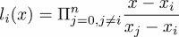

存在无限多种表示，但在这里我们只限制自己到这三种典型表示。

可以根据插值条件确定一个多项式：

*p*(*x[i]*) = *y*[i] *i* = 0, … , *n*

以给定的不同值 *x[i]* 和任意值 *y[i]* 作为输入。在 Lagrange 公式中，插值多项式直接可用，因为其系数是插值数据。Newton 表示中的插值多项式的系数可以通过一个递归公式获得，称为差分公式：

*c[i]*[,0] = *y[i,]*and

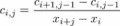.

最后，设置 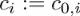。

单项式表示中的插值多项式的系数通过求解一个线性系统获得：

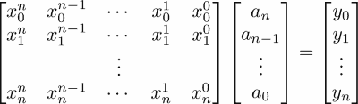

一个具有给定多项式 *p*（或其倍数）作为其特征多项式的矩阵称为伴随矩阵。伴随矩阵的特征值是多项式的零点（根）。可以通过首先设置 *p* 的伴随矩阵然后使用 `eig` 计算特征值来构建计算 *p* 的零点的算法。Newton 表示中的多项式的伴随矩阵如下所示：

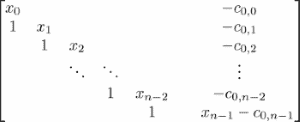

## 任务

我们现在可以制定一些编程任务：

1.  编写一个名为 `PolyNomial` 的类，具有 `points`、`degree`、`coeff` 和 `basis` 属性，其中：

    +   `points` 是一个包含元组 (*x[i], y[i]*) 的列表

    +   `degree` 表示对应插值多项式的次数

    +   `coeff` 包含多项式系数

    +   `basis` 是一个字符串，表示使用哪种表示形式

1.  为该类提供一个方法，用于在给定点上评估多项式。

1.  为该类提供一个名为 `plot` 的方法，用于在给定区间内绘制多项式。

1.  编写一个名为 `__add__` 的方法，返回两个多项式的和。请注意，只有在单项式情况下，和可以通过简单地相加系数来计算。

1.  编写一个方法，计算以单项式形式表示的多项式的系数。

1.  编写一个方法，计算多项式的伴随矩阵。

1.  编写一个方法，通过计算伴随矩阵的特征值来计算多项式的零点。

1.  编写一个方法，计算给定多项式的 *i* 次导数的多项式。

1.  编写一个方法，检查两个多项式是否相等。可以通过比较所有系数来检查相等性（零首项系数不应影响）。

# 多项式类

现在我们设计一个基于多项式的单项式表示的多项式基类。多项式可以通过给出单项式基的系数或给出插值点列表来初始化，如下所示：

```py
import scipy.linalg as sl

class PolyNomial:
    base='monomial'
    def __init__(self,**args):
        if 'points' in args:
            self.points = array(args['points'])
            self.xi = self.points[:,0]
            self.coeff = self.point_2_coeff()
            self.degree = len(self.coeff)-1
        elif 'coeff' in args:
            self.coeff = array(args['coeff'])
            self.degree = len(self.coeff)-1
            self.points = self.coeff_2_point()
        else:
            self.points = array([[0,0]])
            self.xi = array([1.])
            self.coeff = self.point_2_coeff()
            self.degree = 0
```

新类的 `__init__` 方法使用在第七章 *函数* 中讨论的 `**args` 构造。如果没有给出参数，则假定多项式为零多项式。如果多项式由插值点给出，则用于通过求解 Vandermonde 系统的系数的方法如下：

```py
def point_2_coeff(self):
    return sl.solve(vander(self.x),self.y)
```

如果给出 *k* 个系数，也将构造 *k* 个插值点：

```py
def coeff_2_point(self):
    points = [[x,self(x)] for x in linspace(0,1,self.degree+1)]
    return array(points)
```

`self(x)` 命令执行多项式评估，这是通过提供一个方法 `__call__` 来完成的：

```py
def __call__(self,x):
    return polyval(self.coeff,x)
```

（参考第八章 *特殊方法* 节中的示例第八章，*类*。）这里，此方法使用 `polyval` 命令。作为下一步，我们只是为了方便添加两个方法，我们用 `property` 装饰器来装饰它们（参考第七章 *函数作为装饰器* 节中的第七章，*函数)*）：

```py
@property
def x(self):
    return self.points[:,0]
@property
def y(self):
    return self.points[:,1]
```

让我们解释一下这里发生了什么。我们定义了一个方法来提取用于定义多项式的数据的 *x* 值，同样，还定义了一个方法来提取数据的 *y* 值。使用 `property` 装饰器，调用方法的结果被呈现为如果它只是多项式的一个属性。有两种编码选择：

1.  我们使用方法调用：

    ```py
          def x(self):
              return self.interppoints[:,0]
    ```

    这通过调用：`p.x()` 来访问 *x* 值。

1.  我们使用 `property` 装饰器。它允许通过这个语句访问 *x* 值：`p.x`

我们选择了第二种方案。始终定义一个 `__repr__` 方法是一个好习惯（参考第八章的 *Attributes* 部分，第八章，*类*）。至少对于快速检查结果，这个方法是很有用的：

```py
def __repr__(self):
    txt  = 'Polynomial of degree {degree} \n'
    txt += 'with coefficients {coeff} \n in {base} basis.'
    return txt.format(coeff=self.coeff, degree=self.degree,
                                            base=self.base)
```

我们现在提供了一个绘制多项式的方法，如下所示：

```py
margin = .05
plotres = 500
def plot(self,ab=None,plotinterp=True):
    if ab is None: # guess a and b
       x = self.x
       a, b = x.min(), x.max()
       h = b-a
       a -= self.margin*h
       b += self.margin*h
    else:
       a,b = ab
    x = linspace(a,b,self.plotres)
    y = vectorize(self.__call__)(x)
    plot(x,y)
    xlabel('$x$')
    ylabel('$p(x)$')
    if plotinterp:
        plot(self.x, self.y, 'ro')
```

注意到使用了 `vectorize` 命令（参考第四章的 *Functions acting on arrays* 部分，第四章，*线性代数 - 数组*）。`__call__` 方法是针对单项式表示的，如果多项式以其他基表示，则需要更改。计算多项式的伴随矩阵也是如此：

```py
def companion(self):
    companion = eye(self.degree, k=-1)
    companion[0,:] -= self.coeff[1:]/self.coeff[0]
    return companion
```

一旦有了伴随矩阵，多项式的零点就由特征值给出：

```py
def zeros(self):
   companion = self.companion()
   return sl.eigvals(companion)
```

为了这个目的，需要首先从 `scipy.linalg` 导入 `eigvals` 函数。让我们给出一些使用示例。

首先，我们从给定的插值点创建一个多项式实例：

```py
p = PolyNomial(points=[(1,0),(2,3),(3,8)])
```

多项式相对于单项式基的系数作为 `p` 的一个属性可用：

```py
p.coeff # returns array([ 1., 0., -1.])
```

这对应于多项式 。通过 `p.plot(-3.5,3.5)` 获得的多项式的默认绘图结果如下（*图 14.1*）：

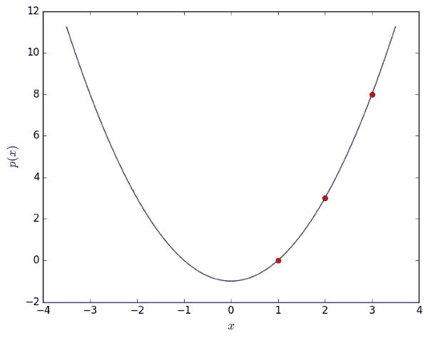

图 14.1：多项式绘图方法的结果

最后，我们计算多项式的零点，在这种情况下是两个实数：

```py
pz = p.zeros() # returns array([-1.+0.j, 1.+0.j])
```

可以通过在这些点上评估多项式来验证结果：

```py
p(pz) # returns array([0.+0.j, 0.+0.j])
```

# 牛顿多项式

`NewtonPolyNomial` 类定义了一个以牛顿基为基准的多项式。我们通过使用 `super` 命令让它继承了一些来自多项式基类的常用方法，例如 `polynomial.plot`、`polynomial.zeros`，甚至 `__init__` 方法的部分，如下所示（参考第八章的 *Subclassing and Inheritance* 部分，第八章，*类*）：

```py
class NewtonPolynomial(PolyNomial):
    base = 'Newton'
    def __init__(self,**args):
        if 'coeff' in args:
            try:
                self.xi = array(args['xi'])
            except KeyError: 
                raise ValueError('Coefficients need to be given'
                'together with abscissae values xi')
        super(NewtonPolynomial, self).__init__(**args)
```

一旦给出了插值点，系数的计算就通过以下方式完成：

```py
def point_2_coeff(self):
    return array(list(self.divdiff()))
```

在这里，我们使用了差分法来计算多项式的牛顿表示，这里将其编程为一个生成器：

```py
def divdiff(self): 
    xi = self.xi
    row = self.y
    yield row[0]
    for level in range(1,len(xi)):
        row = (row[1:] - row[:-1])/(xi[level:] - xi[:-level])
        if allclose(row,0): # check: elements of row nearly zero
           self.degree = level-1
           break
        yield row[0]
```

让我们简要检查一下这是如何工作的：

```py
pts = array([[0.,0],[.5,1],[1.,0],[2,0.]]) # here we define the
  interpolation data: (x,y) pairs
pN = NewtonPolynomial(points=pts) # this creates an instance of the
  polynomial class
pN.coeff # returns the coefficients array([ 0\. , 2\. , -4\. ,
  2.66666667])
print(pN)
```

`print` 函数执行基类的 `__repr__` 方法，并返回以下文本：

```py
Polynomial of degree 3
 with coefficients [ 0.     2.    -4.      2.66666667]
 in Newton basis.
```

多项式评估与基类的相应方法不同。`Newton.PolyNomial.__call__` 方法需要覆盖 `Polynomial.__call__`：

```py
def __call__(self,x):
    # first compute the sequence 1, (x-x_1), (x-x_1)(x-x_2),...
    nps = hstack([1., cumprod(x-self.xi[:self.degree])])
    return dot(self.coeff, nps)
```

最后，我们给出了伴随矩阵的代码，它覆盖了父类的相应方法，如下所示：

```py
def companion(self):
    degree = self.degree
    companion = eye(degree, k=-1)
    diagonal = identity(degree,dtype=bool)
    companion[diagonal] = self.x[:degree]
    companion[:,-1] -= self.coeff[:degree]/self.coeff[degree]
    return companion
```

注意到使用了布尔数组。练习将进一步建立在这个基础上。

# 谱聚类

特征向量在聚类数据中的应用很有趣。使用从距离矩阵导出的矩阵的特征向量，未标记的数据可以被分成组。谱聚类方法的名字来源于这个矩阵的谱。一个包含**n**个元素（例如，数据点之间的成对距离）的距离矩阵是一个 n × n 的对称矩阵。给定这样的 n × n 距离矩阵**M**（距离值为**m[ij]**），我们可以创建数据点的拉普拉斯矩阵，如下所示：

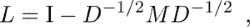

在这里，**I**是单位矩阵，**D**是包含**M**行和的对角矩阵，

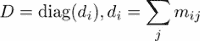

数据簇是从**L**的特征向量中获得的。在只有两个类别的最简单数据点情况下，第一个特征向量（即对应于最大特征值的那个）通常足以分离数据。

这里是一个简单二类聚类的示例。以下代码创建了一些二维数据点，并根据拉普拉斯矩阵的第一个特征向量对它们进行聚类：

```py
import scipy.linalg as sl

# create some data points
n = 100
x1 = 1.2 * random.randn(n, 2)
x2 = 0.8 * random.randn(n, 2) + tile([7, 0],(n, 1))
x = vstack((x1, x2))

# pairwise distance matrix
M = array([[ sqrt(sum((x[i] - x[j])**2)) 
                                  for i in range(2*n)]          
                                    for j in range(2 * n)])

# create the Laplacian matrix
D = diag(1 / sqrt( M.sum(axis = 0) ))
L = identity(2 * n) - dot(D, dot(M, D))

# compute eigenvectors of L
S, V = sl.eig(L)
# As L is symmetric the imaginary parts
# in the eigenvalues are only due to negligible numerical errors S=S.real
V=V.real
```

与最大的特征值对应的特征向量给出了分组（例如，通过在**0**处进行阈值处理）并可以显示如下：

```py
largest=abs(S).argmax()
plot(V[:,largest])
```

以下图（图 14.2）显示了简单二类数据集的谱聚类结果：

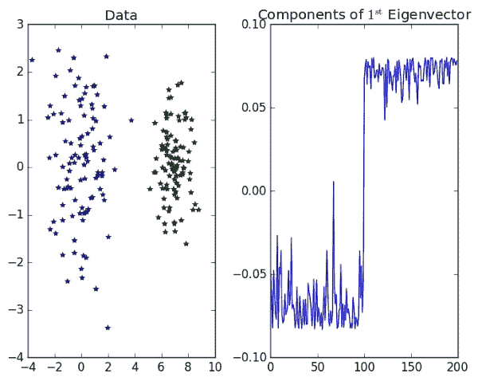

图 14.2：显示简单二类聚类的结果

对于更复杂的数据集和更多类别，通常取与**k**个最大特征值对应的**k**个特征向量，然后使用其他方法对数据进行聚类，但使用特征向量而不是原始数据点。一个常见的选择是**k**-均值聚类算法，这是下一个示例的主题：

特征向量被用作**k**-均值聚类的输入，如下所示：

```py
import scipy.linalg as sl
import scipy.cluster.vq as sc
# simple 4 class data
x = random.rand(1000,2)
ndx = ((x[:,0] < 0.4) | (x[:,0] > 0.6)) & 
                     ((x[:,1] < 0.4) | (x[:,1] > 0.6))
x = x[ndx]
n = x.shape[0]

# pairwise distance matrix
M = array([[ sqrt(sum((x[i]-x[j])**2)) for i in range(n) ]
                                       for j in range(n)])

# create the Laplacian matrix
D = diag(1 / sqrt( M.sum(axis=0) ))
L = identity(n) - dot(D, dot(M, D))

# compute eigenvectors of L
_,_,V = sl.svd(L)

k = 4
# take k first eigenvectors
eigv = V[:k,:].T

# k-means
centroids,dist = sc.kmeans(eigv,k)
clust_id = sc.vq(eigv,centroids)[0]
```

注意，我们在这里使用奇异值分解（`sl.svd`）计算了特征向量。由于**L**是对称的，所以结果与使用`sl.eig`相同，但特征向量已经按照特征值的顺序排列。我们还使用了废弃变量。`svd`返回一个包含三个数组的列表，即左奇异向量`U`、右奇异向量`V`和奇异值`S`，如下所示：

```py
U, S, V = sl.svd(L)
```

由于我们这里不需要`U`和`S`，我们可以在解包`svd`的返回值时将它们丢弃：

```py
_, _, V = sl.svd(L)
```

结果可以使用以下方式绘制：

```py
for i in range(k):
    ndx = where(clust_id == i)[0]
    plot(x[ndx, 0], x[ndx, 1],'o')
axis('equal')
```

以下图显示了简单**多类数据集**的谱聚类的结果：

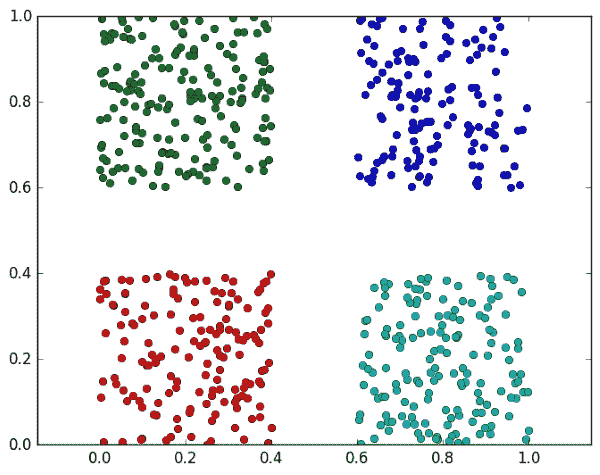

图 14.3：简单四类数据集的谱聚类示例。

# 求解初值问题

在本节中，我们将考虑一个数学任务，即对给定的初始值进行常微分方程组的数值求解：

**y**'(*t*) *= f*(*t, y*) **y**(*t*[0]) *= y*[0]∈ ℝ*^n*

这个问题的解是一个函数*y*。数值方法旨在计算好的近似值，*y[i]*≈ *y*(*t[i]*)在感兴趣的区间[*t[0], t*[e]]内的离散点*通信点*t[i]*，我们收集描述问题的数据在一个类中，如下所示：

```py
class IV_Problem:
    """
    Initial value problem (IVP) class
    """
    def __init__(self, rhs, y0, interval, name='IVP'):
        """
        rhs 'right hand side' function of the ordinary differential
                                                   equation f(t,y)
        y0 array with initial values
        interval start and end value of the interval of independent
        variables often initial and end time
        name descriptive name of the problem
        """
        self.rhs = rhs
        self.y0 = y0
        self.t0, self.tend = interval
        self.name = name
```

微分方程：

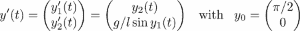

描述了一个数学摆；*y[1]*描述了其相对于竖直轴的角度，*g*是重力常数，*l*是其长度。初始角度是π/2，初始角速度为零。

摆动问题成为问题类的一个实例，如下所示：

```py
def rhs(t,y):
    g = 9.81
    l = 1.
    yprime = array([y[1], g / l * sin(y[0])])
    return yprime

pendulum = IV_Problem(rhs, array([pi / 2, 0.]), [0., 10.] ,
                                            'mathem. pendulum')
```

对于当前的问题可能会有不同的观点，导致类的不同设计。例如，有人可能希望将独立变量的区间视为解决方案过程的一部分，而不是问题定义的一部分。当考虑初始值时，情况也是如此。它们可能，就像我们在这里所做的那样，被视为数学问题的一部分，而其他作者可能希望允许通过将它们作为解决方案过程的一部分来改变初始值。

解决过程被建模为另一个类：

```py
class IVPsolver:
    """
    IVP solver class for explicit one-step discretization methods
    with constant step size
    """
    def __init__(self, problem, discretization, stepsize):
        self.problem = problem
        self.discretization = discretization
        self.stepsize = stepsize
    def one_stepper(self):
        yield self.problem.t0, self.problem.y0
        ys = self.problem.y0
        ts = self.problem.t0
        while ts <= self.problem.tend:
            ts, ys = self.discretization(self.problem.rhs, ts, ys,
                                                self.stepsize)
            yield ts, ys
    def solve(self):
        return list(self.one_stepper())
```

我们继续定义两个离散化方案：

+   显式**欧拉**方法：

```py
      def expliciteuler(rhs, ts, ys, h):
          return ts + h, ys + h * rhs(ts, ys)
```

+   经典**龙格-库塔四阶**方法（**RK4**）：

```py
      def rungekutta4(rhs, ts, ys, h):
          k1 = h * rhs(ts, ys)
          k2 = h * rhs(ts + h/2., ys + k1/2.) 
          k3 = h * rhs(ts + h/2., ys + k2/2.)
          k4 = h * rhs(ts + h, ys +  k3)
          return ts + h, ys + (k1 + 2*k2 + 2*k3 + k4)/6.
```

使用这些工具，我们可以创建实例以获得摆动常微分方程（ODE）的相应离散化版本：

```py
pendulum_Euler = IVPsolver(pendulum, expliciteuler, 0.001) 
pendulum_RK4 = IVPsolver(pendulum, rungekutta4, 0.001)
```

我们可以求解这两个离散模型并绘制解和角度差：

```py
sol_Euler = pendulum_Euler.solve()
sol_RK4 = pendulum_RK4.solve()
tEuler, yEuler = zip(*sol_Euler)
tRK4, yRK4 = zip(*sol_RK4)
subplot(1,2,1), plot(tEuler,yEuler),\
       title('Pendulum result with Explicit Euler'),\
       xlabel('Time'), ylabel('Angle and angular velocity')
subplot(1,2,2), plot(tRK4,abs(array(yRK4)-array(yEuler))),\
       title('Difference between both methods'),\
       xlabel('Time'), ylabel('Angle and angular velocity')
```

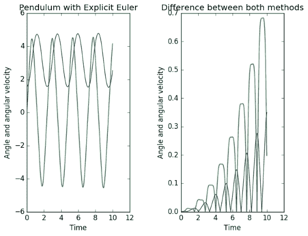

图 14.4：使用显式欧拉方法和与更精确的龙格-库塔 4 方法结果的比较进行摆动模拟

讨论替代类设计是值得的。应该将什么放入单独的类中，什么应该捆绑到同一个类中？

+   我们严格地将数学问题与数值方法分开。初始值应该放在哪里？它们应该是问题的一部分还是求解器的一部分？或者它们应该作为求解器实例求解方法的输入参数？甚至可以设计程序以允许几种可能性。使用这些替代方案的决定取决于该程序未来的使用。将初始值作为求解方法输入参数可以简化像参数识别这样的各种初始值的循环。另一方面，使用相同的初始值模拟不同的模型变体会促使将初始值与问题耦合。

+   为了简单起见，我们只展示了具有恒定和给定步长的求解器。`IVPsolver`类的设计是否适合未来自适应方法的扩展，其中给出的是容差而不是步长？

+   我们之前建议使用生成器构造来构建步进机制。自适应方法需要不时地拒绝步骤。这种需求是否与 `IVPsolver.onestepper` 中步进机制的设计相冲突？

+   我们鼓励您检查用于求解初值的两个 SciPy 工具的设计，即 `scipy.integrate.ode` 和 `scipy.integrate.odeint`。

# 摘要

本书中所解释的大部分内容都包含在本章三个较长的示例中。它们模仿代码开发并提供原型，鼓励您对其进行修改并与自己的想法进行对比。

您已经看到，科学计算中的代码可以有自己的特色，因为它与数学定义的算法有很强的关联，并且通常明智的做法是保持代码与公式之间的关系可见。Python 有这样的技术，正如您所看到的。

# 练习

**例 1** → 实现一个名为 `__add__` 的方法，该方法通过添加两个给定的多项式 *p* 和 *q* 来构建一个新的多项式 *p+q*。在单项式形式中，多项式通过仅添加系数来相加，而在牛顿形式中，系数依赖于插值点的横坐标 *x[i]*。在添加两个多项式的系数之前，多项式 *q* 必须获得具有横坐标 *x[i]* 与 *p* 相同的新插值点，并且必须提供 `__changepoints__` 方法来完成此操作。它应该更改插值点并返回一组新的系数。

**例 2** → 编写转换方法，将多项式从牛顿形式转换为单项式形式，反之亦然。

**例 3** → 编写一个名为 `add_point` 的方法，该方法接受一个多项式 *q* 和一个元组 *(x,y)* 作为参数，并返回一个新的多项式，该多项式插值 `self.points` 和 *(x,y)*。

**例 4** → 编写一个名为 `LagrangePolynomial` 的类，该类实现拉格朗日形式的多项式，并尽可能多地继承多项式基类。

**例 5** → 为多项式类编写测试。
