# 第十五章：符号计算 - SymPy

在本章中，我们将简要介绍使用 Python 进行符号计算。市场上存在用于执行符号计算的强大软件，例如 Maple^(TM) 或 Mathematica^(TM)。但有时，在您习惯的语言或框架中进行符号计算可能更有利。在本书的这个阶段，我们假设这种语言是 Python，因此我们寻求在 Python 中找到一个工具——SymPy 模块。

如果可能的话，对 SymPy 的完整描述将填满整本书，但这不是本章的目的。相反，我们将通过一些指导性示例来探索这个工具，展示这个工具作为 NumPy 和 SciPy 的补充工具的潜力。

# 什么是符号计算？

我们在这本书中到目前为止所做的所有计算都是所谓的数值计算。这些计算主要是一系列对浮点数的操作。数值计算的本质是结果是对精确解的近似。

符号计算通过对公式或符号进行变换来操作，这些变换遵循代数或微积分中的教学，然后转换成其他公式。这些变换的最后一步可能需要插入数字并执行数值评估。

我们通过计算这个定积分来说明这种差异：

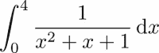

从符号上讲，这个表达式可以通过考虑被积函数的原函数来转换：

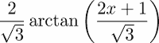

通过插入积分界限，我们现在得到了定积分的公式：

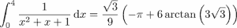

这被称为积分的闭式表达式。很少有数学问题的解可以用闭式表达式给出。这是积分的精确值，没有任何近似。而且，将实数表示为浮点数时不会引入任何误差，否则会引入舍入误差。

近似和舍入误差在最后时刻发挥作用，当这个表达式需要被评估时。平方根和反正切函数只能通过数值方法近似计算。这样的评估给出最终结果，精确到一定的（通常是未知的）精度：

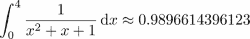

另一方面，数值计算会直接通过某种近似方法（例如辛普森法则）近似定积分，并给出一个数值结果，通常还会给出误差估计。在 Python 中，这是通过以下命令完成的：

```py
from scipy.integrate import quad
quad(lambda x : 1/(x**2+x+1),a=0, b=4)   
```

它们返回值 *0.9896614396122965* 和误差界限的估计值 *1.1735663442283496 10^(-08)*。

以下图表显示了数值和符号近似的比较：

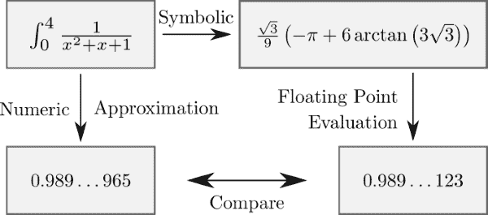

图 15.1：符号和数值求积

## 在 SymPy 中详细说明一个例子

首先，让我们详细说明在 SymPy 中之前提到的例子，并解释步骤。

首先，我们必须导入模块：

```py
from sympy import *
init_printing()
```

第二个命令确保如果可能的话，公式以图形方式呈现。然后，我们生成一个符号并定义被积函数：

```py
x = symbols('x')
f = Lambda(x, 1/(x**2 + x + 1))
```

`x`现在是一个类型为`Symbol`的 Python 对象，而`f`是一个 SymPy 的`Lambda`函数（注意命令以大写字母开头）。

现在我们开始进行积分的符号计算：

```py
integrate(f(x),x)    
```

根据你的工作环境，结果将以不同的方式呈现；请参考以下截图（*图 15.2*），它表示在不同环境中 SymPy 公式的两个不同结果：


图 15.2：SymPy 在两个不同环境中展示公式的两个截图。

我们可以通过微分来检查结果是否正确。为此，我们给原函数赋予一个名称，并对*x*进行微分：

```py
pf = Lambda(x, integrate(f(x),x))
diff(pf(x),x)    
```

得到的结果将如下所示：

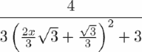

可以使用以下命令进行简化：

```py
simplify(diff(pf(x),x))    
```

到

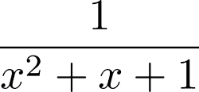。

我们预期的结果。

通过以下命令可以获得定积分：

```py
pf(4) - pf(0)     
```

使用`simplify`简化后，得到以下输出：


要获得一个数值，我们最终将这个表达式评估为浮点数：

```py
(pf(4)-pf(0)).evalf() # returns 0.9896614396123
```

# SymPy 的基本元素

在这里，我们介绍了 SymPy 的基本元素。你会发现熟悉 Python 中的类和数据类型会有所帮助。

## 符号 - 所有公式的基石

在 SymPy 中构建公式的基元是符号。正如我们在介绍示例中看到的，符号是通过`symbols`命令创建的。这个 SymPy 命令从给定的字符串生成符号对象：

```py
x, y, mass, torque = symbols('x y mass torque')
```

这实际上是以下命令的简写形式：

```py
symbol_list=[symbols(l) for l in 'x y mass torque'.split()]
```

然后进行展开步骤以获得变量：

```py
 x, y, mass, torque = symbol_list
```

命令的参数定义了符号的字符串表示。符号的变量名通常选择与其字符串表示相同，但这不是语言的要求：

```py
row_index=symbols('i',integer=True)
print(row_index**2)  # returns i**2
```

在这里，我们还定义了符号被假定为整数。

可以非常紧凑地定义一组符号：

```py
integervariables = symbols('i:l', integer=True)
dimensions = symbols('m:n', integer=True)
realvariables = symbols('x:z', real=True)
```

同样，可以通过以下方式定义索引变量的符号：

```py
A = symbols('A1:3(1:4)')
```

这给出了一个符号元组，

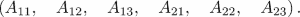

索引范围的规则是我们在这本书的早期章节中处理切片时看到的（有关更多详细信息，请参阅第三章，*容器类型*）。

## 数字

Python 直接评估数字上的操作，并不可避免地引入舍入误差。这些会阻碍所有符号计算。当我们`sympify`数字时，可以避免这种情况：

```py
1/3  # returns 0.3333333333333333
sympify(1)/sympify(3)  # returns '1/3'
```

`sympify`命令将整数转换为`sympy.core.numbers.Integer`类型的对象。

而不是将 1/3 写成两个整数的运算，也可以通过`Rational(1,3)`直接表示为一个有理数。

## 函数

SymPy 区分已定义和未定义的函数。未定义函数（可能有些误导）指的是具有无特殊属性的通用函数的明确定义的 Python 对象。

具有特殊属性的函数示例是`atan`或本章介绍示例中使用的`Lambda`函数。

注意同一数学函数的不同实现有不同的名称：`sympy.atan`和`scipy.arctan`。

### 未定义函数

通过给`symbols`命令一个额外的类参数来创建一个未定义函数的符号：

```py
f, g = symbols('f g', cls=Function)
```

同样可以通过使用`Function`构造函数实现：

```py
f = Function('f')
g = Function('g')
```

在未定义函数的情况下，我们可以评估微积分的一般规则。

例如，让我们评估以下表达式：

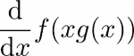

这个在 Python 中通过以下命令进行符号计算：

```py
x = symbols('x')
f, g = symbols('f g', cls=Function)
diff(f(x*g(x)),x)
```

当执行时，前面的代码返回以下输出：

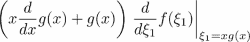

这个例子展示了如何应用乘积规则和链式规则。

我们甚至可以将未定义函数用作多个变量的函数，例如：

```py
x = symbols('x:3')
f(*x)
```

它返回以下输出：

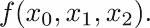

### 注意

注意使用星号运算符将元组解包以形成带有参数的*f*；请参阅*匿名函数*部分，第七章，*函数*。

通过使用列表推导，我们可以构建包含所有偏导数的*f*的列表：

```py
 [diff(f(*x),xx) for xx in x]
```

这返回一个包含（*f*的梯度）元素的列表：

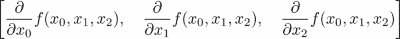

该命令也可以通过使用`Function`对象的`diff`方法重写：

```py
[f(*x).diff(xx) for xx in x]
```

另一种方法是泰勒级数展开：

```py
x = symbols('x')
f(x).series(x,0,n=4)
```

这返回泰勒公式，以及由 Landau 符号表示的余项：

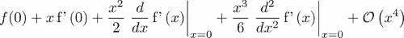

# 基本函数

SymPy 中的基本函数示例包括三角函数及其反函数。以下示例展示了`simplify`如何作用于包含基本函数的表达式：

```py
x = symbols('x')
simplify(cos(x)**2 + sin(x)**2)  # returns 1
```

这里是另一个使用基本函数的例子：

```py
atan(x).diff(x) - 1./(x**2+1)  # returns 0
```

如果你同时使用 SciPy 和 SymPy，我们强烈建议你在不同的命名空间中使用它们：

```py
import scipy as sp
import sympy as sym
# working with numbers
x=3
y=sp.sin(x)
# working with symbols
x=sym.symbols('x')
y=sym.sin(x)   
```

## Lambda - 函数

在第七章，*函数*的*匿名函数*部分中，我们看到了如何在 Python 中定义所谓的匿名函数。SymPy 中的对应操作是通过`Lambda`命令完成的。注意区别；`lambda`是一个关键字，而`Lambda`是一个构造函数。

`Lambda`命令接受两个参数，函数的独立变量符号和一个用于评估函数的 SymPy 表达式。

这里有一个例子，将空气阻力（也称为阻力）定义为速度的函数：

```py
C,rho,A,v=symbols('C rho A v')
# C drag coefficient, A coss-sectional area, rho density
# v speed
f_drag = Lambda(v,-Rational(1,2)*C*rho*A*v**2)
```

`f_drag` 显示为一个表达式：

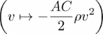.

这个函数可以通过提供参数以通常的方式评估：

```py
x = symbols('x')
f_drag(2)
f_drag(x/3)
```

这将导致给定的表达式：

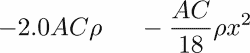

也可能通过只提供几个参数来创建多个变量的函数，例如：

```py
t=Lambda((x,y),sin(x) + cos(2*y))
```

调用此函数可以通过两种方式完成，要么直接提供几个参数：

```py
t(pi,pi/2)  # returns -1
```

或者通过解包元组或列表：

```py
p=(pi,pi/2)
t(*p)   # returns -1
```

SymPy 中的矩阵对象甚至可以定义向量值函数：

```py
F=Lambda((x,y),Matrix([sin(x) + cos(2*y), sin(x)*cos(y)]))
```

这使我们能够计算雅可比矩阵：

```py
F(x,y).jacobian((x,y))
```

这将输出以下表达式：

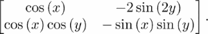

在变量的情况下，使用更紧凑的格式来定义函数是方便的：

```py
x=symbols('x:2')
F=Lambda(x,Matrix([sin(x[0]) + cos(2*x[1]),sin(x[0])*cos(x[1])]))  
F(*x).jacobian(x)
```

# 符号线性代数

符号线性代数由 SymPy 的 `matrix` 数据类型支持，我们首先介绍它。然后，我们将以一些线性代数方法为例，展示在这个领域中符号计算的广泛可能性：

## 符号矩阵

当我们讨论向量值函数时，我们简要地遇到了 `matrix` 数据类型。在那里，我们看到了它的最简单形式，它将列表的列表转换为矩阵。为了举例，让我们构建一个旋转矩阵：

```py
phi=symbols('phi')
rotation=Matrix([[cos(phi), -sin(phi)],
                 [sin(phi), cos(phi)]])
```

当使用 SymPy 矩阵时，我们必须注意运算符 `*` 执行矩阵乘法，而不是逐元素乘法，这是 NumPy 数组的情况。

上述定义的旋转矩阵可以通过使用以下矩阵乘法和矩阵的转置来检查正交性：

```py
simplify(rotation.T*rotation -eye(2))  # returns a 2 x 2 zero matrix
```

前面的例子展示了如何转置矩阵以及如何创建单位矩阵。或者，我们也可以检查其逆矩阵是否等于其转置，这可以通过以下方式完成：

```py
simplify(rotation.T - rotation.inv())
```

另一种设置矩阵的方法是提供符号列表和形状：

```py
M = Matrix(3,3, symbols('M:3(:3)'))
```

这将创建以下矩阵：


创建矩阵的第三种方式是通过给定函数生成其元素。语法是：

```py
Matrix(number of rows,number of colums, function)
```

我们通过考虑 Toeplitz 矩阵是一个具有常数对角线的矩阵来举例说明上述矩阵。给定一个 *2n-1* 数据向量 *a*，其元素定义为

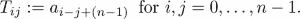

在 SymPy 中，矩阵可以通过直接使用此定义来定义：

```py
def toeplitz(n):
    a = symbols('a:'+str(2*n))
    f = lambda i,j: a[i-j+n-1]
    return Matrix(n,n,f)
```

执行前面的代码会得到 `toeplitz(5)`:

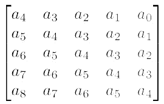

可以清楚地看到所需的结构；所有子对角线和超对角线上的元素都是相同的。我们可以根据第三章列表中介绍的 Python 语法通过索引和切片来访问矩阵元素：

```py
a=symbols('a')
M[0,2]=0  # changes one element
M[1,:]=Matrix(1,3,[1,2,3]) # changes an entire row
```

# SymPy 中线性代数方法的示例

线性代数的基本任务是解决线性方程组：

。

让我们为 3 *×* 3 矩阵进行符号化处理：

```py
A = Matrix(3,3,symbols('A1:4(1:4)'))
b = Matrix(3,1,symbols('b1:4'))
x = A.LUsolve(b)

```

这个相对较小的问题的输出已经相当易读，如下所示的表达式所示：

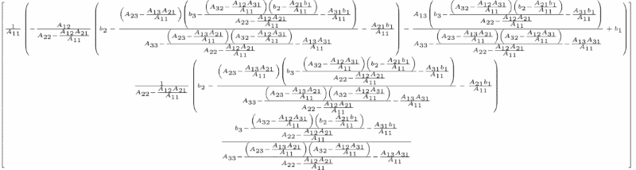

再次，使用 `simplify` 命令可以帮助我们检测消去的项并收集公共因子：

```py
simplify(x)
```

这将导致以下输出，看起来要好得多：

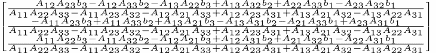

随着矩阵维度的增加，符号计算会变得非常慢。对于大于 15 的维度，甚至可能发生内存问题。

前面的图（*图 15.3*）说明了符号和数值求解线性系统之间 CPU 时间的差异：

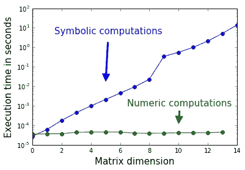

图 15.3：数值和符号求解线性系统所需的 CPU 时间。

# 替换

让我们先考虑一个简单的符号表达式：

```py
x, a = symbols('x a')
b = x + a
```

如果我们将 `x = 0` 会发生什么？我们观察到 `b` 没有改变。我们所做的是改变了 Python 变量 `x`。现在它不再指向符号对象，而是指向整数对象 *0*。由字符串 `'x'` 表示的符号保持不变，`b` 也是如此。

相反，通过用数字、其他符号或表达式替换符号来改变表达式，是通过一种特殊的替换方法完成的，这在以下代码中可以看到：

```py
x, a = symbols('x a')
b = x + a
c = b.subs(x,0)   
d = c.subs(a,2*a)  
print(c, d)   # returns (a, 2a)
```

此方法接受一个或两个参数：

```py
b.subs(x,0)
b.subs({x:0})  # a dictionary as argument
```

将字典作为参数允许我们在一步中执行多个替换：

```py
b.subs({x:0, a:2*a})  # several substitutions in one
```

由于字典中的项目没有定义的顺序——永远不知道哪个会是第一个——因此需要确保交换项目不会影响替换结果。因此，在 SymPy 中，首先在字典中进行替换，然后对表达式进行替换。以下示例演示了这一点：

```py
x, a, y = symbols('x a y')
b = x + a
b.subs({a:a*y, x:2*x, y:a/y})
b.subs({y:a/y, a:a*y, x:2*x})
```

这两种替换都返回相同的结果，即

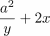。

定义多个替换的第三种方法是使用旧值/新值对的列表：

```py
 b.subs([(y,a/y), (a,a*y), (x,2*x)]) 
```

也可以用其他表达式替换整个表达式：

```py
n, alpha = symbols('n alpha')
b = cos(n*alpha)
b.subs(cos(n*alpha), 2*cos(alpha)*cos((n-1)*alpha)-cos((n-2)*alpha))
```

为了说明矩阵元素的替换，我们再次取一个 *5 × 5* 的 Toeplitz 矩阵：


考虑替换 `M.subs(T[0,2],0)`。它改变了位置 [0, 2] 的符号对象，即符号 *a*[2]。它还出现在其他两个地方，这些地方会自动受到影响。

给定的表达式是得到的矩阵：

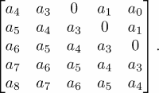

或者，我们可以为这个符号创建一个变量并在替换中使用它：

```py
a2 = symbols('a2')
T.subs(a2,0)
```

作为替换的一个更复杂的例子，我们描述了如何将托普利茨矩阵转换为三对角托普利茨矩阵*.* 这可以通过以下方式完成：首先我们生成一个我们想要替换的符号列表；然后我们使用 `zip` 命令生成一个成对的列表。最后，我们通过提供上述描述的老值/新值对列表来进行替换：

```py
symbs = [symbols('a'+str(i)) for i in range(19) if i < 3 or i > 5]
substitutions=list(zip(symbs,len(symbs)*[0]))
T.subs(substitutions)
```

这给出了以下矩阵作为结果：

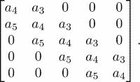

# 评估符号表达式

在科学计算的环境中，通常需要首先进行符号操作，然后将符号结果转换为浮点数。

评估符号表达式的核心工具是 `evalf`。它通过以下方式将符号表达式转换为浮点数：

```py
pi.evalf()   # returns 3.14159265358979
```

结果对象的类型是 `Float`（注意大小写），这是一个 SymPy 数据类型，允许具有任意位数（任意精度）的浮点数。默认精度对应于 15 位，但可以通过给 `evalf` 提供一个额外的正整数参数来改变，该参数指定了以数字位数表示的所需精度，

```py
pi.evalf(30)   # returns  3.14159265358979323846264338328
```

使用任意精度的一个后果是数字可以是任意小的，也就是说，打破了经典浮点表示的极限；参考第二章中的*浮点数*部分，*变量和基本类型*。

趣味的是，使用 `Float` 类型的输入评估 SymPy 函数会返回与输入相同精度的 `Float`。我们通过一个更详细的数值分析示例来展示这一事实的使用。

## 示例：牛顿法收敛阶数的研究

一个具有迭代项 *x[n]* 的迭代方法，如果存在一个正常数 *C*，使得 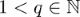，则称其以 *q* 阶收敛，如果

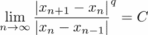。

当以良好的初始值开始时，牛顿法的阶数为 *q* = 2，对于某些问题，甚至 *q* = 3。将牛顿法应用于问题 arctan(*x*) = 0 给出以下迭代方案：

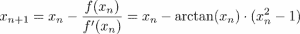

这以立方收敛；也就是说 *q* = 3。

这意味着从迭代到迭代，正确的数字位数翻三倍。为了展示立方收敛并数值确定常数 *C*，使用标准的 16 位浮点数据类型几乎是不可能的。

以下代码使用 SymPy 和高精度评估代替，并将对立方收敛的研究推向极致：

```py
x = sp.Rational(1,2)
xns=[x]

for i in range(1,9):
    x = (x - sp.atan(x)*(1+x**2)).evalf(3000)
    xns.append(x)
```

结果如图 15.4 所示，该图显示了从迭代到迭代正确的数字位数翻三倍。

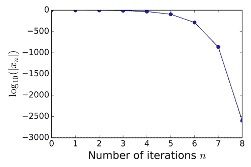

图 15.4：应用于 arctan(x)=0 的牛顿法收敛性研究

这种极端的精度要求（3,000 位！）使我们能够评估前面序列的七个项，以展示以下方式的三次收敛：

```py
# Test for cubic convergence
print(array(abs(diff(xns[1:]))/abs(diff(xns[:-1]))**3,dtype=float64))
```

结果是一个包含七个项的列表，让我们假设 *C =* 2/3：

```py
[ 0.41041618, 0.65747717, 0.6666665,  0.66666667, 0.66666667, 0.66666667, 0.66666667]
```

# 将符号表达式转换为数值函数

正如我们所见，符号表达式的数值评估分为三个步骤，首先进行一些符号计算，然后通过 `evalf` 用数字替换值，并对浮点数进行评估。

符号计算的原因通常是因为人们想要进行参数研究。这要求在给定的参数范围内修改参数。这要求最终将符号表达式转换为数值函数。

## 对多项式系数参数依赖性的研究

我们通过一个插值示例来展示符号/数值参数研究，以介绍 SymPy 命令 `lambdify`。让我们考虑一个任务，即插值数据 *x* = [0, *t*, 1] 和 *y* = [0, 1,-1]。在这里，*t* 是一个自由参数，我们将在区间 [-0.4, 1.4] 内变化它。二次插值多项式的系数依赖于这个参数：

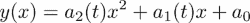。

使用 SymPy 和文中描述的单项式方法，我们可以得到这些系数的封闭公式：

```py
t=symbols('t')
x=[0,t,1]
# The Vandermonde Matrix
V = Matrix([[0, 0, 1], [t**2, t, 1], [1, 1,1]])
y = Matrix([0,1,-1])  # the data vector
a = simplify(V.LUsolve(y)) # the coefficients
# the leading coefficient as a function of the parameter
a2 = Lambda(t,a[0])
```

我们得到了插值多项式的前导系数 *a*[2] 的符号函数：

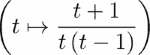

现在是时候将表达式转换为数值函数了，例如，绘制一个图。这是通过函数 `lamdify` 实现的。这个函数接受两个参数，自变量和一个 SymPy 函数。

在我们的 Python 示例中，我们可以这样写：

```py
leading_coefficient = lambdify(t,a2(t))
```

现在这个函数可以通过以下命令进行绘图，例如：

```py
t_list= linspace(-0.4,1.4,200)
ax=subplot(111)
lc_list = [leading_coefficient(t) for t in  t_list]
ax.plot(t_list, lc_list)
ax.axis([-.4,1.4,-15,10])
```

前面的图（*图 15.5*）是此参数研究的结果，可以清楚地看到由于多个插值点而产生的奇点（在这里是 *t* = 0 或 *t* = 1）：

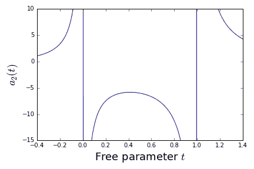

图 15.5：多项式系数对插值点位置的影响。

# 摘要

在本章中，您被引入了符号计算的世界，并一瞥了 SymPy 的强大功能。通过引导示例，您学习了如何设置符号表达式，如何处理符号矩阵，以及如何进行简化。通过使用符号函数并将它们转换为数值评估，最终建立了与科学计算和浮点结果的联系。当您使用其与 Python 的强大构造和易读语法完全集成时，您体验到了 SymPy 的强大之处。

将这一章视为开胃菜而非完整菜单。我们希望您对科学计算和数学中未来令人着迷的编程挑战产生了渴望。
