# 第一章. Apache Spark 入门

在本章中，我们将设置 Spark 并对其进行配置。本章分为以下食谱：

+   从二进制文件安装 Spark

+   使用 Maven 构建 Spark 源代码

+   在 Amazon EC2 上启动 Spark

+   在独立模式下在集群上部署 Spark

+   在 Mesos 集群上部署 Spark

+   在 YARN 集群上部署 Spark

+   使用 Tachyon 作为 off-heap 存储层

# 简介

Apache Spark 是一个通用的集群计算系统，用于处理大数据工作负载。Spark 与众不同的地方，比如 MapReduce，是其速度、易用性和复杂的分析能力。

Apache Spark 最初于 2009 年在加州大学伯克利分校的 AMPLab 开发。它在 2010 年以 BSD 许可证开源，并在 2013 年切换到 Apache 2.0 许可证。到了 2013 年的后期，Spark 的创造者成立了 Databricks，专注于 Spark 的开发和未来版本。

谈到速度，Spark 可以在大数据工作负载上实现亚秒级延迟。为了实现如此低的延迟，Spark 利用内存进行存储。在 MapReduce 中，内存主要用于实际计算。Spark 既用于计算也用于存储对象。

Spark 还提供了一个统一的运行时，可以连接到各种大数据存储源，如 HDFS、Cassandra、HBase 和 S3。它还提供了一套丰富的更高级别的库，用于不同的大数据计算任务，如机器学习、SQL 处理、图处理和实时流。这些库使开发更快，并且可以任意组合。

虽然 Spark 是用 Scala 编写的，而且这本书只关注 Scala 的食谱，但 Spark 也支持 Java 和 Python。

Spark 是一个开源社区项目，每个人都在部署时使用纯开源的 Apache 发行版，与 Hadoop 不同，Hadoop 有多种带有供应商增强功能的发行版可用。

下图显示了 Spark 生态系统：

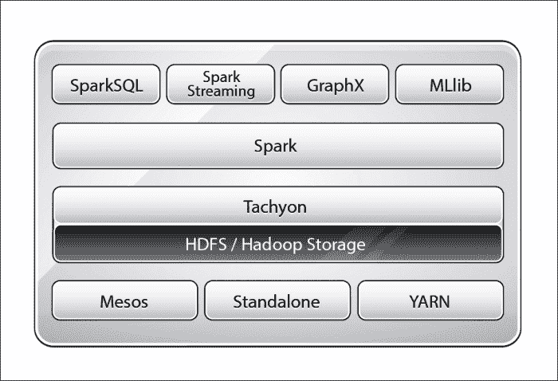

Spark 运行时运行在多种集群管理器之上，包括 YARN（Hadoop 的计算框架）、Mesos 以及 Spark 自己的集群管理器，称为**独立模式**。Tachyon 是一个以内存为中心的分布式文件系统，它能够在集群框架之间以内存速度实现可靠的文件共享。简而言之，它是一个内存中的 off-heap 存储层，有助于跨作业和用户共享数据。Mesos 是一个集群管理器，它正在演变成为一个数据中心操作系统。YARN 是 Hadoop 的计算框架，它具有强大的资源管理功能，Spark 可以无缝使用。

# 从二进制文件安装 Spark

Spark 可以从源代码构建，也可以从[`spark.apache.org`](http://spark.apache.org)下载预编译的二进制文件。对于标准用例，二进制文件就足够了，这个食谱将专注于使用二进制文件安装 Spark。

## 准备工作

本书中的所有菜谱都是使用 Ubuntu Linux 开发的，但应在任何 POSIX 环境中运行良好。Spark 预期 Java 已安装，并且 `JAVA_HOME` 环境变量已设置。

在 Linux/Unix 系统中，文件和目录的位置有一定的标准，我们将遵循本书中的这些标准。以下是一个快速速查表：

| 目录 | 描述 |
| --- | --- |
| `/bin` | 必要的命令二进制文件 |
| `/etc` | 主机特定的系统配置 |
| `/opt` | 附加应用程序软件包 |
| `/var` | 可变数据 |
| `/tmp` | 临时文件 |
| `/home` | 用户主目录 |

## 如何操作...

在撰写本文时，Spark 的当前版本是 1.4。请从 Spark 的下载页面 [`spark.apache.org/downloads.html`](http://spark.apache.org/downloads.html) 检查最新版本。二进制文件使用最新且稳定的 Hadoop 版本开发。要使用特定的 Hadoop 版本，建议从源代码构建，这将在下一道菜谱中介绍。

以下为安装步骤：

1.  打开终端并使用以下命令下载二进制文件：

    ```py
    $ wget http://d3kbcqa49mib13.cloudfront.net/spark-1.4.0-bin-hadoop2.4.tgz

    ```

1.  解压二进制文件：

    ```py
    $ tar -zxf spark-1.4.0-bin-hadoop2.4.tgz

    ```

1.  通过删除版本信息重命名包含二进制的文件夹：

    ```py
    $ sudo mv spark-1.4.0-bin-hadoop2.4 spark

    ```

1.  将配置文件夹移动到 `/etc` 文件夹，以便稍后可以创建符号链接：

    ```py
    $ sudo mv spark/conf/* /etc/spark

    ```

1.  在 `/opt` 下创建您公司特定的安装目录。由于本书中的菜谱在 `infoobjects` 沙盒上进行了测试，我们将使用 `infoobjects` 作为目录名称。创建 `/opt/infoobjects` 目录：

    ```py
    $ sudo mkdir -p /opt/infoobjects

    ```

1.  将 `spark` 目录移动到 `/opt/infoobjects`，因为它是一个附加软件包：

    ```py
    $ sudo mv spark /opt/infoobjects/

    ```

1.  将 `spark` 主目录的所有权更改为 `root`：

    ```py
    $ sudo chown -R root:root /opt/infoobjects/spark

    ```

1.  修改 `spark` 主目录的权限，`0755 = 用户：读写执行 组：读执行 世界：读执行`：

    ```py
    $ sudo chmod -R 755 /opt/infoobjects/spark

    ```

1.  切换到 `spark` 主目录：

    ```py
    $ cd /opt/infoobjects/spark

    ```

1.  创建符号链接：

    ```py
    $ sudo ln -s /etc/spark conf

    ```

1.  将 `PATH` 追加到 `.bashrc`：

    ```py
    $ echo "export PATH=$PATH:/opt/infoobjects/spark/bin" >> /home/hduser/.bashrc

    ```

1.  打开一个新的终端。

1.  在 `/var` 中创建 `log` 目录：

    ```py
    $ sudo mkdir -p /var/log/spark

    ```

1.  将 `hduser` 设置为 Spark `log` 目录的所有者。

    ```py
    $ sudo chown -R hduser:hduser /var/log/spark

    ```

1.  创建 Spark 的 `tmp` 目录：

    ```py
    $ mkdir /tmp/spark

    ```

1.  使用以下命令行配置 Spark：

    ```py
    $ cd /etc/spark
    $ echo "export HADOOP_CONF_DIR=/opt/infoobjects/hadoop/etc/hadoop" >> spark-env.sh
    $ echo "export YARN_CONF_DIR=/opt/infoobjects/hadoop/etc/Hadoop" >> spark-env.sh
    $ echo "export SPARK_LOG_DIR=/var/log/spark" >> spark-env.sh
    $ echo "export SPARK_WORKER_DIR=/tmp/spark" >> spark-env.sh

    ```

# 使用 Maven 构建 Spark 源代码

使用二进制文件安装 Spark 在大多数情况下都运行良好。对于高级情况，例如以下情况（但不限于），从源代码编译是一个更好的选择：

+   为特定 Hadoop 版本编译

+   添加 Hive 集成

+   添加 YARN 集成

## 准备工作

以下是为使此菜谱正常工作所需的先决条件：

+   Java 1.6 或更高版本

+   Maven 3.x

## 如何操作...

以下是用 Maven 构建 Spark 源代码的步骤：

1.  增加 `MaxPermSize` 以扩大堆：

    ```py
    $ echo "export _JAVA_OPTIONS=\"-XX:MaxPermSize=1G\""  >> /home/hduser/.bashrc

    ```

1.  打开一个新的终端窗口并从 GitHub 下载 Spark 源代码：

    ```py
    $ wget https://github.com/apache/spark/archive/branch-1.4.zip

    ```

1.  解压存档：

    ```py
    $ gunzip branch-1.4.zip

    ```

1.  切换到 `spark` 目录：

    ```py
    $ cd spark

    ```

1.  使用以下标志编译源代码：启用 Yarn，Hadoop 版本 2.4，启用 Hive，跳过测试以加快编译速度：

    ```py
    $ mvn -Pyarn -Phadoop-2.4 -Dhadoop.version=2.4.0 -Phive -DskipTests clean package

    ```

1.  将`conf`文件夹移动到`etc`文件夹，以便将其设置为符号链接：

    ```py
    $ sudo mv spark/conf /etc/

    ```

1.  将`spark`目录移动到`/opt`，因为它是一个附加的软件包：

    ```py
    $ sudo mv spark /opt/infoobjects/spark

    ```

1.  将`spark`主目录的所有权更改为`root`：

    ```py
    $ sudo chown -R root:root /opt/infoobjects/spark

    ```

1.  修改`spark`主目录的权限为`0755 = user:rwx group:r-x world:r-x`：

    ```py
    $ sudo chmod -R 755 /opt/infoobjects/spark

    ```

1.  移动到`spark`主目录：

    ```py
    $ cd /opt/infoobjects/spark

    ```

1.  创建符号链接：

    ```py
    $ sudo ln -s /etc/spark conf

    ```

1.  通过编辑`.bashrc`将 Spark 可执行文件放入路径：

    ```py
    $ echo "export PATH=$PATH:/opt/infoobjects/spark/bin" >> /home/hduser/.bashrc

    ```

1.  在`/var`中创建`log`目录。

    ```py
    $ sudo mkdir -p /var/log/spark

    ```

1.  使`hduser`成为 Spark`log`目录的所有者：

    ```py
    $ sudo chown -R hduser:hduser /var/log/spark

    ```

1.  创建 Spark 的`tmp`目录：

    ```py
    $ mkdir /tmp/spark

    ```

1.  使用以下命令行配置 Spark：

    ```py
    $ cd /etc/spark
    $ echo "export HADOOP_CONF_DIR=/opt/infoobjects/hadoop/etc/hadoop" >> spark-env.sh
    $ echo "export YARN_CONF_DIR=/opt/infoobjects/hadoop/etc/Hadoop" >> spark-env.sh
    $ echo "export SPARK_LOG_DIR=/var/log/spark" >> spark-env.sh
    $ echo "export SPARK_WORKER_DIR=/tmp/spark" >> spark-env.sh

    ```

# 在 Amazon EC2 上启动 Spark

**亚马逊弹性计算云**（**Amazon EC2**）是一种提供可调整计算实例的云服务。Amazon EC2 提供以下功能：

+   通过互联网按需交付 IT 资源

+   提供您喜欢的任意数量的实例

+   使用实例的小时数付费，就像您的电费一样

+   没有设置成本，没有安装，也没有任何开销

+   当您不再需要实例时，您可以关闭或终止并离开

+   这些实例在所有熟悉的操作系统上的可用性

EC2 提供不同类型的实例以满足所有计算需求，例如通用实例、微型实例、内存优化实例、存储优化实例等。它们提供免费的小型实例供试用。

## 准备就绪

`spark-ec2`脚本与 Spark 捆绑在一起，使得在 Amazon EC2 上启动、管理和关闭集群变得容易。

在开始之前，您需要做以下事情：

1.  登录到 Amazon AWS 账户([`aws.amazon.com`](http://aws.amazon.com))。

1.  在右上角您的账户名称下点击**安全凭证**。

1.  在右上角您的账户名称下点击**访问密钥**并**创建新访问密钥**：

1.  记下访问密钥 ID 和秘密访问密钥。

1.  现在转到**服务** | **EC2**。

1.  在网络与安全左侧菜单下点击**密钥对**。

1.  点击**创建密钥对**并输入`kp-spark`作为密钥对名称：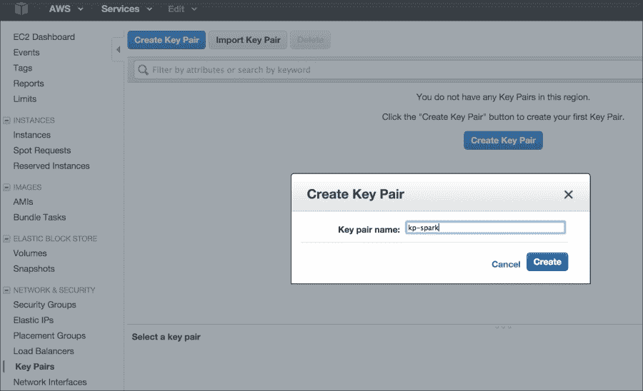

1.  下载私钥文件并将其复制到`/home/hduser/keypairs`文件夹中。

1.  将密钥文件的权限设置为`600`。

1.  设置环境变量以反映访问密钥 ID 和秘密访问密钥（请用您的实际值替换示例值）：

    ```py
    $ echo "export AWS_ACCESS_KEY_ID=\"AKIAOD7M2LOWATFXFKQ\"" >> /home/hduser/.bashrc
    $ echo "export AWS_SECRET_ACCESS_KEY=\"+Xr4UroVYJxiLiY8DLT4DLT4D4sxc3ijZGMx1D3pfZ2q\"" >> /home/hduser/.bashrc
    $ echo "export PATH=$PATH:/opt/infoobjects/spark/ec2" >> /home/hduser/.bashrc

    ```

## 如何操作...

1.  Spark 附带启动 Amazon EC2 上的 Spark 集群的脚本。让我们使用以下命令启动集群：

    ```py
    $ cd /home/hduser
    $ spark-ec2 -k <key-pair> -i <key-file> -s <num-slaves> launch <cluster-name>

    ```

1.  使用示例值启动集群：

    ```py
    $ spark-ec2 -k kp-spark -i /home/hduser/keypairs/kp-spark.pem --hadoop-major-version 2  -s 3 launch spark-cluster

    ```

    ### 注意

    +   `<key-pair>`：这是在 AWS 中创建的 EC2 密钥对名称

    +   `<key-file>`：这是您下载的私钥文件

    +   `<num-slaves>`：这是要启动的从节点数量

    +   `<cluster-name>`：这是集群的名称

1.  有时，默认的可用区域不可用；在这种情况下，通过指定您请求的具体可用区域来重试发送请求：

    ```py
    $ spark-ec2 -k kp-spark -i /home/hduser/keypairs/kp-spark.pem -z us-east-1b --hadoop-major-version 2  -s 3 launch spark-cluster

    ```

1.  如果你的应用程序需要在实例关闭后保留数据，请将其附加到 EBS 卷上（例如，10 GB 空间）：

    ```py
    $ spark-ec2 -k kp-spark -i /home/hduser/keypairs/kp-spark.pem --hadoop-major-version 2 -ebs-vol-size 10 -s 3 launch spark-cluster

    ```

1.  如果你使用 Amazon spot 实例，以下是操作方法：

    ```py
    $ spark-ec2 -k kp-spark -i /home/hduser/keypairs/kp-spark.pem -spot-price=0.15 --hadoop-major-version 2  -s 3 launch spark-cluster

    ```

    ### 注意

    Spot 实例允许你为 Amazon EC2 计算能力设定自己的价格。你只需对额外的 Amazon EC2 实例进行投标，并在你的投标超过当前 spot 价格时运行它们，该价格根据供需实时变化（来源：[amazon.com](http://amazon.com)）。

1.  一切启动后，通过查看最后打印的 web UI URL 来检查集群的状态。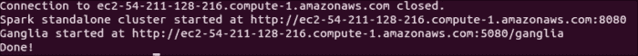

1.  检查集群状态：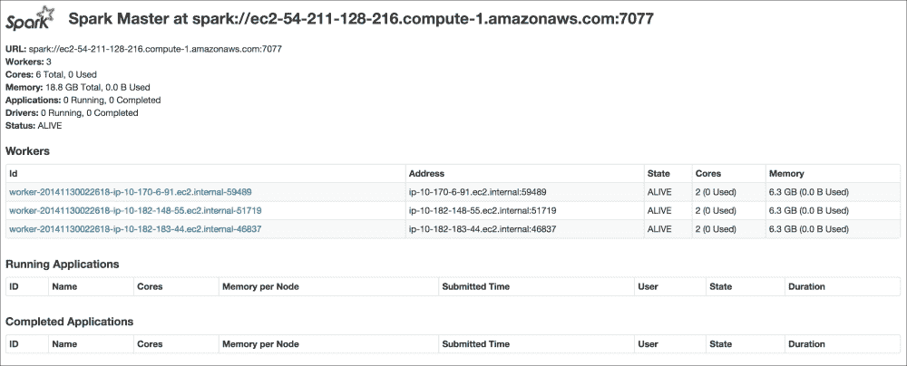

1.  现在，要访问 EC2 上的 Spark 集群，让我们使用**安全外壳协议**（**SSH**）连接到主节点：

    ```py
    $ spark-ec2 -k kp-spark -i /home/hduser/kp/kp-spark.pem  login spark-cluster

    ```

    你应该得到类似以下的内容：

    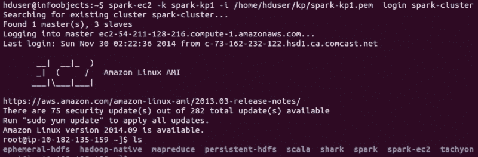

1.  检查主节点上的目录并查看它们的功能：

    | 目录 | 描述 |
    | --- | --- |
    | `ephemeral-hdfs` | 这是数据为临时性的 Hadoop 实例，当你停止或重启机器时，数据将被删除。 |
    | `persistent-hdfs` | 每个节点都有非常小的持久存储空间（大约 3 GB）。如果你使用此实例，数据将保留在该空间中。 |
    | `hadoop-native` | 这些是支持 Hadoop 的本地库，例如 snappy 压缩库。 |
    | `Scala` | 这是 Scala 安装。 |
    | `shark` | 这是 Shark 安装（Shark 不再受支持，已被 Spark SQL 取代）。 |
    | `spark` | 这是 Spark 安装 |
    | `spark-ec2` | 这些是支持此集群部署的文件。 |
    | `tachyon` | 这是 Tachyon 安装 |

1.  在临时实例中检查 HDFS 版本：

    ```py
    $ ephemeral-hdfs/bin/hadoop version
    Hadoop 2.0.0-chd4.2.0

    ```

1.  使用以下命令检查持久实例中的 HDFS 版本：

    ```py
    $ persistent-hdfs/bin/hadoop version
    Hadoop 2.0.0-chd4.2.0

    ```

1.  在日志中更改配置级别：

    ```py
    $ cd spark/conf

    ```

1.  默认日志级别信息过于冗长，因此让我们将其更改为错误：

    1.  通过重命名模板创建`log4.properties`文件：

        ```py
        $ mv log4j.properties.template log4j.properties

        ```

    1.  在 vi 或你喜欢的编辑器中打开`log4j.properties`：

        ```py
        $ vi log4j.properties

        ```

    1.  将第二行从`| log4j.rootCategory=INFO, console`更改为`| log4j.rootCategory=ERROR, console`。

1.  在更改后，将配置复制到所有从节点：

    ```py
    $ spark-ec2/copydir spark/conf

    ```

    你应该得到类似以下的内容：

    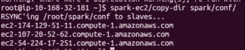

1.  销毁 Spark 集群：

    ```py
    $ spark-ec2 destroy spark-cluster

    ```

### 参见

+   [`aws.amazon.com/ec2`](http://aws.amazon.com/ec2)

# 以独立模式在集群上部署

在分布式环境中，需要管理计算资源，以确保资源利用效率高，每个作业都有公平的机会运行。Spark 自带一个方便的集群管理器，称为**独立模式**。Spark 还支持与 YARN 和 Mesos 集群管理器一起工作。

应该选择的集群管理器通常是由遗留问题以及是否其他框架，例如 MapReduce，是否共享相同的计算资源池所驱动的。如果你的集群有正在运行的遗留 MapReduce 作业，并且它们都不能转换为 Spark 作业，那么使用 YARN 作为集群管理器是一个好主意。Mesos 正在成为一个数据中心操作系统，可以方便地在框架之间管理作业，并且与 Spark 非常兼容。

如果 Spark 框架是集群中唯一的框架，那么独立模式就足够了。随着 Spark 作为技术的演变，你将看到越来越多的 Spark 作为独立框架用于满足所有大数据计算需求的使用案例。例如，一些作业可能目前正在使用 Apache Mahout，因为 MLlib 没有特定于机器学习的库，而作业需要这个库。一旦 MLlib 获得这个库，这个特定的作业就可以迁移到 Spark。

## 准备工作

让我们以一个由六个节点组成的集群为例：一个主节点和五个从节点（用你集群中的实际节点名称替换它们）：

```py
Master
m1.zettabytes.com
Slaves
s1.zettabytes.com
s2.zettabytes.com
s3.zettabytes.com
s4.zettabytes.com
s5.zettabytes.com

```

## 如何操作...

1.  由于 Spark 的独立模式是默认的，你只需要在主节点和从节点上都安装 Spark 二进制文件。将`/opt/infoobjects/spark/sbin`添加到每个节点的路径中：

    ```py
    $ echo "export PATH=$PATH:/opt/infoobjects/spark/sbin" >> /home/hduser/.bashrc

    ```

1.  启动独立的主服务器（首先 SSH 到主节点）：

    ```py
    hduser@m1.zettabytes.com~] start-master.sh

    ```

    主节点默认在 7077 端口启动，从节点使用此端口连接到它。它还有一个位于 8088 端口的 Web UI。

1.  请 SSH 到主节点并启动从节点：

    ```py
    hduser@s1.zettabytes.com~] spark-class org.apache.spark.deploy.worker.Worker spark://m1.zettabytes.com:7077

    ```

    | 参数（对于细粒度配置，以下参数对主节点和从节点都适用） | 含义 |
    | --- | --- |
    | `-i <ipaddress>,-ip <ipaddress>` | 监听的 IP 地址/DNS 服务 |
    | `-p <port>, --port <port>` | 监听的端口 |
    | `--webui-port <port>` | Web UI 的端口（默认情况下，主节点为 8080，工作节点为 8081） |
    | `-c <cores>,--cores <cores>` | 在一台机器上 Spark 应用程序可以使用的总 CPU 核心（仅限工作节点） |
    | `-m <memory>,--memory <memory>` | 在一台机器上 Spark 应用程序可以使用的总 RAM（仅限工作节点） |
    | `-d <dir>,--work-dir <dir>` | 用于临时空间和作业输出日志的目录 |

1.  而不是在每个节点上手动启动主从守护进程，也可以使用集群启动脚本完成。

1.  首先，在主节点上创建`conf/slaves`文件，并为每个从机主机名添加一行（以五个从节点为例，用你集群中从节点的 DNS 替换）：

    ```py
    hduser@m1.zettabytes.com~] echo "s1.zettabytes.com" >> conf/slaves
    hduser@m1.zettabytes.com~] echo "s2.zettabytes.com" >> conf/slaves
    hduser@m1.zettabytes.com~] echo "s3.zettabytes.com" >> conf/slaves
    hduser@m1.zettabytes.com~] echo "s4.zettabytes.com" >> conf/slaves
    hduser@m1.zettabytes.com~] echo "s5.zettabytes.com" >> conf/slaves

    ```

    一旦设置了从机，你可以调用以下脚本以启动/停止集群：

    | 脚本名称 | 目的 |
    | --- | --- |
    | `start-master.sh` | 在主机机器上启动一个主实例 |
    | `start-slaves.sh` | 在从机文件中的每个节点上启动一个从实例 |
    | `start-all.sh` | 启动主节点和从节点 |
    | `stop-master.sh` | 停止主机机器上的主实例 |
    | `stop-slaves.sh` | 停止从机文件中所有节点的从实例 |
    | `stop-all.sh` | 停止主节点和从属节点 |

1.  通过 Scala 代码将应用程序连接到集群：

    ```py
    val sparkContext = new SparkContext(new SparkConf().setMaster("spark://m1.zettabytes.com:7077")

    ```

1.  通过 Spark shell 连接到集群：

    ```py
    $ spark-shell --master spark://master:7077

    ```

## 它是如何工作的...

在独立模式下，Spark 遵循主从架构，非常类似于 Hadoop、MapReduce 和 YARN。计算主守护进程被称为**Spark master**，运行在一个主节点上。Spark master 可以使用 ZooKeeper 实现高可用性。如果需要，您还可以动态添加更多备用主节点。

计算从属守护进程被称为**worker**，位于每个从属节点上。worker 守护进程执行以下操作：

+   向 Spark master 报告从属节点上的计算资源可用性，例如核心数、内存和其他资源

+   当 Spark master 请求时启动执行器

+   如果执行器死亡，则重启执行器

每个从属机器上最多有一个执行器对应一个应用程序。

Spark master 和工作节点都非常轻量级。通常，500 MB 到 1 GB 的内存分配就足够了。此值可以通过设置`conf/spark-env.sh`中的`SPARK_DAEMON_MEMORY`参数来设置。例如，以下配置将设置主节点和工作节点守护进程的内存为 1 GB。在运行之前，请确保您有`sudo`作为超级用户权限：

```py
$ echo "export SPARK_DAEMON_MEMORY=1g" >> /opt/infoobjects/spark/conf/spark-env.sh

```

默认情况下，每个从属节点上运行一个工作实例。有时，您可能有一些比其他机器更强大的机器。在这种情况下，您可以通过以下配置在该机器上启动多个工作实例（仅在这些机器上）：

```py
$ echo "export SPARK_WORKER_INSTANCES=2" >> /opt/infoobjects/spark/conf/spark-env.sh

```

Spark 工作节点默认情况下使用从属机器上的所有核心为其执行器。如果您想限制工作节点可以使用的核心数，您可以通过以下配置将其设置为该数值（例如，12）：

```py
$ echo "export SPARK_WORKER_CORES=12" >> /opt/infoobjects/spark/conf/spark-env.sh

```

Spark 工作节点默认情况下使用所有可用的 RAM（执行器为 1 GB）。请注意，您不能分配每个特定执行器将使用的内存量（您可以从驱动器配置中控制这一点）。要将所有执行器组合使用的总内存（例如，24 GB）设置为另一个值，请执行以下设置：

```py
$ echo "export SPARK_WORKER_MEMORY=24g" >> /opt/infoobjects/spark/conf/spark-env.sh

```

您可以在驱动器级别进行一些设置：

+   要指定集群中给定应用程序可使用的最大 CPU 核心数，您可以在 Spark 提交或 Spark shell 中设置`spark.cores.max`配置，如下所示：

    ```py
    $ spark-submit --conf spark.cores.max=12

    ```

+   要指定每个执行器应分配的内存量（最低推荐为 8 GB），您可以在 Spark 提交或 Spark shell 中设置`spark.executor.memory`配置，如下所示：

    ```py
    $ spark-submit --conf spark.executor.memory=8g

    ```

以下图显示了 Spark 集群的高级架构：


## 参见

+   [`spark.apache.org/docs/latest/spark-standalone.html`](http://spark.apache.org/docs/latest/spark-standalone.html) 以查找更多配置选项

# 在 Mesos 集群上部署

Mesos 正逐渐成为数据中心操作系统，用于管理数据中心内的所有计算资源。Mesos 可以在运行 Linux 操作系统的任何计算机上运行。Mesos 是使用与 Linux 内核相同的原理构建的。让我们看看如何安装 Mesos。

## 如何做…

Mesosphere 提供了 Mesos 的二进制发行版。可以通过执行以下步骤从 Mesosphere 仓库安装 Mesos 的最新发行版包：

1.  在 Ubuntu OS 的 trusty 版本上执行 Mesos：

    ```py
    $ sudo apt-key adv --keyserver keyserver.ubuntu.com --recv E56151BF DISTRO=$(lsb_release -is | tr '[:upper:]' '[:lower:]') CODENAME=$(lsb_release -cs)
    $ sudo vi /etc/apt/sources.list.d/mesosphere.list

    deb http://repos.mesosphere.io/Ubuntu trusty main

    ```

1.  更新仓库：

    ```py
    $ sudo apt-get -y update

    ```

1.  安装 Mesos：

    ```py
    $ sudo apt-get -y install mesos

    ```

1.  要将 Spark 连接到 Mesos 以集成 Spark 与 Mesos，使 Spark 二进制文件对 Mesos 可用，并配置 Spark 驱动程序以连接到 Mesos。

1.  使用第一个配方中的 Spark 二进制文件并将其上传到 HDFS：

    ```py
    $ 
    hdfs dfs
     -put spark-1.4.0-bin-hadoop2.4.tgz spark-1.4.0-bin-hadoop2.4.tgz

    ```

1.  单个主机的 Mesos 主 URL 是`mesos://host:5050`，而对于由 ZooKeeper 管理的 Mesos 集群，它是`mesos://zk://host:2181`。

1.  在`spark-env.sh`中设置以下变量：

    ```py
    $ sudo vi spark-env.sh
    export MESOS_NATIVE_LIBRARY=/usr/local/lib/libmesos.so
    export SPARK_EXECUTOR_URI= hdfs://localhost:9000/user/hduser/spark-1.4.0-bin-hadoop2.4.tgz

    ```

1.  从 Scala 程序运行：

    ```py
    val conf = new SparkConf().setMaster("mesos://host:5050")
    val sparkContext = new SparkContext(conf)

    ```

1.  从 Spark shell 运行：

    ```py
    $ spark-shell --master mesos://host:5050

    ```

    ### 注意

    Mesos 有两种运行模式：

    **细粒度**：在细粒度（默认）模式下，每个 Spark 任务都作为一个单独的 Mesos 任务运行

    **粗粒度**：此模式将在每台 Mesos 机器上仅启动一个长时间运行的 Spark 任务

1.  要在粗粒度模式下运行，设置`spark.mesos.coarse`属性：

    ```py
    conf.set("spark.mesos.coarse","true")

    ```

# 在具有 YARN 的集群上部署

**另一个资源协调器**（**YARN**）是运行在 HDFS（Hadoop 的存储层）之上的 Hadoop 计算框架。

YARN 遵循主从架构。主守护进程称为`ResourceManager`，从守护进程称为`NodeManager`。除了这个应用程序外，生命周期管理由`ApplicationMaster`完成，它可以在任何从节点上产生，并且在整个应用程序的生命周期内保持活跃。

当 Spark 在 YARN 上运行时，`ResourceManager`扮演 Spark 主的角色，而`NodeManagers`作为执行节点工作。

当使用 YARN 运行 Spark 时，每个 Spark 执行器都作为 YARN 容器运行。

## 准备工作

在 YARN 上运行 Spark 需要一个具有 YARN 支持的 Spark 二进制发行版。在两个 Spark 安装配方中，我们都已经注意到了这一点。

## 如何做…

1.  在 YARN 上运行 Spark 的第一步是设置配置：

    ```py
    HADOOP_CONF_DIR: to write to HDFS
    YARN_CONF_DIR: to connect to YARN ResourceManager
    $ cd /opt/infoobjects/spark/conf (or /etc/spark)
    $ sudo vi spark-env.sh
    export HADOOP_CONF_DIR=/opt/infoobjects/hadoop/etc/Hadoop
    export YARN_CONF_DIR=/opt/infoobjects/hadoop/etc/hadoop

    ```

    你可以在以下屏幕截图中看到这一点：

    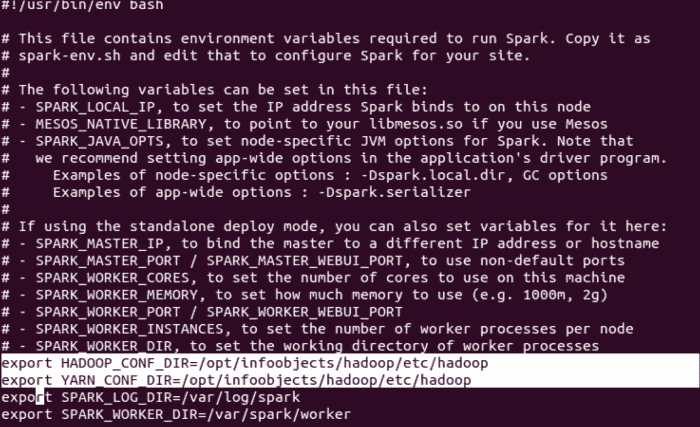

1.  以下命令以`yarn-client`模式启动 YARN Spark：

    ```py
    $ spark-submit --class path.to.your.Class --master yarn-client [options] <app jar> [app options]

    ```

    这里有一个例子：

    ```py
    $ spark-submit --class com.infoobjects.TwitterFireHose --master yarn-client --num-executors 3 --driver-memory 4g --executor-memory 2g --executor-cores 1 target/sparkio.jar 10

    ```

1.  以下命令以`yarn-client`模式启动 Spark shell：

    ```py
    $ spark-shell --master yarn-client

    ```

1.  以`yarn-cluster`模式启动的命令如下：

    ```py
    $ spark-submit --class path.to.your.Class --master yarn-cluster [options] <app jar> [app options]

    ```

    这里有一个例子：

    ```py
    $ spark-submit --class com.infoobjects.TwitterFireHose --master yarn-cluster --num-executors 3 --driver-memory 4g --executor-memory 2g --executor-cores 1 targe
    t/sparkio.jar 10

    ```

## 它是如何工作的…

YARN 上的 Spark 应用程序以两种模式运行：

+   `yarn-client`：Spark Driver 在 YARN 集群外的客户端进程中运行，而`ApplicationMaster`仅用于从 ResourceManager 协商资源

+   `yarn-cluster`：Spark Driver 在从从节点上的`NodeManager`产生的`ApplicationMaster`中运行

`yarn-cluster`模式推荐用于生产部署，而`yarn-client`模式适合开发调试，当你希望看到即时输出时。在两种模式下都不需要指定 Spark master，因为它从 Hadoop 配置中选取，master 参数是`yarn-client`或`yarn-cluster`。

以下图显示了在客户端模式下使用 YARN 运行 Spark 的方式：

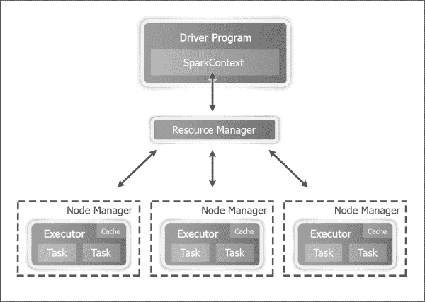

以下图显示了在集群模式下使用 YARN 运行 Spark 的方式：

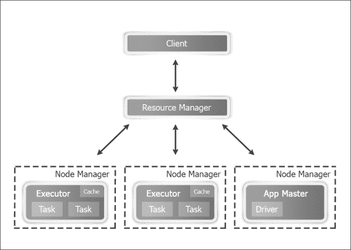

在 YARN 模式下，可以设置以下配置参数：

+   `--num-executors`: 配置将分配多少个执行器

+   `--executor-memory`: 每个执行器的 RAM

+   `--executor-cores`: 每个执行器的 CPU 核心数

# 作为堆外存储层使用 Tachyon

Spark RDDs 是存储数据集的一种好方法，可以在内存中存储多个相同数据的不同应用中的副本。Tachyon 解决了 Spark RDD 管理中的一些挑战。其中一些包括：

+   RDD 仅在 Spark 应用程序的运行期间存在

+   相同的过程执行计算和 RDD 内存存储；因此，如果进程崩溃，内存存储也会消失

+   即使不同的作业针对相同的基础数据，它们也无法共享 RDD，例如，导致 HDFS 块的：

    +   磁盘写入速度慢

    +   内存中数据的重复，更大的内存占用

+   如果一个应用程序的输出需要与其他应用程序共享，由于磁盘上的复制，速度会变慢

Tachyon 提供堆外内存层来解决这些问题。这个层因为是堆外，所以对进程崩溃免疫，也不受垃圾回收的影响。这也允许 RDD 在应用程序之间共享，并且可以超出特定作业或会话的寿命；本质上，数据的一个副本驻留在内存中，如下所示：

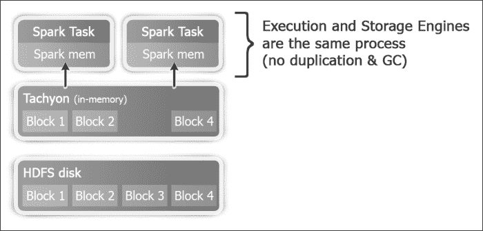

## 如何操作...

1.  让我们下载并编译 Tachyon（Tachyon 默认配置为 Hadoop 1.0.4，因此需要从源代码编译以获得正确的 Hadoop 版本）。将版本替换为当前版本。本书撰写时的当前版本是 0.6.4：

    ```py
    $ wget https://github.com/amplab/tachyon/archive/v<version>.zip

    ```

1.  解压源代码：

    ```py
    $ unzip  v-<version>.zip

    ```

1.  为了方便，从`tachyon`源文件夹名称中移除版本号：

    ```py
    $ mv tachyon-<version> tachyon

    ```

1.  将目录更改为`tachyon`文件夹：

    ```py
    $ cd tachyon
    $ mvn -Dhadoop.version=2.4.0 clean package -DskipTests=true
    $ cd conf
    $ sudo mkdir -p /var/tachyon/journal
    $ sudo chown -R hduser:hduser /var/tachyon/journal
    $ sudo mkdir -p /var/tachyon/ramdisk
    $ sudo chown -R hduser:hduser /var/tachyon/ramdisk

    $ mv tachyon-env.sh.template tachyon-env.sh
    $ vi tachyon-env.sh

    ```

1.  取消注释以下行：

    ```py
    export TACHYON_UNDERFS_ADDRESS=$TACHYON_HOME/underfs

    ```

1.  取消注释以下行：

    ```py
    export TACHYON_UNDERFS_ADDRESS=hdfs://localhost:9000

    ```

1.  修改以下属性：

    ```py
    -Dtachyon.master.journal.folder=/var/tachyon/journal/

    export TACHYON_RAM_FOLDER=/var/tachyon/ramdisk

    $ sudo mkdir -p /var/log/tachyon
    $ sudo chown -R hduser:hduser /var/log/tachyon
    $ vi log4j.properties

    ```

1.  将`${tachyon.home}`替换为`/var/log/tachyon`。

1.  在`conf`目录中创建一个新的`core-site.xml`文件：

    ```py
    $ sudo vi core-site.xml
    <configuration>
    <property>
     <name>fs.tachyon.impl</name>
     <value>tachyon.hadoop.TFS</value>
     </property>
    </configuration>
    $ cd ~
    $ sudo mv tachyon /opt/infoobjects/
    $ sudo chown -R root:root /opt/infoobjects/tachyon
    $ sudo chmod -R 755 /opt/infoobjects/tachyon

    ```

1.  将`<tachyon home>/bin`添加到路径中：

    ```py
    $ echo "export PATH=$PATH:/opt/infoobjects/tachyon/bin" >> /home/hduser/.bashrc

    ```

1.  重新启动 shell 并格式化 Tachyon：

    ```py
    $ tachyon format
    $ tachyon-start.sh local //you need to enter root password as RamFS needs to be formatted

    ```

    Tachyon 的 Web 界面是`http://hostname:19999`:

    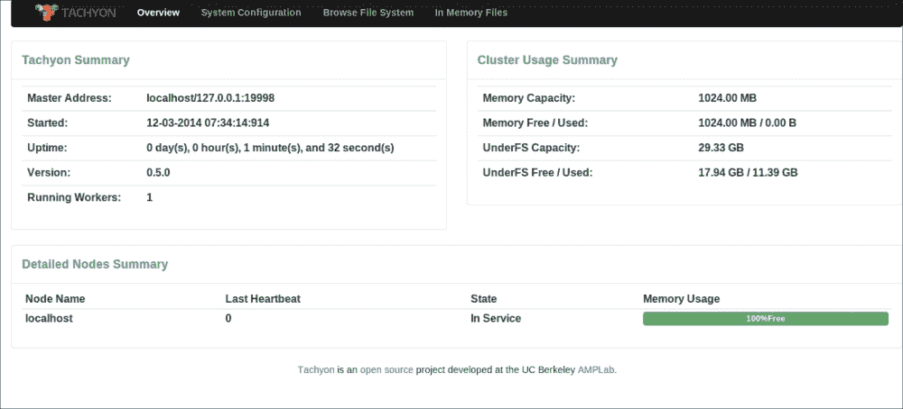

1.  运行示例程序以查看 Tachyon 是否运行正常：

    ```py
    $ tachyon runTest Basic CACHE_THROUGH

    ```

    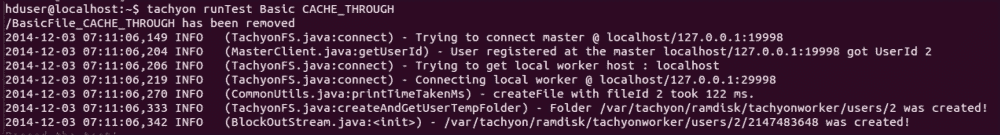

1.  你可以通过运行以下命令随时停止 Tachyon：

    ```py
    $ tachyon-stop.sh

    ```

1.  在 Tachyon 上运行 Spark:

    ```py
    $ spark-shell
    scala> val words = sc.textFile("tachyon://localhost:19998/words")
    scala> words.count
    scala> words.saveAsTextFile("tachyon://localhost:19998/w2")
    scala> val person = sc.textFile("hdfs://localhost:9000/user/hduser/person")
    scala> import org.apache.spark.api.java._
    scala> person.persist(StorageLevels.OFF_HEAP)

    ```

## 参见

+   [了解 Tachyon 的起源](http://www.cs.berkeley.edu/~haoyuan/papers/2013_ladis_tachyon.pdf)

+   [Tachyon Nexus 网站](http://www.tachyonnexus.com)
