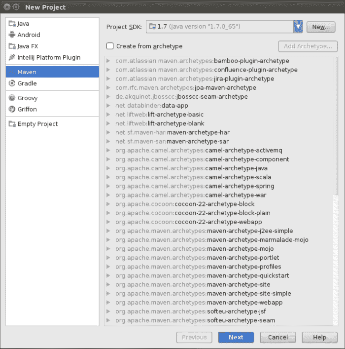

# 第二章：使用 Spark 开发应用程序

在本章中，我们将介绍：

+   探索 Spark 命令行

+   在 Eclipse 中使用 Maven 开发 Spark 应用程序

+   在 Eclipse 中使用 SBT 开发 Spark 应用程序

+   在 Intellij IDEA 中使用 Maven 开发 Spark 应用程序

+   在 Intellij IDEA 中使用 SBT 开发 Spark 应用程序

# 简介

要创建生产质量的 Spark 作业/应用程序，使用各种**集成开发环境**（**IDEs**）和构建工具是有用的。本章将介绍各种 IDE 和构建工具。

# 探索 Spark 命令行

Spark 随附了一个 REPL 命令行界面，它是 Scala 命令行的一个包装器。虽然 Spark 命令行看起来像是简单的命令行，但实际上，许多复杂的查询也可以用它来执行。本章将探讨不同的开发环境，在这些环境中可以开发 Spark 应用程序。

## 如何做到这一点...

使用 Spark 命令行，Hadoop MapReduce 的词频统计变得非常简单。在这个菜谱中，我们将创建一个简单的单行文本文件，将其上传到**Hadoop 分布式文件系统**（**HDFS**），并使用 Spark 来统计单词的出现次数。让我们看看如何：

1.  使用以下命令创建 `words` 目录：

    ```py
    $ mkdir words

    ```

1.  进入 `words` 目录：

    ```py
    $ cd words

    ```

1.  创建一个名为 `sh.txt` 的文本文件，并在其中输入 `"to be or not to be"`：

    ```py
    $ echo "to be or not to be" > sh.txt

    ```

1.  启动 Spark 命令行：

    ```py
    $ spark-shell

    ```

1.  将 `words` 目录作为 RDD 加载：

    ```py
    Scala> val words = sc.textFile("hdfs://localhost:9000/user/hduser/words")

    ```

1.  计算行数（结果：1）：

    ```py
    Scala> words.count

    ```

1.  将行（或行）分割成多个单词：

    ```py
    Scala> val wordsFlatMap = words.flatMap(_.split("\\W+"))

    ```

1.  将 `word` 转换为 (word,1)——即输出每个 `word` 出现作为键的值 `1`：

    ```py
    Scala> val wordsMap = wordsFlatMap.map( w => (w,1))

    ```

1.  使用 `reduceByKey` 方法将每个单词的出现次数作为键（该函数一次处理两个连续的值，分别由 `a` 和 `b` 表示）：

    ```py
    Scala> val wordCount = wordsMap.reduceByKey( (a,b) => (a+b))

    ```

1.  对结果进行排序：

    ```py
    Scala> val wordCountSorted = wordCount.sortByKey(true)

    ```

1.  打印 RDD：

    ```py
    Scala> wordCountSorted.collect.foreach(println)

    ```

1.  将所有前面的操作一步完成如下：

    ```py
    Scala> sc.textFile("hdfs://localhost:9000/user/hduser/words"). flatMap(_.split("\\W+")).map( w => (w,1)). reduceByKey( (a,b) => (a+b)).sortByKey(true).collect.foreach(println)

    ```

这将给我们以下输出：

```py
(or,1)
(to,2)
(not,1)
(be,2)

```

现在你已经了解了基础知识，加载 HDFS 中的大量文本——例如，故事——并看看魔法：

如果你有的文件是压缩格式，你可以在 HDFS 中直接加载它们。Hadoop 和 Spark 都有解压缩编解码器，它们根据文件扩展名使用它们。

当 `wordsFlatMap` 转换为 `wordsMap` RDD 时，有一个隐式转换。这会将 RDD 转换为 `PairRDD`。这是一个隐式转换，不需要做任何事情。如果你在 Scala 代码中这样做，请添加以下 `import` 语句：

```py
import org.apache.spark.SparkContext._
```

# 在 Eclipse 中使用 Maven 开发 Spark 应用程序

Maven 作为构建工具，多年来已经成为事实上的标准。如果我们深入挖掘 Maven 带来的承诺，这并不令人惊讶。Maven 有两个主要特性，它们是：

+   **约定优于配置**：在 Maven 之前的构建工具允许开发者自由决定源文件、测试文件、编译文件等存放的位置。Maven 剥夺了这种自由。有了这种自由，所有关于位置上的困惑也消失了。在 Maven 中，每个项目都有一个特定的目录结构。以下表格展示了其中一些最常见的位置：

    | `/src/main/scala` | Scala 源代码 |
    | --- | --- |
    | `/src/main/java` | Java 源代码 |
    | `/src/main/resources` | 源代码使用的资源，例如配置文件 |
    | `/src/test/scala` | Scala 测试代码 |
    | `/src/test/java` | Java 测试代码 |
    | `/src/test/resources` | 测试代码使用的资源，例如配置文件 |

+   **声明式依赖管理**：在 Maven 中，每个库都通过以下三个坐标进行定义：

    | `groupId` | 类似于 Java/Scala 中包的逻辑分组方式，必须至少包含你拥有的域名，例如 `org.apache.spark` |
    | --- | --- |
    | `artifactId` | 项目和 JAR 的名称 |
    | `version` | 标准版本号 |

在 `pom.xml`（一个配置文件，它告诉 Maven 关于项目的所有信息）中，依赖项以以下三种坐标的形式声明。无需在互联网上搜索并下载、解压和复制库。你所需要做的就是提供所需依赖 JAR 的三种坐标，Maven 会为你完成剩余的工作。以下是一个使用 JUnit 依赖项的示例：

```py
<dependency>
  <groupId>junit</groupId>
  <artifactId>junit</artifactId>
  <version>4.12</version>
</dependency>
```

这使得依赖项管理，包括传递依赖项，变得非常简单。在 Maven 之后出现的构建工具，如 SBT 和 Gradle，也遵循这两条规则，并在其他方面提供增强。

## 准备工作

从本食谱开始，本章假设你已经安装了 Eclipse。请访问 [`www.eclipse.org`](http://www.eclipse.org) 获取详细信息。

## 如何操作...

让我们看看如何安装 Eclipse 的 Maven 插件：

1.  打开 Eclipse，导航到 **帮助** | **安装新软件**。

1.  点击 **操作** 下拉菜单。

1.  选择 <eclipse version> 更新站点。

1.  点击 **协作工具**。

1.  检查 Maven 与 Eclipse 的集成，如下截图所示：

1.  点击 **下一步**，然后点击 **完成**。

    将会有提示要求重启 Eclipse，Maven 将在重启后安装。

现在，让我们看看如何安装 Eclipse 的 Scala 插件：

1.  打开 Eclipse，导航到 **帮助** | **安装新软件**。

1.  点击 **操作** 下拉菜单。

1.  选择 <eclipse version> 更新站点。

1.  输入 `http://download.scala-ide.org/sdk/helium/e38/scala210/stable/site`.

1.  按 *Enter*。

1.  选择 **Scala IDE for Eclipse**：

1.  点击 **下一步**，然后点击 **完成**。你将提示重启 Eclipse，Scala 将在重启后安装。

1.  导航到 **窗口** | **打开透视图** | **Scala**。

现在 Eclipse 已经准备好进行 Scala 开发了！

# 使用 SBT 在 Eclipse 中开发 Spark 应用程序

**简单构建工具**（**SBT**）是一个专门为 Scala 开发制作的构建工具。SBT 遵循基于 Maven 的命名约定和声明式依赖管理。

SBT 相比 Maven 提供以下增强功能：

+   依赖项以键值对的形式存在于 `build.sbt` 文件中，而不是 Maven 中的 `pom.xml` 文件。

+   它提供了一个使执行构建操作变得非常方便的壳。

+   对于没有依赖项的简单项目，甚至不需要 `build.sbt` 文件

在 `build.sbt` 中，第一行是项目定义：

```py
lazy val root = (project in file("."))
```

每个项目都有一个不可变的键值对映射。这个映射可以通过 SBT 中的设置进行更改，如下所示：

```py
lazy val root = (project in file("."))
  settings(
    name := "wordcount"
  )
```

任何设置的改变都会导致一个新的映射，因为这是一个不可变的映射。

## 如何操作...

这是添加 `sbteclipse` 插件的方法：

1.  将以下内容添加到全局插件文件中：

    ```py
    $ mkdir /home/hduser/.sbt/0.13/plugins
    $ echo addSbtPlugin("com.typesafe.sbteclipse" % "sbteclipse-plugin" % "2.5.0" )  > /home/hduser/.sbt/0.12/plugins/plugin.sbt

    ```

    或者，您还可以添加以下内容到您的项目中：

    ```py
    $ cd <project-home>
    $ echo addSbtPlugin("com.typesafe.sbteclipse" % "sbteclipse-plugin" % "2.5.0" )  > plugin.sbt

    ```

1.  在没有任何参数的情况下启动 `sbt` 命令行：

    ```py
    $sbt

    ```

1.  输入 `eclipse` 并将其转换为 Eclipse 兼容的项目：

    ```py
    $ eclipse

    ```

1.  现在，您可以导航到 **文件** | **导入** | **将现有项目导入工作区** 来将项目加载到 Eclipse 中。

现在，您可以使用 Eclipse 和 SBT 在 Scala 中开发 Spark 应用程序。

# 使用 Maven 在 IntelliJ IDEA 中开发 Spark 应用程序

IntelliJ IDEA 内置了对 Maven 的支持。我们将在这个菜谱中看到如何创建一个新的 Maven 项目。

## 如何操作...

执行以下步骤以在 IntelliJ IDEA 中使用 Maven 开发 Spark 应用程序：

1.  在新项目窗口中选择 **Maven** 并点击 **下一步**：

1.  输入项目的三个维度：

1.  输入项目的名称和位置：

1.  点击 **完成**，Maven 项目就准备好了。

# 使用 SBT 在 IntelliJ IDEA 中开发 Spark 应用程序

在 Eclipse 变得著名之前，IntelliJ IDEA 被认为是 IDE 中的佼佼者。IDEA 仍然保持着过去的辉煌，许多开发者都喜欢 IDEA。IDEA 还有一个社区版，它是免费的。IDEA 为 SBT 和 Scala 开发提供了原生支持，使其成为 SBT 和 Scala 开发的理想选择。

## 如何操作...

执行以下步骤以在 IntelliJ IDEA 中使用 SBT 开发 Spark 应用程序：

1.  添加 `sbt-idea` 插件。

1.  将以下内容添加到全局插件文件中：

    ```py
    $mkdir /home/hduser/.sbt/0.13/plugins
    $echo addSbtPlugin("com.github.mpeltone" % "sbt-idea" % "1.6.0" )  > /home/hduser/.sbt/0.12/plugins/plugin.sbt

    ```

    或者，您也可以添加到您的项目中：

    ```py
    $cd <project-home>
    $ echo addSbtPlugin("com.github.mpeltone" % "sbt-idea" % "1.6.0" ) > plugin.sbt

    ```

IDEA 与 SBT 兼容并准备好使用。

现在，您可以使用 Scala 开发 Spark 代码，并使用 SBT 进行构建。
