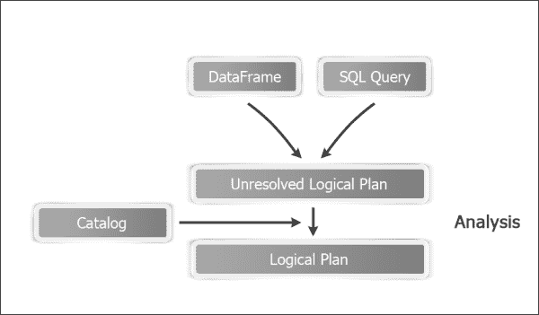

# 第四章 Spark SQL

Spark SQL 是 Spark 模块，用于处理结构化数据。本章分为以下食谱：

+   理解 Catalyst 优化器

+   创建 HiveContext

+   使用 case 类推断模式

+   以编程方式指定模式

+   使用 Parquet 格式加载数据和保存数据

+   使用 JSON 格式加载数据和保存数据

+   从关系数据库加载数据和保存数据

+   从任意源加载数据和保存数据

# 简介

Spark 可以从各种数据源处理数据，例如 HDFS、Cassandra、HBase 和关系数据库，包括 HDFS。大数据框架（与关系数据库系统不同）在写入时不会强制执行模式。HDFS 是写入阶段欢迎任何任意文件的完美例子。然而，读取数据是另一回事。即使是完全非结构化的数据，也需要提供一些结构，以便从中获得意义。有了这种结构化数据，当涉及到分析时，SQL 就非常方便了。

Spark SQL 是 Spark 生态系统中的一个相对较新的组件，首次在 Spark 1.0 版本中引入。它包含一个名为 Shark 的项目，该项目的目的是让 Hive 在 Spark 上运行。

Hive 本质上是一种关系抽象，它将 SQL 查询转换为 MapReduce 作业。


Shark 用 Spark 替换了 MapReduce 部分，同时保留了大部分代码库。


初始时，它运行良好，但很快 Spark 的开发者遇到了瓶颈，无法进一步优化它。最终，他们决定从头开始编写 SQL 引擎，这催生了 Spark SQL。


Spark SQL 解决了所有性能挑战，但必须与 Hive 保持兼容，因此，在`SQLContext`之上创建了一个新的包装上下文`HiveContext`。

Spark SQL 支持使用标准 SQL 查询和 HiveQL（Hive 使用的类似 SQL 的查询语言）访问数据。在本章中，我们将探讨 Spark SQL 的不同特性。它支持 HiveQL 和 SQL 92 的子集。它可以在现有的 Hive 部署旁边或替换它们运行 SQL/HiveQL 查询。

运行 SQL 只是创建 Spark SQL 的部分原因。一个很大的原因是它有助于更快地创建和运行 Spark 程序。它让开发者编写更少的代码，读取更少的数据，并让 Catalyst 优化器完成所有繁重的工作。

Spark SQL 使用一种名为**DataFrame**的编程抽象。它是有名列组织的数据的分布式集合。DataFrame 相当于数据库表，但提供了更细粒度的优化。DataFrame API 还确保 Spark 的性能在不同语言绑定之间保持一致。

让我们对比 DataFrame 和 RDD。RDD 是一个不透明的对象集合，对底层数据的格式一无所知。相比之下，DataFrame 与它们关联了模式。您也可以将 DataFrame 看作是添加了模式的 RDD。实际上，直到 Spark 1.2，有一个名为**SchemaRDD**的工件，现在已经演变成了 DataFrame。它们提供了比 SchemaRDDs 更丰富的功能。

这额外的模式信息使得进行许多优化成为可能，而这些优化在其他情况下是不可能的。

DataFrames 也可以透明地从各种数据源加载，例如 Hive 表、Parquet 文件、JSON 文件和外部数据库使用 JDBC。DataFrames 可以被看作是行对象的 RDD，使用户能够调用如 map 这样的过程式 Spark API。

DataFrame API 在 Scala、Java、Python 中可用，从 Spark 1.4 开始也支持 R。

用户可以使用**领域特定语言**（**DSL**）在 DataFrames 上执行关系操作。DataFrames 支持所有常见的关联操作，并且它们都接受在有限的 DSL 中的表达式对象，这使得 Spark 能够捕获表达式的结构。

我们将从 Spark SQL 的入口点开始，即 SQLContext。我们还将涵盖 HiveContext，它是 SQLContext 的包装器，用于支持 Hive 功能。请注意，HiveContext 经过了更多的实战检验，并提供了更丰富的功能，因此即使您不打算连接到 Hive，也强烈建议使用它。慢慢地，SQLContext 将达到与 HiveContext 相同的功能水平。

有两种方法可以将模式与 RDD 关联起来以创建 DataFrame。简单的方法是利用 Scala 的 case 类，我们将会首先介绍。Spark 使用 Java 反射从 case 类中推断模式。还有一种方法可以程序化地指定用于高级需求的模式，我们将在下一部分介绍。

Spark SQL 提供了一个简单的方法来加载和保存 Parquet 文件，这也会被涵盖。最后，我们将涵盖从 JSON 加载和保存数据。

# 理解 Catalyst 优化器

Spark SQL 的大部分功能都得益于 Catalyst 优化器，因此花些时间来理解它是很有意义的。


## 它是如何工作的…

Catalyst 优化器主要利用 Scala 的函数式编程结构，如模式匹配。它提供了一个通用的框架来转换树，我们使用它来进行分析、优化、规划和运行时代码生成。

Catalyst 优化器有两个主要目标：

+   使添加新的优化技术变得容易

+   允许外部开发者扩展优化器

Spark SQL 在四个阶段使用 Catalyst 的转换框架：

+   分析逻辑计划以解析引用

+   逻辑计划优化

+   物理规划

+   代码生成，将查询的部分编译成 Java 字节码

### 分析

分析阶段涉及查看一个 SQL 查询或 DataFrame，从中创建一个逻辑计划，该计划仍然未解决（所引用的列可能不存在或数据类型可能不正确），然后使用目录对象（该对象连接到物理数据源）解决此计划，并创建一个逻辑计划，如下所示图所示：



### 逻辑计划优化

逻辑计划优化阶段将对逻辑计划应用基于规则的标准化优化。这包括常量折叠、谓词下沉、投影剪枝、空值传播、布尔表达式简化以及其他规则。

我要特别关注谓词下沉规则。概念很简单；如果你在一个地方发出查询以运行针对大量数据，而数据存储在另一个地方，这可能导致大量不必要的数据在网络中移动。

如果我们可以将查询的一部分推送到数据存储的地方，从而过滤掉不必要的数据，这将显著减少网络流量。


### 物理规划

在物理规划阶段，Spark SQL 将一个逻辑计划生成一个或多个物理计划。然后它测量每个物理计划的成本，并基于此生成一个物理计划。


### 代码生成

查询优化的最后阶段涉及生成在每个机器上运行的 Java 字节码。它使用一个名为**Quasi quotes**的特殊 Scala 功能来完成此操作。

# 创建 HiveContext

`SQLContext`及其子类`HiveContext`是进入 Spark SQL 世界的两个入口点。`HiveContext`提供了比`SQLContext`提供的功能更全面的功能。附加功能包括：

+   更完整且经过实战检验的 HiveQL 解析器

+   访问 Hive UDFs

+   能够从 Hive 表中读取数据

从 Spark 1.3 版本开始，Spark shell 自带 sqlContext（它是`HiveContext`的实例，而不是`SQLContext`）。如果你在 Scala 代码中创建`SQLContext`，可以使用`SparkContext`创建，如下所示：

```py
val sc: SparkContext
val sqlContext = new org.apache.spark.sql.SQLContext(sc)
```

在本食谱中，我们将介绍如何创建`HiveContext`实例，然后通过 Spark SQL 访问 Hive 功能。

## 准备工作

要启用 Hive 功能，请确保你已经在所有工作节点上启用了 Hive（-Phive）assembly JAR，并且已将`hive-site.xml`复制到 Spark 安装的`conf`目录中。重要的是 Spark 能够访问`hive-site.xml`；否则，它将创建自己的 Hive 元数据存储，并且不会连接到你的现有 Hive 仓库。

默认情况下，Spark SQL 创建的所有表都是 Hive 管理的表，即 Hive 完全控制表的生命周期，包括使用 `drop table` 命令删除表元数据时。这仅适用于持久表。Spark SQL 还有一种机制，可以从 DataFrame 中创建临时表以简化查询编写，并且它们不由 Hive 管理。

请注意，Spark 1.4 支持 Hive 版本 0.13.1。您可以在使用 Maven 构建时，通过 `-Phive-<version> build` 选项指定您想要构建的 Hive 版本。例如，要使用 0.12.0 版本构建，您可以使用 `-Phive-0.12.0`。

## 如何操作...

1.  启动 Spark shell 并为其提供额外的内存：

    ```py
    $ spark-shell --driver-memory 1G

    ```

1.  创建一个 `HiveContext` 实例：

    ```py
    scala> val hc = new org.apache.spark.sql.hive.HiveContext(sc)

    ```

1.  创建一个具有 `first_name`、`last_name` 和 `age` 列的 Hive 表 `Person`：

    ```py
    scala>  hc.sql("create table if not exists person(first_name string, last_name string, age int) row format delimited fields terminated by ','")

    ```

1.  在另一个 shell 中创建 `person` 数据到本地文件中：

    ```py
    $ mkdir person
    $ echo "Barack,Obama,53" >> person/person.txt
    $ echo "George,Bush,68" >> person/person.txt
    $ echo "Bill,Clinton,68" >> person/person.txt

    ```

1.  将 `person` 表中的数据加载进来：

    ```py
    scala> hc.sql("load data local inpath \"/home/hduser/person\" into table person")

    ```

1.  或者，您也可以从 HDFS 将数据加载到 `person` 表中：

    ```py
    scala> hc.sql("load data inpath \"/user/hduser/person\" into table person")

    ```

    ### 注意

    请注意，使用 `load data inpath` 将数据从另一个 HDFS 位置移动到 Hive 的 `warehouse` 目录，默认情况下为 `/user/hive/warehouse`。您也可以指定完全限定的路径，例如 `hdfs://localhost:9000/user/hduser/person`。

1.  使用 HiveQL 选择人员数据：

    ```py
    scala> val persons = hc.sql("from person select first_name,last_name,age")
    scala> persons.collect.foreach(println)

    ```

1.  从 `select` 查询的结果创建一个新的表：

    ```py
    scala> hc.sql("create table person2 as select first_name, last_name from person;")

    ```

1.  您还可以直接从一个表复制到另一个表：

    ```py
    scala> hc.sql("create table person2 like person location '/user/hive/warehouse/person'")

    ```

1.  创建两个表 `people_by_last_name` 和 `people_by_age` 以保持计数：

    ```py
    scala> hc.sql("create table people_by_last_name(last_name string,count int)")
    scala> hc.sql("create table people_by_age(age int,count int)")

    ```

1.  您还可以使用 HiveQL 查询将记录插入到多个表中：

    ```py
    scala> hc.sql("""from person
     insert overwrite table people_by_last_name
     select last_name, count(distinct first_name)
     group by last_name
    insert overwrite table people_by_age
     select age, count(distinct first_name)
     group by age; """)

    ```

# 使用 case 类推断模式：

Case 类是 Scala 中的特殊类，它们为您提供了构造函数、获取器（访问器）、equals 和 hashCode 的样板实现，并实现了 `Serializable`。Case 类非常适合将数据封装为对象。熟悉 Java 的读者可以将它们与 **plain old Java objects**（**POJOs**）或 Java bean 相关联。

Case 类的美丽之处在于，在 Java 中需要做的所有繁琐工作都可以用单行代码在 case 类中完成。Spark 使用反射来推断 case 类的模式。

## 如何操作...

1.  启动 Spark shell 并为其提供额外的内存：

    ```py
    $ spark-shell --driver-memory 1G

    ```

1.  导入隐式转换：

    ```py
    scala> import sqlContext.implicits._

    ```

1.  创建一个 `Person` case 类：

    ```py
    scala> case class Person(first_name:String,last_name:String,age:Int)

    ```

1.  在另一个 shell 中创建一些样本数据以放入 HDFS：

    ```py
    $ mkdir person
    $ echo "Barack,Obama,53" >> person/person.txt
    $ echo "George,Bush,68" >> person/person.txt
    $ echo "Bill,Clinton,68" >> person/person.txt
    $ hdfs dfs -put person person

    ```

1.  将 `person` 目录加载为 RDD：

    ```py
    scala> val p = sc.textFile("hdfs://localhost:9000/user/hduser/person")

    ```

1.  根据逗号分隔符将每一行拆分为字符串数组：

    ```py
    val pmap = p.map( line => line.split(","))

    ```

1.  将 Array[String] 的 RDD 转换为 `Person` case 对象的 RDD：

    ```py
    scala> val personRDD = pmap.map( p => Person(p(0),p(1),p(2).toInt))

    ```

1.  将 `personRDD` 转换为 `personDF` DataFrame：

    ```py
    scala> val personDF = personRDD.toDF

    ```

1.  将 `personDF` 注册为表：

    ```py
    scala> personDF.registerTempTable("person")

    ```

1.  对其运行 SQL 查询：

    ```py
    scala> val people = sql("select * from person")

    ```

1.  从 `persons` 获取输出值：

    ```py
    scala> people.collect.foreach(println)

    ```

# 以编程方式指定模式：

有几种情况，case 类可能不起作用；其中之一是 case 类不能超过 22 个字段。另一种情况可能是你事先不知道模式。在这种情况下，数据被加载为 `Row` 对象的 RDD。模式是单独使用 `StructType` 和 `StructField` 对象创建的，分别代表表和字段。模式应用于 `Row` RDD 以创建 DataFrame。

## 如何做到这一点…

1.  启动 Spark shell 并给它一些额外的内存：

    ```py
    $ spark-shell --driver-memory 1G

    ```

1.  导入用于隐式转换：

    ```py
    scala> import sqlContext.implicit._

    ```

1.  导入 Spark SQL 数据类型和 `Row` 对象：

    ```py
    scala> import org.apache.spark.sql._
    scala> import org.apache.spark.sql.types._

    ```

1.  在另一个 shell 中，创建一些要放入 HDFS 中的样本数据：

    ```py
    $ mkdir person
    $ echo "Barack,Obama,53" >> person/person.txt
    $ echo "George,Bush,68" >> person/person.txt
    $ echo "Bill,Clinton,68" >> person/person.txt
    $ hdfs dfs -put person person

    ```

1.  在 RDD 中加载 `person` 数据：

    ```py
    scala> val p = sc.textFile("hdfs://localhost:9000/user/hduser/person")

    ```

1.  根据逗号分隔符将每一行拆分为字符串数组：

    ```py
    scala> val pmap = p.map( line => line.split(","))

    ```

1.  将 `array[string]` 的 RDD 转换为 `Row` 对象的 RDD：

    ```py
    scala> val personData = pmap.map( p => Row(p(0),p(1),p(2).toInt))

    ```

1.  使用 `StructType` 和 `StructField` 对象创建模式。`StructField` 对象以参数名、参数类型和可空性形式接收参数：

    ```py
    scala> val schema = StructType(
     Array(StructField("first_name",StringType,true),
    StructField("last_name",StringType,true),
    StructField("age",IntegerType,true)
    ))

    ```

1.  应用模式以创建 `personDF` DataFrame：

    ```py
    scala> val personDF = sqlContext.createDataFrame(personData,schema)

    ```

1.  将 `personDF` 注册为表：

    ```py
    scala> personDF.registerTempTable("person")

    ```

1.  对其运行 SQL 查询：

    ```py
    scala> val persons = sql("select * from person")

    ```

1.  从 `persons` 获取输出值：

    ```py
    scala> persons.collect.foreach(println)

    ```

在这个菜谱中，我们学习了如何通过程序指定模式来创建 DataFrame。

## 它是如何工作的…

`StructType` 对象定义了模式。你可以将其视为关系世界中表或行的等价物。`StructType` 接收一个 `StructField` 对象的数组，如下面的签名所示：

```py
StructType(fields: Array[StructField])
```

`StructField` 对象具有以下签名：

```py
StructField(name: String, dataType: DataType, nullable: Boolean = true, metadata: Metadata = Metadata.empty)
```

这里有一些关于使用参数的更多信息：

+   `name`：这代表字段的名称。

+   `dataType`：这显示了该字段的数据类型。

    允许以下数据类型：

    | `IntegerType` | `FloatType` |
    | --- | --- |
    | `BooleanType` | `ShortType` |
    | `LongType` | `ByteType` |
    | `DoubleType` | `StringType` |

+   `nullable`：这显示了该字段是否可以为空。

+   `metadata`：这显示了该字段的元数据。元数据是 `Map[String,Any]` 的包装器，因此它可以包含任何任意元数据。

# 使用 Parquet 格式加载数据和保存数据

Apache Parquet 是一种列式数据存储格式，专门为大数据存储和处理而设计。Parquet 基于 Google Dremel 论文中的记录切割和组装算法。在 Parquet 中，单个列中的数据是连续存储的。

列式格式给 Parquet 带来一些独特的优势。例如，如果你有一个有 100 列的表，而你主要访问 10 列，在基于行的格式中，你将不得不加载所有 100 列，因为粒度级别是行级别。但在 Parquet 中，你将只加载 10 列。另一个好处是，由于给定列中的所有数据都是相同的数据类型（根据定义），压缩效率要高得多。

## 如何做到这一点…

1.  打开终端并在本地文件中创建 `person` 数据：

    ```py
    $ mkdir person
    $ echo "Barack,Obama,53" >> person/person.txt
    $ echo "George,Bush,68" >> person/person.txt
    $ echo "Bill,Clinton,68" >> person/person.txt

    ```

1.  将 `person` 目录上传到 HDFS：

    ```py
    $ hdfs dfs -put person /user/hduser/person

    ```

1.  启动 Spark shell 并给它一些额外的内存：

    ```py
    $ spark-shell --driver-memory 1G

    ```

1.  导入用于隐式转换：

    ```py
    scala> import sqlContext.implicits._

    ```

1.  为`Person`创建一个案例类：

    ```py
    scala> case class Person(firstName: String, lastName: String, age:Int)

    ```

1.  从 HDFS 加载`person`目录并将其映射到`Person`案例类：

    ```py
    scala> val personRDD = sc.textFile("hdfs://localhost:9000/user/hduser/person").map(_.split("\t")).map(p => Person(p(0),p(1),p(2).toInt))

    ```

1.  将`personRDD`转换为`person` DataFrame：

    ```py
    scala> val person = personRDD.toDF

    ```

1.  将`person` DataFrame 注册为临时表，以便可以对其运行 SQL 查询。请注意，DataFrame 的名称不必与表名相同。

    ```py
    scala> person.registerTempTable("person")

    ```

1.  选择所有 60 岁以上的个人：

    ```py
    scala> val sixtyPlus = sql("select * from person where age > 60")

    ```

1.  打印值：

    ```py
    scala> sixtyPlus.collect.foreach(println)

    ```

1.  让我们将这个`sixtyPlus` RDD 以 Parquet 格式保存：

    ```py
    scala> sixtyPlus.saveAsParquetFile("hdfs://localhost:9000/user/hduser/sp.parquet")

    ```

1.  上一步在 HDFS 根目录中创建了一个名为`sp.parquet`的目录。您可以在另一个 shell 中运行`hdfs dfs -ls`命令以确保它已创建：

    ```py
    $ hdfs dfs -ls sp.parquet

    ```

1.  在 Spark shell 中加载 Parquet 文件的正文：

    ```py
    scala> val parquetDF = sqlContext.load("hdfs://localhost:9000/user/hduser/sp.parquet")

    ```

1.  将加载的`parquet` DF 注册为`temp`表：

    ```py
    scala> 
    parquetDF
    .registerTempTable("sixty_plus")

    ```

1.  对前面的`temp`表运行查询：

    ```py
    scala> sql("select * from sixty_plus")

    ```

## 它是如何工作的...

让我们花些时间更深入地了解 Parquet 格式。以下是以表格格式表示的示例数据：

| First_Name | Last_Name | Age |
| --- | --- | --- |
| Barack | Obama | 53 |
| George | Bush | 68 |
| Bill | Clinton | 68 |

在行格式中，数据将存储如下：

| Barack | Obama | 53 | George | Bush | 68 | Bill | Clinton | 68 |
| --- | --- | --- | --- | --- | --- | --- | --- | --- |

在列式布局中，数据将存储如下：

| 行组 => | Barack | George | Bill | Obama | Bush | Clinton | 53 | 68 | 68 |
| --- | --- | --- | --- | --- | --- | --- | --- | --- | --- |
|   | 列块 | 列块 | 列块 |

这里简要描述了不同部分：

+   **行组**：这显示了数据按行进行水平分区。行组由列块组成。

+   **列块**：列块包含行组中给定列的数据。列块始终在物理上是连续的。每个列只有一个列块。

+   **页面**：列块被分成页面。页面是存储单元，不能进一步分割。页面在列块中连续写入。页面的数据可以进行压缩。

如果 Hive 表中已有数据，例如`person`表，您可以直接通过以下步骤以 Parquet 格式保存它：

1.  创建一个名为`person_parquet`的表，其模式与`person`相同，但存储格式为 Parquet（从 Hive 0.13 开始）：

    ```py
    hive> create table person_parquet like person stored as parquet

    ```

1.  通过从`person`表导入数据来在`person_parquet`表中插入数据：

    ```py
    hive> insert overwrite table person_parquet select * from person;

    ```

### 小贴士

有时，从其他来源导入的数据，如 Impala，将字符串保存为二进制。在读取时将其转换为字符串，请在`SparkConf`中设置以下属性：

```py
scala> sqlContext.setConf("spark.sql.parquet.binaryAsString","true")

```

## 还有更多...

如果您使用的是 Spark 1.4 或更高版本，则有一个新的接口既可以写入也可以读取 Parquet。要将数据写入 Parquet（步骤 11 重写），让我们将这个`sixtyPlus` RDD 保存到 Parquet 格式（RDD 隐式转换为 DataFrame）：

```py
scala>sixtyPlus.write.parquet("hdfs://localhost:9000/user/hduser/sp.parquet")

```

要从 Parquet（步骤 13 重写；结果是 DataFrame）读取，请在 Spark shell 中加载 Parquet 文件的正文：

```py
scala>val parquetDF = sqlContext.read.parquet("hdfs://localhost:9000/user/hduser/sp.parquet")

```

# 使用 JSON 格式加载数据和保存数据

JSON 是一种轻量级的数据交换格式。它基于 JavaScript 编程语言的一个子集。JSON 的流行度与 XML 的不流行度直接相关。XML 是一种为纯文本格式中的数据提供结构的优秀解决方案。随着时间的推移，XML 文档变得越来越重，开销不值得。

JSON 通过提供最小开销的结构解决了这个问题。有些人称 JSON 为 **无脂肪 XML**。

JSON 语法遵循以下规则：

+   数据以键值对的形式存在：

    ```py
    "firstName" : "Bill"
    ```

+   JSON 有四种数据类型：

    +   字符串 ("firstName" : "Barack")

    +   数字 ("age" : 53)

    +   布尔 ("alive": true)

    +   空值 ("manager" : null)

+   数据由逗号分隔

+   花括号 {} 代表一个对象：

    ```py
    { "firstName" : "Bill", "lastName": "Clinton", "age": 68 }
    ```

+   方括号 [] 代表一个数组：

    ```py
    [{ "firstName" : "Bill", "lastName": "Clinton", "age": 68 },{"firstName": "Barack","lastName": "Obama", "age": 43}]
    ```

在本食谱中，我们将探讨如何以 JSON 格式保存和加载数据。

## 如何做…

1.  打开终端并在 JSON 格式中创建 `person` 数据：

    ```py
    $ mkdir jsondata
    $ vi jsondata/person.json
    {"first_name" : "Barack", "last_name" : "Obama", "age" : 53}
    {"first_name" : "George", "last_name" : "Bush", "age" : 68 }
    {"first_name" : "Bill", "last_name" : "Clinton", "age" : 68 }

    ```

1.  将 `jsondata` 目录上传到 HDFS：

    ```py
    $ hdfs dfs -put jsondata /user/hduser/jsondata

    ```

1.  启动 Spark shell 并给它一些额外的内存：

    ```py
    $ spark-shell --driver-memory 1G

    ```

1.  创建 `SQLContext` 的实例：

    ```py
    scala> val sqlContext = new org.apache.spark.sql.SQLContext(sc)

    ```

1.  导入隐式转换：

    ```py
    scala> import sqlContext.implicits._

    ```

1.  从 HDFS 加载 `jsondata` 目录：

    ```py
    scala> val person = sqlContext.jsonFile("hdfs://localhost:9000/user/hduser/jsondata")

    ```

1.  将 `person` DF 注册为 `temp` 表，以便可以针对它运行 SQL 查询：

    ```py
    scala> person.registerTempTable("person")

    ```

1.  选择所有年龄超过 60 岁的人：

    ```py
    scala> val sixtyPlus = sql("select * from person where age > 60")

    ```

1.  打印值：

    ```py
    scala> sixtyPlus.collect.foreach(println)
    ```

1.  让我们将这个 `sixtyPlus` DF 以 JSON 格式保存

    ```py
    scala> sixtyPlus.toJSON.saveAsTextFile("hdfs://localhost:9000/user/hduser/sp")

    ```

1.  最后一步在 HDFS 根目录下创建了一个名为 `sp` 的目录。您可以在另一个 shell 中运行 `hdfs dfs -ls` 命令以确保它已创建：

    ```py
    $ hdfs dfs -ls sp

    ```

## 它是如何工作的…

`sc.jsonFile` 内部使用 `TextInputFormat`，它一次处理一行。因此，一个 JSON 记录不能跨多行。如果您使用多行，它将是有效的 JSON 格式，但与 Spark 不兼容，并会抛出异常。

一行中可以包含多个对象。例如，您可以将两个人的信息放在一行中作为一个数组，如下所示：

```py
[{"firstName":"Barack", "lastName":"Obama"},{"firstName":"Bill", "lastName":"Clinton"}]
```

本食谱总结了使用 Spark 保存和加载数据的 JSON 格式。

## 更多内容…

如果您使用 Spark 版本 1.4 或更高版本，`SqlContext` 提供了一个更简单的接口来从 HDFS 加载 `jsondata` 目录：

```py
scala> val person = sqlContext.read.json ("hdfs://localhost:9000/user/hduser/jsondata")

```

`sqlContext.jsonFile` 在 1.4 版本中已弃用，`sqlContext.read.json` 是推荐的方法。

# 从关系型数据库加载数据和保存数据

在上一章中，我们学习了如何使用 JdbcRDD 从关系型数据中加载数据到 RDD。Spark 1.4 支持直接从 JDBC 资源加载数据到 Dataframe。本食谱将探讨如何实现它。

## 准备工作

请确保 JDBC 驱动程序 JAR 文件在客户端节点以及所有将运行执行器的从节点上可见。

## 如何做…

1.  使用以下 DDL 在 MySQL 中创建一个名为 `person` 的表：

    ```py
    CREATE TABLE 'person' (
      'person_id' int(11) NOT NULL AUTO_INCREMENT,
      'first_name' varchar(30) DEFAULT NULL,
      'last_name' varchar(30) DEFAULT NULL,
      'gender' char(1) DEFAULT NULL,
      'age' tinyint(4) DEFAULT NULL,
      PRIMARY KEY ('person_id')
    )
    ```

1.  插入一些数据：

    ```py
    Insert into person values('Barack','Obama','M',53);
    Insert into person values('Bill','Clinton','M',71);
    Insert into person values('Hillary','Clinton','F',68);
    Insert into person values('Bill','Gates','M',69);
    Insert into person values('Michelle','Obama','F',51);
    ```

1.  从 [`dev.mysql.com/downloads/connector/j/`](http://dev.mysql.com/downloads/connector/j/) 下载 `mysql-connector-java-x.x.xx-bin.jar`。

1.  将 MySQL 驱动程序提供给 Spark shell 并启动它：

    ```py
    $ spark-shell --driver-class-path/path-to-mysql-jar/mysql-connector-java-5.1.34-bin.jar

    ```

    ### 注意

    请注意，`path-to-mysql-jar` 不是实际的路径名称。您需要使用自己的路径名称。

1.  构建 JDBC URL：

    ```py
    scala> val url="jdbc:mysql://localhost:3306/hadoopdb"

    ```

1.  使用用户名和密码创建连接属性对象：

    ```py
    scala> val prop = new java.util.Properties
    scala> prop.setProperty("user","hduser")
    scala> prop.setProperty("password","********")

    ```

1.  使用 JDBC 数据源（url、表名、属性）加载数据框：

    ```py
     scala> val people = sqlContext.read.jdbc(url,"person",prop)

    ```

1.  通过执行以下命令以美观的表格格式显示结果：

    ```py
    scala> people.show

    ```

1.  这已经加载了整个表。如果我只想加载男性（url、表名、谓词、属性）怎么办？为此，请运行以下命令：

    ```py
    scala> val males = sqlContext.read.jdbc(url,"person",Array("gender='M'"),prop)
    scala> males.show

    ```

1.  通过执行以下命令仅显示名字：

    ```py
    scala> val first_names = people.select("first_name")
    scala> first_names.show

    ```

1.  通过执行以下命令仅显示 60 岁以下的人：

    ```py
    scala> val below60 = people.filter(people("age") < 60)
    scala> below60.show

    ```

1.  按性别分组人员如下：

    ```py
    scala> val grouped = people.groupBy("gender")

    ```

1.  通过执行以下命令查找男性和女性的数量：

    ```py
    scala> val gender_count = grouped.count
    scala> gender_count.show

    ```

1.  通过执行以下命令查找男性和女性的平均年龄：

    ```py
    scala> val avg_age = grouped.avg("age")
    scala> avg_age.show

    ```

1.  现在如果您想将此 `avg_age` 数据保存到新表中，请运行以下命令：

    ```py
    scala> gender_count.write.jdbc(url,"gender_count",prop)

    ```

1.  将 people DataFrame 保存为 Parquet 格式：

    ```py
    scala> people.write.parquet("people.parquet")

    ```

1.  将 people DataFrame 保存为 JSON 格式：

    ```py
    scala> people.write.json("people.json")

    ```

# 从任意源加载数据和保存数据

到目前为止，我们已经介绍了三种内置在 DataFrame 中的数据源——`parquet`（默认）、`json` 和 `jdbc`。DataFrame 并不仅限于这三种，可以通过手动指定格式来加载和保存到任何任意数据源。

在本菜谱中，我们将介绍从任意源加载数据和保存数据的方法。

## 如何操作...

1.  启动 Spark shell 并为其提供额外的内存：

    ```py
    $ spark-shell --driver-memory 1G

    ```

1.  从 Parquet 加载数据；由于 `parquet` 是默认的数据源，您无需指定它：

    ```py
    scala> val people = sqlContext.read.load("hdfs://localhost:9000/user/hduser/people.parquet") 

    ```

1.  通过手动指定格式从 Parquet 加载数据：

    ```py
    scala> val people = sqlContext.read.format("org.apache.spark.sql.parquet").load("hdfs://localhost:9000/user/hduser/people.parquet") 

    ```

1.  对于内置数据类型（`parquet`、`json` 和 `jdbc`），您无需指定完整的格式名称，只需指定 `"parquet"`、`"json"` 或 `"jdbc"` 即可：

    ```py
    scala> val people = sqlContext.read.format("parquet").load("hdfs://localhost:9000/user/hduser/people.parquet") 

    ```

    ### 注意

    在写入数据时，有四种保存模式：`append`、`overwrite`、`errorIfExists` 和 `ignore`。`append` 模式向数据源添加数据，`overwrite` 覆盖它，`errorIfExists` 抛出一个异常，表示数据已存在，而 `ignore` 在数据已存在时什么都不做。

1.  以 `append` 模式将 people 保存为 JSON：

    ```py
    scala> val people = people.write.format("json").mode("append").save ("hdfs://localhost:9000/user/hduser/people.json") 

    ```

## 还有更多...

Spark SQL 的数据源 API 支持保存到多种数据源。要获取更多信息，请访问 [`spark-packages.org/`](http://spark-packages.org/)。
