# 第七章. 使用 MLlib 进行监督学习 – 回归

本章分为以下几个部分：

+   使用线性回归

+   理解成本函数

+   使用 lasso 进行线性回归

+   进行岭回归

# 简介

下面是维基百科对监督学习的定义：

> *"监督学习是从标记的训练数据中推断函数的机器学习任务。"*

监督学习有两个步骤：

+   使用训练数据集训练算法；这就像先给出问题和答案。

+   使用测试数据集向训练好的算法提出另一组问题

监督学习有两种类型的算法：

+   **回归**：这预测的是连续值输出，例如房价。

+   **分类**：这预测的是离散值输出（0 或 1）称为标签，例如一封电子邮件是否是垃圾邮件。分类不仅限于两个值；它可以有多个值，例如标记一封电子邮件为重要、不重要、紧急等（0，1，2…）。

### 注意

我们将在本章介绍回归，在下一章介绍分类。

作为回归的示例数据集，我们将使用加利福尼亚州萨拉托加市最近售出的房屋数据作为训练集来训练算法。一旦算法被训练，我们将要求它根据该房屋的大小预测房价。以下图示了工作流程：

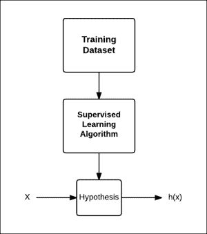

假设，就其功能而言，可能在这里听起来像是一个误称，你可能认为预测函数可能是一个更好的名称，但“假设”这个词是历史原因而使用的。

如果我们只使用一个特征来预测结果，这被称为**双变量分析**。当我们有多个特征时，这被称为**多元分析**。实际上，我们可以有我们喜欢的任意数量的特征。其中一种算法是**支持向量机**（**SVM**），我们将在下一章介绍，实际上，它允许你拥有无限数量的特征。

本章将介绍如何使用 MLlib 进行监督学习，MLlib 是 Spark 的机器学习库。

### 注意

数学解释已经尽可能地简化，但你可以自由地跳过数学部分，直接进入*如何操作…*部分。

# 使用线性回归

线性回归是建模响应变量*y*的值的方法，基于一个或多个预测变量或特征*x*。

## 准备工作

让我们使用一些住房数据来预测房屋的价格，基于其大小。以下是在 2014 年初加利福尼亚州萨拉托加市房屋的大小和价格：

| 房屋面积（平方英尺） | 价格 |
| --- | --- |
| 2100 | $ 1,620,000 |
| 2300 | $ 1,690,000 |
| 2046 | $ 1,400,000 |
| 4314 | $ 2,000,000 |
| 1244 | $ 1,060,000 |
| 4608 | $ 3,830,000 |
| 2173 | $ 1,230,000 |
| 2750 | $ 2,400,000 |
| 4010 | $ 3,380,000 |
| 1959 | $ 1,480,000 |

下面是同样的图形表示：

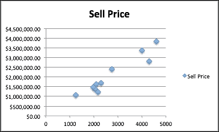

## 如何操作…

1.  启动 Spark shell：

    ```py
    $ spark-shell

    ```

1.  导入统计和相关类：

    ```py
    scala> import org.apache.spark.mllib.linalg.Vectors
    scala> import org.apache.spark.mllib.regression.LabeledPoint
    scala> import org.apache.spark.mllib.regression.LinearRegressionWithSGD

    ```

1.  创建带有房价作为标签的 `LabeledPoint` 数组：

    ```py
    scala> val points = Array(
    LabeledPoint(1620000,Vectors.dense(2100)),
    LabeledPoint(1690000,Vectors.dense(2300)),
    LabeledPoint(1400000,Vectors.dense(2046)),
    LabeledPoint(2000000,Vectors.dense(4314)),
    LabeledPoint(1060000,Vectors.dense(1244)),
    LabeledPoint(3830000,Vectors.dense(4608)),
    LabeledPoint(1230000,Vectors.dense(2173)),
    LabeledPoint(2400000,Vectors.dense(2750)),
    LabeledPoint(3380000,Vectors.dense(4010)),
    LabeledPoint(1480000,Vectors.dense(1959))
    )

    ```

1.  创建前面数据的 RDD：

    ```py
    scala> val pricesRDD = sc.parallelize(points)

    ```

1.  使用 100 次迭代训练这个数据集的模型。在这里，步长被保持得很小，以考虑到响应变量（即房价）的非常大的值。第四个参数是每次迭代要使用的数据集的分数，最后一个参数是要使用的初始权重集（不同特征的权重）：

    ```py
    scala> val model = LinearRegressionWithSGD.train(pricesRDD,100,0.0000006,1.0,Vectors.zeros(1))

    ```

1.  预测一栋 2500 平方英尺房子的价格：

    ```py
    scala> val prediction = model.predict(Vectors.dense(2500))

    ```

房屋面积只是一个预测变量。房价取决于其他变量，如地块大小、房屋年龄等。你拥有的变量越多，你的预测就会越好。

# 理解成本函数

成本函数或损失函数是机器学习算法中一个非常重要的函数。大多数算法都有某种形式的成本函数，目标是使其最小化。影响成本函数的参数，如上一个菜谱中的 `stepSize`，需要手动设置。因此，理解成本函数的整个概念非常重要。

在这个菜谱中，我们将分析线性回归的成本函数。线性回归是一个简单的算法，它将帮助读者理解成本函数在复杂算法中的作用。

让我们回到线性回归。目标是找到最佳拟合线，使得均方误差最小。在这里，我们将误差定义为最佳拟合线的值与训练数据集中响应变量的实际值之间的差异。

对于单变量谓词的简单情况，最佳拟合线可以写成：

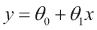

这个函数也称为**假设函数**，可以写成：

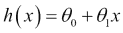

线性回归的目标是找到最佳拟合线。在这条线上，θ[0] 代表 *y* 轴上的截距，θ[1] 代表线的斜率，从以下方程中可以明显看出：


我们必须选择 θ[0] 和 θ[1]，使得 *h(x)* 最接近训练数据集中的 *y*。因此，对于 *i*^(th) 个数据点，直线和数据点之间的距离平方是：

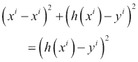

用话来说，这是预测房价和实际售价之间差异的平方。现在，让我们取训练数据集中这个值的平均值：

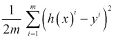

上述方程称为线性回归的成本函数 *J*。目标是使这个成本函数最小化。

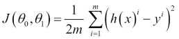

这个成本函数也称为**平方误差函数**。如果将 θ[0] 和 θ[1] 分别与 *J* 绘制，它们各自遵循凸曲线。

让我们以一个包含三个值的数据集为例，(1,1)，(2,2)，和 (3,3)，以简化计算：

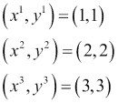

假设 θ[1] 为 0，即最佳拟合线平行于 *x* 轴。在第一种情况下，假设最佳拟合线是 *x* 轴，即 *y=0*。以下将是损失函数的值：


现在，让我们将这条线稍微向上移动到 *y=1*。以下将是损失函数的值：

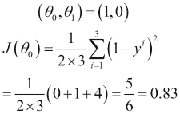

现在，让我们将这条线进一步向上移动到 *y=2*。然后，以下将是损失函数的值：

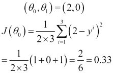

现在，当我们将这条线进一步向上移动到 *y=3* 时，以下将是损失函数的值：

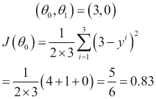

现在，让我们将这条线进一步向上移动到 *y=4*。以下将是损失函数的值：

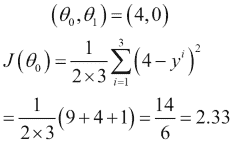

因此，您可以看到损失函数的值首先下降，然后再次像这样上升：

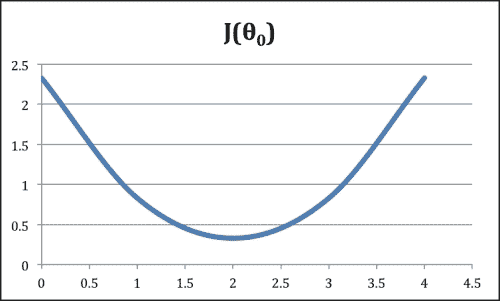

现在，让我们通过将 θ[0] 设置为 0 并使用不同的 θ[1] 值来重复这个练习：

在第一种情况下，假设最佳拟合线是 *x* 轴，即 *y=0*。以下将是损失函数的值：

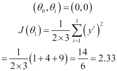

现在，让我们使用斜率为 0.5。以下将是损失函数的值：

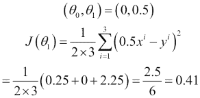

现在，让我们使用斜率为 1。以下将是损失函数的值：

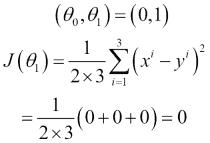

现在，当我们使用斜率为 1.5 时，以下将是损失函数的值：

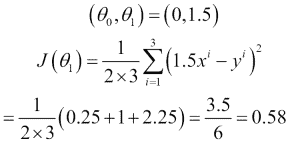

现在，让我们使用斜率为 2.0。以下将是损失函数的值：

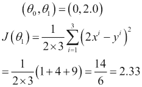

如图中所示，*J* 的最小值出现在曲线的斜率或梯度为 0 时。

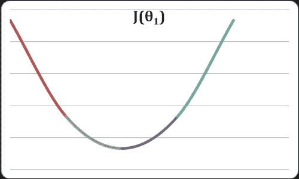

当 θ[0] 和 θ[1] 都映射到三维空间时，它变成了一个碗的形状，损失函数的最小值位于其底部。

这种达到最小值的方法称为 **梯度下降**。在 Spark 中，其实现是随机梯度下降。

# 使用 Lasso 进行线性回归

Lasso 是线性回归的一种收缩和选择方法。它最小化通常的平方误差和，同时限制系数绝对值之和。它基于可在 [`statweb.stanford.edu/~tibs/lasso/lasso.pdf`](http://statweb.stanford.edu/~tibs/lasso/lasso.pdf) 找到的原始 Lasso 论文。

在上一个菜谱中我们使用的最小二乘法也称为 **普通最小二乘法**（**OLS**）。OLS 有两个挑战：

+   **预测精度**：使用 OLS 进行的预测通常具有低预测偏差和高方差。可以通过缩小一些系数（甚至将它们设置为 0）来提高预测精度。虽然会有一些偏差增加，但总体预测精度将提高。

+   **解释**：在具有大量预测变量的情况下，找到其中表现出最强效应（相关性）的子集是可取的。

### 注意

偏差与方差

预测误差背后的两个主要原因是偏差和方差。理解偏差和方差的最佳方式是查看我们在同一数据集上进行多次预测的情况。

偏差是预测结果与实际值之间距离的估计，方差是不同预测中预测值差异的估计。

通常，添加更多特征有助于减少偏差，这很容易理解。如果在构建预测模型时遗漏了一些具有显著相关性的特征，会导致显著的误差。

如果你的模型具有高方差，你可以移除特征来减少它。更大的数据集也有助于减少方差。

这里，我们将使用一个简单的数据集，它是不良设定的。不良设定的数据集是指样本数据量小于预测变量数量的数据集。

| y | x0 | x1 | x2 | x3 | x4 | x5 | x6 | x7 | x8 |
| --- | --- | --- | --- | --- | --- | --- | --- | --- | --- |
| 1 | 5 | 3 | 1 | 2 | 1 | 3 | 2 | 2 | 1 |
| 2 | 9 | 8 | 8 | 9 | 7 | 9 | 8 | 7 | 9 |

你可以很容易地猜出，在这里，九个预测变量中只有两个与*y*有强相关性，即*x0*和*x1*。我们将使用这个数据集和 lasso 算法来验证其有效性。

## 如何操作...

1.  启动 Spark shell：

    ```py
    $ spark-shell

    ```

1.  导入统计和相关类：

    ```py
    scala> import org.apache.spark.mllib.linalg.Vectors
    scala> import org.apache.spark.mllib.regression.LabeledPoint
    scala> import org.apache.spark.mllib.regression.LassoWithSGD

    ```

1.  使用房价作为标签创建`LabeledPoint`数组：

    ```py
    scala> val points = Array(
    LabeledPoint(1,Vectors.dense(5,3,1,2,1,3,2,2,1)),
    LabeledPoint(2,Vectors.dense(9,8,8,9,7,9,8,7,9))
    )

    ```

1.  创建前述数据的 RDD：

    ```py
    scala> val rdd = sc.parallelize(points)

    ```

1.  使用此数据通过 100 次迭代训练模型。在这里，步长和正则化参数已经手动设置：

    ```py
    scala> val model = LassoWithSGD.train(rdd,100,0.02,2.0)

    ```

1.  检查有多少预测变量的系数被设置为 0：

    ```py
    scala> model.weights
    org.apache.spark.mllib.linalg.Vector = [0.13455106581619633,0.02240732644670294,0.0,0.0,0.0,0.01360995990267153,0.0,0.0,0.0]

    ```

如您所见，九个预测变量中有六个将其系数设置为 0。这是 lasso 的主要特征：任何它认为无用的预测变量，它实际上通过将其系数设置为 0 将其从方程中移除。

# 进行岭回归

为了提高预测质量，lasso 的另一种方法是岭回归。在 lasso 中，许多特征将其系数设置为 0 并被从方程中消除，而在岭回归中，预测变量或特征会受到惩罚，但永远不会被设置为 0。

## 如何操作...

1.  启动 Spark shell：

    ```py
    $ spark-shell

    ```

1.  导入统计和相关类：

    ```py
    scala> import org.apache.spark.mllib.linalg.Vectors
    scala> import org.apache.spark.mllib.regression.LabeledPoint
    scala> import org.apache.spark.mllib.regression.RidgeRegressionWithSGD

    ```

1.  使用房价作为标签创建`LabeledPoint`数组：

    ```py
    scala> val points = Array(
    LabeledPoint(1,Vectors.dense(5,3,1,2,1,3,2,2,1)),
    LabeledPoint(2,Vectors.dense(9,8,8,9,7,9,8,7,9))
    )

    ```

1.  创建前述数据的 RDD：

    ```py
    scala> val rdd = sc.parallelize(points)

    ```

1.  使用此数据通过 100 次迭代训练模型。在这里，步长和正则化参数已经手动设置：

    ```py
    scala> val model = RidgeRegressionWithSGD.train(rdd,100,0.02,2.0)

    ```

1.  检查有多少预测变量的系数被设置为零：

    ```py
    scala> model.weights
    org.apache.spark.mllib.linalg.Vector = [0.049805969577244584,0.029883581746346748,0.009961193915448916,0.019922387830897833,0.009961193915448916,0.029883581746346748,0.019922387830897833,0.019922387830897833,0.009961193915448916]

    ```

如您所见，与 lasso 回归不同，岭回归不会将任何预测变量的系数设置为零，但它确实会让一些系数非常接近零。
