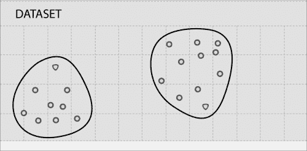

# 第九章。使用 MLlib 的无监督学习

本章将介绍如何使用 MLlib 进行无监督学习，MLlib 是 Spark 的机器学习库。

本章分为以下食谱：

+   使用 k-means 进行聚类

+   主成分分析进行降维

+   使用奇异值分解进行降维

# 简介

以下是维基百科对无监督学习的定义：

> *"在机器学习中，无监督学习的问题在于试图在未标记的数据中找到隐藏的结构。"*

与有监督学习不同，在有监督学习中，我们有标记数据来训练算法，在无监督学习中，我们要求算法自己找到结构。让我们看看以下示例数据集：


如前图所示，数据点正在形成以下两个簇：


事实上，聚类是最常见的无监督学习算法。

# 使用 k-means 进行聚类

聚类分析或聚类是将数据分组到多个组的过程，使得一个组中的数据与其他组中的数据相似。

以下是一些聚类应用的例子：

+   **市场细分**：将目标市场细分为多个细分市场，以便更好地满足每个细分市场的需求

+   **社交网络分析**：在社交网络中找到一组有组织的人群，通过社交网站如 Facebook 进行广告定位

+   **数据中心计算集群**：将一组计算机组合起来以提高性能

+   **天文数据分析**：理解天文数据以及如星系形成的事件

+   **房地产**：根据相似特征识别社区

+   **文本分析**：将小说或论文等文本文档分为不同类型

k-means 算法最好通过图像来展示，让我们再次看看我们的示例图：


k-means 的第一步是随机选择两个称为**簇质心**的点：


k-means 算法是一个迭代算法，分为两个步骤：

+   **簇分配步骤**：此算法将遍历每个数据点，根据它更接近哪个质心，将其分配给该质心，进而分配给它所代表的簇

+   **移动质心步骤**：此算法将每个质心移动到簇中数据点的平均值

让我们看看聚类分配后我们的数据看起来如何：



现在让我们将簇质心移动到簇中数据点的平均值，如下所示：


在这种情况下，一次迭代就足够了，进一步的迭代不会移动聚类中心。对于大多数真实数据，需要多次迭代才能将中心移动到最终位置。

k-means 算法接受多个聚类作为输入。

## 准备中

让我们使用来自加利福尼亚州萨拉托加市的不同的住房数据。这次，我们将使用占地面积和房屋价格：

| 占地面积 | 房屋价格（以 1000 美元为单位） |
| --- | --- |
| 12839 | 2405 |
| 10000 | 2200 |
| 8040 | 1400 |
| 13104 | 1800 |
| 10000 | 2351 |
| 3049 | 795 |
| 38768 | 2725 |
| 16250 | 2150 |
| 43026 | 2724 |
| 44431 | 2675 |
| 40000 | 2930 |
| 1260 | 870 |
| 15000 | 2210 |
| 10032 | 1145 |
| 12420 | 2419 |
| 69696 | 2750 |
| 12600 | 2035 |
| 10240 | 1150 |
| 876 | 665 |
| 8125 | 1430 |
| 11792 | 1920 |
| 1512 | 1230 |
| 1276 | 975 |
| 67518 | 2400 |
| 9810 | 1725 |
| 6324 | 2300 |
| 12510 | 1700 |
| 15616 | 1915 |
| 15476 | 2278 |
| 13390 | 2497.5 |
| 1158 | 725 |
| 2000 | 870 |
| 2614 | 730 |
| 13433 | 2050 |
| 12500 | 3330 |
| 15750 | 1120 |
| 13996 | 4100 |
| 10450 | 1655 |
| 7500 | 1550 |
| 12125 | 2100 |
| 14500 | 2100 |
| 10000 | 1175 |
| 10019 | 2047.5 |
| 48787 | 3998 |
| 53579 | 2688 |
| 10788 | 2251 |
| 11865 | 1906 |

让我们将这些数据转换为名为 `saratoga.c` 的 **逗号分隔值** (**CSV**) 文件，并将其绘制成散点图：


找到合适的聚类数量是一个棘手的问题。在这里，我们有视觉检查的优势，这在超平面（超过三个维度）的数据中是不存在的。让我们大致将数据分为四个聚类，如下所示：


我们将运行 k-means 算法来完成同样的任务，并看看我们的结果有多接近。

## 如何做到这一点…

1.  将 `saratoga.csv` 加载到 HDFS：

    ```py
    $ hdfs dfs -put saratoga.csv saratoga.csv

    ```

1.  启动 Spark shell：

    ```py
    $ spark-shell

    ```

1.  导入统计和相关类：

    ```py
    scala> import org.apache.spark.mllib.linalg.Vectors
    scala> import org.apache.spark.mllib.clustering.KMeans

    ```

1.  将 `saratoga.csv` 加载为 RDD：

    ```py
    scala> val data = sc.textFile("saratoga.csv")

    ```

1.  将数据转换为密集向量的 RDD：

    ```py
    scala> val parsedData = data.map( line => Vectors.dense(line.split(',').map(_.toDouble)))

    ```

1.  训练模型以四个聚类和五个迭代：

    ```py
    scala> val kmmodel= KMeans.train(parsedData,4,5)

    ```

1.  将 `parsedData` 收集为本地 Scala 集合：

    ```py
    scala> val houses = parsedData.collect

    ```

1.  预测第 0 个元素的聚类：

    ```py
    scala> val prediction = kmmodel.predict(houses(0))

    ```

1.  现在，让我们比较 k-means 算法与我们所做的单个聚类分配。k-means 算法从 0 开始给出聚类 ID。一旦检查数据，你就会发现我们给出的 A 到 D 聚类 ID 与 k-means 之间的以下映射：A=>3, B=>1, C=>0, D=>2。

1.  现在，让我们从图表的不同部分选取一些数据，并预测它属于哪个聚类。

1.  让我们看看房屋（18）的数据，其占地面积为 876 平方英尺，价格为 66.5 万美元：

    ```py
    scala> val prediction = kmmodel.predict(houses(18))
    resxx: Int = 3

    ```

1.  现在，看看房屋（35）的数据，其占地面积为 15,750 平方英尺，价格为 112 万美元：

    ```py
    scala> val prediction = kmmodel.predict(houses(35))
    resxx: Int = 1

    ```

1.  现在，看看房屋（6）的数据，其占地面积为 38,768 平方英尺，价格为 2.725 百万美元：

    ```py
    scala> val prediction = kmmodel.predict(houses(6))
    resxx: Int = 0

    ```

1.  现在，看看房屋（15）的数据，其占地面积为 69,696 平方英尺，价格为 275 万美元：

    ```py
    scala>  val prediction = kmmodel.predict(houses(15))
    resxx: Int = 2

    ```

你可以用更多的数据来测试预测能力。让我们做一些邻里分析，看看这些聚类有什么含义。大多数属于第 3 个聚类的房屋都靠近市中心。第 2 个聚类的房屋位于丘陵地带。

在这个例子中，我们处理了一个非常小的特征集；常识和视觉检查也会得出相同的结论。k-means 算法的美丽之处在于，它可以在具有无限数量特征的数据上进行聚类。当你有一堆原始数据并想了解其中的模式时，这是一个非常棒的工具。

# 主成分分析进行降维

降维是将维度或特征数量减少的过程。许多真实数据包含非常高的特征数量。拥有数千个特征并不罕见。现在，我们需要深入挖掘那些重要的特征。

降维有几个用途，例如：

+   数据压缩

+   可视化

当维度数量减少时，它减少了磁盘占用和内存占用。最后但同样重要的是；它帮助算法运行得更快。它还有助于将高度相关的维度减少到一个。

人类只能可视化三维，但数据可以具有许多更高的维度。可视化可以帮助发现数据中的隐藏模式。降维通过将多个特征压缩成一个来帮助可视化。

降维最流行的算法是**主成分分析**（**PCA**）。

让我们看看以下数据集：


假设目标是把这二维数据分成一维。实现这一目标的方法是找到一个可以投影这些数据的直线。让我们找到一个适合投影这些数据的直线：


这是离数据点最近投影距离的直线。让我们通过从每个数据点到这个投影线的最短线来进一步解释它：


另一种看待方式是，我们需要找到一个可以投影数据的直线，使得数据点到这条直线的平方距离之和最小化。这些灰色线段也被称为**投影误差**。

## 准备工作

让我们看看加利福尼亚州萨拉托加市住房数据的三个特征——即房屋大小、地块大小和价格。使用 PCA，我们将房屋大小和地块大小特征合并为一个特征——*z*。让我们称这个特征为**房屋 z 密度**。

值得注意的是，并不总是可能为新创建的特征赋予意义。在这种情况下，这很容易，因为我们只有两个特征要组合，我们可以用我们的常识来组合这两个特征的效果。在更实际的案例中，你可能有一千个特征，你试图将它们投影到 100 个特征。可能无法为那 100 个特征中的每一个赋予现实生活的意义。

在这个练习中，我们将使用 PCA 推导住房密度，然后我们将进行线性回归以查看这种密度如何影响房价。

在我们深入研究 PCA 之前，有一个预处理阶段：**特征缩放**。当两个特征的量级相差很大时，特征缩放就会变得重要。在这里，房屋面积在 800 平方英尺到 7000 平方英尺的范围内变化，而地块面积在 800 平方英尺到几英亩之间变化。

为什么我们之前不需要进行特征缩放？答案是，我们真的不需要将特征放在同一起跑线上。梯度下降是另一个特征缩放非常有用的领域。

特征缩放有不同的方法：

+   将特征值除以一个最大值，使得每个特征值都在范围内

+   将特征值除以范围，即最大值减去最小值

+   从特征值中减去其均值，然后除以范围

+   从特征值中减去其均值，然后除以标准差

我们将使用第四种方法以最佳方式缩放。以下是我们将用于此菜谱的数据：

| 房屋面积 | 地块面积 | 缩放后的房屋面积 | 缩放后的地块面积 | 房屋价格（以 1000 美元为单位） |
| --- | --- | --- | --- | --- |
| 2524 | 12839 | -0.025 | -0.231 | 2405 |
| 2937 | 10000 | 0.323 | -0.4 | 2200 |
| 1778 | 8040 | -0.654 | -0.517 | 1400 |
| 1242 | 13104 | -1.105 | -0.215 | 1800 |
| 2900 | 10000 | 0.291 | -0.4 | 2351 |
| 1218 | 3049 | -1.126 | -0.814 | 795 |
| 2722 | 38768 | 0.142 | 1.312 | 2725 |
| 2553 | 16250 | -0.001 | -0.028 | 2150 |
| 3681 | 43026 | 0.949 | 1.566 | 2724 |
| 3032 | 44431 | 0.403 | 1.649 | 2675 |
| 3437 | 40000 | 0.744 | 1.385 | 2930 |
| 1680 | 1260 | -0.736 | -0.92 | 870 |
| 2260 | 15000 | -0.248 | -0.103 | 2210 |
| 1660 | 10032 | -0.753 | -0.398 | 1145 |
| 3251 | 12420 | 0.587 | -0.256 | 2419 |
| 3039 | 69696 | 0.409 | 3.153 | 2750 |
| 3401 | 12600 | 0.714 | -0.245 | 2035 |
| 1620 | 10240 | -0.787 | -0.386 | 1150 |
| 876 | 876 | -1.414 | -0.943 | 665 |
| 1889 | 8125 | -0.56 | -0.512 | 1430 |
| 4406 | 11792 | 1.56 | -0.294 | 1920 |
| 1885 | 1512 | -0.564 | -0.905 | 1230 |
| 1276 | 1276 | -1.077 | -0.92 | 975 |
| 3053 | 67518 | 0.42 | 3.023 | 2400 |
| 2323 | 9810 | -0.195 | -0.412 | 1725 |
| 3139 | 6324 | 0.493 | -0.619 | 2300 |
| 2293 | 12510 | -0.22 | -0.251 | 1700 |
| 2635 | 15616 | 0.068 | -0.066 | 1915 |
| 2298 | 15476 | -0.216 | -0.074 | 2278 |
| 2656 | 13390 | 0.086 | -0.198 | 2497.5 |
| 1158 | 1158 | -1.176 | -0.927 | 725 |
| 1511 | 2000 | -0.879 | -0.876 | 870 |
| 1252 | 2614 | -1.097 | -0.84 | 730 |
| 2141 | 13433 | -0.348 | -0.196 | 2050 |
| 3565 | 12500 | 0.852 | -0.251 | 3330 |
| 1368 | 15750 | -0.999 | -0.058 | 1120 |
| 5726 | 13996 | 2.672 | -0.162 | 4100 |
| 2563 | 10450 | 0.008 | -0.373 | 1655 |
| 1551 | 7500 | -0.845 | -0.549 | 1550 |
| 1993 | 12125 | -0.473 | -0.274 | 2100 |
| 2555 | 14500 | 0.001 | -0.132 | 2100 |
| 1572 | 10000 | -0.827 | -0.4 | 1175 |
| 2764 | 10019 | 0.177 | -0.399 | 2047.5 |
| 7168 | 48787 | 3.887 | 1.909 | 3998 |
| 4392 | 53579 | 1.548 | 2.194 | 2688 |
| 3096 | 10788 | 0.457 | -0.353 | 2251 |
| 2003 | 11865 | -0.464 | -0.289 | 1906 |

让我们将缩放后的房屋大小和缩放后的房屋价格数据保存为 `scaledhousedata.csv`。

## 如何做…

1.  将 `scaledhousedata.csv` 加载到 HDFS：

    ```py
    $ hdfs dfs -put scaledhousedata.csv scaledhousedata.csv

    ```

1.  启动 Spark shell：

    ```py
    $ spark-shell

    ```

1.  导入统计和相关类：

    ```py
    scala> import org.apache.spark.mllib.linalg.Vectors
    scala> import org.apache.spark.mllib.linalg.distributed.RowMatrix

    ```

1.  将 `saratoga.csv` 加载为 RDD：

    ```py
    scala> val data = sc.textFile("scaledhousedata.csv")

    ```

1.  将数据转换为密集向量的 RDD：

    ```py
    scala> val parsedData = data.map( line => Vectors.dense(line.split(',').map(_.toDouble)))

    ```

1.  从 `parsedData` 创建一个 `RowMatrix`：

    ```py
    scala> val mat = new RowMatrix(parsedData)

    ```

1.  计算一个主成分：

    ```py
    scala> val pc= mat.computePrincipalComponents(1)

    ```

1.  将行投影到由主成分张成的线性空间：

    ```py
    scala> val projected = mat.multiply(pc)

    ```

1.  将投影的 `RowMatrix` 转换回 RDD：

    ```py
    scala> val projectedRDD = projected.rows

    ```

1.  将 `projectedRDD` 保存回 HDFS：

    ```py
    scala> projectedRDD.saveAsTextFile("phdata")

    ```

现在，我们将使用这个投影特征，我们决定称之为住房密度，将其与房价对比，看看是否会出现任何新的模式：

1.  将 HDFS 目录 `phdata` 下载到本地目录 `phdata`：

    ```py
    scala> hdfs dfs -get phdata phdata

    ```

1.  在数据中修剪起始和结束括号，并将数据加载到 MS Excel 中，紧邻房价。

下面的图是房价与住房密度的对比图：


让我们按照以下方式绘制一些数据模式：


我们在这里看到了什么模式？从高密度住房到低密度住房，人们愿意支付高额溢价。随着住房密度的降低，这种溢价趋于平稳。例如，人们愿意支付高额溢价从公寓和联排别墅搬到独立住宅，但拥有 3 英亩地块的独立住宅的溢价与在相似建成区域拥有 2 英亩地块的独立住宅的溢价不会有太大差异。

# 使用奇异值分解进行降维

原始维度通常不能以最佳方式表示数据。正如我们在 PCA 中所看到的，有时可以将数据投影到更少的维度，同时仍然保留大部分有用的信息。

有时，最好的方法是将维度沿着表现出最多变化的特征对齐。这种方法有助于消除不代表数据的维度。

让我们再次看看以下图形，它显示了两个维度上的最佳拟合线：


投影线显示了原始数据的一维最佳近似。如果我们取灰色线与黑色线相交的点，并隔离黑色线，我们将得到尽可能保留变化的原始数据的降维表示，如图所示：


让我们画一条垂直于第一条投影线的线，如图所示：


这条线尽可能多地捕捉原始数据集的第二维度的变化。它在这个维度上近似原始数据的效果不佳，因为这个维度一开始就表现出较少的变化。可以使用这些投影线生成一组不相关的数据点，这些数据点将显示原始数据中的子分组，而这些子分组在第一眼看来是不可见的。

这就是奇异值分解（SVD）背后的基本思想。将一个高维、高度可变的数据点集降低到较低维度的空间，可以更清晰地展示原始数据的结构，并按从最大变化到最小变化的顺序排列。奇异值分解之所以非常实用，尤其是在自然语言处理（NLP）应用中，是因为你可以简单地忽略低于某个阈值的变异，从而大量减少原始数据，同时确保原始关系的兴趣得到保留。

现在我们稍微深入理论。奇异值分解基于线性代数中的一个定理，即一个矩形矩阵 A 可以分解为三个矩阵的乘积——一个正交矩阵 U、一个对角矩阵 S 和一个正交矩阵 V 的转置。我们可以如下表示：


*U* 和 *V* 是正交矩阵：


*U* 的列是  的正交特征向量，而 *V* 的列是  的正交特征向量。*S* 是一个对角矩阵，包含从 *U* 或 *V* 中按降序排列的特征值的平方根。

## 准备工作

让我们看看一个术语-文档矩阵的例子。我们将探讨关于美国总统选举的两个新项目。以下是两个文档的链接：

+   **福克斯**：[`www.foxnews.com/politics/2015/03/08/top-2016-gop-presidential-hopefuls-return-to-iowa-to-hone-message-including/`](http://www.foxnews.com/politics/2015/03/08/top-2016-gop-presidential-hopefuls-return-to-iowa-to-hone-message-including/)

+   **Npr**: [`www.npr.org/blogs/itsallpolitics/2015/03/09/391704815/in-iowa-2016-has-begun-at-least-for-the-republican-party`](http://www.npr.org/blogs/itsallpolitics/2015/03/09/391704815/in-iowa-2016-has-begun-at-least-for-the-republican-party)

让我们利用这两条新闻构建总统候选人矩阵：


让我们将这个矩阵放入 CSV 文件中，然后将其放入 HDFS。我们将对此矩阵应用奇异值分解（SVD）并分析结果。

## 如何做到这一点……

1.  将`scaledhousedata.csv`加载到 HDFS：

    ```py
    $ hdfs dfs -put pres.csv scaledhousedata.csv

    ```

1.  启动 Spark shell：

    ```py
    $ spark-shell

    ```

1.  导入统计和相关类：

    ```py
    scala> import org.apache.spark.mllib.linalg.Vectors
    scala> import org.apache.spark.mllib.linalg.distributed.RowMatrix

    ```

1.  将`pres.csv`加载为 RDD：

    ```py
    scala> val data = sc.textFile("pres.csv")

    ```

1.  将数据转换为一个密集向量的 RDD：

    ```py
    scala> val parsedData = data.map( line => Vectors.dense(line.split(',').map(_.toDouble)))

    ```

1.  从`parsedData`创建一个`RowMatrix`：

    ```py
    scala> val mat = new RowMatrix(parsedData)

    ```

1.  计算`svd`：

    ```py
    scala> val svd = mat.computeSVD(2,true)

    ```

1.  计算特征向量`U`因子：

    ```py
    scala> val U = svd.U

    ```

1.  计算奇异值（特征值）矩阵：

    ```py
    scala> val s = svd.s

    ```

1.  计算特征向量`V`因子：

    ```py
    scala> val s = svd.s

    ```

如果你查看`s`，你会意识到它给 Npr 文章的评分远高于 Fox 文章。
