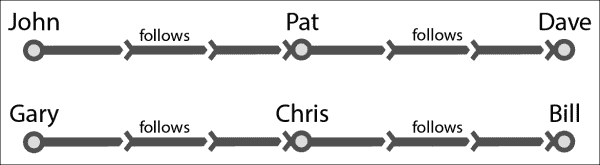

# 第十一章。使用 GraphX 进行图处理

本章将介绍如何使用 GraphX 进行图处理，Spark 的图处理库。

本章分为以下食谱：

+   图的基本操作

+   使用 PageRank

+   寻找连通分量

+   执行邻域聚合

# 简介

图分析在我们的生活中比我们想象的更普遍。最常见的一个例子是，当我们要求 GPS 找到目的地最短路线时，它使用图处理算法。

让我们先了解图。图是一组顶点的表示，其中一些顶点对通过边连接。当这些边从一个方向移动到另一个方向时，它被称为**有向图**或**有向图**。

GraphX 是 Spark 的图处理 API。它提供了一个围绕 RDD 的包装器，称为**弹性分布式属性图**。属性图是一个带有属性附加到每个顶点和边的有向多重图。

有两种类型的图——有向图（有向图）和正则图。有向图的边只有一个方向，例如，从顶点 A 到顶点 B。Twitter 关注者是一个很好的有向图例子。如果 John 是 David 的 Twitter 关注者，并不意味着 David 是 John 的关注者。另一方面，Facebook 是一个很好的正则图例子。如果 John 是 David 的 Facebook 朋友，那么 David 也是 John 的 Facebook 朋友。

多重图是允许有多个边（也称为**并行边**）的图。由于 GraphX 中的每个边都有属性，每个边都有自己的标识。

传统上，对于分布式图处理，有两种类型的系统：

+   数据并行

+   图并行

GraphX 旨在将两者结合在一个系统中。GraphX API 允许用户在不移动数据的情况下将数据视为图和集合（RDD）。

# 图的基本操作

在这个食谱中，我们将学习如何创建图以及如何在它们上执行基本操作。

## 准备工作

作为起始示例，我们将有三个顶点，每个顶点代表加利福尼亚州三个城市的市中心——圣克拉拉、弗里蒙特和旧金山。以下是这些城市之间的距离：

| 源 | 目标 | 距离（英里） |
| --- | --- | --- |
| 圣克拉拉，CA | 弗里蒙特，CA | 20 |
| 弗里蒙特，CA | 旧金山，CA | 44 |
| 旧金山，CA | 圣克拉拉，CA | 53 |

## 如何实现...

1.  导入 GraphX 相关类：

    ```py
    scala> import org.apache.spark.graphx._
    scala> import org.apache.spark.rdd.RDD

    ```

1.  将顶点数据加载到数组中：

    ```py
    scala> val vertices = Array((1L, ("Santa Clara","CA")),(2L, ("Fremont","CA")),(3L, ("San Francisco","CA")))

    ```

1.  将顶点数组加载到顶点 RDD 中：

    ```py
    scala> val vrdd = sc.parallelize(vertices)

    ```

1.  将边数据加载到数组中：

    ```py
    scala> val edges = Array(Edge(1L,2L,20),Edge(2L,3L,44),Edge(3L,1L,53))

    ```

1.  将数据加载到边 RDD 中：

    ```py
    scala> val erdd = sc.parallelize(edges)

    ```

1.  创建图：

    ```py
    scala> val graph = Graph(vrdd,erdd)

    ```

1.  打印图中所有顶点：

    ```py
    scala> graph.vertices.collect.foreach(println)

    ```

1.  打印图中所有边：

    ```py
    scala> graph.edges.collect.foreach(println)

    ```

1.  打印边三元组；边三元组是通过向边添加源和目标属性创建的：

    ```py
    scala> graph.triplets.collect.foreach(println)

    ```

1.  图的入度是指它拥有的内向边的数量。打印每个顶点的入度（作为`VertexRDD[Int]`）：

    ```py
    scala> graph.inDegrees

    ```

# 使用 PageRank

PageRank 衡量图中的每个顶点的重要性。PageRank 是由谷歌的创始人发起的，他们使用理论认为，互联网上最重要的页面是那些有最多链接指向它们的页面。PageRank 还考虑了指向目标页面的页面的重要性。因此，如果一个给定的网页有来自高排名页面的入链，它将被排名更高。

## 准备工作

我们将使用维基百科页面链接数据来计算页面排名。维基百科以数据库转储的形式发布其数据。我们将使用来自[`haselgrove.id.au/wikipedia.htm`](http://haselgrove.id.au/wikipedia.htm)的链接数据，这些数据包含在两个文件中：

+   `links-simple-sorted.txt`

+   `titles-sorted.txt`

我已经将它们都放在 Amazon S3 的`s3n://com.infoobjects.wiki/links`和`s3n://com.infoobjects.wiki/nodes`上。由于数据量较大，建议您在 Amazon EC2 或本地集群上运行。沙盒可能非常慢。

您可以使用以下命令将文件加载到`hdfs`：

```py
$ hdfs dfs -mkdir wiki
$ hdfs dfs -put links-simple-sorted.txt wiki/links.txt
$ hdfs dfs -put titles-sorted.txt wiki/nodes.txt

```

## 如何做到这一点...

1.  导入 GraphX 相关类：

    ```py
    scala> import org.apache.spark.graphx._

    ```

1.  从`hdfs`加载边，使用 20 个分区：

    ```py
    scala> val edgesFile = sc.textFile("wiki/links.txt",20)

    ```

    或者，从 Amazon S3 加载边：

    ```py
    scala> val edgesFile = sc.textFile("s3n:// com.infoobjects.wiki/links",20)

    ```

    ### 注意

    `links`文件中的链接格式为“sourcelink: link1 link2 …”。

1.  展开并转换为“link1,link2”格式的 RDD，然后将其转换为`Edge`对象的 RDD：

    ```py
    scala> val edges = edgesFile.flatMap { line =>
     val links = line.split("\\W+")
     val from = links(0)
     val to = links.tail
     for ( link <- to) yield (from,link)
     }.map( e => Edge(e._1.toLong,e._2.toLong,1))

    ```

1.  从`hdfs`加载顶点，使用 20 个分区：

    ```py
    scala> val verticesFile = sc.textFile("wiki/nodes.txt",20)

    ```

1.  或者，从 Amazon S3 加载边：

    ```py
    scala> val verticesFile = sc.textFile("s3n:// com.infoobjects.wiki/nodes",20)

    ```

1.  提供一个顶点的索引，然后将其交换成（索引，标题）格式：

    ```py
    scala> val vertices = verticesFile.zipWithIndex.map(_.swap)

    ```

1.  创建`graph`对象：

    ```py
    scala> val graph = Graph(vertices,edges)

    ```

1.  运行 PageRank 并获取顶点：

    ```py
    scala> val ranks = graph.pageRank(0.001).vertices

    ```

1.  由于排名是按照（顶点 ID，pagerank）格式，将其交换成（pagerank，顶点 ID）格式：

    ```py
    scala> val swappedRanks = ranks.map(_.swap)

    ```

1.  排序以首先获取最高排名的页面：

    ```py
    scala> val sortedRanks = swappedRanks.sortByKey(false)

    ```

1.  获取最高排名的页面：

    ```py
    scala> val highest = sortedRanks.first

    ```

1.  前面的命令给出了顶点 ID，您还需要查找以查看带有排名的实际标题。让我们进行连接操作：

    ```py
    scala> val join = sortedRanks.join(vertices)

    ```

1.  在将（顶点 ID，（页面排名，标题））格式转换为（页面排名，（顶点 ID，标题））格式后，再次对连接的 RDD 进行排序：

    ```py
    scala> val final = join.map ( v => (v._2._1, (v._1,v._2._2))).sortByKey(false)

    ```

1.  打印排名前五的页面

    ```py
    scala> final.take(5).collect.foreach(println)

    ```

这是输出应该的样子：

```py
(12406.054646736622,(5302153,United_States'_Country_Reports_on_Human_Rights_Practices))
(7925.094429748747,(84707,2007,_Canada_budget)) (7635.6564216408515,(88822,2008,_Madrid_plane_crash)) (7041.479913258444,(1921890,Geographic_coordinates)) (5675.169862343964,(5300058,United_Kingdom's))

```

# 寻找连通分量

连通分量是一个子图（一个顶点是原始图顶点集的子集，边是原始图边集的子集的图），其中任何两个顶点都通过一条边或一系列边相互连接。

理解它的一个简单方法是通过查看夏威夷的道路网络图。这个州有众多岛屿，它们之间没有道路相连。在每一个岛屿内，大多数道路都会相互连接。找到连通分量的目标是找到这些集群。

连通分量算法使用其最低编号顶点的 ID 来标记图中的每个连通分量。

## 准备工作

我们将构建一个小的图来表示我们已知的集群，并使用连通分量来分离它们。让我们看看以下数据：



| 关注者 | 关注者 |
| --- | --- |
| John | Pat |
| Pat | Dave |
| Gary | Chris |
| Chris | Bill |

前面的数据是一个简单的数据，包含六个顶点和两个簇。让我们以两个文件的形式（`nodes.csv`和`edges.csv`）存储这些数据。

以下为`nodes.csv`的内容：

```py
1,John
2,Pat
3,Dave
4,Gary
5,Chris
6,Bill
```

以下为`edges.csv`的内容：

```py
1,2,follows
2,3,follows
4,5,follows
5,6,follows
```

我们应该期望连通分量算法识别出两个簇，第一个由（1,John）识别，第二个由（4,Gary）识别。

您可以使用以下命令将文件加载到`hdfs`：

```py
$ hdfs dfs -mkdir data/cc
$ hdfs dfs -put nodes.csv data/cc/nodes.csv
$ hdfs dfs -put edges.csv data/cc/edges.csv

```

## 如何做……

1.  加载 Spark shell：

    ```py
    $ spark-shell

    ```

1.  导入 GraphX 相关类：

    ```py
    scala> import org.apache.spark.graphx._

    ```

1.  从`hdfs`加载边：

    ```py
    scala> val edgesFile = sc.textFile("hdfs://localhost:9000/user/hduser/data/cc/edges.csv")

    ```

1.  将`edgesFile` RDD 转换为边的 RDD：

    ```py
    scala> val edges = edgesFile.map(_.split(",")).map(e => Edge(e(0).toLong,e(1).toLong,e(2)))

    ```

1.  从`hdfs`加载顶点：

    ```py
    scala> val verticesFile = sc.textFile("hdfs://localhost:9000/user/hduser/data/cc/nodes.csv")

    ```

1.  映射顶点：

    ```py
    scala> val vertices = verticesFile.map(_.split(",")).map( e => (e(0).toLong,e(1)))

    ```

1.  创建`graph`对象：

    ```py
    scala> val graph = Graph(vertices,edges)

    ```

1.  计算连通分量：

    ```py
    scala> val cc = graph.connectedComponents

    ```

1.  找到连通分量的顶点（这是一个子图）：

    ```py
    scala> val ccVertices = cc.vertices

    ```

1.  打印`ccVertices`：

    ```py
    scala> ccVertices.collect.foreach(println)

    ```

如输出所示，顶点 1、2、3 指向 1，而 4、5、6 指向 4。这两个都是它们各自簇中索引最低的顶点。

# 执行邻域聚合

GraphX 通过隔离每个顶点和其邻居来进行大部分计算。这使得在分布式系统上处理大规模图数据变得更容易。这使得邻域操作非常重要。GraphX 有一个机制，以`aggregateMessages`方法的形式在每个邻域级别执行它。它分两步进行：

1.  在第一步（方法的第一个函数）中，消息被发送到目标顶点或源顶点（类似于 MapReduce 中的 Map 函数）。

1.  在第二步（方法的第二个函数）中，对这些消息进行聚合（类似于 MapReduce 中的 Reduce 函数）。

## 准备工作

让我们构建一个包含关注者的小型数据集：

| 关注者 | 关注者 |
| --- | --- |
| John | Barack |
| Pat | Barack |
| Gary | Barack |
| Chris | Mitt |
| Rob | Mitt |

我们的目标是找出每个节点有多少关注者。让我们以两个文件的形式加载这些数据：`nodes.csv`和`edges.csv`。

以下为`nodes.csv`的内容：

```py
1,Barack
2,John
3,Pat
4,Gary
5,Mitt
6,Chris
7,Rob
```

以下为`edges.csv`的内容：

```py
2,1,follows
3,1,follows
4,1,follows
6,5,follows
7,5,follows
```

您可以使用以下命令将文件加载到`hdfs`：

```py
$ hdfs dfs -mkdir data/na
$ hdfs dfs -put nodes.csv data/na/nodes.csv
$ hdfs dfs -put edges.csv data/na/edges.csv

```

## 如何做……

1.  加载 Spark shell：

    ```py
    $ spark-shell

    ```

1.  导入 GraphX 相关类：

    ```py
    scala> import org.apache.spark.graphx._

    ```

1.  从`hdfs`加载边：

    ```py
    scala> val edgesFile = sc.textFile("hdfs://localhost:9000/user/hduser/data/na/edges.csv")

    ```

1.  将边转换为边的 RDD：

    ```py
    scala> val edges = edgesFile.map(_.split(",")).map(e => Edge(e(0).toLong,e(1).toLong,e(2)))

    ```

1.  从`hdfs`加载顶点：

    ```py
    scala> val verticesFile = sc.textFile("hdfs://localhost:9000/user/hduser/data/cc/nodes.csv")

    ```

1.  映射顶点：

    ```py
    scala> val vertices = verticesFile.map(_.split(",")).map( e => (e(0).toLong,e(1)))

    ```

1.  创建`graph`对象：

    ```py
    scala> val graph = Graph(vertices,edges)

    ```

1.  通过向每个关注者发送包含其关注者数量的消息来进行邻域聚合，即 1，然后添加关注者数量：

    ```py
    scala> val followerCount = graph.aggregateMessages(Int), (a, b) => (a+b))

    ```

1.  以（关注者，关注者数量）的形式打印`followerCount`：

    ```py
    scala> followerCount.collect.foreach(println)

    ```

您应该得到以下类似的结果：

```py
(1,3)
(5,2)

```
