# 第一章. 设置 Spark 虚拟环境

在本章中，我们将为开发目的构建一个隔离的虚拟环境。该环境将由 Spark 和 Python Anaconda 发行版提供的 PyData 库供电。这些库包括 Pandas、Scikit-Learn、Blaze、Matplotlib、Seaborn 和 Bokeh。我们将执行以下活动：

+   使用 Anaconda Python 发行版设置开发环境。这包括启用由 PySpark 支持的 IPython Notebook 环境，用于我们的数据探索任务。

+   安装并启用 Spark，以及 Pandas、Scikit-Learn、Blaze、Matplotlib 和 Bokeh 等 PyData 库。

+   构建一个`word count`示例应用程序以确保一切正常工作。

过去十年见证了数据驱动巨头如亚马逊、谷歌、推特、领英和 Facebook 的崛起和主导地位。这些公司通过播种、共享或披露其基础设施概念、软件实践和数据处理框架，培育了一个充满活力的开源软件社区。这已经改变了企业技术、系统和软件架构。

这包括新的基础设施和 DevOps（代表开发和运营），这些概念利用了虚拟化、云计算技术和软件定义网络。

为了处理 PB 级的数据，Hadoop 被开发并开源，其灵感来自**谷歌文件系统**（**GFS**）和相邻的分布式计算框架 MapReduce。在控制成本的同时克服扩展的复杂性，也导致了新的数据存储的激增。最近数据库技术的例子包括 Cassandra，一个列式数据库；MongoDB，一个文档数据库；以及 Neo4J，一个图数据库。

Hadoop 凭借其处理大量数据集的能力，催生了一个庞大的生态系统，通过 Pig、Hive、Impala 和 Tez 等工具以更迭代和交互的方式查询数据。由于 Hadoop 仅以批处理模式使用 MapReduce 进行操作，因此它显得有些繁琐。Spark 通过针对磁盘输入/输出和带宽密集型 MapReduce 作业的不足，正在创造分析和数据处理领域的革命。

Spark 是用 Scala 编写的，因此与由 Java 虚拟机（**JVM**）驱动的生态系统实现了原生集成。Spark 很早就通过启用 PySpark 提供了 Python API 和绑定。Spark 的架构和生态系统本质上是多语言的，Java 主导的系统具有明显的强大存在。

本书将重点关注 PySpark 和 PyData 生态系统。Python 是学术和科学界在数据密集型处理中首选的语言之一。Python 已经开发了丰富的库和工具，用于数据操作（如 Pandas 和 Blaze）、机器学习（如 Scikit-Learn）以及数据可视化（如 Matplotlib、Seaborn 和 Bokeh）。因此，本书的目的是构建由 Spark 和 Python 驱动的数据密集型应用端到端架构。为了将这些概念付诸实践，我们将分析如 Twitter、GitHub 和 Meetup 等社交网络。我们将通过 GitHub、Twitter 和 Meetup 深入了解 Spark 和开源软件社区的活动和社交互动。

构建数据密集型应用需要高度可扩展的基础设施、多语言存储、无缝数据集成、多范式分析处理和高效的可视化。以下段落描述了本书将采用的数据密集型应用架构蓝图。它是本书的骨架。我们将在大 PyData 生态系统背景下发现 Spark。

### 小贴士

**下载示例代码**

您可以从您在[`www.packtpub.com`](http://www.packtpub.com)的账户下载您购买的所有 Packt 书籍的示例代码文件。如果您在其他地方购买了这本书，您可以访问[`www.packtpub.com/support`](http://www.packtpub.com/support)并注册，以便将文件直接通过电子邮件发送给您。

# 理解数据密集型应用架构

为了理解数据密集型应用的架构，以下概念框架被使用。该架构是基于以下五个层次设计的：

+   基础设施层

+   持久化层

+   集成层

+   分析层

+   互动层

以下截图展示了**数据密集型应用框架**的五层结构：

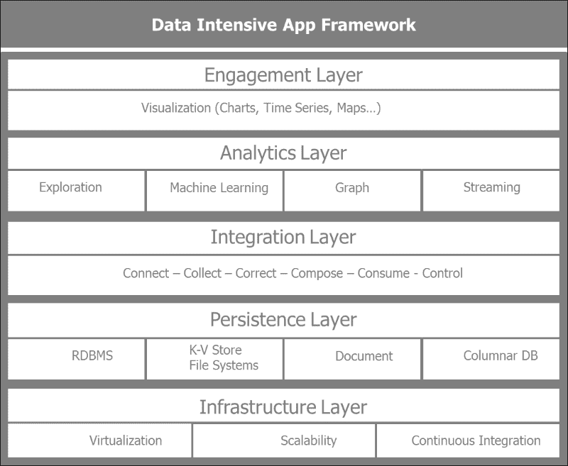

从下往上，让我们逐一了解各层及其主要用途。

## 基础设施层

基础设施层主要关注虚拟化、可扩展性和持续集成。在实践层面，在虚拟化方面，我们将通过在 VirtualBox 和由 Spark 和 Python 的 Anaconda 发行版提供的虚拟机上构建自己的开发环境来操作。如果我们希望从那里扩展，我们可以在云中创建一个类似的环境。创建隔离的开发环境并将其移动到测试和生产部署的实践可以自动化，并且可以成为由 DevOps 工具（如**Vagrant**、**Chef**、**Puppet**和**Docker**）驱动的持续集成周期的一部分。Docker 是一个非常流行的开源项目，它简化了新环境的安装和部署。本书将限于使用 VirtualBox 构建虚拟机。从数据密集型应用架构的角度来看，我们通过提及可扩展性和持续集成来描述基础设施层的必要步骤，而不仅仅是虚拟化。

## 持久层

持久层根据数据需求和形状管理各种存储库。它确保了多语言数据存储的设置和管理。它包括关系型数据库管理系统，如**MySQL**和**PostgreSQL**；键值数据存储，如**Hadoop**、**Riak**和**Redis**；列式数据库，如**HBase**和**Cassandra**；文档数据库，如**MongoDB**和**Couchbase**；以及图数据库，如**Neo4j**。持久层管理各种文件系统，如 Hadoop 的 HDFS。它与各种存储系统交互，从本地硬盘到 Amazon S3。它管理各种文件存储格式，如`csv`、`json`和`parquet`，这是一种列导向的格式。

## 集成层

集成层专注于数据获取、转换、质量、持久性、消费和治理。它本质上由以下五个 C 驱动：*连接*、*收集*、*纠正*、*组合*和*消费*。

这五个步骤描述了数据的生命周期。它们关注的是如何获取感兴趣的数据集，探索它，迭代地精炼和丰富收集到的信息，并使其准备好消费。因此，这些步骤执行以下操作：

+   **Connect**：针对从各种数据源获取数据的最佳方式，这些源提供的 API，输入格式，如果存在，输入模式，数据收集速率以及提供者的限制

+   **Correct**：专注于转换数据以进行进一步处理，并确保接收到的数据的质量和一致性得到保持

+   **Collect**：考虑将哪些数据存储在哪里以及以何种格式，以简化后续的数据组合和消费

+   **Compose**：专注于如何将收集到的各种数据集混合在一起，并丰富信息，以构建一个引人入胜的数据驱动产品

+   **消费**：负责数据提供和渲染，以及如何确保数据在正确的时间到达正确的个人。

+   **控制**：随着数据、组织和参与者的增长，这个第六个**附加**步骤迟早是必需的，它关乎确保数据治理

以下图描述了数据获取和精炼的迭代过程，以便消费：

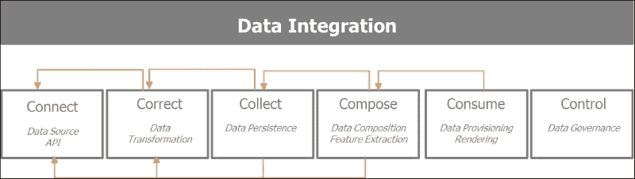

## 分析层

分析层是 Spark 使用各种模型、算法和机器学习管道处理数据以提取见解的地方。对于我们的目的，在本章中，分析层由 Spark 提供。我们将在后续章节中深入探讨 Spark 的优点。简而言之，使其如此强大的原因是它允许在单个统一平台上进行多种分析处理范式。它允许批量、流式和交互式分析。在大型数据集上进行的批量处理，具有较长的延迟期，使我们能够提取可以输入到流模式中实时事件中的模式和见解。交互式和迭代分析更适合数据探索。Spark 提供了 Python 和 R 的绑定和 API。通过其 **SparkSQL** 模块和 Spark DataFrame，它提供了一个非常熟悉的分析界面。

## 交互层

交互层与最终用户互动，并提供仪表板、交互式可视化和警报。我们将在此关注 PyData 生态系统提供的工具，如 Matplotlib、Seaborn 和 Bokeh。

# 理解 Spark

随着数据的增长，Hadoop 横向扩展。Hadoop 在通用硬件上运行，因此具有成本效益。通过可扩展的分布式处理框架，密集型数据应用得以实现，这些框架允许组织在大型通用集群上分析 PB 级数据。Hadoop 是第一个开源的 map-reduce 实现。Hadoop 依赖于名为 **HDFS**（**Hadoop 分布式文件系统**）的分布式存储框架。Hadoop 在批处理作业中运行 map-reduce 任务。Hadoop 需要在每个 map、shuffle 和 reduce 处理步骤中将数据持久化到磁盘。此类批处理作业的额外开销和延迟会严重影响性能。

Spark 是一个快速、分布式的一般分析计算引擎，用于大规模数据处理。Spark 从 Hadoop 中的主要突破在于它允许通过数据管道的内存处理在处理步骤之间共享数据。

Spark 的独特之处在于它允许四种不同的数据分析和处理风格。Spark 可以用于：

+   **批量**：此模式用于操作大型数据集，通常执行大型 map-reduce 作业

+   **流式**：此模式用于处理近乎实时的传入信息

+   **迭代**：此模式适用于梯度下降等机器学习算法，其中数据被重复访问以达到收敛。

+   **交互式**：此模式用于数据探索，因为大量数据在内存中，并且由于 Spark 的非常快速响应时间

下图突出了前面的四种处理风格：


Spark 运行在三种模式下：一种单机模式，在单个机器上独立运行，以及两种在机器集群上的分布式模式——在 Yarn 上，Hadoop 分布式资源管理器，或在 Mesos 上，与 Spark 同时由伯克利开发的开源集群管理器：

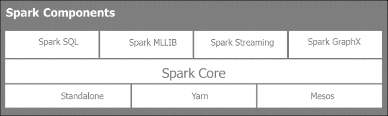

Spark 提供了 Scala、Java、Python 和 R 的多语言接口。

## Spark 库

Spark 附带了一些强大的库：

+   **SparkSQL**：这提供了类似于 SQL 的能力来查询结构化数据并交互式地探索大型数据集

+   **SparkMLLIB**：这提供了主要的算法和机器学习的管道框架

+   **Spark Streaming**：这是使用微批和滑动窗口对传入数据流进行近实时分析

+   **Spark GraphX**：这是用于复杂连接实体和关系的图处理和计算

### PySpark 实践

Spark 是用 Scala 编写的。整个 Spark 生态系统自然利用 JVM 环境，并利用 HDFS 的原生能力。Hadoop HDFS 是 Spark 支持的许多数据存储之一。Spark 是中立的，从一开始就与多个数据源、类型和格式交互。

PySpark 并不是在 Java 允许的 Python 方言（如 Jython）上对 Spark 的转录版本。PySpark 在 Spark 周围提供了集成的 API 绑定，并允许在集群的所有节点上使用 Python 生态系统，包括 pickle Python 序列化和，更重要的是，提供了对 Python 的机器学习库（如 Scikit-Learn）或数据处理（如 Pandas）的丰富生态系统访问。

当我们初始化一个 Spark 程序时，Spark 程序必须做的第一件事是创建一个`SparkContext`对象。它告诉 Spark 如何访问集群。Python 程序创建一个`PySparkContext`。Py4J 是绑定 Python 程序到 Spark JVM `SparkContext`的网关。JVM `SparkContextserializes`应用程序代码和闭包，并将它们发送到集群以执行。集群管理器分配资源并调度，并将闭包发送到集群中的 Spark 工作节点，根据需要激活 Python 虚拟机。在每个机器上，Spark Worker 由一个执行器管理，该执行器控制计算、存储和缓存。

以下是一个示例，说明 Spark 驱动程序如何管理 PySpark 上下文以及 Spark 上下文，包括其本地文件系统和它与 Spark 工作节点通过集群管理器的交互：

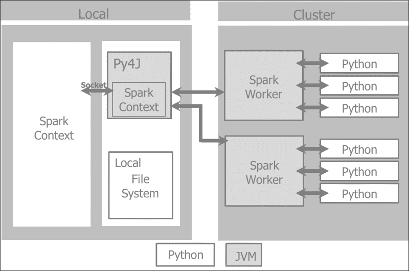

### 弹性分布式数据集

Spark 应用程序由一个运行用户主函数的驱动程序组成，在集群上创建分布式数据集，并对这些数据集执行各种并行操作（转换和操作）。

Spark 应用程序作为一个独立的进程集运行，由驱动程序中的 `SparkContext` 协调。

`SparkContext` 将从 **集群管理器** 分配系统资源（机器、内存、CPU）。

`SparkContext` 管理执行者，执行者管理集群中的工作者。驱动程序中有需要运行的 Spark 作业。这些作业被分割成任务提交给执行者以完成。执行者负责每台机器的计算、存储和缓存。

Spark 的关键构建块是 **RDD**（**弹性分布式数据集**）。数据集是一组元素的集合。分布式意味着数据集可以位于集群中的任何节点上。弹性意味着即使数据集可能丢失或部分丢失，也不会对正在进行的计算造成重大损害，因为 Spark 会从内存中的数据血缘重新计算，也称为 **DAG**（**有向无环图**）操作。基本上，Spark 会将 RDD 在缓存中的状态快照。如果在操作过程中计算机器崩溃，Spark 会从缓存的 RDD 和操作 DAG 重建 RDD。RDD 从节点故障中恢复。

RDD 上有两种类型的操作：

+   **转换**：转换操作从一个现有的 RDD 生成一个指向新转换 RDD 的指针。RDD 是不可变的。一旦创建，就不能更改。每个转换都会创建一个新的 RDD。转换是惰性评估的。转换仅在发生操作时执行。在失败的情况下，转换的数据血缘会重建 RDD。

+   **操作**：对 RDD 的操作会触发 Spark 作业并产生一个值。操作操作会导致 Spark 执行所需的（惰性）转换操作，以计算操作返回的 RDD。操作结果是一个操作 DAG。该 DAG 被编译成阶段，每个阶段作为一系列任务执行。任务是一个基本的工作单元。

这里有一些关于 RDD 的有用信息：

+   RDD 是从数据源（如 HDFS 文件或数据库查询）创建的。创建 RDD 有三种方式：

    +   从数据存储读取

    +   转换现有的 RDD

    +   使用内存中的集合

+   RDD 通过 `map` 或 `filter` 等函数进行转换，生成新的 RDD。

+   对 RDD 执行如 first、take、collect 或 count 等操作，会将结果传递到 Spark 驱动程序。Spark 驱动程序是用户通过它与 Spark 集群交互的客户端。

以下图表展示了 RDD 的转换和操作：

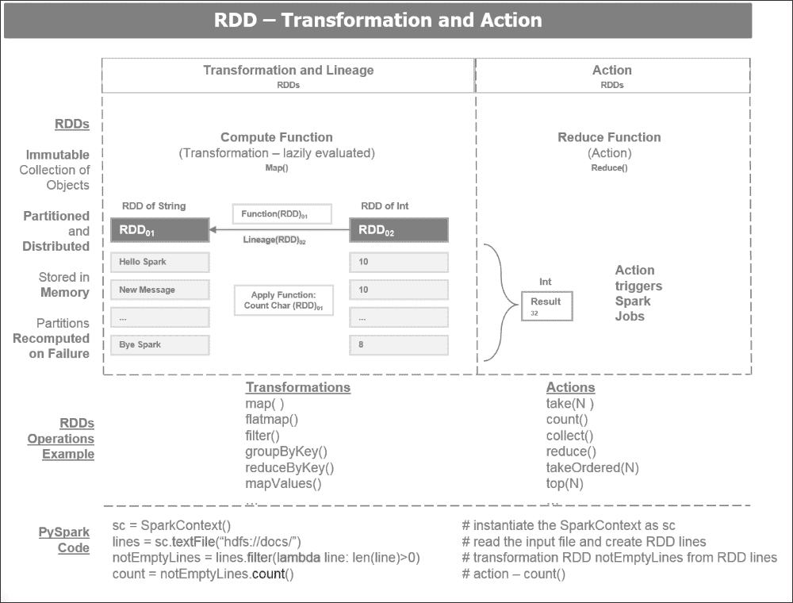

# 理解 Anaconda

Anaconda 是由**Continuum**维护的广泛使用的免费 Python 发行版（[`www.continuum.io/`](https://www.continuum.io/)）。我们将使用 Anaconda 提供的现有软件堆栈来生成我们的应用程序。在本书中，我们将使用 PySpark 和 PyData 生态系统。PyData 生态系统由**Continuum**推广、支持和维护，并由**Anaconda** Python 发行版提供动力。Anaconda Python 发行版在安装 Python 环境时节省了时间和麻烦；我们将与 Spark 一起使用它。Anaconda 自带电池，即一些最重要的包，如 Pandas、Scikit-Learn、Blaze、Matplotlib 和 Bokeh。升级任何已安装的库只需在控制台中输入一条简单的命令：

```py
$ conda update

```

可以使用以下命令获取环境中安装的库列表：

```py
$ conda list

```

该堆栈的关键组件如下：

+   **Anaconda**: 这是一个免费的 Python 发行版，包含近 200 个用于科学、数学、工程和数据分析的 Python 包。

+   **Conda**: 这是一个包管理器，负责管理安装复杂软件堆栈的所有依赖项。这不仅仅限于 Python，还管理 R 和其他语言的安装过程。

+   **Numba**: 这通过提供高性能函数和即时编译来加速 Python 中的代码。

+   **Blaze**: 这通过提供一个统一且可适应的接口来访问各种数据提供者，包括流式 Python、Pandas、SQLAlchemy 和 Spark，从而实现大规模数据分析。

+   **Bokeh**: 这为大型和流式数据集提供交互式数据可视化。

+   **Wakari**: 这允许我们在托管环境中共享和部署 IPython Notebooks 和其他应用程序。

下图显示了 Anaconda 堆栈的组件：

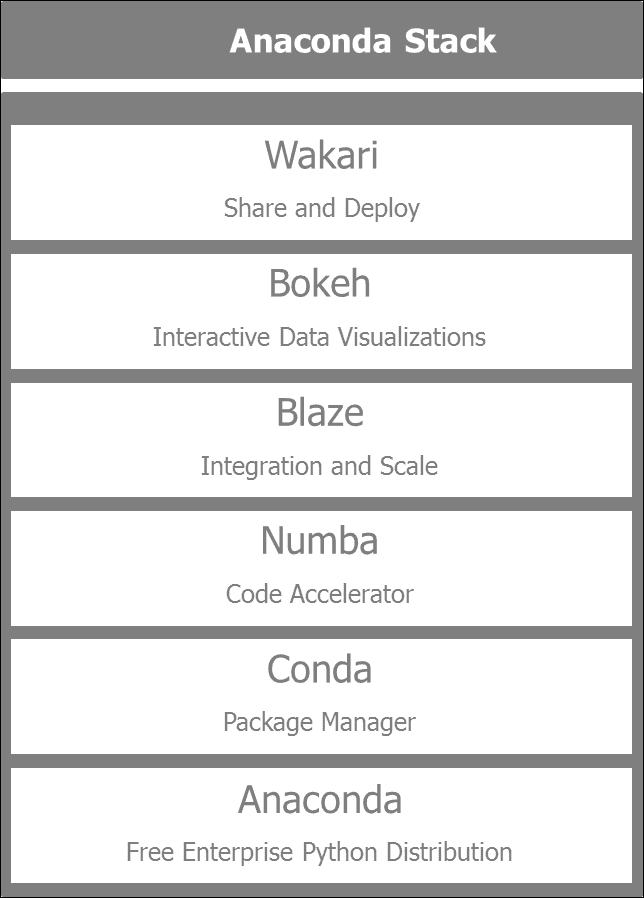

# 设置 Spark 驱动的环境

在本节中，我们将学习如何设置 Spark：

+   在运行 Ubuntu 14.04 的虚拟机上创建一个隔离的开发环境，这样它就不会干扰任何现有系统。

+   安装 Spark 1.3.0 及其依赖项，具体如下。

+   安装包含所有必需库（如 Pandas、Scikit-Learn、Blaze 和 Bokeh）的 Anaconda Python 2.7 环境，并启用 PySpark，以便可以通过 IPython Notebooks 访问。

+   设置我们环境的后端或数据存储。我们将使用 MySQL 作为关系数据库，MongoDB 作为文档存储，Cassandra 作为列式数据库。

每个存储后端根据要处理的数据的性质具有特定的用途。MySQL RDBMs 用于标准表格处理信息，这些信息可以使用 SQL 轻易查询。由于我们将处理来自各种 API 的大量 JSON 类型数据，最简单的方法是将它们存储在文档中。对于实时和时间序列相关的信息，Cassandra 作为列式数据库最为合适。

以下图表展示了我们将构建并全书使用的环境视图：

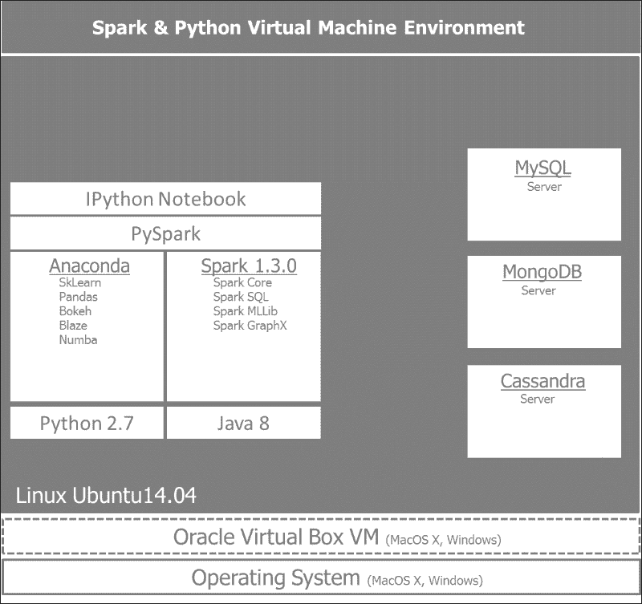

## 设置带有 Ubuntu 的 Oracle VirtualBox

在 Ubuntu 14.04 上设置一个干净的新的 VirtualBox 环境是创建一个不与现有库冲突的开发环境的最安全方式，并且可以使用类似命令列表在云中稍后复制。

为了设置一个包含 Anaconda 和 Spark 的环境，我们将创建一个运行 Ubuntu 14.04 的 VirtualBox 虚拟机。

让我们一步步通过使用 VirtualBox 与 Ubuntu 的步骤：

1.  Oracle VirtualBox VM 是免费的，可以从 [`www.virtualbox.org/wiki/Downloads`](https://www.virtualbox.org/wiki/Downloads) 下载。安装过程相当简单。

1.  安装 VirtualBox 后，让我们打开 Oracle VM VirtualBox 管理器并点击 **新建** 按钮。

1.  我们将为新的虚拟机命名，并选择类型 **Linux** 和版本 **Ubuntu (64 位)**。

1.  您需要从 Ubuntu 网站下载 ISO 文件，并分配足够的 RAM（建议 4 GB）和磁盘空间（建议 20 GB）。我们将使用 Ubuntu 14.04.1 LTS 版本，可以在以下链接找到：[`www.ubuntu.com/download/desktop`](http://www.ubuntu.com/download/desktop)。

1.  安装完成后，建议通过进入（从 VirtualBox 菜单，在新虚拟机运行时）**设备** | **插入 Guest Additions CD 图像**来安装 VirtualBox Guest Additions。在 Windows 主机中未能提供 Guest Additions 将导致一个非常有限的用户界面，窗口大小减小。

1.  一旦附加安装完成，重新启动虚拟机，它将准备好使用。通过选择虚拟机并点击 **设置**，然后转到 **常规** | **高级** | **共享剪贴板** 并点击 **双向**，启用共享剪贴板将很有帮助。

## 安装带有 Python 2.7 的 Anaconda

PySpark 目前仅在 Python 2.7 上运行。（社区有升级到 Python 3.3 的请求。）要安装 Anaconda，请按照以下步骤操作：

1.  从 [`continuum.io/downloads#all`](http://continuum.io/downloads#all) 下载 Linux 64 位 Python 2.7 的 Anaconda 安装程序。

1.  下载 Anaconda 安装程序后，打开终端并导航到保存安装程序文件的目录或文件夹。从这里，运行以下命令，将命令中的 `2.x.x` 替换为下载的安装程序文件的版本号：

    ```py
    # install anaconda 2.x.x
    bash Anaconda-2.x.x-Linux-x86[_64].sh

    ```

1.  接受许可条款后，您将被要求指定安装位置（默认为 `~/anaconda`）。

1.  自解压完成后，您应该将 anaconda 二进制目录添加到您的 PATH 环境变量中：

    ```py
    # add anaconda to PATH
    bash Anaconda-2.x.x-Linux-x86[_64].sh

    ```

## 安装 Java 8

Spark 运行在 JVM 上，需要 Java **SDK**（即 **软件开发工具包**）而不是 **JRE**（即 **Java 运行时环境**），因为我们将在 Spark 中构建应用程序。推荐版本是 Java 7 或更高版本。Java 8 是最合适的，因为它包括了 Scala 和 Python 中可用的许多函数式编程技术。

要安装 Java 8，请按照以下步骤操作：

1.  使用以下命令安装 Oracle Java 8：

    ```py
    # install oracle java 8
    $ sudo apt-get install software-properties-common
    $ sudo add-apt-repository ppa:webupd8team/java
    $ sudo apt-get update
    $ sudo apt-get install oracle-java8-installer

    ```

1.  设置 `JAVA_HOME` 环境变量并确保 Java 程序已添加到您的 PATH 中。

1.  检查 `JAVA_HOME` 是否已正确安装：

    ```py
    # 
    $ echo JAVA_HOME

    ```

## 安装 Spark

访问 Spark 下载页面 [`spark.apache.org/downloads.html`](http://spark.apache.org/downloads.html)。

Spark 下载页面提供了下载 Spark 早期版本和不同包类型及下载方式的可能性。我们将选择为 Hadoop 2.6 及更高版本预构建的最新版本。安装 Spark 最简单的方法是使用为 Hadoop 2.6 及更高版本预构建的 Spark 包，而不是从源代码构建。将文件移动到根目录下的 `~/spark` 目录。

下载 Spark 的最新版本——Spark 1.5.2，发布于 2015 年 11 月 9 日：

1.  选择 Spark 版本 **1.5.2 (Nov 09 2015)**，

1.  选择包类型 **为 Hadoop 2.6 及更高版本预构建**，

1.  选择下载类型 **直接下载**，

1.  下载 Spark：**spark-1.5.2-bin-hadoop2.6.tgz**，

1.  使用 1.3.0 签名和校验和验证此版本，

这也可以通过以下命令实现：

```py
# download spark
$ wget http://d3kbcqa49mib13.cloudfront.net/spark-1.5.2-bin-hadoop2.6.tgz

```

接下来，我们将提取文件并进行清理：

```py
# extract, clean up, move the unzipped files under the spark directory
$ tar -xf spark-1.5.2-bin-hadoop2.6.tgz
$ rm spark-1.5.2-bin-hadoop2.6.tgz
$ sudo mv spark-* spark

```

现在，我们可以使用以下命令运行 Spark Python 解释器：

```py
# run spark
$ cd ~/spark
./bin/pyspark

```

您应该看到类似以下内容：

```py
Welcome to
 ____              __
 / __/__  ___ _____/ /__
 _\ \/ _ \/ _ `/ __/  '_/
 /__ / .__/\_,_/_/ /_/\_\   version 1.5.2
 /_/
Using Python version 2.7.6 (default, Mar 22 2014 22:59:56)
SparkContext available as sc.
>>> 

```

解释器已经为我们提供了一个 Spark 上下文对象，`sc`，我们可以通过运行以下命令来查看：

```py
>>> print(sc)
<pyspark.context.SparkContext object at 0x7f34b61c4e50>

```

## 启用 IPython Notebook

我们将使用 IPython Notebook 进行工作，以获得比控制台更友好的用户体验。

您可以使用以下命令启动 IPython Notebook：

```py
$ IPYTHON_OPTS="notebook --pylab inline"  ./bin/pyspark

```

在 `examples/AN_Spark` 目录（其中存储了 Jupyter 或 IPython Notebooks）中启动 PySpark，使用 `IPYNB`：

```py
# cd to  /home/an/spark/spark-1.5.0-bin-hadoop2.6/examples/AN_Spark
# launch command using python 2.7 and the spark-csv package:
$ IPYTHON_OPTS='notebook' /home/an/spark/spark-1.5.0-bin-hadoop2.6/bin/pyspark --packages com.databricks:spark-csv_2.11:1.2.0

# launch command using python 3.4 and the spark-csv package:
$ IPYTHON_OPTS='notebook' PYSPARK_PYTHON=python3
 /home/an/spark/spark-1.5.0-bin-hadoop2.6/bin/pyspark --packages com.databricks:spark-csv_2.11:1.2.0

```

# 使用 PySpark 构建我们的第一个应用程序

我们现在可以检查一切是否运行正常。必要的单词计数将在处理本书第一章节的单词计数时进行测试。

我们将要运行的代码如下所示：

```py
# Word count on 1st Chapter of the Book using PySpark

# import regex module
import re
# import add from operator module
from operator import add

# read input file
file_in = sc.textFile('/home/an/Documents/A00_Documents/Spark4Py 20150315')

# count lines
print('number of lines in file: %s' % file_in.count())

# add up lengths of each line
chars = file_in.map(lambda s: len(s)).reduce(add)
print('number of characters in file: %s' % chars)

# Get words from the input file
words =file_in.flatMap(lambda line: re.split('\W+', line.lower().strip()))
# words of more than 3 characters
words = words.filter(lambda x: len(x) > 3)
# set count 1 per word
words = words.map(lambda w: (w,1))
# reduce phase - sum count all the words
words = words.reduceByKey(add)
```

在这个程序中，我们首先将文件从 `/home/an/Documents/A00_Documents/Spark4Py 20150315` 目录读取到 `file_in`。

然后，我们将通过计算每行的行数和每行的字符数来检查文件。

我们正在将输入文件拆分为单词并将它们转换为小写。为了我们的词频目的，我们选择长度超过三个字符的单词，以避免像*the*、*and*、*for*这样的短词，它们出现频率很高，可能会扭曲计数。通常，它们被认为是停用词，在任何语言处理任务中都应该被过滤掉。

在这个阶段，我们正在为 MapReduce 步骤做准备。对每个单词，我们映射一个值为`1`的值，并通过求和所有唯一单词来减少它。

这里是 IPython Notebook 中代码的说明。前 10 个单元正在对数据集上的词频进行预处理，该数据集是从本地文件目录检索到的。

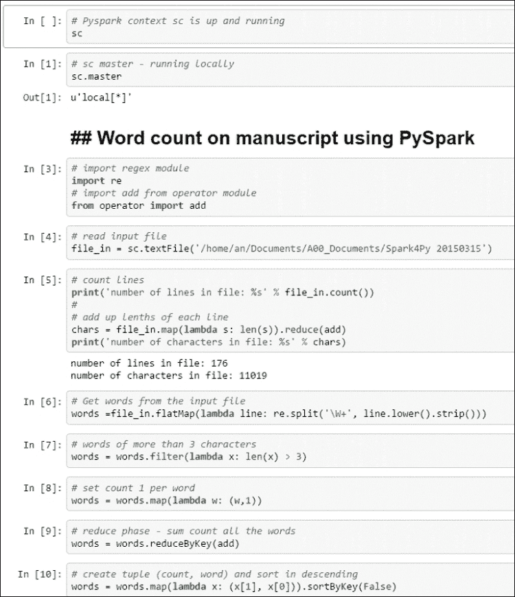

将格式为`(count, word)`的词频元组中的词频`count`进行交换，以便按`count`排序，现在是元组的键：

```py
# create tuple (count, word) and sort in descending
words = words.map(lambda x: (x[1], x[0])).sortByKey(False)

# take top 20 words by frequency
words.take(20)
```

为了显示我们的结果，我们创建元组`(count, word)`并按降序显示使用频率最高的前 20 个词：

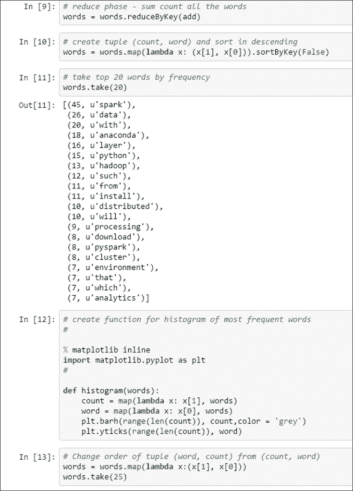

让我们创建一个直方图函数：

```py
# create function for histogram of most frequent words

% matplotlib inline
import matplotlib.pyplot as plt
#

def histogram(words):
    count = map(lambda x: x[1], words)
    word = map(lambda x: x[0], words)
    plt.barh(range(len(count)), count,color = 'grey')
    plt.yticks(range(len(count)), word)

# Change order of tuple (word, count) from (count, word) 
words = words.map(lambda x:(x[1], x[0]))
words.take(25)

# display histogram
histogram(words.take(25))
```

在这里，我们通过在条形图中绘制它们来可视化最常用的词。我们必须首先将原始元组`(count, word)`交换为`(word, count)`：

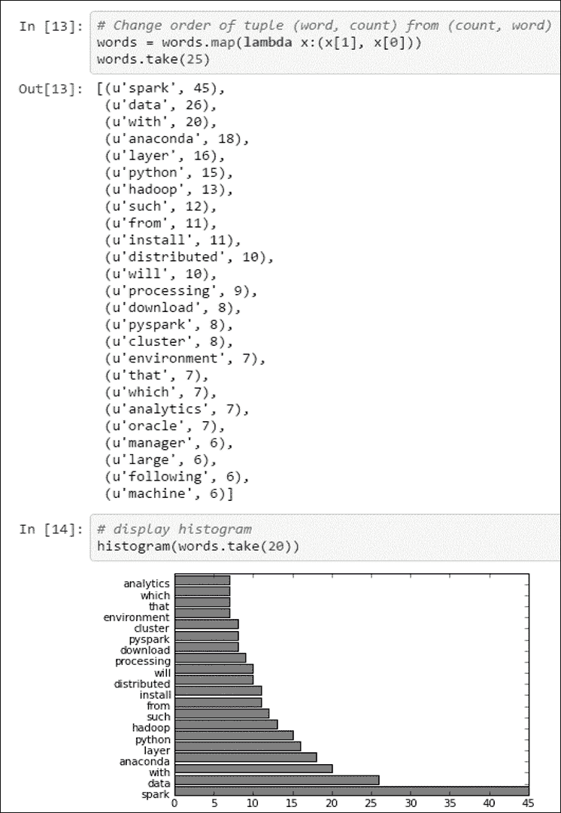

因此，这就是我们得到的结果：第一章中最常用的词是**Spark**，其次是**Data**和**Anaconda**。

# 使用 Vagrant 虚拟化环境

为了创建一个可移植的 Python 和 Spark 环境，该环境可以轻松共享和克隆，可以使用`vagrantfile`来构建开发环境。

我们将指向由*加州大学伯克利分校和 Databricks*提供的**大规模开放在线课程**（**MOOCs**）：

+   《使用 Apache Spark 的大数据入门，安东尼·D·约瑟夫教授》可以在[`www.edx.org/course/introduction-big-data-apache-spark-uc-berkeleyx-cs100-1x`](https://www.edx.org/course/introduction-big-data-apache-spark-uc-berkeleyx-cs100-1x)找到。

+   《可扩展机器学习，阿梅特·塔尔瓦尔克教授》可以在[`www.edx.org/course/scalable-machine-learning-uc-berkeleyx-cs190-1x`](https://www.edx.org/course/scalable-machine-learning-uc-berkeleyx-cs190-1x)找到。

课程实验是在由 PySpark 支持的 IPython Notebooks 上执行的。它们可以在以下 GitHub 仓库中找到：[`github.com/spark-mooc/mooc-setup/`](https://github.com/spark-mooc/mooc-setup/)。

一旦你在你的机器上设置了 Vagrant，请按照以下说明开始：[`docs.vagrantup.com/v2/getting-started/index.html`](https://docs.vagrantup.com/v2/getting-started/index.html)。

在你的工作目录中克隆`spark-mooc/mooc-setup/` GitHub 仓库，并在克隆的目录中运行命令`$ vagrant up`：

请注意，Spark 的版本可能已经过时，因为`vagrantfile`可能不是最新的。

你将看到类似以下的输出：

```py
C:\Programs\spark\edx1001\mooc-setup-master>vagrant up
Bringing machine 'sparkvm' up with 'virtualbox' provider...
==> sparkvm: Checking if box 'sparkmooc/base' is up to date...
==> sparkvm: Clearing any previously set forwarded ports...
==> sparkvm: Clearing any previously set network interfaces...
==> sparkvm: Preparing network interfaces based on configuration...
 sparkvm: Adapter 1: nat
==> sparkvm: Forwarding ports...
 sparkvm: 8001 => 8001 (adapter 1)
 sparkvm: 4040 => 4040 (adapter 1)
 sparkvm: 22 => 2222 (adapter 1)
==> sparkvm: Booting VM...
==> sparkvm: Waiting for machine to boot. This may take a few minutes...
 sparkvm: SSH address: 127.0.0.1:2222
 sparkvm: SSH username: vagrant
 sparkvm: SSH auth method: private key
 sparkvm: Warning: Connection timeout. Retrying...
 sparkvm: Warning: Remote connection disconnect. Retrying...
==> sparkvm: Machine booted and ready!
==> sparkvm: Checking for guest additions in VM...
==> sparkvm: Setting hostname...
==> sparkvm: Mounting shared folders...
 sparkvm: /vagrant => C:/Programs/spark/edx1001/mooc-setup-master
==> sparkvm: Machine already provisioned. Run `vagrant provision` or use the `--provision`
==> sparkvm: to force provisioning. Provisioners marked to run always will still run.

C:\Programs\spark\edx1001\mooc-setup-master>

```

这将在`localhost:8001`启动由 PySpark 支持的 IPython Notebooks：

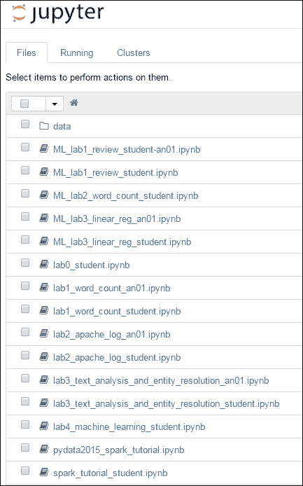

# 转移到云

由于我们处理的是分布式系统，运行在单个笔记本电脑上的虚拟机环境对于探索和学习是有限的。我们可以迁移到云以体验 Spark 分布式框架的强大功能和可扩展性。

## 在 Amazon Web Services 中部署应用

一旦我们准备好扩展我们的应用，我们可以将我们的开发环境迁移到**亚马逊** **Web Services**（**AWS**）。

如何在 EC2 上运行 Spark 在以下页面有详细描述：[`spark.apache.org/docs/latest/ec2-scripts.html`](https://spark.apache.org/docs/latest/ec2-scripts.html)。

我们强调设置 AWS Spark 环境时的五个关键步骤：

1.  通过 AWS 控制台创建 AWS EC2 密钥对 [`aws.amazon.com/console/`](http://aws.amazon.com/console/)。

1.  将你的密钥对导出到你的环境中：

    ```py
    export AWS_ACCESS_KEY_ID=accesskeyid
    export AWS_SECRET_ACCESS_KEY=secretaccesskey

    ```

1.  启动你的集群：

    ```py
    ~$ cd $SPARK_HOME/ec2
    ec2$ ./spark-ec2 -k <keypair> -i <key-file> -s <num-slaves> launch <cluster-name>

    ```

1.  通过 SSH 连接到集群以运行 Spark 作业：

    ```py
    ec2$ ./spark-ec2 -k <keypair> -i <key-file> login <cluster-name>

    ```

1.  使用完毕后销毁你的集群：

    ```py
    ec2$ ./spark-ec2 destroy <cluster-name>

    ```

## 使用 Docker 虚拟化环境

为了创建一个可轻松共享和克隆的便携式 Python 和 Spark 环境，开发环境可以在 Docker 容器中构建。

我们希望利用 Docker 的两个主要功能：

+   创建可以在不同的操作系统或云中轻松部署的独立容器。

+   使用 DockerHub 轻松共享开发环境镜像及其所有依赖项。DockerHub 类似于 GitHub，它允许轻松克隆和版本控制。配置环境的快照镜像可以作为进一步改进的基线。

以下图示展示了启用了 Docker 的环境，包括 Spark、Anaconda 和数据库服务器及其相应的数据卷。

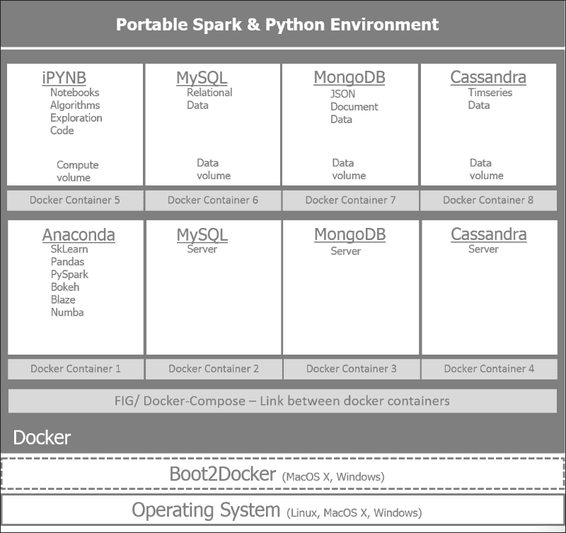

Docker 提供了从 Dockerfile 克隆和部署环境的能力。

你可以在以下地址找到包含 PySpark 和 Anaconda 设置的示例 Dockerfile：[`hub.docker.com/r/thisgokeboysef/pyspark-docker/~/dockerfile/`](https://hub.docker.com/r/thisgokeboysef/pyspark-docker/~/dockerfile/)。

按照以下链接提供的说明安装 Docker：

+   [`docs.docker.com/mac/started/`](http://docs.docker.com/mac/started/) 如果你在 Mac OS X 系统上

+   [`docs.docker.com/linux/started/`](http://docs.docker.com/linux/started/) 如果你在 Linux 系统上

+   [`docs.docker.com/windows/started/`](http://docs.docker.com/windows/started/) 如果你在 Windows 系统上

使用以下命令安装提供的 Dockerfile 中的 docker 容器：

```py
$ docker pull thisgokeboysef/pyspark-docker

```

其他关于如何*dockerize*你的环境的优秀信息来源可以在 Lab41 找到。GitHub 存储库包含必要的代码：

[`github.com/Lab41/ipython-spark-docker`](https://github.com/Lab41/ipython-spark-docker)

支持的博客文章中包含了构建 Docker 环境过程中涉及的思想过程的信息：[`lab41.github.io/blog/2015/04/13/ipython-on-spark-on-docker/`](http://lab41.github.io/blog/2015/04/13/ipython-on-spark-on-docker/).

# 摘要

我们通过描述围绕基础设施、持久化、集成、分析和参与层构建的整体架构来设定构建数据密集型应用程序的背景。我们还讨论了 Spark 和 Anaconda 及其相应的构建模块。我们在 VirtualBox 中设置了 Anaconda 和 Spark 的环境，并使用第一章的文本内容作为输入演示了一个词频统计应用程序。

在下一章中，我们将更深入地探讨数据密集型应用程序的架构蓝图，并利用 Twitter、GitHub 和 Meetup API 来感受我们将使用 Spark 进行挖掘的数据。
