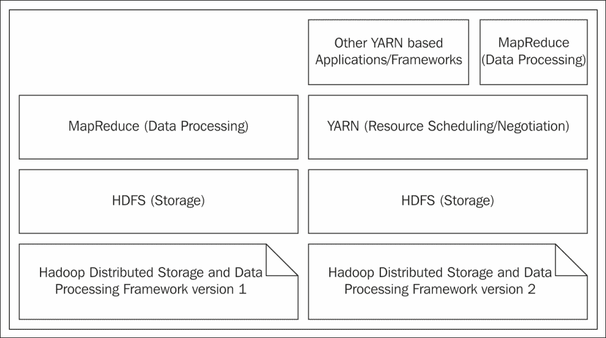
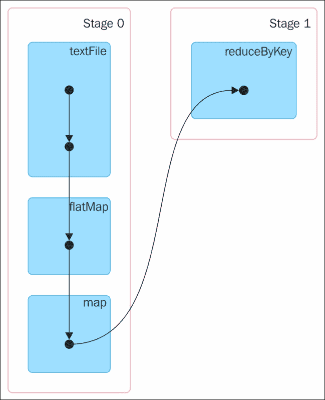
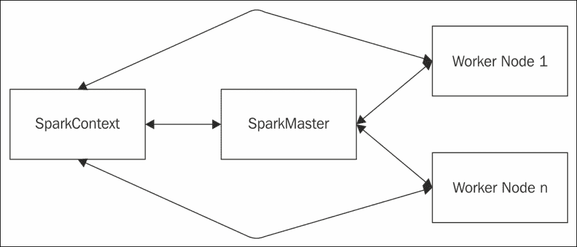
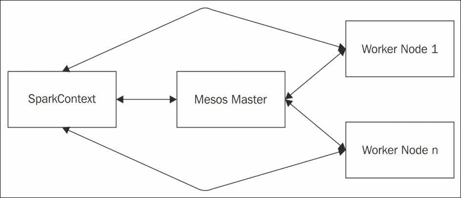
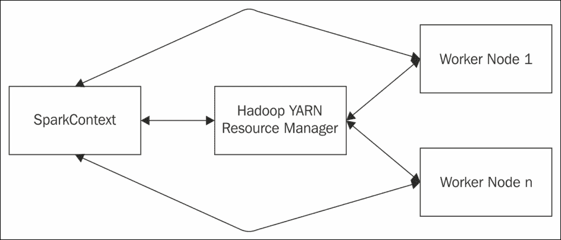
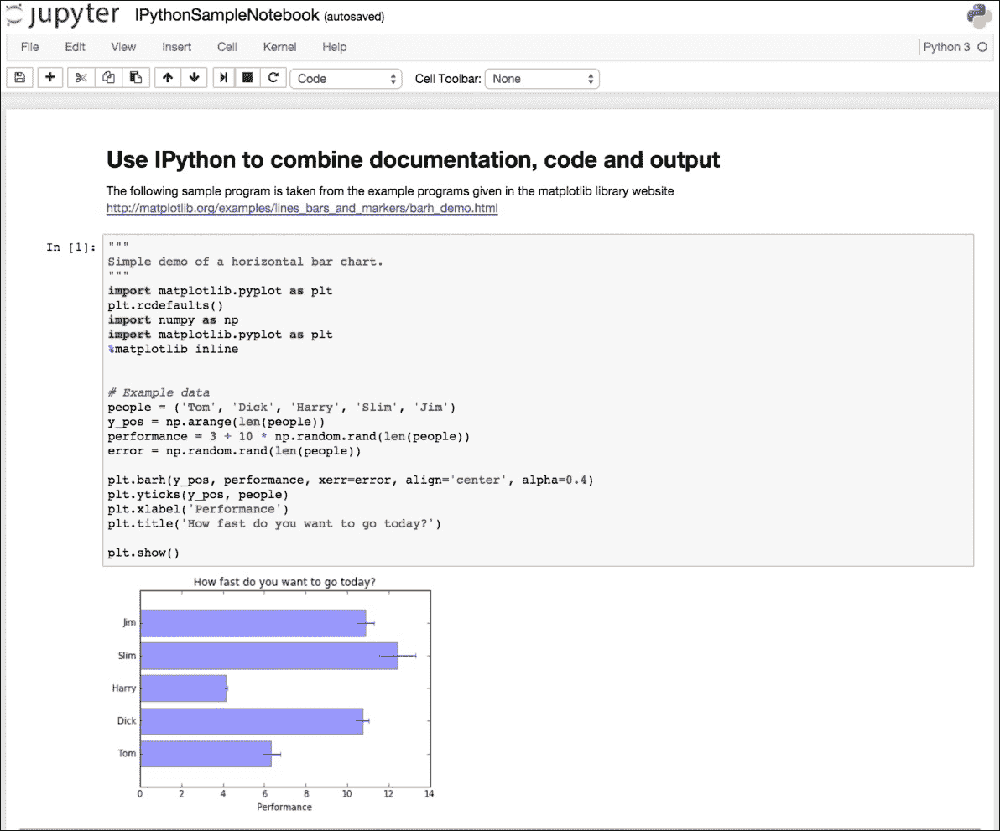
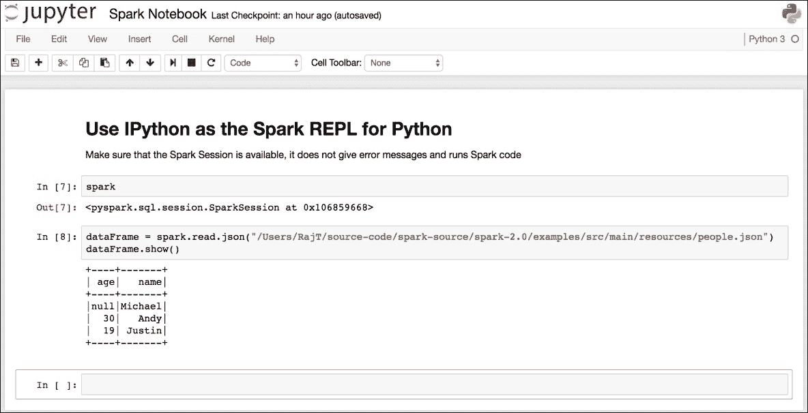
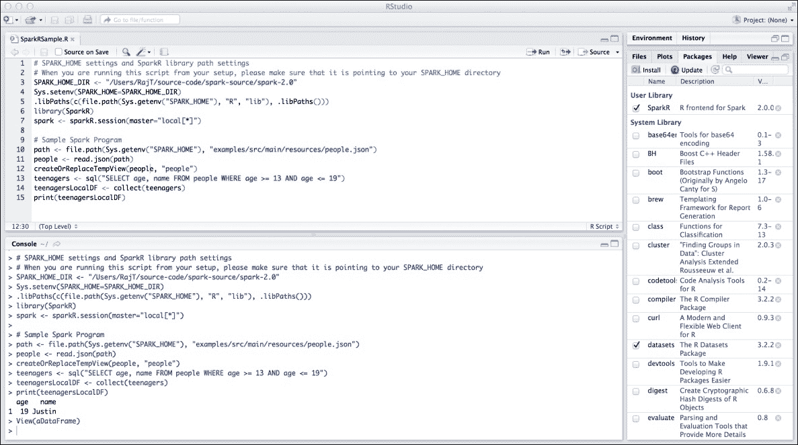

# 第一章：Spark 基础

数据是任何组织最重要的资产之一。在组织中收集和使用数据的规模正在超越想象。数据被摄入的速度、正在使用的不同数据类型的多样性，以及正在处理和存储的数据量都在每一刻打破历史记录。如今，即使在小型组织中，数据量也从千兆字节增长到太字节再到拍字节，这种情况非常普遍。同样，处理需求也在增长，需要具备处理静态数据和移动数据的能力。

任何组织的成功都取决于其领导者的决策，而为了做出明智的决策，你需要有良好的数据和数据处理所产生信息的支持。这给如何在及时且成本效益的方式下处理数据带来了巨大挑战，以便能够做出正确的决策。自从计算机的早期阶段以来，数据处理技术已经发展。无数的数据处理产品和框架进入市场，并在这些年中消失。大多数这些数据处理产品和框架在本质上不是通用的。大多数组织依赖他们自己的定制应用程序来满足他们的数据处理需求，以隔离的方式，或者与特定产品结合使用。

大规模互联网应用，通常称为**物联网**（**IoT**）应用，预示了处理大量以极快速度摄入的各种类型数据的开放框架的普遍需求。大型网站、媒体流应用以及组织的大量批量处理需求使这一需求更加相关。随着互联网的增长，开源社区也在显著增长，提供由知名软件公司支持的量产级软件。大量公司开始使用开源软件，并将它们部署到他们的生产环境中。

从技术角度来看，数据处理需求面临着巨大的挑战。数据量开始从单个机器溢出到由大量机器组成的集群。单个 CPU 的处理能力达到了顶峰，现代计算机开始将它们组合在一起以获得更多的处理能力，这被称为多核计算机。应用程序没有设计和开发来利用多核计算机中的所有处理器，浪费了典型现代计算机中可用的大量处理能力。

### 注意

在本书的整个过程中，术语*节点*、*主机*和*机器*指的是以独立模式或集群模式运行的计算机。

在这种背景下，一个理想的数据处理框架应该具备哪些品质？

+   它应该能够处理分布在计算机集群中的数据块

+   它应该能够以并行方式处理数据，以便将巨大的数据处理作业分成多个并行处理的任务，从而大大减少处理时间

+   它应该能够使用计算机中所有核心或处理器的处理能力

+   它应该能够使用集群中所有可用的计算机

+   它应该能够在通用硬件上运行

有两个开源数据处理框架值得提及，它们满足所有这些要求。第一个是 Apache Hadoop，第二个是 Apache Spark。

我们将在本章中介绍以下主题：

+   Apache Hadoop

+   Apache Spark

+   Spark 2.0 安装

# Apache Hadoop 概述

Apache Hadoop 是一个从头开始设计的开源软件框架，旨在在计算机集群上执行分布式数据存储，并对分布在计算机集群中的数据进行分布式数据处理。该框架包含一个用于数据存储的分布式文件系统，即**Hadoop 分布式文件系统**（**HDFS**），以及一个数据处理框架，即 MapReduce。HDFS 的创建灵感来源于谷歌的研究论文《The Google File System》，而 MapReduce 基于谷歌的研究论文《MapReduce: Simplified Data Processing on Large Clusters》。

通过实施大型 Hadoop 集群进行数据处理，Hadoop 被组织大规模采用。从 Hadoop MapReduce 版本 1（MRv1）到 Hadoop MapReduce 版本 2（MRv2），它经历了巨大的增长。从纯粹的数据处理角度来看，MRv1 由 HDFS 和 MapReduce 作为核心组件组成。许多应用程序，通常称为 Hadoop 上的 SQL 应用程序，如 Hive 和 Pig，堆叠在 MapReduce 框架之上。非常常见的是，尽管这些类型的应用程序是独立的 Apache 项目，但作为一个套件，许多这样的项目提供了巨大的价值。

**另一个资源协调器**（**YARN**）项目随着除 MapReduce 类型之外的计算框架在 Hadoop 生态系统中的应用而变得突出。在 YARN 引入到 HDFS 之上，并在组件架构分层视角中位于 MapReduce 之下，用户可以编写自己的应用程序，这些应用程序可以在 YARN 和 HDFS 上运行，以利用 Hadoop 生态系统的分布式数据存储和数据处理能力。换句话说，全新改版的 MapReduce 版本 2（MRv2）成为了一个位于 HDFS 和 YARN 之上的应用框架之一。

*图 1* 简要介绍了这些组件以及它们是如何堆叠在一起的：



图 1

MapReduce 是一个通用的数据处理模型。数据处理分为两个步骤，即*map*步骤和*reduce*步骤。在第一步中，输入数据被分成多个较小的部分，以便每个部分都可以独立处理。一旦*map*步骤完成，其输出将被整合，最终结果在*reduce*步骤中生成。在一个典型的词频统计示例中，将每个单词作为键，值为 1 的键值对创建是*map*步骤。根据键对这些对进行排序，对具有相同键的值的求和属于一个中间的*combine*步骤。生成包含唯一单词及其出现次数的对是*reduce*步骤。

从应用编程的角度来看，一个过度简化的 MapReduce 应用程序的基本要素如下：

+   输入位置

+   输出位置

+   实现数据处理所需的 Map 函数需要从`MapReduce`库的适当接口和类中

+   实现数据处理所需的 Reduce 函数需要从`MapReduce`库的适当接口和类中

将 MapReduce 作业提交到 Hadoop 中运行，一旦作业完成，可以从指定的输出位置获取输出。

将`MapReduce`数据处理作业分为*map*和*reduce*任务的这个两步过程非常有效，并且最终证明非常适合许多批处理数据处理用例。在整个过程中，在幕后发生了大量的输入/输出（I/O）操作。即使在 MapReduce 作业的中间步骤中，如果内部数据结构填充了数据或当任务完成超过一定百分比时，也会发生写入操作。正因为如此，MapReduce 作业的后续步骤必须从磁盘读取。

然后另一个最大的挑战出现在有多个 MapReduce 作业需要按顺序完成时。换句话说，如果一个大型的数据处理工作需要通过两个 MapReduce 作业来完成，使得第一个 MapReduce 作业的输出是第二个 MapReduce 作业的输入。在这种情况下，无论第一个 MapReduce 作业的输出大小如何，都必须将其写入磁盘，第二个 MapReduce 才能将其用作其输入。因此，在这种情况下，存在一个明确且*不必要的*写入操作。

在许多批处理数据处理的用例中，这些 I/O 操作并不是一个大问题。如果结果高度可靠，对于许多批处理数据处理的用例，延迟是可以容忍的。但最大的挑战出现在进行实时数据处理时。MapReduce 作业中涉及的巨大 I/O 操作使得它不适合具有最低延迟的实时数据处理。

# 理解 Apache Spark

Spark 是一个基于**Java 虚拟机**（**JVM**）的分布式数据处理引擎，它可以扩展，并且与其他许多数据处理框架相比，速度很快。Spark 起源于**加州大学伯克利分校**，后来成为 Apache 项目中的顶级项目之一。研究论文《Mesos：数据中心细粒度资源共享平台》讨论了 Spark 设计背后的哲学。该研究论文指出：

> *"为了测试简单专用框架提供价值的假设，我们确定了一类在 Hadoop 上被机器学习研究人员发现表现不佳的工作：迭代型工作，其中数据集在多次迭代中被重复使用。我们构建了一个针对这些工作负载优化的专用框架，称为 Spark。"*

Spark 关于速度的最大声明是它能够*"在内存中运行程序比 Hadoop MapReduce 快 100 倍，或在磁盘上快 10 倍"*. Spark 能够提出这个声明，因为它在工作节点的内存中进行处理，并防止与磁盘进行*不必要的*I/O 操作。Spark 提供的另一个优势是能够在应用程序编程级别链式连接任务，而无需写入磁盘或最小化写入磁盘的次数。

Spark 与 MapReduce 相比，在数据处理方面是如何变得如此高效的？它附带一个非常先进的**有向无环图**（**DAG**）数据处理引擎。这意味着对于每个 Spark 作业，都会创建一个 DAG 任务由引擎执行。在数学术语中，DAG 由一组顶点和连接它们的定向边组成。任务将按照 DAG 布局执行。在 MapReduce 的情况下，DAG 只包含两个顶点，一个顶点用于*map*任务，另一个顶点用于*reduce*任务。边从*map*顶点指向*reduce*顶点。内存中的数据处理加上其基于 DAG 的数据处理引擎使得 Spark 非常高效。在 Spark 的情况下，任务的 DAG 可以非常复杂。幸运的是，Spark 附带了一些工具，可以提供任何正在运行的 Spark 作业的 DAG 的优秀可视化。在一个词频计数示例中，Spark 的 Scala 代码将类似于以下代码片段。这个编程方面的细节将在接下来的章节中介绍：

```py
val textFile = sc.textFile("README.md") 
val wordCounts = textFile.flatMap(line => line.split(" ")).map(word => 
 (word, 1)).reduceByKey((a, b) => a + b) 
wordCounts.collect()

```

Spark 附带的一个 Web 应用程序能够监控工作节点和应用程序。前面 Spark 作业动态生成的 DAG（有向无环图）将看起来像*图 2*，如下所示：



图 2

Spark 编程范式非常强大，并公开了一个统一的编程模型，支持在多种编程语言中的应用程序开发。尽管不是所有支持的编程语言都具有功能等价性，Spark 支持使用 Scala、Java、Python 和 R 进行编程。除了用这些编程语言编写 Spark 应用程序之外，Spark 还有一个具有 **读取、评估、打印和循环**（**REPL**）功能的交互式 shell，适用于 Scala、Python 和 R 编程语言。目前，Spark 中没有对 Java 的 REPL 支持。Spark REPL 是一个非常通用的工具，可以用来以交互式方式尝试和测试 Spark 应用程序代码。Spark REPL 使原型设计、调试以及更多操作变得简单。

除了核心数据处理引擎之外，Spark 还附带了一组强大的特定领域库，这些库使用核心 Spark 库并提供各种功能，这些功能对各种大数据处理需求非常有用。以下表格列出了支持的库：

| **库** | **用途** | **支持的语言** |
| --- | --- | --- |
| Spark SQL | 允许在 Spark 应用程序中使用 SQL 语句或 DataFrame API | Scala, Java, Python 和 R |
| Spark Streaming | 允许处理实时数据流 | Scala, Java 和 Python |
| Spark MLlib | 允许开发机器学习应用程序 | Scala, Java, Python 和 R |
| Spark GraphX | 允许图处理并支持不断增长的图算法库 | Scala |

Spark 可以部署在各种平台上。Spark 在操作系统 **操作系统**（**OS**） Windows 和 UNIX（例如 Linux 和 Mac OS）上运行。Spark 可以在具有支持操作系统的单个节点上以独立模式部署。Spark 还可以在 Hadoop YARN 以及 Apache Mesos 的集群节点上部署。Spark 还可以部署在 Amazon EC2 云上。Spark 可以从各种数据存储中访问数据，其中一些最受欢迎的包括 HDFS、Apache Cassandra、Hbase、Hive 等。除了之前列出的数据存储之外，如果有一个驱动程序或连接器程序可用，Spark 可以从几乎任何数据源访问数据。

### 提示

本书中所使用的所有示例都是在 Mac OS X 版本 10.9.5 的计算机上开发、测试和运行的。对于所有其他平台（除了 Windows）都适用相同的说明。在 Windows 上，对应于所有 UNIX 命令，有一个具有 `.cmd` 扩展名的文件，并且必须使用它。例如，对于 UNIX 中的 `spark-shell`，Windows 中有一个 `spark-shell.cmd`。程序行为和结果应跨所有支持的操作系统保持一致。

在任何分布式应用程序中，通常会有一个控制执行的驱动程序程序，并且将有一个或多个工作节点。驱动程序程序将任务分配给适当的工作节点。即使 Spark 以独立模式运行，也是如此。在 Spark 应用程序的情况下，其**SparkContext**对象是驱动程序程序，它与适当的集群管理器通信以运行任务。Spark 核心库的一部分 Spark master、Mesos master 和 Hadoop YARN 资源管理器是 Spark 支持的集群管理器之一。在 Hadoop YARN 部署 Spark 的情况下，Spark 驱动程序程序在 Hadoop YARN 应用程序主进程中运行，或者 Spark 驱动程序程序作为 Hadoop YARN 的客户端运行。*图 3*描述了 Spark 的独立部署：



图 3

在 Spark 的 Mesos 部署模式下，集群管理器将是**Mesos Master**。*图 4*描述了 Spark 的 Mesos 部署：



图 4

在 Spark 的 Hadoop YARN 部署模式下，集群管理器将是 Hadoop 资源管理器，其地址将从 Hadoop 配置中获取。换句话说，在提交 Spark 作业时，不需要提供显式的 master URL，它将从 Hadoop 配置中获取集群管理器的详细信息。*图 5*描述了 Spark 的 Hadoop YARN 部署：



图 5

Spark 也可以在云中运行。在 Spark 部署到 Amazon EC2 的情况下，除了从常规支持的数据源访问数据外，Spark 还可以访问来自 Amazon 的在线数据存储服务 Amazon S3 的数据。

# 在您的机器上安装 Spark

Spark 支持使用 Scala、Java、Python 和 R 进行应用程序开发。在这本书中，使用了 Scala、Python 和 R。以下是选择这些语言作为本书示例原因的说明。Spark 交互式 shell 或 REPL 允许用户即时执行程序，就像在终端提示符下输入操作系统命令一样，并且它仅适用于 Scala、Python 和 R 语言。REPL 是在将代码组合到文件中并作为应用程序运行之前尝试和测试 Spark 代码的最佳方式。REPL 甚至可以帮助经验丰富的程序员尝试和测试代码，从而促进快速原型设计。因此，特别是对于初学者来说，使用 REPL 是开始使用 Spark 的最佳方式。

在安装 Spark 和用 Python 和 R 进行 Spark 编程之前，需要先安装 Python 和 R。

## Python 安装

访问 [`www.python.org`](https://www.python.org/) 下载并安装适用于您的计算机的 Python。安装完成后，请确保所需的二进制文件在操作系统搜索路径中，并且 Python 交互式 shell 能够正常启动。shell 应显示类似以下内容：

```py
$ python 
Python 3.5.0 (v3.5.0:374f501f4567, Sep 12 2015, 11:00:19)  
[GCC 4.2.1 (Apple Inc. build 5666) (dot 3)] on darwin 
Type "help", "copyright", "credits" or "license" for more information. 
>>> 

```

对于图表和绘图，正在使用`matplotlib`库。

### 注意

使用 Python 版本 3.5.0 作为首选的 Python 版本。尽管 Spark 支持使用 Python 2.7 进行编程，但作为前瞻性的实践，使用的是最新且最稳定的 Python 版本。此外，大多数重要的库也正在移植到 Python 3.x 版本。

访问 [`matplotlib.org`](http://matplotlib.org/) 下载并安装库。为确保库已正确安装并且图表和绘图能够正确显示，请访问 [`matplotlib.org/examples/index.html`](http://matplotlib.org/examples/index.html) 页面，获取一些示例代码，并检查您的计算机是否具备图表和绘图所需的全部资源和组件。在尝试运行这些图表和绘图示例时，如果在 Python 代码中导入库的上下文中出现缺少区域设置的错误，请在该用户的适当配置文件中设置以下环境变量以消除错误信息：

```py
export LC_ALL=en_US.UTF-8 
export LANG=en_US.UTF-8

```

## R 安装

访问 [`www.r-project.org`](https://www.r-project.org/) 下载并安装适用于您的计算机的 R。安装完成后，请确保所需的二进制文件在操作系统搜索路径中，并且 R 交互式 shell 能够正常启动。shell 应显示类似以下内容：

```py
$ r 
R version 3.2.2 (2015-08-14) -- "Fire Safety" 
Copyright (C) 2015 The R Foundation for Statistical Computing 
Platform: x86_64-apple-darwin13.4.0 (64-bit) 
R is free software and comes with ABSOLUTELY NO WARRANTY. 
You are welcome to redistribute it under certain conditions. 
Type 'license()' or 'licence()' for distribution details. 
  Natural language support but running in an English locale 
R is a collaborative project with many contributors. 
Type 'contributors()' for more information and 
'citation()' on how to cite R or R packages in publications. 
Type 'demo()' for some demos, 'help()' for on-line help, or 
'help.start()' for an HTML browser interface to help. 
Type 'q()' to quit R. 
[Previously saved workspace restored] 
>

```

### 注意

R 版本 3.2.2 是选择使用的 R 版本。

## Spark 安装

Spark 的安装可以通过多种不同的方式进行。Spark 安装最重要的先决条件是系统已安装 Java 1.8 JDK，并且`JAVA_HOME`环境变量设置为指向 Java 1.8 JDK 的安装目录。访问 [`spark.apache.org/downloads.html`](http://spark.apache.org/downloads.html) 了解、选择和下载适合您计算机的正确类型的安装。本书中给出的示例选择 Spark 版本 2.0.0。任何对从源代码构建和使用 Spark 感兴趣的人应访问：[`spark.apache.org/docs/latest/building-spark.html`](http://spark.apache.org/docs/latest/building-spark.html) 获取说明。默认情况下，从源代码构建 Spark 时，它不会构建 Spark 的 R 库。为此，必须构建 SparkR 库，并在从源代码构建 Spark 时包含适当的配置文件。以下命令显示了如何包含构建 SparkR 库所需的配置文件：

```py
$ mvn -DskipTests -Psparkr clean package

```

一旦 Spark 安装完成，请在适当的用户配置文件中定义以下环境变量：

```py
export SPARK_HOME=<the Spark installation directory> 
export PATH=$SPARK_HOME/bin:$PATH

```

如果系统中存在多个 Python 可执行版本，那么在以下环境变量设置中明确指定 Spark 使用的 Python 可执行版本会更好：

```py
export PYSPARK_PYTHON=/usr/bin/python

```

在`$SPARK_HOME/bin/pyspark`脚本中，有一段代码用于确定 Spark 使用的 Python 可执行版本：

```py
# Determine the Python executable to use if PYSPARK_PYTHON or PYSPARK_DRIVER_PYTHON isn't set: 
if hash python2.7 2>/dev/null; then 
  # Attempt to use Python 2.7, if installed: 
  DEFAULT_PYTHON="python2.7" 
else 
  DEFAULT_PYTHON="python" 
fi

```

因此，始终明确设置 Spark 的 Python 可执行版本会更好，即使系统中只有一种 Python 版本。这是一种预防措施，以防将来安装了额外的 Python 版本时出现意外行为。

一旦完成所有前面的步骤，请确保 Scala、Python 和 R 的所有 Spark 外壳都能正常工作。在操作系统终端提示符下运行以下命令，并确保没有错误，并且显示的内容类似于以下内容。以下命令集用于启动 Spark 的 Scala REPL：

```py
$ cd $SPARK_HOME 
$ ./bin/spark-shellUsing Spark's default log4j profile: org/apache/spark/log4j-defaults.properties 
Setting default log level to "WARN". 
To adjust logging level use sc.setLogLevel(newLevel). 
16/06/28 20:53:48 WARN NativeCodeLoader: Unable to load native-hadoop library for your platform... using builtin-java classes where applicable 
16/06/28 20:53:49 WARN SparkContext: Use an existing SparkContext, some configuration may not take effect. 
Spark context Web UI available at http://192.168.1.6:4040 
Spark context available as 'sc' (master = local[*], app id = local-1467143629623). 
Spark session available as 'spark'. 
Welcome to 
      ____              __ 
     / __/__  ___ _____/ /__ 
    _\ \/ _ \/ _ `/ __/  '_/ 
   /___/ .__/\_,_/_/ /_/\_\   version 2.0.1 
      /_/ 

Using Scala version 2.11.8 (Java HotSpot(TM) 64-Bit Server VM, Java 1.8.0_66) 
Type in expressions to have them evaluated. 
Type :help for more information. 
scala> 
scala>exit 

```

在前面的显示中，请核实 JDK 版本、Scala 版本和 Spark 版本是否与 Spark 安装的计算机中的设置一致。需要验证的最重要的一点是不要显示任何错误信息。

以下命令集用于启动 Spark 的 Python REPL：

```py
$ cd $SPARK_HOME 
$ ./bin/pyspark 
Python 3.5.0 (v3.5.0:374f501f4567, Sep 12 2015, 11:00:19)  
[GCC 4.2.1 (Apple Inc. build 5666) (dot 3)] on darwin 
Type "help", "copyright", "credits" or "license" for more information. 
Using Spark's default log4j profile: org/apache/spark/log4j-defaults.properties 
Setting default log level to "WARN". 
To adjust logging level use sc.setLogLevel(newLevel). 
16/06/28 20:58:04 WARN NativeCodeLoader: Unable to load native-hadoop library for your platform... using builtin-java classes where applicable 
Welcome to 
      ____              __ 
     / __/__  ___ _____/ /__ 
    _\ \/ _ \/ _ `/ __/  '_/ 
   /__ / .__/\_,_/_/ /_/\_\   version 2.0.1 
      /_/ 

Using Python version 3.5.0 (v3.5.0:374f501f4567, Sep 12 2015 11:00:19) 
SparkSession available as 'spark'. 
>>>exit() 

```

在前面的显示中，请核实 Python 版本和 Spark 版本是否与 Spark 安装的计算机中的设置一致。需要验证的最重要的一点是不要显示任何错误信息。

以下命令集用于启动 Spark 的 R REPL：

```py
$ cd $SPARK_HOME 
$ ./bin/sparkR 
R version 3.2.2 (2015-08-14) -- "Fire Safety" 
Copyright (C) 2015 The R Foundation for Statistical Computing 
Platform: x86_64-apple-darwin13.4.0 (64-bit) 

R is free software and comes with ABSOLUTELY NO WARRANTY. 
You are welcome to redistribute it under certain conditions. 
Type 'license()' or 'licence()' for distribution details. 

  Natural language support but running in an English locale 

R is a collaborative project with many contributors. 
Type 'contributors()' for more information and 
'citation()' on how to cite R or R packages in publications. 

Type 'demo()' for some demos, 'help()' for on-line help, or 
'help.start()' for an HTML browser interface to help. 
Type 'q()' to quit R. 

[Previously saved workspace restored] 

Launching java with spark-submit command /Users/RajT/source-code/spark-source/spark-2.0/bin/spark-submit   "sparkr-shell" /var/folders/nf/trtmyt9534z03kq8p8zgbnxh0000gn/T//RtmphPJkkF/backend_port59418b49bb6  
Using Spark's default log4j profile: org/apache/spark/log4j-defaults.properties 
Setting default log level to "WARN". 
To adjust logging level use sc.setLogLevel(newLevel). 
16/06/28 21:00:35 WARN NativeCodeLoader: Unable to load native-hadoop library for your platform... using builtin-java classes where applicable 

 Welcome to 
    ____              __  
   / __/__  ___ _____/ /__  
  _\ \/ _ \/ _ `/ __/  '_/  
 /___/ .__/\_,_/_/ /_/\_\   version  2.0.1 
    /_/  

 Spark context is available as sc, SQL context is available as sqlContext 
During startup - Warning messages: 
1: 'SparkR::sparkR.init' is deprecated. 
Use 'sparkR.session' instead. 
See help("Deprecated")  
2: 'SparkR::sparkRSQL.init' is deprecated. 
Use 'sparkR.session' instead. 
See help("Deprecated")  
>q() 

```

在前面的显示中，请核实 R 版本和 Spark 版本是否与 Spark 安装的计算机中的设置一致。需要验证的最重要的一点是不要显示任何错误信息。

如果 Scala、Python 和 R 的所有 REPL 都工作正常，那么几乎可以肯定 Spark 安装是好的。作为最后的测试，运行一些 Spark 附带的一些示例程序，并确保它们给出的结果接近以下命令显示的结果，并且在控制台没有抛出任何错误信息。当运行这些示例程序时，除了命令下面的输出外，控制台还会显示很多其他信息。为了专注于结果，这些信息被省略了：

```py
$ cd $SPARK_HOME 
$ ./bin/run-example SparkPi 
Pi is roughly 3.1484 
$ ./bin/spark-submit examples/src/main/python/pi.py 
Pi is roughly 3.138680 
$ ./bin/spark-submit examples/src/main/r/dataframe.R 
root 
 |-- name: string (nullable = true) 
 |-- age: double (nullable = true) 
root 
 |-- age: long (nullable = true) 
 |-- name: string (nullable = true) 
    name 
1 Justin 

```

## 开发工具安装

本书将要讨论的大多数代码都可以在适当的 REPL 中进行尝试和测试。但是，没有一些基本的构建工具，就无法进行适当的 Spark 应用程序开发。作为最低限度的要求，在 Scala 中开发和构建 Spark 应用程序时，**Scala 构建工具**（**sbt**）是必需的。请访问[`www.scala-sbt.org`](http://www.scala-sbt.org/)下载和安装 sbt。

Maven 是构建 Java 应用程序的首选构建工具。本书不讨论 Java 中的 Spark 应用程序开发，但最好也在系统中安装 Maven。如果要从源代码构建 Spark，Maven 将非常有用。请访问[`maven.apache.org`](https://maven.apache.org/)下载和安装 Maven。

对于 Scala 和 Java，都有许多可用的**集成开发环境**（**IDEs**）。这是一个个人选择的问题，开发者可以根据他/她正在开发的 Spark 应用程序的语言选择他/她喜欢的工具。

## 可选软件安装

Scala 的 Spark REPL 是一个很好的起点，用于原型设计和测试一些小的代码片段。但是，当需要用 Scala 开发、构建和打包 Spark 应用程序时，拥有基于 sbt 的 Scala 项目和使用支持的 IDE（包括但不限于 Eclipse 或 IntelliJ IDEA）进行开发是很好的。请访问相应的网站下载和安装 Scala 首选的 IDE。

笔记本风格的应用程序开发工具在数据分析师和研究人员中非常普遍。这类似于实验室笔记本。在一个典型的实验室笔记本中，会有实验的说明、详细描述和遵循的步骤。然后进行实验。一旦实验完成，笔记本中就会记录结果。如果将这些结构组合在一起，并适应软件程序的环境，并以实验室笔记本的格式进行建模，那么将会有文档、代码、输入以及运行代码生成的输出。这将产生非常好的效果，尤其是如果程序生成大量的图表和绘图。

### 小贴士

对于那些不熟悉笔记本风格的应用程序开发 IDE 的用户来说，有一篇非常棒的名为《交互式笔记本：共享代码》的文章，可以在[`www.nature.com/news/interactive-notebooks-sharing-the-code-1.16261`](http://www.nature.com/news/interactive-notebooks-sharing-the-code-1.16261)上阅读。在以下部分中，我们将描述作为 Python 可选软件开发 IDE 的 IPython 笔记本。安装后，在开始严肃的开发之前，先熟悉一下这个工具。

### IPython

在 Python 进行 Spark 应用程序开发的情况下，IPython 提供了一个优秀的笔记本式开发工具，这是一个用于 Jupyter 的 Python 语言内核。Spark 可以与 IPython 集成，因此当调用 Python 的 Spark REPL 时，它将启动 IPython 笔记本。然后，创建一个笔记本并开始像在 Spark REPL 中给出命令一样在笔记本中编写代码。访问 [`ipython.org`](http://ipython.org/) 下载并安装 IPython 笔记本。安装完成后，调用 IPython 笔记本界面并确保一些示例 Python 代码运行良好。从存储笔记本的目录或笔记本将要存储的目录调用命令。在这里，IPython 笔记本是从临时目录启动的。当调用以下命令时，它将打开网络界面，并从那里通过点击下拉菜单中的“新建”并选择适当的 Python 版本来创建一个新的笔记本。

以下截图显示了如何在 IPython 笔记本中将 Markdown 风格的文档、Python 程序和生成的输出组合在一起：

```py
$ cd /Users/RajT/temp 
$ ipython notebook 

```



图 6

*图 6* 展示了如何使用 IPython 笔记本来编写简单的 Python 程序。IPython 笔记本可以被配置为 Spark 的首选外壳，当调用 Python 的 Spark REPL 时，它将启动 IPython 笔记本，并可以使用 IPython 笔记本来进行 Spark 应用程序的开发。为了实现这一点，需要在适当的用户配置文件中定义以下环境变量：

```py
export PYSPARK_DRIVER_PYTHON=ipython 
export PYSPARK_DRIVER_PYTHON_OPTS='notebook' 

```

现在，不再从命令提示符调用 IPython 笔记本，而是调用 Python 的 Spark REPL。就像之前所做的那样，创建一个新的 IPython 笔记本并开始用 Python 编写 Spark 代码：

```py
$ cd /Users/RajT/temp 
$ pyspark 

```

查看以下截图：



图 7

### 小贴士

在任何语言的标准 Spark REPL 中，可以使用相对路径引用位于本地文件系统中的文件。当使用 IPython 笔记本时，本地文件需要使用它们的完整路径来引用。

### RStudio

在 R 用户社区中，首选的 R IDE 是 RStudio。RStudio 也可以用来开发 R 语言的 Spark 应用程序。访问 [`www.rstudio.com`](https://www.rstudio.com/) 下载并安装 RStudio。安装完成后，在运行任何 Spark R 代码之前，必须包含 `SparkR` 库并设置一些变量以确保 Spark R 程序在 RStudio 中顺利运行。以下代码片段实现了这一点：

```py
SPARK_HOME_DIR <- "/Users/RajT/source-code/spark-source/spark-2.0" 
Sys.setenv(SPARK_HOME=SPARK_HOME_DIR) 
.libPaths(c(file.path(Sys.getenv("SPARK_HOME"), "R", "lib"), .libPaths())) 
library(SparkR) 
spark <- sparkR.session(master="local[*]")

```

在前面的 R 代码中，将 `SPARK_HOME_DIR` 变量定义更改为指向 Spark 安装的目录。*图 8* 展示了从 RStudio 运行 Spark R 代码的示例运行情况：



图 8

一旦安装、配置了所有必要的软件，并且它们按照之前给出的详细信息正常工作，就可以为使用 Scala、Python 和 R 进行 Spark 应用程序开发做好准备。

### 小贴士

Jupyter 笔记本通过为各种语言定制内核实现策略来支持多种语言。对于 Jupyter 有一个本地的 R 内核，即 IRkernel，它可以作为一个 R 包安装。

### Apache Zeppelin

Apache Zeppelin 是另一个目前正处于孵化阶段的具有潜力的项目。它是一个基于 Web 的笔记本，类似于 Jupyter，但通过其解释器策略支持多种语言、shell 和技术，从而实现 Spark 应用程序的本能开发。目前它还处于起步阶段，但它有很大的潜力成为最好的基于笔记本的应用程序开发平台之一。Zeppelin 使用笔记本中编写的程序生成数据，具有非常强大的内置图表和绘图功能。

气球（Zeppelin）是通过其解释器框架构建的，具有高度的可扩展性，能够插入多种类型的解释器。最终用户，就像任何其他基于笔记本的系统一样，在笔记本界面中输入各种命令。这些命令将由某些解释器处理以生成输出。与许多其他笔记本式系统不同，Zeppelin 自带支持大量解释器或后端，例如 Spark、Spark SQL、Shell、Markdown 等。在前端方面，它同样采用可插拔架构，即**氦框架**。后端生成数据由前端组件，如 Angular JS，进行展示。有多种选项可以以表格格式、由解释器生成的原始格式、图表和图形等形式展示数据。由于后端、前端和可插拔各种组件等关注点的架构分离，选择适合特定任务的异构组件是一种很好的方法。同时，它很好地集成了各种组件，提供了一个和谐且用户友好的数据处理生态系统。尽管 Zeppelin 具有各种组件的可插拔架构能力，但其可视化功能有限。换句话说，在 Zeppelin 中，开箱即用的图表和绘图选项只有少数。一旦笔记本运行良好并产生预期的结果，通常情况下，笔记本会被与他人共享，为此，笔记本需要被持久化。在这方面，Zeppelin 再次表现出其高度灵活的笔记本存储系统。笔记本可以被持久化到文件系统、Amazon S3 或 Git，如果需要，还可以添加其他存储目标。

**平台即服务**（**PaaS**）在过去几年中随着云作为应用开发和部署平台的大量创新而不断发展。对于软件开发者来说，通过云提供了许多 PaaS 平台，这消除了他们需要拥有自己的应用开发栈的需求。Databricks 引入了一个基于云的大数据平台，用户可以通过基于笔记本的 Spark 应用开发界面访问该平台，同时结合微集群基础设施，Spark 应用可以提交到该基础设施。还有一个社区版，满足更广泛的开发社区的需求。这个 PaaS 平台最大的优势是它是一个基于浏览器的界面，用户可以在多个版本的 Spark 和不同类型的集群上运行他们的代码。

# 参考文献

如需更多信息，请参阅以下链接：

+   [`static.googleusercontent.com/media/research.google.com/en//archive/gfs-sosp2003.pdf`](http://static.googleusercontent.com/media/research.google.com/en//archive/gfs-sosp2003.pdf)

+   [`static.googleusercontent.com/media/research.google.com/en//archive/mapreduce-osdi04.pdf`](http://static.googleusercontent.com/media/research.google.com/en//archive/mapreduce-osdi04.pdf)

+   [`www.cs.berkeley.edu/~alig/papers/mesos.pdf`](https://www.cs.berkeley.edu/~alig/papers/mesos.pdf)

+   [`spark.apache.org/`](http://spark.apache.org/)

+   [`jupyter.org/`](https://jupyter.org/)

+   [`github.com/IRkernel/IRkernel`](https://github.com/IRkernel/IRkernel)

+   [`zeppelin.incubator.apache.org/`](https://zeppelin.incubator.apache.org/)

+   [`community.cloud.databricks.com/`](https://community.cloud.databricks.com/)

# 摘要

Spark 是一个非常强大的数据处理平台，支持统一的编程模型。它支持使用 Scala、Java、Python 和 R 进行应用程序开发，提供一系列高度互操作的库，用于满足各种类型的数据处理需求，以及大量利用 Spark 生态系统并覆盖各种其他数据处理用例的第三方库。本章简要介绍了 Spark 以及为 Spark 应用开发设置的开发环境，这些内容将在本书后续章节中介绍。

下一章将讨论 Spark 编程模型、基本抽象和术语、Spark 转换和 Spark 动作，并结合实际应用案例。
