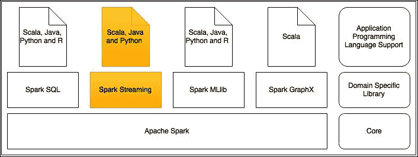
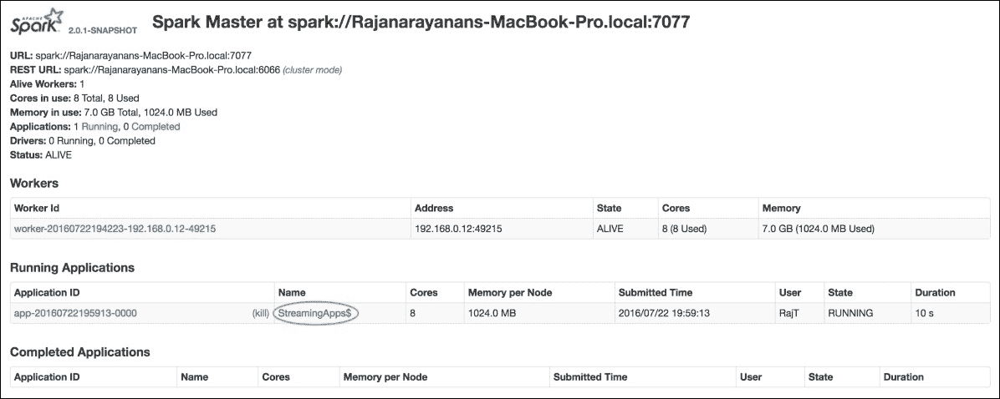
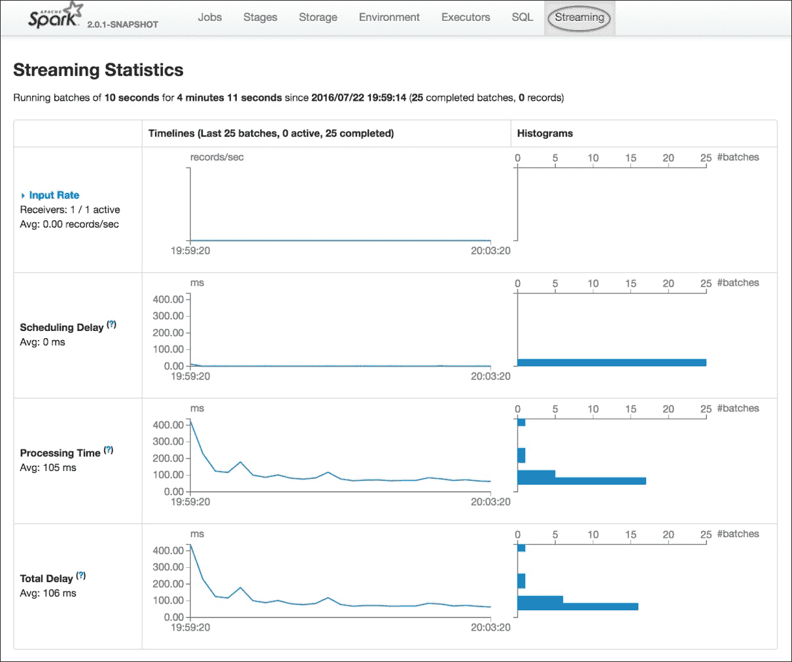
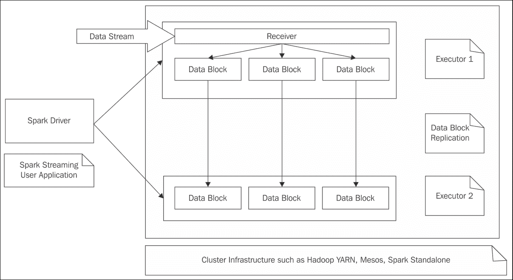

# 第六章  Spark 流处理

数据处理用例可以主要分为两种类型。第一种类型是数据静态，处理作为一个工作单元整体完成，或者将其分成更小的批次。在数据处理过程中，基础数据集不会改变，也不会有新的数据集添加到处理单元中。这是批处理。

第二种类型是数据像流一样生成，并且数据处理是在数据生成时进行的。这是流处理。在这本书的前几章中，所有的数据处理用例都属于前一种类型。本章将重点关注后一种。

本章将涵盖以下主题：

+   数据流处理

+   微批数据处理

+   日志事件处理器

+   窗口数据处理和其他选项

+   Kafka 流处理

+   使用 Spark 的流式作业

# 数据流处理

数据源生成数据就像流一样，许多现实世界的用例需要它们实时处理。*实时*的含义可能因用例而异。定义特定用例中*实时*含义的主要参数是，摄入的数据或自上次间隔以来所有摄入数据的频繁间隔需要多快被处理。例如，当重大体育赛事正在进行时，消耗比分事件并将它们发送给订阅用户的程序应该尽可能快地处理数据。发送得越快，越好。

但这里的*快*是什么意思？在比分事件发生后，比如说一个小时之内处理比分数据可以吗？可能不行。在比分事件发生后一分钟内处理数据可以吗？这肯定比一个小时后处理要好。在比分事件发生后一秒内处理数据可以吗？可能可以，并且比之前的数据处理时间间隔要好得多。

在任何数据流处理用例中，这个时间间隔非常重要。数据处理框架应该具备在选择的适当时间间隔内处理数据流的能力，以提供良好的商业价值。

当在选择的常规时间间隔内处理流数据时，数据是从时间间隔的开始收集到结束，分组在一个微批中，然后对这个数据批次进行处理。在较长一段时间内，数据处理应用程序会处理许多这样的微批数据。在这种处理类型中，数据处理应用程序只能看到在特定时间点正在处理的具体微批数据。换句话说，应用程序将没有任何可见性或访问权来查看已经处理过的微批数据。

现在，这种处理类型又增加了一个维度。假设一个特定的用例要求每分钟处理数据，但同时，在处理给定微批量的数据时，还需要查看在最后 15 分钟内已经处理过的数据。零售银行交易处理应用程序的欺诈检测模块是满足这种特定业务需求的良好例子。毫无疑问，零售银行交易应在发生后的毫秒内进行处理。在处理 ATM 现金取款交易时，查看是否有人试图连续取款是一个好主意，如果发现这种情况，应发送适当的警报。为此，在处理特定的现金取款交易时，应用程序会检查在最后 15 分钟内是否还有使用相同卡片从同一 ATM 取款的现金取款。业务规则是在最后 15 分钟内有超过两次此类交易时发送警报。在这种情况下，欺诈检测应用程序应该能够看到在 15 分钟窗口内发生的所有交易。

一个好的流数据处理框架应该能够处理任何给定时间间隔内的数据，以及能够查看在滑动时间窗口内摄取的数据。在 Spark 上工作的 Spark Streaming 库是具有这两种能力的最佳数据流处理框架之一。

再次查看 *图 1* 中给出的 Spark 库堆栈的更大图景，以设置上下文并了解在这里讨论的内容，然后再进入并处理用例。



图 1

# 微批数据处理

每个 Spark Streaming 数据处理应用程序将持续运行，直到被终止。此应用程序将不断 *监听* 数据源以接收传入的数据流。Spark Streaming 数据处理应用程序将有一个配置的批处理间隔。在每一个批处理间隔结束时，它将产生一个名为 **离散流**（**DStream**）的数据抽象，其工作方式与 Spark 的 RDD 非常相似。就像 RDD 一样，DStream 支持用于常用 Spark 转换和 Spark 操作的等效方法。

### 小贴士

就像 RDD 一样，DStream 也是不可变和分布式的。

*图 2* 展示了在 Spark Streaming 数据处理应用程序中 DStream 的生成方式。


图 2

*图 2* 展示了 Spark Streaming 应用程序最重要的元素。对于配置的批处理间隔，应用程序会产生一个 DStream。每个 DStream 是由在该批处理间隔内收集的数据组成的 RDD 集合。对于给定的批处理间隔，DStream 中 RDD 的数量可能会有所不同。

### 小贴士

由于 Spark Streaming 应用程序是持续运行并收集数据的应用程序，在本章中，我们讨论了完整的应用程序，包括编译、打包和运行的指令，而不是在 REPL 中运行代码。

Spark 编程模型在第二章中进行了讨论，*Spark 编程模型*。

## 使用 DStreams 进行编程

在 Spark Streaming 数据流处理应用程序中使用 DStreams 进行编程也遵循一个非常类似的模型，因为 DStreams 由一个或多个 RDD 组成。当在 DStream 上调用 Spark 转换或 Spark 操作时，等效操作会被应用到构成 DStream 的所有 RDD 上。

### 注意

这里需要注意的一个重要点是，并非所有在 RDD 上工作的 Spark 转换和 Spark 操作都不支持在 DStreams 上使用。另一个值得注意的变化是不同编程语言之间能力的差异。

Spark Streaming 的 Scala 和 Java API 在支持 Spark Streaming 数据流处理应用程序开发的功能数量上优于 Python API。

*图 3*描述了应用于 DStream 的方法是如何应用于底层的 RDDs 的。在使用 DStream 上的任何方法之前，应查阅 Spark Streaming 编程指南。当 Python API 与其 Scala 或 Java 对应版本不同时，Spark Streaming 编程指南会带有包含文本*Python API*的特殊提示。

假设在一个 Spark Streaming 数据流处理应用程序中，给定一个批次间隔，会生成一个包含多个 RDD 的 DStream。当对这个 DStream 应用过滤方法时，它会被转换成底层的 RDDs。*图 3*展示了在一个包含两个 RDD 的 DStream 上应用过滤转换，由于过滤条件，结果生成另一个只包含一个 RDD 的 DStream：


图 3

# 日志事件处理器

这些天，在许多企业中，拥有一个中央应用程序日志事件存储库是非常常见的。此外，日志事件会实时流式传输到数据处理应用程序，以便实时监控运行应用程序的性能，以便及时采取补救措施。这里讨论了这样一个用例，以展示使用 Spark Streaming 数据流处理应用程序实时处理日志事件。在这个用例中，实时应用程序日志事件被写入 TCP 套接字。Spark Streaming 数据流处理应用程序持续监听给定主机上的指定端口，以收集日志事件流。

## 准备 Netcat 服务器

在大多数 UNIX 安装中附带使用的 Netcat 实用程序在此用作数据服务器。为了确保 Netcat 已安装在系统中，请输入以下脚本中给出的手册命令，并在退出后运行它，确保没有错误信息。一旦服务器启动并运行，标准输入的 Netcat 服务器控制台中输入的内容将被视为应用程序日志事件，以简化演示。以下从终端提示符运行的命令将在本地主机端口`9999`上启动 Netcat 数据服务器：

```py
$ man nc
 NC(1)          BSD General Commands Manual
NC(1) 
NAME
     nc -- arbitrary TCP and UDP connections and listens 
SYNOPSIS
     nc [-46AcDCdhklnrtUuvz] [-b boundif] [-i interval] [-p source_port] [-s source_ip_address] [-w timeout] [-X proxy_protocol] [-x proxy_address[:port]]
        [hostname] [port[s]]
 DESCRIPTION
     The nc (or netcat) utility is used for just about anything under the sun involving TCP or UDP.  It can open TCP connections, send UDP packets, listen on
     arbitrary TCP and UDP ports, do port scanning, and deal with both IPv4 and IPv6.  Unlike telnet(1), nc scripts nicely, and separates error messages onto
     standard error instead of sending them to standard output, as telnet(1) does with some. 
     Common uses include: 
           o   simple TCP proxies
           o   shell-script based HTTP clients and servers
           o   network daemon testing
           o   a SOCKS or HTTP ProxyCommand for ssh(1)
           o   and much, much more
$ nc -lk 9999

```

完成前面的步骤后，Netcat 服务器就绪，Spark Streaming 数据处理应用程序将处理之前控制台窗口中输入的所有行。不要操作这个控制台窗口；所有后续的 shell 命令将在不同的终端窗口中运行。

由于不同编程语言之间 Spark Streaming 功能的对等性不足，因此使用 Scala 代码来解释所有 Spark Streaming 概念和用例。之后，将给出 Python 代码，如果 Python 中不支持正在讨论的任何功能，也会捕获。

Scala 和 Python 代码的组织方式如*图 4*所示。为了编译、打包和运行代码，使用了 bash 脚本，以便读者可以轻松运行它们以产生一致的结果。这里讨论了每个脚本文件的内容。

## 文件组织

在以下文件夹结构中，`project`和`target`文件夹是在运行时创建的。本书附带源代码可以直接复制到系统中的方便文件夹中：


图 4

为了编译和打包，使用了**Scala 构建工具**（**sbt**）。为了确保 sbt 正常工作，请在终端窗口中从*图 4*中的树形结构的`Scala`文件夹运行以下命令。这是为了确保 sbt 运行良好且代码正在编译：

```py
$ cd Scala
$ sbt
> compile
 [success] Total time: 1 s, completed 24 Jul, 2016 8:39:04 AM 
 > exit
	  $

```

以下表格捕捉了正在讨论的 Spark Streaming 数据处理应用程序中代表性文件样本列表以及每个文件的目的。

| **文件名** | **用途** |
| --- | --- |
| `README.txt` | 运行应用程序的说明。一个用于 Scala 应用程序，另一个用于 Python 应用程序。 |
| `submitPy.sh` | 用于将 Python 作业提交到 Spark 集群的 Bash 脚本。 |
| `compile.sh` | 用于编译 Scala 代码的 Bash 脚本。 |
| `submit.sh` | 用于将 Scala 作业提交到 Spark 集群的 Bash 脚本。 |
| `config.sbt` | sbt 配置文件。 |
| `*.scala` | 使用 Scala 编写的 Spark Streaming 数据处理应用程序代码。 |
| `*.py` | 使用 Python 编写的 Spark Streaming 数据处理应用程序代码。 |
| `*.jar` | 需要下载并放置在`lib`文件夹下以使应用程序正常运行的 Spark Streaming 和 Kafka 集成 JAR 文件。这个文件在`submit.sh`以及`submitPy.sh`中也被使用，用于将作业提交到集群。 |

## 将作业提交到 Spark 集群

为了正确运行应用程序，一些配置取决于运行它的系统。它们需要在`submit.sh`文件和`submitPy.sh`文件中进行编辑。无论何时需要此类编辑，都会使用`[FILLUP]`标签给出注释。其中最重要的是 Spark 安装目录和 Spark 主配置的设置，这些可能因系统而异。前面`submit.sh`文件的源代码如下：

```py
#!/bin/bash
	  #-----------
	  # submit.sh
	  #-----------
	  # IMPORTANT - Assumption is that the $SPARK_HOME and $KAFKA_HOME environment variables are already set in the system that is running the application
	  # [FILLUP] Which is your Spark master. If monitoring is needed, use the desired Spark master or use local
	  # When using the local mode. It is important to give more than one cores in square brackets
	  #SPARK_MASTER=spark://Rajanarayanans-MacBook-Pro.local:7077
	  SPARK_MASTER=local[4]
	  # [OPTIONAL] Your Scala version
	  SCALA_VERSION="2.11"
	  # [OPTIONAL] Name of the application jar file. You should be OK to leave it like that
	  APP_JAR="spark-for-beginners_$SCALA_VERSION-1.0.jar"
	  # [OPTIONAL] Absolute path to the application jar file
	  PATH_TO_APP_JAR="target/scala-$SCALA_VERSION/$APP_JAR"
	  # [OPTIONAL] Spark submit commandSPARK_SUBMIT="$SPARK_HOME/bin/spark-submit"
	  # [OPTIONAL] Pass the application name to run as the parameter to this script
	  APP_TO_RUN=$1
	  sbt package
	  if [ $2 -eq 1 ]
	  then
	  $SPARK_SUBMIT --class $APP_TO_RUN --master $SPARK_MASTER --jars $KAFKA_HOME/libs/kafka-clients-0.8.2.2.jar,$KAFKA_HOME/libs/kafka_2.11-0.8.2.2.jar,$KAFKA_HOME/libs/metrics-core-2.2.0.jar,$KAFKA_HOME/libs/zkclient-0.3.jar,./lib/spark-streaming-kafka-0-8_2.11-2.0.0-preview.jar $PATH_TO_APP_JAR
	  else
	  $SPARK_SUBMIT --class $APP_TO_RUN --master $SPARK_MASTER --jars $PATH_TO_APP_JAR $PATH_TO_APP_JAR
	  fi

```

前面脚本文件`submitPy.sh`的源代码如下：

```py
 #!/usr/bin/env bash
	  #------------
	  # submitPy.sh
	  #------------
	  # IMPORTANT - Assumption is that the $SPARK_HOME and $KAFKA_HOME environment variables are already set in the system that is running the application
	  # Disable randomized hash in Python 3.3+ (for string) Otherwise the following exception will occur
	  # raise Exception("Randomness of hash of string should be disabled via PYTHONHASHSEED")
	  # Exception: Randomness of hash of string should be disabled via PYTHONHASHSEED
	  export PYTHONHASHSEED=0
	  # [FILLUP] Which is your Spark master. If monitoring is needed, use the desired Spark master or use local
	  # When using the local mode. It is important to give more than one cores in square brackets
	  #SPARK_MASTER=spark://Rajanarayanans-MacBook-Pro.local:7077
	  SPARK_MASTER=local[4]
	  # [OPTIONAL] Pass the application name to run as the parameter to this script
	  APP_TO_RUN=$1
	  # [OPTIONAL] Spark submit command
	  SPARK_SUBMIT="$SPARK_HOME/bin/spark-submit"
	  if [ $2 -eq 1 ]
	  then
	  $SPARK_SUBMIT --master $SPARK_MASTER --jars $KAFKA_HOME/libs/kafka-clients-0.8.2.2.jar,$KAFKA_HOME/libs/kafka_2.11-0.8.2.2.jar,$KAFKA_HOME/libs/metrics-core-2.2.0.jar,$KAFKA_HOME/libs/zkclient-0.3.jar,./lib/spark-streaming-kafka-0-8_2.11-2.0.0-preview.jar $APP_TO_RUN
	  else
	  $SPARK_SUBMIT --master $SPARK_MASTER $APP_TO_RUN
	  fi

```

## 监控运行中的应用程序

如第二章中所述，*Spark 编程模型*，Spark 安装附带了一个强大的 Spark Web UI，用于监控正在运行的 Spark 应用程序。

对于正在运行的 Spark Streaming 作业，还有额外的可视化可用。

以下脚本启动 Spark 主节点和工作者节点，并启用监控。这里的假设是读者已经按照第二章中建议的配置更改进行了所有配置，以启用 Spark 应用程序监控。如果没有这样做，应用程序仍然可以运行。唯一需要更改的是，在`submit.sh`文件和`submitPy.sh`文件中将情况放入，以确保使用`local[4]`之类的而不是 Spark 主节点 URL。在终端窗口中运行以下命令：

```py
 $ cd $SPARK_HOME
	  $ ./sbin/start-all.sh
       starting org.apache.spark.deploy.master.Master, logging to /Users/RajT/source-code/spark-source/spark-2.0/logs/spark-RajT-org.apache.spark.deploy.master.Master-1-Rajanarayanans-MacBook-Pro.local.out 
 localhost: starting org.apache.spark.deploy.worker.Worker, logging to /Users/RajT/source-code/spark-source/spark-2.0/logs/spark-RajT-org.apache.spark.deploy.worker.Worker-1-Rajanarayanans-MacBook-Pro.local.out

```

确保 Spark Web UI 正在运行，可以通过访问`http://localhost:8080/`来检查。

## 使用 Scala 实现应用程序

以下代码片段是日志事件处理应用程序的 Scala 代码：

```py
 /**
	  The following program can be compiled and run using SBT
	  Wrapper scripts have been provided with this
	  The following script can be run to compile the code
	  ./compile.sh
	  The following script can be used to run this application in Spark
	  ./submit.sh com.packtpub.sfb.StreamingApps
	  **/
	  package com.packtpub.sfb
	  import org.apache.spark.sql.{Row, SparkSession}
	  import org.apache.spark.streaming.{Seconds, StreamingContext}
	  import org.apache.spark.storage.StorageLevel
	  import org.apache.log4j.{Level, Logger}
	  object StreamingApps{
	  def main(args: Array[String]) 
	  {
	  // Log level settings
	  	  LogSettings.setLogLevels()
	  	  // Create the Spark Session and the spark context	  
	  	  val spark = SparkSession
	  	  .builder
	  	  .appName(getClass.getSimpleName)
	  	  .getOrCreate()
	     // Get the Spark context from the Spark session for creating the streaming context
	  	  val sc = spark.sparkContext   
	      // Create the streaming context
	      val ssc = new StreamingContext(sc, Seconds(10))
	      // Set the check point directory for saving the data to recover when 
       there is a crash   ssc.checkpoint("/tmp")
	      println("Stream processing logic start")
	      // Create a DStream that connects to localhost on port 9999
	      // The StorageLevel.MEMORY_AND_DISK_SER indicates that the data will be 
       stored in memory and if it overflows, in disk as well
	      val appLogLines = ssc.socketTextStream("localhost", 9999, 
       StorageLevel.MEMORY_AND_DISK_SER)
	      // Count each log message line containing the word ERROR
	      val errorLines = appLogLines.filter(line => line.contains("ERROR"))
	      // Print the elements of each RDD generated in this DStream to the 
        console   errorLines.print()
		   // Count the number of messages by the windows and print them
		   errorLines.countByWindow(Seconds(30), Seconds(10)).print()
		   println("Stream processing logic end")
		   // Start the streaming   ssc.start()   
		   // Wait till the application is terminated             
		   ssc.awaitTermination()    }
		}object LogSettings{
		  /** 
		   Necessary log4j logging level settings are done 
		  */  def setLogLevels() {
		    val log4jInitialized = 
         Logger.getRootLogger.getAllAppenders.hasMoreElements
		     if (!log4jInitialized) {
		        // This is to make sure that the console is clean from other INFO 
            messages printed by Spark
			       Logger.getRootLogger.setLevel(Level.WARN)
			    }
			  }
			}

```

在前面的代码片段中，有两个 Scala 对象。一个是用于设置适当的日志级别，以确保不显示不想要的消息。`StreamingApps` Scala 对象包含流处理的逻辑。以下列表捕捉了功能的核心：

+   使用应用程序名称创建一个 Spark 配置。

+   创建了一个 Spark `StreamingContext`对象，这是流处理的核心。`StreamingContext`构造函数的第二个参数是批处理间隔，这里是 10 秒。包含`ssc.socketTextStream`的行在每一个批处理间隔（这里为 10 秒）创建 DStream，包含在 Netcat 控制台中输入的行。

+   在 DStream 上应用了一个过滤器转换，以只包含包含单词`ERROR`的行。过滤器转换创建新的 DStream，其中只包含过滤后的行。

+   下一行将 DStream 内容打印到控制台。换句话说，对于每个批次间隔，如果有包含单词 `ERROR` 的行，这些行将在控制台中显示。

+   在数据处理逻辑的末尾，启动了给定的 `StreamingContext` 并将一直运行，直到被终止。

在之前的代码片段中，没有循环结构告诉应用程序重复执行直到运行中的应用程序终止。这是由 Spark Streaming 库本身实现的。从开始到数据处理应用程序的终止，所有语句都只运行一次。DStreams 上的所有操作（内部）都会为每个批次重复执行。如果仔细检查上一个应用程序的输出，println() 语句的输出在控制台中只出现一次，尽管这些语句位于 `StreamingContext` 的初始化和终止之间。这是因为 *魔法循环* 只会重复包含原始和派生 DStreams 的语句。

由于 Spark Streaming 应用程序中实现的循环的特殊性质，在应用程序代码中的流逻辑内给出打印语句和日志语句是徒劳的，就像代码片段中给出的那样。如果这是必须的，那么这些日志语句必须在传递给 DStreams 的转换和操作的功能中进行配置。

### 小贴士

如果需要处理数据的持久性，DStreams 提供了许多输出操作，就像 RDDs 一样。

## 编译和运行应用程序

以下命令在终端窗口中运行以编译和运行应用程序。除了使用 `./compile.sh` 之外，还可以使用简单的 sbt compile 命令。

### 注意

注意，正如之前讨论的，在执行这些命令之前，Netcat 服务器必须正在运行。

```py
 $ cd Scala
			$ ./compile.sh

      [success] Total time: 1 s, completed 24 Jan, 2016 2:34:48 PM

	$ ./submit.sh com.packtpub.sfb.StreamingApps

      Stream processing logic start    

      Stream processing logic end  

      -------------------------------------------                                     

      Time: 1469282910000 ms

      -------------------------------------------

      -------------------------------------------

      Time: 1469282920000 ms

      ------------------------------------------- 

```

如果没有显示错误消息，并且结果显示与之前的输出一致，则 Spark Streaming 数据处理应用程序已正确启动。

## 处理输出

注意，打印语句的输出在 DStream 输出打印之前。到目前为止，Netcat 控制台中还没有输入任何内容，因此没有内容可以处理。

现在转到之前启动的 Netcat 控制台，并输入以下行日志事件消息，在每行之间留出几秒钟的间隔以确保输出超过一个批次，其中批次大小为 10 秒：

```py
 [Fri Dec 20 01:46:23 2015] [ERROR] [client 1.2.3.4.5.6] Directory index forbidden by rule: /home/raj/
	  [Fri Dec 20 01:46:23 2015] [WARN] [client 1.2.3.4.5.6] Directory index forbidden by rule: /home/raj/
	  [Fri Dec 20 01:54:34 2015] [ERROR] [client 1.2.3.4.5.6] Directory index forbidden by rule: /apache/web/test
	  [Fri Dec 20 01:54:34 2015] [WARN] [client 1.2.3.4.5.6] Directory index forbidden by rule: /apache/web/test
	  [Fri Dec 20 02:25:55 2015] [ERROR] [client 1.2.3.4.5.6] Client sent malformed Host header
	  [Fri Dec 20 02:25:55 2015] [WARN] [client 1.2.3.4.5.6] Client sent malformed Host header
	  [Mon Dec 20 23:02:01 2015] [ERROR] [client 1.2.3.4.5.6] user test: authentication failure for "/~raj/test": Password Mismatch
	  [Mon Dec 20 23:02:01 2015] [WARN] [client 1.2.3.4.5.6] user test: authentication failure for "/~raj/test": Password Mismatch 

```

一旦将日志事件消息输入到 Netcat 控制台窗口中，以下结果将开始在 Spark Streaming 数据处理应用程序中显示，仅过滤包含关键字 ERROR 的日志事件消息。

```py
	  -------------------------------------------
	  Time: 1469283110000 ms
	  -------------------------------------------
	  [Fri Dec 20 01:46:23 2015] [ERROR] [client 1.2.3.4.5.6] Directory index
      forbidden by rule: /home/raj/
	  -------------------------------------------
	  Time: 1469283190000 ms
	  -------------------------------------------
	  -------------------------------------------
	  Time: 1469283200000 ms
	  -------------------------------------------
	  [Fri Dec 20 01:54:34 2015] [ERROR] [client 1.2.3.4.5.6] Directory index
      forbidden by rule: /apache/web/test
	  -------------------------------------------
	  Time: 1469283250000 ms
	  -------------------------------------------
	  -------------------------------------------
	  Time: 1469283260000 ms
	  -------------------------------------------
	  [Fri Dec 20 02:25:55 2015] [ERROR] [client 1.2.3.4.5.6] Client sent 
      malformed Host header
	  -------------------------------------------
	  Time: 1469283310000 ms
	  -------------------------------------------
	  [Mon Dec 20 23:02:01 2015] [ERROR] [client 1.2.3.4.5.6] user test:
      authentication failure for "/~raj/test": Password Mismatch
	  -------------------------------------------
	  Time: 1453646710000 ms
	  -------------------------------------------

```

Spark 网页 UI (`http://localhost:8080/`) 已经启用，图 5 和 6 显示了 Spark 应用程序和统计信息。

从主页（访问 URL `http://localhost:8080/`）开始，点击运行中的 Spark Streaming 数据处理应用程序的名称链接，以打开常规监控页面。从该页面，点击**Streaming**标签，以显示包含流统计信息的页面。

需要点击的链接和标签页用红色圆圈标注：



图 5

从*图 5*所示的页面，点击圆圈中的应用程序链接；它将带您到相关页面。从该页面，一旦点击**Streaming**标签，包含流统计信息的页面将显示，如*图 6*所示：



图 6

从这些 Spark web UI 页面中可以获取大量应用程序统计信息，广泛探索它们是一个好主意，以更深入地了解提交的 Spark Streaming 数据处理应用程序的行为。

### 小贴士

在启用流应用程序监控时必须小心，因为它不应影响应用程序本身的性能。

## 在 Python 中实现应用程序

同样的用例在 Python 中实现，并在`StreamingApps.py`中保存以下代码片段来完成此操作：

```py
 # The following script can be used to run this application in Spark
	  # ./submitPy.sh StreamingApps.py
	  from __future__ import print_function
	  import sys
	  from pyspark import SparkContext
	  from pyspark.streaming import StreamingContext
	  if __name__ == "__main__":
	      # Create the Spark context
	      sc = SparkContext(appName="PythonStreamingApp")
	      # Necessary log4j logging level settings are done 
	      log4j = sc._jvm.org.apache.log4j
	      log4j.LogManager.getRootLogger().setLevel(log4j.Level.WARN)
	      # Create the Spark Streaming Context with 10 seconds batch interval
	      ssc = StreamingContext(sc, 10)
	      # Set the check point directory for saving the data to recover when
        there is a crash
		    ssc.checkpoint("\tmp")
		    # Create a DStream that connects to localhost on port 9999
		    appLogLines = ssc.socketTextStream("localhost", 9999)
		    # Count each log messge line containing the word ERROR
		    errorLines = appLogLines.filter(lambda appLogLine: "ERROR" in appLogLine)
		    # // Print the elements of each RDD generated in this DStream to the console 
		    errorLines.pprint()
		    # Count the number of messages by the windows and print them
		    errorLines.countByWindow(30,10).pprint()
		    # Start the streaming
		    ssc.start()
		    # Wait till the application is terminated   
		    ssc.awaitTermination()
```

以下命令在终端窗口中运行以从代码下载的目录中运行 Python Spark Streaming 数据处理应用程序。在运行应用程序之前，与用于运行 Scala 应用程序的脚本所做的修改相同，`submitPy.sh`文件也必须更改以指向正确的 Spark 安装目录并配置 Spark master。如果启用了监控，并且提交指向正确的 Spark master，则相同的 Spark web UI 将捕获 Python Spark Streaming 数据处理应用程序的统计信息。

以下命令在终端窗口中运行以运行 Python 应用程序：

```py
 $ cd Python
		$ ./submitPy.sh StreamingApps.py 

```

一旦将用于 Scala 实现的相同日志事件消息输入到 Netcat 控制台窗口中，以下结果将开始在流应用程序中显示，仅过滤包含关键字`ERROR`的日志事件消息：

```py
		-------------------------------------------
		Time: 2016-07-23 15:21:50
		-------------------------------------------
		-------------------------------------------
		Time: 2016-07-23 15:22:00
		-------------------------------------------
		[Fri Dec 20 01:46:23 2015] [ERROR] [client 1.2.3.4.5.6] 
		Directory index forbidden by rule: /home/raj/
		-------------------------------------------
		Time: 2016-07-23 15:23:50
		-------------------------------------------
		[Fri Dec 20 01:54:34 2015] [ERROR] [client 1.2.3.4.5.6] 
		Directory index forbidden by rule: /apache/web/test
		-------------------------------------------
		Time: 2016-07-23 15:25:10
		-------------------------------------------
		-------------------------------------------
		Time: 2016-07-23 15:25:20
		-------------------------------------------
		[Fri Dec 20 02:25:55 2015] [ERROR] [client 1.2.3.4.5.6] 
		Client sent malformed Host header
		-------------------------------------------
		Time: 2016-07-23 15:26:50
		-------------------------------------------
		[Mon Dec 20 23:02:01 2015] [ERROR] [client 1.2.3.4.5.6] 
		user test: authentication failure for "/~raj/test": Password Mismatch
		-------------------------------------------
		Time: 2016-07-23 15:26:50
		-------------------------------------------

```

如果您查看 Scala 和 Python 程序输出的结果，您可以清楚地看到在给定的批次间隔中是否有包含单词`ERROR`的任何日志事件消息。一旦数据被处理，应用程序会丢弃处理过的数据，而不会保留它们供将来使用。

换句话说，应用程序永远不会保留或记住之前批次间隔中的任何日志事件消息。如果需要捕获错误消息的数量，例如在最后 5 分钟或更长时间内，则之前的方法将不起作用。我们将在下一节中讨论这个问题。

# 窗口数据处理

在上一节讨论的 Spark Streaming 数据处理应用程序中，假设需要计数前三个批次中包含关键字 ERROR 的日志事件消息的数量。换句话说，应该有在三个批次窗口中计数此类事件消息的能力。在任何给定的时间点，窗口应随着新数据批次的出现而滑动。这里讨论了三个重要术语，*图 7*解释了它们。它们是：

+   批量间隔：生成 DStream 的时间间隔

+   窗口长度：需要查看那些批量间隔中产生的所有 DStreams 的批次数量。

+   滑动间隔：执行窗口操作（如计数事件消息）的间隔


图 7

在*图 7*中，在特定的时间点，用于执行操作的 DStreams 被包含在一个矩形内。

在每个批量间隔中，都会生成一个新的 DStream。在这里，窗口长度为三，窗口中要执行的操作是计数该窗口中的事件消息数量。滑动间隔保持与批量间隔相同，以便在生成新的 DStream 时执行计数操作，确保计数始终正确。

在时间**t2**，对在时间**t0**、**t1**和**t2**生成的 DStreams 执行计数操作。在时间**t3**，由于滑动窗口保持与批量间隔相同，因此再次执行计数操作，这次是在时间**t1**、**t2**和**t3**生成的 DStreams 上计数事件。在时间**t4**，再次执行计数操作，这次是在时间**t2**、**t3**和**t4**生成的 DStreams 上计数事件。操作以这种方式继续，直到应用程序终止。

## 在 Scala 中计数处理日志事件消息的数量

在前一节中，讨论了日志事件消息的处理。在相同的 Scala 应用程序代码中，在打印包含单词`ERROR`的日志事件消息之后，包括以下代码行：

```py
errorLines.print()errorLines.countByWindow(Seconds(30), Seconds(10)).print()
```

第一个参数是窗口长度，第二个参数是滑动窗口间隔。在 Netcat 控制台中输入以下行后，这一行魔法代码将打印出处理过的日志事件消息的计数：

```py
[Fri Dec 20 01:46:23 2015] [ERROR] [client 1.2.3.4.5.6] Directory index forbidden by rule: /home/raj/[Fri Dec 20 01:46:23 2015] [WARN] [client 1.2.3.4.5.6] Directory index forbidden by rule: /home/raj/[Fri Dec 20 01:54:34 2015] [ERROR] [client 1.2.3.4.5.6] Directory index forbidden by rule: /apache/web/test

```

添加了额外代码的相同 Scala Spark Streaming 数据处理应用程序产生了以下输出：

```py
-------------------------------------------
Time: 1469284630000 ms
-------------------------------------------
[Fri Dec 20 01:46:23 2015] [ERROR] [client 1.2.3.4.5.6] Directory index 
      forbidden by rule: /home/raj/
-------------------------------------------
Time: 1469284630000 ms
      -------------------------------------------
1
-------------------------------------------
Time: 1469284640000 ms
-------------------------------------------
[Fri Dec 20 01:54:34 2015] [ERROR] [client 1.2.3.4.5.6] Directory index 
      forbidden by rule: /apache/web/test
-------------------------------------------
Time: 1469284640000 ms
-------------------------------------------
2
-------------------------------------------
Time: 1469284650000 ms
-------------------------------------------
2
-------------------------------------------
Time: 1469284660000 ms
-------------------------------------------
1
-------------------------------------------
Time: 1469284670000 ms
-------------------------------------------
0

```

如果仔细研究输出，可以注意到，在第一个批次间隔中，处理了一个日志事件消息。显然，显示的计数为`1`。在下一个批次间隔中，处理了一个额外的日志事件消息。该批次间隔显示的计数为`2`。在下一个批次间隔中，没有处理日志事件消息。但是该窗口的计数仍然是`2`。对于另一个窗口，计数显示为`2`。然后减少到`1`，然后是`0`。

需要注意的最重要的一点是，在 Scala 和 Python 的应用代码中，在创建 StreamingContext 之后，需要立即插入以下代码行以指定检查点目录：

```py
ssc.checkpoint("/tmp") 

```

## 在 Python 中计算处理过的日志事件消息的数量

在 Python 应用程序代码中，在打印包含单词 ERROR 的日志事件消息之后，在 Scala 应用程序中包含以下代码行：

```py
errorLines.pprint()
errorLines.countByWindow(30,10).pprint()
```

第一个参数是窗口长度，第二个参数是滑动窗口间隔。在 Netcat 控制台中输入以下行后，这一行神奇的代码将打印处理过的日志事件消息的数量：

```py
[Fri Dec 20 01:46:23 2015] [ERROR] [client 1.2.3.4.5.6] 
Directory index forbidden by rule: /home/raj/
[Fri Dec 20 01:46:23 2015] [WARN] [client 1.2.3.4.5.6] 
Directory index forbidden by rule: /home/raj/
[Fri Dec 20 01:54:34 2015] [ERROR] [client 1.2.3.4.5.6] 
Directory index forbidden by rule: /apache/web/test

```

在 Python 中，相同的 Spark Streaming 数据处理应用程序，通过添加额外的代码行，产生以下输出：

```py
------------------------------------------- 
Time: 2016-07-23 15:29:40 
------------------------------------------- 
[Fri Dec 20 01:46:23 2015] [ERROR] [client 1.2.3.4.5.6] Directory index forbidden by rule: /home/raj/ 
------------------------------------------- 
Time: 2016-07-23 15:29:40 
------------------------------------------- 
1 
------------------------------------------- 
Time: 2016-07-23 15:29:50 
------------------------------------------- 
[Fri Dec 20 01:54:34 2015] [ERROR] [client 1.2.3.4.5.6] Directory index forbidden by rule: /apache/web/test 
------------------------------------------- 
Time: 2016-07-23 15:29:50 
------------------------------------------- 
2 
------------------------------------------- 
Time: 2016-07-23 15:30:00 
------------------------------------------- 
------------------------------------------- 
Time: 2016-07-23 15:30:00 
------------------------------------------- 
2 
------------------------------------------- 
Time: 2016-07-23 15:30:10 
------------------------------------------- 
------------------------------------------- 
Time: 2016-07-23 15:30:10 
------------------------------------------- 
1 
------------------------------------------- 
Time: 2016-07-23 15:30:20 
------------------------------------------- 
------------------------------------------- 
Time: 2016-07-23 15:30:20 
-------------------------------------------

```

Python 应用程序的输出模式也与 Scala 应用程序非常相似。

# 更多处理选项

除了窗口中的计数操作外，还可以在 DStreams 上执行更多与窗口结合的操作。以下表格总结了重要的转换。所有这些转换都在选定的窗口上操作，并返回一个 DStream。

| **转换** | **描述** |
| --- | --- |
| `window(windowLength, slideInterval)` | 返回窗口中的 DStreams 计算结果 |
| `countByWindow(windowLength, slideInterval)` | 返回元素的数量 |
| `reduceByWindow(func, windowLength, slideInterval)` | 通过应用聚合函数返回一个元素 |
| `reduceByKeyAndWindow(func, windowLength, slideInterval, [numTasks])` | 在每个键上应用聚合函数后，返回每个键的一个键/值对 |
| `countByValueAndWindow(windowLength, slideInterval, [numTasks])` | 在每个键上应用每个键的多个值的计数后，返回每个键的一个键/计数对 |

流处理最重要的步骤之一是将流数据持久化到二级存储。由于 Spark Streaming 数据处理应用程序中的数据速度将非常快，任何引入额外延迟的持久化机制都不是一个可取的解决方案。

在批处理场景中，写入 HDFS 和其他基于文件系统的存储是可行的。但是，当涉及到流输出存储时，根据用例，应选择理想的流数据存储机制。

如 Cassandra 这样的 NoSQL 数据存储支持快速写入时间序列数据。它也适合读取存储的数据以进行进一步分析。Spark Streaming 库支持 DStreams 的许多输出方法。它们包括将流数据保存为文本文件、对象文件、Hadoop 文件等选项。此外，还有许多第三方驱动程序可用于将数据保存到各种数据存储中。

# Kafka 流处理

本章中涵盖的日志事件处理器示例正在监听 Spark Streaming 数据处理应用要处理的流消息的 TCP 套接字。但在现实世界的用例中，情况并非如此。

具有发布-订阅能力的消息队列系统通常用于处理消息。传统的消息队列系统由于需要处理每秒大量消息而无法胜任，这对于大规模数据处理应用的需求来说。

Kafka 是许多物联网应用使用的发布-订阅消息系统，用于处理大量消息。以下 Kafka 的功能使其成为最广泛使用的消息系统之一：

+   极其快速：Kafka 通过处理来自许多应用客户端的短时间间隔内的读写操作，可以处理大量数据

+   高度可扩展：Kafka 设计用于向上和向外扩展，使用通用硬件形成一个集群

+   持存大量消息：达到 Kafka 主题的消息被持久化到二级存储中，同时它还在处理通过的大量消息

### 注意

Kafka 的详细讨论超出了本书的范围。假设读者熟悉 Kafka 并具有实际操作知识。从 Spark Streaming 数据处理应用的角度来看，使用 TCP 套接字或 Kafka 作为消息源实际上并没有太大区别。但是，使用 Kafka 作为消息生产者的示例用例将有助于更好地理解企业大量使用的工具集。"学习 Apache Kafka" *第二版* 由 *Nishant Garg* 编著 ([`www.packtpub.com/big-data-and-business-intelligence/learning-apache-kafka-second-edition`](https://www.packtpub.com/big-data-and-business-intelligence/learning-apache-kafka-second-edition)) 是一本很好的参考书，可以了解更多关于 Kafka 的信息。

以下是一些 Kafka 的重要元素，是在进一步了解之前需要理解的概念：

+   生产者：消息的真实来源，例如气象传感器或移动电话网络

+   代理：接收并持久化各种生产者发布到其主题的消息的 Kafka 集群

+   消费者：订阅 Kafka 主题并消费发布到主题的消息的数据处理应用

在上一节中讨论的相同日志事件处理用例在此处再次使用，以阐明 Kafka 与 Spark Streaming 的使用方法。与从 TCP 套接字收集日志事件消息不同，这里 Spark Streaming 数据处理应用将充当 Kafka 主题的消费者，并将发布到主题的消息进行消费。

Spark Streaming 数据处理应用使用 Kafka 的 0.8.2.2 版本作为消息代理，假设读者已经安装了 Kafka，至少是以独立模式安装。以下活动是为了确保 Kafka 准备好处理生产者产生的消息，并且 Spark Streaming 数据处理应用可以消费这些消息：

1.  启动 Kafka 安装包中包含的 Zookeeper。

1.  启动 Kafka 服务器。

1.  为生产者创建一个发送消息的主题。

1.  选择一个 Kafka 生产者并开始向新创建的主题发布日志事件消息。

1.  使用 Spark Streaming 数据处理应用处理发布到新创建主题的日志事件。

## 启动 Zookeeper 和 Kafka

以下脚本是在单独的终端窗口中运行的，以启动 Zookeeper 和 Kafka 代理，并创建所需的 Kafka 主题：

```py
$ cd $KAFKA_HOME 
$ $KAFKA_HOME/bin/zookeeper-server-start.sh 
$KAFKA_HOME/config/zookeeper.properties  
[2016-07-24 09:01:30,196] INFO binding to port 0.0.0.0/0.0.0.0:2181 (org.apache.zookeeper.server.NIOServerCnxnFactory) 
$ $KAFKA_HOME/bin/kafka-server-start.sh $KAFKA_HOME/config/server.properties  

[2016-07-24 09:05:06,381] INFO 0 successfully elected as leader 
(kafka.server.ZookeeperLeaderElector) 
[2016-07-24 09:05:06,455] INFO [Kafka Server 0], started 
(kafka.server.KafkaServer) 
$ $KAFKA_HOME/bin/kafka-topics.sh --create --zookeeper localhost:2181 
--replication-factor 1 --partitions 1 --topic sfb 
Created topic "sfb". 
$ $KAFKA_HOME/bin/kafka-console-producer.sh --broker-list 
localhost:9092 --topic sfb

```

### 提示

确保环境变量 `$KAFKA_HOME` 指向 Kafka 安装的目录。此外，在单独的终端窗口中启动 Zookeeper、Kafka 服务器、Kafka 生产者和 Spark Streaming 日志事件数据处理应用非常重要。

Kafka 消息生产者可以是任何能够向 Kafka 主题发布消息的应用程序。在此，选择 Kafka 中的 `kafka-console-producer` 作为首选的生产者。一旦生产者开始运行，在其控制台窗口中输入的内容将被视为发布到所选 Kafka 主题的消息。Kafka 主题在启动 `kafka-console-producer` 时作为命令行参数给出。

消费由 Kafka 生产者产生的日志事件消息的 Spark Streaming 数据处理应用的提交方式与上一节中介绍的应用略有不同。在此，需要许多 Kafka jar 文件进行数据处理。由于它们不是 Spark 基础设施的一部分，因此必须将它们提交到 Spark 集群。以下 jar 文件对于此应用的正常运行是必需的：

+   `$KAFKA_HOME/libs/kafka-clients-0.8.2.2.jar`

+   `$KAFKA_HOME/libs/kafka_2.11-0.8.2.2.jar`

+   `$KAFKA_HOME/libs/metrics-core-2.2.0.jar`

+   `$KAFKA_HOME/libs/zkclient-0.3.jar`

+   `Code/Scala/lib/spark-streaming-kafka-0-8_2.11-2.0.0-preview.jar`

+   `Code/Python/lib/spark-streaming-kafka-0-8_2.11-2.0.0-preview.jar`

在先前的 jar 文件列表中，`spark-streaming-kafka-0-8_2.11-2.0.0-preview.jar` 的 Maven 仓库坐标为 `"org.apache.spark" %% "spark-streaming-kafka-0-8" % "2.0.0-preview"`。这个特定的 jar 文件必须下载并放置在图 4 所示的目录结构中的 lib 文件夹中。它被用于 `submit.sh` 和 `submitPy.sh` 脚本中，这些脚本将应用程序提交到 Spark 集群。该 jar 文件的下载 URL 在本章的参考部分给出。

在 `submit.sh` 和 `submitPy.sh` 文件中，最后几行包含一个条件语句，寻找第二个参数值为 1 以识别此应用程序并将所需的 jar 文件发送到 Spark 集群。

### 提示

在提交作业时，不需要分别将这些单独的 jar 文件发送到 Spark 集群，可以使用 sbt 创建的 assembly jar。

## 在 Scala 中实现应用程序

以下代码片段是处理 Kafka 生产者产生的消息的日志事件处理应用程序的 Scala 代码。该应用程序的使用案例与前述部分关于窗口操作讨论的使用案例相同：

```py
/** 
The following program can be compiled and run using SBT 
Wrapper scripts have been provided with this 
The following script can be run to compile the code 
./compile.sh 

The following script can be used to run this application in Spark. The second command line argument of value 1 is very important. This is to flag the shipping of the kafka jar files to the Spark cluster 
./submit.sh com.packtpub.sfb.KafkaStreamingApps 1 
**/ 
package com.packtpub.sfb 

import java.util.HashMap 
import org.apache.spark.streaming._ 
import org.apache.spark.sql.{Row, SparkSession} 
import org.apache.spark.streaming.kafka._ 
import org.apache.kafka.clients.producer.{ProducerConfig, KafkaProducer, ProducerRecord} 

object KafkaStreamingApps { 
  def main(args: Array[String]) { 
   // Log level settings 
   LogSettings.setLogLevels() 
   // Variables used for creating the Kafka stream 
   //The quorum of Zookeeper hosts 
    val zooKeeperQuorum = "localhost" 
   // Message group name 
   val messageGroup = "sfb-consumer-group" 
   //Kafka topics list separated by coma if there are multiple topics to be listened on 
   val topics = "sfb" 
   //Number of threads per topic 
   val numThreads = 1 
   // Create the Spark Session and the spark context            
   val spark = SparkSession 
         .builder 
         .appName(getClass.getSimpleName) 
         .getOrCreate() 
   // Get the Spark context from the Spark session for creating the streaming context 
   val sc = spark.sparkContext    
   // Create the streaming context 
   val ssc = new StreamingContext(sc, Seconds(10)) 
    // Set the check point directory for saving the data to recover when there is a crash 
   ssc.checkpoint("/tmp") 
   // Create the map of topic names 
    val topicMap = topics.split(",").map((_, numThreads.toInt)).toMap 
   // Create the Kafka stream 
    val appLogLines = KafkaUtils.createStream(ssc, zooKeeperQuorum, messageGroup, topicMap).map(_._2) 
   // Count each log messge line containing the word ERROR 
    val errorLines = appLogLines.filter(line => line.contains("ERROR")) 
   // Print the line containing the error 
   errorLines.print() 
   // Count the number of messages by the windows and print them 
   errorLines.countByWindow(Seconds(30), Seconds(10)).print() 
   // Start the streaming 
    ssc.start()    
   // Wait till the application is terminated             
    ssc.awaitTermination()  
  } 
} 

```

与前述部分的 Scala 代码相比，主要区别在于创建流的方式。

## 在 Python 中实现应用程序

以下代码片段是处理 Kafka 生产者产生的消息的日志事件处理应用程序的 Python 代码。该应用程序的使用案例也与前述部分关于窗口操作讨论的使用案例相同：

```py
 # The following script can be used to run this application in Spark 
# ./submitPy.sh KafkaStreamingApps.py 1 

from __future__ import print_function 
import sys 
from pyspark import SparkContext 
from pyspark.streaming import StreamingContext 
from pyspark.streaming.kafka import KafkaUtils 

if __name__ == "__main__": 
    # Create the Spark context 
    sc = SparkContext(appName="PythonStreamingApp") 
    # Necessary log4j logging level settings are done  
    log4j = sc._jvm.org.apache.log4j 
    log4j.LogManager.getRootLogger().setLevel(log4j.Level.WARN) 
    # Create the Spark Streaming Context with 10 seconds batch interval 
    ssc = StreamingContext(sc, 10) 
    # Set the check point directory for saving the data to recover when there is a crash 
    ssc.checkpoint("\tmp") 
    # The quorum of Zookeeper hosts 
    zooKeeperQuorum="localhost" 
    # Message group name 
    messageGroup="sfb-consumer-group" 
    # Kafka topics list separated by coma if there are multiple topics to be listened on 
    topics = "sfb" 
    # Number of threads per topic 
    numThreads = 1     
    # Create a Kafka DStream 
    kafkaStream = KafkaUtils.createStream(ssc, zooKeeperQuorum, messageGroup, {topics: numThreads}) 
    # Create the Kafka stream 
    appLogLines = kafkaStream.map(lambda x: x[1]) 
    # Count each log messge line containing the word ERROR 
    errorLines = appLogLines.filter(lambda appLogLine: "ERROR" in appLogLine) 
    # Print the first ten elements of each RDD generated in this DStream to the console 
    errorLines.pprint() 
    errorLines.countByWindow(30,10).pprint() 
    # Start the streaming 
    ssc.start() 
    # Wait till the application is terminated    
    ssc.awaitTermination()

```

在终端窗口中运行以下命令以运行 Scala 应用程序：

```py
 $ cd Scala
	$ ./submit.sh com.packtpub.sfb.KafkaStreamingApps 1

```

在终端窗口中运行以下命令以运行 Python 应用程序：

```py
 $ cd Python
	$ 
	./submitPy.sh KafkaStreamingApps.py 1

```

当先前的两个程序都在运行时，无论在 Kafka 控制台生产者的控制台窗口中键入什么日志事件消息，并使用以下命令和输入调用，都将由应用程序处理。该程序的输出将与前述部分给出的输出非常相似：

```py
	$ $KAFKA_HOME/bin/kafka-console-producer.sh --broker-list localhost:9092 
	--topic sfb 
	[Fri Dec 20 01:46:23 2015] [ERROR] [client 1.2.3.4.5.6] Directory index forbidden by rule: /home/raj/ 
	[Fri Dec 20 01:46:23 2015] [WARN] [client 1.2.3.4.5.6] Directory index forbidden by rule: /home/raj/ 
	[Fri Dec 20 01:54:34 2015] [ERROR] [client 1.2.3.4.5.6] Directory index forbidden by rule: 
	/apache/web/test 

```

Spark 提供了两种处理 Kafka 流的方法。第一种是之前讨论过的基于接收器的方案，第二种是直接方法。

这种直接处理 Kafka 消息的方法是一种简化方法，其中 Spark Streaming 像任何 Kafka 主题消费者一样，使用 Kafka 的所有可能功能，并针对特定主题轮询消息，以及通过消息的偏移量来分区。根据 Spark Streaming 数据处理应用程序的批处理间隔，它从 Kafka 集群中选取一定数量的偏移量，并将这个偏移量范围作为一批处理。这种方法非常高效，非常适合需要精确一次处理的消息。此方法还减少了 Spark Streaming 库执行消息处理精确一次语义所需进行额外工作的需求，并将该责任委托给 Kafka。此方法的编程结构在用于数据处理的应用程序接口中略有不同。有关详细信息，请参阅适当的参考材料。

前面的章节介绍了 Spark Streaming 库的概念，并讨论了一些实际应用案例。从部署的角度来看，用于处理静态批量数据的 Spark 数据处理应用程序与用于处理动态流数据的 Spark 数据处理应用程序之间存在很大差异。数据处理应用程序处理数据流的能力必须是持续的。换句话说，此类应用程序不应具有单点故障的组件。下一节将讨论这个话题。

# 生产中的 Spark Streaming 作业

当 Spark Streaming 应用程序正在处理传入的数据时，拥有不间断的数据处理能力非常重要，以确保所有被摄取的数据都得到处理。在业务关键型流式应用程序中，大多数情况下，丢失哪怕一条数据都可能对业务产生巨大影响。为了处理这种情况，避免应用程序基础设施中的单点故障非常重要。

从 Spark Streaming 应用程序的角度来看，了解生态系统中底层组件的布局是很有好处的，这样就可以采取适当的措施来避免单点故障。

部署在 Hadoop YARN、Mesos 或 Spark Standalone 模式等集群中的 Spark Streaming 应用程序有两个主要组件，与任何其他类型的 Spark 应用程序非常相似：

+   **Spark 驱动程序**：这包含用户编写的应用程序代码

+   **执行器**：执行 Spark 驱动程序提交的作业的执行器

但是，执行器有一个额外的组件，称为接收器，它接收作为流输入的数据，并将其保存为内存中的数据块。当一个接收器正在接收数据并形成数据块时，它们会被复制到另一个执行器以实现容错。换句话说，数据块的内存复制是在不同的执行器上完成的。在每个批处理间隔结束时，这些数据块会被组合成一个 DStream，并输出以进行进一步的处理。

*图 8*展示了在集群中部署的 Spark Streaming 应用程序基础设施中协同工作的组件：



图 8

在*图 8*中，有两个执行器。接收组件在第二个执行器中故意没有显示，以表明它没有使用接收器，而是仅仅从另一个执行器收集复制的数据块。但是，当需要时，例如在第一个执行器失败的情况下，第二个执行器中的接收器可以开始工作。

## 在 Spark Streaming 数据处理应用程序中实现容错性

Spark Streaming 数据处理应用程序的基础设施有许多动态部分。任何一部分都可能发生故障，从而导致数据处理的中断。通常，故障可能发生在 Spark 驱动程序或执行器上。

### 注意

本节的目的不是详细说明在生产环境中运行具有容错能力的 Spark Streaming 应用程序，而是让读者了解在生产环境中部署 Spark Streaming 数据处理应用程序时应采取的预防措施。

当一个执行器失败时，由于数据复制是定期发生的，接收数据流的任务将由数据正在复制的执行器接管。有一种情况是，当一个执行器失败时，所有未处理的数据都将丢失。为了避免这个问题，有一种方法可以将数据块以预写日志的形式持久化到 HDFS 或 Amazon S3。

### 小贴士

在一个基础设施中不需要同时拥有数据块的内存复制和预写日志。根据需要，只保留其中之一。

当 Spark 驱动程序失败时，被驱动的程序会停止，所有执行器都会失去连接，并停止工作。这是最危险的情况。为了处理这种情况，需要进行一些配置和代码更改。

Spark 驱动程序必须配置为具有自动驱动程序重启功能，这由集群管理器支持。这包括更改 Spark 作业提交方法，以便在任何集群管理器中都具有集群模式。当驱动程序重启时，为了从崩溃的地方重新开始，驱动程序程序中必须实现一个检查点机制。这已经在使用的代码示例中完成。以下代码行执行这项任务：

```py
 ssc = StreamingContext(sc, 10) 
    ssc.checkpoint("\tmp")

```

### 小贴士

在一个示例应用中，使用本地系统目录作为检查点目录是可以的。但在生产环境中，如果使用 Hadoop，最好将此检查点目录保持在 HDFS 位置；如果使用亚马逊云，则保持在 S3 位置。

从应用程序编码的角度来看，创建`StreamingContext`的方式略有不同。不是每次都创建一个新的`StreamingContext`，而是应该使用一个函数与`StreamingContext`的工厂方法`getOrCreate`一起使用，如以下代码段所示。如果这样做，当驱动程序重启时，工厂方法将检查检查点目录以查看是否正在使用早期的`StreamingContext`，如果找到检查点数据，则创建它。否则，将创建一个新的`StreamingContext`。

以下代码片段给出了一个函数的定义，该函数可以与`StreamingContext`的`getOrCreate`工厂方法一起使用。如前所述，这些方面的详细处理超出了本书的范围：

```py
	 /** 
  * The following function has to be used when the code is being restructured to have checkpointing and driver recovery 
  * The way it should be used is to use the StreamingContext.getOrCreate with this function and do a start of that 
  */ 
  def sscCreateFn(): StreamingContext = { 
   // Variables used for creating the Kafka stream 
   // The quorum of Zookeeper hosts 
    val zooKeeperQuorum = "localhost" 
   // Message group name 
   val messageGroup = "sfb-consumer-group" 
   //Kafka topics list separated by coma if there are multiple topics to be listened on 
   val topics = "sfb" 
   //Number of threads per topic 
   val numThreads = 1      
   // Create the Spark Session and the spark context            
   val spark = SparkSession 
         .builder 
         .appName(getClass.getSimpleName) 
         .getOrCreate() 
   // Get the Spark context from the Spark session for creating the streaming context 
   val sc = spark.sparkContext    
   // Create the streaming context 
   val ssc = new StreamingContext(sc, Seconds(10)) 
   // Create the map of topic names 
    val topicMap = topics.split(",").map((_, numThreads.toInt)).toMap 
   // Create the Kafka stream 
    val appLogLines = KafkaUtils.createStream(ssc, zooKeeperQuorum, messageGroup, topicMap).map(_._2) 
   // Count each log messge line containing the word ERROR 
    val errorLines = appLogLines.filter(line => line.contains("ERROR")) 
   // Print the line containing the error 
   errorLines.print() 
   // Count the number of messages by the windows and print them 
   errorLines.countByWindow(Seconds(30), Seconds(10)).print() 
   // Set the check point directory for saving the data to recover when there is a crash 
   ssc.checkpoint("/tmp") 
   // Return the streaming context 
   ssc 
  } 

```

在数据源级别，为了加快数据处理速度，构建并行性是一个好主意，并且根据数据源的不同，可以通过不同的方式实现。Kafka 在主题级别内建支持分区，这种扩展机制支持大量的并行性。作为 Kafka 主题的消费者，Spark Streaming 数据处理应用程序可以通过创建多个流来拥有多个接收器，并且这些流生成的数据可以通过在 Kafka 流上执行联合操作来合并。

Spark Streaming 数据处理应用程序的生产部署应完全基于所使用的应用程序类型。之前给出的某些指南只是介绍性和概念性的。没有一劳永逸的解决生产部署问题的方法，它们必须随着应用程序开发而发展。

## 结构化流

在迄今为止涵盖的数据流用例中，有许多关于构建结构化数据和实现应用程序容错性的开发任务。迄今为止在数据流应用程序中处理的数据是无结构化数据。就像批处理数据处理的用例一样，即使在流用例中，如果能够处理结构化数据，那将是一个巨大的优势，可以避免大量的预处理。数据流处理应用程序是持续运行的应用程序，它们注定会发展出故障或中断。在这种情况下，在数据流应用程序中构建容错性是至关重要的。

在任何数据流应用程序中，数据都在持续摄入，如果需要在任何给定时间点查询接收到的数据，应用开发者必须将处理过的数据持久化到支持查询的数据存储中。在 Spark 2.0 中，结构化流的概念围绕这些方面构建，而构建这个全新功能的整个理念是从根本上减轻应用开发者的这些痛点。在撰写本章时，正在构建一个具有参考编号 SPARK-8360 的功能，其进度可以通过访问相应的页面进行监控。

结构化流的概念可以通过一个现实世界的用例来解释，例如我们之前看过的银行交易用例。假设包含账户号码和交易金额的逗号分隔的交易记录正在以流的形式传入。在结构化流处理方法中，所有这些数据项都会被摄入到一个支持使用 Spark SQL 查询的无界表或 DataFrame 中。换句话说，由于数据累积在 DataFrame 中，使用 DataFrame 可以进行的数据处理也可以在流数据上进行。这减轻了应用开发者的负担，他们可以专注于应用程序的业务逻辑，而不是与基础设施相关的问题。

# 参考文献

更多信息，请访问以下链接：

+   [Spark Streaming 编程指南](https://spark.apache.org/docs/latest/streaming-programming-guide.html)

+   [Apache Kafka](http://kafka.apache.org/)

+   [Spark Streaming 与 Kafka 集成](http://spark.apache.org/docs/latest/streaming-kafka-integration.html)

+   [学习 Apache Kafka 第二版](https://www.packtpub.com/big-data-and-business-intelligence/learning-apache-kafka-second-edition)

+   [`search.maven.org/remotecontent?filepath=org/apache/spark/spark-streaming-kafka-0-8_2.11/2.0.0-preview/spark-streaming-kafka-0-8_2.11-2.0.0-preview.jar`](http://search.maven.org/remotecontent?filepath=org/apache/spark/spark-streaming-kafka-0-8_2.11/2.0.0-preview/spark-streaming-kafka-0-8_2.11-2.0.0-preview.jar)

+   [`issues.apache.org/jira/browse/SPARK-836`](https://issues.apache.org/jira/browse/SPARK-836)

# 摘要

Spark 在 Spark 核心之上提供了一个非常强大的库来处理以高速摄入的数据流。本章介绍了 Spark Streaming 库的基本知识，并开发了一个简单的日志事件消息处理系统，该系统使用了两种类型的数据源：一种使用 TCP 数据服务器，另一种使用 Kafka。本章末尾简要介绍了 Spark Streaming 数据处理应用程序的生产部署，并讨论了在 Spark Streaming 数据处理应用程序中实现容错性的可能方法。

Spark 2.0 引入了在流式应用程序中处理和查询结构化数据的能力，并引入了这一概念，从而减轻了应用开发者对非结构化数据进行预处理、构建容错性和查询近实时摄入数据的负担。

应用数学家和统计学家已经找到了基于对现有数据集已完成的*学习*来回答与新数据相关问题的方法和手段。通常这些问题包括但不限于：这块数据是否符合给定的模型，这块数据能否以某种方式分类，以及这块数据是否属于任何组或聚类？

可用于*训练*数据模型并向此*模型*询问关于新数据的各种算法很多。这一快速发展的数据科学分支在数据处理中具有巨大的应用性，通常被称为机器学习。下一章将讨论 Spark 的机器学习库。
