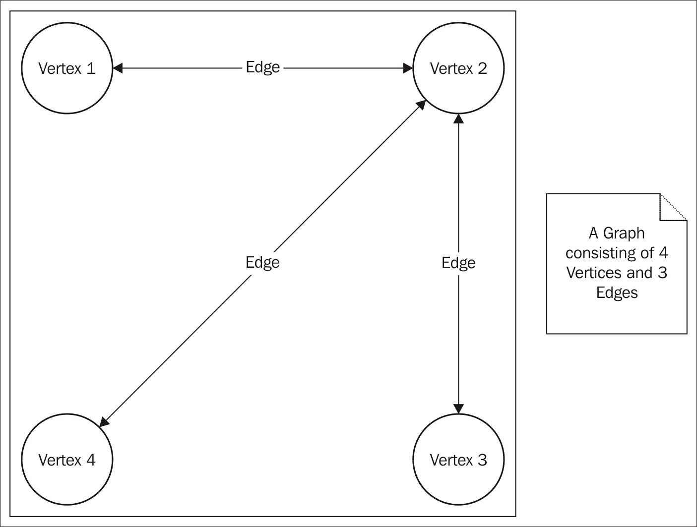
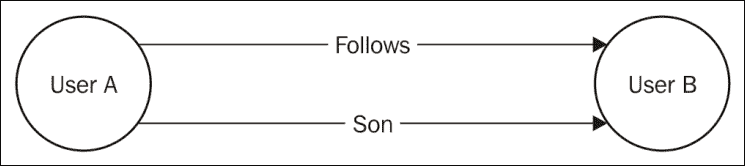
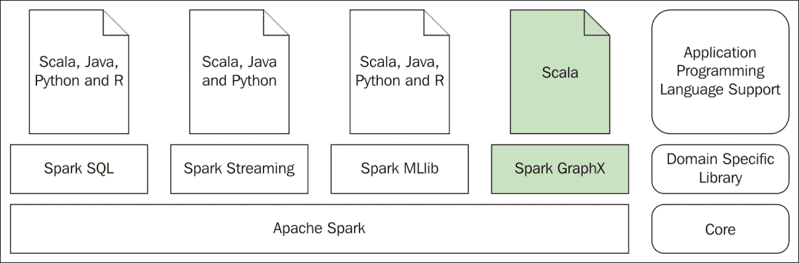
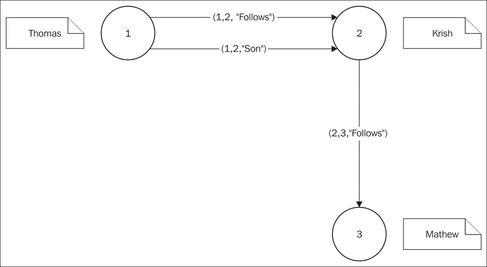
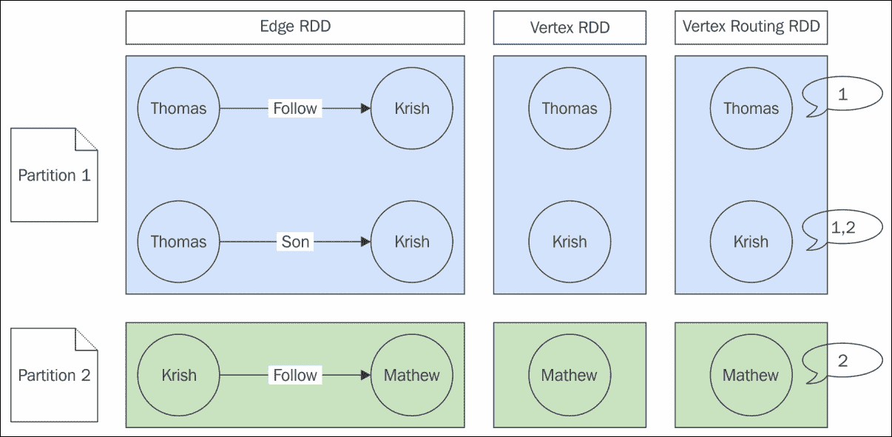
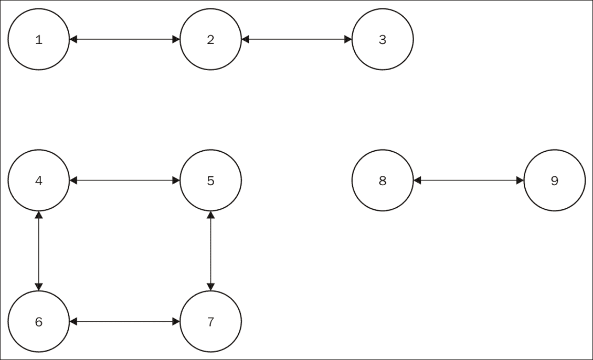
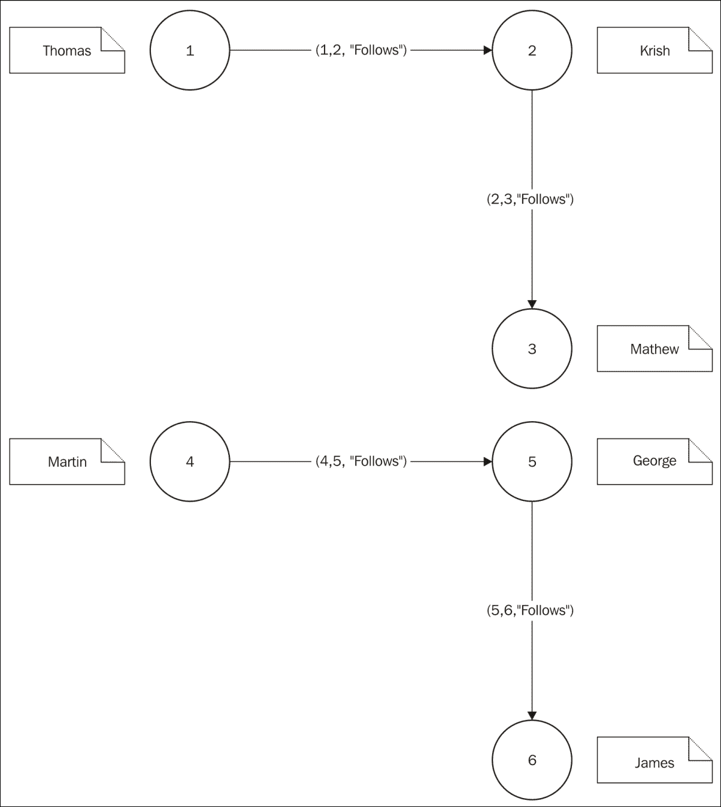

# 第八章 Spark 图处理

图是计算机科学中的一个数学概念和数据结构。它在许多现实世界的用例中有着巨大的应用。它用于模拟实体之间的成对关系。在这里，实体被称为顶点，两个顶点通过边连接。一个图由顶点的集合和连接它们的边组成。

从概念上讲，这是一个欺骗性的简单抽象，但当涉及到处理大量顶点和边时，它计算密集，消耗大量的处理时间和计算资源。以下是一个具有四个顶点和三条边的图的表示：



图 1

本章我们将涵盖以下主题：

+   图及其用途

+   GraphX 库

+   PageRank 算法

+   连通分量算法

+   GraphFrames

+   图查询

# 理解图及其用法

有许多可以建模为图的用例结构。在社交网络应用中，用户之间的关系可以建模为图，其中用户形成图的顶点，用户之间的关系形成图的边。在多阶段作业调度应用中，单个任务形成图的顶点，任务的顺序形成图的边。在道路交通建模系统中，城镇形成图的顶点，连接城镇的道路形成图的边。

给定图的边有一个非常重要的属性，即*连接的方向*。在许多用例中，连接的方向并不重要。例如，通过道路连接城市的情况。但如果用例是在城市内生成驾驶方向，则交通枢纽之间的连通性是有方向的。取任何两个交通枢纽，都存在道路连通性，但也可能是一条单行道。所以这完全取决于交通的流向。如果道路从交通枢纽 J1 到 J2 开放，但从 J2 到 J1 关闭，那么驾驶方向的图将从 J1 到 J2 有连通性，而不是从 J2 到 J1。在这种情况下，连接 J1 和 J2 的边有方向。如果 J2 和 J3 之间的道路在两个方向上都开放，那么连接 J2 和 J3 的边没有方向。所有边都有方向的图称为**有向图**。

### 小贴士

当以图形方式表示图时，必须给出有向图边的方向。如果不是有向图，边可以没有任何方向地表示，或者可以表示为双向的。这取决于个人的选择。*图 1* 不是一个有向图，但它表示了连接边的两个顶点的方向。

在*图 2*中，一个社交网络应用用例中两个用户之间的关系被表示为图。用户形成顶点，用户之间的关系形成边。用户 A 关注用户 B。同时，用户 A 是用户 B 的儿子。在这个图中，存在两条具有相同源和目标顶点的并行边。包含并行边的图称为多重图。*图 2*中显示的图也是一个有向图。这是一个**有向多重图**的好例子。



图 2

在现实世界的用例中，图的顶点和边代表现实世界的实体。这些实体具有属性。例如，在社交网络应用的用户社交连接图中，用户形成顶点，用户具有许多属性，如姓名、电子邮件、电话号码等。同样，用户之间的关系形成图的边，连接用户顶点的边可以具有如关系等属性。任何图处理应用程序库都应该足够灵活，能够将任何类型的属性附加到图的顶点和边上。

# Spark GraphX 库

对于图处理，开源世界中有很多库可用。Giraph、Pregel、GraphLab 和 Spark GraphX 都是其中的一些。Spark GraphX 是最近进入这个领域的新成员。

Spark GraphX 有什么特别之处？Spark GraphX 是一个建立在 Spark 数据处理框架之上的图处理库。与其他图处理库相比，Spark GraphX 具有真正的优势。它可以利用 Spark 的所有数据处理能力。然而，在现实中，图处理算法的性能并不是唯一需要考虑的方面。

在许多应用中，需要将数据建模为图，但这些数据并不以这种形式自然存在。在许多用例中，除了图处理之外，还需要大量的处理器时间和其他计算资源来获取数据，以便应用图处理算法。这正是 Spark 数据处理框架和 Spark GraphX 库发挥其价值的地方。使用 Spark 工具包中可用的众多工具，可以轻松完成使数据准备好供 Spark GraphX 消费的数据处理作业。总之，作为 Spark 家族的一部分，Spark GraphX 库结合了 Spark 的核心数据处理能力以及一个非常易于使用的图处理库。

再次回顾一下*图 3*所展示的更大图景，以设定上下文并了解在这里将要讨论的内容，然后再进入用例的使用。与其它章节不同，在本章中，代码示例将只使用 Scala 编写，因为 Spark GraphX 库目前只提供了 Scala API。



图 3

## GraphX 概述

在任何实际应用场景中，理解由顶点和边组成的图的概念是很容易的。但是，当涉及到实现时，即使对于优秀的设计师和程序员来说，这也不是一个非常理解的数据结构。原因是简单的：与其他普遍存在的数据结构，如列表、集合、映射、队列等不同，图在大多数应用中并不常用。考虑到这一点，概念是逐步、稳步地引入的，一次一步，通过简单且平凡的例子，然后再考虑一些实际应用场景。

Spark GraphX 库最重要的方面是一个数据类型，Graph，它扩展了 Spark **弹性分布式数据集**（**RDD**）并引入了一种新的图抽象。Spark GraphX 中的图抽象是一个带有所有顶点和边属性的定向多重图。这些顶点和边的属性可以是 Scala 类型系统支持的由用户定义的类型。这些类型在 Graph 类型中是参数化的。给定的图可能需要顶点或边有不同的数据类型。这可以通过使用一个与继承层次结构相关的类型系统来实现。除了所有这些基本规则之外，该库还包括一系列图构建器和算法。

图中的一个顶点由一个唯一的 64 位长标识符识别，`org.apache.spark.graphx.VertexId`。除了 VertexId 类型，一个简单的 Scala 类型，Long，也可以使用。除此之外，顶点可以接受任何类型的属性。图中的一个边应该有一个源顶点标识符、一个目标顶点标识符以及任何类型的属性。

*图 4* 展示了一个顶点属性为 String 类型，边属性也为 String 类型的图。除了属性之外，每个顶点都有一个唯一的标识符，每个边都有一个源顶点编号和目标顶点编号。



图 4

在处理图时，有方法可以获取顶点和边。但是，在独立处理时，这些图中的独立对象可能不足以进行处理。

如前所述，一个顶点有一个唯一的标识符和属性。边通过其源顶点和目标顶点唯一标识。为了在图处理应用中轻松处理每个边，Spark GraphX 库的三元组抽象提供了一种从单个对象访问源顶点、目标顶点和边属性的简单方法。

下面的 Scala 代码片段用于使用 Spark GraphX 库创建*图 4*所示的图。在创建图之后，可以在图上调用许多方法来暴露图的各个属性。在 Scala REPL 提示符下，尝试以下语句：

```py
scala> import org.apache.spark._
  import org.apache.spark._
    scala> import org.apache.spark.graphx._

	import org.apache.spark.graphx._
	scala> import org.apache.spark.rdd.RDD
	import org.apache.spark.rdd.RDD
  scala> //Create an RDD of users containing tuple values with a mandatory
  Long and another String type as the property of the vertex
  scala> val users: RDD[(Long, String)] = sc.parallelize(Array((1L,
  "Thomas"), (2L, "Krish"),(3L, "Mathew")))
  users: org.apache.spark.rdd.RDD[(Long, String)] = ParallelCollectionRDD[0]
  at parallelize at <console>:31
  scala> //Created an RDD of Edge type with String type as the property of the edge
  scala> val userRelationships: RDD[Edge[String]] = sc.parallelize(Array(Edge(1L, 2L, "Follows"),    Edge(1L, 2L, "Son"),Edge(2L, 3L, "Follows")))
userRelationships: org.apache.spark.rdd.RDD[org.apache.spark.graphx.Edge[String]] = ParallelCollectionRDD[1] at parallelize at <console>:31
    scala> //Create a graph containing the vertex and edge RDDs as created beforescala> val userGraph = Graph(users, userRelationships)
	userGraph: org.apache.spark.graphx.Graph[String,String] = org.apache.spark.graphx.impl.GraphImpl@ed5cf29

	scala> //Number of edges in the graph
	scala> userGraph.numEdges
      res3: Long = 3
    scala> //Number of vertices in the graph
	scala> userGraph.numVertices
      res4: Long = 3
	  scala> //Number of edges coming to each of the vertex. 
	  scala> userGraph.inDegrees
res7: org.apache.spark.graphx.VertexRDD[Int] = VertexRDDImpl[19] at RDD at
 VertexRDD.scala:57
scala> //The first element in the tuple is the vertex id and the second
 element in the tuple is the number of edges coming to that vertex
 scala> userGraph.inDegrees.foreach(println)
      (3,1)

      (2,2)
    scala> //Number of edges going out of each of the vertex. scala> userGraph.outDegrees
	res9: org.apache.spark.graphx.VertexRDD[Int] = VertexRDDImpl[23] at RDD at VertexRDD.scala:57
    scala> //The first element in the tuple is the vertex id and the second
	element in the tuple is the number of edges going out of that vertex
	scala> userGraph.outDegrees.foreach(println)
      (1,2)

      (2,1)
    scala> //Total number of edges coming in and going out of each vertex. 
	scala> userGraph.degrees
res12: org.apache.spark.graphx.VertexRDD[Int] = VertexRDDImpl[27] at RDD at
 VertexRDD.scala:57
    scala> //The first element in the tuple is the vertex id and the second 
	element in the tuple is the total number of edges coming in and going out of that vertex.
	scala> userGraph.degrees.foreach(println)
      (1,2)

      (2,3)

      (3,1)
    scala> //Get the vertices of the graph
	scala> userGraph.vertices
res11: org.apache.spark.graphx.VertexRDD[String] = VertexRDDImpl[11] at RDD at VertexRDD.scala:57
    scala> //Get all the vertices with the vertex number and the property as a tuplescala> userGraph.vertices.foreach(println)
      (1,Thomas)

      (3,Mathew)

      (2,Krish)
    scala> //Get the edges of the graph
	scala> userGraph.edges
res15: org.apache.spark.graphx.EdgeRDD[String] = EdgeRDDImpl[13] at RDD at
 EdgeRDD.scala:41
    scala> //Get all the edges properties with source and destination vertex numbers
	scala> userGraph.edges.foreach(println)
      Edge(1,2,Follows)

      Edge(1,2,Son)

      Edge(2,3,Follows)
    scala> //Get the triplets of the graph
	scala> userGraph.triplets
res18: org.apache.spark.rdd.RDD[org.apache.spark.graphx.EdgeTriplet[String,String]]
 = MapPartitionsRDD[32] at mapPartitions at GraphImpl.scala:48
    scala> userGraph.triplets.foreach(println)
	((1,Thomas),(2,Krish),Follows)
	((1,Thomas),(2,Krish),Son)
	((2,Krish),(3,Mathew),Follows)

```

读者将熟悉使用 RDD 进行 Spark 编程。前面的代码片段解释了使用 RDD 构建图顶点和边的过程。可以使用存储在各种数据存储中的数据进行 RDD 的构建。在实际应用场景中，大多数情况下数据将来自外部来源，例如 NoSQL 数据存储，并且有方法可以使用此类数据构建 RDD。一旦构建了 RDD，就可以使用这些 RDD 构建图。

前面的代码片段还解释了图提供的各种方法来获取给定图的所需详细信息。这里涵盖的示例用例在规模上非常小。在实际应用场景中，图的顶点和边的数量可以达到数百万。由于所有这些抽象都作为 RDD 实现，因此所有固有的不可变性、分区、分布和并行处理的优势都自动获得，这使得图处理高度可扩展。最后，以下表格显示了顶点和边的表示方式：

**顶点表**:

| **顶点 ID** | **顶点属性** |
| --- | --- |
| 1 | Thomas |
| 2 | Krish |
| 3 | Mathew |

**边表**:

| **源顶点 ID** | **目标顶点 ID** | **边属性** |
| --- | --- | --- |
| 1 | 2 | Follows |
| 1 | 2 | Son |
| 2 | 3 | Follows |

**三元组表**:

| **源顶点 ID** | **目标顶点 ID** | **源顶点属性** | **边属性** | **目标顶点属性** |
| --- | --- | --- | --- | --- |
| 1 | 2 | Thomas | Follows | Krish |
| 1 | 2 | Thomas | Son | Krish |
| 2 | 3 | Krish | Follows | Mathew |

### 注意

需要注意的是，这些表仅用于说明目的。实际的内部表示遵循 RDD 表示的规则和规定。

如果任何内容表示为 RDD，它必然会进行分区和分布。但是，如果分区和分布是自由进行的，没有任何对图的管控，那么在图处理性能方面将是不优的。正因为如此，Spark GraphX 库的创建者提前深思熟虑了这个问题，并实现了一种图分区策略，以便以优化的形式将图表示为 RDD。

## 图分区

理解图 RDD 如何在各个分区中进行分区和分布是很重要的。这将对确定构成图的各个 RDD 的分区和分布的高级优化很有用。

通常，对于给定的图有三个 RDD。除了顶点 RDD 和边 RDD 之外，还有一个内部使用的 RDD，即路由 RDD。为了获得最佳性能，所有构成给定边的顶点都保留在存储边的同一个分区中。如果给定顶点参与多个边，而这些边位于不同的分区中，那么这个特定的顶点可以存储在多个分区中。

为了跟踪给定顶点冗余存储的分区，还维护了一个路由 RDD，其中包含顶点详情以及每个顶点可用的分区。

*图 5* 解释了这一点：



图 5

在 *图 5* 中，假设边被分区到分区 1 和 2。同样假设顶点被分区到分区 1 和 2。

在分区 1 中，所有所需的顶点都可用于边的本地。但在分区 2 中，只有边的一个顶点可用于本地。因此，缺失的顶点也存储在分区 2 中，以便所有所需的顶点都可在本地获得。

为了跟踪复制，顶点路由 RDD 维护了给定顶点可用的分区号。在 *图 5* 中，在顶点路由 RDD 中，使用标注符号来显示这些顶点复制的分区。这样，在处理边或三元组时，所有与构成顶点相关的信息都可在本地获得，性能将非常优化。由于 RDD 是不可变的，因此即使它们存储在多个分区中，与信息更改相关的问题也被消除了。

## 图处理

用户暴露的图的构成元素是顶点 RDD 和边 RDD。就像任何其他数据结构一样，由于底层数据的改变，图也会经历许多变化。为了支持各种用例所需的图操作，有许多算法可用，使用这些算法可以处理图数据结构中的数据，以产生预期的业务结果。在深入了解处理图的算法之前，了解一些使用航空旅行用例的图处理基础知识是很好的。

假设一个人正在尝试从曼彻斯特到班加罗尔的便宜往返机票。在旅行偏好中，这个人提到他/她不关心停靠次数，但价格应该是最低的。假设机票预订系统为单程和返程旅程选择了相同的停靠点，并产生了以下路线或旅程段，以最低的价格：

Manchester → London → Colombo → Bangalore

Bangalore → Colombo → London → Manchester

这条路线计划是图的完美例子。如果将单程旅程视为一个图，而返程旅程视为另一个图，则可以通过反转单程旅程图来生成返程旅程图。在 Scala REPL 提示符下，尝试以下语句：

```py
scala> import org.apache.spark._
import org.apache.spark._
scala> import org.apache.spark.graphx._
import org.apache.spark.graphx._
scala> import org.apache.spark.rdd.RDD
import org.apache.spark.rdd.RDD
scala> //Create the vertices with the stops
scala> val stops: RDD[(Long, String)] = sc.parallelize(Array((1L, "Manchester"), (2L, "London"),(3L, "Colombo"), (4L, "Bangalore")))
stops: org.apache.spark.rdd.RDD[(Long, String)] = ParallelCollectionRDD[33] at parallelize at <console>:38
scala> //Create the edges with travel legs
scala> val legs: RDD[Edge[String]] = sc.parallelize(Array(Edge(1L, 2L, "air"),    Edge(2L, 3L, "air"),Edge(3L, 4L, "air"))) 
legs: org.apache.spark.rdd.RDD[org.apache.spark.graphx.Edge[String]] = ParallelCollectionRDD[34] at parallelize at <console>:38 
scala> //Create the onward journey graph
scala> val onwardJourney = Graph(stops, legs)onwardJourney: org.apache.spark.graphx.Graph[String,String] = org.apache.spark.graphx.impl.GraphImpl@190ec769scala> onwardJourney.triplets.map(triplet => (triplet.srcId, (triplet.srcAttr, triplet.dstAttr))).sortByKey().collect().foreach(println)
(1,(Manchester,London))
(2,(London,Colombo))
(3,(Colombo,Bangalore))
scala> val returnJourney = onwardJourney.reversereturnJourney: org.apache.spark.graphx.Graph[String,String] = org.apache.spark.graphx.impl.GraphImpl@60035f1e
scala> returnJourney.triplets.map(triplet => (triplet.srcId, (triplet.srcAttr,triplet.dstAttr))).sortByKey(ascending=false).collect().foreach(println)
(4,(Bangalore,Colombo))
(3,(Colombo,London))
(2,(London,Manchester))

```

在返程旅程段中，单程旅程段的目的地和起点被反转。当一个图被反转时，只有边的源点和目标点被反转，顶点的身份保持不变。

换句话说，每个顶点的顶点标识符保持不变。在处理图时，了解三元属性的名字很重要。它们对于编写程序和处理图非常有用。作为同一 Scala REPL 会话的延续，尝试以下语句：

```py
scala> returnJourney.triplets.map(triplet => (triplet.srcId,triplet.dstId,triplet.attr,triplet.srcAttr,triplet.dstAttr)).foreach(println) 
(2,1,air,London,Manchester) 
(3,2,air,Colombo,London) 
(4,3,air,Bangalore,Colombo) 

```

下表列出了可以用来处理图并从图中提取所需数据的属性列表。前面的代码片段和下面的表格可以相互验证，以全面理解：

| **三元属性** | **描述** |
| --- | --- |
| `srcId` | 源顶点标识符 |
| `dstId` | 目标顶点标识符 |
| `attr` | 边属性 |
| `srcAttr` | 源顶点属性 |
| `dstAttr` | 目标顶点属性 |

在一个图中，顶点是 RDD，边也是 RDD，正因为如此，才可能进行转换。

现在，为了演示图转换，使用相同的使用案例，但略有变化。假设一个旅行社从航空公司为选择的航线获得特殊的折扣价格。旅行社决定保留折扣并向客户提供市场价格，为此，他在航空公司给出的价格上增加了 10%。这位旅行社注意到机场名称显示不一致，并确保在整个网站上显示时保持一致的表现，因此决定将所有停靠站名称更改为大写。作为同一 Scala REPL 会话的延续，尝试以下语句：

```py
 scala> // Create the vertices 
scala> val stops: RDD[(Long, String)] = sc.parallelize(Array((1L,
 "Manchester"), (2L, "London"),(3L, "Colombo"), (4L, "Bangalore"))) 
stops: org.apache.spark.rdd.RDD[(Long, String)] = ParallelCollectionRDD[66] at parallelize at <console>:38 
scala> //Create the edges 
scala> val legs: RDD[Edge[Long]] = sc.parallelize(Array(Edge(1L, 2L, 50L),    Edge(2L, 3L, 100L),Edge(3L, 4L, 80L))) 
legs: org.apache.spark.rdd.RDD[org.apache.spark.graphx.Edge[Long]] = ParallelCollectionRDD[67] at parallelize at <console>:38 
scala> //Create the graph using the vertices and edges 
scala> val journey = Graph(stops, legs) 
journey: org.apache.spark.graphx.Graph[String,Long] = org.apache.spark.graphx.impl.GraphImpl@8746ad5 
scala> //Convert the stop names to upper case 
scala> val newStops = journey.vertices.map {case (id, name) => (id, name.toUpperCase)} 
newStops: org.apache.spark.rdd.RDD[(org.apache.spark.graphx.VertexId, String)] = MapPartitionsRDD[80] at map at <console>:44 
scala> //Get the edges from the selected journey and add 10% price to the original price 
scala> val newLegs = journey.edges.map { case Edge(src, dst, prop) => Edge(src, dst, (prop + (0.1*prop))) } 
newLegs: org.apache.spark.rdd.RDD[org.apache.spark.graphx.Edge[Double]] = MapPartitionsRDD[81] at map at <console>:44 
scala> //Create a new graph with the original vertices and the new edges 
scala> val newJourney = Graph(newStops, newLegs) 
newJourney: org.apache.spark.graphx.Graph[String,Double]
 = org.apache.spark.graphx.impl.GraphImpl@3c929623 
scala> //Print the contents of the original graph 
scala> journey.triplets.foreach(println) 
((1,Manchester),(2,London),50) 
((3,Colombo),(4,Bangalore),80) 
((2,London),(3,Colombo),100) 
scala> //Print the contents of the transformed graph 
scala>  newJourney.triplets.foreach(println) 
((2,LONDON),(3,COLOMBO),110.0) 
((3,COLOMBO),(4,BANGALORE),88.0) 
((1,MANCHESTER),(2,LONDON),55.0) 

```

实质上，这些转换确实是 RDD 转换。如果对如何将这些不同的 RDD 组合在一起形成图有概念性的理解，那么任何具有 RDD 编程能力的程序员都能够很好地进行图处理。这是 Spark 统一编程模型强大功能的又一例证。

之前的使用案例对顶点和边 RDD 进行了 map 转换。同样，filter 转换也是另一种常用的有用类型。除了这些，所有转换和操作都可以用来处理顶点和边 RDD。

## 图结构处理

在上一节中，一种图处理方式是通过单独处理所需的顶点或边来完成的。这种方法的缺点是处理过程需要经过三个不同的阶段，如下所示：

+   从图中提取顶点或边

+   处理顶点或边

+   重新创建一个包含处理过的顶点和边的新图

这很繁琐且容易导致用户编程错误。为了解决这个问题，Spark GraphX 库中提供了一些结构化操作符，允许用户将图作为一个独立的单元进行处理，从而生成一个新的图。

在前一个部分中已经讨论了一个重要的结构运算，即图的反转，它产生一个所有边方向都反转的新图。另一个常用的结构运算是从给定图中提取子图。结果子图可以是整个父图本身，也可以是父图的一个子集，具体取决于对父图进行的操作。

当从外部数据源创建图表时，可能会出现边具有无效顶点的情况。如果顶点和边是由来自两个不同来源或不同应用程序的数据创建的，这种情况尤为可能。使用这些顶点和边创建图表时，一些边将具有无效顶点，处理结果可能会出现意外。以下是一个用例，其中对包含无效顶点的边进行了剪枝操作，以使用结构运算符消除这些问题。在 Scala REPL 提示符下，尝试以下语句：

```py
scala> import org.apache.spark._
  import org.apache.spark._    scala> import org.apache.spark.graphx._
  import org.apache.spark.graphx._    scala> import org.apache.spark.rdd.RDD
  import org.apache.spark.rdd.RDD    scala> //Create an RDD of users containing tuple values with a mandatory
  Long and another String type as the property of the vertex
  scala> val users: RDD[(Long, String)] = sc.parallelize(Array((1L,
  "Thomas"), (2L, "Krish"),(3L, "Mathew")))
users: org.apache.spark.rdd.RDD[(Long, String)] = ParallelCollectionRDD[104]
 at parallelize at <console>:45
    scala> //Created an RDD of Edge type with String type as the property of
	the edge
	scala> val userRelationships: RDD[Edge[String]] =
	sc.parallelize(Array(Edge(1L, 2L, "Follows"), Edge(1L, 2L,
	"Son"),Edge(2L, 3L, "Follows"), Edge(1L, 4L, "Follows"), Edge(3L, 4L, "Follows")))
	userRelationships:
	org.apache.spark.rdd.RDD[org.apache.spark.graphx.Edge[String]] =
	ParallelCollectionRDD[105] at parallelize at <console>:45
    scala> //Create a vertex property object to fill in if an invalid vertex id is given in the edge
	scala> val missingUser = "Missing"
missingUser: String = Missing
    scala> //Create a graph containing the vertex and edge RDDs as created
	before
	scala> val userGraph = Graph(users, userRelationships, missingUser)
userGraph: org.apache.spark.graphx.Graph[String,String] = org.apache.spark.graphx.impl.GraphImpl@43baf0b9
    scala> //List the graph triplets and find some of the invalid vertex ids given and for them the missing vertex property is assigned with the value "Missing"scala> userGraph.triplets.foreach(println)
      ((3,Mathew),(4,Missing),Follows)  
      ((1,Thomas),(2,Krish),Son)    
      ((2,Krish),(3,Mathew),Follows)    
      ((1,Thomas),(2,Krish),Follows)    
      ((1,Thomas),(4,Missing),Follows)
    scala> //Since the edges with the invalid vertices are invalid too, filter out
	those vertices and create a valid graph. The vertex predicate here can be any valid filter condition of a vertex. Similar to vertex predicate, if the filtering is to be done on the edges, instead of the vpred, use epred as the edge predicate.
	scala> val fixedUserGraph = userGraph.subgraph(vpred = (vertexId, attribute) => attribute != "Missing")
fixedUserGraph: org.apache.spark.graphx.Graph[String,String] = org.apache.spark.graphx.impl.GraphImpl@233b5c71 
 scala> fixedUserGraph.triplets.foreach(println)
  ((2,Krish),(3,Mathew),Follows)
  ((1,Thomas),(2,Krish),Follows)
  ((1,Thomas),(2,Krish),Son)

```

在大型图中，有时根据用例，可能会有大量的并行边。在某些用例中，可以将并行边的数据进行合并，只维护一条边，而不是维护大量并行边。在前面的用例中，最终没有无效边的图，存在并行边，一个具有`Follows`属性，另一个具有`Son`属性，它们具有相同的源和目标顶点。

将这些并行边合并成一条具有从并行边拼接的属性的单一边是可以的，这将减少边的数量而不会丢失信息。这是通过图的 groupEdges 结构运算完成的。作为同一 Scala REPL 会话的延续，尝试以下语句：

```py
scala> // Import the partition strategy classes 
scala> import org.apache.spark.graphx.PartitionStrategy._ 
import org.apache.spark.graphx.PartitionStrategy._ 
scala> // Partition the user graph. This is required to group the edges 
scala> val partitionedUserGraph = fixedUserGraph.partitionBy(CanonicalRandomVertexCut) 
partitionedUserGraph: org.apache.spark.graphx.Graph[String,String] = org.apache.spark.graphx.impl.GraphImpl@5749147e 
scala> // Generate the graph without parallel edges and combine the properties of duplicate edges 
scala> val graphWithoutParallelEdges = partitionedUserGraph.groupEdges((e1, e2) => e1 + " and " + e2) 
graphWithoutParallelEdges: org.apache.spark.graphx.Graph[String,String] = org.apache.spark.graphx.impl.GraphImpl@16a4961f 
scala> // Print the details 
scala> graphWithoutParallelEdges.triplets.foreach(println) 
((1,Thomas),(2,Krish),Follows and Son) 
((2,Krish),(3,Mathew),Follows) 

```

图中的前述结构变化通过分组边减少了边的数量。当边属性是数值型，并且通过聚合它们进行合并是有意义的，那么也可以通过移除并行边来减少边的数量，这可以显著减少图处理时间。

### 注意

在此代码片段中需要注意的一个重要点是，在边上的 group-by 操作之前，图已经被分区。

默认情况下，给定图的边和构成顶点不需要位于同一分区。为了使 group-by 操作生效，所有并行边都必须位于同一分区。CanonicalRandomVertexCut 分区策略确保两个顶点之间的所有边都发生本地化，无论方向如何。

Spark GraphX 库中还有一些其他结构运算符可用，查阅 Spark 文档将提供对这些运算符的深入了解。它们可以根据用例使用。

# 网球锦标赛分析

由于基本的图处理基础已经建立，现在是时候处理一个使用图的现实世界用例了。在这里，网球锦标赛的结果是通过图来建模的。2015 年巴克莱斯 ATP 世界巡回赛单打比赛的结果是通过图来建模的。顶点包含球员详情，边包含个人比赛。边是以这样的方式形成的，即源顶点是赢得比赛的球员，目标顶点是输掉比赛的球员。边属性包含比赛类型、获胜者在比赛中获得的分数以及比赛中球员的头对头计数。这里使用的积分系统是虚构的，它只是获胜者在特定比赛中获得的一种权重。初始小组赛携带的权重最小，半决赛携带的权重更大，决赛携带的权重最大。通过这种方式建模结果，通过处理图来找出以下详细信息：

+   列出所有比赛详情。

+   列出所有比赛，包括球员姓名、比赛类型和结果。

+   列出所有第一组获胜者及其比赛中的得分。

+   列出所有第二组获胜者及其比赛中的得分。

+   列出所有半决赛获胜者及其比赛中的得分。

+   列出比赛中的得分详情的最终获胜者。

+   列出在整个锦标赛中赢得的总分的球员名单。

+   通过找出球员在比赛中获得的最高得分来列出比赛的获胜者。

+   在基于小组的比赛，由于循环赛制的平局，相同的球员可能会相遇多次。找出在这个锦标赛中相互比赛超过一次的球员。

+   列出至少赢得一场比赛的球员名单。

+   列出至少输掉一场比赛的球员名单。

+   列出至少赢得一场比赛和至少输掉一场比赛的球员名单。

+   列出一场比赛都没有赢的球员名单。

+   列出一场比赛都没有输的球员名单。

对于不熟悉网球游戏的人来说，没有必要担心，因为这里没有讨论游戏规则，也不需要理解这个用例。从所有实际目的来看，它只被视为两个人之间进行的游戏，其中一人获胜，另一人失败。在 Scala REPL 提示符下，尝试以下语句：

```py
scala> import org.apache.spark._
  import org.apache.spark._    
  scala> import org.apache.spark.graphx._
  import org.apache.spark.graphx._    
  scala> import org.apache.spark.rdd.RDD
  import org.apache.spark.rdd.RDD
    scala> //Define a property class that is going to hold all the properties of the vertex which is nothing but player information
	scala> case class Player(name: String, country: String)
      defined class Player
    scala> // Create the player vertices
	scala> val players: RDD[(Long, Player)] = sc.parallelize(Array((1L, Player("Novak Djokovic", "SRB")), (3L, Player("Roger Federer", "SUI")),(5L, Player("Tomas Berdych", "CZE")), (7L, Player("Kei Nishikori", "JPN")), (11L, Player("Andy Murray", "GBR")),(15L, Player("Stan Wawrinka", "SUI")),(17L, Player("Rafael Nadal", "ESP")),(19L, Player("David Ferrer", "ESP"))))
players: org.apache.spark.rdd.RDD[(Long, Player)] = ParallelCollectionRDD[145] at parallelize at <console>:57
    scala> //Define a property class that is going to hold all the properties of the edge which is nothing but match informationscala> case class Match(matchType: String, points: Int, head2HeadCount: Int)
      defined class Match
    scala> // Create the match edgesscala> val matches: RDD[Edge[Match]] = sc.parallelize(Array(Edge(1L, 5L, Match("G1", 1,1)), Edge(1L, 7L, Match("G1", 1,1)), Edge(3L, 1L, Match("G1", 1,1)), Edge(3L, 5L, Match("G1", 1,1)), Edge(3L, 7L, Match("G1", 1,1)), Edge(7L, 5L, Match("G1", 1,1)), Edge(11L, 19L, Match("G2", 1,1)), Edge(15L, 11L, Match("G2", 1, 1)), Edge(15L, 19L, Match("G2", 1, 1)), Edge(17L, 11L, Match("G2", 1, 1)), Edge(17L, 15L, Match("G2", 1, 1)), Edge(17L, 19L, Match("G2", 1, 1)), Edge(3L, 15L, Match("S", 5, 1)), Edge(1L, 17L, Match("S", 5, 1)), Edge(1L, 3L, Match("F", 11, 1))))
matches: org.apache.spark.rdd.RDD[org.apache.spark.graphx.Edge[Match]] = ParallelCollectionRDD[146] at parallelize at <console>:57
    scala> //Create a graph with the vertices and edges
	scala> val playGraph = Graph(players, matches)
playGraph: org.apache.spark.graphx.Graph[Player,Match] = org.apache.spark.graphx.impl.GraphImpl@30d4d6fb 

```

网球锦标赛的图已经创建，从现在开始，将要进行的所有操作都是对这个基本图的加工以及从中提取信息以满足用例的要求：

```py
scala> //Print the match details
	scala> playGraph.triplets.foreach(println)
((15,Player(Stan Wawrinka,SUI)),(11,Player(Andy Murray,GBR)),Match(G2,1,1))    
((15,Player(Stan Wawrinka,SUI)),(19,Player(David Ferrer,ESP)),Match(G2,1,1))    
((7,Player(Kei Nishikori,JPN)),(5,Player(Tomas Berdych,CZE)),Match(G1,1,1))    
((1,Player(Novak Djokovic,SRB)),(7,Player(Kei Nishikori,JPN)),Match(G1,1,1))    
((3,Player(Roger Federer,SUI)),(1,Player(Novak Djokovic,SRB)),Match(G1,1,1))    
((1,Player(Novak Djokovic,SRB)),(3,Player(Roger Federer,SUI)),Match(F,11,1))    
((1,Player(Novak Djokovic,SRB)),(17,Player(Rafael Nadal,ESP)),Match(S,5,1))    
((3,Player(Roger Federer,SUI)),(5,Player(Tomas Berdych,CZE)),Match(G1,1,1))    
((17,Player(Rafael Nadal,ESP)),(11,Player(Andy Murray,GBR)),Match(G2,1,1))    
((3,Player(Roger Federer,SUI)),(7,Player(Kei Nishikori,JPN)),Match(G1,1,1))    
((1,Player(Novak Djokovic,SRB)),(5,Player(Tomas Berdych,CZE)),Match(G1,1,1))    
((17,Player(Rafael Nadal,ESP)),(15,Player(Stan Wawrinka,SUI)),Match(G2,1,1))    
((11,Player(Andy Murray,GBR)),(19,Player(David Ferrer,ESP)),Match(G2,1,1))    
((3,Player(Roger Federer,SUI)),(15,Player(Stan Wawrinka,SUI)),Match(S,5,1))    
((17,Player(Rafael Nadal,ESP)),(19,Player(David Ferrer,ESP)),Match(G2,1,1))
    scala> //Print matches with player names and the match type and the resultscala> playGraph.triplets.map(triplet => triplet.srcAttr.name + " won over " + triplet.dstAttr.name + " in  " + triplet.attr.matchType + " match").foreach(println)
      Roger Federer won over Tomas Berdych in  G1 match    
      Roger Federer won over Kei Nishikori in  G1 match    
      Novak Djokovic won over Roger Federer in  F match    
      Novak Djokovic won over Rafael Nadal in  S match    
      Roger Federer won over Stan Wawrinka in  S match    
      Rafael Nadal won over David Ferrer in  G2 match    
      Kei Nishikori won over Tomas Berdych in  G1 match    
      Andy Murray won over David Ferrer in  G2 match    
      Stan Wawrinka won over Andy Murray in  G2 match    
      Stan Wawrinka won over David Ferrer in  G2 match    
      Novak Djokovic won over Kei Nishikori in  G1 match    
      Roger Federer won over Novak Djokovic in  G1 match    
      Rafael Nadal won over Andy Murray in  G2 match    
      Rafael Nadal won over Stan Wawrinka in  G2 match    
      Novak Djokovic won over Tomas Berdych in  G1 match 

```

值得注意的是，在图中使用三元组对于从单个对象中提取给定网球比赛的所需所有数据元素非常有用，包括谁在比赛、谁获胜以及比赛类型。以下分析用例的实现涉及筛选锦标赛的网球比赛记录。在这里，只使用了简单的过滤逻辑，但在现实世界的用例中，任何复杂的逻辑都可以在函数中实现，并且可以作为参数传递给过滤转换：

```py
scala> //Group 1 winners with their group total points
scala> playGraph.triplets.filter(triplet => triplet.attr.matchType == "G1").map(triplet => (triplet.srcAttr.name, triplet.attr.points)).foreach(println)
      (Kei Nishikori,1)    
      (Roger Federer,1)    
      (Roger Federer,1)    
      (Novak Djokovic,1)    
      (Novak Djokovic,1)    
      (Roger Federer,1)
    scala> //Find the group total of the players
	scala> playGraph.triplets.filter(triplet => triplet.attr.matchType == "G1").map(triplet => (triplet.srcAttr.name, triplet.attr.points)).reduceByKey(_+_).foreach(println)
      (Roger Federer,3)    
      (Novak Djokovic,2)    
      (Kei Nishikori,1)
    scala> //Group 2 winners with their group total points
	scala> playGraph.triplets.filter(triplet => triplet.attr.matchType == "G2").map(triplet => (triplet.srcAttr.name, triplet.attr.points)).foreach(println)
      (Rafael Nadal,1)    
      (Rafael Nadal,1)    
      (Andy Murray,1)    
      (Stan Wawrinka,1)    
      (Stan Wawrinka,1)    
      (Rafael Nadal,1) 

```

以下分析用例的实现涉及按键分组并进行汇总计算。它不仅限于找到网球比赛记录点的总和，如以下用例实现所示；相反，可以使用用户定义的函数来进行计算：

```py
scala> //Find the group total of the players
	scala> playGraph.triplets.filter(triplet => triplet.attr.matchType == "G2").map(triplet => (triplet.srcAttr.name, triplet.attr.points)).reduceByKey(_+_).foreach(println)
      (Stan Wawrinka,2)    
      (Andy Murray,1)    
      (Rafael Nadal,3)
    scala> //Semi final winners with their group total points
	scala> playGraph.triplets.filter(triplet => triplet.attr.matchType == "S").map(triplet => (triplet.srcAttr.name, triplet.attr.points)).foreach(println)
      (Novak Djokovic,5)    
      (Roger Federer,5)
    scala> //Find the group total of the players
	scala> playGraph.triplets.filter(triplet => triplet.attr.matchType == "S").map(triplet => (triplet.srcAttr.name, triplet.attr.points)).reduceByKey(_+_).foreach(println)
      (Novak Djokovic,5)    
      (Roger Federer,5)
    scala> //Final winner with the group total points
	scala> playGraph.triplets.filter(triplet => triplet.attr.matchType == "F").map(triplet => (triplet.srcAttr.name, triplet.attr.points)).foreach(println)
      (Novak Djokovic,11)
    scala> //Tournament total point standing
	scala> playGraph.triplets.map(triplet => (triplet.srcAttr.name, triplet.attr.points)).reduceByKey(_+_).foreach(println)
      (Stan Wawrinka,2)

      (Rafael Nadal,3)    
      (Kei Nishikori,1)    
      (Andy Murray,1)    
      (Roger Federer,8)    
      (Novak Djokovic,18)
    scala> //Find the winner of the tournament by finding the top scorer of the tournament
	scala> playGraph.triplets.map(triplet => (triplet.srcAttr.name, triplet.attr.points)).reduceByKey(_+_).map{ case (k,v) => (v,k)}.sortByKey(ascending=false).take(1).map{ case (k,v) => (v,k)}.foreach(println)
      (Novak Djokovic,18)
    scala> //Find how many head to head matches held for a given set of players in the descending order of head2head count
	scala> playGraph.triplets.map(triplet => (Set(triplet.srcAttr.name , triplet.dstAttr.name) , triplet.attr.head2HeadCount)).reduceByKey(_+_).map{case (k,v) => (k.mkString(" and "), v)}.map{ case (k,v) => (v,k)}.sortByKey().map{ case (k,v) => v + " played " + k + " time(s)"}.foreach(println)
      Roger Federer and Novak Djokovic played 2 time(s)    
      Roger Federer and Tomas Berdych played 1 time(s)    
      Kei Nishikori and Tomas Berdych played 1 time(s)    
      Novak Djokovic and Tomas Berdych played 1 time(s)    
      Rafael Nadal and Andy Murray played 1 time(s)    
      Rafael Nadal and Stan Wawrinka played 1 time(s)    
      Andy Murray and David Ferrer played 1 time(s)    
      Rafael Nadal and David Ferrer played 1 time(s)    
      Stan Wawrinka and David Ferrer played 1 time(s)    
      Stan Wawrinka and Andy Murray played 1 time(s)    
      Roger Federer and Stan Wawrinka played 1 time(s)    
      Roger Federer and Kei Nishikori played 1 time(s)    
      Novak Djokovic and Kei Nishikori played 1 time(s)    
      Novak Djokovic and Rafael Nadal played 1 time(s) 

```

以下分析用例的实现涉及从查询中查找唯一记录。Spark 的 distinct 转换可以做到这一点：

```py
 scala> //List of players who have won at least one match
	scala> val winners = playGraph.triplets.map(triplet => triplet.srcAttr.name).distinct
winners: org.apache.spark.rdd.RDD[String] = MapPartitionsRDD[201] at distinct at <console>:65
    scala> winners.foreach(println)
      Kei Nishikori    
      Stan Wawrinka    
      Andy Murray    
      Roger Federer    
      Rafael Nadal    
      Novak Djokovic
    scala> //List of players who have lost at least one match
	scala> val loosers = playGraph.triplets.map(triplet => triplet.dstAttr.name).distinct
loosers: org.apache.spark.rdd.RDD[String] = MapPartitionsRDD[205] at distinct at <console>:65
    scala> loosers.foreach(println)
      Novak Djokovic    
      Kei Nishikori    
      David Ferrer    
      Stan Wawrinka    
      Andy Murray    
      Roger Federer    
      Rafael Nadal    
      Tomas Berdych
    scala> //List of players who have won at least one match and lost at least one match
	scala> val wonAndLost = winners.intersection(loosers)
wonAndLost: org.apache.spark.rdd.RDD[String] = MapPartitionsRDD[211] at intersection at <console>:69
    scala> wonAndLost.foreach(println)
      Novak Djokovic    
      Rafael Nadal    
      Andy Murray    
      Roger Federer    
      Kei Nishikori    
      Stan Wawrinka 
    scala> //List of players who have no wins at all
	scala> val lostAndNoWins = loosers.collect().toSet -- wonAndLost.collect().toSet
lostAndNoWins: 
scala.collection.immutable.Set[String] = Set(David Ferrer, Tomas Berdych)
    scala> lostAndNoWins.foreach(println)
      David Ferrer    
      Tomas Berdych
    scala> //List of players who have no loss at all
	scala> val wonAndNoLosses = winners.collect().toSet -- loosers.collect().toSet
 wonAndNoLosses: 
	  scala.collection.immutable.Set[String] = Set() 
scala> //The val wonAndNoLosses returned an empty set which means that there is no single player in this tournament who have only wins
scala> wonAndNoLosses.foreach(println)

```

在这个用例中，并没有花费太多精力使结果看起来更美观，因为它们被简化为基于 RDD 的结构，可以使用书中最初章节中已经介绍过的 RDD 编程技术进行所需的操作。

Spark 的高效和统一的编程模型，结合 Spark GraphX 库，帮助开发者用很少的代码构建现实世界的用例。这也证明了，一旦用相关数据构建了正确的图结构，并支持相应的图操作，就可以揭示隐藏在底层数据中的许多真相。

# 应用 PageRank 算法

一篇名为《大规模超文本搜索引擎的解剖学》的研究论文，由谢尔盖·布林和拉里·佩奇撰写，彻底改变了网络搜索，谷歌的搜索引擎就是基于这种 PageRank 概念而建立的，并最终主导了其他网络搜索引擎。

当使用谷歌搜索网络时，其算法排名靠前的页面会被显示出来。在图论中，如果顶点根据相同的算法进行排名，而不是网页，就可以得出许多新的推论。从外部来看，这个 PageRank 算法可能听起来只对网络搜索有用。但它具有在许多其他领域应用的巨大潜力。

在图论中，如果存在一个边 E 连接两个顶点，从 V1 到 V2，根据 PageRank 算法，V2 比 V1 更重要。在一个由顶点和边组成的大型图中，可以计算每个顶点的 PageRank。

PageRank 算法可以很好地应用于前面章节中涵盖的网球锦标赛分析用例。在本节采用的图表示中，每场比赛由一条边表示。源顶点包含胜者的详细信息，目标顶点包含败者的详细信息。在网球比赛中，如果这可以称为某种虚构的重要性排名，那么在给定比赛中，胜者的重要性排名高于败者。

如果将前一个用例中的图用来演示 PageRank 算法，那么该图必须反转，使得每场比赛的胜者成为每条边的目标顶点。在 Scala REPL 提示符下，尝试以下语句：

```py
scala> import org.apache.spark._
  import org.apache.spark._ 
  scala> import org.apache.spark.graphx._
  import org.apache.spark.graphx._    
  scala> import org.apache.spark.rdd.RDD
  import org.apache.spark.rdd.RDD
    scala> //Define a property class that is going to hold all the properties of the vertex which is nothing but player informationscala> case class Player(name: String, country: String)
      defined class Player
    scala> // Create the player verticesscala> val players: RDD[(Long, Player)] = sc.parallelize(Array((1L, Player("Novak Djokovic", "SRB")), (3L, Player("Roger Federer", "SUI")),(5L, Player("Tomas Berdych", "CZE")), (7L, Player("Kei Nishikori", "JPN")), (11L, Player("Andy Murray", "GBR")),(15L, Player("Stan Wawrinka", "SUI")),(17L, Player("Rafael Nadal", "ESP")),(19L, Player("David Ferrer", "ESP"))))
players: org.apache.spark.rdd.RDD[(Long, Player)] = ParallelCollectionRDD[212] at parallelize at <console>:64
    scala> //Define a property class that is going to hold all the properties of the edge which is nothing but match informationscala> case class Match(matchType: String, points: Int, head2HeadCount: Int)
      defined class Match
    scala> // Create the match edgesscala> val matches: RDD[Edge[Match]] = sc.parallelize(Array(Edge(1L, 5L, Match("G1", 1,1)), Edge(1L, 7L, Match("G1", 1,1)), Edge(3L, 1L, Match("G1", 1,1)), Edge(3L, 5L, Match("G1", 1,1)), Edge(3L, 7L, Match("G1", 1,1)), Edge(7L, 5L, Match("G1", 1,1)), Edge(11L, 19L, Match("G2", 1,1)), Edge(15L, 11L, Match("G2", 1, 1)), Edge(15L, 19L, Match("G2", 1, 1)), Edge(17L, 11L, Match("G2", 1, 1)), Edge(17L, 15L, Match("G2", 1, 1)), Edge(17L, 19L, Match("G2", 1, 1)), Edge(3L, 15L, Match("S", 5, 1)), Edge(1L, 17L, Match("S", 5, 1)), Edge(1L, 3L, Match("F", 11, 1))))
matches: org.apache.spark.rdd.RDD[org.apache.spark.graphx.Edge[Match]] = ParallelCollectionRDD[213] at parallelize at <console>:64
    scala> //Create a graph with the vertices and edgesscala> val playGraph = Graph(players, matches)
playGraph: org.apache.spark.graphx.Graph[Player,Match] = org.apache.spark.graphx.impl.GraphImpl@263cd0e2
    scala> //Reverse this graph to have the winning player coming in the destination vertex
	scala> val rankGraph = playGraph.reverse
rankGraph: org.apache.spark.graphx.Graph[Player,Match] = org.apache.spark.graphx.impl.GraphImpl@7bb131fb
    scala> //Run the PageRank algorithm to calculate the rank of each vertex
	scala> val rankedVertices = rankGraph.pageRank(0.0001).vertices
rankedVertices: org.apache.spark.graphx.VertexRDD[Double] = VertexRDDImpl[1184] at RDD at VertexRDD.scala:57
    scala> //Extract the vertices sorted by the rank
	scala> val rankedPlayers = rankedVertices.join(players).map{case 
	(id,(importanceRank,Player(name,country))) => (importanceRank,
	name)}.sortByKey(ascending=false)

	rankedPlayers: org.apache.spark.rdd.RDD[(Double, String)] = ShuffledRDD[1193] at sortByKey at <console>:76

	scala> rankedPlayers.collect().foreach(println)
      (3.382662570589846,Novak Djokovic)    
      (3.266079758089846,Roger Federer)    
      (0.3908953124999999,Rafael Nadal)    
      (0.27431249999999996,Stan Wawrinka)    
      (0.1925,Andy Murray)    
      (0.1925,Kei Nishikori)    
      (0.15,David Ferrer)    
      (0.15,Tomas Berdych) 

```

如果仔细审查前面的代码，可以看出排名最高的玩家赢得了最多的比赛。

# 连通分量算法

在一个图中，找到由连通顶点组成的子图是一个非常常见的需求，具有巨大的应用。在任何图中，两个顶点通过由一个或多个边组成的路径相互连接，并且不与图中任何其他顶点连接，这些顶点被称为连通分量。例如，在一个图 G 中，顶点 V1 通过一条边与 V2 连接，V2 通过另一条边与 V3 连接。在同一个图 G 中，顶点 V4 通过另一条边与 V5 连接。在这种情况下，V1 和 V3 是连通的，V4 和 V5 是连通的，而 V1 和 V5 是不连通的。在图 G 中，有两个连通分量。Spark GraphX 库实现了连通分量算法。

在社交网络应用程序中，如果将用户之间的连接建模为图，检查给定用户是否与另一个用户连接，可以通过检查是否存在包含这两个顶点的连通分量来实现。在计算机游戏中，从点 A 到点 B 的迷宫穿越可以通过将迷宫的交汇点建模为顶点，将连接交汇点的路径建模为图中的边来使用连通分量算法完成。

在计算机网络中，通过使用连通分量算法来检查是否可以从一个 IP 地址向另一个 IP 地址发送数据包。在物流应用中，例如快递服务，通过使用连通分量算法来检查是否可以从点 A 向点 B 发送数据包。*图 6*显示了具有三个连通分量的图：



图 6

*图 6*是图的图形表示。在其中，有三个通过边连接的顶点*簇*。换句话说，在这个图中有三个连通分量。

这里再次以社交网络应用中用户相互关注的使用场景为例进行说明。通过提取图的连通分量，可以查看任何两个用户是否相连。*图 7* 展示了用户图：



图 7

在 *图 7* 所示的图中，很明显存在两个连通分量。可以说托马斯和马修是相连的，同时托马斯和马丁是不相连的。如果提取连通分量图，可以看到托马斯和马丁将具有相同的连通分量标识符，同时，托马斯和马丁将具有不同的连通分量标识符。在 Scala REPL 提示符下，尝试以下语句：

```py
	 scala> import org.apache.spark._

  import org.apache.spark._    
  scala> import org.apache.spark.graphx._

  import org.apache.spark.graphx._    
  scala> import org.apache.spark.rdd.RDD

  import org.apache.spark.rdd.RDD    

  scala> // Create the RDD with users as the vertices
  scala> val users: RDD[(Long, String)] = sc.parallelize(Array((1L, "Thomas"), (2L, "Krish"),(3L, "Mathew"), (4L, "Martin"), (5L, "George"), (6L, "James")))

users: org.apache.spark.rdd.RDD[(Long, String)] = ParallelCollectionRDD[1194] at parallelize at <console>:69

	scala> // Create the edges connecting the users
	scala> val userRelationships: RDD[Edge[String]] = sc.parallelize(Array(Edge(1L, 2L, "Follows"),Edge(2L, 3L, "Follows"), Edge(4L, 5L, "Follows"), Edge(5L, 6L, "Follows")))

userRelationships: org.apache.spark.rdd.RDD[org.apache.spark.graphx.Edge[String]] = ParallelCollectionRDD[1195] at parallelize at <console>:69

	scala> // Create a graph
	scala> val userGraph = Graph(users, userRelationships)

userGraph: org.apache.spark.graphx.Graph[String,String] = org.apache.spark.graphx.impl.GraphImpl@805e363

	scala> // Find the connected components of the graph
	scala> val cc = userGraph.connectedComponents()

cc: org.apache.spark.graphx.Graph[org.apache.spark.graphx.VertexId,String] = org.apache.spark.graphx.impl.GraphImpl@13f4a9a9

	scala> // Extract the triplets of the connected components
	scala> val ccTriplets = cc.triplets

ccTriplets: org.apache.spark.rdd.RDD[org.apache.spark.graphx.EdgeTriplet[org.apache.spark.graphx.VertexId,String]] = MapPartitionsRDD[1263] at mapPartitions at GraphImpl.scala:48

	scala> // Print the structure of the tripletsscala> ccTriplets.foreach(println)
      ((1,1),(2,1),Follows)    

      ((4,4),(5,4),Follows)    

      ((5,4),(6,4),Follows)    

      ((2,1),(3,1),Follows)

	scala> //Print the vertex numbers and the corresponding connected component id. The connected component id is generated by the system and it is to be taken only as a unique identifier for the connected component
	scala> val ccProperties = ccTriplets.map(triplet => "Vertex " + triplet.srcId + " and " + triplet.dstId + " are part of the CC with id " + triplet.srcAttr)

ccProperties: org.apache.spark.rdd.RDD[String] = MapPartitionsRDD[1264] at map at <console>:79

	scala> ccProperties.foreach(println)

      Vertex 1 and 2 are part of the CC with id 1    

      Vertex 5 and 6 are part of the CC with id 4    

      Vertex 2 and 3 are part of the CC with id 1    

      Vertex 4 and 5 are part of the CC with id 4

	scala> //Find the users in the source vertex with their CC id
	scala> val srcUsersAndTheirCC = ccTriplets.map(triplet => (triplet.srcId, triplet.srcAttr))

srcUsersAndTheirCC: org.apache.spark.rdd.RDD[(org.apache.spark.graphx.VertexId, org.apache.spark.graphx.VertexId)] = MapPartitionsRDD[1265] at map at <console>:79

	scala> //Find the users in the destination vertex with their CC id
	scala> val dstUsersAndTheirCC = ccTriplets.map(triplet => (triplet.dstId, triplet.dstAttr))

dstUsersAndTheirCC: org.apache.spark.rdd.RDD[(org.apache.spark.graphx.VertexId, org.apache.spark.graphx.VertexId)] = MapPartitionsRDD[1266] at map at <console>:79

	scala> //Find the union
	scala> val usersAndTheirCC = srcUsersAndTheirCC.union(dstUsersAndTheirCC)

usersAndTheirCC: org.apache.spark.rdd.RDD[(org.apache.spark.graphx.VertexId, org.apache.spark.graphx.VertexId)] = UnionRDD[1267] at union at <console>:83

	scala> //Join with the name of the users
	scala> val usersAndTheirCCWithName = usersAndTheirCC.join(users).map{case (userId,(ccId,userName)) => (ccId, userName)}.distinct.sortByKey()

usersAndTheirCCWithName: org.apache.spark.rdd.RDD[(org.apache.spark.graphx.VertexId, String)] = ShuffledRDD[1277] at sortByKey at <console>:85

	scala> //Print the user names with their CC component id. If two users share the same CC id, then they are connected
	scala> usersAndTheirCCWithName.collect().foreach(println)

      (1,Thomas)    

      (1,Mathew)    

      (1,Krish)    

      (4,Martin)    

      (4,James)    

      (4,George) 

```

Spark GraphX 库中还有一些其他的图处理算法，对完整算法集的详细处理足以写成一本书。这里要说明的是，Spark GraphX 库提供了非常易于使用的图算法，这些算法非常适合 Spark 的统一编程模型。

# 理解 GraphFrames

Spark GraphX 库是支持编程语言最少的图处理库。Scala 是 Spark GraphX 库唯一支持的编程语言。GraphFrames 是一个由 Databricks、加州大学伯克利分校和麻省理工学院开发的新的图处理库，作为一个外部 Spark 包提供，它建立在 Spark DataFrames 之上。由于它是建立在 DataFrames 之上的，因此 DataFrame 上可以进行的所有操作在 GraphFrames 上都有可能实现，并支持 Scala、Java、Python 和 R 等编程语言，具有统一的 API。由于 GraphFrames 是建立在 DataFrames 之上的，因此数据的持久性、对众多数据源的支持以及 Spark SQL 中的强大图查询是用户免费获得的额外好处。

就像 Spark GraphX 库一样，在 GraphFrames 中，数据存储在顶点和边中。顶点和边使用 DataFrame 作为数据结构。本章开头讨论的第一个用例再次用于说明基于 GraphFrames 的图处理。

### 注意

**警告**：GraphFrames 是一个外部 Spark 包。它与 Spark 2.0 存在一些不兼容性。因此，以下代码片段在 Spark 2.0 中将无法工作。它们在 Spark 1.6 中可以工作。请参考他们的网站以检查 Spark 2.0 的支持情况。

在 Spark 1.6 的 Scala REPL 提示符下，尝试以下语句。由于 GraphFrames 是一个外部 Spark 包，在启动适当的 REPL 时，必须导入库，并在终端提示符中使用以下命令来启动 REPL 并确保库加载时没有错误信息：

```py
	 $ cd $SPARK_1.6__HOME 
	$ ./bin/spark-shell --packages graphframes:graphframes:0.1.0-spark1.6 
	Ivy Default Cache set to: /Users/RajT/.ivy2/cache 
	The jars for the packages stored in: /Users/RajT/.ivy2/jars 
	:: loading settings :: url = jar:file:/Users/RajT/source-code/spark-source/spark-1.6.1
	/assembly/target/scala-2.10/spark-assembly-1.6.2-SNAPSHOT-hadoop2.2.0.jar!
	/org/apache/ivy/core/settings/ivysettings.xml 
	graphframes#graphframes added as a dependency 
	:: resolving dependencies :: org.apache.spark#spark-submit-parent;1.0 
	confs: [default] 
	found graphframes#graphframes;0.1.0-spark1.6 in list 
	:: resolution report :: resolve 153ms :: artifacts dl 2ms 
	:: modules in use: 
	graphframes#graphframes;0.1.0-spark1.6 from list in [default] 
   --------------------------------------------------------------------- 
   |                  |            modules            ||   artifacts   | 
   |       conf       | number| search|dwnlded|evicted|| number|dwnlded| 
   --------------------------------------------------------------------- 
   |      default     |   1   |   0   |   0   |   0   ||   1   |   0   | 
   --------------------------------------------------------------------- 
   :: retrieving :: org.apache.spark#spark-submit-parent 
   confs: [default] 
   0 artifacts copied, 1 already retrieved (0kB/5ms) 
   16/07/31 09:22:11 WARN NativeCodeLoader: Unable to load native-hadoop library for your platform... using builtin-java classes where applicable 
   Welcome to 
      ____              __ 
     / __/__  ___ _____/ /__ 
    _\ \/ _ \/ _ `/ __/  '_/ 
   /___/ .__/\_,_/_/ /_/\_\   version 1.6.1 
       /_/ 

	  Using Scala version 2.10.5 (Java HotSpot(TM) 64-Bit Server VM, Java 1.8.0_66) 
	  Type in expressions to have them evaluated. 
	  Type :help for more information. 
	  Spark context available as sc. 
	  SQL context available as sqlContext. 
	  scala> import org.graphframes._ 
	  import org.graphframes._ 
	  scala> import org.apache.spark.rdd.RDD 
	  import org.apache.spark.rdd.RDD 
	  scala> import org.apache.spark.sql.Row 
	  import org.apache.spark.sql.Row 
	  scala> import org.apache.spark.graphx._ 
	  import org.apache.spark.graphx._ 
	  scala> //Create a DataFrame of users containing tuple values with a mandatory Long and another String type as the property of the vertex 
	  scala> val users = sqlContext.createDataFrame(List((1L, "Thomas"),(2L, "Krish"),(3L, "Mathew"))).toDF("id", "name") 
	  users: org.apache.spark.sql.DataFrame = [id: bigint, name: string] 
	  scala> //Created a DataFrame for Edge with String type as the property of the edge 
	  scala> val userRelationships = sqlContext.createDataFrame(List((1L, 2L, "Follows"),(1L, 2L, "Son"),(2L, 3L, "Follows"))).toDF("src", "dst", "relationship") 
	  userRelationships: org.apache.spark.sql.DataFrame = [src: bigint, dst: bigint, relationship: string] 
	  scala> val userGraph = GraphFrame(users, userRelationships) 
	  userGraph: org.graphframes.GraphFrame = GraphFrame(v:[id: bigint, name: string], e:[src: bigint, dst: bigint, relationship: string]) 
	  scala> // Vertices in the graph 
	  scala> userGraph.vertices.show() 
	  +---+------+ 
	  | id|  name| 
	  +---+------+ 
	  |  1|Thomas| 
	  |  2| Krish| 
	  |  3|Mathew| 
	  +---+------+ 
	  scala> // Edges in the graph 
	  scala> userGraph.edges.show() 
	  +---+---+------------+ 
	  |src|dst|relationship| 
	  +---+---+------------+ 
	  |  1|  2|     Follows| 
	  |  1|  2|         Son| 
	  |  2|  3|     Follows| 
	  +---+---+------------+ 
	  scala> //Number of edges in the graph 
	  scala> val edgeCount = userGraph.edges.count() 
	  edgeCount: Long = 3 
	  scala> //Number of vertices in the graph 
	  scala> val vertexCount = userGraph.vertices.count() 
	  vertexCount: Long = 3 
	  scala> //Number of edges coming to each of the vertex.  
	  scala> userGraph.inDegrees.show() 
	  +---+--------+ 
	  | id|inDegree| 
	  +---+--------+ 
	  |  2|       2| 
	  |  3|       1| 
	  +---+--------+ 
	  scala> //Number of edges going out of each of the vertex.  
	  scala> userGraph.outDegrees.show() 
	  +---+---------+ 
	  | id|outDegree| 
	  +---+---------+ 
	  |  1|        2| 
	  |  2|        1| 
	  +---+---------+ 
	  scala> //Total number of edges coming in and going out of each vertex.  
	  scala> userGraph.degrees.show() 
	  +---+------+ 
	  | id|degree| 
	  +---+------+ 
	  |  1|     2| 
	  |  2|     3| 
	  |  3|     1| 
	  +---+------+ 
	  scala> //Get the triplets of the graph 
	  scala> userGraph.triplets.show() 
	  +-------------+----------+----------+ 
	  |         edge|       src|       dst| 
	  +-------------+----------+----------+ 
	  |[1,2,Follows]|[1,Thomas]| [2,Krish]| 
	  |    [1,2,Son]|[1,Thomas]| [2,Krish]| 
	  |[2,3,Follows]| [2,Krish]|[3,Mathew]| 
	  +-------------+----------+----------+ 
	  scala> //Using the DataFrame API, apply filter and select only the needed edges 
	  scala> val numFollows = userGraph.edges.filter("relationship = 'Follows'").count() 
	  numFollows: Long = 2 
	  scala> //Create an RDD of users containing tuple values with a mandatory Long and another String type as the property of the vertex 
	  scala> val usersRDD: RDD[(Long, String)] = sc.parallelize(Array((1L, "Thomas"), (2L, "Krish"),(3L, "Mathew"))) 
	  usersRDD: org.apache.spark.rdd.RDD[(Long, String)] = ParallelCollectionRDD[54] at parallelize at <console>:35 
	  scala> //Created an RDD of Edge type with String type as the property of the edge 
	  scala> val userRelationshipsRDD: RDD[Edge[String]] = sc.parallelize(Array(Edge(1L, 2L, "Follows"),    Edge(1L, 2L, "Son"),Edge(2L, 3L, "Follows"))) 
	  userRelationshipsRDD: org.apache.spark.rdd.RDD[org.apache.spark.graphx.Edge[String]] = ParallelCollectionRDD[55] at parallelize at <console>:35 
	  scala> //Create a graph containing the vertex and edge RDDs as created before 
	  scala> val userGraphXFromRDD = Graph(usersRDD, userRelationshipsRDD) 
	  userGraphXFromRDD: org.apache.spark.graphx.Graph[String,String] = 
	  org.apache.spark.graphx.impl.GraphImpl@77a3c614 
	  scala> //Create the GraphFrame based graph from Spark GraphX based graph 
	  scala> val userGraphFrameFromGraphX: GraphFrame = GraphFrame.fromGraphX(userGraphXFromRDD) 
	  userGraphFrameFromGraphX: org.graphframes.GraphFrame = GraphFrame(v:[id: bigint, attr: string], e:[src: bigint, dst: bigint, attr: string]) 
	  scala> userGraphFrameFromGraphX.triplets.show() 
	  +-------------+----------+----------+
	  |         edge|       src|       dst| 
	  +-------------+----------+----------+ 
	  |[1,2,Follows]|[1,Thomas]| [2,Krish]| 
	  |    [1,2,Son]|[1,Thomas]| [2,Krish]| 
	  |[2,3,Follows]| [2,Krish]|[3,Mathew]| 
	  +-------------+----------+----------+ 
	  scala> // Convert the GraphFrame based graph to a Spark GraphX based graph 
	  scala> val userGraphXFromGraphFrame: Graph[Row, Row] = userGraphFrameFromGraphX.toGraphX 
	  userGraphXFromGraphFrame: org.apache.spark.graphx.Graph[org.apache.spark.sql.Row,org.apache.spark.sql.Row] = org.apache.spark.graphx.impl.GraphImpl@238d6aa2 

```

在创建 GraphFrame 的 DataFrame 时，需要注意的唯一事项是，对于顶点和边有一些强制性的列。在顶点的 DataFrame 中，id 列是强制性的。在边的 DataFrame 中，src 和 dst 列是强制性的。除此之外，可以存储任意数量的任意列，与 GraphFrame 的顶点和边一起。在 Spark GraphX 库中，顶点标识符必须是长整数，但 GraphFrame 没有这样的限制，支持任何类型的顶点标识符。读者应该已经熟悉 DataFrame；可以在 GraphFrame 的顶点和边上执行任何可以在 DataFrame 上执行的操作。

### 小贴士

Spark GraphX 支持的 所有图处理算法，GraphFrames 也支持。

GraphFrames 的 Python 版本功能较少。由于 Python 不是 Spark GraphX 库的支持编程语言，因此 Python 中不支持 GraphFrame 到 GraphX 和 GraphX 到 GraphFrame 的转换。由于读者熟悉使用 Python 在 Spark 中创建 DataFrame，因此这里省略了 Python 示例。此外，GraphFrames API 的 Python 版本中还有一些悬而未决的缺陷，并且截至写作时，之前使用 Scala 函数演示的所有功能在 Python 中可能无法正常工作。

# 理解 GraphFrames 查询

Spark GraphX 库是基于 RDD 的图处理库，但 GraphFrames 是一个基于 Spark DataFrame 的图处理库，它作为一个外部包提供。Spark GraphX 支持许多图处理算法，但 GraphFrames 不仅支持图处理算法，还支持图查询。图处理算法和图查询之间的主要区别在于，图处理算法用于处理图数据结构中隐藏的数据，而图查询用于在图数据结构中隐藏的数据中搜索模式。在 GraphFrame 的术语中，图查询也被称为模式发现。这在处理序列模式的遗传学和其他生物科学领域有巨大的应用。

从用例的角度来看，以社交媒体应用中用户相互关注为例。用户之间存在关系。在前面的章节中，这些关系被建模为图。在现实世界的用例中，这样的图可以变得非常大，如果需要找到在两个方向上都有关系的用户，这可以表示为图查询中的模式，并且可以使用简单的程序结构找到这样的关系。以下演示在 GraphFrame 中建模用户之间的关系，并使用该模式进行搜索。

在 Spark 1.6 的 Scala REPL 提示符下，尝试以下语句：

```py
 $ cd $SPARK_1.6_HOME 
	  $ ./bin/spark-shell --packages graphframes:graphframes:0.1.0-spark1.6 
	  Ivy Default Cache set to: /Users/RajT/.ivy2/cache 
	  The jars for the packages stored in: /Users/RajT/.ivy2/jars 
	  :: loading settings :: url = jar:file:/Users/RajT/source-code/spark-source/spark-1.6.1/assembly/target/scala-2.10/spark-assembly-1.6.2-SNAPSHOT-hadoop2.2.0.jar!/org/apache/ivy/core/settings/ivysettings.xml 
	  graphframes#graphframes added as a dependency 
	  :: resolving dependencies :: org.apache.spark#spark-submit-parent;1.0 
	  confs: [default] 
	  found graphframes#graphframes;0.1.0-spark1.6 in list 
	  :: resolution report :: resolve 145ms :: artifacts dl 2ms 
	  :: modules in use: 
	  graphframes#graphframes;0.1.0-spark1.6 from list in [default] 
	  --------------------------------------------------------------------- 
	  |                  |            modules            ||   artifacts   | 
	  |       conf       | number| search|dwnlded|evicted|| number|dwnlded| 
	  --------------------------------------------------------------------- 
	  |      default     |   1   |   0   |   0   |   0   ||   1   |   0   | 
	  --------------------------------------------------------------------- 
	  :: retrieving :: org.apache.spark#spark-submit-parent 
	  confs: [default] 
	  0 artifacts copied, 1 already retrieved (0kB/5ms) 
	  16/07/29 07:09:08 WARN NativeCodeLoader: 
	  Unable to load native-hadoop library for your platform... using builtin-java classes where applicable 
	  Welcome to 
      ____              __ 
     / __/__  ___ _____/ /__ 
    _\ \/ _ \/ _ `/ __/  '_/ 
   /___/ .__/\_,_/_/ /_/\_\   version 1.6.1 
      /_/ 

	  Using Scala version 2.10.5 (Java HotSpot(TM) 64-Bit Server VM, Java 1.8.0_66) 
	  Type in expressions to have them evaluated. 
	  Type :help for more information. 
	  Spark context available as sc. 
	  SQL context available as sqlContext. 
	  scala> import org.graphframes._ 
	  import org.graphframes._ 
	  scala> import org.apache.spark.rdd.RDD 
	  import org.apache.spark.rdd.RDD 
	  scala> import org.apache.spark.sql.Row 
	  import org.apache.spark.sql.Row 
	  scala> import org.apache.spark.graphx._ 
	  import org.apache.spark.graphx._ 
	  scala> //Create a DataFrame of users containing tuple values with a mandatory String field as id and another String type as the property of the vertex. Here it can be seen that the vertex identifier is no longer a long integer. 
	  scala> val users = sqlContext.createDataFrame(List(("1", "Thomas"),("2", "Krish"),("3", "Mathew"))).toDF("id", "name") 
	  users: org.apache.spark.sql.DataFrame = [id: string, name: string] 
	  scala> //Create a DataFrame for Edge with String type as the property of the edge 
	  scala> val userRelationships = sqlContext.createDataFrame(List(("1", "2", "Follows"),("2", "1", "Follows"),("2", "3", "Follows"))).toDF("src", "dst", "relationship") 
	  userRelationships: org.apache.spark.sql.DataFrame = [src: string, dst: string, relationship: string] 
	  scala> //Create the GraphFrame 
	  scala> val userGraph = GraphFrame(users, userRelationships) 
	  userGraph: org.graphframes.GraphFrame = GraphFrame(v:[id: string, name: string], e:[src: string, dst: string, relationship: string]) 
	  scala> // Search for pairs of users who are following each other 
	  scala> // In other words the query can be read like this. Find the list of users having a pattern such that user u1 is related to user u2 using the edge e1 and user u2 is related to the user u1 using the edge e2\. When a query is formed like this, the result will list with columns u1, u2, e1 and e2\. When modelling real-world use cases, more meaningful variables can be used suitable for the use case. 
	  scala> val graphQuery = userGraph.find("(u1)-[e1]->(u2); (u2)-[e2]->(u1)") 
	  graphQuery: org.apache.spark.sql.DataFrame = [e1: struct<src:string,dst:string,relationship:string>, u1: struct<
	  d:string,name:string>, u2: struct<id:string,name:string>, e2: struct<src:string,dst:string,relationship:string>] 
	  scala> graphQuery.show() 
	  +-------------+----------+----------+-------------+

	  |           e1|        u1|        u2|           e2| 
	  +-------------+----------+----------+-------------+ 
	  |[1,2,Follows]|[1,Thomas]| [2,Krish]|[2,1,Follows]| 
	  |[2,1,Follows]| [2,Krish]|[1,Thomas]|[1,2,Follows]| 
	  +-------------+----------+----------+-------------+

```

注意，图查询结果中的列是由搜索模式中给出的元素组成的。模式的形成方式没有限制。

### 注意

注意图查询结果的数据类型。它是一个 DataFrame 对象。这为使用熟悉的 Spark SQL 库处理查询结果带来了极大的灵活性。

Spark GraphX 库的最大局限性是其 API 目前不支持 Python 和 R 等编程语言。由于 GraphFrames 是一个基于 DataFrame 的库，一旦它成熟，它将使所有支持 DataFrame 的编程语言都能进行图处理。这个 Spark 外部包无疑是作为 Spark 一部分的潜在候选者。

# 参考文献

如需更多信息，请访问以下链接：

+   [`spark.apache.org/docs/1.5.2/graphx-programming-guide.html`](https://spark.apache.org/docs/1.5.2/graphx-programming-guide.html)

+   [`en.wikipedia.org/wiki/2015_ATP_World_Tour_Finals_%E2%80%93_Singles`](https://en.wikipedia.org/wiki/2015_ATP_World_Tour_Finals_%E2%80%93_Singles)

+   [`www.protennislive.com/posting/2015/605/mds.pdf`](http://www.protennislive.com/posting/2015/605/mds.pdf)

+   [`infolab.stanford.edu/~backrub/google.html`](http://infolab.stanford.edu/~backrub/google.html)

+   [`graphframes.github.io/index.html`](http://graphframes.github.io/index.html)

+   [`github.com/graphframes/graphframes`](https://github.com/graphframes/graphframes)

+   [`spark-packages.org/package/graphframes/graphframes`](https://spark-packages.org/package/graphframes/graphframes)

# 摘要

图是一种非常有用的数据结构，具有巨大的应用潜力。尽管在大多数应用中并不常用，但有一些独特的应用场景，在这些场景中使用图作为数据结构是必不可少的。只有当数据结构与经过良好测试和高度优化的算法结合使用时，数据结构才能有效利用。数学家和计算机科学家已经提出了许多算法来处理图数据结构中的数据。Spark GraphX 库在 Spark 核心之上实现了大量此类算法。本章简要介绍了 Spark GraphX 库，并通过入门级别的用例覆盖了一些基础知识。

名为 GraphFrames 的基于 DataFrame 的图抽象，它是一个外部 Spark 包，可以从 Spark 独立获取，在图处理和图查询方面具有巨大的潜力。为了进行图查询以找到图中的模式，已提供了对该外部 Spark 包的简要介绍。

任何一本教授新技术书籍都必须以一个涵盖其显著特性的应用来结尾。Spark 也不例外。到目前为止，本书已经涵盖了 Spark 作为一个下一代数据处理平台的内容。现在，是时候将所有松散的环节串联起来，构建一个端到端的应用程序了。下一章将介绍使用 Spark 及其构建在其之上的库族来设计和开发数据处理应用程序。
