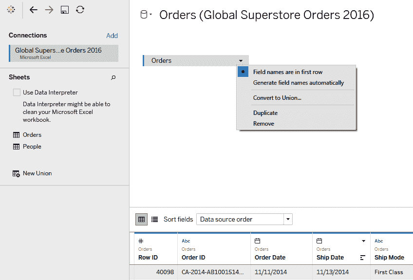

# 第一章：构建您的数据模型

数据分析和可视化是相辅相成的。Tableau 允许用户执行深入的数据分析，并通过交互式可视化共享结果。Tableau 包含许多数据建模功能，使用户能够理解数据并获得有意义的洞察，而无需处理高级数据库概念。数据建模是一个重要的概念，您处理的数据越多，它就越重要。

随着我们处理的信息量的增加，我们需要能够高效地执行分析。数据建模不仅使我们能够为我们的分析做好准备，而且还能使其尽可能高效。最终，我们使用数据来帮助我们做出更好的决策。花时间学习我们如何建模数据将帮助我们确定我们可以回答哪些问题，以及如何回答这些问题。无论您正在处理的数据量有多大，Tableau 都将帮助您轻松地获得洞察力。

本章将解释如何连接到您的数据，并使用 Tableau 的数据建模功能开始您的分析。

本章将涵盖以下主题：

+   初始准备

+   连接到您的数据

+   构建您的数据模型

+   准备您的数据

# 技术要求

本章使用全球超市数据集，可以在[`www.tableau.com/sites/default/files/getting_started_data_sets.zip`](https://www.tableau.com/sites/default/files/getting_started_data_sets.zip)找到。

一旦提取，您将看到两个文件：

+   `Global Superstore Orders 2016`

+   `Global Superstore Returns 2016`

我们认为，跟随示例学习是学习并熟悉任何应用程序的最佳方式。请使用本章提供的示例进行学习，或者找到您感兴趣的数据集。

# 初始准备

在连接到您的数据之前，您需要做一些事情。首先，您必须寻找能够回答您问题的数据。一旦您验证了数据的存在、存储位置以及如何获取访问权限（如果需要的话），您就可以开始了。在大多数情况下，您将直接使用用户名和密码连接到数据库。然而，您也可以连接到您本地机器上的文件，例如 Excel 工作簿。如果需要，您甚至可以结合使用这两种方式。

# 全球超市数据集

全球超市数据集来自一个虚构的全球零售连锁店，该连锁店销售办公用品。在现实世界中，您很可能会连接到数据库；然而，处理 Excel 文件的方式类似——Excel 中的工作表类似于数据库中的表。这些工作簿中的数据类似于您在数据库中看到的数据。

全球超市数据集包含一个 Excel 工作簿和一个 Excel CSV 文件：

+   `Global Superstore Orders 2016` (`.xlsx`)

    工作表 1：`Orders`

    工作表 2：`People`

+   `Global Superstore Returns 2016` (`.csv`)

    工作表 1：`Global Superstore Returns 2016`

`Orders`工作表包含销售数据，其中每条记录（行 ID）代表一笔单独的交易：

`People`工作表包含人员到地区的映射：

`Global Superstore Returns 2016`工作表包含按地区返回的订单 ID：

我们已经找到了我们分析所需的数据，我们知道它的位置，并且可以访问使用它。现在我们将继续使用 Tableau 连接到数据源。

通过查看一些记录来了解您正在处理的数据总是一个好主意。如果您正在处理 Excel 文件，请在 Excel 中打开它，以了解数据集。

# 连接到您的数据

在深入数据之前，您必须先连接到它。Tableau 允许您连接到众多数据源。您可以连接到本地机器上的文件，到服务器上的数据库或其他数据库源。Tableau 允许用户连接到众多数据源——要查看完整列表，请访问 Tableau 的网站以查看全面且最新的列表。您可以在启动页面的**连接**面板中找到可以连接的数据源类型。您最近连接的文件也将显示在此页面上。

根据您使用的 Tableau Desktop 版本，您将能够访问不同的内置连接器。搜索您所需的连接类型以连接到您的数据。如果您正在连接到常用连接器，那么它几乎肯定可用。如果您需要连接的文件或数据库在连接面板部分不可用，您可以使用其他数据库（ODBC）或 Web 数据连接器创建自定义连接。您可以通过点击“更多...”按钮（位于“到文件”或“到服务器”部分下）在连接面板中查看 Tableau 允许的所有原生数据连接类型列表：

如果您要连接的数据源在**连接**面板中不可用，请在网上进行一些研究。社区通常会提供一些有用的建议，帮助您解决可能会遇到的问题或问题。

现在我们将转到连接到 Global Superstore Orders 数据集。

# 连接到 Global Superstore 数据集

在连接面板中点击 Microsoft Excel 按钮。它将在“到文件”部分下。您的文件浏览器窗口将打开。导航到并打开`Global Superstore Orders 2016`Excel 文件：

连接到数据源后，您将被带到数据源屏幕。从该屏幕，我们可以选择我们想要在分析中使用哪些表（在这种情况下，工作表）：

在“连接”面板（在“工作表”部分下）中双击“Orders”表格图标，或将“Orders”表格图标拖放到画布上。然后你将在画布中看到订单（左侧有一个带有蓝色边框的矩形名称图标）。你还会在数据网格中看到 1,000 行的样本。 我们之前提到，在开始处理数据之前查看数据非常重要。数据网格是这样做的一种简单方式。

“数据源”页面允许你准备分析数据。一旦连接到数据源，你就可以更改 Tableau 导入和解释表格的方式。 看看前面的截图，它显示了连接到并从“*全球超级商店订单 2016*”数据集导入订单表后的“数据源”页面。

“数据源”页面有四个主要部分。以下截图中突出显示了这些部分。接下来，我们将详细查看这些部分，从左侧面板开始：

# 左侧面板

左侧面板显示了已连接数据源的联系细节。此部分允许你使用添加按钮添加额外的数据源连接。

当连接到平面文件（例如 Excel）时，连接部分将显示你连接到的 Excel 工作簿以及在此列出的工作表。在前面的截图中，`Global Superstore Orders 2016`是 Excel 工作簿，工作表是`Orders`和`People`。

当连接到数据库时，左侧面板将显示服务器名称、数据库、模式和以下截图中的表格：

如果你将鼠标悬停在连接名称的右侧，会出现一个向下箭头。这允许我们对连接进行额外更改，例如重命名它。

你可以通过将鼠标悬停在表格名称的右侧，然后点击查看数据图标来查看你连接到的任何表格中的记录。这在上面的截图中显示：

这将导致以下弹出窗口：

如果你需要返回起始页面，请点击屏幕左上角的 Tableau 标志（在文件下）。

# 画布

画布显示数据导入详情以及建模选项（连接、跨数据库连接、数据混合、自定义 SQL 和数据准备）。你在“连接”面板中看到的表格就是你能够访问的。在将左侧面板中的表格拖放到画布（或双击）后，你将在画布中看到它们。你只能处理已导入画布中的数据。

一旦表格已导入画布，你可以通过双击矩形名称图标来重命名它。

当您将鼠标悬停在画布中的订单图标上时，会出现一个向下箭头图标。单击它以查看可以对表进行的其他修改。您可以在以下屏幕截图中看到下拉菜单以及选项：

# 数据网格

数据网格是导入数据的表格视图（默认显示为前 1,000 条记录的视图）。以下屏幕截图显示了数据网格以及记录的样本：

您可以通过双击名称来重命名列，如下面的屏幕截图所示：

连接到数据源后，Tableau 会自动识别列的数据类型。偶尔，，列会被错误分类。例如，Tableau 可能会将包含日期的字段解释为整数数据类型，而不是日期数据类型。您可以通过单击数据类型图标并选择新的数据类型来更改列的数据类型，如下面的屏幕截图所示：

当您将鼠标悬停在列名右上角时，会出现一个向下箭头。这允许我们对列进行额外的属性更改。您可以在以下屏幕截图中看到下拉菜单以及选项：

在 Tableau 中，通常有多种方式来完成同一项任务。找出最适合您工作流程的方法，并坚持使用它。

# 元数据网格

元数据网格允许您快速查看已导入的字段、源表和远程字段名（字段在数据源中的名称）。单击管理元数据图标（位于排序字段左侧）以获取数据源结构的概览。

您可以对列执行与数据网格视图中相同的所有操作（例如，重命名列，更改列的数据类型等）。以下屏幕截图显示了在管理元数据视图中如何呈现字段名、表和远程字段名：

一旦将表导入到画布中，您可以通过单击管理元数据图标来快速探索字段名和数据类型。这是一个验证您正在导入内容的绝佳视图。

在下一节中，我们将讨论在构建可视化之前必须完成的事情。

# 构建您的数据模型

构建你的数据模型包括你在分析之前如何组合你的数据。在确定数据模型结构时需要考虑许多因素——数据的数量、数据的类型、数据的粒度、数据源的数量等等。数据源页面是我们设置 Tableau 如何解释数据源数据的页面。我们在该页面上修改的设置告诉 Tableau 数据在哪里（例如，网络位置、服务器名称等）以及哪些数据可用，并允许我们自定义导入的数据（例如，更改字段名称、基于计算创建新列等）。

Tableau 允许你轻松地将来自不同来源的数据组合在一起。以下是我们在数据源页面上可以如何将数据连接在一起的各种方式。

+   **来自单一数据源的数据**：当只需要一个表格时，工作流程很简单——只需将表格名称（或双击）从左侧面板拖动到画布上。你只需要建立一个数据连接。

+   **来自单一数据库但多个表格的数据**：当在同一个数据库中使用多个表格时，画布会给你提供连接和合并表格的能力。你只需要建立一个数据连接。

+   **来自多个数据库和多个表格的数据**：如果你连接到多个数据库并且需要使用来自许多表格的数据，则可以使用跨数据库连接。

+   **数据混合**：这显示了来自两个不同来源且粒度不同的数据。你需要建立多个数据连接。

现在我们已经对数据源页面上的功能有了大致的了解，接下来让我们看看如何进一步细化我们的数据模型。

# 准备你的数据

一旦定义了数据源，你就可以应用各种操作来帮助你整理数据，以便进行分析。我们将首先讨论数据类型以及如何处理它们。

# 处理数据类型

如果你之前从事过数据分析工作，你就知道与正确的数据类型一起工作是多么重要。Tableau 允许用户在几个不同的地方进行所有常见的数据类型转换。我们将在接下来的章节中更详细地讨论数据类型，但请记住，你可以在元数据面板中更改数据类型。Tableau 中的可用数据类型在以下表中展示：

| 图标 | 数据类型 |
| --- | --- |
|           | 文本（字符串）值 |
|          | 日期值 |
|          | 日期和时间值 |
|           | 数值 |
|            | 布尔值（仅关系型） |
|           | 地理值（用于地图） |
|           | 聚类组 ([`help.tableau.com/current/pro/desktop/en-us/clustering.htm`](https://help.tableau.com/current/pro/desktop/en-us/clustering.htm)) |

连接到您的数据后，点击页面中央的“管理元数据”图标（位于“排序字段”下拉菜单的左侧）。元数据网格视图将出现：

要更改字段的类型，请点击字段名左侧的数据类型图标。在这里，您可以在数据类型之间进行转换。面板中还有各种地理数据类型：

您可能想要更改数据类型的一个例子是，当您将日期作为字符串而不是日期导入时。您可以点击图标并将其转换为日期字段，而无需对源数据进行任何更改。

# 数据转换

如果您之前使用过 Microsoft Excel 或表格格式的数据，您可能已经进行过数据转换。通常，当数据以交叉表格式存在时，您会想要转换数据以便在 Tableau 中使用。虽然宽数据可能适合于报告，但在进行分析时，数据应该是长的。连接到您的数据源后，选择多个列。点击列名右上角的下拉箭头，然后在菜单中点击“转换”选项：

您之前选择的列将被转换。在您进行任何转换后，始终验证您的数据；这将使您对分析结果充满信心。您可以通过类似的方式向转换中添加或删除额外的列 – 点击您感兴趣的域的下拉箭头，然后按照说明操作：

您可以使用自定义 SQL 将数据库中的表数据进行转换。请注意，Tableau Desktop 中的数据转换选项仅适用于选定的数据源，例如文本文件、Google 表格、Microsoft Excel 和 PDF 文件。如果您正在使用 SQL，则必须使用自定义 SQL 来转换您的数据。

# 拆分字段

如果您的某个字段是字符串类型并且您需要将其拆分，您可以使用 Tableau 的拆分到多个字段选项。当您在数据网格中的数据源页面上时，点击列旁边的下拉箭头图标，然后点击“拆分”选项。拆分将是自动的，但如果您点击“自定义拆分...”选项，您可以获得更多控制拆分的能力。在使用自动拆分选项时，字段将根据 Tableau 识别的公共分隔符进行拆分。在以下示例中，它是在名字和姓氏之间的空格。

您可能想要使用此选项的一个例子是，如果您有一个列中有全名，并且需要在不同的列中分别有名字和姓氏：

在拆分列之后，你可以看到出现了两个新的列——一个包含名字，另一个包含姓氏。你可以通过双击列名来重命名列：

# 数据过滤

Tableau 是为处理大数据而构建的，但随着数据量的增加，你的性能会受到冲击。管理分析性能的最好方法之一是限制 Tableau 需要读取的数据量。在数据源页面上，你可以包含一个数据源过滤器。

要添加数据源过滤器，请点击画布的过滤器部分中的添加按钮。将出现一个编辑数据源过滤器菜单。点击添加并选择你想要应用的过滤器。你可以使用相同的方法添加更多过滤器或删除已添加的过滤器：

# 合并数据

在进行数据分析时，你经常会处理多个表格中的数据。Tableau 允许你使用多种方法结合数据源。以下是最主要的四种方法：

+   连接

+   跨数据库连接

+   工会

+   混合

以下部分将详细解释这些方法。

# 连接

通过连接数据，你可以使用公共字段合并表格以执行分析。你可以将连接表格视为通过从源表添加列到目标表来扩展表格。你可以在 Tableau 中使用公共字段（存在于两个表格中的列）合并表格。根据相关字段，我们可以合并多个表格中的行。如果你使用的表格来自同一来源（数据库、工作簿等），则该过程涉及单个连接。使用来自同一数据源的表格进行计算更有效；然而，这不是必需的。

`Orders` 表格应该已经位于画布中。

双击或拖动 `People` 表格到画布上（画布中每个表格名称的矩形图标之间将出现一个内连接图标）。

选择/更改连接类型（当将新表格拖入画布区域时，Tableau 将寻找用于连接的列——在我们的例子中，它已经连接在 `Region` 上，这是两个工作表中的列）。

你可以点击蓝色的内连接图标来更改表格连接的方式。你可能想要编辑连接类型（例如，内连接到左连接）或者甚至通过添加更多条件来编辑子句本身。以下截图显示了 `Orders` 和 `People` 工作表之间连接的结果：

你可以在连接后查看数据网格中的数据，以直观地检查错误。

# 连接类型

Tableau 支持所有四种基本的 SQL 连接类型：**内连接**、**左连接**、**右连接**和**全外连接**。在连接数据之前，你必须验证用于连接的公共字段的数据类型是否相同：

| **连接类型** | **描述** | **连接的维恩图** |
| --- | --- | --- |
| 内连接 | 结果集包括两个表中都有匹配值的所有记录。对于全球超级商店订单 2016 的示例，这将返回 `Orders` 表中所有在 `People` 表中有匹配人员的记录。 |  |
| 左连接 | 结果集包括左表（`Orders`）中的所有记录以及 `People` 表中的匹配记录。对于没有匹配的记录，将出现 NULL 值。 |  |
| 右连接 | 结果集包括右表（`People`）中的所有记录以及 `Orders` 表中的匹配记录。对于没有匹配的记录，将出现 NULL 值。 |  |
| 全外连接 | 结果集包括两个表中的所有记录，无论是否有匹配。 |  |

Tableau 中可以连接的最大表数是 32。表也有 255 列的限制。

关于连接的一些说明如下：

1.  点击并拖动（或双击）左侧面板中的第二个表到画布上。

1.  Tableau 将自动尝试从两个数据源中检测到一个公共字段，以便连接两个表。

1.  点击连接图标以更改连接类型或通过添加/删除附加子句来更改连接操作。完成后，关闭连接对话框。

1.  验证连接，以便数据面板将反映您希望 Tableau 在数据网格中如何摄取数据。要删除连接，请点击连接条件旁边的 x 按钮图标。

接下来，我们将继续介绍类似类型的连接——跨数据库连接。

# 跨数据库连接

跨数据库连接是在不同数据库中的两个或多个表之间进行的内部、左、右或全外连接。您经常会遇到包含不同信息的多个数据库系统。订单信息可能存储在 Amazon Redshift 数据库中，而商店位置信息可能存储在 SQL Server 数据库中。要连接来自不同来源的信息，您需要使用跨数据库连接。

数据可能存在于不同的数据库中可能有多个原因，但这超出了本章的范围。

提到的四种连接类型在跨数据库连接中都是可用的。跨数据库连接需要一个多连接数据源设置。这意味着您需要为要连接的每个表创建到每个数据库的新连接。我们已连接到 `Global Super Orders 2016` Excel 工作簿并引入了 `Orders` 表。我们希望将订单与 `Returns` 表连接起来，但它位于不同的文件中（`Global Superstore Returns 2016.csv`）。

虽然我们正在处理平面文件中的数据，但与数据库一起工作时过程类似。每个连接都将指向数据库而不是平面文件。

在下面的屏幕截图中，我们可以看到我们连接到了一个数据源（`Global Superstore Orders 2016`）。`Orders` 工作表已经被导入到画布上：

要将 `Returns` 表连接到 `Orders` 表，通过点击连接面板中的添加链接选项连接到 `Global Superstore Returns 2016`。从这里，导航到文件并双击它：

一旦添加了第二个连接，你将在现有的连接下看到连接名称以及连接面板文件部分下的所有表。双击 `Global Superstore Returns 2016` 表名称（或将其拖放到画布上），Tableau 将尝试自动连接这些表。在我们的例子中，连接是在 `Order ID` 列上完成的，这是两个表中的公共字段：

当你进行交叉连接表时，Tableau 将根据它们的来源进行颜色编码。请注意，画布上的 `Orders` 表有一个蓝色的左边界，表示它来自 `Global Superstore Orders 2016` 工作簿。同样，来自 `Global Superstore Returns 2016` 平文件的表在画布上有一个橙色的左边界。画布上矩形表按钮的边框对应于其连接的颜色。在执行跨数据库连接后查看数据网格时，列的顶部边框将根据连接名称进行颜色编码。

以下是一些关于跨数据库连接的说明：

1.  点击连接面板中的添加按钮以添加新的连接。在连接存储在该源中的表之前，必须先建立到另一个数据源的连接。

1.  在新连接下选择第二个表，然后点击并拖动（或双击）左面板中的第二个表到画布上。Tableau 将自动尝试使用公共字段连接表。

1.  点击 **连接** 图标以更改连接类型或通过添加/删除附加子句来更改连接操作。完成后，关闭 **连接** 对话框。

1.  验证连接是否正确完成。数据网格将显示连接后的数据结果，这应该有助于你轻松地识别连接中是否存在问题。

跨数据库连接非常强大，因为它们通常是连接来自不同数据库的表的最简单方式。

接下来，我们将描述 Tableau 如何进行数据并集。

# 并集

并集是另一种合并数据的方式。当你将两个表进行并集操作时，你会将一个表的行追加到另一个表中。由于你实际上是在一个表上堆叠另一个表，因此必须满足一个重要的条件——将要堆叠的列的数据类型需要兼容。你不应该在文本列上堆叠日期列。

下表包括联合操作的描述以及一个维恩图，以帮助您可视化联合操作的工作方式：

| **联合** | **描述** | **联合操作的维恩图** |
| --- | --- | --- |
| 联合 | 联合的结果集是第一个表的所有记录附加到第二个表的所有记录上。  |  |

为了说明联合操作，我们将把“订单”表附加到自身；这将产生一个结果集，其中每个记录都被复制。请确保“全球超级商店订单 2016”连接被高亮显示，然后点击并拖动“订单”表到画布上，覆盖已经存在于画布上的“订单”表矩形按钮。将其放下：

您将在“订单”表图标右侧看到一个加号符号，以及在其下方露出的表图标。这表示联合操作成功：

如果您右键单击“订单”表图标，将出现一个子菜单。点击编辑联合...：

特定（手动）菜单允许您查看您的联合中有多少个表。您还可以通过在特定（手动）菜单的画布上拖动表来联合表：

第二种选项是让 Tableau 根据您设置的通配符条件自动将表包含到您的连接中。这在您希望附加具有不同日期后缀的多个表时非常有用：

在 Tableau 中，您不能从不同的数据库中联合表（跨数据库联合），但这可能在未来的更新中改变。虽然您不能从不同的数据库中联合表，但您可以从不同的 Excel 工作簿中联合表（工作表）。Tableau 发布了一个名为**Tableau Prep Builder**的工具，允许您跨多个连接联合数据，但这超出了本章的范围。有关 Tableau Prep 的更多信息，请访问产品页面[`www.tableau.com/products/prep`](https://www.tableau.com/products/prep)。

接下来，我们将讨论混合操作及其与连接操作的不同之处。

# 混合

与连接和联合操作类似，数据混合允许您处理来自不同来源的数据。混合操作允许您在同一视图中展示来自两个或更多来源的数据。混合操作与连接操作的区别在于，当您进行混合操作时，您并不是在行级别合并数据。混合操作是一种关系。它允许来自不同来源的数据在同一张表中显示。当您需要展示来自两个不同来源且粒度不同数据时，主要使用数据混合操作。

当您连接到数据库时，Tableau 会自动在连接图标旁边显示蓝色勾选标记（见以下截图）。蓝色勾选标记表示它是主要数据源，或第一个连接的数据源。添加第二个连接后，将出现一个额外的图标，这次带有橙色勾选标记。混合的说明如下：

1.  确保工作簿包含至少两个数据源。您可以通过在菜单中单击数据 > 新数据源来完成此操作。

1.  主要数据源是带有蓝色勾选标记的数据库图标；带有橙色勾选标记的数据库图标是次要源。在数据面板中单击次要数据库图标以使用此源的字段。

1.  橙色链接图标表示用于混合数据源的字段。如果链接图标为灰色，请单击它以激活混合。

1.  使用与在主要数据源中一样的方式使用次要数据源的字段。

以下截图显示了成功混合后数据面板的显示：

在分析之前，我们已经学习了如何连接、准备和连接我们的数据。在下一节中，我们将总结本章所学的内容。

# 摘要

我们已经了解了在 Tableau 中建模数据的一些方法。在这个阶段，您知道如何连接到数据源。您也应该看到数据源页面在建模数据时的重要性。如果您使用本节中可用的许多功能，您的生活会变得容易得多。

在 Tableau 中进行数据建模的主要收获是它帮助您准备工作区，以便使用数据来回答问题。花时间了解您的业务或项目需求将有助于您进行更好的分析。Tableau 允许您快速连接并构建可视化，但不应忽略数据源页面。Tableau 还通过新版本添加了额外功能。在下一章中，您将学习如何使用您已准备的数据开始构建您的可视化，以便分享见解。

# 问题

回答以下问题以测试您对本章信息的了解。

1. 要连接到多个数据源中的多个表，必须指定什么？

a. 一种混合

b. 数据库间连接

c. 连接

A: b. 数据库间连接

2. Tableau 支持哪些类型的连接？

A: 内连接，左连接，右连接和全外连接

3. 您可以在 Tableau 的数据源页面中更改字段的类型。

a. 正确

b. 错误

A: a. 正确

4. Tableau 有行数限制。

a. 正确

b. 错误

A: b. 错误

# 进一步阅读

您可以查看以下链接以获取有关本章所涵盖主题的更多信息：

+   支持的连接器（Tableau 可以连接到的数据源）完整列表：[`help.tableau.com/current/pro/desktop/en-gb/exampleconnections_overview.htm`](https://help.tableau.com/current/pro/desktop/en-gb/exampleconnections_overview.htm).
