# 可视化地理数据

几个世纪以来，地图一直被用来传达有意义的数据。我们习惯于看到地图表示我们周围常见的数据，无论是 Google Maps 计算距离，Uber 跟踪地点的成本和距离，还是天气预报查看每个地区，等等。在上一个章节中，我们了解了一些**显示我**菜单中可用的标准地图图表，以及我们如何使用这些图表来可视化地理数据。在本章中，我们将更深入地探讨 Tableau 的各种映射功能，并涵盖以下主题：

+   映射基础

+   地图导航 – 地理搜索、平移和缩放、标记选择和缩放

+   地图功能 – 分层和自定义区域

+   修改位置

+   导入和管理自定义地理编码

+   连接到空间数据

+   使用背景截图地图

+   创建密度地图

# 技术要求

本章使用以下数据集：

+   全球超级商店数据集，可在[`www.tableau.com/sites/default/files/training/global_superstore.zip`](http://www.tableau.com/sites/default/files/training/global_superstore.zip)找到。

+   伦敦地区数据集，可在[`data.london.gov.uk/download/statistical-gis-boundary-files-london/08d31995-dd27-423c-a987-57fe8e952990/London-wards-2018.zip`](https://data.london.gov.uk/download/statistical-gis-boundary-files-london/08d31995-dd27-423c-a987-57fe8e952990/London-wards-2018.zip)找到。

+   311 求助数据集，可在[`data.nola.gov/City-Administration/311-Calls-Historic-Data-2012-2018-/3iz8-nghx`](https://data.nola.gov/City-Administration/311-Calls-Historic-Data-2012-2018-/3iz8-nghx)找到。

# 映射基础

Tableau 中的映射非常简单，基于可以由它们旁边的地球符号识别的地理数据字段。要创建地图，选择地理字段和任何度量，然后点击**显示我**窗口。如图所示，Tableau 自动突出显示符号地图作为首选的可视化：

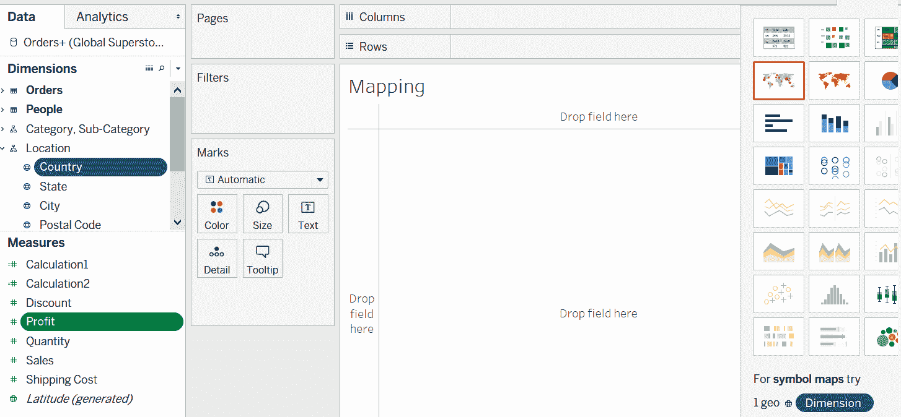

一旦点击，它将创建以下截图。如图所示，对于每个国家，符号标记位于位置的地理中心：

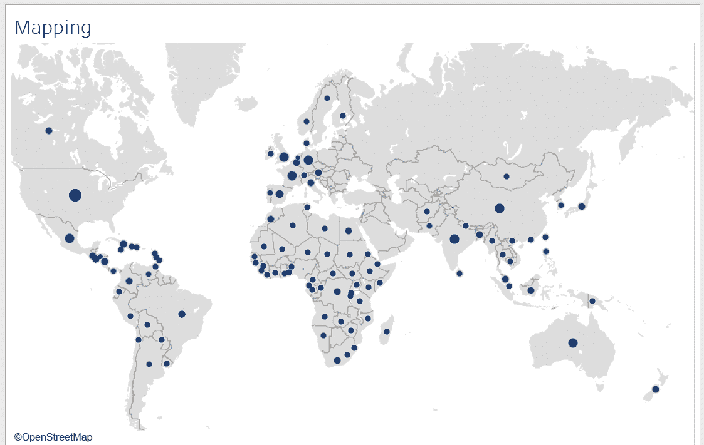

符号地图始终在地理中心绘制标记，并且可以同时绘制两个度量。另一方面，填充地图使用地理位置来定义填充的边界，并且一次只能绘制一个度量。使用**显示我**菜单，如果我们现在切换到填充地图，我们可以看到以下截图：

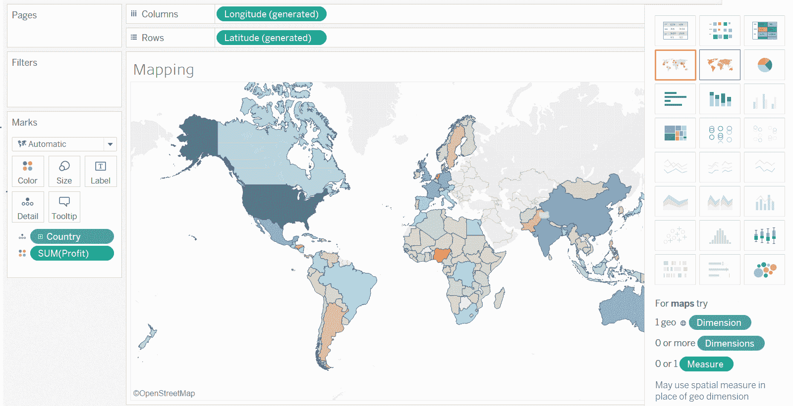

如果您的数据中没有自动检测到地理字段，请右键单击您想要显示的字段。点击**地理角色 | 适当级别**。例如，在下面的截图中，如果`国家`没有自动检测为地理字段，我们可以右键单击并选择**地理角色 |** **国家/地区**：

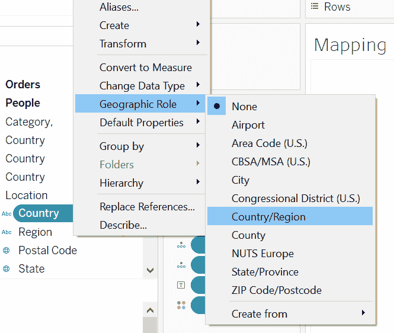

这会将`国家`字段转换为**地理字段**，可以在**符号地图**和**填充地图**中使用。**符号地图**和**填充地图**的不同之处在于它们可以显示的度量数和它们如何可视化数据。除此之外，两种地图都有相同的共享常见功能和属性。从本节开始，我们将使用通用术语**地图**来指代它们，而不是区分它们。此处之后讨论的所有属性都适用于这两种地图视觉。现在我们已经澄清了这一点，让我们深入了解各种**地图导航**功能。

# 地图导航

当鼠标在任何地图位置上时，默认情况下会显示**地图选项**菜单，如下面的截图所示：

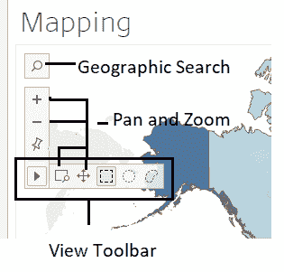

如果您没有看到这些选项，请不要担心。在**菜单栏**上，点击**地图 | 地图选项**，它将显示添加到屏幕上的选项。您可以在下面的截图中看到我们只有**显示地图比例尺**选项未被勾选。请继续勾选它：

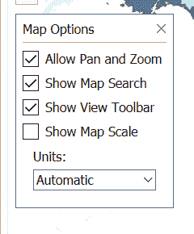

您会注意到屏幕右下角，地图比例尺的准确性已经出现。您缩放得越近，准确性就越高。拥有易于查看的距离比例尺使我们能够查看英里、千米或您偏好的任何单位：

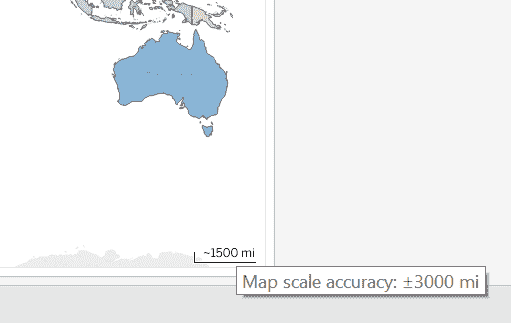

现在，让我们详细看看每个功能。

# 平移和缩放

平移和缩放功能使我们能够与地图上的数据进行交互和检查。我们可以聚焦于特定位置，并移动地图以聚焦于关键信息。

# 缩放

可以使用**放大 (+)**或**缩小 (-)**按钮来缩放地图。您也可以像通常那样使用鼠标进行缩放。或者，您可以**双击**来**放大**，按住*Shift*并**双击**来**缩小**。

一旦缩放，地图就会固定在视图中的该区域。要快速返回默认视图，点击**重置地图**图钉。例如，在下面的地图中，我们已缩放到欧洲，当我们点击重置地图时，它会带我们回到更宽的世界视图：

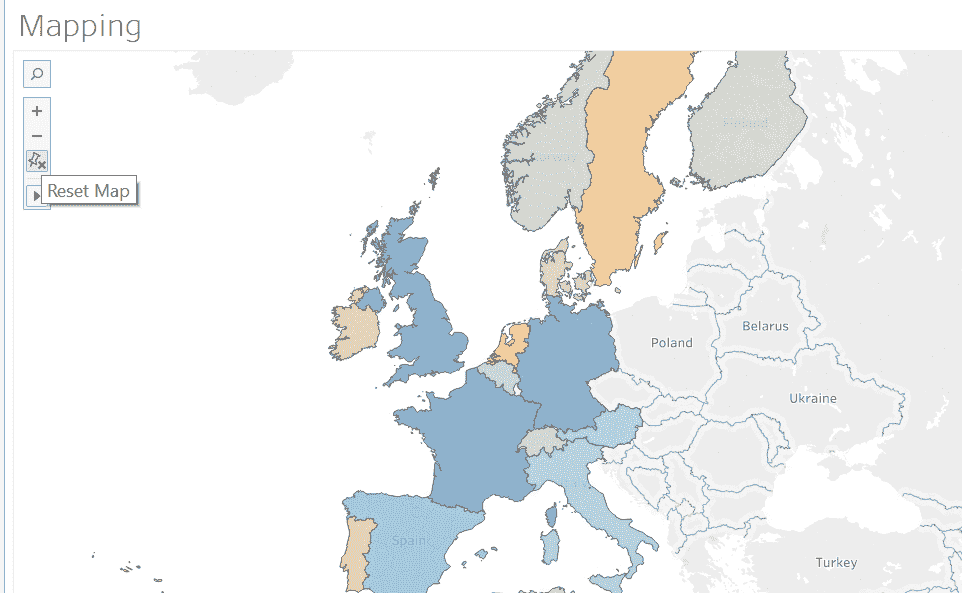

# 缩放区域

要放大到图上的特定区域，还可以使用缩放区域选项。只需从工具栏中选择**缩放区域**按钮 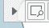，然后突出显示你想要缩放到的区域。在以下示例中，我们使用**缩放区域**按钮来放大加拿大和阿拉斯加：

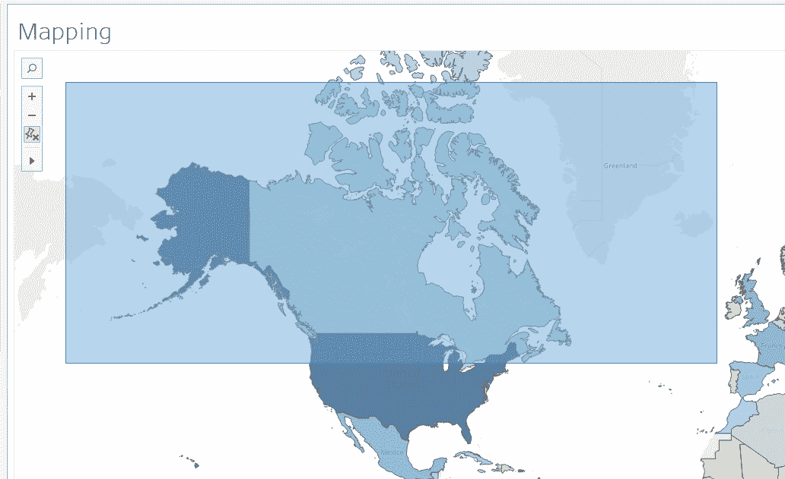

# 平移

**平移**选项位于**缩放区域**选项旁边。**平移**允许我们将地图移动到焦点或以我们想要的方式显示区域。要平移，只需选择**平移选项**，然后根据需要移动地图。或者，你可以按住*Shift*键并移动地图。例如，在以下地图中，位置已从默认显示移动到显示——首先显示亚洲在左侧，然后向上移动到右侧的欧洲和非洲：

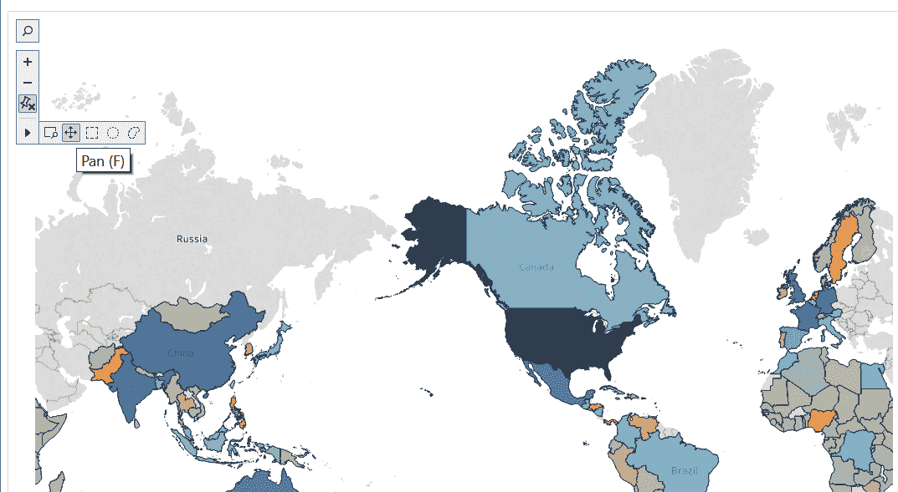

对于平移/缩放，使用快捷键可以更快地导航。双击以放大，按住*Shift*键并双击以缩小（或者使用默认的鼠标缩放），按住*Shift*键并移动地图以平移。

# 地理搜索

**地理搜索**功能使我们能够快速在地图上搜索位置。例如，在我们的国家地图上，如果我们想快速查找尼日利亚，我们只需简单地使用搜索框并输入`尼日利亚`。当你输入时，所有相关位置的建议列表都会显示出来：

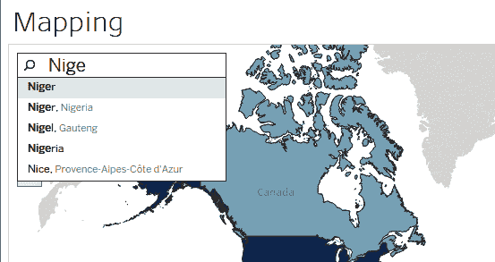

你可以在地图上搜索以下内容：

+   大洲

+   国家

+   州或省

+   县

+   城市

+   邮编

一旦你输入/选择**尼日利亚**并按*Enter*键，地图将放大以聚焦于它。你可能注意到地图再次被固定。每次你搜索/缩放/平移时，地图都会固定在那个位置。只需点击重置按钮即可重置到默认视图。以下截图显示了搜索**尼日利亚**后获得的结果：

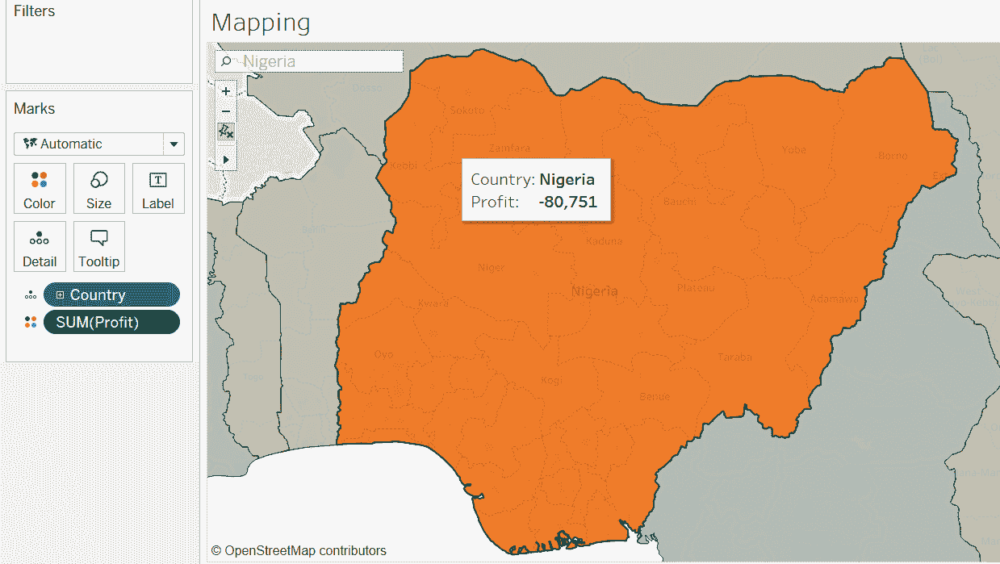

# 标记选择

与所有图表一样，你可以在地图上选择标记，并执行分组/集合创建等活动。除了常规的矩形选择外，地图还有两个其他选择功能，分别是**径向选择**和**套索选择**：

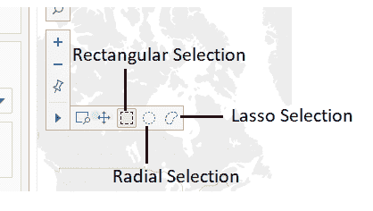

# 矩形选择

矩形选择是默认的选择选项。只需在屏幕上拖动鼠标进行选择：

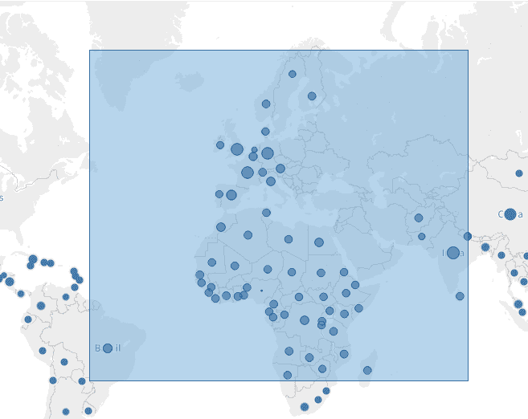

# 径向选择

径向选择是地图的一个超级有用的功能。它允许我们根据圆形半径选择位置，这反过来又允许我们查看点或计算位置之间的距离：

例如，我们想要找到美国纽约市 50 英里半径内所有城市的总利润。我们首先搜索并放大到美国纽约市。然后，我们选择**径向搜索**。现在，保持纽约市为中心，我们将半径从美国向外扩展 50 英里。下面的屏幕截图显示了径向搜索：

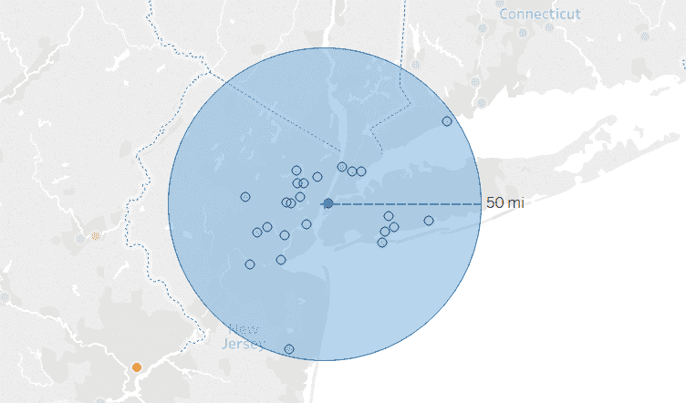

如果您看不到任何距离标记，请将位置放大一些，直到它们变得可见。一旦您选择了位置，就像前面的屏幕截图所示，您可以看到所选位置的摘要，就像使用矩形选择一样。在这里，我们可以看到利润总和为 79,534：

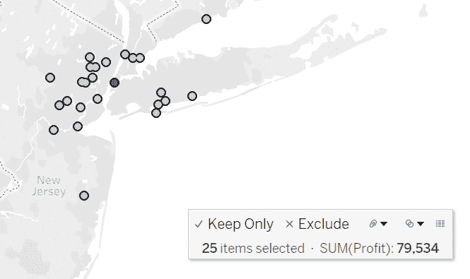

在这个例子中，我们使用了径向选择工具来定义位于一定半径内的位置。使用相同的原理，我们可以用它来找到两个位置之间的径向距离。例如，如果我们必须搜索圣地亚哥和洛杉矶之间的径向距离，我们首先对这两个位置进行筛选，然后在两点之间创建一个径向距离搜索。选择任何城市作为中心，并将半径扩展到达到另一个城市。在下面的屏幕截图中，我们保持了洛杉矶作为中心，并将半径扩展了 110 英里，直到我们到达圣地亚哥。因此，两个位置之间的径向距离是 110 英里：

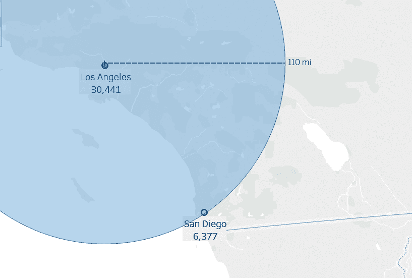

# 套索选择

有时候，边界选择方式不足以选择区域内的某些位置但排除其他位置。在这种情况下，**套索**（一种自由形状选择）是最好的选择。以下屏幕截图显示了这种选择的一个例子。在这里，我们选择了除了乔治亚州之外的所有我们想要的西部各州：

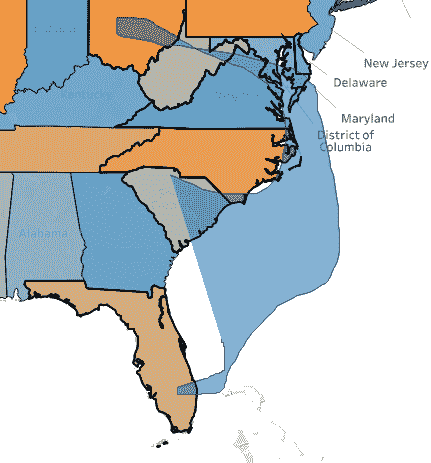

# 比例尺

要更改地图的比例尺，请转到**地图 | 地图选项**并选择**显示地图比例尺**选项。在这里，您可以在自动、公制系统或美国系统之间切换比例尺。一旦设置好比例尺，它们就会在地图的右下角显示出来。

仔细阅读与地图相关的任何问题中指定的单位。在执行下一步之前，您可能需要更改地图的比例尺。

# 地图功能 – 分层和自定义领土

现在我们已经学会了如何创建地图，让我们看看我们如何可以自定义某些地图细节，例如地图的颜色、它将显示的详细程度以及其中显示的领土。

# 地图图层

要查看可以添加或从地图中删除的图层或它在背景中的外观，请选择**地图 | 地图图层**。在 Tableau 的早期版本中，您会选择**地图 | 地图选项**。您将看到以下屏幕：

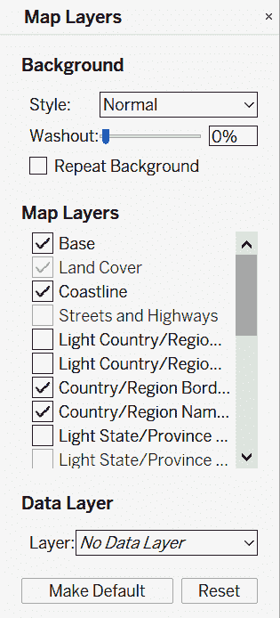

在这里，你可以选择和切换不同的背景：**正常**、**浅色**和**深色**。根据 Tableau 版本，你可能还有**街道**、**户外**和**卫星背景**可用：

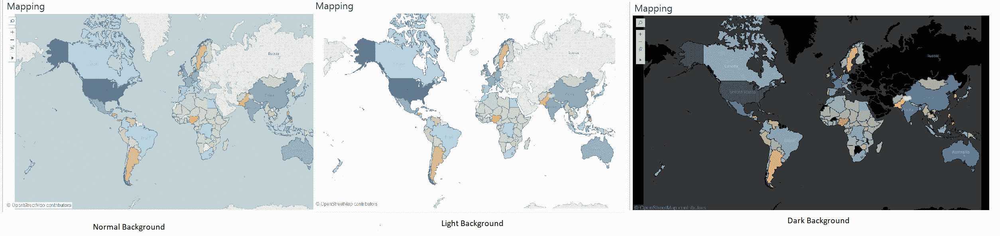

如以下截图所示，在**地图层**中，你可以添加你希望在地图上看到的详细信息。例如，在关注新泽西州后，地图现在显示了邮政编码、都市代码和都市边界，如以下截图所示：

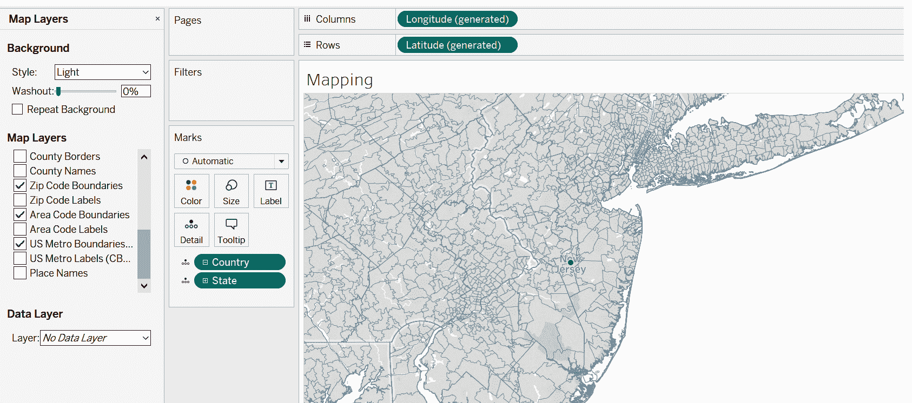

这些图层有助于为地图添加更深的细节层次，并允许你根据需要自定义要查看的内容。有许多地图层可用于不同地区。探索每个图层以查看你可以添加的内容。

某些地图层仅在特定缩放级别可用，如果你不在该级别，它们将显示为灰色。放大以显示更多图层。

除了更改地图背景和图层之外，Tableau 还提供了许多数据层，可用于在地图上叠加数据。要添加数据层，从**数据层**菜单中选择一个层。例如，为了了解美国`州`的`利润`是否与人们的平均年龄相关联，我们可以在图表上叠加**平均年龄**。

创建一个显示每个`州`的`利润`的符号图表，并放大查看美国。在**数据层**下，选择以下内容：

+   层：平均年龄

+   按州

+   **使用：蓝绿色序列**

你将看到以下图表：

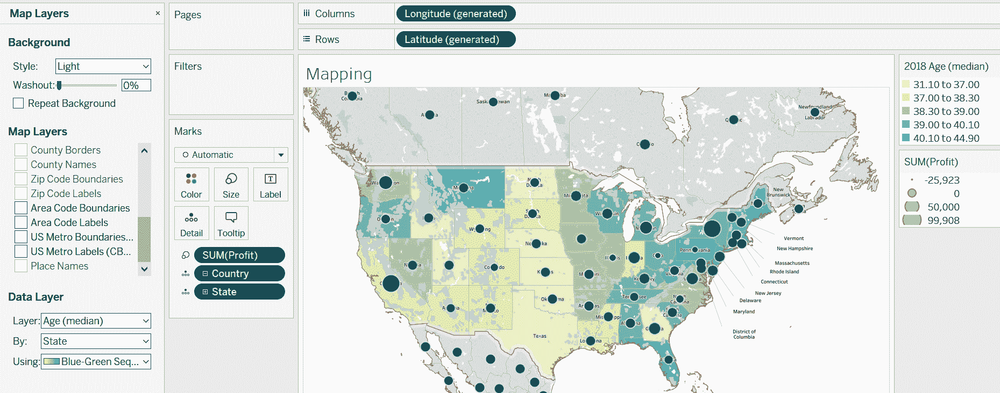

作为练习，添加几个数据层并更改级别以查看它们。这将使你更熟悉可用的数据层选项。

# 自定义领土

除了定义地图层显示的内容之外，我们还可以创建并显示你自己的自定义领土。我们可以以两种方式创建自己的领土：

+   分组位置

+   使用其他地理字段对字段进行地理编码

# 分组位置

假设你正在查看国家层面的数据，并且将欧洲大陆作为关注点。你不想逐个查看每个国家，而是希望将数据分为两个部分，即东欧和西欧。为了实现这一点，查看地图上的位置，并使用选择工具选择领土。一旦选中，点击以下截图所示的分组图标：

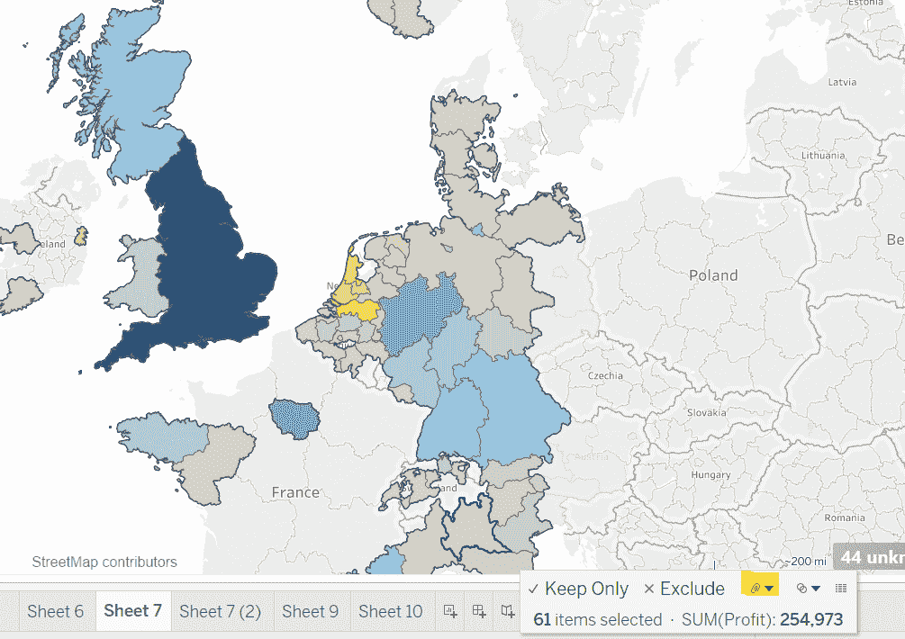

选择组将创建这些位置的组合组。它还会在标记面板上添加一个`国家 & 州`分组。你现在选中的所有位置都已分组，并将以相同的颜色显示：

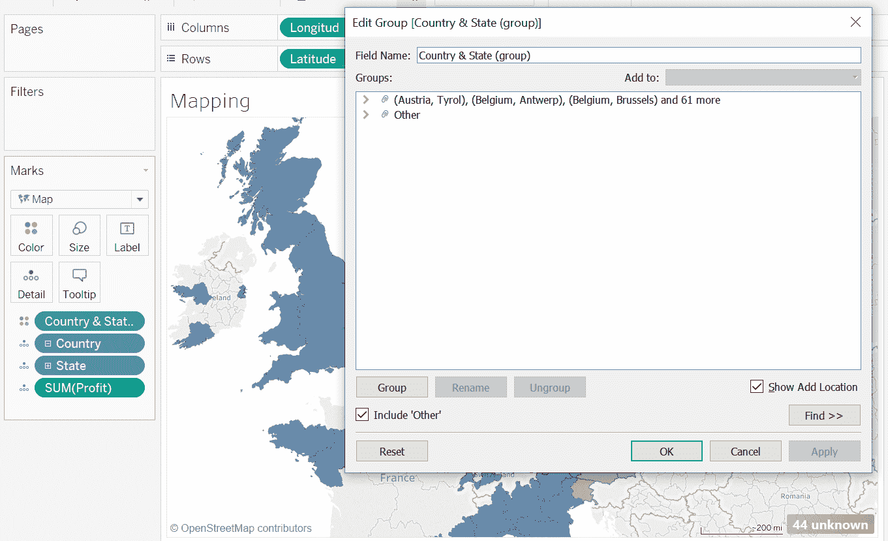

继续按照您想要的分组方式分组地点。一旦完成分组，从颜色架上移除该字段。从维度中，将`国家（分组）1`拖到标记详细架上，并将`利润`移回颜色。例如，在下面的截图中，基于国家，创建了两个名为组 1 和组 2 的组：

创建类似组的另一方法是右键点击地理字段并选择**创建组**。一旦创建组，将其拖到详细架上，并像使用任何其他地理字段一样使用它。

# 使用其他地理字段进行地理编码

创建自定义区域的另一种方法是，根据其他字段对数据中的自定义位置字段进行地理编码。

例如，我们想要将`区域`字段添加到`位置层级`中。为了实现这一点，右键点击`区域`字段。选择**地理角色 | 从 | 国家**。这样就将字段添加到了位置层级，并且旁边会出现表示地理字段的地球形状：

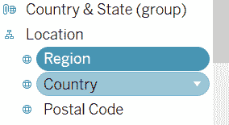

将`区域`字段拖到**标签**架上。你现在可以看到地图上显示的定制位置，如下面的截图所示：

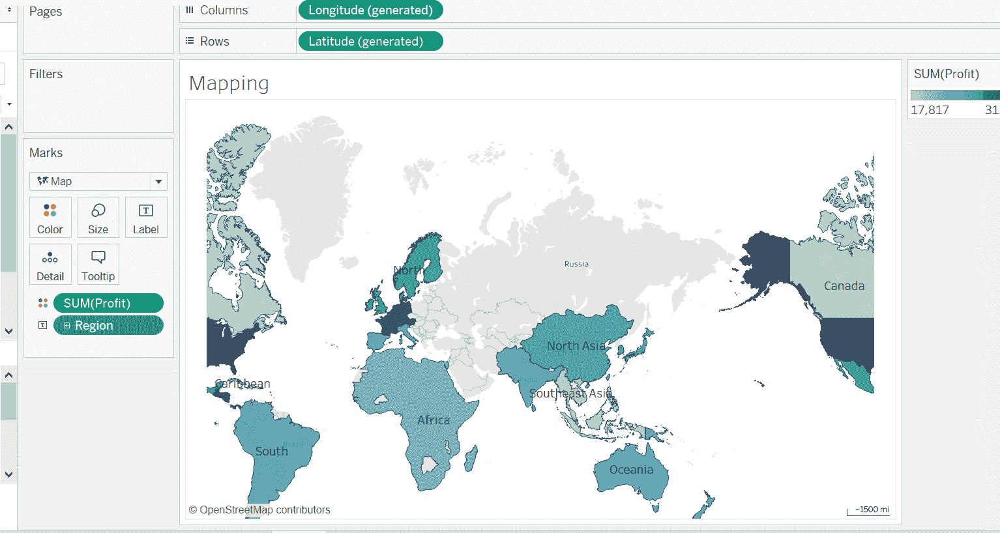

使用这种方法，您可以查看数据集中您拥有的任何自定义区域。

现在我们已经学习了如何创建地图和添加地理字段，我们将继续到下一节，在那里我们将学习如何修改地点以帮助处理错误或不明确的地点数据。

# 修改地点

一旦将字段定义为地理字段，Tableau 会自动检测地点的位置。有时，Tableau 会在屏幕右下角显示“x 未知”。这可能是因为位置可能不明确，即多个地点有相同的名称，或者拼写可能与 Tableau 识别的不符，例如。

修复大多数错误的最简单方法是也将其他数据字段带入地图细节中。例如，如果您只绘制城市，许多国家可能有相同的城市名称。添加国家和州可以帮助纠正此类错误。如果有地点的层次结构，Tableau 会自动使用它来消除歧义。如果在这样做之后仍然存在错误，您可以自定义编辑地点以使它们匹配。

# 编辑地点

要编辑地点，要么点击“x 未知”值的右下角，它将打开**编辑地点**窗口，要么转到**地图 |** **编辑地点**。

点击**国家/地区**。这将显示国家或地区是如何被检测到的。很多时候，这个字段被设置为特定国家的固定值。所以，如果你在英国，你的地图可能被设置为英国的固定字段。现在，如果你有一个包含美国各州的数据集，它将不会匹配任何位置。为了修复它，你需要编辑位置并设置固定的**字段**为**美国**，或者如果你的数据集包含一个`国家`字段，那么将其设置为从该字段匹配。在以下示例中，你可以看到**国家/地区**字段映射到`国家`地理字段，这是好的：

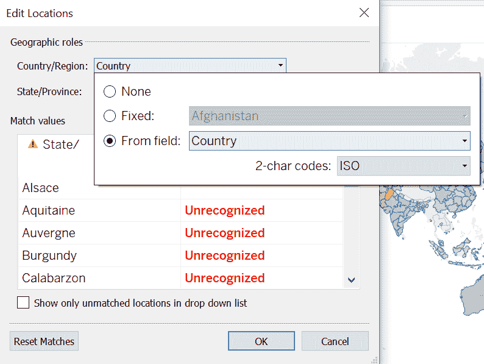

关闭该对话框，查看需要编辑的模糊值。你会注意到不匹配的位置被突出显示。例如，对于**下诺曼底**，我们知道这是**诺曼底**州。在**未识别**框中搜索*诺曼底*。一旦搜索并找到它，选择它。现在这将匹配位置，如下面的截图所示：

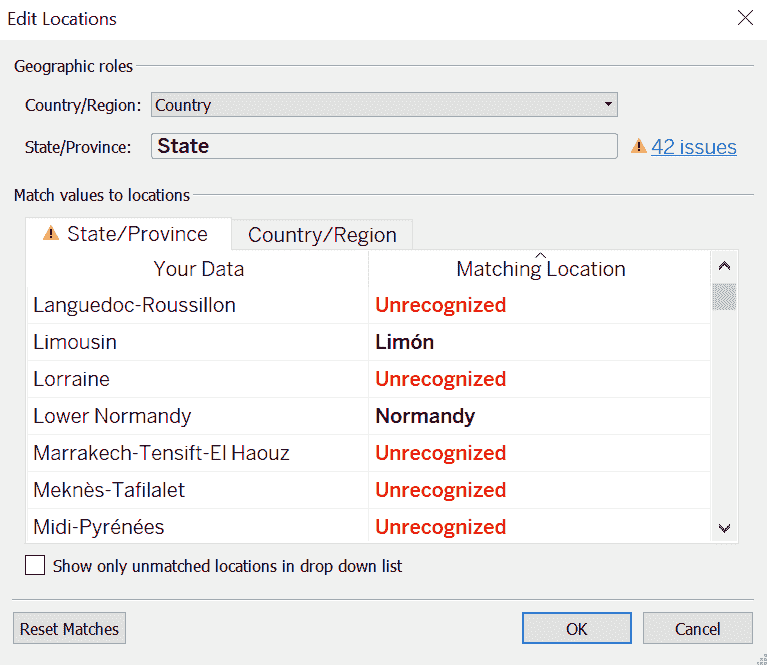

如果你找不到匹配的名称，但知道位置的纬度和经度，当你输入时，你将在对话框中看到一条消息说“输入纬度和经度值”。如果你看不到这个，只需输入任何数字。一旦点击它，它将打开一个框，你可以交替输入**纬度**和**经度**值，然后点击**确定**。

一旦你映射了所有可以映射的位置，点击确定。现在如果你查看右下角，**未知**的数量会减少。通过这种方式，即使你有自定义位置或不同的拼写，你也可以将它们自定义匹配到适当的位置以显示在地图上。到目前为止，我们已经学习了如何修改和匹配位置，以及创建自定义地理位置。在下一节中，我们将进一步学习如何将自定义地理编码导入到 Tableau 中。

# 导入和管理自定义地理编码

除了为城市、州、国家、国家/地区、邮政编码、邮政编码和县等地理位置提供标准地理编码之外，Tableau 还允许我们自定义导入自己的地理编码文件。如果 Tableau 无法映射的位置，例如街道地址，或者如果我们想定义自定义地理字段等，自定义地理编码文件非常有用。

要创建自定义地理编码，我们需要一个`.csv`文件导入到 Tableau 中。此文件必须包含作为实数的`纬度`和`经度`列，其中至少有一个小数点。除了这两列之外，其他列将取决于我们是在扩展现有角色还是添加新角色。

# 扩展现有角色

如果你的数据包含许多难以使用 Tableau 默认层次结构映射的位置，而不是尝试手动纠正每个错误，你只需扩展位置以包含这些缺失值即可。导入文件应包含与你要扩展的层次结构匹配的名称以及所有高于你要扩展的位置的数据。例如，如果你想扩展 `州` 映射以改进它，你需要包括 `州/省` 和 `国家` 的列，以及 `纬度` 和 `经度`。例如，如果我们想将以下位置添加到我们的数据中，我们首先创建一个 `.csv` 文件，如下所示：

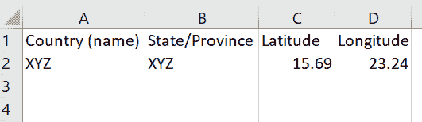

要导入数据，选择 **地图 | 地理编码 | **导入自定义地理编码**：

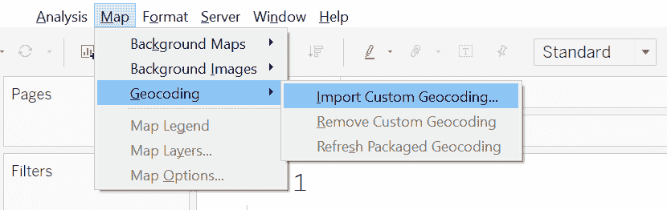

选择保存您的 `.csv` 文件所在的文件夹并点击 **导入**。根据默认文件的大小和要导入的地理编码，这可能需要几分钟，然后文件将被导入。

记住，在扩展地理编码时，最高级别是 **国家**。没有大陆级别。然而，如果我们想将地理编码扩展到大陆级别，我们可以添加新的角色。

# 添加新角色

例如，如果我们想创建一个包含 **大陆** 作为地理字段的地理位置层次结构，我们可以创建一个简单的数据集，如下所示：

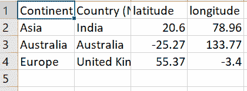

现在，点击 **地图 | 导入自定义地理编码** 并找到文件夹的位置。点击 **导入**。根据你的地理编码文件，导入文件可能需要几分钟。

现在，右键点击 **大陆 | 地理角色**：

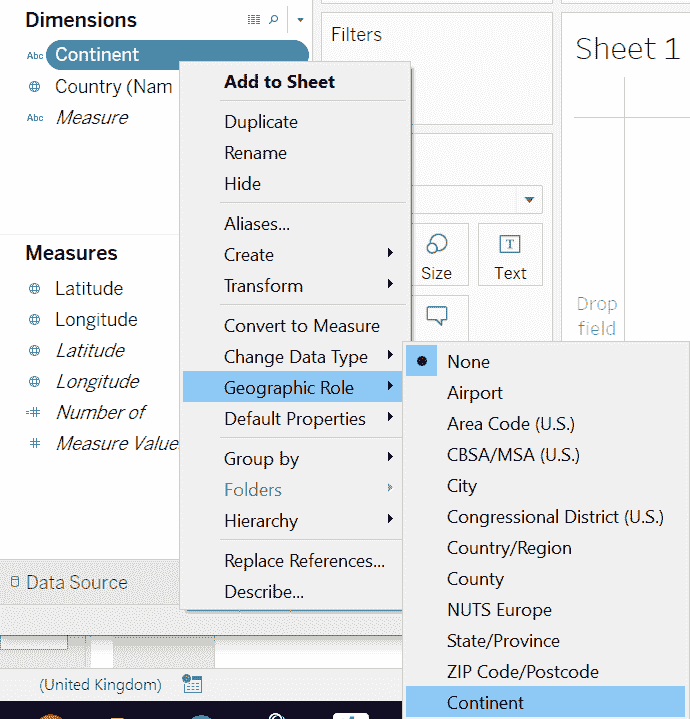

您将看到大陆作为一个角色出现。您可以选择将其作为 `大陆` 的地理类型。要创建自定义映射的地图，选择 `纬度` 和 `经度` 字段（不是生成的字段）以及大陆字段，并使用 **显示我** 菜单创建地图。现在，将 `大陆` 字段移动到 **标签**，这样您就可以看到 `大陆` 字段上的标签。您应该得到以下地图：

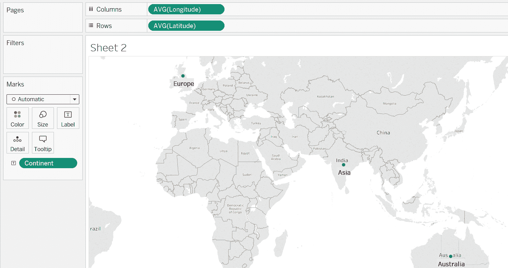

如您所见，所有的大陆都绘制在我们想要的位置。除了添加地理编码外，您还可以导入自己的空间文件来绘制地图。让我们在下一节中探讨它们。

# 连接到空间数据

我们可以从 TopoJSON 文件、Shapefiles、MapInfo 表、GeoJSON 文件、KML 文件和 Esri 文件地理数据库连接并导入空间数据。使用这些文件，我们可以连接到点、线和多边形几何形状。目前，Tableau 不允许混合几何形状。

之前列出的每个文件来源都对包含这些文件的文件夹包含某些限制。这些限制在以下表中列出：

| **文件来源** | **文件夹中必需的文件** |
| --- | --- |
| Esri Shapefiles | `.shp`、`.shx`、`.dbf`、`.prj` 和 `.zip` |
| Esri 地理数据库 | 包含 `.gdb` 的 `.zip` 文件或 `.gdb` 文件 |
| KML 文件 | `.kml` |
| TopoJSON | `.topojson` 或 `.json` |
| GeoJSON | `.geojson` |
| MapInfo | `.MAP`、`.DAT`、`.TAB` 和 `.MID`，或 `.MIF` 或 `.ID` 文件 |

为了说明如何使用 shapefiles 创建地图的示例，我们将使用为伦敦区域下载的文件作为示例。如果你还没有这样做，请下载 `London-wards-2018.zip` 文件 ([`data.london.gov.uk/download/statistical-gis-boundary-files-london/08d31995-dd27-423c-a987-57fe8e952990/London-wards-2018.zip`](https://data.london.gov.uk/download/statistical-gis-boundary-files-london/08d31995-dd27-423c-a987-57fe8e952990/London-wards-2018.zip)) 并将其解压。

要在 Tableau 中连接文件，请转到 **数据 | 新数据源 | 空间文件**。定位伦敦区域 Zip 文件的提取文件夹。选择 Esri 文件夹或`Mapinfo`文件夹。对于本例，我们正在加载 ESRI 文件夹。它将要求你选择 shapefile。选择 `london_ward.shp` 文件。

一旦你导入了文件，你现在就可以创建地图了。要创建包含伦敦区域所有详细信息的地图，请点击“几何”字段。你会注意到 Tableau 已经自动将其检测为地理字段。将此字段拖到详细标记选项卡。一旦这样做，自动生成的“纬度”和“经度”标记就会出现，并创建一个图表。放大查看，你会看到以下截图中的内容。正如你在以下截图中看到的，英国伦敦的所有区域都已绘制出来：

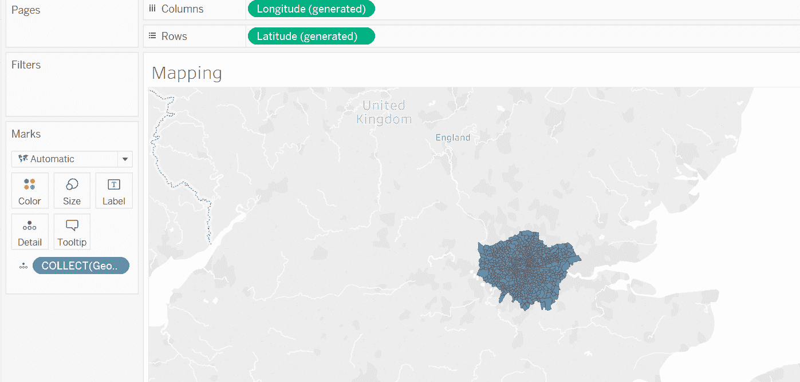

现在，要查看每个区域的公顷数，请在详细标记中的“名称”字段中添加“公顷”字段到颜色，然后你的图表就创建完成了：

如果你想要在区域级别查看数据，请从详细标记中移除“名称”，并将“区域”添加到图表中。这样，你就可以看到区域级别的数据。你还可以通过删除任何边框来使地图更干净。点击 **颜色 | 边框 | 无**。这将使地图更干净，如下面的截图所示：

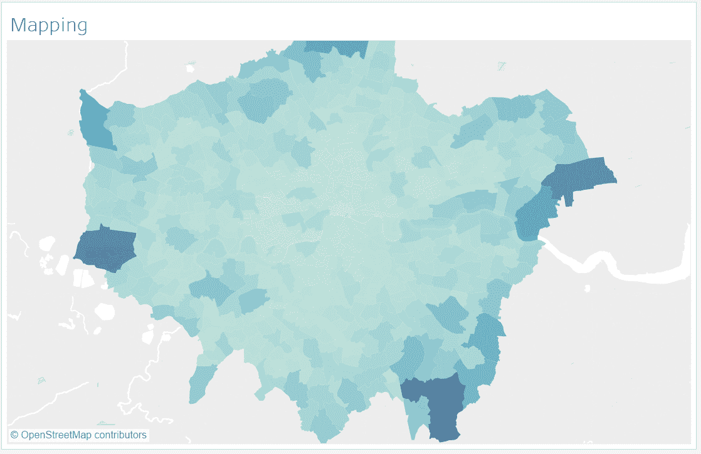

有时，shapefiles 只包含几何细节，但不包含你想要看到的度量；例如，如果你想检查每个区域的关于人口的数据集。不必担心。Shapefiles 作为普通文件使用，可以与任何其他文件连接，甚至是其他 shapefiles。作为一个练习，连接两个 shapefiles 并使用它们创建一个双轴地图。

在本节中，我们学习了如何导入自定义地理编码以增强地图功能。对于某些用例，即使是自定义地理编码也可能无法满足我们的需求。对于这种情况，我们可以使用背景图像来绘制我们的数据。让我们在下一节中学习如何做到这一点。

# 使用背景图像绘制空间数据

可能存在这样的情况，空间数据不足以在地图上准确绘制数据。在这种情况下，我们还可以使用背景图像作为背景。虽然这个选项提供了最大的灵活性来绘制，但也需要最多的努力来定义边界和点坐标。

例如，假设你想绘制你房子的平面图，并拥有以下数据：

| 位置 | 位置 ID | X | Y | 大小 |
| --- | --- | --- | --- | --- |
| 房间 3 | 1 | 15 | 20 | 100 |
| 房间 1 | 2 | 15 | 50 | 100 |
| 房间 4 | 3 | 40 | 20 | 125 |
| 房间 5 | 4 | 40 | 50 | 125 |
| 门廊 | 5 | 60 | 40 | 60 |

你还有这个截图：

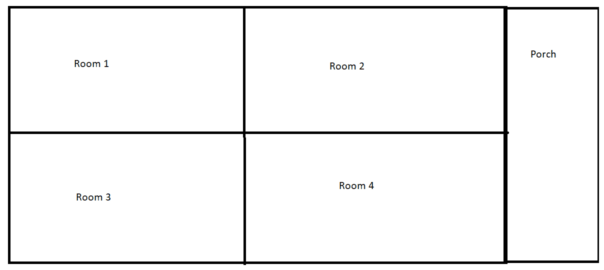

我们将截图数据作为数据源。为了测试适当的点的位置，创建一个未聚合的度量值的散点图。对于前面的例子，绘制`X`和`Y`值，我们得到以下结果：

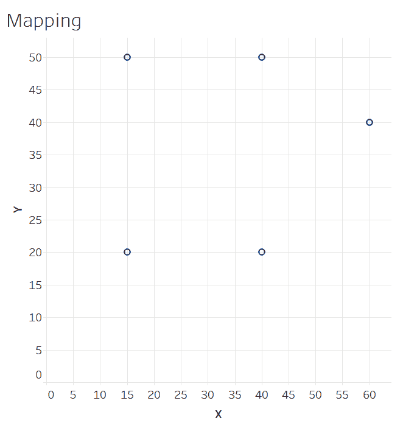

一旦你对`X`和`Y`点的位置满意，点击**地图 | 背景图像 | 数据集**。选择**添加图像**。浏览到你保存的平面图截图的位置，然后点击**确定**。添加以下截图中的详细信息：

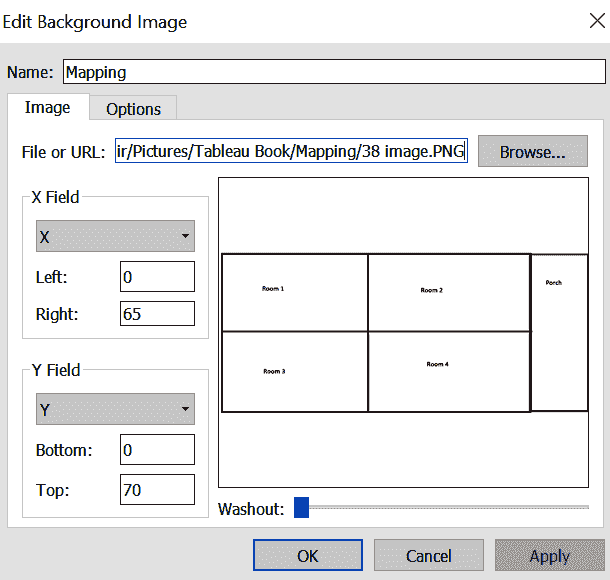

一旦你为**X**和**Y**输入了限制条件，并确定了哪些字段代表**X**和**Y**，请转到**选项**并选择**始终显示整个图像**。点击**确定**。你将得到截图上的点。现在，你可以看到每个点被绘制在哪里。将标记类型更改为地图，然后添加你想要绘制的度量。现在它就像一个地图：

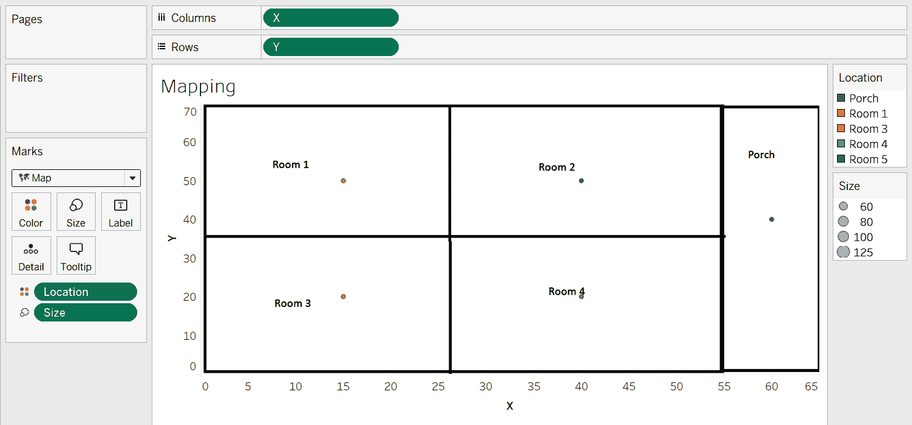

这种技术可以用来绘制来自任何地图的静态图像，并在其上绘制度量。

# 创建密度图

密度标记在 Tableau 的 2018.3 版本中被添加。这些标记为在数据重叠很多或数据浓度很高的区域寻找模式提供了另一种方式。密度标记在创建密度图中找到了它们最好的用途，这使得在空间数据中找到趋势变得超级简单。密度图与自定义地理编码文件配合使用效果最佳，因为它们允许添加详细粒度数据。在小范围内具有粒度和精确的数据，以及度量值变化的平滑性，是使用密度图的理想用例。

对于这个例子，我们将使用 311 联系电话数据集。如果你还没有下载，请在此以 `.csv` 格式下载：[`data.nola.gov/City-Administration/311-Calls-Historic-Data-2012-2018-/3iz8-nghx`](https://data.nola.gov/City-Administration/311-Calls-Historic-Data-2012-2018-/3iz8-nghx)。

现在，如果我们想了解洛杉矶地区的“邮编”分布情况，并决定绘制一个**符号地图**，经过多次放大后，以下截图显示了它可能的样子：

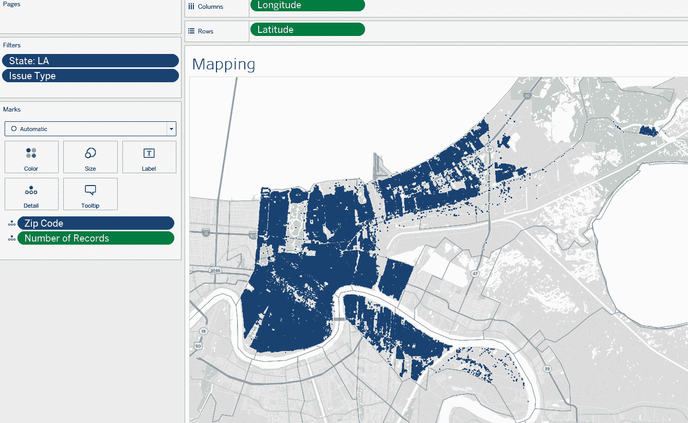

这并没有给我们提供太多信息。查看地图，看起来所有地点的呼叫几乎相等，这并不真实。在这种情况下，密度图变得非常有用。要将此截图转换为密度图，在**标记**菜单中，将标记类型从自动更改为密度。你会看到某些模式出现，但不是很清晰。为了增强它，拥有合适的配色方案变得很重要。点击**颜色**标记，并将颜色更改为密度多色浅色。一旦颜色更改，我们就可以更容易地看到模式，如下面的截图所示。你还可以在**颜色**菜单中进一步更改颜色的强度和透明度：

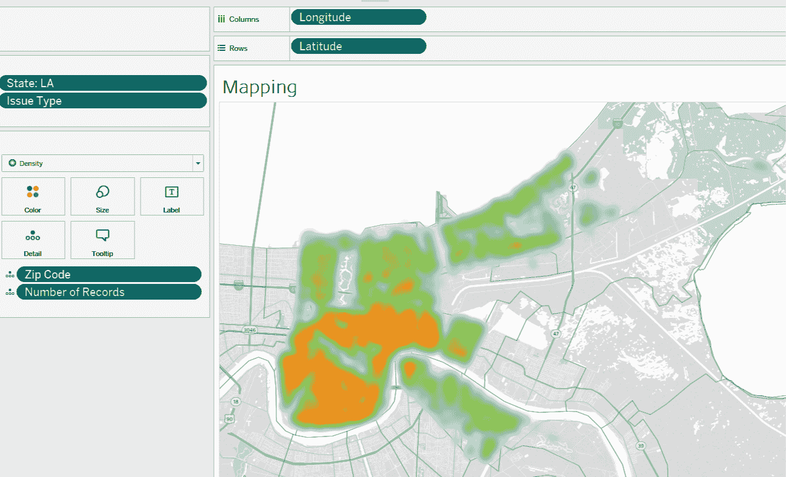

你可以快速看到呼叫集中在城市中心，而较少在湖岸附近。你可以进一步过滤和比较不同问题类型，并查看它们在集中度上的差异。你还可以进一步使用页面面板来查看问题的趋势。使用页面面板时，密度是针对整个数据集计算的，因此模式可以快速相对于时间或其他因素看到。

# 摘要

在本章中，我们详细介绍了如何创建、导航和自定义地图。我们学习了如何确定地图的正确位置，增强地理编码，并创建我们自己的自定义地理编码和地理字段。此外，我们还涵盖了空间文件，以及它们如何被利用来为特定目的创建细微的地图。我们还探讨了向地图添加背景图像、创建自定义地图和创建密度图。

所有这些都将帮助你深入了解你可以通过地图实现的定制程度以及它们如何成为一个强大的分析工具。在下一章中，我们将从创建简单的计算开始，这些计算可以跨本章和上一章中我们学习过的各种视觉元素进行利用。
