# 在 Tableau 中理解简单计算

在前面的章节中，你已经学习了在 Tableau 中用各种形式可视化数据。通常情况下，你想要可视化的数据可能不会直接出现在你的数据集中，但可以通过对数据集应用转换或甚至聚合数据集中的数据来轻松获得。例如，你可能有一个订单的完整地址，但你只想获取订单来自的国家或城市。或者，你可能拥有每个单独销售的详细数据，你想知道所有销售的平均值。接下来的两个章节将重点介绍计算以及如何使用这些计算来回答这样的问题。本章将介绍计算，并涵盖简单计算，而下一章将探讨更高级的计算。

本章将涵盖以下主题：

+   计算基础

+   创建计算并理解其组件

+   构建算术计算

+   构建字符串计算

+   构建日期计算

+   构建逻辑语句

+   构建总计和子总计

# 技术要求

本章使用以下数据集：

+   全球超级商店数据集，可以在[`www.tableau.com/sites/default/files/training/global_superstore.zip`](http://www.tableau.com/sites/default/files/training/global_superstore.zip)找到。

# 计算基础

计算使我们能够从现有数据集中获得更多数据点，并允许我们增强我们的可视化和分析。在 Tableau 中创建计算可以使你即时分析数据，无需每次有关于如何进一步分析数据的想法时都创建额外的数据集。

# 何时使用计算

在我们深入探讨计算及其创建方法之前，同样重要的是要了解何时创建计算。以下是一些计算有用的例子：

+   **更改数据类型**：例如，你有的数据被表示为字符串值。

+   **执行数学计算**：例如，你想要将两个字段相除以获得比率或百分比，或者从字段中减去。

+   **创建逻辑分组/标签**：例如，如果你想将人们分为能开车和不能开车两组，你可以创建一个计算公式说：如果你年满 18 岁并且拥有有效的驾驶执照，你就可以开车。

+   **从现有数据创建新字段**：例如，你想要通过提取地址的一部分来创建国家字段，或者从一个日期字段创建新的日期字段。

+   **聚合数据**：例如，你想要查看分布或国家/城市级别的销售的总和、平均值和中位数。

现在我们已经了解了何时使用计算，我们可以讨论 Tableau 中可用的三种计算类型。

# 计算类型

+   **简单计算**：这些计算允许你在数据集的相同粒度级别（行级）或视觉粒度上聚合数据来创建新的字段。

+   **细节级别（LOD）表达式**：LOD 计算是简单计算的扩展，但允许你更多地控制你正在处理的数据的粒度。你有选项来指定一个固定的粒度级别或将数据字段包含到可视化粒度中或排除它们。

+   **表计算**：表计算仅在视觉的粒度级别上工作。这些计算允许你在现有数据或简单计算的基础上构建视觉级别的计算。

你需要的计算类型将取决于你问题的用例。如果你已经有了所有你想回答问题的数据，那么你需要表计算。如果你没有所有你需要的数据，但所需的数据将与数据集的粒度相同，你需要基本计算。否则，它将是一个 LOD 计算。

如果你对于计算类型有点困惑，不要担心。我们将在单独的章节中详细讲解每种类型。本章将详细讲解简单计算，而接下来的两个章节将讲解其他两种计算类型。所以，让我们看看如何创建简单计算。

# 创建计算

要创建一个计算，请点击**分析** | **创建计算字段**。或者，你可以滚动到维度/度量标签的末尾，并在那里的空白处右键单击。

你应该看到以下计算窗口：

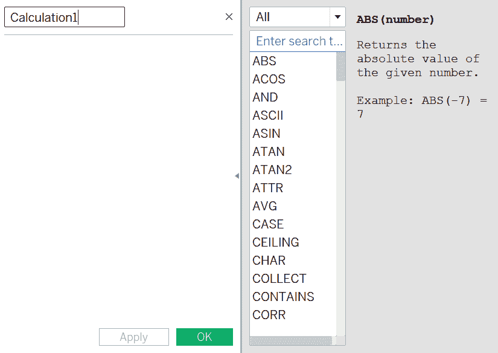

窗口的顶部，写着`Calculation1`的地方是你输入计算字段名称的地方。下面的空白区域是你输入计算的地方。右侧，有一个你可以使用的所有可用函数及其语法的列表，以快速帮助你。计算编辑器右侧的小三角形图标可以用来切换函数窗口的打开和关闭。

让我们创建一个非常简单的计算，看看如果平均利润增加四倍，我们的总利润会是多少，并将这个计算命名为`4x 利润`，如下面的截图所示：


你会在计算的底部看到这样的信息：**计算有效**。这意味着我们现在可以点击**确定**，字段将被创建。如果计算无效，Tableau 中的错误检查器会快速显示错误信息，便于轻松排查问题。

一旦你点击**确定**，你会注意到字段出现在**度量**下。现在，你可以像使用任何其他度量一样使用这个计算。让我们用它来按**段**显示结果：

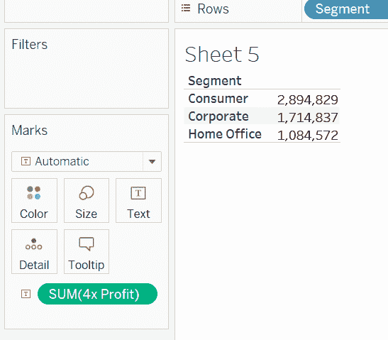

与之前讨论的计算一样，Tableau 中的所有计算都可以是六个基本元素的组合。以下表格描述了这些元素：

| **组件** | **描述** | **示例** |
| --- | --- | --- |
| 函数 | 函数用于转换字段的值或成员。Tableau 中有许多类型的函数，例如 `Number`、`String`、`Date` 和 `User`。不同的函数有不同的语法、期望的输入/数据类型等。 | 在我们的示例中，`AVG()` 是函数的一个示例。 |
| 字段 | 字段代表数据源中的维度或度量（列）。 | 我们使用的字段是 `[Profit]`。 |
| 操作符 | 操作符是表示某种操作的符号。操作符可以是以下之一：+、-、*、/、%、==、=、>、<、>=、<=、!=、<>、^、AND、OR、NOT 和 ( )。 | 在我们的示例中，* 是操作符。 |
| 文字表达式 | 这些是不变的常量值，不会改变。这些可以是数值、字符串、日期、布尔值或空值。 | 我们使用的文字是 4。 |
| 参数 | 正如我们所知，参数是动态值，可以替换文字。这些也可以用于计算。 |  |
| 注释 | 注释是您可以添加到计算字段中的简单描述。这些仅用于信息目的，不会影响实际计算。使用 `//` 符号添加注释。 | 我们没有在我们的示例中添加注释，但我们可以添加类似 `// To create 4 times profit value` 的内容。 |

使用前面提到的六个元素组合，所有计算都是创建的。现在我们更好地理解了组件，我们可以在以下部分详细查看每个组件的语法。

# 函数语法

在 Tableau 中有许多可用的函数类型，例如 `Number`、`String`、`Date` 和 `User`。不同的函数有不同的语法，并且需要不同的输入才能正常工作。您在 Tableau 中可用的所有函数列表可在计算字段窗口的侧边标签中找到。从函数列表中选择 `AVG()`。一旦选择任何函数，您将在帮助窗口中看到三个元素：

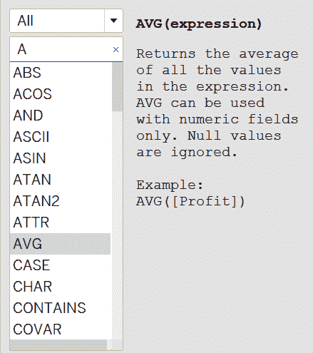

这些元素如下：

+   函数的语法：对于 `AVG`，它显示为 **AVG(expression)**，这意味着要获取平均值，您需要在这里写上 AVG(expression)。

+   说明：在语法下方，是对函数功能的解释。

+   示例：这是函数如何使用的示例。

如果您不确定如何使用函数，可以复制并粘贴示例，然后用您自己的字段替换其中的字段。这确保了语法的正确性。

您可以在计算中使用多个函数，甚至可以将它们嵌套在一起，只要它们满足语法要求。我们将在本章后面学习一些常见的函数类型。

# 字段语法

字段是数据中的列（也可以是计算字段）。如果字段包含空格或名称不唯一，则应始终用方括号 `[]` 包围。最佳实践是使用 `[]` 包围字段。在 Tableau 中，字段以橙色显示。您可以直接从 **维度** 或 **度量** 选项卡将字段拖放到计算中。或者，您可以开始键入字段名称，Tableau 将显示自动完成字段的选项，如下面的截图所示：

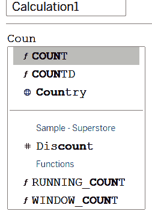

# 运算符语法

运算符是表示某种操作的符号。运算符可以是以下类型：

+   数学运算符：用于执行数学计算。运算符如下：

    +   **+ (加法)**: 加法可用于加法（数值和日期字段）和字符串连接。例如，`4+2` 将返回 `6`，而 `Abc` + `Def` 将返回 `AbcDef`。我们还可以使用加法进行日期计算，例如，添加 `#23-04-2019#+4` 将给出 `#27-04-2019#`。

    +   **- (减法)**: 减法可用于日期和数值字段的减法，与加法运算符类似。

    +   *** (乘法)** 和 **/ (除法)**: 这用于乘除数值字段。

    +   **% (取模)**: 返回除法运算符的余数，例如，`5%2=1`。

    +   **^ (幂/指数):** 这返回指数值，例如，`2³ =8`。

+   关系运算符：用于比较表达式，并返回 `TRUE`、`FALSE` 或 `NULL` 值。每个运算符都可以用于比较数字、日期或字符串。运算符如下：

    +   **== 或 = (等于)**

    +   **> (大于)**

    +   **< (小于)**

    +   **>= (大于或等于)**

    +   **<= (小于或等于)**

    +   **!=** 和 **<> (不等于)**

+   逻辑运算符：逻辑运算符比较表达式的两边，并返回 `TRUE`、`FALSE` 或 `NULL` 值。逻辑运算符如下：

    +   **AND**: 如果表达式 1 和表达式 2 都是 `TRUE`，则返回 `TRUE`；否则，返回 `FALSE`。如果任一表达式为 `NULL`，则返回 `NULL`。`AND` 的输出遵循以下规则：

| **表达式 1** | **表达式 2** | **输出** |
| --- | --- | --- |
| `TRUE` | `TRUE` | `TRUE` |
| `TRUE` | `FALSE`/`NULL` | `FALSE`/`NULL` |
| `FALSE`/`NULL` | `TRUE` | `FALSE`/`NULL` |
| `FALSE`/`NULL` | `FALSE`/`NULL` | `FALSE`/`NULL` |

+   **OR:** `OR` 仅在两个表达式都是 `FALSE` 时返回 `FALSE`；否则，返回 `TRUE`。如果两个值都是 `NULL`，则返回 `NULL`。它遵循以下输出规则：

| **表达式 1** | **表达式 2** | **输出** |
| --- | --- | --- |
| `TRUE` | `TRUE` | `TRUE` |
| `TRUE` | `FALSE`/`NULL` | `TRUE` |
| `FALSE`/`NULL` | `TRUE` | `TRUE` |
| `FALSE`/`NULL` | `FALSE`/`NULL` | `FALSE`/`NULL` |

+   **NOT:** `NOT` 用于否定其他布尔值或表达式。它遵循以下输出规则：

| **表达式 1** | **表达式 2** |
| --- | --- |
| `TRUE` | `FALSE` |
| `FALSE` | `TRUE` |

# 运算符的优先级顺序

运算符的评估顺序如下：

1.  `–`（取反）

1.  `^`（幂）

1.  `*`, `/`, `%`

1.  `+`, `–`

1.  `==`, `>`, `<`, `>=`, `<=`, `!=`

1.  `NOT`

1.  `AND`

1.  `OR`

要改变运算符的优先级顺序，我们可以使用最后的运算符，即括号，`()`。如果你把某样东西放在括号里，它将首先被执行。如果有嵌套的括号，则最内层的括号将首先执行，依此类推，例如，如果我们有以下表达式需要评估：`(1+2*5) = 11 , (1+(2*5)/2) = (1+10/2) =6`。

# 字面表达式语法

字面表达式是按原样表示的常量值。字面量有以下类型：

+   **数值字面量**：数字或浮点数，例如 `4.2` 和 `2`

+   **字符串字面量**：常量字符串，例如 `Hello`

+   **日期字面量**：将日期表示为常量，例如 `#20-05-2019#`

+   **布尔字面量**：表示 `TRUE` 或 `FALSE` 的布尔值

+   **空字面量**：用于赋值或比较 `NULL`

# 参数语法

参数是简单的占位符变量。在 Tableau 中，参数以紫色表示。它们可以代表数字、浮点数、字符串、日期/日期时间值或布尔值。

# 注释语法

注释使用 `//` 表示。要添加多行注释，每行都添加 `//`。

现在我们已经了解了构成计算字段的基本元素及其创建方法，让我们深入探讨一些计算。

# 构建算术计算

在 Tableau 中处理算术计算，我们可以使用上一节中讨论的运算符，使用其中许多 **数字函数** 之一，或者利用一些 **聚合选项**。本节将介绍一些重要函数，但不是完整的列表。*进一步阅读*部分包含到 Tableau 维护的函数 A-Z 列表的链接。

# 聚合选项

聚合选项定义了你的数据值是如何组合或聚合的。简单的聚合在视觉粒度级别上工作。

这意味着数据在视觉的维度级别上进行了聚合。即使不进行研究，我们在前几章创建视觉时已经使用了这种逻辑。每当我们想看到总 **SUM(Sales)** 时，我们只会将 **SUM(Sales)** 测量值带到我们的视觉窗口中。然而，如果我们想看到按段的销售，我们会在窗口中添加 **Segment** 维度，我们的销售将细分，如下面的截图所示：

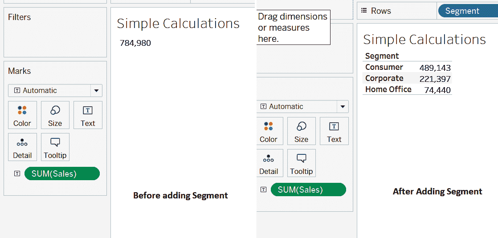

这个原则同样适用于所有聚合操作。要查看可用的聚合级别，右键单击测量字段，选择 **测量**（聚合级别），它将显示其他可用的选项。例如，通过右键单击 **SUM(Sales)** 测量字段，以下聚合级别是可用的：

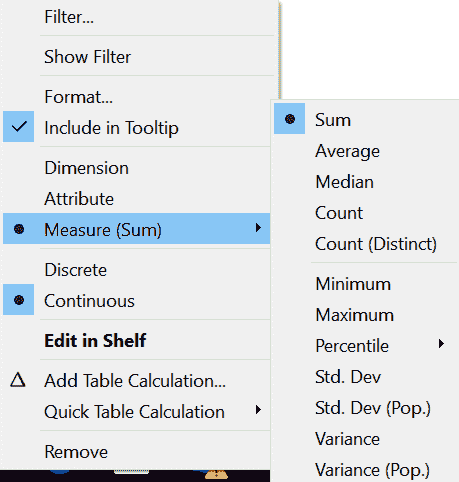

类似地，如果您想使用维度字段来表示度量值，可以将它拖入视觉中，然后右键单击并选择 **度量**，然后它将显示维度可用的聚合选项。

假设我们的数据集中的一个列看起来像 `1, 1, 1, 2, 2, 3, 4`，各种聚合选项及其结果如下：

| **总和** | 这是通过将值相加得到的度量值，计算为 = `1+1+1+2+2+3+4 = 14`。 |
| --- | --- |
| **平均值** | 这是度量值的平均值，通过将值相加除以值的计数来计算 = `14/7 = 2`。 |
| **中位数** | 这是中心值 = `2`。 |
| **计数** | 这只是简单地计算元素的数量 = `7`。 |
| **计数** **（唯一）** | 这是唯一值的计数，因此不会对相同的值进行多次计数 = `4`。 |
| **最小值** | 这是最低值 = `1`。 |
| **最大值** | 这是最高值 = `4`。 |
| **百分位数** | 这显示了低于此值的值的百分比。它有进一步查看 5、10、25、50、75、90 和 95 百分位数的选项。在这里，第 25 百分位数将是 1，第 75 百分位数将是 3，依此类推。 |
| **标准差**, **标准差（总体）** | 标准差定义了成员与平均值差异的程度。如果您有一个完整的数据集，请使用总体标准差；如果是样本，则使用标准差。**标准差（总体）** = `1.07` |
| **方差**, **方差（总体）** | 方差是标准差的平方，因此根据总体或样本，我们使用方差 = `1.14` 来计算此案例。 |

在 Tableau 中计算的聚合被发送回数据库进行查询。因此，一般规则是如果数据库不支持特定的聚合，Tableau 也不会支持它。然而，如果您创建了相同数据的提取，则聚合将得到支持。

作为练习，查看 `利润` 度量值和 `客户名称` 维度的所有聚合选项。

通过简单地使用前面聚合选项和运算符的组合，可以完成许多重要计算。例如，`成本` 可以确定为 `[Sales]-[Profit]`。然后，可以通过 `AVG(Cost)` 找到平均成本。

我们还可以计算 `利润/销售额` 比率，计算公式为 `SUM(Profit)/SUM(Sales)`。这将显示为小数。要将其显示为百分比，一种方法是将计算乘以 100。然而，这将不会显示 `%` 符号。要显示百分号，我们需要将结果格式化为百分比。为此，右键单击 **度量** 并选择 **格式**。将出现一个侧边窗口。在这里，在 **默认** 下，单击 **数字** 然后单击 **百分比**。

您还可以通过使用自定义选项包括其他内容，例如后缀/前缀。一旦您满意，您可以关闭侧边窗口。

除了聚合和运算符的使用之外，我们还可以看看其他可用的数字函数。它们可以逻辑地分为以下类别：

**三角函数**：这些包括以下内容：

| `PI` | 这返回了圆周率π的数值常量，精确到 16 位小数，例如 3.141592……。`PI()`通常用于其他三角函数中，以指定弧度角度。 |
| --- | --- |
| `SIN` | 这返回一个角度的正弦值。角度必须以弧度指定，例如，`SIN(-PI()/4) =-0.7071`。 |
| `ASIN` | 这返回一个数的弧度正弦值。这是 `SIN` 的反函数，例如，`ASIN(-0.7071)=-0.7854`（即 *-pi/4*）。 |
| `ATAN2` | 这接受两个坐标位置 *y* 和 *x* 作为输入，并返回两个数的弧度反正切值，例如，`ATAN2(1,1) = 0.7854 i.e pi/4`。 |
| `DEGREE` | 这将弧度转换为度，所以 `DEGREE(0.7854) =45`。 |

**COS, ACOS, TAN, ATAN, 和 COT 函数与 SIN 和 ASIN 类似。|

**对数和指数函数**：这些包括以下内容：

| `EXP` | 这返回数字的 e 的幂，例如，`EXP(2) = e²`。 |
| --- | --- |
| `LN` | 这返回数字的自然对数。对于所有零和负值，值是 null，例如，`LN(2) = 0.69` 或 `LN(EXP(2))=2`。 |
| `LOG` | 这返回以另一个数为底的对数值。如果没有指定底数，则返回以 100 为底的对数值，例如，`LOG(1000) = 3` 和 `LOG( 4,2) = 2`。 |
| `POWER` | 这返回另一个数的幂，例如，`POWER (2,3) =2³= 8`。 |

**其他数学函数**：这些包括以下内容：

| `SQUARE` | 这返回一个数的平方，相当于 `Power (number, 2)`，例如，`SQUARE(5) = 25`。 |
| --- | --- |
| `SQRT` | 这返回一个数的平方根，相当于 `Power (number, 0.5)`，例如，`SQRT(25) =5`。 |
| `ABS` | 这返回一个数的绝对值，例如，`ABS(-7) =7`。当处理数量或偏差时，实际值比数字的符号更重要时，非常有用。 |
| `CEILING` | 这将一个数字四舍五入到最接近的整数，大于或等于该数字。这在做容量规划等问题时很有用，例如，如果你需要分配资源到项目中以完成工作，结果是`3.2`。如果你简单地四舍五入这个数字，你的结果将是`3`。但实际上你有更多的工作要做，所以有四个资源比三个更有意义，并据此进行规划，例如，`CEILING(3.2) = 4`。 |
| `FLOOR` | `FLOOR` 是 `CEILING` 的反操作。它返回小于或等于给定数字的最大整数，例如，`FLOOR(3.2) =3`。 |
| `ROUND` | 这将数字四舍五入到最接近的整数或指定的十进制值，例如，`ROUND (3.2)=3`，`ROUND(3.7) = 4`，和 `ROUND(3.1421,2) = 3.14`。 |
| `SIGN` | 这返回数字的符号，如果为正数则返回 1，如果为零则返回 0，如果为负数则返回 -1，例如，`SIGN(-3)=-1` 和 `SIGN(4) =1`。 |
| `ZN` | 如果表达式不是空值，则返回表达式；否则，将返回 0。这在我们要计算平均值时非常有用，既不忽略 `NULL`，也显示 0 而不是空值。 |
| `DIV` | 这返回除法操作的商，例如，`DIV(7,2) =3`。 |
| `HEXBINX`, `HEXBINY` | 这两个函数都用于将 *x*，*y* 坐标映射到最近的六边形网格。`HENBINX` 映射到最近的 *x* 坐标，而 `HEXBINY` 映射到最近的 *y* 坐标。网格的边长为 1，因此输入需要相应地缩放。 |

现在我们熟悉了可以用于创建数值计算的多种聚合选项和数字函数，让我们继续到下一节，我们将学习字符串计算。

# 构建字符串计算

与数值计算类似，存在许多字符串函数，允许进行各种计算。让我们看看一些关键字符串计算及其用法。

# 与从字符串中获取子字符串相关的函数

在处理字符串时，最常见的用例之一是我们只想得到字符串的一部分，而不是全部。许多函数帮助我们做到这一点。让我们看看我们可以使用哪些函数。

`LEFT`: 这遵循语法 `LEFT (string, num_chars)`.

使用 `LEFT`，从字符串的开始返回指定的 `num_chars`。这对于分组非常有用。

例如，我们想根据客户名字的首字母找到订购最多的客户。我们可以创建如下计算：`LEFT(Customer Name,1)`. 这将只返回字符串的第一个字符。然后我们可以使用这个字符并计算订单数量，清楚地看到哪个类别订购最多：

![

`RIGHT`: 这遵循语法 `RIGHT(string, num_chars)`.

使用 `RIGHT`，从字符串的末尾返回指定的 `num_chars`。

与第一个示例类似，如果你想找到订购人的名字中的最后一个字母，你会使用 `RIGHT([Customer Name,1]).`

`MID`: 这遵循语法 `MID (string, start, [length])`.

它从 `string` 中返回字符，从由起始值指定的位置开始。字符串的第一个字符的起始位置为 1。`length` 是可选的，如果指定，则返回多达那么多字符。

看看以下示例：

```py
MID("Hello",2) = ello
MID("Hello",2,3) = ell
```

`SPLIT`: 这遵循语法 `SPLIT (string, delimiter, token number)`.

有时候，我们不知道确切的位置来创建子字符串，但可能有一个分隔符来指定它。

例如，在我们的数据集中，我们有一个客户的完整姓名，如果我们只想获取名字怎么办？我们知道名字的格式是**名字**后跟空格字符，然后是**中间名** + **姓氏**。因此，我们的分隔符是 `" "`。基于分隔符，您的字符串被分割成相等的标记。

例如，如果字符串是 `Alex Young`，您的字符串将被分隔符分割成两个字符串。标记 1 将是 `Alex`，标记 2 将是 `Young`。因此，`SPLIT("Alex Young", " ",1)` 将返回 `Alex`，而 `SPLIT ("Alex Young"," ",2)` 将返回 `Young`。如果您使用负数，它将从字符串的右侧开始计数。因此，`SPLIT("Alex Young"," ", -1)` 将是 `Young`，而 `SPLIT ("Alex Young"," ",-2)` 将是 `Alex`。

现在，回到我们的例子——如果我们想找到客户的**名字**，我们会创建以下计算：

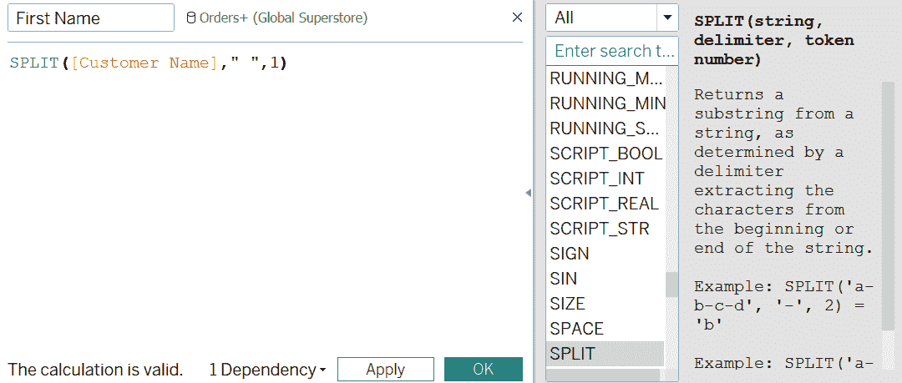

现在，我们统计那些以这个名字作为他们名字的人，以找到最流行的名字，如下所示：


这个字符串函数的第一个逻辑子集允许我们从字符串中获取子字符串。在下一节中，我们将学习处理子字符串在字符串中位置或存在性的函数。

# 与在字符串中查找子字符串相关的函数

有时候，我们不想获取子字符串，只想检查某些子字符串是否存在于字符串中，甚至获取它们出现的位置。为此，以下函数很有用：

+   `CONTAINS`: 这个函数遵循 `CONTAINS(string, substring)` 语法。如果字符串包含其内的子字符串，则 `CONTAINS` 返回 true，例如，`CONTAINS("Tableau", "Table") = TRUE`。例如，为了找到有多少人的名字包含字母 `E`，我们可以创建以下计算：`CONTAINS([Customer Name],"e")` 并查看 `TRUE` 的计数。

+   `ENDSWITH`: 这个函数遵循 `ENDSWITH(string, substring)` 语法。如果字符串以提供的子字符串结束，则返回 true，并且忽略尾随空格，例如，`ENDSWITH("hello", "lo")=TRUE`。

+   `FIND`: 这个函数遵循 `FIND (string, substring, [start])` 语法。它将返回字符串在子字符串中的位置。如果指定了起始位置，则它将在起始位置之后开始搜索子字符串。例如，`FIND("hello","lo")` 将返回 `4`。

+   `FINDNTH`: 这个函数遵循 `FINDNTH(string, substring, occurrence)` 语法，并返回子字符串在字符串中出现的第 *n* 次位置。例如，如果字符串是 `abcabcabc`，而我们想找到字符串中 `abc` 的第三次出现，我们会使用 `FINDNTH("abcabcabc"."abc",3)`。它将返回 `7`。

+   `STARTSWITH`：这遵循`STARTSWITH(string, substring)`的语法，类似于`ENDSWITH`。如果字符串以另一个子串开头，则显示为真，例如，`STARTSWITH("hello","he")=TRUE`。

# 与格式化/标准化字符串相关的函数

通常，字符串并不都遵循一致的格式。字符串中可能有前导或尾随空格，或者它们有不同的大小写。所有这些都会导致字符串被视为不同的和独立的。例如，如果有一个名为`book`的字符串和另一个名为`BOOK`的字符串，它们将被视为不同。使用以下函数，我们可以标准化我们的数据集中的字符串：

+   `LOWER`：这遵循`LOWER(string)`的语法。它将返回全部小写的字符串，例如，`LOWER("Book") = book`。

+   `UPPER`：这遵循`UPPER(string)`的语法。它将返回全部大写的字符串，例如，`UPPER("Book")= BOOK`。

+   `TRIM`：这遵循`TRIM(string)`的语法，并从字符串中删除前导和尾随空格，例如，`TRIM("    Book    ") = Book`。

与`TRIM`类似，还有`LTRIM`和`RTRIM`，它们遵循相同的语法，但只从字符串的左侧或右侧删除空格。

# 其他重要的字符串函数

+   `LEN`：这遵循`LEN(string)`的语法。长度用于查找字符串中的字符数。它将字符串中的空格计为一个字符。例如，`LEN("Hi There")`是 8：`Hi`有 2 个字符，空格有 1 个字符，`There`有 5 个字符。

+   `REPLACE`：这遵循`REPLACE(string, substring, replacement)`的语法。`REPLACE`用于将字符串中的子串替换为替换内容，例如，在字符串中替换特殊字符，如`/`或`'`，例如`Replace([Customer Name],"/","")`。

另一个例子是如果有人更改了他们的名字。你可以用新名字替换他们的名字。让我们用`Aaron B`替换 Aaron Bergman 的名字。创建一个新的计算，使用`REPLACE`如下所示：`REPLACE([Customer Name], "Aaron Bergman", "Aaron B")`。这个计算的结果可以在下面的屏幕截图中看到：

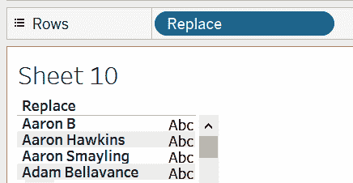

现在我们已经熟悉了重要的字符串计算，让我们在下一节中看看日期计算。

# 构建日期计算

日期计算允许我们对日期执行操作，例如添加或减去日期以及获取日期的一部分。让我们在下面的部分中看看一些关键函数。

# 获取当前日期和时间

`Today()`返回 Tableau 中的当前日期，`NOW()`可以用来返回当前日期和时间。一个常见的用例是找到事件发生与今天之间的时间差。

# 获取日期的一部分

+   `DAY()`, `MONTH()` 和 `YEAR()`: 它们共享函数（日期）的语法。它们分别可以用来获取日期的天、月、年部分作为整数。例如，`DAY(#24-05-2019#)` 返回 `24`。

+   `DATEPART`: 它遵循语法 `DATEPART(date_part, date, [start_of_week])`。如果未提及周的开始，则根据数据源中定义的开始日确定。例如，`DATEPART(week,#24-05-2019#)` 返回 `21`。

+   `DATENAME`: 其语法与 `DATENAME` 相同，即 `DATEPART(date_part, date, [start_of_week])`。它与 `DATEPART` 非常相似。关键区别在于它将以字符串的形式返回值。例如，`DATENAME("month",#24-05-2019#)` 返回 `May`。

+   `DATETRUNC`: 其语法与 `DATEPART` 和 `DATENAME` 相同，如下所示：`DATETRUNC(date_part, date, [start_of_week])`。它允许我们不仅获取 `date_part`，而且截断日期到该 `date_part`。例如，`DATETRUNC("month",#24-05-2019#)` 返回 `01-05-2019 00:00:00`。

# 其他日期计算

+   `ISDATE`: 它遵循语法 `ISDATE(string)`。如果字符串是日期，则返回 `TRUE`，否则返回 `FALSE`，例如，`ISDATE("24-05-2019")= TRUE`。

+   `DATEPARSE`: 它遵循语法 `DATEPARSE(format, string)`。它用于将字符串转换为指定格式的 `DATE`。例如，`DATEPARSE("dd-MM-yyyy","24-05-2019")` 返回 `24-05-2019` 作为日期。

+   `DATEADD`: 它遵循语法 `DATEADD(date_part, interval, date)`。它将间隔添加到日期的指定 `date_part`。`DATEADD` 是最常用的日期函数之一。

假设系统存在问题，所有捕获的订单日期都是错误的。实际上，它们比计算中显示的日期早了一个月。为了得到正确的订单日期，我们创建了一个计算 `Correct Order Date` 的公式，即 `DATEADD("month", -1, [Order Date])`。现在，如果我们把日期并排放置，我们将得到以下结果：

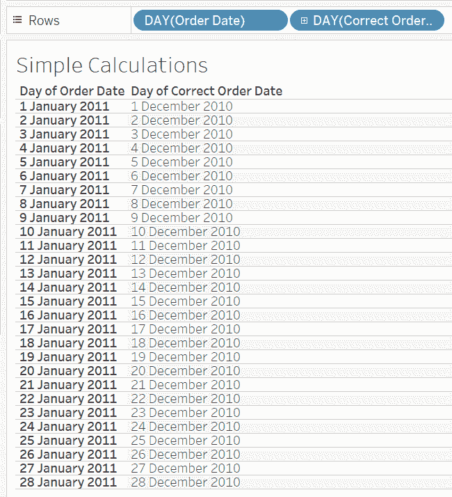

+   `DATEDIFF`: 它遵循语法 `DATEDIFF(date_part, start_date, end_date, [start_of_week])`。它以 `date_part` 的单位返回两个日期之间的差异。例如，如果我们想计算订单下单后需要多少个月才能发货，我们可以将 `Shipping Time` 计算为 `DATEDIFF("month", [Order Date], [Ship Date])`。一旦创建，如果我们查看所有运输类别的总耗时（以月为单位），我们得到以下结果：

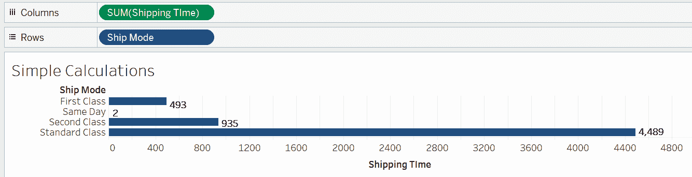

正如你所见，同日送达超级快，所以即使将所有订单合并，运输也只花了 2 个月。另一方面，标准类别的订单运输花费了 4,489 个月。

在过去几节中，我们介绍了数字、字符串和日期计算。在下一节中，我们将专注于构建逻辑语句。逻辑语句与数字、字符串和日期一起工作，可以与我们已经学过的计算结合使用。

# 构建逻辑语句

逻辑函数允许你检查条件并查看它们是真是假。在接下来的几节中，我们将查看各种逻辑函数类别。

# 情况语句

情况语句使用以下语法：`CASE <expression> WHEN <value1> THEN <return1> WHEN <value2> THEN <return2> ... ELSE <default return> END`.

在情况语句中，表达式的值与每个值进行匹配，每当找到匹配时，就返回相应的返回值。如果没有值与表达式匹配，则返回默认的 else 值。如果没有默认值，则返回 null 值。

情况语句在需要将相同的表达式与多个值进行比较时非常有用。一个例子是，如果我们想要给一些市场分配数字，我们可以创建如下截图所示的计算：


现在，如果我们把市场和市场编号放在一起，我们可以看到这些组：

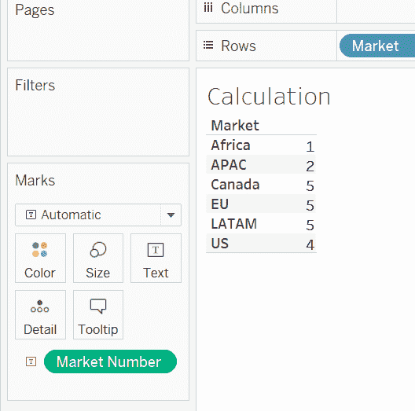

作为一项独立练习，创建一个情况语句，给每周的每一天分配一个数字。

# IF 语句

IF 语句的语法如下：`IF <expr> THEN <then> [ELSEIF <expr2> THEN <then2>...] [ELSE <else>] END`.

使用 IF 语句，我们可以测试一系列条件，并根据条件是否为真返回值；否则，测试下一个条件。这会一直继续，直到没有条件为真，在这种情况下，表示默认条件的值；否则，它将被返回。如果没有默认条件，则返回 null。

在 IF 语句中，也可以使用`OR`和`AND`运算符组合多个条件。

例如，如果我们想要将销售分为高、中、低类别，我们可以创建如下计算：

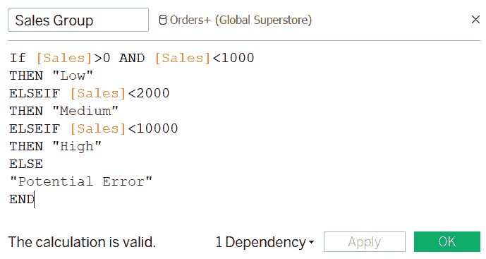

在这里，你可以看到我们将任何大于 0 且小于 1,000 美元的销售归为低类别，2,000 美元及以下为中等，2,000-10,000 为高，其他所有值我们假设是潜在的错误，可能是销售值过高或低于 0，这可能是需要重新检查的。

现在，按每个**销售组**计算订单 ID 的数量，我们可以看到大部分订单是**低**类别，其次是**高**类别，只有五个潜在的错误案例，如下截图所示：


作为练习，为利润范围创建类似的计算。

# IIF

`IIF` 与 `IF` 对于一个条件相似。它遵循语法：`IIF(test, then, else, [unknown])`。在这里，它将测试一个条件，如果条件为真，则返回 `then` 值；否则，返回 `else` 值。如果未指定 `else` 值，则返回 `NULL`，例如，`IIF([Sales]>0,"Valid","Invalid")`。

# IFNULL 和 ISNULL

`IFNULL` 和 `ISNULL` 都用于测试表达式是否为空。

**IFNULL**：它遵循语法：`IFNULL(expr1,expr2)`，如果值为空，则返回表达式 1；如果不为空，则返回表达式 2。例如，`IFNULL([Sales],0)` 将返回 `Sales` 的值，如果它不是空值，否则返回 0。

**ISNULL**：`ISNULL` 遵循语法：`ISNULL(expr)`。如果表达式是 `NULL`，则返回 `TRUE`。例如，`ISNULL([Sales])` 如果 `Sales` 是空值，将返回 true。

# 其他函数

除了之前讨论的函数之外，还有一些其他重要且在 Tableau 中可用的重要函数。其中之一是类型转换函数。类型转换函数对于将一种数据类型转换为另一种数据类型很有用，例如，从整数转换为字符串或从浮点数转换为整数。

所有的以下函数都遵循 `Function(expression)` 的通用语法：

| `DATE` | 它用于从数字、字符串或日期表达式中获取日期，例如，`DATE("25/05/2019")` 返回 `#25-05-2019#`。 |
| --- | --- |
| `DATETIME` | 与 `DATE` 非常相似，此函数返回日期和时间，例如，`DATETIME("25 May 2019 13:40:00")` 返回 `#25-05-2019 13:40:00#`。 |
| `FLOAT` | 这用于转换为浮点数，例如，`FLOAT(2)=2.000`。 |
| `INT` | 这用于将参数转换为整数，例如 `INT("22")=22` 或 `INT(22.2)=22`。 |
| `STR` | 这用于将值转换为字符串，例如，`STR(22)` 结果为字符串，`22`。 |

例如，如果有数字字段 `12` 和另一个数字字段 `22`，我们想要获得连接字段 `1222`，我们可以将它们转换为字符串然后再转换回数字，作为 `INT( (STR(12)+STR(22)))` 并返回 `1222` 作为数字。类型转换可以在我们需要创建复杂计算并且需要某个字段的输出以正确格式作为另一个字段的输入时多次帮助。

用户函数是另一组有用的 Tableau 函数。这些函数对于创建行级筛选和安全限制在您的仪表板发布到 Tableau Online 或 Server 时可见的字段很有用。Tableau 还允许在函数如 `REGEXP_MATCH` 或 `REGEXP_EXTRACT` 中使用一些正则表达式功能，可用于创建一些高级字符串匹配。此外，在下一章中，我们将研究一些尚未讨论的高级表格计算函数。

本章我们将讨论的最后一点将是总计和子总计以及它们如何被使用。

# 构建总计和子总计

除了显示计算值之外，有时我们还想在相同窗口中显示总计或子总计的值。

例如，我们有以下图表，按类别和子类别分段显示 SUM(Sales)：

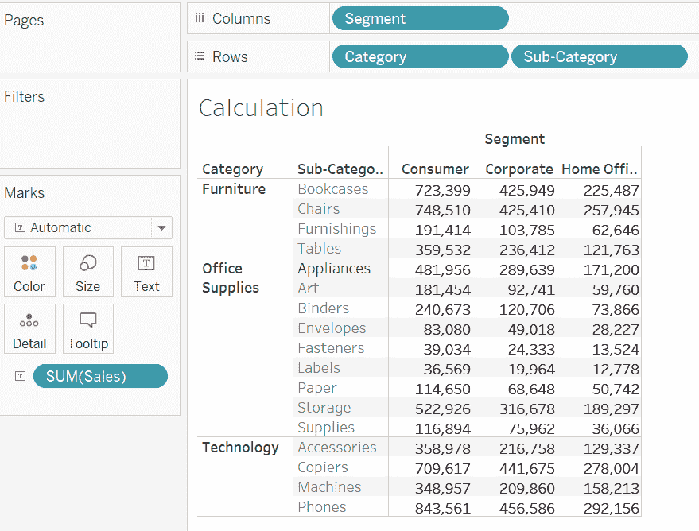

现在，如果我们想为行和列添加子总计和总计，我们可以执行以下操作：

1.  前往**分析** > **总计**。

1.  选择显示行总计 | 显示列总计。这将显示如下图表：


1.  现在，如果我们想看到子总计，我们可以从分析 | 工具中选择**添加所有子总计**。这将显示以下内容：

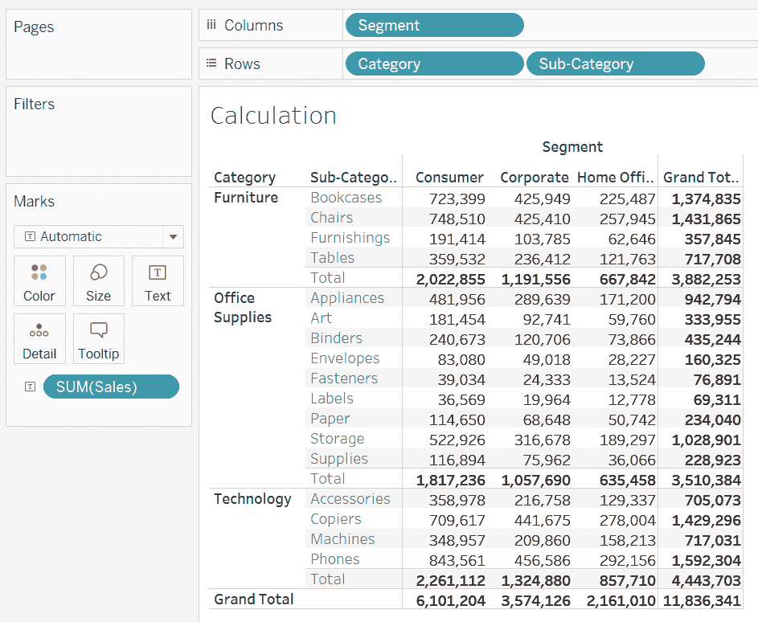

如果有多个维度需要计算子总计，则可以右键单击维度以选择或取消选择，具体取决于我们是否希望计算总计。

例如，将城市添加到之前的内容中，并添加所有子总计，将创建以下图表：

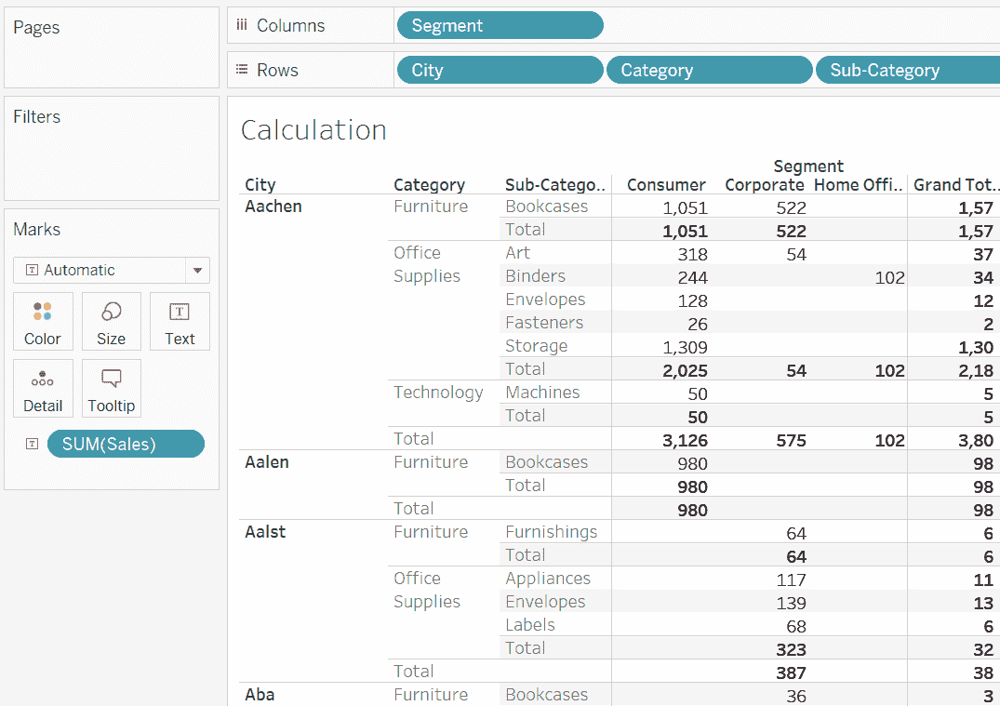

现在，如果我们不想在类别级别看到子总计，则可以在行架上右键单击类别，并取消选中子总计，如图下截图所示：

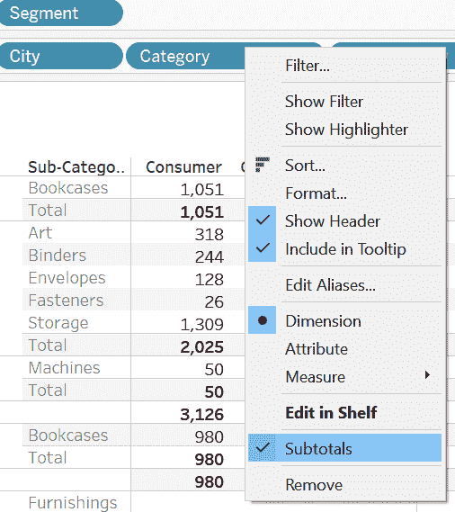

这将移除类别级别的子总计。创建总计和子总计的另一种方法是使用**分析窗口 | 总计**。

# 摘要

在本章中，我们学习了如何创建简单的计算。我们探讨了计算的各种元素所需的格式和语法要求。随后，我们详细研究了数字、字符串、日期和逻辑函数的一些重要函数和示例。最后，我们还学习了如何将总计和子总计添加到我们的计算中。在下一章中，我们将学习更高级的表格计算，我们将使用本章学到的计算结果来构建进一步的计算。

# 进一步阅读

要查看 Tableau 中所有可用函数的列表，请访问以下链接：[`help.tableau.com/current/pro/desktop/en-us/functions_all_categories.htm`](https://help.tableau.com/current/pro/desktop/en-us/functions_all_categories.htm)。
