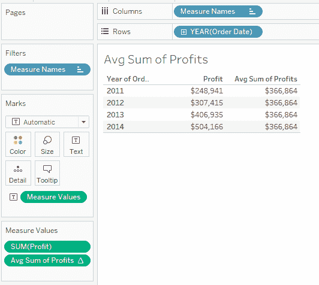
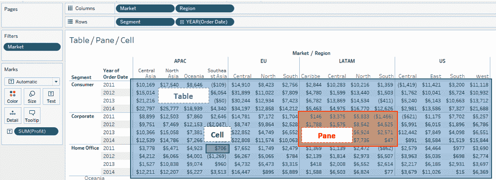
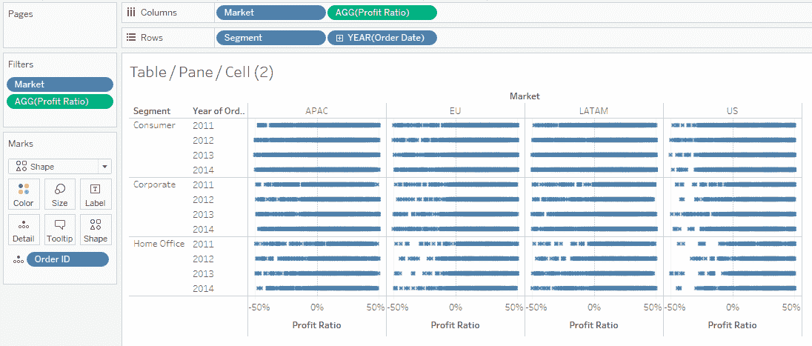
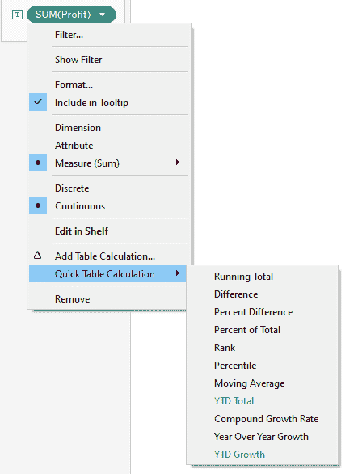
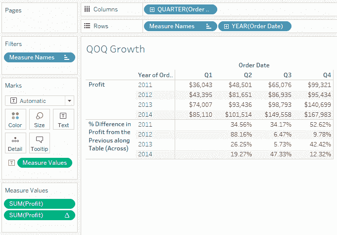
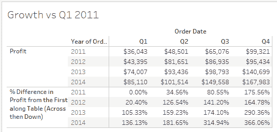
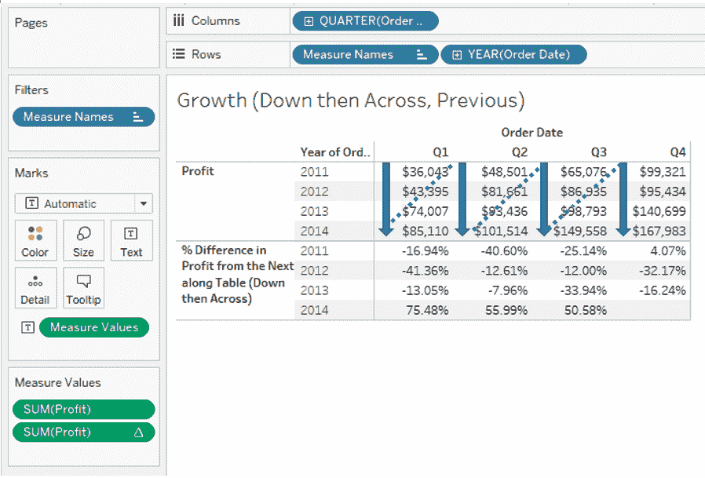
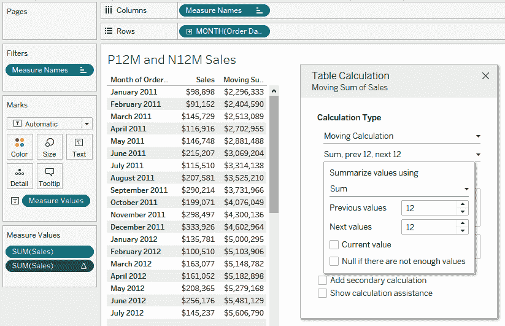
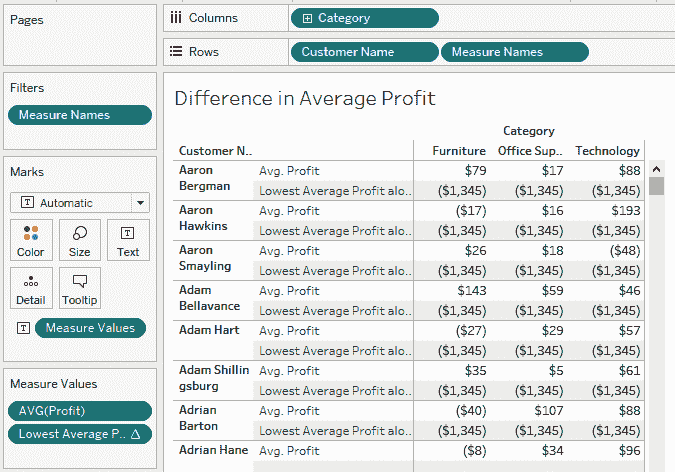

# Tableau 表格计算

在上一章中，我们学习了如何在 Tableau 中创建一些简单的计算。然而，有时我们可能想要使用这些计算的结果来创建新的见解。例如，在本书的这一部分，我们可以使用我们迄今为止获得的知识来创建显示客户总销售额的字段，并添加计算来显示某项产品的平均销售额，但我们不能使用客户销售额的结果来显示客户整体平均销售额。这就是**表格计算**发挥作用的地方，它使我们能够将先前计算的结果作为新计算的输入。

本章将涵盖以下主题：

+   通用表格计算和背景

+   创建快速表格计算

+   自定义表格计算

+   设置手动表格计算

+   实际例子

# 技术要求

本章使用的是 Global Superstore 数据集，可以在[`www.tableau.com/sites/default/files/training/global_superstore.zip`](http://www.tableau.com/sites/default/files/training/global_superstore.zip)找到。

# 通用表格计算和背景

表格计算是一种方法，它将前几章中定义的常规计算结果，基于这些结果（而不是基础数据）进行额外的计算。

让我们以一个表格计算的例子来看`SUM(Profit)`按`Year (Order Date)`的平均值（我们将在本章后面学习如何创建这样的计算）：

在这种情况下，平均值是通过查看聚合的标记（在这种情况下，($248,941+$307,415+$406,935+$504,166)/4 = $366,864）来计算的，而不是通过平均基础数据中的利润。

在 Tableau 中，表格计算有两个主要组成部分。第一个元素是我们想要对那些标记（在这种情况下，对标记进行直线平均）执行的计算。第二个是**范围**（或**分区**），我们将在下一节中探讨。

# 视图结构

Tableau 工作表视图可以分为三个主要级别，如下面的截图所示：

虽然“表格”代表整个视图，但“面板”是视图的一部分，对应于行和列中维度的交叉点，由一条**分隔线**界定。例如，在这个例子中，有 12 个面板，因为有 4 个分隔的列部分和 3 个行部分，因此有 12 个交叉点。

最后，单元格是维度中最小的交叉点，在前面的视图中共有 180 个。在这种情况下，单元格由一个单独的标记（文本值）组成，但单元格可以包含多个标记，如下面的截图所示：

让我们看看这些不同的分区如何与表格计算相互作用。

# 定义计算的范围

表格计算始终在特定的范围内进行计算，这通常是我们在上一节中查看的三个选项之一（表，窗格或单元格）；这使 Tableau 能够知道何时以及何时在某个点上重置计算。

让我们使用之前的例子并引入`Segment`：

在这种情况下，相同的计算可以取整个表格的一个值（沿表），或在每个窗格（沿窗格）或每个单元格（沿单元格）内进行计算。

一些选项还包括一个方向：向下，横向（当你到达分区的底部或右边时将重置）或组合，例如横向然后向下（继续到下一行，而不是在当前行的末尾停止，而在范围内）。

最后，表格计算有时是相对于另一个单元格计算的。例如，如果我们正在计算百分比差异，我们必须指定哪个单元格是计算的参考。这可以在范围内，第一个或最后一个，上一个或下一个，或者对应于维度特定值的单元格（例如，相对于与 2011 年相关的值）。

总结来说，表格计算是在我们简单计算聚合结果的基础上进行的进一步计算，这些计算在一定的范围内定义。现在我们已经对表格计算有了些了解，让我们开始设置一些。

# 创建快速表格计算

创建表格计算的最简单方法是从快速表格计算选项开始。

每个代表度量（包括计数或维度的唯一计数）的药丸，无论是离散的还是连续的，在其自己的菜单中都包含快速表格计算选项：

使用这里提供的选项之一将替换当前的聚合为表格计算，然后药丸将包含一个Δ符号来表示计算现在是表格计算。让我们看看可用的不同选项。

# 快速计算有不同的选项

总共有 11 个选项可以创建快速表格计算：

+   运行总计在分区内和方向上（横向或纵向）逐步求和聚合标记。

+   差异是标记和参考标记之间的绝对差异：（标记 - 参考标记）。

+   百分比差异表示相对差异：（标记 - 参考标记）/ 参考标记。

+   百分比总计显示当前标记对范围内标记总聚合的贡献。

百分比总计计算也可以通过“分析 | 百分比 | ...”打开，尽管这将影响所有度量。

+   排名根据单元格的值对单元格进行排名（对于如何区分具有相等值的单元格有不同的选项）。

+   百分位数表示在范围内有多少单元格的值低于当前值。

+   移动平均计算一组先前和后续值的平均值。

最后，有四种基于时间的快速表格计算：

+   YTD（年度至今）总计是一个每年重新开始的累计总和。

+   复合增长率计算相对于第一个值的增长率 *r*，以便 。这用于决定如果演变完全稳定，增长因子将会是什么。

+   年度增长率计算与上一年度同一期间的百分比差异。

+   YTD 增长与上一年度的 YTD 总计创建一个百分比差异。

重要的一点是，YTD 计算需要一个离散的日期字段，其粒度严格小于一年（例如，年、季度、月或年、月），而年度增长率需要的是一个可以是一年或更细粒度的离散日期字段。

有可能将包含表格计算的药丸拖回数据面板，以创建基于当前表格计算定义的计算字段。通过编辑以这种方式创建的表格计算，可以帮助你理解 Tableau 在底层是如何执行计算的。

如果在任何时候你想恢复到原始计算，你可以在点击药丸时使用清除表格计算选项。

现在快速计算已经开启，让我们看看如何更改不同的参数来控制这个现成的计算。

# 自定义表格计算

用户在创建快速表格计算后想要做的第一件事之一是更新计算的范畴，因为默认选择并不一定是他们所想的。

# 适配百分比差异计算

让我们按“订单日期”的年份在行中绘制“利润”，按“订单日期”的季度在列中绘制，创建一个百分比差异的快速计算，并通过在数据面板中双击字段将其添加回视图（因为表格计算将接管原始的“利润”字段，并且不可能添加相同的计算两次）：

Tableau 的默认选择是计算这个表格计算沿着表（横跨）并且相对于上一个值，这显示了季度间增长，但不是 Q4 和 Q1 之间的增长。当 Tableau 在表中运行时，它的指令只是横跨。当它无法再前进时，它将重置并从下一行重新开始。如果我们想看到相对于 2011 年第一季度的增长，我们需要执行两个动作，我们将在以下部分中探讨。

# 定义与分区第一行之间的百分比差异

首先，我们应该改变计算方式，使其相对于第一个值而不是上一个值。这可以通过在“相对于”选项下的药丸上右键点击来实现，如下面的截图所示：

这将使得每一行都将当前值与该行的第一个值进行比较（在这种情况下，是给定年份的 Q1）。如果我们想让它比较所有行与第一行的第一个值（即 Q1 2011）进行比较，我们可以在同一个药丸菜单中将计算使用更改为表格（向下然后向右）。

有时，“计算使用”的一些选项（例如“面板（向右）”）可能不会出现。这是因为该选项与您的当前视图不相关，可能已经被另一个选择覆盖，例如“表格（向右）”。

在这种情况下，您还可以选择“向下然后向右：”因为我们正在比较表中的第一个值，而不是上一个或下一个，所以顺序不太重要：

所有计算现在都相对于 2011 年第一季度，这正是我们想要的。

# 使用不同的顺序

如果我们将选项更改为使用表格计算（向下然后向右）和相对于下一年，我们可能会得到截然不同的结果：

因为我们是向下然后向右计算，所以我们计算了所有季度与下一年（向下计算使我们通过给定季度的年份）的百分比差异。例外情况是 2014 年第一季度至第三季度，我们将与 2011 年的下一个季度进行比较；因为给定季度没有下一年，所以我们向右移动到下一个季度的第一年。在这种情况下，我们比较的是 2014 年第一季度的$85,110 与 2011 年第二季度的$48,501。

我们必须强调，如果我们想得到有意义的成果，顺序非常重要。

您也可以从“编辑表格计算”窗口中更改这些选项，您可以通过右键单击药丸找到该窗口。

现在我们已经学会了如何创建快速表格计算，让我们看看您是否可以通过创建手动表格计算来获得更深入的理解，例如，这将使我们能够计算视图中所有标记的平均值。

# 设置手动表格计算

虽然您可以通过快速选项轻松创建一些表格计算，但有时现成的计算无法满足您的需求。在这种情况下，您需要创建一个手动表格计算。这是通过创建一个计算字段来完成的。

作为提醒，您可以通过以下三种方法中的任何一种创建计算字段：

+   在菜单栏中转到“分析 | 创建计算字段…”。

+   右键单击“数据”面板中的任何字段，并使用“创建 | 计算字段…”选项。

+   点击“数据”面板中搜索图标旁边的箭头，靠近“维度”，并使用“创建计算字段……”。

在那里，您可以手动定义您的函数，并在计算有效后选择默认表格计算选项。让我们回顾一下用户可用的三种主要函数类型。

# 创建类似于快速表格计算的功能

有两个函数范围可用，它们的工作方式与一些快速选项非常相似。

第一个范围是`RUNNING`函数，包括`RUNNING_SUM`、`RUNNING_COUNT`等。这些函数通过从第一个开始并沿着当前分区中的单元格运行，更新计算并聚合每个新单元格的结果来聚合当前分区中的单元格中的结果。虽然运行总和是最明显的例子，也是可用的快速计算之一，但有时使用另一个运行函数提供结果可能很有用。例如，`RUNNING_MAX`函数在跟踪记录时很有用，因为该函数将更新到计算点之前的最大数据值。

在创建表格计算时，务必在函数内部使用聚合，因为语法检查器会提醒您。

例如，如果我们想跟踪我们的记录线利润，我们可以创建`Record Line Profit`作为`RUNNING_MAX(MAX([Profit]))`，并通过`Year (Order Date)`和`Quarter (Order Date)`将其添加到一个视图中，以`MAX(Profit)`。这将显示迄今为止最大的线利润记录（截至 2011 年第二季度为 2,939 美元，然后是 2013 年第三季度的 4,630 美元，依此类推）。

第二种应该熟悉的功能类型是`RANK`函数，包括`RANK`、`RANK_DENSE`等。正如其名称所暗示的，这些函数将根据给定的顺序（默认为降序或根据函数的第二个参数定义的升序）对单元格中的结果进行排名。以下是对不同函数如何按升序对同一组数据（10, 10, 15, 20）进行排名的快速总结：

| **函数** | **按升序对 10, 10, 15, 20 进行排名的方式** | **注释** |
| --- | --- | --- |
| `RANK` | 1, 1, 3, 4 | 相同值具有相同的排名（最高） |
| `RANK_DENSE` | 1, 1, 2, 3 | 相同值具有相同的排名（最高）；没有间隔 |
| `RANK_MODIFIED` | 2, 2, 3, 4 | 相同值具有相同的排名（最低） |
| `RANK_UNIQUE` | 1, 2, 3, 4 | 唯一排名 |
| `RANK_PERCENTILE` | 50, 50, 75, 100 | 百分位排名（等于或低于此值的值的百分比） |

# 使用查找函数

当 Tableau 计算与上一个值的百分比差异的表格计算时，它实际上在更复杂的计算中使用一个更基础的表格计算函数。如果您想将百分比差异计算拖放到维度面板中，并稍后编辑该计算，生成的公式将类似于以下内容（为了我们的目的进行了简化）：

`( (SUM([Sales]) - LOOKUP(SUM([Sales]), -1) ) / LOOKUP(SUM([Sales]), -1))`

在这里，我们可以看到我们正在充分利用一个名为`LOOKUP(expr, offset)`的函数，该函数返回给定单元格中由`expr`指定的计算值，更具体地说，是`LOOKUP(expr, -1)`来获取上一个单元格中的表达式结果。

在函数的第二部分指定偏移量以告诉 Tableau 要引用哪个单元格时，我们可以使用相对于当前单元格的简单数字*相对*值，负数表示之前的单元格，正数表示之后的单元格。在上一个例子中，我们使用了`-1`来表示前一个单元格，但它也可以是`2`，表示当前单元格之后的第二行单元格。如果不存在这样的单元格（因为它们会超出范围），结果将是`NULL`。

因为这些结果可能是`NULL`，Tableau 通常使用一个名为`ZN(expr)`的函数，该函数在表达式不是`NULL`时返回表达式的结果，否则返回`0`。这在查看百分比差异公式时就是这样。

最后，我们还可以使用`FIRST()`和`LAST()`来指定一个*绝对*位置，以指定我们想要的是当前分区中第一行或最后一行的结果。例如，`LOOKUP(SUM([Sales],LAST()-1)`将返回分区中倒数第二行的销售额。

# 定义窗口函数

在 Tableau 中，尤其是在考试中，非常有用的最后一种函数类型是`Window`函数。这些函数包括`WINDOW_SUM`、`WINDOW_COUNT`、`WINDOW_AVERAGE`等。这些函数都以类似的方式工作。这些函数的基本语法是`WINDOW_SUM(expr, [start,end])`。

使用这些函数主要有两种方式。第一种是不在函数的第二部分指定`start`或`end`进行计算。在这种情况下，函数将对当前分区（通过在药丸上右键单击时定义的“计算使用”选项）中所有行执行指定的聚合，例如`SUM`。我们将在本章末尾的第二个实际例子中使用这种技术。

此外，我们当然可以指定起始和结束位置，这将仅在所需范围内计算指定的选项。例如，`WINDOW_AVG(expr,-1,1)`将计算前一个、当前和下一个单元格的结果的平均值。我们刚刚为三个周期创建了一个移动平均！

与`LOOKUP`一样，我们也可以充分利用`FIRST()`和`LAST()`函数。例如，`WINDOW_SUM(expr,FIRST(),0)`将计算从第一个单元格到当前单元格之间所有单元格的总和。我们刚刚设置了一个滚动总和！

使用这最后一组有用的手动替代方案，我们探索创建表计算的不同选项的探索就结束了。现在让我们通过一些练习来练习我们新获得的能力。

# 实际例子

在结束本章之前，让我们回顾两个基于实际考试中使用的问题的快速例子。

# 移动平均

使用全球超级商店，截至 2012 年 6 月，排除当前月，前十二个月和后十二个月的销售额总和是多少？

要做到这一点，我们首先通过`Month(Order Date)`绘制`SUM(Sales)`。然后我们通过右键单击药丸创建一个快速移动平均表计算。

要添加如图所示`Month(Order Date)`，可以将`Order Date`放入行，然后单击第二个月份选项（读取月份和年份的选项）的药丸菜单，并将药丸更改为离散（在药丸菜单中）。

默认的计算方法平均了焦点月份及其前两个月的值，但我们可以通过在药丸菜单中编辑表计算来指定我们想要计算前 12 个值和后 12 个值的总和，并取消选中当前值以将其排除在计算之外。

然后我们再次添加`SUM(Sales)`与计算并排：

从那里，我们可以立即看到，2012 年 6 月所需的总额为$5,481,129。

将计算放入数据面板告诉我们，我们也可以定义一个手动表计算，如下所示

`WINDOW_SUM(SUM([Sales]), -12, -1) + WINDOW_SUM(SUM([Sales]), 1, 12)`,

这将计算前 12 个值（偏移量-12 到-1）和后 12 个值（偏移量 1 到 12）的`Sales`总和。

# 平均利润差异

使用全球超级商店，客户 Aaron Bergman 的家具订单的平均利润与任何客户/类别组合的全球最低平均利润之间有什么区别？

我们首先可以通过按`Category`和`Customer`进行切片来绘制平均`Profit`图。在这种情况下，我们想要比较这位客户在家具中的$79 平均利润与表中的最低平均利润。由于标记的数量（超过 2,000 个），如果我们仅仅使用到目前为止所学的工具，这将是一个非常困难的任务。仅仅显示`MIN([Profit])`并不能帮助我们，因为这只会显示单个条目的最低利润，而不是最低客户平均利润。

让我们定义`最低平均利润`为`WINDOW_MIN(AVG([Profit]))`，通过创建一个计算字段并将其添加到视图中。默认情况下，计算显示客户的最低值，因为计算使用设置为表（跨），这意味着计算会为每一行重新开始。将此更改为表（跨然后下）将确保计算涵盖整个表：

现在很容易计算出所需的差异是$79 - ($1,345) = $1,424。如果我们不想进行这个简单的计算，我们也可以将`最低平均利润`定义为`AVG([Profit]) - WINDOW_MIN(AVG([Profit]))`，这将立即显示结果。

通过这些，我们得出结论，本章关于表计算，已经通过两个示例说明了可用的简单和更高级的选项。

# 摘要

在本章中，我们介绍了表计算，这使我们能够将先前计算的结果作为新计算的输入。我们学习了如何通过点击按钮创建简单计算，如何更改它们的范围和自定义它们，以及如何使用它们来创建新的更复杂的计算。在上一章学习了简单的聚合之后，本章为从 Excel 或其他 BI 工具转换而来的用户介绍了 Tableau 最令人畏惧的元素：详细程度计算。这些将在下一章中介绍，我们将学习如何利用当前视图中不可见的信息。

# 问题

回答以下问题以测试你对本章信息的了解。

Q: 表计算是否考虑了底层数据并可以帮助创建加权平均值？

A: 不，表计算使用先前聚合的结果作为新聚合的输入，因此表计算的平均值将直接平均范围内的结果，而不是加权平均值。例如，请参阅本章的第一部分。

Q: 快速表计算的一个选项是所有值的总和。对还是错？

A: 错误。不同的选项在章节中列出，尽管你可以使用其中一个手动“窗口”函数来实现这个结果。

Q: 在维度上也可以创建表计算。对还是错？

A: 对。你可以在维度上创建关于计数和不同计数的表计算。

# 进一步阅读

你可以查看以下链接以获取更多关于本章所涵盖主题的信息。

本章涵盖的内容：

+   **不同的地址类型**：[`help.tableau.com/current/pro/desktop/en-us/calculations_tablecalculations.htm#table-across`](https://help.tableau.com/current/pro/desktop/en-us/calculations_tablecalculations.htm#table-across)

+   **使用特定维度**：[`help.tableau.com/current/pro/desktop/en-us/calculations_tablecalculations.htm#specific-dimensions`](https://help.tableau.com/current/pro/desktop/en-us/calculations_tablecalculations.htm#specific-dimensions)

+   **Top 10 Table Calculations**：[`www.tableau.com/about/blog/2019/11/top-10-tableau-table-calculations`](https://www.tableau.com/about/blog/2019/11/top-10-tableau-table-calculations)

+   **表计算白皮书**：[`www.tableau.com/sites/default/files/pages/table_calcs_in_tableau_6.pdf`](https://www.tableau.com/sites/default/files/pages/table_calcs_in_tableau_6.pdf)
