# 细节级别表达式

在上一章中，我们介绍了表计算，当我们需要使用视图中的确切数据聚合信息时，它们非常有用，但有时我们想要使用比屏幕上可以看到的信息更多（或更少）。例如，如果您想显示客户的平均消费，您不想显示所有客户及其价值来计算平均值。这就是我们将在本章介绍的**细节级别**（**LOD**）计算可以发挥作用的地方，因为它们帮助我们改变聚合级别。

本章将涵盖以下主题：

+   Tableau 的操作顺序

+   `FIXED` LOD 计算

+   `INCLUDE` LOD 计算

+   `EXCLUDE` LOD 计算

+   LOD 的数据源约束

# 技术要求

本章使用 Global Superstore 数据集，可以在 [`www.tableau.com/sites/default/files/training/global_superstore.zip`](http://www.tableau.com/sites/default/files/training/global_superstore.zip) 找到。

# Tableau 的操作顺序

在深入研究 LOD 计算之前，首先重要的是理解 Tableau 的操作顺序，因为这将指导我们的讨论，了解这个新主题的适用位置。

# 意想不到的结果

尤其是从 Excel 或其他 BI 工具转向 Tableau 时，有时在处理 Tableau 的操作顺序时，人们会感到困惑。看似直观的并不总是反映出来。应用错误的过滤器类型或未使用适当的计算将导致无意义的结果。

以下是一个这样的场景。在 Global Superstore 数据集中，我们为 `Country` 创建了一个数据源过滤器，仅显示英国订单，为 `State` Wales 创建了一个维度过滤器，以及一个**按销售额排序的前 10 名客户名称**过滤器。

提醒一下，您可以通过使用过滤器窗口的**Top**选项来设置**Top**过滤器，在这种情况下选择按字段、Top 10、销售额和总和。

为什么当我们设置了 Top 10 过滤器时，结果中只有一个客户？

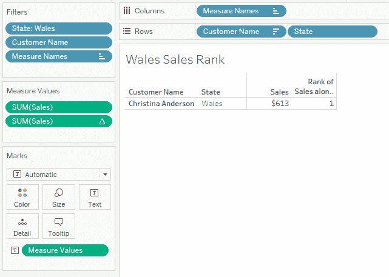

我们将在下一节中确定为什么我们没有看到期望的前 10 名客户，使用操作顺序。

# 顺序

为了解释这一点，让我们看看我们在这个书中的这个阶段已经熟悉的著名操作顺序的元素：

1.  提取过滤器

1.  数据源过滤器

1.  上下文过滤器

1.  集合、条件和 Top N 过滤器

1.  维度过滤器

1.  数据混合

1.  度量过滤器

1.  总计

1.  表计算

Tableau 中的操作按照从上到下的顺序执行。

首先，我们有**数据源**或**提取**过滤器（根据使用的连接类型，是实时还是提取），如第一章*构建您的数据模型*中所述。这些影响工作簿级别的整个数据集，在可以应用于工作表级别的任何特定过滤器之前。就工作簿中的 Tableau 计算而言，过滤掉的数据甚至不存在。

*上下文*过滤器类似于数据源或提取过滤器，但它们是视图特定的。它们通常用于加快处理速度，因为它们可以进一步缩小数据范围，就像在生成视图之前创建它的临时子集一样。这些主要适用于提高在非常大的数据集中（无法在工作簿级别进行筛选）将特定于类别（例如，仅复印机销售）的视图的性能。

可以通过在过滤器面板中选择现有的维度过滤器，并点击“添加到上下文”选项来创建上下文过滤器。蓝色药丸将变成灰色，以表示该过滤器现在是一个上下文过滤器。

*集合*、*维度*和*度量*过滤器（包括*条件*和*顶级 N*过滤器）在第一章*构建您的数据模型*和第二章*使用工作表*中进行了详细描述，正如第一章*构建您的数据模型*中描述的*数据混合*一样。请参考这些章节以解决对这些主题的任何剩余疑问。

根据当前的操作顺序，值得意识到的是，表格计算（如前一章所述）在顺序中排在最后，在总计（代表 Tableau 中使用的常规计算）之后。例如，如果我们在一个特定的**State**中对**Customer Name**使用排名表格计算，排名将包括该州及其订单，因为表格计算在维度过滤器之后。数据集中最大的客户可能只是特定地区的第 10 位客户。

现在我们已经了解了顺序，让我们回到之前的例子。

# 解释令人惊讶的结果

我们现在有了理解为什么只有一个客户出现的原因的工具：

如果我们看一下操作顺序，顶级 N 过滤器在维度过滤器（在这种情况下，对于`State`威尔士）之前，但在数据源过滤器（这里，`Country`英国）之后。

结果中显示的销售因此是威尔士地区前 10 名*全国性*客户（而不仅仅是威尔士地区的客户）的销售。其中九位客户在威尔士没有销售，只是在英国的其他地区，并且不出现在我们的结果中。

如果想查看仅在威尔士发生销售的顶级 10 名客户，可以将`State`过滤器提升为上下文过滤器，将其在操作顺序中向上移动：

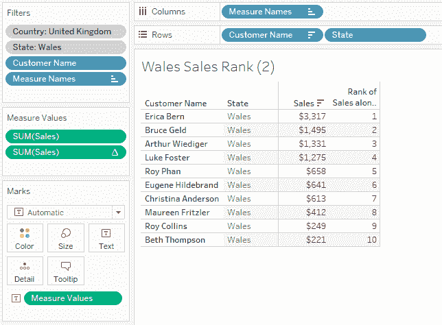

现在我们已经涵盖了运算顺序，让我们深入了解 LOD 函数，这将允许我们更改聚合级别。

# FIXED LOD 计算

`FIXED` 是本章我们将要研究的三个 LOD 计算中的第一个。它用于在电子表格中应用任何维度或测量过滤器的情况下进行计算。`FIXED` 的语法如下：`{FIXED [dim1[, dim2]…] : 聚合表达式}`，其中 `[dim1[, dim2]…]` 是要计算的聚合维度的列表。

请注意大括号的使用。本章中我们将描述的所有三个 LOD 表达式的语法都将相同。

例如，让我们看看给定客户的首次订单日期。虽然 `MIN([Date])` 计算将给出使用 **客户名称** 作为行或列的筛选数据集中的第一个日期，但 `{FIXED [Customer ID] : MIN([Date])}` 将给出每个 `Customer ID` 在整个数据集中的第一个日期，不考虑筛选器，对于每个客户。因此，如果我们查看 2013 年在 Global Superstore 数据集中的订单，我们会注意到 `First Order Date` 可以是 2011 年：

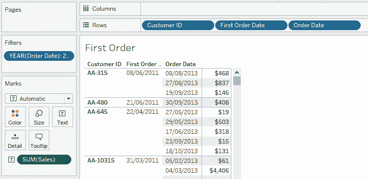

让我们现在看看这将如何受到运算顺序的影响。

# 运算顺序

因此，这个计算在运算顺序中的位置如下：

1.  提取/数据源筛选器

1.  上下文筛选器

1.  集合、条件和高 N 过滤器，`FIXED` LOD 计算

1.  维度筛选器

1.  数据混合

1.  测量过滤器

1.  总计

1.  表计算

让我们考虑三个示例来了解如何使用这个计算。

# 示例 1 – 终身销售价值

使用 Global Superstore 数据集，我们想要表示 2013 年我们低利润子类别的终身销售价值。

我们定义一个新的计算字段，`Lifetime Sales Value`，为 `{FIXED [Subcategories] : SUM([Sales])}`。这将计算子类别的总销售额，不考虑任何设置的维度筛选器。因此，如果我们以 2013 年的订单作为维度筛选器进行筛选，并计算 `Profit Ratio`（定义为 `SUM([Profit]) / SUM([Sales])`）、`Sales` 和 `Lifetime Sales Value`，我们将得到以下结果：

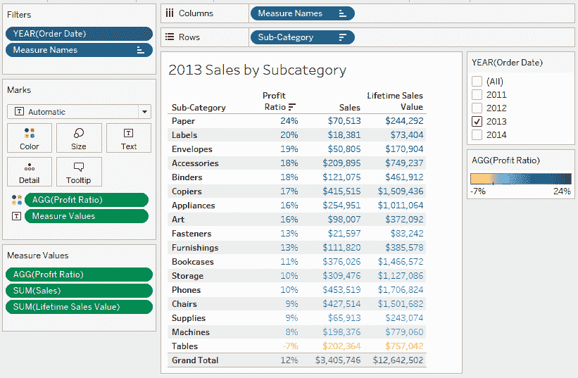

虽然 Tables 子类别在 2013 年没有盈利，销售额为 202,364 美元，但它在整个数据集中产生了 757,042 美元的销售额。

# 示例 2 – 贡献

使用 Global Superstore 数据集，我们想要看到在拉丁美洲市场按国家订购的单位对整个区域和整个公司的贡献。

`FIXED` 语法中的维度列表是可选的。因此，我们可以将 `Total Quantity` 定义为 `{FIXED:SUM([Quantity])}`。这将等同于每个计算的总单位数。这将是一个不会因我们视图的聚合级别而改变的值。

然后，我们可以将“全球数量贡献”定义为`SUM([Quantity]) / ATTR([Total Quantity])`（因为“总数量”不需要聚合）。

这里，我们使用`ATTR`，因为否则我们会因为混合聚合和非聚合而得到错误。

显示“数量”，一个针对“数量”的百分比总量的窗口计算，我们可以称之为“区域数量贡献”（沿表（向下））和刚刚定义的“全球数量贡献”，并筛选市场“LATAM”，我们得到以下结果：

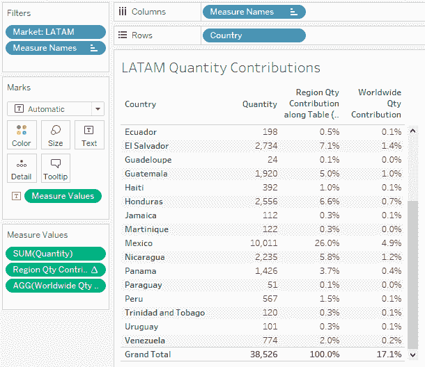

这里最后两列的结果不同，因为表格计算只考虑了 LATAM（因为它在操作顺序中位于维度过滤器之后）的数据，而 LOD 计算则考虑了整个数据集。

如果我们想进一步深入，我们可以将其变成一个地图视图：移除前两个度量以仅保留“全球数量贡献”，点击“显示我”>“地图”，最后选择“分析”>“显示标记标签”选项：

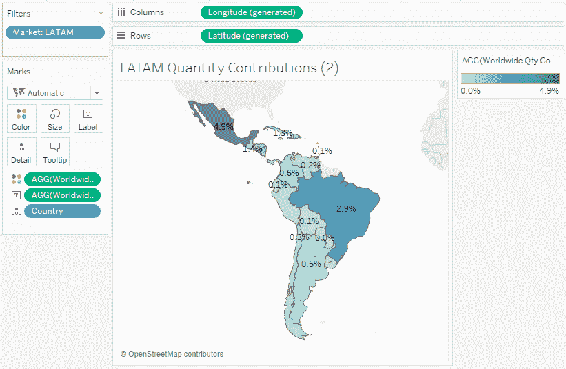

如果我们进一步筛选国家，我们仍然会看到他们对全球市场的贡献，这与表格计算不同，表格计算只会考虑筛选后的数据集。

# 示例 3 – cohort 分析

使用“全球超市”数据集，我们想看看 2012 年有多少销售额是由当年首次购买（订单日期）的客户（客户 ID）产生的。这通常被称为** cohort analysis**，在考试中经常出现。

对于每个客户，我们首先必须定义他们最早的购买日期。为此，我们创建一个计算出的“首次订单日期”字段`{FIXED [Customer ID] : MIN([Order Date])}`。这将取整个数据集中每个`Customer ID`的最早`Order Date`。

然后，我们可以创建一个以`Year([Order Date])`为列，`Year([First Order Date])`为行，`SUM([Sales])`为度量的可视化。这给出了以下结果：

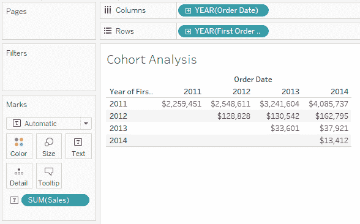

因此，在 2012 年首次下单的客户在该年花费了$128,828。

总结一下，我们使用`FIXED` LOD 来做出不受工作簿中应用的任何维度或度量过滤器影响的计算，这对于贡献、cohort 分析或任何需要考虑整个数据集的计算非常有用。让我们继续进行第二个 LOD 计算。

# `INCLUDE` LOD 计算

`INCLUDE` LOD 计算用于添加一层聚合，它不会作为维度的一部分使用。例如，你可能想查看不同市场的平均客户终身价值。在正常情况下，你需要首先在客户级别进行聚合，然后使用该聚合的结果来计算平均值。在 SQL 世界中，我们会使用子查询。简单地平均所有销售额不会得到相同的结果，因为它将在行项目级别进行计算，因此会给出行项目的平均价值。

我们可以通过说我们想要在包含视图中的维度和另一组额外维度级别的层面上进行聚合来理解这一点。这意味着我们拥有比视图将显示的更细粒度的数据，因此我们需要进一步聚合该计算的成果以在视图中显示。虽然`固定`计算的结果不需要聚合，但`包含`语句的结果需要。

作为提醒，语法类似于`固定`语句：`{INCLUDE [dim1[, dim 2]…] : aggregate-expression}`。虽然维度在技术上是可以省略的参数，但在那种情况下使用`包含`函数没有好处，它只是计算通常的聚合，没有增加粒度。

对于`固定`，在继续举例之前，了解它在运算顺序中的位置以优化其使用是很重要的。

# 运算顺序

这个特定的 LOD 函数，以及随后将出现的`排除`LOD 计算，位于数据混合和度量过滤器之间。因此，它们的计算晚于`固定`计算：

1.  提取/数据源过滤器

1.  上下文过滤器

1.  集合、条件、Top N 过滤器，`固定`LOD 计算

1.  维度过滤器

1.  数据混合

1.  `包含`和`排除`LOD 计算

1.  度量过滤器

1.  总计

1.  表计算

# 示例 1 – 客户平均终身价值

使用全球超市数据集，对于技术类别，我们想查看按`Segment`和`Market`拆分的客户平均终身销售价值。

如果我们只计算直接的`AVG([Sales])`，我们会得到以下结果：

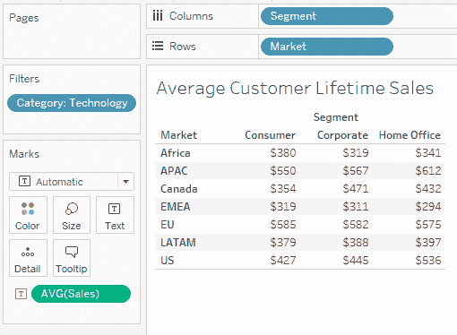

然而，这代表的是客户在行项目级别的平均销售额，而不是终身价值。如果客户 A 有两个订单，金额分别是 100 美元和 200 美元，而客户 B 有一个 300 美元的销售，平均销售额是 200 美元，但平均终身销售价值是 300 美元，因为两位客户的终身价值都是 300 美元。在这里，我们首先需要在客户级别计算销售额，然后对结果进行平均。

视图中缺少的维度是`客户名称`。因此，我们将创建一个`包含`语句`{INCLUDE [Customer Name]:SUM([Sales])}`，这将创建一个客户级别的中间计算。然后可以使用`AVG`对这些计算结果进行聚合，以得到正确的结果：

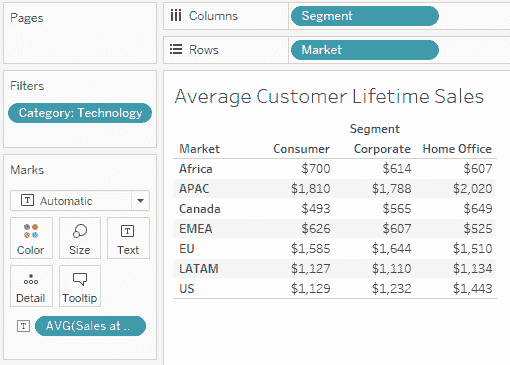

值得注意的是，如果我们总是要计算客户的终身销售价值平均值，我们可以在**计算字段**内的`AVG`中包含`包含`语句，Tableau 将识别如何进行聚合，而无需每次都指定它：`AVG({INCLUDE [Customer Name]:SUM([Sales])})`。

# 示例 2 – 客户平均发货天数的中位数

全球超市公司担心一些订单发货延迟，以及这可能会对其客户产生的影响。让我们看看 `平均发货天数` 通过 `客户名称` 对延迟订单的分析。

如果在工作簿中尚未定义，`平均发货天数` 计算为 `DATEDIFF('day',[订单日期],[发货日期])`，而 `发货状态` 为 `IF [实际发货天数] > [计划发货天数] THEN "发货延迟"`

`ELSEIF [实际发货天数] = [计划发货天数] THEN "按时发货"`

`ELSE "提前发货" END`.

如前几章所见，我们可以通过 `细分` 和 `市场` 创建一个快速分布图，使用 `客户名称` 作为详细标记以查看每个客户，并筛选出 `发货状态` 为发货延迟的订单：

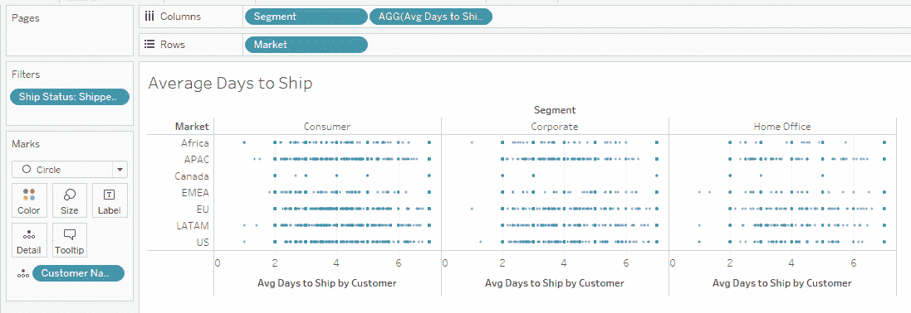

虽然有时查看每个客户是有价值的，但每个象限的概览数字可以是一个良好的性能指标。让我们选择中间值作为这样一个指标。我们现在需要移除 `客户名称` 作为维度，但仍然在计算中保留它以找到中间值。

在这里，我们可以定义 `MEDIAN({INCLUDE [客户名称] : AVG([实际发货天数])})`.

让我们从右边开始分解这个公式。看看平均发货天数。视图包括 **细分** 和 **地区**，所以通常的聚合会在那个级别进行。然而，我们希望在客户级别进行计算，因此我们创建了一个 `INCLUDE` 语句，指定我们想要将 `客户名称` 添加到维度列表中，即使它不是我们视图的一部分。由于现在结果过于详细，无法在视图中显示，我们选择最终通过取这些结果的中间值来进行聚合。如果我们通过 `细分` 和 `市场` 创建一个快速视图来查看这个度量，使用度量值作为颜色和分析 > 显示标记标签选项，我们得到以下结果：

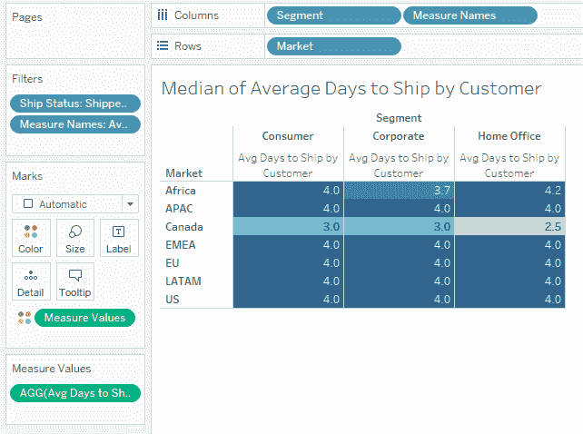

总结来说，我们可以使用 `INCLUDE` LOD 首先聚合一个高于视图级别的级别，包括一些不在其中但我们可以将其聚合回视图级别的维度。这在尝试从项目级别数据的集合中提取和总结订单级别数据时很有用。在结束这一章之前，让我们研究一个最后的 LOD 计算示例。

# EXCLUDE LOD 计算示例

虽然 `INCLUDE` LOD 计算使我们能够沿着视图维度和指定的进一步维度进行计算，但 `EXCLUDE` LOD 计算允许用户在计算时省略视图中使用的一个维度。例如，我们可以使用 `EXCLUDE` 来计算一个类别在各个地区的总利润，即使 `地区` 被用作行。这在处理对总量的贡献时特别有用。

# 示例 1 – 对总量的贡献

使用 Global Superstore 数据集，我们希望显示欧盟市场南部地区的总利润贡献，按国家、类别和子类别切割。**意大利**的**紧固件**子类别对南部整体紧固件业务的贡献是什么？

我们可以先在南方按`Country`和`Sub-category`绘制利润，并添加总计：

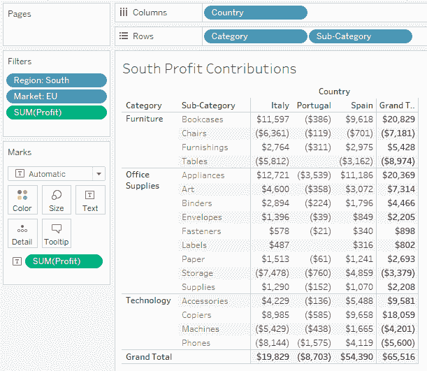

在意大利的**紧固件**情况下，我们希望看到它代表了利润的 $578/$898 = 64%。

我们有两种计算这种贡献的方法。我们可以为`SUM(Profit)`添加一个快速表格计算，计算总百分比，计算沿表（跨）进行。

我们还可以使用一个 LOD，计算子类别的总利润为`{EXCLUDE [Country]: Sum([Profit])}`，这将消除对`Country`的依赖，但不会对`Sub-category`产生影响。因此，我们可以进一步定义`SUM([Profit]) / ATTR({EXCLUDE [Country]: Sum([Profit])})`为一个国家对整个地区的贡献：

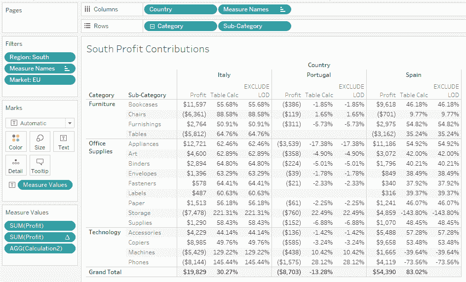

如预期的那样，这两个计算产生了相同的结果。我们也可以向上汇总到类别或向下钻取到产品名称，而无需重新定义字段。无论我们如何切割数据，我们都会始终显示对整个地区的贡献。

这两个计算之间的唯一区别在于运算顺序。虽然`EXCLUDE` LOD 计算在度量过滤器之前，但表格计算在之后。因此，如果我们根据度量进行筛选，表格计算将仅反映表中的值，而`EXCLUDE` LOD 计算将继续显示相同的结果。

例如，如果我们根据`SUM(Profit)`筛选，只显示盈利的四象限（即`SUM(Profit) > 0`），我们得到以下结果：

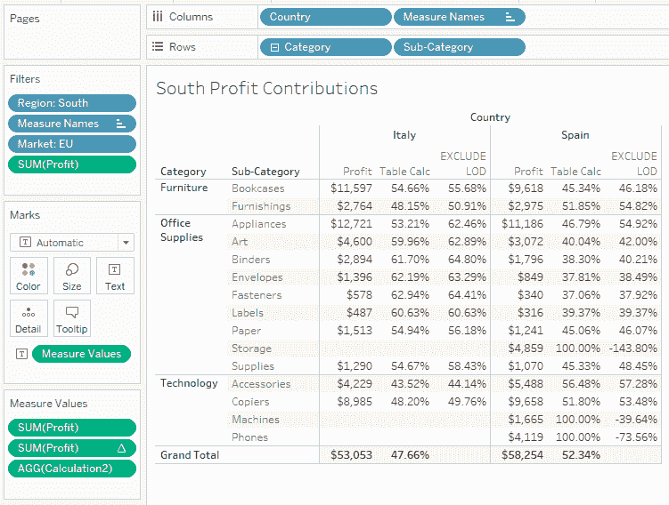

我们可以看到，`EXCLUDE` LOD 计算没有变化，而`Table Calc`现在仅反映屏幕上显示的数据。

# 示例 2 – 平均利润差异

使用 Global Superstore 数据集，对于盈利订单，我们想知道按类别和市场划分的平均每行利润与整个类别的平均利润之间的差异。例如，非洲的办公用品订单的平均利润与非洲任何订单的平均利润之间的差异是多少？

我们首先定义`Order Profitable?`为`IF {FIXED [Order ID]:SUM([Profit])} > 0 THEN 'Profitable' ELSE 'Not Profitable' END`，这将计算每个 Order ID 的整体利润，并快速筛选。

然后，我们可以按`Category`和`Market`切割平均`Profit`，筛选盈利订单，开启行的大总计：

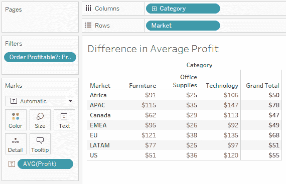

在这种情况下，我们希望比较办公用品的$25 平均利润与非洲订单的$50 平均利润。

因此，我们可以定义 `{Exclude [Category]: AVG([Profit])}` 为排除 `Category` 维度的平均利润（在这个视图中等于给定市场的 **总计**），以及进一步的计算 `AVG([Profit]) - ATTR({EXCLUDE [Category]: AVG([Profit])})` 将显示所需差异：

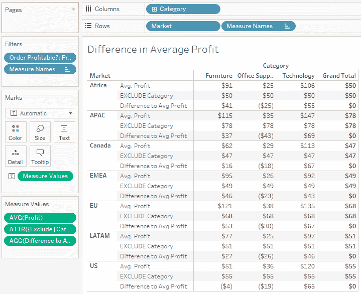

在这个例子中，我们可以看到非洲办公用品的订单比这个市场的平均订单行利润低 $25。再次强调，我们可以更改维度，而无需更改我们字段的定义，例如通过 `Segment`，只要我们继续按 `Category` 进行切片：

然而，如果我们完全删除 **Category**，这个计算将与简单的 `AVG([Profit])` 没有区别，并且会失去其价值。

# LOD 的数据源限制

虽然在 Tableau 中通常支持 LOD 计算，但某些数据源类型有一些限制。在撰写本文时，以下是一些最显著的例外：

| **数据源** | **支持** |
| --- | --- |
| Google Big Query | 支持标准 SQL，不支持旧版 SQL |
| Microsoft Access | 不支持 |
| 基于 Microsoft Jet 的连接（Microsoft Excel、Microsoft Access 和文本的旧版连接器） | 不支持 |
| Microsoft SQL Server | SQL Server 2005 及以上 |
| Mongo DB | 不支持 |
| Oracle | 支持版本 9i 及以上 |
| PostgreSQL | 支持版本 7 及以上 |

完整且最新的版本列表可以在 [`help.tableau.com/current/pro/desktop/en-us/calculations_calculatedfields_lod_constraints.htm`](https://help.tableau.com/current/pro/desktop/en-us/calculations_calculatedfields_lod_constraints.htm) 找到。

# 摘要

在本章中，我们介绍了 Tableau 中可用的三种 LOD 表达式类型（`FIXED`、`INCLUDE` 和 `EXCLUDE`），并研究了如何使用它们在比视图中的维度更细粒度（在 `INCLUDE` 的情况下）或更粗粒度（在 `EXCLUDE` 的情况下）的级别上聚合数据。我们还探讨了运算顺序，以解释这些计算与之前看到的计算（如表计算）之间的差异。例如，我们现在拥有计算对总贡献的工具、基于首次订单日期创建队列的工具，以及从项目级数据开始聚合客户级信息的工具。

这里是一个快速提醒：

|  | **FIXED** | **INCLUDE** | **EXCLUDE** |
| --- | --- | --- | --- |
| 运算顺序 | 在维度过滤器之前 | 在维度过滤器之后 | 在维度过滤器之后 |
| 目的 | 沿选定的维度在整个数据集上计算 | 使用不属于视图的维度计算结果 | 排除视图中的一个维度计算结果 |

本章结束了我们对 Tableau 中可以使用的不同计算的三个章节的探索之旅，我们现在准备使用一些分析工具来为我们的工作表添加一些见解。

# 问题

回答以下问题以测试你对本章信息的了解。

Q: 如果我没有使用任何维度过滤器，使用“总百分比”表格计算和使用`FIXED`/`EXCLUDE`计算之间有区别吗？

A: 虽然它们在一般情况下会产生相同的结果，但本章中我们讨论了一些例外情况，差异的主要原因是操作顺序。`FIXED`计算将不受维度和度量过滤器的影响而保持不变，`EXCLUDE`计算将不受度量过滤器的影响（但不受维度过滤器的影响），而表格计算将受维度和度量过滤器的影响。

Q: LOD 计算必须使用视图中已经包含的字段吗？LOD 计算能否在视图中选择字段确定的级别之外进行聚合？

A: 如`INCLUDE`计算的示例所示，LOD 计算可以用于对视图中不存在的字段进行聚合。

Q: LOD 计算总是产生度量值吗？

A: 不一定。在本章第二部分的群体示例中，我们可以使用`FIXED` LOD 计算来创建一个首次购买日期，这将被视为一个维度。

# 进一步阅读

你可以查看以下链接以获取有关本章涵盖主题的更多信息：

+   *Top 15 Tableau LOD Expressions*: [`www.tableau.com/about/blog/LOD-expressions`](https://www.tableau.com/about/blog/LOD-expressions)

+   *数据源约束对于细节级别表达式*: [`help.tableau.com/current/pro/desktop/en-us/calculations_calculatedfields_lod_constraints.htm`](https://help.tableau.com/current/pro/desktop/en-us/calculations_calculatedfields_lod_constraints.htm)

+   *哪种计算适合你的分析：简单、表格还是 LOD？* [`help.tableau.com/current/pro/desktop/en-us/calculations_calculatedfields_understand_which.htm`](https://help.tableau.com/current/pro/desktop/en-us/calculations_calculatedfields_understand_which.htm)
