# 第八章：利用分析能力

在前三个章节中，我们学习了如何在 Tableau 中创建越来越复杂的计算。现在我们有了开发强大工作簿的工具，让我们看看是否可以利用 Tableau 的分析能力为我们的数据增添色彩，无论是通过图形元素，如参考线或带状区域，还是使用预测来预测未来的数据。

本章将涵盖以下主题：

+   Tableau 分析面板中的基本工具

+   额外的分析选项

+   使用预测

+   实际例子

# 技术要求

本章使用 Global Superstore 数据集，可以在[`www.tableau.com/sites/default/files/training/global_superstore.zip`](http://www.tableau.com/sites/default/files/training/global_superstore.zip)找到。

# Tableau 分析面板中的基本工具

Tableau 提供了一套现成的分析工具，可以简单地拖放到视图中。这些功能可以在分析面板中找到，通常通过点击数据旁边的标签页：

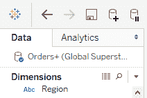

如果你看不到屏幕左侧的内容，你可以通过菜单栏中的 Window > Show Side Bar 来显示它。面板包含的工具被分为三个部分：总结、模型和自定义。

# 使用选项

工具栏中的每个分析工具都按相同的方式工作。你可以双击选项，或者将其中一个拖放到视图中，这将出现一个包含几个选项的面板：

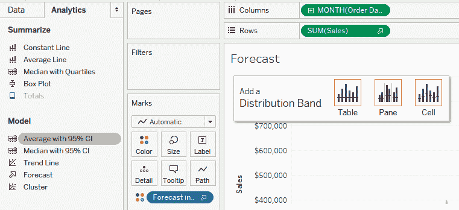

通常情况下，它将显示三个图标（表格、面板和单元格）或只有一个（当没有选择时），除了总计。这将向 Tableau 指示计算应考虑的范围，并且你可以在其中一个图标上放置你的分析工具。以平均行选项为例，将其拖放到每个图标上会产生以下三种可能性：

如果你选择了**表格**图标，你将得到以下输出：

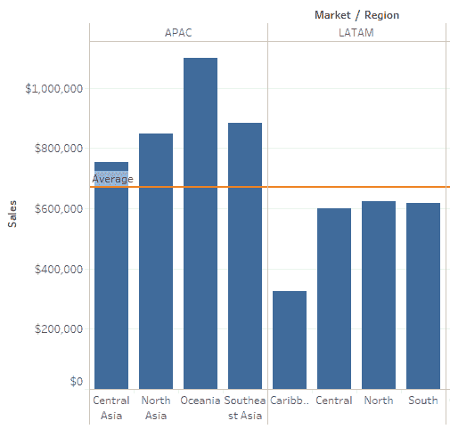

如果你选择了**面板**图标，你将得到以下输出：

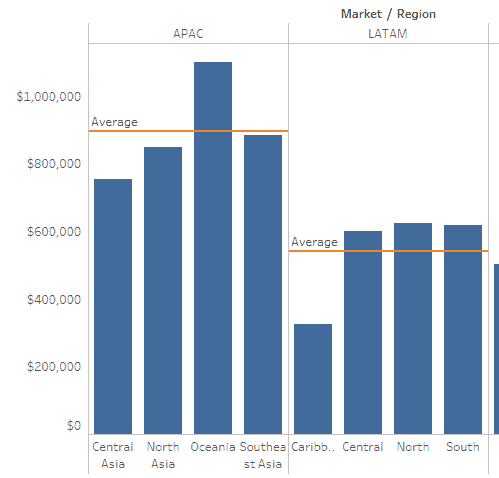

如果你选择了**单元格**选项，你将得到以下输出：

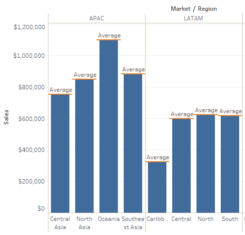

虽然**表格**代表整个视图，但**面板**是视图的一部分，对应于行和列的维度交叉，这些行和列由一条**分隔线**界定。例如，在前面的例子中，有两个面板，一个在 APAC 下面，一个在 LATAM 下面，正如你所看到的它们之间有一条线。单元格是维度最小的交叉点，在先前的视图中共有八个。

这些是我们之前在第六章，*Tableau 表格计算*中讨论过的选项。

我们也可以通过说表格选项类似于总计数，将在整个可视化中只保留一个值；面板选项类似于一个维度的子总计；单元格选项类似于最低级别的子总计，并且只有在有详细标记的情况下才有意义（否则，它将只聚合一个值，就像这里的情况一样）。

一旦这些分析工具被集成到视图中，您可以通过单击它们的表示并使用工具提示中的相关选项来编辑或删除它们：

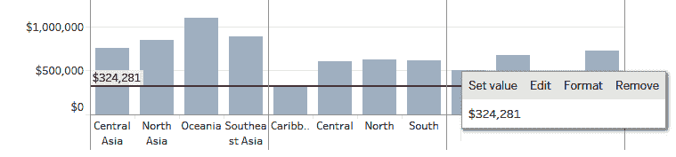

您也可以通过简单地拖动并放下参考线使其不可见来执行删除操作，就像您对任何其他字段所做的那样。

最后，您可以使用新创建的线条或区域上的格式选项，包括颜色、字体和数字格式。

大多数工具实际上只是对自定义选项的快捷方式，所以让我们首先浏览一下那些选项。

# 创建参考线

不同的线条选项将在您选择的范围内（无论是表格、面板还是单元格级别）创建参考线。一旦将参考线选项拖放到您的可视化中，您就可以使用编辑窗口在两个主要值类别之间切换：

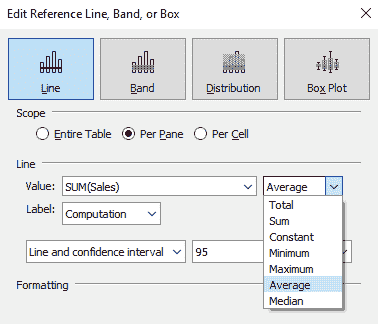

在这里，您可以选择“常量”选项，它将在您的表示中显示一条单线，或者选择几个计算选项之一，这些选项将在您选择的范围内聚合值。不同的聚合可能性显示在“线条”子菜单下，包括“常量”选项。

参考线相当于表格计算，这意味着显示的平均值将是可视化中标记的平均值，而不是底层数据。

最后，您还可以选择置信区间并在同一线条子菜单和线条标签下显示它，标签可以自定义（无论是显示值、聚合名称还是计算名称，分别使用值、计算和自定义选项）。

您也可以通过单击现有的参考线并使用工具提示中的编辑选项来返回此菜单。

# 分析栏中的快捷键

分析工具栏中的常量线、平均线、带有 95%置信区间的平均线和带有 95%置信区间的中位数选项是线条最常见选项的快捷方式，但您始终可以将它们拖放到视图中并在以后进行编辑。

# 使用参考带

参考带将创建两条参考线，正如前一小节所述，并将用浅色填充这两条线之间的空间。编辑窗口中的“带来源”和“带目标”选项与线条相同；您可以使用这些选项来自定义和格式化带的上下值。

# 分析栏中的快捷键

在分析栏中没有常用参考带的快捷键；您必须在自定义下的“参考带”选项中，选择相关参数。

# 添加分布带

分布带允许用户创建一个或多个前一个聚合的倍数（例如，中位数的 50%、100%或 150%）的带状区域，或者基于统计量（例如，百分位数、分位数和标准差）创建线条或带状区域。生成的带状区域将以所选主要颜色的不同色调着色，以表示两个度量之间的间隔：

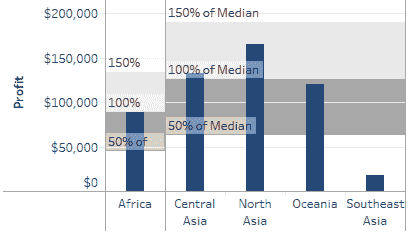

当在编辑窗口中使用百分位数时，用户可以选择使用所选值之一（80、90、95、99）来显示相应的百分位数线，或者使用“输入一个或多个值”选项：

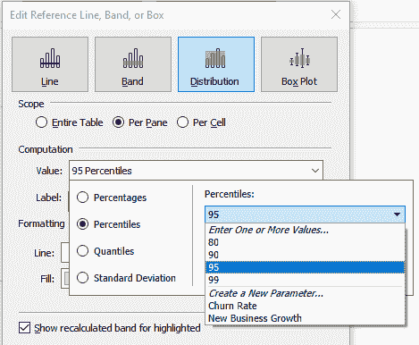

例如，要显示第 20、60 和 90 个百分位数，请从下拉菜单中选择“输入一个或多个值”，并输入百分位数作为逗号分隔的值；例如，`20,60,90`。

如果您想为给定的百分位数（例如，第 90 个百分位数）创建参考线，您必须使用带有“百分位数”选项的分布选项卡，使用一个值，而不是使用线条选项卡，因为那里没有百分位数选项。

对于分位数，可以使用介于 3（三分位数）和 10（十分位数）之间的任何值，但默认情况下，所有分位数都会在视图中显示。如果您只想显示几个选定的分位数，请使用带有选定计算值的百分位数选项（例如，`10,50,90`仅显示第一、第五和第九十分位数）。

标准差选项创建的是与平均值相距标准差倍数的带状区域。虽然最常见的选项是`-1,1`以显示平均值的正负一个标准差内的分布（一个在下方，一个在上方），但可以指定更复杂的带状区域，例如`-0.5,1,2`，以显示从平均值的 0.5 个标准差以下到 1 个标准差以上的带状区域，以及一个从 1 到 2 个标准差以上，以不同色调显示的第二个带状区域。

# 分析栏中的快捷键

**分析**工具栏中的“中位数与四分位数”选项是常见参考带（四分位数，4 度分位数）的快捷方式，但您可以将“分布带”选项拖放到可视化中，以创建数据的自定义视图。

# 生成箱线图

箱线图（也称为箱线和须线）是目前最广泛使用的统计可视化之一。箱体表示四分位数范围（或**IQR**，即第一四分位数和第三四分位数之间的分布范围，也称为**枢纽**），用线表示中位数，而须线则表示数据的全部范围或四分位数范围的 1.5 倍。

这是一个非常有用的工具，用于描述您不想推断正态分布时的变化。

可以通过从分析面板拖动或使用“显示我”按钮来创建一个箱线图可视化：

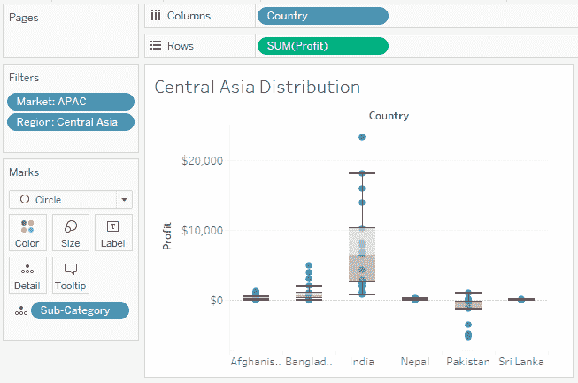

如果工具箱中的箱线图选项变灰，将其悬停在其上会显示当前视图的问题（例如，视图中的标记不足或不能与条形图等堆叠标记混合）。

将鼠标悬停在箱线图上，将显示箱线不同极限的值，从底部开始：下须须、下枢纽（第一四分位数）、中位数、上枢纽（第三四分位数）和上须须。

使用工具提示中的编辑功能，通常会将您带到编辑窗口，在那里您可以格式化箱线并更改以下两个选项：

+   检查须须是否应该延伸到 1.5 倍四分位距内的数据或数据的最大范围

+   是否显示或隐藏不在须须之外的标记（异常值），使用“隐藏基础标记（除异常值外）”选项

现在我们已经介绍了基本的分析工具，您可以看到它们实际上是四种将在编辑参考线、带或箱窗口顶部可用的可视化类型：

将其中之一添加到视图中，您只需转到编辑框即可创建它们。我们将在下一节继续回顾剩余的不同工具。

# 其他分析选项

分析面板中剩余四个选项是：**总计**、**趋势线**、**聚类**和**预测**。这些中的最后将在下一节中详细介绍，让我们先关注前三个。

# 总计

总计选项可以拖放到视图中，以打开所有行、所有列的总计，或为所有行和列添加子总计：

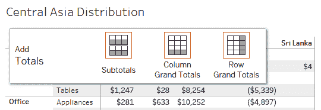

无法为选定的维度打开子总计；必须对所有或没有进行操作。

总计也可以通过使用分析>总计选项来打开，这些选项可以在菜单中找到。

# 趋势线

Tableau 可以使用分析栏中具有相同名称的选项创建常用的趋势线（线性、对数、指数、多项式、幂），并通过拖放将其拖放到视图中：

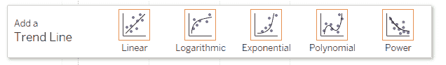

如果趋势线选项在侧边栏中不可用，这通常是因为您需要两个轴都是度量值，或者是一个日期和一个度量值。当鼠标悬停在灰色选项上时，将会显示这一点。

例如，使用全球超市数据集，我们可以将“利润”添加到行，将“销售额”添加到列，将“订单 ID”添加到详细标记，并筛选出“订单利润是否为利润”为利润的订单。然后，我们可以将趋势线拖放到可视化中的线性图标上。通过这样做，我们将得到以下输出：

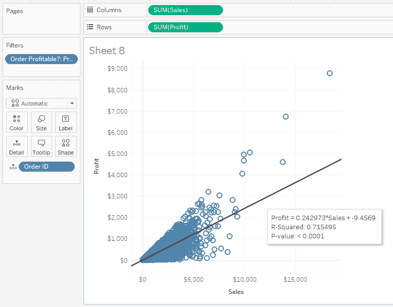

将鼠标悬停在线上将显示带有方程式和 R²和 P 值的工具提示，这将帮助你确定趋势是否相关。

如果你需要编辑趋势线或更改参数，你可以在工具提示中选择编辑选项，进入趋势线选项窗口。

现在，凭借 Tableau 的力量，只需几点击就能轻松识别趋势。

# 簇

虽然**簇**选项没有明确包含在考试大纲中，但当我们想要创建数据集的子集时，它是一个有价值的工具。例如，我们可以通过在行中包含`国家`来创建一个地图视图，将`SUM(Sales)`作为指标，并使用“显示我”选项创建快速地图。然后，将簇拖到视图中将根据销售价值水平生成国家组，并使用它们对地图进行着色编码。如果我们想修改这些参数，我们可以在指标中的簇药丸上单击并选择编辑簇：

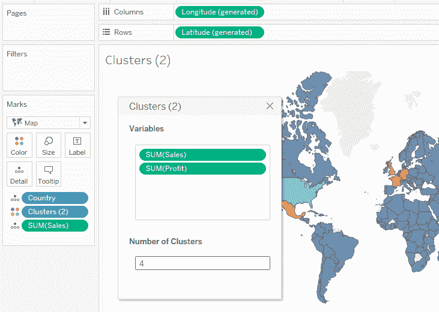

然后，我们可以添加其他变量以包含在簇的计算中，并且我们可以定义一个固定的簇数，而不是保持自动化的数量。

有关 Tableau 如何创建簇的更多信息，请参阅本章“进一步阅读”部分的*如何进行聚类*链接。

当创建了一个簇时，你可以将其药丸从指标部分拖动到维度，将其转换为一个组。你会注意到图标与通常的组图标略有不同（簇图标和回形针的组合），这是为了表示这个组不是静态的，可以使用重置选项进行重新拟合。这意味着如果范围发生变化，它可以更新为最新的数据。

# 摘要卡片

虽然**摘要卡片**不是分析面板的一部分，但如果你想要快速查看数据集的统计属性，它是一个有用的工具。

它可以通过使用工作表>菜单中的显示摘要来打开。当它们显示时，它将出现在**卡片**部分，位于过滤器下方：

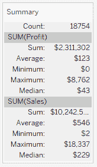

默认情况下，它将显示每个度量指标的总分以及总和、平均数、最小值、最大值和中位数。当在卡片中的下拉菜单中选择时，你可以选择额外的计算集，包括标准差、第一四分位数和第三四分位数。

重要的是要记住，这张卡片中的结果类似于表格计算：这里显示的中位数是指标的中间值，而不是基础数据的中间值。

这总结了我们对 Tableau 附带的基本分析工具的回顾。还有一个工具要回顾，我们将在下一节中完成。

# 使用预测

虽然之前的工具仅对现有数据进行分析，但预测选项允许我们外推数据，以便窥视未来。

默认情况下，Tableau 包含一个包含几种模型最佳选择的包，以创建一个简单的预测。Tableau 使用指数平滑模型，该模型对最近的数据点赋予比旧数据点更多的权重。然后可以使用在编辑预测工具箱中找到的选项对这些预测进行微调。

要开始使用预测，只需将分析栏中的预测选项拖放到包含一个且仅有一个日期字段的图表或表格上（否则，你将看到一条消息，表明无法为具有多个日期字段的视图创建预测）。你还可以使用分析 > 预测 > 显示预测菜单来达到相同的结果。Tableau 将然后创建一个基于自动选项的最佳猜测预测，包括给定时期的置信区间（基于可用过去数据量）。

例如，使用 `Order Date` 作为列（月份）和 `Sales` 作为行，我们可以将**预测**选项拖放到视图中：

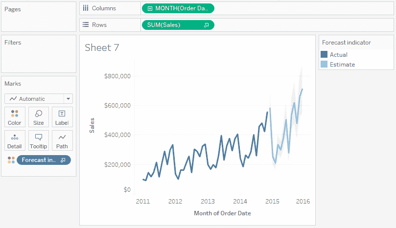

这将创建一个新的颜色方案，以便我们可以区分实际数据和估计数据，并且旁边将出现一个粗箭头，以确认预测已开启。如果你需要编辑预测，可以在点击预测时使用工具提示中的编辑功能，或者使用分析 > 预测 > 预测选项...菜单。

对于此功能的基本用户和本考试的用途，唯一可能感兴趣的选择是预测长度（如果你想要能够操作它）和忽略最后选项，这在某些数据后面有未完整周期时很有帮助。高级用户可以使用**了解更多关于预测选项**的链接，以深入了解不同选项可以带来什么。

如果你遇到无法添加预测（或预测未显示）的问题，可以在**分析**面板中的预测选项上（或视图中的无预测标签上）悬停，以了解更多关于为什么无法生成预测的原因。

这结束了我们对 Tableau 提供的不同分析工具的回顾。在我们结束这一章之前，让我们看看一个例子。

# 一个实际例子

现在我们已经了解了 Tableau 的分析工具，让我们看看我们是否可以解决这个样本考试问题：

在拉美市场中，哪些子类别在销售额和利润方面都偏离平均值超过一个标准差？

我们可以通过两种方式来回答这个问题。

首先，我们可以使用上一章中的内容，使用 `INCLUDE` 语句来显示两个度量总和的平均值和标准差。在这里，我们将定义 `{INCLUDE [Sub-Category]: SUM([Profit])}` 和 `{INCLUDE [Sub-Category]: SUM([Sales])}` 并查看每个的平均值和标准差，如下所示：

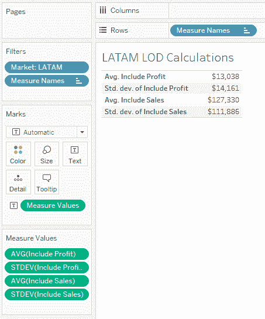

通过进行一些简单的加法，我们可以得到下限和上限（例如，$13,038 + $14,161 = $27,199 作为利润的上限，$127,330-$111,886 = $15,444 作为销售额的下限）。随后，我们可以按`Sub-category`绘制`Sales`和`Profit`，并得到答案。但在向下扫描时，很容易忽略一个子类别。

相反，我们可以尝试充分利用分析面板。我们可以将`Sales`和`Profit`绘制在行和列上，并使用`Sub-Category`作为详细标记：

现在，我们可以将分布带拖放到表的两个度量上。而不是默认的 60%，80%的平均值，我们可以点击标准差并保留建议的-1，1 因子，这意味着平均数上下各一个标准差：

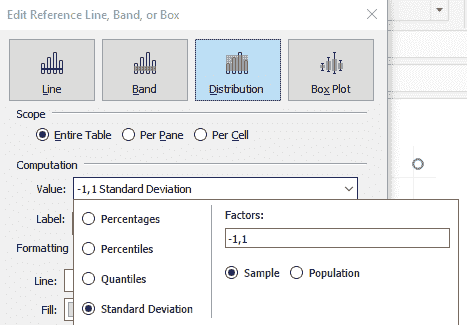

注意，你可能需要调整其中一个带，因为 Tableau 一次处理一个，第二个仍然会显示默认的 60%，80%的平均值。为此，单击带的一个定义线，并在工具提示中使用编辑。

现在，我们有一个表示平均数一个标准差内的分布的阴影区域：

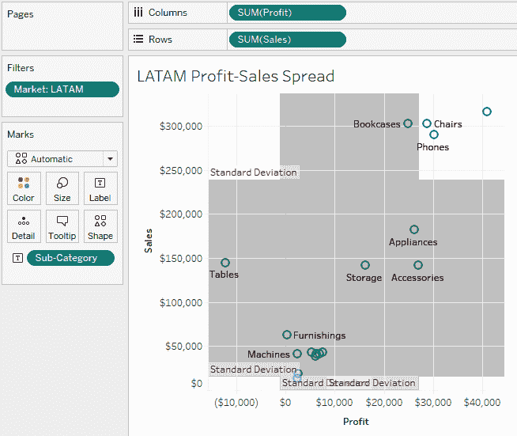

因此，很容易在右上角找到三个子类别，它们位于两者之外，并且可以通过悬停在标记上（如果需要的话，在椅子上、电话和复印机上）来获取它们的名称。

# 摘要

在本章中，我们介绍了 Tableau 的一些分析工具，这些工具允许我们创建参考线或带，将数据聚类在类似的桶中，识别趋势，并预测我们的数据将如何在未来看起来。这使我们能够突出一些可能从视图中遗漏的有用信息（例如平均线或可能告诉我们项目何时开始和结束的恒定带），这有助于将有意义的见解带入我们的数据。

本章结束了我们对工作表的探索，我们现在已经拥有了所有考试所需的工具。在本书的下一章和最后一章中，我们将研究如何使用仪表板将不同的工作表链接并呈现为单个综合视图。

# 问题

回答以下问题以测试你对本章信息的了解。

Q：使用全球超级商店数据集，如果你通过`Year`创建`Sales`的预测，Tableau 默认预测多少个周期？

A：两个周期（以`Year(Order Date)`作为列，以`SUM(Sales)`作为行，并拖动预测选项）。

Q：如何在视图中创建 90 百分位数的单行？

A：通过添加一个带有百分位数的分布带，选择 90 作为选项，而不是添加参考线，因为没有百分位数的选项。

Q：使用全球超级商店数据集，使用四分位距，中亚哪个国家的利润分布最广？

A: 如本章所述创建箱线图，印度是拥有最宽四分位距（由箱体大小表示）的国家。

# 进一步阅读

您可以通过以下链接查看更多关于本章所涵盖主题的信息：

+   预测选项：[`help.tableau.com/current/pro/desktop/en-us/forecast_options.htm`](https://help.tableau.com/current/pro/desktop/en-us/forecast_options.htm).

+   预测字段结果：[`help.tableau.com/current/pro/desktop/en-us/forecast_field_results.htm`](https://help.tableau.com/current/pro/desktop/en-us/forecast_field_results.htm).

+   聚类工作原理：[`help.tableau.com/current/pro/desktop/en-us/clustering.htm#how-clustering-works`](https://help.tableau.com/current/pro/desktop/en-us/clustering.htm#how-clustering-works).
