# 构建您的仪表板

到目前为止，我们已经学到了很多关于如何构建数据视图的知识；现在是时候将所有这些整合在一起了。您创建的视图通常是用户识别关键信息的手段。仪表板允许我们将多个视图组合到单页面上。通过在单页面上展示多个数据视图，我们能够更有效地传达信息。

然而，在单页面上展示多个视图带来了许多挑战。你需要展示合适的视图组合，而不会让用户感到不知所措。你还需要以用户易于使用和理解的方式构建仪表板。本章将向您介绍功能和最佳实践，这些将帮助您构建可操作和富有信息量的仪表板。在本章的最后部分，我们将讨论以下主题：

+   仪表板简介

+   有效的设计实践

+   探索仪表板和布局面板

+   讲述故事

+   整合一切

# 仪表板简介

仪表板是单页面上重要信息的视觉展示。它通常由多个相关组件组成，允许用户跟踪变化或获取信息。仪表板内置了控制功能，允许用户过滤信息。这些过滤器通常控制仪表板上的多个工作表。这使得用户能够在不切换屏幕的情况下查看各种相关组件。

过滤器是用户与仪表板中视图交互的方式——它们允许用户回答问题。仪表板与报告的区别在于仪表板主要是视觉化的。虽然它们可以包含表格摘要，但应该强调可视化。已有许多研究描述了数据可视化的重要性。主要发现是数据可视化在揭示模式、异常值、趋势和相关性方面表现出色，这些在查看数字表格时难以发现。

您可以将仪表板视为选择如何展示您的表格。仪表板应该能够传达数据中的关键发现。构成仪表板的可视化通过过滤器和控制功能是交互式的。有效的信息设计既是艺术也是科学。没有一种适合所有情况的通用方法或技术来创建强大而有用的仪表板。

如果经过深思熟虑，仪表板可以为组织带来巨大的价值。在下一节中，我们将讨论如何创建有助于用户更好地理解数据的仪表板。

# 有效的设计实践

当你准备创建仪表板时，你已经做了大量的工作来创建表格。表格是仪表板的基础；不仅要在开发单个表格时小心，还要注意它们在仪表板中的呈现方式。在本节中，我们将讨论有效仪表板设计的最佳实践。虽然这些提示并不全面，但它们将为你开发强大仪表板的道路提供一个良好的起点。

# 目的

在构建任何解决方案之前，最重要的考虑因素是了解目的。仪表板将回答哪些问题？有一个要回答的具体问题列表可以给你一个明确的目的。在开发仪表板时，你应该始终有一个明确定义的目的。了解目的迫使你解决观众的需求。在商业中，了解仪表板的目的通常涉及理解用户对哪些**关键绩效指标**（**KPIs**）感兴趣。

通过了解你的受众并理解他们的需求，你将能够开发出用户愿意使用的可操作仪表板。最终，仪表板需要回答问题，让人们保持知情，并且易于使用。如果这三个要素没有得到满足，那么所有人都会受到影响。

# 良好的设计原则

很容易陷入构建酷炫可视化，拥有众多光滑功能的陷阱。始终记住仪表板的目的。它应该以易于理解的方式提供用户所需的信息。在构建仪表板时，你会面临许多挑战。当你开始面对这些挑战时，请使用以下章节中的提示。

# 限制使用的纸张数量

限制使用的表格数量——你不想用表格和杂乱的东西让用户感到不知所措。仪表板不应该难以使用（或理解）。通过限制仪表板中使用的表格数量，你限制了用户需要关注的元素。导致糟糕仪表板设计最常见的原因之一就是包含过多的表格。一般来说，你应该在仪表板中使用不超过三个可视化元素。

展示多个视图可以让你包含更多信息以及更细致的细节。更多信息也意味着用户可能会迷失在重要和不重要的事物中。在设计仪表板时考虑大局可以帮助减轻这种情况。

# 清晰简洁

创建各种图表类型很有趣。Tableau 使得根据视觉类型包含大量额外信息变得容易。再次强调，了解你的受众非常重要。尽量让他们容易获取他们想要的信息，即使这意味着简化你的设计。设计时考虑你的受众。一个好的仪表板是人们愿意使用的。人们更倾向于使用简单的仪表板而不是复杂的仪表板。

# 构建一个连贯的故事

构建一个连贯的故事——仪表板应该清晰有效地传达信息。你将面临的最大挑战之一是如何以无缝的方式将工作簿中的各种工作表组合在一个仪表板中。记住，你试图在有限的空间内展示大量数据。在朝着最终目标努力的过程中，你需要考虑工作表之间的关系。你讲述的故事取决于观众想要和需要看到的内容。

现在我们已经描述了一些良好的设计原则，让我们讨论如何使用仪表板和布局面板创建仪表板。

# 探索仪表板和布局面板

仪表板面板左侧菜单中有两个标签页。这两个标签页是不同的面板——仪表板和布局。仪表板面板允许您在仪表板上放置工作表和对象。它也是设置屏幕尺寸选项的地方。布局面板提供了对仪表板中工作表和对象格式的更精细控制。布局面板允许您精确地定位和填充仪表板中的项目。我们将在下一节中讨论这两个面板。

# 仪表板面板

在本节中，我们将开始构建我们的仪表板。为了创建仪表板，您必须至少创建了一个工作表。仪表板是一个空白页面，您可以在这里组合多个工作表。仪表板以多种方式具有交互性，主要是通过使用过滤器。要创建仪表板，请单击工作簿底部的“新建仪表板”按钮。仪表板标签位于工作簿底部：

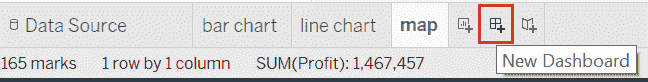

点击工作簿底部的“新建仪表板”按钮后，将打开一个空白仪表板页面。与工作表页面类似，左侧面板中有两个标签页——仪表板和布局。仪表板面板是默认视图。仪表板面板包含四个主要部分：

+   设备预览

+   尺寸

+   工作表

+   对象

我们现在将更详细地讨论这些部分。以下截图显示了左侧面板中的四个主要部分（设备预览、尺寸、工作表和对象）：

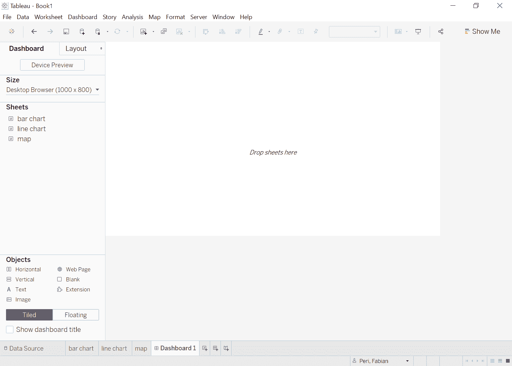

# 工作表

要将工作表添加到视图中，可以双击面板“工作表”部分下的名称，将工作表拖放到画布上，或者右键单击工作表名称并选择“添加到仪表板”。

在以下示例中，双击了标题为柱状图的工作表。现在，该工作表已添加到仪表板中，包括在柱状图工作表中应用的所有过滤器：

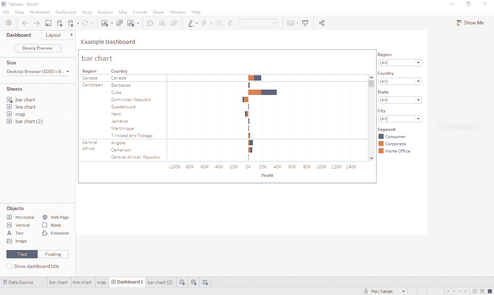

在工作表上右键单击会弹出以下菜单：

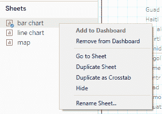

下面是每个项目的简要描述：

+   添加到仪表板：将所选工作表添加到仪表板。

+   从仪表板移除：从仪表板中移除所选工作表。

+   前往工作表：带您进入 Tableau 工作簿中选定的工作表。

+   复制工作表：创建选定工作表的副本。

+   复制为交叉表：将选定的工作表复制为交叉表。这是一种查看以行和列形式使用在可视化中的数据的绝佳方式。下面的屏幕截图显示了仪表板中工作表的交叉表版本（柱状图）：

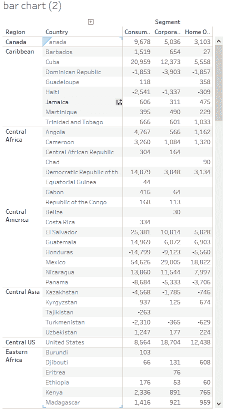

+   隐藏：在 Tableau 工作簿中隐藏选定的工作表。

+   重命名工作表...：允许您重命名选定的工作表。

除了复制工作表之外，您还可以复制仪表板。要这样做，请转到“工作表”菜单，右键单击“仪表板”选项卡，然后选择“复制”：

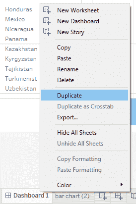

复制仪表板会创建一个与复制仪表板外观完全相同的新的仪表板。新的仪表板仍然引用与原始仪表板相同的所有工作表。在下一节中，我们将讨论除了工作表之外可以添加到仪表板的各种对象。

# 对象

对象是您可以添加到仪表板的项目。对象允许您自定义仪表板的外观，并允许添加额外功能。要将对象添加到仪表板，请双击对象名称或将对象图标拖放到画布上。根据您选择的对象，您将有一些自定义选项。以下表格简要描述了每个对象：

| **图标** | **工作表和描述** |
| --- | --- |
| 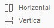 | 水平和垂直：这些选项提供水平和垂直布局容器，允许您分组相关项目。这些容器可以被视为仪表板的子部分。通过创建这些对象，您可以更好地控制仪表板特定区域的格式化。在下面的屏幕截图中，一个垂直布局容器被拖放到柱状图工作表下方：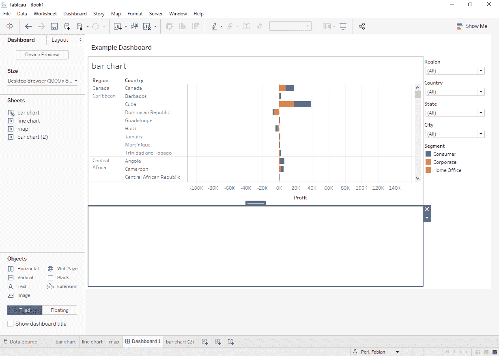 您可以将其他对象放置在这个垂直容器中。调整此容器的大小也会影响其他对象的大小。注意，一旦包含垂直容器，柱状图工作表现在占仪表板一半的高度。 |
| 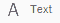 | 文本：允许您为标题、描述和其他数据输入文本。在下面的屏幕截图中，一个文本对象被添加到仪表板顶部。文本内容为“仪表板标题”。您可以按需格式化文本！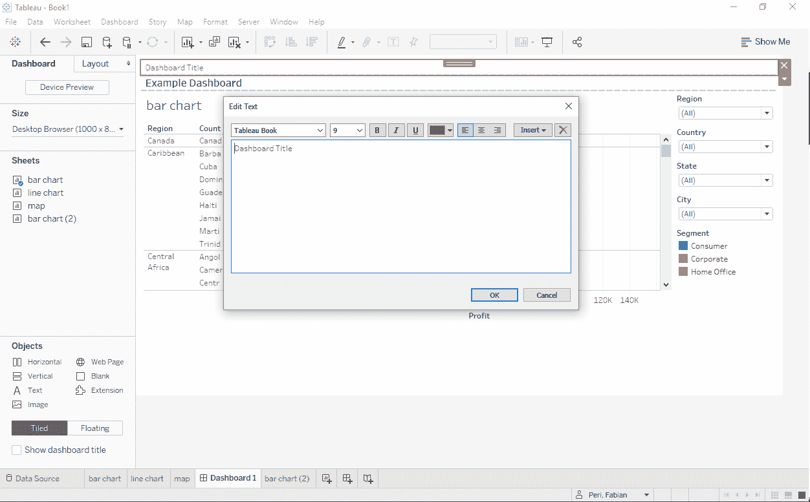 |
| 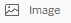 | 图像：一个允许您输入图像的对象。在以下屏幕截图中，图像对象被添加到柱状图下方：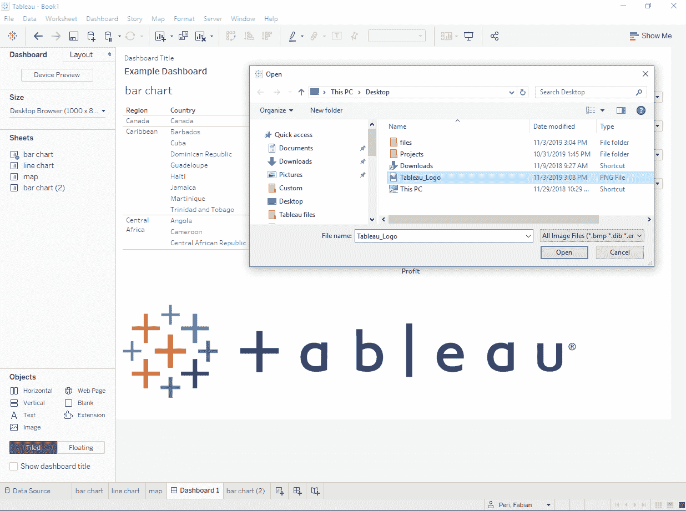 图像在仪表板中后，您可以进一步格式化它。单击图像对象然后右上角的向下箭头图标以显示可用于自定义图像的选项列表：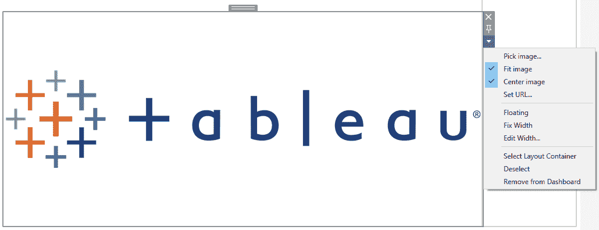 |
|  | 网页：一个允许您在仪表板中嵌入网页的对象。在以下屏幕截图中，图像对象被网页对象所取代。当双击网页对象图标或将其拖放到仪表板时，将出现一个 URL 窗口。在此处输入网页 URL 的名称，然后单击“确定”：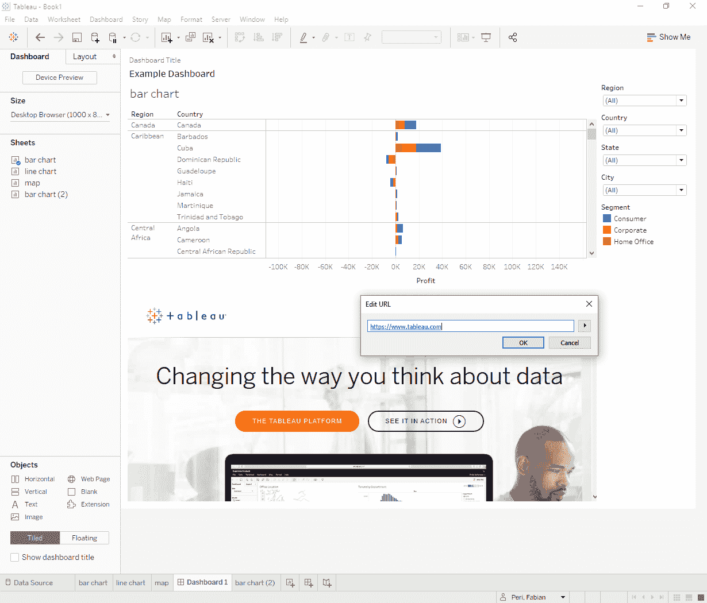 |
|  | 空白：一个允许您在仪表板中输入空白空间的对象。这将在您格式化和微调仪表板时有所帮助。 |

| 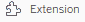 | 扩展：允许您向 Tableau 仪表板添加扩展。在以下屏幕截图中，扩展对象被添加到网页对象所在的仪表板中。将出现一个“选择扩展”菜单：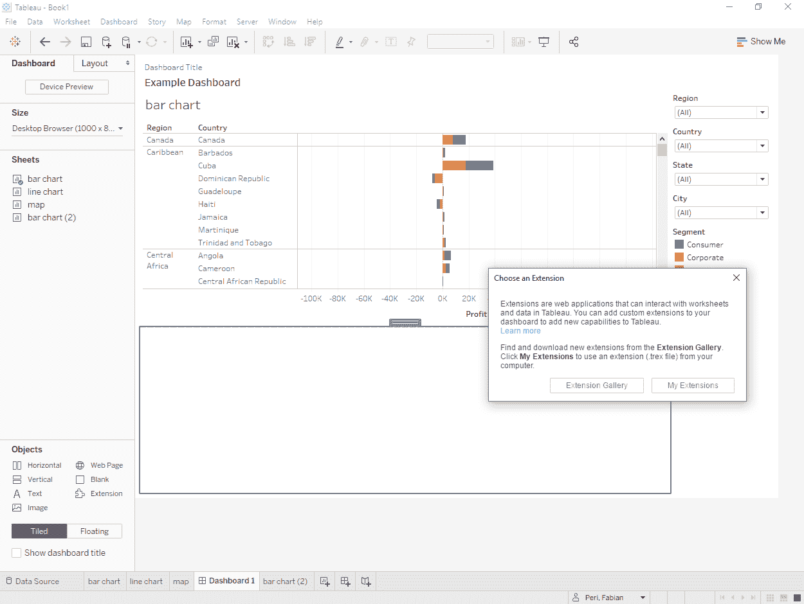

扩展主题由于存在许多不同的扩展而超出了本书的范围。需要了解的重要一点是，扩展是与 Tableau 通信的 Web 应用程序。它们允许您使用通过 Tableau 连接到的数据使用自定义应用程序。要查看可用的扩展列表，请访问 Tableau 的扩展库，网址为 [`extensiongallery.tableau.com/`](https://extensiongallery.tableau.com/)。

并非所有网页在添加到网页对象时都会显示。这主要是由于网络安全问题。如果您添加的页面不起作用，我们建议您谷歌搜索或查看 Tableau 表单以了解原因。

放置在仪表板中的表和对象以两种方式之一进行布局：网格或浮动。在下一节中，我们将讨论它们之间的区别。

# 网格对象与浮动对象

以下屏幕截图中显示了“对象”菜单。我们已在前一节中讨论了每个单独的对象。这里的切换菜单允许您在网格对象和浮动对象之间进行选择：

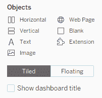

+   **网格对象**：仪表板中的每个对象都使用网格机制进行排列。网格对象与其他网格对象对齐，以网格不重叠的方式形成一个视图。网格对象更容易处理。网格对象通常比浮动对象更好地根据显示设置调整大小。我们的建议是在可能的情况下使用网格对象。

+   **浮动对象**：仪表板中的每个对象都可以自由放置在任何位置。浮动对象可以放置在其他对象之上——它们不受网格的限制。虽然浮动对象可以更好地利用空间，但这也有代价。这种代价是当屏幕大小改变时这些对象的渲染方式。平铺对象会根据屏幕设置自动调整大小，而平铺对象则不会。浮动对象的主要用途之一是用于图例。

当向仪表板添加多个工作表时，您必须考虑用户如何能够看到不同的可视化。最佳实践规定，用户不应需要滚动才能看到仪表板的不同元素。我们知道这并不总是可能的，但选择正确的显示设置可以极大地影响用户使用仪表板的便捷性。我们将在下一节中讨论显示大小和设备预览选项。

# 显示设置

要查看大小菜单，请点击仪表板当前大小右侧的下箭头。将出现一个弹出菜单，允许您从常用设备分辨率中选择。以下截图显示了结果：

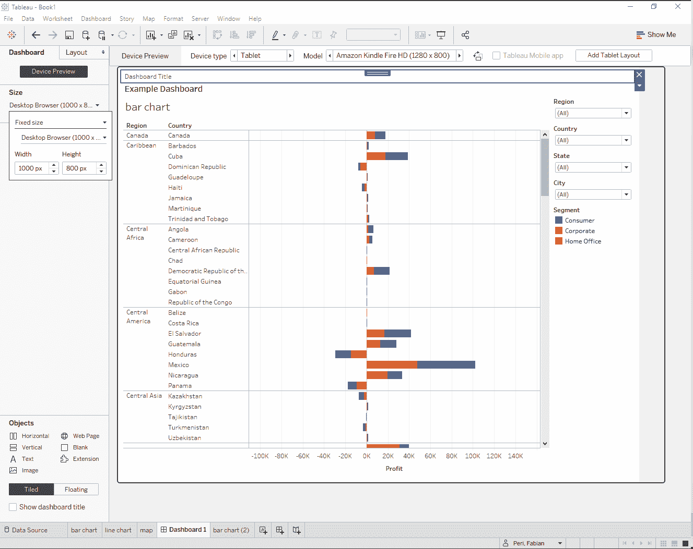

点击当前显示大小（固定大小）右侧的下箭头，将弹出大小选项。有三个大小选项，如下面的截图所示：

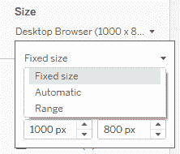

以下是对大小选项的简要描述：

+   固定大小：这是默认的大小。固定大小意味着仪表板的大小不会因查看器的屏幕大小而改变。如果仪表板扩展到屏幕大小之外或下方，用户将看到滚动条。每种大小选项都有其优缺点。使用固定大小的仪表板，您可以控制对象的精确位置。如果您选择使用浮动元素，固定大小的仪表板是建议的选项。在使用固定大小的仪表板时，您可以从以下建议中选择特定设备的选项：

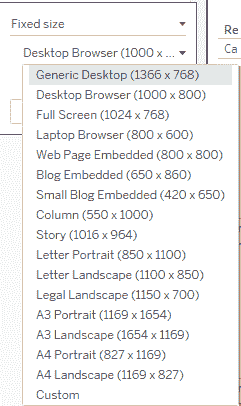

+   自动：如果您希望 Tableau 确定显示设置，请选择此选项。Tableau 将尝试根据用户的屏幕大小调整窗口大小。

+   范围：使用范围设置，您可以选择最小和最大显示大小。如果用户的显示小于所选的最小值，仪表板将调整到最小显示大小。同样，如果用户的显示大于所选的最大值，仪表板将调整到最大显示大小。

# 设备预览

在您的仪表板中添加项目后，您可以使用设备预览选项来查看仪表板在不同显示上的渲染效果。以下截图突出了在仪表板面板中点击设备预览按钮时出现的设备预览部分：

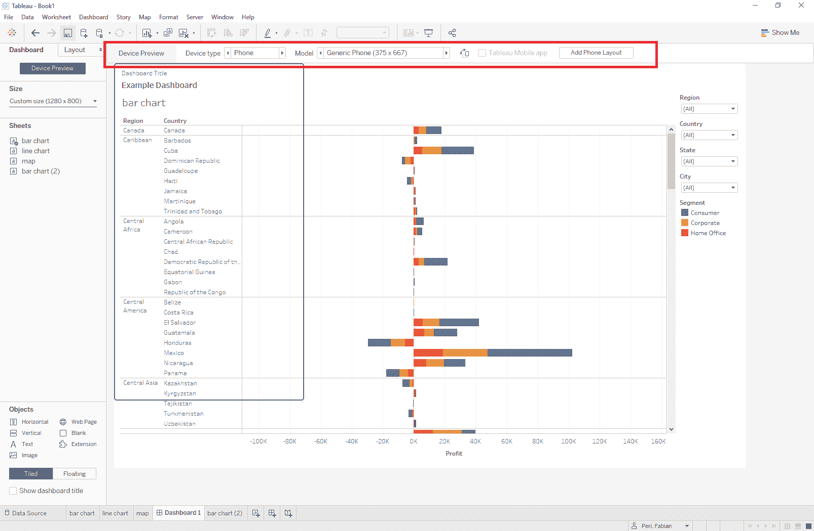

使用设备布局菜单查看仪表板在不同设备上的外观。这是一个很好的方法来查看你的仪表板如何在另一个用户的设备上显示。记住，尽管仪表板在你的设备上看起来很好，但这并不意味着它在另一个用户的设备上看起来会一样。

现在我们已经讨论了仪表板面板，让我们继续到布局面板。

# 仪表板布局面板

正确的大小和排列使仪表板更容易使用。重新组织工作表位置、移动对象和一般的格式化操作可以帮助构建无缝的用户体验。在前面的章节中，我们讨论了仪表板面板中的显示设置和排列选项。现在我们将讨论可以应用于工作表和对象的附加格式化选项，以帮助完善你的仪表板。以下截图显示了布局面板中可用的选项：

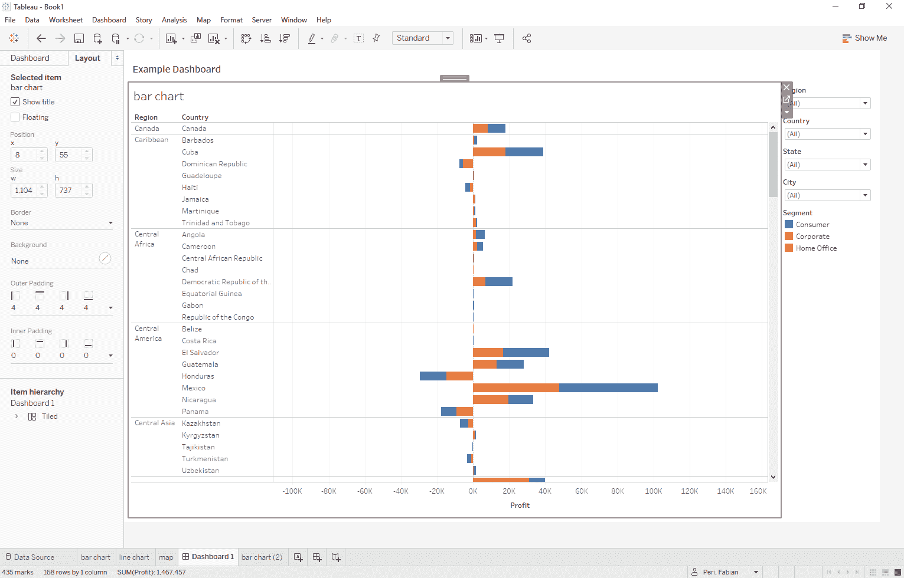

以下是对布局选项的简要描述：

+   显示标题：在仪表板上选择一个工作表或对象。勾选/取消勾选显示标题复选框将显示此项目的标题。使用此选项插入或删除标题。

+   浮动：在仪表板上选择一个工作表或对象。勾选/取消勾选浮动复选框将项目从平铺改为浮动（或反之亦然）。

+   位置：如果你为仪表板大小选择了固定大小或范围，那么你可以微调工作表和对象在仪表板上的显示位置。x 和 y 是从左上角起的偏移量，表示从该点的像素长度。

+   大小：如果你将你的工作表或对象从平铺改为浮动，你可以手动设置宽度和高度。w 代表宽度，h 代表高度（以像素为单位）。

+   边框：为工作表或对象添加边框。

+   背景：为工作表或对象添加背景颜色。

+   外边距：为工作表或对象添加外边距。外边距是添加到元素外部的空间 – 它增加了用于美观的空间：

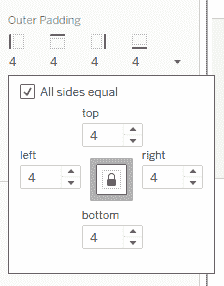

+   内边距：与外边距类似。这为工作表或对象添加内边距。内边距是添加到元素内部的空间 – 它增加了用于美观的空间。

+   项目层次结构：如果你使用浮动对象，项目层次结构会显示对象是如何分层的。项目从上到下排序，这意味着层次结构中较高的对象位于其他项目之上：

在下一节中，我们将介绍另一种与用户分享你的分析的方法 – 故事。

# 讲述故事

在本节中，我们将讨论故事。为了创建一个故事，您必须至少创建了一个工作表。故事是一个空白页面，您可以在其中结合文本和其他对象。您创建多个故事点，依次展示以用数据讲述故事。故事是分享您分析结果的一种极好方式。要创建故事，请点击工作簿底部的“新建故事”按钮。故事标签位于工作簿底部：

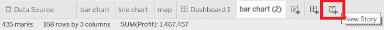

点击工作簿底部的“新建故事”按钮后，将打开一个空白故事页面。故事是一系列以有序格式展示的可视化。故事类似于 PowerPoint 演示文稿。故事由一系列故事点组成。以下截图显示了空白故事页面：

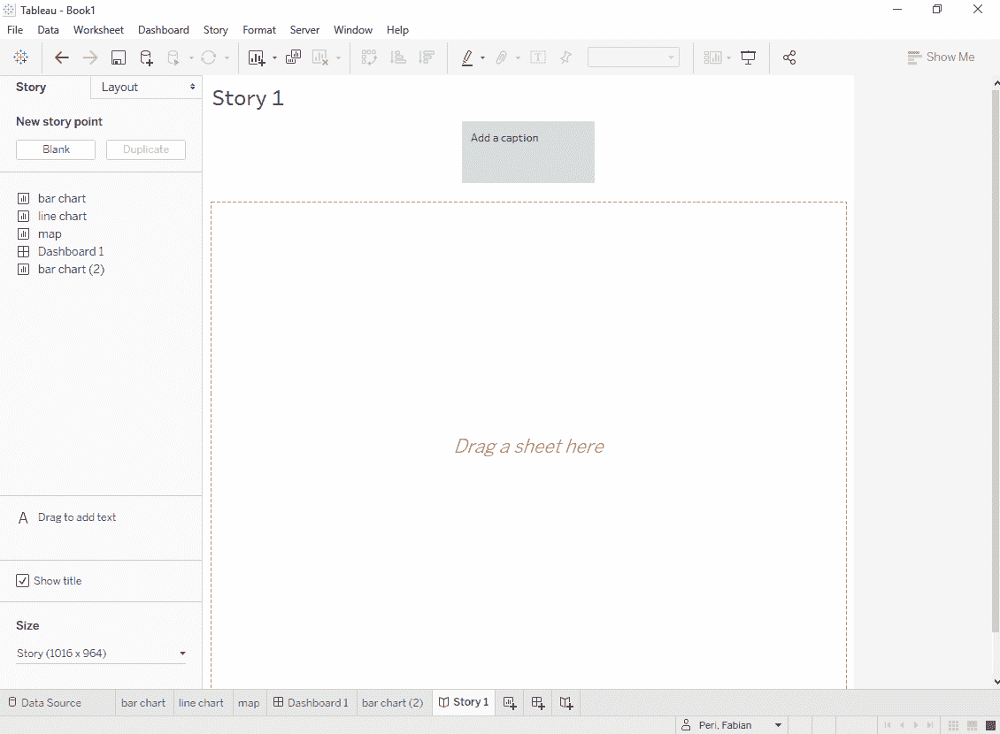

故事面板左侧菜单中有两个标签。这两个标签是不同的面板 – 故事和布局。故事页面的布局类似于仪表板页面。故事面板允许您在故事中放置工作表和对象。它也是您设置屏幕尺寸选项的地方。布局面板提供了更精细的控制，以如何导航故事。我们将在下一节中讨论这两个面板。

# 故事面板

与仪表板类似，您应该考虑您故事的目的。您展示的数据以及您如何展示数据是讲述故事的主要组成部分。您正在引导观众得出一个应该用数据支持的结论。与仪表板一样，我们相信在开发之前您应该有一个计划或大纲。坐下来编写叙述将有助于使您的故事更加出色。

故事面板包含四个主要部分 – 新故事点、工作表、文本和大小。以下是对布局选项的简要描述：

+   工作表：要将工作表添加到故事点，可以双击面板“工作表”部分下的名称，或者将工作表拖放到画布上。在以下示例中，标题为“柱状图”的工作表被双击。现在，该工作表已添加到故事面板中，包括在柱状图工作表中应用的所有过滤器。以下截图显示了添加柱状图工作表后的故事面板：

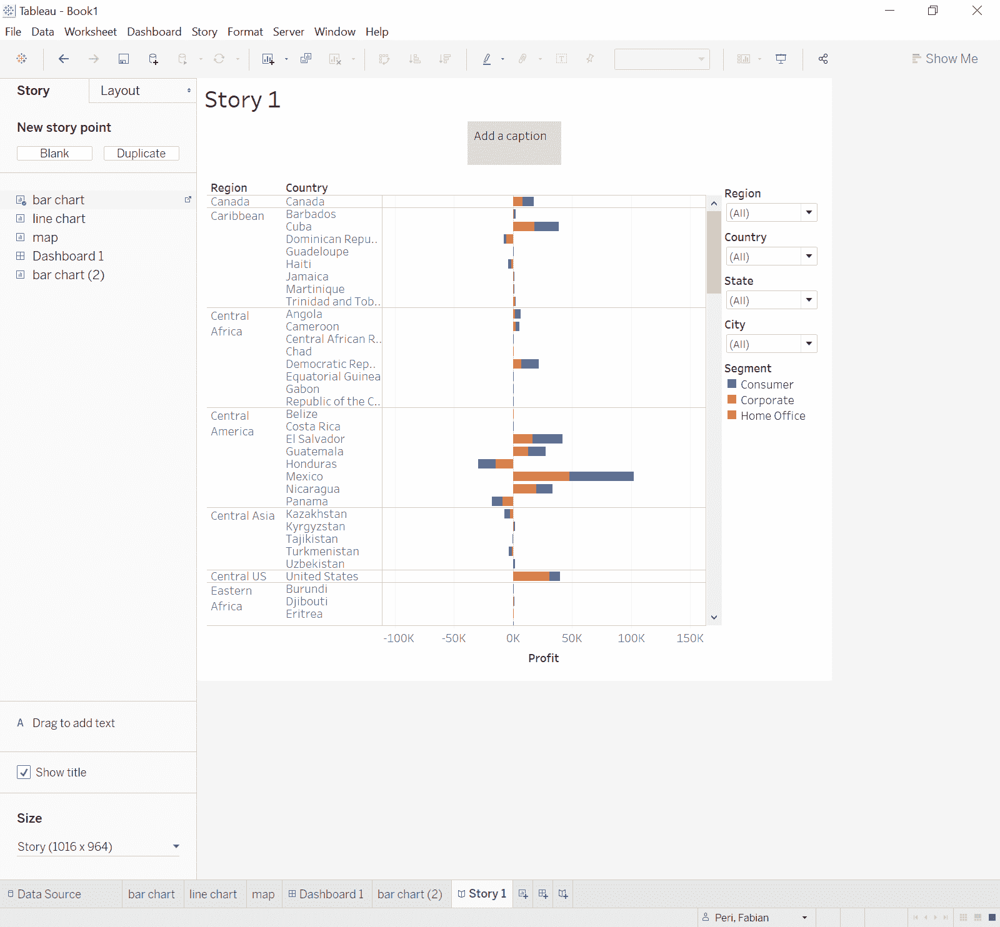

+   新故事点：如果你把你的故事看作是一次演示，那么故事点就是一个单独的幻灯片。故事是由多个按顺序传达观点或信息的故事点组成的。新故事点部分有两个按钮——空白和复制。空白按钮为你创建一个新的故事点来工作，而复制按钮则创建当前故事点的副本。在前面的屏幕截图中，只有一个故事点——故事点在故事标题下方的面板中间用灰色框表示。在下面的屏幕截图中，创建了一个空白故事点——注意现在画布上故事 1 的标题下有两个灰色框：

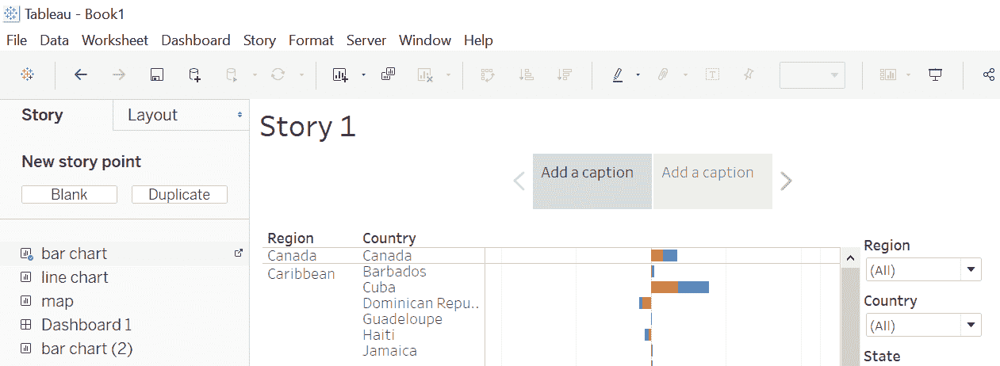

+   文本：点击以向你的故事点添加文本字段。在下面的屏幕截图中，向故事点添加了文本。你可以将文本字段拖放到故事点的任何位置，因为它是一个浮动对象。显示标题复选框控制是否显示故事点标题（以下屏幕截图中画布左上角的“故事 1”）：

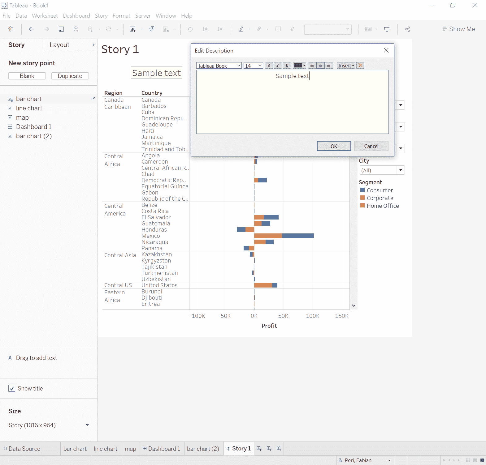

+   大小：选择你的故事的显示大小。这应该是你的用户将查看故事的大小。如果你点击大小选项中的向下箭头，将出现预定义的屏幕大小列表：

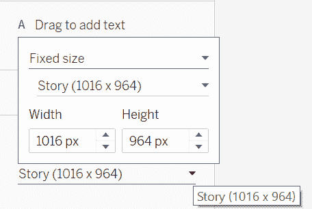

现在我们已经快速浏览了故事面板，我们将转向布局面板。

# 故事布局面板

布局面板包含有关如何向用户展示导航选项的选项。你可以从标题框、数字、点和箭头中进行选择。尝试这些设置以找到最适合你故事的方法：

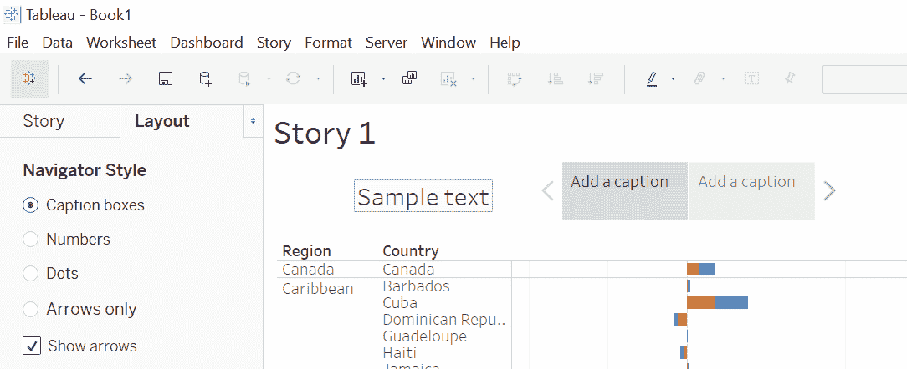

一旦你完成了你的故事，你可以使用 Tableau 的演示模式来分享它，或者将故事发布到 Tableau 服务器。全屏按钮位于菜单栏的右上角：

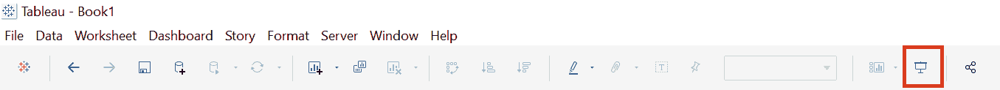

到目前为止，在本章中，我们已经讨论了创建仪表板和故事可用的功能和选项。你现在拥有了创建和分享你想要讲述的故事的专业视角所需的所有部件。随着我们旅程的结束，我们将以我们对制作引人注目的数据可视化的最终思考作为结尾。

# 摘要

创建仪表板和故事是艺术和科学的结合。你开发出的可视化效果只与基础数据的好坏相匹配。如果数据不准确，那么解决方案至多是无用的，在最坏的情况下是有害的。对于用户来说，没有信息比他们被误导认为准确的不正确信息更有益。可视化的信息必须是真实的。好的可视化可以增强信息。它们使用户能够识别趋势，发现模式，更有效地理解信息。

在这本书的整个过程中，你已经学习了如何使用 Tableau。现在你应该对以下关键概念感到熟悉：

+   连接到并建模你的数据

+   在工作表中处理数据

+   根据你的数据选择合适的图表类型

+   绘制地理数据

+   创建自定义计算

+   理解**细节级别**（**LOD**）表达式

+   使用 Tableau 的嵌入式分析功能

+   通过仪表板和故事分享你的分析

我们从解释 Tableau 如何帮助你和你所在的组织更好地理解你的数据开始我们的旅程。我们希望你已经了解了 Tableau 的关键特性以及如何使用它们来充分利用你的数据。虽然这本书中介绍的概念不是全面的，但它们足以帮助你通过 Tableau Desktop 认证考试。提高 Tableau 技能的最好方法是开始使用它。你现在有一个坚实的基础来构建。我们给你的最后建议是找到你想要回答的问题，获取数据来这样做，并使用你在本书中学到的技巧来帮助你创建准确、直观且视觉上令人惊叹的报告解决方案。
