# 模拟测试 A + B（评估）

# 模拟测试 A 和 B

对于模拟测试 A 和 B，你需要以下数据：

+   样本 Superstore 数据集：[`www.tableau.com/sites/default/files/training/global_Superstore.zip`](http://www.tableau.com/sites/default/files/training/global_superstore.zip)

+   FIFA 比赛结果：[`public.tableau.com/s/sites/default/files/media/world_cup_results.xlsx`](https://public.tableau.com/s/sites/default/files/media/world_cup_results.xlsx)

+   2018 FIFA 名单：[`public.tableau.com/s/sites/default/files/media/world_cup_2018_squads.xlsx`](https://public.tableau.com/s/sites/default/files/media/world_cup_2018_squads.xlsx)

+   泰坦尼克号乘客名单：[`public.tableau.com/s/sites/default/files/media/titanic%20passenger%20list.csv`](https://public.tableau.com/s/sites/default/files/media/titanic%20passenger%20list.csv)

+   星战角色详细信息：[`public.tableau.com/s/sites/default/files/media/starwarscharacterdata.json`](https://public.tableau.com/s/sites/default/files/media/starwarscharacterdata.json)

+   苹果数据：[`www.ers.usda.gov/webdocs/DataFiles/51035/apples.xlsx?v=0`](https://www.ers.usda.gov/webdocs/DataFiles/51035/apples.xlsx?v=0)

+   NFL 统计数据：[`public.tableau.com/s/sites/default/files/media/Resources/NFL%20Offensive%20Player%20stats%2C%201999-2013.xlsx`](https://public.tableau.com/s/sites/default/files/media/Resources/NFL%20Offensive%20Player%20stats%2C%201999-2013.xlsx)

+   酿造生产规模：[`docs.google.com/spreadsheets/d/1fjA0jSVPecI7rCeSx5MUzIw3Z0pOJeYbT1q80bW1SsM/edit?usp=sharing`](https://docs.google.com/spreadsheets/d/1fjA0jSVPecI7rCeSx5MUzIw3Z0pOJeYbT1q80bW1SsM/edit?usp=sharing)

+   Tableau 职场仪表板：[`public.tableau.com/workbooks/Practiceworkbook-TableauJobMarket.twb`](https://public.tableau.com/workbooks/Practiceworkbook-TableauJobMarket.twb)

考试包括以下部分：

计算 1-7

数据连接 8 - 13

分析 14 - 19

组织数据 20 - 23

分箱 24 - 26

仪表板 27 - 28

映射 29 - 30

**测试 A**

问题 1：使用 Superstore 数据集回答以下问题。除了消费者细分市场之外，2013 年到 2014 年间盈利率的百分比变化是多少？

1.  23.89%

1.  40.17%

1.  24.17%

1.  32.74%

问题 2：使用星战数据集回答以下问题。橙色眼睛的男性角色的最常见首字母是什么？

1.  S

1.  A

1.  T

1.  C

问题 3：使用 Superstore 数据集回答以下问题。2014 年所有产品对在 2012 年也下过订单的客户的总销售额是多少？

1.  2,677,439

1.  4,139,150

1.  587,457

1.  4,299,866

问题 4：使用泰坦尼克号乘客名单数据回答以下问题。名单上有多少戴维斯姓氏的人？

1.  1

1.  7

1.  18

1.  2

问题 5：`COUNTD` 函数返回组中不同项目的数量。是否正确，即 *null* 项目被视为一个单独的项目？

1.  是

1.  否

问题 6：使用 2018 FIFA 名单回答以下问题。出生于 1990 年之前的球员中，有多少人进球超过 10 个？

1.  19.29%

1.  80.71%

1.  11.96%

1.  88.04%

问题 7：对于任何聚合计算，以下哪个说法是正确的或错误的：你不能将聚合值和非聚合值结合在一起？

1.  是

1.  否

问题 8：使用超市数据集回答以下问题：2014 年东南亚从未退货的商品的总销售额是多少？

1.  23,161

1.  212,726

1.  306,769

1.  323,068

问题 9：使用苹果数据集，回答以下问题：新鲜和冷冻苹果的平均价格是多少？

1.  2.126

1.  0.51

1.  1.616

1.  1.063

问题 10：使用 FIFA 比赛结果和 2018 FIFA 名单数据回答以下问题。在 2018 年获得过冠军的队伍中，有多少名出生于 1990 年之前？

1.  12

1.  4

1.  0

1.  23

问题 11：使用酿酒生产规模数据集回答以下问题。对于生产规模小于一桶的酿酒厂，2017 年和 2018 年出口产品的百分比差异是多少？

1.  -45.51%

1.  -16.35%

1.  45.5%

1.  7.24%

问题 12：使用超市数据集回答以下问题。在消费者细分市场中，给予最少折扣的经理是谁？

1.  安娜·安德雷迪

1.  阿莱杭德罗·巴伦蒂内

1.  莎莉·丹尼尔斯

1.  尼科尔·汉森

问题 13：何时使用数据混合而不是 `JOIN` 会更好？

1.  当你无法通过 `JOIN` 结合数据源时

1.  当数据混合是唯一可用的选项时

1.  当 `JOIN` 不提供所需的灵活性时

1.  当你需要避免数据重复而不丢失无关数据时

问题 14：使用 FIFA 比赛结果数据集回答以下问题。创建一个条形图，显示年份和进球数。添加 65% 到 80% 的分布带。65% 平均值是多少？

1.  77.3175

1.  65

1.  95.16

1.  73.65

问题 15：使用 NFL 统计数据集回答以下问题。创建一个散点图，使用 College Wins 和 Age 详细说明 Player。线性趋势线的标准误差是多少？

1.  <0.001

1.  0.800443

1.  86.3054

1.  148.27

问题 16：使用 NFL 统计数据集回答以下问题。使用箱线图，找出球员身高的下四分位数是多少？

1.  66

1.  71

1.  73

1.  76

问题 17：线性趋势线何时可以被认为是显著的？

1.  当 t-value >= 0.5

1.  当标准误差 <= 5.0

1.  当 R-squared >= 0.05

1.  当 p-value <= 0.05

问题 18：Tableau 使用哪两种方法来确定预测中的季节性？

1.  时间性和非时间性

1.  粒度和非粒度

1.  线性和非线性

1.  季节性和非季节性

问题 19：你会使用哪个 Tableau 选项来区分标记（单个数据点）并在视图中指出它们的 X/Y 轴位置？

1.  工具提示

1.  轴线

1.  折线

1.  参考线

问题 20：使用 2018 年 FIFA 球员名单数据集回答以下问题。创建一个层次结构组 - 位置。在 B 组中，哪些位置（球员在国家队的出场次数）进球最多？

1.  268

1.  340

1.  414

1.  0

问题 21：使用 2018 年 FIFA 球员名单数据集回答以下问题。查看 FW 位置，前三名球员进球的百分比是多少？

1.  88.86%

1.  6.03%

1.  48.14%

1.  11.14%

问题 22：是否可以使用图例手动排序数据？

1.  正确

1.  错误

问题 23：固定**详细程度级别**（**LOD**）过滤器是在上下文过滤器之前执行的吗？

1.  正确

1.  错误

问题 24：使用 NFL 统计数据集回答以下问题。在 2013 年之前的五年内，球员年龄的移动平均数是多少？

1.  24.50

1.  23.89

1.  24.15

1.  24.32

问题 25：使用 NFL 统计数据集回答以下问题。使用直方图，为球员的体重创建一个使用 10 为箱大小的可视化。对于体重 230-240 磅的球员，平均跳跃距离是多少？

1.  88.27

1.  91.94

1.  73.89

1.  109.46

问题 26：基于知识。在 Tableau 中，是否可以使用箱来表示连续度量？

1.  正确

1.  错误

问题 27：使用 Tableau 职场工作簿回答以下问题。哪个职位持有建筑师职位的最高平均工资？

1.  商业智能架构师

1.  数据仓库架构师

1.  Tableau 服务器管理员

1.  安全管理员

问题 28：基于知识。在构建仪表板时，字符串和日期比数字和布尔值减慢性能吗？

1.  正确

1.  错误

问题 29：使用样本超市数据集回答以下问题。在 Seattle 30 公里范围内的城市的利润总和是多少？

1.  29,156

1.  27,391

1.  56,024

1.  31,887

问题 30：使用样本超市数据集回答以下问题。使用地图回答以下问题：哪些州组的利润最高？

1.  爱达荷州，蒙大拿州，北达科他州

1.  怀俄明州，南达科他州，内布拉斯加州

1.  明尼苏达州，威斯康星州，艾奥瓦州

1.  犹他州，科罗拉多州，新墨西哥州

**答案键测试 A**

答案 1：3\. 24,17%

将订单日期和利润添加到视图中：

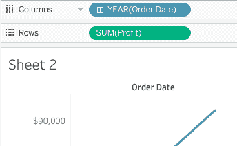

创建一个快速表计算来查看百分比差异：

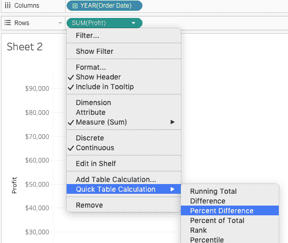

创建一个过滤器以排除**消费者**：

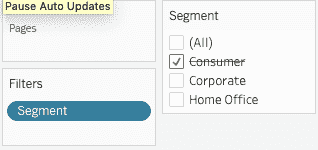

选择文本表以查看数据：

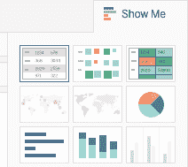

你的答案应该看起来像这样。正确答案是 4.01%：

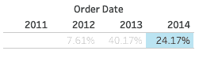

答案 2：1\. S

首先创建一个计算字段：

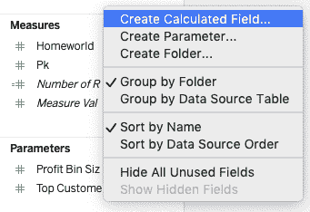

然后，创建以下计算：

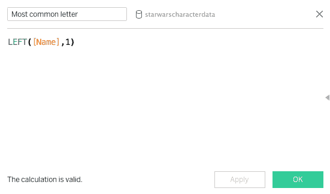

添加到视图中：

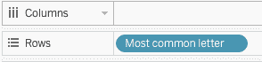

为性别创建过滤器：

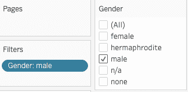

为眼睛颜色创建过滤器：

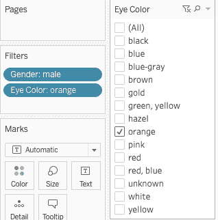

现在双击**记录数**：

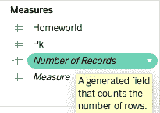

你的答案应该看起来像这样。有两个记录是 R 和 S。S 是正确答案的唯一选项：

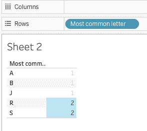

**答案 3**：2. 4,139,150

首先在[客户名称]上创建 LOD 计算字段：

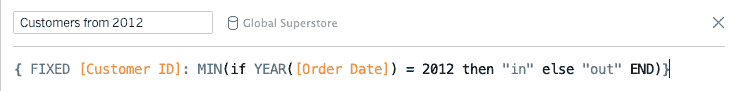

然后，将年份、类别和销售额添加到视图中：

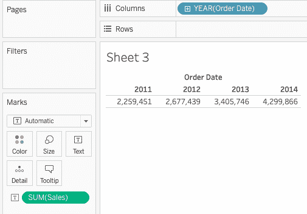

使用我们创建的`2012 年客户`计算字段创建过滤器，并筛选出符合该标准的结果。注意，过滤器对 2012 年的列没有影响，但调整了其余部分以匹配也在 2012 年下订单的客户：

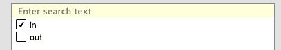

你的答案应该看起来像这样：

``

答案 4：2. 7

在添加数据源时，将`name`字段拆分以划分列：

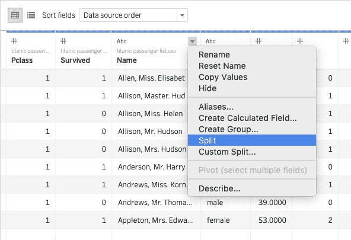

将`拆分 1`列重命名为`姓氏`：

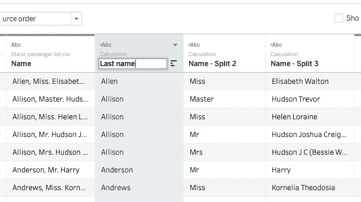

将`姓氏`和`记录数`添加到视图中：

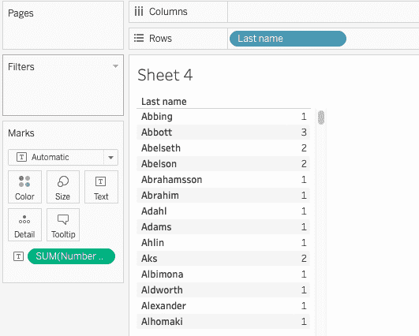

滚动到最后一个名字**戴维斯**。正确答案是 7：

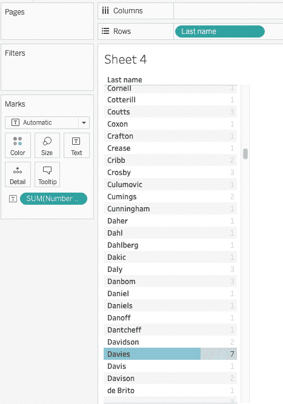

答案 5：2. 错误

NULL 值不计入：

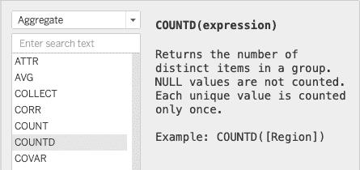

答案 6：1. 19.29%

添加数据源，确保所有字段，特别是出生日期（DOB），都被识别为这样的字段：

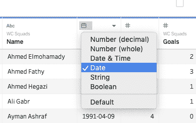

创建计算字段以将球员分为两组：`超过 10`和`少于 10`：

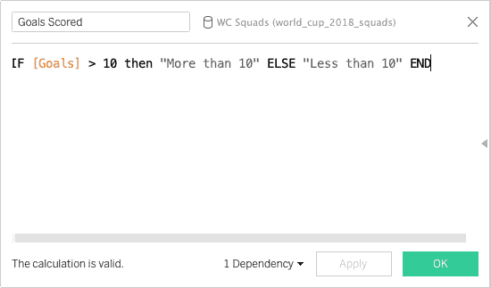

为出生于 1990 年之前的人员创建过滤器：

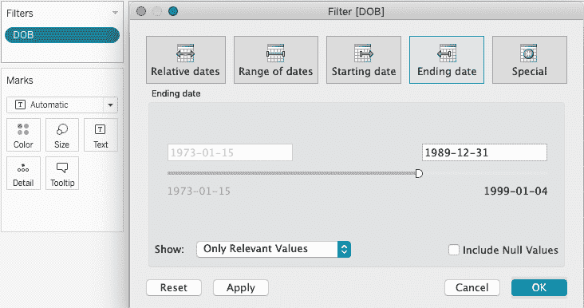

现在，将`进球数`和`记录数`字段添加到视图中：

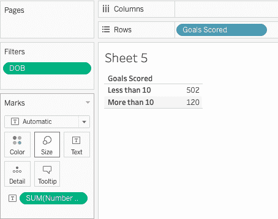

现在，创建一个快速表格计算来找出记录总数的百分比：

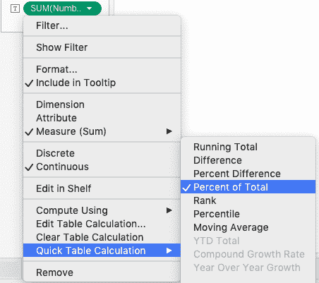

你的答案应该看起来像这样，答案显示进球超过 10 球的球员百分比是 19.29%：

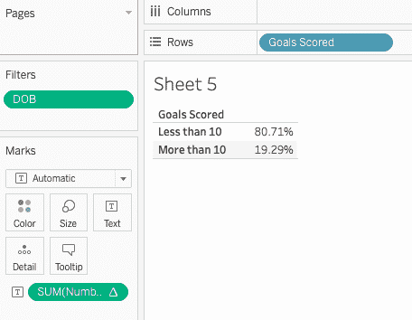

答案 7：1. 正确

对于任何聚合计算，你不能将聚合值和非聚合值组合在一起。例如，*SUM(Price)*[Items]* 不是一个有效的表达式，因为 *SUM(Price)* 是聚合的，而 Items 不是。然而，*SUM(Price*Items)* 和 *SUM(Price)*SUM(Items)* 都是有效的。有关更多信息，请参阅[`help.tableau.com/current/pro/desktop/en-us/calculations_calculatedfields_aggregate_create.htm`](https://help.tableau.com/current/pro/desktop/en-us/calculations_calculatedfields_aggregate_create.htm)。

答案 8：3. 306,769

首先，我们需要使用 Order ID 上的 Left JOIN 将 Orders 和 Returns 表连接起来：

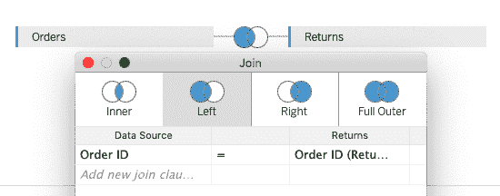

然后，将订单日期、区域和销售添加到视图中：

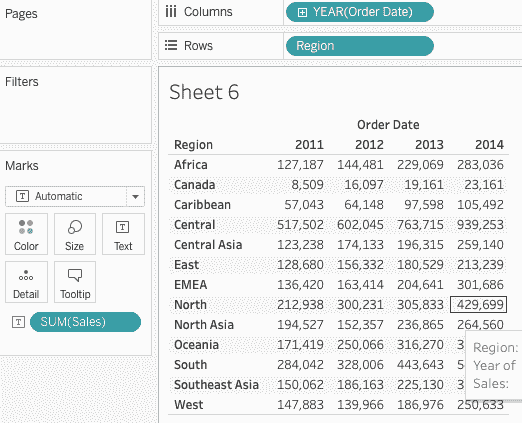

通过过滤器排除退货项目：

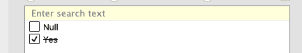

你的答案应该看起来像这样：

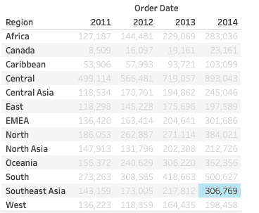

答案 9：4. 1.063

首先在添加数据源时使用数据解释器来清理数据：

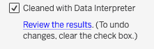

因此，你应该看到以下列：

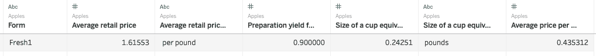

过滤掉我们正在寻找的苹果形式：

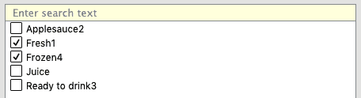

将平均零售价格度量添加到视图中：

注意，度量默认以 SUM 添加。我们需要平均值，所以将其切换到 AVG：

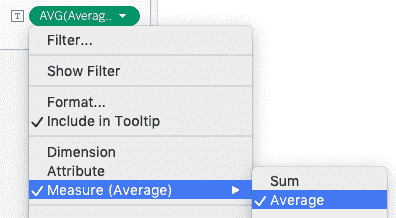

你的答案应该看起来像这样：

答案 10：1. 12

对于这个问题，我们不得不使用数据混合。这将允许我们使用两个数据源而不进行 JOIN，从而消除数据集中添加任何额外行的可能性。

首先添加数据源之间的关系：

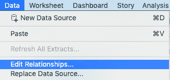

在列表中选择 WorldCups：

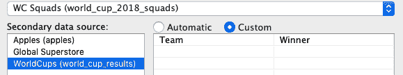

接下来，使用 WC 队伍数据，根据球员的出生日期过滤球员：

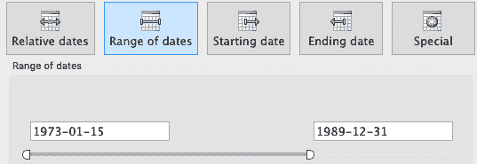

在 WorldCups 数据源中，创建一个计算字段，根据获胜次数对获胜者进行排名：

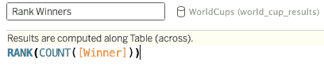

将`Rank Winners`和`Winners`字段添加到视图中：

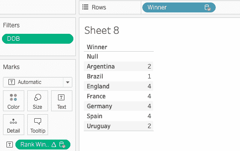

只保留巴西：

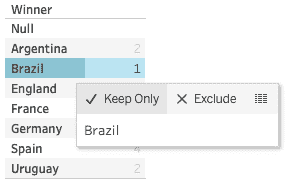

将`Name`字段添加到视图中：

``

看屏幕的左下角。你有 12 行数据。这就是答案：

答案 11：1. -45.51%

首先，我们需要将所有三个表进行 UNION：

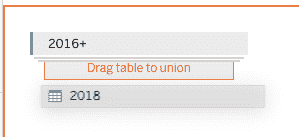

接下来，使用数据解释器清理表格：

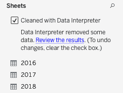

将表列重命名为**Year**并将数据格式更改为日期：

将年份、桶数和总发货量拖入视图中：

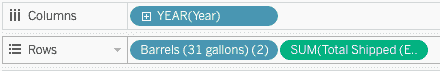

仅保留生产量低于 1 桶的酿酒厂：

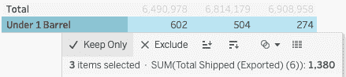

使用快速表格计算，计算年份数据之间的百分比差异：

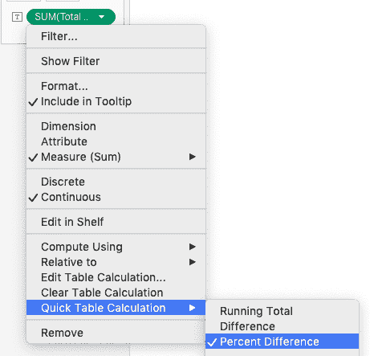

你的答案应该看起来像这样：

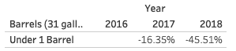

答案 12：4. 尼可莱·汉森

首先使用区域作为键将两个表 People 和 Orders 左连接：

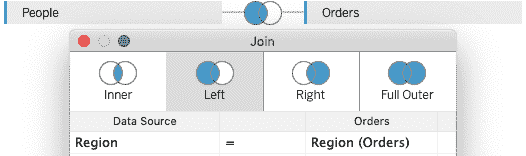

然后将段、人员和折扣字段拖入视图中：

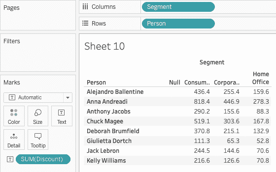

仅保留消费者：

按降序排列数据：

你的答案应该看起来像这样：

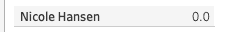

答案 13：4. 当你需要避免数据重复时。

在某些情况下，更改 JOIN 条件不足以避免数据重复，以及某些未链接的数据可能不包括在 JOIN 中。此时，数据混合将是最佳选择，创建包含所有来源合并数据的合并数据源，且无重复。

答案 14：1. 77.3175

首先将年份和进球数添加到视图中：

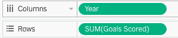

将年份从连续转换为离散：

使用左侧的“分析”选项卡添加表格分布带。将分布的下限百分位数更改为反映 65% 到 80% 的范围：

将鼠标悬停在“平均值的 65%”上。你的答案应该看起来像这样：

答案 15：4. 148.27

将学院胜利和年龄添加到视图中：

在标记的详细部分放下球员：

添加线性趋势线：

右键点击趋势线并选择描述趋势模型：

你的答案应该看起来像这样：

答案 16：2. 71

首先让我们将身高和球员添加到视图中。你会立刻看到，对于一些球员，例如亚历克斯·史密斯，身高是 1,300 英寸。显然，我们有一些数据重复。因此，让我们创建一个简单的 LOD 计算公式，为每位球员提供一个值。创建一个以下公式计算的计算字段：

将此新度量值与球员一起添加到视图中：

在“显示我”中选择胡须图：

将鼠标悬停在可视化上。下四分位数是下铰链的另一个名称。你的答案应该看起来像这样：

答案 17：4. 当 p 值 <= 0.05

[`help.tableau.com/current/pro/desktop/en-us/trendlines_add.htm`](https://help.tableau.com/current/pro/desktop/en-us/trendlines_add.htm).

答案 18：1. 时间和非时间

[`help.tableau.com/current/pro/desktop/en-us/forecast_how_it_works.htm`](https://help.tableau.com/current/pro/desktop/en-us/forecast_how_it_works.htm).

答案 19：3. 抛物线

[`help.tableau.com/current/pro/desktop/en-us/inspectdata_droplines.htm`](https://help.tableau.com/current/pro/desktop/en-us/inspectdata_droplines.htm).

答案 20：1. 268

首先创建层次结构，将维度**位置**拖放到维度**组**上：

然后，通过双击将新创建的位置以及帽子戏法和高尔夫球目标添加到视图中：

展开层次结构，并按降序排序数据：

你的答案应该看起来像这样：

答案 21：4. 11.14%

首先，让我们为前三名球员创建一个集合：

你想使用进球字段创建一个集合：

接下来，将新的集合以及位置和目标添加到视图中：

现在我们需要使用通过向下表计算得出的总百分比创建一个表格计算：

你的答案应该看起来像这样：

答案 22：1. 是

[`help.tableau.com/current/reader/desktop/en-us/reader_sort.htm`](https://help.tableau.com/current/reader/desktop/en-us/reader_sort.htm).

答案 23：2. 否

[`help.tableau.com/current/pro/desktop/en-us/order_of_operations.htm`](https://help.tableau.com/current/pro/desktop/en-us/order_of_operations.htm).

答案 24：3. 24.15 年

首先将选秀年份的数据类型更改为日期：

将其转换为离散值：

将选秀年份和年龄添加到视图中：

将年龄**总和**改为平均值：

添加移动平均表格计算：

编辑表格计算。选择最后五个数据点的平均值，并取消选中当前值，因为我们不希望 2013 年的数据包含在计算中：

你的答案应该看起来像这样：

答案 25：1. 88.27

将权重添加到视图中：

从“显示我”中选择“直方图”：

你会注意到“重量（区间）”出现在维度中。点击“编辑”并选择区间大小`10`：

将“跳远”拖到“标记”中的工具提示卡上，并从“求和”切换到“平均值”：

悬停在“230-240”区间上。你的答案应该看起来像这样：

答案 26：1. 正确。

[`help.tableau.com/current/pro/desktop/en-us/calculations_bins.htm`](https://help.tableau.com/current/pro/desktop/en-us/calculations_bins.htm).

答案 27：1. 商业智能架构师

首先，展开“位置”层次结构：

现在按平均估计工资的降序排序：

你的答案应该看起来像这样：

答案 28：1. 正确

[`help.tableau.com/current/pro/desktop/en-us/performance_tips.htm`](https://help.tableau.com/current/pro/desktop/en-us/performance_tips.htm).

答案 29：4. 31,887

首先，将“城市”和“利润”添加到视图中：

从“显示我”菜单中选择地图符号。

找到西雅图：

前往地图，然后地图选项，选择单位为公制：

使用径向选择工具来测量距离：

将测量工具拉伸以反映 30 公里：

看看左下角。你的答案应该看起来像这样：

答案 30：1. 爱达荷州、蒙大拿州、北达科他州

将“州”和“利润”添加到视图中：

从“显示我”菜单中选择地图符号：

将州组合在一起：

收起状态药丸，只显示国家：

将鼠标悬停在州上，查看哪个州最盈利。你的答案应该看起来像这样：

**测试 B**

问题 1：使用《超市》数据集回答以下问题。2012 年和 2013 年之间，所有细分市场的销售额百分比变化是多少？

1.  23.48%

1.  32.37%

1.  25.16%

1.  23.92%

问题 2：使用《星球大战》数据集回答以下问题。女性角色中，最常见的蓝色眼睛的首字母是什么？

1.  A

1.  J

1.  B

1.  N

问题 3：使用《超市》数据集回答以下问题。2014 年，所有客户从消费者细分市场订购商品的总销售额是多少？

1.  1,194,052

1.  1,503,262

1.  1,463,760

1.  1,766,155

问题 4：使用泰坦尼克号乘客名单数据回答以下问题。乘客名单上最常见的姓氏是什么？

1.  Sage

1.  Johnston

1.  West

1.  Smith

问题 5：中值函数返回有序值集中的值，其上下两侧有相等数量的值，这是真的还是假的？

1.  真

1.  假

问题 6：使用 FIFA 2018 阵容回答以下问题。出生于 1992 年 1 月 1 日之后且进球超过 15 球的球员百分比是多少？

1.  97.29%

1.  17.24%

1.  9.92%

1.  2.03%

问题 7：如果你在可视化中没有所有需要的数据值，现在是使用快速表格计算的最佳时机，这是真的还是假的？

1.  真

1.  假

问题 8：使用 Superstore 数据集回答以下问题：2013 年中亚地区退货商品的总销售额是多少？

1.  14,094

1.  44,658

1.  4,833

1.  1,453

问题 9：使用 Apples 数据集，回答以下问题：新鲜和即饮苹果的平均每杯价格是多少？

1.  0.4353

1.  0.3754

1.  0.3156

1.  0.2973

问题 10：使用 FIFA 比赛结果和 2018 FIFA 阵容数据回答以下问题。在 2018 年排名第四的球队中，有多少名球员是在 1988 年之前出生的？

1.  3

1.  5

1.  7

1.  18

问题 11：使用酿造生产规模数据集回答以下问题。哪个生产规模（按桶计算）在 2018 年酿造厂数量增加最多？

1.  低于 1 桶

1.  1 到 1k 桶

1.  1k 到 7,5k 桶

1.  7,5k 到 15k 桶

问题 12：使用 Superstore 数据集回答以下问题。在企业部门中，哪个区域最不盈利的经理叫什么名字？

1.  Anthony Jacobs

1.  Shirley Daniels

1.  Kelly Williams

1.  Alejandro Ballentine Corporate

问题 13：如果你的文件类型不在**连接**下列出，唯一的选择是将文件转换为支持的格式，这是真的还是假的？

1.  真

1.  假

问题 14：使用 FIFA 比赛结果数据集回答以下问题。使用年份和比赛次数创建条形图。添加标准差为-0.5，0.5 的分布带。平均值以上的标准差是多少？

1.  50.409

1.  33.190

1.  47.753

1.  12.874

问题 15：使用 NFL 统计数据集回答以下问题。使用 College Wins 和 College Losses 详细按球员创建散点图。这个数据的线性趋势线是否可以认为是显著的？

1.  是

1.  不

问题 16：使用 NFL 统计数据集回答以下问题。使用箱线图，找出球员胜利的值是多少？

1.  546

1.  349

1.  721

1.  1168

问题 17：使用 Tableau，你可以创建预测，而你需要的只是一个维度和一个度量，这是真的还是假的？

1.  真

1.  假

问题 18：完全指定模型所需的参数数量叫什么？

1.  模型观测值

1.  模型数据点

1.  模型自由度

1.  模型参数

问题 19：是否可以使用聚类对视图中的任何维度进行操作？

1.  正确

1.  错误

问题 20：使用 2018 年 FIFA 阵容数据集回答以下问题。创建一个组 - 位置的层次结构。哪个组 FW 位置进球最多？

1.  F

1.  H

1.  A

1.  D

问题 21：使用 2018 年 FIFA 阵容数据集回答以下问题。查看 FW 位置，在所有球员中，基于他们的进球，前 10 名球员在国家队（出场次数）中所占的百分比是多少？

1.  7.86%

1.  6.03%

1.  20%

1.  12.59%

问题 22：是否可以在层次结构内手动对视图中的数据进行排序？

1.  正确

1.  错误

问题 23：度量过滤器是否总是先于维度过滤器执行？

1.  正确

1.  错误

问题 24：使用 NFL 统计数据集回答以下问题。根据出生日期，最年轻球员（过去三年）的胜利移动平均数是多少？

1.  50,998

1.  28,476

1.  72,427

1.  63,596

问题 25：使用 NFL 统计数据集回答以下问题。使用直方图，创建一个跳跃的视觉表示，玩家使用两英寸的箱大小。进行最长跳跃的球员的平均身高是多少？

1.  73.21

1.  71.45

1.  73.89

1.  72.57

问题 26：知识型。基于某些条件定义数据子集的自定义字段叫什么？

1.  组

1.  参数

1.  集合

1.  字段

问题 27：使用 Tableau 工作簿回答以下问题。有多少个职位空缺是针对 Tableau 开发者的？

1.  52

1.  109

1.  33

1.  2

问题 28：知识型。网页可以包含在 Tableau 仪表板中吗？

1.  正确

1.  错误

问题 29：使用样本超市数据集回答以下问题。在距离莱希 10 英里范围内的城市的销售额总和是多少？

1.  1,517

1.  4,511

1.  17,366

1.  9,821

问题 30：使用样本超市数据集回答以下问题。使用地图回答以下问题：哪个州在印第安纳州周围销售了最多数量的商品？

1.  伊利诺伊州

1.  密歇根州

1.  肯塔基州

1.  俄亥俄州

**答案键测试 B**

关于如何回答每个问题的程序，请参阅测试 A 的答案键，因为它们遵循相同的结构。

答案 1：2. 32.37%

答案 2：3. B

答案 3：2. 1,503,262

你正在寻找的 LOD 计算的公式是：`{ FIXED [Order ID]: MIN(IF [Segment] = "Consumer" then "in" else "out" END)}`

答案 4：1. Sage

答案 5：1. 正确

问题 6：4. 2.03%

答案 7：2. 错误 ([`help.tableau.com/current/pro/desktop/en-us/calculations_calculatedfields_understand.htm)`](https://help.tableau.com/current/pro/desktop/en-us/calculations_calculatedfields_understand.htm)

答案 8：4. 1,453

答案 9：2. 0.3754

答案 10：4. 18

答案 11：1. 低于 1 桶

答案 12：4. Alejandro Ballentine Corporate

答案 13：2. 错误 ([`help.tableau.com/current/pro/desktop/en-us/basicconnectoverview.htm)`](https://help.tableau.com/current/pro/desktop/en-us/basicconnectoverview.htm)

答案 14：1. 50.409

答案 15：1. 是，基于 p 值 <= 0.05

答案 16：4. 1168

答案 17：2. 否 ([`help.tableau.com/current/pro/desktop/en-us/forecasting.htm`](https://help.tableau.com/current/pro/desktop/en-us/forecasting.htm))

答案 18：3. 模型自由度

答案 19：2. 否 ([`help.tableau.com/current/pro/desktop/en-us/clustering.htm`](https://help.tableau.com/current/pro/desktop/en-us/clustering.htm))

答案 20：1. F

答案 21：3. 20

答案 22：否

答案 23：否 ([`help.tableau.com/current/pro/desktop/en-us/order_of_operations.htm`](https://help.tableau.com/current/pro/desktop/en-us/order_of_operations.htm))

答案 24：2. 28,476

答案 25：1. 73.21

答案 26：3. 集合 ([`help.tableau.com/current/pro/desktop/en-us/sortgroup_sets_create.htm`](https://help.tableau.com/current/pro/desktop/en-us/sortgroup_sets_create.htm))

答案 27：3. 33

答案 28：1. 是 ([`help.tableau.com/current/pro/desktop/en-us/dashboards_best_practices.htm`](https://help.tableau.com/current/pro/desktop/en-us/dashboards_best_practices.htm))

答案 29：2. 4511

答案 30：1. 伊利诺伊

就是这个。做得好！
