# 4. 数据探索：比较和组合

概述

在本章中，你将在 Tableau 中创建你的第一个图表，并处理一些基本和中级图表，例如树状图、嵌套条形图和堆叠面积图。你将学习如何为特定场景选择最佳的图表，查看创建趋势报告的最佳方式，并探索度量之间的比较（使用嵌套条形图和子弹图）。然后，在本课的最终活动中，你将通过分析过去十年新加坡车辆人口审计数据来将所学知识付诸实践。到本章结束时，你将熟悉使用条形图、面积图和`标记`卡片，这些卡片用于向图表和视图中添加上下文细节。

# 简介

到目前为止，你已经为你的可视化准备了、导入并操作了数据。考虑到 Tableau 是一个*商业智能和可视化工具*，现在开始创建你的第一个图表是很自然的。然而，在你能够这样做之前（当然，在你能够创建第五章“数据探索：分布和关系”中将要创建的更高级图表之前），你必须首先学会创建图表的方方面面。

因此，你最初只会创建一些基本的图表，然后最终会处理一些中级图表，例如树状图和嵌套条形图。本章的目标是能够回答诸如“*在特定年份，每个子类别通过销售产生了多少利润？*”的问题，这基本上是在问“*你的总销售额中有多少是由每个子类别产生的？*”。通过这样做，本章还教你如何去除复杂的术语并有效地进行数据沟通。

Tableau 是一个直观且灵活的工具。你可以将 Tableau 视为商业智能的 Photoshop。在 Photoshop 中，有多种方式可以以相同的结果处理图像；同样，在 Tableau 中，通常也有多种方式可以创建相同的图表。Tableau 的`Show Me`面板在大多数时候都非常有用，尽管本书的目标也是向你展示不使用`Show Me`面板创建这些图表的方法。本章将尝试通过描述何时应该使用图表、为什么图表是有用的以及它们对哪些数据类型有用来简化大多数图表。

整章的设计是为了让读者能够跟随每个练习和活动的详细步骤，包括创建基本和中级图表。但这并不意味着你需要记住这些步骤；相反，尝试理解我们为什么这样做的原因。尽管本章的每个练习步骤都尽可能详细，但鼓励你提出问题，例如，“*为什么进行这一步，我能改进这种方法吗？*”你可能会发现，你可以用不同的方式获得给定的可视化，同样，随着你发挥创造力，图表会变得更好。

# 探索维度项之间的比较

在深入图表制作之前，区分维度和度量非常重要。

每个存在于某些数据中的列都与一个数据类型相关联，例如字符串、整数或日期。此外，每个存在于某些数据中的列要么是维度，要么是度量。**维度**是定性或分类数据，例如名称、地区、日期或地理数据，并且这些列具有不同值的类别。另一方面，度量是可汇总的定量值。

考虑以下情况：一个`Country`列包含国家名称，如加拿大、印度和西班牙。你能对这些地区求和吗？加拿大、印度和西班牙的总和有意义吗？不，没有意义，所以地区是一个维度。同样，可以应用数学函数（如求和、平均值、最小/最大值等）的数据是度量。因此，一个经验法则是：可以应用数学函数的列是度量的列，而无法应用函数的数据是维度的列。

在本书中，每当提到度量时，意味着图表将包含视图中的数值/定量数据，而每当提到维度时，我们将使用定性/分类数据在视图中。

## 柱状图

柱状图是一种多功能的图表类型，它使得快速理解数据变得容易，适用于抽查或为某些分类数据添加部分总比较。没有其他图表能比得上柱状图的灵活性、易理解性和可用性。柱状图中柱子的长度代表该分类变量的比例方面。柱状图的直观性使其成为最常用的图表之一；它为我们提供了对数据的准确洞察。Tableau 中的柱状图可以使用零个或多个维度和一或多个度量。

注意

本章的练习将使用预装在每个 Tableau Desktop 安装中的示例`Superstore`数据集。我们版本的 Tableau Desktop 还包含另一个`Sample – Superstore`数据集，数据截止到 2019 年；Tableau 最近更新了数据文件，也包含了 2020 年的数据，如果你使用的是 Tableau Desktop 的最新版本，你将拥有这些数据。所以，如果你的指标/图表与我们的不完全相同，请不要担心。我们的目标是教会你开发这些图表、报告和仪表板所需的技能，而不是让你复制我们的精确图表。

## 练习 4.01：创建条形图

作为你组织的商业分析师，一位利益相关者要求你创建一个报告，使用条形图显示各个类别和细分市场的总销售额和利润。你将使用`Sample – Superstore`数据集来可视化数据。

数据集：`Superstore`

数据集下载链接：[`packt.link/cX32T`](https://packt.link/cX32T)。

注意

在 Tableau 中，**连续**字段是**绿色**的，当它们是**离散**时，它们是**蓝色**的。

以下步骤将帮助你完成这个练习：

1.  在你的 Tableau 实例中加载`Orders`表从示例`Superstore`数据集。

1.  点击右上角的`Show Me`面板，并将鼠标悬停在条形图上。你会观察到它说`对于水平条形，尝试 0 个或更多维度` | `1 个或更多度量值`。

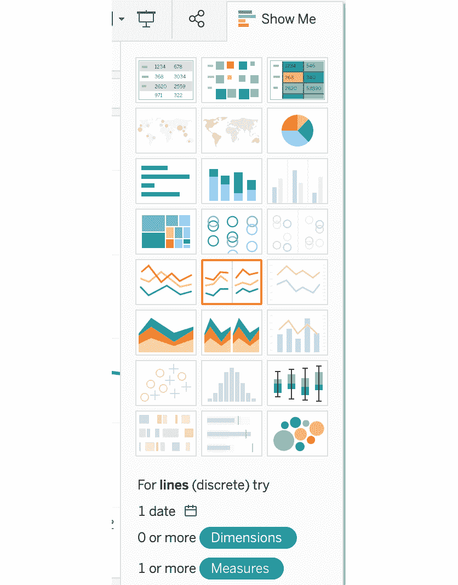

图 4.1：Show Me 面板中的条形图

在这个练习中，你将从一个没有维度只有一个度量值开始，然后继续添加维度到你的视图中。

1.  将`Sales`拖到`Rows`（用于垂直条形图）或`Columns`（用于水平条形图）。

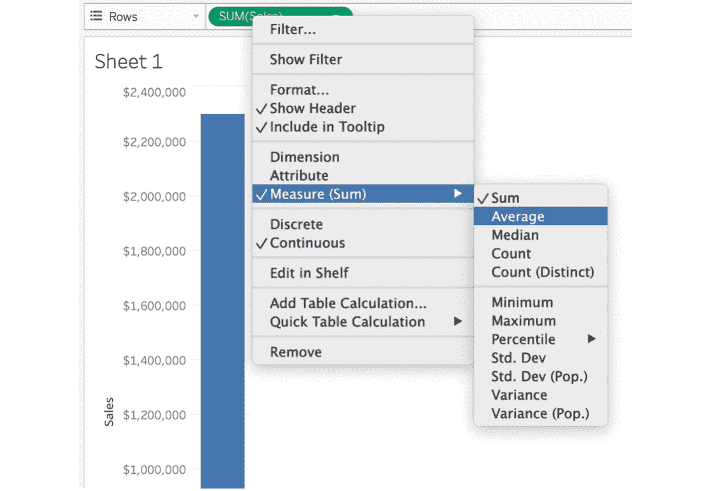

图 4.2：更改聚合

当你将`Sales`拖到 Columns/Rows 架上时，默认聚合会更改到 SUM(Sales)。

1.  点击`Columns`/`Rows`架上的`SUM(Sales)`胶囊，将聚合从`SUM(Sales)`更改为任何其他聚合平均。

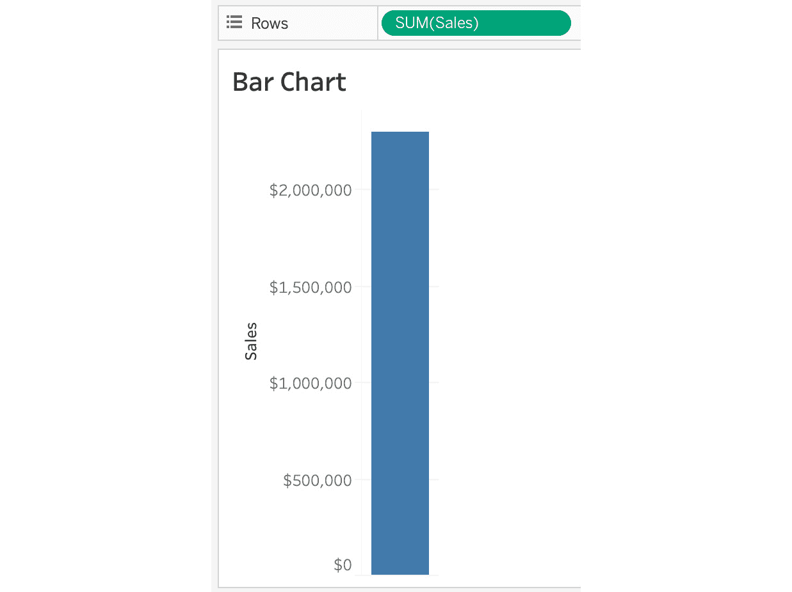

图 4.3：销售数据的条形图

在前面的屏幕截图中，请注意整个商店的总销售额约为$2.3M，这是我们在示例 Superstore 数据集中的最粗粒度指标。接下来，你将更改条形图的粒度。

1.  要做到这一点，请向你的视图中添加一个维度。将`Category`维度添加到我们的`Columns`架上。当你将`Category`维度添加到视图中时，你会得到三个条形来表示每个类别。因此，你刚刚将你的粒度从所有数据的销售总额更改为每个类别的销售总额。

为了提高可读性，还可以将`Measures`数据面板中的`Sales`添加到`Label Marks`卡中。正如我们所看到的，`SUM`(`Sales`)现在按类别划分：

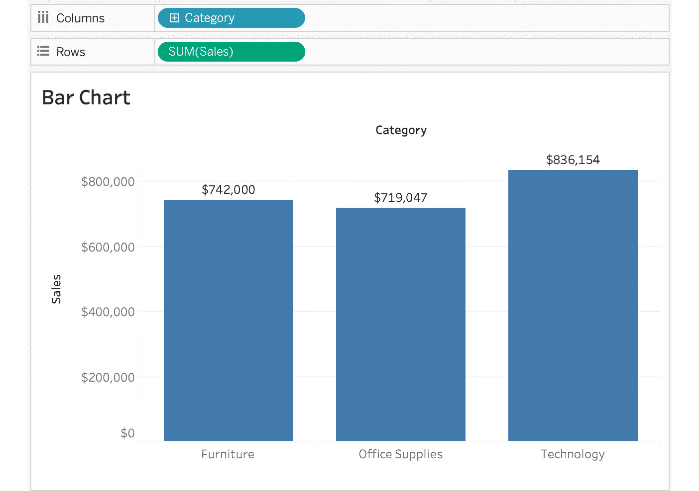

图 4.4：按类别销售

前面的图表使用了一个维度和一个度量，因此我们可以看到家具、办公用品和技术的总销售额分别为$742,000、$719,000 和$836,000。然而，如果我们想更详细地研究这些类别的总销售额，该怎么办呢？我们可以通过添加更多的维度或度量使其更加细化。让我们在下一步探索我们的选项。

1.  将“细分市场”拖到“列”轴。

你会注意到按类别划分的销售现在被细分为按细分市场和类别的销售。我们刚刚为我们的视图添加了另一个粒度级别：


图 4.5：按类别和细分市场的销售额

在前面的图中，你可以看到尽管“技术”的销售额最高，但所有三个类别的“企业”和“家庭办公室”细分市场表现并不理想，需要引起注意。由于类别的总销售额现在被分割，这让你对每个细分市场（即“消费者”、“企业”和“家庭办公室”）的销售数量有了更多的了解。现在你了解了更详细的销售额，你还可以找出每个类别和细分市场获得的利润金额。

1.  将另一个度量“利润”添加到“行”轴。一旦将度量拖放到“列”轴，你就可以看到为利润添加了一个新行：

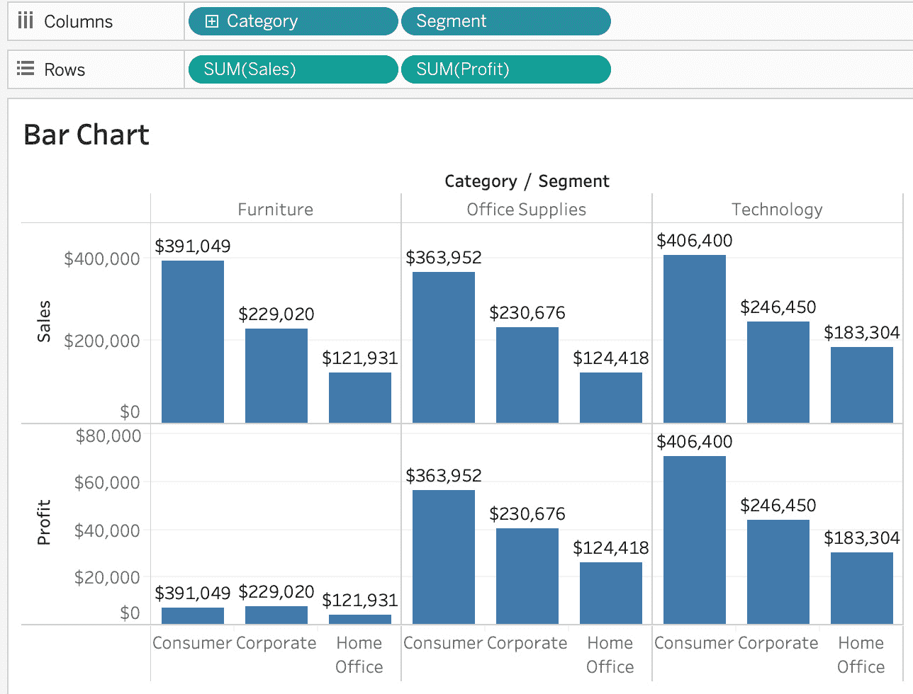

图 4.6：按类别和细分市场的销售额和利润

如你所见，从“家具”获得的利润非常少，而从“技术”获得的利润却非常多。这将有助于我们做出更好的商业决策，因为我们现在知道，在“技术”和“办公用品”上投入更多将更有利可图。

当你以某种方式创建条形图，无论是水平还是垂直，你有时会发现，如果你的仪表板设计或故事板设计（故事板是使用多个可视化/仪表板来传达故事的地方）的排列不同——比如说，垂直而不是水平，那么它将更加美观。有多种方法可以改变对齐方式；在下一步中，我们将展示手动方法。

1.  将两个“列”维度拖到“行”轴，反之亦然。或者，Tableau 通过在我们的工具菜单中提供一个“交换”按钮，使我们能够轻松地交换东西。

最终输出如下：

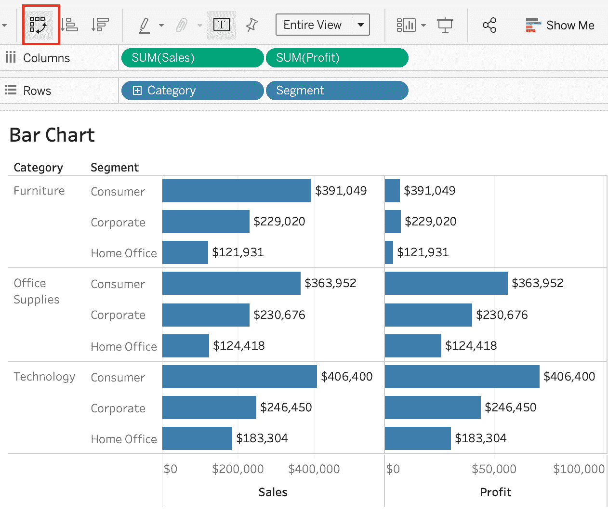

图 4.7：水平对齐的条形

在这个练习中，我们探讨了如何通过增加视图的粒度来添加更多上下文和数据，而不会过于杂乱。

这部分关于单维或多维项目条形图的讨论就到这里。接下来，我们将通过条形图和折线图来探索时间上的比较。

# 探索时间上的比较

作为分析师，利益相关者最常见的要求之一是关于比较某些 KPI/指标随时间的变化（例如，季度收入同比增长）。在本节中，您将使用日期维度创建图表，您可以使用这些图表比较一定时间段的 KPI。您将首先使用柱状图比较指标，然后使用折线图进行比较 KPI。

## 练习 4.02：创建时间序列数据的柱状图

想象您是一位被要求提供关于您组织在不同分段（即 `消费者`、`企业` 和 `家庭办公室`）不同时间段总销售的报告的商业分析师。使用 Tableau 提供的示例 `Superstore` 数据集来可视化图表并显示输出。

执行以下步骤以完成练习：

1.  在您的 Tableau 实例中加载示例 `Superstore` 数据集中的 `订单` 表。

1.  将 `销售` 拖动到 `行` 面板上。

1.  将 `订单日期` 添加到 `列` 面板上。Tableau 将自动创建一个折线图（将在下一练习中详细介绍）。

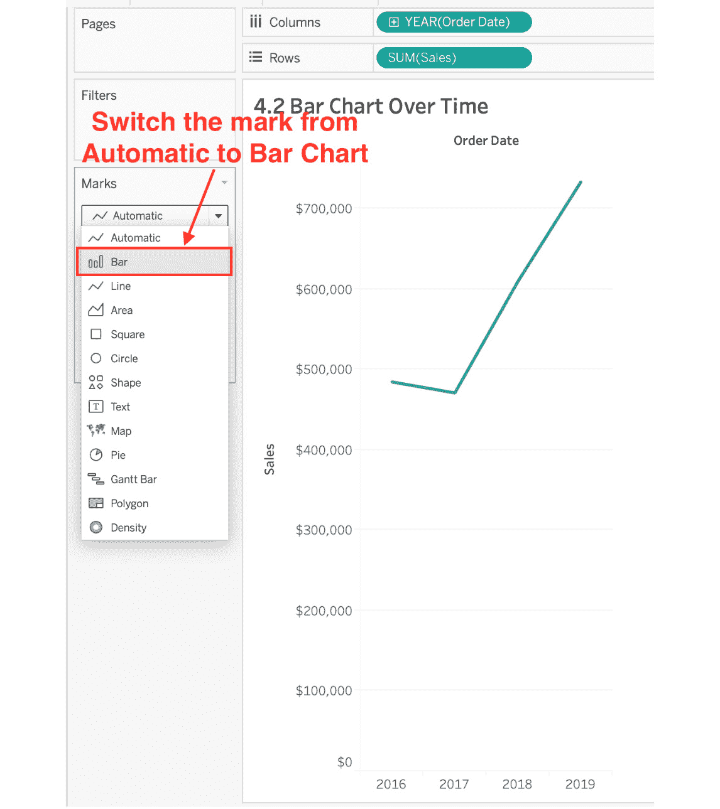

图 4.8：按时间序列的柱状图作为折线图

前面的图显示了以线形图形式按年度展示的产品销售。要将标记从线形图更改为柱状图，首先点击 `标记` 面板上的下拉菜单，然后选择如图所示的 `柱状图`。视图可以读作按年销售。

1.  为了提高可读性，通过将 `销售` 从 `度量` 数据面板拖动到 `标记` 卡中的标签来向 `柱状图` 添加 `标签`：


图 4.9：按年份销售（时间序列柱状图）

如您所见，通过添加标签，您可以得到各自年份的确切销售值。但您仍然不知道每个分段随时间获得的销售值。您将不得不将视图的粒度从按年销售更改为按分段按年销售。

1.  要实现这一点，将 `分段` 拖动到 `列` 面板上。

视图会根据您在 `列` 面板上放置 `分段` 的位置而变化很大。如果您将 `分段` 放在 `订单日期` 之后，您的视图将显示为按年按分段销售，如下所示：

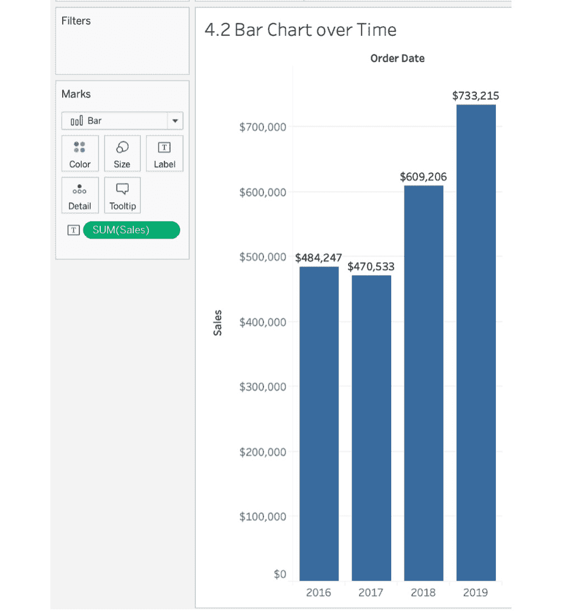

](img/B16342_04_10.jpg)

图 4.10：按时间段分段的柱状图

从前面的图中可以看出，多年来一直呈渐进增长，您还可以看到各分段的精确销售值。尽管您得到了想要的数据，但以规范的方式呈现它也很重要。如果您将 `消费者` 多年的数据放在一起，并将 `企业` 和 `家庭办公室` 的数据放在一起，这将更有用且易于理解。

1.  要做到这一点，请将 `分段` 放在 `订单日期` 之前。您的视图将显示为按分段按年销售，如下所示：

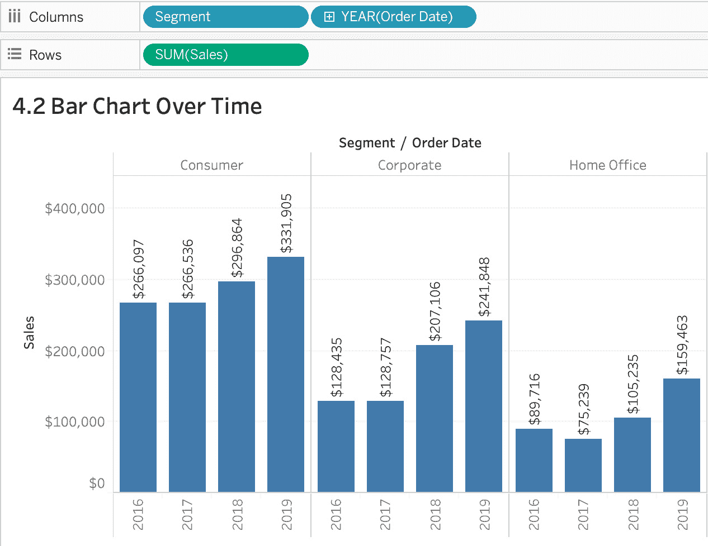

图 4.11：按年份和细分市场销售

在 *图 4.10* 中，您有按年份和细分市场的销售，而在 *图 4.11* 中，您有按细分市场和年份的销售。这允许任何利益相关者快速查看每个细分市场的销售趋势。如您所见，`企业` 从 2017 年到 2018 年的增长相当可观，这在之前的屏幕截图中并不容易理解。

在这个练习中，您回顾了随时间变化的条形图，并练习了为您的数据添加更多粒度和维度。接下来，您将使用折线图来回顾随时间的变化比较。

## 折线图

折线图是另一组多才多艺、易于观看、普遍理解的图表。它们自 18 世纪威廉·普莱费尔创建以来一直被使用。它们通过一条线连接多个数据点，通常表示数据的趋势。在 Tableau 中，您至少需要一个日期、一个度量值和零个或多个维度来创建折线图。

## 离散日期与连续日期的区别

在接下来的练习中，当您在视图中右键单击 `日期` 维度时，您会注意到您有两个选项用于选择季度。顶部的是离散日期，您将按年份/季度/月/日拥有离散日期。如果您观察以下屏幕截图，您将只有四个数据点——每个离散季度一个，而不是从 2016 年 Q2 到 2016 年 Q3……2019 年 Q1 的数据点。本质上，离散日期是视图中的唯一日期。因此，当您选择离散季度时，视图将只包含唯一的季度，不考虑年份作为日期的一部分。

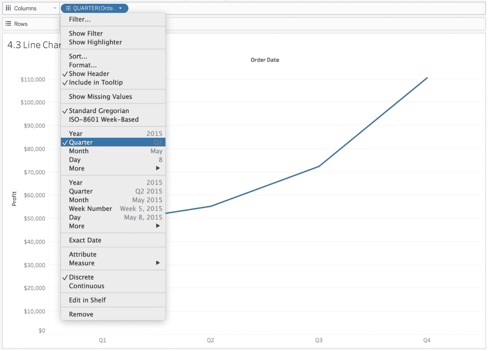

图 4.12：离散日期

连续日期与离散日期的主要区别在于，连续日期会提供更细粒度的日期。因此，不仅仅是 Q1、Q2、Q3 和 Q4，连续日期还会考虑与季度/月/日关联的年份。在大多数情况下，您会希望使用连续日期，因为利益相关者通常希望按月/季度查看多年来的指标。

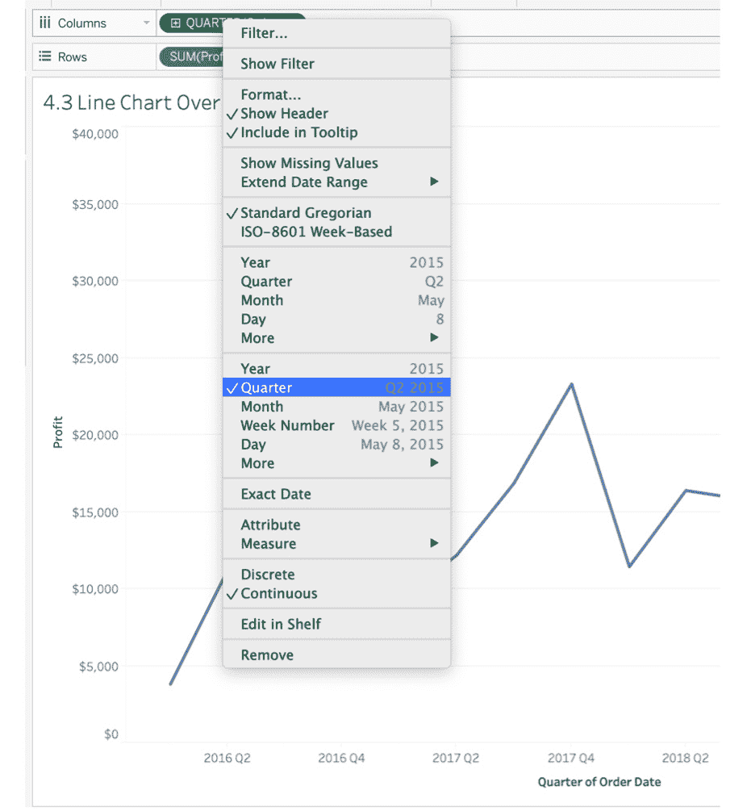

图 4.13：连续日期

## 练习 4.03：创建随时间变化的折线图

作为一名分析师，您的公司品类经理希望您创建一个图表，以便他们可以查看自 2016 年以来所有品类的总利润。他们没有偏好的图表类型，但更喜欢图表的简约风格。在这个练习中，您将逐步详细地解决这个利益相关者的请求，了解如何最好地使用折线图，以及添加颜色或更改视图的详细程度如何为您的图表增添巨大价值。

执行以下步骤以完成练习：

1.  如果您还没有这样做，请从示例 `Superstore` 数据集中加载 `Orders` 表到您的 Tableau 实例中。

1.  与柱状图的步骤类似，将一个度量拖到`Rows`面板上。在本练习中，将`Profit`拖到`Rows`面板上。

1.  接下来，将`Order Date`添加到`Columns`面板。一旦您将`Date Time`维度添加到您的视图中，Tableau 会自动创建一个折线图（您之前在柱状图视图中也看到了）。

![图 4.14：随时间变化的简单折线图]

![图片 B16342_04_14.jpg]

图 4.14：随时间变化的简单折线图

在图表中，您已按年份绘制了利润，并使用线条连接了这些点。利润从 2016 年的$50,000 增长到 2019 年近$100,000。

这只是一个基本的折线图，但如前所述，目标是学习不仅仅是 Tableau 的基础知识。因此，让我们探索一些为您的折线图提供更多上下文或细节的选项。

1.  通过将`Profit`从`data`面板拖动到您的视图中的`Label``Marks`卡片，为您的折线图添加一个`Profit`标签。

1.  为了使折线图显示按季度而不是按年销售，以便更细致，并帮助您的利益相关者做出决策，请点击`+`符号或点击`Columns`面板中`YEAR(Order Date)`维度上的箭头，并将粒度从`YEAR(Order Date)`更改为`QUARTER(Order Date)`。

1.  为了使您的视图更加细致，请将`Segment`添加到您的`Color`或`Detail``Marks`面板中。您的数据将按段分割，每个段对应一种颜色，正如这里所观察到的：

![图 4.15：按段分的折线图]

![图片 B16342_04_15.jpg]

图 4.15：按段分的折线图

在前面的图表中，您可以清楚地看到，与其它段相比，`Consumer`段的利润增长速度更快。折线图清楚地描绘了多个年份内按段的趋势。

这就结束了我们对折线图的介绍。本节讨论了随时间变化的折线图、离散日期与连续日期之间的区别，以及如何为您的折线图添加更多颜色或上下文细节。

# 探索跨度量比较

柱状图是一种允许您将目标/目标比较添加到您的图表/视图中的图表类型。尽管柱状图很有用，但您在用柱状图展示数据时，经常会听到诸如“*这与这个 KPI/指标如何比较？*”和“*那么，我们应该如何处理这些数据？*”等问题，因为柱状图未能提供利益相关者所寻求的额外上下文。这正是子弹图表大放异彩的地方，因为它们添加了所需的比较，用于目标/目标/阈值。将子弹图表视为具有历史背景或比较基准的柱状图。

假设您正在为一个项目工作，该项目要求您以条形图的形式展示您的 SaaS 产品的销售数据。您可能收到的第一个问题来自您的利益相关者：“*这与我们上一个季度/年份的结果相比如何？我们做得好还是表现不佳？*”如果您用子弹图表展示相同的数据，您还可以为想要比较的销售数据添加一个比较点。以下是一个示例子弹图表：

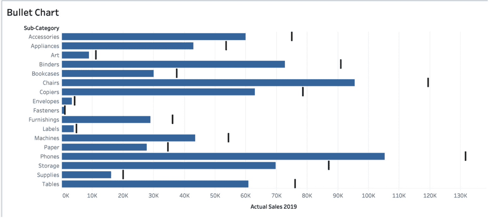

图 4.16：示例子弹图表

在以下练习中，您将创建一个子弹图表来解决该问题，并了解子弹图表对您的报告/演示的影响。

## 练习 4.04：创建子弹图表

您收到了来自品类经理的另一项请求：他们现在想查看每个子类别如何趋向于 2019 年的销售目标。作为分析师，您的任务是创建一个视图，展示每个子类别 2019 年的实际销售额，同时展示 2019 年的目标销售（以下示例子弹图表中的黑色垂直线）。

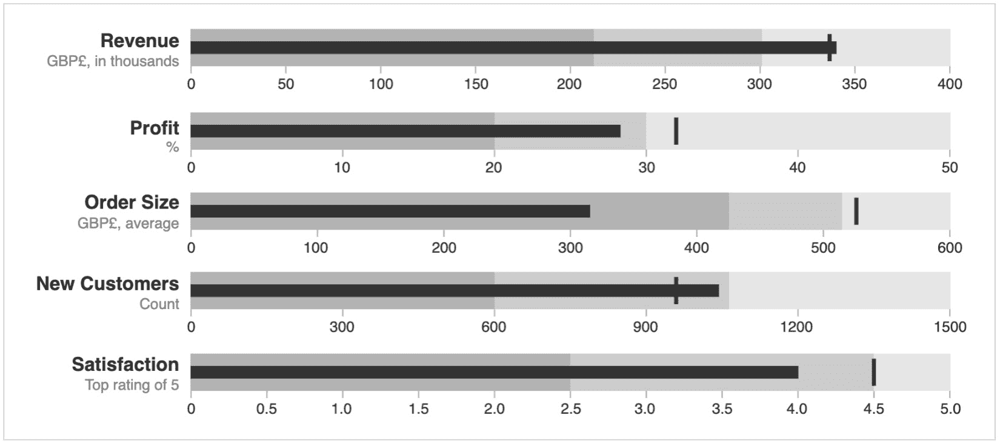

](img/B16342_04_18.jpg)

图 4.17：示例子弹图表

注意

如何使用 `Show Me` 面板创建子弹图表的相关内容可以在此处研究，但如果书中没有展示如何使用计算字段创建子弹图表（其中您比较 2019 年的销售与 2019 年的目标销售，后者是一个计算字段），那么这本书就不能完全满足您的需求。我们尚未在书中讨论计算字段，但我们将深入讨论它们，在 *第六章*，*探索：探索地理数据* 中；现在，我们将尽可能详细地解释此练习的每个步骤。

执行以下步骤以完成此练习：

1.  如果您还没有这样做，请从示例 `Superstore` 数据集加载 `订单` 表到您的 Tableau 实例中。

将计算字段视为可以用来操纵字段、创建数据子集或从行/列中提取信息的公式。在以下计算字段中，您将创建两个字段：`Sales Target 2019` 和 `Actual Sales 2019`。

1.  `2019 年销售目标` 字段将是 2018 年销售数据的 125%。要使用您的 `销售` 度量和 `订单日期` 创建一个计算字段，首先，导航到 `订单日期` 维度，右键单击它。点击 `创建` | `计算字段...`：

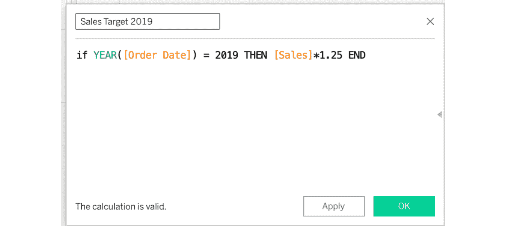

图 4.18 创建计算字段

1.  将字段从 "`Calculation1`" 重命名为 "`Sales Target 2019`"。在计算字段窗口中，输入以下公式：

    ```py
    If YEAR([Order Date]) = 2019 THEN [Sales]*1.25 END
    ```

公式如下读取：如果订单日期的年份是 `2019`，则将目标销售额设为 `2019` 销售数据的 `125%`。


图 4.19：创建 2019 年销售目标字段

1.  对`2019 年实际销售`计算字段重复相同的步骤，使用以下公式：

    ```py
    If YEAR([Order Date]) = 2019 THEN [Sales] END
    ```

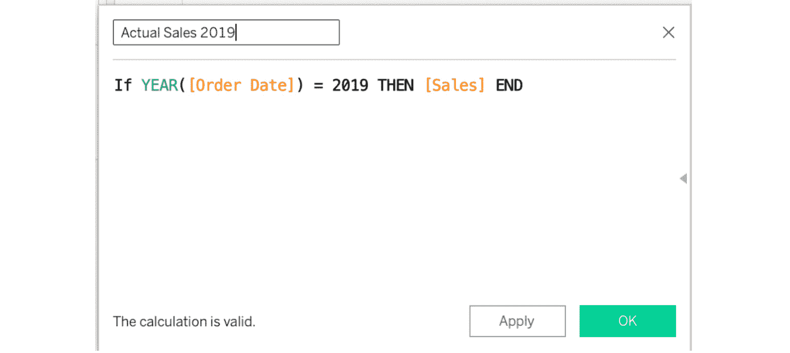

图 4.20：创建 2019 年实际销售目标字段

1.  将`子类别`拖到`行`架上。

下一步将演示`Show Me`和`非 Show Me`方法。你将从`Show Me`面板方法开始。

1.  将`2019 年实际销售`和`2019 年销售目标`计算字段拖到`列`架上：

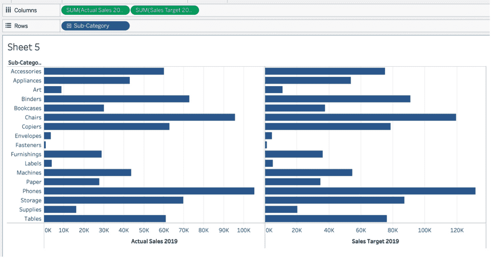

图 4.21：实际销售与目标销售并排柱状图

在前面的图中，你有两个图表：`2019 年实际销售`和按子类别划分的`2019 年销售目标`。如果你仔细观察，你可以看到`配件`的实际销售 2019 年为`60,000`，而`销售目标 2019`为`75,000`，这是实际销售 2019 年的`125%`。在下一步中，你将把这两个条形图转换为子弹图。

1.  导航到`Show Me`面板，然后单击`子弹图`。

一旦你点击`子弹图`，你会注意到每个条形都添加了一个黑色参考线。参考线是目标/目标线，它提供了额外的上下文：

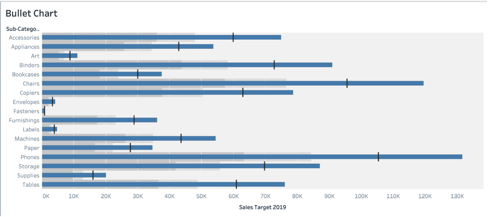

图 4.22：子弹图

你刚刚创建了一个子弹图，其中条形代表 2019 年的销售目标，参考线是实际销售。但理想情况下，你希望你的 2019 年销售目标是参考线，因为那是你希望你的子类别努力达到的目标。你将在下一步进行这些更改。

1.  如果你的子弹图将`2019 年销售目标`作为条形而不是目标线，你可以右键单击`x`轴，然后单击`交换参考线`（在后来的 Tableau 版本中可能是`交换参考线字段`）以将参考线更改为目标销售而不是实际销售：

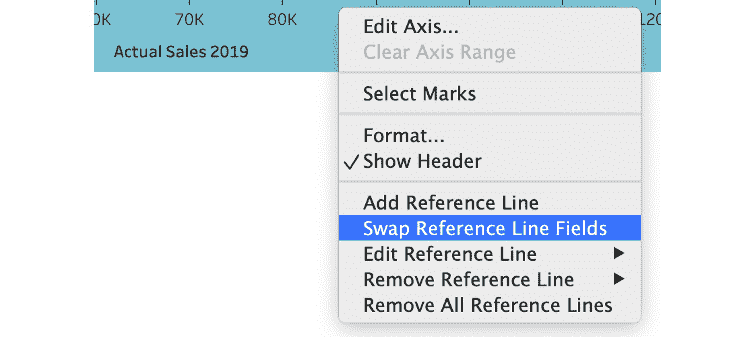

图 4.23：交换参考线

1.  对于不使用`Show Me`面板的其他方法，创建一个新的工作表，将`子类别`拖到`列`，将`2019 年实际销售`拖到`列`，将`2019 年销售目标`拖到`细节` `标记`卡。

1.  右键单击`x`轴，然后单击`添加参考线`。在`线`选项卡中，单击`每单元格`单选按钮。在`值`下拉菜单中，选择`SUM(2019 年销售目标)`，并在`值`下拉菜单右侧的下拉菜单中将它聚合为`SUM`。将`标签`下拉菜单从`计算`更改为`无`。

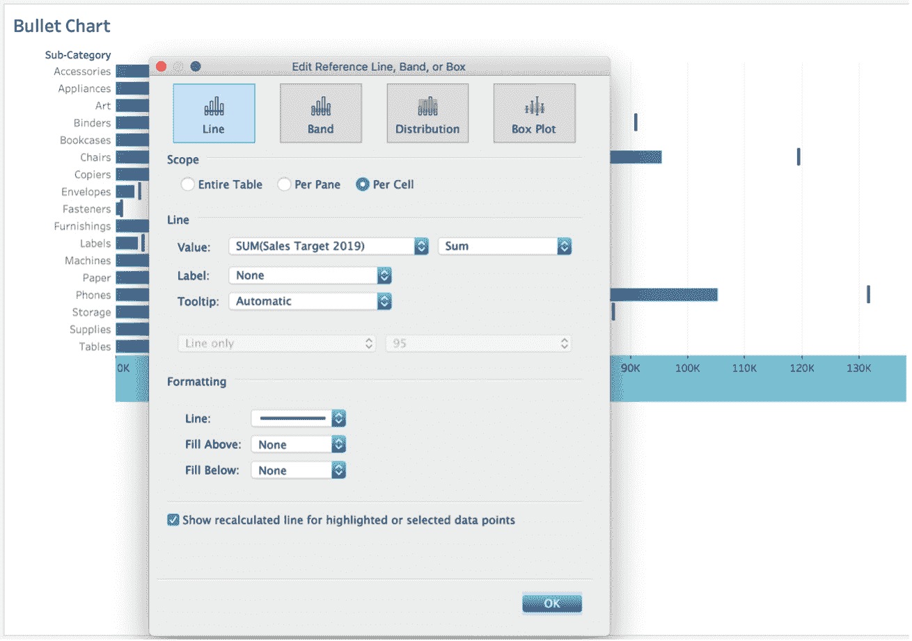

图 4.24：编辑参考线

在进行上述更改后，子弹图的最终输出将如下所示：

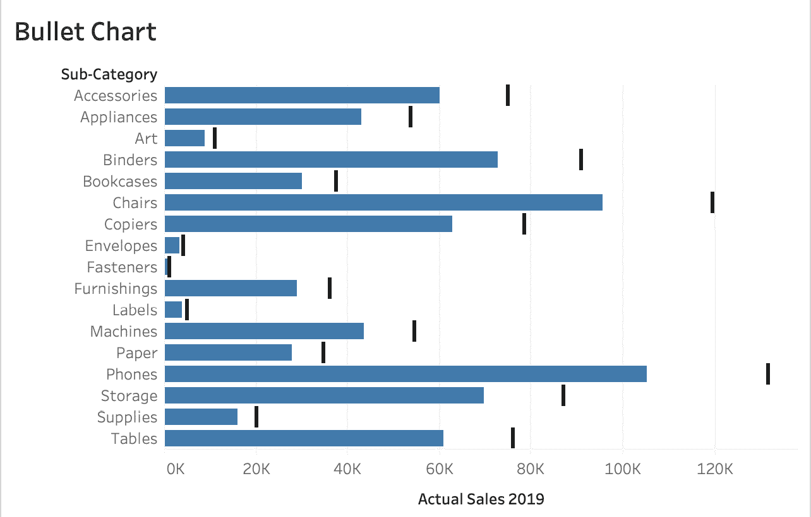

图 4.25：子弹图

在前面的屏幕截图中，参考线现在是 2019 年的销售目标，而不是最初子弹图表中的“2019 年实际销售”，这实际上很令人困惑。你希望你的利益相关者了解每个子类别离目标有多远。

在这个练习中，您能够使用`Show Me`面板以及手动添加参考线到您的视图中创建子弹图表。我们还简要介绍了计算字段，我们将在*第七章：数据分析：创建和使用计算*和*第八章：数据分析：创建和使用表计算*中进一步介绍。

## 条形图

与子弹图表类似，此类图表用于您想要比较同一行/列中的两个度量或两个值时。本质上，它添加了每个利益相关者都在您的报告中寻找的比较/目标/目标上下文。它几乎与子弹图表一样工作，主要区别在于，您将使用另一个嵌入在主条中的次要条作为比较点，而不是参考线。

想象一个与子弹图表类似的场景（例如，2019 年美国总统选举）。随着选举人团的投票正在计数，民主党人和共和党人的选票正在向目标席位数 269 冲刺。随着时间的推移和更多选票的计数，实际数字被更新并越来越接近目标数字 269。这是一个很好的例子，说明可以使用如下所示的条形图中的条形图。

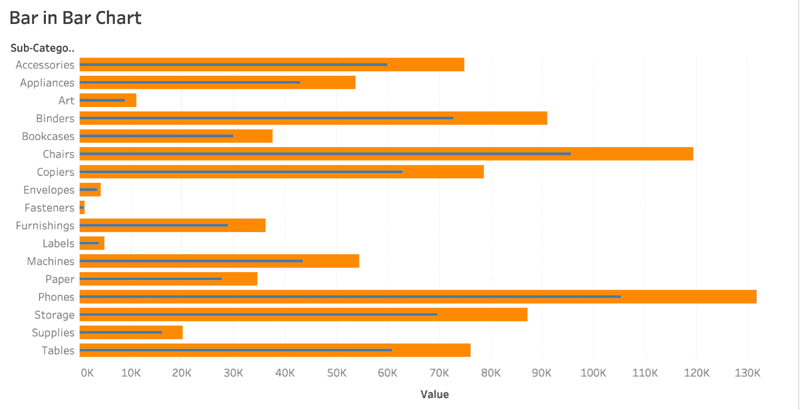

图 4.26：示例条形图

## 练习 4.05：创建条形图

你之前创建的用于跟踪实际销售与目标销售的视图有一个参考点，在没有额外有用文本和解释的情况下，对于利益相关者来说可能会很困惑。品类经理要求你使实际与目标比较更简单。作为一名分析师，在研究了潜在的图表想法后，你确定条形图是一个很好的简单视图。你将使用相同的维度和度量重新创建子弹图表视图，但将使用条形图。你将使用相同的`Superstore`数据集进行分析。

执行以下步骤以完成练习：

1.  如果`Orders`表尚未在您的 Tableau 实例中打开，请加载样本`Superstore`数据集中的`Orders`表。

1.  将`子类别`拖动到`行`架，将`2019 年销售目标`拖动到`列`架。

1.  将`Actual Sales 2019`拖动到视图中，并将鼠标悬停在`Sales Target 2019`轴上，直到您在轴上获得两个绿色堆叠条形突出显示，然后按照以下方式将`Actual Sales 2019`拖放到`Sales Target 2019`轴上：

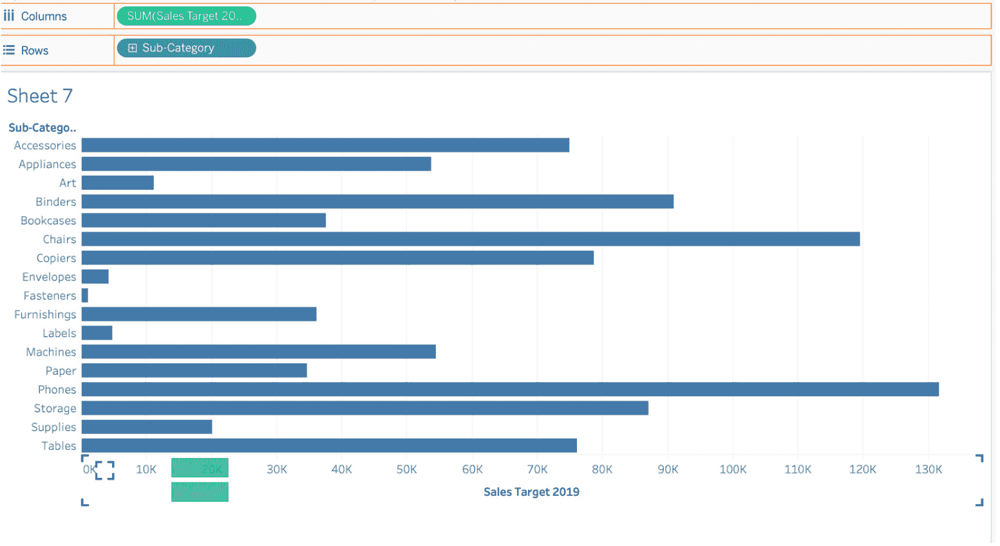

图 4.27：按子类别划分的销售条形图

在前面的截图中，你刚刚绘制了按子类别划分的销售图表，在下一步中，你将将这些柱状图按实际与目标进行颜色分割，以便实现所需的嵌套柱状图结果。

1.  将`度量名称`从`行`货架拖动到左侧的`颜色`的`标记`卡片上。一旦这样做，这两个度量值将通过不同的颜色区分开来，并将堆叠在一起：

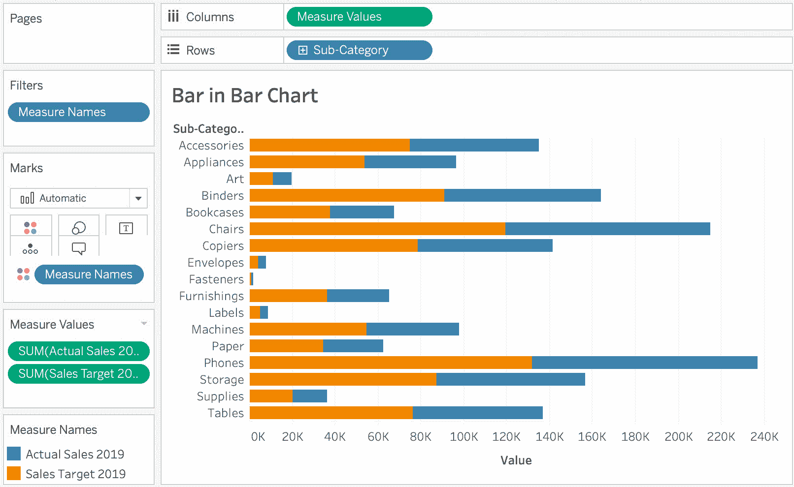

图 4.28：2019 年实际销售额与目标销售额对比

通过将`度量值`添加到`列`，并将`2019 年实际销售额`和`2019 年销售额目标`添加到`度量值`的`标记`卡片中，你会看到你能够在每个柱状图上堆叠两个柱状图，其中橙色柱状图是`2019 年销售额目标`，蓝色柱状图是`2019 年实际销售额`。

1.  你还会注意到，这两个度量值都是堆叠在一起的，而不是从零开始。本质上，`2019 年实际销售额`柱状图从`2019 年销售额目标`结束的地方开始，这不是你想要的数据展示方式。要改变这一点，导航到菜单中的`分析`，选择`堆叠标记`，然后选择`关闭`。

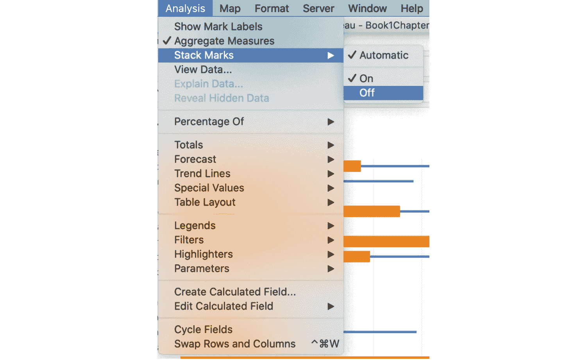

图 4.29：关闭堆叠标记

1.  尽管当前视图看起来很好，但你还想通过大小来区分`2019 年实际销售额`和`2019 年销售额目标`。通过将`度量名称`从`维度`数据面板拖动到`大小`的`标记`卡片，如这里所示来完成此操作：


图 4.30：未堆叠的柱状图

前面的截图显示，`度量名称`已从维度面板添加到`大小`的`标记`卡片中。

1.  如果你想，你可以交换前景中的度量值。当前视图很好，因为`2019 年实际销售额`在前景中，并且正朝着`2019 年销售额目标`前进，但如果你想改变这个，只需在`度量值`卡片中交换度量值，并调整柱状图的大小、颜色或宽度：

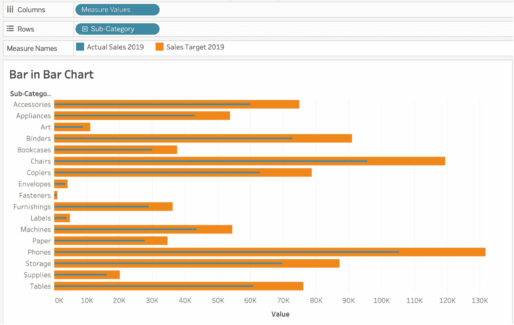

图 4.31：嵌套柱状图

在前面的图中，蓝色柱状图是`2019 年实际销售额`，它正朝着`目标销售额 2019`（橙色柱状图）前进。例如，`书架`子类别在`2019`年的实际销售额为`30,000`，正朝着大约`33,000`的销售目标前进。

你也可以使用双轴实现相同的嵌套柱状图，但我们将在这下一章中介绍。在这里，我们采用了标准方法，并学习了如何利用`度量名称`和`度量值`，这在 Tableau 报告/仪表板构建中起着重要作用。

# 探索组合快照 - 堆叠柱状图

堆叠条形图实际上是一个条形图，其中包含嵌入在条形中的额外详细级别，其中每个条形代表不同的维度/值。当您想要比较整个维度/值的整体与该维度/值的某个部分时，堆叠条形图非常有用，这些部分实际上是同一条形的不同小部分。想象一下汽车公司产生的收入：作为一个分析师，您希望在一个条形图中展示按汽车/产品类型划分的收入，而不占用太多空间。通过用汽车类型对条形图进行着色编码，您可以创建一个包含大量上下文细节的单个图表。

将堆叠条形图视为显示 **总计与部分**：

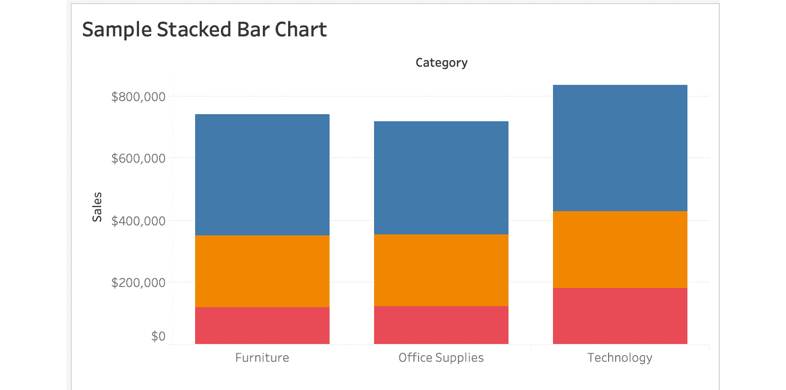

Figure 4.32: Sample stacked bar chart

在下一个练习中尝试创建堆叠条形图。

## 练习 4.06：创建堆叠条形图

在您直接经理的新要求中，他们希望以条形图格式查看按子类别划分的销售，其中销售子类别按颜色划分细分市场。本质上，经理期望每个子类别都有一个堆叠条形图，并按细分市场分割。您将继续使用 `Superstore` 数据集来完成此练习。

按以下步骤完成此练习：

1.  如果 `Orders` 表还没有在您的 Tableau 实例中打开，请从示例 `Superstore` 数据集中加载它。

1.  将一个度量拖动到 `行` 面板。此练习使用 `Sales`，但您可以使用自己项目中的任何度量。

1.  将 `Sub-Category` 拖动到 `列` 面板，现在您将有一个按子类别划分的销售简单条形图：

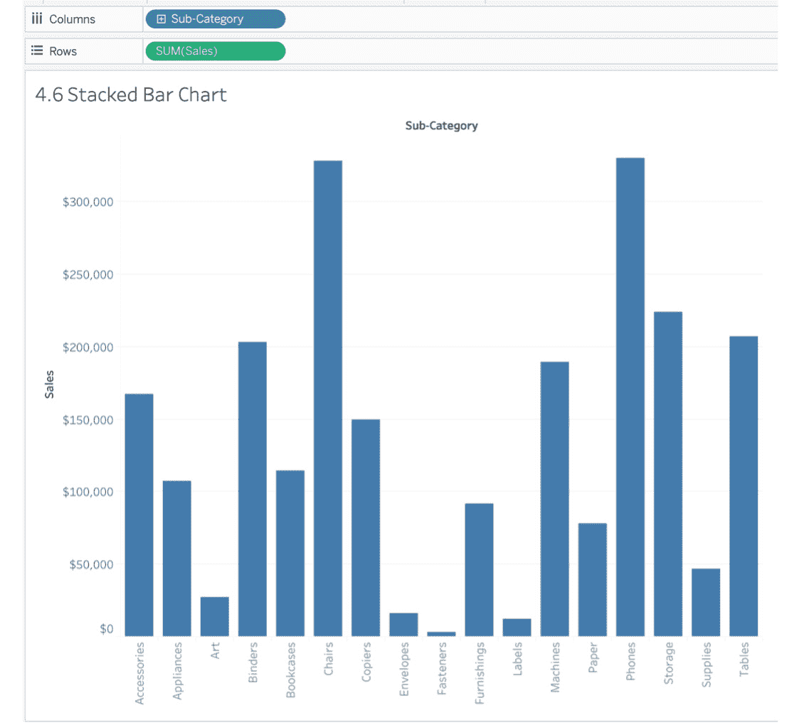

Figure 4.33: Stacked bar chart – sales by sub-category bar chart

1.  要将此条形图转换为堆叠条形图，选择一个维度（无论是 `YEAR[Order Date]` 还是 `Segment`），并将其拖动到如图所示的 `颜色` `标记` 卡：

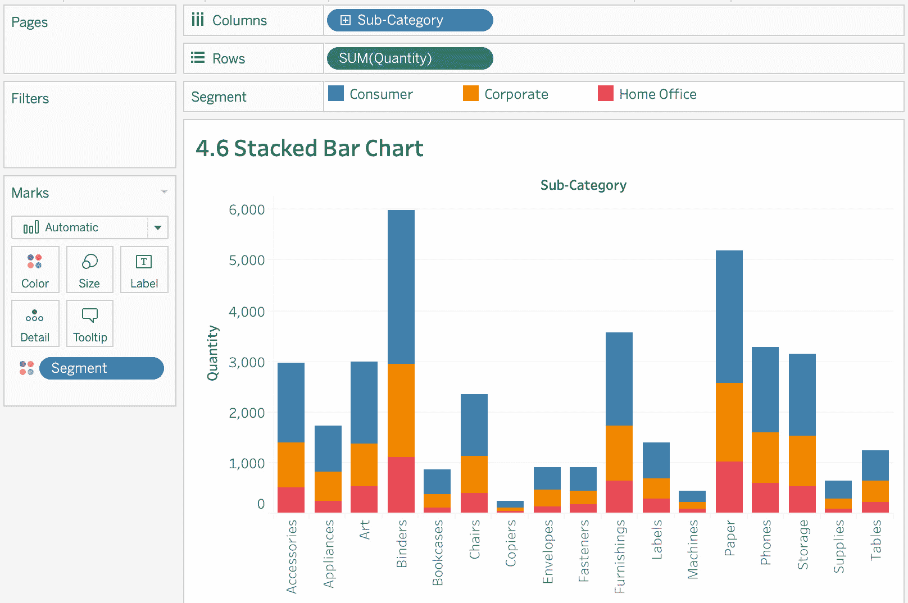

图 4.34：按子类别和细分市场的堆叠条形图

您现在已经将简单的条形图基本转换为堆叠条形图，因为您已经通过细分市场对多个条形进行了着色或堆叠。`椅子` 和 `电话` 是收入最高的子类别，但不清哪个细分市场贡献更多；因此，接下来，您将在堆叠条形图中添加更多元素以提高可读性。

1.  将 `SUM(Sales)` 添加为条形图的标签。将 `Sales` 从 `度量` 数据面板拖动到 `标签` `标记` 卡：

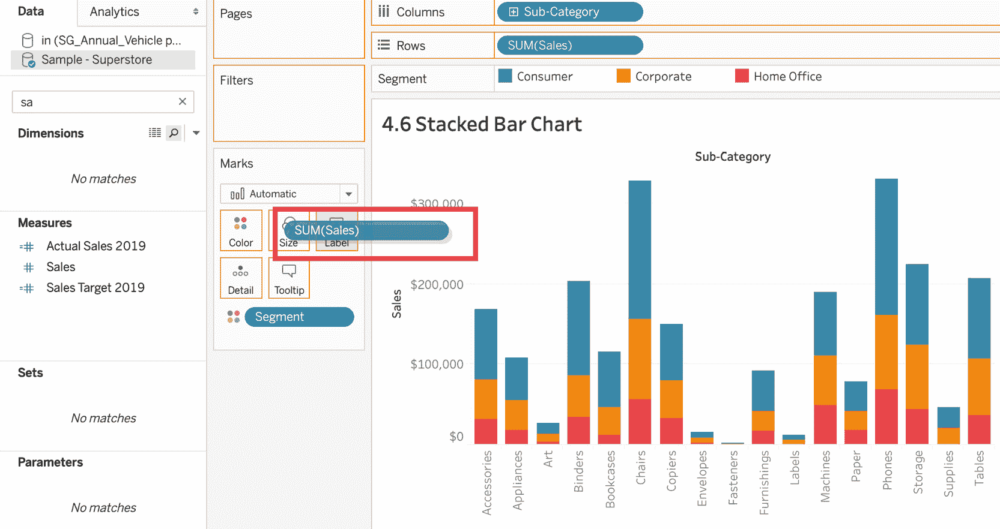

图 4.35：按子类别和细分市场的堆叠条形图

1.  您可能会注意到`销售`标签在我们的柱状图中占据了大量的空间。它占用这么多空间的原因是`销售`的单位是十，但考虑到您的大部分销售都大于 1,000，您可以将单位从十更改为千，这样更容易阅读并节省一些空间。

1.  要更改`销售`数字的单位，导航到`标记卡`中的`SUM(Sales)`。右键单击并选择`格式化`。

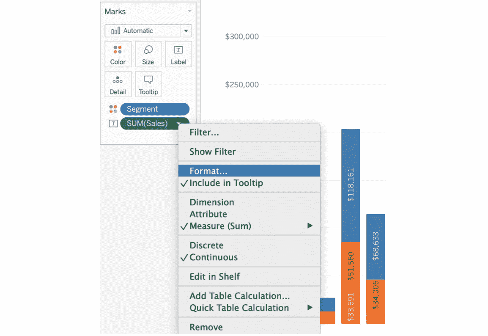

图 4.36：格式化销售

1.  在对话框的默认部分，点击`数字`下拉菜单，选择`数字（自定义）`，将`显示单位`从`无`更改为`千(K)`：

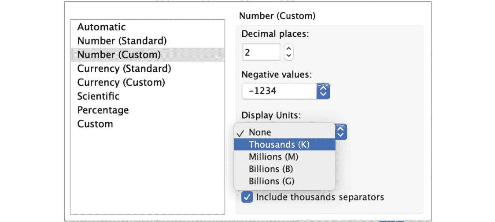

图 4.37：格式化销售

堆叠柱状图现在将如下所示：

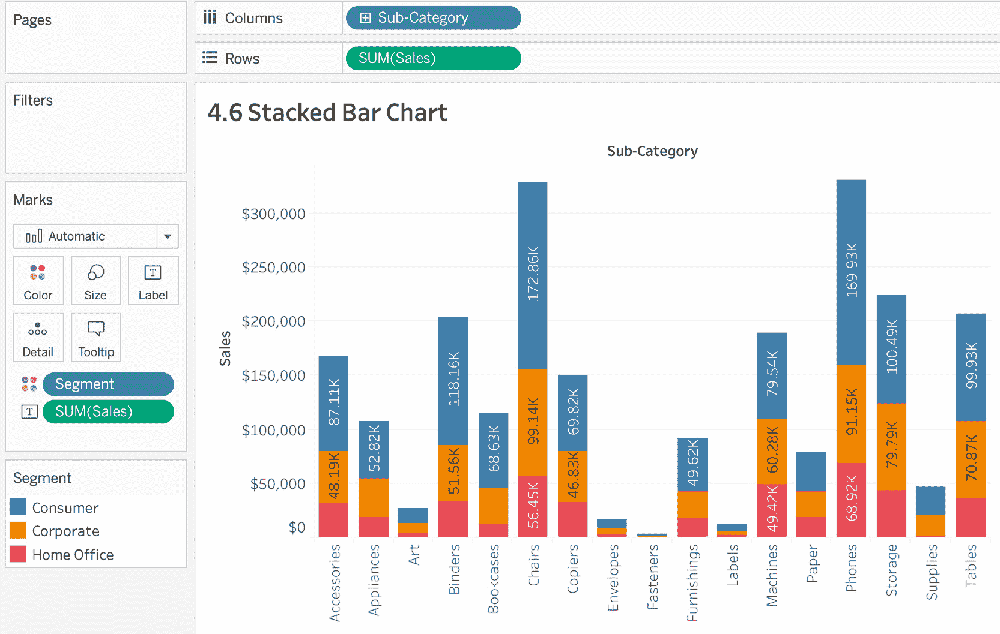

图 4.38：最终的堆叠柱状图

注意

在前面的图中，您可能会注意到较短的柱状图内部没有嵌入信息。这是 Tableau 的一个限制。当您将鼠标悬停在较短的柱状图上时，Tableau 将显示您所需的信息。

在这个练习中，您学习了如何创建堆叠柱状图。这可能是 Tableau 中构建最简单的图表之一，但当你想要回答关于部分与总量的相关问题时的一个非常有用的选择。

# 探索组合快照 - 饼图

尽管饼图经常被使用，但在作者的个人经验和数据可视化领域的行业领导者看来，最好在报告/仪表板中避免使用饼图，因为从它们中准确提取见解变得困难。饼图甚至经常让业务中最优秀的人感到困惑。注意以下饼图如何容易地欺骗人们（欺骗人们不是我们作为数据分析师/可视化人员应该做的事情）：

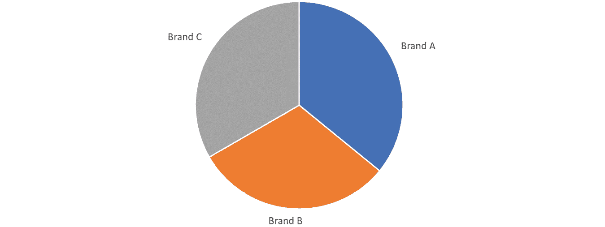

图 4.39：示例饼图

饼图的目标是显示品牌 A、B 和 C 的市场渗透率水平。简单的视觉检查可能会让人相信品牌 A 和 C 的市场渗透率相等，但事实上，由于几个百分点的差异，它们之间的差异可能是几百万美元。因此，建议不要使用饼图。尽管如此，如果无法避免使用它们，请记住以下经验法则：如果您的饼图有超过六个标签，您最好创建一个柱状图或堆叠柱状图。

## 练习 4.07：创建饼图

公司的副总裁今天将在董事会会议上进行演示，他们正在寻求您的帮助，创建一个简单的饼图，显示按部门划分的销售情况。在这个练习中，您将创建您的第一个饼图，并按照副总裁的要求完成要求。您将继续使用`Superstore`数据集。

以下步骤将帮助您完成此练习：

1.  如果样本`Superstore`数据集中的`Orders`表尚未在您的 Tableau 实例中打开，请加载它。

1.  将`Sales`拖到“行”架上，将`Segment`拖到“列”架上，这将创建你的标准柱状图：

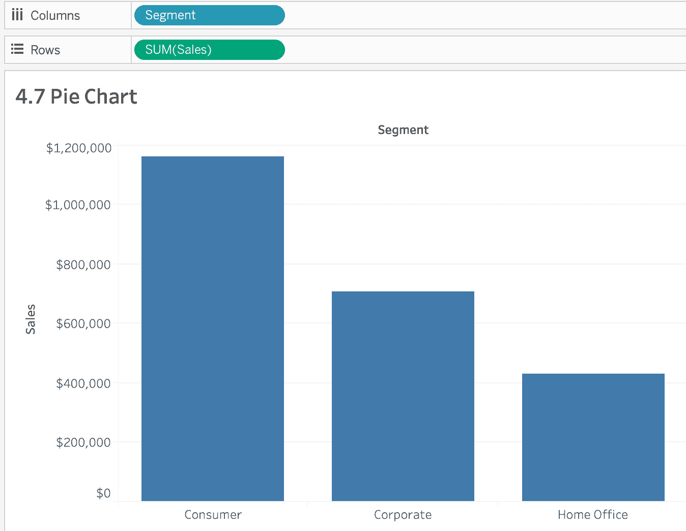

图 4.40：饼图 – 步骤 1

1.  要将柱状图转换为饼图，打开“显示我”面板并点击饼图图标：

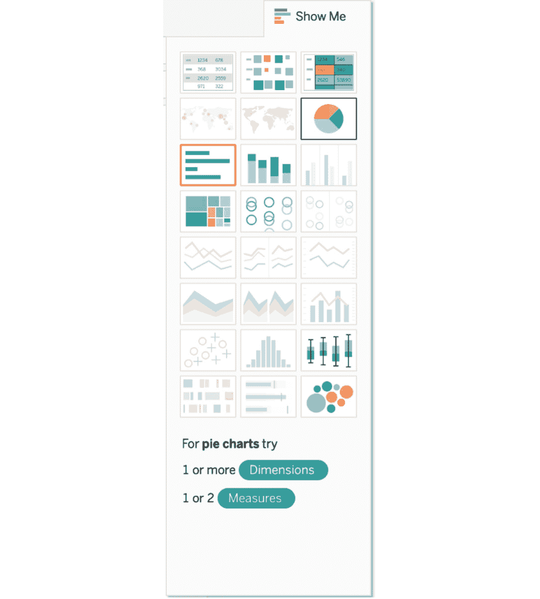

图 4.41：使用显示我面板添加饼图

当你将柱状图转换为饼图时，饼图可能太小而无法阅读。

1.  为了增加饼图的尺寸，在 Mac 上，你可以按*Command* + *Shift* + *B*来增加尺寸，或者按*Command* + *B*来减小尺寸。在 Windows 上，按*Ctrl* + *Shift* + *B*来增加饼图的尺寸，按*Ctrl* + *B*来减小饼图的尺寸。另一种增加或减小饼图尺寸的方法是使用我们“标记”卡中的“尺寸”选项卡：

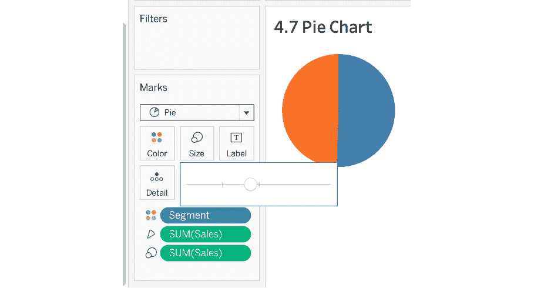

图 4.42：增加饼图的尺寸

1.  要向图表添加标签，将`Segment`以及`Sales`拖到你的“标签”`标记`卡中。将我们的标签大小增加到 15 或更高。你还可以将`SUM(Sales)`的数值单位更改为千或百万，如前一个练习中讨论的那样：

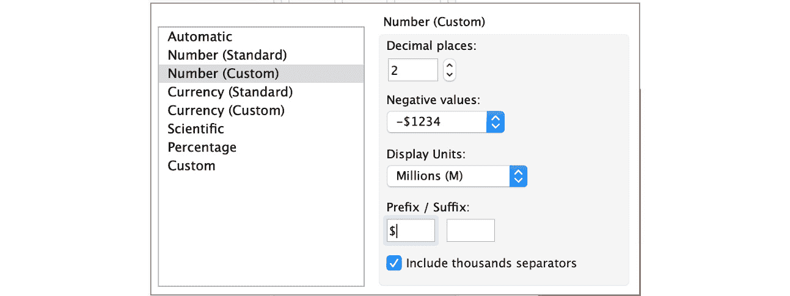

图 4.43：添加$前缀

进行更改后的最终输出将如下所示：

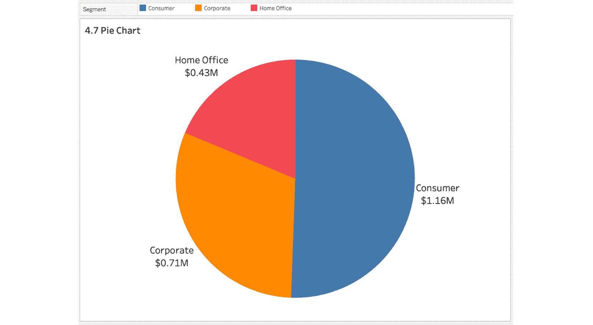

图 4.44：最终饼图

在前面的屏幕截图中，你能够以饼图的形式展示按段落的销售额。尽管饼图有其缺点，但当标签数量不超过 5-7 个且屏幕上的可用空间非常有限时，饼图可以非常实用。

## 树状图

与饼图和堆叠柱状图一样，树状图帮助你回答部分与整体类型的问题，但主要区别在于树状图和嵌套柱状图使用矩形来显示层次关系。使用“标记”卡元素如“颜色”和“大小”，你可以更好地分析数据。当一个矩形更大或颜色更集中时，它代表视图中的维度最高值。树状图允许你快速衡量对整体的贡献。与饼图一样，树状图并不总是最佳选择，但根据所需的分析，树状图可以使用上下文标签以提高可读性；它们也是那些可以在视图中绘制数百个数据点的图表类型之一。

想象一个场景，交付运营副总裁要求展示每个州的总体交付情况以及这些州的交付是否准时。使用树状图，你可以比较每个州的交付活动，其中每个州的交付数量通过该州矩形的大小来传达，而延迟交付的比例通过颜色来显示：

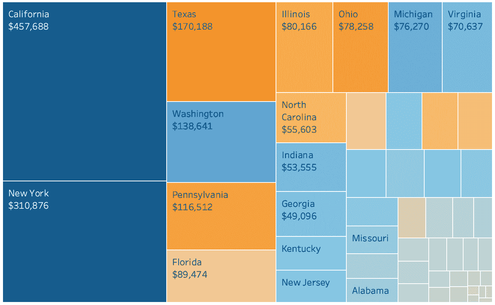

图 4.45：示例树状图

## 练习 4.08：创建树状图

作为一名分析师，你希望在视图中创建一个有利润和无利润州按类别划分的视图，而不使用交叉表。为此练习，你将使用 `Superstore` 数据集。你需要根据各州的盈利能力对州进行着色，并按总销售额降序排序。你使用树状图的原因是你可以同时使用大小和颜色来传达信息，而不会牺牲任何东西。

执行以下步骤以完成练习：

1.  如果你的 Tableau 实例中尚未打开，请打开示例 `Superstore` 数据集。

1.  在这个练习中，你有两个度量：`Sales` 和 `Profit Ratio`。你将使用 `Sales` 来确定大小，`Profit Ratio` 来着色树状图。将主要度量（在这种情况下，`Sales`）拖动到 `Size` `Marks` 卡片，将次要指标 `Profit Ratio` 拖动到 `Color` `Marks` 卡片：


图 4.46：将销售添加到树状图中

注意

如果你使用的是 Tableau 2020.1 之后的版本，你可能需要在这一步选择 `Profit` 而不是 `Profit Ratio`。

1.  将 `State` 拖动到你的 `Detail` `Marks` 卡片中，这将使你的数据更加细化，并以大小和颜色表示各个州。

当你在 Tableau 2020.1 版本中将 `State` 添加到 `Detail` `Marks` 卡片时，你会看到 `Country`/`Region` 会自动添加，因为 `State` 是层次结构的一部分。由于 `Country`/`Region` 并没有为你的视图增加任何价值或细节，所以请从 `Detail` `Marks` 卡片中移除 `Country`/`Region`。在此过程中，将 `State` 拖动作为标签：

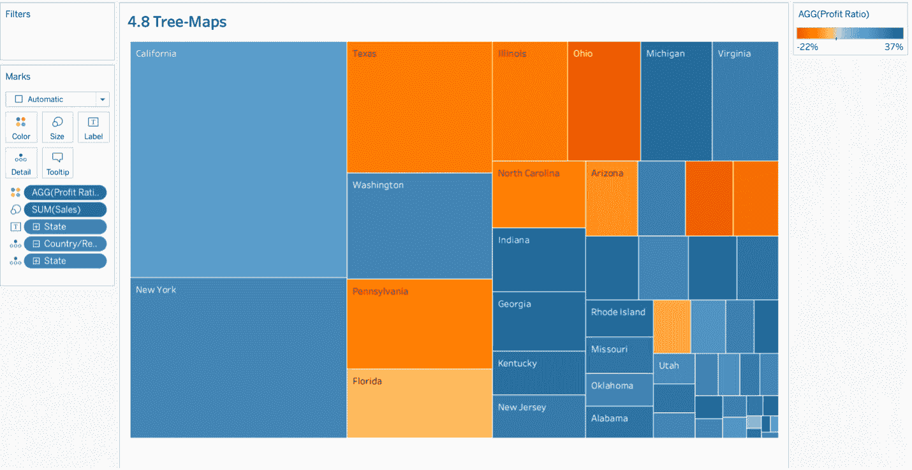

图 4.47：按利润率着色

在前面的图中，你已按州表示了销售额和利润率。加利福尼亚州和纽约州的销售额最多（更大的矩形意味着更多的销售额），但像密歇根州这样的州的利润率更高（更深的蓝色意味着更高的利润）。

1.  你可以在这里停止分析/绘图，这将是你表示每个州及其利润率的树状图。然而，在这种情况下，你将在视图中添加另一层细节。将 `Category` 拖动到 `Rows` 档，并在工具栏中，将视图从 `Standard` 更改为 `Entire View`，如图中所示：

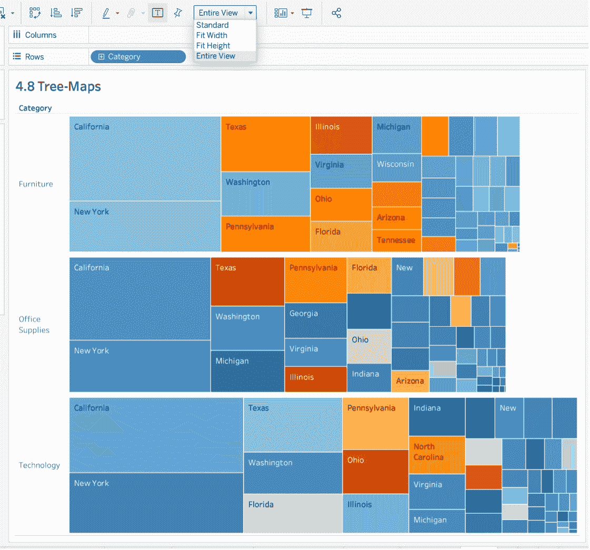

图 4.48：按类别划分的树状图

你差不多完成了，但你用于图表中的颜色范围有点令人困惑，因为利益相关者只想知道一个州是否盈利。他们既不需要也不想知道每个州的精确盈亏比率。你可以在稍后添加那些精确的“利润率”细节到工具提示中。

1.  导航到“标记”卡，并点击“颜色”选项卡。勾选“阶梯颜色”复选框，并将值设置为`2`步。

    注意

    如果你使用的是 2020.1 之后的 Tableau 版本，你需要选择“编辑颜色”来找到“阶梯颜色”选项。

1.  接下来，选择你想要的调色板，并点击“<< 高级”。勾选“中心”复选框，并将其值设置为`0`（绿色代表盈利州）：

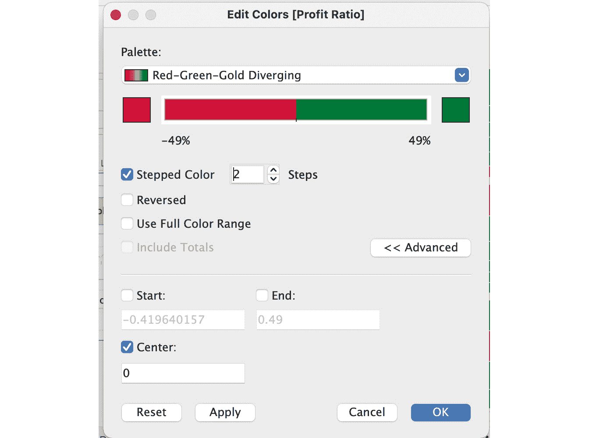

图 4.49：按类别和州划分的树状图，使用红/绿颜色编码

最终输出如下：

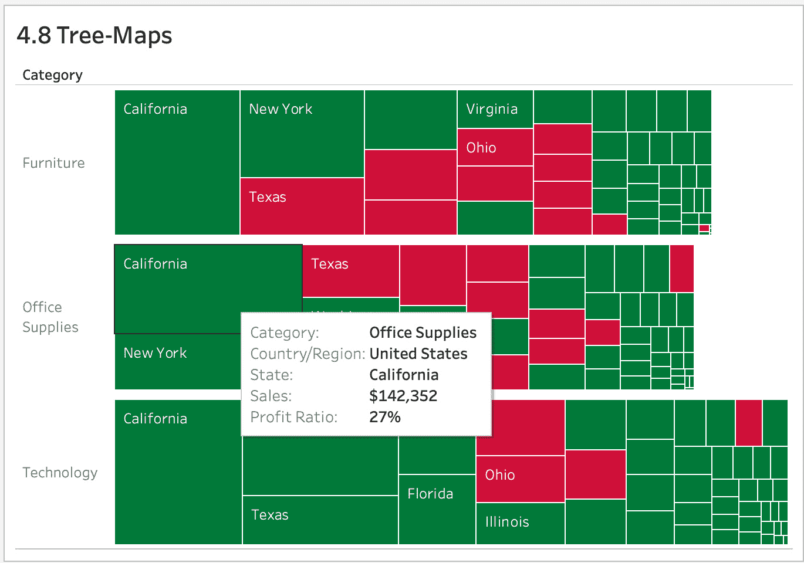

图 4.50：按类别和州划分的树状图，使用红/绿颜色编码

这种树状图视图（*图 4.50*）与你在上一步中创建的默认树状图（*图 4.48*）的主要区别在于，在最新的树状图中，你不再使用渐变色来对利润率进行颜色编码，而是将亏损用红色表示，将盈利用绿色表示，这样利益相关者可以更快地查看最盈利和最不盈利的州。

如果你仔细观察，你会发现加利福尼亚州是所有类别中销量最高的州，如果你想了解该州的利润率，你只需将鼠标悬停在任何一个州上即可。

# 探索趋势数据的组成

## 面积图

面积图是可用的最令人视觉愉悦的图表之一，并且经常用于报告节奏。面积图本质上是由线图和柱状图组合而成的，因为它们显示了总量的比例之间的关系。

想象一个用例，其中一家电子公司的分支机构经理想要查看他们所属系列在各个电视类别中的总销量。你可以通过使用堆积柱状图来满足这一需求，但使用面积图，你还可以添加时间趋势，这正是你将在下面的练习中探索的内容。

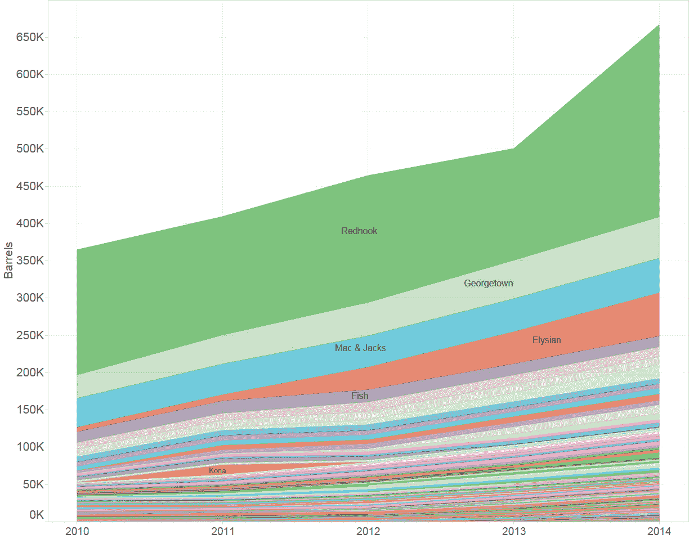

图 4.51：示例面积图

注意：关于面积图的注意事项

当你使用面积图作为堆叠面积图时，它很容易被误解——特别是如果你使用堆叠面积图表示百分比。例如，假设你正在创建一个电子邮件营销报告，其中包含不同活动的转化率。活动 1 的点击通过率（CTR）为 3%，活动 2 的 CTR 为 7%，活动 3 在特定月份的 CTR 为 6%。该月的真实 CTR 为 5.3%，但使用堆叠面积图，所有活动的 CTR 可能显示为 16%，这是事实上的错误。只是要注意这里的注意事项。

## 练习 4.09：创建面积图

财务运营总监向你寻求帮助，希望了解每个子类别在每个月的销售趋势。总监想知道他们在 7 月还是 8 月销售得更多。作为分析师，你的任务是创建一个按月和按年销售趋势的颜色编码面积图。你将继续使用 `Superstore` 数据集来完成此练习。你还将在此练习中探索连续和离散面积图，使用 `订单日期`、`子类别` 和 `销售额`。

执行以下步骤：

1.  如果你的 Tableau 实例中尚未打开，请打开示例 `Superstore` 数据集。

1.  将 `订单日期` 拖动到 `列` 桶中，并通过点击 `订单日期` 瓶盖上的箭头并选择连续的 `月份`（你将首先创建一个连续堆叠面积图）来将粒度从年更改为月。

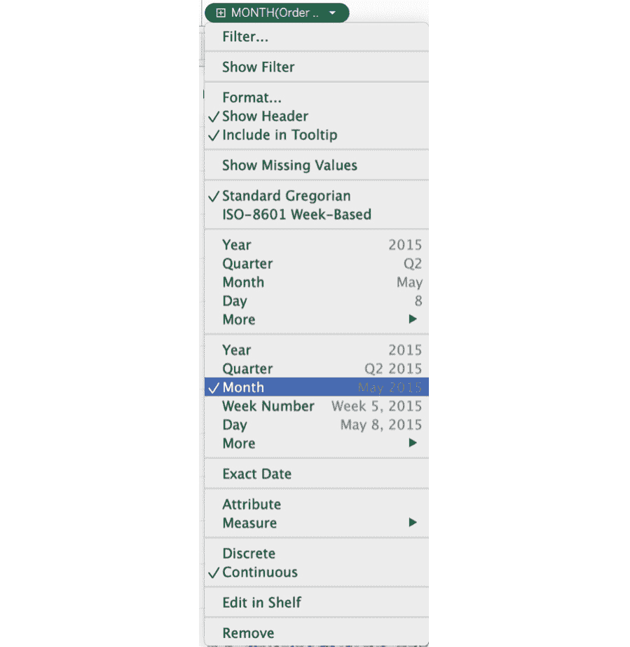

](img/B16342_04_52.jpg)

图 4.52：连续月份选择

1.  将 `销售额` 拖动到 `行` 桶中。一旦你将其拖放到 `行` 桶中，就会创建一个折线图。

1.  将 `子类别` 从数据面板拖动到 `颜色标记` 卡上，然后使用下拉菜单将 `标记` 类型从 `自动` 更改为 `面积`：

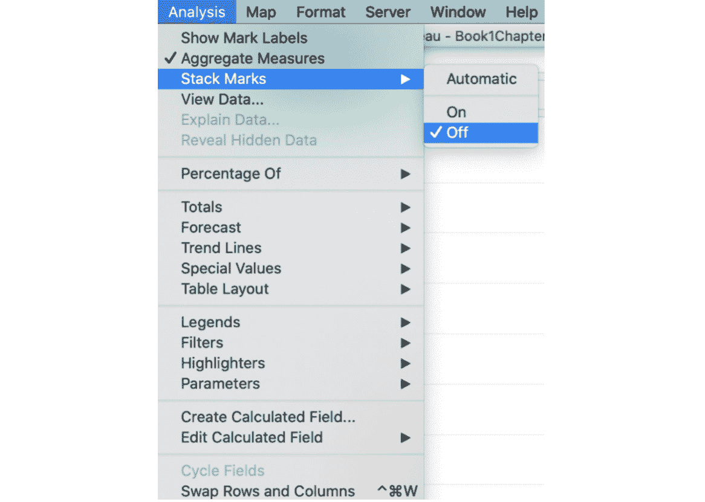

](img/B16342_04_54.jpg)

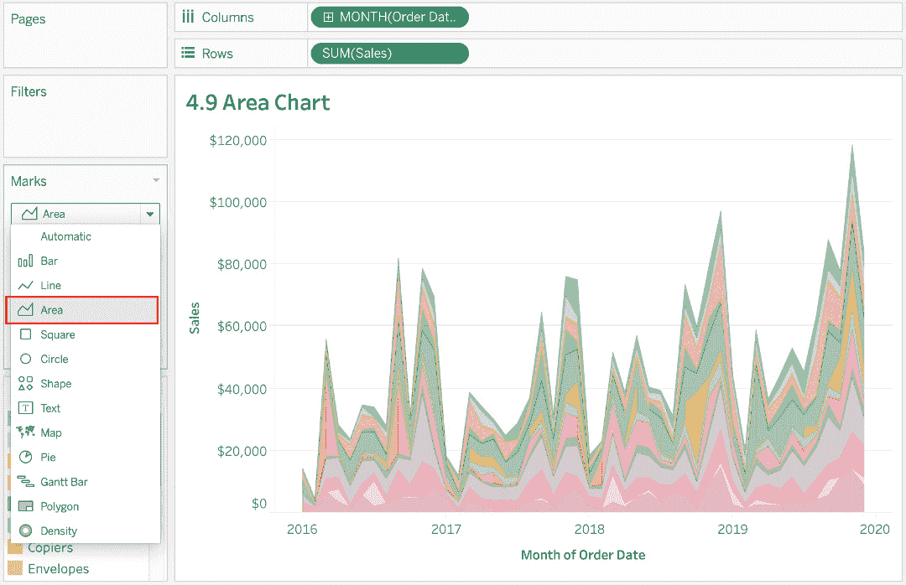

前面的图表表示连续堆叠面积图。如果你不想区域堆叠在一起，你可以关闭堆叠。

1.  在菜单中导航到 `分析` 并点击 `堆叠标记` | `关闭`。同样，你可以按照相同的步骤将堆叠标记重新打开：


](img/B16342_04_53.jpg)

图 4.54：关闭堆叠标记

某人想要在面积图中关闭 `堆叠标记` 的唯一原因可能是他们想查看特定维度（在本例中为子类别）的个别趋势。未堆叠面积图的限制在于它存在隐藏数据点的风险，因为背景区域所代表的内容并不清晰：

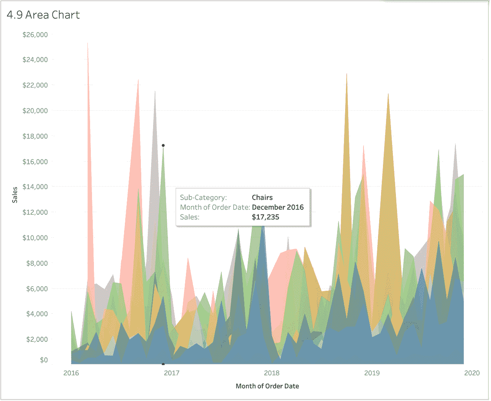

](img/B16342_04_55.jpg)

图 4.55：面积图

1.  要将面积图更改为离散图，将 `订单日期` 的类型从 `连续` 更改为 `离散`：

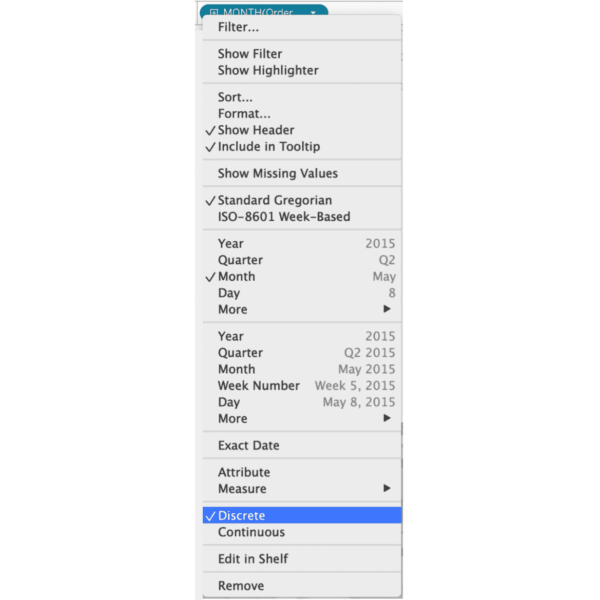

](img/B16342_04_56.jpg)

图 4.56：离散日期选择

使用离散图表时，对于每年的“月份”，现在你只显示不考虑年份的离散月份。与连续堆叠面积图相比，这是一个更细粒度的视图。你将更改轴刻度线，从$50,000 增加到$25,000 的增量。

1.  要更改轴刻度线，右键单击“销售额”轴并单击“编辑轴…”。


图 4.57：编辑坐标轴

1.  在“编辑坐标轴[销售额]”中，点击“刻度线”（在后续版本中可能为“主要刻度线”）并选择“固定”，然后将“刻度间隔”设置为`25000`，如图所示：

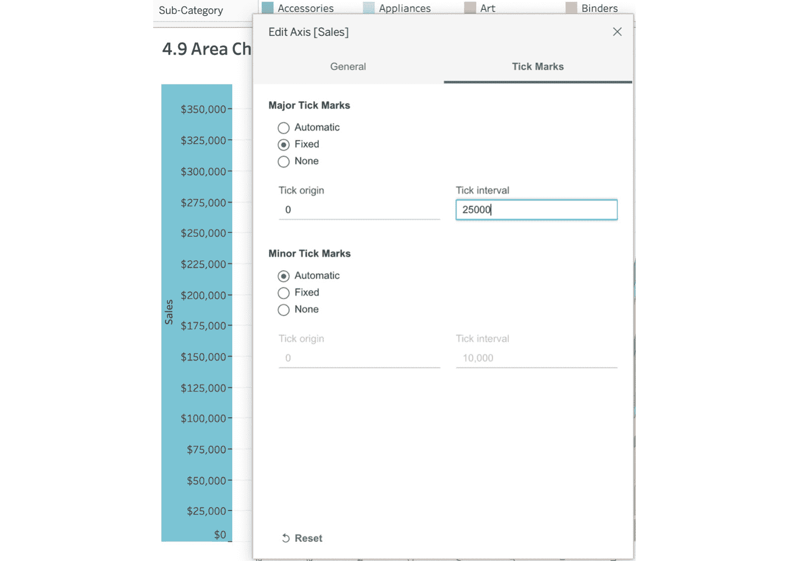

图 4.58：设置主要刻度线

最终输出如下：

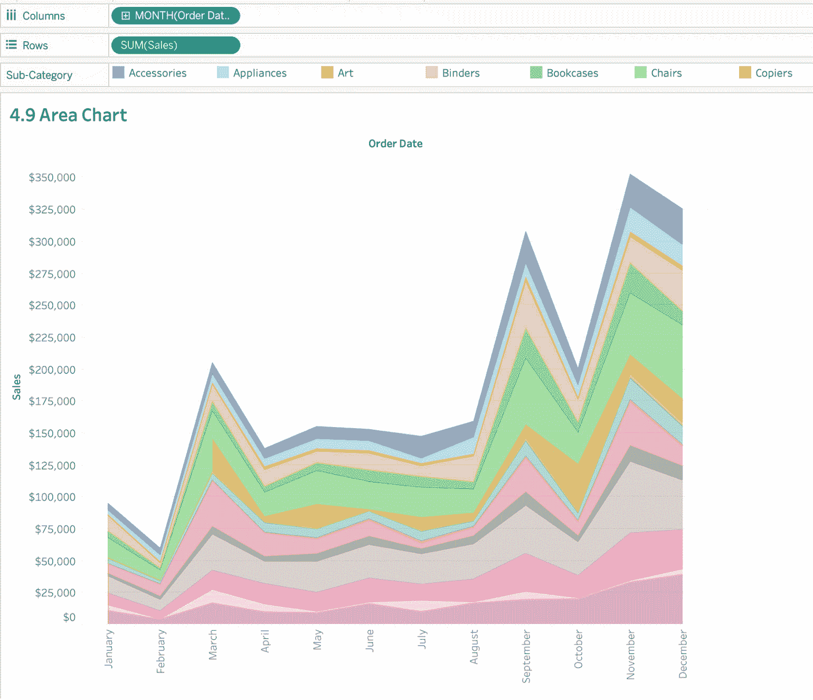

图 4.59：最终的堆叠面积图

在前面的屏幕截图中，每个子类别都堆叠在一起，而销售趋势则按月份显示。从给定的图表中，你可以轻松地看出 11 月是`Superstore`数据集收入最高的月份。

在这个练习中，你学习了何时以及何时不使用面积图，比较了堆叠与非堆叠面积图，并研究了连续和离散面积图的最佳使用案例。

## 活动四.01：可视化新加坡乘用车的增长

最近，新加坡政府任命了一位新的车辆检查部门负责人。这个新成立的部门将分析过去几十年的车辆销售情况，研究增长/趋势，并制定政策和规则，以进一步帮助政府减少排放。作为入职初期的一部分，车辆检查部门负责人要求查看每个车辆类别的销售趋势，包括公交车、出租车、汽车和货车。他们期望分析师创建一个单一视图，展示这些车辆类别的销售趋势。作为一个分析师，考虑到车辆检查部门负责人期望看到多个类别和年份的趋势，你决定使用带有颜色编码的面积图，以便更容易阅读。

在这个活动中，你将通过创建多个图表来展示你在本章中学到的技能。你将使用`SG_Annual_Vehicle_Population`数据，可以从[`packt.link/wLR2x`](https://packt.link/wLR2x)下载。

执行以下步骤以完成此活动：

1.  导入并打开下载的数据。

1.  将“类别”拖放到“列”板和“数量”拖放到“行”板。

1.  将“年份”拖放到“列”板。

1.  将“类别”拖放到“颜色”标记卡中。

1.  将“年份”拖放到“标签”标记卡中。

1.  将“轴”标题更改为仅“审计年份”。

1.  编辑坐标轴，将“主要刻度线”更改为“固定”并设置间隔为`1`。

1.  将工作表标题更改为“活动 4.1”。

预期输出如下：

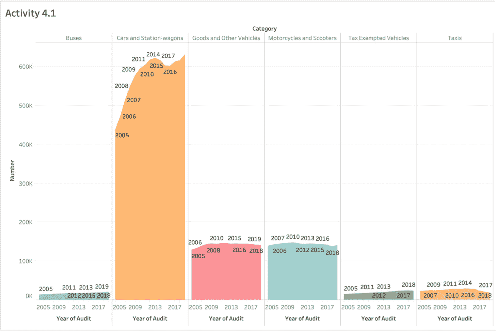

图 4.60：活动 4.01 预期输出

注意

这个活动的解决方案可以在以下链接找到：[`packt.link/CTCxk`](https://packt.link/CTCxk)。

# 摘要

这就结束了本章。在本课中，你创建了 Tableau 中的第一个图表，从条形图开始，用于跨维度的比较，然后是折线图来展示时间上的比较。你还了解了子弹图和条形图之间的区别，以及探索度量比较时的最佳用例。

你进一步组合了快照，通过处理三种主要的图表类型：堆叠条形图、饼图和树状图。在探索树状图时，你不仅仅使用了一个标准的树状图，而是通过利用多个度量添加了一个额外的层次，其中主要度量`Sales`用于矩形的尺寸，次要度量`Profit ratio`用于利润/亏损，使用了两种不同的颜色。不同的颜色使得利益相关者更容易识别超市类别中的盈利状态。

虽然我们确实讨论了时间序列数据的折线图，但我们还决定通过一个面积图问题来工作，并研究堆叠（*无法聚合百分比*）与非堆叠（*隐藏数据风险*）面积图的问题。我们简要地提到了连续堆叠面积图与离散堆叠面积图的区别。我们通过处理新加坡年度车辆人口审计的新数据集来结束本章，并创建了一个面积图来理解过去 15 年来新加坡车辆增长的不同趋势。

在下一章中，我们将进一步前进，处理双轴图、直方图、箱线图和散点图，以及讨论一些与参考线相关的统计信息以及何时使用不同的参考线模型。将下一章视为 Tableau 的高级图表制作。
