# 5. 数据探索：分布和关系

概述

本章建立在你在*第四章*，*探索比较和组合*中创建的基本图表之上。你还将涵盖趋势线和参考线等高级主题，并看到一些它们经常被使用的例子。到本章结束时，你将能够创建分布图表，展示数据点之间的关系，并创建如**双轴**和**象限**图等高级图表类型。

# 简介

在前面的章节中，你已经学习了各种图表方法，这些方法依赖于视图中的维度和度量。然而，在某些时候，尤其是在商业场景中，你可能只有度量可以工作。在本章中，你将学习如何创建没有维度的图表，以及具有多个度量的图表。你将学习创建度量之间的关系，并了解高级 Tableau 技能，如趋势线和参考线，如何有助于更好地向利益相关者展示洞察力。

首先，你将使用直方图、箱线图和须图来探索单个度量的分布。然后，你将查看两个度量的分布，使用散点图和带有趋势线的散点图（线性、对数和指数）。接下来，你将查看多维度/度量的高级可视化，如双轴图和象限图。

# 探索单个度量的分布

直方图和箱线图等分布图用于显示连续和数值型定量数据的分布。然而，正如前一章所讨论的，条形图在绘制离散和分类数据时使用。在这些部分，你将专注于离散和分类图表类型。

## 创建直方图

直方图表示频率分布。它显示了值的分布，并有助于识别任何异常值。直方图将你的连续测量值分成测量范围，并将它们放入称为桶的组中。每个桶本质上是一个直方图中的条形，表示落在该桶内的值范围的计数。

如果你创建一个公司所有员工的薪资直方图，其中每个桶的范围是 10,000 美元，你的直方图将表示有多少员工在赚取 0-10,000 美元、10,001-20,000 美元、20,001-30,000 美元等。

在 Tableau 中创建直方图很简单，因为它是`Show Me`面板中的 24 种默认图表类型之一。每次你在 Tableau 中创建直方图时，都会创建大小相等的桶/组，Tableau 为你在创建图表时使用的度量创建一个桶维度（为你的桶范围创建的一个本地临时维度）。

以下图示显示了一个样本直方图。在这里，您正在查看总订单数量的分布，区间大小为 1。本质上，从以下直方图中，您可以看到有`899`个订单只有 1 件商品，有`2,402`个订单有`2`件商品，依此类推：

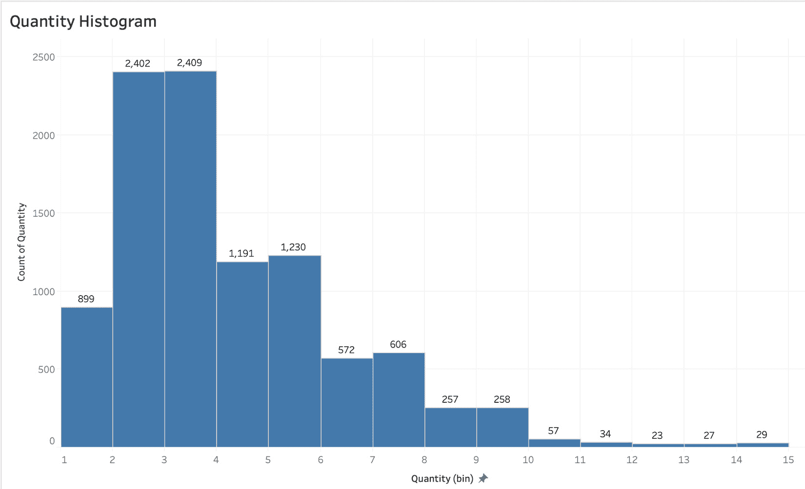

图 5.1：一个样本数量直方图

以下截图显示直方图选项是“显示 我”面板的一部分：

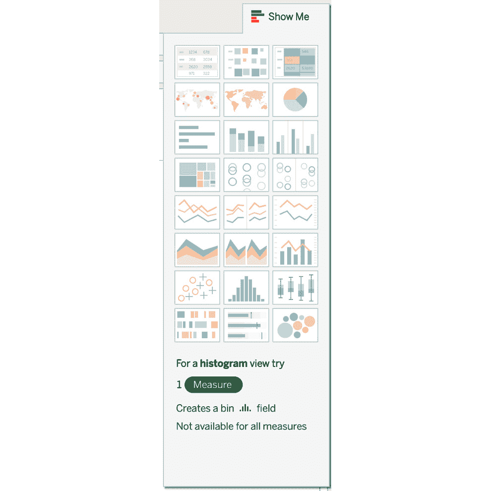

图 5.2：作为“显示我”面板一部分的直方图选项

在创建直方图时，Tableau 会自动在“数据”面板中添加“数量（区间）”维度，如下所示：

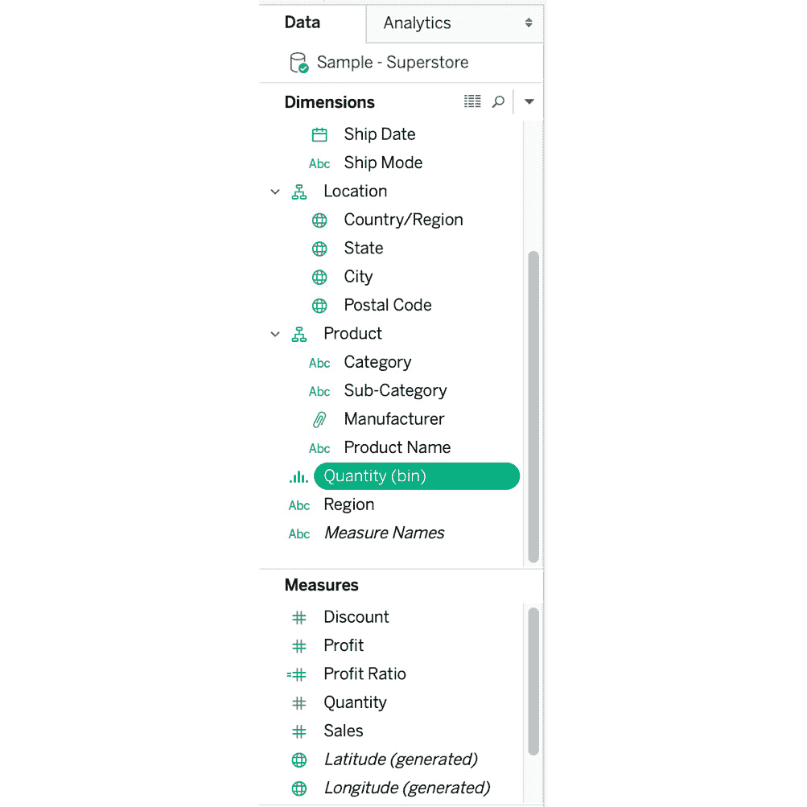

图 5.3：添加到数据面板的“数量”（区间）

现在完成 5.01 练习，看看在实际操作中如何创建直方图。

## 练习 5.01：创建直方图

作为一家电子商务商店的分析师，您的经理希望更好地了解每个订单的大小，要求您创建一个图表，显示按订单数量统计的订单数量。表示频率分布的更好方法之一是使用直方图。在这个练习中，您将使用`Sample – Superstore`数据集创建一个“按数量统计的订单数量”分布视图，并在过程中学习如何在 Tableau 中创建直方图的精确步骤。

注意

您可以在以下链接找到`Sample - Superstore`数据集：[`community.tableau.com/s/question/0D54T00000CWeX8SAL/sample-superstore-sales-excelxls?language=en_US`](https://community.tableau.com/s/question/0D54T00000CWeX8SAL/sample-superstore-sales-excelxls?language=en_US).

或者，您也可以在我们的 GitHub 仓库中找到数据集：[`packt.link/21LCj`](https://packt.link/21LCj).

`Sample – Superstore`数据集是 Tableau Desktop 默认加载的数据集。该数据集代表了一个虚构的商店，包含订单的维度，如`订单日期`、`发货日期`、`国家`、`产品类别`/`子类别`/`制造商`/`名称`、`细分市场`和`客户名称`，以及如`折扣`、`利润`、`数量`和`销售额`等度量。

执行以下步骤来完成此练习：

1.  将`Sample – Superstore`数据集中的`Orders`表加载到您的 Tableau 实例中。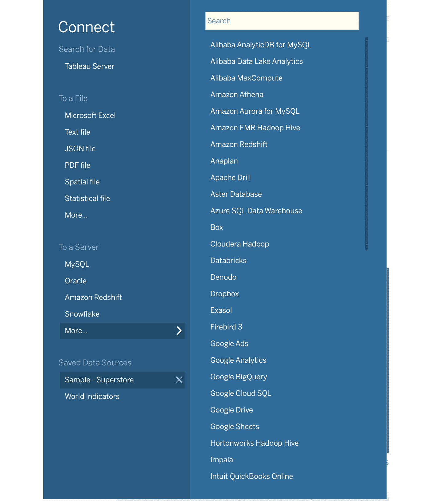

图 5.4：加载 Sample – Superstore 数据集

如前所述，直方图用于连续和数值数据，因此在这种情况下，您有`折扣`、`利润`、`数量`和`销售额`。在这个例子中，您将使用`数量`来创建直方图。

1.  双击“数量”或将“数量”度量拖动到“行”面板。默认情况下，Tableau 选择水平条形图作为首选的图表方法，如下所示：

![图 5.5：总销售额的单条柱状图

![img/B16342_05_05.jpg]

图 5.5：总销售额的单条柱状图

正如你所见，在`Show Me`面板中，对于`数量`度量只有两个图表选项可用。

1.  选择`直方图`，你将得到以下视图：

![Figure 5.6：Tableau 默认的直方图箱

![img/B16342_05_06.jpg]

图 5.6：Tableau 默认的直方图箱

正如你所见，Tableau 现在在数据面板中创建了一个数量（箱）维度，并自动决定最佳箱大小。在你的当前视图中，不清楚第一个箱是在`1.5`还是`2.0`结束。

1.  为了提高可读性，将箱大小编辑为整数。在`数据`面板中右键单击`数量（箱）`并选择`编辑...`：

![Figure 5.7：编辑箱大小

![img/B16342_05_07.jpg]

图 5.7：编辑箱大小

在编辑箱[数量]窗口中，此数据集的箱大小为`1.77`，小于`2`，这使得我们的第一个箱结束位置不明确。

1.  将箱大小更改为整数值（在这种情况下，更改为`1`以提高可读性）。这将向最终用户显示发票中包含一个项目、两个项目等的订单数量：

![Figure 5.8：更改箱大小

![img/B16342_05_08.jpg]

图 5.8：更改箱大小

接下来，你将进行一些格式更改。正如你所见，x 轴从零开始，结束于最大箱之后的一个箱。将其编辑为从一箱开始，到最大箱大小结束，以便你有一个连续的轴。

1.  要编辑轴，右键单击*x*轴并点击`编辑轴`。接下来，从`编辑轴`窗口中选择`固定`范围，输入`1`作为`固定起始`，并保持`固定结束`不变，如下所示：

![Figure 5.9：编辑箱的轴

![img/B16342_05_09.jpg]

图 5.9：编辑箱的轴

1.  通过使用*Ctrl* + 拖动（适用于 Windows）或*Option* + 拖动（适用于 Mac），将`CNT(数量)`药丸从`行`面板拖动到`标签`面板进行最后一次编辑，为单个箱添加标签。最后，将工作表标题重命名为`数量直方图`，如下所示：

![Figure 5.10：最终直方图

![img/B16342_05_10.jpg]

图 5.10：最终直方图

你已经学会了如何使用频率分布来创建直方图，并回答了以下问题：*有多少销售/订单包含一个项目、两个项目等等*？

在前面的屏幕截图中，直方图表示包含一个项目、两个项目等的订单数量。有`1,230`个订单包含`5`个项目，`572`个订单包含`6`个项目。

接下来，你将学习**箱线图**（**B&W**）的重要性以及何时在你的图表中使用它们。

## 箱线图

每当你想展示分布时，除了直方图外，黑白图也是你可选的另一种选项。当你想比较两个维度并排时，箱形图特别有效，其中一个维度在*x*轴上，另一个在*y*轴上。例如，美国职业棒球大联盟击球手的击球率。在学习创建黑白图（也称为箱形图）之前，了解它们的重要性、如何阅读它们以及何时最好使用它们是很重要的。

下面是黑白图的样子：

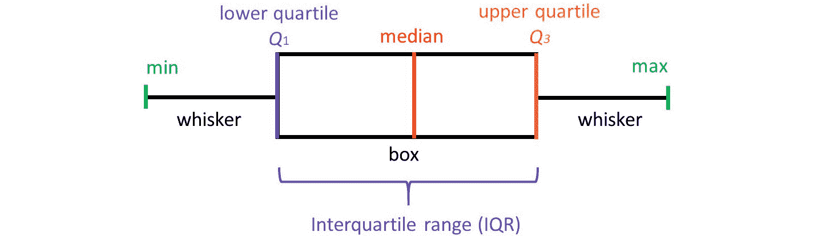

图 5.11：样本黑白图

图像的箱形部分代表第一和第三四分位数，也称为**四分位距**（**IQR**）。四分位距的计算方法是 Q3 减去 Q1（Q3-Q1）。左边的触须代表第一四分位数的最小值，右边的触须代表第四四分位数的最大值。箱形中间的线是中位数（Q2），它是数据集的中间数。位于线左侧的数据点是小于中位数的数字，而位于右侧的是所有大于中位数的数字。接下来，你将开始使用超市数据集创建箱形图。

当你想让你的分布识别异常值时，黑白图特别有用。例如，下一个截图显示了两个县的年龄分布：费城县和莫拉戈县。上面的图表示费城，下面的图表示莫拉戈。费城的 IQR 在 23 到 64 之间，莫拉戈的 IQR 在 15 到 43 之间。但截图也有助于识别异常值，因为两个县都有 100 岁及以上的人口部分。这就是黑白图可以如此有用的地方。

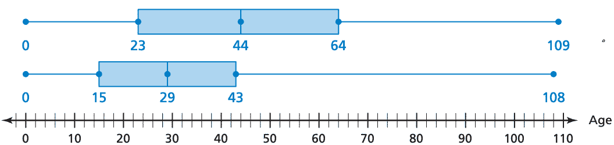

图 5.12：两个县的黑白图

## 练习 5.02：在没有 Show Me 面板的情况下创建箱形图和触须图

就像直方图一样，黑白图是 Tableau 中的`Show Me`面板的一部分，但在这个案例中，你将学习如何使用参考线创建箱形图。

执行以下步骤来完成此练习：

1.  在你的 Tableau 实例中加载`Sample – Superstore`数据集中的`Orders`表。

1.  创建一个只有一个维度和一个度量（条形图在*第四章：数据探索：比较和组合*中讨论过）的条形图。选择`Profit`作为度量，产品`Segment`作为维度（按`Segment`查看`Profit`）。

1.  将`Segment`拖到以下截图所示的`Columns`货架，将`Profit`拖到`Rows`货架：

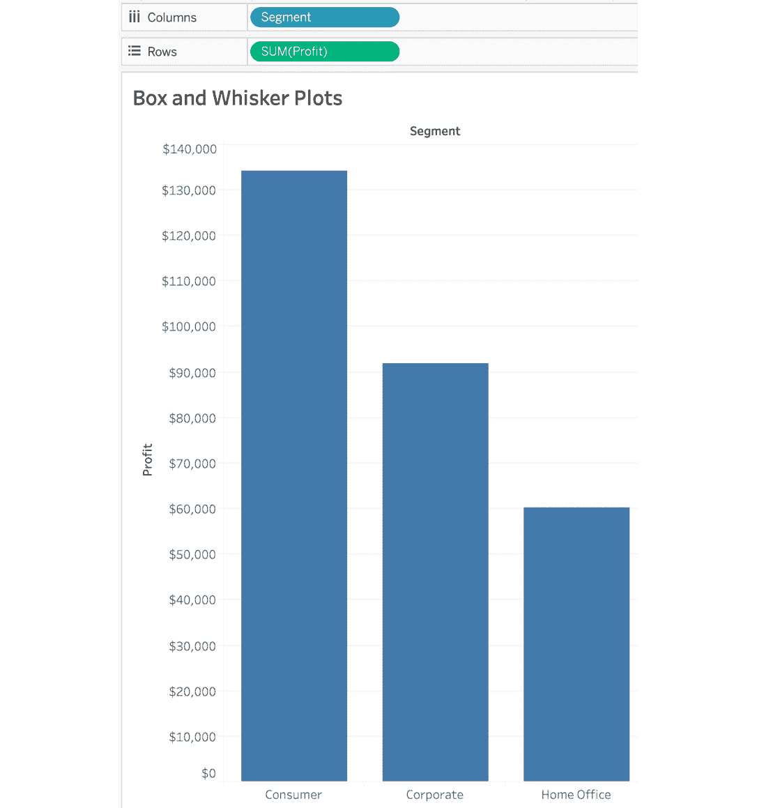

图 5.13：按 Segment 的利润条形图

1.  将分布维度添加到`Detail` `Marks`卡中。在这种情况下，你正在查看按`Segment`和订单年份分布的`Profit`。现在，将*订单年份*添加到`Detail`卡中。

    注意

    *Ctrl* + 拖动（适用于 Windows）或 *Option* + 拖动（适用于 Mac）将“订单日期”拖动以打开“下放字段”窗口，这将允许您在“标记”卡上选择“订单日期的年份”。

![图 5.14：堆叠条形图]

![img/B16342_05_14.jpg]

图 5.14：堆叠条形图

一旦将“订单日期的年份”添加到您的“详细标记”卡，就会创建一个堆叠条形图，其中每个堆叠代表订单日期的年份。

1.  通过将标记类型从“自动”更改为“圆圈”（在“标记”面板中），将此堆叠条形图转换为点图以用于您的黑白图：

![图 5.15：按细分利润的散点图]

![img/B16342_05_15.jpg]

图 5.15：按细分利润的散点图

如果您不将标记类型转换为点图，您将无法看到如下所示的黑白图：

![图 5.16：未将标记类型从条形转换为圆圈的问题]

![img/B16342_05_16.jpg]

图 5.16：未将标记类型从条形转换为圆圈的问题

1.  现在，要创建黑白图，右键单击`y`轴并选择“添加参考线”：

![图 5.17：从轴添加参考线]

![img/B16342_05_17.jpg]

图 5.17：从轴添加参考线

1.  在“添加参考线、带或框”对话框中，选择“箱线图”。您可以尝试调整选项，比如改变填充颜色、样式或边框和须须的粗细：

![图 5.18：参考线选项]

![img/B16342_05_18.jpg]

图 5.18：参考线选项

如前所述，IQR 代表四分位距，即第一四分位数和第三四分位数之间的所有数据点。在“箱线图”对话框选项框中，“1.5 倍 IQR 内的数据”实际上意味着我们要求 Tableau 将图表上的所有数据点都调整到 1.5 倍 IQR 范围内。任何超出范围的数据点将被视为异常值。您将在以下图中通过实际图表探索这一概念：

![图 5.19：按细分利润的黑白图]

![img/B16342_05_19.jpg]

图 5.19：按细分利润的黑白图

箱线图中间的线，即浅灰色和深灰色的交汇处，是中位数。如果您查看整个视图，可以快速比较所有产品细分的中位数，无论中位数大小如何。上须须比 IQR 高 50%，下须须比 IQR 低 50%。如果数据点在箱线和须须之外，这些数据点将被视为异常值，而这个图表允许您快速识别它们，这在直方图中并不那么直接。

接下来，您将了解如何使用“显示我”面板创建箱线图，这是一种更直接的方法。

## 练习 5.03：使用“显示我”面板创建箱线图

在这个练习中，您将从“显示我”面板创建箱线图。您将继续进行上一个练习，但您可能使用一个新的工作表。

执行以下步骤以完成练习：

1.  将`Segment`拖动到`Columns`，将`Profit`拖动到`Rows`。这有助于创建条形图。

1.  将`YEAR (Order Date)`维度拖动到`Marks`面板上，你希望将其用作分布维度。在这个例子中，使用`YEAR (Order Date)`，如下所示：

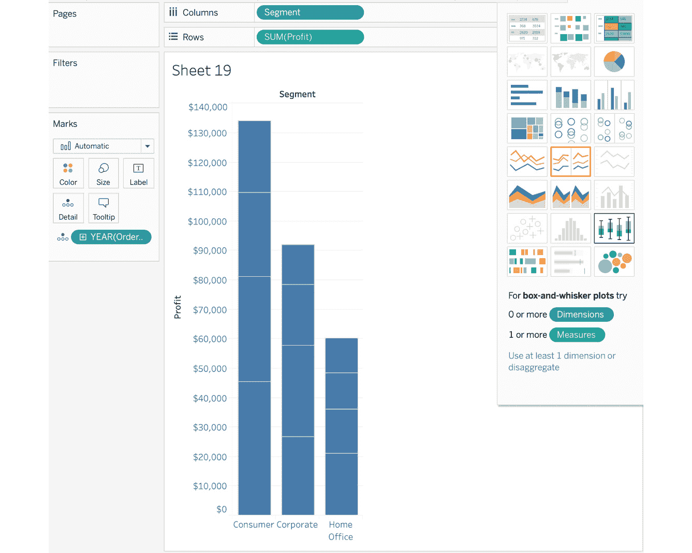

图 5.20：带有堆叠条形图的 B&W 图

1.  点击`Show Me`面板（如前一步所示），然后点击`Box and Whisker Plots`：

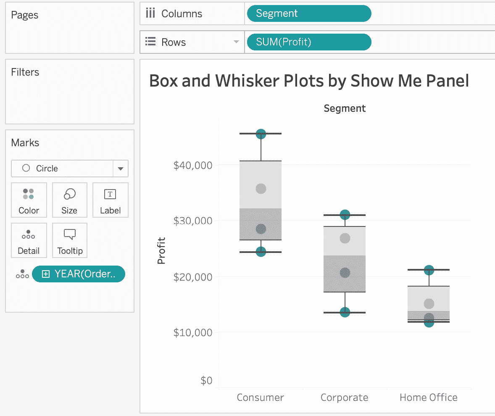

图 5.21：最终 B&W 图

考虑前一个截图中的中位数（箱线图中的中间线）。如果你横跨视图查看，可以快速比较所有产品段的中位数，无论中位数大小如何。如果一个数据点位于 B&W 之外，这些数据点被认为是异常值。

当数据正确时，箱线图可以非常强大。箱线图可以在一个图表中传达大量信息。

这完成了使用单一度量进行的直方图、箱线和须须图活动。接下来，你将探索散点图，这在处理两个或更多度量时非常有用。

# 多个度量之间的关系和分布

在本章的这一部分，你将探索如何最好地在同一视图中表示两个度量，以及这些图表如何帮助建立两个或更多度量之间的关系。你将首先查看散点图。一旦你覆盖了这些多度量图表的分布部分，你将转向通过讨论双轴图表及其用途来探讨这些度量之间的关系。

## 两个度量的分布

散点图是由两个到四个度量以及零个或更多维度创建的二维图表。前两个度量用作`x`轴和`y`轴，第三个和第四个度量以及维度用于为散点标记添加更多格式和上下文。

散点图在绘制两个可量化度量相对于彼此时非常有用。例如，这可以是销售额与利润或数量与折扣之间的关系。散点图还有助于通过识别异常值和相关点群来发现模式或聚类，这有助于决策。

如果你想要更深入地了解，你还可以向这些图表添加参考线，这可以将散点图分成四个象限（我们将在本章后面的练习中解释如何创建四象限视图）。这使得最终用户更容易指出关系。

## 创建散点图

你现在将在 Tableau 中创建一个散点图。在这样做的时候，一个度量成为`x`轴，第二个度量成为`y`轴。默认情况下，当你将两个度量绘制到你的视图中时，Tableau 将这些度量聚合到视图中的一个点。然后你必须手动解聚合（使度量更细粒度）以创建散点图（如下面的截图所示）。

这是散点图的最终版本，您将使用两个度量量和两个维度创建它：

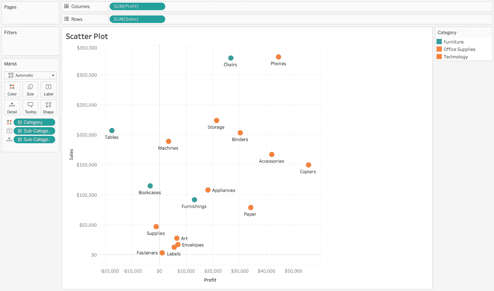

图 5.22：每个子类别销售与利润的样本散点图

以下练习 5.04 将详细说明这些步骤。

## 练习 5.04：创建散点图

您的店铺经理要求一份报告，查看店铺中每个子类别销售的总销售额与利润。图表必须标识每个子类别，并使用颜色表示每个子类别所属的总体类别。您将使用`Sample – Superstore`数据集来满足这一请求。

执行以下步骤以完成练习：

1.  在您的 Tableau 实例中加载`Orders`表（如果它尚未在您的 Tableau 实例中打开）。

1.  选择两个度量来绘制数据点。对于这个练习，这些是`销售`和`利润`。

1.  将`利润`拖到`列`架上，将`销售`拖到`行`架上：

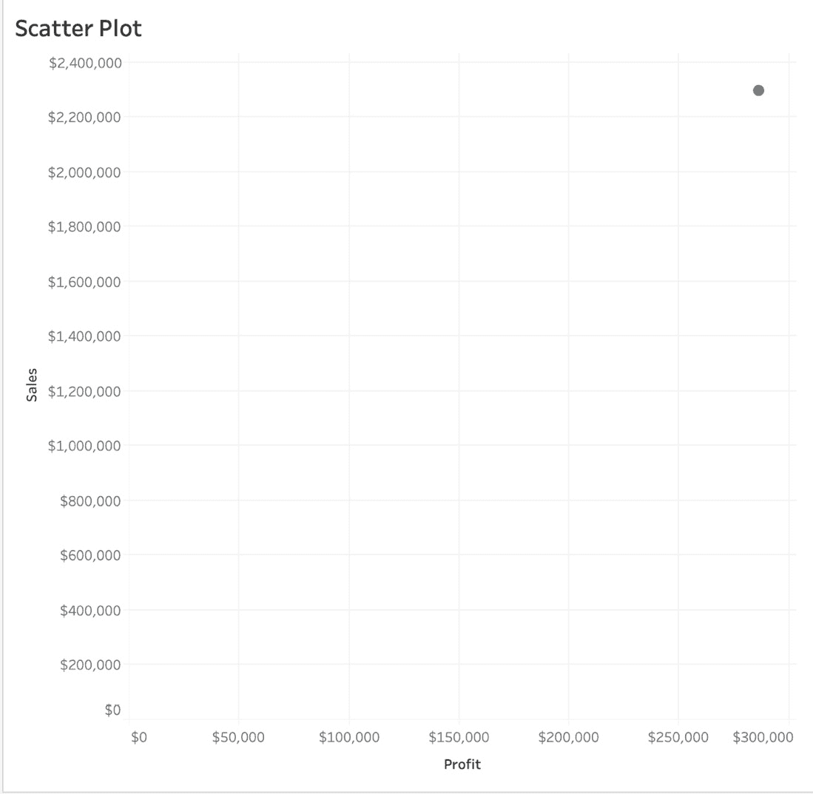

图 5.23：利润与销售的聚合散点图

一旦您将第二个度量拖到`行`架上，您就会在视图中看到一个点。默认情况下，Tableau 在将度量从`数据`面板拖到架子上时始终对度量进行聚合。这里的点代表数据集中所有记录的`销售`与`利润`的交集。您必须通过解聚度量来指定图表的详细程度。

1.  接下来，您将解聚度量以将您的聚合数据点分解成多个点。您可以通过从菜单栏中选择`分析`并取消选择`聚合度量`来完成此操作：

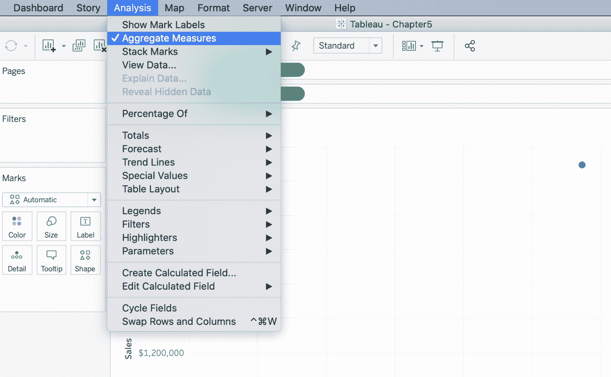

图 5.24：如何聚合/解聚度量

这将改变图表的详细程度，从数据集中所有记录的一个点到数据集中每个记录的一个点。

1.  双击标题进行修订，您的`销售`与`利润`散点图就准备好了：

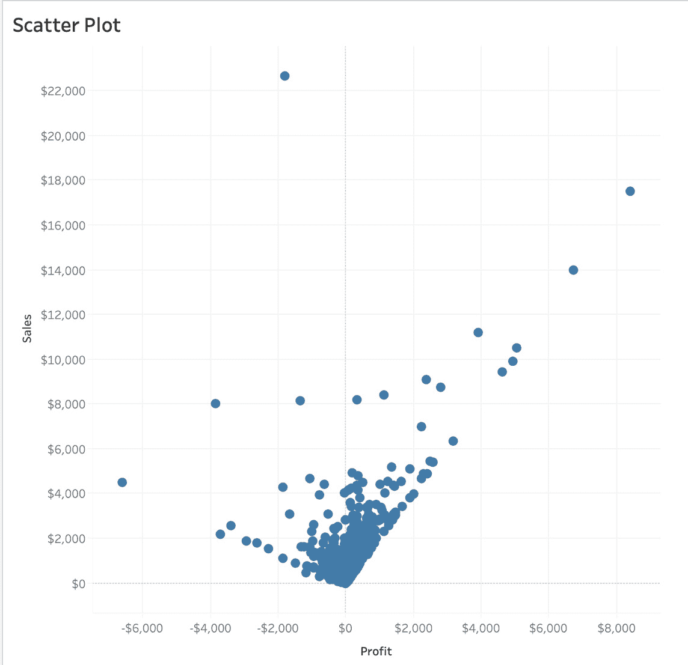

图 5.25：销售与利润的解聚散点图

在*图 5.25*中，您可以看到解聚后，数据集中的每个订单都有一个点，而不是只有一个标记/点。视图代表数据集中的每个订单及其每个订单 ID 的销售和利润。

1.  重新选择`聚合度量`。将详细程度更改为`子类别`，以便数据中的每个`子类别`都有一个点。通过将`子类别`从`数据`面板拖到`详细``标记`卡上完成此操作。接下来，将`子类别`拖到`标签``标记`卡上，以便更容易理解图表：

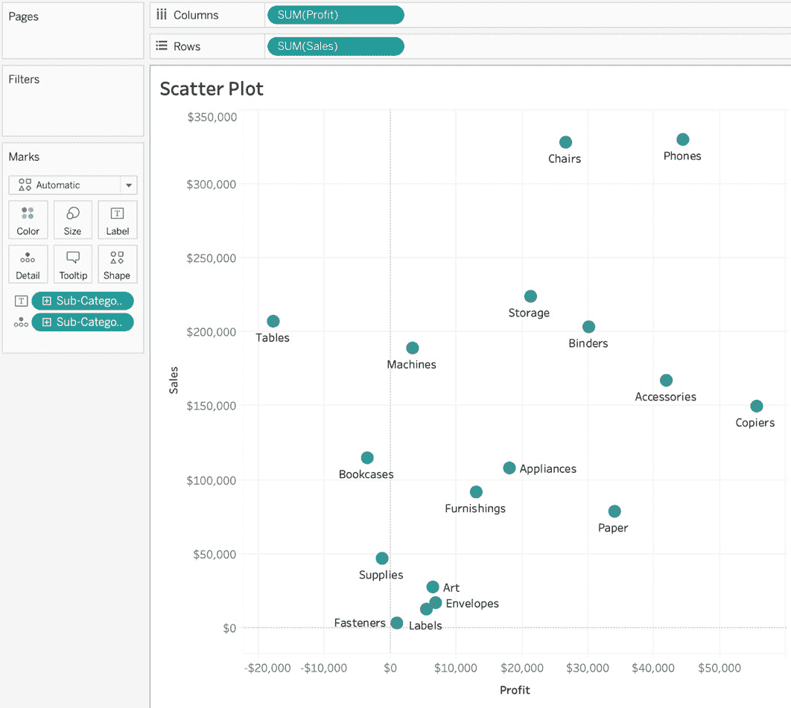

图 5.26：每个子类别的总销售额与利润的散点

在*图 5.25*中，你可以看到当细节级别从每个订单 ID 变为每个子类别时，视图中的散点数减少了。现在有一个标记代表每个子类别。

1.  为了给视图添加另一个维度，将`Category`添加到`Color` `Marks`面板中，这允许你快速识别子类别。这些类别颜色还充当高亮显示器。最终输出如下：

![图 5.27：彩色编码的子类别散点图

![img/B16342_05_27.jpg]

图 5.27：彩色编码的子类别散点图

*图 5.27*清楚地显示，`Tables`子类别带来了大约 20 万美元的销售，但却是亏损的子类别，因为`Tables`销售亏损约为 2 万美元。另一方面，`Copiers`的销售额为 15 万美元，利润超过 5 万美元。

考虑到观察这些洞察力有多容易，散点图可以是一个令人难以置信的工具，用于绘制两个度量值之间的对比。通过添加更多视觉元素，它可以转变为一个易于理解且相对容易创建的强大视觉图表。

这就完成了具有两个度量值和两个维度的散点图。接下来，你将探索趋势线，以及 Tableau 中可用的选项。

# 带有趋势线的散点图

在本节中，而不是关注趋势线所依赖的数学，你将从一个分析师/数据开发者的角度来审视它们，并了解一些在商业中的常见用例。

趋势线用于观察变量之间的关系。例如，它们可以用来查看力和加速度之间的关系，或者跟踪特定时间段内销售额和利润之间的关系。它们是基于历史数据点的统计模型，有助于根据历史数据点估计未来的模式或趋势。

在 Tableau 中添加趋势线相当简单。在本节中，你将探索可用的趋势线变体。*图 5.27*显示了 Tableau 中五种趋势线的类型。你将在本节稍后获得每个趋势线的详细定义以及它们最常见应用。

![图 5.28：Tableau 中的趋势线类型

![img/B16342_05_28.jpg]

图 5.28：Tableau 中的趋势线类型

在下一个练习中，你将使用散点图探索趋势线。

## 练习 5.05：散点图中的趋势线

你将创建散点图（如前所述），稍后将在你的图表中添加趋势线。你将使用`Sample – Superstore`数据集，到练习结束时，你将很好地掌握 Tableau 中可用的不同类型的趋势线。

执行以下步骤来完成此练习：

1.  从`Superstore`样本数据集中，将`Profit`拖到视图中的`Columns`面板。

1.  将`销售额`拖动到`行`架上。Tableau 默认将度量聚合（求和）。要更改视图的详细程度或取消聚合视图，请导航到`分析` | `取消勾选聚合度量`。

1.  为了使这些趋势线更清晰，将`订单日期`添加到`颜色`。还将`颜色`标记的不透明度格式化为`70%`，以便更容易阅读。

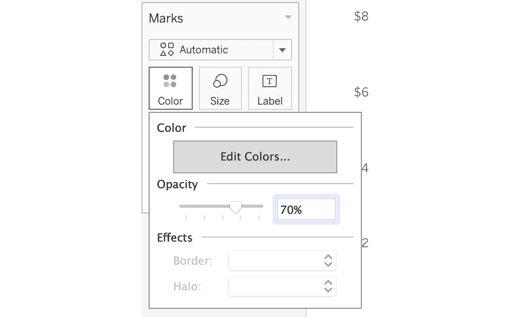

图 5.29：更改标记的不透明度

在下面的视图中，添加趋势线有三种不同的方法：

1.  `分析` | `趋势线` | `显示趋势线`：

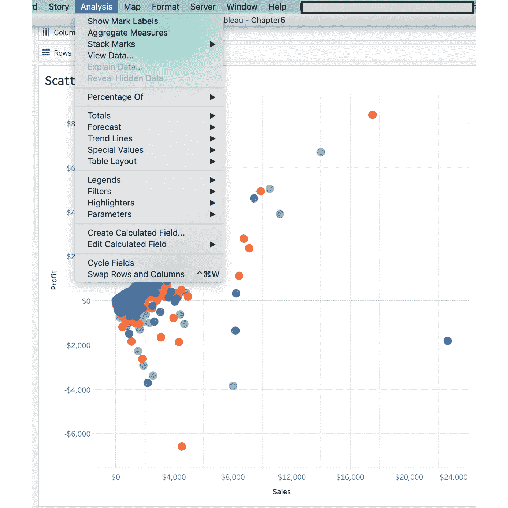

图 5.30：显示趋势线

1.  `标记`并导航到`趋势线` | `显示趋势线`：

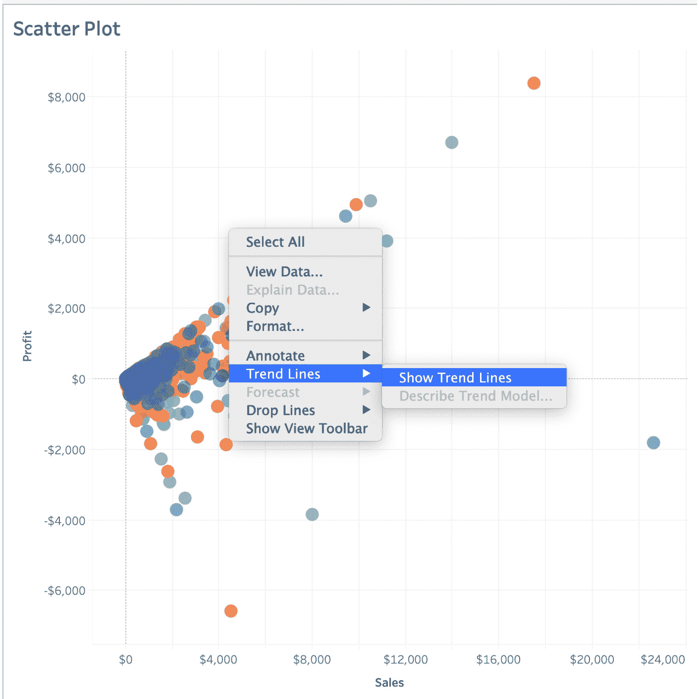

图 5.31：显示趋势线 – 2

1.  `数据`面板，是时候了。导航到`分析`面板，并将趋势线拖动到视图中。选择您可用的任何趋势线选项。

    注意

    根据您的 Tableau 版本，您将获得四种或五种趋势线选项。Tableau 10.5 之前的 Tableau 实例的用户将无法看到`Power`趋势线。本书使用 Tableau 版本 2020.X——因此，`Power`趋势线是可用的。

最终输出如下：

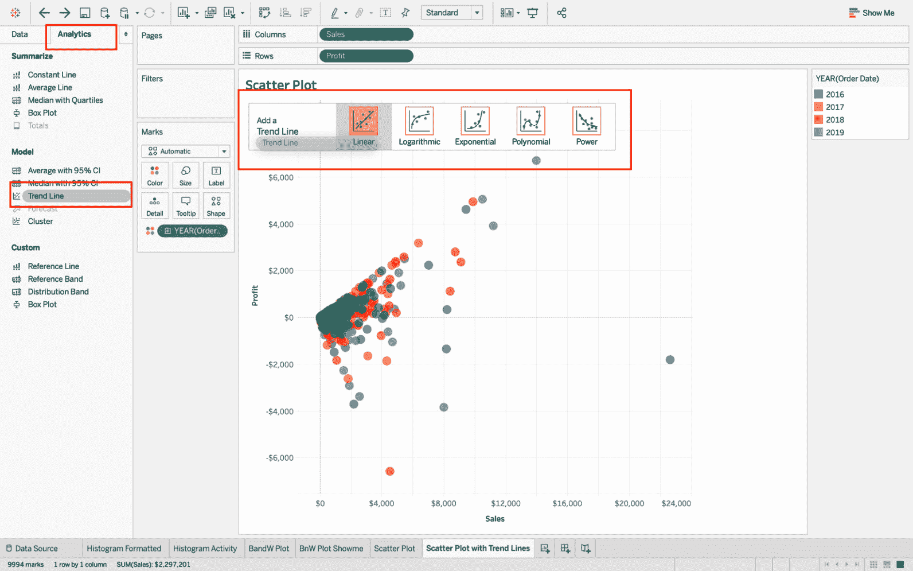

图 5.32：Tableau 中的趋势线类型

在这个练习中，您学习了如何向视图中添加趋势线的方法。接下来，您将更详细地探索每种趋势线。

## 趋势线和类型

如前所述，趋势线有助于显示视图中的整体趋势。它们还可以用于预测数据中趋势的延续。此外，通过分析潜在趋势，它们有助于识别两个变量之间的相关性。

现在，您将探索 Tableau 提供的五种趋势线中的每一种，了解它们之间的区别以及何时使用它们。

### 线性趋势线

在估计独立变量以及因变量之间的线性关系（例如，美元与其他货币之间的汇率）时，线性趋势线是最合适的线。线性趋势线有助于估计稳定增加或减少的变量。线性趋势线的公式如下：

图 5.33：线性趋势线公式

在这里，`Y` 是因变量，`x` 是自变量，它影响因变量。`m` 是趋势线的斜率，`c` 是常数（`y` 截距）。

在线性模型中，假设当一个变量增加时，第二个变量的增加/减少速率将以恒定的速率增加/减少。更常见的是，变量将接近模型绘制的趋势线。以下图显示了线性趋势线的示例：

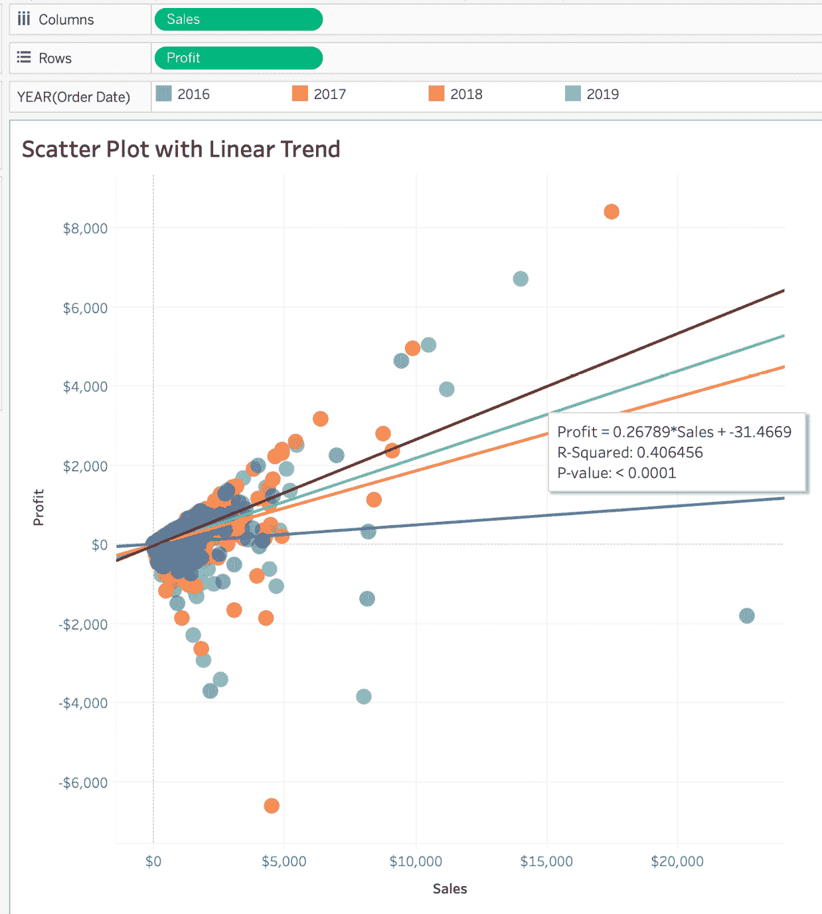

图 5.34：线性趋势线展示

### 多项式趋势线

多项式，正如其词义所示，意味着*多个项*，当你的数据有很多波动时最为适用。例如，在分析大量数据集的股票盈亏时可能会用到它。多项式趋势线的度/阶数对于确定我们数据中的波动或山峰/弯曲的数量是有用的。多项式趋势线的公式如下：

图 5.35：多项式趋势线公式

在这里，*Y*是因变量，*x*是自变量，它影响因变量；*m*是某点的斜率，*c*是常数。

以下图显示了带有多项式趋势线的散点图示例：

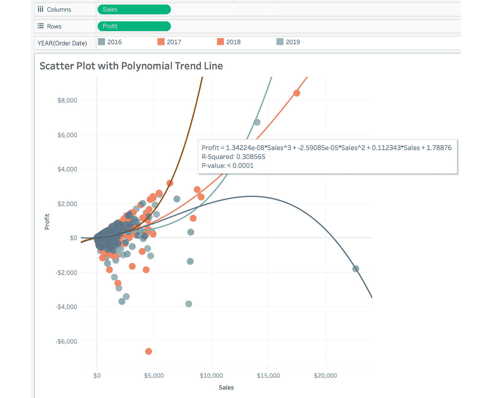

图 5.36：多项式趋势线展示

### 多项式自由度

在下面的屏幕截图中，多项式趋势线的自由度为`3`，这意味着在分析数据集后，Tableau 决定数据应该根据波动有三个弯曲/山峰。`3`的度数通常有一个或两个山峰和/或山谷。如果你想使数据更精确，对波动更敏感，可以将自由度增加到最大值 8。不妨试试看。

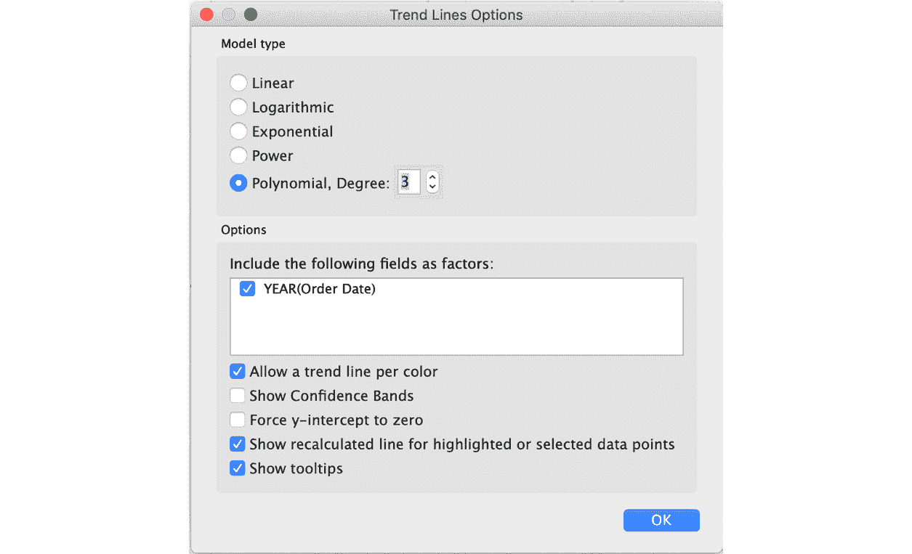

图 5.37：多项式自由度编辑

### 对数趋势线

如果变量迅速增加/减少，而速率随后平缓下来，最佳拟合线是对数趋势线。对数趋势线的一个例子是通货膨胀率，通货膨胀率可以迅速增加/减少，随着经济开始稳定，最终平缓下来。另一个例子是新手与专家的学习速率。当新手开始学习一个主题时，学习速率非常快，但随着他们掌握主题，学习速率会平缓下来。像线性趋势线一样，对数趋势线可以使用负值和正值。

图 5.38：对数趋势线公式

在这里，`Y`是因变量，`ln(X)`是对数底数，它影响因变量；`m`是斜率，`c`是常数。以下图显示了带有对数趋势线的散点图：

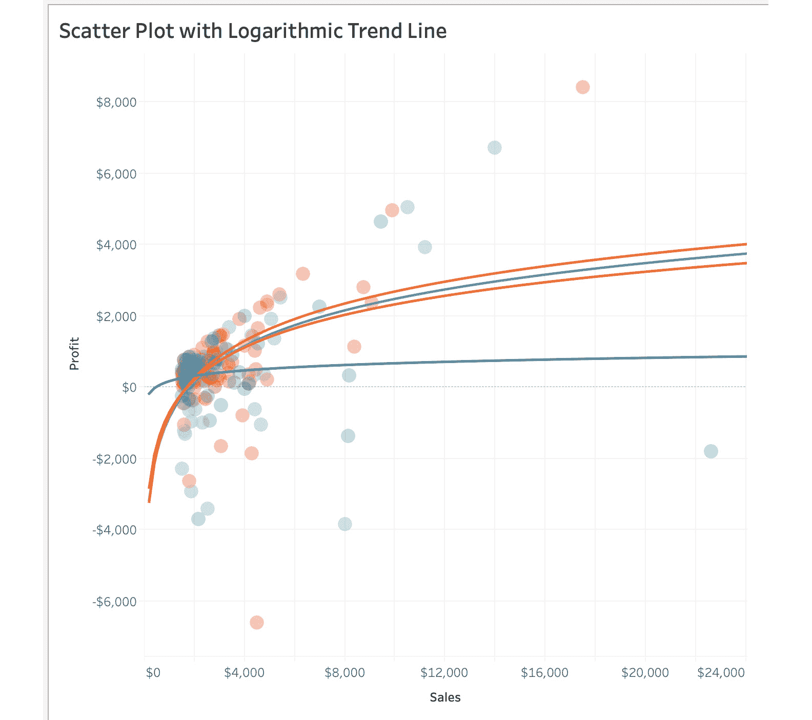

图 5.39：对数趋势线展示

注意

透明度降低，并过滤了一些数据，使其更易于阅读。

### 指数趋势线

指数趋势线是最适合的拟合线，在数据上升/下降速率陡峭时最为有用。例如，从自然界中我们可以看到病毒的传播速率是指数级的：COVID-19。指数趋势线的公式如下：

图 5.40：指数趋势线公式

在这里，*Y* 是因变量，*X* 是自变量，它影响因变量；*m* 是线的斜率，*e* 是数学常数。以下图显示了指数趋势线的执行情况：

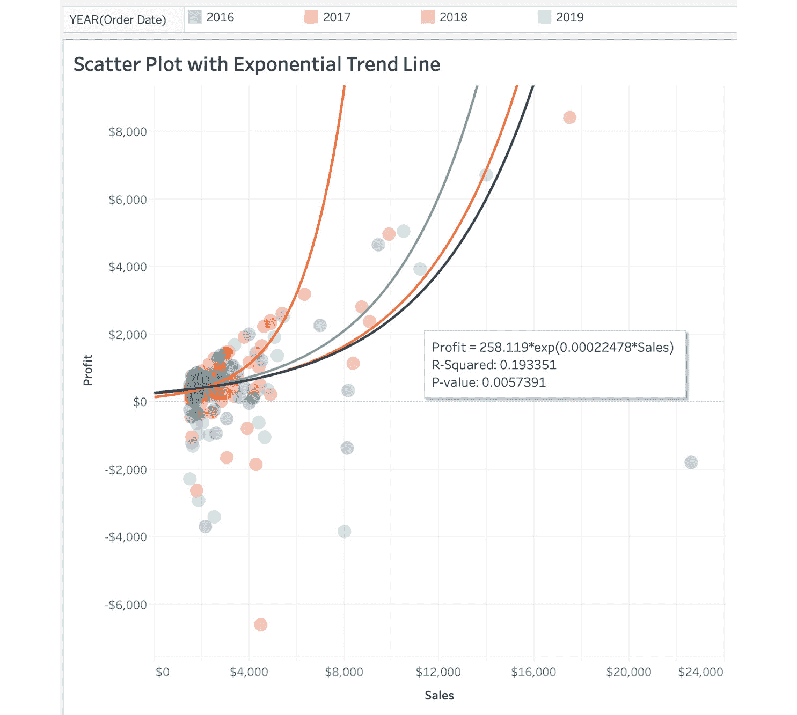

图 5.41：具有指数趋势线的散点图

### 幂趋势线

幂趋势线通常是一条曲线，当数据集中包含以特定速率增加的度量时最为有用。想想每年利率的增长率，大坝每分钟的水流速率，或者火车或汽车的加速度。尽管趋势线看起来像线性趋势线，但它不是线性的，而是曲线的。幂趋势线的公式如下：

图 5.42：幂趋势线公式

在这里，`Y` 是因变量，`X` 是自变量，它影响因变量，而 `m1` 和 `m2` 是斜率。以下图显示了具有幂趋势线的散点图：

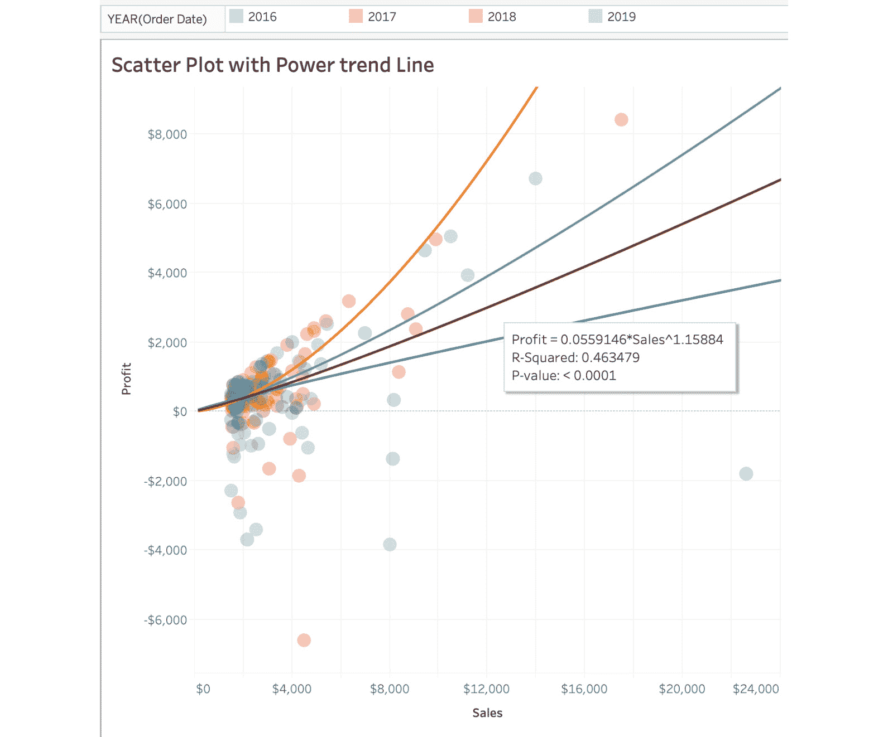

图 5.43：幂趋势线图

这总结了 Tableau 中的趋势线类型。接下来，你将探索趋势线的可靠性以及 R-squared 值和 p-value 的意义。

## 趋势线的可靠性

对于每条趋势线，你都有一个包含趋势线公式、R-squared 值和 p-value 的工具提示。例如，在幂趋势线中，作为因变量的 `Profit` 与自变量 `Sales` 的关系如下公式所示：

图 5.44：幂趋势线结果

阅读公式的办法是，对于 *Sales* 的每单位增加，*Profit* 将通过将 *Sales* 乘以 *1.158* 的 *0.5591* 次幂来计算。你现在将探索 R-squared 值和 p-value 的意义。

### R-squared

作为趋势线的终端用户，理解这些预测的可靠性非常重要。当 R-squared 值最接近 1 时，趋势线被认为是最可靠的。这表明未来数据/变量落在预测线（或接近它）内的可能性极高。

### P-value

**p 值**是一个统计函数，它量化了给定预测偶然发生的可能性。p 值越低，统计意义越显著。在功率趋势线示例中，p 值非常小（*p < 0.0001*），这意味着如果你再次收集报告中的数据点，你很可能看到相似的趋势。对于大多数用例，任何大于*p > 0.05*的 p 值都被认为是统计上不显著的，这意味着如果你重复相同的数据收集，你很可能不会得到相似的趋势，因为结果有超过 5%的可能性是由于随机性或偶然性。

这总结了关于趋势线的部分，其中你探索了 Tableau 的五个默认趋势线以及 R 平方和 p 值的重要性。在下一节中，你将通过双轴比较两个度量值。

# 高级图表

在之前的练习中，你已经探索了单度量以及多个度量之间的分布和关系，这使你能够相对较好地回答基本业务问题。但 Tableau 提供了高级图表类型，可以帮助回答像“关于按年销售利润的趋势是什么？”这样的复杂问题。你可以通过利用双轴图表轻松回答这个问题。

在本节中，你将探索以下图表类型：

+   象限图

+   组合图

+   Lollipop 图表

+   帕累托图

这当然不是 Tableau 中所有高级图表的详尽列表；还有其他有趣的图表类型，如饼图、Sparkline 图表、桑基图和瓦夫饼图。但上述图表是商业仪表板中最常用的一些基本图表，并且通常受到最终用户的欢迎。

## 象限图

象限图只是将散点图分为四个网格而不是两个部分。在之前创建的散点图中（*练习 5.04*，*创建散点图*），你比较了销售额与利润，但很难识别异常值，或者利润和销售额都高的标记，或者利润低而销售额高的标记。

象限图可以帮助。在本节中，你将创建一个象限图，如图下所示：

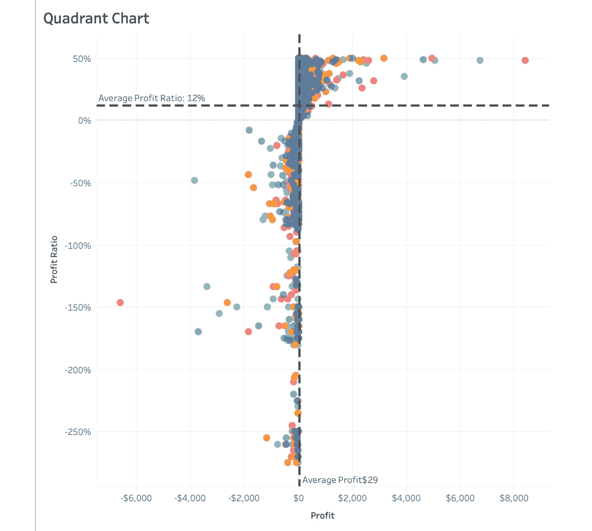

图 5.45：功率趋势线结果

在创建你的象限图之前，讨论参考线和可用的选项是很重要的。

## 参考线

参考线的作用正如其名，为我们的视图添加一个参考。你可以将参考线添加为常数或使用轴的计算值。当你添加一个计算值的参考线时，该线是动态的，并会根据该线所依赖的具体字段进行调整。

除了参考线，你还可以将置信区间添加到线上。

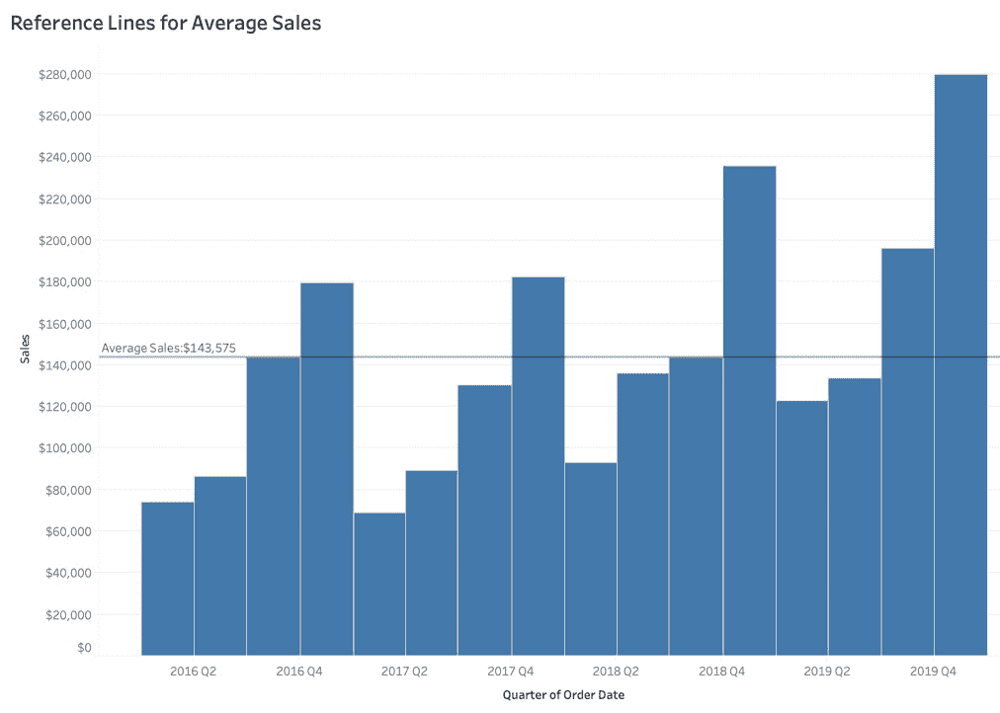

图 5.46：Superstore 数据集的平均销售额参考线

在前面的屏幕截图中，视图中添加的参考线代表数据集中每个季度的平均销售额。添加参考线有助于创建一个参考点，该参考点可以与整体视图进行比较。

### 理解参考线

为了更好地理解参考线的重要性，您现在将创建一个按年份销售的示例视图，并探索 Tableau 中可用的参考线类型：

+   **整个表格参考线**：这种类型参考线的范围是整个表格。

+   **按面板参考线**：这种类型的参考线添加到视图的每个子部分。

+   **按单元格参考线**：使用这种参考线类型，您可以为视图中每个单独的单元格添加参考线。

步骤如下：

1.  假设您已经在 Tableau 实例中打开了`Sample – Superstore`数据集，添加`YEAR(Order Date)`，然后拖动`Category`（Windows 上的*Ctrl* + 拖动或 Mac 上的*Option* + 拖动）到`列`架上。

1.  将`Sales`拖到`行`架上，为了给视图添加颜色，将`YEAR(Order Date)`拖到`颜色标记`卡上：

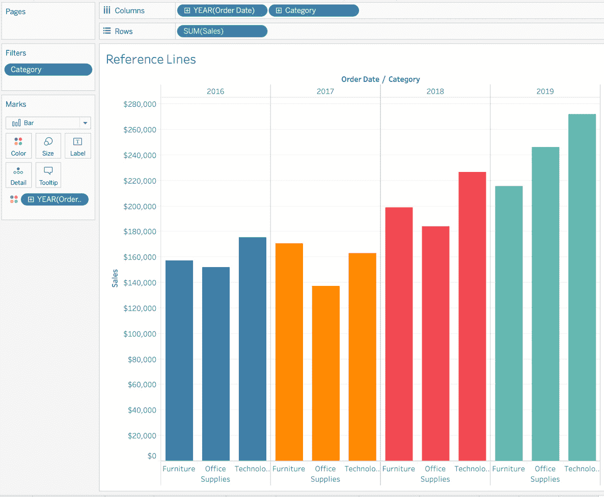

图 5.47：按类别和年份的销售

1.  导航到`Analytics`面板，选择并拖动`Reference Lines`到视图中。这样做时，您会得到三个选项：`Table`、`Pane`和`Cell`。这些都是您必须为视图选择的参考线范围。

1.  **整个表格参考线**：整个表格中参考线的范围。在这种情况下，您正在为整个表格添加平均销售额的参考线。

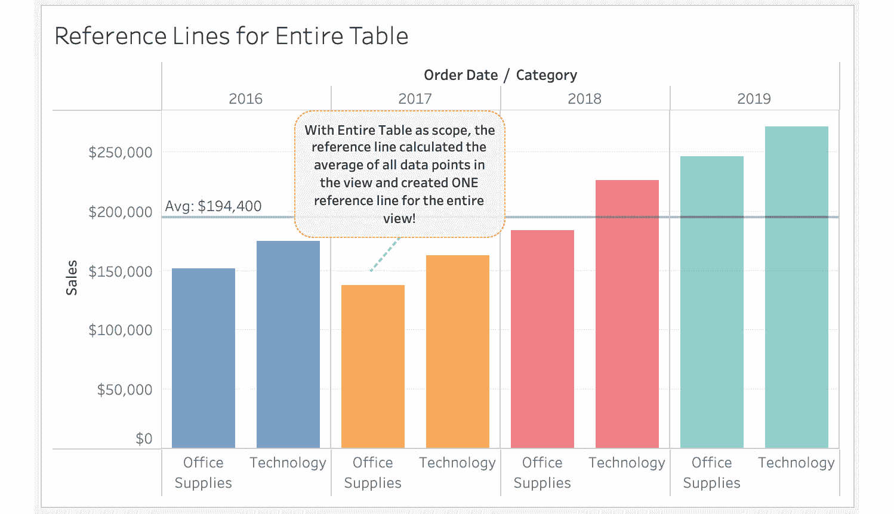

图 5.48：数据集的平均销售额

1.  **按面板参考线**：在这种类型的参考线中，参考线添加到每个类别，并按每个类别的要求计算平均值或其他任何计算。

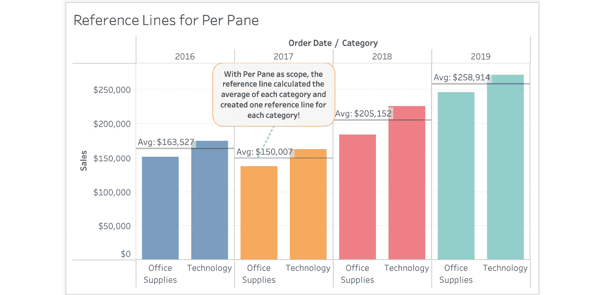

图 5.49：按年份的平均销售额

1.  **按单元格参考线**：这可能是最不常用的参考线，因为在这种情况下，它只为视图中每年的按类别销售额添加参考线，正如您在以下图中可以看到的，这只是一个位于条形图顶部的参考线。

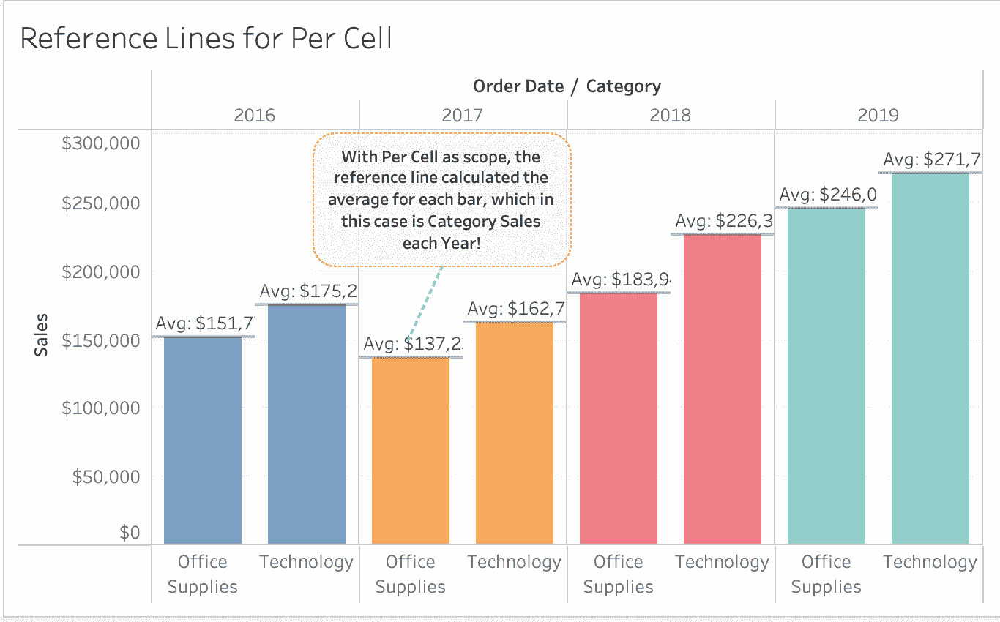

图 5.50：按类别和年份的平均销售额

1.  在前面的屏幕截图中，您可能已经注意到参考线在线的开始处有`Average Sales`标签。您可以在添加参考线到视图时添加，或者添加参考线到视图后编辑。右键单击`Reference Lines` | `Edit Reference Lines`。导航到`Label`并从下拉菜单中选择`Custom`。输入您的标签名称，使用`<Value>`（在这种情况下，`Avg: <Value>`）：

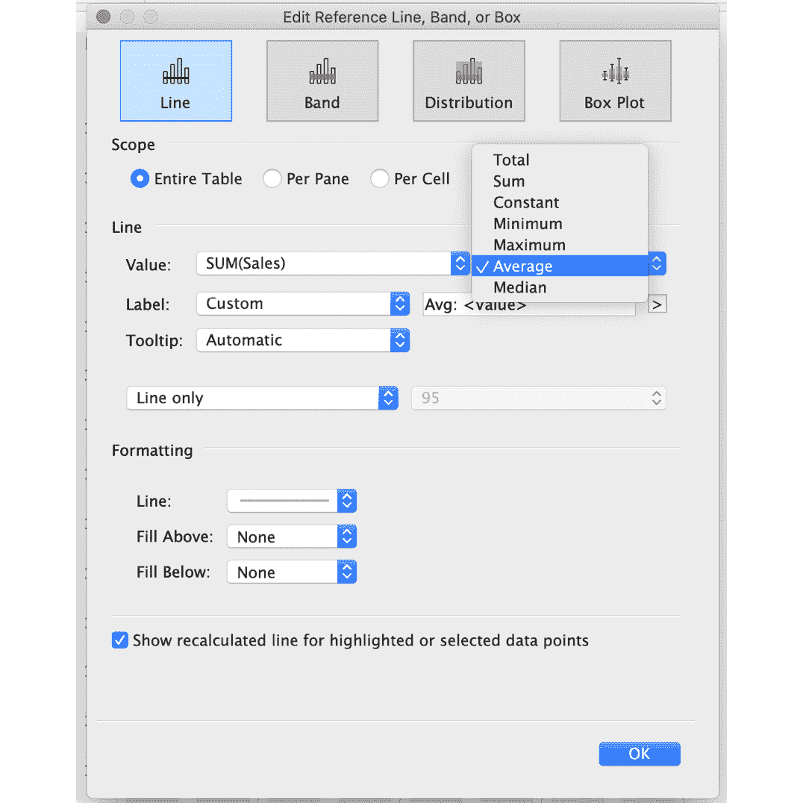

图 5.51：使用聚合选项编辑参考线

如果您想更改参考线的范围，您可以从上一步中看到的 `Edit Reference Line, Band, or Box` 窗口中编辑它。您还可以根据需要更改度量的值，例如计数、求和、最小值、最大值或其他聚合。

## 练习 5.06：创建象限图

在这个练习中，您将分析商店数据以找到所有订单的整体利润以及利润比。视图中应有一个参考点，使任何人都能快速了解利润更高和利润比更高的订单，以及利润较低和亏损更高的订单。

满足这些要求的最佳图表是象限图，因为它允许创建带有垂直和水平参考线的散点图，这将有助于创建关于利润与利润比率的参考点。

您将使用 `Sample – Superstore` 数据集。到练习结束时，您应该能够理解 Tableau 中可用的不同类型的参考线。

执行以下步骤以完成练习：

1.  在您的 Tableau 实例中打开 `Sample – Superstore` 数据集。

1.  创建利润与利润比的散点图。将 `Profit` 拖动到 `Columns` 面板，将 `Profit Ratio` 拖动到 `Rows` 面板。通过导航到 `Analysis` 并取消选中 `Aggregate Measures` 来解聚度量。

    注意

    如果您无法获得利润比，请使用 `Sales` 代替。

1.  将 `YEAR(Order Date)` (*Ctrl* + 拖动用于 Windows 和 *Option* + 拖动用于 Mac) 拖动到 `Color` `Marks` 面板：

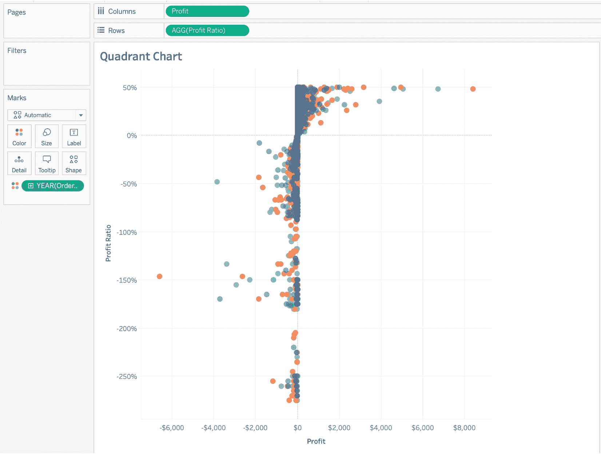

图 5.52：象限图的散点图

如您所见，您已将所有订单绘制在 x-y 轴上，其中 x 轴是 `Profit`，y 轴是 `Profit Ratio`。您还按年份对订单进行了着色编码。

1.  要添加象限，向视图中添加参考线。由于象限包含两条在中部相交的线，您将添加两条参考线——一条用于 `Average Profit`，另一条用于 `Average Profit Ratio`。

1.  导航到 `Analytics` 面板，并将 `Reference Lines` 拖动到视图中。首先，您将为 `Profit` 创建一个参考线，在这种情况下是垂直参考线。右键单击参考线以编辑 `Label` 文本和值，如 *理解参考线* 部分所述。您已将 `Average Profit: <Value>` 添加为垂直线的 `Label` `Marks` 卡。

1.  重复步骤以创建水平参考线，在这种情况下是 `Profit Ratio` 的平均水平参考线：

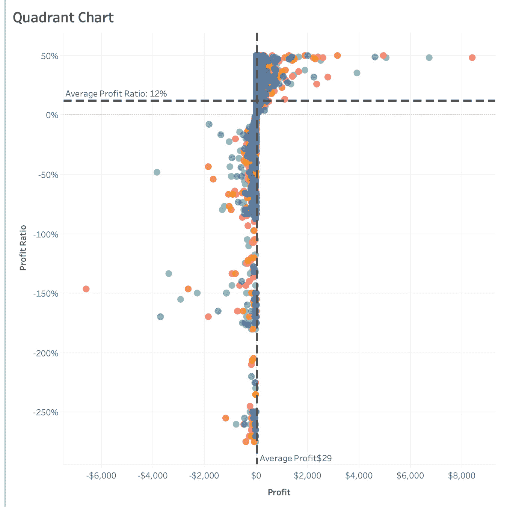

图 5.53：散点图上的参考线

在前图中，您添加了两条参考线，聚合设置为平均值。*水平参考线*代表“订单”的“平均利润率”，*垂直参考线*代表“订单”的“平均利润”。

1.  为了使观众更容易理解，您可以通过在视图中右键单击并添加注释文本来注释象限，如图下所示：

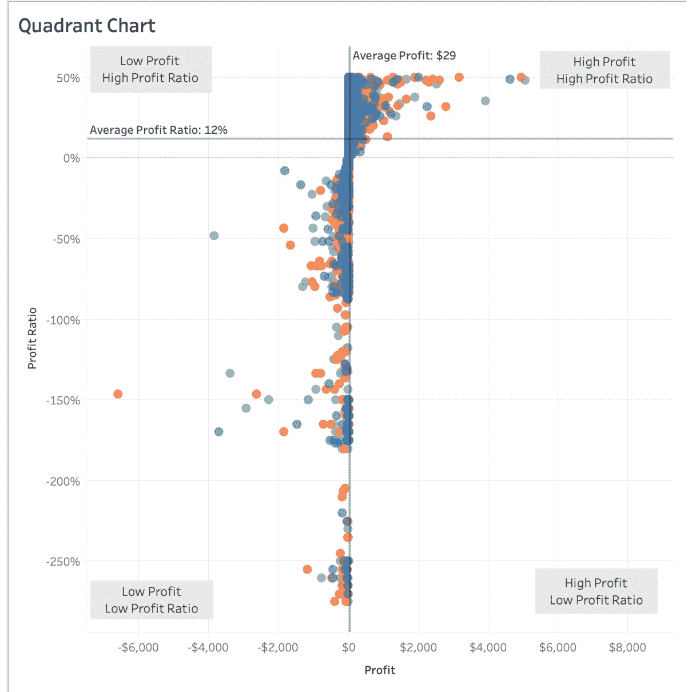

图 5.54：带注释的文本象限图

这部分关于象限图表的内容到此结束。您现在已经探索了与散点图结合的参考线，并已向视图中添加了注释，这是图表的绝佳上下文工具。接下来，您将探索双轴图表。

## 组合图表 – 双轴图表

组合图表（也称为双轴图表或组合图表）由于其灵活性和为故事讲述增加的价值而成为最受欢迎的图表类型之一。双轴图表类型本质上是将两个图表合并为一个具有共享轴的图表。例如，日期维度可以是`x`轴，您可以在同一图表上拥有两个不同的`y`轴，分别表示两个不同的度量。对于我们`Superstore`数据集的双轴图表示例将是利润与销售额随年份的趋势。在这里，`Year`将是“日期”维度（x 轴），而销售额和利润将是 y 轴。您将创建一个具有类似标记类型的双轴图表，作为本节的一部分。

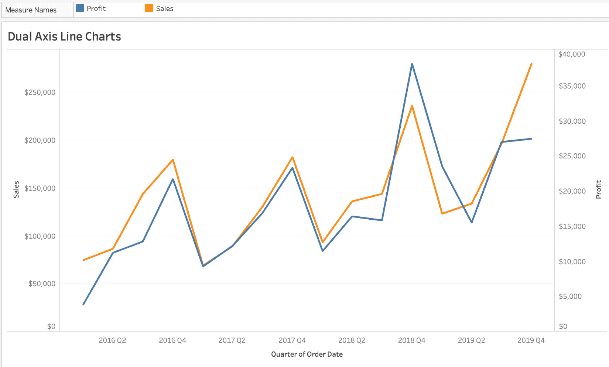

图 5.55：示例双轴折线图

如前图所示，在同一视图中存在两个折线图。蓝色线条代表按“季度”计算的“利润”，橙色线条代表按“季度”计算的“销售额”。

## 练习 5.07：创建双轴图表

现在，您将创建一个销售与利润的视图，并将在视图中显示这两个业务关键指标的趋势。视图必须按季度进行。您将使用“Sample – Superstore”数据集来创建视图。

执行以下步骤以完成此练习：

1.  在您的 Tableau 实例中打开“Sample – Superstore”数据集。

1.  将`QUARTER(Order Date)`拖到“列”架上，并在“列”架上的`QUARTER(Order Date)`上点击箭头，将维度的详细程度更改为“连续”（您也可以按 *Ctrl* + 拖动（Windows）或 *Option* + 拖动（Mac）来选择“连续”）：

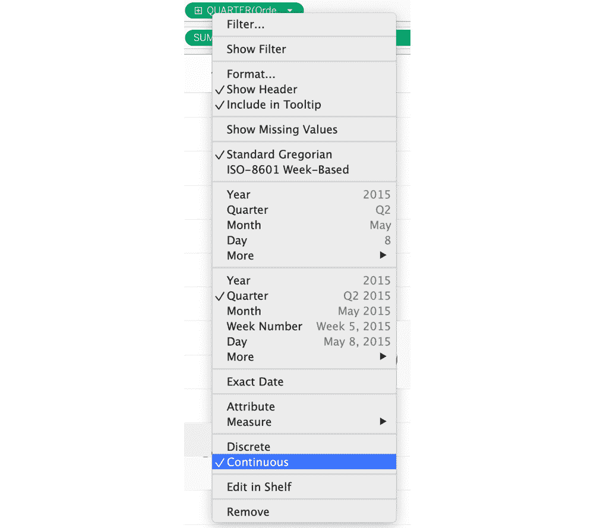

图 5.56：将日期转换为连续

1.  将“利润”和“销售额”添加到“行”架上。创建两个如图所示的柱状图。将`QUARTER(Order Date)`作为“标签”以获得更好的表示：

图 5.57：按季度显示的利润和销售额柱状图

1.  在 `Marks` 面板上，有三个部分：`All`、`SUM(Profit)` 和 `SUM(Sales)`。将单独的度量作为 `Marks` 卡片允许您分别控制这些度量。在 `All` 标记卡片（如果适用于您的 Tableau 实例）上，将 `Marks` 类型从 `Bar` 更改为 `Line`。输出结果如下所示：

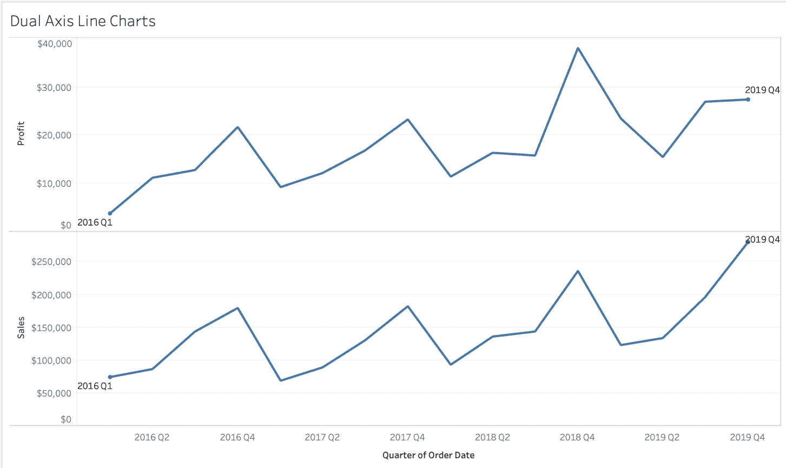

图 5.58：按季度显示的销售和利润折线图

1.  最重要的一步是在 `Rows` 面板上右键单击或单击任一度量（`Profit` 或 `Sales`）的下箭头，并勾选以选择 `Dual Axis`。

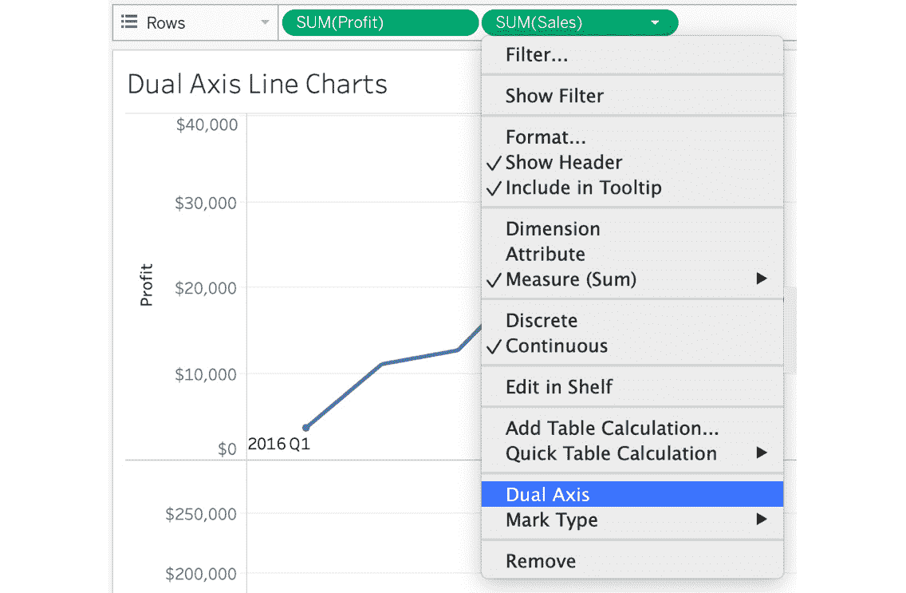

图 5.59：将两个折线图转换为双轴图表

1.  现在有两组独立的度量，`Profit` 和 `Sales`，它们共享 `Order Date` 作为共同的 *x* 轴，以及两个度量值作为 *y* 轴：

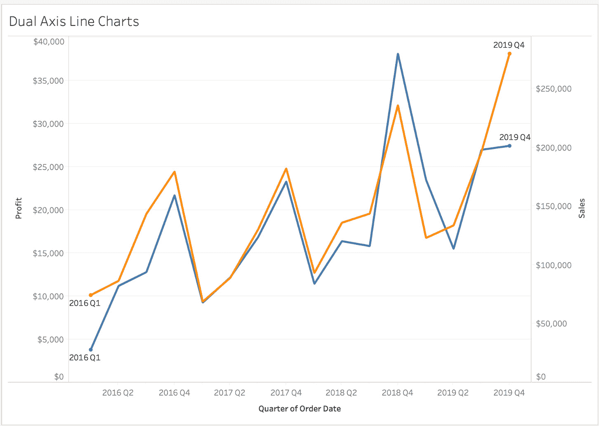

图 5.60：双轴图表 – 异步

如果您仔细观察，两个轴有不同的 `Marks`，其中 `Profit` 轴的范围是 `$0-$40,000`，而 `Sales` 范围是 `$0-$250,000`。图表描绘了一个完全错误的画面，因为两个折线图有不同的轴范围，可能会导致错误的见解。

1.  要修复异步轴，右键单击任一轴并选择 `Synchronize Axis`，这将修复问题，现在应该有两个具有相同范围的轴：

图 5.61：如何同步双轴图表

最终输出将如下所示：

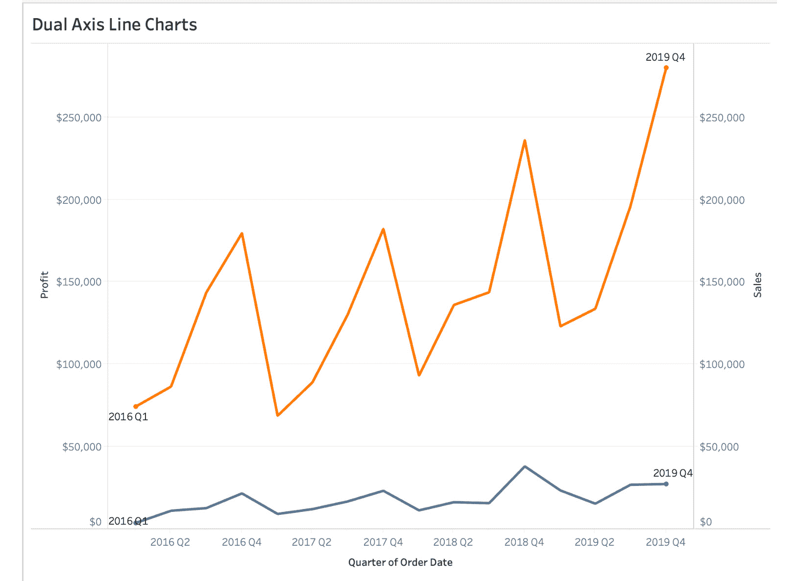

图 5.62：同步双轴图表

您现在已经创建了您的第一个双轴图表。标题或轴标签可以根据您的需求进行更改。在先前的屏幕截图中，在同步轴之后，您可以看到 `2016 Q4` 的 `Sales` 在 `$150-200K` 的范围内，而 `Profit` 在 `$0-50K` 的范围内。如果您没有同步轴，将很难理解每个折线图的销售或利润是多少。

正如您所观察到的，双轴图表，如散点图，可以是非常强大的图表，以最简洁、最相关的方式传达信息。在 *图 5.62* 中，您可以查看多年来的销售与利润增长，并在分析趋势的同时进行。

这就结束了本章的主要内容。您现在将完成一些活动，以巩固您所学到的知识。

## 活动 5.01：创建散点图

想象你是一名电子商务分析师，你的经理要求你创建一个“销售”与“利润率”的视图。（如果“利润率”对你不可用，请使用“利润”。）他们希望看到按“段”和“年份”分解的指标。您将使用散点图来实现这一点，并使用“样本 - 超级商店”数据集来满足这些要求。

**以下步骤将帮助您完成此活动：**

1.  在 Tableau 实例中打开“样本 - 超级商店”数据集。

1.  双击或拖动“利润率”到“列”架中。

1.  重复最后一步，将“销售”拖到“行”架中。

1.  通过转到“分析”并取消选择聚合度量来取消聚合度量。

1.  将“类别”添加到“颜色标记”卡中，将“段”添加到“形状标记”卡中。

1.  接下来，将“段”添加到“过滤器”中，并在您的视图中显示它。

1.  通过将“订单日期”拖到“过滤器”架中重复相同的步骤，对`YEAR(Order Date)`进行操作。

1.  通过单击或右键单击视图右上角的箭头，将视图中的两个过滤器都更改为“单值（列表）”。

1.  双击“视图标题”以更改工作表的标题为“按段和年份的散点图”。

1.  将您的颜色透明度更改为`70%`以提高可读性。

1.  您应该有以下过滤器。

最终输出将如下所示：

![图 5.63：活动最终输出]

![img/B16342_05_63.jpg]

图 5.63：活动最终输出

在此活动中，您加强了您对散点图和格式化选项的了解。

作为图表阅读练习，考虑图表右上角的圆形（“消费者”段）、红色（“技术”类别）标记类型。如您所见，这个特定的点（订单）有很高的销售额和 2019 年的高利润率。一个观察类别的经理会看到这样的异常值，现在可以采取措施在整个范围内复制这种成功。

注意

此活动的解决方案可在此处找到：[`packt.link/CTCxk`](https://packt.link/CTCxk)。

## 活动五.02：具有异步轴的双轴图表

此活动从上一个活动继续。在满足初始散点图要求后，您现在被要求创建一个双轴图表，该图表显示“折扣”如何按月影响“销售”。本质上，您被要求使用具有异步双轴的双轴图表创建按月销售与折扣的视图。

**以下步骤将帮助您完成此活动：**

1.  在您的 Tableau 实例中打开“样本 - 超级商店”数据集。

1.  创建初始柱状图，显示“按月份订单日期销售（连续）”。

1.  从“标记”卡中将图表类型从“线”更改为“柱”。

1.  将“折扣”拖到“列”架中。

1.  通过在“列”架中的任何度量上右键单击来创建双轴。

1.  从“标记”架中将“折扣”的标记类型从“柱”更改为“线”。

1.  不要同步您的轴，因为如果您这样做，则“折扣”轴的范围将是 0-120,000%，这在现实中是不存在的。

1.  通过添加“折扣”标签来格式化图表，并编辑折扣折线图的颜色为蓝色，或您喜欢的任何颜色。

最终预期输出如下：

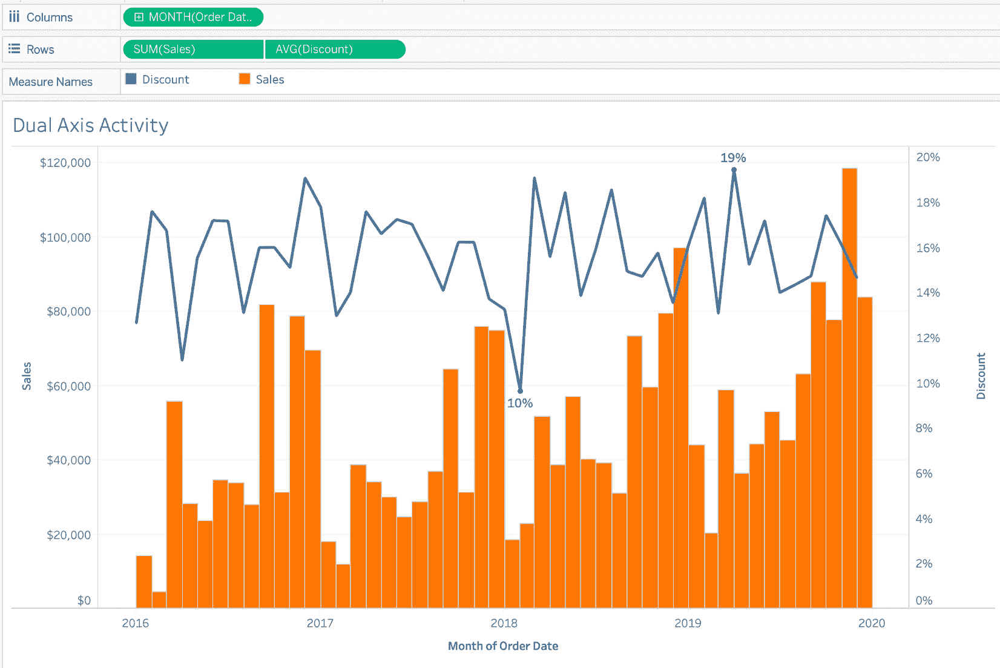

图 5.64：活动 5.02 的最终输出

在这个活动中，您为度量创建了具有不同标记类型的双轴图表，并探讨了为什么同步轴并不总是好主意，因为它可能导致过度外推或低估实际数字。

阅读前面双轴图表的方法是，比如对于 2016 年 4 月，平均折扣为 11%，而该月的“总销售额”为 $28,295。

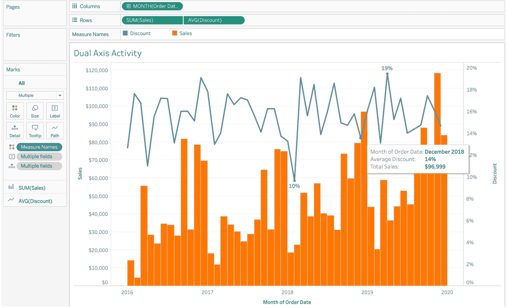

图 5.65：活动 5.02 的双轴最终输出

类似地，对于 2018 年 12 月，您应该注意到平均折扣为 14%，而该月的“总销售额”为 $96,999。如果您同步双轴，平均折扣百分比可能会在千位数，如 *图 5.73* 所示。

注意

此活动的解决方案可以在以下链接找到：[`packt.link/CTCxk`](https://packt.link/CTCxk).

# 摘要

在本章中，您通过单度量直方图、箱线图和多重度量散点图探索了分布。您还详细了解了 Tableau 中可用的趋势线类型、它们的使用原因以及哪些趋势线适用于特定情况。然后，您学习了如何检查 Tableau 创建的趋势线是否可靠，并简要提到了 R 平方值和 p 值。最后，您探索了高级图表类型，其中我们与双轴图和象限图进行了交互。最后，您完成了关于具有异步轴的双轴图表的一些活动，以及带有过滤器和形状的散点图。

您现在已达到可以开始使用您创建的所有不同类型的数据问题解答的阶段。您可以开始添加可读性元素，如果视图需要您一次性回答多个问题（例如，在双轴图表上按季度查看利润与销售趋势），您还可以创建高级可视化。

在下一章中，您将离开标准数据，转向地理数据，您将更深入地了解地图和可用的格式化选项。
