# 8. 数据分析：创建和使用表计算

概述

在本章中，你将了解 Tableau 中不同类型的表计算、它们的优点以及如何有效地使用它们。本章的目标是通过从不同的视角查看数据来理解潜在的模式，从而提高你的分析技能。到本章结束时，你将能够使用表计算在你的可视化数据上执行复杂分析。

# 简介

在任何可视化中，都会根据视图使用的维度创建一个虚拟表格。这被添加到`列`、`行`和`标记`货架中。

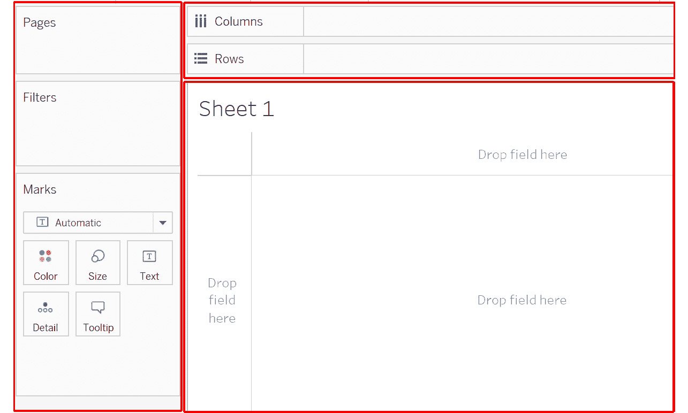

图 8.1：视图中的虚拟表格

前一个图中突出显示的区域，包括`行`、`列`和`标记`货架，将构成你的详细程度。用于放置字段的空画布轮廓包含受表计算影响的虚拟表格。

表计算简单来说就是基于作用域内的表格段进行结果计算的运算。你将在接下来的章节中详细了解段和作用域。现在，假设它是整个空画布区域。所有表计算都将在空画布轮廓或虚拟表格内进行。

在前面的章节中，你学习了以有意义的方式呈现数据可视化方法。有时你可能需要分析一个表格，例如当你想要在一个类别中找到最有利可图的子类别时。这就是表计算派上用场的时候。

在本章中，你将通过各种练习了解表计算及其应用。你还将了解表计算中包含的函数，以及如何应用它们。在整个练习中，你将使用`Sample - Superstore`数据集。

# 快速表计算

如其名所示，快速表计算允许你使用该计算类型的典型设置快速将常用的表计算应用于视图。它们节省了你从数据列字段创建计算的努力。它们内置了逻辑，因此你可以直接在视图中使用它们。以下是一些最常用的表计算：

+   `累计总和`

+   `差异`

+   `总百分比`

+   `百分比差异`

+   `百分位数`

+   `排名`

+   `移动平均`

你将首先学习如何使用`Sample - Superstore`数据集应用快速表计算。你可以通过以下系统路径找到此文件：`文档` | `我的 Tableau 存储库` | `数据源`，然后打开*Sample - Superstore.xls*文件。

首先，创建一个视图，显示`类别`与`订单日期`的`YEAR`和`利润`的`SUM`，如下所示：

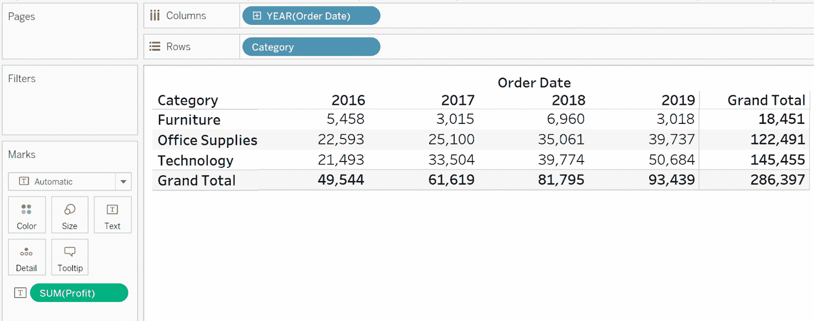

图 8.2：初始视图

表计算仅适用于度量值，因此您需要一个度量值来添加计算。要添加快速表计算，首先点击度量值下拉菜单，在本例中为`SUM(Profit)`。

![图 8.3：访问利润钻取

![图片 B16342_08_03.jpg]

图 8.3：访问利润钻取

导航到`快速表计算`菜单。

![图 8.4：各种快速表计算

![图片 B16342_08_04.jpg]

图 8.4：各种快速表计算

您可以看到有大量的快速计算可用，例如`运行总`、`百分位数`和`排名`。您现在将逐一详细了解这些计算。

## 运行总

如其名所示，`运行总`用于计算特定维度或表结构中度量的累积总和。它将前一个值与当前值相加，并在运行总中的当前值位置显示该结果。例如，假设您正在从事与汽车制造商相关的项目。此计算的常见用例可能是计算一年中每月的累积汽车销售，以找出该年的总销售额。您还可以按年度进一步计算，以找出迄今为止的总汽车销售额。下一个练习将详细介绍这一点。

## 练习 8.01：创建运行总计算

在这个练习中，您将使用`运行总`计算来计算特定类别在不同年份获得的累积利润。这允许您一起查看所有年份获得的利润，而不是单独的年份。以下步骤将帮助您完成此练习：

1.  在您的 Tableau 实例中加载`Sample – Superstore`数据集。在`连接`面板中，点击`Microsoft Excel`并导航到`文档` | `我的 Tableau 仓库` | `数据源`，然后打开`Sample - Superstore.xls`文件。

1.  创建一个视图，显示`类别`与`订单日期`的`YEAR`和`SUM(Profit)`，如下所示：

![图 8.5：运行总初始视图

![图片 B16342_08_05.jpg]

图 8.5：运行总初始视图

1.  通过选择以下突出显示的选项，将`运行总`快速计算添加到视图中：

![图 8.6：访问快速表计算 | 运行总

![图片 B16342_08_06.jpg]

图 8.6：访问快速表计算 | 运行总

1.  以下视图显示了最终输出：

![图 8.7：最终输出

![图片 B16342_08_07.jpg]

图 8.7：最终输出

如您所见，通过比较前一个图（最终视图）和下一个图（初始视图），利润是通过累加前一年的利润以及当年的利润来累计的。例如，对于`家具`类别，运行总下的第二个值是通过前一个值和当前值计算的，即 5,458 + 3,015 = 8,473，其他值也是以类似的方式进行计算。

![图 8.8：初始视图

![图片 B16342_08_08.jpg]

图 8.8：初始视图

此视图有助于计算不同类别逐年累积的利润，以及识别哪些类别表现良好，哪些没有。这些洞察可以帮助您做出重要的业务决策，了解哪些产品可以用来产生更高的利润。

接下来，您将了解`差异`表计算。

## 差异

`差异`，正如其名所示，用于计算特定维度或表结构中一个度量值与其前一个值之间的差异。通常，您可能需要分析各个类别与过去的表现相比如何，即比较上一季度的产品销售。继续使用汽车制造商的例子，应用此计算的一个常见场景是将一年的月份销售进行比较。这允许您找出总销售额与上个月相比是增加还是减少。在接下来的练习中，您将学习如何将`差异`表计算应用于工作表。

## 练习 8.02：创建差异计算

在这个练习中，您将计算一个类别的跨年利润差异。这将帮助您分析该类别是否盈利：

1.  在您的 Tableau 实例中加载`Sample – Superstore`数据集。

1.  创建一个视图，显示`类别`与`YEAR(Order Date)`和`SUM(Profit)`的关系，如下所示：

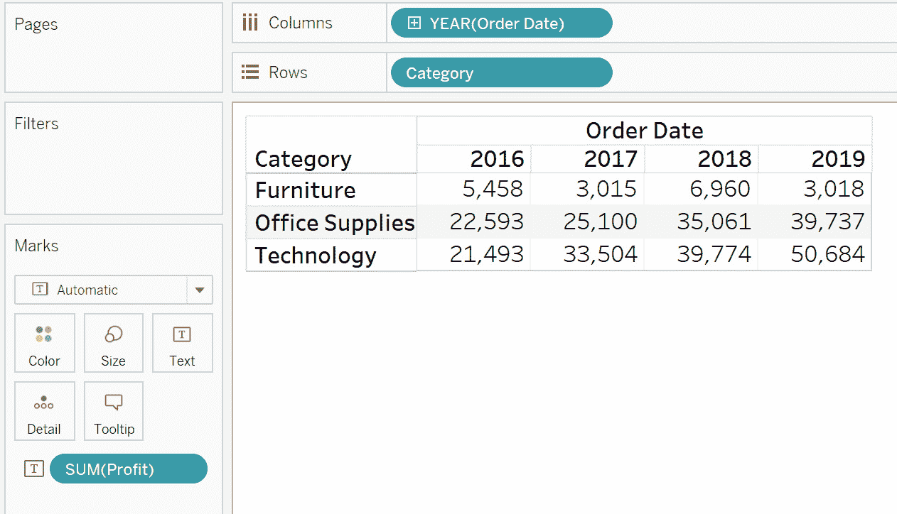

图 8.9：初始视图

1.  将`差异`快速计算添加到视图中，如图所示：

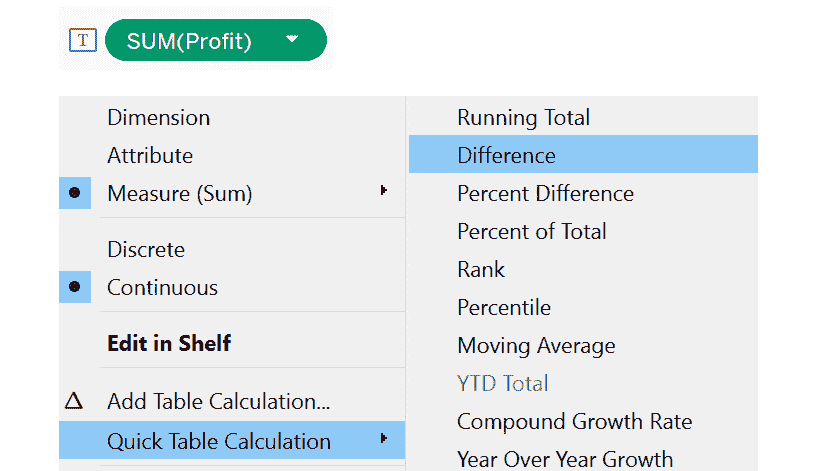

图 8.10：访问快速表计算差异

最终视图将如下所示：

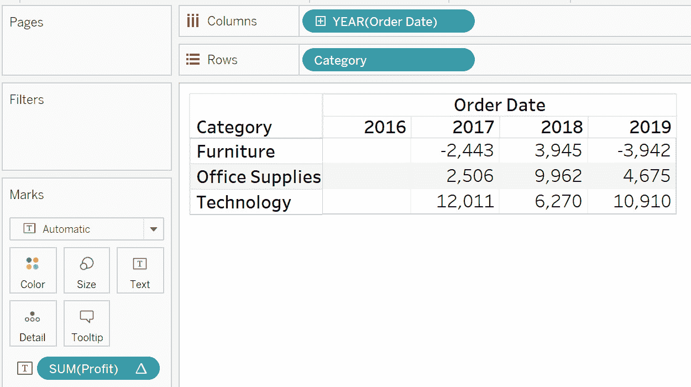

图 8.11：最终输出

如您所见，结果是当年利润与上年利润之间的差异；例如，对于`家具`，`差异`下的第二个值是通过前一个值和当前值计算得出的，即 3,015 – 5,458 = -2,443。其他类别也是以类似的方式进行计算的。在此需要注意的是，第一年的值将始终为空，因为没有东西可以用来计算差异。

在下一节中，您将了解`总计百分比`表计算。

## 总计百分比

`总计百分比`计算用于计算特定维度或表结构中一个度量的百分比分布。例如，如果您正在分析在多个国家运营的项目，您可以计算每个国家占总收入的比例。这反过来可以突出表现不佳的国家，以及表现较好的国家。

您将在下一个练习中使用此计算。

## 练习 8.03：创建总计百分比计算

在这个练习中，您将为不同年份的类别计算`总计百分比`利润。通过这样做，您可以了解每个类别对年度利润的贡献。完成以下步骤以完成此练习：

1.  在您的 Tableau 实例中加载`Sample – Superstore`数据集。

1.  创建一个视图，显示`类别`与`订单日期的年份`和`利润总和`的关系，如下所示：

![图 8.12：初始视图

![img/B16342_08_09.jpg]

图 8.12：初始视图

1.  将`总计百分比`快速计算添加到视图中

![图 8.13：访问快速表格计算 | 总计百分比

![img/B16342_08_13.jpg]

图 8.13：访问快速表格计算 | 总计百分比

以下视图是最终输出：

![图 8.14：最终输出

![img/B16342_08_14.jpg]

图 8.14：最终输出

您可以看到利润已经被转换为所有年份利润的百分比。例如，对于`家具`类别，您可以首先计算所有年份利润的总和，总计为 18,451。然后，将每年的利润除以这个数字。所以，对于 2016 年，您可以计算为 5,458 / 18,451，即 29.58%。

此视图有助于找出哪一年对每个类别的利润生成更有利。下一步是识别那些年份利润更高的模式，并尝试复制这些模式以在当年产生类似或更高的利润。

下一节将探讨`百分比差异`表格计算。

## 百分比差异

如其名所示，`百分比差异`用于计算特定维度或表结构中度量值的百分比分布的变化。此计算首先从其前一个值中减去一个值，然后计算百分比变化。如您所注意到的，此表格计算是`差异`和`总计百分比`计算的组合。使用百分比的原因是绝对数字并不总是能展示完整的画面。例如，销售 10 辆法拉利汽车将比销售 50 辆本田汽车产生更多的利润。但如果你用实际数字进行比较，数据会说本田更有利可图，尽管实际上法拉利更有利可图。

您将在下一练习中了解更多关于使用此计算的方法。

## 练习 8.04：创建百分比差异计算

在这个练习中，您将为特定类别的不同年份计算`百分比差异`。这将帮助您从百分比的角度分析各种类别的利润差异：

1.  在您的 Tableau 实例中加载`Sample – Superstore`数据集。

1.  创建一个视图，显示`类别`与`订单日期的年份`和`利润总和`的关系，如下所示：

![图 8.15：初始视图

![img/B16342_08_15.jpg]

图 8.15：初始视图

1.  将`百分比差异`快速计算添加到视图中：

![图 8.16：访问快速表格计算 | 百分比差异

![img/B16342_08_16.jpg]

图 8.16：访问快速表计算 | 百分比差异

以下图显示了最终输出：

![Figure 8.17: Final output]

![img/B16342_08_17.jpg]

图 8.17：最终输出

如您所见，输出显示了当前值与上一值的差异，除以上一值；对于`家具`类别，2016 年的百分比差异计算为 3,015 – 5,458 / 5,458，结果为`-44.8%`。

这种视图有助于按百分比比较各个类别的利润，并确定每个类别与上一年相比的表现如何。这可以帮助您了解该类别与上一年相比是否表现更好（或不是）。您可以进一步调查表现差异的原因，并据此采取行动。

接下来，您将学习关于`排名`和`百分位数`的表计算。

## 百分位数和排名

`百分位数`，如您所猜，用于计算特定维度或表结构中测量的百分位数。同样，`排名`将在特定维度或表结构中对测量进行排名。您将在下一练习中详细了解这些内容。

## 练习 8.05：创建百分位数和排名计算

在这个练习中，您将为特定类别计算不同年份的`百分位数`和`排名`。这将帮助您了解不同年份各种类别产生了多少利润。按照以下步骤完成此练习：

1.  在您的 Tableau 实例中加载`Sample – Superstore`数据集。

1.  创建一个视图，显示`类别`与`YEAR(Order Date)`和`SUM(Profit)`的关系。

![Figure 8.18: Initial view]

![img/B16342_08_09.jpg]

图 8.18：初始视图

1.  将`排名`快速计算添加到视图中，如图下所示：

![Figure 8.19: Accessing quick table calculation | rank]

![img/B16342_08_19.jpg]

图 8.19：访问快速表计算 | 排名

以下视图将是`排名`的最终输出。输出是根据`SUM(Profit)`的降序值进行排名的：

![Figure 8.20: Rank output on selecting the Rank quick table calculation]

![img/B16342_08_20.jpg]

图 8.20：选择排名快速表计算后的排名输出

1.  类似地，通过选择`百分位数`快速表计算将`百分位数`快速计算添加到视图中。以下图显示了此输出的最终结果：

![Figure 8.21: Percentile output on selecting the Percentile quick table calculation]

![img/B16342_08_21.jpg]

图 8.21：选择百分位数快速表计算后的百分位数输出

使用“排名”计算，你根据利润总和对特定类别的每一年进行了排名。前面的图显示了“百分位数”操作。对于“家具”类别，2016 年的利润处于第 0 百分位数，这意味着低于 3,015 美元的数据占 0%。同样，对于 2017 年，利润为 6,960 美元，处于第 100 百分位数，这意味着所有其他年份的利润都低于这个值。此视图可以帮助你按百分位数和排名逐年比较单个类别的利润，以确定每个类别与上一年相比的表现。

接下来，你将学习关于“移动平均”快速表格计算。

## 移动平均

“移动平均”用于计算特定维度或表格结构中动态范围内的度量值的平均值，而不是静态的。使用移动平均的优势在于，更重视近期历史数据的值，而不是使用所有历史数据。移动平均通常用于识别股价趋势，你可以分析 20 日移动平均（过去 20 天的股价），或 50 日移动平均（过去 50 天的股价），以了解股价的走势。下一项练习将详细探讨这一点。

## 练习 8.06：创建移动平均计算

在这个练习中，你将计算特定类别在不同年份获得的利润的移动平均。这将帮助你了解平均值是否高于或低于上一年的利润：

1.  在你的 Tableau 实例中加载“Sample – Superstore”数据集。

1.  创建一个视图，显示“类别”与“订单日期”的年份和“利润总和”。


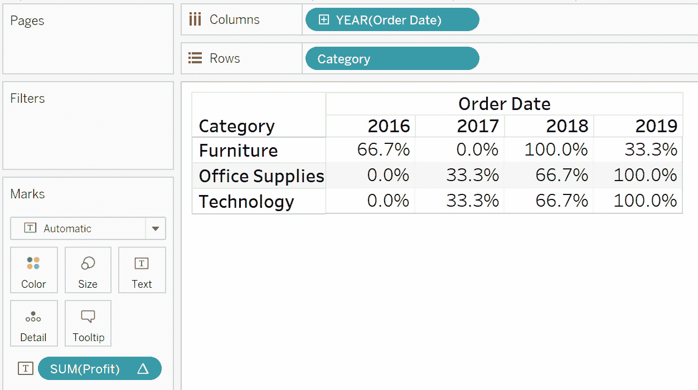

图 8.22：初始视图

1.  添加“移动平均”快速计算，如图所示：

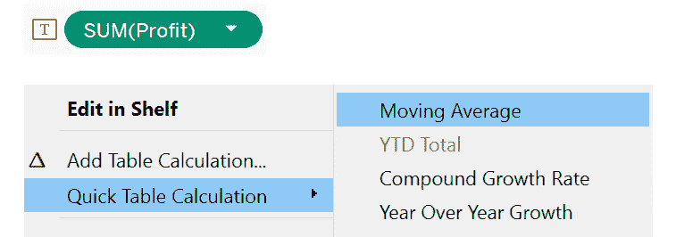


此视图将是最终输出：

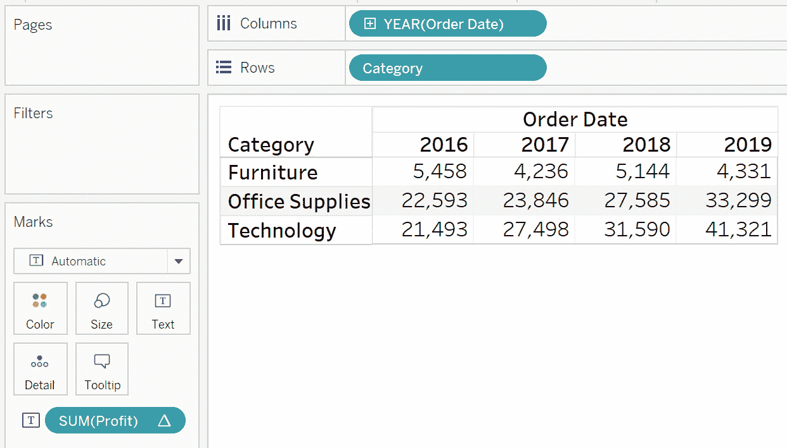


图 8.24：最终输出

如你所见，利润已经平均分布在所有年份的利润总额上。首先，计算所有年份利润的总和，然后，将这个数字除以年数。例如，对于 2017 年，移动平均为 8,473 / 2 = 4,236。

# 表格计算应用：地址和分区

在上一节中，你学习了快速表格计算。但你注意到所有这些计算都是在行级别进行的吗？如果你需要将计算应用于列级别呢？这就是地址和分区概念发挥作用的地方。

处理意味着定义计算的方向。一个计算可以水平或垂直计算，具体取决于所选选项。分区可以定义为计算的范畴；例如，你可以将视图分区为不同类别的各种年份，或者相同年份的各种类别。

在本节中，你将了解以下处理和分区数据的方法：

+   `Table(across)`

+   `Table(down)`

+   `Table(across then down)`

+   `Table(down then across)`

+   `Pane(down)`

+   `Pane(across then down)`

+   `Pane(down then across)`

+   `Cell`

+   `Specific Dimensions`

你将继续使用之前练习中使用的相同示例进行工作。首先，你将探索处理数据的不同方式。

## Table (across)

`Table(across)`在表格中水平计算，并在每一行后重新开始。例如，假设你有一个行上的各种产品名称的年份在`Columns`架子上，以及它们的销售额。在这里，`Table(across)`将对单个产品的所有年份的销售额进行计算，然后为下一个产品重新开始。下一项练习将详细探讨这一点。

## 练习 8.07：创建 Table (across) 计算

以汽车制造商的销售额为例，假设你想比较不同年份的销售额。在这个练习中，你将使用`Table(across)`计算来找到这个。以下步骤将帮助你完成这个练习：

1.  在你的 Tableau 实例中加载`Sample – Superstore`数据集。

1.  创建一个显示`Category`与`YEAR(Order Date)`和`SUM(Profit)`的视图。


图 8.25：初始视图

1.  添加`Running Total`快速计算以获得以下视图：

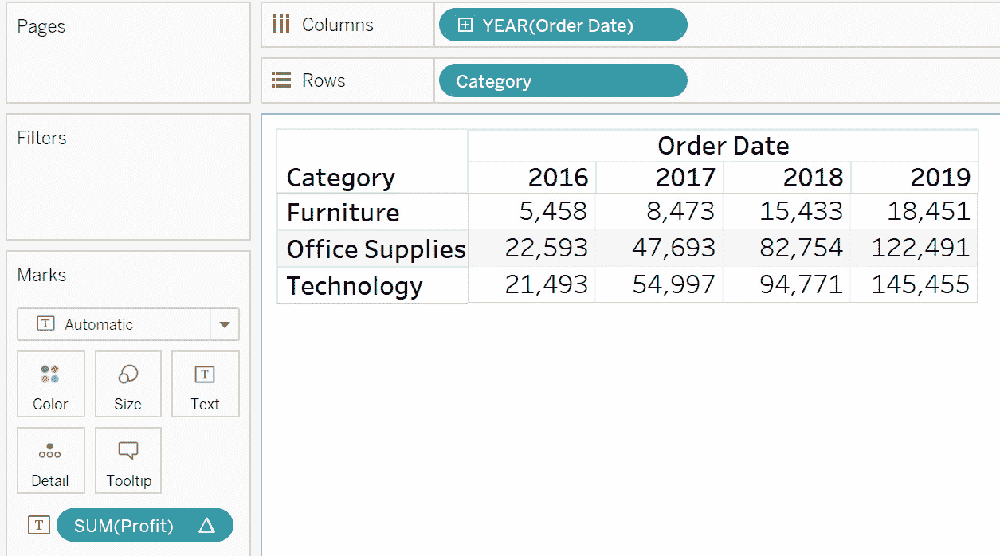

图 8.26：SUM(Profit)的累计总和

1.  现在，选择`Compute Using`然后选择`Table(across)`，如图所示

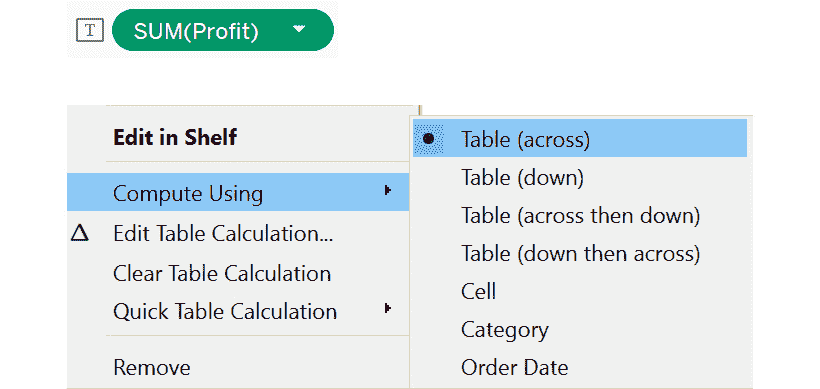

图 8.27：选择表格（横向）

下一个图显示了最终视图。你可以看到，`Profit`表格计算是针对每个`Category`（分区）在不同`Order Date`年份（处理）进行的：

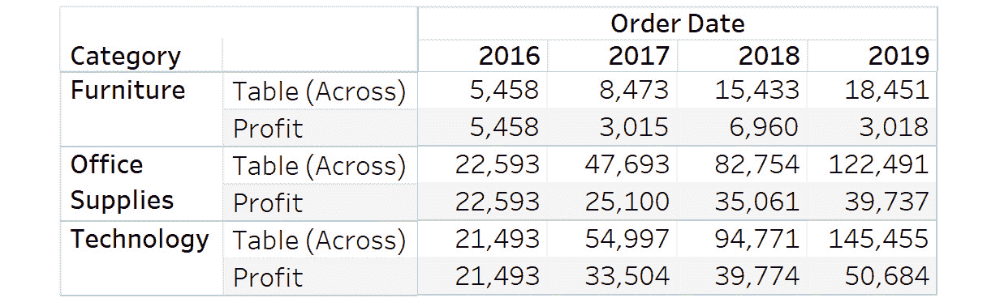

图 8.28：最终输出

这个视图有助于找到多年来各种类别的累计利润。这可以帮助你了解每个类别与其他类别相比的表现如何。

接下来，你将了解`Table(down)`计算。

## Table (down)

`Table(down)`沿着表格垂直计算，并在每一列后重新开始。例如，假设你有一个产品名称（及其销售额）在行上的`Columns`架上的各种年份。`Table(down)`将计算一个产品在单个年份的所有销售额，然后在下一个产品处重新开始。

## 练习 8.08：创建 Table (down) 计算

对于这个练习，你将使用`Table(down)`计算按年比较各种年份的销售。这将帮助你比较年份的利润，并帮助你了解销售是改善还是下降：

1.  在你的 Tableau 实例中加载`Sample – Superstore`数据集。

1.  创建一个视图，显示`Category`与`YEAR(Order Date)`和`SUM(Profit)`的关系。


图 8.29：初始视图

1.  添加`Running Total`快速计算以获得以下视图。这是默认的，即横向或水平方向：

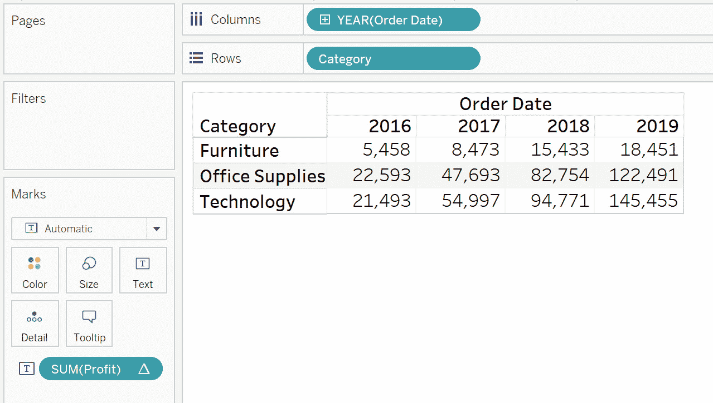

图 8.30：SUM(Profit)的累积总和

1.  选择`Compute Using`然后`Table(down)`，如下所示：

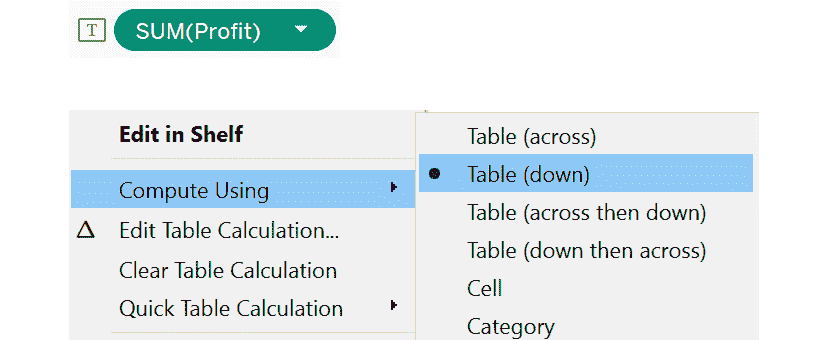

图 8.31：访问计算使用 | 表 (down)

1.  以下图显示了最终视图。你可以看到，`Profit`表计算是针对每个`Order Date`年份（分区）的三个`Category`值（处理）进行的：

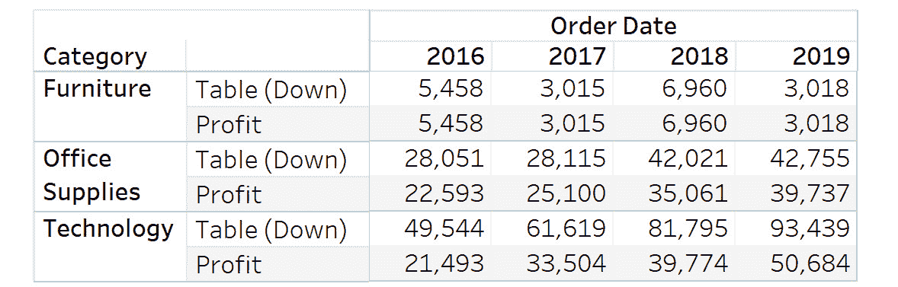

图 8.32：最终输出

这种视图可以帮助你根据多年的利润来了解每个类别是如何表现的。你可能会基于这些结果做出重要的商业决策。

接下来，你将一起学习`Table(across then down)`和`Table(down then across)`。这两个是相反的。`Table(across then down)`在表格中水平计算，并将每行的末尾值加到下一行的第一个值上。`Table(down then across)`垂直沿表格进行计算，并将每列的末尾值加到下一列的第一个值上。

在`Table(down)`和`Table(across)`练习中，你将每个列或行的末尾总和视为单独的值。因此，你得到了不同处理结果的比较。对于`Table(across then down)`和`Table(down then across)`，当前行/列的值将是之前行/列与当前行/列的结果。

考虑到之前汽车制造商销售示例，假设你执行了`Table(down)`然后`Table(across)`销售；Tableau 会首先计算当前年度所有产品的销售，然后将该值加到下一年的值上。因此，对于当前年份，你会得到前几年和当前年份的销售累积值。

## 练习 8.09：创建 Table (across then down) 和 Table (down then across) 计算

在这个练习中，你将继续使用之前练习中使用的示例，并使用`Table(across then down)`和`Table(down then across)`计算。以下步骤将帮助你完成这个练习：

1.  在你的 Tableau 实例中加载`Sample – Superstore`数据集。

1.  创建一个视图，显示`Category`和`Sub-Category`相对于`YEAR(Order Date)`和`SUM(Profit)`，如下所示。通过将`Category`放在`Filters`面板上，对`Category: Technology`进行筛选：

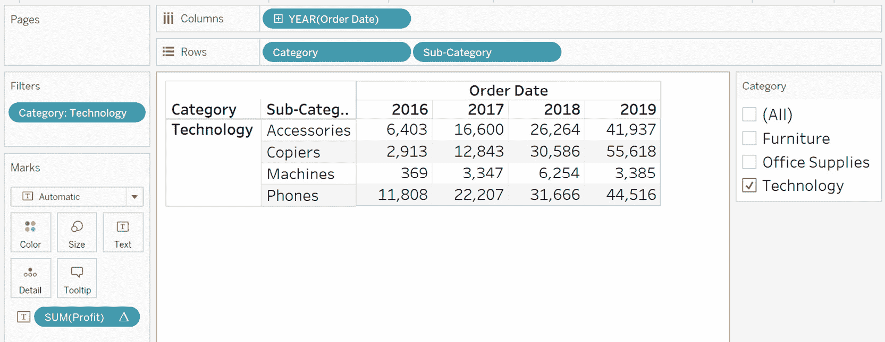


图 8.33：表（跨后下）的初始视图

1.  添加`Running Total`快速计算以获得以下视图。在这里，您可以得到所有年份的子类别的累积利润。默认的地址会是`Table(across)`：

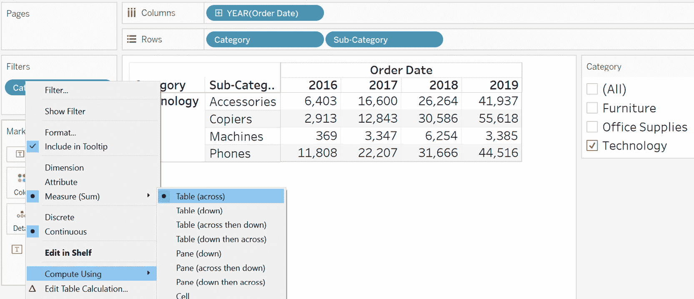


图 8.34：SUM(Profit)的累计总和

1.  选择`Compute Using`，然后选择`Table(across then down)`。

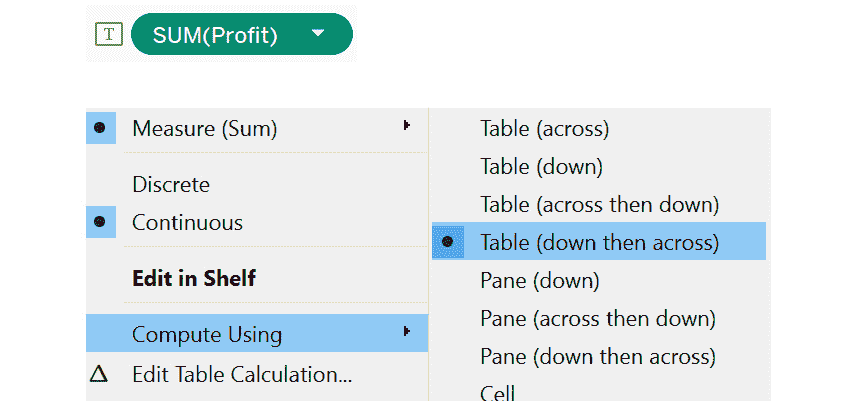

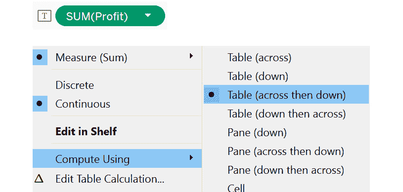

图 8.35：访问计算使用 | 表（跨后下）

以下为生成的视图。您可以通过以下图中的线条来了解计算过程：

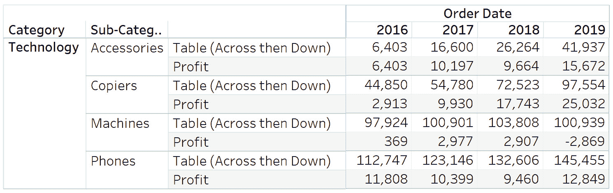


图 8.36：表（跨后下）的工作原理

首先，对“配件”执行`Table(across)`计算（见橙色线条）。然后，通过`Table(down)`（绿色线条）计算该总额（$41,937），加上“复印机”的利润（$2,913），得到$44,850。这个过程会一直重复，直到表格结束。

1.  要将其更改为`Table(down then across)`，请选择`Compute Using`，然后选择`Table(down then across)`，如下所示：


图 8.37：访问计算使用 | 表（下后跨）

这将是生成的视图。同样，您可以跟随线条来了解计算过程。这与`Table(across then down)`的工作方式正好相反：

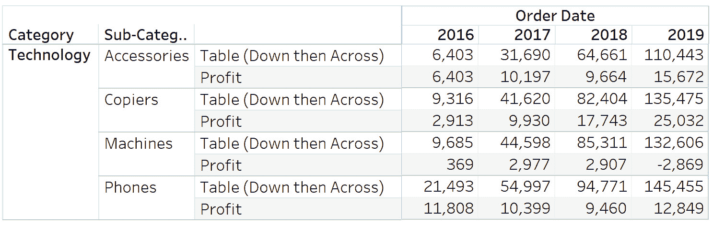


图 8.38：表（下后跨）的工作原理

如您所见，首先按向下方向添加利润，然后将这个总和跨到不同的年份。这个过程会一直持续到最后一年的数据。这个视图可以帮助您了解基于之前年份汇总的利润，不同子类别的表现情况。

接下来，您将学习关于窗格的内容。表计算可以在窗格上下或左右进行，具体取决于计算类型。窗格可以定义为由`Rows`和`Columns`面板上的字段组成的单元格组合，如下截图所示：

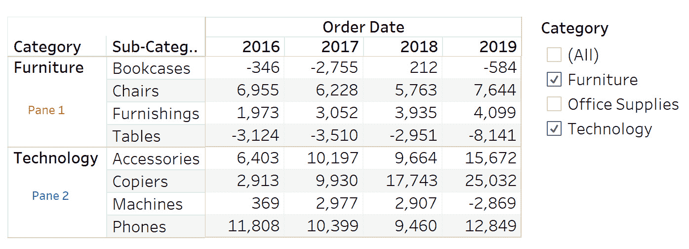


图 8.39：窗格

它们也可以被视为大表中的小表。可以在类似表格级别的操作上对窗格进行表计算。以下是一系列与窗格相关的计算：

+   `Pane(across)`

+   `Pane(down)`

+   `Pane(across then down)`

+   `Pane(down then across)`

您将开始于`Pane(across)`。

## 练习 8.10：创建窗格（跨）计算

`Pane(across)`在面板内水平计算，并在下一个面板处重新开始。考虑到您之前的汽车制造商销售示例，假设您想比较不同年份的销售，同时考虑不同的汽车细分市场，如掀背车、轿车和 SUV。在这个练习中，您将使用`Pane(across)`计算来完成此操作。

以下步骤将帮助您完成此练习：

1.  在您的 Tableau 实例中加载`Sample – Superstore`数据集。

1.  创建一个视图，显示`Category`与`YEAR(Order Date)`、`QUARTER(Order Date)`和`SUM(Profit)`的关系，如下所示：

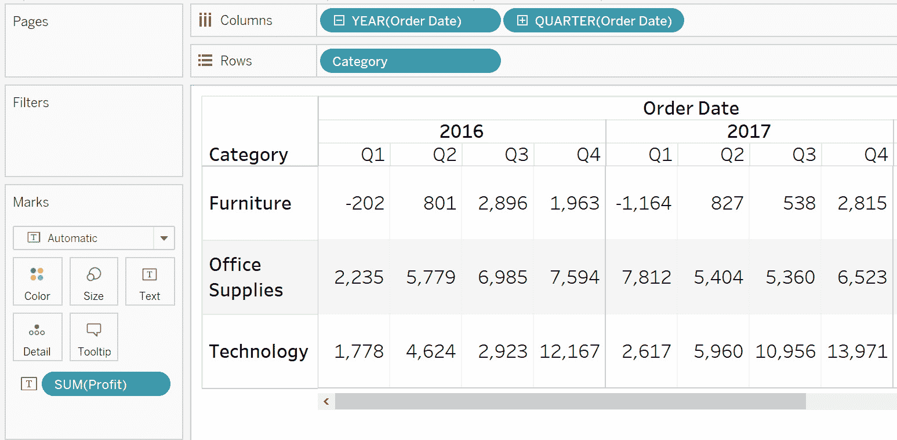

图 8.40：带有 SUM(Profit) 运行总量的初始视图

1.  根据`Order Date`的`YEAR`筛选条件选择`2016`和`2017`。


图 8.41：添加 YEAR 过滤器

1.  您现在有两个水平面板。要激活面板表格计算，您需要在行或列中有多于一个维度。这里的面板将是一行，每个`Category`，每年；因此，您将在视图中看到六个面板。第一个面板看起来像这样：

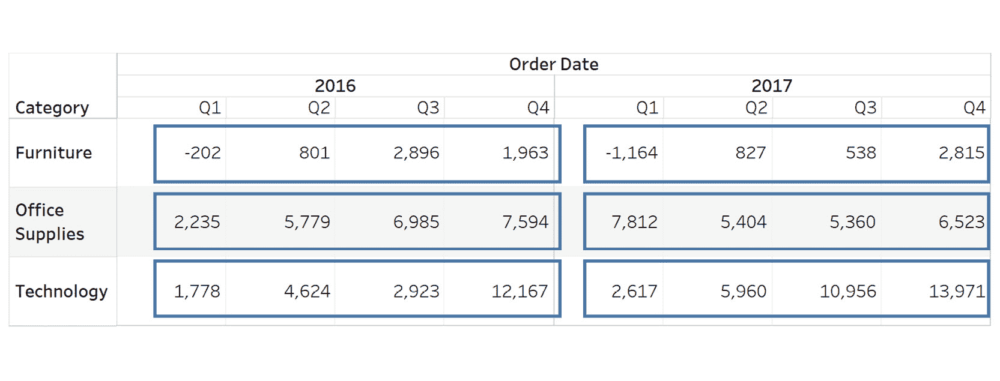

图 8.42：理解面板（横向）

1.  添加 SUM(Profit) 的运行总数，然后通过再次点击`SUM(Profit)`选择`Pane(across)`选项。

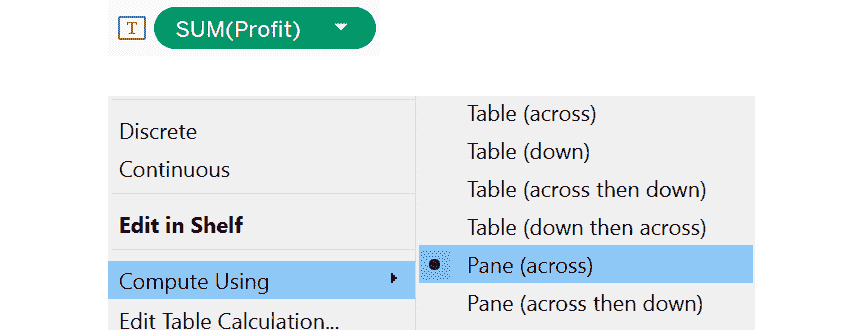

图 8.43：使用 | 面板（横向）访问计算

选择`Pane(across)`后，您应该看到以下输出：

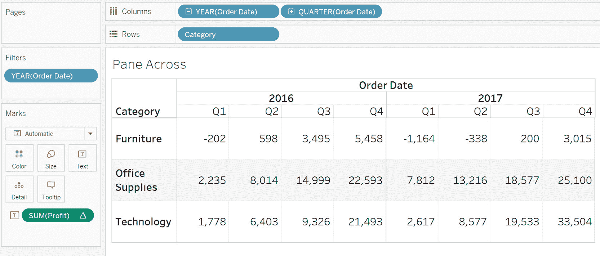

图 8.44：最终输出

1.  为了更好地理解这一点，将`Profit`添加到另一个视图中并计算结果。

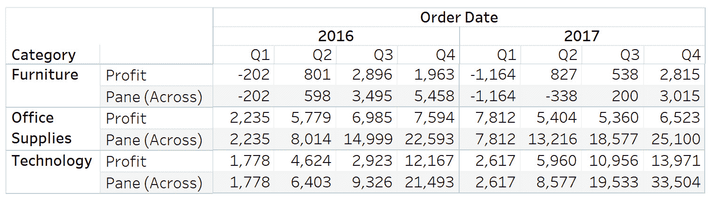

图 8.45：面板（横向）的工作原理

如您所见，每个突出显示的蓝色框只是水平地添加利润，并在每个分区或面板之后重新开始。您还可以通过参考底部表格来验证利润总和。

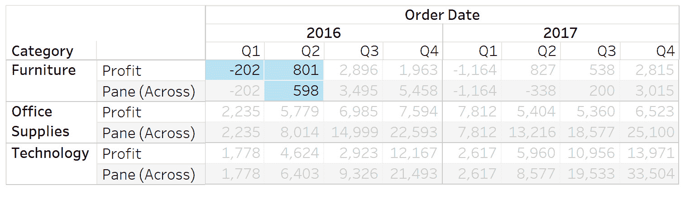

图 8.46：最终输出分析

这个视图可以帮助您了解不同类别基于两年订单日期的所有不同季度的总利润表现。这可以帮助您专注于利润，了解哪些季度产生了最高的利润。

接下来，您将了解`Pane(down)`。`Pane(down)`在面板内垂直计算，并在下一个面板处重新开始。

## 练习 8.11：面板（向下）计算

考虑到汽车制造商销售的示例，假设您想分析每个细分市场每年销售的各个汽车型号。在这里，您可以使用`Pane(down)`对细分市场分区进行操作。以下步骤将帮助您完成此练习：

1.  在您的 Tableau 实例中加载`Sample – Superstore`数据集。

1.  创建一个视图，显示`YEAR(Order Date)`和`Category`相对于`QUARTER(Order Date)`和`SUM(Profit)`的累计总和，如下所示：

![图 8.47：SUM(Profit)的初始视图及累计总和]

![图 B16342_08_47.jpg]

图 8.47：SUM(Profit)的初始视图及累计总和

1.  根据“Order Date”的“YEAR”筛选为`2016`和`2017`。

![图 8.48：添加 YEAR 筛选器]

![图 B16342_08_48.jpg]

图 8.48：添加 YEAR 筛选器

1.  现在，您将拥有八个垂直面板——四个用于“2016 年”，四个用于“2017 年”——基于四个季度和两年。

![图 8.49：理解面板（向下）]

![图 B16342_08_49.jpg]

图 8.49：理解面板（向下）

1.  通过再次单击`SUM(Profit)`选择“面板（向下）”选项，如下所示：

![图 8.50：使用|面板（向下）访问计算]

![图 B16342_08_50.jpg]

图 8.50：使用|面板（向下）访问计算

您将看到以下输出：

![图 8.51：最终输出]

![图 B16342_08_51.jpg]

![图 8.51：最终输出]

1.  为了更好地理解，将`Profit`添加到视图中并查看结果。

![图 8.52：面板（向下）的工作原理]

![图 B16342_08_52.jpg]

图 8.52：面板（向下）的工作原理

如您所见，每个蓝色面板（突出显示）中的值向下求和，并且在每个面板之后此过程重新开始。在这里，您可以比较季度利润。例如，对于“2016 年”的`Q1`，总利润为$3,811，同样，对于“2017 年”的`Q1`，它为$9,265，这大约是 2.5 倍的利润。对于`Q2`利润则不能这么说。基于此，您可以尝试分析这种差异背后的原因，并利用这些见解调整商业策略。

接下来，您将了解“面板（先横后纵）”和“面板（先纵后横）”。“面板（先横后纵）”是“面板（先横）”和“面板（向下）”的组合；即它在面板水平方向上计算计算，并将结果与下一个面板中的值合并。“面板（先纵后横）”是“面板（先横后纵）”的相反，因为它在面板垂直方向上执行计算，并将结果与下一个面板中的值合并。下一个练习将详细探讨这一点。

## 练习 8.12：创建面板级计算

本练习继续以汽车制造商的销售为例。假设您想查看不同年份每个季度每个细分市场的销售。在这里，您可以使用“面板（先横后纵）”或“面板（先纵后横）”选项。结果将所有详细面板合并为一个累计总体总和。以下步骤将帮助您完成此练习：

1.  在您的 Tableau 实例中加载“Sample – Superstore”数据集。

1.  在创建视图之前，您必须首先为`Category`和`Sub-Category`创建一个组合字段。这对于“面板（先横后纵）”计算是必需的，否则 Tableau 将合并子类别。选择`Category`和`Sub-Category`一起，然后，右键单击并选择“创建”然后“组合字段”，如下所示：

![图 8.53：创建组合字段]

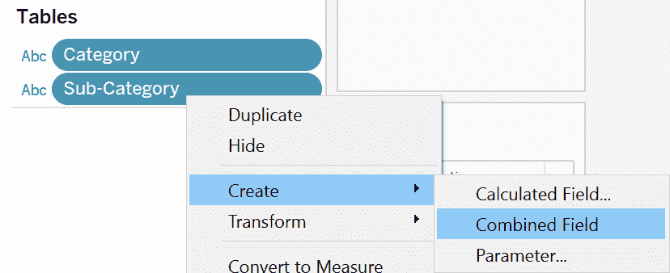

图 8.53：创建组合字段

1.  创建一个视图，显示`Order Date`的`YEAR`和`QUARTER`与`Category`、`Sub-Category`以及组合字段对比。同时，添加`SUM(Profit)`的累计总和，如下所示：

![图 8.54：带有 SUM(Profit)累计总和的初始视图]

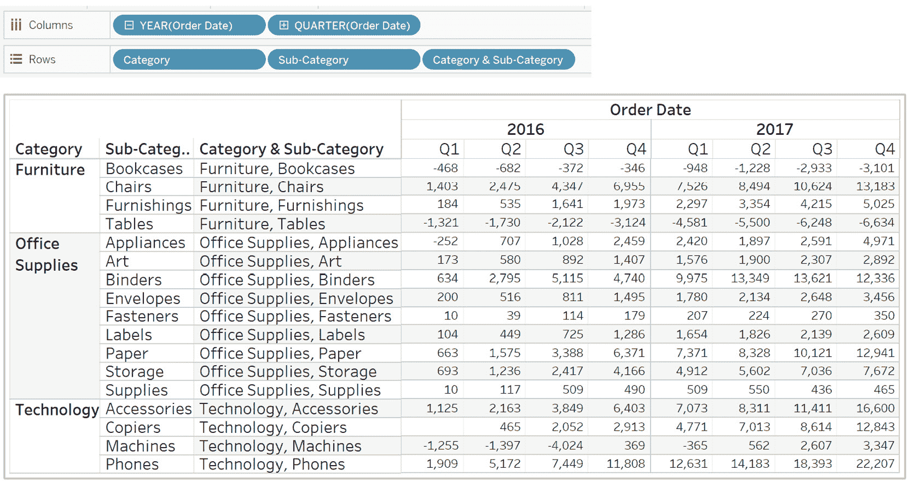

图 8.54：带有 SUM(Profit)累计总和的初始视图

1.  根据`YEAR(Order Date)`筛选`2016`和`2017`。同时，通过选择`Furniture`和`Technology`筛选`Category`，如下所示：

![图 8.55：添加类别和 YEAR 筛选器]

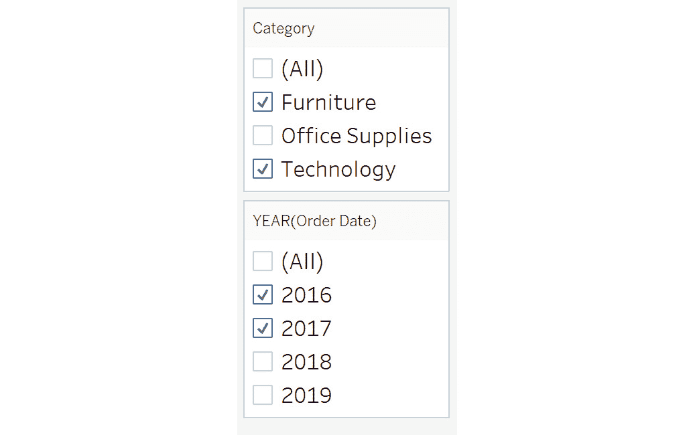

图 8.55：添加类别和 YEAR 筛选器

1.  您现在有两个水平的`Year`面板和两个垂直的`Category`面板。通过再次点击`SUM(Profit)`选择`Pane(across then down)`选项。

![图 8.56：使用|面板（先横后竖）访问计算]

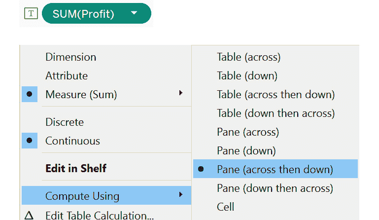

图 8.56：使用|面板（先横后竖）访问计算

1.  选择`Pane(across then down)`后，生成的输出如下：

![图 8.57：面板（先横后竖）的最终输出]

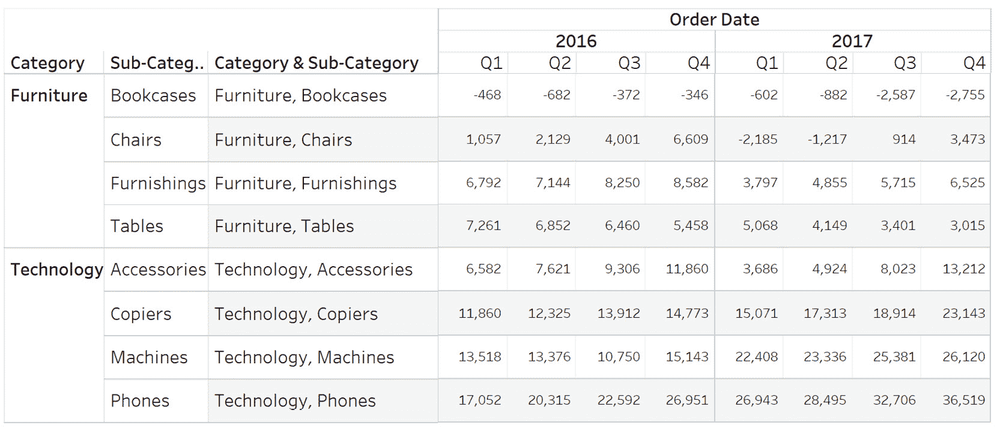

图 8.57：面板（先横后竖）的最终输出

1.  为了更好地理解，将`Profit`添加到视图中并计算结果。

![图 8.58：面板（先横后竖）的工作原理]

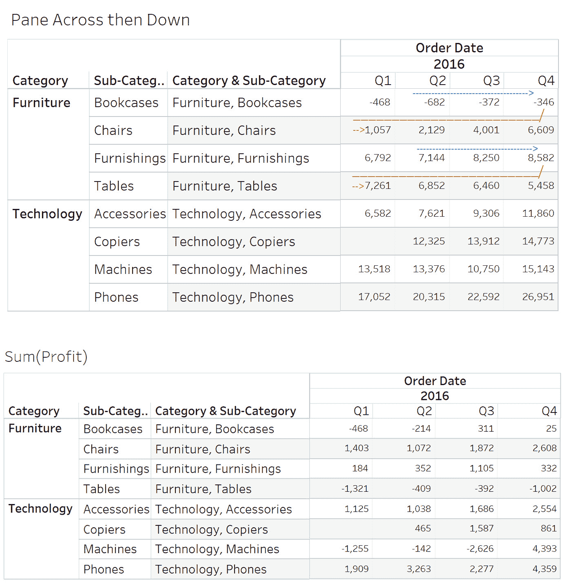

图 8.58：面板（先横后竖）的工作原理

注意蓝色箭头，它们表示从该行的第一个值到最后一个值的利润总和；橙色箭头表示每行的最后一个值加到下一行的第一个值。这个过程一直重复，直到每年的最后一行。一旦一年完成，计算将重新开始下一年。您可以通过查看右侧的`Sum(Profit)`值来验证这些数字。

1.  将计算更改为如图所示的`Pane(down then across)`：

![图 8.59：使用|面板（先竖后横）访问计算]

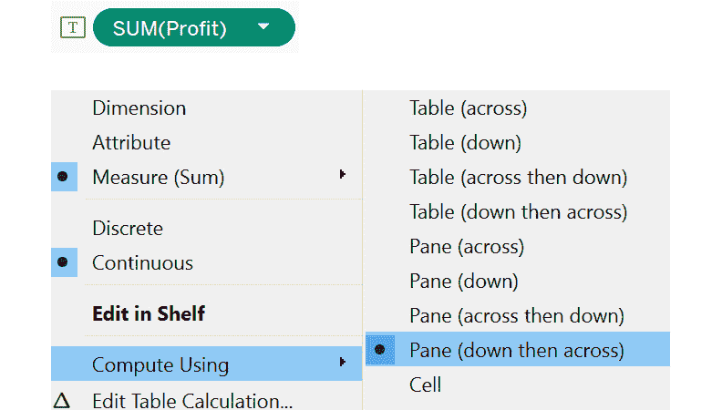

图 8.59：使用|面板（先竖后横）访问计算

生成的输出将如下所示：

![图 8.60：面板（先竖后横）的最终输出]

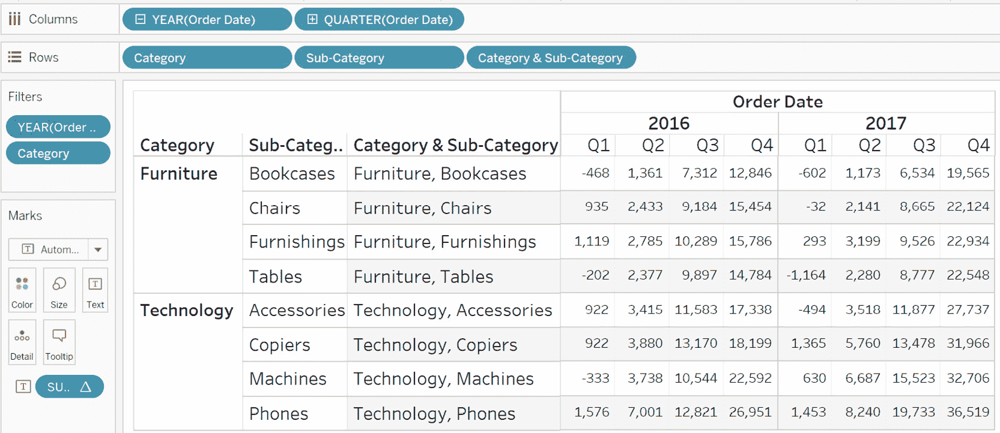

图 8.60：面板（先竖后横）的最终输出

1.  为了更好地理解，将`Profit`添加到视图中，并计算`2016`的结果。

![图 8.61：面板（先竖后横）的工作原理]

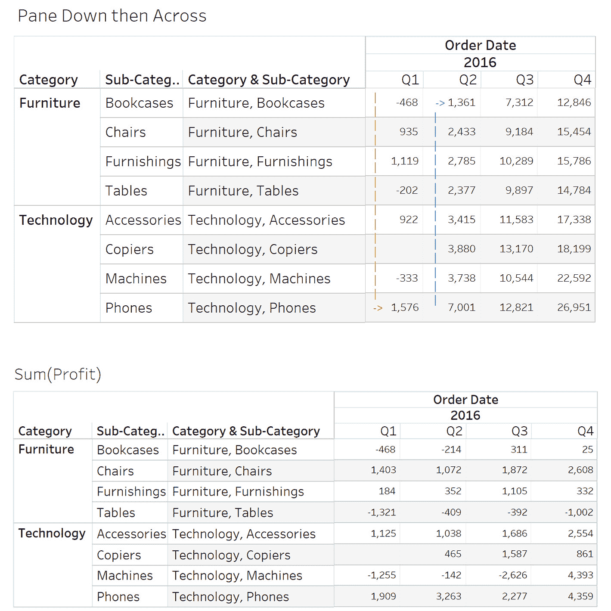

图 8.61：面板（先竖后横）的工作原理

观察蓝色箭头，它们表示从列中的第一个值到最后一个值的利润总和。橙色箭头表示每列的最后一个值加到下一列的第一个值。这个过程一直重复，直到每年的最后一行。一旦一年完成，计算将重新开始下一年。您可以通过查看右侧的`Sum(Profit)`值来验证这些数字。

## 单元格

“单元格”计算跨越单个单元格。结果与直接将度量值添加到架子上相同，如下图所示（单元格用框突出显示）：

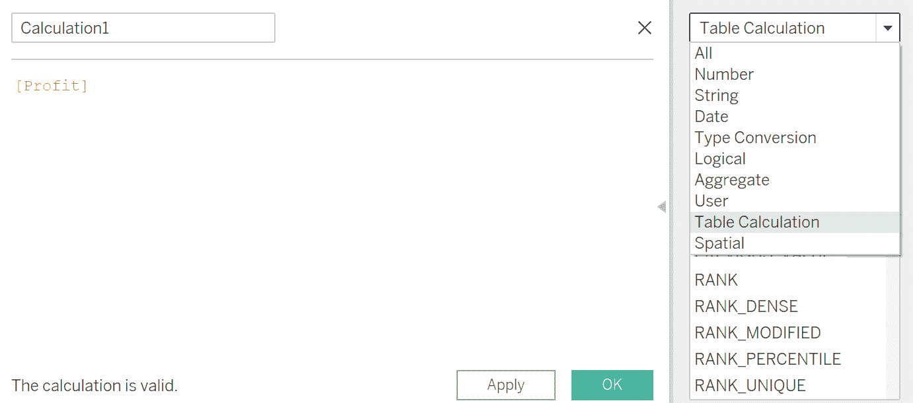

](img/B16342_08_62.jpg)

图 8.62：使用单元格进行计算

两个表中的值相同。“特定维度”使用您指定的维度进行计算。您将在下一节中详细了解这一点。

# 创建、编辑和删除表格计算

希望您现在对快速表格计算有了很好的理解，但如果您需要使用其他计算，比如对表格中的行进行排名，怎么办？在这里，您可以使用“创建”计算窗口。Tableau 支持许多表格函数，除了快速表格计算。在本节中，您将学习如何创建、访问、编辑和删除表格计算。

## 创建新的表格计算

要创建表格计算，右键单击任何度量值，然后点击“创建”，然后“计算字段...”，如下所示：


图 8.63：从利润创建计算字段

当您点击“计算字段...”时，将打开一个计算编辑器窗口，如下所示：

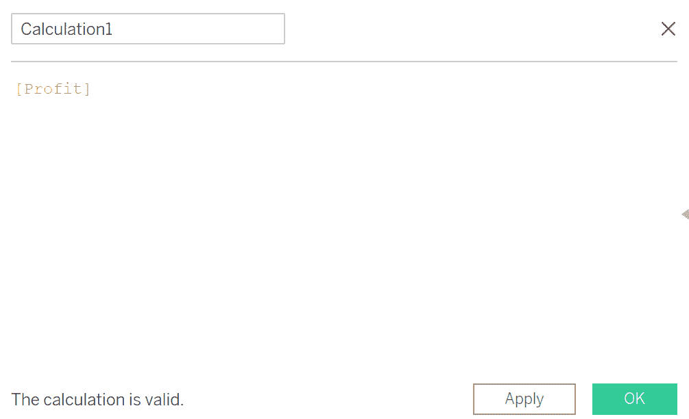

图 8.64：计算编辑器

现在，您可以点击下拉菜单并选择“表格计算”菜单，如下所示：


图 8.65：在计算编辑器中访问表格计算功能

接下来，显示所有由 Tableau 支持的表格计算列表，如下所示：

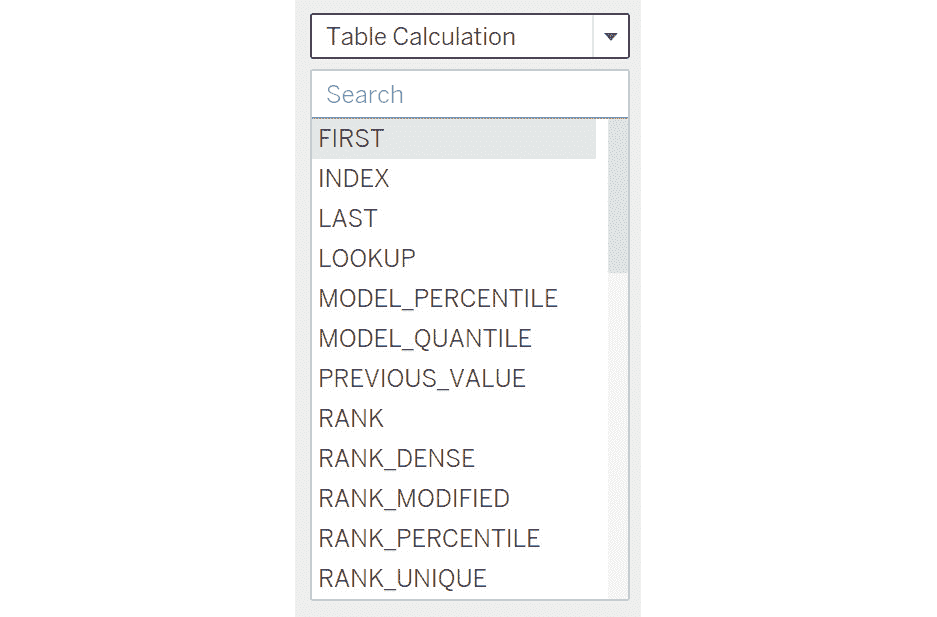

图 8.66：各种表格计算功能

在 Tableau 中，理解这些表格计算非常容易。每个计算都是通过指定使用语法、使用计算预期的结果以及示例来定义的。

您已经熟悉了 `RUNNING_TOTAL`，它与 `RUNNING_SUM` 类似。相同的计算类型可以用于执行各种操作，如求和、平均值以及查找最小值和最大值，这些都可以在表格计算菜单下引用。

## 练习 8.13：使用计算编辑器创建表格计算

在您的项目中，您可能需要使用视图中的某个表格计算函数。例如，索引函数会将序列号添加到视图中的行。您可以通过创建表格计算来实现这一点。在本练习中，您将根据“利润”的年度总和计算“子类别”的排名。以下步骤将帮助您完成此练习：

1.  在您的 Tableau 实例中加载“Sample – Superstore”数据集。使用您之前创建的合并字段以及“订单日期”的“年”。创建如下视图，并过滤“类别”为“家具”：

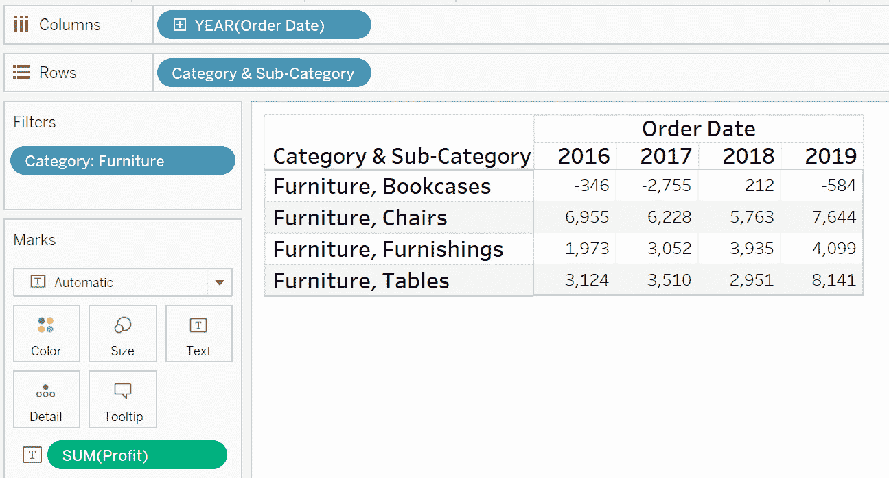

图 8.67：带有 SUM(Profit) 的初始视图

1.  现在，创建一个 `RANK` 表格计算。在数据面板中右键点击 `Profit` 并选择 `Create` | `Calculated Field…`。这将打开计算编辑器。


图 8.68：使用 Profit 创建计算

1.  将以下表达式添加到计算编辑器中：

    ```py
    RANK(SUM(Profit))
    ```

这在以下图中显示：

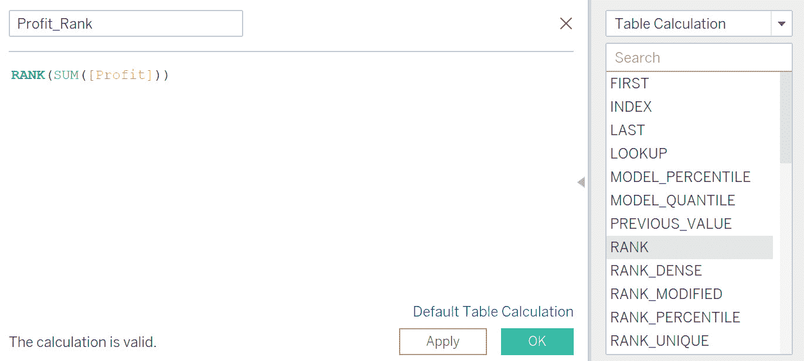

图 8.69：Profit_Rank 计算过程

1.  将其命名为 `Profit_Rank`.

1.  将其拖拽到 `Text` 视图上，如下所示：

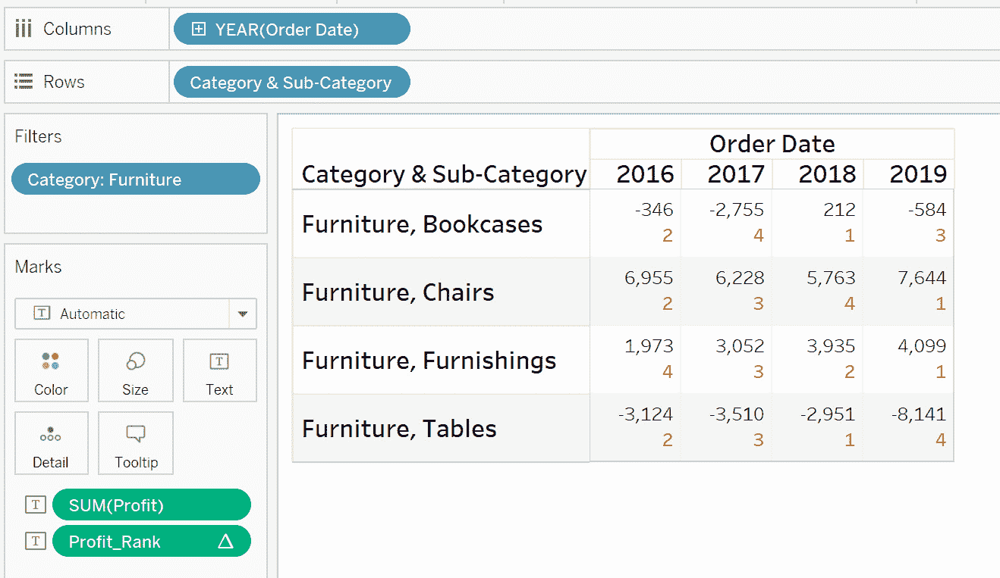

图 8.70：将 Profit_Rank 计算添加到视图中

1.  观察到默认方向是 `Table (across)`。编辑此方向并尝试更改视图中特定维度的计算。点击 `Profit_Rank` 下拉菜单并选择 `Edit Table Calculation…` 然后选择 `Specific Dimensions`，如图所示：

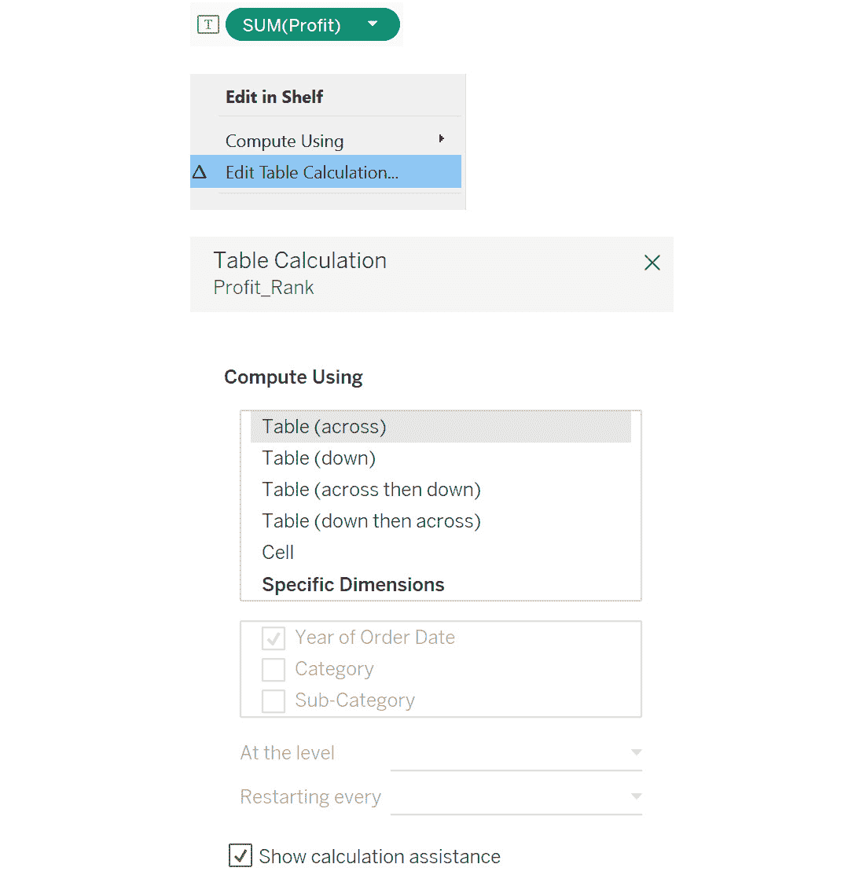

图 8.71：访问编辑表格计算

使用这些选项，您可以控制表格计算的计算方式。了解这里的不同选项非常重要：

+   `在级别上`: 这决定了计算的级别。这里的级别指的是视图中不同的维度，例如 `Category` 和 `Sub-Category`。如果选择多个维度，则默认为 `Deepest`，这意味着计算将在最低粒度级别发生，在您的视图中即为 `Sub-Category`。


图 8.72：在 `At the level` 下拉菜单下的各种选项

+   `每重启一次`: 此选项可以根据所选字段重新启动计算。


图 8.73：在 `Restarting every` 下拉菜单下的各种选项

+   `显示计算辅助`: 此选项突出显示根据您的选择计算的方式。如图所示，根据选择，`Profit_Rank` 将按向下方向工作（突出显示）：

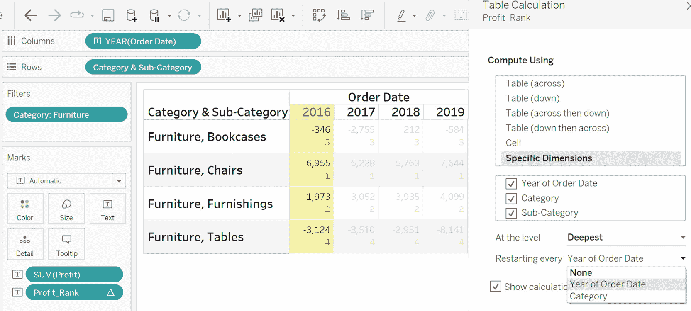

图 8.74：使用显示计算辅助功能

此视图展示了如何使用视图中的维度在不同级别执行表格计算。

## 移除表格计算

一旦添加了表格计算，您也应该能够将其移除。这可以通过点击现有的快速表格计算并选择 `Clear Table Calculation` 选项来完成，如下所示：

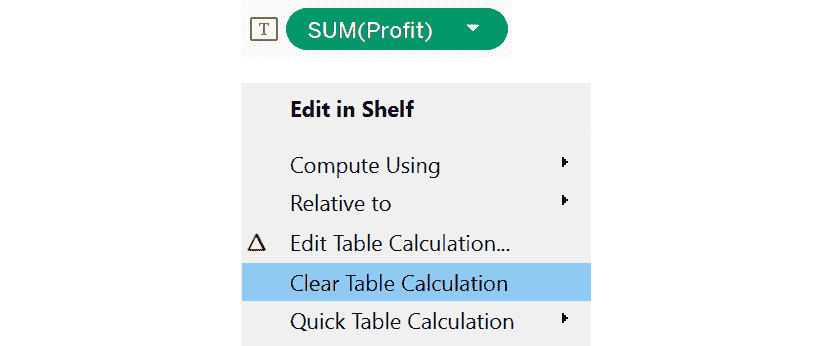

图 8.75：选择清除表格计算选项

## 活动练习 8.01：管理医院床位分配

可能存在需要使用度量历史值来计算其当前值的情况，例如，在计算一年中所有季度的销售累计总和时。这反过来可以帮助你可视化整个年度的销售，或与之前季度相比的销售差异。在这种情况下，表格计算可能很有用，因为所有逻辑都是内置的，你只需要将计算应用于度量值。

在此活动中，你将应用表格计算到一个基于医院的工程项目中，以确定当前有多少病人被入院。你将考虑新入院、出院和常规随访等因素，以检查床位阈值是否足够。通过这样做，你可以确保在紧急情况下医院不会耗尽床位。

在数据集中，有一个表示当前日期的日期列，一个表示进入病人数量的 Open 列，一个表示出院数量的 Discharges 列，以及一个表示再次入院或跟进先前入院的患者数量的 Re-open 列。此外，在紧急情况下，你还需要保留 900 张床位中的 100 张空闲。如果病人数量超过 600，应该进行视觉突出显示。

注意

用于此活动的数据集可以从 [`packt.link/NNzlJ`](https://packt.link/NNzlJ) 查找和下载。

以下步骤将帮助你完成此活动：

1.  在你的 Tableau 实例中打开并连接 `活动 1` 的数据集。

1.  创建一个名为 `current_patients` 的计算，以找到当前入院的患者数量。这可以在考虑 `Open`、`Discharges` 和 `Re-open` 列之后进行计算。

1.  一旦你有一个条形图视图，使用之前步骤中创建的 `current_patients` 字段，在精确的日期级别显示日期，以及当前医院中的病人数量。这种视图可以帮助你查看给定日期有多少病人被入院。

1.  在现有视图中，将 `running_sum` 表格计算添加到 `current_patients` 表格计算中。这个视图可以帮助你可视化在给定日期被入院的患者数量，同时考虑所有之前的日子。

1.  创建另一个名为 Alert 的计算，以指示病人数量超过 600。你需要使用 running_sum 来确定给定日期的病人数量。

1.  现在，你应该能够分析进入医院的病人总数，并查看是否有足够的床位可用。

1.  初始视图如下：

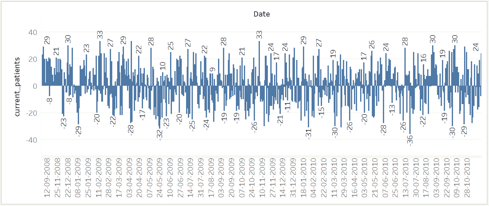

图 8.76：初始视图 – 活动

最终输出如下：

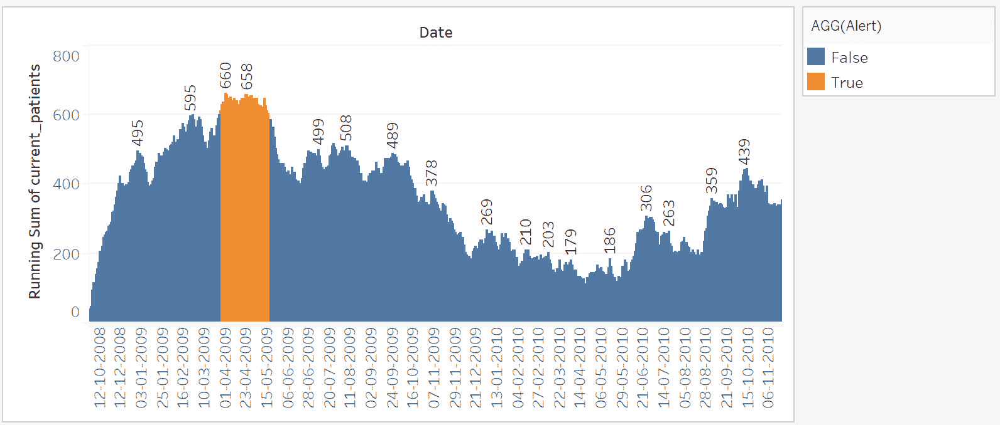

图 8.77：最终视图 – 活动

在这里，你可以看到在 2009 年，有一段时间病人的数量超过了床位数。尽管这类事件很少发生，但它们必须得到妥善管理。

通过这个活动，您加强了创建和使用表格计算的知识。这个活动帮助您看到如何使用累积值来更好地分析数据，通过突出显示可能对业务产生重大影响的不规则或事件。

注意

本活动的解决方案可在此处找到：[`packt.link/CTCxk`](https://packt.link/CTCxk)

## 活动 8.02：为健康人群规划

在上一个活动中，您创建了一个可视化图表来显示患者数量的急剧增加。作为一名分析师，您还应该能够使用历史数据，并在患者数量上升时识别出模式。

在本活动中，您将使用范围窗口来识别当前入院人数何时增加，以及是否存在特定的可观察趋势。通过这种方式，医院可以更好地为未来做好准备。您将使用之前活动中使用的相同医院数据。以下步骤将帮助您完成本活动：

1.  每周绘制`current_patients`的`RUNNING_SUM`的窗口平均值。窗口平均值取窗口中所有值的平均值，在本例中是视图。

1.  移除最后 10 周范围的平均值，以检查当前入院患者的数量是上升还是下降。创建一个参数，用作范围输入；您可以将其命名为`Range_input`。

1.  使用此`Range_input`参数作为名为`avg_admitted`的`WINDOW_AVG`计算的输入。您需要从上周开始计算到当前周的 10 周平均值。

1.  使用双轴来显示`current_patients`的`RUNNING_SUM`和`WINDOW_AVERAGE`。回想一下，双轴用于在同一个视图中并排显示两个度量。在添加两个度量后，右键单击轴以启用此选项。

1.  创建一个警报来比较`current_patients`的`RUNNING_SUM`和`avg_admitted`。突出显示总和超过平均值的周。

1.  初始视图将如下所示：

![图 8.78：初始视图 – 活动

![图片 B16342_08_78.jpg]

图 8.78：初始视图 – 活动

最终视图应如下所示：

![图 8.79：最终视图 – 活动

![图片 B16342_08_79.jpg]

图 8.79：最终视图 – 活动

您现在可以看到当前入院患者数量何时超过了 10 周的平均值。根据需求，可以通过更改输入来更改范围。一个有趣的观察结果是 7 月份，在过去 3 年中，7 月份的患者数量都高于平均水平，这表明下一年 7 月份可能发生类似的情况。

注意

本活动的解决方案可在此处找到：[`packt.link/CTCxk`](https://packt.link/CTCxk)。

# 摘要

在本章中，你学习了表格计算。你从执行一些快速表格计算开始，这些计算用于快速在视图中应用常用的表格计算。然后，你探索了使用地址和分区应用表格计算的方法——地址定义了计算的指向，而分区定义了其范围。最后，你学习了如何使用计算编辑器创建表格计算，以及如何使用特定维度来定位视图。

在下一章中，你将学习关于“详细程度”的概念，这是一个强大的概念，用于控制视图的显示方式。
