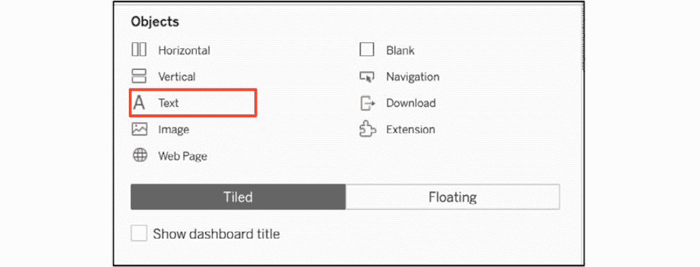
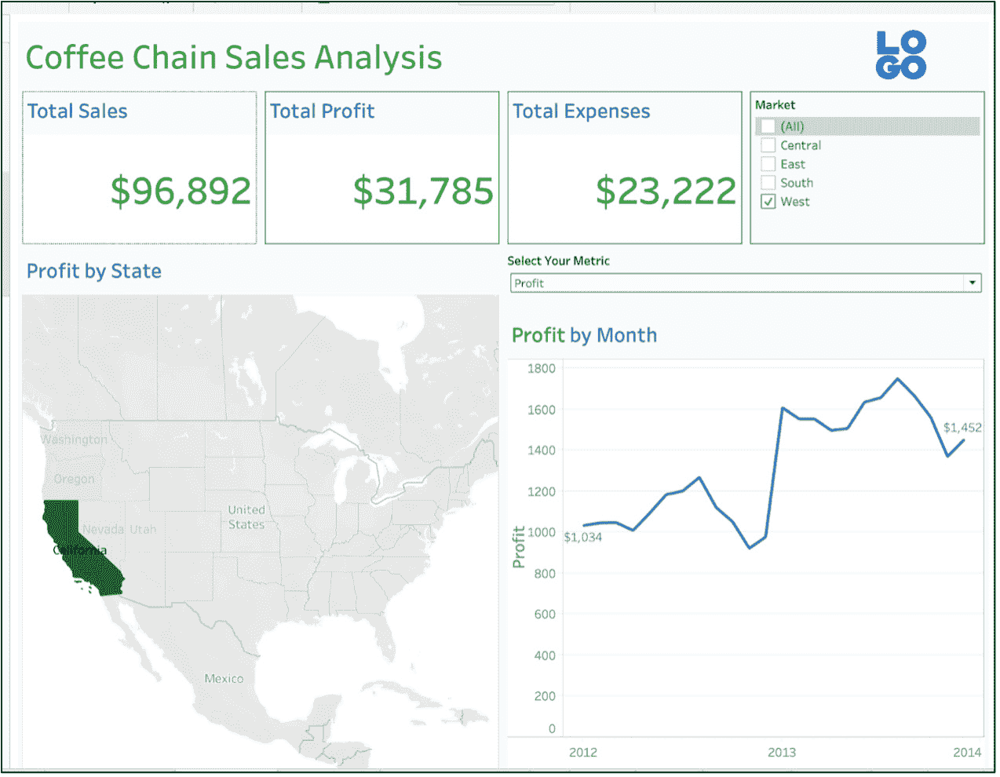

# 第十章：10. 仪表板和故事板

概述

本章将向您介绍构建 Tableau 仪表板和故事板的流程。您将了解诸如平铺与浮动对象、品牌元素和筛选动作等工具，以及如何将网页添加到仪表板中。到本章结束时，您将能够使用这些对象/元素创建高度交互式的仪表板，传达结果，并讲述故事，为最终用户提供重要见解。这些是每位 Tableau 分析师和设计师的必备工具。

# 简介

到目前为止，您已经掌握了许多核心的 Tableau 技能，包括创建计算、构建和使用筛选器、开发地理空间分析以及许多其他核心技能。在本章中，您将使用这些技能来创建仪表板，使用户能够轻松有效地导航复杂的数据集。

我们将为您提供使用各种数据源设计有效仪表板和故事板的必备技能。您将在之前章节中学到的许多技术和方法的基础上进行构建。您将学习如何有效地使用筛选器、参数、集合和动作，使您的仪表板和故事板既强大又灵活。此外，您还将学习如何使用数据可视化的最佳实践来设计仪表板，包括颜色、间距、交互、设计流程和元素尺寸。所有这些都将通过实践练习和活动来实现。

到本章结束时，您将能够设计出高度有效、设计精良的仪表板和故事板，以回答关键的业务问题。

# 仪表板的谁、什么和为什么

在您开始探索如何在 Tableau 中最佳地创建仪表板之前，回答一些关于构建仪表板的基本问题同样重要：您为什么要构建这个仪表板？您的最终目标是什么？您的目标受众是谁？

## 谁：受众

经过多年的仪表板构建，大多数经验丰富的 Tableau 用户可能会同意这样一个事实：您构建的仪表板类型将取决于您将要向其展示的利益相关者的资历。如果您正在为 C 级高管或业务部门的总监/副总裁构建仪表板，那么您通常需要创建一个全面、高层次的仪表板，展示业务数据的完整画面。相比之下，当您为业务发展经理或市场经理构建仪表板时，仪表板需要更加细致和深入。

正如你将在本节后面看到的那样，仪表盘的整体结构几乎保持不变，但粒度以及给最终用户“剥洋葱”或深入挖掘数据的能力，是区分目标受众的因素。因此，在开始构建仪表盘之前，重要的是要缩小受众范围，考虑他们的需求，然后开始构建仪表盘的过程。

## 什么是“目标”：从结果出发开始

构建仪表盘的下一步是理解你正在构建的仪表盘的最终目标。如果你能相对轻松地回答以下问题，那么你在仪表盘构建过程中已经领先一步。在开始构建你的仪表盘之前，请考虑以下要点：

+   你知道你的受众将如何使用这个仪表盘吗？

+   你希望你的受众通过查看仪表盘理解一个特定的观点吗？

+   你的仪表盘可能回答的所有利益相关者的问题有哪些？

+   仪表盘提供的是上下文知识而不是仅仅的指标吗？

一旦你回答了这些问题，你应该有一个很好的最终目标，即你的仪表盘应该具备的最基本功能。之后，所有的工作就是将所有相关的电子表格和元素/对象放置在仪表盘中，以便轻松消费你想要分享的数据。

## 为什么需要仪表盘：“仪表盘的需求”

你应该问的最后一个问题是为什么仪表盘最初是必需的？你可以将这个问题分解成多个部分，如下所示：

+   仪表盘关注的是哪个业务领域？例如，为财务部门设计的仪表盘与为数字营销团队设计的仪表盘看起来会不同。

+   最终用户希望从仪表盘中获取哪些类型的信息/指标？

一旦你回答了这些问题，构建仪表盘的过程将会变得更加顺畅，因为你不仅知道请求这个仪表盘的背景，也知道仪表盘最终将如何被使用。

# 设计仪表盘

仪表盘设计是 Tableau 的一个相对主观的方面，它依赖于仪表盘设计师的设计和视觉技能。从这个意义上说，没有单一的正确结果，但有一些通用设计原则可以使你的仪表盘更容易理解，并最终更有用。在本节中，你将在 Tableau 框架内结合这些原则，创建一个吸引人的仪表盘，使最终用户能够轻松理解底层数据。

在你开始仪表盘设计路径之前，你应该问自己和你用户几个问题。这些问题将帮助你指导你创建的许多最终用于填充仪表盘的元素。以下是一些潜在的问题：

+   你应该测量哪些关键指标？

+   你的度量应该有多细粒度？你是查看每小时、每天、每周、每月还是每年的数据？

+   地点重要吗？

+   您是否应该汇总数据以提供更有用的见解？

+   您需要多少历史数据？历史趋势对数据分析相关吗？

根据业务组织运营的环境，无疑还有更多的问题。无论具体问题是什么，作为一名仪表板设计师，您应该对您的最终用户认为什么重要有所认识，并且能够优先排序和排名所有必要的数据。在您开始设计仪表板并安排从最重要到最不重要的具体元素时，这个过程将有所帮助。

为什么设计有效的仪表板很重要？您花费大量时间构建一个强大且易于使用的仪表板的原因是它可以被多个受众以多种方式利用。与通常针对单一业务单元的单一指标并按固定时间表交付的传统报告不同，仪表板可以用于在整个组织中吸引用户。一个有效的仪表板，具有丰富的用户界面和有效的叙事，可以在不需要创建同一报告的多个版本的情况下满足许多用户的需求。

在本章中，您将使用一个查看销售、利润、支出和其他指标的咖啡连锁店数据集来展示有效的仪表板原则：

+   市场规模

+   市场

+   产品类型

+   产品

+   州

+   区号（门店位置）

在对仪表板概念进行概述之后，您将使用这个数据集来创建我们的仪表板，但在您这样做之前，让我们先看看我们的成品仪表板，以便您了解您正在努力实现的目标。

图 10.1：使用咖啡连锁数据的示例仪表板

正如您所看到的，仪表板利用了许多 Tableau 功能，例如图表类型、标题、参数和过滤器。仪表板内容的每个组件——图表、地图和三个计算值面板——都使用了您从数据集中构建的单独的工作表。这使得我们能够通过将选定的工作表及其相关的参数、过滤器和图例插入仪表板框架中来创建仪表板。请注意，元素从上到下和从左到右的对称性，页面顶部的总结值随后是更详细的数据，随着您从上到下移动。颜色和谐且有限，每个级别的字体大小一致，图表内的元素大小最小化，以便观众不会被大量的视觉噪音分散注意力。仪表板非常易于阅读和导航。

将其与以下使用相同元素但未保持最佳设计实践的糟糕设计的仪表板进行对比。

图 10.2：糟糕的仪表板设计示例

尽管这个版本保持了自上而下的相同流程，但它揭示了多个设计缺陷，这使得阅读更加困难，而并未增加任何额外的价值：

+   顶级元素使用了不同的字体大小。

+   下一个级别使用了字体太小而无法产生影响的字体，以及不一致的标题格式。

+   图表太小，无法有效地在仪表板上使用。

这个比较应该让你对良好设计与不良设计的重要性有所了解，我相当确信，作为一名分析师，你可能已经见过更糟糕的仪表板设计，但这应该会让你对仪表板上一致性和适当的大小、文本和颜色的重要性有所认识。

现在，让我们转向概述设计原则，这些原则是创建有效且吸引人的仪表板所应遵循的。

## 基本布局

Tableau 仪表板在概念上很简单；然而，对于新用户来说，实施起来可能具有挑战性。即使是经验丰富的用户也发现仪表板设计是 Tableau 更具挑战性的方面之一。设计一个 Tableau 仪表板不仅仅是将元素放置在画布上，调整大小以完美地适应页面。相反，你需要使用一系列对象，如文本框、图像、水平/垂直对象以及由你之前创建的工作表填充的网页对象（我们通常使用容器这个术语），结合图像、文本和其他相关元素。虽然学习曲线有点陡峭，但最终结果是能够创建出充满信息和洞察力的动态、吸引人的仪表板。

在设计过程中，你可以结合最佳数据可视化实践，包括间距、尺寸、布局、颜色和用户交互，以及 Tableau 提供的众多工具，来创建强大且直观的仪表板。有关最佳实践的资料可以在以下链接找到：[`www.tableau.com/learn/articles/data-visualization-tips`](https://www.tableau.com/learn/articles/data-visualization-tips)。在本节中，你将首先了解一些最佳实践，然后再继续使用特定的 Tableau 仪表板对象来展示你的信息。让我们从一般的设计实践开始。

### 显示尺寸

设计仪表板时，首先要了解用户是谁以及他们通常会怎样查看仪表板。你应该了解我们的用户是否会从台式机、笔记本电脑、平板电脑或其他移动设备工作。将显示尺寸视为在构建仪表板时必须决定的画布大小；你应该根据仪表板的预期用途——无论是在笔记本电脑、台式机还是移动设备上——来调整你的显示尺寸。如果用户有超大的显示器，你可以潜在地增加仪表板中单个项目的尺寸以提高可读性。幸运的是，Tableau 的最新版本允许设计师以多种终端用户格式查看仪表板——你可以看到你的仪表板在笔记本电脑用户和从移动设备查看的人眼中的样子。

### 定位

定位指的是仪表板布局的有效设计，相关项目分组，主要指标在仪表板上获得最佳位置（如下一图所示），通常位于仪表板顶部。对于西方文化，流向是从左到右和从上到下，就像用户在读书一样。因此，为了优化我们的设计，你应该将最重要的指标放在页面的顶部，将次要指标放在下面。理想情况下，你可以将辅助指标分组在页面与相关主要指标相同的一侧，这样用户就可以轻松地跟随仪表板的流程。

这里有一个如何在你最终的仪表板上定位内容的通用框架：

图 10.3：仪表板的一般结构

理念是在仪表板的顶部有一个信息丰富的标题，同时高效地利用页面上的宝贵空间。这通常随后是一个包含摘要指标的章节，这些指标是高管可能更愿意查看的。接下来是详细的图表或表格；这是普通用户需要能够筛选数据以了解更详细细节的部分。最后，你通常将过滤器放置在右侧最远的位置，这个区域屏幕空间的价值较低——或者你可以使用滑动面板在需要时隐藏过滤器。始终记住，在西方文化中，最有价值的视觉空间位于页面的左上角，因此你应该避免在该区域堆放过滤器、图像、标志或详细的图表。

### 间距

仪表盘设计中的一个关键考虑因素是给用户留出足够的空白空间。如果仪表盘元素过于拥挤，用户将难以理解每个元素，整体效果将远低于最佳。使用 Tableau 空白对象（一个空白容器，它允许你在仪表盘上添加间距和/或其他视觉元素）可以使仪表盘更容易阅读，并最终产生更大的影响。空白对象可以在 Tableau 对象标签中找到，位于其他元素（如垂直和水平对象）旁边。

注意在前面的例子中，元素是如何“呼吸”的；它们不会相互碰撞或在任何时候显得拥挤。这也帮助观众理解设计的流程，因为他们可以轻松地从上到下、从左到右导航，而不会产生任何混淆。

### 颜色

图 10.4：一个视觉上不吸引人的仪表盘示例

作为仪表盘设计师，你需要抵制使用过多对比色（如图所示）的诱惑，这最终可能会让用户感到困惑或误导。人类的视觉系统在一次性处理颜色数量上有局限性，因此超过这个水平的仪表盘看起来会显得视觉混乱，并失去其影响力。以下是有用的参考资料，用于处理颜色：[`www.perceptualedge.com/articles/visual_business_intelligence/rules_for_using_color.pdf`](http://www.perceptualedge.com/articles/visual_business_intelligence/rules_for_using_color.pdf) 和 [`colorbrewer2.org`](https://colorbrewer2.org)。理想情况下，我们的仪表盘应该使用三到四种颜色或品牌调色板，并保持一致，这样用户就可以轻松地识别多个图表中的常见元素。正如我们将在后面的例子中看到的，Tableau 使得使用众多可用配色方案中的任何一个来更改颜色变得非常容易。

我们的最终仪表盘遵循这一原则，通过在摘要部分使用单一的主要颜色，在图表中使用第二种主要颜色，以及为两个地图使用一致的配色方案。总体而言，这为仪表盘提供了和谐的外观和感觉。

当你尝试使用过多颜色时会发生什么？以下是一个例子：

图 10.5：图表中过度使用颜色

你现在为区域图中的每个区域代码都有了颜色，但目的是什么？现在有 100 多种颜色，其中许多重复了三次甚至四次。即使你有 100 种独特的颜色调色板，许多颜色也难以与相似的颜色区分开来。你所做的一切只是给观众增加了更多的工作；用户将花费时间试图解码每种颜色代表什么，而不是仅仅关注数据点的分布。重要的是要记住，只有在颜色有助于讲述故事时才应使用颜色；在前面的例子中，你可以使用五种颜色来突出显示区域级别的状态。这可能会显示有意义的模式，而不会使仪表板用户感到不知所措，同时如果可能的话，还可以利用其他图表类型。

### 尺寸

由于仪表板空间有限，适当的尺寸至关重要。尺寸也与定位相关；如果你努力使元素尺寸一致，我们的用户将看到仪表板的自然流动，并专注于内容而不是导航。

尺寸可以从两个方面来考虑；第一个是指仪表板中单个元素（图表、总结数字等）的尺寸。换句话说，组成仪表板的每个元素的物理占用空间。

尺寸的第二个用途是指你如何设计更大元素中的单个项目。例如，你需要决定图表标题的大小，以及标签、条形图和折线图的大小，以及其他类似的属性。如果这些项目太大，我们的仪表板就会变得杂乱，实际信息可能会变得难以理解。如果它们太小，用户可能难以解释每个仪表板元素中的信息。你需要找到一个平衡点，使信息显示最大化，并得到适当的标题、标签和其他图表元素的正确使用。以下是一些关于标记适当和不适当尺寸的例子：

图 10.6：尺寸标记对于可读性很重要

虽然左侧的标记看起来很小，但请记住，当工作表添加到仪表板中时，由于仪表板中的尺寸压缩，它们将显得更大。右侧的图表已经有了如此大的标记，以至于结果是数据点的遮挡（重叠）。当放置在仪表板中时，这些标记将由于图表分配的空间减少而显得更大。这里的建议是使标记小，然后在图表添加到你的仪表板后调整其大小。

### 文本

在仪表板中使用文本的方式是另一个重要的考虑因素。虽然文本的正确使用在仪表板设计中可能看起来是次要的考虑因素，但你需要认识到，对文本元素的不当使用可能会损害仪表板的其他部分。就像颜色一样，你希望使用的字体数量最小化，理想情况下，每个仪表板限制在两到三种字体。文本样式应跨所有单个图表标题和标签保持一致，你可能还会选择第二种字体用于标题或工具提示。目标是使用非常易读的字体样式，并让文本支持信息而不显得过于繁重。

注意我们之前仪表板示例中字体大小的使用，以及它们在每种类型对象中的一致性。还要注意相对大小，以及较大的字体用于标题和摘要指标，而筛选器和图例文本则要小得多。

## 练习 10.01：文本格式化 – 工作簿与工作表

在这个练习中，你将通过使用 Sample – Coffee Chain 数据集并探索格式化面板来回顾 Tableau 提供的不同文本格式化选项。

这里是数据下载链接：[`packt.link/zT15G`](https://packt.link/zT15G)。

1.  打开 Tableau 并将 Sample – Coffee Chain 数据加载到您的 Tableau 实例中。

1.  在工作簿级别以及单个元素级别进行格式化。在菜单栏中导航到“格式 | 工作簿”。以下是你应该获得的内容：

图 10.7：格式化工作簿选项

这允许你设置适用于工作簿的全局选项，这些选项也适用于仪表板样式，这是一种建立一致视觉外观的好方法。

1.  注意，可以通过选择“格式”菜单命令在任何单个工作表或文本对象上覆盖这些选项。格式化单个工作表是一个两步过程——首先，在空白工作区域右键单击并选择“格式”选项。这将打开工作区左侧的一个标签页，这是编辑“字体”、“对齐”、“阴影”、“边框”和“线条”的第二个步骤，分别在“工作表”、“行”和“列”级别。

图 10.8：对象格式化选项

这些是 Tableau 中的文本格式化选项，包括工作簿（完整报告/仪表板）级别以及工作表（单个工作表）级别。虽然这个练习的范围非常有限，但它应该让你在进入后续章节的更复杂元素之前，对文本格式化有一些基本的了解，包括 Tableau 交互和您将用于仪表板交互的对象。

大多数仪表板都需要用户端的一定程度的交互。过滤器是提供用户交互的常见手段，但你也可以通过动作、工具提示和高亮显示来设计，使仪表板生动起来。Tableau 为仪表板设计师提供了多个工具，如工具提示、动作、参数等；挑战在于使它们无缝融合，从而增强用户体验。以下是这些工具的简要总结：

+   过滤器允许用户轻松地减少或自定义仪表板中显示的数据。

+   参数通常像过滤器一样工作，但可以由仪表板设计师自定义，以限制或引导用户交互。

+   动作是在仪表板级别设置的，根据用户何时何地点击仪表板中的元素来应用规则。

+   图例可用于提供上下文，并允许用户突出显示特定的数据元素。

+   突出显示器可用于在多个图表或表格中显示链接的数据元素。

你希望保持这些工具尽可能不引人注目，以便为重要内容保留主要画布空间。因此，你通常会将它们放置在仪表板页面的右侧，甚至隐藏在滑动面板中，以便最大化显示空间。你已经涵盖了前面的章节，以及本章，你将在仪表板中使用相同的交互元素。

## 仪表板对象

对象是用于构建仪表板的 Tableau 元素，通常位于仪表板窗口的左下角。你可以把它们看作是可以以无数种方式组合的模块化组件，以创建仪表板。一些对象将用作之前创建的 Tableau 工作表的容器，而另一些则包含外部或新创建的内容。大多数对象可以一起使用，为用户提供定制的体验。使用对象，你可以完全自定义你构建的每个仪表板。

现在，让我们详细考虑每种对象类型。

### 垂直对象

`垂直`对象是经常用作容器的对象，用于在仪表板中显示一个或多个 Tableau 工作表。它们可以作为拼贴框架中的独立容器使用，或者位于现有的垂直或水平容器内部。换句话说，它们可以在单个仪表板中嵌套多次，尽管这种方法在实际应用中存在一定的限制，我们很快就会看到。垂直对象还可以用作浮动容器，其中屏幕上的位置由设计师指定。

使用垂直对象从上到下辅助布局你的仪表板；然后你可以轻松地在每个垂直容器内添加图表、地图和其他工作表类型。

图 10.9：选择垂直对象

垂直对象由于其多功能性和能够在单个主对象内嵌套多个容器的能力，很可能是许多仪表板上最常用的对象类型。在我们的示例仪表板上，我们使用垂直对象来包含大部分图表内容。在大多数情况下，我们的垂直容器将基于其在仪表板中的位置具有一组固定的坐标（x, y, 宽度和高度），但您可以使用它们作为具有一组坐标的浮动容器，这些坐标允许容器在仪表板结构之外浮动。要设置浮动选项，请右键单击垂直对象内部并选择“浮动”菜单选项。

![图 10.10：创建浮动对象]

![图片 B16342_10_10.jpg]

图 10.10：创建浮动对象

这将创建一个小窗口，您可以在其中使用“布局”选项卡来调整坐标。

![图 10.11：定位浮动对象]

![图片 B16342_10_11.jpg]

图 10.11：定位浮动对象

一旦设置了 `x`、`y`、`w` 和 `h` 值，容器将驻留在该位置，无论其他非浮动对象的定位如何。在使用浮动对象时请小心，以免干扰仪表板中的数据显示。

### 水平对象

“水平”对象是经常使用的容器，旨在在仪表板内显示一个或多个 Tableau 工作表。它们可以作为拼贴框架中的独立容器使用，或者位于现有的垂直或水平容器内部。与垂直对象一样，它们也可以用作浮动容器，其中屏幕上的定位由设计师指定。

您经常使用水平容器在仪表板内从左到右定位仪表板元素。一个典型的用例可能是在一个现有的垂直容器内并排显示三个单独的图表。当一起使用时，垂直和水平对象可以帮助我们设计从上到下、从左到右对称和平衡的仪表板。

要添加水平对象，请从“对象”选项卡中选择“水平”图标并将其拖动到仪表板上的适当位置。

![图 10.12：选择水平对象]

![图片 B16342_10_12.jpg]

图 10.12：选择水平对象

水平容器与垂直容器使用方式相似，也可以嵌套多次。您可以将垂直容器视为用于布局仪表板的南北流向，而水平容器用于东西布局。大多数复杂的仪表板都将同时使用这两种类型。

### 文本对象

文本对象主要用于固定的标题和 Tableau 工作簿元数据，如工作簿名称或工作表名称。文本对象还可以使用参数来创建灵活的标题或仪表板内的文本。例如，可以使用日期参数来显示仪表板用户选择的日期范围。

要向仪表板添加“文本”对象，你再次使用“对象”选项卡，这次选择“文本”图标并将其拖动到仪表板内的特定位置。

图 10.13：选择文本对象

当文本容器被拖动到仪表板画布上时，你会看到以下内容（我们在这里添加了一些示例文本）：

图 10.14：查看文本窗口

正如你所见，可以通过从文本对象窗口的菜单栏中选择特定的字体、字体大小、样式和对齐方式来完全样式化文本。这些特性使得文本对象比最初看起来更强大，因为你可以使用它们来定制我们的仪表板，添加额外的注释或标题，这些注释或标题不受特定图表或其他仪表板元素的限制。

### 图像对象

图像对象可以在仪表板中显示几乎所有流行的图像格式。这是一种插入标志、营销材料或其他相关视觉内容的简单方法。可以在仪表板的任何位置插入本地和基于 Web 的图像。

要向仪表板添加图像，转到“对象”选项卡并将“图像”图标拖动到仪表板上的一个位置。

图 10.15：选择图像对象

当图像容器被拖动到仪表板画布上时，你会看到以下内容：

图 10.16：编辑图像对象

你可以通过点击“选择”按钮选择本地图像文件，或者使用 URL 地址向仪表板提供图像。在两种情况下，都可以确保图像在容器内适合并居中，以确保它与仪表板的外观和感觉相匹配。图像可以用于显示公司标志、营销口号或其他相关视觉。

### 网页对象

网页对象通过输入 URL 地址非常容易地显示网页内容。这可以用于显示与页面指标并排的外部内容，例如产品的着陆页或营销活动的页面。

再次，你导航到“对象”选项卡以选择“网页”选项，然后可以将其拖放到仪表板容器内。

图 10.17：选择网页对象

当网页容器被拖动到仪表板画布上时，你会看到以下内容：

图 10.18：网页对象的 URL 窗口

简单地输入 URL 链接，你的仪表板就会嵌入一个网页。鉴于仪表板上可用的空间有限，应谨慎使用此功能。

### 空对象

空白对象用于在仪表板内部创建间距，无论是对象之间还是边缘周围。它们对于创建周围有空白的仪表板非常有用，这样各个元素就可以“呼吸”。这通常对仪表板的可读性有积极影响。空白对象还有助于居中图例和帮助对齐图表元素之间的边距。

要添加空白对象，导航到“对象”菜单，并将“空白”图标拖动到仪表板容器中，通常将其放置在图表之间或仪表板的边缘，以改善间距和可读性。

图 10.19：选择空白对象

在许多情况下，空白对象将具有固定的最小宽度或高度，这取决于它们被插入的位置。Tableau 默认为 32 像素，这通常是拖动对象到画布上的正常最小尺寸，这对于在仪表板上提供元素之间的空间来说是一个很好的尺寸。在某些情况下，你可以完全控制它们的宽度或高度，这取决于它们在内部或其他对象之间如何使用。空白对象的使用可能有点棘手，所以请耐心并认识到它们为仪表板外观带来的好处。

### 导航对象

导航/按钮（Tableau 2020.3 及更早版本）对象是 Tableau 的一个新功能，可用于简化从仪表板到同一工作簿中的另一个工作表或仪表板，甚至到外部资源的导航。可以使用文本或图像，允许使用标志或标语进行自定义体验。请注意，此功能首次在 Tableau 2018.3 中提供；早期版本将不会有“按钮”对象。你可以在“对象”选项卡上找到导航/按钮对象图标；将其拖动到仪表板上的选择位置。

图 10.20：选择按钮对象

当按钮容器被拖动到仪表板画布上时，你最初会看到一个大的箭头，但在选择“编辑按钮”选项后，就会出现以下内容：

图 10.21：编辑按钮对象

这个选项可以通过精心挑选的图像来定制仪表板，还可以显示有用的工具提示来指导仪表板用户。你还可以更改按钮图像，为你的仪表板添加更多设计元素。

### 扩展对象

扩展对象用于通过为 Tableau 开发的第三方应用程序来增加仪表板的功能。请注意，许多这些扩展将根据用户数量和使用许可证的期限收取额外费用。

图 10.22：选择扩展对象

在这里，你不会详细介绍扩展功能，但它们值得探索，以找到可能对你的仪表板有益的功能。许多扩展将 Tableau 与数据科学功能集成，而其他扩展则扩展了 Tableau 的数据显示选项，启用地理空间集成，或允许自定义脚本。更多信息请在此处查看：[`help.tableau.com/current/pro/desktop/en-us/dashboard_extensions.htm`](https://help.tableau.com/current/pro/desktop/en-us/dashboard_extensions.htm)。

### 使用浮动对象

在继续之前，我们将简要回顾一下对象浮动选项。在大多数情况下，你将选择默认的平铺选择，但有一些用例中浮动容器是有意义的。以下有两个潜在用例：

+   也许你希望在仪表板上特定位置叠加一些内容。虽然这通常可以通过传统的平铺方法完成，但浮动容器提供了完全的位置灵活性。你可以设置 x 和 y 位置，并指定对象的精确宽度和高度。这对于按钮对象也很有用，因为你可以将它们秘密地放置在未使用的显示空间的小部分中。

+   你还可以使用浮动容器（垂直或水平浮动对象）嵌入图表，用户可以通过参数来控制这些图表。这在你有比仪表板能合理容纳更多的图表的情况下很有用。你可以以平铺格式显示主要图表，然后为显示基于用户选择的单个图表留出一些空间。每个图表都将具有相同的 x-y 坐标和宽度和高度属性，因此它们实际上是堆叠的。然而，根据参数，任何时间只能显示一个。

花一些时间探索浮动选项，即使你可能只会偶尔使用它。它对上述每个用例以及许多其他类似用例都非常有价值。

## 练习 10.02：KPIs 和指标视图

你是一家咖啡连锁公司的供应链分析师，你需要为想要从市场和国家层面全面了解销售、利润和支出的高级管理人员构建一个高级仪表板，并了解过去两年的趋势。

你现在将创建三个评分卡工作表，每个视图中的每个指标一个折线图，以及一个按州的利润地理视图。你还将添加参数指标交换，这是你在上一章中学到的，并使用筛选仪表板操作根据从地图视图中选定的州来筛选仪表板。

**工作表 1-3：总销售额和其他 KPI 工作视图**：

1.  打开 Tableau 并将`Sample – Coffee Chain`数据加载到你的 Tableau 实例中。

1.  数据加载完成后，创建一个新的工作表。将`Sales`拖动到`Text`标记卡，如图所示：

![图 10.23：将度量拖动到标记卡]

![img/B16342_10_23.jpg]

图 10.23：将度量拖动到标记卡

1.  现在总销售额以文本形式显示，格式化文本以使其看起来更像您正在创建的看板。在 `Marks` 卡片下右键单击 `SUM(Sales)` 并点击 `FORMAT`，如图所示：

图 10.24：格式化度量

1.  将字体大小更改为 28，文本格式设置为粗体，并使用您选择的颜色。以下截图将显示如果您选择了绿色，这将看起来像什么：

图 10.25：更改字体大小和颜色

1.  在谈论 `Total Sales` 美元时，向您的 KPI 添加一个 `$` 货币符号。在 `Marks` 卡片下右键单击 `SUM(Sales)` 并格式化表格，在格式框中点击 `Currency` `(Custom)` 以添加一个 $ 符号，如图所示：

图 10.26：在数字中添加一个 '$' 符号

1.  通过双击标题将其从 `Sheet 1` 更新为 `Total Sales`，如图所示：

图 10.27：格式化标题

1.  由于您将创建更多类似的工作表，请将工作表重命名为更描述性的名称，例如 `Sales KPI` 或类似名称。

1.  复制相同的工作表并按照前面的步骤创建支出 KPI 和利润 KPI 工作表，如图所示：

图 10.28：如何复制工作表

1.  利润 KPI 和支出 KPI 工作表应看起来像以下屏幕截图：

图 10.29：其他两个看板工作表

在这个练习中，您创建了由看板驱动的 KPI 设计，并单独格式化 KPI 以反映您正在创建的仪表板的整体格式 (*图 10.3*)。在下一节中，您将创建几个工作表，包括地图和带有参数的动态度量切换工作表。

## 练习 10.03：地图和参数工作表视图

在这个练习中，您将继续前面的示例并创建几个更多的工作表，包括地图视图和参数度量选择视图工作表。

**工作表 4：地图工作表视图**：

1.  从上一个练习继续，现在您已经创建了 KPI 视图，创建几个更细粒度的工作表。其中之一将涉及通过州创建地图视图并按总利润着色，而第二个工作表将利用参数来允许最终用户从 `Parameter` 下拉菜单中选择的度量视图。如果之前关闭了工作簿，请打开 Tableau 并加载 `Sample – Coffee Chain` 数据集。

1.  创建一个新的工作表，双击 `State` 以创建地图。

1.  如果以下视图没有自动创建，请选择 `Marks` 下拉菜单并将 `Automatic` 切换到 `Map`：

![图 10.30：将地理维度转换为地图

![图片 B16342_10_30.jpg]

图 10.30：将地理维度转换为地图

注意

对于 *步骤 4*，如果你的默认视图不是美国，那么你可能不是美国人。要将默认国家更改为美国，请转到“菜单”下的“地图”，然后单击“编辑位置”并更改你的国家为“美国”。

1.  将“利润”拖到“颜色”标记卡，将“州”拖到“标签”标记卡，如图所示：

![图 10.31：通过 SUM(Profit) 填充地图

![图片 B16342_10_31.jpg]

图 10.31：通过 SUM(Profit) 填充地图

**工作表 5：参数度量选择工作表**：

在上一章中，你创建了一个类似的参数度量选择工作表。你将在这里创建一个类似的工作表，其中你将给最终用户提供选择要查看的行图/趋势图中的度量指标的能力。

1.  通过右键单击数据面板并选择“创建参数”，将其命名为“选择度量”，保持数据类型为“字符串”和“允许值”为“列表”，如图所示：

![图 10.32：创建选择度量参数

![图片 B16342_10_32.jpg]

图 10.32：创建选择度量参数

1.  要使用“参数选择”下拉菜单，请使用一个计算字段，并使用`IF ELSE`或`CASE WHEN`语句。在这里，你将使用`CASE WHEN`计算字段来显示适当的度量，这取决于仪表板用户从你之前创建的 `[Parameters].[Select Your Metric]` 参数中选择的参数。现在，通过右键单击数据面板并使用以下公式创建一个计算字段，其中你创建了一个“逻辑 CASE”语句，当选择“销售”作为参数时，将显示 `SUM(Sales)`，然后对“利润”和“营销”做同样的处理。

![图 10.33：选择度量计算字段

![图片 B16342_10_33.jpg]

图 10.33：选择度量计算字段

1.  现在，使用这些计算字段和参数在你的新工作表中。创建一个新的工作表，将 `MONTH(Date)` 拖到“列”架上，将 `AGG(Select Your Metric)` 计算字段拖到“行”架上，如图所示：

![图 10.34：将日期和选择度量计算字段添加到视图中

![图片 B16342_10_34.jpg]

图 10.34：将日期和选择度量计算字段添加到视图中

1.  如果你的日期维度是蓝色药丸或离散维度，右键单击维度，从下拉菜单中选择“连续”。

![图 10.35：将日期更改为连续日期

![图片 B16342_10_35.jpg]

图 10.35：将日期更改为连续日期

1.  接下来，在表格中显示你的参数。为此，在数据面板中右键单击“选择度量”参数，然后按照以下方式单击“显示参数”：

![图 10.36：显示参数

![图片 B16342_10_36.jpg]

图 10.36：显示参数

1.  要使工作表更具描述性，请使用动态标题。双击“标题”，然后在右侧点击“插入”下拉菜单并选择“参数.选择您的指标”或键入确切的文本，如下所示：

![图 10.37：将参数值插入标题以创建动态标题

![图片 B16342_10_37.jpg]

图 10.37：将参数值插入标题以创建动态标题

1.  最后，在“标签”下添加“选择您的指标”计算字段。点击“标签”标记卡，并在“行末”下显示“选择您的指标”，如下所示：

![图 10.38：仅在行末显示标签

![图片 B16342_10_38.jpg]

图 10.38：仅在行末显示标签

以下截图显示了您的最终参数指标选择表应看起来像什么：

![图 10.39：根据所选指标进行趋势分析

![图片 B16342_10_39.jpg]

图 10.39：根据所选指标进行趋势分析

1.  在您的最终仪表板中，您还有一个“市场”过滤器。将此过滤器添加到此视图，并应用于使用此数据源的所有工作表，如下所示：

![图 10.40：使用此数据源将过滤器应用于所有工作表

![图片 B16342_10_40.jpg]

图 10.40：使用此数据源将过滤器应用于所有工作表

这基本上完成了创建单个工作表的部分。在接下来的练习中，你将开始将这些工作表添加到仪表板视图中，包括向仪表板添加额外的元素，例如与“选择以过滤状态”仪表板动作的交互、下拉菜单以过滤视图，以及添加您自己的品牌元素。

## 练习 10.04：整合一切：仪表板化

在之前的练习中，您创建了您仪表板所需的全部工作表。现在，您需要将它们全部放在同一个名为“仪表板”的画布上，并相应地进行格式化。

执行以下步骤以完成此练习：

1.  通过点击底部的第二个图标或导航到顶部菜单栏中的“仪表板”并选择以下方式创建仪表板：“新建仪表板”：

![图 10.41：创建新的仪表板

![图片 B16342_10_41.jpg]

图 10.41：创建新的仪表板

1.  要创建仪表板，首先选择画布/仪表板的大小。建议您拥有至少宽度为 1000 和高度为 800 的画布，因为大多数笔记本电脑和台式机至少是这个尺寸。选择“桌面浏览器 1000X800”作为画布大小，但请随意选择最适合您的笔记本电脑/台式机的大小。

![图 10.42：选择仪表板大小

![图片 B16342_10_42.jpg]

图 10.42：选择仪表板大小

现在点击 `平铺` 部分，将一个 `空白` 对象拖动到视图中，并添加细线边框以及外边距 `15` 以在对象之间创建间距。

首先将一个 `垂直` 浮动对象拖动到画布上，然后更改 `垂直` 对象的位置为 `X 轴上的 0` 和 `Y 轴上的 0`，并更改宽度和高度以适应画布的大小。此外，添加一个粗边框，以便当您在 `垂直` 对象上添加平铺 `空白` 对象时，可以区分这些对象，以及添加浅绿色背景以创建白色和绿色的对比。

1.  ![图 10.45：为仪表板添加自定义标题![图 10.44：为区分添加填充![图 10.43：格式化垂直对象，包括位置和大小更改图 10.43：格式化垂直对象，包括位置和大小更改垂直和水平对象不是创建仪表板的必需品，尽管它们会使构建更详细的视图变得容易得多。如果您在设计时没有指定垂直和水平选项卡，Tableau 将自动以平铺层次结构排列项目，除非您指定对象为浮动。![图 10.45：为仪表板添加自定义标题 1.  ![图 10.44：为区分添加填充图 10.46：添加自定义标志作为品牌元素在大多数情况下，仪表板应使用平铺对象，除非您需要将一个对象添加到另一个对象之上或保持对象的具体位置，这是平铺对象无法实现的。然而，使用平铺对象/画布确实允许您控制许多对象，并且浮动对象会适应您的屏幕大小。图 10.44：为区分添加填充 1.  现在基础已经创建，创建您的 *标题和品牌* 部分。您的标题分为两个部分：`标题` 和 `标志`。要创建这两个部分，将一个 `水平` 对象拖动到视图顶部，添加边框，将 `文本` 对象放置在新创建的水平部分左侧，并将仪表板命名为 `咖啡连锁店销售分析`，如下截图所示：![图 10.46：添加自定义标志作为品牌元素![图 10.46：添加自定义标志作为品牌元素图 10.45：为仪表板添加自定义标题 1.  接下来，要向您的视图中添加标志，请使用 `图像` 对象，将其放置在 `标题` 对象的右侧，并选择您想要的标志，如下所示：但在您开始将工作表添加到视图中之前，使用一个 `垂直` 浮动对象覆盖一个 `空白` 平铺对象作为起始点会很有用，因为它使放置对象相对容易，`空白` 对象也为您提供了缓冲区，以便在不移动其他对象或打乱整个仪表板的情况下放置对象。注意

图 10.47：双击双线选择父容器

1.  现在标题部分已准备就绪，将您的评分卡/KPI 工作表拖动到视图中。但在那之前，您需要为评分卡和图表划分/创建两个部分。将一个“垂直”对象拖动到标题部分下方以创建两个部分供您使用。

    备注

    您只为描述和可见性添加了红色边框。在最终确定仪表板之前，您将删除边框。

图 10.48：创建评分卡部分

1.  首先，将销售 KPI 评分卡拖动到该部分，然后按图所示将利润 KPI 和费用 KPI 评分卡添加到右侧：

图 10.49：将评分卡添加到视图中

1.  但是上面的评分卡存在问题；右侧剩余太多空白。为了解决这个问题，通过双击双线选择父容器，点击“选项”下拉菜单，并选择“均匀分布内容”。

图 10.50：如何均匀分布内容

1.  如*图 10.50*所示，每个评分卡中仍然有大量的空白。为了解决这个问题，再次点击单个工作表下拉菜单，并选择“调整”->“整个视图”，如图所示：

图 10.51：将工作表调整到对象的整个视图中

1.  最后，为了区分 KPI 工作表，为这个评分卡部分添加一条细边框线，如图所示。

1.  对其他两个 KPI 工作表也重复*步骤 10*、*步骤 11*和*步骤 12*，结果应如下。移除父布局容器上的粗红色边框，因为边框的目的已经实现。

图 10.52：标题加上添加到仪表板的评分卡视图

1.  接下来，通过从*练习 10.03*中拖动“地图视图”工作表到仪表板，然后拖动“参数度量选择表”工作表到地图视图的右侧，添加您的“地图”视图以及“趋势分析”视图。结果应如下所示：

图 10.53：添加另一个工作表以及过滤器

1.  如果您没有看到任何“利润”颜色图例，也没有看到“选择您的参数”参数和“市场”筛选，以下是向视图中添加它们的方法：

点击“销售按月”工作表的“选项”下拉菜单，并选择“筛选”->“市场”。

图 10.54：手动向仪表板添加过滤器

通过点击“销售按月”工作表的“选项”下拉菜单并选择“参数”->“选择您的指标”来添加参数下拉菜单。

图 10.55：使用教育数据的仪表板示例

您不需要将利润图例作为仪表板的一部分，因此如果它已经是您仪表板的一部分，您可以删除/删除它。

1.  如有必要，保持过滤器/参数不变，但将它们移动到更好的位置以便快速可见和更容易访问。

将“选择您的指标”拖到“按月销售”工作表顶部，并根据需要调整参数/工作表的大小。

图 10.56：未添加动作的仪表板

将“市场”过滤器拖到“总费用”工作表右侧，将其放置在右侧。接下来，为“市场”过滤器添加一个细绿色的边框，以匹配该部分其他工作表的格式化。

1.  向您的地图添加过滤器动作，以便当您的利益相关者点击地图上的一个州时，仪表板的所有其他元素也会被过滤。导航到菜单栏，点击“仪表板”->“动作”或按 *CMD* + *Shift* + *D*（对于 Mac）或 *Ctrl* + *Shift* + *D*（对于 Windows），如图所示：

图 10.57：向仪表板添加动作

1.  通过点击“添加动作”->“过滤器”来添加一个“过滤器”动作。

图 10.58：为仪表板选择过滤器动作

1.  选择您的源表，在本例中是“地图”工作表，并在“选择”上运行动作。对于“目标表”，选择所有工作表，并从“清除选择将”选项中选择“显示所有值”，如图所示：

图 10.59：选择过滤器动作配置

1.  最后一步是在“目标过滤器”下添加“状态”作为字段。为此，点击“选择字段”->“添加过滤器”，并将“状态”作为过滤维度选择，如图所示，然后点击“确定”。

图 10.60：在源表和目标表中选择字段

这应该是“状态过滤器动作”的最终配置。

图 10.61：最终状态过滤器动作配置

1.  测试仪表板的所有交互元素。以下是对“西部市场”的视图，其中“利润”为“选择您的指标”，而“加利福尼亚”为州：

图 10.62：最终的咖啡连锁店销售分析仪表板

这样，您应该已经完成了使用 Tableau 的第一个仪表板。您为您的视图添加了高级交互性，包括交换指标、使用`State`动作过滤器，并在我们的仪表板中使用了“颜色”、“大小”和“品牌”元素。使用上述视图，您可以推断出加利福尼亚的总销售额为 96,892 美元，其中 31,785 美元是利润。您还可以轻松地从上面的右边的折线图中识别出利润趋势。

# 创建故事板

故事板与仪表板在几个不同的方面有所不同，但特别是在一个关键方面——仪表板是为了显示关键组织指标（或类似措施）的结果而设计的，而故事板是为了讲述一个预定义的故事。例如，一个商业用户可能会使用仪表板来跟踪一系列关键指标；同样的用户可能会使用故事板来根据在指标中找到的非常具体的信息创建一个故事（例如，展示单个客户在多个时期内的增长情况，而故事板可以帮助将这些时期分割成多个视图）。

要创建一个新的故事，您需要在工作区底部的菜单中点击“新建故事”按钮。选择此按钮将给我们一个空白画布，可以放置一个工作表或仪表板。下一步是将工作表拖放到画布空间；任何相关的过滤器、参数和图例将自动与工作表一起出现。与仪表板一样，您可以调整故事的屏幕大小，并添加文本元素来伴随我们的图表。故事板文本元素被设计为浮在图表之上；它们可以用来为显示的数据添加上下文。

仪表板和故事板之间有一个相似之处，那就是两者都是使用现有的工作表构建的，因此您不需要做很多额外的工作来创建一个新的故事板。您只需要在数据中找到一个故事，规划故事板幻灯片的顺序，并添加一个标题和文本，引导用户通过故事。以下是一个非常简单的例子，其中您使用了单个图表，每个故事标签页都有不同的参数选择：

![图 10.63：一个示例故事板]

![图 B16342_10_63.jpg]

图 10.63：一个示例故事板

故事可以是简单的或复杂的，可以使用单个图表和变化的过滤器，或者使用多个图表、地图和总结工作表来引导用户了解一些有趣的内容。我们将使用下一个练习来构建您上面看到的基本故事板。

## 练习 10.05：创建简单故事板

您之前已经创建了一个仪表板。现在经理希望在新页面上添加另一个工作表，而不是在您构建的仪表板中添加更多内容。在这个练习中，您将根据销售和利润创建一个州级树状图，并使用仪表板以及新的树状图工作表来讲述故事：

1.  再次打开之前创建的仪表板。

1.  创建一个新的工作表，并将`州`拖动到`标记`卡下的详细部分。如果经纬度已经被添加到`列`架，请从架子上移除它们。

1.  将`利润`添加到`大小`，将`销售`添加到`颜色`，如图所示：

图 10.64：使用销售和利润的树状图

1.  向报告中添加更多视觉提示，包括标签上的`状态`和`利润`，并将标题更新为`按州销售/利润`。

图 10.65：向树状图中添加标签

1.  您有一个仪表板和一个工作表用于您的故事板。点击底部工具栏上的`新建故事`图标。将其重命名为`按州咖啡销售`以更新故事标题。

1.  将`咖啡销售分析仪表板`（或您之前创建的“仪表板名称”）拖动到故事板画布上。您应该看到这个：

图 10.66：向故事点添加仪表板

1.  故事板与仪表板的主要区别在于，故事板可以在一个视图中包含多个仪表板以及报告，并且您可以添加标题以逐步了解仪表板故事的内容。`添加标题`选项允许您向仪表板添加有趣的见解或故事点。点击`添加标题`并写下`按市场查看总咖啡销售、利润和费用，这也允许您分别查看每个指标的走势`，并隐藏`故事`标题。

图 10.67：向故事点添加自定义标题

1.  通过点击`故事`部分中的`空白`故事点向视图中添加另一个故事点。

图 10.68：向视图中添加新的故事点

1.  将`按州销售利润`（或你在练习中之前创建的第二个仪表板）拖动到新的故事点，并将标题更新为`按州和市场的利润和销售树状图，具有按市场过滤的能力`。

图 10.69：带有自定义标题的第二个故事点的最终故事板

您现在已经完成了一个非常简单的故事板，应该能够看到更高级故事的可能性。正如您在基本示例中所看到的，故事板可以非常有效地引导用户通过一个专注的叙述。

让我们通过应用所学知识来构建一个完整的仪表板来结束这一章。

## 活动 10.01：构建完整的仪表板

在这个活动中，您是欧盟的一名分析师，希望构建一个仪表板，展示 2014 年与 2015 年所有欧洲机场的乘客增长情况，并允许利益相关者与数据互动。

你将创建多个评分卡和品牌元素，并将一个`Top N 欧洲机场`参数视图添加到你的仪表板中。最终输出应如下所示：

注意

你可以在此链接找到此活动的数据集：[`packt.link/vyWvi`](https://packt.link/vyWvi)。

图 10.70：使用欧洲机场数据预期的最终输出

以下步骤将帮助你完成此活动：

1.  打开一个新的 Tableau 实例，并将欧洲机场 2015 数据加载到视图中。

1.  创建三个评分卡/关键绩效指标（KPI）度量：`总 2014 乘客`、`总 2015 乘客`和`乘客增长/下降`。

1.  对于`总 2014 乘客`，在`文本`标记卡片上放置`2014 乘客`，并格式化文本以及标题，如输出所示。对`总 2015 乘客`也做同样操作。

1.  对于`乘客增长/下降`评分卡，使用以下公式创建一个新的计算字段：

图 10.71：乘客增长/下降计算字段

1.  使用`乘客增长/下降`字段，创建一个与为`2014 乘客`创建的类似的评分卡。

1.  创建一个新的工作表，并将工作表重命名为`2014 年 Top N 机场`。

1.  创建一个`Top N 参数`，将参数命名为`Top N`，选择`整数`作为数据类型，当前值为`10`，然后点击`确定`。

1.  将`机场名称`添加到行中，将`2014 乘客`和`2015 乘客`添加到`列`架上，将两个轴转换为双轴，然后同步轴。

1.  在`标记`卡片下，将一个轴更改为`圆形标记`类型，以创建你想要的输出`子弹图表`视图。

1.  要将`Top N`参数添加到视图中，将机场名称拖到`过滤器`中。点击`顶部`，通过`字段`过滤字段。然后从下拉菜单中选择参数，并在点击`确定`之前将`2014 乘客`作为字段添加。

图 10.72：添加 Top N 过滤器

1.  在数据面板中右键单击`Top N`参数，然后点击`显示参数`。

1.  在双轴上添加一些描述性元素，将`乘客增长/下降`和`国家`拖到工具提示中，并确认`2014 乘客`（`2015 乘客`）是否已经包含在工具提示中。如果没有，将它们也拖到`工具提示`标记卡片中。

1.  创建一个新的仪表板，并拖动一个`垂直`拼贴对象。从顶部的品牌开始，一直到底部。

1.  标题：拖动一个`水平`拼贴对象，拖动`文本`，然后将你的仪表板命名为`欧洲机场增长`。

1.  接下来，在网上下载一架手飞机或航空公司标志，并使用`图像`拼贴对象将其拖到仪表板标题的右侧。

1.  在标题下方添加另一个`垂直`拼贴对象，并将所有三个评分卡拖动到其中。

1.  接下来，拖动另一个 `Vertical` 面板对象到计分卡下方，并将 `2014 年前 N 名机场` 工作表放入该部分。

1.  根据你的要求对图例和参数进行对齐/重新对齐。

1.  你的最终输出应该看起来像这样：

图 10.73：活动 10.01 的最终输出

注意

该活动的解决方案可以在以下链接找到：[`packt.link/CTCxk`](https://packt.link/CTCxk)。

# 摘要

本章涵盖了仪表板和故事板的设计和开发，这两个是 Tableau 设计师和用户必备的工具。仪表板仍然是 Tableau 体验的关键组成部分，成千上万的公司和组织使用它们来向高管、经理和分析师传达洞察。

在你决定创建第一个仪表板之前，你回顾了创建仪表板的最佳实践，以及大小、颜色和位置在仪表板开发中的重要作用，以及仪表板的可读性方面。随后，你逐一了解了仪表板元素/对象，并在开始创建仪表板之前提供了这些对象如何工作的示例。

在我们的第一个 `咖啡连锁店销售分析` 仪表板中，你使用了之前学到的概念来创建 `选择你的指标` 参数，学习了如何将仪表板划分为部分，看到了一些关于最佳放置对象的技巧和窍门，并考虑了何时使用面板式对象与浮动对象。你还格式化了你的仪表板，并将自定义品牌元素添加到仪表板中。随后，你了解了故事板的创建以及它与仪表板的区别，以及何时使用故事板而不是仪表板。最后，通过使用 `欧洲机场` 数据创建另一个独特的仪表板，并再次使用了你在整本书中学到的某些高级概念，包括双轴棒棒糖图、使用参数的 `Top N` 过滤器，以及使用最佳实践格式化仪表板。

在这里获得的知识将使你能够在下一章中创建仪表板和故事板。仪表板和故事板最大化了每个数据集的影响。将 Tableau 计算能力、过滤器、参数、集合、分组和动作集成到单个仪表板中是提高你的 Tableau 技能并为你的客户提供必要解决方案的重要一步。
