# 第十一章：11. Tableau 交互性：第一部分

概述

本章将深入探讨 Tableau 中的操作顺序、过滤器、集合和参数。我们还将通过练习来使用视图中的组和层次结构。Tableau 的某些功能使最终用户能够控制视图。最后，我们将讨论一个活动，该活动将利用世界指标数据集中的上下文过滤器、参数和集合来巩固你在本章中学到的技能。到本章结束时，你将掌握创建交互式报告的技能，这些报告使最终用户能够更好地控制报告中的数据切片和切块。

# 简介

在本章中，你将探索在 Tableau 中创建报告/仪表板的各种选项，这使你能够以更易于理解的方式安排你的数据或报告，以便你的利益相关者/观众。前几章主要关注创建计算字段、表计算以及高级计算，如详细程度计算。这些类型的计算可以帮助你实现预期的结果/视图。然而，你还可以探索其他安排、排序或分组数据的方法，为你的报告添加另一层交互性，从而有助于提高报告的易用性。本章将从概念和实践的角度深入探讨 Tableau 中的操作顺序、过滤器、集合和参数，并讨论如何在你的报告/仪表板中充分利用这些功能。在本章中，你将回顾如何分组数据和使用层次结构用例，并考虑参数的一个有趣用例。

# 数据分组

数据分组在你想简化或堆叠多个维度行/成员到一个更大的桶时很有用。例如，假设你正在制作关于世界国家人口的报告，标准数据中不包含所有南亚国家的自定义分组。当你决定通过将印度、巴基斯坦、尼泊尔、斯里兰卡等国家进行分组来创建所有南亚国家的自定义分组时，你将注意到在你的`数据`面板中添加了一个新的维度：

![图 11.1：Sample - Superstore 数据集中的子类别组]

![img/B16342_11_01.jpg]

图 11.1：Sample - Superstore 数据集中的子类别组

与 Tableau 功能通常一样，你可以用多种方式实现相同的结果。你可以使用以下任一方法来创建一个组：

+   从工作表视图中创建一个组。

+   从`数据`面板中创建一个组。

你将在下面的练习中练习这两种选项。

## 练习 11.01：创建组

你是 XYZ 集团的一名零售分析师，负责将多个子类别分组，以便子类别经理更容易报告他们的销售 KPI：

1.  在你的 Tableau 实例中打开`Sample - Superstore`数据集。

1.  创建一个条形图，显示“销售”在“类别”和“子类别”之间的分布，如图所示：

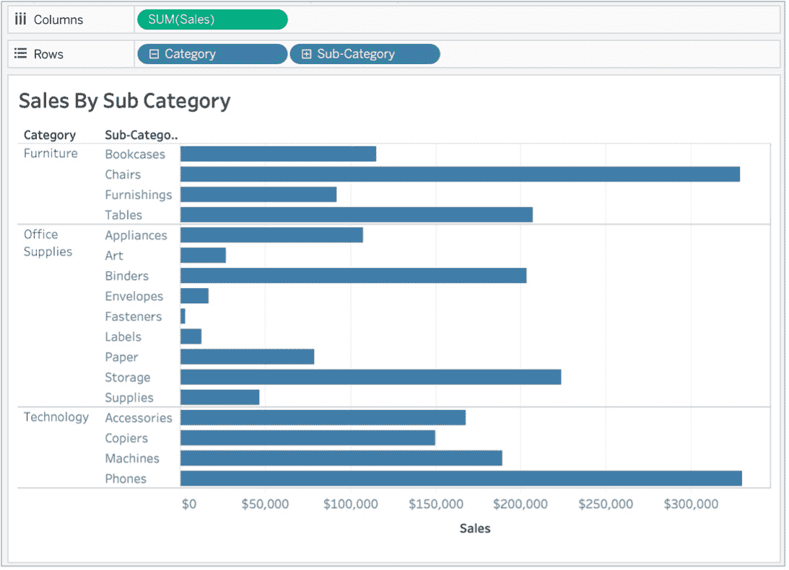

图 11.2：按子类别查看销售

**从工作表视图创建分组：**

1.  按下*Ctrl*键并选择或按下*Command*键。在视图中选择子类别以选择多个“子类别”成员。然后，右键单击以分组它们或点击工具栏或在此处显示的工具提示中的分组图标：

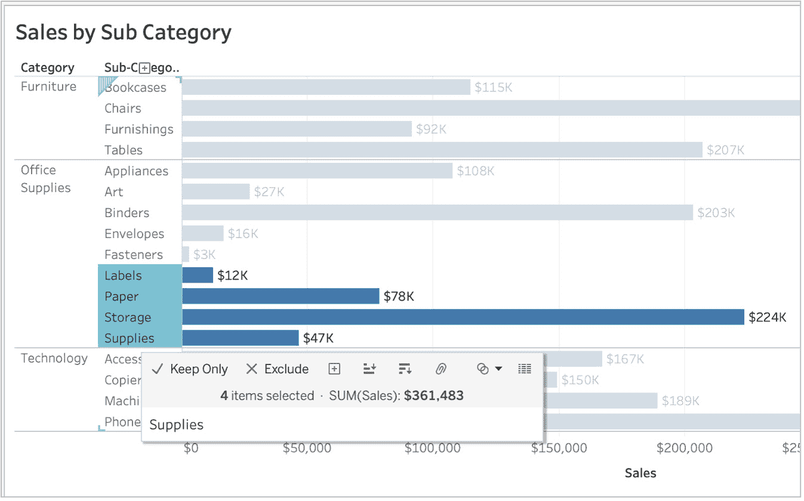

图 11.3：添加分组

1.  如您所见，已创建一个新的“标签、纸张、存储和用品”子类别分组。您也可以通过右键单击并更改别名来重命名子类别分组，使其更具描述性，例如如果您希望将其命名为*办公文具*。

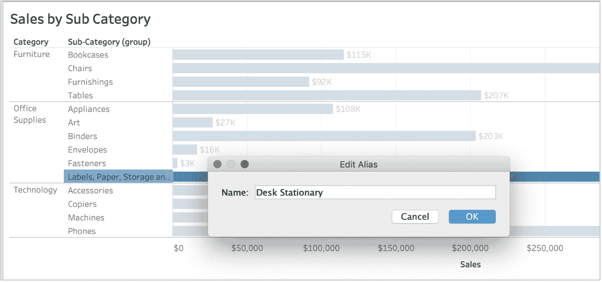

图 11.4：命名分组

**从数据面板创建分组：**

在前面的步骤中，您使用了工作表视图来创建分组。现在您将通过“数据”面板创建一个单独的分组：

1.  按照上述步骤创建一个新的工作表。

1.  创建一个条形图，显示“销售”在“类别”和“子类别”之间的分布，如图所示：


图 11.5：从数据面板添加分组

1.  在“数据”面板中右键单击“子类别”维度，并将鼠标悬停在“创建”上。如图所示，从子菜单中点击“分组...”：

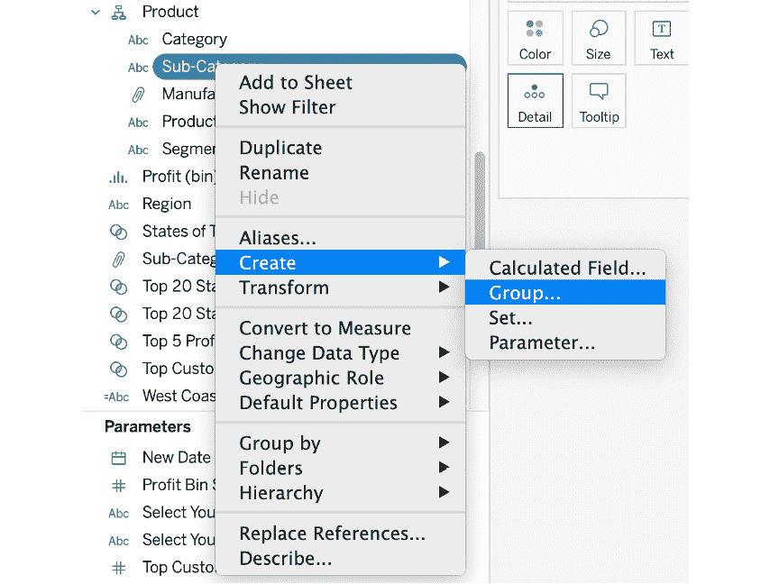

图 11.6：从数据面板创建分组

1.  在分组弹出窗口中，将字段名称更改为更具描述性的名称：“纸张子类别（分组）”。

1.  按住*Ctrl*或*Command*键并多选您想要分组的子类别。在这种情况下，将所有与纸张相关的项目放在一个组中，然后点击“分组”按钮：

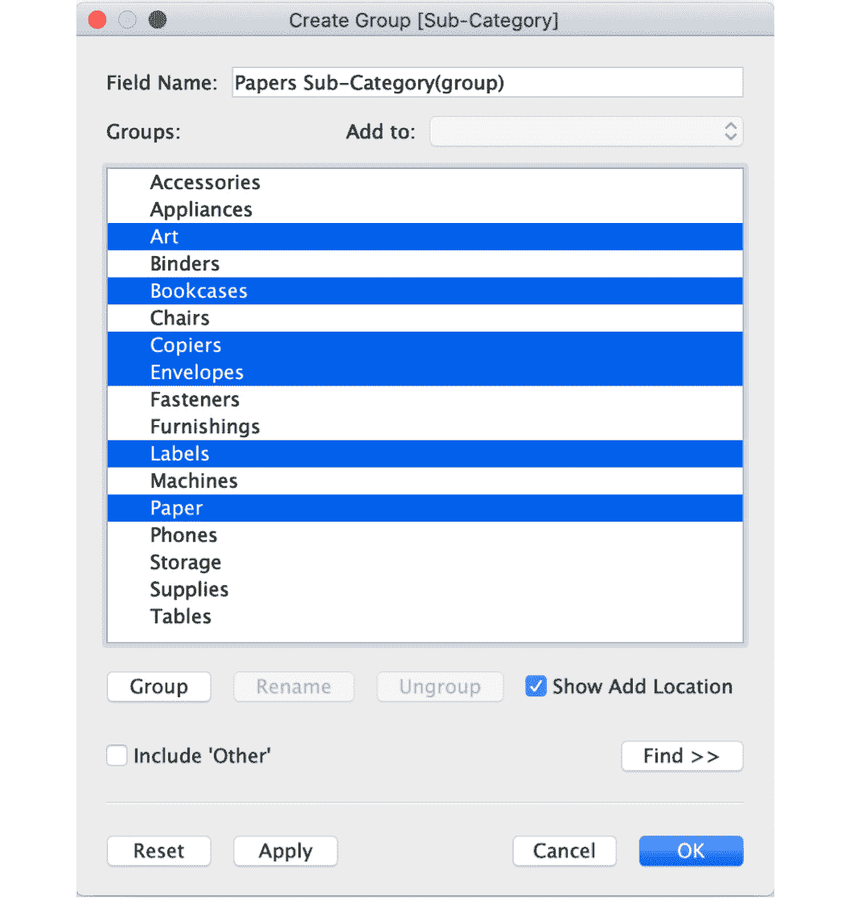

图 11.7：向“纸张子类别”组添加成员

1.  将窗口中选定的项目重命名为“纸张项目”，以便更容易阅读，如图所示。您可以根据需要通过将项目拖入或拖出组来添加或删除项目。

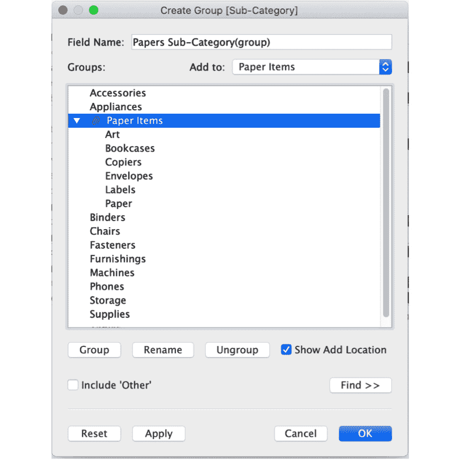

图 11.8：编辑分组

1.  要检查您的分组是否按预期工作，将新创建的组维度“纸张子类别（分组）”拖到“行”架上，并从视图中删除“类别”以及“子类别”维度。您将注意到您在上一步骤中创建的组：

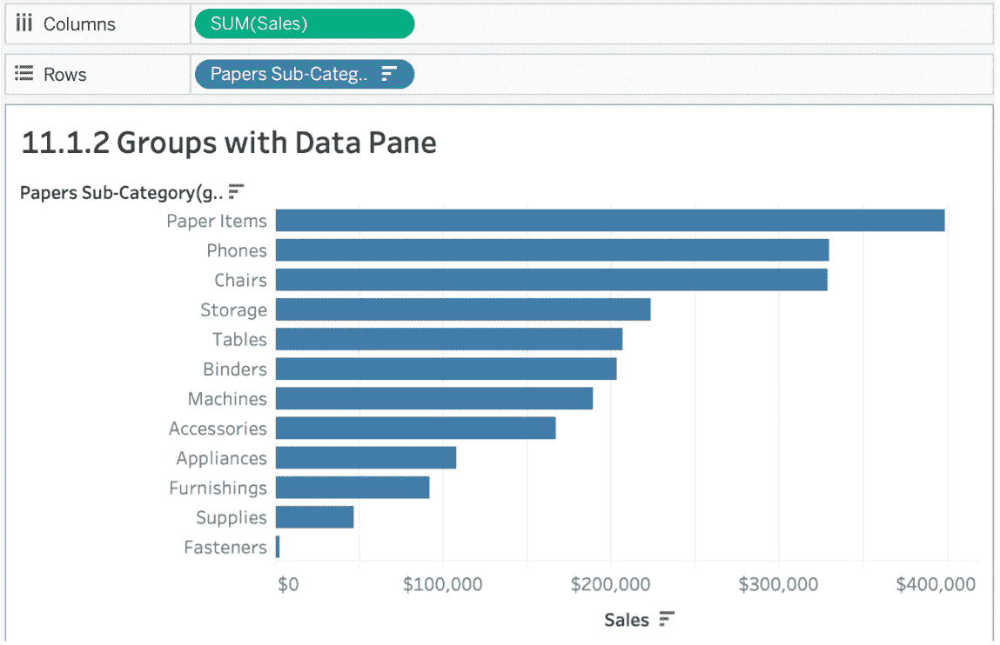

图 11.9 子类别分组

在这个练习中，您探索了创建分组的两种方法：通过工作表视图和“数据”面板。完成此任务后，子类别经理现在有了一种查看多个分组子类别 KPI 的方法。

注意

如果您现在或将来想要编辑分组，请在“数据”面板中右键单击新创建的分组维度（带有 *clip* 图标的维度）并点击“编辑分组”。在“编辑分组”弹出窗口中，您可以通过拖放来删除成员或向组中添加新成员。

# 层次结构

层次结构并不仅限于 Tableau。因此，您很可能之前已经使用过它们，无论是自觉还是不自觉。在数据环境中，当相关数据根据其详细程度逻辑排列时，它被称为“样本 - 超级商店”数据集，您已经多次使用过层次结构，包括包含“国家/地区”、“州”、“城市”和“邮政编码”的“位置”层次结构；产品层次结构由“类别”、“子类别”、“制造商”和“产品名称”组成。层次结构使您能够全面了解您的数据。例如，如果您将“州”维度添加到您的视图中，由于您数据中预先创建的层次结构，您可以通过点击您的架上的`+`图标从州切换到城市，或者通过点击此处所示的`-`符号向上提升一个级别：

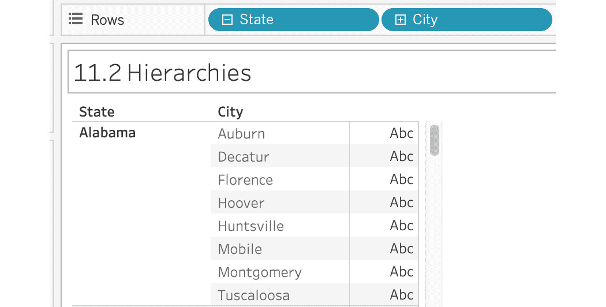

图 11.10：默认层次结构

通过以下简短练习看看层次结构是如何创建的。

## 练习 11.02：创建层次结构

作为 emzon.com 的电子商务分析师，产品目录经理希望将“段”添加到“产品”层次结构中。您将首先需要移除原始的“产品”层次结构，然后通过组合现有的一个来创建新的“产品”层次结构。

注意

如果您在 Tableau Desktop 中加载 Tableau 提供的默认“样本 - 超级商店”数据集，您可能会注意到一些字段缺失或添加了新字段。这是预期的，因为 Tableau 会根据需求不断更新数据文件。如果您想避免混淆，请从本章的官方 GitHub 仓库下载数据集，链接如下：[`packt.link/eLmSX`](https://packt.link/eLmSX)。

1.  在您的 Tableau 实例中打开“样本 - 超级商店”数据集，如果它尚未打开。

1.  只有当您的数据版本中内置了“产品”层次结构时，才遵循以下 *步骤 2* 和 *步骤 3*。如果没有，请直接进入步骤 4。假设在您的“数据”面板中您找到一个（如图所示）附加到“产品”维度的“决策树”图标，决策树表示该维度是层次结构，可以在您的视图中进行下钻。


图 11.11：层次结构图标

1.  在您的“维度”数据面板中导航到“产品”维度，然后右键单击“产品”维度。然后点击“移除层次结构”：


图 11.12：移除层次结构

一旦删除层次结构，`决策树` 图标也会被删除，并且层次结构中曾是部分的维度随后成为它们自己的维度。你也将无法向下钻取，因为它们不再是逻辑上排列的。

1.  要重新构建我们刚刚删除的层次结构，请按住 *Ctrl* 并选择（对于 Windows）或 *Command* 并选择（对于 Mac）所有曾是产品层次结构一部分的维度。在这种情况下，这将包括 `类别`、`子类别`、`制造商`、`产品名称` 和 `细分市场`。

1.  选择所有提到的维度后，右键单击所选维度中的任何一个，将鼠标悬停在 `层次结构` 上，点击 `创建层次结构…`，并按此处所示命名层次结构为 `产品`：


图 11.13：创建新的层次结构

理想情况下，上一步骤中多选的顺序应该允许 Tableau 选择你的层次结构的层级。不幸的是，Tableau 按字母顺序对它们进行分级，这不是你想要的层级：

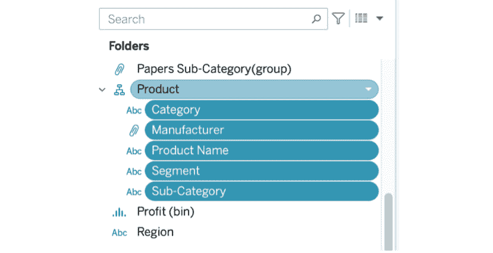

图 11.14：新创建的层次结构

1.  在创建层次结构之前，你应该对层次结构的逻辑层级有一个很好的了解。在这种情况下，这些是 `类别` | `子类别` | `制造商` | `产品名称` | `细分市场`。根据层级拖动你的维度到上方或下方。例如，`子类别` 位于 `细分市场` 之下，所以将 `子类别` 拖动到 `产品名称` 和 `制造商` 之上：

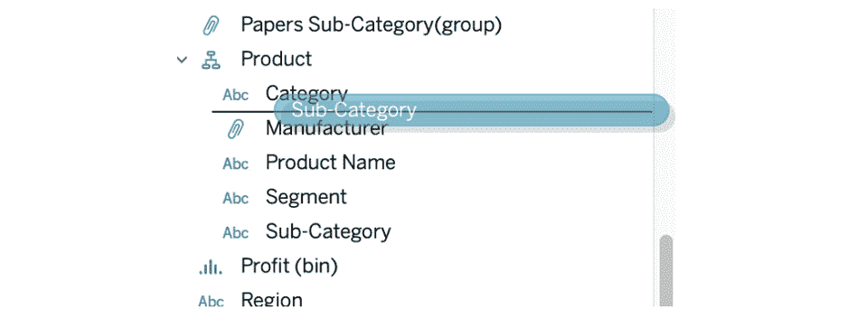

图 11.15：拖动维度以更改其逻辑顺序

1.  检查层次结构是否按预期工作。将 `产品` 层次结构拖到 `行` 档中，并双击 `销售` 以通过 `产品` 层次结构创建 `销售` 报告。

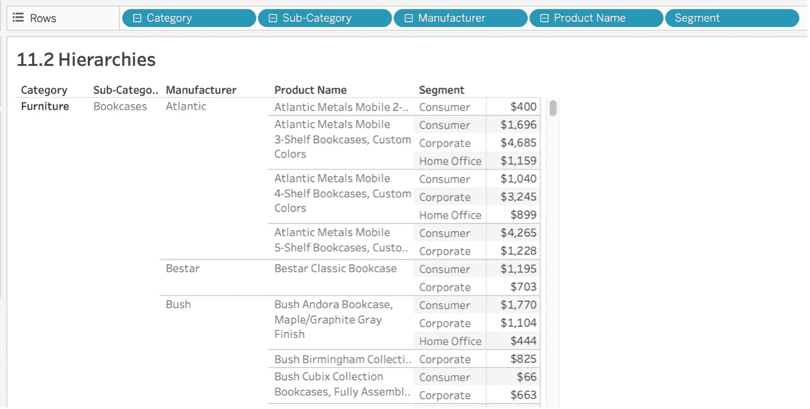

图 11.16：最终层次结构

与组一样，当你可以根据数据点的详细程度或粒度逻辑地排列相关数据点时，层次结构非常有用。在这个练习中，你不仅删除了，还重新创建了一个 `产品` 层次结构。

# 过滤器：Tableau 的灵魂和核心

如果你想要与普通的 Tableau 开发者区分开来，理解操作顺序以及 Tableau 处理和过滤数据的方式至关重要。换句话说，要成为 Tableau 的真正专家，你需要能够确定数据何时何地被过滤，并在视图没有产生你预期的数据时找出原因。

将操作顺序视为查询管道。Tableau 过滤数据的方式至关重要，Tableau 遵循顺序，如下面的图表所示。

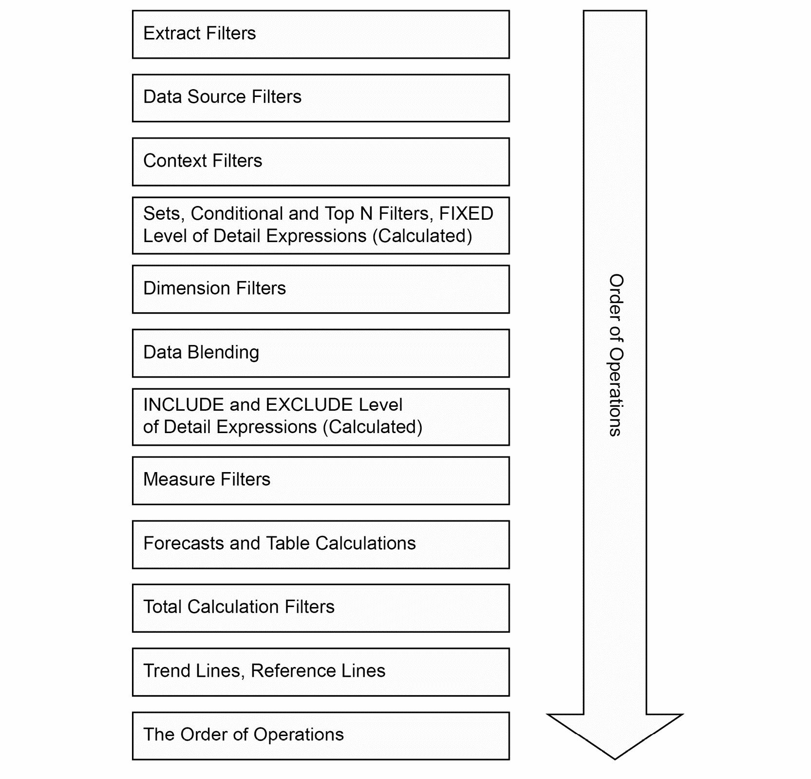

图 11.17：Tableau 操作表

当你在 Tableau 中创建业务仪表板时，你将需要处理多个过滤器、表格计算和计算字段。与大多数程序一样，执行遵循一定的顺序/操作优先级。操作顺序就是如此。在上面的图表中，`提取过滤器`具有最高优先级，其次是`数据源过滤器`和`上下文过滤器`，而`趋势线、参考线`具有最低优先级。在接下来的子节中，我们将通过练习尝试解释大多数过滤器，以展示其重要性。

## 数据源和提取过滤器

数据源和提取过滤器在 Tableau 的操作顺序中排在第一位，在创建第一个视图或加载数据到 Tableau 实例之前进行。这种过滤在你不希望将服务器/源文件中的所有数据加载到 Tableau 实例时非常有用。以下练习中将展示其实际应用。

## 练习 11.03：使用提取/数据源过滤器过滤数据

作为分析师，你希望只将数据子区域加载到你的 Tableau 工作表中，以降低仪表板的负载并限制下载到工作表中的数据量。只为`东部`地区创建一个按`州`划分的`销售`视图。

1.  如果你还没有打开，请打开你的 Tableau 实例中的`Sample - Superstore`数据集。

1.  在屏幕左下角双击`数据源`以创建一个示例视图。

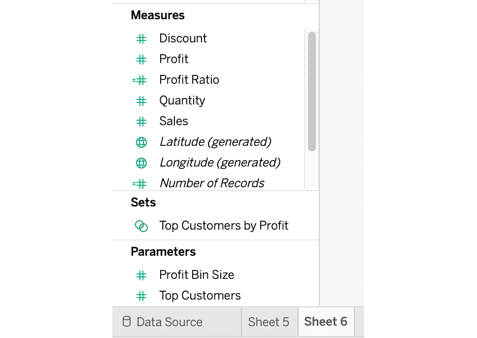

图 11.18：数据面板视图

1.  要仅为你视图中的`东部`地区导入数据，请在此处将其添加为`数据源过滤器`。在`数据源`页面上，点击视图右上角的`过滤器`部分中的`添加`。

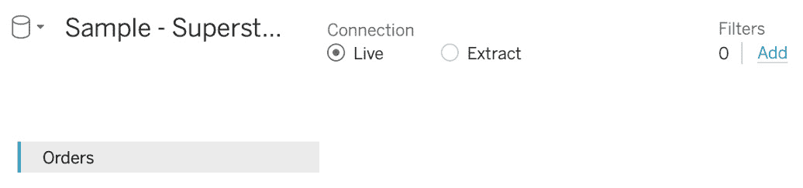

图 11.19：数据源视图

1.  在`编辑数据源过滤器`窗口中，点击`添加…`按钮，选择`区域`，然后点击`确定`。只需从列表中选择`东部`并点击`确定`按钮。再次点击`确定`按钮以关闭对话框：

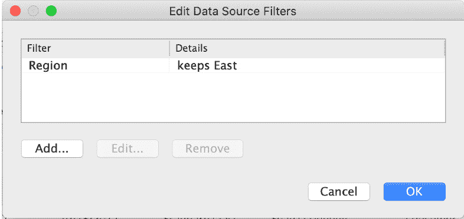

图 11.20：添加数据源过滤器

1.  为了确认过滤器的功能，创建一个新的工作表并审查你的数据中的`州`的`销售`：

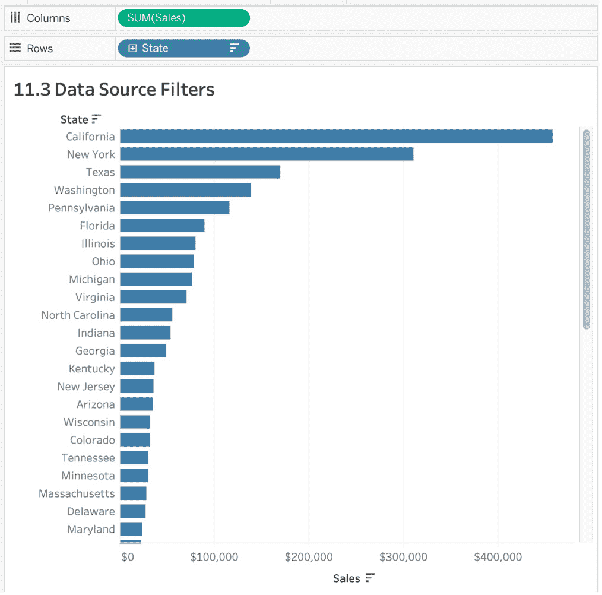

图 11.21：添加数据源过滤器后的数据

由于数据不是千兆或兆字节规模，你可能不会注意到在加载数据视图中的任何维度时的速度差异。如果你正在处理大规模数据，利用数据源过滤是提高工作效率的一种方法。

当你导入的数据源包含比你报告/仪表板所需更多的数据时，你可以利用数据源过滤器来提高效率并减少对 Tableau 视图的负载。在这个练习中，你的目标是提高仪表板的性能，通过使用数据源过滤器，你能够限制工作表中加载的数据量。

## 使用视图的过滤器

这些类型的过滤器类似于你使用视图分组维度的方式。在这种过滤方式中，你手动选择视图中的一个或多个数据点以包含或排除。在接下来的练习中，你将执行以下简单步骤来以这种方式创建过滤器。

## 练习 11.04：从视图中创建过滤器

作为一名分析师，你已经获得了全新的数据，作为仪表板设计过程的一部分，你想要进行一些**探索性数据分析**（**EDA**）。使用视图创建过滤器可以是一种很好的过滤数据的方式，因为你可以在工作表中看到数据。

执行以下步骤来完成此练习：

1.  如果您还没有这样做，请在您的 Tableau 实例中打开`Sample - Superstore`数据集。

1.  创建一个按`State`划分的`Sales`条形图。将`State`拖放到`行`架中，将`Sales`拖放到`列`架中。你应该得到以下视图：

![图 11.22：按州划分的销售视图

![img/B16342_11_22.jpg]

图 11.22：按州划分的销售视图

1.  手动选择你想要包含/排除的州/数据点。点击并拖动一个区域，如这里所示排除销售量前五的州：

![图 11.23：拖动多个数据点创建过滤器

![img/B16342_11_23.jpg]

图 11.23：拖动多个数据点创建过滤器

1.  如果你将鼠标悬停在所选区域上几秒钟，会出现一个工具提示选项。从这里，选择`仅保留`或`排除`所选州。你将排除这些州，因此点击`排除`：

![图 11.24：从视图中包含/排除数据点

![img/B16342_11_24.jpg]

图 11.24：从视图中包含/排除数据点

将`State`维度的过滤器添加到`过滤器`架中。在下一小节中，你将深入了解如何最好地使用`过滤器`架，所以现在请暂时保留你的问题。以下是最终输出：

![图 11.25：从视图中创建过滤器后的最终输出

![img/B16342_11_25.jpg]

图 11.25：从视图中创建过滤器后的最终输出

在这个练习中，你练习了手动选择或拖动选择视图的一个子集以包含/排除。使用视图创建过滤器在最初进行 EDA 时非常有帮助，这是所有分析师在创建新仪表板时开始的地方。接下来，我们将深入了解如何最好地利用`过滤器`架。

## 使用过滤器架创建过滤器

在前面的章节中，我们探讨了在数据源级别或使用视图进行数据过滤的方法，但正确利用 Tableau 中的过滤器是通过`过滤器`架来实现的。在本节中，我们将讨论如何使用`过滤器`架来过滤维度、度量以及日期。但首先，我们将深入了解当您拖动任何提到的数据类型时打开的`过滤器`对话框的选项。

### 使用过滤器架进行维度过滤

Tableau 中的维度本质上属于分类数据。当过滤维度时，您要么将数据的一部分包含在视图中，要么排除。以下对话框在您将维度拖到`过滤器`架时打开：

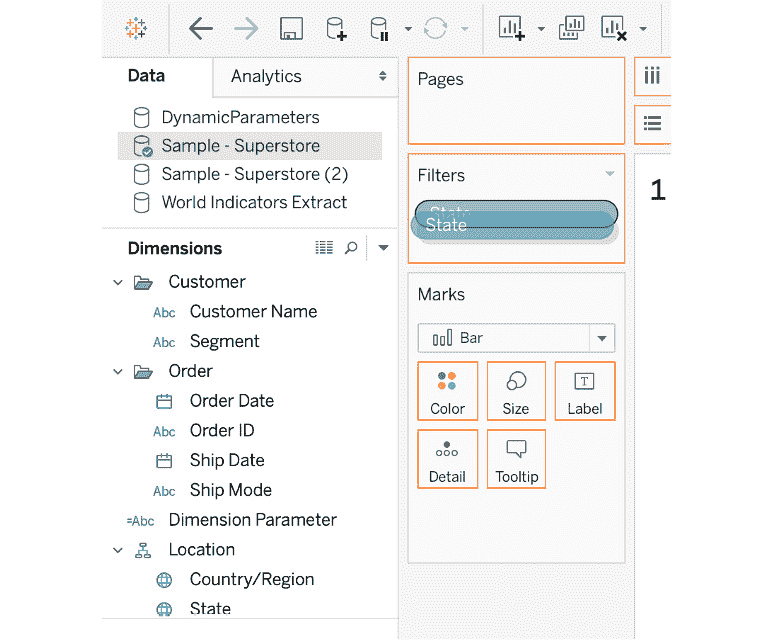

图 11.26：将维度拖到过滤器架

该框有四个选项卡，如下所示：

+   在“供应”和“表格”上的`子类别`，你可以手动选择仅包含两个子类别，如下所示：

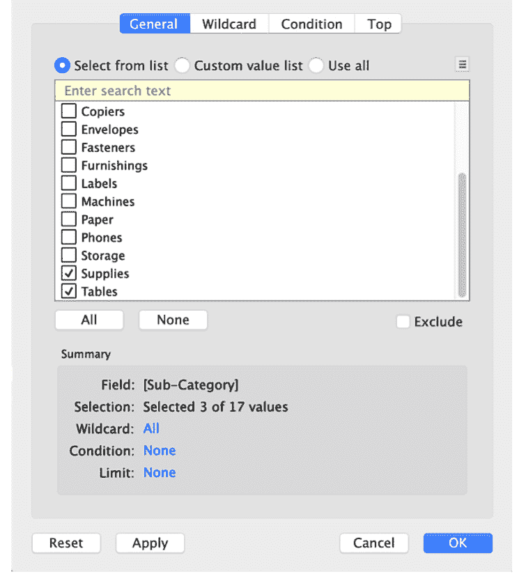

![图 11.27：过滤器架常规选项卡+   `通配符`选项卡用于匹配用于过滤的文本模式。比如说，您有一个包含数千个 URL 的列，这些 URL 可能包含或不包含 URL 中的`football`术语。手动使用`常规`选项卡选择包含`football`术语的所有 URL 将非常耗时，但使用`通配符`，您可以通过指定维度是否包含、以`football`开头、以`football`结尾或完全匹配`football`术语来匹配值，从而匹配 URL 维度。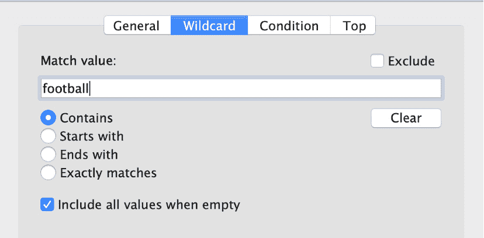

图 11.28：过滤器架通配符选项卡

+   在`条件`选项卡中，您定义用于过滤数据的规则或标准。例如，您还可以使用`条件`选项卡来过滤那些在您的数据中报告亏损的子类别。为此，选择`按字段`，然后在下拉菜单中选择`利润`，聚合为`Sum`，如下所示：

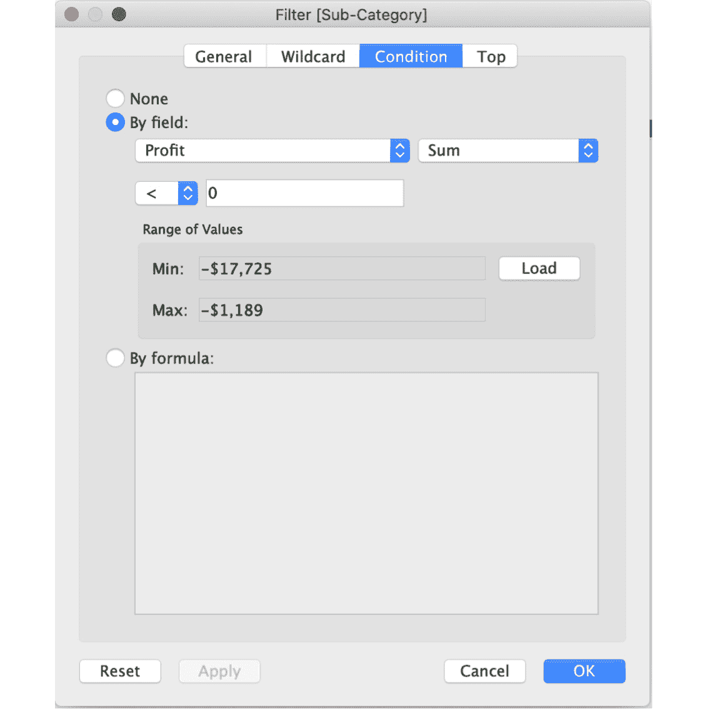

图 11.29：过滤器架条件选项卡

+   当您想要根据要过滤视图的度量计算`Top`或`Bottom` N 个成员时，请使用`过滤器`框中的`Top`选项卡。在本例中，您知道`Bottom`三个子类别是亏损的行，因此您可以使用这些详细信息创建一个`Bottom`过滤器，如下所示：

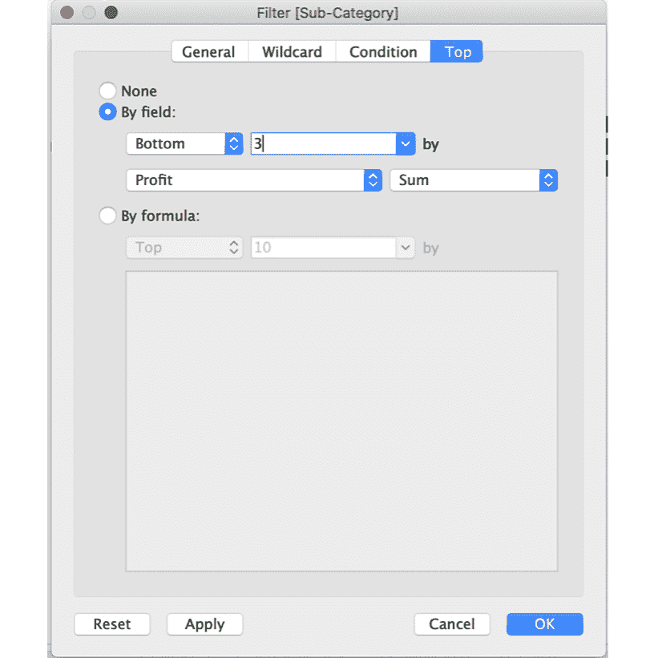

![图 11.30：过滤器架顶部视图接下来，您将在练习中使用`过滤器`对话框。## 练习 11.05：使用过滤器架进行维度过滤投资组合经理的任务是确定所有不盈利的子类别的列表。你的任务是创建一个通过`过滤器`架的动态过滤器。完成此练习的步骤如下：1.  如果您还没有打开，请打开您的 Tableau 实例中的 Sample - Superstore 数据集。1.  创建一个`按子类别计算利润`条形图，并将`子类别`拖放到`行`架，将`利润`拖放到`列`。您应该得到以下视图：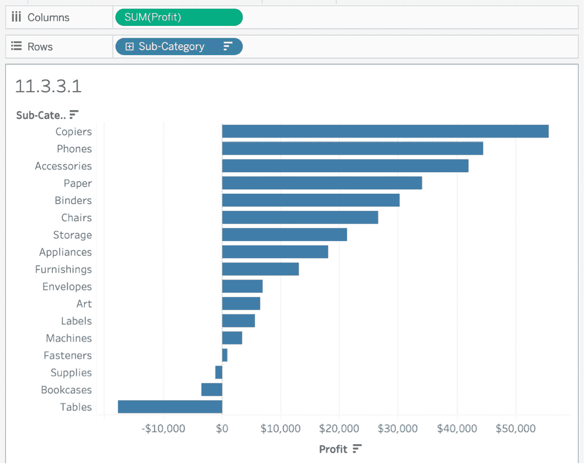

图 11.31：按子类别计算利润视图

注意，有三个子类别（`供应品`、`书架`和`桌子`）在超市亏损。您希望将它们包含在您的视图中，并排除所有其他子类别。您显然可以从视图中手动选择子类别，但请按照下一步的说明使用`过滤器`架。

1.  将`子类别`从`数据`面板拖放到`过滤器`架，将打开一个`过滤器[子类别]`对话框。

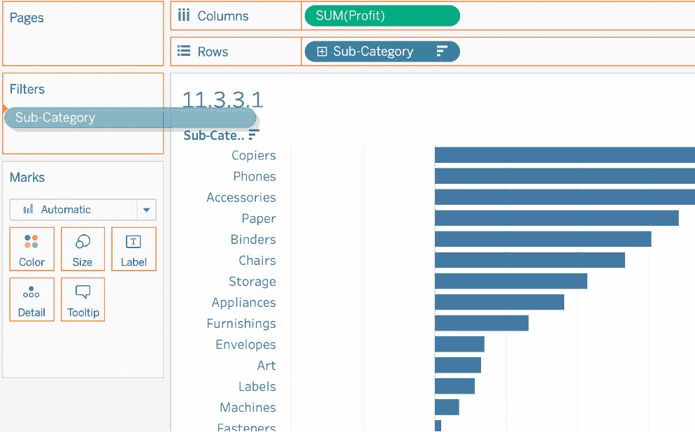

图 11.32：仅显示盈利子类别

1.  在对话框中，点击`条件`选项卡，选择`按字段`，并过滤所有 `[利润] <0` 的子类别。您将得到所有亏损子类别的列表。点击`确定`以过滤数据。

1.  您应该得到以下视图，显示所有亏损子类别的列表：

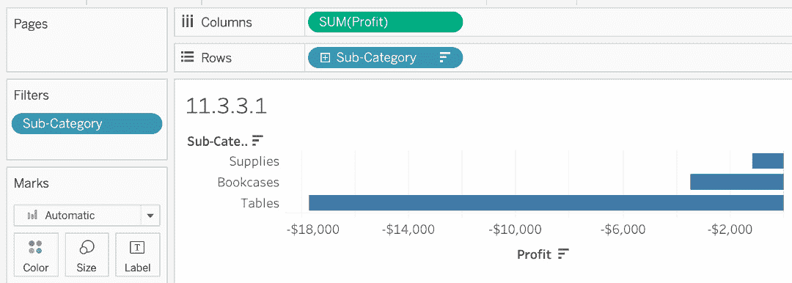

图 11.33：仅显示亏损子类别

在您作为数据分析师的职业生涯中，您可能会发现自己每天都会使用`过滤器`架作为您工作的一部分，这使得掌握这项技能变得至关重要。在这个练习中，您探索了 Tableau 在`过滤器`架中为维度提供的所有选项。

### 使用过滤器架进行测量过滤器

度量是定量数据，这意味着，与维度不同，对度量的过滤涉及选择您想要包含/排除在视图中的数值范围。每次您将`度量`拖放到`过滤器`架时，`过滤器`对话框都会为您提供四个选项来过滤`度量`。以下列表将更详细地定义这些选项：

+   **测量过滤器对话框**：

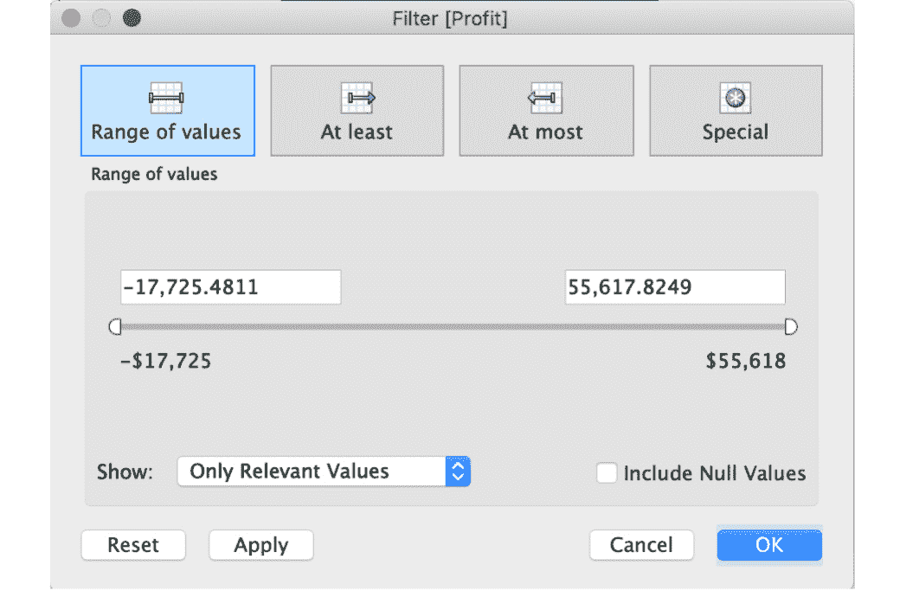

图 11.34：过滤器窗口中的值范围

+   `值范围`，您指定要过滤的值范围。在这种情况下，您只想显示盈利子类别，因此您的范围将从零到最大值，如下一张截图（图 11.35）所示。

+   `至少`，您指定最小值，所有大于或等于最小值的值都将包含在您的视图中。这通常在您无法控制列/数据的最大值时使用，并且难以预测。在这种情况下，您的最小值将是零，因为您只想显示此处所示的盈利子类别：


图 11.35：至少过滤器窗口

+   “最多”是“至少”的反义词，当您想包含所有小于或等于最大指定值的值时使用。这通常在您无法控制最小值但知道要包含在视图中的最大值时使用，这与“至少”选项卡正好相反。您不能使用“最多”来识别盈利的子类别，因为所有负值也会包含在视图中，如果您使用“最多”，您将无法控制它们。

+   **特别说明**：正如其名所示，此筛选器仅在您想包含空值、非值或所有值时使用。此选项卡很少使用，但根据数据，可能需要使用。

## 练习 11.06：使用筛选面板测量筛选

投资组合经理喜欢您创建的亏损子类别视图。现在他希望您创建一个类似的视图，但这次不是亏损子类别，而是希望创建一个盈利视图。您将在以下步骤中利用“利润”作为筛选器来创建视图：

1.  如果您还没有这样做，请在您的 Tableau 实例中打开`Sample - Superstore`数据集。

1.  创建一个按“子类别”的“利润”条形图，并将“子类别”拖放到“行”面板，将“利润”拖放到“列”。您应该看到以下视图：

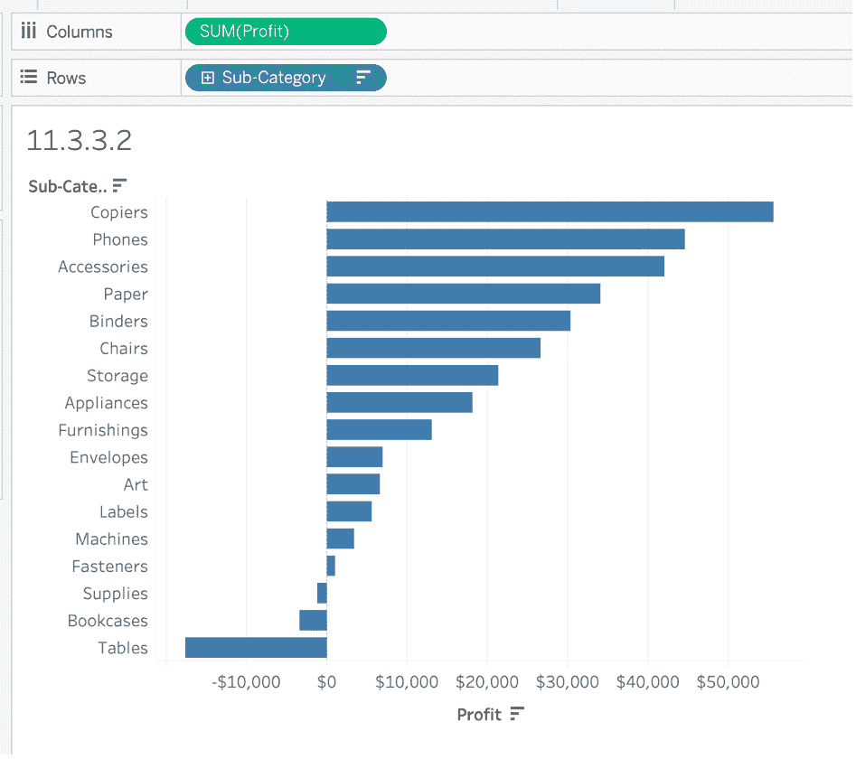

图 11.36：按子类别查看利润

1.  将“利润”从“数据”面板拖放到“筛选”面板。以下对话框将打开：

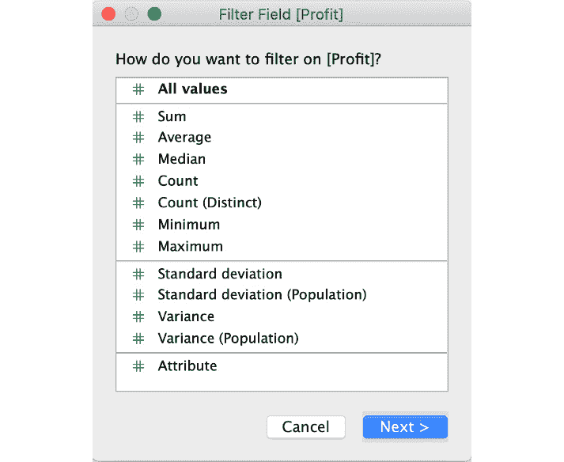

图 11.37：度量值筛选字段选项

1.  在“筛选字段[利润]”对话框中，选择您的度量的聚合方式。在这种情况下，选择“求和”，因为您想查看利润的总和。

1.  “值范围”以及“至少”都可以用于识别盈利的子类别。对于这个练习，请使用“值范围”来过滤盈利的子类别。

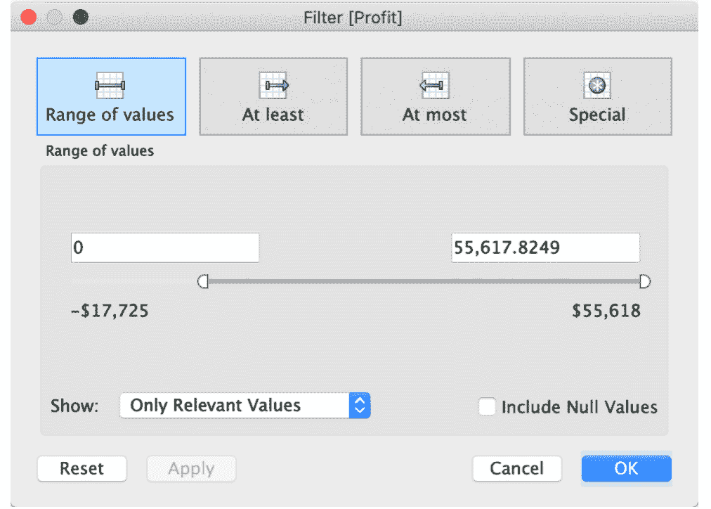

图 11.38：度量值的范围

1.  无论您决定使用哪个“利润”选项，您的最终输出应该类似于以下内容：

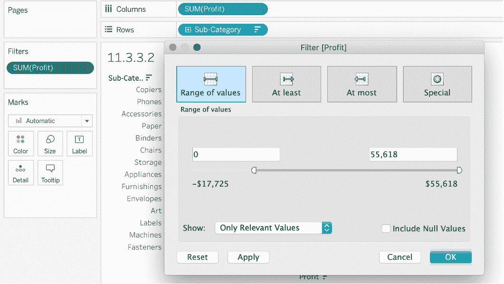

图 11.39：度量值筛选最终输出

在这个练习中，您第一次使用“度量”数据类型作为筛选器，并详细探讨了 Tableau 的相应选项。您使用“利润”来筛选仅盈利的子类别。

在下一节中，您将探索使用“筛选”面板进行日期筛选。

### 使用筛选面板进行日期筛选

日期既不是定性数据也不是定量数据。我们可以通过“相对日期”、“日期范围”或离散日期进行日期筛选。让我们探索每个选项以及它们之间的区别，并在解释后的练习中，我们将通过一个具体用例进行操作。

当您将“订单日期”等日期维度拖动到您的`Sample - Superstore`数据集中时，您将看到以下窗口：

![图 11.40：日期筛选模态窗口

![图片 B16342_11_40.jpg]

图 11.40：日期筛选模态窗口

+   在“相对日期”对话框中，选择“月份”，点击“最后”，并输入`12`个月，如图所示：

![图 11.41：相对日期筛选

![图片 B16342_11_41.jpg]

图 11.41：相对日期筛选

相对日期从视图打开的日期开始定义。如果数据源只有到 2019 年 12 月的日期，而你是在 2020 年 7 月打开的，那么视图将只包括从 2019 年 8 月到数据中存在的最大日期，在这个例子中是 2019 年 12 月。因此，你将只能看到五个月的数据。要更改这一点，你可以检查左下角的“相对于”并输入日期为 2019 年 12 月 31 日，如图所示。

![图 11.42：带有锚定日期的相对日期筛选

![图片 B16342_11_42.jpg]

图 11.42：带有锚定日期的相对日期筛选

+   **按日期范围筛选**：当您想要日期具有固定范围时，您使用此筛选器。在这个用例中，您想要相对于 2019 年 12 月的 12 个月数据，因此您的范围将是 2019 年 1 月到 2019 年 12 月，如图所示：

![图 11.43：按日期范围筛选

![图片 B16342_11_43.jpg]

图 11.43：按日期范围筛选

+   在“筛选字段[订单日期]”对话框中，如果您选择离散日期值，您将筛选整个日期级别。例如，如果您在“月份”上筛选离散日期并选择“一月”，您将筛选“一月”，无论年份如何。如果您想按月份和年份筛选，请从“筛选字段”对话框中选择“月份/年份”。

![图 11.44：按离散日期筛选

![图片 B16342_11_44.jpg]

图 11.44：按离散日期筛选

![图 11.45：按离散月份筛选

![图片 B16342_11_45.jpg]

图 11.45：按离散月份筛选

在以下练习中，您将使用“日期”对话框并创建一个时间序列视图来展示“日期”筛选器的使用。

## 练习 11.07：使用筛选器面板创建日期筛选器

您被要求创建一个相对于数据最后更新日期的最后 12 个月销售额的时间序列视图。您将再次使用`Sample - Superstore`数据集，并利用相对日期，以及在本节中介绍的对齐选项。

执行以下步骤来完成此练习：

1.  如果尚未完成，请在您的 Tableau 实例中打开`Sample - Superstore`数据集。

1.  创建一个显示“销售额”随连续“订单日期”月份变化的折线图，如图所示：

![图 11.46：筛选最后 12 个月后的时间序列视图

![图片 B16342_11_46.jpg]

图 11.46：筛选最后 12 个月后的时间序列视图

您希望折线图只显示最后 12 个月的数据，因此您将使用“过滤器”面板来选择仅显示最后 12 个月的数据。

1.  将“订单日期”拖放到“过滤器”面板中。在“过滤器字段[订单日期]”对话框中，通过“相对日期”、“日期范围”或离散日期过滤来过滤日期。

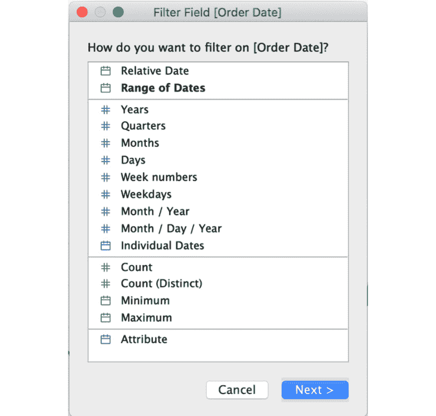

图 11.47：日期过滤器窗口

1.  对于这个练习，您将通过“相对日期”进行过滤，因为您希望您的视图在未来也能动态更新，只显示最后 12 个月的数据。在先前的对话框中单击“相对日期”，在下一屏幕中选择“月份”并输入`12`。

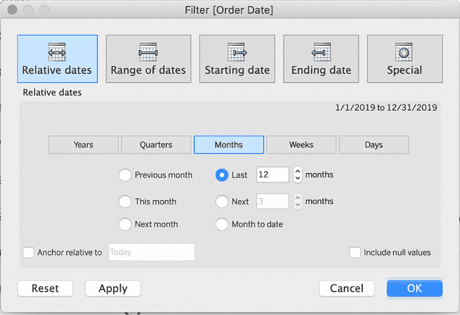

图 11.48：相对日期日期过滤器

这在上面的“注释”部分中已经讨论过。由于“样本 - 超级商店”数据集只有到 2019 年 12 月的数据，并且考虑到这本书是在 2020 年 7 月编写的，您将只看到六个勾选标记。

1.  要更改这一点，请使用“锚定相对到”并输入日期为 2019 年 12 月 31 日，如图所示：

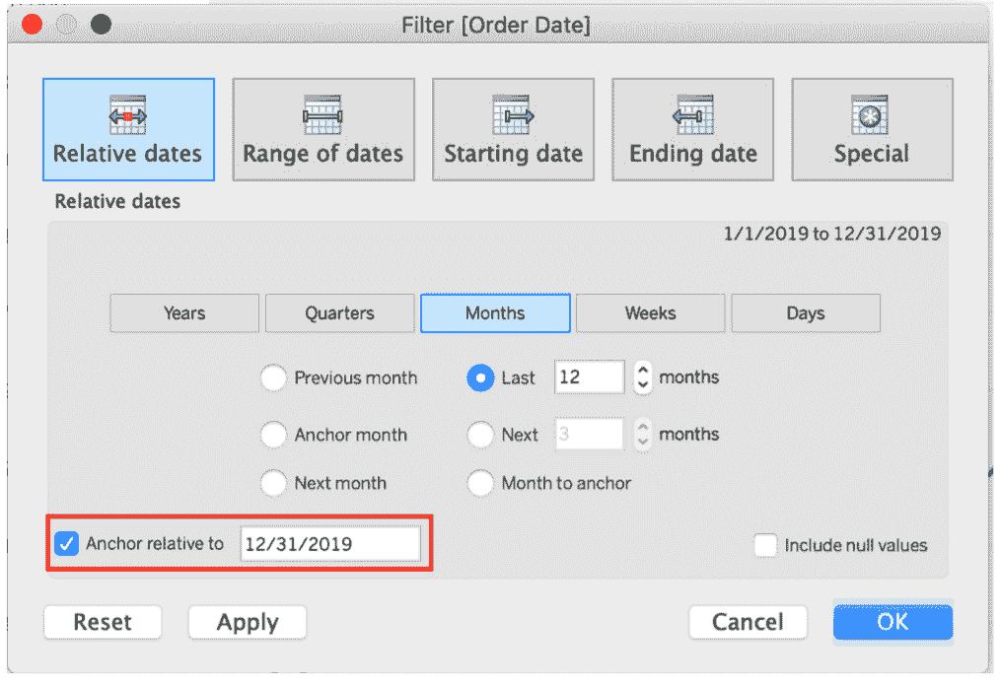

图 11.49：带有锚定日期的相对日期

您通过使用“相对日期”和“锚定相对”到 2019 年 12 月实现了显示数据最后日期的 12 个月趋势的目标。以下是最终输出应该看起来像什么（在“标记”面板中添加了“(订单日期)”标签以提高可读性）：

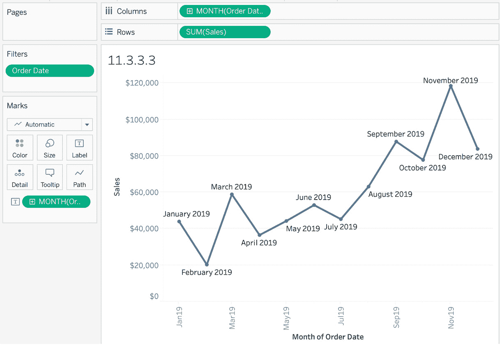

图 11.50：显示相对于锚定日期的最后 12 个月的时间序列

在本节中，您详细了解了可用的日期过滤器选项以及如何最好地使用它们，以及如何最好地使用“锚定相对到”以及何时使用它。

在下一节中，我们将探讨如何让您的报告/仪表板的最终用户能够根据他们的需求过滤报告。

## 快速过滤器

到目前为止，您一直作为开发者使用过滤器，而没有给最终用户提供在视图中过滤的能力。Tableau 被开发者和最终用户社区所喜爱的许多原因之一是它允许最终用户控制视图中的数据流。这减少了与开发者的来回沟通，因为最终用户可以使用过滤器来更改数据并获得他们想要的见解。这种类型的最终用户过滤器控制是通过快速过滤器实现的。

显示快速过滤器有多种方式。它们之间的主要区别如下：

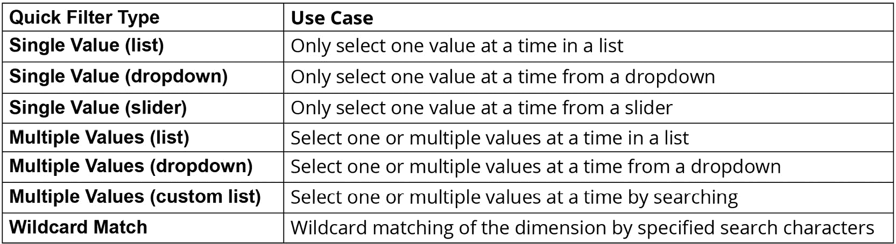

图 11.51：快速过滤器类型

每个快速过滤器都有特定的用途，并且在几乎每个你将构建的仪表板中都得到广泛应用。在接下来的练习中，你将探索一个具体的例子，并回顾添加快速过滤器到你的视图的确切步骤。

## 练习 11.8：创建快速过滤器

创建一个简单的`销售`按`州`视图，并使用`区域`作为快速过滤器，因为区域经理将使用仪表板来过滤他们特定的仪表板。再次使用`Sample - Superstore`数据集来完成此练习。

执行以下步骤：

1.  如果你的 Tableau 实例中尚未打开，请打开`Sample - Superstore`数据集。

你将创建一个`销售`按`州`的交叉表，并使用`区域`作为快速过滤器，但首先你需要构建视图。

1.  将`State`拖放到`Rows`架，然后双击`Sales`以创建`销售`按`州`的表格。我们现在将通过选择所有值将`Region`添加到`Filters`架中的过滤器：

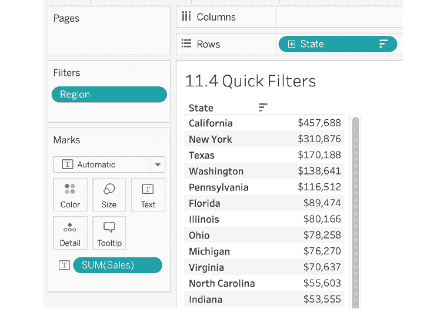

图 11.52：按州销售视图

1.  点击下拉箭头或简单地右键单击`Filters`架上的`区域`维度，然后选择`显示过滤器`：

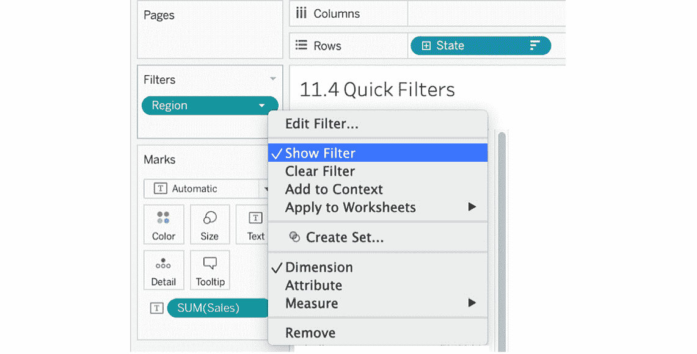

图 11.53：显示过滤器步骤

1.  将`Region`快速过滤器从右侧拖放到左侧，位于`Marks`架下方，以便于使用。Tableau 自动创建了一个`Multiple Values (list)`作为快速过滤器。如果你悬停在`Region`快速过滤器上的箭头上并单击，如图所示，你会得到以下选项：

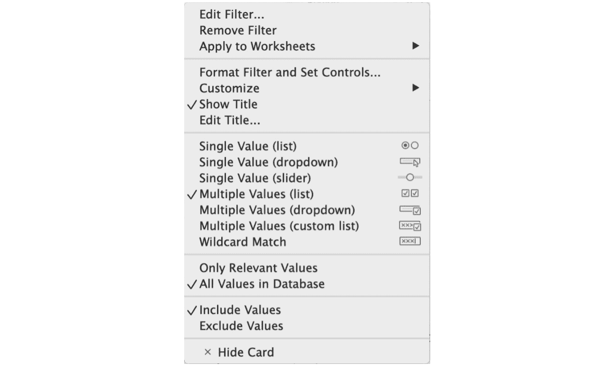

图 11.54：快速过滤器类型选项

1.  作为对 Tableau 中所有快速过滤器类型的回顾，请查看以下内容：

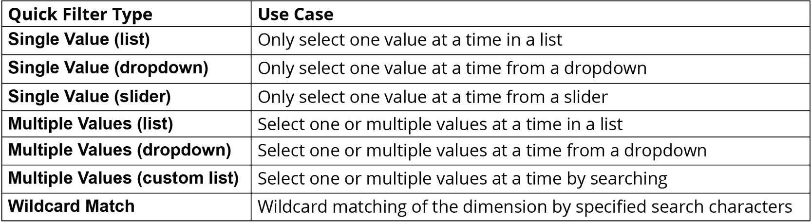

图 11.55：快速过滤器类型（回顾）

1.  在这个用例中，你希望你的最终用户能够控制他们想要查看的区域，以便他们能够一次性查看一个或所有区域。为此，选择`单个值（列表）`，将快速过滤器类型从`多个值（列表）`更改为`单个值（列表）`，并保持`自定义`选项中的`显示“所有”值`复选框选中，如图所示：

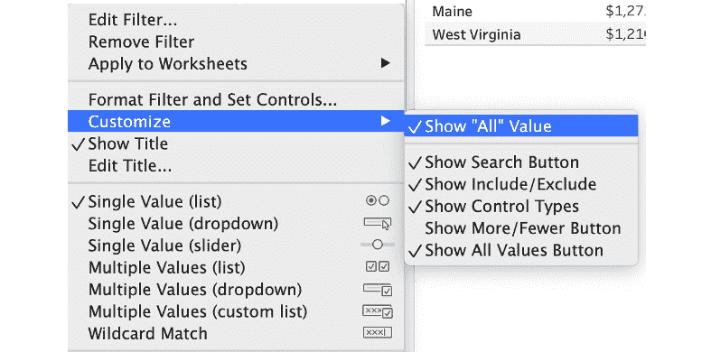

图 11.56：快速过滤器自定义选项

1.  在我们的快速过滤器中，将`区域`设置为`East`，最终输出应类似于以下视图：

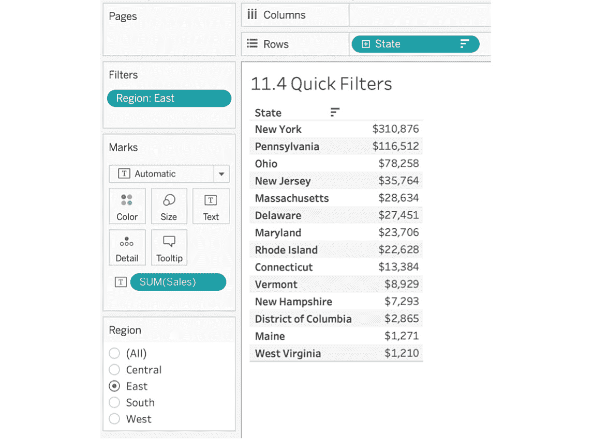

图 11.57：添加快速过滤器后的最终输出

快速过滤器是 Tableau 成为如此强大工具的原因，即使对于最终用户也是如此。在本节中，你学习了快速过滤器类型之间的主要区别以及它们最佳的使用案例。然后你创建了按`州`的`销售`，并使用`区域`作为快速过滤器。

## 在多个工作表/多个数据源或整个数据源上应用过滤器

当您向视图中添加过滤器时，它仅适用于您当前视图。但有时您可能想要在多个选定的、使用相同或相关数据源（如果存在主次数据源之间的关系）的工作表中应用相同的过滤器。本节将探讨每个选项之间的差异以及何时使用它们。

![图 11.58：应用到工作表选项]

![图片 B16342_11_58.jpg]

![图 11.58：应用到工作表选项]

+   将过滤器应用于“仅此工作表”：在此，添加到工作表的过滤器仅应用于添加过滤器的那个工作表。

+   将过滤器应用于“所选工作表...”：如果您想要在多个工作表或所有工作表中应用过滤器，此选项非常有用。在上一个部分中，您创建了“区域”过滤器。假设您想在属于 Tableau 工作簿的其他几个工作表中使用相同的过滤器。您可以按照以下方式操作：

![图 11.59：应用到所选工作表的过滤器]

![图片 B16342_11_59.jpg]

![图 11.59：应用到所选工作表的过滤器]

+   将过滤器应用于“所有使用此数据源”：如果您想使用“区域”维度过滤所有使用相同“样本 - 超市”数据集的工作表，请使用此选项。如果工作簿只包含一个数据源，您也可以通过在“所选工作表”选项中选择所有工作表来实现相同的结果。

+   将过滤器应用于“所有使用相关数据源”：当您想要在多个数据源中使用当前工作表中的过滤器时，请选择此选项。此功能于 2016 年发布，当 Tableau 宣布此功能发布时，公司提到这是有史以来最受欢迎的功能之一。

此选项仅在您在当前或主数据源与次级数据源之间创建关系时才有效。您可以通过在菜单栏中导航到“数据”，然后点击“编辑关系”来完成此操作。如果 Tableau 没有自动在数据源之间创建一些关系，您可以根据用例创建自定义关系。

当数据源中公共列的名称不匹配时，“自定义关系”非常有用。一旦您能够创建关系，您就可以选择“所有使用相关数据源”以使其魔法生效。当您进行数据混合时，这非常有用，这在之前的章节中已有讨论。

## 上下文过滤器

当您在 Tableau 视图中添加多个过滤器时，每个过滤器都是独立于其他过滤器进行计算的。因此，如果您在视图中有两个快速过滤器，如“类别”和“子类别”，当您选择/取消选择过滤器时，Tableau 会使用所有数据来显示视图。

如果你想要限制整个数据源的计算并提高报告/仪表板的性能（更多内容将在接下来的练习中介绍），你将想要使用上下文过滤器。这些过滤器有助于 Tableau 理解数据的上下文，并限制每次你在视图中更改过滤器时发生的数据过滤/加载量。

在 Tableau 的操作顺序中，“上下文过滤器”具有第三优先级。因此，当你设置一个过滤器为上下文过滤器时，你实际上是在创建一个独立的过滤器，而所有其他不是上下文过滤器的过滤器都成为依赖过滤器。这是因为其他快速过滤器只会处理首先通过上下文过滤器过滤的数据。

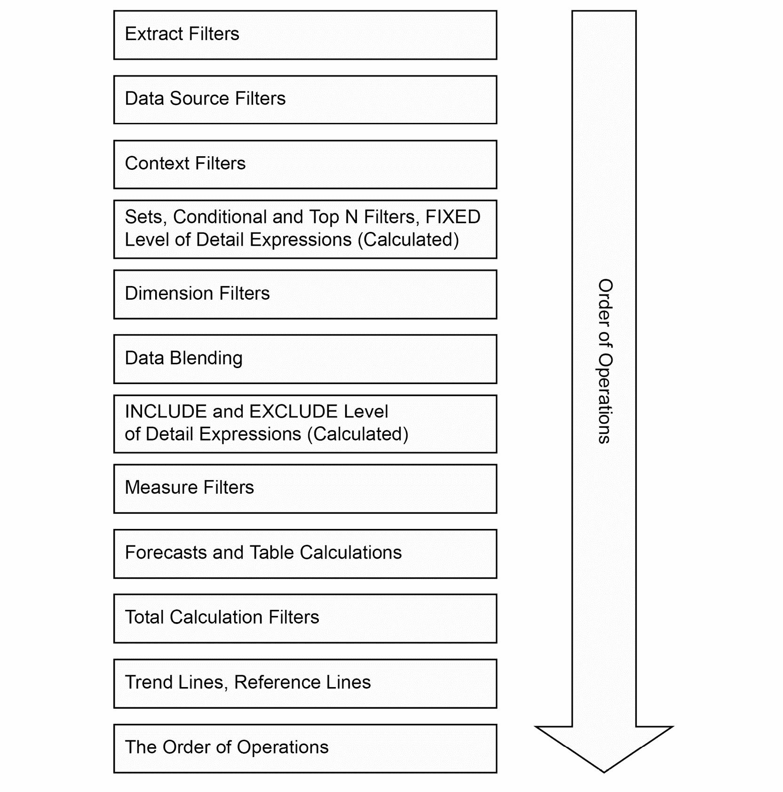

图 11.60：Tableau 操作顺序

实际中的例子将在下面详细说明。

## 练习 11.09：创建和使用上下文过滤器

在这个练习中，你将创建并使用上下文过滤器，通过使用“样本 - 超市”数据集的示例用例来了解为什么掌握 Tableau 的操作顺序如此有益。

1.  如果你还没有打开，请打开你的 Tableau 实例中的“样本 - 超市”数据集。

1.  创建一个按“子类别”排序的“销售额”条形图视图，按“销售额”降序排序，并将“类别”添加到“过滤器”架中，以快速过滤的形式显示。你应该有如下视图：

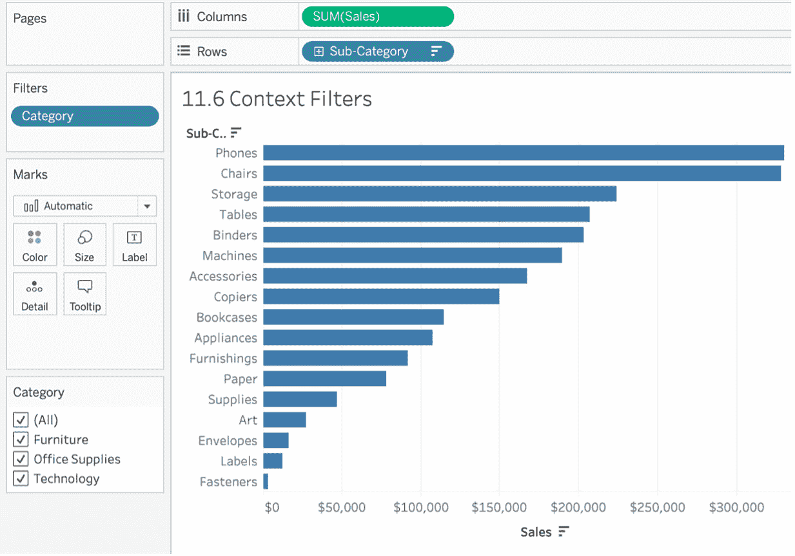

图 11.61：按子类别查看销售额

1.  要仅显示按销售额排名前五的子类别，请将子类别添加到“过滤器”架中，并使用“顶部”选项卡，通过“销售额”的“总和”来过滤前五个子类别，如图所示：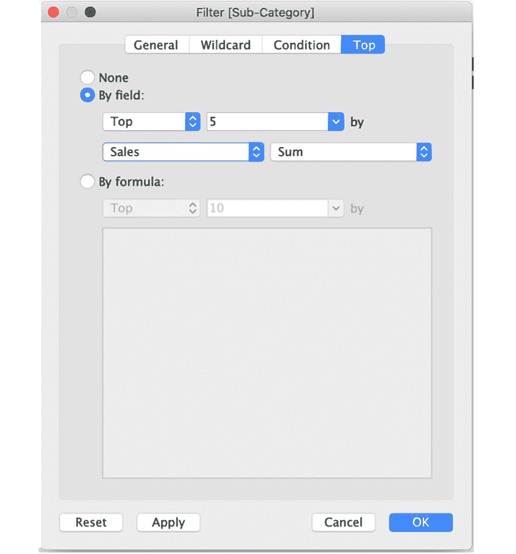

图 11.62：Top N 过滤器视图

1.  注意，视图中显示的所有前五个子类别。然而，如果你开始取消选择一些“类别”快速过滤器，你会注意到只有一些前五个子类别仍然在视图中。

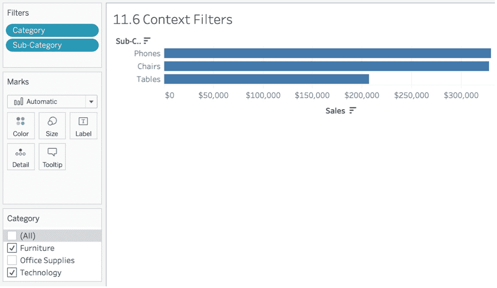

图 11.63：上下文过滤器的必要性

这种情况发生的原因（如你可以在以下图中看到）是，在 Tableau 的操作中，首先对前 N 进行过滤，然后再将维度过滤应用于视图。因此，当你使用前 N 过滤器时，Tableau 已经计算了视图中的维度的前 N；当你使用次级维度进行过滤时，它是在前 N 数据上过滤，而不是整个数据集。

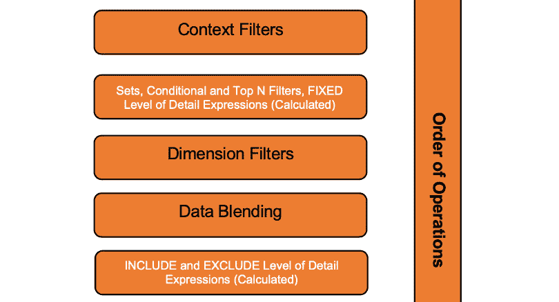

图 11.64：Tableau 操作顺序的分区视图

1.  使用上下文过滤器来应对这种情况，因为在操作顺序中，这些是在前 N 过滤器之前执行的，如前图所示。

    备注

    上下文过滤器的重大好处如下：

    `TEMP`表在上下文过滤器引用`TEMP`表进行计算后的操作顺序和后续过滤器。假设你有一个包含 1 亿行的客户订单数据库，你只想查看加利福尼亚的客户，这是 1800 万行。通过在`State`上使用上下文过滤器，你正在限制整个数据集的查询，以便只使用加利福尼亚数据的一个子集来计算所有后续过滤器。这非常有用。

    **Top N 过滤器**：如上所述，如果你的视图中具有 Top N 过滤器，强烈建议使用上下文过滤器，以确保过滤器按预期的方式工作，显示所有 Top N，而不考虑选定的二级过滤器！

1.  要解决这个问题，通过右键单击`Category`并选择“添加到上下文”来将你的`Category`过滤器类型更改为上下文过滤器，如图所示：


图 11.65：如何将过滤器添加到上下文

1.  如果你在“过滤器”架上的过滤器变成了灰色维度，那么过滤器正在被用作上下文过滤器。验证上下文过滤器是否按预期工作：

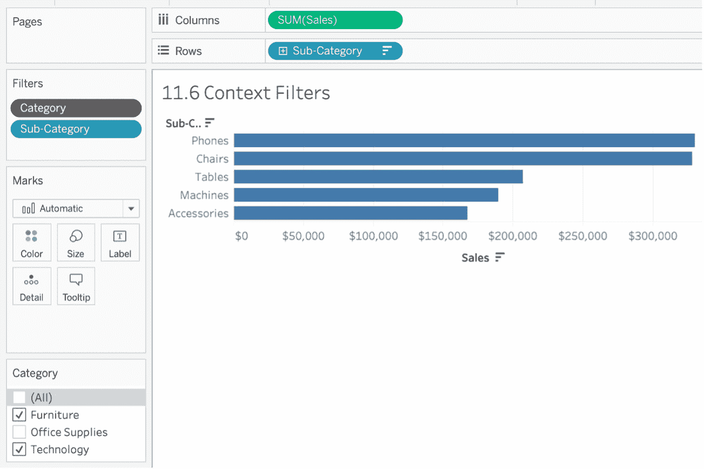

图 11.66：将“Category”设置为上下文相关过滤器后的视图

如预期的那样，使用`Category`作为上下文过滤器后，`Category`快速过滤器中的更改在视图中得到了适当的反映。`Category`成为依赖过滤器，其中前五个子类别的过滤器成为独立过滤器，处理通过上下文过滤器传递的数据。现在它正在使用上下文中的`Category`显示前五个子类别。

在这个练习中，你探索了上下文过滤器的重要性以及操作顺序如何决定数据在视图中呈现的方式。在这个练习中，上下文过滤器是`Category`，它成为了因变量，而在我们的案例中，前 N 个子类别成为了自变量。

# 集合

集合是自定义创建的字段，用于根据预定义的条件或规则定义数据的一个子集。

将集合想象成始终是二元的自定义段：数据点要么在段内，要么在段外，这取决于数据点是否符合定义的标准。集合是在维度上创建的，尽管如果需要，你的条件可以包括度量。集合可以是静态的或动态的，你还可以在 Tableau 中将多个集合组合成一个集合，这将会非常实用，你将在接下来的练习中了解到。集合在`数据`面板中通过带有*维恩图*图标的字段来识别，如图所示：


图 11.67：维恩图图标

## 静态集

如前所述，集合可以是动态的或静态的。在静态集合中，你定义集合规则并创建数据的一个固定子集，其中如果底层数据用新数据更新，集合成员不会更新。例如，你手动创建一个 Top City 集合，选择纽约、旧金山、孟买和伦敦。即使添加或删除了新数据，集合成员也不会改变。这是一个静态集合。动态集合可以帮助解决这个问题，但你将在后面的练习中学习动态集合。

## 练习 11.10：创建静态集合

在这个练习中，你将创建一个`Sample - Superstore`数据集的视图，其中所有名称中包含`Envelope`的产品都被分组为`In`，而其他所有内容都被分组为`Out`。

执行以下步骤：

1.  如果你还没有打开，请在你的 Tableau 实例中打开`Sample - Superstore`数据集。

1.  创建一个按`产品名称`的`销售`和`利润`视图。将`产品名称`拖放到`行`中，双击`销售`和`利润`以获取以下视图：

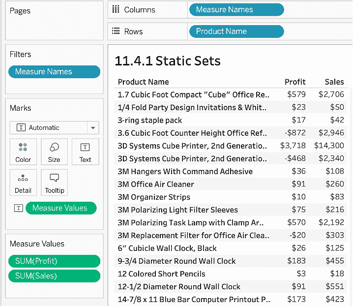

](img/B16342_11_70.jpg)

图 11.68：按产品名称的利润和销售额

1.  在`数据`面板中导航到`产品名称`，右键单击它。点击`创建`|`集合...`，如图所示：

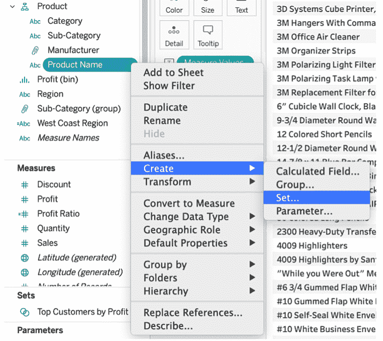

](img/B16342_11_69.jpg)

图 11.69：如何创建一个集合

在`创建集合`对话框中，你会注意到有三个选项卡（`常规`、`条件`和`顶部`），如果你还记得上一节中的过滤器，它们非常相似。

1.  为任何名称中包含`Envelope`的产品创建一个集合。选择`从列表中选择`单选按钮，搜索`Envelope`，然后按`全部`按钮选择包含`Envelope`的所有产品的列表。然后，将你的集合命名为`Envelope Product Set`，如下所示：

    注意

    文本搜索不区分大小写，当你搜索文本时，它会搜索整个字符串，而不是找到完全匹配的。在这里，你搜索了`Envelope`，但你的选择列表中也包含名称中包含`Envelopes`的产品。


](img/B16342_11_70.jpg)

图 11.70：手动添加集合成员

在你点击`确定`按钮之前，查看`创建集合`对话框中的`摘要`部分，并注意你的集合包含 1,850 个值中的 48 个。如前所述，这种手动选择项目进行集合创建的方式是静态的，如果稍后数据中添加了新的记录/行，集合成员将不会更新。你将在下一个练习中看到如何克服这种限制。

1.  通过点击`确定`按钮保存集合。

1.  检查集合是否按预期工作。将“信封产品集合”拖放到“行”板中。考虑这里的“在”/“不在”集合。如果一个产品名称符合你设置的准则，那么该产品将“在”集合中；如果产品不符合要求，那么该产品将“不在”。

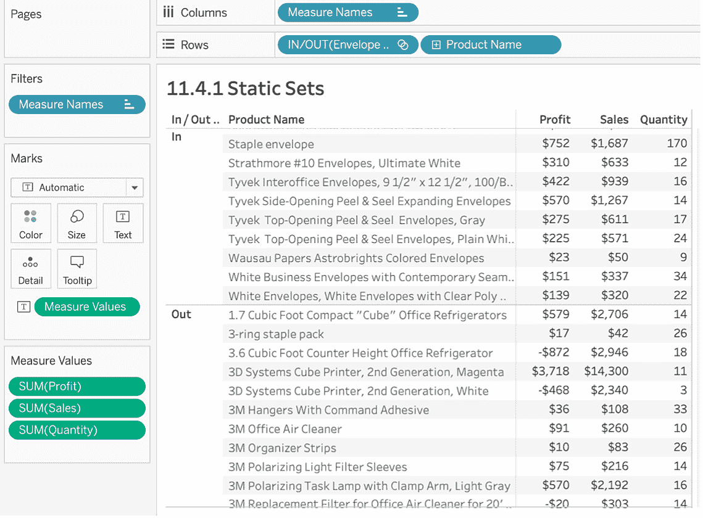

图 11.71：在/不在集合视图

1.  通过在“信封产品集合”上右键单击并选择“显示集合中的成员”来显示实际的“产品名称”而不是“在”/“不在”：

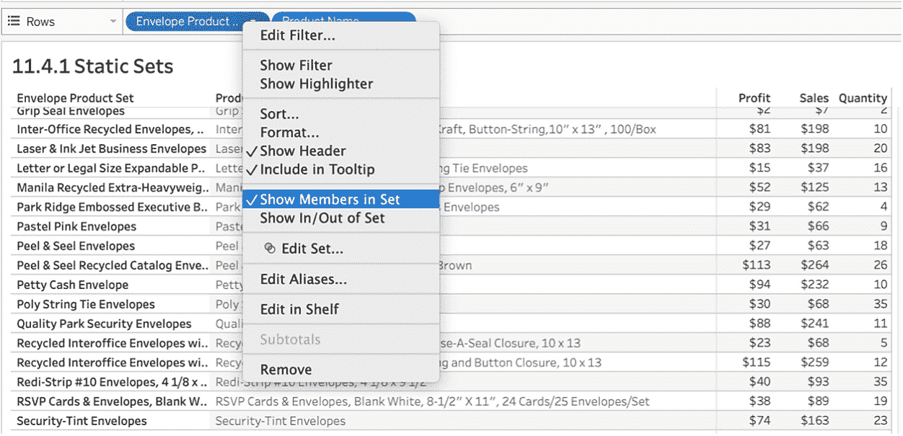

图 11.72：如何在集合中显示成员

在这个练习中，你第一次遇到了集合，并观察了静态集合在仪表板上的使用情况。你还学会了如何从集合中显示/隐藏成员，以及“创建集合”对话框中的“摘要”标签代表什么。

下一节将回顾动态集合以及它们如何克服静态集合的不足。

## 动态集合

在本节中，你将了解为什么动态集合比静态集合更受欢迎。你还将练习使用上一节中遇到的“创建集合”对话框中的剩余两个标签。动态集合使用逻辑动态更新集合的成员，这意味着当数据发生变化时，集合将被重新计算，并且可以根据计算结果添加/删除“在”/“不在”成员。

## 练习 11.11：创建动态集合

尽管你之前创建的集合很好，但负责所有“信封”产品的产品经理要求你创建一个分组动态视图，因为他希望在添加或删除新产品名称时更新“在”/“不在”组。你将使用之前练习中创建的相同视图，并将其扩展以添加动态集合。

执行以下步骤：

1.  如果您还没有这样做，请在您的 Tableau 实例中打开`Sample - Superstore`数据集。

1.  创建一个按“产品名称”显示“销售额”和“利润”的视图。将“产品名称”拖放到“行”中，双击“销售额”和“利润”以获取以下视图：

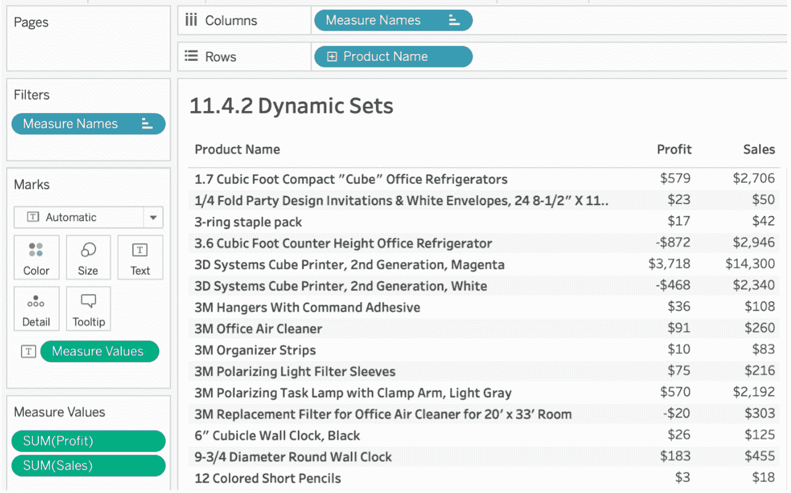

图 11.73：按产品名称显示的利润和销售额

1.  在“数据”面板中导航到“产品名称”，然后右键单击它。点击“创建”|“集合...”。

1.  扩展您之前的集合标准。您想要的是销售额超过 100 美元的前五个盈利的包装产品名称。为此，使用“条件”和“顶部”标签。首先创建至少 100 美元销售额的条件，如图所示：

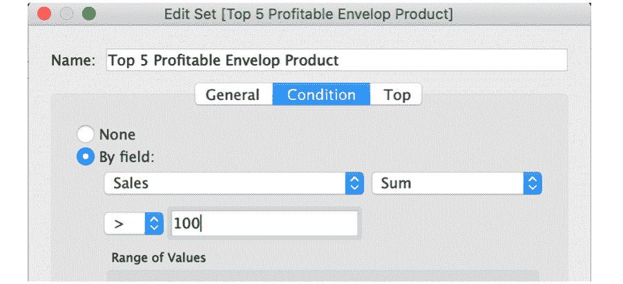

图 11.74：条件集合定义

1.  在“顶部”标签中添加前五个盈利的“信封”产品的标准，如图所示：

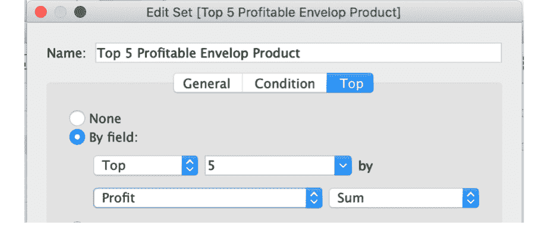

图 11.75：动态集合定义

1.  您尚未像对静态集合那样对“信封”进行筛选，但如果您使用相同的“常规”选项卡来筛选“信封”产品，当添加新数据时，您的集合将不会更新。为确保您的未来数据被考虑进集合中，请使用“条件”选项卡并编写一个计算公式来动态完成此操作。然后，取消选择“按字段”并使用“按公式”并编写以下公式：

    ```py
    MIN(CONTAINS([Product Name],"envelope")) AND SUM([Sales])>=100
    ```

![图 11.76：基于公式的条件集合

![图片 B16342_11_76.jpg]

![图 11.76：基于公式的条件集合

注意

您必须为“产品名称”使用`MIN`，因为在计算字段中，如果不使用聚合对非聚合维度进行聚合，则不能混合聚合和非聚合，正如前几章所述。

1.  在您进行现场检查并保存集合之前，请审查对话框的“摘要”部分：

![图 11.77：集合摘要框

![图片 B16342_11_77.jpg]

图 11.77：集合摘要框

在“摘要”部分，您的选择显示为`0`，因为您尚未手动选择任何内容。“条件”是您在“条件”选项卡中使用的公式，“限制”是“顶部”选项卡中的标准。

1.  将您在最后两个练习中创建的两个集合拖到您的“行”架上：您可以看到，在“前五名利润信封产品”中，有前五行的利润。这五个产品也是静态集合的一部分，因为这些产品名称包含“信封”。

![图 11.78：动态集合的最终输出

![图片 B16342_11_78.jpg]

图 11.78：动态集合的最终输出

通过这个练习，您现在可以创建一个非静态集合，该集合可以根据数据集的变化或当向集合中添加或删除新数据时更新集合成员。动态集合通常比静态集合更受欢迎，因为它们允许您确保在您不在仪表板上积极工作时，新数据将填充到集合中。

## 向集合中添加成员

在前两个部分中，您都是从零开始创建集合的。在本节中，我们将讨论您想要向集合定义中添加更多条件以添加新成员或删除成员的情况。向集合中添加成员通常是在利益相关者想要更新基础集合的条件或开发者想要对复杂的条件逻辑进行实验时进行的。

以下练习将指导您如何完成此任务。

## 练习 11.12：向集合中添加成员

对于您在上一节中创建的“信封产品集”，产品经理希望您将一个特定的产品添加到集合中，因为他们无法从他们的视图中将该产品添加到集合中，并且该产品不是前 N 名销售或利润的一部分。作为仪表板开发者，您被要求将该特定产品添加到集合中。

执行以下步骤：

1.  您将重用之前练习中创建的视图，但为了演示向集合中添加成员的工作原理，请从视图中删除 `Envelope Product Set`。您的视图现在应如下所示：

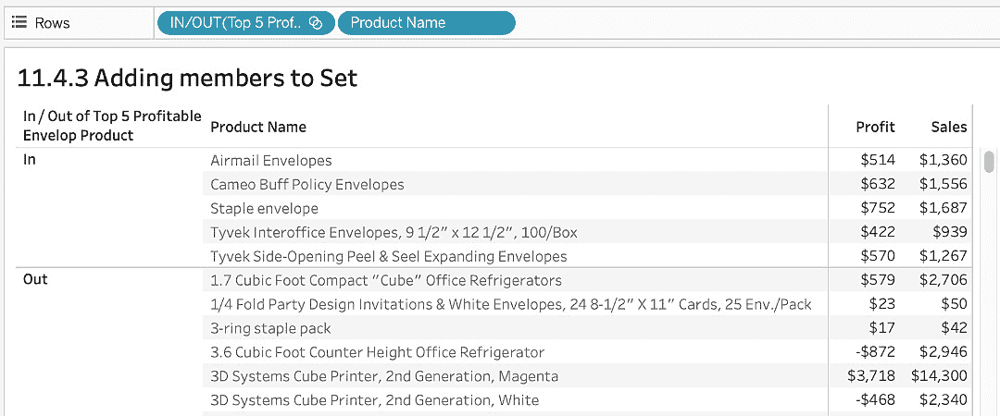

图 11.79：将成员添加到集合中

1.  要向集合中添加成员，选择您想要包含在视图中的产品名称/数据行，并左键单击该行，以获得以下内容：

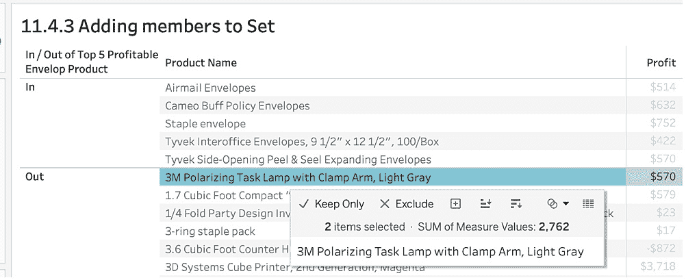

图 11.80：从集合中包含/排除成员

1.  在选项面板中单击 *韦恩图* 图标，并选择 `添加到 Top 5 利润丰厚的产品包 (Sample – Superstore)`，如下截图所示：

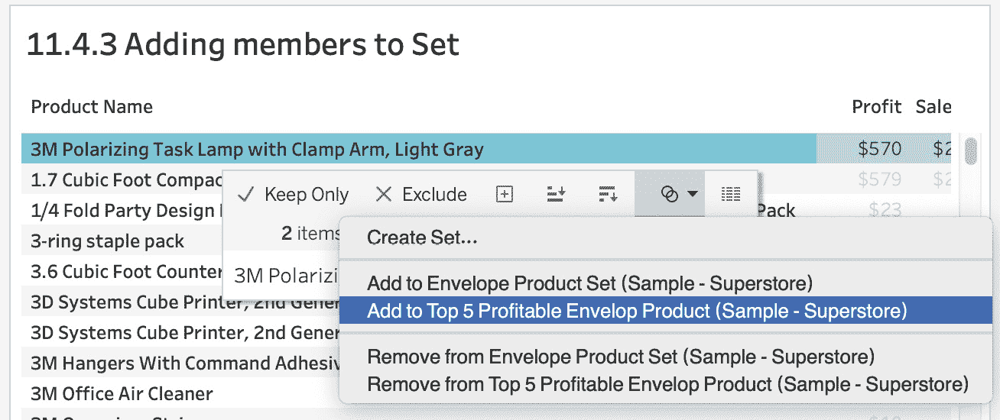

图 11.81：将产品添加到集合中

1.  一旦您这样做，行 `3M Polarizing Task Lamp with Clamp Arm, Light Gray` 就会从 `Out` 集合移动到 `In` 集合，如下所示：

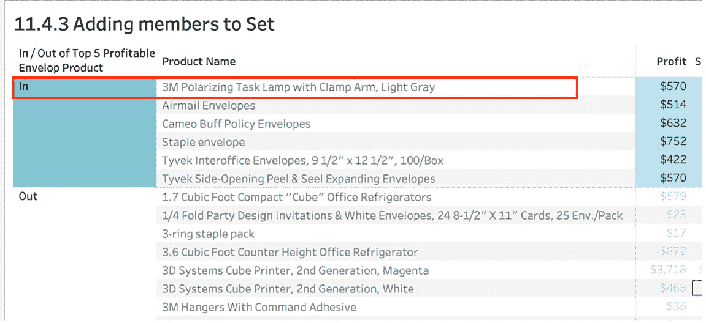

图 11.82：产品已添加到集合中

1.  如果您想从集合中删除数据行，请遵循类似的过程。而不是添加，从集合选项中删除，如下所示：

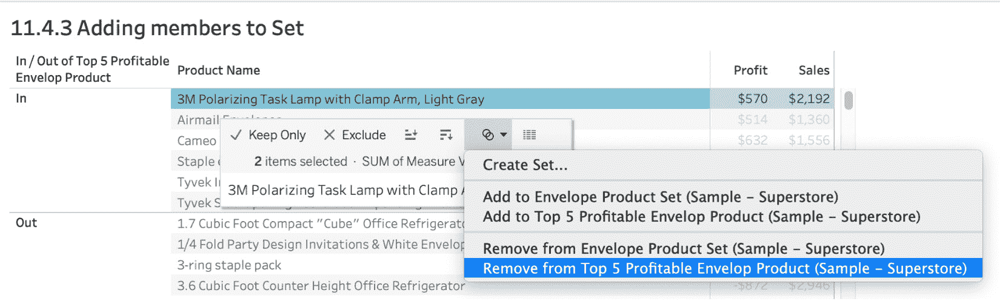

图 11.83：从集合中移除成员

向集合中添加成员非常简单，当您想手动更新成员集而不编辑集合的实际定义时，这非常有帮助。

## 合并集合

您现在已创建了静态和动态集合。单独来看，这些集合工作得很好，但您也可以通过合并多个集合来扩展 Tableau 功能，创建一个合并集合。使用合并集合，您可以执行额外的分析，比较和对比多个集合。当您创建一个合并集合时，您创建了一个全新的集合，该集合包含以下组合：两个集合的所有成员、存在于两个集合中的某些成员，或来自一个特定集合的成员。

完成以下练习以在实践中看到这一点。

## 练习 11.13：如何创建合并集合

您的区域经理希望您创建一个视图，显示既在 `按利润排名前 20 的州` 又在 `按销售额排名前 20 的州` 的州。您将利用合并集合来完成此操作，这些合并集合将首先从您创建的两个单独集合中创建：`按利润排名前 20 的州` 和 `按销售额排名前 20 的州`。

执行以下步骤来完成此练习：

1.  如果您还没有打开，请打开 Tableau 实例中的 `Sample - Superstore` 数据集。

**集合 1：按利润排名前 20 的州**：

1.  如下所示创建您的第一个集合 `Top 20 [States] by [Profits]`：


图 11.84：创建集合

1.  将集合命名为 `Top 20 States by Profits`，从窗口中选择 `Top` 选项卡，并选择 `By field` 和 `Top 20 by Profit Sum`，如下所示：

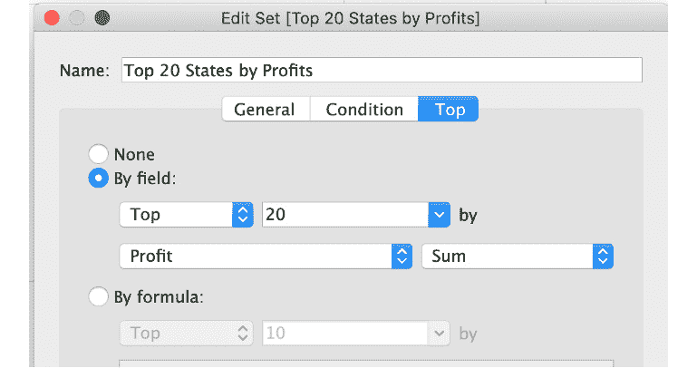

图 11.85：集合的前 N 个成员

**集合 2：按销售额排名前 20 名的州**：

1.  类似地，创建你的第二个集合，使用`按销售额排名前 20 名的[州]`，如下所示：

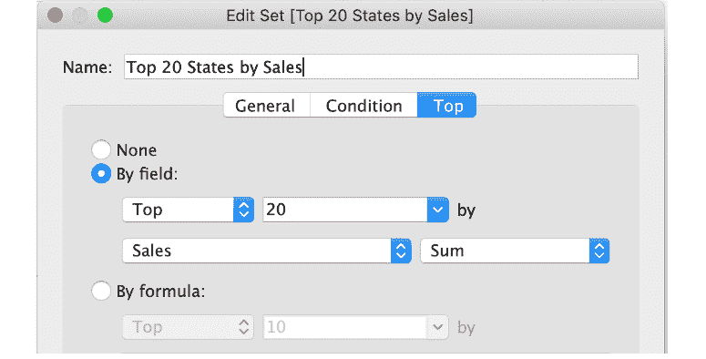

图 11.86：集合的前 N 个成员 -2!

1.  通过将`State`拖动到`行`架并添加`利润`和`销售额`到视图中，创建一个视图，如下所示：

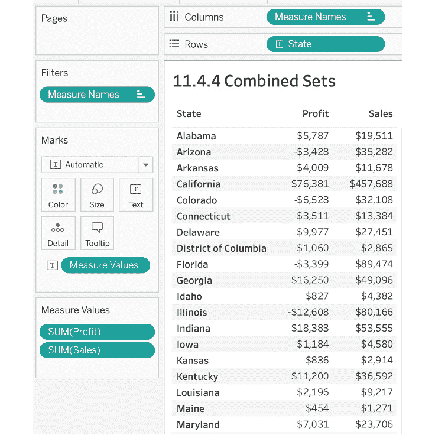

图 11.87：按州划分的利润和销售额视图

1.  将`按利润排名前 20 名的州`和`按销售额排名前 20 名的州`添加到`行`视图，如下所示：

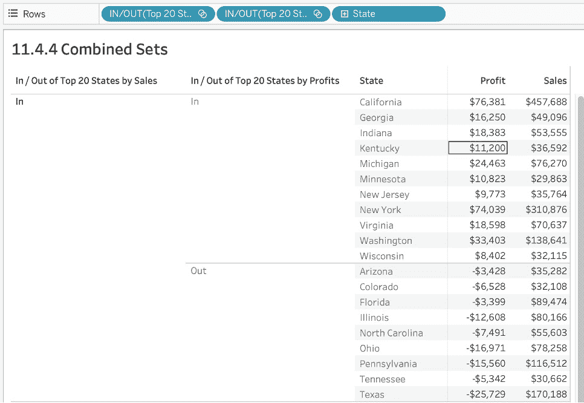

图 11.88：两个集合视图

目标是从合并集合中创建一个列表，其中包含既是利润又是销售额前 20 名的所有状态。为此，你需要两个你刚刚创建的集合的所有`In`成员。

1.  按住*Command* + 多选两个集合（Mac）或*Ctrl* + 多选两个集合（Windows），然后点击`创建合并集合...`：

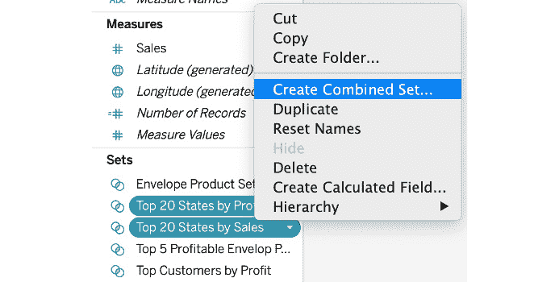

图 11.89：创建合并集合

1.  在`创建集合`模式窗口中，将你的新集合命名为`销售额和利润的前 20 名状态`。你还可以从下拉菜单中更改你想要包含在合并集合中的集合。你的合并集合中有四个成员选项，这些选项相当直观。你想要一个包含既是销售额又是利润前 20 名的所有状态的列表，所以使用如下所示的`两个集合中的共享成员`：

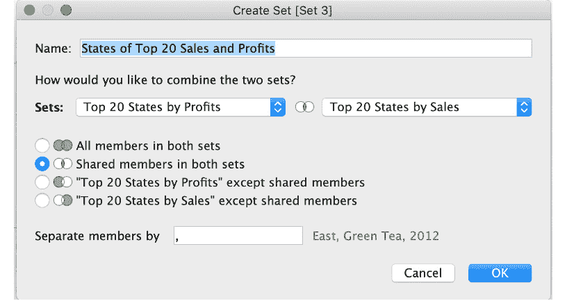

图 11.90：合并集合定义

前面的步骤中提到，你希望你的合并集合包含两个集合中的所有`In`成员。在下面的屏幕截图中，你会观察到合并集合具有与两个单独集合交集相同的所有状态。

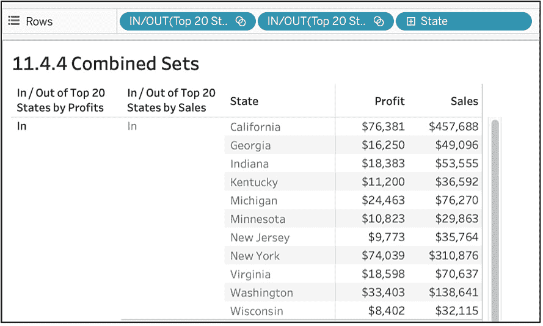

图 11.91：合并集合视图


图 11.92：利润和销售额前 20 名的状态

最终输出将如下所示：


图 11.93：合并集合最终输出！

在本节的最后关于集合的部分，你通过一个示例了解了如何使用合并集合。下一部分将探讨参数。

# 参数

参数在 Tableau 中类似于变量/占位符，它赋予了最终用户控制视图或报告中显示的数据的能力。它们允许你自定义视图，为工作簿添加交互性和灵活性。参数用于将视图中的常量值替换为更多变量/动态值，这些值由最终用户控制。它们可以接受任何数据类型：字符串、整数、浮点数、日期或任何 varchars。它们很容易与过滤器混淆，但参数与过滤器的主要区别在于，使用过滤器时，数据从视图中过滤掉，因此只显示过滤值，而使用参数时，变量仅作为参考。参数控制变量的值，而不是在数据上过滤。

要在视图中使用参数，你需要执行以下四个步骤：

1.  根据需求创建参数。

1.  向最终用户展示参数控制，就像我们对集合/过滤器所做的那样。

1.  可以在计算字段、过滤器或参考线上使用这些参数。

1.  在视图中使用计算字段、过滤器和参考线。

## 练习 11.14：标准参数

在这个练习中，你将创建并使用标准参数。为了观察 Tableau 和参数的真正本质，你将创建一个更高级的视图，允许你的最终用户选择他们想要在视图中看到的维度以及度量。

在前面的章节中，你已经赋予了用户过滤数据、创建分组以及在预选的维度和度量上创建集合的能力，但你还没有赋予用户根据他们的需求选择/更改维度/度量的能力。但是，有许多情况下利益相关者希望看到完全相同的视图，但度量/维度不同。因此，与其创建 4-6 个具有不同维度/度量组合的不同视图，不如让用户选择他们自己的度量维度，这是一种更有效处理请求的同时减少混乱的方法。这就是你最终要达到的视图：

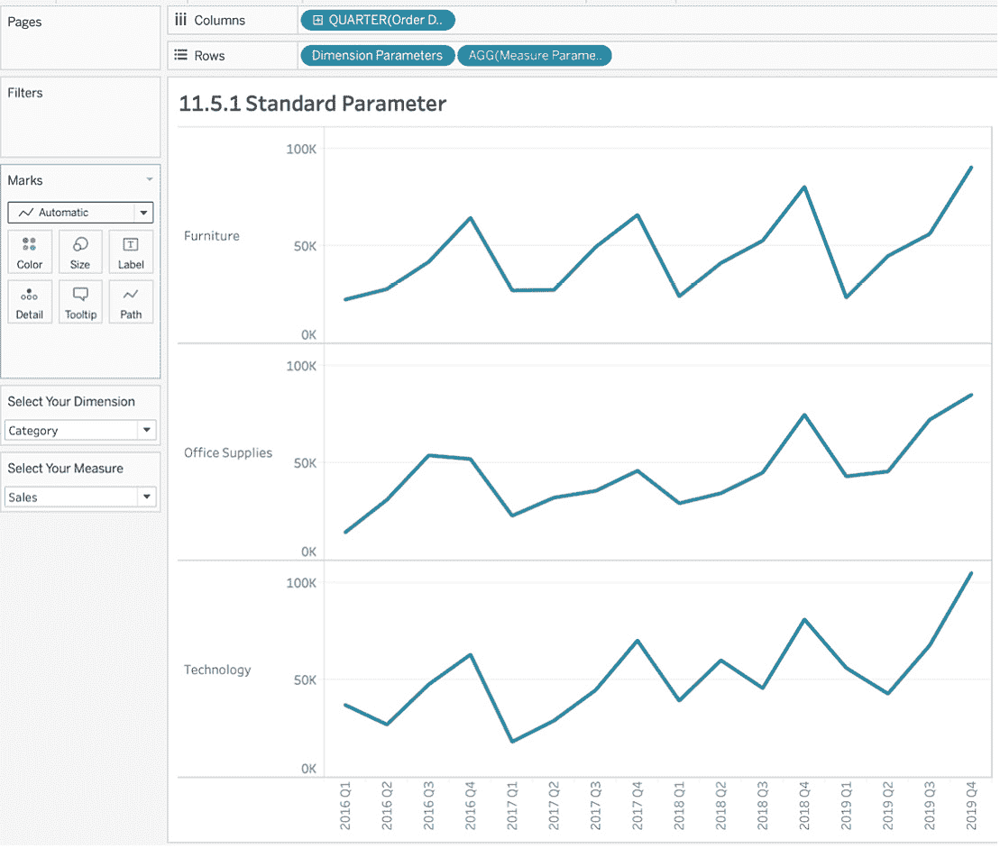

图 11.94：参数的最终输出

执行以下步骤来完成此练习：

1.  如果你还没有这样做，请打开你的 Tableau 实例中的`Sample - Superstore`数据集。

在这个例子中，你将通过季度创建一个由最终用户选择的度量值的连续线图。如前所述，你希望赋予最终用户更改度量或维度的能力。

1.  使用参数有四个步骤。第一步是**创建一个参数**。你可以通过在`维度`面板中点击箭头并点击`创建参数...`，如图下截图所示，或者右键单击`参数`面板中的任何位置并点击`创建参数...`来完成此操作：

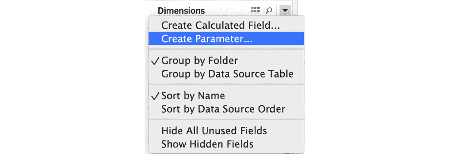

图 11.95：创建参数

在这个练习中，您将创建两个参数：一个用于选择“度量”，另一个用于选择“维度”。

1.  首先，创建一个用于选择“度量”的参数。在“编辑参数”模态窗口中，您有六个数据类型可供选择：`Float`、`Integer`、`String`、`Boolean`、`Date`或`Date & Time`。由于您的参数包含文本，请使用`String`作为数据类型。对于“允许的值”选项，而不是所有值，请使用“列表”，这样您就可以定义最终用户选择度量的可用选项。

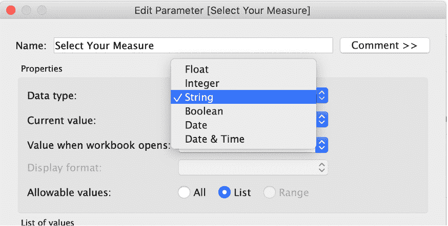

图 11.96：参数创建中的数据类型选项

当您为“允许的值”选择“列表”时，您将看到“值列表”选项。然后您必须定义您的列表，这将包含用户可以选择的度量名称。

1.  手动将“销售额”、“利润”、“折扣”和“数量”添加到“值列表”。您的创建参数窗口应类似于以下内容：

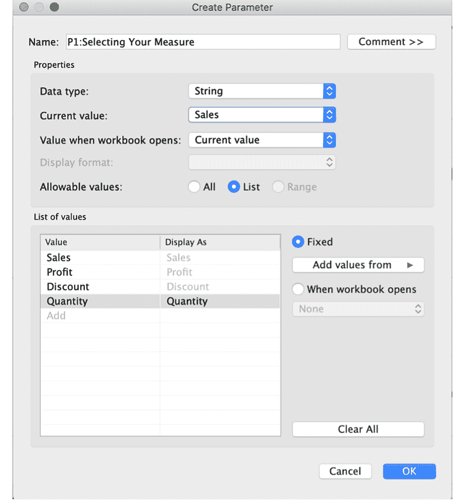

图 11.97：为参数添加度量选项

1.  对“选择维度”重复相同的步骤。创建参数的模态窗口应类似于以下内容：

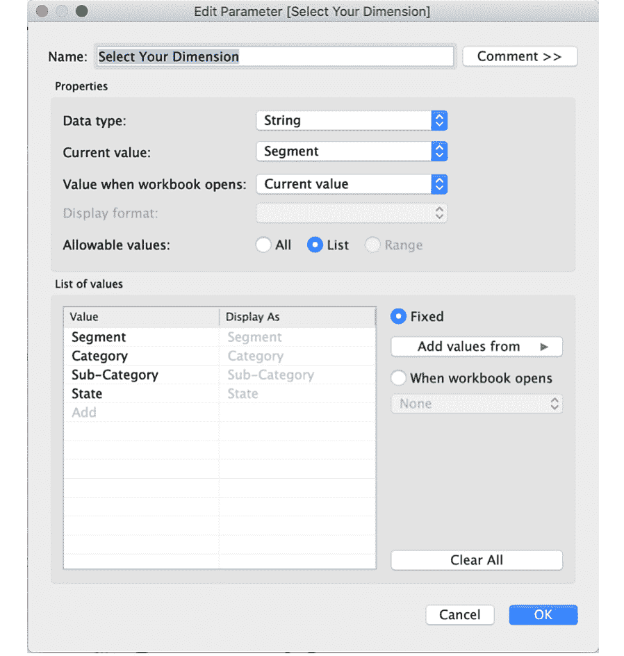

图 11.98：为参数添加维度选项

下一步是将创建的参数用于计算字段。默认情况下，除非您将参数用作计算字段、参考线或过滤器的一部分，否则参数不会控制任何内容。您将使用计算字段来使用参数，该参数作为占位符，用于动态填充计算字段，以包含最终用户选择的度量/维度。

1.  现在创建一个名为“度量参数”的计算字段。

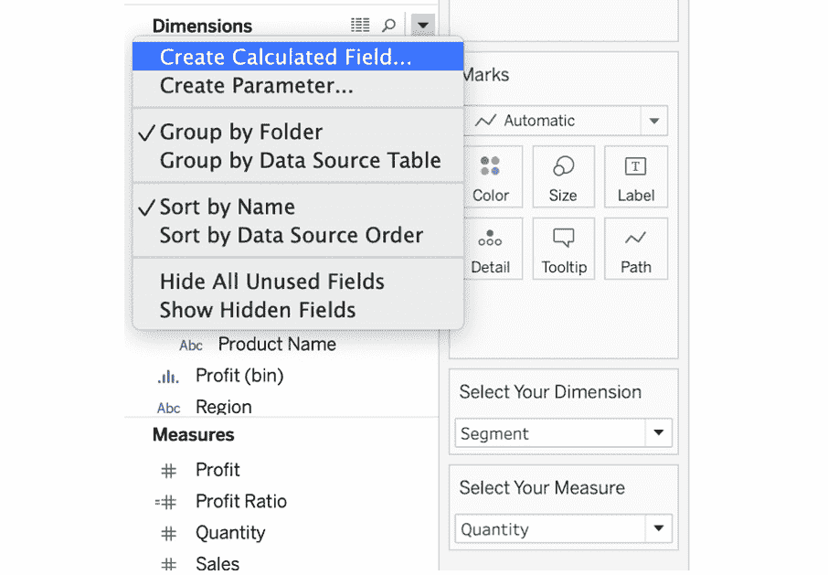

图 11.99：创建计算字段

1.  使用`CASE`语句，以便如果用户在参数中选择“销售额”度量，您的计算字段应在视图中显示`SUM(Sales)`。如果用户在参数中选择“利润”度量，您的计算字段应在视图中显示`SUM(Profit)`，依此类推。以下是计算字段的公式：

    ```py
    CASE [Select Your Measure]
    WHEN "Sales" THEN SUM([Sales])
    WHEN "Profit" THEN SUM([Profit])
    WHEN "Discount" THEN AVG([Discount])
    WHEN "Quantity" THEN SUM([Quantity])
    END
    ```


图 11.100：度量参数的`CASE`语句计算字段

1.  对计算字段“维度参数”重复相同的步骤，使用以下`CASE`语句：

    ```py
    CASE [Select Your Dimension]
    WHEN "Segment" THEN [Segment]
    WHEN "Category" THEN [Category]
    WHEN "Sub-Category" THEN [Sub-Category]
    WHEN "State" THEN [State]
    END
    ```


图 11.101：维度参数的`CASE`语句计算字段

1.  下一步是创建一个包含计算字段并使用我们两个参数的视图：将“维度参数”以及“度量参数”拖到“行”架上。接下来，将“订单日期”拖到“列”，并将日期维度更改为按季度连续日期。您看到的视图是基于您在创建参数时选择的*当前值*预先选择的。您为`{选择您的度量}`参数选择了`Sales`，为`{选择您的维度}`参数选择了`Segment`。因此，您当前视图是按`Segment`的季度`Sales`趋势。

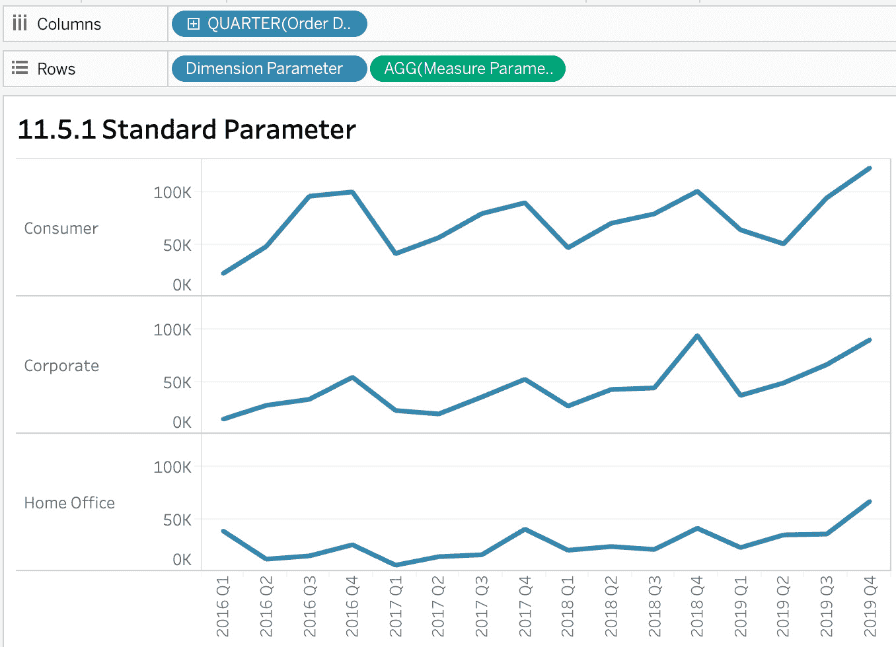

图 11.102：已选择默认参数的参数视图

1.  最后一步是允许您的最终用户控制视图中的度量以及维度。右键单击您创建的参数，然后单击“显示参数控制”。为其他参数重复此步骤：

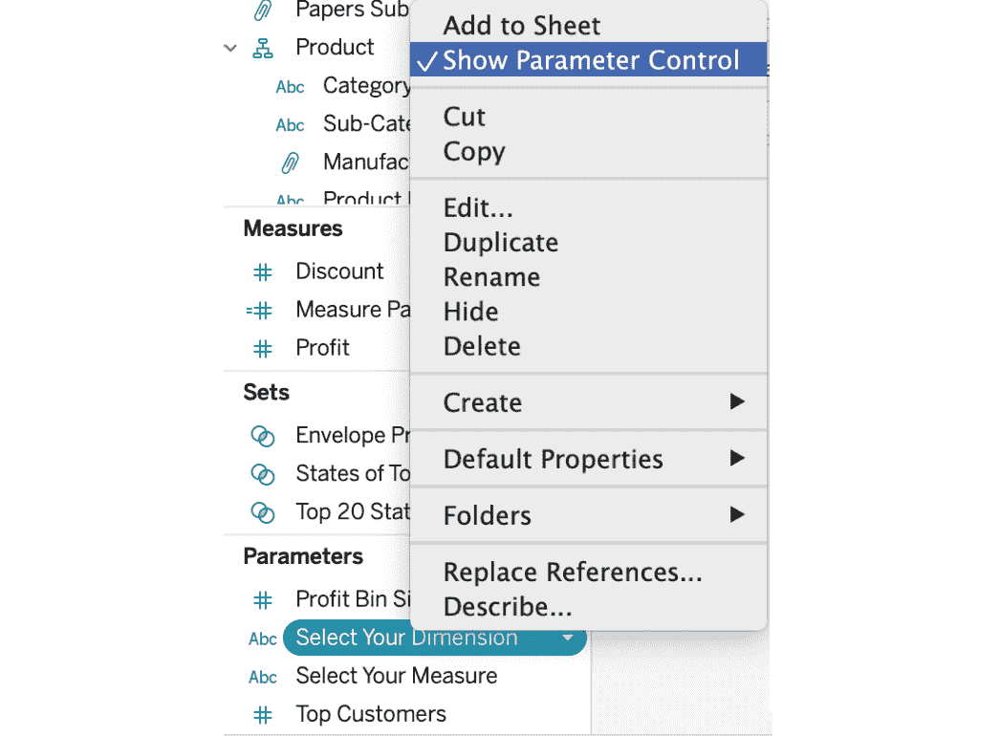

图 11.103：显示参数控制

1.  将参数控制添加到您的视图中，这样最终用户就有能力选择他们想要的维度/度量。以下是两种具有不同维度和度量组合的视图：

**按类别利润**：

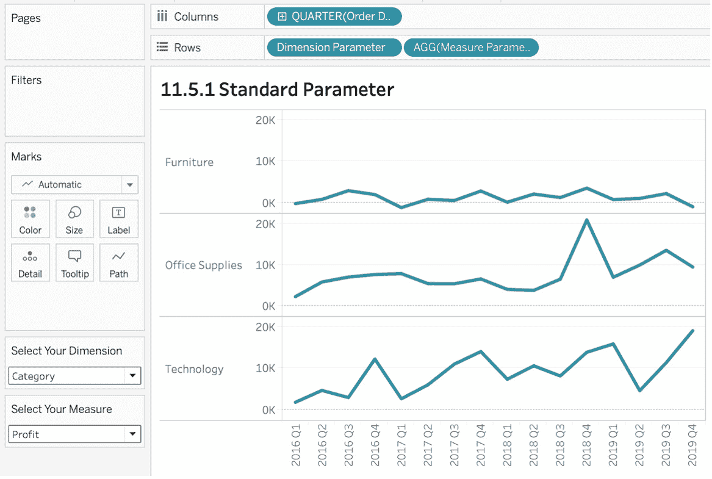

图 11.104：按类别参数视图的利润

**按段数量**：


图 11.105：按段参数视图的数量

对于最终用户来说，查看不同的组合可能会感到困惑，因为线形图或图形视图没有显示哪个维度/度量是视图的一部分。尽管您有下拉菜单，为了使最终用户更容易操作，您也可以通过创建一个与视图中的维度一起更新的动态标题来在标题中包含提示。通过双击工作表标题来编辑标题，这将打开如图所示的“编辑标题”窗口：

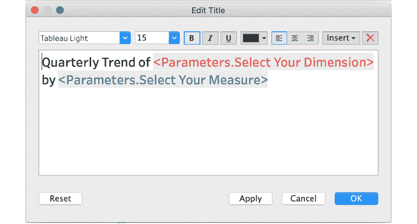

图 11.106：编辑标题

上述公式使用了动态变量。特别是`<Parameters.Select Your Dimension>`是动态的，这样当您从工作表的下拉菜单更改参数时，标题将自动更新。您不需要输入确切的变量；您可以通过点击窗口右上角的“插入”来插入这些变量，如图所示：

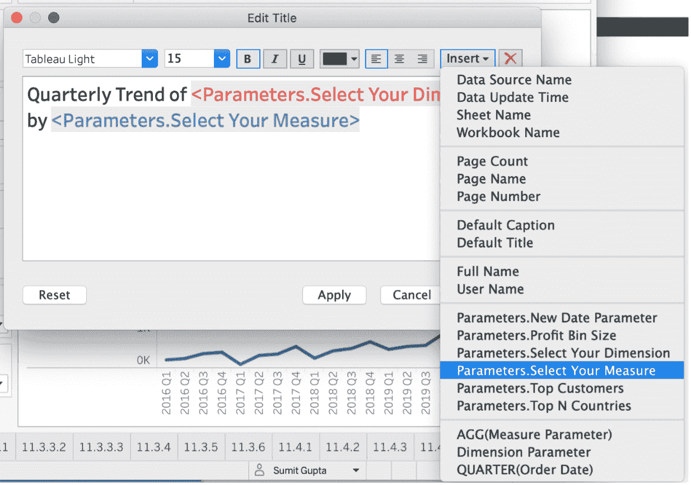

图 11.107：在标题中插入动态变量

这里是您所期望的最终输出：

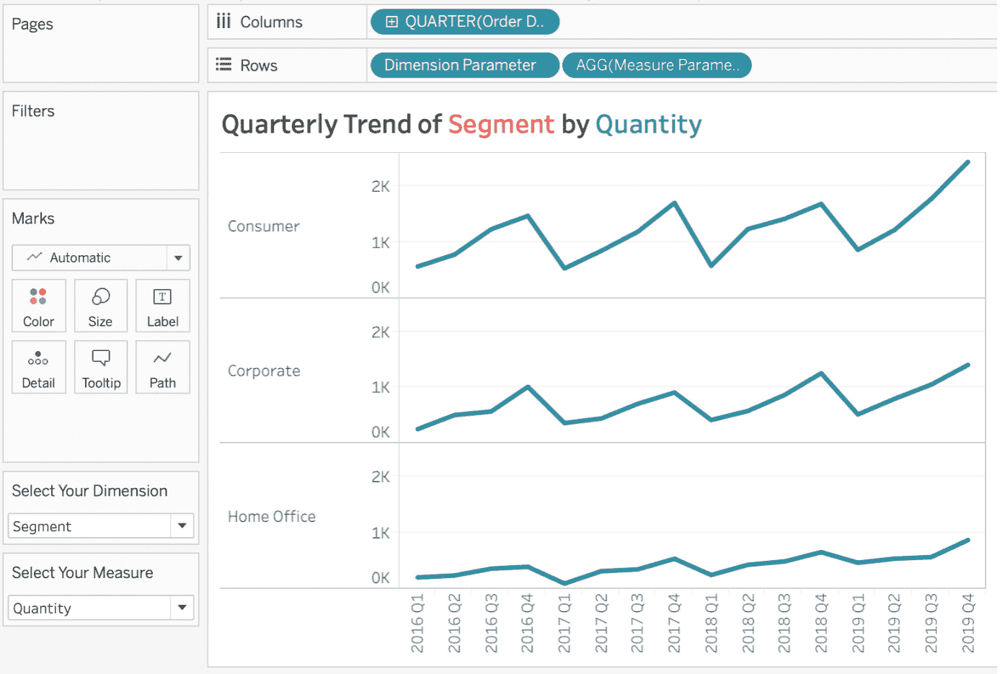

图 11.108：带有参数控制的参数最终视图

在这个练习中，你学习了参数是什么以及如何结合计算字段使用它们来创建一个动态工作表，其中最终用户可以完全控制他们想要报告视图包含哪些维度/度量。本节中传授的技能将大大有助于你在 Tableau 的高级知识和专业技能方面的成长。

## 动态参数

动态参数是 Tableau 社区论坛中最受欢迎的功能之一，Tableau 开发者在 2020 年 2 月的 Tableau 2020.1 版本中发布了该功能。在 Tableau 版本 2020.1 之前，标准参数有一个特定的限制：当数据通过新条目（特别是日期）更新时，参数列表/成员不会更新。这意味着 Tableau 作者每次数据源更新时都必须手动刷新参数列表，这可能会非常耗时。动态参数克服了这一点。有了这些，你也可以允许你的参数自动选择最新的日期，这在之前是不可能的。让我们通过一个练习来探索这是如何工作的。

## 练习 11.15：动态参数

在这个练习中，你将使用新的虚拟数据来查看之前版本的 Tableau（2019.4 或更早版本）中的参数看起来是什么样子。然后，你将按照以下步骤使用新的参数自动更新参数列表，当数据源更新时。

注意

已包含之前版本的 Tableau 的截图；然而，你可能没有那个选项。目标是传达静态参数与动态参数之间的区别，因此你不需要安装两个版本的 Tableau。这个练习将坚持使用 Tableau 2020.1 或更高版本。

执行以下步骤以完成此练习：

1.  在 Tableau 中创建一个名为 `DynamicParameters.csv` 的文件。创建一个参数，并将 `数据类型` 设置为 `日期`，`允许的值` 设置为 `列表`。而不是手动添加这些日期，使用 `从字段添加` 和 `日期` 列来预先填充值列表，如下所示：

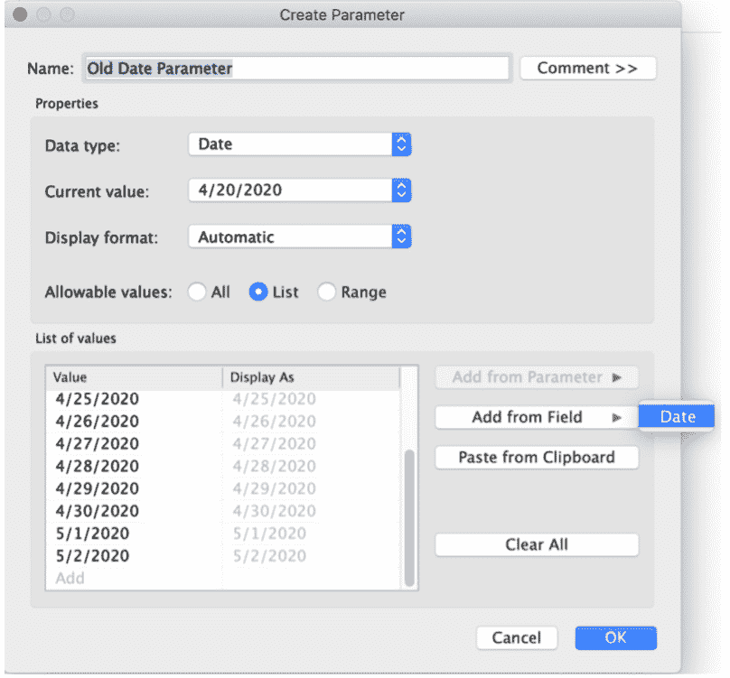

图 11.109：动态参数 – 从字段添加

如前所述，这种方法相当静态。如果添加了新的数据并带有新的日期，参数不会自动预先填充 `值列表` 以包括作为更新数据源的一部分的新日期，这是 Tableau 之前版本的一个限制。

1.  在 Tableau 中创建一个名为 `DynamicParameters.csv` 的文件，创建一个参数，并将 `数据类型` 设置为 `日期`，`允许的值` 设置为 `列表`。请注意，一旦选择 `列表`，与 Tableau 的早期版本不同，Tableau 2020.1 有两个选项：

    +   `固定`：这是你可以从字段预先填充列表的地方，就像你在之前的旧日期参数中做的那样。

    +   `When Workbook Opens`：这是一个动态选项，其中列表将预先从 `Date` 字段填充，但列表将根据新数据的更新/添加而更新。

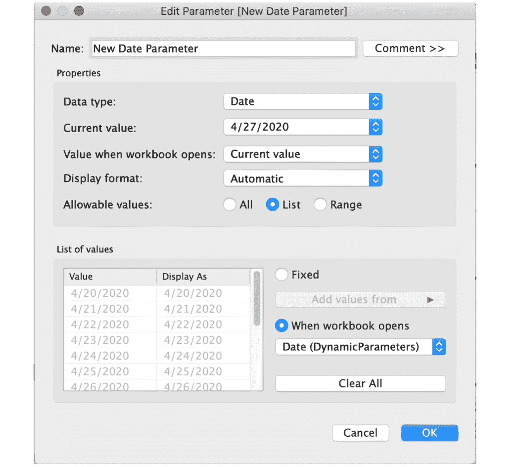

图 11.110：Tableau 2020.1 及以上版本的动态参数

1.  在前面的屏幕截图中，最后日期是 5/2/2020。使用您选择的工具（非 Tableau）打开 `DynamicParameters.csv` 电子表格，并添加一行，`Date: 5/3/2020 and Sales: 80`。按照以下所示保存文件：

![Figure 11.111: DynamicParameters.csv 的 CSV 数据

![img/B16342_11_111.jpg]

图 11.111：DynamicParameters.csv 的 CSV 数据

1.  要检查是否添加了新日期，请关闭您的 Tableau 工作簿（确保首先保存它）。然后，重新打开工作簿并编辑 `New Date Parameter` 以确认新日期是否已附加到参数的值列表中。如以下屏幕截图所示，2020 年 5 月 3 日已自动添加到参数的值列表中。

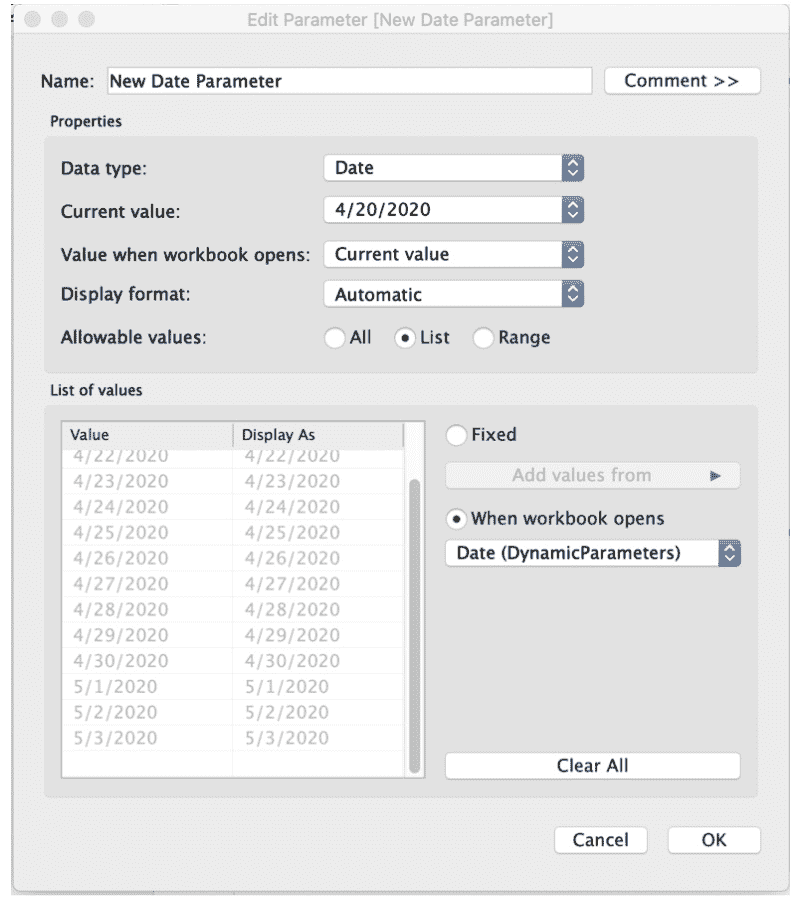

图 11.112：使用当工作簿打开时的动态参数

在这个练习中，你回顾了动态参数和静态参数的主要区别，并看到了动态参数如何自动更新允许值列表，以与数据源更新同步。

在本章的最后部分，你将把你在 Tableau 的高级交互功能中学到的所有知识应用到实际场景中。

## 活动 11.01：使用参数、集合和过滤器的前 N 个国家

作为公司年度黑客马拉松的一部分，每个团队都需要利用 World Indicators 数据集来展示根据某些指标排名前 5 的国家。你决定通过能源使用情况展示前 N 个国家，并允许最终用户将 N 从 5 改变为 10、15 或 20 以便于使用。你将在本活动中使用集合、上下文过滤器和参数创建 World Indicators 数据集的交互视图。

在本活动的结束时，你将通过利用本章涵盖的所有主要主题来创建一个有趣的视图，特别关注上下文过滤器和最终用户交互性。

1.  连接到从项目/书籍文件夹中下载的 `WorldIndicators.hyper` 数据集。

1.  创建一个按 `Energy Usage` 的 `Country/Region` 的条形图。

1.  创建一个具有 5、10、15 和 20 作为列表值的 `Top N Countries` 参数。

1.  创建一个名为 `Top N by Energy Usage` 的集合，并使用 `Top N Countries` 参数实现用户交互性。

1.  将 `Top N by Energy Usage` 集合拖动到 `Color` `Marks` 面板上。

1.  将 `Year[Year]` 显示为单个下拉过滤器。

1.  确保更新 `Year` 过滤器以根据能源使用情况更新 `top N countries` 的列表。**提示**：上下文过滤器。

1.  使标题动态化，以便当`Top N Countries`参数和`Year`过滤器更新时，标题应相应地反映这些变化。例如，如果用户选择了 2010 年的前 10 个国家，标题应该是*2010 年能源使用量前 10 个国家*。

最终预期输出如下：

![图 11.113：活动最终输出]

![图片 B16342_11_113.jpg]

![图 11.113：活动最终输出]

注意

本活动的解决方案可在此处找到：[`packt.link/CTCxk`](https://packt.link/CTCxk)。

# 摘要

本章探讨了 Tableau 中的许多高级交互功能。我们仔细研究了 Tableau 中的操作顺序，这是掌握 Tableau 的最重要概念之一，如果我们想为我们的利益相关者创建一个高效的报告。我们还讨论了过滤器、集合、分组和层次结构，深入探讨了过滤器，探讨了维度、度量日期过滤器之间的区别，并练习了使用数据源过滤器，这可以是一种限制加载到您视图中的数据的好方法。

关于集合，我们回顾了静态、动态和组合集合，使用“*Envelope*”示例来演示这些概念。在参数部分，我们还定义了静态和动态参数之间的区别，并学习了参数的一个高级用例：维度/度量交换，您可以使用它来给最终用户提供选择他们想要包含在视图中的维度/度量的能力。

我们通过使用世界指标数据集的活动来结束本章。在这里，您使用集合、上下文过滤器和参数创建了一个复杂视图，这在某种程度上类似于您在数据工作中可能遇到的真实场景。

这本书的印刷版到此结束，但这并不是你旅程的终点。访问 [`packt.link/SHQ4H`](https://packt.link/SHQ4H) 以获取接下来的三个章节，涵盖如增加交互性的技巧和工具（本课程的第二部分）、仪表板分发，甚至有关利用多个数据源和本书学习过程中所学技能的实际应用的案例研究。
