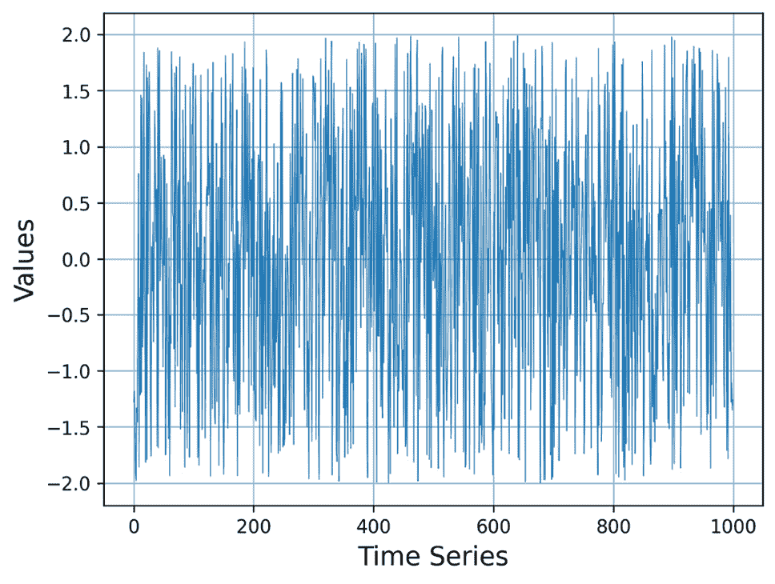
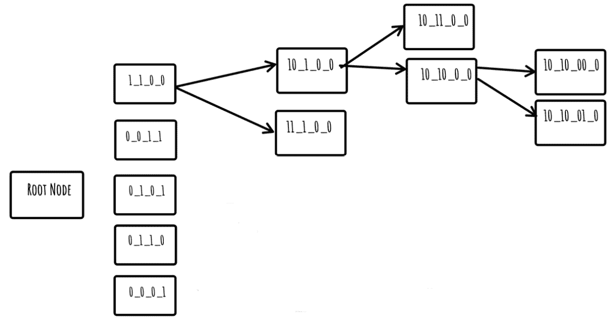
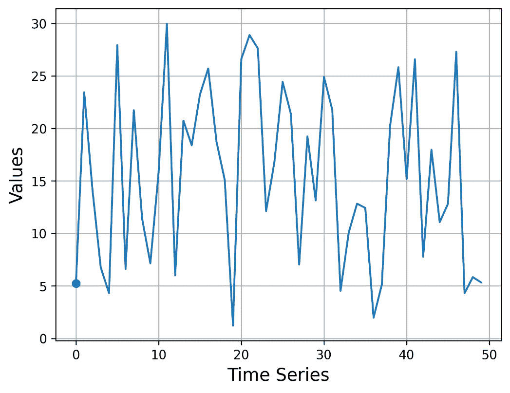

# 第一章：时间序列与所需 Python 知识简介

这是您正在阅读的本书的第一章。尽管通常第一章节包含您可能想要跳过的基本信息，但这章并非如此。它教授您时间序列和索引的基础知识，以及如何设置适当的 Python 环境，该环境将用于本书代码的开发。您在阅读其他章节时可能需要参考它，这是一件好事！所以，让我们开始吧！

在本章中，我们将涵盖以下主要主题：

+   理解时间序列

+   什么是索引以及为什么我们需要索引？

+   我们将要需要的 Python 知识

+   从磁盘读取时间序列

+   可视化时间序列

+   使用矩阵轮廓

+   探索 MPdist 距离

# 技术要求

为了跟随本章，这是整本书的基础，您需要在您的计算机上安装最新的 Python 3 版本，并且能够自行安装任何其他所需的软件。我们不会教您如何安装 Python 3 包，但我们会告诉您应该安装哪些包以及我们用来安装这些包的命令。同样，我们不会解释在您的机器上安装新软件的过程，但我们会告诉您我们用来在我们的机器上安装给定软件的命令。

本书在 GitHub 上的存储库地址为 [`github.com/PacktPublishing/Time-Series-Indexing`](https://github.com/PacktPublishing/Time-Series-Indexing)。每个章节的代码都在其自己的目录中。因此，第一章 的代码可以在 `ch01` 文件夹中找到。您可以使用 `git(1)` 在您的计算机上下载整个存储库，或者您可以通过 GitHub 用户界面访问这些文件。

您可以使用以下方式使用 `git(1)` 下载本书的完整代码，包括 `ch01` 文件夹中的代码：

```py
git clone git@github.com:PacktPublishing/Time-Series-Indexing.git
```

由于存储库名称较长，而本地目录以存储库名称命名，您可以通过以下方式执行前面的命令来缩短文件夹名称：

```py
git clone git@github.com:PacktPublishing/Time-Series-Indexing.git tsi
```

这将把存储库的内容放入一个名为 `tsi` 的目录中。两种方式都是有效的——做最适合您的事情。

本书代码现在已存在于您的本地机器上。然而，为了运行大部分代码，您需要安装一些 Python 包——我们将在本章后面讨论所需的 Python 包。

免责声明

本书中的代码是在 Arch Linux 和 macOS Ventura 机器上编写和测试的。尽管本书以 Unix 为中心，但在 Microsoft Windows 机器上也存在类似的命令可以执行，这些命令应该不难找到和执行。重要的是所展示的代码、理解代码及其背后的逻辑，以及能够自己执行和修改它。如果这些信息对您有所帮助，我主要使用 Microsoft Visual Studio Code 在 macOS 和 Linux 上编写代码。

# 理解时间序列

时间序列是一组数据。请记住，时间序列不一定包含时间或日期数据——时间和日期数据通常以*时间戳*的形式出现。因此，时间序列可能包含时间戳，但通常不包含。实际上，本书中的大多数时间序列都不包含时间戳。在实践中，我们真正需要的是有序数据——这就是使一系列值成为时间序列的原因。

严格来说，大小为*n*的时间序列(*T*)是一个有序的数据点列表：T = { t 0, t 1, t 2, … t n−1}。数据点可以是带时间戳的，并存储单个值、一组值或一个值列表。时间序列的索引可能从 1 开始而不是 0——在这种情况下，T = { t 1, t 2, t 3, … t n}。真正重要的是，在这两种情况下，时间序列的长度都是*n*。因此，每个元素都有一个与其关联的索引值，这取代了时间戳的需求。本书中的时间序列将使用索引值来区分其元素。以下有序列表可以被视为一个时间序列——`{1, -2, -3, 4, 5, 1, 2, 0.23, 4.3}`。它包含九个元素。第一个元素是`1`，最后一个元素是`4.3`。如果第一个元素的索引是`0`，则最后一个元素的索引将是`8`；而如果第一个元素的索引是`1`，则最后一个元素的索引将是`9`。时间序列可以包含相同的值多次。

时间序列的另一种定义

时间序列是一系列按时间顺序进行的观察结果。许多类型的观察结果并不是真正的时间序列，但可以转换成时间序列。

**图 1.1**.1 显示了包含 1,000 个元素的时间序列的图形表示——即使像这里展示的这样一个小型时间序列，也难以搜索特定的子序列或值。正如我们稍后将要讨论的，这就是为什么索引很重要的原因。



**图 1.1 – 可视化时间序列**

在*可视化时间序列*部分，我们将学习如何在 Python 中可视化时间序列。

下一个子节将告诉我们我们可以在哪里找到时间序列数据。

## 时间序列无处不在

你可能会问我们可以在哪里找到时间序列。答案是简单的：时间序列无处不在！从医疗数据到位置数据，从软件和硬件指标到金融信息和股价！成功使用它们可以帮助我们找到我们可能有的问题的答案，例如卖哪只股票或哪个硬盘将要失败。

让我们看看我们需要了解的一些定义，以更好地理解这些概念。

## 必要的定义

在本小节中，我们将学习一些与时间序列相关的核心定义：

+   时间序列或子序列的 *长度* 是在时间序列或子序列中找到的元素数量。

+   时间序列 *T* 的大小为 *w* 的 *子序列* *s* 是 *T* 的一个子列表，其长度为 *w* 的连续元素。

+   大小为 *w* 的 *滑动窗口* 将时间序列分解为大小为 *w* 的子序列。滑动窗口将时间序列分割成多个子序列，每个子序列的长度等于滑动窗口的值。给定长度为 *n* 的时间序列和一个大小为 *w* 的滑动窗口，大小为 *w* 的子序列总数等于 *n*-*w*+*1*。

让我们给你举一个例子。想象一下有一个以下时间序列，T: {0, 1, 2, 3, 4, 5, 6}。给定大小为 *5* 的滑动窗口，*T* 可以被分割成以下子序列：

+   `{0, 1, 2,` `3, 4}`

+   `{1, 2, 3,` `4, 5}`

+   `{2, 3, 4,` `5, 6}`

因此，我们总共有三个子序列，每个子序列的长度为 *5*。由于这是一个繁琐的过程，我们将在本章学习如何让计算机为我们完成这项工作。

下一个小节将简要讨论时间序列数据挖掘的主题。

## 时间序列数据挖掘

**数据挖掘** 是收集、清理、处理、分析和理解数据的研究。数据挖掘是一个庞大的主题。实际上，数据挖掘是计算机科学的一个领域，它有自己的子主题和领域。数据挖掘最重要的领域如下：

+   **分类**：这是在给定一组预定义的类别标签的情况下确定一个元素的类别标签的过程

+   **聚类**：这是根据给定的标准（通常是距离函数）将数据分组到集合中的过程，使得组内的成员彼此相似

+   **异常检测**：这是寻找一个与其他观察值差异足够大，足以引起怀疑它是由不同过程创建的过程

*时间序列数据挖掘*，正如其名称所暗示的，*是时间序列的数据挖掘。与常规数据挖掘相比，时间序列数据挖掘的主要区别在于，在时间序列中，数据是按时间排序的。因此，你不能自己安排时间序列数据。尽管时间提供了上下文，但重要的是实际值。

除了时间之外，时间序列数据还可以用经纬度值（*空间数据*）来表征。我们在这本书中不会处理空间数据。

拥有时间序列数据是好的，但如果我们不能比较这些数据，它们可能就毫无用处。接下来的小节将展示一些比较时间序列的流行技术和算法。

## 比较时间序列

要比较任何事物，我们需要一个度量标准。我们可以比较数值，因为数值本身就是度量标准。但如何比较时间序列呢？这是一个活跃的研究课题，目前还没有明确的答案。

在你继续阅读剩余的章节之前，花点时间思考一下你是否可以用不同数量的元素来比较时间序列。这是否可能？在继续阅读并找到答案之前，*写下你的想法*。

嗯，结果证明你可以用不同数量的元素来比较时间序列。然而，并非所有度量函数都支持该功能。

写作和阅读

阅读任何有价值的书籍或研究论文都是好的，这让你能够学习新事物并保持头脑活跃。然而，为了测试你的知识和整理你的思路，你需要把它们写下来！我一直在这样做。毕竟，这本书就是这样诞生的！

## 欧几里得距离

欧几里得距离是一种找出两个时间序列有多接近或有多远的方法。简单来说，欧几里得距离衡量的是两个多维点之间的最短路径。一个包含多个元素的时间序列或子序列是一个多维点。

欧几里得距离**优先考虑时间**——它比较在相同时间出现的数据点，并忽略其他所有内容。因此，如果两个时间序列只在不同的时间匹配，它们被认为是不同的。最后，欧几里得距离与多维度数据一起工作——在这本书中，我们只使用一维数据。不要将**多维点**与**多维数据**混淆。多维数据包含多维点。这本书的时间序列只包含一维数据（单个值）。然而，我们可以将时间序列或子序列视为一个 *多维点*。

计算两个多维点欧几里得距离的公式可以描述如下。给定一个点 p = ( p 1, p 2, … , p n) 和一个点 q = ( q 1, q 2, … , q n)，欧几里得距离是所有 (p i − q i) 2 值之和的平方根：

现在，让我们通过计算两个子序列对的欧几里得距离来举一些例子。第一对是 `p =` `{1, 2, 3}` 和 `q =` `{0, 2, 2}`。因此，首先，我们找到所有 (p i − q i) 2 值：

+   *(**1**−**0**)*2*=**1**

+   *(**2**−**2**)*2*=**0**

+   *(**3**−**2**)*2*=**1**

然后，我们将结果相加：1 + 0 + 1 = 2。

最后，我们找到结果的平方根，它大约等于 1.414213。

现在，想象一下有两个以下的时间序列或子序列——`p =` `{1, 2, -1, -3}` 和 `q =` `{-3, 1, 2, -1}`。尽管时间序列具有相同的元素，但这些元素是不同顺序的。它们的欧几里得距离可以像以前一样计算。首先，我们找出所有 (p i − q i)² 的值：

+   [1 − (− 3)]² = 4² = 16

+   (2 − 1)² = 1² = 1

+   ( − 1 − 2)² = ( − 3)² = 9

+   [( − 3) − (− 1)]² = ( − 2)² = 4

因此，欧几里得距离等于 (16+1+9+4) 的平方根 = 30，这大约等于 5.4472。

欧几里得距离的一个主要缺点是它要求两个时间序列长度相同。尽管存在克服这一局限性的技术，但这仍然是一个问题。其中一种技术涉及使用外推法使较短的时间序列长度等于较长的时间序列长度。

在接下来的工作中，我们不会手动计算欧几里得距离，因为 *NumPy* 提供了一种更好的方法——这在 `ed.py` 中得到了说明：

```py
#!/usr/bin/env python3 
import numpy as np
import sys
def euclidean(a, b):
    return np.linalg.norm(a-b)
def main():
    ta = np.array([1, 2, 3])
    tb = np.array([0, 2, 2])
    if len(ta) != len(tb):
        print("Time series should have the same length!")
        print(len(ta), len(tb))
        sys.exit()
    ed = euclidean(ta, tb)
    print("Euclidean distance:", ed)
if __name__ == '__main__':
    main()
```

`euclidean()` 函数接受两个 NumPy 数组作为输入，并使用 `np.linalg.norm()` 返回它们的欧几里得距离作为输出。这是因为欧几里得距离是 `l2` 范数，而 `numpy.linalg.norm()` 中 `ord` 参数的默认值是 `2`，这也是为什么没有特别定义它的原因。你不需要记住这一点；只需在需要时使用 `euclidean()` 函数即可。

两个时间序列硬编码在脚本中。运行 `ed.py` 生成以下输出：

```py
$ ./ed.py
Euclidean distance: 1.4142135623730951
```

## 切比雪夫距离

切比雪夫距离的逻辑与欧几里得距离完全不同。这并不意味着它优于或劣于欧几里得距离，只是不同。如果你不知道该使用什么，就使用欧几里得距离。

因此，两个多维点之间的切比雪夫距离等于所有 |p i − q i| 值中的最大距离。|| 符号是一个量的 *绝对值*。简单来说，一个量的 *绝对值* 等于不带正负号的值。

现在，让我们通过计算两个子序列对的切比雪夫距离来展示一些示例。第一对是 `{1, 2, 3}` 和 `{0, 2, 2}`。现在，让我们找出这两对之间的距离：

+   *|1 – 0| = 1*

+   *|2 – 2| = 0*

+   *|3 – 2| = 1*

因此，1、0 和 1 的最大值等于 1，这就是切比雪夫距离。

第二对是 `{1, 2, -1, -3}` 和 `{-3, 1, 2, -1}`。和之前一样，我们找出相同位置（相同索引）的点对之间的距离：

+   *|1 – (–3)| = 4*

+   *|2 – 1| = 1*

+   *|(–1) – 2| = 3*

+   *|(–3) – (–1)| = 2*

因此，4、1、3 和 2 的最大值等于 4，这就是上述对之间的切比雪夫距离。

在本章的后面部分，我们将学习一个更复杂的距离函数，称为 *MPdist*。

现在我们已经知道了如何比较时间序列和子序列，是时候讨论索引和索引化了。请记住，如果我们不能比较其数据，包括时间序列数据，我们就无法创建索引。

# 索引是什么？为什么我们需要索引？

你能想象在一个未排序的名字列表中搜索姓氏吗？你能想象在一个不按书籍主题（杜威分类法）排序书籍，然后按书名和作者姓氏排序的图书馆中寻找一本书吗？我不能！这两个例子展示了简单但有效的索引方案。数据越复杂，索引应该越复杂，以便进行快速搜索，也许还能更新数据。

*图 1.2* 显示了一个非常小的 **iSAX** 索引的可视化——实际上，由于时间序列可能非常大，iSAX 索引往往更大且更复杂。



图 1.2 – 一个小的 iSAX 索引

在这个阶段，不要试图理解 iSAX 索引或节点的标题。一切都会在 *第二章* 和 *第三章* 中变得清晰。现在，请记住节点的标题是 *SAX 词*，并且在一个 iSAX 索引上存在两种类型的节点 – *内部节点* 和 *终端节点*（叶节点）。关于 iSAX 索引及其与 SAX 词的关系将在 *第三章* 中变得清晰。

在下一节中，我们将开始使用 Python 并设置我们的环境。

# 我们将要需要的 Python 知识

本书中所展示的所有代码都是用 Python 编写的。因此，在本节中，我们将向您展示所需的 Python 知识，以便您更好地跟随本书。然而，不要期望在这里学习 Python 的基础知识——存在更多适合此目的的书籍。

关于其他编程语言呢？

一旦你学习和理解了所展示的理论，本书中的 Python 代码可以轻松地翻译成任何其他现代编程语言，例如 Swift、Java、C、C++、Ruby、Kotlin、Go、Rust 或 JavaScript。

如果你没有特定原因地不断更新所使用的 Python 包，你可能会遇到兼容性问题。作为一个经验法则，我建议在本书中，你应该使用相同的包版本，只要它们彼此兼容。存在两种主要的方法来实现这一点。你可以在找到兼容的版本后停止升级你的 Python 安装，或者你可以使用 Python 包管理器，如 Anaconda 或 `pyenv`。在本书中，我们将使用 Anaconda。

无论你使用什么，只要你知道如何操作你的工具，并且有一个稳定可靠的 Python 环境来工作，那就没问题。

我希望我们都同意，任何代码最重要的属性是正确性。然而，在我们有了工作的代码之后，我们可能需要对其进行优化，但如果我们不知道它是否运行得慢，我们就无法优化代码。所以，下一节将向您展示如何计算 Python 代码执行所需的时间。

## 计时 Python 代码

有时候我们需要知道我们的代码执行得多慢或多快，因为某些操作可能需要数小时甚至数天。本节介绍了一种计算代码块运行所需时间的简单技术。

`timing.py` 脚本展示了一种计时 Python 代码的技术——当你想知道一个过程需要多少时间完成时，这可能会非常有用。`timing.py` 的源代码如下：

```py
#!/usr/bin/env python3
import time
start_time = time.time()
for i in range(5):
    time.sleep(1)
print("--- %.5f seconds ---" % (time.time() - start_time))
```

我们使用 `time.time()` 来启动计时，并使用相同的语句来声明计时的结束。这两个语句之间的差异是期望的结果。你还可以将这个差异保存在一个单独的变量中。

程序执行 `time.sleep(1)` 五次，这意味着总时间应该非常接近 5 秒。运行 `timing.py` 生成以下类型的输出：

```py
$ ./timing.py
--- 5.01916 seconds ---
```

关于 Python 脚本

在这本书中，我们将主要向您展示完整的 Python 脚本，而不会省略任何语句。尽管这增加了额外的行，但它通过查看它们的 `import` 语句来帮助你理解 Python 脚本的功能，在阅读实际的 Python 代码之前。

下一个子节是关于 Anaconda 软件，它用于创建 Python 环境。

## Anaconda 简介

Anaconda 是一个用于包、依赖和环境管理的软件产品。尽管 Anaconda 是一个商业产品，但存在一个针对个人从业者、学生和研究人员的个人版。Anaconda 所做的是创建一个受控环境，在那里你可以定义 Python 的版本以及你想要使用的包的版本。此外，你可以创建多个环境并在它们之间切换。

如果你不想使用 Anaconda，那也行——然而，如果你正在使用 Python 3 并且不想被 Python 3 包版本、不兼容性和依赖关系的细节所困扰，那么你应该尝试一下 Anaconda。需要包和环境管理软件的原因是，一些 Python 包对使用的 Python 版本非常挑剔。简单来说，Anaconda 确保你的 Python 3 环境不会改变，并赋予你将 Python 3 环境转移到多台机器的能力。Anaconda 的命令行工具被称为 `conda`。

### 安装 Anaconda

Anaconda 是一个庞大的软件，因为它包含了许多包和实用工具。存在多种安装 Anaconda 的方法，这主要取决于你的开发环境。

在 macOS Ventura 机器上，我们可以使用 Homebrew 如下安装 Anaconda：

```py
$ brew install anaconda
```

在 Arch Linux 机器上，Anaconda 可以按照以下方式安装：

```py
$ pacman -S anaconda
```

我们将不会进一步讨论 Anaconda 的安装细节。安装过程简单直接，包含大量信息。最重要的任务是将 Anaconda 实用工具添加到你的`PATH`环境变量中，以便在 UNIX shell 的任何地方都可以访问它们。这也取决于你使用的 UNIX shell——我在 Linux 和 macOS 机器上都使用带有 Oh My Zsh 扩展的`zsh`，但你的环境可能有所不同。

如果你选择使用 Anaconda 来处理这本书，请确保你可以访问`conda`二进制文件，并且可以在你的机器上随意启用和禁用 Anaconda——你可能并不总是需要使用 Anaconda。

在我的 macOS Ventura 机器上，我可以这样禁用 Anaconda：

```py
$ conda deactivate
```

我也可以这样启用 Anaconda：

```py
$ source /opt/homebrew/anaconda3/bin/activate base
```

你应该将`base`替换为你想要的 Anaconda 环境。

之前的命令依赖于 Anaconda 安装的路径。因此，在我的 Arch Linux 机器上，我应该执行以下命令：

```py
$ source /opt/anaconda/bin/activate base
```

你应该修改之前的命令以适应你的 Anaconda 安装。

当有新的 Anaconda 版本可用时，你可以通过执行以下命令来更新到最新版本：

```py
$ conda update -n base -c defaults conda
```

### 创建新的 Anaconda 环境

创建新的 Anaconda 环境时，最重要的决定是选择 Python 3 版本。为了创建一个名为`TSI`的新 Anaconda 环境，并使用 Python 3.8.5，你应该运行以下命令：

```py
$ conda create  ––name TSI python=3.8.5
```

为了激活此环境，运行`conda activate TSI`。`python3 --version`命令显示了给定 Anaconda 环境中的 Python 版本。

你可以使用`conda info --envs`命令列出所有现有的 Anaconda 环境（`*`字符表示活动环境）：

```py
$ conda info --envs
# conda environments:
#
TSI                      /home/mtsouk/.conda/envs/TSI
base                    /opt/anaconda
```

### 切换到不同的环境

本小节介绍了用于在不同环境之间切换的`conda`命令。切换到不同的环境就像使用`conda activate environment_name`激活不同的环境一样简单。

### 安装 Python 包

虽然你仍然可以使用`pip3`来安装 Python 包，但在 Anaconda 环境中安装 Python 包的最佳方式是使用`conda install`命令。请注意，`conda install`命令不能安装所有包——在这种情况下，请使用`pip3`。

### 列出所有已安装的包

`conda list`命令会给出给定 Anaconda 环境中所有已安装 Python 包的完整列表。由于列表相当长，我们只展示其中的一部分：

```py
$ conda list
# packages in environment at /home/mtsouk/.conda/envs/TSI:
#
# Name                    Version                   Build
python                    3.8.5                h7579374_1
readline                  8.2                  h5eee18b_0
numpy                     1.23.5                   pypi_0
pandas                    1.5.2                    pypi_0
```

### 删除现有的环境

你可以使用`conda env remove --name ENVIRONMENT`命令删除一个不活动的现有 Anaconda 环境。以下是在删除名为`mtsouk`的环境时的输出示例：

```py
$ conda env remove --name mtsouk
Remove all packages in environment /home/mtsouk/.conda/envs/mtsouk:
```

关于 Python 环境、包版本和包不兼容性的讨论在此达到高潮。从现在开始，让我们假设我们有一个稳定的 Python 环境，我们可以使用现有的 Python 包，开发新的 Python 包，并且可以无任何问题地运行 Python 脚本。下一小节将列出我们需要安装的 Python 包。

## 所需的 Python 包

下面是一个所需 Python 包列表，以及每个包用途的说明：

+   `NumPy`：这是 Python 进行数组计算的标准化包。

+   `Pandas`：此包提供数据分析、时间序列和统计学的数据结构，包括从磁盘读取数据文件的函数。

+   `SciPy`：此包为 Python 科学计算提供基本函数。

+   `Matplotlib`：这是最受欢迎的 Python 科学绘图包。

+   `Stumpy`：这是一个强大的时间序列分析和时间序列数据挖掘包。您无需立即安装它，因为它对于 iSAX 索引的开发不是必需的。

这些是在一个全新的 Python 环境中您需要安装的基本包。Python 将自动安装任何包依赖项。

## 设置我们的环境

在本小节中，我们将设置我们的 Anaconda 环境。如前所述，这不是遵循本书所必需的，但它将帮助您避免在升级 Python 和 Python 包时可能出现的 Python 包不兼容问题。我们将在`TSI` Anaconda 环境中执行以下命令，然后我们就完成了：

```py
(TSI) $ conda install numpy
(TSI) $ conda install pandas
(TSI) $ conda install scipy
(TSI) $ conda install matplotlib
(TSI) $ conda install stumpy
```

## 打印包版本

在本小节中，我们将展示一个 Python 脚本，该脚本仅加载所需的包并在屏幕上打印它们的版本。

`load_packages.py`的代码如下：

```py
#!/usr/bin/env python3
import pandas as pd
import argparse
import stumpy
import numpy as np
import scipy
import matplotlib
def main():
     print("scipy version:", scipy.__version__)
     print("numpy version:", np.__version__) 
print("stumpy version:", stumpy.__version__) 
print("matplotlib version:", matplotlib.__version__) 
print("argparse version:", argparse.__version__) 
print("pandas version:", pd.__version__)
if __name__ == '__main__':
     main()
```

在我的 UNIX 机器上运行`load_packages.py`会打印以下信息：

```py
$ chmod 755 ./load_packages.py
$ ./load_packages.py
scipy version: 1.9.2
numpy version: 1.23.4
stumpy version: 1.11.1
matplotlib version: 3.6.2
argparse version: 1.1
pandas version: 1.5.0
```

第一个命令是使 Python 脚本可执行所必需的，并且对于本书中所有以`#!/usr/bin/env python3`语句开始的 Python 脚本都是必需的。如果它们不以该语句开始，您可以使用`python3 <script_name>`来执行它们，而无需更改它们的权限。您可以通过运行`man chmod`来了解更多关于`chmod(1)`命令的信息。从现在开始，我们将假设您知道这些信息，并且不会展示更多的`chmod`命令和说明。您的输出可能略有不同，但这是正常的，因为包会更新。

## 创建样本数据

程序创建的样本数据的官方名称是**合成数据**。本节将展示一个基于给定参数创建合成数据的 Python 脚本。程序的逻辑基于随机生成的数字——正如你们大多数人可能知道的，随机生成的数字并不那么随机。这使得它们适合测试程序的性能，但不适合实际使用。然而，为了本书的目的，使用随机数生成的合成数据是可以接受的！

`synthetic_data.py` Python 脚本的代码如下：

```py
#!/usr/bin/env python3
import random
import sys
precision = 5
if len(sys.argv) != 4:
    print("N MIN MAX")
    sys.exit()
# Number of values
N = int(sys.argv[1])
# Minimum value
MIN = int(sys.argv[2])
# Maximum value
MAX = int(sys.argv[3])
x = random.uniform(MIN, MAX)
# Random float number
for i in range(N):
    print(round(random.uniform(MIN, MAX), precision))
```

脚本接受三个参数，即创建最小值和最大值所需的浮点数值数量。运行脚本会生成以下类型的输出：

```py
$ ./synthetic_data.py 5 1 3
1.18243
2.81486
1.74816
1.42797
2.21639
```

由于浮点值可以具有任何所需的精度，`precision`变量保存了小数点后要打印的数字位数。

创建自己的时间序列并不是获取数据的唯一方式。公开可用的时序数据也存在。让我们接下来看看这个。

## 公开可用的时序数据

存在提供时间序列数据样本的网站，允许每个人处理真实世界的时间序列数据。公开可用的时序数据的另一个重要方面是，人们可以使用相同的数据集与其他人比较他们的技术性能。这在学术界是一个大问题，因为人们必须证明他们的技术和算法在多个方面比其他人更快或更有效率。

一组非常流行的公开可用的时序数据文件可以在[`www.cs.ucr.edu/~eamonn/time_series_data_2018/`](https://www.cs.ucr.edu/~eamonn/time_series_data_2018/)（UCR 时间序列分类存档）找到。

## 如何处理时间序列

在 Python 中进行时间序列处理通常遵循以下步骤：

1.  **导入到 Python**：在这个步骤中，我们将时间序列导入到 Python 中。有多种方法可以实现这一点，包括从本地文件、数据库服务器或互联网位置读取。在这本书中，我们将所有使用的时间序列包含在 GitHub 仓库中，作为纯文本文件，这些文件被压缩以节省磁盘空间。

1.  **将其转换为时间序列**：在这个步骤中，我们将之前读取的数据转换为有效的时间序列格式。这主要取决于存储时间序列数据的 Python 包。

1.  **处理缺失值**：在这个步骤中，我们寻找缺失值以及处理它们的方法。在这本书中，我们不会处理缺失值。所有展示的时间序列都是完整的。

1.  **处理时间序列**：这一最后步骤涉及处理时间序列以执行所需的任务或任务。

# 从磁盘读取时间序列

在将时间序列存储在文件中之后，我们需要编写必要的 Python 代码来读取它并将其放入某种类型的 Python 变量中。本节将向您展示如何做到这一点。`read_ts.py` 脚本包含以下代码：

```py
#!/usr/bin/env python3
import pandas as pd
import numpy as np
import sys
def main():
        filename = sys.argv[1]
        ts1Temp = pd.read_csv(filename, header = None)
        # Convert to NParray
        ta = ts1Temp.to_numpy()
        ta = ta.reshape(len(ta))
        print("Length:", len(ta))
if __name__ == '__main__':
        main()
```

在读取时间序列后，`read_ts.py` 打印时间序列中的元素数量：

```py
$ ./read_ts.py ts2
Length: 50
```

`pd.read_csv()` 函数读取一个使用 CSV 格式的纯文本文件——在我们的案例中，每个值都在其自己的行上，因此应该没有问题，可以分隔同一行上的值。`pd.read_csv()` 函数能够检测输入文件中的问题。`pd.read_csv()` 的返回值是一个 *DataFrame* 或 *TextParser*。在我们的案例中，它是一个 *DataFrame*。

在 `pd.read_csv()` 语句的末尾放置 `.astype(np.float64)` 将确保所有值都被读取为浮点值，即使整个时间序列只包含整数值。此外，`header = None` 确保输入不包含包含文本或与实际数据不同的标题行的行。

`ts1Temp.to_numpy()` 调用将一个 *DataFrame* 转换为 NumPy 数组。因此，`ts1Temp.to_numpy()` 的返回值是一个 NumPy 数组。这是必需的，因为我们将会使用 NumPy 数组。

`ta.reshape(len(ta))` 调用在不改变数据的情况下给现有的 NumPy 数组赋予一个新的形状。这是为了使用正确的形状处理时间序列数据。

由于时间序列文件可能相当大，因此压缩它们并以压缩格式使用是一个好主意。幸运的是，Pandas 可以通过一个参数读取压缩文件。这可以在 `read_ts_gz.py` 脚本中看到。执行任务的语句是 `pd.read_csv(filename, compression='gzip', header = None).astype(np.float64)`。在这里，您也可以看到 `.astype(np.float64)` 的实际应用。

如何存储时间序列

本书使用纯文本文件来存储时间序列。在这些文件中，每个值都在单独的一行上。存储时间序列的方法还有很多，包括 CSV 格式和 JSON 格式。

## 所有数据都是数值的吗？

并非所有数据都是数值的，但在时间序列中，几乎所有的数据都是数值的。所提供的脚本读取一个纯文本文件并确保所有数据都是数值的——请注意，`isNumeric.py` 脚本目前不支持压缩文件，因为它使用 `open()` 调用来读取输入文件，并期望每行只有一个值。

`isNumeric.py` 的代码如下：

```py
#!/usr/bin/env python3
import sys
def main():
    if len(sys.argv) != 2:
        print("TS")
        sys.exit()
    TS = sys.argv[1]
    file = open(TS, 'r')
    Lines = file.readlines()
    count = 0
    for line in Lines:
        # Strips the newline character
        t = line.strip()
        try:
            _ = float(t)
        except:
            count = count + 1
    print("Number of errors:", count)
if __name__ == '__main__':
    main()
```

`try` 和 `except` 块是我们尝试使用 `float()` 将当前字符串值转换为浮点值的地方。如果这失败了，我们知道我们处理的不是有效的数值。

运行 `isNumeric.py` 会产生以下类型的输出：

```py
$ cat ts.txt
5.2
-12.4
-    # Error
17.9
a a     # Error
2 3 4    # Error
4.2
$ ./isNumeric.py ts.txt
Number of errors: 3
```

由于我们有三个错误行，结果才是正确的。

## 所有行都有相同数量的数据吗？

在本子节中，我们提供了一个脚本，该脚本计算每行的单词数，检查每个单词是否是有效的浮点值，并检查每行是否有相同数量的值。如果不是，它将说明预期的和找到的字段数。此外，它将读取的第一行视为正确的，因此所有后续行应该有相同数量的数据字段。值由空白字符分隔。

`floats_per_line.py` 的代码如下：

```py
#!/usr/bin/env python3
import sys
def main():
    if len(sys.argv) != 2:
        print("TS")
        sys.exit()
    TS = sys.argv[1]
    file = open(TS, 'r')
    Lines = file.readlines()
    first = True
    wordsPerLine = 0
    for line in Lines:
        t = line.strip()
        words = t.split()
        for word in words:
            try:
                _ = float(word)
            except:
                print("Error:", word)
        if first:
            wordsPerLine = len(words)
            first = False
        elif wordsPerLine != len(words):
            print("Expected", wordsPerLine, "found", len(words))
            continue
if __name__ == '__main__':
    main()
```

如果没有参数执行 `String.split()`，它将使用所有空白字符作为分隔符来分割字符串，这正是我们在这里用来分隔每行输入字段的方式。如果你的数据格式不同，你可能需要修改 `String.split()` 语句以匹配你的需求。

运行 `floats_per_line.py` 产生以下类型的输出：

```py
$ ./floats_per_line.py ts.txt
Error: -
Error: a
Error: b
Expected 1 found 2
Expected 1 found 3
```

下一个子节将展示如何根据滑动窗口大小处理时间序列。

## 创建子序列

尽管我们从一个纯文本文件中读取时间序列作为一个整体，但我们将其处理为一系列子序列。在本子节中，你将学习如何根据给定的滑动窗口大小将时间序列处理为子序列列表。

Python 脚本的名称是 `subsequences.py`。我们将分两部分介绍它。其中之一是用于存储子序列的 Python 结构：

```py
#!/usr/bin/env python3
import argparse
import stumpy
import numpy as np
import pandas as pd
import sys
class TS:
    def __init__(self, ts, index):
        self.ts = ts
        self.index = index
```

`TS` 类有两个成员，一个用于存储实际数据（`ts` 变量）和一个用于存储子序列的索引（索引变量）。接下来的章节将丰富 `TS` 类以适应我们不断增长的需求。

脚本的其余部分如下：

```py
def main():
    parser = argparse.ArgumentParser()
    parser.add_argument("-w", dest = "window", type=int)
    parser.add_argument("TS")
    args = parser.parse_args()
    windowSize = args.window
    file = args.TS
    ts = pd.read_csv(file, names=['values'], compression='gzip', header = None)
    ts_numpy = ts.to_numpy()
    length = len(ts_numpy)
    # Split time series into subsequences
    for i in range(length - windowSize + 1):
        # Get the subsequence
        ts = ts_numpy[i:i+windowSize]
        # Create new TS node based on ts
        ts_node = TS(ts, i)
if __name__ == '__main__':
    main()
```

`argparse` 包帮助我们整理命令行参数。在这种情况下，我们期望两个参数：首先，滑动窗口大小（`-w`），其次，包含时间序列的文件名。`for` 循环用于将时间序列分割成子序列并生成多个 `TS` 类成员。

之前的代码并不难阅读、理解或修改。预期在本书中大多数 Python 脚本中都会看到这种类型的代码！

在当前形式下，`subsequences.py` 不会生成任何输出。如果提供的文件名或其数据有问题，你将只会收到错误信息。

# 可视化时间序列

大多数情况下，对数据有一个高级概述是了解数据的一个很好的方法。获取时间序列概述的最佳方式是通过可视化它。

可视化时间序列有多种方式，包括 R 或 Matlab 等工具，或者使用大量现有的 JavaScript 包。在本节中，我们将使用一个名为 Matplotlib 的 Python 包来可视化数据。此外，我们还将输出保存到 PNG 文件中。这个可行的替代方案是使用 Jupyter notebook – Jupyter 随 Anaconda 一起提供 – 并在你的首选网页浏览器上显示图形输出。

`visualize.py`脚本读取包含值的纯文本文件（时间序列）并创建一个图表。`visualize.py`的 Python 代码如下：

```py
#!/usr/bin/env python3
import sys
import pandas as pd
import matplotlib.pyplot as plt
import numpy as np
import math
def main():
    if len(sys.argv) != 2:
        print("TS")
        sys.exit()
    F = sys.argv[1]
    # Read Sequence as Pandas
    ts = pd.read_csv(F, compression='gzip', header = None)
    # Convert to NParray
    ta = ts.to_numpy()
    ta = ta.reshape(len(ta))
    plt.plot(ta, label=F, linestyle='-', markevery=100, marker='o')
    plt.xlabel('Time Series', fontsize=14)
    plt.ylabel('Values', fontsize=14)
    plt.grid()
    plt.savefig("CH01_03.png", dpi=300, format='png', bbox_inches='tight')
if __name__ == '__main__':
    main()
```

你必须熟悉大多数展示的代码，因为你已经在本章前面看到一些了。`plt.plot()`语句用于绘制数据，而`plt.savefig()`函数则将输出保存到文件中，而不是在屏幕上显示。

执行`./visualize.py ts1.gz`命令的输出可以在*图 1.3*中看到：



图 1.3 – 可视化时间序列

现在我们已经了解了如何处理时间序列和子序列，是时候介绍一个高级技术，称为**矩阵轮廓**，它展示了在处理时间序列时可能需要计算的任务，以及这些任务可能多么耗时。

# 使用矩阵轮廓

在本节以及下一节中，我们将使用`stumpy` Python 包。这个包与 iSAX 无关，但提供了许多与时间序列相关的先进功能。借助`stumpy`，我们可以计算**矩阵轮廓**。

矩阵轮廓是两件事：

+   一个距离向量，显示了时间序列中每个子序列与其最近邻的距离

+   一个索引向量，显示了时间序列中每个子序列最近邻的索引

矩阵轮廓可用于许多时间序列挖掘任务。展示它的主要原因是为了理解处理时间序列可能会很慢，因此我们需要结构和技巧来提高与时间序列相关的任务性能。

为了更好地了解矩阵轮廓的使用以及`stumpy`计算矩阵轮廓所需的时间，以下是`matrix_profile.py`的 Python 代码：

```py
#!/usr/bin/env python3
import pandas as pd
import argparse
import time
import stumpy
def main():
    parser = argparse.ArgumentParser()
    parser.add_argument("-w", "--window", dest = "window", default = "16", help="Sliding Window", type=int)
    parser.add_argument("TS")
    args = parser.parse_args()
    windowSize = args.window
    inputTS = args.TS
    print("TS:", inputTS, "Sliding Window size:", windowSize)
    start_time = time.time()
    ts = pd.read_csv(inputTS, names=['values'], compression='gzip')
    # Convert to NParray
    ts_numpy = ts.to_numpy()
    ta = ts_numpy.reshape(len(ts_numpy))
    realMP = stumpy.stump(ta, windowSize)
    print("--- %.5f seconds ---" % (time.time() - start_time))
if __name__ == '__main__':
    main()
```

`stumpy.stump()`函数计算给定时间序列的矩阵轮廓。

我们将执行`matrix_profile.py`两次。第一次使用包含 100,000 个元素的时间序列，第二次使用包含 300,000 个元素的时间序列。与本书中几乎所有的读取时间序列的 Python 脚本一样，`matrix_profile.py`期望读取压缩的纯文本文件。

`taskset(1)`命令

`taskset(1)`命令用于将所需数量的核心分配给指定的进程，目前仅在 Linux 机器上可用。使用它的原因是在执行`matrix_profile.py`和`mpdistance.py`时限制可用的核心数量，因为默认情况下，由于使用了 Numba Python 包，它们会使用所有可用的核心。一般来说，在测试算法性能或比较不同算法时，使用单个核心更好。在 macOS 上没有类似的实用工具。

使用较短的时间序列运行`matrix_profile.py`会产生以下输出：

```py
$ taskset --cpu-list 3 ./matrix_profile.py 100k.txt.gz
TS: 100k.txt.gz Sliding Window size: 16
--- 120.44 seconds ---
```

因此，`stumpy.stump()`处理包含 100,000 个元素的时间序列大约需要`120.44 秒`。

运行 `matrix_profile.py` 并使用更大的时间序列会产生以下输出：

```py
$ taskset --cpu-list 0 ./matrix_profile.py 300k.gz -w 1024
TS: 300k.gz Sliding Window size: 1024
--- 922.30060 seconds ---
```

在这里，`stumpy.stump()` 在单个 CPU 核心上处理包含 300,000 个元素的时间序列大约需要`922 秒`。现在，想象一下处理包含超过 1,000,000 个元素的时间序列会是什么样子！

你将在第七章中了解所有关于矩阵轮廓的内容，并理解为什么它如此缓慢。

下一节将讨论一个名为**MPdist**的距离函数，该函数在内部使用矩阵轮廓进行计算。

# 探索 MPdist 距离

MPdist 提供了一种计算两个时间序列之间距离的方法。严格来说，*MPdist*距离是一种基于矩阵轮廓的距离度量，其计算速度比欧几里得距离慢得多，但它不需要时间序列具有相同的大小。

如你所料，与欧几里得距离以及其他现有的距离度量相比，它必须提供许多优势。根据创建它的人的说法，MPdist 的主要优势如下：

+   与大多数现有的距离函数相比，它在比较数据的方式上更加灵活。

+   它考虑了可能不在同一时间发生的数据相似性，其中时间指的是相同的索引。

+   由于其计算方式，MPdist 在特定分析场景中被认为更稳健。更具体地说，MPdist 对尖峰和缺失值更稳健。

由于 MPdist 基于矩阵轮廓，计算 MPdist 距离可能非常缓慢，尤其是在处理大型时间序列时。

首先，让我们看看`mpdistance.py`的 Python 代码：

```py
#!/usr/bin/env python3
import stumpy
import stumpy.mpdist
import numpy as np
import time
import sys
import pandas as pd
if len(sys.argv) != 4:
    print("TS1 + TS2 + Window size")
    sys.exit()
# Time series files
TS1 = sys.argv[1]
TS2 = sys.argv[2]
windowSize = int(sys.argv[3])
print("TS1:", TS1, "TS2:", TS2, "Window Size:", windowSize)
# Read Sequence as Pandas
ts1Temp = pd.read_csv(TS1, compression='gzip', header = None).astype(np.float64)
# Convert to NParray
ta = ts1Temp.to_numpy()
ta = ta.reshape(len(ta))
# Read Sequence as Pandas
ts2Temp = pd.read_csv(TS2, compression='gzip', header = None).astype(np.float64)
# Convert to NParray
tb = ts2Temp.to_numpy()
tb = tb.reshape(len(tb))
print(len(ta), len(tb))
start_time = time.time()
mpdist = stumpy.mpdist(ta, tb, m=windowSize)
print("--- %.5f seconds ---" % (time.time() - start_time))
print("MPdist: %.4f " % mpdist)
```

该程序使用`sys`模块的命令行参数来读取所需数据，而不是使用`argparse`包。

所有这些操作都是通过调用`stumpy.mpdist()`完成的，它需要三个参数——两个时间序列和滑动窗口大小。

由于`mpdistance.py`计算两个时间序列之间的距离，它期望读取两个文件。使用包含 10 万个元素的两个合成数据集运行`mpdistance.py`会生成以下输出：

```py
$ taskset --cpu-list 0 ./mpdistance.py 100k_1.txt.gz 100k_2.txt.gz 512
TS1: 100k_1.txt.gz TS2: 100k_2.txt.gz Window Size: 512
100000 100000
--- 349.81955 seconds ---
MPdist: 28.3882
```

因此，在配备 Intel i7 CPU 的 Linux 机器上，当使用单个 CPU 核心时，`mpdistance.py`执行需要`349.81955`秒。MPdist 距离的值为`28.3882`。

如果我们使用两个包含五十万个元素的数据集（500,000 个元素），`mpdistance.py`的输出和执行所需的时间应该与以下类似：

```py
$ taskset --cpu-list 3 ./mpdistance.py h_500k_f.gz t_500k_f.gz 2048
TS1: h_500k_f.gz TS2: t_500k_f.gz Window Size: 2048
506218 506218
--- 4102.92 seconds ---
MPdist: 38.2851
```

因此，在配备 Intel i7 CPU 的 Linux 机器上，当使用单个 CPU 核心时，`mpdistance.py`执行需要`4102.92`秒。MPdist 距离的值为`38.2851`。

你将在第七章中了解 MPdist 的所有细节。现在，你应该记住的是，MPdist 是一个存在一些性能问题的距离函数。

实验并保持谦逊

如果我能给你一条要记住的建议，那就是实验和尝试。尽可能多地实验你所阅读的内容，质疑它，以新的方式思考，尝试新事物，并持续学习。同时，保持谦逊，不要忘记很多人为我们今天讨论时间序列和索引奠定了基础。

# 摘要

在本章中，我们学习了时间序列、索引和距离函数的基础知识。尽管本章包含的理论知识无论使用何种编程语言都是有效和相关的，但在 Python 以及其他编程语言中存在实现所展示任务的替代方法和包。不变的是方法的正确性——无论使用何种编程语言，你都必须从磁盘读取文本文件才能使用其数据，以及执行任务所需的逻辑步骤，例如时间序列的可视化。这意味着如果你知道在 Python 中从磁盘加载文本文件的替代方法，并且它允许你执行下一个任务，那么请自由使用它。如果你是 Python 开发初学者，我建议你遵循书中的建议，直到你对 Python 更加熟练。毕竟，所使用的 Python 包是 Python 社区中最受欢迎的。

在继续阅读本书之前，请确保你理解本章所呈现的知识，因为它是本书其余部分的基础，尤其是如果你是时间序列和索引的新手。

下一章将介绍 SAX 表示法，它是 iSAX 索引的一个组成部分。

# 资源和有用链接

+   Stumpy Python 包：[`pypi.org/project/stumpy/`](https://pypi.org/project/stumpy/).

+   NumPy Python 包：[`numpy.org/`](https://numpy.org/).

+   SciPy Python 包：[`pypi.org/project/scipy/`](https://pypi.org/project/scipy/) 和 [`scipy.org/`](https://scipy.org/).

+   Anaconda 文档：[`docs.anaconda.com/`](https://docs.anaconda.com/).

+   Anaconda 发行版：[`www.anaconda.com/products/distribution`](https://www.anaconda.com/products/distribution).

+   Jupyter 笔记本：[`jupyter.org/`](https://jupyter.org/).

+   Matplotlib：[`pypi.org/project/matplotlib/`](https://pypi.org/project/matplotlib/) 和 [`matplotlib.org/`](https://matplotlib.org/).

+   Z Shell：[`www.zsh.org/`](https://www.zsh.org/).

+   Oh My Zsh：[`github.com/ohmyzsh/ohmyzsh`](https://github.com/ohmyzsh/ohmyzsh).

+   Pandas Python 包：[`pypi.org/project/pandas/`](https://pypi.org/project/pandas/).

+   杜威十进制分类系统：[`en.wikipedia.org/wiki/Dewey_Decimal_Classification`](https://en.wikipedia.org/wiki/Dewey_Decimal_Classification).

+   Numba Python 包：[`pypi.org/project/numba/`](https://pypi.org/project/numba/).

+   矩阵轮廓在名为 *Matrix Profile I: All Pairs Similarity Joins for Time Series: A Unifying View That Includes Motifs, Discords and Shapelets* 的研究论文中定义。该论文的作者是 Chin-Chia Michael Yeh, Yan Zhu, Liudmila Ulanova, Nurjahan Begum, Yifei Ding, Hoang Anh Dau, Diego Furtado Silva, Abdullah Mueen 和 Eamonn J. Keogh。

+   MPdist 距离在名为 *Matrix Profile XII: MPdist: A novel time series distance measure to allow data mining in more challenging scenarios* 的研究论文中定义。该论文的作者是 S. Gharghabi, S. Imani, A. Bagnall, A. Darvishzadeh 和 E. Keogh。

+   你可以在 [`numpy.org/doc/stable/reference/generated/numpy.linalg.norm.xhtml`](https://numpy.org/doc/stable/reference/generated/numpy.linalg.norm.xhtml) 找到更多关于 `numpy.linalg.norm()` 的信息。

+   Homebrew macOS 软件包管理器：[`brew.sh/`](https://brew.sh/)。

# 练习

尝试以下练习：

+   创建一个新的 Anaconda 环境。

+   列出 Anaconda 环境中安装的包。

+   删除现有的 Anaconda 环境。

+   创建一个新的包含 1,000 个值（从 -10 到 +10）的合成数据集。

+   创建一个新的包含 100,000 个值（从 0 到 +10）的合成数据集。

+   编写一个 Python 脚本，逐行读取一个纯文本文件。

+   编写一个 Python 脚本，逐字读取一个纯文本文件并打印出来。为什么逐字打印比逐行打印文件更困难？

+   编写一个 Python 脚本，多次读取相同的纯文本文件，并计时该操作。文件读取的次数以及文件路径应作为命令行参数提供。

+   修改 `synthetic_data.py` 以生成整数值而不是浮点值。

+   使用 `synthetic_data.py` 创建一个包含 500,000 个元素的时间序列，并在生成的时间序列上执行 `matrix_profile.py`。不要忘记压缩纯文本文件。

+   修改 `mpdistance.py` 以使用 `argparse` 读取其参数。

+   尝试使用 `visualize.py` 来绘制你自己的时间序列图。当你绘制大时间序列时会发生什么？找到你想要的东西有多容易？

+   在 *图 1**.2* 中的 iSAX 索引是一个二叉树吗？它是一个平衡树吗？为什么？

+   修改 `ed.py` 以从压缩的纯文本文件中读取时间序列。
