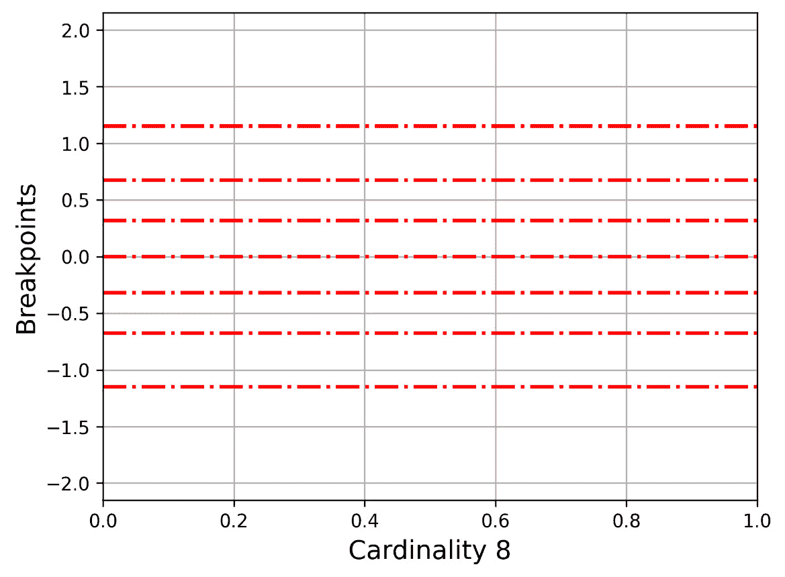
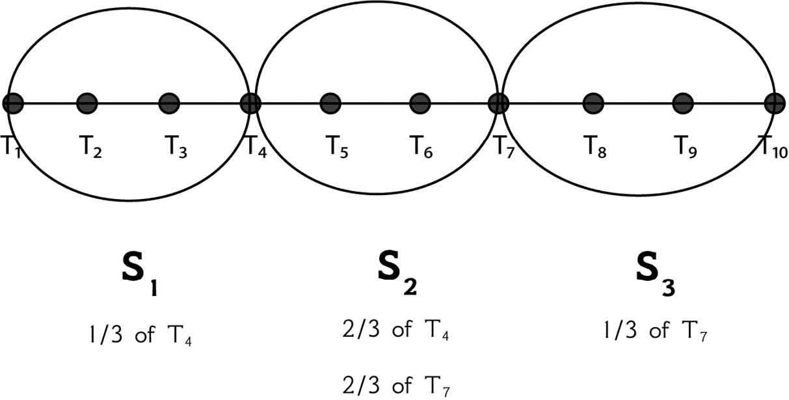
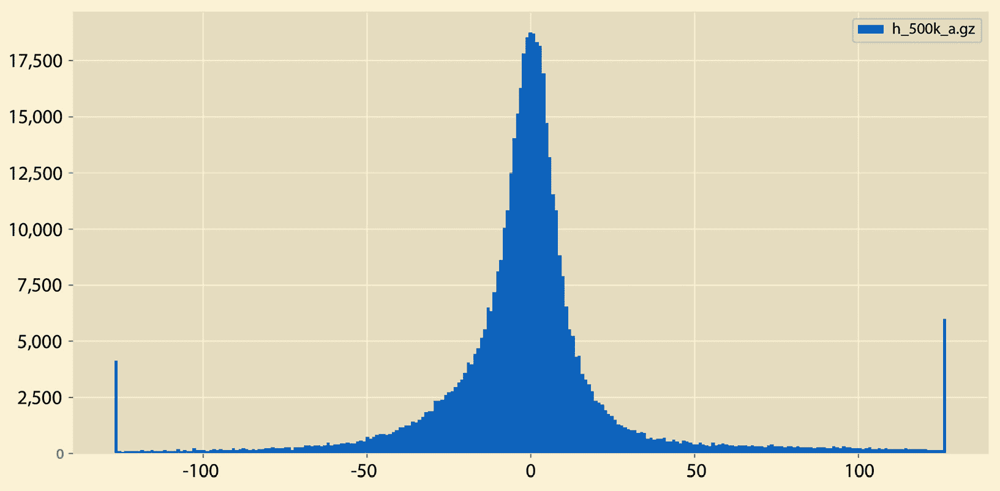
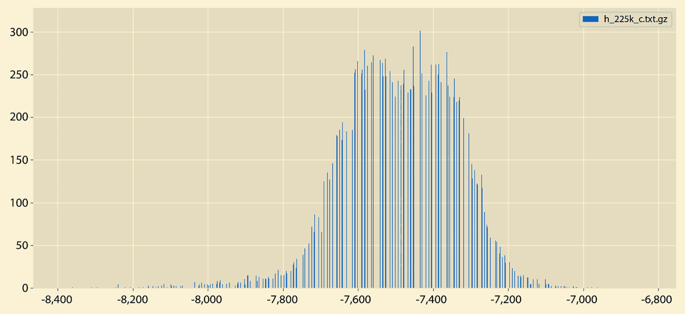

# 第二章：实现 SAX

本章是关于 iSAX 索引的 **Symbolic Aggregate Approximation** (**SAX**) 组件，分为两部分——第一部分是理论知识，第二部分是计算 SAX 和实际应用的代码示例。在章节末尾，你将看到如何计算一些有用的统计量，这些统计量可以让你对时间序列有一个更高的概述，并绘制数据的直方图。

在本章中，我们将涵盖以下主要主题：

+   所需的理论

+   SAX 简介

+   开发 Python 包

+   使用 SAX 包

+   计算时间序列的 SAX 表示

+   `tsfresh` Python 包

+   创建时间序列的直方图

+   计算时间序列的百分位数

# 技术要求

该书的 GitHub 仓库是 [`github.com/PacktPublishing/Time-Series-Indexing`](https://github.com/PacktPublishing/Time-Series-Indexing)。每章的代码都在其自己的目录中。因此，第二章 的代码可以在 `ch02` 文件夹中找到。如果你已经使用 `git(1)` 获取了整个 GitHub 仓库的本地副本，就无需再次获取。只需在处理本章内容时将当前工作目录设置为 `ch02`。

# 所需的理论

在本节中，你将学习支持 SAX 表示所需的理论。然而，请记住，这本书更注重实践而非理论。如果你想深入理解理论，你应该阅读本章中提到的以及即将发表的研究论文，以及每章末尾的“有用链接”部分。因此，理论主要是为了服务于我们的主要目的，即实现技术和算法。

SAX 的操作和细节在由 Jessica Lin、Eamonn Keogh、Li Wei 和 Stefano Lonardi 撰写的题为 *Experiencing SAX: a novel symbolic representation of time series* 的研究论文中得到了全面描述。这篇论文([`doi.org/10.1007/s10618-007-0064-z`](https://doi.org/10.1007/s10618-007-0064-z))于 2007 年正式发表。你不必从头到尾阅读它，但下载并阅读其摘要和引言部分是个好主意。

我们将首先解释术语 *PAA* 和 *SAX*。**PAA** 代表 **Piecewise Aggregate Approximation**。PAA 表示提供了一种降低时间序列维度的方法。这意味着它将一个长时间序列转换为一个更小的版本，这使得处理起来更容易。

PAA 也在 *Experiencing SAX: a novel symbolic representation of time series* 论文中进行了解释([`doi.org/10.1007/s10618-007-0064-z`](https://doi.org/10.1007/s10618-007-0064-z))。从那里，我们可以很容易地理解 PAA 和 SAX 是密切相关的，因为 SAX 的理念基于 PAA。*SAX 表示* 是时间序列的 **符号表示**。简单来说，它提供了一种以摘要形式表示时间序列的方法，以便节省空间并提高速度。

PAA 和 SAX 的区别

PAA 和 SAX 表示之间的主要区别在于，PAA 只是基于滑动窗口大小计算时间序列的均值，而 SAX 表示利用这些均值并将 PAA 进一步转换为时间序列（或子序列）的离散表示。换句话说，SAX 表示将 PAA 表示转换为更易于处理的形式。正如您很快就会发现的，这种转换是在 **断点**的帮助下进行的，这些断点将均值值的数值空间划分为子空间。每个子空间都有一个基于给定断点值的离散表示。

PAA 和 SAX 都是降维技术。SAX 将在稍后进行更详细的解释，而关于 PAA 的讨论就到这里结束。

下一个子节告诉我们为什么我们需要 SAX。

## 我们为什么需要 SAX？

时间序列难以搜索。时间序列（或子序列）越长，搜索它或将其与另一个进行比较的计算量就越大。同样，使用索引时间序列的索引也是如此——iSAX 就是这样一种索引。

为了让您的事情更简单，我们将采取一个包含 *x* 个元素的子序列并将其转换为包含 *w* 个元素的表现形式，其中 *w* 远小于 *x*。严格来说，这被称为 **降维**，它使我们能够使用更少的数据处理长时间子序列。然而，一旦我们决定需要处理一个给定的子序列，我们就需要使用其全部维度来处理它——也就是说，所有它的 *x* 个元素。

下一个子节讨论了归一化，这使我们能够在不同的尺度上比较值。

## 归一化

您可能问的第一个两个问题是归一化是什么以及为什么需要它。

**归一化**是将使用不同尺度的值调整到共同尺度的过程。一个简单的例子是比较华氏和摄氏温度——除非我们将所有值都带到相同的尺度，否则我们无法这样做。这是归一化的最简单形式。

尽管存在各种类型的归一化，但这里需要的是 **标准分数归一化**，这是最简单的归一化形式，因为这是用于时间序列和子序列的。请勿将数据库归一化和范式与值归一化混淆，因为它们是完全不同的概念。

我们将归一化引入过程的原因如下：

+   第一个也是最重要的原因是，我们可以比较使用不同值范围的数据集。一个简单的例子是比较摄氏度和华氏温度。

+   由于数据异常减少但并未消除，这是前一点的一个副作用。

+   通常，归一化数据更容易理解和处理，因为我们处理的是预定义范围内的值。

+   使用归一化值索引进行搜索可能比使用较大值时更快。

+   由于值较小，搜索、排序和创建索引更快。

+   归一化在概念上更清晰，更容易维护和根据需要更改。

另一个支持归一化需求的简单例子是当比较正值和负值时。在比较这种不同类型的观察结果时，几乎不可能得出有用的结论。归一化解决了这些问题。

虽然我们不需要这样做，但请记住，我们不能从子序列的归一化版本回到原始子序列，因此归一化过程是不可逆的。

以下函数展示了如何使用 NumPy Python 包的帮助来归一化时间序列：

```py
def normalize(x):
     eps = 1e-6
     mu = np.mean(x)
     std = np.std(x)
     if std < eps:
           return np.zeros(shape=x.shape)
     else:
           return (x-mu)/std
```

前一个函数揭示了归一化的公式。给定一个数据集，其每个元素的归一化形式等于观察值，减去数据集的**平均值**除以数据集的**标准差**——这两个统计术语在本章的*The tsfresh Python 包*部分中解释。

这在前一个函数的返回值中可以看到，`(x-mu)/std`。NumPy 足够聪明，可以计算每个观察值而不需要使用`for`循环。如果标准差接近`0`，这是由`eps`变量的值模拟的，那么`normalize()`的返回值将等于一个全为零的 NumPy 数组。

使用之前开发的函数（此处未显示）的`normalize.py`脚本，以时间序列作为输入，并返回其归一化版本。其代码如下：

```py
#!/usr/bin/env python3
import sys
import pandas as pd
import numpy as np
def main():
     if len(sys.argv) != 2:
           print("TS")
           sys.exit()
     F = sys.argv[1]
     ts = pd.read_csv(F, compression='gzip', header = None)
     ta = ts.to_numpy()
     ta = ta.reshape(len(ta))
     taNorm = normalize(ta)
     print("[", end = ' ')
     for i in taNorm.tolist():
           print("%.4f" % i, end = ' ')
     print("]")
if __name__ == '__main__':
     main()
```

程序中的最后一个`for`循环用于以较小的精度打印`taNorm` NumPy 数组的内容，以便占用更少的空间。为此，我们需要使用`tolist()`方法将`taNorm` NumPy 数组转换为常规 Python 列表。

我们将向`normalize.py`提供一个短时间序列；然而，该脚本也可以处理更长的序列。`normalize.py`的输出如下：

```py
$ ./normalize.py ts1.gz
[ -1.2272 0.9487 -0.1615 -1.0444 -1.3362 1.4861 -1.0620 0.7451 -0.4858 -0.9965 0.0418 1.7273 -1.1343 0.6263 0.3455 0.9238 1.2197 0.3875 -0.0483 -1.7054 1.3272 1.5999 1.4479 -0.4033 0.1525 1.0673 0.7019 -1.0114 0.4473 -0.2815 1.1239 0.7516 -1.3102 -0.6428 -0.3186 -0.3670 -1.6163 -1.2383 0.5692 1.2341 -0.0372 1.3250 -0.9227 0.2945 -0.5290 -0.3187 1.4103 -1.3385 -1.1540 -1.2135 ]
```

考虑到归一化，我们现在继续到下一个子节，我们将可视化一个时间序列，并展示原始版本和归一化版本之间的视觉差异。

## 可视化归一化时间序列

在本小节中，我们将通过可视化展示归一化版本和原始时序版本之间的差异。请注意，我们通常*不会对整个时序进行归一化*。归一化是在基于滑动窗口大小的子序列级别进行的。换句话说，为了本书的目的，我们将归一化子序列，而不是整个时序。此外，对于 SAX 表示法的计算，我们根据**段值**处理归一化子序列，这指定了 SAX 表示法将包含的部分。因此，对于段值为 2，我们将归一化子序列分成两个部分。对于段值为 4，我们将归一化子序列分成四个集合。

尽管如此，查看时序的归一化和原始版本是非常有教育意义的。`visualize_normalized.py`的 Python 代码（不包括`normalize()`的实现）如下：

```py
#!/usr/bin/env python3
import sys
import pandas as pd
import matplotlib.pyplot as plt
import numpy as np
def main():
     if len(sys.argv) != 2:
           print("TS")
           sys.exit()
     F = sys.argv[1]
     ts = pd.read_csv(F, compression='gzip', header = None)
     ta = ts.to_numpy()
     ta = ta.reshape(len(ta))
     # Find its normalized version
     taNorm = normalize(ta)
     plt.plot(ta, label="Regular", linestyle='-', markevery=10, marker='o')
     plt.plot(taNorm, label="Normalized", linestyle='-.', markevery=10, marker='o')
     plt.xlabel('Time Series', fontsize=14)
     plt.ylabel('Values', fontsize=14)
     plt.legend()
     plt.grid()
     plt.savefig("CH02_01.png", dpi=300, format='png', bbox_inches='tight')
if __name__ == '__main__':
     main()
```

`plt.plot()`函数被调用了两次，每次都绘制一条线。您可以自由地实验 Python 代码，以改变输出的外观。

*图 2.1*显示了`visualize_normalized.py ts1.gz`的输出，它使用了一个包含 50 个元素的时序。


图 2.1 – 时序及其归一化版本的绘图

我认为*图 2.1*本身就很有说服力！归一化版本的值位于*0 值附近*，而原始时序的值可以在任何地方！此外，我们在不完全失去原始形状和边缘的情况下使原始时序更加平滑。

下一节将介绍 SAX 表示法的细节，这是每个 iSAX 索引的关键组成部分。

# SAX 简介

如前所述，**SAX**代表**符号聚合近似**。SAX 表示法在 2007 年的论文《体验 SAX：时间序列的一种新颖的符号表示》中被正式宣布（[`doi.org/10.1007/s10618-007-0064-z`](https://doi.org/10.1007/s10618-007-0064-z)）。

请记住，我们不想找到整个时序的 SAX 表示法。我们只想找到时序子序列的 SAX 表示法。时序和子序列之间的主要区别是时序通常比子序列大得多。

每个 SAX 表示法有两个参数，分别命名为**基数**和**段数**。我们将首先解释基数参数。

## 基数参数

*基数* 参数指定了每个段可以有多少个可能的值。作为副作用，基数参数 *定义了 y 轴的分割方式* – 这用于获取每个段的值。根据基数，存在多种指定段值的方法。这包括字母字符、十进制数和二进制数。在这本书中，我们将使用二进制数，因为它们更容易理解和解释，使用带有 **预先计算的断点** 的文件，这些断点适用于高达 256 的基数。

因此，基数 4，即 22，给出了四个可能的值，因为我们使用了 2 位。然而，我们可以轻松地将 `00` 替换为字母 `a`，`01` 替换为字母 `b`，`10` 替换为字母 `c`，`11` 替换为字母 `d`，以此类推，以便使用字母而不是二进制数。请记住，这可能需要在展示的代码中进行最小的代码更改，并且当您对 SAX 和提供的 Python 代码感到舒适时，尝试这个练习会很好。

断点文件的格式如下，在我们的例子中支持高达 256 的基数，被称为 `SAXalphabet`：

```py
$ head -7 SAXalphabet
0
-0.43073,0.43073
-0.67449,0,0.67449
-0.84162,-0.25335,0.25335,0.84162
-0.96742,-0.43073,0,0.43073,0.96742
-1.0676,-0.56595,-0.18001,0.18001,0.56595,1.0676
-1.1503,-0.67449,-0.31864,0,0.31864,0.67449,1.1503
```

这里展示的值在 SAX 术语中被称为断点。第一行中的值将 *y* 轴分割成两个区域，由 *x* 轴分隔。因此，在这种情况下，我们需要 1 位来定义我们是在上空间（正 *y* 值）还是下空间（负 *y* 值）。

由于我们将使用二进制数来表示每个 SAX 段，因此没有必要浪费它们。因此，我们将使用的值是 2 的幂，从 2 1 (*基数 2*) 到 2 8 (*基数 256*)。

现在我们来展示 *图 2**.2**，它展示了 `-0.67449, 0, 0.67449` 如何将 *y* 轴分割，这在 2 2 基数中是使用的。底部部分从负无穷大到 `-0.67449`，第二部分从 `-0.67449` 到 `0`，第三部分从 `0` 到 `0.67449`，最后一部分从 `0.67449` 到正无穷大。


图 2.2 – 基数为 4 的 y 轴（三个断点）

现在我们来展示 *图 2**.3**，它展示了 `-1.1503, -0.67449, -0.31864, 0, 0.31864, 0.67449, 1.1503` 如何分割 *y* 轴。这是针对 2 3 基数的。



图 2.3 – 基数为 8 的 y 轴（七个断点）

由于这可能是一项繁琐的工作，我们创建了一个工具来完成所有的绘图。它的名字是 `cardinality.py`，它读取 `SAXalphabet` 文件，在绘图之前找到所需基数的断点。

`cardinality.py` 的 Python 代码如下：

```py
#!/usr/bin/env python3
import sys
import pandas as pd
import matplotlib.pyplot as plt
import numpy as np
import os
breakpointsFile = "./sax/SAXalphabet"
def main():
     if len(sys.argv) != 3:
           print("cardinality output")
           sys.exit()
     n = int(sys.argv[1]) - 1
     output = sys.argv[2]
     path = os.path.dirname(__file__)
     file_variable = open(path + "/" + breakpointsFile)
     alphabet = file_variable.readlines()
     myLine = alphabet[n - 1].rstrip()
     elements = myLine.split(',')
     lines = [eval(i) for i in elements]
     minValue = min(lines) - 1
     maxValue = max(lines) + 1
     fig, ax = plt.subplots()
     for i in lines:
           plt.axhline(y=i, color='r', linestyle='-.', linewidth=2)
     xLabel = "Cardinality " + str(n)
     ax.set_ylim(minValue, maxValue)
     ax.set_xlabel(xLabel, fontsize=14)
     ax.set_ylabel('Breakpoints', fontsize=14)
     ax.grid()
     fig.savefig(output, dpi=300, format='png', bbox_inches='tight')
if __name__ == '__main__':
     main()
```

脚本需要两个命令行参数——基数和输出文件，用于保存图像。请注意，基数值为 8 需要 7 个断点，基数值为 32 需要 31 个断点，依此类推。因此，`cardinality.py`的 Python 代码减少了它将在`SAXalphabet`文件中搜索的行数，以支持该功能。因此，当给定基数值为 8 时，脚本将寻找`SAXalphabet`中具有 7 个断点的行。此外，由于脚本将断点值作为字符串读取，我们需要使用`lines = [eval(i) for i in elements]`语句将这些字符串转换为浮点值。其余的代码与 Matplotlib Python 包有关，以及如何使用`plt.axhline()`绘制线条。

下一个子节是关于段落数据的参数。

## 段参数

（段落数量的）*段*参数指定了 SAX 表示将要拥有的部分（*单词*）的数量。因此，段值为 2 意味着 SAX 表示将有两个单词，每个单词使用指定的基数。因此，每个部分的值由基数确定。

这个参数的一个副作用是，在归一化子序列后，我们将它除以段落数量，并分别处理这些不同的部分。这就是 SAX 表示的工作方式。

基数和段值控制时间序列子序列以及整个时间序列的数据压缩比和准确性。

下一个子节展示了如何手动计算子序列的 SAX 表示——这是完全理解过程和能够识别代码中的错误或错误的最有效方式。

## 如何手动找到子序列的 SAX 表示

找到子序列的 SAX 表示看起来很简单，但需要大量的计算，这使得这个过程非常适合计算机。以下是找到时间序列或子序列的 SAX 表示的步骤：

1.  首先，我们需要有段落数量和基数。

1.  然后，我们归一化子序列或时间序列。

1.  之后，我们将归一化的子序列除以段落数量。

1.  对于这些部分中的每一个，我们找到它的平均值。

1.  最后，基于每个平均值，我们根据基数计算其表示。基数定义了将要使用的断点值。

我们将使用两个简单的例子来说明时间序列 SAX 表示的手动计算。在这两种情况下，时间序列是相同的。不同之处在于 SAX 参数和滑动窗口大小。

让我们假设我们有一个以下时间序列和一个滑动窗口大小为 4：

```py
{-1, 2, 3, 4, 5, -1, -3, 4, 10, 11, . . .}
```

基于滑动窗口大小，我们从时间序列中提取前两个子序列：

+   `S1 = {-1, 2, 3, 4}`

+   `S2 = {2, 3, 4, 5}`

我们应该采取的第一步是使用我们之前开发的 `normalize.py` 脚本 – 我们只需将每个子序列保存到自己的纯文本文件中，并使用 `gzip` 工具对其进行压缩，然后再将其作为输入提供给 `normalize.py`。如果你使用的是微软 Windows 机器，你应该寻找一个允许你创建此类 ZIP 文件的实用程序。另一种选择是使用纯文本文件，这可能在 `pd.read_csv()` 函数调用中需要一些小的代码更改。

当处理 `S1` (`s1.txt.gz`) 和 `S2` (`s2.txt.gz`) 时，`normalize.py` 脚本的输出如下：

```py
$ ./normalize.py s1.txt.gz
[ -1.6036 0.0000 0.5345 1.0690 ]
$ ./normalize.py s2.txt.gz
[ -1.3416 -0.4472 0.4472 1.3416 ]
```

因此，`S1` 和 `S2` 的归一化版本如下：

+   `N1 = {-1.6036, 0.0000,` `0.5345, 1.0690}`

+   `N2 = {-1.3416, -0.4472,` `0.4472, 1.3416}`

在这个第一个例子中，我们使用段值为 2，基数值为 4（22）。段值为 2 意味着我们必须将每个 *归一化子序列* 分成两部分。这两部分包含以下数据，基于 `S1` 和 `S2` 的归一化版本：

+   对于 `S1`，两部分是 `{-1.6036, 0.0000}` 和 `{``0.5345, 1.0690}`

+   对于 `S2`，两部分是 `{-1.3416, -0.4472}` 和 `{``0.4472, 1.3416}`

每个部分的平均值如下：

+   对于 `S1`，它们分别是 `-0.8018` 和 `0.80175`

+   对于 `S2`，它们是 `-0.8944` 和 `0.8944`

对于基数 4，我们将查看 *图 2**.2* 和相应的断点，分别是 `-0.67449`，`0` 和 `0.67449`。因此，每个段的 SAX 值如下：

+   对于 S1，它们是 `00`，因为 `-0.8018` 位于图表底部，而 `11`

+   对于 S2，它们是 `00` 和 `11`，因为 `0.8944` 位于图表的顶部

因此，`S1` 的 SAX 表示是 `[00, 11]`，而 `S2` 的表示也是 `[00, 11]`。这两个子序列具有相同的 SAX 表示是有道理的，因为它们只在一个元素上有所不同，这意味着它们的归一化版本相似。

注意，在两种情况下，较低的基数都从图表的底部开始。对于 *图 2**.2*，这意味着 `00` 位于图表底部，`01` 接着是，然后是 `10`，而 `11` 位于图表顶部。

在第二个例子中，我们将使用滑动窗口大小为 8，段值 4，基数值 8（23）。

关于滑动窗口大小

请记住，当滑动窗口大小保持不变时，子序列的归一化表示保持不变。然而，如果基数或段发生变化，生成的 SAX 表示可能完全不同。

根据滑动窗口大小，我们从时间序列中提取前两个子序列 – `S1 = {-1, 2, 3, 4, 5, -1, -3, 4}` 和 `S2 = {2, 3, 4, 5, -1, -3,` `4, 10}`。

`normalize.py` 脚本的输出将是以下内容：

```py
$ ./normalize.py T1.txt.gz
[ -0.9595 0.1371 0.5026 0.8681 1.2337 -0.9595 -1.6906 0.8681 ]
$ ./normalize.py T2.txt.gz
[ -0.2722 0.0000 0.2722 0.5443 -1.0887 -1.6330 0.2722 1.9052 ]
```

因此，`S1`和`S2`的归一化版本分别是`N1 = {-0.9595, 0.1371, 0.5026, 0.8681, 1.2337, -0.9595, -1.6906, 0.8681}`和`N2 = {-0.2722, 0.0000, 0.2722, 0.5443, -1.0887, -1.6330, 0.2722, 1.9052}`。

段数值为 4 意味着我们必须将每个**归一化子序列**分成四个部分。对于`S1`，这些部分是`{-0.9595, 0.1371}`，`{0.5026, 0.8681}`，`{1.2337, -0.9595}`，和`{-1.6906, 0.8681}`。

对于`S2`，这些部分是`{-0.2722, 0.0000}`，`{0.2722, 0.5443}`，`{-1.0887, -1.6330}`，和`{0.2722, 1.9052}`。

对于`S1`，平均值是`-0.4112`，`0.68535`，`0.1371`，和`-0.41125`。对于`S2`，平均值是`-0.1361`，`0.40825`，`-1.36085`，和`1.0887`。

关于基数值为 8 的断点

这里提醒一下，对于基数值为 8 的情况，断点为（000）`-1.1503`，（001）`-0.67449`，（010）`-0.31864`，（011）`0`，（100）`0.31864`，（101）`0.67449`，以及（110）`1.1503`（111）。在括号中，我们展示了每个断点的 SAX 值。对于第一个断点，其左侧是 000 值，右侧是 001 值。对于最后一个断点，其左侧是 110 值，右侧是 111 值。记住，我们使用七个断点来表示基数值为 8。

因此，`S1`的 SAX 表示为`['010', '110', '100', '010']`，而`S2`的表示为`['011', '101', '000', '110']`。在 SAX 词周围使用单引号表示，尽管我们将其计算为二进制数，但内部我们将其作为字符串存储，因为这样更容易搜索和比较。

下一个子节考察了一个不能被段落数完美分割的子序列的案例。

## 我们如何将 10 个数据点分成 3 个段？

到目前为止，我们已经看到了子序列长度可以完美被段落数分割的例子。然而，如果不可能这样做，会发生什么呢？

在这种情况下，存在一些数据点同时贡献于两个相邻的段。然而，我们不是将整个点放入一个段中，而是将其一部分放入一个段，另一部分放入另一个段！

这在 *《体验 SAX：时间序列的新符号表示法》* 论文的第 18 页有进一步的解释。正如论文中所述，如果我们不能将滑动窗口长度除以段落数量，我们可以使用一个段中的一个点的部分和另一个段中的一个点的部分。我们只为位于两个段之间的点这样做，而不是任何随机点。这可以通过一个例子来解释。想象我们有一个时间序列，例如 *T* = {*t*1, *t*2, *t*3, *t*4, *t*5, *t*6, *t*7, *t*8, *t*9, *t*10}*。对于 *S*1 段，我们取 *t*1, *t*2, *t*3 的值和 *t*4 值的三分之一。对于 *S*2 段，我们取 *t*5, *t*6 的值和 *t*4 和 *t*7 值的三分之二。对于 *S*3 段，我们取 *t*8, *t*9, *t*10 的值和之前未使用的 *t*7 值的三分之一。这也在 *图 2.4** 中解释了。4*:



图 2.4 – 将 10 个数据点分成 3 个段

简单来说，这是 SAX 创建者决定的一个约定，适用于所有我们无法完美地将元素数量除以段落数量的情况。

在这本书中，我们不会处理那种情况。滑动窗口大小，即生成的子序列的长度，以及段落数量都是完美除法的一部分，余数为 0。这种简化并没有改变 SAX 的工作方式，但它使我们的生活变得稍微容易一些。

下一个小节的主题是如何在不进行每个计算的情况下，从较高的基数转换为较低的基数。

## 降低 SAX 表示的基数

从本小节中获得的知识将在我们讨论 iSAX 索引时适用。然而，由于你将要学习的内容与 SAX 直接相关，我们决定先在这里讨论。

想象一下，我们有一个给定基数的 SAX 表示法，我们想要降低基数。这是否可能？我们能否在不从头开始计算一切的情况下做到这一点？答案是简单的——这可以通过忽略尾随位来实现。给定一个二进制值 10,100，第一个尾随位是 0，然后是下一个尾随位是 0，然后是 1，以此类推。因此，我们从末尾的位开始，逐个移除它们。

就像你们大多数人，包括我在第一次读到它时，可能会觉得这不清楚一样，让我给你们一些实际例子。让我们从这个章节的 *《如何手动找到子序列的 SAX 表示法》* 小节中的以下两个 SAX 表示法 `[00, 11]` 和 `[010, 110, 100, 010]` 开始。要将 `[00, 11]` 转换为基数 2，我们只需删除每个 SAX 词尾的数字。因此，新的 `[00, 11]` 版本将是 `[0, 1]`。同样，`[010, 110, 100, 010]` 将会变为 `[01, 11, 10, 01]`，基数是 4，而对于基数 2，将是 `[0, 1, 1, 0]`。

因此，从更高的基数——一个有更多数字的基数——我们可以通过从一段或多段（尾数位）的右侧 *减去适当的数字* 来降低基数。我们能朝相反的方向前进吗？不能不损失精度，但即便如此，这仍然比没有好。然而，通常情况下，我们不会朝相反的方向前进。到目前为止，我们已经了解了关于 SAX 表示的理论。接下来的部分将简要解释 Python 包的基础知识，并展示我们自己的包 `sax` 的开发过程。

# 开发 Python 包

在本节中，我们描述了开发一个 Python 包的过程，该包用于计算子序列的 SAX 表示。除了这是一个好的编程练习之外，当我们在后续章节中创建 iSAX 索引时，该包将在接下来的章节中得到丰富。

我们将首先解释 Python 包的基础知识。

## Python 包的基础知识

我不是 Python 专家，所提供的信息远非完整。然而，它涵盖了有关 Python 包所需的知识。

在除了最新版本的 Python 之外的所有版本中，我们通常需要在每个 Python 包的目录中创建一个名为 `__init__.py` 的文件。它的目的是执行初始化操作和导入，以及定义变量。尽管在最新的 Python 版本中这种情况不再适用，但我们的包中仍然会包含一个 `__init__.py` 文件。好事是，如果你没有东西要放入其中，它可以是空的。本章末尾有一个链接指向官方 Python 文档，其中详细解释了包、常规包和命名空间包的使用，以及 `__init__.py` 的使用。

下一个子节将讨论我们将要开发的 Python 包的详细信息。

## SAX Python 包

`sax` Python 包的代码包含在一个名为 `sax` 的目录中。`sax` 目录的内容通过 `tree(1)` 命令展示，你可能需要自行安装该命令：

```py
$ tree sax
sax
├── SAXalphabet
├── __init__.py
├── __pycache__
│   __init__.cpython-310.pyc
│   sax.cpython-310.pyc
│   tools.cpython-310.pyc
│   variables.cpython-310.pyc
├── sax.py
├── tools.py
└── variables.py
2 directories, 9 files
```

Python 会在你开始使用 Python 包之后自动生成名为 `__pycache__` 的目录，该目录包含预编译的 Python 字节码。你可以完全忽略该目录。

让我们先看看 `sax.py` 的内容，它将被分成多个代码块展示。

首先，我们有 `import` 部分，以及 `normalize()` 函数的实现，该函数用于规范化一个 NumPy 数组：

```py
import numpy as np
from scipy.stats import norm
from sax import tools
import sys
sys.path.insert(0,'..')
def normalize(x):
     eps = 1e-6
     mu = np.mean(x)
     std = np.std(x)
     if std < eps:
           return np.zeros(shape=x.shape)
     else:
           return (x-mu)/std
```

之后，我们将介绍 `createPAA()` 函数的实现，该函数根据基数和段返回时间序列的 SAX 表示：

```py
def createPAA(ts, cardinality, segments):
     SAXword = ""
     ts_norm = normalize(ts)
     segment_size = len(ts_norm) // segments
     mValue = 0
     for I in range(segments):
           ts_segment = ts_norm[segment_size * i :(i+1) * segment_size]
           mValue = meanValue(ts_segment)
           index = getIndex(mValue, cardinality)
           SAXword += str(index) +""""
```

Python 使用双斜杠 `//` 运算符执行向下取整除法。`//` 运算符的作用是在将结果向下取整到最接近的整数之前，将第一个数除以第二个数——这用于 `segment_size` 变量。

代码的其余部分是关于在处理给定的时间序列（或子序列）时指定正确的索引号。因此，`for`循环用于根据段值处理整个时间序列（或子序列）。

接下来，我们有一个计算 NumPy 数组平均值的函数的实现：

```py
def meanValue(ts_segment):
     sum = 0
     for i in range(len(ts_segment)):
           sum += ts_segment[i]
     mean_value = sum / len(ts_segment)
     return mean_value
```

最后，我们有一个函数，它根据 SAX 词的平均值和基数返回 SAX 值。记住，我们在`createPAA()`函数中单独计算每个 SAX 词的平均值：

```py
def getIndex(mValue, cardinality):
     index = 0
     # With cardinality we get cardinality + 1
     bPoints = tools.breakpoints(cardinality-1)
     while mValue < float(bPoints[index]):
           if index == len(bPoints)–- 1:
                 # This means that index should be advanced
                 # before breaking out of the while loop
                 index += 1
                 break
           else:
                 index += 1
     digits = tools.power_of_two(cardinality)
     # Inverse the result
     inverse_s = ""
     for i in binary_index:
           if i == '0':
                 inverse_s += '1'
           else:
                 inverse_s += '0'
     return inverse_s
```

之前的代码通过使用平均值来计算 SAX 词的 SAX 值。它迭代地访问断点，从最低值到最高值，直到平均值超过当前断点。这样，我们在断点列表中找到 SAX 词（平均值）的索引。

现在，让我们讨论一个棘手的问题，这与反转 SAX 词的最后几个语句有关。这主要与我们是开始从断点创建的不同区域的顶部还是底部计数有关。所有方法都是等效的——我们只是决定那样做。这是因为 SAX 的前一个实现使用了那个顺序，我们想要确保为了测试目的我们创建了相同的结果。如果你想改变这个功能，你只需要移除最后的`for`循环。

如您在本节开头所见，`sax`包由三个 Python 文件组成，而不仅仅是刚才我们展示的那个。因此，我们将展示剩下的两个文件。

首先，我们将展示`variables.py`的内容：

```py
# This file includes all variables for the sax package
maximumCardinality = 32
# Where to find the breakpoints file
# In this case, in the current directory
breakpointsFile =""SAXalphabe""
# Sliding window size
slidingWindowSize = 16
# Segments
segments = 0
# Breakpoints in breakpointsFile
elements ="""
# Floating point precision
precision = 5
```

你可能会想知道为什么有这样的文件。答案是，我们需要一个地方来保存我们的全局参数和选项，而有一个单独的文件来处理这一点是一个完美的解决方案。当代码变得更长更复杂时，这会更有意义。

其次，我们展示`tools.py`中的代码：

```py
import os
import numpy as np
import sys
from sax import variables
breakpointsFile = variables.breakpointsFile
maxCard = variables.maximumCardinality
```

在这里，我们引用了`variable.py`文件中的两个变量，分别是`variables.breakpointsFile`和`variables.maximumCardinality`：

```py
def power_of_two(n):
     power = 1
     while n/2 != 1:
           # Not a power of 2
           if n % 2 == 1:
                 return -1
           n = n / 2
           power += 1
     return power
```

这是一个辅助函数，我们在想要确保一个值是 2 的幂时使用它：

```py
def load_sax_alphabet():
     path = os.path.dirname(__file__)
     file_variable = open(path +"""" + breakpointsFile)
     variables.elements = file_variable.readlines()
def breakpoints(cardinality):
     if variables.elements ==""":
           load_sax_alphabet()
     myLine = variables.elements[cardinality–- 1].rstrip()
     elements = myLine.split'''')
     elements.reverse()
     return elements
```

`load_sax_alphabet()`函数加载包含断点定义的文件内容，并将它们分配给`variables.elements`变量。`breakpoints()`函数在给定基数时返回断点值。

如您所见，整个包的代码相对较短，这是一个好事。

在本节中，我们开发了一个 Python 包来计算 SAX 表示。在下一节中，我们将开始使用`sax`包。

# 使用 SAX 包

现在我们有了 SAX 包，是时候通过开发各种实用程序来使用它了，从计算时间序列子序列的 SAX 表示的实用程序开始。

## 计算时间序列子序列的 SAX 表示

在本小节中，我们将开发一个实用工具，该工具计算时间序列所有子序列的 SAX 表示，并展示它们的归一化形式。该实用工具的名称是 `ts2PAA.py`，包含以下代码：

```py
#!/usr/bin/env python3
import sys
import numpy as np
import pandas as pd
from sax import sax
def main():
     if len(sys.argv) != 5:
           print("TS1 sliding_window cardinality segments")
           sys.exit()
     file = sys.argv[1]
     sliding = int(sys.argv[2])
     cardinality = int(sys.argv[3])
     segments = int(sys.argv[4])
     if sliding % segments != 0:
           print("sliding MODULO segments != 0...")
           sys.exit()
     if sliding <= 0:
           print("Sliding value is not allowed:", sliding)
           sys.exit()
     if cardinality <= 0:
           print("Cardinality Value is not allowed:", cardinality)
           sys.exit()
     # Read Sequence as Pandas
     ts = pd.read_csv(file, names=['values'], compression='gzip')
     # Convert to NParray
     ts_numpy = ts.to_numpy()
     length = len(ts_numpy)
     PAA_representations = []
     # Split sequence into subsequences
     for i in range(length - sliding + 1):
           t1_temp = ts_numpy[i:i+sliding]
           # Generate SAX for each subsequence
           tempSAXword = sax.createPAA(t1_temp, cardinality, segments)
           SAXword = tempSAXword.split("_")[:-1]
           print(SAXword, end = ' ')
           PAA_representations.append(SAXword)
           print("[", end = ' ')
           for i in t1_temp.tolist():
                 for k in i:
                       print("%.2f" % k, end = ' ')
           print("]", end = ' ')
           print("[", end = ' ')
           for i in sax.normalize(t1_temp).tolist():
                 for k in i:
                       print("%.2f" % k, end = ' ')
           print("]")
if __name__ == '__main__':
     main()
```

`ts2PAA.py` 脚本接受一个时间序列，将其分割成子序列，并使用 `sax.normalize()` 计算每个子序列的归一化版本。

`ts2PAA.py` 的输出如下（为了简洁，省略了一些输出）：

```py
$ ./ts2PAA.py ts1.gz 8 4 2
['01', '10'] [ 5.22 23.44 14.14 6.75 4.31 27.94 6.61 21.73 ] [ -0.97 1.10 0.04 -0.80 -1.07 1.61 -0.81 0.90 ]
['01', '10'] [ 23.44 14.14 6.75 4.31 27.94 6.61 21.73 11.43 ] [ 1.07 -0.05 -0.94 -1.24 1.62 -0.96 0.87 -0.38 ]
['10', '01'] [ 14.14 6.75 4.31 27.94 6.61 21.73 11.43 7.15 ] [ 0.21 -0.73 -1.05 1.97 -0.75 1.18 -0.14 -0.68 ]
['01', '10'] [ 6.75 4.31 27.94 6.61 21.73 11.43 7.15 15.85 ] [ -0.76 -1.07 1.93 -0.77 1.14 -0.16 -0.70 0.40 ]
['01', '10'] [ 4.31 27.94 6.61 21.73 11.43 7.15 15.85 29.96 ] [ -1.22 1.32 -0.97 0.66 -0.45 -0.91 0.02 1.54 ]
['10', '01'] [ 27.94 6.61 21.73 11.43 7.15 15.85 29.96 6.00 ] [ 1.34 -1.02 0.65 -0.49 -0.96 0.00 1.56 -1.08 ]
. . .
```

之前的输出显示了时间序列所有子序列的 SAX 表示、原始子序列和子序列的归一化版本。每个子序列都在单独的一行上。

使用 Python 包

接下来的大多数章节都需要我们在这里开发的 SAX 包。出于简单起见，我们将 SAX 包的实现复制到所有使用该包的目录中。在希望每个软件或包只有一个副本的生产系统中，这可能不是最佳实践，但在学习和实验时是最佳实践。

到目前为止，我们已经学习了如何使用 `sax` 包的基本功能。

下一节介绍了一个实用工具，该工具用于计算时间序列子序列的 SAX 表示并打印结果。

# 计算时间序列的 SAX 表示

本章本节介绍了用于计算时间序列 SAX 表示的实用工具。该实用工具背后的逻辑所使用的 Python 数据结构是一个字典，其中键是转换为字符串的 SAX 表示，值是整数。

`counting.py` 的代码如下：

```py
#!/usr/bin/env python3
import sys
import pandas as pd
from sax import sax
def main():
     if len(sys.argv) != 5:
           print("TS1 sliding_window cardinality segments")
           print("Suggestion: The window be a power of 2.")
           print("The cardinality SHOULD be a power of 2.")
           sys.exit()
     file = sys.argv[1]
     sliding = int(sys.argv[2])
     cardinality = int(sys.argv[3])
     segments = int(sys.argv[4])
     if sliding % segments != 0:
           print("sliding MODULO segments != 0...")
           sys.exit()
     if sliding <= 0:
           print("Sliding value is not allowed:", sliding)
           sys.exit()
     if cardinality <= 0:
           print("Cardinality Value is not allowed:", cardinality)
           sys.exit()
     ts = pd.read_csv(file, names=['values'], compression='gzip')
     ts_numpy = ts.to_numpy()
     length = len(ts_numpy)
     KEYS = {}
     for i in range(length - sliding + 1):
           t1_temp = ts_numpy[i:i+sliding]
           # Generate SAX for each subsequence
           tempSAXword = sax.createPAA(t1_temp, cardinality, segments)
           tempSAXword = tempSAXword[:-1]
           if KEYS.get(tempSAXword) == None:
                 KEYS[tempSAXword] = 1
           else:
                 KEYS[tempSAXword] = KEYS[tempSAXword] + 1
     for k in KEYS.keys():
           print(k, ":", KEYS[k])
if __name__ == '__main__':
     main()
```

`for` 循环将时间序列分割成子序列，并使用 `sax.createPAA()` 计算每个子序列的 SAX 表示，然后更新 `KEYS` 字典中的相关计数器。`tempSAXword = tempSAXword[:-1]` 语句从 SAX 表示中移除一个不需要的下划线字符。最后，我们打印 `KEYS` 字典的内容。

`counting.py` 的输出应类似于以下内容：

```py
$ ./counting.py ts1.gz 4 4 2
10_01 : 18
11_00 : 8
01_10 : 14
00_11 : 7
```

这个输出告诉我们什么？

对于包含 50 个元素的时间序列 (`ts1.gz`) 和滑动窗口大小为 4 的情况，存在 `18` 个具有 `10_01` SAX 表示的子序列，`8` 个具有 `11_00` SAX 表示的子序列，`14` 个具有 `01_10` SAX 表示的子序列，以及 `7` 个具有 `00_11` SAX 表示的子序列。为了便于比较，并且能够将 SAX 表示用作字典的键，我们将 `[01 10]` 转换为 `01_10` 字符串，将 `[11 00]` 转换为 `11_00`，依此类推。

时间序列有多少个子序列？

请记住，给定一个包含 `n` 个元素的时间序列和滑动窗口大小为 `w`，子序列的总数是 `n – w + 1`。

`counting.py` 可以用于许多实际任务，并将更新在 *第三章* 中。

下一个章节讨论了一个实用的 Python 包，可以帮助我们从统计角度更深入地了解处理时间序列。

# `tsfresh` Python 包

这是一个与本书主题不直接相关的附加章节，但仍然很有帮助。它介绍了一个实用的 Python 包，名为 `tsfresh`，可以从统计角度给你提供一个关于时间序列的概览。我们不会展示 `tsfresh` 的所有功能，只是介绍那些你可以轻松使用来获取时间序列数据信息的部分——在这个阶段，你可能需要在你的机器上安装 `tsfresh`。请记住，`tsfresh` 包有很多依赖包。

因此，我们将计算数据集的以下属性——在这种情况下，是一个时间序列：

+   **平均值**：数据集的平均值是所有值的总和除以值的数量。

+   **标准差**：数据集的标准差衡量其变化量。有一个计算标准差的公式，但我们通常使用 Python 包中的函数来计算它。

+   **偏度**：数据集的偏度是衡量其不对称性的一个指标。偏度的值可以是正的、负的、零或未定义。

+   **峰度**：数据集的峰度是衡量数据集尾部特性的一个指标。用更数学化的术语来说，峰度衡量的是分布尾部相对于正态分布的厚重程度。

所有这些量在你绘制数据后会有更多的意义，这留给你作为练习；否则，它们只是数字。所以，现在我们了解了一些基本的统计术语，让我们展示一个 Python 脚本，它可以计算时间序列的所有这些量。

`using_tsfresh.py` 的 Python 代码如下：

```py
#!/usr/bin/env python3
import sys
import pandas as pd
import tsfresh
def main():
     if len(sys.argv) != 2:
           print("TS")
           sys.exit()
     TS1 = sys.argv[1]
     ts1Temp = pd.read_csv(TS1, compression='gzip')
     ta = ts1Temp.to_numpy()
     ta = ta.reshape(len(ta))
     # Mean value
     meanValue = tsfresh.feature_extraction.feature_calculators.mean(ta)
     print("Mean value:\t\t", meanValue)
     # Standard deviation
     stdDev = tsfresh.feature_extraction.feature_calculators.standard_deviation(ta)
     print("Standard deviation:\t", stdDev)
     # Skewness
     skewness = tsfresh.feature_extraction.feature_calculators.skewness(ta)
     print("Skewness:\t\t", skewness)
     # Kurtosis
     kurtosis = tsfresh.feature_extraction.feature_calculators.kurtosis(ta)
     print("Kurtosis:\t\t", kurtosis)
if __name__ == '__main__':
     main()
```

使用 `using_tsfresh.py` 处理 `ts1.gz` 的输出应该类似于以下内容：

```py
$ ./using_tsfresh.py ts1.gz
Mean value:  15.706410001204729
Standard deviation:  8.325017802111901
Skewness:     0.008971113265160474
Kurtosis:    -1.2750042973761417
```

`tsfresh` 包可以做更多的事情；我们只是展示了 `tsfresh` 功能的冰山一角。

下一个章节是关于创建时间序列的直方图。

# 创建时间序列的直方图

这是一个另一个附加章节，我们将展示如何创建时间序列的直方图，以更好地了解其值。

**直方图**，看起来很像条形图，定义了桶（bin）并计算落入每个桶中的值的数量。严格来说，直方图通过创建值的**分布**图来帮助你理解你的数据。你可以通过查看直方图看到最大值和最小值，以及发现数据模式。

`histogram.py` 的 Python 代码如下：

```py
#!/usr/bin/env python3
import sys
import pandas as pd
import matplotlib.pyplot as plt
import numpy as np
import math
import os
if len(sys.argv) != 2:
     print("TS1")
     sys.exit()
TS1 = sys.argv[1]
ts1Temp = pd.read_csv(TS1, compression='gzip')
ta = ts1Temp.to_numpy()
ta = ta.reshape(len(ta))
min = np.min(ta)
max = np.max(ta)
plt.style.use('Solarize_Light2')
bins = np.linspace(min, max, 2 * abs(math.floor(max) + 1))
plt.hist([ta], bins, label=[os.path.basename(TS1)])
plt.legend(loc='upper right')
plt.show()
```

`np.linspace()` 函数的第三个参数帮助我们定义直方图的 bins 数量。第一个参数是最小值，第二个参数是展示样本的最大值。此脚本不会将其输出保存到文件中，而是打开一个 GUI 窗口来显示输出。`plt.hist()` 函数创建直方图，而 `plt.legend()` 函数将图例放置在输出中。

`histogram.py` 的一个示例输出可以在 *图 2.5* 中看到：



图 2.5 – 一个示例直方图

`histogram.py` 的另一个示例输出可以在 *图 2.6* 中看到：



图 2.6 – 一个示例直方图

那么，*图 2.5* 和 *图 2.6* 中的直方图有什么区别？存在许多差异，包括*图 2.5* 中的直方图没有空 bins，并且包含负值和正值。另一方面，*图 2.6* 中的直方图只包含远离 0 的负值。

现在我们已经了解了直方图，让我们学习另一个有趣的统计量 – *百分位数*。

# 计算时间序列的百分位数

在本章最后一个附加部分，我们将学习如何计算时间序列或列表的百分位数（如果你觉得这里提供的信息难以理解，请随意跳过）。此类信息的主要用途是更好地理解你的时间序列数据。

*百分位数*是一个分数，其中给定百分比的分数在频率分布中。因此，20 百分位数是低于该分数的分数，占分布中数据集值的 20%。

**四分位数**是以下三个百分位数之一 – 25%，50%，或 75%。因此，我们有第一四分位数，第二四分位数和第三四分位数，分别。

百分位数和四分位数都是在按升序排序的数据集中计算的。即使你没有对那个数据集进行排序，相关的 NumPy 函数，即 `quantile()`，也会在幕后完成排序。

`percentiles.py` 的 Python 代码如下：

```py
#!/usr/bin/env python3
import sys
import pandas as pd
import numpy as np
def main():
     if len(sys.argv) != 2:
           print("TS")
           sys.exit()
     F = sys.argv[1]
     ts = pd.read_csv(F, compression='gzip')
     ta = ts.to_numpy()
     ta = ta.reshape(len(ta))
     per01 = round(np.quantile(ta, .01), 5)
     per25 = round(np.quantile(ta, .25), 5)
     per75 = round(np.quantile(ta, .75), 5)
     print("Percentile 1%:", per01, "Percentile 25%:", per25, "Percentile 75%:", per75)
if __name__ == '__main__':
     main()
```

所有工作都是由 NumPy 包中的 `quantile()` 函数完成的。除了其他事情之外，`quantile()` 在进行任何计算之前都会适当地排列其元素。我们不知道内部发生了什么，但很可能是 `quantile()` 会将其输入按升序排序。

`quantile()` 的第一个参数是 NumPy 数组，第二个参数是我们感兴趣的百分比（百分位数）。25%的百分比等于第一个四分位数，50%的百分比等于第二个四分位数，75%的百分比等于第三个四分位数。1%的百分比等于 1%的百分位数，依此类推。

`percentiles.py` 的输出如下：

```py
$ ./percentiles.py ts1.gz
Percentile 1%: 1.57925 Percentile 25%: 7.15484 Percentile 75%: 23.2298
```

# 概述

本章包括了 SAX 的理论背景和实际实现，以及从统计角度理解时间序列。由于 iSAX 索引的构建基于 SAX 表示，我们无法在不计算 SAX 表示的情况下构建 iSAX 索引。

在你开始阅读*第三章*之前，请确保你知道如何根据滑动窗口大小、段数和基数计算时间序列或子序列的 SAX 表示。

下一章包含与 iSAX 索引相关的理论，展示了如何手动构建 iSAX 索引（你会发现这非常有趣），并包括了一些实用的工具开发。

# 有用链接

+   关于 Python 包：[`docs.python.org/3/reference/import.xhtml`](https://docs.python.org/3/reference/import.xhtml)

+   `tsfresh` 包：[`pypi.org/project/tsfresh/`](https://pypi.org/project/tsfresh/)

+   `tsfresh` 包的文档可以在[`tsfresh.readthedocs.io/en/latest/`](https://tsfresh.readthedocs.io/en/latest/)找到。

+   `scipy` 包：[`pypi.org/project/scipy/`](https://pypi.org/project/scipy/) 和 [`scipy.org/`](https://scipy.org/)

+   归一化：[`en.wikipedia.org/wiki/Normalization_(statistics)`](https://en.wikipedia.org/wiki/Normalization_(statistics))

+   直方图：[`en.wikipedia.org/wiki/Histogram`](https://en.wikipedia.org/wiki/Histogram)

+   百分位数：[`en.wikipedia.org/wiki/Percentile`](https://en.wikipedia.org/wiki/Percentile)

+   正态分布：[`en.wikipedia.org/wiki/Normal_distribution`](https://en.wikipedia.org/wiki/Normal_distribution)

# 练习

尝试在 Python 中解决以下练习：

+   手动将 *y* 轴划分为 16 = 2⁴ 的基数。你是否将其划分为 16 个区域或 17 个区域？你使用了多少个断点？

+   手动将 *y* 轴划分为 64 = 2⁶ 的基数。你是否将其划分为 64 个区域？

+   使用 `cardinality.py` 工具绘制 16 = 2⁴ 基数断点。

+   使用 `cardinality.py` 工具绘制 128 = 2⁷ 基数断点。

+   使用 4 个段和基数 4（2²）找到子序列 `{0, 2, -1, 2, 3, 4, -2, 4}` 的 SAX 表示，别忘了先进行归一化。

+   使用 2 个段和基数 2（2¹）找到子序列 `{0, 2, -1, 2, 3, 4, -2, 4}` 的 SAX 表示，别忘了先进行归一化。

+   使用 4 个段和基数 2 找到子序列 `{0, 2, -1, 2, 3, 1, -2, -4}` 的 SAX 表示。

+   给定时间序列 `{0, -1, 1.5, -1.5, 0, 1, 0}` 和滑动窗口大小为 4，使用 2 个段和基数 2 找到所有子序列的 SAX 表示。

+   创建一个合成的时间序列并使用 `using_tsfresh.py` 处理它。

+   创建一个包含 1,000 个元素的合成时间序列并使用 `histogram.py` 处理它。

+   创建包含 5,000 个元素的合成时间序列，并使用`histogram.py`进行处理。

+   创建包含 10,000 个元素的合成时间序列，并使用`counting.py`进行处理。

+   创建包含 100 个元素的合成时间序列，并使用`percentiles.py`进行处理。

+   创建包含 100 个元素的合成数据集，并使用`counting.py`进行检验。

+   修改`histogram.py`以将其图形输出保存为 PNG 文件。

+   使用`histogram.py`绘制时间序列，然后使用`using_tsfresh.py`进行处理。
