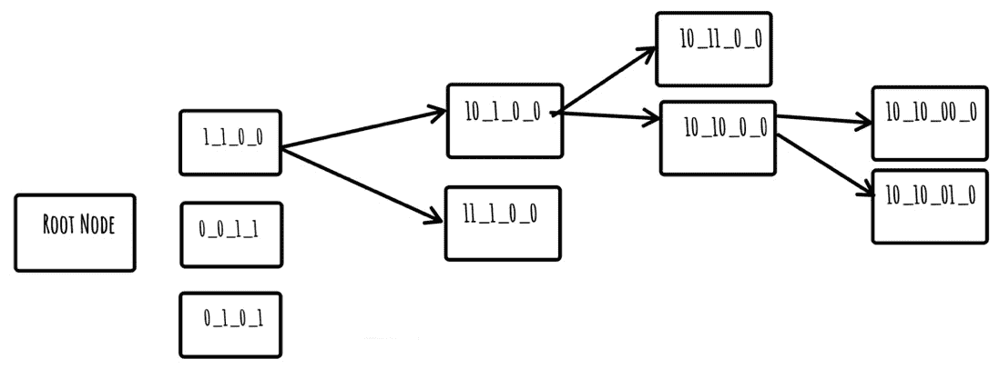

# 3

# iSAX – 必要的理论

现在我们已经了解了 SAX，包括归一化和计算子序列的 SAX 表示，现在是时候学习 iSAX 索引背后的理论了，在撰写本文时，它被认为是最好的时间序列索引之一。存在使 iSAX 更快、更紧凑的 iSAX 改进版本，但其核心思想保持不变。

如您从其名称中猜测的那样，iSAX 在某些方面依赖于 SAX。简单来说，**每个 iSAX 索引的关键是 SAX 表示**。因此，在 iSAX 索引中进行搜索依赖于 SAX 表示。

到目前为止，我相信提供更多关于 iSAX 的信息将有助于您在阅读本章时。**iSAX 索引**是一个树状结构，其中根节点，且仅根节点，可以有多个子节点，而根节点的所有子节点都是二叉树。此外，为了创建 iSAX 索引，我们需要一个时间序列和一个阈值值，这是叶子节点（在 iSAX 术语中的终端节点）可以存储的最大子序列数，以及一个段值和一个基数值。后两个参数与 SAX 表示相关。所有这些都在本章中进行了更详细的解释，但尽早了解整体情况是很有帮助的。

此外，在本章中，我们将逐步手动构建一个小型的 iSAX 索引，并使用大量的可视化来更好地理解这个过程。请确保在阅读完本章后亲自进行这个过程。

在本章中，我们将涵盖以下主要主题：

+   背景信息

+   理解 iSAX 的工作原理

+   iSAX 是如何构建的

+   手动构建 iSAX 索引

+   更新`counting.py`实用工具

# 技术要求

本书的 GitHub 仓库可以在[`github.com/PacktPublishing/Time-Series-Indexing`](https://github.com/PacktPublishing/Time-Series-Indexing)找到。每个章节的代码都在其自己的目录中。因此，*第三章*的代码可以在`ch03`文件夹中找到。

# 背景信息

在本节的第一部分，我们将学习与 iSAX 相关的基本定义和概念。但首先，我们将提及描述 iSAX 操作的学术论文。iSAX 及其操作在由 Jin Shieh 和 Eamonn Keogh 所著的*iSAX: 大规模时间序列数据集的磁盘感知挖掘和索引*中进行了描述。您不必从头到尾阅读这篇论文，但正如我们之前提到的 SAX 研究论文一样，阅读其摘要和引言部分将有益于您。

此外，对 iSAX 已经进行了各种改进，主要是使其更快，这些改进在以下研究论文中有所体现：

+   *iSAX 2.0: 索引和挖掘十亿时间序列*，由 Alessandro Camerra、Themis Palpanas、Jin Shieh 和 Eamonn Keogh 所著

+   *《超过十亿个时间序列：使用 iSAX2+索引和挖掘非常大的时间序列集合*》，作者：Alessandro Camerra、Jin Shieh、Themis Palpanas、Thanawin Rakthanmanon 和 Eamonn Keogh

+   *《DPiSAX：大规模分布式分区 iSAX*》，作者：Djamel-Edine Yagoubi、Reza Akbarinia、Florent Masseglia 和 Themis Palpanas

+   *《数据系列索引的演变：iSAX 数据系列索引家族：iSAX、iSAX2.0、iSAX2+、ADS、ADS+、ADS-Full、ParIS、ParIS+、MESSI、DPiSAX、ULISSE、Coconut-Trie/Tree、Coconut-LSM*》，作者：Themis Palpanas

我们不会在本书中处理上述研究论文，因为我们正在使用 iSAX 索引的初始版本。你不需要为了本书的目的阅读所有这些论文，但在你对 iSAX 感到舒适时查看它们将是一项很好的练习。

由于 iSAX 是一种树，下一节将介绍有关树和二叉树的基本信息。

## 树和二叉树

让我们先解释什么是有向图。**有向图**是一种边具有方向的图。**有向无环图**（DAG）是一种没有环的有向图。

在计算机科学中，**树**是一种满足以下三个原则的 DAG 数据结构：

+   它有一个根节点，这是进入树的入口点

+   除了根节点外，每个顶点只有一个且仅有一个入口点

+   存在一条路径连接根节点到每个顶点

如前所述，树的**根**是树的第一节点。每个节点可以连接到一个或多个节点，具体取决于树类型。如果每个节点只连接到一个节点，那么这棵树就变成了链表！叶节点是没有子节点的节点。叶节点也被称为外部节点，而至少有一个子节点的节点称为内部节点。

**二叉树**是一种树，其中每个节点下最多有两个额外的节点。"最多"意味着它可以连接到 1 个、2 个或没有其他节点。树的**深度**，也称为**高度**，定义为从根节点到叶节点的最长路径，而节点的深度是从节点到树根节点的边数。

请记住，如果你使用相同的一组元素以不同的顺序创建两个二叉树，你将得到两个完全不同的树。最简单的方法是从不同的根节点开始。因此，我们事先不知道树的最终形状。

树有内部节点和叶节点。在 iSAX 术语中，这些分别被称为**内部节点**和**终端节点**。**内部节点**有一个父节点和至少一个子节点，而**终端节点**有一个父节点但没有自己的子节点。

二叉树在最长根节点到叶子节点的路径长度与最短路径长度之差为 0 或 1 时被认为是**平衡树**。**不平衡树**是指不满足平衡条件的树。尽管 iSAX 索引可以通过其长度来表征，但确定 iSAX 索引是否平衡并没有什么意义，因为索引的工作方式并非如此，这主要与数据有关。然而，拥有平衡树是一件好事。

因此，尽管 iSAX 索引是树，但我们不能将所有二叉树规则应用于 iSAX 索引。然而，了解所有这些细节有助于更好地理解为什么某个 iSAX 索引可能比其他索引更快或更慢。

平衡二叉树

如果二叉树是平衡的，其搜索、插入和删除操作大约需要`log(n)`步，其中`n`是树中元素的总数。此外，平衡二叉树的高度大约是`log2(n)`，这意味着具有 10,000 个元素的平衡树的高度为 14，这非常小。具有 100,000 个元素的平衡树的高度将是 17，具有 1,000,000 个元素的平衡树的高度将是 20！换句话说，将大量元素放入平衡二叉树并不会极大地改变树的搜索速度。换句话说，你最多用 20 步就可以到达一个具有 1,000,000 个节点的平衡树中的任何节点！

*图 3.1*展示了一个小型的 iSAX 索引，这使我们能够更深入地了解 iSAX 索引，而不会迷失在细节中。我们将在下一节中学习更多关于 iSAX 索引的细节。



图 3.1 – 一个小的 iSAX 索引

那么，我们在这里有什么，它告诉我们什么呢？

由于 iSAX 索引的每个节点都有四个 SAX 词，我们知道段值是 4。然而，我们无法确定基数，因为基数从最小值开始，并在需要时增加，即当有分裂时。然而，即使在分裂时，也只有一个 SAX 词被提升到更高的基数值。这个特定的 iSAX 索引的根有三个子节点——我们假设根节点的其余子节点为空。终端节点是`[0 0 1 1]`、`[0 1 0 1]`、`[11 1 0 0]`、`[10 11 0 0]`、`[10 10 00 0]`和`[10 10 01 0]`，内部节点是`[1 1 0 0]`、`[10 1 0 0]`和`[10 10 0 0]`。我们无法对阈值值做出任何假设。

*第六章*将介绍可视化 iSAX 索引的技术，这在处理大型 iSAX 索引并希望对索引有一个概览时非常有用。

下一节将提供更多关于 iSAX 的详细信息。

# 理解 iSAX 的工作原理

在本节中，我们将讨论 iSAX 的工作方式，这包括构建阶段以及其使用和参数。除了必要的理论之外，我们还将展示一个实用的命令行工具，该工具可以帮助你理解给定其参数的情况下，iSAX 索引可以有多少个子序列。

iSAX 与 SAX 的关系

iSAX 与 SAX 表示之间的关系很简单。iSAX 索引中所有节点（除了没有键的根节点）的键都是 SAX 表示。因此，构建和搜索 iSAX 索引的大部分工作都是基于 SAX 的。

我们不会在 iSAX 索引中删除或更新元素，不是因为不可能，而是因为这不是 iSAX 索引的工作方式。

现在是时候讨论 iSAX 索引的参数了，因为 iSAX 的构建依赖于它们。

## 集合参数

`[1 000 0 11]` SAX 表示和另一个具有`[10001 00 0 1]` SAX 表示的表示。第二个区别是我们从 2 的基数值开始。这意味着根节点的所有子节点在它们的 SAX 词中都具有 2 的基数值。

## 段参数

iSAX 索引的**段**参数与每个 SAX 表示中的工作方式完全相同，并定义了每个 SAX 表示中的**SAX 词**数量。

## 阈值参数

**阈值**参数是新的，定义了终端节点可以存储的**最大子序列数**。我们不能超过这个值。阈值参数定义了节点分割何时发生。

下一个子节将介绍一个命令行工具，该工具基于段的数量计算归一化子序列的平均值，因为平均值定义了 SAX 词。

## 计算归一化平均值

本节介绍了一个实用程序，该实用程序基于段值输出时间序列所有归一化子序列的平均值。如果不根据段值分割，计算所有归一化子序列的平均值就没有意义，因为归一化后，子序列的平均值非常接近 0，这是归一化的一个要点。

在本例中，我们将使用`meanValues.py`脚本。其代码如下：

```py
#!/usr/bin/env python3
# Date: Monday 19 December 2022
#
# This utility outputs the mean values of all
# (NORMALIZED) subsequences of a time series
import sys
import numpy as np
import pandas as pd
sys.path.insert(0,'..')
def normalize(x):
    eps = 1e-6
    mu = np.mean(x)
    std = np.std(x)
    if std < eps:
        return np.zeros(shape=x.shape)
    else:
        return (x-mu)/std
def main():
    if len(sys.argv) != 4:
        print("Usage: TS1 sliding_window segments")
        sys.exit()
    file = sys.argv[1]
    # We prefer values which are powers of 2
    sliding = int(sys.argv[2])
    segments = int(sys.argv[3])
    if sliding <= 0:
        print("Sliding value is not allowed:", sliding)
        sys.exit()
    ts = pd.read_csv(file, names=['values'],
        compression='gzip')
    ts_numpy = ts.to_numpy()
    length = len(ts_numpy)
    splits = sliding // segments
    # Split time series into subsequences
    for i in range(length - sliding + 1):
        t1_temp = ts_numpy[i:i+sliding]
        normalized = normalize(t1_temp)
        for s in range(segments):
            temp = normalized[splits*s:splits*(s+1)]
            mValue = np.mean(temp)
            print(round(mValue,5))
```

根据段的数量，该实用程序将每个子序列分割成部分，并计算每个部分的平均值。代码的最后部分如下：

```py
if __name__ == '__main__':
    main()
```

`meanValues.py`的输出如下（为了简洁起见，省略了大部分输出）：

```py
$ ./meanValues.py ts1.gz 16 4
-0.33294
-0.00404
0.10926
0.22772
-0.51625
0.05592
-0.20672
. . .
```

你可以将输出保存下来，并用如`histogram.py`这样的工具进行处理，该工具在上一章中已介绍。

*图 3.2* 展示了使用`meanValues.py`处理两个不同时间序列（每个时间序列大约有 500,000 个元素）的`histogram.py`输出，使用了`1024`的滑动窗口大小和 4 个段。四个段意味着对于每个子序列，我们必须计算四个平均值，因为我们把每个子序列分成四个部分。因此，一个 500,000 个元素的时间序列会产生 2,000,000 个平均值，这些平均值将进入直方图。


图 3.2 – 来自两个时间序列的 histogram.py 输出

*图 3.2* 告诉我们什么？上面的图是名为 ECG 的时间序列，下面的直方图是名为 EEG 的时间序列。ECG 时间序列的平均值（因此是基数值）的大多数（大约 200 万个值）都落在`-0.5`到`0.5`的值范围内。这意味着，基于断点值，许多 SAX 词将非常相似，因此将落入少量的 iSAX 分支中，使得*ECG 数据集的 iSAX 索引非常不平衡*。另一方面，对于 EEG 数据集，平均值在直方图中分布得更好，这意味着它们将产生的 SAX 词将分布得更好，生成的 iSAX 索引将更加平衡。

如果你想了解更多关于直方图中值分布的信息，你可以增加 bin 的数量，以获得更详细的输出。

下一个小节将介绍一个命令行实用程序，该实用程序计算给定参数的 iSAX 索引可以存储的最大子序列数。请记住，这是一个**理想情况**，其中 iSAX 索引完全平衡，所有终端节点都有最大数量的子序列，这通常不是情况。

## 一个 iSAX 索引可以有多大？

在本小节中，我们将计算在理想条件下 iSAX 索引可以存储的最大子序列数。正如你所知，iSAX 索引的根节点可以有超过两个子节点，而所有其他内部节点只有一个或两个子节点，这些子节点可以是其他内部节点或终端节点。一个内部节点可以有任意组合的内部节点和终端节点作为子节点。

现在，让我们一起来做一个练习：假设我们想要找出一个基数`4`和`2`个段的 iSAX 索引可以有多少个节点。由于我们关注的是节点，阈值参数在我们的讨论中并不起关键作用，所以现在忽略它。我们将在讨论结束时回到阈值参数。

首先，我们将计算根节点的子节点数。这仅取决于段的数量，因为根节点的所有子节点都具有基数`2`。因此，如果我们有 2 个段，根节点的最大子节点数是 4，即 2 的 2 次方。这些有以下的 SAX 表示：`[0, 0]`、`[0, 1]`、`[1, 0]`和`[1, 1]`。如果你熟悉二进制系统，这些都可以用 2 位表示。

如果我们有 3 个段，根节点的最大子节点数是 8，即 2 的 3 次方。这些有以下的 SAX 表示：`[0, 0, 0]`、`[0, 0, 1]`、`[0, 1, 0]`、`[0, 1, 1]`、`[1, 0, 0]`、`[1, 0, 1]`、`[1, 1, 0]`和`[1, 1, 1]`。如果你熟悉二进制系统，这些都可以用 3 位表示。对于根节点的每个子节点，每个 SAX 词的大小可以与基数值一样大。

现在，回到我们最初的问题，即计算一个基数值为 4、2 个段的 iSAX 索引可以拥有的最大节点数。正如证明的那样，当有 2 个段时，根节点的子节点数是 4。每个段可以有的值数量与基数相同，在这个例子中是 4。所以，有 2 个段，我们可以有 4 乘以 4 的可能组合，即 16。这是这个 iSAX 索引可以存储的最大终端节点数。因此，当我们有基数值为 4 和 2 个段时，**最大终端节点数**是 16。

现在我们知道了终端节点的总数，是时候停止忽略阈值参数，看看它能为我们的提供什么信息了。阈值参数可以帮助我们在**理想情况下**计算这个 iSAX 索引可以容纳的最大子序列数。我们之所以谈论理想情况，是因为大多数情况下，iSAX 索引是不平衡的，而且没有办法确保一个 iSAX 索引将会是平衡的。这是因为这取决于子序列和滑动窗口的大小。

因此，当我们有 64 个终端节点和阈值值为 100 时，在理想情况下，一个 iSAX 索引可以存储的最大子序列数是**6,400**。

在考虑了所有这些信息之后，我们将开发一个小型的 Python 脚本来为我们进行计算。`maximumISAX.py`的代码如下：

```py
#!/usr/bin/env python3
import sys
def main():
    if len(sys.argv) != 4:
        print("cardinality segments threshold")
        print("Suggestion: The window be a power of 2.")
        print("The cardinality SHOULD be a power of 2.")
        sys.exit()
    cardinality = int(sys.argv[1])
    segments = int(sys.argv[2])
    threshold = int(sys.argv[3])
    terminalNodes = pow(cardinality, segments)
    print("Nodes:", terminalNodes)
    subsequences = terminalNodes * threshold
    print("Maximum number of subsequences:", subsequences)
if __name__ == '__main__':
    main()
```

`maximumISAX.py`的输出如下：

```py
$ ./maximumISAX.py 4 4 100
Nodes: 256
Maximum number of subsequences: 25600
```

因此，前面的输出告诉我们，一个有 4 个段、基数值为 4 和阈值值为 100 的 iSAX 索引可以容纳多达`25600`个子序列。

如果我们用相同数量的段和不同的基数运行`maximumISAX.py`，我们将得到以下输出：

```py
$ ./maximumISAX.py 16 4 100
Nodes: 65536
Maximum number of subsequences: 6553600
```

因此，前面的输出告诉我们，一个有 4 个段、基数值为 16 和阈值值为 100 的 iSAX 索引，尽管根节点仍有 16 个子节点，但可以容纳多达`6553600`个子序列。

下一小节将讨论当没有空间将给定的子序列添加到 iSAX 索引中时会发生什么。

## 当没有空间为添加更多子序列到 iSAX 索引时会发生什么？

iSAX 索引可能会*溢出*。在实践中，这意味着 iSAX 索引可能没有足够的空间来添加更多的子序列。这种情况发生在 iSAX 索引的一个或多个分支已经使用了所有段的全部基数，并且这些终端节点达到了阈值值。*图 3.3*展示了这一点：


图 3.3 – iSAX 溢出

假设具有 SAX 表示`[10 10 00 00]`和`[10 10 00 01]`的节点已满，并且正在使用它们的全部基数。这意味着除非我们增加 iSAX 索引的一个或多个相关参数，否则我们不能再提升具有`[10 10 00 00]`和`[10 10 00 01]`SAX 表示的节点。所以，如果我们有一个具有`[10 10 00 00]`或`[10 10 00 01]`SAX 表示的子序列，我们不知道如何处理它，因此 iSAX 索引发生了溢出。

在本节中，我们学习了关于 iSAX 的基本信息。下一节将更详细地讨论 iSAX 的构建。

# iSAX 是如何构建的

本节将要描述 iSAX 索引是如何构建的。所有提供的信息都是基于描述 iSAX 的研究论文。逻辑步骤如下：

+   我们从一个节点开始，这个节点是 iSAX 索引的根。根节点不包含实际数据（子序列），但它包含指向所有具有指定段值和`2`的基数值的节点的指针，这是一个只能有两个值的单比特，即`0`和`1`。

+   之后，我们构建根节点的子节点，在这个初始点，它们都是终端节点，没有任何子序列。

+   现在，我们开始根据它们的 SAX 表示向根节点的子节点添加子序列。

+   当终端节点的阈值值达到时，我们根据指定的**提升策略**进行分割，并将子序列分配到两个新创建的终端节点。

+   这个过程会一直进行，直到所有子序列都插入到 iSAX 索引中，或者没有地方可以添加子序列。

下一节将解释如何搜索 iSAX，以便更好地了解构建过程与搜索操作之间的关系。

## iSAX 是如何搜索的

iSAX 索引的搜索过程可以描述如下：

+   首先，我们有一个子序列，我们想在 iSAX 索引中查找这个子序列。

+   然后，我们必须使用与 iSAX 索引相同的参数计算该子序列的 SAX 表示。

+   之后，我们使用子序列的 SAX 表示来找出它属于根节点的哪个子节点。

+   然后，我们继续在二叉树中搜索，直到找到一个具有相同 SAX 表示的节点。记住，我们可能需要根据 iSAX 节点减少子序列中的某些 SAX 词。如果不存在这样的节点，那么 iSAX 索引不包含该子序列。

+   最后，我们检查该节点的子序列 – 假设存在这样的终端节点 – 并寻找那个特定的子序列。

一般而言，这个过程与我们将该子序列添加到 iSAX 索引中直到找到它所属的节点是相同的。之后，我们搜索该节点的子序列。

下一个子节将讨论提升策略，这与在需要发生分割时哪个 SAX 词将被提升有关。

## 提升策略

**提升策略**这个术语指的是在即将发生分割时，将要更新为更高基数段的选取。分割发生在我们即将向一个已经包含等于阈值值的子序列的终端节点添加新的子序列时。*只有那个终端节点将要* *被分割*。

阈值值

负责终端节点分割的唯一参数是阈值参数。如果阈值参数是无限的，那么所有 iSAX 索引的终端节点都将具有 2 的基数值，即根子节点。

在分割节点时，有两种提升策略：

+   `[0 1 0 0]` SAX 表示。对于需要进行的第一次提升，我们提升第一个 SAX 词，得到`[00 1 0 0]`和`[01 1 0 0]`。在接下来的提升中，我们将提升第二个 SAX 词，即使这次提升发生在不同的 SAX 表示上。所以，如果我们需要提升`[1 1 0 1]`，这将给我们`[1 10 0 1]`和`[1 11 0 1]`。

+   `[00 1 0 0]`将给我们`[000 1 0 0]`和`[001 1 0 0]`，前提是我们有一个至少为 8 的基数值。当最左边的 SAX 词达到其满基数时，我们继续下一个右边的 SAX 词。

没有正确或错误的提升策略 – 使用你最喜欢的方法。

下一个子节将介绍 iSAX 的一个基本操作，即节点分割。

## 分割节点

本节将更详细地讨论节点分割过程。分割仅在一种情况下发生：当一个终端节点即将拥有比阈值值允许的更多子序列时。在这种情况下，**那个终端节点变成一个内部节点**。然后，根据提升策略创建两个终端节点，它们是新创建的内部节点的子节点。想象一下，iSAX 索引在*图 3**.4*中展示，目前存储了 10 个子序列：S 0 到 S 9。

我们现在想要将 S 10 子序列添加到该索引中，但`[10 10 00 0]`已满：


图 3.4 – 分割节点前

因此，为了添加一个 SAX 表示为`[10 10 00 01]`的子序列，我们需要分裂`[10 10 00 0]`终端节点，现在它变成了具有相同 SAX 表示的内节点，以及`[10 10 00 00]`和`[10 10 00 01]`的 SAX 表示，分别。因此，在这种情况下，我们提升了最后一个 SAX 词。

之后，我们将迭代之前存储在`[10 10 00 0]`中的所有子序列，根据它们提升后的 SAX 表示，将它们放入`[10 10 00 00]`或`[10 10 00 01]`。我们不会深入探讨分裂后子序列的分布情况，因为这已经在接下来的*手动构建 iSAX 索引*部分中详细解释了。

如果分裂不能解决问题怎么办？

在前面的例子中，S10 将进入`[10 10 00 01]`终端节点，*前提是有足够的空间*。在罕见的情况下，新的子序列以及所有之前存储的子序列都进入同一个终端节点，分裂过程将继续进行，直到问题自行解决或出现 iSAX 溢出。

*图 3.5*显示了节点分裂后的 iSAX 索引的新版本：


图 3.5 – 节点分裂后

在本节中，我们学习了 iSAX 构建过程的各个阶段。下一节将通过一个真实示例和图表展示如何手动构建 iSAX 索引。

# 手动构建 iSAX 索引

在本节中，我们将手动创建一个小型的 iSAX 索引。为了更好地理解这个过程，我们将展示所有步骤并描述所有必要的计算。

如果您还记得本章前面的内容，创建 iSAX 索引的步骤可以描述如下：

1.  根据给定的滑动窗口大小将时间序列分割成子序列。

1.  对于每个子序列，根据给定的参数计算其 SAX 表示。

1.  开始将时间序列的子序列插入到 iSAX 索引中。最初，除了根节点外，所有 iSAX 节点都是终端节点。

1.  一旦终端节点满了——达到了阈值——通过增加其某个段的基数来分裂该节点，并创建两个新的终端节点。

1.  原始终端节点变成了一个内节点，现在它是新创建的终端节点的父节点。

1.  根据它们的 SAX 表示，将原始终端节点的子序列分割成两个新的终端节点。

子序列去哪里？

重要的是要意识到，具有`[00 10 10 11]` SAX 表示的子序列*必须*位于根的`[0 1 1 1]`子节点下。之后，确切的位置（终端节点）取决于在过程中将要发生的提升，可以是`[00 10 10 1]`、`[00 1 1 11]`、`[0 1 10 11]`等等。然而，如果我们使用其完整的 SAX 表示，它只能进入`[00 10 10 11]`终端节点。

我们将使用一个小时序来进行 iSAX 构建过程，以便不会花费太长时间完成。然而，原则是相同的。我们还需要使用上一章中的`ts2PAA.py`实用工具来获取每个子序列的 SAX 表示——我们不希望手动计算一切。

由于我们处理的是一个小时序，我们将使用`2`作为段值，`8`作为基数值，这意味着我们将使用 3 位来表示基数，以及`15`作为阈值值。滑动窗口大小为`8`。

因此，`ts2PAA.py`处理`ts1.gz`时的输出如下（我们目前忽略输出的归一化部分，为了简洁省略）：

```py
$ ../ch02/ts2PAA.py ts1.gz 8 8 2
[011, 100] [5.22 23.44 14.14 6.75 4.31 27.94 6.61 21.73]
[011, 100] [23.44 14.14 6.75 4.31 27.94 6.61 21.73 11.43]
[100, 011] [14.14 6.75 4.31 27.94 6.61 21.73 11.43 7.15]
[011, 100] [6.75 4.31 27.94 6.61 21.73 11.43 7.15 15.85]
[011, 100] [4.31 27.94 6.61 21.73 11.43 7.15 15.85 29.96]
[100, 011] [27.94 6.61 21.73 11.43 7.15 15.85 29.96 6.00]
[010, 101] [6.61 21.73 11.43 7.15 15.85 29.96 6.00 20.74]
[011, 100] [21.73 11.43 7.15 15.85 29.96 6.00 20.74 18.39]
[011, 100] [11.43 7.15 15.85 29.96 6.00 20.74 18.39 23.23]
[010, 101] [7.15 15.85 29.96 6.00 20.74 18.39 23.23 25.71]
[011, 100] [15.85 29.96 6.00 20.74 18.39 23.23 25.71 18.74]
[011, 100] [29.96 6.00 20.74 18.39 23.23 25.71 18.74 15.09]
[100, 011] [6.00 20.74 18.39 23.23 25.71 18.74 15.09 1.22]
[101, 010] [20.74 18.39 23.23 25.71 18.74 15.09 1.22 26.61]
[100, 011] [18.39 23.23 25.71 18.74 15.09 1.22 26.61 28.89]
[011, 100] [23.23 25.71 18.74 15.09 1.22 26.61 28.89 27.62]
[010, 101] [25.71 18.74 15.09 1.22 26.61 28.89 27.62 12.12]
[010, 101] [18.74 15.09 1.22 26.61 28.89 27.62 12.12 16.77]
[011, 100] [15.09 1.22 26.61 28.89 27.62 12.12 16.77 24.43]
[100, 011] [1.22 26.61 28.89 27.62 12.12 16.77 24.43 21.37]
[101, 010] [26.61 28.89 27.62 12.12 16.77 24.43 21.37 7.03]
[100, 011] [28.89 27.62 12.12 16.77 24.43 21.37 7.03 19.24]
[101, 010] [27.62 12.12 16.77 24.43 21.37 7.03 19.24 13.14]
[100, 011] [12.12 16.77 24.43 21.37 7.03 19.24 13.14 24.91]
[011, 100] [16.77 24.43 21.37 7.03 19.24 13.14 24.91 21.79]
[100, 011] [24.43 21.37 7.03 19.24 13.14 24.91 21.79 4.53]
[011, 100] [21.37 7.03 19.24 13.14 24.91 21.79 4.53 10.12]
[100, 011] [7.03 19.24 13.14 24.91 21.79 4.53 10.12 12.83]
[110, 001] [19.24 13.14 24.91 21.79 4.53 10.12 12.83 12.42]
[101, 010] [13.14 24.91 21.79 4.53 10.12 12.83 12.42 1.97]
[101, 010] [24.91 21.79 4.53 10.12 12.83 12.42 1.97 5.13]
[100, 011] [21.79 4.53 10.12 12.83 12.42 1.97 5.13 20.26]
[011, 100] [4.53 10.12 12.83 12.42 1.97 5.13 20.26 25.83]
[010, 101] [10.12 12.83 12.42 1.97 5.13 20.26 25.83 15.19]
[001, 110] [12.83 12.42 1.97 5.13 20.26 25.83 15.19 26.59]
[010, 101] [12.42 1.97 5.13 20.26 25.83 15.19 26.59 7.77]
[011, 100] [1.97 5.13 20.26 25.83 15.19 26.59 7.77 17.96]
[100, 011] [5.13 20.26 25.83 15.19 26.59 7.77 17.96 11.07]
[110, 001] [20.26 25.83 15.19 26.59 7.77 17.96 11.07 12.83]
[100, 011] [25.83 15.19 26.59 7.77 17.96 11.07 12.83 27.30]
[100, 011] [15.19 26.59 7.77 17.96 11.07 12.83 27.30 4.29]
[100, 011] [26.59 7.77 17.96 11.07 12.83 27.30 4.29 5.84]
[100, 011] [7.77 17.96 11.07 12.83 27.30 4.29 5.84 5.34]
```

由于`ts1.gz`包含一个包含 50 个元素的时序，我们将从中获取 43 个子序列。根据之前的输出，我们将为每个子序列分配一个名称——该名称基于子序列在原始时序中的起始索引——并将该名称与 SAX 表示关联。因此，第一个子序列将被命名为 S 0，第二个 S 1，以此类推。最后一个将被称为 S 42。

我们首先创建*图 3**.6*中所示的结构。在这个结构中，我们有根节点及其子节点，目前这些子节点都是空的。这些子节点是通过创建所有使用指定数量的段和基数值为 2 的 SAX 表示来构建的，这意味着每个 SAX 词只有一个数字，可以是`0`或`1`。在此阶段，所有这些子节点都是终端节点。这只是 iSAX 索引的初始版本，这意味着最终可能会有没有子序列的子节点（空）。然而，这种表示有助于我们编程。此外，请记住，*根节点的每个子节点都是其自己的* *二叉树* *的根节点*。

在这一点上，所有子序列都根据 iSAX 参数与 *最大基数* 相关联。然而，最初，这个 *最大基数* 根据在 *第二章* 中“减少 SAX 表示的基数”小节中提出的规则减少到 2 的基数值。只有在分裂之后，我们才需要使用除 2 以外的基数 – 而且这仅发生在分裂的子序列中。当然，在大 iSAX 索引中，没有很多终端节点在其所有段上使用 *基数值为 2* – 到现在为止，应该很清楚这样的终端节点是直接连接到根节点的。参见图：


图 3.6 – iSAX 的初始版本，包括根及其子节点

因此，首先，我们将子序列 S 0 放入索引中。在这样做之前，我们需要减少其基数，从 `[011, 100]` 变为 `[0, 1]`。此时，我们根据简化后的基数在根节点的子节点中找到匹配的基数，并将其放置在那里。现在，我们将子序列 S 1 放入索引中，其 SAX 表示为 `[011, 100]`，变为 `[0, 1]`。现在，我们将子序列 S 2 放入索引中，其 SAX 表示为 `[100, 011]`，变为 `[1, 0]`。然后，我们将子序列 S 3 放入索引中，其 SAX 表示为 `[011, 100]`，变为 `[0, 1]`。

之后，我们有一个看起来像 *图 3.7* 中所示的 iSAX 索引：


图 3.7 – 向 iSAX 索引中添加四个子序列

现在，我们将子序列 S 4 放入索引中，其 SAX 表示为 `[011, 100]`，变为 `[0, 1]`。

然后，我们将子序列 S 5 放入索引中，其 SAX 表示为 `[100, 011]`，变为 `[1, 0]`。

之后，我们插入子序列 S 6 到索引中，其 SAX 表示为 `[010, 101]`，经过简化后变为 `[0, 1]`。

现在，我们将子序列 S 7 放入索引中，其 SAX 表示为 `[011, 100]`，经过简化后变为 `[0, 1]`。

现在，我们将子序列 S 8 放入索引中，其 SAX 表示为 `[011, 100]`，变为 `[0, 1]`。

然后，我们将子序列 S 9 放入索引中，其 SAX 表示为 `[010, 101]`，变为 `[0, 1]`。

接下来，我们将子序列 S 10 放入索引中，其 SAX 表示为 `[011, 100]`，变为 `[0, 1]`。

目前，具有 `[0, 1]` SAX 表示的节点有 9 个子序列（*图 3.8*）。


图 3.8 – 包含 11 个子序列的 iSAX 索引

现在，我们将子序列 S 11 放入索引中，其 SAX 表示为 `[011, 100]`，简化后变为 `[0, 1]`。然后，我们将子序列 S 12 放入索引中，其 SAX 表示为 `[100, 011]`，简化后变为 `[1, 0]`。

现在，我们将子序列 S 13 插入索引中，其 SAX 表示为 `[101, 010]`，简化后变为 `[1, 0]`。之后，我们将子序列 S 14 放入索引中，其 SAX 表示为 `[100, 011]`，简化后变为 `[1, 0]`。

现在，我们将子序列 S 15 放入索引中，其 SAX 表示为 `[011, 100]`，简化后变为 `[0, 1]`。然后，我们将子序列 S 16 放入索引中，其 SAX 表示为 `[010, 101]`，简化后变为 `[0, 1]`。

现在，我们将子序列 S 17 放入索引中，其 SAX 表示为 `[010, 101]`，简化后变为 `[0, 1]`。之后，我们将子序列 S 18 放入索引中，其 SAX 表示为 `[011, 100]`，简化后变为 `[0, 1]`。

现在，我们将子序列 S 19 放入 iSAX 索引中，其 SAX 表示为 `[100, 011]`，经过简化后变为 `[1, 0]`。然后，我们将子序列 S 20 放入 iSAX 索引中，其 SAX 表示为 `[101, 010]`，简化后变为 `[1, 0]`。

现在，我们将子序列 S 21 放入 iSAX 索引中，其 SAX 表示为 `[100, 011]`，简化后变为 `[1, 0]`。

然后，我们将子序列 S 22 放入 iSAX 索引中，其 SAX 表示为 `[101, 010]`，简化后变为 `[1, 0]`。

现在，我们将子序列 S 23 放入 iSAX 索引中，其 SAX 表示为 `[100, 011]`，简化后变为 `[1, 0]`。

之后，我们将子序列 S 24 放入 iSAX 索引中，其 SAX 表示为 `[011, 100]`，简化后变为 `[0, 1]`。此时，SAX 表示为 `[0, 1]` 的 iSAX 节点已满。

接下来，我们将子序列 S 25 放入 iSAX 索引中，其 SAX 表示为 `[100, 011]`，简化后变为 `[1, 0]`。

*图 3.9* 展示了当前版本的 iSAX 索引（为了简洁，省略了根节点）：


图 3.9 – 向 iSAX 索引添加子序列

现在，我们尝试将子序列 S 26 插入 iSAX 索引中，其 SAX 表示为 `[011, 100]`，简化后变为 `[0, 1]`。此时，我们必须对 `[0, 1]` 终端节点进行分割。因此，`[0, 1]` 成为一个内部节点，并创建了两个新的终端节点，它们成为 `[0, 1]` 的子节点：`[00, 1]` 和 `[01, 1]`。

现在，我们必须根据新的基数计算 `[0, 1]` 所有现有子序列的 SAX 表示，以便将它们放入两个新创建的终端节点之一。

之前 `[0, 1]` 终端节点的子序列的新 SAX 表示如下：S 0 --> `[01, 1]`，S 1 --> `[01, 1]`，S 3 --> `[01, 1]`，S 4 --> `[01, 1]`，S 6 --> `[01, 1]`，S 7 --> `[01, 1]`，S 8 --> `[01, 1]`，S 9 --> `[01, 1]`，S 10 --> `[01, 1]`，S 11 --> `[01, 1]`，S 15 --> `[01, 1]`，S 16 --> `[01, 1]`，S 17 --> `[01, 1]`，S 18 --> `[01, 1]`，S 24 --> `[01, 1]`，以及 S 26 --> `[01, 1]`。如果你仔细观察，你会注意到所有先前子序列的第一个 SAX 词都是相同的：`01`。这意味着分裂将不会起作用，我们需要执行额外的分裂。没有特别的原因，我们将继续提升第一个 SAX 词。因此，`[01, 1]` 将成为一个内部节点，并创建两个新的终端节点：`[010, 1]` 和 `[011, 1]`。没有必要提升其他终端节点（`[00, 1]`），因为那里没有问题。

因此，以下是先前子序列的新 SAX 表示：S 0 --> `[011, 1]`，S 1 --> `[011, 1]`，S 3 --> `[011, 1]`，S 4 --> `[011, 1]`，S 6 --> `[010, 1]`，S 7 --> `[011, 1]`，S 8 --> `[011, 1]`，S 9 --> `[010, 1]`，S 10 --> `[011, 1]`，S 11 --> `[011, 1]`，S 15 --> `[011, 1]`，S 16 --> `[010, 1]`，S 17 --> `[010, 1]`，S 18 --> `[011, 1]`，S 24 --> `[011, 1]`，以及 S 26 --> `[011, 1]`。

这种分裂解决了问题，因此子序列被放入适当的终端节点。*图 3.10* 展示了 iSAX 索引的最新版本（为了简洁，省略了根节点）。


图 3.10 – iSAX 索引的节点分裂

如前所述，必须执行分裂的原因是我们不希望终端节点中存储的子序列数量超过阈值值。

现在，我们将子序列 S 27 放入索引中，其 SAX 表示为 `[100, 011]`，变为 `[1, 0]`。接下来，我们将子序列 S 28 放入索引中，其 SAX 表示为 `[110, 001]`，变为 `[1, 0]`。

现在，我们将子序列 S 29 放入索引中，其 SAX 表示为 `[101, 010]`，变为 `[1, 0]`。接下来，我们将子序列 S 30 放入索引中，其 SAX 表示为 `[101, 010]`，变为 `[1, 0]`。

现在，我们将子序列 S 31 放入索引中，其 SAX 表示为 `[100, 011]`，变为 `[1, 0]`。此时，我们必须分裂 `[1, 0]` 终端节点，它成为一个具有两个新终端节点作为子节点的内部节点：`[10, 0]` 和 `[11, 0]`。因此，存储在 `[1, 0]` 中的子序列的新 SAX 表示如下：S 2 --> `[10, 0]`，S 5 --> `[10, 0]`，S 12 --> `[10, 0]`，S 13 --> `[10, 0]`，S 14 --> `[10, 0]`，S 19 --> `[10, 0]`，S 20 --> `[10, 0]`，S 21 --> `[10, 0]`，S 22 --> `[10, 0]`，S 23 --> `[10, 0]`，S 25 --> `[10, 0]`，S 27 --> `[10, 0]`，S 28 --> `[11, 0]`，S 29 --> `[10, 0]`，S 30 --> `[10, 0]`，以及 S 31 --> `[10, 0]`。

*图 3.11*展示了 iSAX 索引的最新版本（为了简洁，省略了根节点）。请注意，`[10, 0]`终端节点已满，无法存储更多子序列。


图 3.11 – iSAX 索引中的更多节点分裂

现在，我们将子序列 S 32 放入索引中，其 SAX 表示为`[011, 100]`，变为`[011, 1]`（根据我们的需求减少基数）。接下来，我们将子序列 S 33 插入索引中，其 SAX 表示为`[010, 101]`，当减少后变为`[010, 1]`。

之后，我们将子序列 S 34 放入索引中，其 SAX 表示为`[001, 110]`，变为`[00, 1]`。接下来，我们将子序列 S 35 插入索引中，其 SAX 表示为`[010, 101]`，变为`[010, 1]`。

之后，我们将子序列 S 36 放入索引中，其 SAX 表示为`[011, 100]`，变为`[011, 1]`。接下来，我们将子序列 S 37 插入索引中，其 SAX 表示为`[100, 011]`，当减少后变为`[10, 0]`。最后一个子序列导致`[10, 0]`节点分裂，变为一个具有两个子节点的内部节点：`[100, 0]`和`[101, 0]`。

因此，存储在`[10, 0]`中的子序列的新 SAX 表示如下：S 2 --> `[100, 0]`，S 5 --> `[100, 0]`，S 12 --> `[100, 0]`，S 13 --> `[101, 0]`，S 14 --> `[100, 0]`，S 19 --> `[100, 0]`，S 20 --> `[101, 0]`，S 21 --> `[100, 0]`，S 22 --> `[101, 0]`，S 23 --> `[100, 0]`，S 25 --> `[100, 0]`，S 27 --> `[100, 0]`，S 29 --> `[101, 0]`，S 30 --> `[101, 0]`，S 31 --> `[100, 0]`，以及 S 37 --> `[101, 0]`。

*图 3.12*展示了更新后的 iSAX 索引（为了简洁，省略了根节点）。


图 3.12 – 包含 38 个子序列的 iSAX 索引更新版本

接下来，我们将 S 38 放入索引中，其 SAX 表示为`[110, 001]`，变为`[11, 0]`。然后，我们将子序列 S 39 插入索引中，其 SAX 表示为`[100, 011]`，变为`[100, 0]`。

然后，我们将子序列 S 40 放入索引中，其 SAX 表示为`[100, 011]`，变为`[100, 0]`。之后，我们插入子序列 S 41，变为`[100, 0]`。

*图 3.13*展示了 iSAX 索引的最终版本。如果你计算终端节点中的子序列数量，你会发现它们是 43 个，这是基于滑动窗口大小和时间序列长度的正确数量。


图 3.13 – iSAX 索引的最终版本

到现在为止，你应该同意手动创建 iSAX 索引是一个繁琐的过程，没有人应该被迫这样做。这使得它成为使用计算机执行的完美候选者。

现在我们已经知道了如何手动填充 iSAX 索引，是时候更新*第二章*中的`counting.py`实用程序了。

# 更新 counting.py 实用程序

记得*第二章*中的`counting.py`实用程序吗？在本节中，我们将更新它并使用它来完成一些重要的任务。我们不会完全改变现有的功能或丢弃所有现有的代码。我们将基于现有的`counting.py`实用程序代码进行构建，这是一种开发新软件的极好且富有成效的方式。

更新版的实用程序可用于以下任务：

+   检查时序是否可以适应 iSAX 索引。这个计算基于`counting.py`现有的功能，并结合测试所有字典条目的值是否小于阈值值。

+   检查时序是否可以通过增加段数或提高阈值来适应 iSAX 索引。这个计算基于`counting.py`现有的功能，并增加了额外的计算和测试。

+   检查 iSAX 索引是否相对平衡。这可能会对索引的性能产生重大影响。然而，正如您已经知道的，索引通常是不平衡的。这个功能背后的想法是基于计算根的每个子节点下的子序列数量。简单来说，我们计算具有 2 个基数值的子序列在节点上的数量，因为这些是根的子节点，并且我们在屏幕上打印结果。尽管这个测试不是决定性的，但它给我们一个很好的想法，了解子序列在 iSAX 索引中的分布情况。请注意，如果您使用大于 4 的段值，您将从这个实用程序中获得大量的输出。

新版的`counting.py`实用程序，称为`countingv2.py`，已经被重构以包含一个函数，包含以下代码，分为四个部分。第一部分如下：

```py
#!/usr/bin/env python3
import sys
import pandas as pd
from sax import sax
def calculate(ts_numpy, sliding, segments, cardinality):
    KEYS = {}
    length = len(ts_numpy)
    for i in range(length - sliding + 1):
        t1_temp = ts_numpy[i:i+sliding]
        tempSAXword = sax.createPAA(t1_temp, cardinality, segments)
        tempSAXword = tempSAXword[:-1]
        if KEYS.get(tempSAXword) == None:
            KEYS[tempSAXword] = 1
        else:
            KEYS[tempSAXword] = KEYS[tempSAXword] + 1
    return KEYS
```

`calculate()`函数，它计算每个 SAX 表示的子序列数量，被多次调用，这可能会使脚本变慢。因此，在看到`countingv2.py`的实际应用之前，让我提醒您，当处理包含数百万元素的时序数据时，实用程序可能会变得缓慢。

第二部分如下：

```py
def main():
    if len(sys.argv) != 6:
        print("TS1 sliding_window cardinality segments threshold")
        sys.exit()
    file = sys.argv[1]
    sliding = int(sys.argv[2])
    cardinality = int(sys.argv[3])
    segments = int(sys.argv[4])
    threshold = int(sys.argv[5])
    if sliding % segments != 0:
        print("sliding MODULO segments != 0...")
        sys.exit()
    if sliding <= 0:
        print("Sliding value is not allowed:", sliding)
        sys.exit()
    if cardinality <= 0:
        print("Cardinality Value is not allowed:",
            cardinality)
        sys.exit()
    ts = pd.read_csv(file, names=['values'],
        compression='gzip')
    ts_numpy = ts.to_numpy()
    # See if it fits
    overflow = False
    KEYS = calculate(ts_numpy, sliding, segments,
        cardinality)
    maxVal = max(KEYS.values())
    if maxVal > threshold:
        overflow = True
```

溢出的条件如下：*如果一个节点，通过其 SAX 表示来识别，其子序列数量超过阈值值，则我们有一个溢出*。我们不是检查所有节点，而是获取节点中找到的子序列的最大值（`max(KEYS.values())`），并将其与给定的阈值值进行比较。

第三部分包含以下 Python 代码：

```py
    # See if we can make it fit or reduce the parameters
    if overflow:
        i = 2
        while overflow:
            # We cannot have more segments than the window
            if segments * i > sliding:
                break
            print("Increasing segments to", i * segments)
            overflow = False
            KEYS = calculate(ts_numpy, sliding,
                segments * i, cardinality)
            maxVal = max(KEYS.values())
            if maxVal > threshold:
                overflow = True
                print("Overflow")
                i = 2 * i
            if overflow == False:
                print("New segments:", i * segments)
    else:
        print("Threshold can be", max(KEYS.values()))
        print("Reducing cardinality to", cardinality//2)
        overflow = False
        KEYS = calculate(ts_numpy, sliding, segments,
            cardinality//2)
        maxVal = max(KEYS.values())
        if maxVal > threshold:
            print("Cannot reduce cardinality")
        elif overflow == False:
            print("New cardinality:", cardinality//2)
```

之前的代码工作如下。

如果发生溢出，代码将参数`segments`的值加倍，同时考虑到`segments`参数不能大于滑动窗口的大小。只要发生溢出且段的大小不超过滑动窗口的大小，这种情况就会持续发生。如果一开始就没有溢出，代码会尝试将`cardinality`参数的值减半，看看会发生什么。

最后的部分是以下内容：

```py
   # Now let us see whether the iSAX index is going to be
    # balanced or not using a cardinality value of 2
    KEYS = calculate(ts_numpy, sliding, segments, 2)
    minVal = min(KEYS.values())
    maxVal = max(KEYS.values())
    print("Min:", minVal, "Max:", maxVal)
    for k in KEYS.keys():
        print(k, ":", KEYS[k])
```

代码的最后这部分使用**基数值为 2**来确定每个子序列将被放置在根节点的哪个子节点下。在这种情况下，我们不在乎溢出。

现在我将向您展示`countingv2.py`的一些实际用途。想象一下，有一个包含 450,000 个元素的时间序列，你想知道它是否可以放入一个有 4 个段、基数`32`和阈值值`1500`的 iSAX 索引中，当使用`1024`的滑动窗口时。如果你想进行这个测试，请使用来自*第一章*的`synthetic_data.py`脚本创建一个包含合成数据的时间序列。`countingv2.py`的输出将如下所示（你的输出将因我们不是使用相同的时间序列而有所不同）：

```py
$ ./countingv2.py 450k.txt.gz 1024 32 4 1500
Threshold can be 317
Reducing cardinality to 16
Cannot reduce cardinality
Min: 11942 Max: 76534
0_1_1_1 : 26080
0_0_1_1 : 57549
0_0_1_0 : 11942
0_1_1_0 : 53496
0_1_0_0 : 13154
1_1_0_0 : 76534
1_0_0_0 : 19933
1_0_1_0 : 25430
1_0_1_1 : 20768
1_0_0_1 : 56345
0_1_0_1 : 22142
1_1_1_0 : 31547
1_1_0_1 : 20707
0_0_0_1 : 13850
```

之前的输出告诉我们什么？第一行告诉我们，我们可以使用原始 SAX 参数的阈值值`317`，整个时间序列将适合 iSAX 索引——这意味着*时间序列可以放入 iSAX 索引中*。然而，当将基数减少到`16`时，iSAX 索引无法使用 4 个段和阈值值`1500`来容纳整个时间序列。最后几行告诉我们，`76534`个子序列属于`[1 1 0 0]` SAX 表示，`11942`个子序列属于`[0 0 1 0]` SAX 表示。根节点其他子节点下的子序列数量在`76534`和`11942`之间。一般来说，这并不是一个坏的子序列分布，尽管根节点有两个潜在的子节点没有出现在输出中：`[0 0 0 0]`和`[1 1 1 1]`。

现在，让我们使用相同的滑动窗口长度进行相同的测试，但这次使用一个有 2 个段的 iSAX 索引，基数`128`，阈值值`1500`。这次，输出如下：

```py
$ ./countingv2.py 450k.txt.gz 1024 128 2 1500
Increasing segments to 4
New segments: 4
Min: 207226 Max: 242251
0_1 : 207226
1_0 : 242251
```

之前的输出告诉我们什么？它告诉我们给定的 iSAX 参数不足以在 iSAX 索引中容纳提供的时间序列。然而，将段的数量增加到 4 将解决问题。最后两行显示了一部分问题：所有子序列都去了`[0 1]`或`[1 0]`，这意味着根节点的`[1 1]`和`[0 0]`子节点根本没有被使用，这可能会是一个不好的情况。除了数据本身，这也取决于滑动窗口的大小。

归一化和 SAX 表示

在多次运行 `countingv2.py` 之后，我注意到，很难得到所有零或所有一的 SAX 表示，尤其是在处理基数 2 的情况下。这种现象的主要原因在于 **归一化**。由于归一化，子序列的归一化值不能完全落在 0 的左侧或右侧，除非我们处理的是全零的子序列。在这种情况下，归一化版本与原始版本相同，平均值正好是 0。根据我们处理零的方式，这意味着我们必须决定它是否包含在 0 断点的左侧或右侧区域，我们很容易得到全零或全一的 SAX 表示。然而，在同一个 iSAX 索引中同时拥有这两种情况是非常罕见的，甚至根本不可能。在解释所提供工具的结果时，请记住这一点。

最后，让我们使用具有 4 个段、基数 `64` 和阈值 `250` 的 iSAX 索引进行相同的检查：

```py
$ ./countingv2.py 450k.txt.gz 1024 64 4 250
Threshold can be 105
Reducing cardinality to 32
Cannot reduce cardinality
Min: 11942 Max: 76534
0_1_1_1 : 26080
0_0_1_1 : 57549
0_0_1_0 : 11942
0_1_1_0 : 53496
0_1_0_0 : 13154
1_1_0_0 : 76534
1_0_0_0 : 19933
1_0_1_0 : 25430
1_0_1_1 : 20768
1_0_0_1 : 56345
0_1_0_1 : 22142
1_1_1_0 : 31547
1_1_0_1 : 20707
0_0_0_1 : 13850
```

之前的输出告诉我们，所选参数创建的 iSAX 索引可以容纳时间序列的所有子序列，但我们无法将基数减少到 `32`。另外，由于我们使用相同数量的段，关于子序列分布的结果与 `countingv2.py` 的第一次执行结果完全相同。

当你拥有这样的命令行工具时，最好尽可能多地实验它们，以便更好地了解 iSAX 以及参数如何影响其形状。

因此，在这一章的最后部分，我们改进了 `counting.py` 工具，使其更加有用。

# 摘要

在本章中，我们讨论了 iSAX 索引背后的理论以及 SAX 表示如何与 iSAX 索引相关。我们还学习了如何根据时间序列和所需的参数手动创建 iSAX 索引。此外，我们开发了一些实用的命令行工具，以支持 iSAX 索引。我们现在理解了 iSAX 所需的理论，并准备好应用它。

下一章将以此章为基础，开发一个用于计算 iSAX 索引的 Python 包。

# 有用链接

+   Eamonn Keogh 的网页：[`www.cs.ucr.edu/~eamonn/`](https://www.cs.ucr.edu/~eamonn/)

+   关于时间序列的研究问题，请阅读 Themis Palpanas 撰写的题为 *Big Sequence Management: A glimpse of the Past, the Present, and the Future* 的研究论文。

+   Themis Palpanas 的个人主页：[`helios2.mi.parisdescartes.fr/~themisp/`](https://helios2.mi.parisdescartes.fr/~themisp/)

+   *OK! So* 被用于本章的一些图中：[`okso.app/`](https://okso.app/)

# 练习

尝试完成以下练习：

+   手动为 `{1, 2, -2, 2, 0, 1, 3, 4}` 时间序列创建一个滑动窗口为 4、SAX 表示有 2 个段、基数 4 和阈值 2 的 iSAX 索引。

+   手动为时间序列 `{1, 0, 0, 2, 0, 1, -3, 0}` 创建一个 iSAX 索引，滑动窗口大小为 4，SAX 表示包含 2 个段，基数值为 4，阈值值为 4。

+   手动为时间序列 `{1, -1, -1, 2, 0, 1, -3, 0, 4, 6, 8, 10}` 创建一个 iSAX 索引，滑动窗口大小为 6，SAX 表示包含 2 个段，基数值为 8，阈值值为 4。

+   手动为时间序列 `{1, -1, -1, 2, 0, 1, -3, 0, 4, 6, 8, 10}` 创建一个 iSAX 索引，滑动窗口大小为 4，SAX 表示包含 2 个段，基数值为 4，阈值值为 4。

+   手动为时间序列 `{0, 0, 0, 0, 1, -1, -1, 2, 0, 1, -3, 0, 4, 6, 8, 10, 0, 0}` 创建一个 iSAX 索引，滑动窗口大小为 4，SAX 表示包含 2 个段，基数值为 4，阈值值为 2。

+   创建一个包含 2,000,000 个元素的样本时间序列，并检查它理论上是否可以适应一个包含 6 个段、基数值为 32 和阈值值为 500 的 iSAX 索引。
