# 第六章：可视化 iSAX 索引

在上一章中，我们学习了比较和合并 iSAX 索引。然而，如果没有将其作为图像来查看，仍然很难想象 iSAX 索引的结构和高度。

尽管有些人喜欢文本，有些人喜欢日志文件，还有些人喜欢数字，但几乎所有人都喜欢美观且信息丰富的可视化。此外，所有人都理解拥有数据的高级视图的重要性。这包括 iSAX 索引和树结构，主要是因为没有其他实际的方法来完成同样的任务，尤其是在处理大型时间序列时。

在*第一章*中，我们学习了如何可视化时间序列。本章全部内容都是关于如何可视化 iSAX 索引，以便更好地理解它们的大小、形状和结构。

可视化大型结构如 iSAX 索引并不是一个简单的过程，而是一个试错的过程。由于没有单一的视觉方式可以完成这项工作，我们将尝试不同的图表类型，看看它们能告诉我们关于 iSAX 索引的什么信息。因此，你可以在本章中看到很多可视化，我期望你在阅读本书的过程中将创建更多的可视化。

在本章中，我们将涵盖以下主要主题：

+   将 iSAX 索引以 JSON 格式存储

+   可视化 iSAX 索引

+   尝试一些激进的方法

+   更多 iSAX 索引可视化

+   使用瀑布图

+   将 iSAX 索引可视化为可折叠树

# 技术要求

本书 GitHub 仓库位于[`github.com/PacktPublishing/Time-Series-Indexing`](https://github.com/PacktPublishing/Time-Series-Indexing)。每章的代码都存放在各自的目录中。因此，*第六章*的代码可以在`ch06`文件夹中找到。然而，在本章中，`ch06`文件夹下存在许多包含我们将要创建的不同可视化的代码的目录——这是一种很好的代码组织方式。

# 将 iSAX 索引以 JSON 格式存储

对于本章的可视化，我们将使用低级的`D3.js` JavaScript 库。

D3.js 是创建可视化的唯一方式吗？

强大的`D3.js` JavaScript 库并非万能，因此，它不是创建可视化的唯一方式。存在许多擅长绘图的数据包，如 Python 包，以及编程语言如 R 或 Julia。然而，JavaScript 可以用于在网页环境中展示你的图表，而其他选项通常不是这种情况。

为了让 JavaScript `D3.js` 代码工作，我们需要以 **JSON** 格式表示一个 iSAX 索引，以便它能够被 JavaScript 代码理解——我们主要需要以计算机和编程语言能够理解的方式表示 **iSAX 节点之间的结构和连接**。因此，我们应该采取的第一步是将 Python 代码中的 iSAX 索引表示及其结构转换为由 JSON 记录构成的不同结构。

尽管这种 JSON 格式并非通用，可能在某些情况下会失败，但在这个章节中我们将使用它，因为所有展示的 `D3.js` 代码都能很好地与它兼容——所有展示的例子都经过测试并且完全可用。

首先，我们需要访问 [`d3js.org/`](https://d3js.org/) 并点击页面顶部的 **Examples**，这将带我们到 `observablehq.com/@d3/gallery`。后者页面将带我们到一个页面，上面有专业、功能性强且美观的图表，看起来适合我们在本章中想要绘制的类型和数量的数据。

从可用的可视化长列表中，我们需要选择那些我们喜欢并且与我们的数据和其结构相匹配的——我们的第一次尝试可能并不完美。不要忘记 iSAX 索引可以有大量的节点。因此，我们应该理性思考，选择那些与大量数据看起来很好的东西。

从那个列表中，我们选择 `Tree, Tidy`。在可视化背后，有嵌入到 HTML 中的 JavaScript 代码，它读取 JSON 数据，解析它，并创建可视化。

现在我们已经找到了我们偏好的可视化（`observablehq.com/@d3/tree`），我们可以开始查看 JavaScript 代码，以更好地了解从 JavaScript 代码期望的数据格式。然而，更重要的是 JSON 记录的格式。

JavaScript 代码在哪里？

JavaScript 是一种功能强大但低级的编程语言。好事是展示的视觉化不需要任何 JavaScript 知识就能工作。你只需要将你的数据放在正确的格式和位置，这就足够了！

我们将要支持的 JSON 记录应该具有以下格式——这个格式是通过查看 JavaScript 代码使用的 JSON 文件找到的：

```py
 "name": "flare",
 "children": 
  {
   "name": "analytics",
   "children": [
    {
.
.
.
```

我们想要支持的结构的常见想法是，我们有一个根节点——树的根节点——它有多个子节点，这些子节点有自己的子节点，以此类推。每个节点的名称由一个 `name` 字段指定给树的根节点——在这种情况下，该名称将是 `flare`。

在一些展示的可视化中需要额外的字段。在本章的后面部分，我们将了解到终端节点有一个额外的字段用于存储它们所包含的子序列的数量 – 这不是每个可视化都需要使用的。然而，思想是相同的。

下一个图将展示一个带有自定义数据的整洁树可视化示例。在接下来的章节中，我们将展示更复杂的可视化。这是一个简单的树结构，有一个根节点和 13 个子节点：

![图 6.1 – 一棵树的可视化

图 6.1 – 一棵树的可视化

考虑到所有这些，我们现在可以开始编写我们的 Python 代码。将 iSAX 索引表示为 JSON 文件的 Python 脚本名为`exportJSON.py`。`exportJSON.py`背后的逻辑是，在创建 iSAX 索引后，我们遍历它以生成所需格式的 JSON 输出。

但首先，这是 Python 脚本中将要使用的 JSON 记录的定义：

```py
JSON_message = {
  "name": None,
  "size": None,
  "children": []
}
```

这是基本的 JSON 记录格式 – 根据我们的定制需求，我们可以根据需要向此记录添加更多字段，而不会破坏任何 JavaScript 代码，因为 JavaScript 只会读取它需要的字段。尽管格式在代码中定义，但 Python 代码并不使用它，主要是因为 Python 不需要为存储在字典中的 JSON 数据预定义结构。然而，将其定义为参考点是很好的。

在`exportJSON.py`中读取现有 iSAX 索引并打印 JSON 输出的 Python 代码可以在`main()`函数的末尾找到：

```py
    # The JSON data to return
    data = {}
    data['name'] = "0"
    data['children'] = []
    # Create JSON output
    for subTree in ISAX.children:
        if ISAX.ht[subTree] == None:
            continue
        subTreeData = createJSON(ISAX.ht[subTree])
        data['children'].append(subTreeData)
    print(json.dumps(data))
```

存储 JSON 记录的 Python 字典名为`data`。默认情况下，根节点的名称为`0`，这是一个字符串 – 这与`flare`类似。你可以将其更改为任何你喜欢的名称。

之前的代码仅访问和处理 iSAX 索引根节点的子节点。其余部分由`createJSON()`函数处理。`createJSON()`函数是实际通过为正在检查的当前子树添加数据来生成 JSON 输出的函数。`data`变量包含所有 JSON 数据。

最后一条语句使用`json.dumps()`在屏幕上打印所有 JSON 记录。

`createJSON()`函数的实现如下：

```py
def createJSON(subtree):
    if subtree == None:
        return None
    t = {}
    t['name'] = subtree.word
    t['children'] = []
    # First, check if this is a Terminal node
    if subtree.terminalNode == True:
        t['size'] = subtree.nTimeSeries()
        return t
    # This is still a Terminal node
    # Just in case!
    elif subtree.left == None and subtree.right == None:
        print("This should not happen!")
        return t
    else:
        ch1 = createJSON(subtree.left)
        ch2 = createJSON(subtree.right)
        t['children'].append(ch1)
        t['children'].append(ch2)
    return t
```

`createJSON()`函数通过递归调用以访问每个子树的每个节点。这主要是因为我们需要处理所有内部节点和所有终端节点。

关于 JSON 输出

这个特定的 Python 脚本基于特定的 JSON 记录格式生成 JSON 输出。一旦你理解了这个概念，修改脚本、添加更多字段到 JSON 记录中，或者创建完全不同的东西都会变得容易。所有这些都取决于可视化脚本期望与之一起工作的格式。

对于终端节点，我们保留它们所包含的子序列数量——这发生在 `size` 字段中，每个终端节点的处理就到这里结束。然而，对于内部节点，我们递归调用 `createJSON()` 来处理每个内部节点的左右子节点或子树。

考虑到所有这些，让我们看看 `exportJSON.py` 的实际应用。首先，我们将使用一个小 iSAX 索引，使用包含 100 个元素的时间序列 `ts.gz`——由于其体积小，`ts.gz` 将用于实验目的。`ts.gz` 是通过运行 `../ch01/synthetic_data.py 100 -10 10` 创建的，输出保存到名为 `ts` 的文件中，然后使用 `gzip(1)` 压缩 `ts`。

运行 `exportJSON.py` 并使用 `ts.gz` 会产生以下类型的输出：

```py
$ ./exportJSON.py -s 3 -c 8 ts.gz
{"name": "0", "children": [{"name": "0_0_1", "children": [], "size": 18}, {"name": "0_1_1", "children": [], "size": 12}, {"name": "1_0_1", "children": [], "size": 12}, {"name": "1_0_0", "children": [], "size": 17}, {"name": "0_1_0", "children": [], "size": 12}, {"name": "1_1_0", "children": [], "size": 13}, {"name": "1_1_1", "children": [], "size": 1}]}
```

使用 `jq(1)` 工具处理这些数据，该工具会美化 JSON 记录，生成下一个更好的输出——在这种情况下，根的所有子节点都是终端节点：

```py
$ ./exportJSON.py -s 3 -c 8 ts.gz | jq
{
  "name": "0",
  "children": [
    {
      "name": "0_0_1",
      "children": [],
      "size": 18
    },
    {
      "name": "0_1_1",
      "children": [],
      "size": 12
    },
    {
      "name": "1_0_1",
      "children": [],
      "size": 12
    },
    {
      "name": "1_0_0",
      "children": [],
      "size": 17
    },
    {
      "name": "0_1_0",
      "children": [],
      "size": 12
    },
    {
      "name": "1_1_0",
      "children": [],
      "size": 13
    },
    {
      "name": "1_1_1",
      "children": [],
      "size": 1
    }
  ]
}
```

**请注意，输出取决于 iSAX 索引的参数**。不同的 iSAX 参数会产生不同的输出和不同的树结构。

现在，让我们尝试使用名为 `100k.gz` 的更大时间序列来运行 `exportJSON.py`，它包含 100,000 个元素，创建方式如下：

```py
$ ../ch01/synthetic_data.py 100000 -100 100 > 100k
$ gzip 100k
```

我们使用 `100k.gz` 运行了 `exportJSON.py`。

```py
$ ./exportJSON.py -s 4 -c 16 -t 2500 100k.gz > 100k.json
```

输出文件被保存为 `100k.json`。使用 `2500` 的阈值是为了得到一个更紧凑的树。然而，最终，重要的是你的需求和实际的 iSAX 索引参数。

到目前为止，我们已经使用 `exportJSON.py` 处理了 `ts.gz` 和 `100k.gz`，最终我们得到了两个名为 `ts.json` 和 `100k.json` 的 JSON 文件。尽管我们可能需要 `ts.json` 进行测试，但所有即将到来的可视化都将使用 `100k.json`。

下一个小节将介绍如何在本地机器上下载 JavaScript 项目并从那里执行它。

## 本地下载 JavaScript 代码

`D3.js` 及其强大的功能。因此，在本小节中，我们将学习如何做到这一点。

在每个来自 `observablehq.com/@d3/gallery` 的可视化中，当我们点击网页右上角出现的三个点时，会出现一个菜单。从该菜单中，点击 **导出** 链接，它将显示一个子菜单。从该子菜单中，我们应该点击 **下载代码** 选项。这将下载当前项目的内容到我们的本地机器上，作为一个压缩文件，我们应该解压缩并使用它。

为了本节的目的，我们将下载位于`observablehq.com/@d3/tree`的 JavaScript 项目，这将下载一个名为`tree.tgz`的文件。在我们解压该文件后，我们将得到一个名为`tree`的目录。虽然不需要完全理解目录的内容，但这会有所帮助。然而，你需要知道包含数据的 JSON 文件的路径。

当检查`tree`目录的内容时，`tree(1)`实用程序的输出，以树形格式列出目录内容，如下所示：

```py
$ tree
.
├── 5432439324f2c616@268.js
├── 7a9e12f9fb3d8e06@498.js
├── LICENSE.txt
├── README.md
├── files
│   └── 85b8f86120ba5c8012f55b82fb5af4fcc9ff5e3cf250d110e111b3ab 98c32a3fa8f5c19f956e096fbf550c47d6895783a4edf72a9c474bef5782f 879573750ba.json
├── index.xhtml
├── index.js
├── inspector.css
├── package.json
└── runtime.js
2 directories, 10 files
```

包含记录的 JSON 文件位于`files`目录中——这是我们需要用我们自己的数据文件覆盖的文件。为了加载项目，我们需要访问`index.xhtml`文件，该文件将加载所有必要的依赖项。

我们只需要将我们自己的 JSON 数据放入`files`文件夹中——这是需要进行的唯一更改。

下一个子节是关于在你的机器上运行下载的 JavaScript 项目，这需要运行你自己的本地 HTTP 服务器。

## 本地运行代码

在本地运行代码的过程包括以下步骤：

1.  进入包含代码的目录。

1.  修改包含数据的 JSON 文件——每个示例都有一个名为`files`的目录中的 JSON 数据文件。

1.  运行一个本地 HTTP 服务器。

包含数据的 JSON 文件有一个长而奇怪的文件名，它嵌入到 JavaScript 代码中。我对 JavaScript 并不十分精通，所以我将使用默认的文件名，它位于`files`目录中。出于安全原因，不允许网络服务器访问其根目录之外的文件。因此，我们需要将我们在每个项目的`files`目录中用`exportJSON.py`创建的 JSON 文件*复制到*，并*覆盖现有的 JSON 文件*，即使我们在所有示例中都使用相同的文件。

下一个子节将展示如何运行你自己的本地 HTTP 服务器并查看 JavaScript 代码的实际运行情况。

### 运行本地 HTTP 服务器

运行本地 HTTP 服务器最简单的方法是在感兴趣的目录中执行`python3 -m http.server`。如果一切顺利，HTTP 服务器将监听端口号`8000`，并且可以通过 http://localhost:8000/访问。这比看起来要简单得多。

这个过程将在本章中一直使用。所有必需的文档和文件都在本书的 GitHub 仓库中，所以你不需要下载更多。如果你想进行实验，只需更改 JSON 数据文件的內容即可。

下一个子节将展示如何测试这个过程。

### 测试过程

我已经将上一个项目的目录从`tree`重命名为`TreeTidy`——使用描述性的目录名称是一种良好的实践。

因此，首先，我们需要进入本书 GitHub 仓库中的 `ch06` 目录，然后进入 `TreeTidy` 目录。之后，我们需要运行 `python3 -m http.server`。现在，我们已经在本地机器上运行了一个监听 `8000` TCP 端口的 HTTP 服务器。因此，我们需要将我们的网络浏览器指向 `http://localhost:8000/` 并查看生成的可视化。

Python 网络服务器生成的输出将如下所示：

```py
$ python3 -m http.server
Serving HTTP on :: port 8000 (http://[::]:8000/) ...
::ffff:127.0.0.1 - - [29/Mar/2023 20:42:08] "GET / HTTP/1.1" 200 -
::ffff:127.0.0.1 - - [29/Mar/2023 20:42:08] "GET /inspector.css HTTP/1.1" 200 -
::ffff:127.0.0.1 - - [29/Mar/2023 20:42:08] "GET /runtime.js HTTP/1.1" 200 -
::ffff:127.0.0.1 - - [29/Mar/2023 20:42:08] "GET /index.js HTTP/1.1" 200 -
::ffff:127.0.0.1 - - [29/Mar/2023 20:42:08] "GET /5432439324f2c616@268.js HTTP/1.1" 200 -
::ffff:127.0.0.1 - - [29/Mar/2023 20:42:08] "GET /7a9e12f9fb3d8e06@498.js HTTP/1.1" 200 -
::ffff:127.0.0.1 - - [29/Mar/2023 20:42:08] code 404, message File not found
::ffff:127.0.0.1 - - [29/Mar/2023 20:42:08] "GET /favicon.ico HTTP/1.1" 404 -
```

如果在生成的输出中看到任何错误信息，你应该尝试解决它们。

然而，除非你处于错误的目录或 TCP 端口 `8000` 上运行了另一个 TCP 服务，否则应该没有问题。

到目前为止，我们已经学习了如何以 JSON 格式表示 iSAX 索引以及如何从 [`observablehq.com/`](https://observablehq.com/) 下载 JavaScript 项目。

在接下来的章节中，我们将开始我们的 iSAX 可视化之旅。

# 可视化 iSAX 索引

在本节中，我们将开始可视化 iSAX 索引。

就像在计算的大部分领域一样，你的可视化会随着时间的推移而改进。最初的视觉通常不如后来的美观和/或信息丰富。因此，在我们最终得到一个漂亮的 iSAX 可视化之前，我们将进行实验并尝试各种方法。

由于可视化包括个人品味，你选择的可视化可能与本章中使用的不同。然而，我们需要开始行动并在过程中不断改进！

让我们从下一小节的可视化开始。

一个个人故事

在撰写本书时，我正在进行与 iSAX 相关的研究。在我的一个实验中，我运行了一个创建两个 iSAX 索引并将它们以比第五章*第五章*中展示的更复杂的方式连接的实用程序。该实用程序处理了包含 500,000 个元素的 2 个时间序列，并且运行了超过 18 天！此外，该实用程序处理包含 1,500,000 个元素的 2 个时间序列需要大约 2 个小时，这意味着该实用程序运行良好。我决定使用一个单独的 Python 实用程序来可视化每个 iSAX 索引。长话短说，在包含 500,000 个元素的时间序列的情况下，我错误地使用了 32 个段和 4 的基数值，而不是 4 个段和 32 的基数值！这意味着每个 iSAX 索引的根节点有 2 的 32 个子节点！因此，连接它们需要进行如此多的计算，这解释了为什么实用程序在 18 天后仍在运行。如果我在早期就可视化每个 iSAX 索引，我会更早地发现这个问题。

## 将 iSAX 可视化为树状结构

在这次尝试中，我们将使用各种可视化方法将 iSAX 索引可视化为一棵树。由于 iSAX 具有树状结构，使用这种类型的可视化是非常有意义的。

对于这个子节，我们将使用之前看到的`TreeTidy`目录中的可视化。首要任务是更新`TreeTidy`目录中`files`目录下存储的 JSON 文件。如果我们处于`TreeTidy`目录中，我们可以运行`cp ../100k.json files/85b8f8…9573750ba.json`。为了简洁起见，省略了完整文件名 - 只需确保在`shell`自动补全的帮助下使用正确的文件名。

在*图 6.2*中，你可以看到使用`D3.js`代码生成的 iSAX 索引的可视化，该代码也生成了*图 6.1*的样本输出。

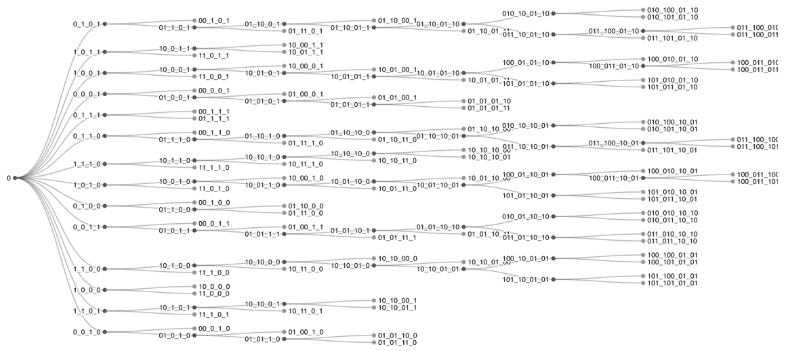

图 6.2 – 将 iSAX 索引作为树可视化

*图 6.2*.2*告诉我们什么？它告诉我们我们正在处理一个相对较小的、相当平衡的 iSAX 索引（终端节点的深度差异不大），这是一个好事。默认情况下，终端节点以灰色圆圈进行可视化，而内部节点是黑色的。

那么，我们接下来能做什么？接下来，我们可以尝试使用不同的 iSAX 参数可视化`100k.gz`。在这种情况下，我们将使用以下参数：

```py
$ ./exportJSON.py -s 4 -c 16 -t 5000 100k.gz
```

如前所述，生成的输出将被存储在`files`目录中现有的 JSON 文件中。更新的输出可以在*图 6.3*中看到：

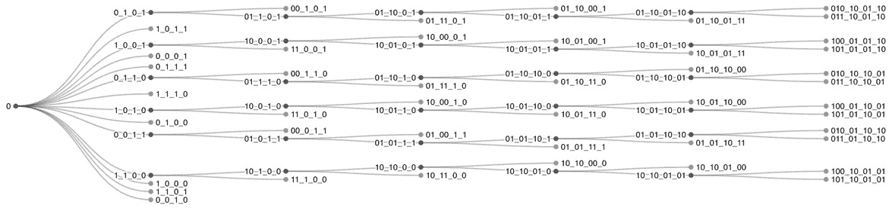

图 6.3 – 将阈值值增加到 5,000

如预期，iSAX 索引比之前小，主要是因为我们减少了节点分裂。然而，它看起来不如*图 6.2*中展示的 iSAX 平衡。2*。

还有其他需要做的事情吗？我们可以进行更多实验，并将段值从`4`更改为`3`，同时保持阈值值在`5000`。

因此，这次，我们将使用以下命令生成 JSON 输出：

```py
$ ./exportJSON.py -s 3 -c 16 -t 5000 100k.gz
```

之后，我们需要将输出存储在`files`目录中位于的 JSON 文件中。新的可视化可以在*图 6.4*中看到：

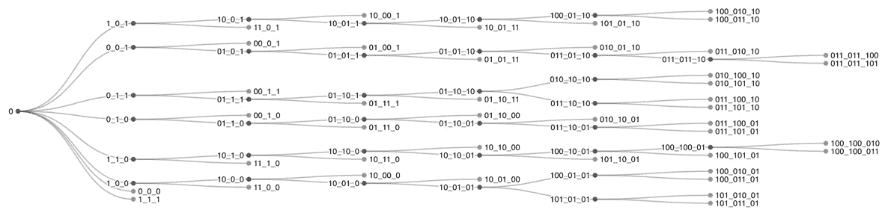

图 6.4 – 以三个段可视化 iSAX

如预期，根节点有较少的子节点。然而，*图 6.4*中展示的 iSAX 索引的总体形状与*图 6.3*中展示的相似。就我个人而言，我认为*图 6.2*展示的 iSAX 索引比其他两个版本更好、更平衡。平衡树，因此平衡的 iSAX 索引，通常搜索更快，这是一个期望的特性。

在本节中，我们看到了如何将 iSAX 索引作为树结构进行可视化，这是很有意义的，因为 iSAX 索引本身就是树。

在下一节中，我们将尝试为 iSAX 索引结构进行不同类型的可视化。毕竟，可视化和实验是好朋友。

# 尝试一些激进的方法

在本节中，我们将尝试一种不同的可视化方法来可视化 iSAX 索引，以防它揭示任何额外的信息。因此，我们将使用 `ch06` 目录中的 `TreeRadialTidy` 目录，并用 `files` 目录中找到的 `100k.json` 替换 JSON 文件——正确的文件已经在那里。然而，如果您想使用自己的数据，您应该更新该文件。

接下来，我们应该运行 Python HTTP 服务器并将我们的网页浏览器指向 http://localhost:8000/。生成的输出在 *图 6.5* 中展示：

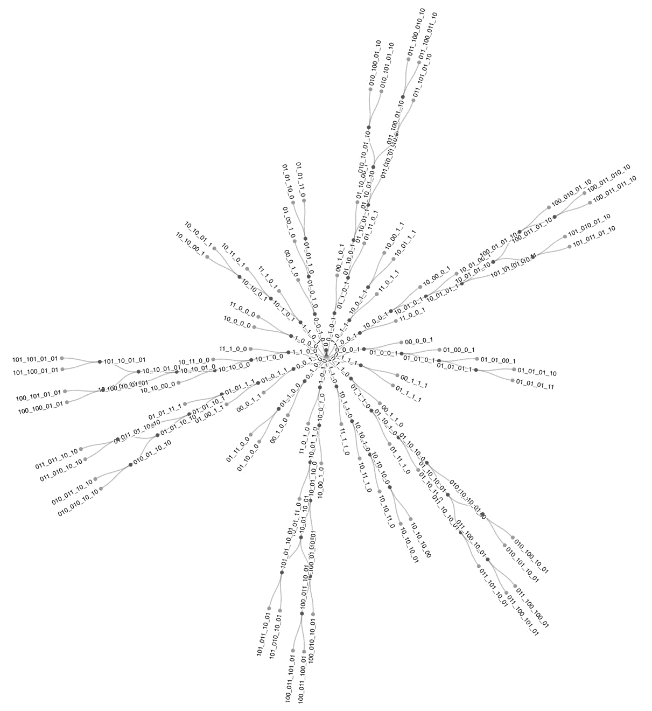

图 6.5 – 使用径向树结构

我们可以从 *图 6.5* 中获得哪些信息？这比常规树状结构好吗？我不知道它是否更好，但它确实以全新的方式展示了相同的信息！

径向树的一个优点是，当处理具有较大深度的 iSAX 索引时，它表现更好，因为它们可以更好地适应屏幕。我个人认为，平面树状结构比径向树更适合 iSAX 索引。

下一节将继续通过尝试更多可视化来继续 iSAX 索引的可视化过程。

# 更多 iSAX 索引可视化

我们还没有完成！存在通过向输出添加更多信息以及压缩其各个部分的能力来改进先前可视化的方法——总是在图表或图表上放置过多信息的危险，但在这里我们不会犯这个错误。

首先，我们将前往 `ZoomableTreemap` 目录，尝试一个名为 **可缩放树状图** 的可缩放结构，当处理大型 iSAX 索引时，这种结构更为合适。

可缩放树状图使用一个额外的属性称为 `value`。在这种情况下，我有两个选择：要么更改 Python 脚本的输出，要么更改 JavaScript 代码。我决定后者。因此，我将 JavaScript 代码中的 `value` 属性更改为 `size`，这是 Python 脚本生成的。然而，在我们的情况下，这导致了 JavaScript 代码中与展示值总和相关的错误，这意味着这不是正确的决定。

因此，我们将更改 JSON 文件并将 `size` 字段名称替换为 `value`。

如前所述，我们应该用 `100k.json` 覆盖 `files` 目录中的 JSON 文件并运行 Python HTTP 服务器。生成的输出可以在 *图 6.6* 中看到：

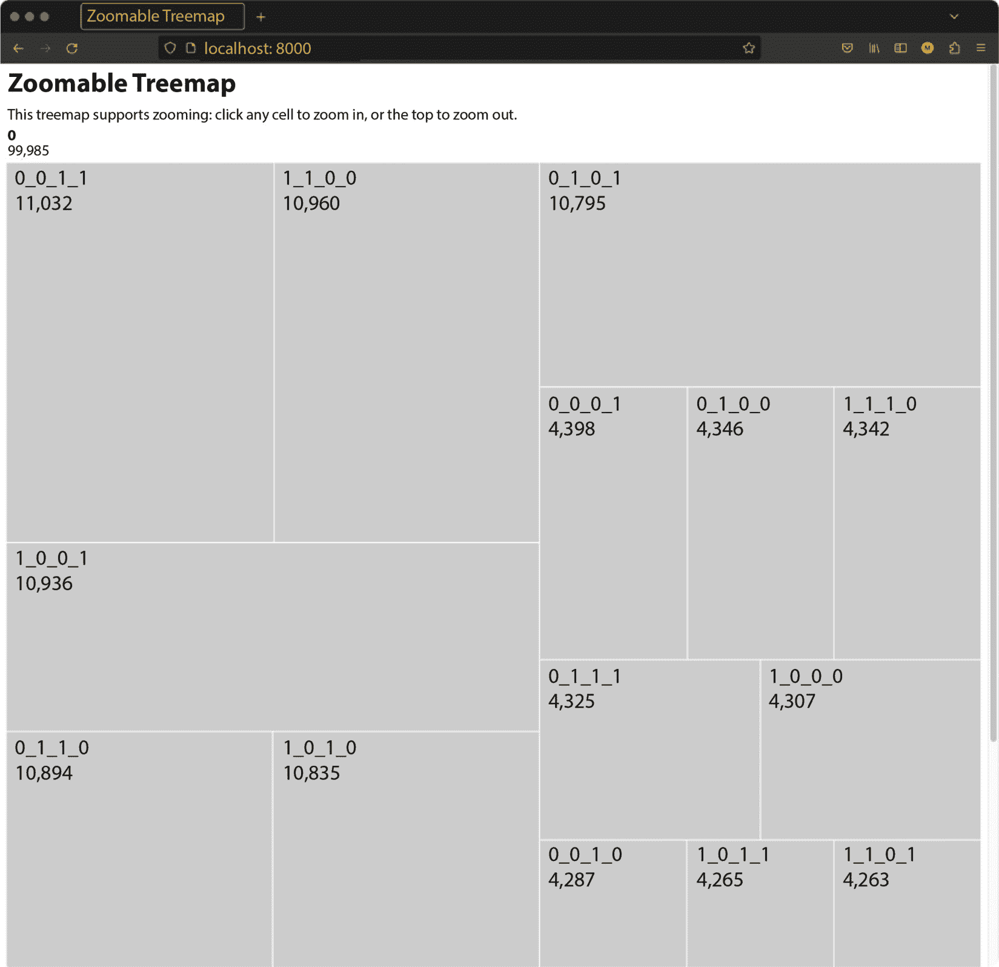

图 6.6 – 可缩放树状图可视化

结果表明，可缩放树状图可能难以阅读和理解——甚至难以意识到我们正在讨论一个树状结构。因此，它可能不是 iSAX 可视化的好选择。然而，*可缩放* 功能在几乎所有情况下都非常方便。

如果我们使用了有错误的版本，那么输出中的数值将被替换为 `NaN` 值——这很可能与 JavaScript 代码有关。

让我们现在继续讨论一些不同的事情。前往 `ZoomableSunburst` 目录，并将 `files` 目录中的文件替换为 `100k.json` 文件。再次，我们需要进行代码更改。具体来说，我们需要将 `86ddbc29bd33f9d6@357.js` 中使用的 `value` 字段替换为我们 JSON 记录中的 `size` 字段。GitHub 上的代码存储了所有必要的更改。生成的输出可以在 *图 6.7* 中看到：

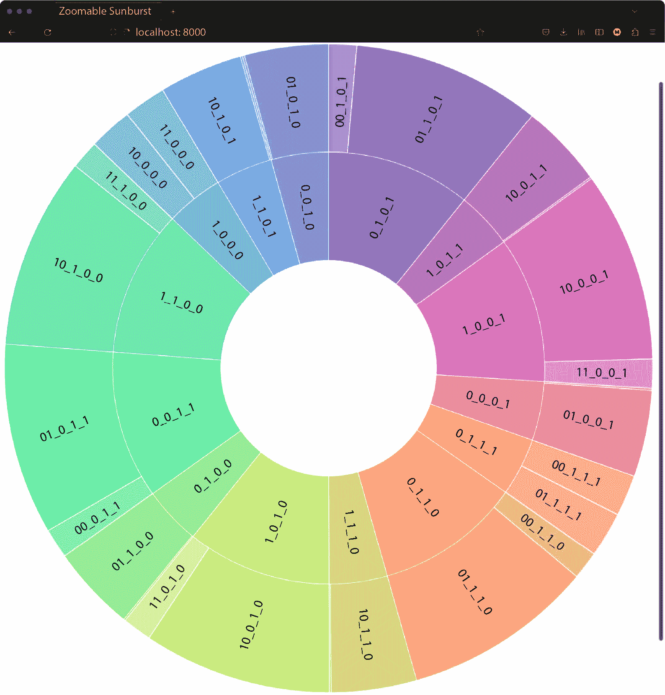

图 6.7 – 可缩放的太阳花可视化

这种可视化的主要优势是它不会从一开始就显示整个 iSAX，但当我们通过点击太阳花的不同部分来放大可视化时，它可以做到这一点。因此，它隐藏了一些信息，这些信息可以根据需要显示。

如果我们放大太阳花的任何部分，我们将更接近地查看 iSAX 索引的该特定部分。

*图 6.8* 展示了太阳花的一部分：

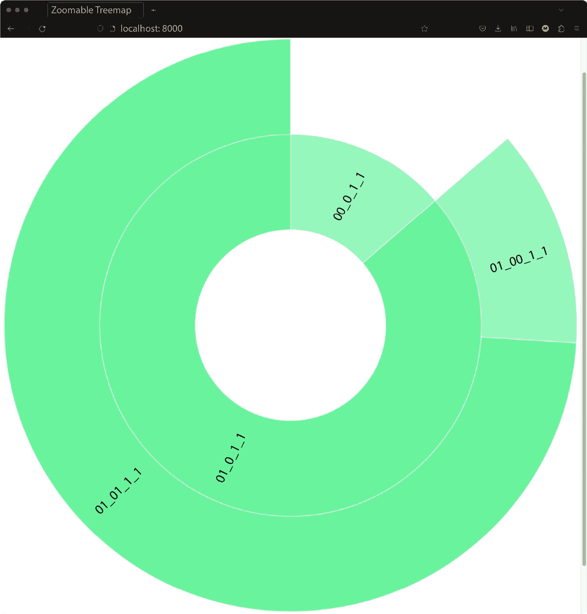

图 6.8 – 缩放太阳花中的 0_0_1_1 子树

再次，缩放功能很实用，我们希望在可视化中拥有它。下一节将讨论一种有趣的图表类型，称为冰柱图，看起来它适合用于可视化 iSAX 索引。

# 使用冰柱图

在本节中，我们将讨论一种不同类型的图表，称为 **冰柱图**。冰柱图是一种用于展示层次聚类的方法，能够使用从根节点到叶子的矩形扇区来可视化层次数据。在我们的案例中，我们将使用 **可缩放** 的 **冰柱图**。

首先，请前往 `ZoomableIcicle` 目录，并将 `files` 中的 JSON 文件替换为 `100k.json`。这次，我们不是更改 JavaScript 代码，而是将 JSON 文件的字段名从 `size` 更改为 `value`。一般来说，*更改输入数据比更改代码更好*。

*图 6.9* 展示了生成的冰柱可视化的一部分。左侧的矩形代表根节点，其中包含 **99,985** 个子序列——这是在 iSAX 索引中存储的子序列总数。

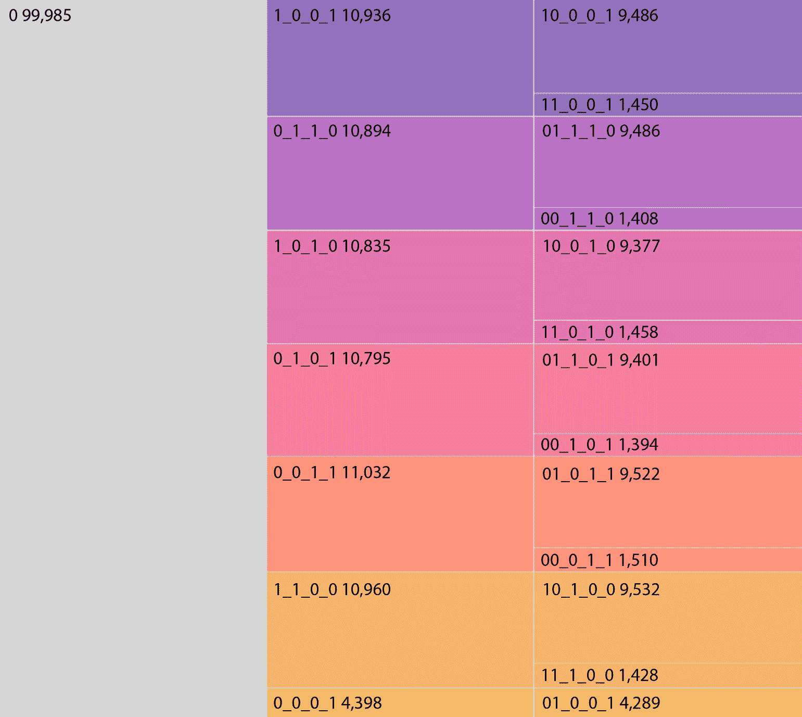

图 6.9 – 使用冰柱可视化 iSAX

除了节点的 SAX 表示之外，每个矩形还显示了其下存储的子序列数量。因此，**1_0_0_1** 子树有 **10,936** 个子序列——这是另一个实用的功能。

进一步来说，如果我们放大 **1_0_0_0** 子树，我们将得到如图 *图 6.10* 所示的输出：


图 6.10 – 仔细查看 1_0_0_0 子树

同样，如果我们放大**1_1_1_0**子树，我们将得到*图 6.11*中展示的可视化：

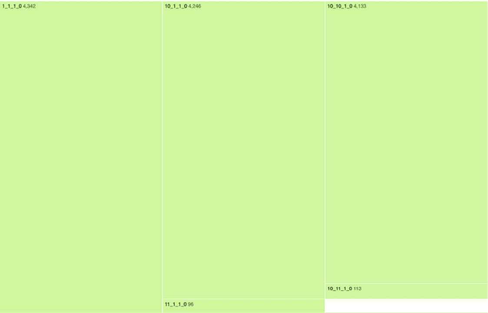

图 6.11 – 仔细查看 1_1_1_0 子树

让我们更详细地讨论一下*图 6.11*。它告诉我们什么？它告诉我们根节点的**1_1_1_0**子节点存储了**4,342**个子序列。其中**4,246**个子序列位于**10_1_1_0**子树下，其余的子序列位于**11_1_1_0**子树下。

如果我们放大**10_1_1_0**节点，我们将得到*图 6.12*，它显示**10_10_10_0**子树有**4,031**个节点。

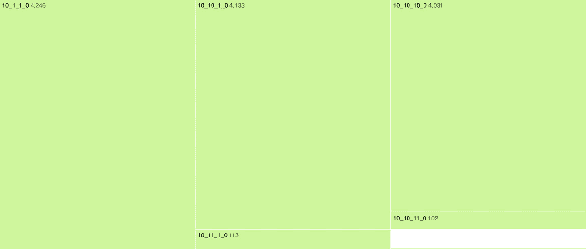

图 6.12 – 仔细查看 10_1_1_0 子树

由于我们使用了一个较小的阈值值，我们知道**10_10_10_0**节点是一个可以进一步展开的内节点。

这样，我们可以探索 iSAX 索引并找到我们想要的信息。

冰柱图看起来适合可视化 iSAX 索引。然而，如果我们进行更多实验，可能会发现更好的可视化类型。

下一节将展示一个 iSAX 索引的可折叠树可视化。

# 将 iSAX 可视化为可折叠树

尽管可缩放的冰柱图看起来非常有前景，但有些人可能想要一种看起来像树但仍然具有可缩放冰柱图的一些多功能性的可视化。对于这些人，我们将尝试使用**可折叠树**。

首先，我们进入`CollapsibleTree`目录，然后运行 Python 网络服务器。然后，我们访问`http://localhost:8000/`。*图 6.13*显示了可折叠树可视化的输出：

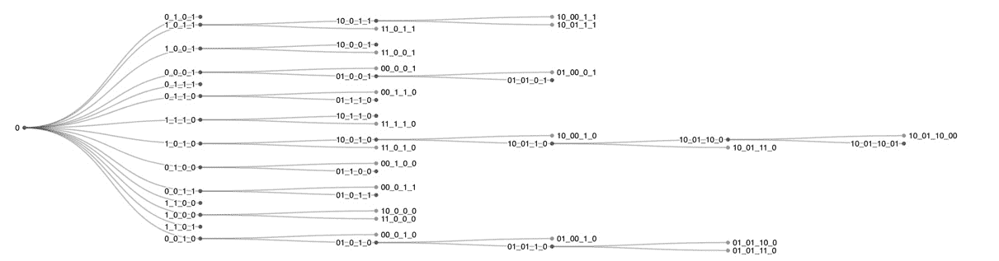

图 6.13 – 将 iSAX 可视化为可折叠树

可折叠树的主要优势在于我们可以随意展开或折叠节点，这意味着我们可以轻松地集中精力在最感兴趣的节点上，而不是迷失在 iSAX 索引的细节中。

然而，可折叠树不显示索引每个子树下的子序列数量。

在本节的最后部分，我们看到了可折叠树的运作方式，并了解了它的多功能性以及局限性。

# 摘要

可视化是理解数据的一种极好方式。同样，可视化也是理解 iSAX 索引结构，尤其是大型索引结构的一种极好方式。在本章中，我们看到了使用 `D3.js` JavaScript 库可视化 iSAX 索引的各种方法，并更深入地了解了子序列的分布和 iSAX 索引的高度。

然而，尝试使用 `D3.js` JavaScript 库、R 或其他适当的 Python 包进行自己的可视化将是非常棒的，这些包也可以创建令人印象深刻的可视化。

最后，不要低估良好可视化的力量，因为它可以以易于发现的方式揭示大量信息。只需记住，可视化是一门难以掌握的艺术。

下一章将介绍如何使用 iSAX 索引来进行矩阵 [Profile 和 MPdist 距离的近似计算](https://en.wikipedia.org/wiki/JavaScript)。

# [有用的链接](https://en.wikipedia.org/wiki/JavaScript)

+   *JavaScript*：[`en.wikipedia.org/wiki/JavaScript`](https://en.wikipedia.org/wiki/JavaScript)

+   Mozilla 开发者网络：[`developer.mozilla.org/en/JavaScript`](https://developer.mozilla.org/en/JavaScript)

+   `D3.js` JavaScript 库的官方页面：[`d3js.org/`](https://d3js.org/)

+   通过阅读由 J. B. Kruskal 和 J. M. Landwehr 撰写的 *Icicle Plots: Better Displays for Hierarchical Clustering* 论文，您可以了解更多关于冰柱图的信息。

+   R 项目：[`www.r-project.org/`](https://www.r-project.org/)

+   Seaborn Python 包：[`seaborn.pydata.org/`](https://seaborn.pydata.org/)

+   Julia 编程语言：[`julialang.org/`](https://julialang.org/)

+   `plotly` Python 库：[`plotly.com/python/`](https://plotly.com/python/)

+   一本关于数据可视化艺术的非常好的书是 Edward R. Tufte 所著的 *The Visual Display of Quantitative Information*。

+   *D3* *画廊*：`observablehq.com/@d3/gallery`

+   *树，整洁*：`observablehq.com/@d3/tree`

+   *可缩放* *Treemap*：`observablehq.com/@d3/zoomable-treemap`

+   *可缩放* *Sunburst*：`observablehq.com/@d3/zoomable-sunburst`

+   *可缩放* *Icicle*：`observablehq.com/@d3/zoomable-icicle`

+   *树，径向* *整洁*：`observablehq.com/@d3/radial-tree`

+   *可折叠* *树*：`observablehq.com/@d3/collapsible-tree`

# 练习

尝试以下练习：

+   创建一个包含 50,000 个元素的时序，并使用 6、8 和 10 个段绘制其 iSAX 索引。在所有情况下，使用阈值值 `500`。

+   创建一个包含 150,000 个元素的时序，并使用 4、6 和 8 个段绘制其 iSAX 索引。

+   创建一个包含 250,000 个元素的时序，并绘制其 iSAX 索引，分为 4、6 和 10 个段。在所有情况下，使用阈值值 `5000`。

+   创建一个名为 `exportJSON.py` 的版本，用名为 `value` 的字段替换 `size` 字段。

+   如果你熟悉 JavaScript，请更改可缩放的冰柱图的色彩。

+   如果您熟悉 JavaScript，请将可缩放的冰柱图从**上到下**调整，而不是从**左到右**。

+   如果您熟悉 JavaScript，请将可折叠的树形图从**上到下**调整，而不是从**左到右**。这比之前更好吗？

+   尝试使用可缩放的圆形排列可视化效果，您可以在`observablehq.com/@d3/zoomable-circle-packing`找到它。您对它有什么看法？
