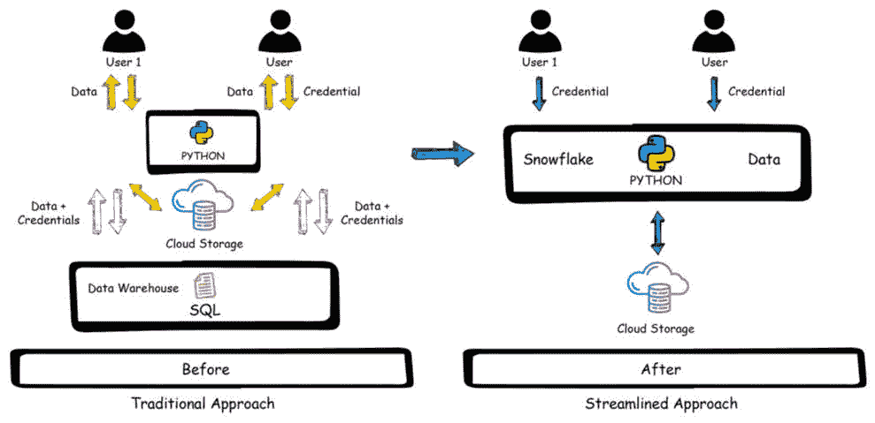

# 第一章：探索 Snowpark

Snowpark 是 Snowflake 最近发布的一项重大创新，它提供了一套直观的库和运行时，用于在 Snowflake 中进行大规模的数据查询和处理。本章旨在引导您了解 Snowpark 的独特功能。此外，本章还帮助您学习如何利用 Python 与 Snowpark 一起使用，并在各种工作负载中实现它，如数据工程、数据科学和数据应用。到本章结束时，您将掌握 Snowpark 的功能和优势，包括更快的数据处理、可扩展性和降低成本。

在本章中，我们将涵盖以下主要主题：

+   介绍 Snowpark

+   利用 Python 为 Snowpark 提供支持

+   理解 Snowpark 在不同工作负载中的应用

+   实现使用 Snowpark 的价值

# 介绍 Snowpark

Snowflake 成立于 2012 年，通过完全重新设计数据世界并重新思考如何为云构建一个可靠、安全、高性能和可扩展的数据处理系统，开始了其数据云之旅。它从提供基于云的数据仓库服务开始，通过一个托管 **软件即服务**（**SaaS**）平台来加载、分析和处理大量数据。Snowflake 的成功在于它是一个云原生托管解决方案，它建立在主要的公共云提供商之上，如亚马逊网络服务、微软 Azure 和谷歌云平台，通过自动提供可靠、安全、高性能和可扩展的数据处理系统，为组织提供支持，无需部署硬件或安装或配置任何软件。

与任何云数据仓库一样，Snowflake 支持作为首选语言的 **美国国家标准协会**（**ANSI**）SQL。尽管 SQL 是一种强大的声明性语言，允许用户对数据进行提问，但它仅限于数据仓库工作负载，限制了高级工作负载（如数据科学和数据工程）的支持，这些工作负载需要开发者用其他编程语言编写解决方案，从而导致他们需要将数据从 Snowflake 移出以执行这些工作负载。

雪花解决方案应对这一挑战的是 **Snowpark**，这是一个创新的开发者框架，它简化了构建复杂数据管道的过程。通过 Snowpark，数据科学家和开发者可以直接使用他们偏好的编程语言与 Snowflake 进行交互，使他们能够快速且安全地部署 **机器学习**（**ML**）模型，执行数据管道，并在 Snowflake 的虚拟计算仓库中无服务器地开发数据应用，而无需将数据转移到 Snowflake 之外。

Snowpark 通过原生支持在 Python、Scala 或 Java 中使用 DataFrame 风格的编程，暴露了与这些语言的深度集成接口，从而增强了 Snowflake 原始的 SQL 语言，并最小化了管理不同环境以进行高级数据管道的复杂性。这导致开发者能够利用 Snowflake 强大且可扩展的计算能力，将代码发送到数据中，而无需将其导出到 Snowflake 之外的其他环境中。

在本节中，我们简要介绍了 Snowpark，并学习了它如何融入 Snowflake 生态系统以及它如何帮助开发者。下一节将介绍如何利用 Python 进行 Snowpark 开发。

# 利用 Python 进行 Snowpark 开发

2022 年 6 月，Snowflake 发布了一项重大公告，揭示了备受期待的**Snowpark for Python**。这个新版本迅速成为 Snowpark 的首选编程语言，为用户提供在 Snowflake 中编程数据的更广泛选项。此外，Snowpark 简化了数据架构的管理，使用户能够更快、更有效地操作。

Snowpark for Python 是一个前沿的、企业级的、开源的创新，集成到 Snowflake 数据云中。因此，该平台为数据科学家和开发者提供了一种无缝、统一的体验。此外，Snowpark for Python 包建立在 Snowflake Python 连接器之上。Python 连接器使用户能够在 Snowflake 和 Snowpark 中执行 SQL 命令和其他基本功能，而 Snowpark for Python 则赋予用户执行更高级数据应用的能力。

例如，该平台允许用户在 Snowflake 中直接运行**用户定义函数**（**UDFs**）、**外部函数**和**存储过程**。这一强大的新功能使数据科学家、工程师和开发者能够在 Snowflake 内创建强大且安全的数据管道和机器学习模型。因此，他们可以利用平台优越的性能、弹性和安全功能来提供高级见解并推动有意义的业务成果。总的来说，Snowpark for Python 代表了 Snowflake 向前迈出的重要一步，为用户提供增强的功能和灵活性，同时保留了平台卓越的性能和安全功能。

Snowpark for Python 通过集成在 Snowflake 虚拟计算仓库内运行的 Anaconda 环境中的预审开源包来支持预审的开源包。这个环境为开发者提供了一个熟悉的界面。集成的 Anaconda 包管理器对开发者来说非常有价值，因为它附带了一套全面的精选开源包，并支持解决不同包和版本之间的依赖关系。这节省了大量时间，并帮助开发者避免处理“依赖地狱”的问题。

## Snowpark for Python 的功能

Snowpark for Python 在 Snowflake 的所有云实例中普遍可用。它有助于加速不同的工作负载，并附带一系列丰富的功能，如下所示：

+   它允许开发者直接在 Snowflake 中编写 Python 代码，使他们能够直接利用 Python 库和框架在 Snowflake 中的强大功能

+   它支持流行的开源 Python 库，如 pandas、NumPy、SciPy 和 scikit-learn，以及其他库，允许开发者直接在 Snowflake 中执行复杂的数据分析和 ML（机器学习）任务

+   它还提供了访问外部数据源，如 AWS S3、Azure Blob 存储和 Google Cloud Storage，允许开发者处理存储在 Snowflake 之外的数据

+   它提供了与 Snowflake SQL 引擎的无缝集成，允许开发者使用 Python 编写函数式编程方法编写的查询，这些查询编译为 SQL

+   它还支持分布式处理，允许开发者扩展其 Python 代码以处理大型数据集和复杂逻辑

+   它使开发者能够构建自定义的 UDF（用户定义函数），这些函数可以在 SQL 查询中使用，从而提供更大的灵活性和数据处理的定制化

+   Snowpark 在 Snowflake 中提供了一个 Python 开发环境，允许开发者直接在 Snowflake UI 中编写、测试和调试 Python 代码

+   它使开发者能够处理各种数据格式，如 CSV、JSON、Parquet 和 Avro，提供数据处理和分析的灵活性

+   它提供了一个统一的数据处理体验，在单一环境中与 SQL 和 Python 协同工作

+   它使开发者能够使用 Python 代码创建自定义数据管道，使得将 Snowflake 与其他数据源和数据处理工具集成更加容易

+   它可以处理实时和批量数据处理，使得构建数据密集型工作负载更加容易

+   它提供了一个基于 Snowflake 的强大框架，确保数据隐私并符合行业标准，如**健康保险可携带性和问责制法案**（**HIPAA**）、**通用数据保护条例**（**GDPR**）和**安全运营中心**（**SOC**）

+   Snowpark 通过利用**Snowflake Marketplace**来增强数据

Snowpark for Python 集成了许多功能，帮助开发者高效地在 Snowflake 的各种工作负载和用例中使用它。

## 为什么选择 Python 用于 Snowpark

虽然 Snowpark 支持 Python、Scala 和 Java，但本书将仅关注 Python，这是 Snowpark 开发的实际标准。Python 通过具有动态类型和绑定的高级内置数据结构而日益流行，使其非常适合数据操作。此外，该语言对开发者来说非常灵活且易于学习。其力量在于丰富的开源生态系统，得到了越来越多的流行包的支持。

Python 是一种通用、多用途的编程语言，适用于各种目的，如数据工程、数据科学和数据应用。它使开发者能够学习一种编程语言来满足所有需求。

Snowflake 也在大力投资 Python，以使数据科学家、工程师和应用开发者能够在数据云中构建更多内容，而无需做出治理权衡。

在本节中，我们介绍了 Snowpark for Python 的功能以及为什么 Python 是开发 Snowpark 的首选语言。下一节将介绍 Snowpark 如何用于不同的工作负载。

# 理解 Snowpark 在不同工作负载中的应用

Snowpark 的发布将 Snowflake 转变为一个完整的数据平台，旨在支持各种工作负载。Snowpark 支持多种工作负载，如数据科学和机器学习、数据工程和数据应用。

## 数据科学和机器学习

Python 是数据科学家的首选语言。Snowpark for Python 支持流行的库和框架，如 pandas、NumPy 和 scikit-learn，使其成为数据科学家在 Snowflake 中进行机器学习开发的理想框架。此外，数据科学家可以使用 DataFrames API 与 Snowflake 内部的数据进行交互，并在 Snowflake 内进行批量训练和推理。开发者还可以使用 Snowpark 进行特征工程、机器学习模型推理和端到端机器学习管道。Snowpark 还提供了一个 SnowparkML 库，以支持 Snowpark 中的数据科学和机器学习。

## 数据工程

数据清洗和 ELT 工作负载非常复杂，仅使用 SQL 构建数据管道正是 Snowpark 可以发挥巨大作用的地方。Snowpark 允许开发者编写易于阅读和重用的代码，同时提供更好的单元测试能力。此外，借助 Anaconda 的支持，开发者可以使用开源 Python 库来构建可靠的数据管道。数据处理的其他主要挑战是，基础设施需要大量的手动努力和维护。Snowpark 通过高性能解决这一问题，使数据工程师能够快速高效地处理大型数据集，构建复杂的数据管道，并处理大量数据而不会出现性能问题。

## 数据治理和安全

Snowpark 支持开发结合数据治理和安全的解决方案。数据治理至关重要，并增强了数据科学和数据工程用例。Snowpark 通过帮助组织理解和改进数据质量来简化治理态势。开发者可以快速创建一个函数来执行数据测试和检测异常。Snowpark 可以利用数据分类功能来检测**个人身份信息**（**PII**）并分类对组织至关重要的数据。在 Snowpark 中开发的自定义函数可以使用强大的动态数据掩码功能来屏蔽敏感数据，如信用卡号码，同时保留 Snowflake 中现有的安全模型。

## 数据应用

Snowpark 帮助团队开发直接在 Snowflake 上运行而不需要将数据移出 Snowflake 的动态数据应用。使用 Snowflake 收购的强大开源库**Streamlit**，开发者可以使用熟悉的 Python 环境构建原生应用。利用基于角色的访问控制，可以在 Snowflake 管理的平台上安全地开发和共享交互式 ML 应用，利用其规模、性能和治理优势。Snowflake 原生应用框架提供了一个通过 Snowflake Marketplace 货币化应用的简化路径，在那里你可以让你的应用可供其他 Snowflake 客户使用，并开辟新的收入机会。

Snowpark 支持不同的工作负载，使 Snowflake 成为一个完整的数据云解决方案。以下部分将突出 Snowpark 的技术和业务优势。

# 实现使用 Snowpark 的价值

传统的大数据方法在业界已经存在很长时间，不适合现代基于云的可扩展工作负载。传统架构存在许多挑战，如下所述：

+   将计算和数据解耦到独立的系统中

+   为不同的语言运行独立的处理集群

+   系统管理的复杂性

+   数据孤岛和数据重复

+   缺乏统一的安全和治理

Snowflake 通过 Snowpark 解决了传统系统的挑战，为数据生态系统和 Snowflake 用户提供了巨大的价值。以下图表显示了传统方法与 Snowflake 简化方法的区别：

图 1.1 – 传统方法与 Snowflake 方法的对比

如您从两种方法的区别中可以看到，Snowpark 的简化方法通过提供一种灵活、高效且成本效益高的方式来构建与业务需求同步扩展的数据，从而既有利于业务也有利于开发者。使用 Snowpark 的一些显著价值如下：

+   Snowpark 可以通过 DataFrame API 编程访问数据，这使得数据摄取和集成保持一致，因为你可以集成各种结构化和非结构化数据

+   Snowpark 通过将数据处理管道标准化为 Python 代码，实现了数据处理方法的标准化；它们可以接受测试和部署，并且更容易理解和解释

+   Anaconda 为 Snowpark 提供 Python 支持，并提供了对开源的第三方 Python 库的便捷访问，这增强了数据处理能力，并赋予开发者更多的能力

+   Snowpark 与现有的 Snowflake 虚拟仓库无缝集成和运行，允许开发者构建旨在无需额外基础设施即可扩展的数据应用

+   Snowpark 的框架支持各种工作负载，如数据工程、数据科学和数据应用，为数据云上的开发提供了一个统一的使用体验

+   Snowpark 提供了一个安全、受控的环境，因为它易于执行治理策略，并且没有数据在 Snowflake 之外移动

让我们总结本章内容。

# 摘要

Snowflake 的 Snowpark 完美地融合了 SQL 和 Python，在 Snowflake 数据云中运行复杂的数据处理作业，并使数据工程师、数据科学家和开发者能够利用 Snowflake。在本章中，我们看到了 Snowpark 的优势以及为什么 Python 是首选的开发语言。我们还介绍了 Snowpark 支持的不同工作负载。

在下一章中，我们将详细探讨配置和操作 Snowpark，并学习如何使用 Snowpark 处理各种工作负载。
