# 使用 Snowpark 简化数据处理

在上一章中，我们学习了如何为 Snowpark 设置开发环境，以及各种 Snowpark 组件，如 DataFrames、UDFs 和存储过程。我们还介绍了如何操作这些对象并在 Snowflake 中运行它们。在本章中，我们将介绍使用 Snowpark 进行数据处理，并学习如何使用 Snowpark 加载数据、准备、分析和转换数据。

在本章中，我们将涵盖以下主要内容：

+   数据摄取

+   数据探索和转换

+   数据分组和分析

# 技术要求

对于本章，您需要一个有效的 Snowflake 账户，并且需要在本地安装了 Anaconda 的 Python。您可以参考以下文档获取安装说明：

+   您可以在 [`signup.snowflake.com/`](https://signup.snowflake.com/) 注册 Snowflake 试用账户。

+   要配置 Anaconda，请遵循 https://conda.io/projects/conda/en/latest/user-guide/getting-started.html 中的指南

+   要安装和设置 VS Code 中的 Python，请遵循 [`code.visualstudio.com/docs/python/python-tutorial`](https://code.visualstudio.com/docs/python/python-tutorial) 中的指南

+   要了解如何在 VS Code 中操作 Jupyter Notebook，请访问 [`code.visualstudio.com/docs/datascience/jupyter-notebooks`](https://code.visualstudio.com/docs/datascience/jupyter-notebooks)

本章的支持材料可在本书的 GitHub 仓库中找到，网址为 [`github.com/PacktPublishing/The-Ultimate-Guide-To-Snowpark`](https://github.com/PacktPublishing/The-Ultimate-Guide-To-Snowpark)。

# 数据摄取

数据工程流程的第一部分是数据摄取——将所有不同的数据以可用的格式放入 Snowflake 进行分析至关重要。在上一章中，我们学习了 Snowpark 如何通过 DataFrame 访问数据。如果对这个 DataFrame 执行查询，它可以从 Snowflake 表、视图以及流等对象中访问数据。Snowpark 支持多种格式的结构化数据，如 Excel 和 CSV，以及半结构化数据，如 JSON、XML、Parquet、Avro 和 ORC；特殊格式，如 HL7 和 DICOM，以及非结构化数据，如图像和媒体，也可以在 Snowpark 中摄取和处理。Snowpark 使您能够安全且程序化地访问 Snowflake 阶段中的文件。

Snowpark Python 的灵活性允许您轻松适应不断变化的数据需求。假设您最初以 CSV 文件作为数据源；您可以在稍后阶段切换到 JSON 或数据包格式。使用 Snowpark，您无需重写整个代码库。相反，您可以通过进行少量调整或配置更改来适应新的结构，同时保持核心逻辑不变。这种灵活性为您节省了宝贵的时间和精力，使您能够根据需求快速演变在不同数据格式之间切换。

通过利用 Snowpark 的功能，您可以更多地专注于分析和利用数据，而不是担心数据格式处理的复杂性。这种简化的方法使您能够对不同数据源进行实验，适应不断变化的数据需求，并高效地将数据加载到 Snowflake 表中，所有这些只需进行最少的代码更改和最大的灵活性。

因此，让我们深入探讨 Snowpark Python 的力量及其轻松处理不同数据格式的能力，让您能够与各种来源协同工作而无需进行繁琐的代码修改。您将体验到探索、分析和从数据中提取见解的自由，同时享受无缝和灵活的集成过程。

数据摄取脚本提供在本书的 GitHub 仓库中：[`github.com/PacktPublishing/The-Ultimate-Guide-To-Snowpark`](https://github.com/PacktPublishing/The-Ultimate-Guide-To-Snowpark)。这些脚本将简化上传任何新数据集的过程，确保工作流程的顺畅和高效。遵循前几章中概述的类似方法，您可以轻松上传新数据集并探索 Snowflake 的数据工程和机器学习功能。提供的数据摄取脚本将作为您的指南，使过程无缝且无烦恼。

## 重要数据集注意事项

本章中我们将使用的数据集提供了对客户行为、活动响应和投诉的独特见解，从而支持数据驱动的决策和客户满意度提升。原始数据集来自 Kaggle 平台([`www.kaggle.com/datasets/rodsaldanha/arketing-campaign`](https://www.kaggle.com/datasets/rodsaldanha/arketing-campaign))。然而，本节中讨论的数据集不能直接通过 Kaggle 链接访问。相反，我们从一个基础数据集开始，并生成新的数据格式，以展示如何使用 Snowpark 加载各种数据集格式。这些数据集可以在本书的 GitHub 仓库的`datasets`文件夹中找到。

数据集包括 CSV 格式的购买历史，JSON 格式的活动信息，以及 Parquet 格式的投诉信息。这些数据集提供了关于客户行为、活动响应和投诉的有价值信息：

+   **购买历史（CSV）**：此文件包含客户信息，如 ID、教育程度、婚姻状况和购买指标。该数据集提供了对客户购买习惯的见解，并可进一步分析以支持数据驱动的决策。

+   **活动信息（JSON）**：JSON 数据集包括关于活动接受度和客户响应的数据。分析此数据集将帮助您优化营销策略并了解活动效果。

+   **投诉信息（Parquet）**：此文件包含有关客户投诉的详细信息，包括联系和收入指标。此数据集有助于跟踪和解决客户投诉，以改善满意度。

注意

在接下来的工作中，我们将利用本地开发环境来执行所有 Snowpark 代码，而不是依赖于 Snowflake 工作表。这种方法提供了更大的灵活性和对 Snowpark 脚本开发和测试的控制。当使用工作表执行特定任务时，我们将明确指出其使用情况，以确保清晰和上下文。

## 将 CSV 文件导入 Snowflake

Snowflake 支持使用 CSV 文件轻松导入数据。我们将以 CSV 文件的形式将购买历史数据加载到 `PURCHASE_HISTORY` 表中。我们将使用 Snowpark 会话将 `purchase_history.csv` 上传到内部阶段，如下所示：

```py
session.file.put('./datasets/purchase_history.csv', 'MY_STAGE')
```

因此，文件已上传到内部阶段。我们将在 Snowpark 中直接引用此文件。营销表的数据模式也可以直接定义为 Snowpark 类型。以下代码提供了创建 Snowflake 表所需的必要列和数据类型：

```py
import snowflake.snowpark.types as T
purchase_history_schema = T.StructType([
    T.StructField("ID", T.IntegerType()),
    T.StructField("Year_Birth", T.IntegerType()),
    T.StructField("Education", T.StringType()),
    T.StructField("Marital_Status", T.StringType()),
    T.StructField("Income", T.IntegerType()),
    T.StructField("Kidhome", T.IntegerType()),
    T.StructField("Teenhome", T.IntegerType()),
    T.StructField("Dt_Customer", T.DateType()),
    T.StructField("Recency", T.IntegerType()),
    T.StructField("MntWines", T.IntegerType()),
    T.StructField("MntFruits", T.IntegerType()),
    T.StructField("MntMeatProducts", T.IntegerType()),
    T.StructField("MntFishProducts", T.IntegerType()),
    T.StructField("MntSweetProducts", T.IntegerType()),
    T.StructField("MntGoldProds", T.IntegerType()),
    T.StructField("NumDealsPurchases", T.IntegerType()),
    T.StructField("NumWebPurchases", T.IntegerType()),
    T.StructField("NumCatalogPurchases", T.IntegerType()),
    T.StructField("NumStorePurchases", T.IntegerType()),
    T.StructField("NumWebVisitsMonth", T.IntegerType())
])
```

在此代码片段中，我们通过为购买历史数据集定义一个模式来迈出理解我们数据结构的第一步。使用 Snowflake Snowpark 库，我们建立字段和对应的数据类型，为我们数据分析之旅奠定基础。此代码作为起点，指导我们定义和使用结构化数据。这不是我们使用 Snowpark 加载数据集的唯一方法。随着我们的进展，我们将继续探索不同的方法来加载其他表格数据集。

此代码从 Snowflake Snowpark 库导入必要的类型。它创建了一个名为 `purchase_history_schema` 的变量，并将其分配给一个 `StructType` 对象，该对象代表数据集的结构化模式。`StructType` 对象包含多个 `StructField` 对象，每个对象代表数据集中的一个字段。每个 `StructField` 对象使用 Snowflake Snowpark 提供的类型指定区域的名称及其对应的数据类型。以下代码读取文件：

```py
purchase_history = session.read\
        .option("FIELD_DELIMITER", ',')\
        .option("SKIP_HEADER", 1)\
        .option("ON_ERROR", "CONTINUE")\
        .schema(purchase_history_schema).csv(
            "@MY_Stage/purchase_history.csv.gz")\
        .copy_into_table("PURCHASE_HISTORY")
```

CSV 文件使用文件格式选项（如 `FIELD_DELIMITER`、`SKIP_HEADER` 等）进行读取，所有这些选项都与前面定义中定义的模式一起指定。使用来自 CSV 文件的数據创建了 `PURCHASE_HISTORY` 表，现在该表已准备好进行处理：

```py
session.table("PURCHASE_HISTORY").show()
```

上述代码显示了 `PURCHASE_HISTORY` 表的输出：

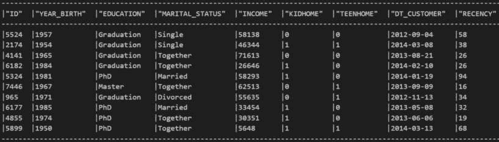

图 3.1 – PURCHASE_HISTORY 表

CSV 文件易于加载，因为它使用了 Snowflake 中可用的文件格式选项。现在，让我们看看如何将 JSON 文件加载到 Snowflake 中。

## 将 JSON 数据导入 Snowflake

Snowflake 允许通过 `Variant` 数据类型摄取和处理 JSON 结构。我们可以像摄取 CSV 文件一样摄取 JSON 文件——通过将其上传到内部阶段。`campaign_info.json` 文件包含有关营销活动的数据。我们可以使用以下代码将其加载到 `CAMPAIGN_INFO` 表中：

```py
session.file.put('./datasets/campaign_info.json', 'MY_STAGE')
```

由此，文件已上传到内部阶段；我们将在 Snowpark 中引用它。Snowpark 可以访问该文件并将其加载到表中：

```py
df_from_json = session.read.json("@My_Stage/campaign_info.json.gz")
```

JSON 文件的内容被读入 DataFrame 作为 JSON 对象。这个 DataFrame 可以作为一个变体写入到表中：

```py
df_from_json.write.save_as_table("CAMPAIGN_INFO_TEMP", 
    mode = "overwrite")
```

`CAMPAIGN_INFO_TEMP` 表包含 JSON 数据。我们可以查询该表来查看数据：

```py
df_from_json.show()
```

上述命令显示 DataFrame 中的 JSON 数据：

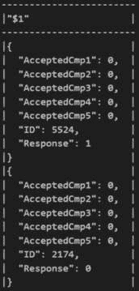

图 3.2 – 营销信息表

以下代码片段利用 Snowflake 中的 Snowpark 库来操作 DataFrame：

```py
from snowflake.snowpark.functions import col
df_flatten = df_from_json.select(col("$1")["ID"].as_("ID"),\
    col("$1")["AcceptedCmp1"].as_("AcceptedCmp1"),\
    col("$1")["AcceptedCmp2"].as_("AcceptedCmp2"),\
    col("$1")["AcceptedCmp3"].as_("AcceptedCmp3"),\
    col("$1")["AcceptedCmp4"].as_("AcceptedCmp4"),\
    col("$1")["AcceptedCmp5"].as_("AcceptedCmp5"),\
    col("$1")["Response"].as_("Response"))
df_flatten.write.save_as_table("CAMPAIGN_INFO")
```

上述代码从现有的 DataFrame 中选择特定的列，并使用 `col` 函数重命名它们。转换后的 DataFrame 然后作为新表保存到 Snowflake 中。该代码通过在 DataFrame 中选择和重命名列来执行数据 **提取、转换和加载**（**ETL**）操作，并将结果保存为新表。

`CAMPAIGN_INFO` 表现在包含扁平化数据，数据分别存储在单独的列中，以便更容易处理。让我们看一下数据：

```py
session.table("CAMPAIGN_INFO").show()
```

上述代码显示了 `CAMPAIGN_INFO` 表的输出：


图 3.3 – `CAMPAIGN_INFO` 表

使用 `Variant` 列，在 Snowpark 中加载和处理 JSON 文件变得更容易。接下来，我们将介绍如何使用 Snowpark 将 Parquet 文件加载到 Snowflake 中。

## 将 Parquet 文件摄取到 Snowflake

Parquet 是一种流行的开源数据存储格式，由 Apache 许可。列导向的格式存储更轻便，处理更快。Parquet 还支持复杂的数据类型，因为数据和列信息都存储在 Parquet 格式中。`COMPLAINT_INFO` 表由客户投诉信息组成。让我们将其加载到 Snowflake 中：

```py
session.file.put('./datasets/complain_info.parquet', 'MY_STAGE')
```

文件将被上传到内部阶段。Snowpark 可以访问它以处理并将其加载到表中：

```py
df_raw = session.read.parquet("@My_Stage/complain_info.parquet")
df_raw.copy_into_table("COMPLAINT_INFO")
```

将 Parquet 文件读入 DataFrame，然后复制到 `COMPLAINT_INFO` 表中。由于 Parquet 文件已经包含表元数据信息，它定义了表结构。我们可以查询该表来查看数据：

```py
session.table("COMPLAINT_INFO").show()
```

这将输出以下 `COMPLAINT_INFO` 表：


图 3.4 – `COMPLAINT_INFO` 表

Parquet 是 Snowflake 的一种首选格式，因为它是由 Apache Iceberg 使用的格式。Parquet 在数据工程和数据分析中因其列式存储而脱颖而出，这优化了压缩和查询性能。其对模式演变和分区的支持确保了在处理不断变化的数据结构时的灵活性和效率。由于其与各种数据处理框架的广泛兼容性，Parquet 能够无缝集成到现有工作流程中，成为现代数据管道中的基石格式。在下一节中，我们将介绍如何轻松地将非结构化数据，如图片，加载到 Snowflake 中。

重要提示

我们选择为处理图片和文本维护单独的阶段，尽管这样做不是强制性的。**MY_TEXT** 和 **MY_IMAGES** 阶段可以使用我们之前概述的方法准备。

## 将图片导入 Snowpark

Snowflake 支持多种数据类型，如图片，可以直接上传到阶段并在 Snowpark 中执行，无需管理依赖项。

平台如 Amazon S3、Google Cloud Storage 和 Azure Blob Storage 常常被用于管理和存储图片数据，因为它们具有可扩展性和可靠性。然而，值得注意的是，Snowpark 也提供了在数据工程和数据分析工作流程中处理图片数据的灵活性，使其成为一种多功能的选项。我们将加载一些样本图片，这些图片可以用于处理：

```py
session.file.put("./datasets/sample_images/*.png", "@My_Images")
```

上一段代码展示了如何将图片从本地文件夹加载到内部阶段。路径可以支持通配符输入，以便上传特定文件夹中的所有图片。可以在阶段中查询文件夹以获取已上传图片的列表：

```py
Session.sql("LS @My_Images").show()
```

上一段代码展示了阶段中所有现有图片的列表：

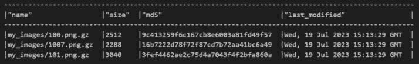

图 3.5 – 图片列表

一旦图片上传成功，就可以通过 Snowpark 直接访问。Snowpark 支持使用 `get_stream` 函数从阶段以字节形式流式传输文件的內容。我们可以使用像 Pillow 这样的库从字节流中读取文件：

```py
import PIL.Image
bytes_object = session.file.get_stream(
    "@My_Images/101.png.gz", decompress=True)
image = PIL.Image.open(bytes_object)
image.resize((150,150))
```

这将输出以下图片：


图 3.6 – 渲染图片

图片直接在笔记本中显示。Snowpark 对图片的原生支持支持图像分类、图像处理和图像识别等用例。Snowpark 还支持动态渲染图片。我们将在下一节中介绍这一点。

### 使用 Snowpark 动态读取文件

Snowpark 包含 `files` 模块和 `SnowflakeFile` 类，这两个都提供了动态访问文件并流式传输以进行处理的接口。这些动态文件对于读取多个文件也很有帮助，因为我们能够遍历它们。`open()` 扩展了 `IOBase` 文件对象，并提供了打开文件的函数。`SnowflakeFile` 对象也支持其他 `IOBase` 方法来处理文件。以下代码展示了如何使用内部阶段的相对路径读取多个文件的示例：

```py
import snowflake.snowpark as snowpark
from snowflake.snowpark.functions import udf
from snowflake.snowpark.files import SnowflakeFile
from snowflake.snowpark.types import StringType, IntegerType
@udf(
    name="get_bytes_length",
    replace=True,
    input_types=[StringType()],
    return_type=IntegerType(),
    packages=['snowflake-snowpark-python']
)
def get_file_length(file_path):
    with SnowflakeFile.open(file_path) as f:
        s = f.read()
        return len(s)
```

上述代码遍历 `@MY_TEXTS` 阶段位置，并使用 `SnowflakeFile` 方法计算每个文件的长度。路径作为输入传递给 UDF。我们可以执行该函数以获取输出：

```py
session.sql("SELECT RELATIVE_PATH, \
    get_bytes_length(build_scoped_file_url( \
        @MY_TEXTS,RELATIVE_PATH)) \
             as SIZE from DIRECTORY(@MY_TEXTS);").collect()
```

上述代码产生以下结果：


图 3.7 – Snowpark 中的动态文件

阶段中的文件以输出形式显示。在本节中，我们介绍了如何使用 Snowpark 将不同类型的文件导入 Snowflake。在下一节中，我们将学习如何使用 Snowpark 进行数据准备和转换。

# 数据探索和转换

数据加载完成后，下一步是准备数据，以便进行转换。在本节中，我们将介绍如何进行数据探索，以便我们了解如何根据需要修改数据。

## 数据探索

**数据探索** 是数据分析中的关键步骤，因为它为成功的见解和明智的决策奠定了基础。通过深入研究数据，分析师可以深入了解其特征，揭示潜在的规律，并识别潜在的问题或异常。探索数据提供了关于其结构、分布和关系的宝贵见解，使分析师能够选择适当的数据转换技术。

理解数据的特征和模式有助于分析师确定所需的适当转换和操作，以清理、重塑或从数据中派生新变量。此外，数据探索有助于识别与分析相关的数据子集，便于进行特定分析目标所需的过滤和子集操作。

在开始数据转换之前，我们必须了解我们现有的数据。通过全面理解数据，我们可以有效地识别其结构、质量和模式。这种理解是数据转换过程中做出明智决策的坚实基础，使我们能够提取有意义的见解并从数据中获得最大价值。请看以下代码：

```py
purchase_history = session.table("PURCHASE_HISTORY")
campaign_info = session.table("CAMPAIGN_INFO")
complain_info = session.table("COMPLAINT_INFO")
```

在这里，我们将必要的表加载到会话中。这些表现在在 Snowpark 会话中可用，以便进行进一步的数据准备。我们将从准备 `PURCHASE_HISTORY` 表开始：

```py
purchase_history.show(n=5)
```

`show()`方法返回 DataFrame 中的数据。前面的代码生成了`PURCHASE_HISTORY`表的前 5 行：

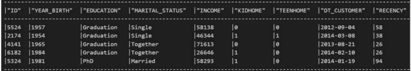

图 3.8 – 购买历史 – 前 5 行

我们可以使用`collect()`方法在笔记本中显示数据：

```py
purchase_history.collect()
```

`PURCHASE_HISTORY`表中的记录以 JSON 数组的形式显示：

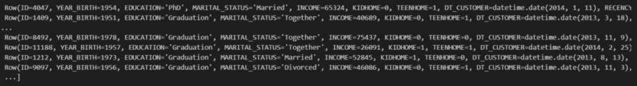

图 3.9 – 购买历史 – 完整表

collect()和 show()之间的区别

在 Snowpark Python 中，有两个基本函数：**collect()**和**show()**。这些函数在数据处理和显示数据时具有不同的用途。Snowpark Python 中的**collect()**函数用于从指定的源（如表、文件或 API）收集或检索数据。它允许您执行查询、应用过滤器并从数据源中提取所需信息。收集到的数据存储在变量或结构（如 DataFrame）中，以便进行进一步的分析或操作。

另一方面，Snowpark Python 中的**show()**函数主要用于以表格格式显示 DataFrame 或任何其他数据结构的内 容。它提供了一个方便的方式来可视化并检查数据处理管道不同阶段的数据。**show()**函数以人类可读的方式呈现数据，以结构化表格格式显示行和列。它对于调试、理解数据结构或进行数据探索分析可能很有帮助。

简而言之，**collect()**函数专注于从源中收集和检索数据，而**show()**函数以可读的格式显示数据。这两个函数在 Snowpark Python 处理数据时都发挥着重要作用，但在数据处理工作流程中它们具有不同的用途。

接下来，我们将使用`count()`方法来获取表中行的总数：

```py
purchase_history.count()
```

从结果输出中，我们可以看到`PURCHASE_HISTORY`表包含大约 2,000 行数据。

现在，我们可以检查表的列以了解有关这些数据的更多信息：

```py
purchase_history.columns
```

这将返回列信息，有助于我们更好地理解数据。列信息包含与客户购买历史相关的数据：


图 3.10 – 购买历史 – 列

现在，我们可以过滤数据以进行切片和切块。我们可以使用以下代码来过滤特定行或单行：

```py
from snowflake.snowpark.functions import col
purchase_history.filter(col("id") == 1).show()
```

这将返回`id`设置为`1`的列。我们可以在列过滤器中传递多个值以执行额外的行级操作：

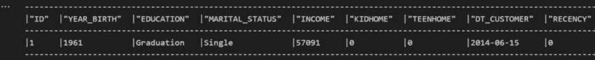

图 3.11 – 购买历史 ID 过滤

如果我们需要添加多个过滤器值，可以使用`&`操作符将多个列过滤器值传递给方法：

```py
purchase_history.filter((col("MARITAL_STATUS") == "Married") & 
                        (col("KIDHOME") == 1)).show()
```

前面的代码提供了将`MARITAL_STATUS`设置为`Married`并且有孩子在家（`KIDHOME`）的人的数据：

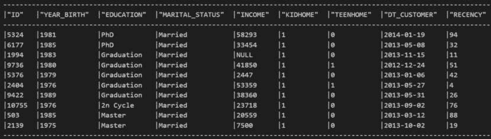

图 3.12 – 购买历史过滤器

这有助于我们了解有孩子的已婚客户的购买历史模式。我们还可以通过传递 1964 年至 1980 年的出生年份范围来过滤到出生年份：

```py
purchase_history.filter((col("YEAR_BIRTH") >= 1964) & 
                        (col("YEAR_BIRTH") <= 1980)).show()
```

这显示了 1964 年至 1980 年出生的客户的购买数据：

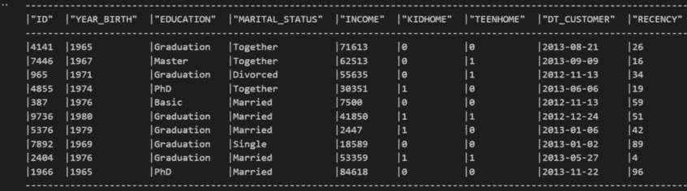

图 3.13 – 购买历史过滤器

这项数据有助于我们了解他们的购买情况。我们还可以使用`select()`方法仅选择分析所需的列：

```py
purchase_history.select(col("ID"), col("YEAR_BIRTH"), 
                        col("EDUCATION")).show()
```

前面的代码仅返回客户的 ID、年份和教育状况：

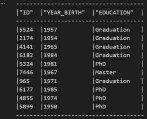

图 3.14 – 购买历史列

在接下来的章节中，我们将更深入地探讨数据探索，揭示更多从数据中获取洞察的技术。

在这些基本探索步骤的基础上，我们将深入数据转换操作领域。通过结合我们对数据的理解以及转换技术的力量，我们将释放数据的全部潜力，并为明智的决策提取有价值的见解。

在下一节中，我们将讨论如何使用这些数据执行数据转换。

## 数据转换

**数据转换**是一个基本过程，涉及修改和重塑数据，使其更适合分析或其他下游任务，例如机器学习模型构建过程。它包括对数据应用一系列操作，如清理、过滤、聚合和重新格式化，以确保其质量、一致性和可用性。数据转换使我们能够将原始数据转换为易于解释和分析的结构化和组织化格式。

数据需要最小的转换，我们将在接下来的章节中对其进行详细阐述。本节的目标是将来自不同来源的数据结合起来，创建一个用于进一步处理的统一表格，我们将在下一章中使用它。我们将利用 Snowpark 强大的连接和合并功能来完成这项工作。通过使用连接，我们可以根据标准列或条件合并数据。另一方面，合并允许我们垂直地追加来自多个来源的数据。这些技术将使我们能够有效地整合和合并我们的数据，为全面分析和洞察奠定基础。让我们探索 Snowpark 的连接和合并功能如何帮助我们实现这种数据组合：

```py
purchase_campaign = purchase_history.join(
    campaign_info,
    purchase_history.ID == campaign_info.ID ,
    lsuffix="_left", rsuffix="_right"
)
```

在这里，我们将购买历史与活动信息连接起来，以建立购买与活动之间的关系。标准 ID 列用于选择连接，默认为内部连接：

```py
purchase_campaign = purchase_campaign.drop("ID_RIGHT")
```

我们正在从合并的结果中删除额外的 ID 列。DataFrame 现在只包含一个 ID 列：

```py
purchase_campaign.show()
```

这显示了购买活动数据与购买历史和活动信息相结合的数据：

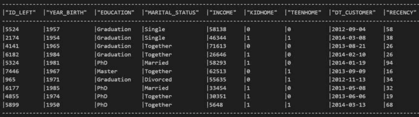

图 3.15 – 购买活动数据

让我们将这些数据与投诉信息结合起来以获得完整的数据：

```py
final_combined = purchase_campaign.join(
    complain_info,
    purchase_campaign["ID_LEFT"] == complain_info.ID
)
final_combined = final_combined.drop("ID_LEFT")
```

在这里，我们通过使用标准的 ID 列将购买活动的结果与投诉信息结合起来。结果 DataFrame 包含了数据分析所需的完整数据。我们正在从合并的结果中删除额外的 ID 列。DataFrame 现在只有一个 ID 列：

```py
final_combined.show()
```

这显示了从所有三个表中综合得到的最终数据。我们现在可以将这些数据写入表格以进行进一步分析：

```py
final_combined.write.save_as_table("MARKETING_DATA")
```

在这里，数据被写入 `MARKETING_DATA` 表，此时它将在 Snowflake 中可用。我们需要将此数据与必须加载到该表中的附加营销数据一起追加。

连接和联合的区别

连接基于共享列或条件从两个或多个表中合并数据。在 Snowflake Snowpark 中，您可以执行不同类型的连接，如内连接、左连接、右连接和全外连接。连接允许您通过根据指定列中的匹配值对齐行来水平合并数据。这使得您能够将来自多个表的相关数据合并，从而生成包含所有连接表信息的合并数据集。

另一方面，联合用于垂直追加来自多个表的数据，或将结果集追加到单个数据集中。与连接不同，联合不需要任何特定条件或匹配列。相反，它们将行堆叠在一起，垂直连接数据。这在您有相同结构且希望将它们合并到单个数据集中的类似数据集时非常有用。在 Snowflake Snowpark 中可以执行联合，以创建包含输入表或结果集中所有行的新的数据集。

总结来说，在 Snowflake Snowpark 中，连接用于通过匹配列水平地组合数据，而联合用于垂直堆叠数据，而不需要任何特定条件。连接将来自多个表的相关数据合并，而联合将类似的数据集追加到单个数据集中。

### 追加数据

Snowflake Snowpark 的 `UNION` 函数在将新数据合并和集成到 Snowflake 数据库中起着至关重要的作用。`UNION` 函数的重要性在于其能够垂直追加来自不同数据源或结果集的行，或将结果集合并到单个综合数据集中。当向数据库添加新数据时，通常需要将其与现有数据合并或结合，以便进行综合分析。`UNION` 函数使我们能够无缝地将新添加的数据与现有数据集集成，创建一个包含所有相关信息的统一视图。

`UNION`函数的这一功能在数据定期接收或更新的场景中非常宝贵。例如，假设我们接收每日的销售数据或日志文件。在这种情况下，`UNION`函数使我们能够轻松地将新记录附加到现有数据集，确保我们的分析反映最新的信息。此外，它确保数据一致性，并允许数据分析的无缝连续性，使我们能够从完整和统一的数据集中得出准确的见解并做出明智的决策。

额外的营销数据可在`MARKETING_ADDITIONAL`表中找到。让我们看看我们如何利用 Snowpark 的`UNION`函数来处理这些额外数据：

```py
marketing_additional = session.table("MARKETING_ADDITIONAL")
marketing_additional.show()
```

上述代码显示了`MARKETING_ADDITIONAL`表中的数据：

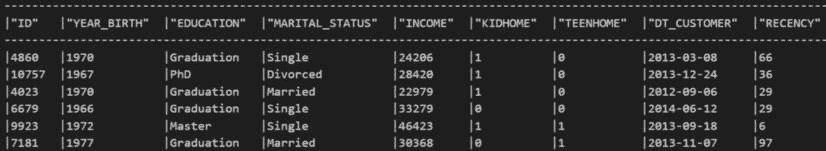

图 3.16 – MARKETING_ADDITIONAL 表

因此，该表已加载到 DataFrame 中。让我们看看原始表和附加表的行数：

```py
print("No of rows in MARKETING_ADDITIONAL table: \
    ",marketing_additional.count())
print("No of rows in PURCHASE_HISTORY table: \
    ",final_combined.count())
```

此代码显示了`MARKETING_ADDITIONAL`和`PURCHASE_HISTORY`表中的总行数：


图 3.17 – 数据行数

`MARKETING_ADDITIONAL`表包含 240 行新数据，这些数据必须与包含 2,000 行数据的`PURCHASE_HISTORY`表合并。由于列名相同，可以使用`union_by_name`进行合并：

```py
final_appended = final_combined.union_by_name(marketing_additional)
```

现在，DataFrame 包含附加的数据。让我们看看这个 DataFrame 中的行数：

```py
print("No of rows in UPDATED table: ",final_appended.count())
final_appended.show()
```

上述代码显示了 DataFrame 中的最终数据：

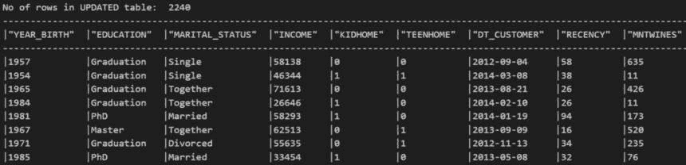

图 3.18 – MARKETING_FINAL 表

总行数为 2,240 行。这样，新数据已经附加。现在，我们将这些数据写入 Snowflake 中的`MARKETING_FINAL`表：

```py
final_appended.write.save_as_table("MARKETING_FINAL")
```

`MARKETING_DATA`表现在在 Snowflake 中可用并可被消费。

`union`和`union_by_name`之间的区别

有两种方法可以合并数据：**union_by_name**和**union**。这两种方法都允许合并多个数据集，但它们在方法和功能上有所不同。

Snowpark Python 中的`union_by_name`方法专门设计用于通过匹配和合并列名来组合数据集。此方法确保来自不同数据集的具有相同名称的列被合并，创建一个统一的数据集。当您有具有相似列结构的数据集并希望合并它们同时保留列名时，这非常有用。

另一方面，Snowpark Python 中的 **union** 方法通过简单地垂直追加数据集来合并数据集，而不考虑列名或结构。此方法将一个数据集的行与另一个数据集的行连接起来，从而生成包含两个来源所有行的单个数据集。**union** 方法适用于垂直堆叠数据集，而不考虑列名或匹配结构。然而，请注意，在某些情况下，列类型很重要，例如在将字符串列转换为数值类型时。

# 数据分组和分析

现在数据已经准备好并已转换，下一步是看看我们如何分组数据以了解重要的模式和进行分析。在本节中，我们将汇总这些数据并进行分析。

## 数据分组

在数据分析中，理解数据集中的模式对于获得见解和做出明智的决策至关重要。在这个过程中，一个强大的工具是 Snowpark Python 中的 `group_by` 函数。此函数允许我们根据特定标准对数据进行分组，使我们能够以结构化的方式剖析和分析数据集。

通过利用 `group_by` 函数，我们可以揭示数据在不同类别或属性中的分布和相关性方面的宝贵见解。例如，我们可以按产品类别对销售数据进行分组，以分析销售趋势，或按人口统计对客户数据进行分组，以了解购买行为。

此外，`group_by` 函数可以与其他数据处理和可视化技术结合使用，以获得更深入的见解。例如，我们可以创建条形图或热图等可视化，以直观地表示汇总数据，使其更容易发现模式和趋势。

为了便于分组和进行更深入的分析，我们将利用之前建立的 `MARKETING_FINAL` 表：

```py
marketing_final = session.table("MARKETING_FINAL")
```

在这里，我们将从 `MARKETING_FINAL` 表中加载数据到 DataFrame 中。我们将使用此 DataFrame 来执行聚合：

```py
marketing_final.group_by("EDUCATION").mean("INCOME").show()
```

这返回了按 `EDUCATION` 的平均收入。拥有博士学位的人平均收入最高，而拥有初等教育的人平均收入最低：


图 3.19 – 按教育水平的平均收入

现在，我们可以为列创建一个别名：

```py
marketing_final.group_by("EDUCATION").agg(avg("INCOME").alias( \
    "Avg_Income")).show()
```

平均收入以别名显示 – `AVG_INCOME`：


图 3.20 – AVG_INCOME 别名

我们还可以通过使用 `function()` 方法传递 Snowpark 函数中的相应操作来达到类似的结果：

```py
marketing_final.group_by("MARITAL_STATUS").function("sum")( \
    "Z_REVENUE").show()
```

这将打印以下输出：

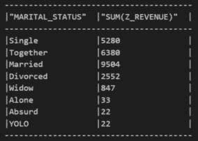

图 3.21 – 按婚姻状况的收益总和

在这里，我们可以看到已婚客户产生了最高的收入。我们还可以使用 `agg()` 来执行这种特定的聚合。让我们按婚姻状况计算最大收入：

```py
marketing_final.group_by("MARITAL_STATUS").agg(max("INCOME")).show()
```

这将生成以下输出：

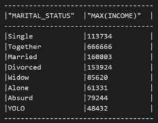

图 3.22 – 按婚姻状况划分的收入

这里，我们可以看到一起作为家庭并已婚的客户有最高的收入用于消费，因此他们产生了最大的收入。接下来，我们将找出不同类型毕业生的数量及其最高收入：

```py
marketing_final.group_by("EDUCATION").agg((col("*"), "count"), 
    max("INCOME")).show()
```

之前的代码产生了以下输出：

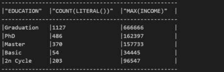

图 3.23 – 类别计数

这里，我们可以看到 `PhD` 的最高收入为 `162397`，而 `Basic` 收入的人最高收入最低，即 `34445`。

我们还可以在 Snowpark 中执行复杂的多层次聚合。让我们找出不同教育水平和婚姻状况的人如何消费：

```py
marketing_final.group_by(["EDUCATION","MARITAL_STATUS"]).agg(
    avg("INCOME").alias("Avg_Income"),
    sum("NUMSTOREPURCHASES").alias("Sum_Purchase")
).show()
```

这是输出结果：

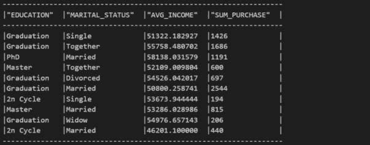

图 3.24 – 多层次聚合

让我们确定 `EDUCATION`、`MARITAL_STATUS` 和 `SUM_PURCHASE` 之间的关系。与单身人士相比，已婚的毕业生花费最多。我们还可以使用 `sort()` 函数对结果进行排序：

```py
aggregate_result = marketing_final.group_by(["EDUCATION","MARITAL_STATUS"]).agg(
    avg("INCOME").alias("Avg_Income"),
    sum("NUMSTOREPURCHASES").alias("Sum_Purchase")
)
aggregate_result.sort(
    col("EDUCATION").asc(), col("Sum_Purchase").asc()
).show()
```

这是输出结果：

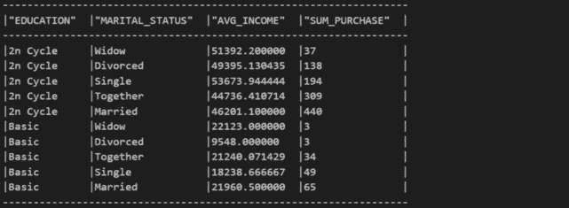

图 3.25 – 排序结果

这里，我们在聚合完成后按购买金额升序排序结果。下一节将介绍可以在这些数据上执行的一些标准数据分析。

## 数据分析

在前面的章节中，我们深入探讨了数据探索、转换和聚合，学习了我们可以使用的各种技术来了解我们的数据是什么以及我们如何结合不同的数据集。在掌握了坚实的通用数据集探索基础后，我们准备更深入地使用 Snowpark Python 进行数据分析。

本节重点介绍利用统计函数、采样技术、交叉操作以及将数据转换为 pandas DataFrame 进行高级分析的能力。我们将探讨如何应用统计函数从我们的数据中提取有意义的信息。然后，我们将了解不同的采样技术以高效地处理大型数据集。此外，我们将发现如何使用交叉操作重塑我们的数据，以促进深入分析。

此外，我们将探讨 Snowpark Python 与广泛使用的数据处理库 pandas 的无缝集成。我们将了解如何将 Snowpark 数据转换为 pandas DataFrame，从而利用 pandas 的广泛分析和可视化功能。

以下部分提供了 Snowpark Python 在数据分析方面的能力概述；我们将在下一章中深入探讨每个主题。在这里，我们旨在提供使用 Snowpark Python 分析数据的关键概念和技术的基础理解。在下一章中，我们将更详细地探讨这些主题，揭示 Snowpark Python 在数据分析方面的全部潜力。

### 描述数据

我们分析的第一步是理解我们的数据是如何分布的。pandas 中的 `describe()` 函数是一个非常有用的工具，它帮助我们深入了解数值数据的统计特性。当我们对 DataFrame 应用 `describe()` 时，它会计算各种描述性统计量，包括每个数值列的计数、平均值、标准差、最小值、四分位数和最大值。

此总结全面概述了我们的数据分布和中心趋势。通过检查这些统计量，我们可以快速识别关键特征，例如值的范围、数据的分布以及任何潜在的异常值。这种初步探索为更高级的分析技术奠定了基础，并允许我们根据对数据集分布的深入了解做出明智的决策：

```py
marketing_final.describe().show()
```

上一段代码显示了 `MARKETING_FINAL` 表的数据：

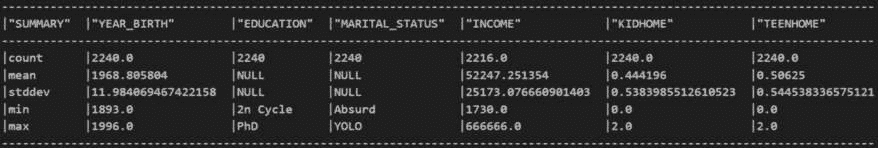

图 3.26 – MARKETING_FINAL DataFrame

结果显示了 `MARKETING_FINAL` 表的不同列和数据。

### 查找独特数据

在 Snowpark DataFrames 中，`distinct()` 函数对于在列或列集中识别唯一值至关重要。当应用于 Snowpark DataFrame 时，`distinct()` 会消除重复记录，从而生成一个新的 DataFrame，其中只包含唯一值。此函数特别适用于处理大型数据集或提取用于分析或数据处理的分析记录：

```py
marketing_final.distinct().count()
```

上一段代码显示了 `MARKETING_FINAL` 表的总计数：


图 3.27 – MARKETING_FINAL 计数

在我们的案例中，由于我们没有重复行，整个数据集被返回。`distinct()` 函数保留 DataFrame 的原始行，并且只过滤掉指定列中的重复值。

### 删除重复项

`drop_duplicates()` 函数从 Snowpark DataFrame 中删除重复行。它分析整行并与 DataFrame 中的其他行进行比较。如果发现某行是另一行的完全重复，`drop_duplicates()` 将会删除它，只保留第一次出现。默认情况下，此函数将 DataFrame 中的所有列都考虑为重复检测的依据：

```py
marketing_final.select(["Education","Marital_Status"]).drop_duplicates().show()
```

这将显示以下输出：


图 3.28 – 已移除的营销重复项

注意，您可以使用 `subset` 参数指定特定的列，仅基于这些列检查重复项。`drop_duplicates()` 方法通过删除重复行来修改原始 DataFrame。

### 列联分析

一旦我们确定了数据集中 `EDUCATION` 和 `MARITAL_STATUS` 列的唯一组合，我们可能会对每个组合出现的频率仍然感到好奇。我们可以利用 `crosstab` 函数来确定这些唯一组合的出现次数。通过将 `crosstab` 函数应用于我们的数据集，我们可以生成一个交叉表或列联表，显示 `EDUCATION` 和 `MARITAL_STATUS` 的唯一组合的频率分布：

```py
marketing_final.stat.crosstab(col1="Education",col2="Marital_Status").show()
```

上述代码显示了 DataFrame 中的列联表数据：

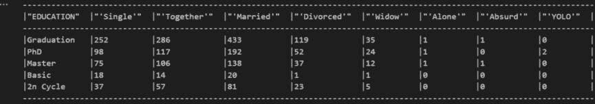

图 3.29 – 列联表数据

此表提供了关于数据集中每个唯一组合出现频率的全面概述，使我们能够深入了解这些变量之间的关系。`crosstab` 函数帮助我们理解唯一组合的分布和出现模式，进一步增强了我们的数据分析能力。

#### 旋转分析

在使用 `crosstab` 函数检查我们的数据集中 `EDUCATION` 和 `MARITAL_STATUS` 列的唯一组合时，我们可能会遇到某些零次出现的组合。我们可以构建一个透视表来更全面地了解数据，并进一步研究这些变量之间的关系。

构建透视表使我们能够更动态和灵活地总结和分析数据。与仅提供唯一组合频率分布的 `crosstab` 函数不同，透视表允许我们探索额外的聚合函数，如总和、平均值或最大值。这使得我们能够更深入地研究数据集，并获得有意义的见解：

```py
market_subset = marketing_final.select(
    "EDUCATION","MARITAL_STATUS","INCOME"
)
market_pivot = market_subset.pivot(
    "EDUCATION",
    ["Graduation","PhD","Master","Basic","2n Cycle"]
).sum("INCOME")
market_pivot.show()
```

上述代码显示了 DataFrame 中的数据：

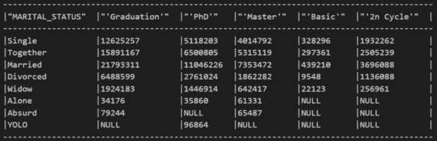

图 3.30 – 透视表

通过为 `EDUCATION` 和 `MARITAL_STATUS` 列构建透视表，我们可以揭示每个组合的出现次数以及与每个组合相关的各种统计度量或计算。这种扩展分析提供了对数据的更全面视图，并允许进行更细致和详细的研究。

注意

当**列联**函数显示某些变量的组合为零次出现时，需要注意的是，在构建透视表时，这些组合将用**NULL**值表示，而不是零。

与**列联**不同，后者明确突出显示数据集中不存在的组合的零计数，透视表考虑了变量的所有可能组合。因此，如果数据集中不存在某种组合，透视表中的相应单元格将用**NULL**值表示，而不是零。

数据透视表中**NULL**值的存在突出了那些特定组合数据缺失的情况。在后续数据分析过程中，如数据清理、插补或进一步的统计计算中，适当地解释和处理这些**NULL**值是至关重要的。

#### 删除缺失值

pandas 中的`dropna()`函数是处理 DataFrame 中缺失值的有力工具。在这种情况下，我们将利用 Snowpark 的`dropna()`功能，它允许我们删除包含缺失或`NULL`值的行或列，有助于确保数据的完整性和准确性。`dropna()`函数提供了几个参数，提供了在控制操作行为方面的灵活性：

```py
market_pivot.dropna(how="all").show()
```

上一段代码显示了 DataFrame 中应用了过滤器的数据：

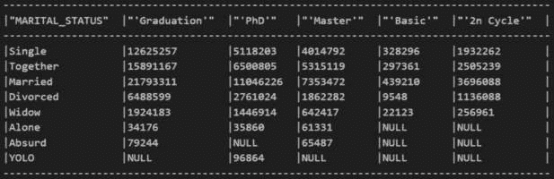

图 3.31 – 数据透视表 – dropna()

`how`参数决定了用于删除行或列的准则。它接受`any`和`all`作为输入：`any`会在行或列包含任何缺失值时删除该行或列，而`all`只有在所有值都缺失时才会删除行或列。

`thresh`参数指定了保留行或列所需的最小非空值数量。如果非空值超过阈值，则删除行或列：

```py
market_pivot.dropna(thresh=5).show()
```

上一段代码显示了 DataFrame 中应用了过滤器的数据：

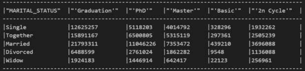

图 3.32 – 数据透视阈值

`subset`参数允许我们指定用于缺失值删除的列或行的子集。它接受列或行标签的列表。默认情况下，`dropna()`检查所有列或行中的缺失值。然而，使用子集，我们可以专注于特定列或行进行操作：

```py
market_pivot.dropna(subset="'Graduation'").show()
```

上一段代码从`market_pivot` DataFrame 中删除了`Graduation`列有缺失值的任何行，然后显示了结果 DataFrame：

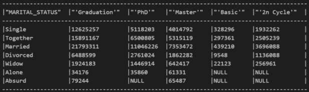

图 3.33 – 数据透视子集

这显示了应用了过滤器的 DataFrame 中的数据。

注意

当使用数据透视表时，适当地处理**NULL**值至关重要，因为它们可能会影响后续分析的准确性和可靠性。这使我们能够确保我们有完整的数据用于进一步的分析和计算。

在数据透视结果中存在**NULL**值可能会导致错误的解释或计算，因为**NULL**值可能会在分析中传播并影响后续的聚合、统计或可视化。通过将**NULL**值替换为特定值，例如 0，我们可以在数据透视表中提供有意义的数值表示，从而允许我们进行可靠的分析并基于完整信息做出明智的决策。

### 填充缺失值

`fillna()` 函数允许我们用特定值替换空值或应用各种插补技术。它还允许我们在 DataFrame 中填充缺失值，确保我们保持数据结构的完整性。我们可以指定用于填充空值的值，例如一个常数，或者从统计计算中得出的值，如平均值、中位数或众数。当我们在考虑数据的性质和期望的分析时处理空值时，`fillna()` 函数非常有用：

```py
market_pivot.fillna(0).show()
```

以下代码将 `market_pivot` DataFrame 中的任何空值填充为 `0`，然后显示结果 DataFrame：

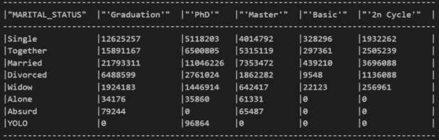

图 3.34 – 缺失值

这是一个方便的功能，用于填充需要用于计算的缺失值。

### 变量交互

`corr()` 函数计算相关系数，它衡量两个变量之间线性关系的强度和方向。它返回一个介于 -1 和 1 之间的值，其中 -1 表示完美的负相关，1 表示完美的正相关，0 表示没有线性相关：

```py
marketing_final.stat.corr("INCOME", "NUMSTOREPURCHASES")
```

执行此代码后，我们获得 `INCOME` 和 `NUMSTOREPURCHASES` 列之间的相关系数，从而提供了关于收入水平和数据集中商店购买数量之间潜在关系的见解：


图 3.35 – 相关值

另一方面，`cov()` 函数计算协方差，它衡量两个变量之间关联的程度，而不对规模进行归一化：

```py
marketing_final.stat.cov("INCOME", "NUMSTOREPURCHASES")
```

这是输出结果：


图 3.36 – 协方差值

`INCOME` 和 `NUMSTOREPURCHASES` 列之间的协方差帮助我们了解收入水平的变化如何与数据集中商店购买数量的变化相对应。

注意

虽然 **corr()** 和 **cov()** 都有助于分析变量之间的关系，但重要的是要注意，在 Snowpark Python 中，这些函数仅支持同时分析两个变量。这种限制意味着我们只能计算 DataFrame 中两列之间的相关性或协方差，而不能跨多个变量同时进行。可能需要额外的技术或函数来克服这种限制，并执行多个变量的相关性或协方差分析。

### 使用 pandas DataFrame 操作

将 Snowpark DataFrame 转换为 pandas DataFrame 是一个有价值的步骤，它为分析能力打开了广泛的大门。Snowpark 提供了与 pandas 的无缝集成，使我们能够利用 pandas 的广泛的数据操作、分析和可视化功能。通过将 Snowpark DataFrame 转换为 pandas DataFrame，我们获得了专门为数据分析设计的工具和库的庞大生态系统。

这种转换使我们能够利用 pandas 丰富的函数和方法，例如统计计算、高级过滤、分组操作和时间序列分析。pandas 还提供了许多可视化选项，例如生成有洞察力的图表、图表和图形，使数据可视化更加容易访问。使用 pandas，我们可以创建有意义的可视化数据表示，便于探索模式、趋势和关系。此外，使用 pandas 允许我们利用其广泛的社区支持和资源。pandas 库拥有庞大的用户社区，这使得查找特定数据分析任务的文档、教程和有帮助的讨论变得更加容易。

### pandas DataFrame 的局限性

将 Snowpark DataFrame 转换为 pandas DataFrame 可能存在局限性，尤其是在处理大型数据集时。主要约束是内存消耗，因为同时转换整个数据集可能会超过可用的内存资源。这可能会阻碍分析过程，并可能导致系统崩溃或性能问题。

然而，这些局限性可以通过将 DataFrame 分批处理和采样数据来缓解。我们将在稍后讨论这一点。

### 使用 pandas 进行数据分析

将 Snowpark DataFrame 转换为 pandas DataFrame 使我们能够无缝地从 Snowpark 强大的数据处理能力过渡到 pandas 丰富的环境。这种互操作性扩展了我们的分析可能性，并使我们能够执行高级分析，从数据中获得更深入的见解：

```py
pandas_df = marketing_final.to_pandas()
pandas_df.head()
```

以下代码将 `marketing_final` Snowpark DataFrame 转换为 pandas DataFrame，使我们能够使用 pandas 的广泛数据分析和操作功能来处理数据。它将输出以下内容：

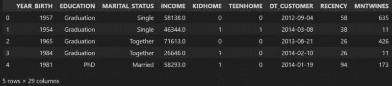

图 3.37 – 结果 pandas DataFrame

这显示了已转换为 pandas DataFrame 的数据。

#### pandas 中的相关性

在 pandas 中，计算多个列之间的相关性很简单：涉及选择所需的列并应用 `corr()` 函数。它生成一个相关性矩阵，使我们能够同时检查每一对列之间的关系：

```py
pandas_df[["INCOME","KIDHOME","RECENCY"]].corr()
```

以下代码计算 `pandas_df` pandas DataFrame 中 `INCOME`、`KIDHOME` 和 `RECENCY` 列之间的相关性矩阵。它计算这些列之间的成对相关系数，提供对这些关系见解。输出如下：

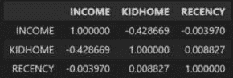

图 3.38 – Pandas 相关性

接下来，我们将查看频率分布。

#### 频率分布

在 pandas 中计算单列的值频率比在 Snowpark Python 中简单。我们可以通过在特定列上使用 `value_counts()` 函数快速获取 pandas 中的频率分布。它返回一个 Series，其中唯一值作为索引，其对应的计数作为值。这种简洁的方法使我们能够快速了解列中每个唯一值的分布和普遍性。另一方面，在 Snowpark Python 中，获取单列的值频率需要更多步骤和额外的编码。我们通常需要按所需的列对 DataFrame 进行分组，然后执行聚合操作以计算每个唯一值的出现次数。尽管在 Snowpark Python 中可以实现这一点，但它涉及更复杂的语法和多个转换，使得与 pandas 相比，这个过程更加繁琐：

```py
frequency = pandas_df.EDUCATION.value_counts()
frequency
```

`frequency = pandas_df.EDUCATION.value_counts()` 计算了 pandas DataFrame 中 `pandas_df` 的 `EDUCATION` 列中唯一值的频率分布，并将结果赋值给 `frequency` 变量。输出如下：

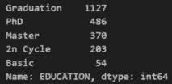

图 3.39 – Pandas 数据频率

这显示了 pandas DataFrame 中的数据频率值。

#### pandas 中的可视化

由于与流行的可视化库（如 Matplotlib 和 Seaborn）的无缝集成，使用 pandas 创建可视化变得非常简单。pandas 提供了一个简单直观的界面来生成各种可视化，包括线图、条形图、直方图、散点图等等。

通过利用 pandas 内置的绘图函数，我们可以轻松地将我们的数据转换为有洞察力的视觉表示，使我们能够探索数据集中的模式、趋势和关系。只需几行代码，pandas 就能让我们产生视觉上吸引人且信息丰富的图表，从而促进我们数据的沟通和解读：

```py
frequency.plot(kind="barh",figsize=(8,3))
```

上述代码从存储在 `frequency` 变量中的频率分布数据创建了一个水平条形图，其中每个唯一值由一个长度与其计数成比例的条形表示，该图宽度为 8 英寸，高度为 3 英寸的自定义尺寸：

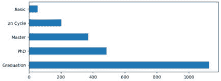

图 3.40 – 频率图

同样，我们可以通过将 `kind` 改为 `hexbin` 生成 Hexbin 图：

```py
pandas_df.plot(
    kind="hexbin",
    x="INCOME",y="MNTGOLDPRODS",
    xlim=[0,100000],ylim=[0,100],
    figsize=(8,3)
)
```

上述代码创建了一个 Hexbin 图，用于可视化 `pandas_df` pandas DataFrame 中 `INCOME` 和 `MNTGOLDPRODS` 列之间的关系：

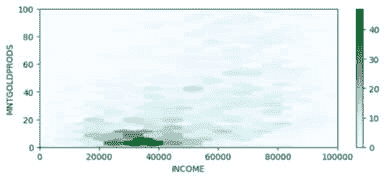

图 3.41 – Hexbin 图

在这里，*X* 轴表示收入值，*Y* 轴表示黄金产品的数量。该图限制在 X 轴范围为 0 到 100,000，Y 轴范围为 0 到 100，宽度为 8 英寸，高度为 3 英寸的自定义尺寸。

#### 将 DataFrame 分成批次

`to_pandas_batches()` 函数将 Snowpark DataFrame 转换为多个较小的 pandas DataFrame，以便批量处理。这种方法通过将数据转换为可管理的部分来减少内存使用，从而能够高效地分析大型数据集：

```py
for batch in marketing_final.to_pandas_batches(): print(batch.shape)
```

这里是输出：

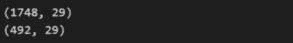

图 3.42 – DataFrame 批量

以下代码演示了如何使用 Snowpark Python 中的 `to_pandas_batches()` 函数批量分析大型数据集。通过遍历 `to_pandas_batches()` 函数，代码以可管理的批量处理数据集，而不是一次性将整个数据集加载到内存中。在每次迭代中，数据集的一个批次被转换为 pandas DataFrame 并存储在 `batch` 变量中。`print(batch.shape)` 语句提供了每个批次的形状，指示该特定批次的行数和列数。

以批量的方式分析数据集可以更有效地利用内存，使我们能够处理可能超出可用内存资源的大型数据集。这种方法通过将数据集分解为更小、更易于管理的部分，从而便于快速计算并降低与内存相关问题的风险。

#### 采样 DataFrame

Snowpark Python 中的 `sample()` 函数允许我们从 Snowpark DataFrame 中检索随机子集的数据。通过指定所需的分数或行数，我们可以有效地提取用于分析的代表性样本。这种技术减少了转换和后续分析所需的内存占用，同时提供了有意义的见解：

```py
sample_df = marketing_final.sample(frac=0.50)
sample_df.count()
```

这里是输出：


图 3.43 – 采样数据

以下代码从 `marketing_final` DataFrame 中选择 50% 的随机样本并将其分配给 `sample_df` DataFrame。每次运行代码段时，最终计数步骤都会产生略微不同的输出，因为它涉及到对原始表的采样。随后的 `sample_df.count()` 函数计算 `sample_df` DataFrame 中每列的非空值计数。

通过在 Snowpark Python 中使用我们介绍的方法，我们可以克服将大型 Snowpark DataFrame 转换为 pandas DataFrame 的限制，从而在有效管理内存资源的同时进行实际分析。这些函数提供了灵活性和控制力，使我们能够以可管理和优化的方式处理大型数据集。

# 摘要

Snowpark 提供了不同的数据处理能力并支持各种技术。它为我们提供了一种简单且通用的方式来摄取不同的结构化和非结构化文件格式，并且 Snowpark 的 DataFrame 支持各种数据转换和分析操作。我们介绍了 Snowpark 会话变量以及可以使用 Snowpark 执行的不同数据操作。

在下一章中，我们将介绍如何使用 Snowpark 构建数据工程管道。
