# 使用 Snowpark 构建数据工程管道

数据是每个组织的脉搏，数据工程是确保各种消费有最新、准确数据流动的生命线。数据工程师的角色是开发和管理工作流程，该流程收集、转换并将数据交付到不同的**业务线**（**LOB**）。正如 Gartner 的研究正确提到的，“*数据的日益多样化以及需要在正确的时间向正确的人提供正确数据的需求，已经产生了对数据工程实践的需求。数据和分析领导者必须将数据工程学科整合到他们的数据管理策略中。*”本章讨论了使用 Snowpark 构建高效数据工程管道的实用方法。

在本章中，我们将涵盖以下主要主题：

+   使用 Snowpark 开发具有弹性的数据管道

+   在 Snowpark 中部署高效的数据操作

+   Snowflake 中任务概述

+   在 Snowpark 中实现日志记录和跟踪

# 技术要求

本章需要有效的 Snowflake 账户，并且需要安装 Anaconda 中的 Python 并在本地配置。您可以在 [`signup.snowflake.com/`](https://signup.snowflake.com/) 注册 Snowflake 试用账户。

环境设置的技术要求与前面章节相同。如果您还没有设置环境，请参考前面的章节。支持材料可在 [`github.com/PacktPublishing/The-Ultimate-Guide-To-Snowpark`](https://github.com/PacktPublishing/The-Ultimate-Guide-To-Snowpark) 获取。

# 使用 Snowpark 开发具有弹性的数据管道

一个强大且具有弹性的数据管道将使组织能够获取、收集、分析和有效地使用洞察力以增长业务并交付节省成本的业务流程。传统的数据管道难以管理，且不支持组织不断变化的数据需求。Snowpark 通过在 Snowflake 数据云中本地运行来解决问题，使得从数据云中提取信息变得更加容易和快速。本节将涵盖具有弹性的数据管道的各种特性、如何在 Snowpark 中开发它们以及它们的益处。

## 传统数据管道与现代数据管道的比较

传统数据管道的一个重大挑战是，开发和管理工作流程需要相当的时间和成本，并且有很高的技术债务。它还包含多个工具，需要花费大量时间进行集成。由于解决方案的复杂性，可能会因为延迟和流数据支持而出现数据延迟。以下图表突出了传统方法：

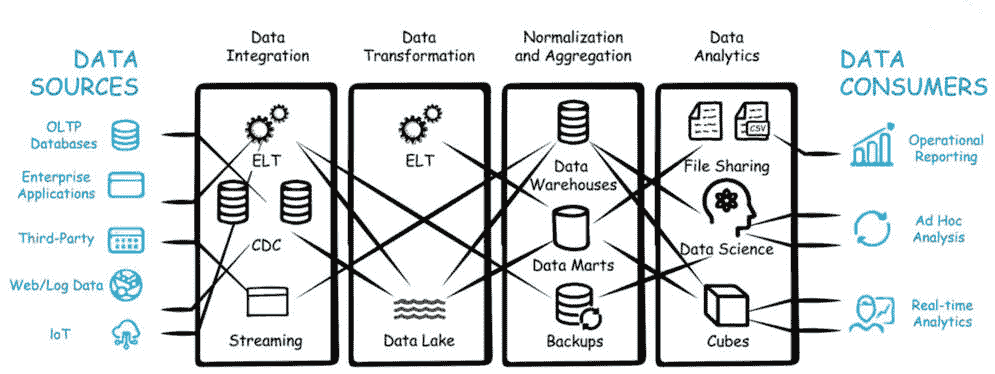

图 4.1 – 传统数据管道

该架构展示了各种技术和系统被拼接在一起，以从源到消费者传递数据，每个阶段都有多个故障点。由于存在数据孤岛，并且有大量相同数据的副本，因此还存在数据治理和安全问题。

现代数据管道基于统一平台和多工作负载模型运行。它们通过集成数据源，如批量处理和流式处理，通过启用各种**商业智能**（**BI**）和分析工作负载以及支持内部和外部用户，通过简化的架构提高生产力。统一平台架构支持连续、可扩展的数据处理管道，具有可扩展的性能。以下图表突出了现代 Snowflake 方法：

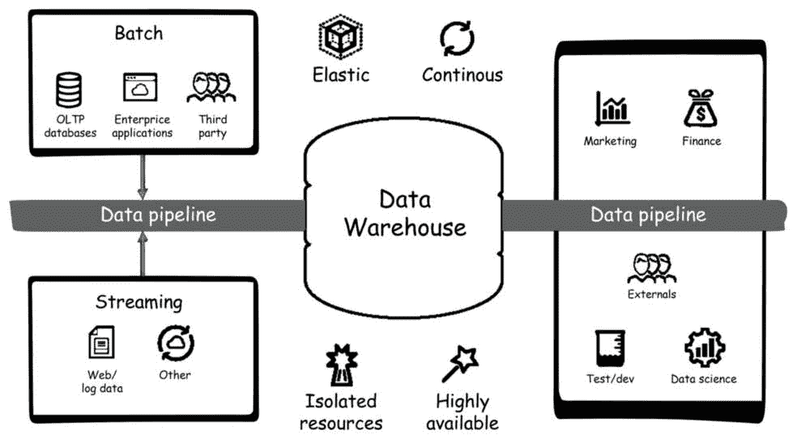

图 4.2 – 现代数据管道

Snowpark 由于与领先的云数据仓库 Snowflake 的原生集成而脱颖而出，使其能够在 Spark 应用程序内直接进行无缝数据处理。它提供了一种统一的开发体验，使用熟悉的编程语言，如 Scala 和 Java，消除了传统 Spark 设置的复杂性，从而简化了数据管道的开发和维护。Snowpark 对 Snowflake 架构的优化性能确保了高效的数据处理和降低延迟，使得对大型数据集的快速分析成为可能。此外，其高级分析能力、可扩展性和成本效益使其成为寻求构建敏捷、云原生数据管道的组织的一个有吸引力的选择，与传统的 Spark 设置相比，它提高了生产力和灵活性。

## 使用 Snowpark 进行数据工程

Snowpark 拥有许多数据工程能力，使其成为一个快速灵活的平台，使开发者能够使用 Python 进行数据工程。有了**提取、转换和加载**（**ETL**）和**提取、加载和转换**（**ELT**）的支持，开发者可以使用 Snowpark 客户端进行开发，并使用他们喜欢的开发环境与 Snowflake 引擎进行交互以处理数据。有了 Anaconda 的支持，你可以确保所需的包和依赖项对 Snowpark 脚本来说是现成的。这使得加速产品管道的增长变得更容易。Snowpark 中的数据管道可以是批量或实时，利用可扩展、高性能的多集群仓库，能够处理复杂的数据转换而不会影响性能：

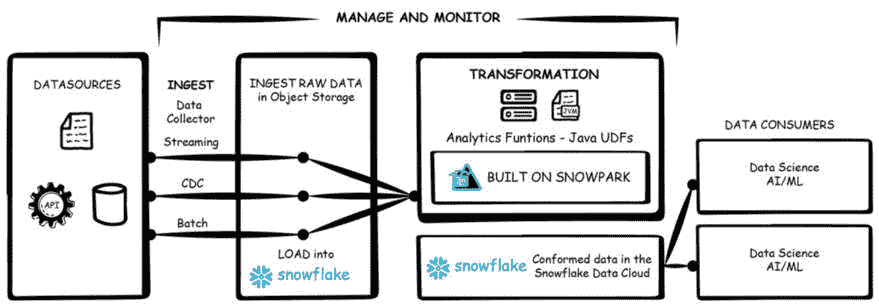

图 4.3 – Snowpark 数据工程

Snowpark 通过一个能够为开发者提供数据云操作简单性的引擎，增强了整个数据工程的生命周期，使开发者能够拥有表达性和灵活性。Snowflake 可以帮助实现数据的集中化，包括结构化、半结构化和非结构化数据，这些数据被加载到 Snowflake 中进行处理。可以通过基于 Python 的强大 Snowpark 函数来执行转换。在整个开发生命周期中，Snowpark 的数据工程工作负载可以与其他 Snowflake 对象一起完全管理，内置的监控和编排能力支持由数据云驱动的复杂数据管道的扩展。高级数据转换的结果存储在 Snowflake 内部，可用于不同的数据消费者。Snowpark 数据管道通过移除用于计算的数据移动步骤，减少了数据需要移动到可操作见解的阶段数量。

## 使用 Snowpark 实现程序化 ELT

Snowflake 支持和推荐使用现代 ELT 实现模式进行数据工程，而不是传统的 ETL 过程。ETL 是一种模式，其中数据从各种来源提取，在数据管道中进行转换，然后将转换后的数据加载到目的地，如数据仓库或数据集市。以下图表显示了 ETL 与 ELT 的比较：

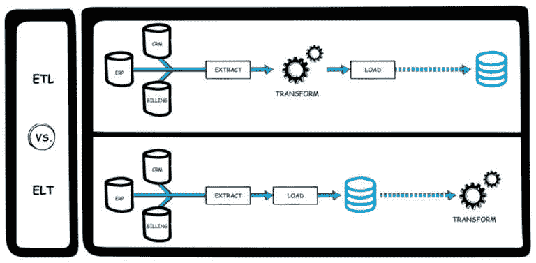

图 4.4 – ETL 与 ELT 的比较

ELT 是一种更适合 Snowflake 数据云的模式，其中数据从源提取并加载到 Snowflake 中。然后使用 Snowpark 在 Snowflake 内部对数据进行转换。Snowpark 管道被设计为首先提取和加载数据，然后在目的地进行转换，因为转换是在 Snowflake 内部完成的，这提供了更好的可扩展性和弹性。ELT 还提高了性能，并减少了使用 Snowpark 在 Snowflake 中摄取、转换和分析数据所需的时间。以下图表显示了 Snowflake 内部数据的不同层：

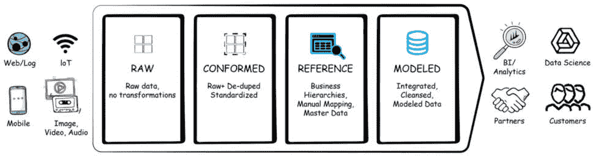

图 4.5 – Snowflake 中的数据阶段

数据管道在 Snowflake 中构建不同的数据阶段。这些阶段包含数据库和模式，其中包含诸如表和视图等对象。原始数据从源系统直接导入 Snowflake，没有进行转换，因为 Snowflake 支持多种数据格式。然后，使用 Snowpark 对这些数据进行转换，形成包含去重和标准化数据的规范阶段。这些数据成为数据管道下一步的输入。参考阶段包含业务定义和数据映射，以及层次结构和主数据。最终阶段包含建模数据，它包含清洁和转换后的数据。Snowpark 拥有许多功能，有助于进行增值转换，帮助将数据转换为用户和应用可访问的、业务就绪的格式，从而为组织增加价值。

### Snowpark 中的 ETL 与 ELT

Snowpark 支持 ETL 和 ELT 工作负载。虽然 ELT 因现代管道而闻名，但在某些场景中也会使用 ETL 模式。ETL 通常用于结构化数据，其中数据总量较小。它还用于将传统数据库迁移到数据云的系统，其中源数据和目标数据类型不同。与传统的 ETL 过程相比，ELT 提供了显著的优势。ELT 支持大量结构化、非结构化和半结构化数据，可以使用 Snowflake 进行处理。它还允许开发人员和分析师在数据加载到 Snowflake 时进行数据实验。ELT 还最大限度地提高了他们转换数据以获取潜在见解的选项。它还支持低延迟和实时分析。由于这些原因，ELT 比传统的 ETL 更适合 Snowflake。以下部分将介绍如何在 Snowpark 中开发高效的数据操作。

# 在 Snowpark 中部署高效的数据操作

通过为数据管道的开发和管理带来更多严谨性，数据操作帮助数据团队减少开发时间，提高数据质量，并最大化数据的商业价值。它还确保数据在数据治理的简化环境中保持清洁、准确和最新。数据工程引入了有效开发、管理和部署数据工程管道所需的过程和能力。以下图表突出了数据操作方法：

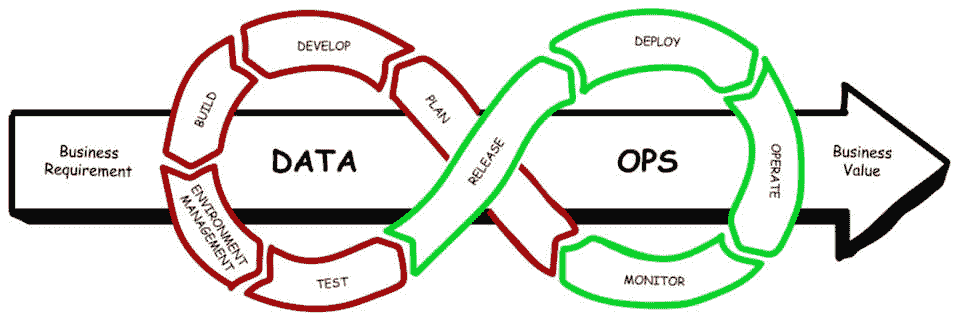

图 4.6 – 数据操作流程

数据操作流程侧重于通过迭代开发、测试和部署流程在循环中引入敏捷开发到数据工程管道。它还包括数据的**持续集成和持续部署**（**CI/CD**）、模式更改、数据版本以及数据模型和工件自动化的数据版本。本节将展示在 Snowpark 中执行的数据工程管道的示例。

## 开发数据工程管道

在 Snowpark 框架内创建一个有弹性的数据工程管道需要无缝集成三个核心组件：

1.  首先且最重要的是，数据工程师必须掌握将数据加载到 Snowflake 中的艺术，为后续处理奠定基础。这一初始步骤为整个管道的建设奠定了基础。

1.  其次，Snowpark 数据函数的变革力量开始发挥作用，使工程师能够塑造和塑造数据以满足特定的分析需求。*第三章**使用 Snowpark 简化数据处理*提供了对 DataFrame 操作的详细探索，为这一关键转换阶段奠定了基础。

1.  最后，数据之旅以将这些操作捆绑为 Snowpark 存储过程而告终，这提供了处理数据的效率和可重复性。

在深入本节之前，我们将基于从*第二章**建立 Snowpark 基础*和*第三章**使用 Snowpark 简化数据处理*所获得的知识，这两章中我们详细阐述了 DataFrame 操作及其转换为**用户定义函数**（**UDFs**）和存储过程的转换，我们将揭示将这些元素统一到一个有弹性的数据工程管道中的复杂过程。本章是对理论与实践结合的证明，赋予数据专业人士无缝连接加载、转换和捆绑阶段的能力，从而在 Snowpark 生态系统中构建一个强大的数据处理和分析框架。

在前几章中我们对数据加载有了全面的理解之后，我们的旅程现在转向战略性地利用这些数据。这一关键过渡将我们的重点放在三个核心步骤上：

1.  数据准备

1.  数据转换

1.  数据清理

这些阶段构成了我们数据工程之旅的基石，我们将塑造、整合和精炼我们的数据，揭示其分析潜力和宝贵见解。现在，我们将将这些概念转化为实际的数据工程管道，利用我们之前关于存储过程模板和转换步骤的讨论中的宝贵见解。我们的重点将集中在我们的营销活动数据上，其中在*第三章**使用 Snowpark 简化数据处理*中已经仔细概述了基础加载步骤，为我们的数据准备提供了一个坚实的起点。

### 数据准备

在我们的数据工程管道进展过程中，下一关键阶段是数据准备，涉及不同表的集成。在本节中，我们将探讨使用针对任务定制的各种函数合并这些不同的数据表的技术。此外，我们将阐明将这些函数注册为存储过程的过程，以确保数据工作流程的流畅和高效。第一步是将购买历史与活动信息连接起来。两个表都使用`ID`列输入，并保留单个 ID：

```py
def combine_campaign_table(purchase_history,campaign_info):
    purchase_campaign = purchase_history.join(
        campaign_info, \
        purchase_history.ID == campaign_info.ID, \
        lsuffix="_left", rsuffix="_right"
    )
    purchase_campaign = purchase_campaign.drop("ID_RIGHT")
    return purchase_campaign
```

结果的`purchase_campaign` DataFrame 包含数据，并在下一步中使用。在下一步中，我们将使用相同的`ID`列将购买活动与投诉信息连接起来，然后创建一个`purchase_campaign_complain` DataFrame：

```py
def combine_complain_table(purchase_campaign,complain_info):
    purchase_campaign_complain = purchase_campaign.join(
        complain_info, \
        purchase_campaign["ID_LEFT"] == complain_info.ID
    )
    purchase_campaign_complain = \
        purchase_campaign_complain.drop("ID_LEFT")
    return purchase_campaign_complain
```

上述代码将列连接起来创建一个`purchase_campaign_complain` DataFrame，其中包含映射的购买数据和投诉信息。在最终步骤中，通过购买投诉和营销表之间的数据合并创建一个营销表：

```py
def union_marketing_additional_table(
    purchase_campaign_complain,marketing_additional):
    final_marketing_table = \
        purchase_campaign_complain.union_by_name(
            marketing_additional
        )
    return final_marketing_table
```

上述代码生成一个包含所有合并数据的表，这是管道的最终结果，将被写入为表。代表每个步骤的 Python 函数作为 Snowpark 存储过程的一部分执行。存储过程可以依次执行，也可以作为 Snowflake 任务进行调度。数据准备过程调用三个 Python 方法，并将最终表写入 Snowflake：

```py
from snowflake.snowpark.functions import sproc
import snowflake
def data_prep(session: Session):
    #### Loading Required Tables
    purchase_history = session.table("PURCHASE_HISTORY")
    campaign_info = session.table("CAMPAIGN_INFO")
    complain_info = session.table("COMPLAINT_INFO")
    marketing_additional = session.table("MARKETING_ADDITIONAL")
```

上述代码通过将所需数据加载到 DataFrame 中来进行数据准备。我们现在将调用每个步骤来执行它，就像一个管道：

```py
    #### Calling Step 1
    purchase_campaign = combine_campaign_table(
        purchase_history, campaign_info)
    #### Calling Step 2
    purchase_campaign_complain = combine_campaign_table(
        purchase_campaign, complain_info)
    #### Calling Step 3
    final_marketing_data = union_marketing_additional_table(
        purchase_campaign_complain, marketing_additional)
```

执行了之前定义的三个步骤函数。结果数据被加载到新的`final_marketing_data` DataFrame 中，然后将被加载到 Snowflake 表中：

```py
    #### Writing Combined Data To New Table
    final_marketing_data.write.save_as_table( \
        "FINAL_MARKETING_DATA")
    return "LOADED FINAL MARKETING DATA TABLE"
```

现在，我们将创建并执行一个包含上述逻辑的存储过程。该过程称为`data_prep_sproc`，是数据工程管道的第一部分——数据准备：

```py
# Create an instance of StoredProcedure using the sproc() function
from snowflake.snowpark.types import IntegerType,StringType
data_prep_sproc = sproc(
                        func= data_prep,\
                        replace=True,\
                        return_type = StringType(),\
                        stage_location="@my_stage",\
                        packages=["snowflake-snowpark-python"]
                        )
```

上述存储过程将数据写入`Final_Marketing_Data`表，该表将在数据转换的下一步中使用。

### 数据转换

此过程中的下一阶段涉及数据转换，基于之前步骤准备的数据。在这里，我们将在最后阶段之后注册另一个存储过程。此过程应用转换逻辑，将数据塑造成适合分析的形式。利用 Snowpark 的一系列有价值的聚合和汇总函数，我们将利用这些功能来塑造和增强我们的数据，为严格的分析奠定坚实的基础。以下代码转换数据：

```py
def data_transform(session: Session):
    #### Loading Required Tables
    marketing_final = session.table("FINAL_MARKETING_DATA")
    market_subset = marketing_final.select("EDUCATION", \
        "MARITAL_STATUS","INCOME")
    market_pivot = market_subset.pivot("EDUCATION", \
        ["Graduation","PhD","Master","Basic","2n Cycle"]
    ).sum("INCOME")
    #### Writing Transformed Data To New Table
    market_pivot.write.save_as_table("MARKETING_PIVOT")
    return "CREATED MARKETING PIVOT TABLE"
data_transform_sproc = sproc(
                        func= data_transform,\
                        replace=True,\
                        return_type = StringType(),\
                        stage_location="@my_stage",\
                        packages=["snowflake-snowpark-python"]
                        )
```

创建了一个 `data_transform_sproc` 存储过程，该过程读取 `Final_Marketing_Data` 表并创建一个包含客户教育和总收入的数据透视表。当存储过程执行时，这些数据随后被写入到 `Marketing_Pivot` 表中。

### 数据清理

在我们数据工程流程的最后一步，我们专注于一个关键任务：清理 `Marketing_Pivot` 表中的数据。类似于艺术家完善杰作一样，我们仔细检查我们的数据，移除对分析不重要的表格中的任何空值。为此，我们依赖于多功能的 `dropna()` 函数，它就像一把精确的工具，可以切除不必要的数据：

```py
def data_cleanup(session: Session):
    #### Loading Required Tables
    market_pivot = session.table("MARKETING_PIVOT")
    market_drop_null = market_pivot.dropna(thresh=5)
    #### Writing Cleaned Data To New Table
    market_drop_null.write.save_as_table("MARKET_PIVOT_CLEANED")
    return "CREATED CLEANED TABLE"
data_cleanup_sproc = sproc(
                        func= data_cleanup,\
                        replace=True,\
                        return_type = StringType(),\
                        stage_location="@my_stage",\
                        packages=["snowflake-snowpark-python"]
                        )
```

从 `market_drop_null` DataFrame 清理后的数据随后被保存到 `Market_Pivot_Cleaned` 表中。这些数据是管道的最后阶段，用于分析。

### 编排管道

通过调用三个 Snowpark 过程来编排数据管道，这些过程调用了数据工程管道的三个不同步骤。这些过程按照 `data_prep_sproc`、`data_transform_sproc` 和 `data_cleanup_sproc` 的顺序执行：

```py
#### Calling Data Preparation Stored Procedure
data_prep_sproc()
#### Calling Data Transformation Stored Procedure
data_transform_sproc()
#### Calling Data Cleanup Stored Procedure
data_cleanup_sproc()
```

Snowpark 过程被执行，并且每执行一步后，最终数据都会写入到 `Market_Pivot_Cleaned` 表中。Snowflake 通过任务支持调度和编排。任务可以通过 Python API 和工作表进行调度，并且可以按顺序触发过程：

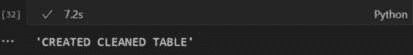

图 4.7 – 存储过程执行

在下一节中，我们将探讨如何利用 Snowflake 任务和任务图来执行前面的管道。

# Snowflake 中任务概述

Snowflake 中的任务是有力的工具，旨在简化数据处理工作流程并在 Snowflake 环境中自动化各种任务。提供一系列功能，任务执行不同类型的 SQL 代码，使用户能够对其数据进行各种操作。

Snowflake 中的任务可以执行三种主要的 SQL 代码类型：

+   **单个 SQL 语句**：允许执行单个 SQL 语句

+   **调用存储过程**：允许调用存储过程

+   **使用 Snowflake 脚本实现的程序逻辑**：支持使用 Snowflake 脚本实现程序逻辑

任务可以与表流集成，以创建连续的 ELT 工作流。通过处理最近更改的表行，任务确保数据完整性的维护，并为新数据或更改的数据提供一次且仅一次的语义。Snowflake 中的任务可以安排在指定的时间间隔运行。Snowflake 确保同一时间只执行一个计划任务的实例，如果任务仍在运行，则跳过计划执行。

## 为任务计算模型

在无服务器计算模型中，任务依赖于 Snowflake 管理的计算资源。这些资源会根据工作负载需求自动调整大小和扩展，确保最佳性能和资源利用率。Snowflake 会根据历史统计数据动态确定每个任务运行所需的适当计算大小。

或者，用户可以选择用户管理的虚拟仓库模型，为单个任务指定一个现有的虚拟仓库。此模型使用户能够更好地控制计算资源管理，但需要仔细规划以确保任务执行效率。

## 任务图

任务图，也称为**有向无环图**（**DAGs**），允许根据依赖关系组织任务。任务图中的每个任务都有前驱任务和后续任务，便于复杂工作流程管理。

任务图受到某些限制，包括总任务数最多为 1,000 个，包括根任务。任务图中的单个任务可以有最多 100 个前驱任务和 100 个子任务。

用户可以使用 SQL 或 Snowsight（Snowflake 的集成开发环境）查看和监控他们的任务图，从而了解任务依赖关系和执行状态。

总结来说，Snowflake 中的任务提供了强大的数据处理、自动化和工作流程管理能力，对于寻求在 Snowflake 生态系统中优化数据操作的用户来说，它们是不可或缺的工具。

## 使用 Python 管理任务和任务图

我们的主要关注点是 Snowpark。现在，我们将探讨如何使用 Python Snowpark 以编程方式执行任务图操作，而不是使用 SQL 语句。

现在，Python 可以管理 Snowflake 任务，使用户能够运行 SQL 语句、过程调用和 Snowflake 脚本逻辑。Snowflake Python API 引入了两种类型：

+   **Task**：此类型表示任务的属性，如其调度、参数和依赖关系

+   **TaskResource**：此类型提供与**Task**对象交互的方法，使任务执行和修改成为可能。

任务可以被分组到任务图中，这些图基于任务依赖关系相互连接。要创建任务图，用户首先定义一个 DAG 对象，指定其名称和可选属性，如其调度。任务图的调度可以使用`timedelta`值或 cron 表达式进行自定义，从而实现灵活的任务执行时间和重复模式。

让我们先设置必要的函数来实现我们的 DAG。本节中提供的示例假设您已经编写了代码来与 Snowflake 建立连接，以利用 Snowflake Python API：

```py
from snowflake.core import Root
from snowflake.core.task import StoredProcedureCall
from snowflake.core.task.dagv1 import DAG, DAGTask, DAGOperation
from snowflake.snowpark import Session
from datetime import timedelta
root = Root(session)
```

上述代码初始化 Snowflake Python API，创建一个 `root` 对象以利用其类型和方法。此外，它为任务计划设置了一个 1 小时的 `timedelta` 值。你可以使用 `timedelta` 值或 Cron 表达式来定义计划。对于一次性运行，你可以省略 DAG 对象的计划参数，无需担心它在不必要的情况下在后台运行。

让我们定义一个简单的 DAG，我们将使用它来执行我们的管道：

```py
dag = DAG("Task_Demo",
          warehouse="COMPUTE_WH",
          schedule=timedelta(days=1),
          stage_location= \
              "SNOWPARK_DEFINITIVE_GUIDE.MY_SCHEMA.MY_STAGE",
          packages=["snowflake-snowpark-python"]
          )
```

在此 DAG 设置中，以下适用：

+   我们将我们的 DAG 命名为 **Task_Demo**，它默认在指定的仓库上运行。

+   使用 **timedelta** 定义了一个每日执行的调度计划。

+   存储任务的序列化版本需要 **stage_location** 属性通过 Python API 进行。

+   该 DAG 下的所有任务都将使用默认的包列表和指定的仓库运行。然而，DAG 内部各个任务的仓库和包可以使用不同的值进行覆盖。

+   此外，**use_func_return_value** 属性表示 Python 函数的返回值将被视为任务的返回值，尽管在我们的案例中，我们没有使用 **return** 对象。

我们已经定义了一系列代表三个任务管道或 DAG 的 Python 函数。然而，我们尚未创建并将 DAG 推送到 Snowflake。现在让我们使用 Snowflake Python API 来完成这项工作：

```py
with dag:
    data_prep_task = DAGTask("Data_Prep", definition=data_prep)
    data_transform_task = DAGTask("Data_Transform", \
        definition=data_transform)
    data_cleanup_task = DAGTask("Data_Cleanup", \
        definition=data_cleanup)
    data_prep_task >> data_transform_task >> data_cleanup_task
DAGTask objects for each task in our pipeline: data_prep, data_transform, and data_cleanup. These tasks are then linked together using the >> operator to specify their execution order.
```

对于一次性测试或运行 DAG，用户可以省略指定计划，并使用 `dag_op.run(dag)` 手动触发运行：

```py
schema = root.databases["SNOWPARK_DEFINITIVE_GUIDE"].schemas[ \
    "MY_SCHEMA"]
dag_op = DAGOperation(schema)
dag_op.deploy(dag,mode="orReplace")
dag_op.run(dag)
```

提供的代码使用 Snowflake 的 Snowpark 库执行多个操作。首先，它使用 `root` 对象从 `SNOWPARK_DEFINITIVE_GUIDE` 数据库检索名为 `MY_SCHEMA` 的模式。然后，它初始化一个名为 `dag_op` 的 `DAGOperation` 对象，指定 DAG 将部署到的模式。然后，在 `dag_op` 上调用 `deploy()` 方法来部署指定模式中指定的 DAG（名为 `dag`）。

`orReplace` 模式参数表示如果模式中已存在具有相同名称的 DAG，它将被替换。最后，在 `dag_op` 上调用 `run()` 方法来执行已部署的 DAG。此代码实际上是在 Snowflake 中使用 Snowpark 设置和执行 DAG。现在，你可以在 Snowsight 中检查图以查看图是如何设置的：

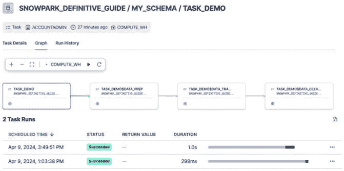

图 4.8 – Snowsight 图

此外，请注意，你可以将原始函数传递给依赖定义，而无需显式创建 `DAGTask` 实例，库会自动为你创建一个具有相同名称的任务。然而，有一些例外，例如需要显式创建 `DAGTask` 实例的第一个任务或在使用 `DAGTaskBranch` 或在多个任务中重复某些函数时。

一旦部署并运行了 DAG，你可以使用以下代码轻松检查其状态：

```py
current_runs = dag_op.get_current_dag_runs(dag)
for r in current_runs:
    print(f"RunId={r.run_id} State={r.state}")
```

如截图所示，我们的任务被安排为每天运行。此外，我们已经执行了一次以验证任务部署：


图 4.9 – 部署的任务

随着我们构建更复杂的管道，管理和调试变得越来越具有挑战性。建立强大的日志机制对于维护和简化错误解决至关重要。在下一节中，我们将深入了解在 Snowpark 中实现日志和回溯功能，以增强我们管道的可管理性和简化故障排除。

# 在 Snowpark 中实现日志和跟踪

日志和跟踪对于 DataOps 至关重要，并且对于监控和修复数据工程管道中的故障是必要的。Snowpark 内置了日志和跟踪功能，可以帮助记录 Snowpark 函数和过程的活动，并在 Snowflake 内部的易于访问的中心表中捕获这些信息。日志消息是独立、详细的字符串形式的信息消息，提供了关于代码片段的详细信息，而跟踪事件是有结构的我们可以用来获取跨越和分组我们代码多个部分的信息。一旦收集了日志，就可以通过 SQL 或通过 Snowpark 容易地查询或访问。以下图表突出了事件表和警报：

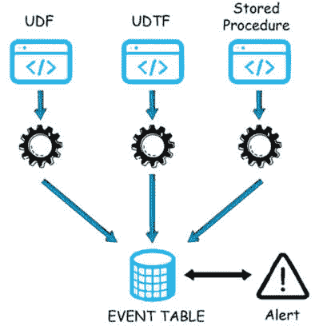

图 4.10 – 事件表

Snowpark 在事件表中存储日志和跟踪消息，这是一个具有预定义列集的唯一表。日志和跟踪在代码执行时捕获在这个表中。让我们看看事件表的结构以及如何创建它们。

## 事件表

事件表是 Snowflake 的本地表，需要创建。一个 Snowflake 账户只能有一个事件表来捕获所有信息，但可以创建多个视图进行分析。事件表包含以下列：

| **列** | **数据类型** | **描述** |
| --- | --- | --- |
| `TIMESTAMP` | `TIMESTAMP_NTZ` | 事件创建时的 UTC 时间戳。这是表示一段时间的事件的结束。 |
| `START_TIMESTAMP` | `TIMESTAMP_NTZ` | 对于表示一段时间的事件，例如作为该时间段开始的时间戳的跟踪事件。 |
| `OBSERVED_TIMESTAMP` | `TIMESTAMP_NTZ` | 用于日志的 UTC 时间戳。目前，它具有与 `TIMESTAMP` 相同的值。 |
| `TRACE` | `OBJECT` | 所有信号类型的跟踪上下文。包含 `trace_id` 和 `span_id` 字符串值。 |
| `RESOURCE` | `OBJECT` | 保留供将来使用。 |
| `RESOURCE_ATTRIBUTES` | `OBJECT` | 识别事件来源的属性，例如数据库、模式、用户、仓库等。 |
| `SCOPE` | `OBJECT` | 事件的作用域；例如，日志的类名。 |
| `SCOPE_ATTRIBUTES` | `OBJECT` | 保留供将来使用。 |
| `RECORD_TYPE` | `STRING` | 事件类型。以下之一：`LOG` 表示日志消息。`SPAN` 表示在同一线程上顺序执行的 UDF 调用。`SPAN_EVENT` 表示单个跟踪事件。单个查询可以发出多个 `SPAN_EVENT` 事件类型。 |
| `RECORD` | `OBJECT` | 每种记录类型的固定值。 |
| `RECORD_ATTRIBUTES` | `OBJECT` | 每种记录类型的可变属性。 |
| `VALUE` | `VARIANT` | 主要事件值。 |
| `EXEMPLARS` | `ARRAY` | 保留供将来使用。 |

表 4.1 – 事件表列

每个列都可以被查询或组合，根据日志和跟踪分析不同的结果。日志类型描述了作为日志一部分分配的日志级别，可以在对象和会话中设置。日志级别可以是以下之一：

| **LOG_LEVEL** **参数设置** | **消息摄入级别** |
| --- | --- |
| `TRACE` | `TRACE` `DEBUG` `INFO` `WARN` `ERROR` `FATAL` |
| `DEBUG` | `DEBUG` `INFO` `WARN` `ERROR` `FATAL` |
| `INFO` | `INFO` `WARN` `ERROR` `FATAL` |
| `WARN` | `WARN` `ERROR` `FATAL` |
| `ERROR` | `ERROR` `FATAL` |
| `FATAL` | `ERROR` `FATAL` |

表 4.2 – 事件表日志级别

日志级别是按照 *表 4.2* 中呈现的顺序应用的层次结构。在下一节中，我们将探讨创建事件表。

备注

最佳实践是根据次要级别（如 **FATAL** 和 ERROR）设置必要的日志级别，以便日志消息的数量更少。在记录 **INFO** 的情况下，通常在生产中开启以捕获日志，关闭以避免捕获过多的记录。

### 创建和配置事件表

第一步是为 Snowflake 账户创建一个事件表。事件表的名字可以指定，创建表时不需要设置事件表的列，因为 Snowflake 会自动使用标准列创建它。事件表分配给账户，并且需要在一个没有启用 Snowflake 复制的单独数据库中使用 `ACCOUNTADMIN` 角色创建。

要创建事件表，请使用 Snowpark 以 `ACCOUNTADMIN` 角色运行以下命令：

```py
session.sql('''CREATE EVENT TABLE MY_EVENTS;''').show()
```

创建了一个名为 `MY_EVENTS` 的事件表，具有默认的列结构。下一步是将事件表分配为特定 Snowflake 账户的活动事件表。可以通过使用 `ACCOUNTADMIN` 角色执行以下代码将事件表分配给账户：

```py
session.sql('''ALTER ACCOUNT SET EVENT_TABLE = \
    SNOWPARK_DEFINITIVE_GUIDE.MY_SCHEMA.MY_EVENTS;
''').show()
```

参数在账户级别应用，特定 Snowflake 账户的所有事件都被捕获在这个事件表中。这完成了事件表的设置。

### 查询事件表

可以像访问任何其他 Snowflake 表一样访问事件表。要从事件表中获取记录，可以使用以下代码查询事件表：

```py
session.sql('''SELECT *
    FROM SNOWPARK_DEFINITIVE_GUIDE.MY_SCHEMA.MY_EVENTS;
''').show()
```

它返回一个空记录的结果，因为没有捕获任何信息。可以通过特定列过滤事件表中的记录以获取详细信息。可以在事件表之上设置 Snowflake 流以仅捕获新事件。可以通过运行以下查询来创建流：

```py
session.sql('''CREATE STREAM EVENT_APPEND ON EVENT TABLE MY_EVENTS APPEND_ONLY=TRUE;''').show()
```

`EVENT_APPEND` 流捕获事件表中最新插入的记录。在下一节中，我们将设置日志记录和跟踪以捕获事件表中的记录。

## 在 Snowpark 中设置日志记录

将日志记录和跟踪功能引入我们的管道类似于将弹性注入到我们的标准数据工程流程中。本节将深入探讨将日志功能集成到我们现有的数据工程管道中。通过这样做，我们不仅获得了监控和跟踪数据流的能力，还增强了代码的健壮性，使其能够抵御潜在的陷阱。随着我们探索这些日志功能如何提升我们的数据工程实践，使它们更加可靠和容错，请加入我们。

可以为 Snowpark 函数和过程启用日志记录。捕获日志的第一步是在 Snowpark 会话中设置日志级别。可以通过运行以下代码来设置会话中的日志级别：

```py
session.sql('''alter session set log_level = INFO;''').show()
```

这将特定会话的日志级别设置为 `INFO`，因此所有针对特定会话发生的 Snowpark 执行都将捕获为信息级别的日志。Snowpark 支持从处理程序直接记录消息的 API。

### 捕获信息日志

现在，我们将修改数据管道中的数据准备程序以捕获信息日志。我们从准备数据开始：

```py
from snowflake.snowpark.functions import sproc
import logging
def data_prep(session: Session):
    ## Initializing Logger
    logger = logging.getLogger("My_Logger")
    logger.info("Data Preparation Pipeline Starts")
    #### Loading Required Tables
    logger.info("Loading Required Tables")
    purchase_history = session.table("PURCHASE_HISTORY")
    campaign_info = session.table("CAMPAIGN_INFO")
    complain_info = session.table("COMPLAINT_INFO")
    marketing_additional = session.table("MARKETING_ADDITIONAL")
```

来自四个表的数据被加载到 DataFrame 中。然后使用此 DataFrame 执行每个步骤。接下来，我们将按顺序调用每个步骤以处理数据：

```py
    #### Calling Step 1
    purchase_campaign = combine_campaign_table(
        purchase_history,campaign_info)
    logger.info("Joined Purchase and Campaign Tables")
    #### Calling Step 2
    purchase_campaign_complain = combine_complain_table(
        purchase_campaign,complain_info)
    logger.info("Joined Complain Table")
    #### Calling Step 3
    final_marketing_data = union_marketing_additional_table(
        purchase_campaign_complain,marketing_additional)
    logger.info("Final Marketing Data Created")
```

执行所有三个步骤后，我们将获得最终的市场数据，准备将其加载到 Snowflake 表中进行消费。以下代码将数据加载到 Snowflake 表中：

```py
    #### Writing Combined Data To New Table
    final_marketing_data.write.save_as_table( \
        "FINAL_MARKETING_DATA")
    logger.info("Final Marketing Data Table Created")
    return "LOADED FINAL MARKETING DATA TABLE"
```

数据被加载到一个名为 `FINAL_MARKETING_DATA` 的表中。该表由 Snowpark DataFrame 中的数据自动创建。现在我们将将其注册为 Snowpark 存储过程：

```py
## Register Stored Procedure in Snowflake
### Add packages and data types
from snowflake.snowpark.types import StringType
session.add_packages('snowflake-snowpark-python')
### Upload Stored Procedure to Snowflake
session.sproc.register(
    func = data_prep
  , return_type = StringType()
  , input_types = []
  , is_permanent = True
  , name = 'DATA_PREP_SPROC_LOG'
  , replace = True
  , stage_location = '@MY_STAGE'
)
```

Python 标准库中的 `logging` 模块用于日志记录。该包被导入，并且记录器的名称被指定为 `My_Logger`。可以为不同的进程设置不同的记录器名称，以帮助识别特定的日志应用。我们可以执行存储过程以将日志捕获到事件表中。可以通过运行以下命令来执行存储过程：

```py
session.sql(''' Call DATA_PREP_SPROC_LOG()''').show()
```

存储过程被执行，我们可以看到执行的输出结果：

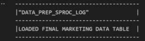

图 4.11 – 存储过程执行

以下部分将介绍如何查询存储过程生成的日志。

### 查询信息日志

由存储过程生成的日志可以从事件表中访问。通过运行以下查询可以访问从先前存储过程捕获的记录：

```py
session.sql("""
    SELECT RECORD['severity_text'] AS SEVERITY,
        VALUE AS MESSAGE
    FROM MY_EVENTS
    WHERE SCOPE['name'] = 'My_Logger'
    AND RECORD_TYPE = 'LOG'
""").show()
```

我们通过在作用域中指定它来仅过滤从`My_Logger`捕获的日志。查询返回以下记录，这些记录是从执行存储过程生成的：

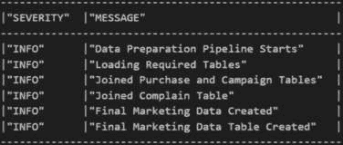

图 4.12 – 查询日志

在下一节中，我们将设置日志以捕获错误消息并处理 Snowpark 中的异常。

## 在 Snowpark 中处理异常

异常处理对于数据管道至关重要，因为它有助于识别和处理问题。可以通过捕获`try`块内部抛出的异常并捕获这些错误日志来完成异常处理。在捕获异常时，通常使用`ERROR`和`WARN`日志级别，而致命问题则记录在`FATAL`级别。本节将探讨捕获错误日志和在管道上处理异常。

### 捕获错误日志

我们将修改数据转换存储过程以捕获错误日志并添加异常处理：

```py
def data_transform(session: Session):
    try:
        ## Initializing Logger
        logger = logging.getLogger("Data_Transform_Logger")
        logger.info("Data Transformation Pipeline Starts")
        ## Pivoting Process
        marketing_final = session.table("FINAL_MARKETING_DATA")
        market_subset = marketing_final.select("EDUCATION", \
            "MARITAL_STATUS","INCOME")
        market_pivot = market_subset.pivot("EDUCATION", \
            ["Graduation","PhD","Master","Basic","2n Cycle"]
        ).sum("INCOME")
        #### Writing Transformed Data To New Table
        market_pivot.write.save_as_table("MAREKTING_PIVOT")
        logger.log("MARKETING PIVOT TABLE CREATED")
        return "CREATED MARKETING PIVOT TABLE"
    except Exception as err:
        logger.error("Logging an error from Python handler: ")
        logger.error(err)
        return "ERROR"
```

数据转换逻辑被移动到`try`块中，并启动了一个名为`Data_Transform_Logger`的记录器。代码引发的异常被捕获在定义为`err`的异常对象中。然后通过`ERROR`日志级别将这些记录在事件表中。现在我们将在此存储过程中注册 Snowpark：

```py
## Register Stored Procedure in Snowflake
### Add packages and data types
from snowflake.snowpark.types import StringType
session.add_packages('snowflake-snowpark-python')
### Upload Stored Procedure to Snowflake
session.sproc.register(
    func = data_transform
  , return_type = StringType()
  , input_types = []
  , is_permanent = True
  , name = 'DATA_TRANSFORM_SPROC_LOG_ERROR'
  , replace = True   , stage_locations = "@MY_STAGE" )
```

我们将故意执行存储过程以记录错误。可以通过运行以下命令来触发存储过程：

```py
session.sql(''' Call DATA_TRANSFORM_SPROC_LOG_ERROR()''').show()
```

存储过程已引发异常，错误已记录在事件表中：

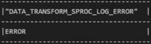

图 4.13 – 错误执行

以下部分将涵盖查询由存储过程生成的错误日志。

### 查询错误日志

前一个存储过程生成的错误日志记录在`Data_Transform_Logger`记录器下，可以通过过滤查询以返回特定于记录器的日志来访问。以下查询可以执行以从事件表中获取记录：

```py
session.sql("""
    SELECT RECORD['severity_text'] AS SEVERITY,VALUE AS MESSAGE
    FROM MY_EVENTS
    WHERE SCOPE['name'] = 'Data_Transform_Logger'
    AND RECORD_TYPE = 'LOG'
""").collect()
```

作用域名称被过滤为`Data_Transform_Logger`以获取结果，由异常引起的错误在`SEVERITY`下记录为`ERROR`：

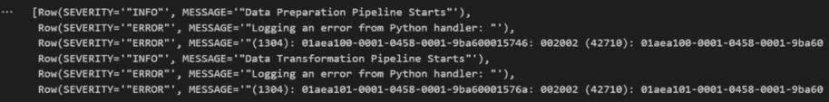

图 4.14 – 错误日志消息

Snowpark 通过支持通过事件表记录错误和异常处理来简化调试。以下部分将涵盖事件跟踪以及如何在 Snowpark 中捕获跟踪信息。

## 在 Snowpark 中设置跟踪

跟踪事件是在代码中发生某些事情时捕获的一种遥测数据类型。它有一个结构化有效负载，有助于通过聚合这些信息来分析跟踪，从而理解代码在高级别上的行为。当程序或函数执行时，会发出跟踪事件，这些事件在活动事件表中可用。

捕获事件的第一步是通过在 Snowpark 会话中设置跟踪级别来启用跟踪功能。会话中的跟踪级别可以通过运行以下代码来设置：

```py
session.sql("ALTER SESSION SET TRACE_LEVEL = ALWAYS;").show()
```

在下一节中，我们将探讨如何捕获跟踪信息。

### 捕获跟踪信息

可以使用开源 Snowflake `telemetry` Python 包捕获跟踪，该包可在 Anaconda Snowflake 频道中找到。需要将包导入到代码中，并在 Snowpark 中执行。可以通过在 Snowpark 处理器中包含以下代码来导入 `telemetry` 包：

```py
from snowflake import telemetry
```

`telemetry` 包帮助捕获在代码上生成并记录到事件表中的跟踪信息。我们将通过添加遥测事件来修改数据清理程序以捕获跟踪：

```py
def data_cleanup(session: Session):
    #### Loading Telemetry Package
    from snowflake import telemetry
    #### Loading Required Tables
    market_pivot = session.table("MARKETING_PIVOT")
    #### Adding Trace Event
    telemetry.add_event("data_cleanup", \
        {"table_name": "MARKETING_PIVOT", \
         "count": market_pivot.count()})
    #### Dropping Null
    market_drop_null = market_pivot.dropna(thresh=5)
    #### Writing Cleaned Data To New Table
    market_drop_null.write.save_as_table("MARKET_PIVOT_CLEANED")
    #### Adding Trace Event
    telemetry.add_event("data_cleanup", \
        {"table_name": "MARKET_PIVOT_CLEANED", \
         "count": market_drop_null.count()})
    return "CREATED CLEANED TABLE"
###########################################################
## Register Stored Procedure in Snowflake
### Add packages and data types
from snowflake.snowpark.types import StringType
session.add_packages('snowflake-snowpark-python', \
    'snowflake-telemetry-python')
### Upload Stored Procedure to Snowflake
session.sproc.register(
    func = data_cleanup
  , return_type = StringType()
  , input_types = []
  , is_permanent = True
  , name = 'DATA_CLEANUP_SPROC_TRACE'
  , replace = True
  , stage_location = '@MY_STAGE'
)
```

程序现在已准备好执行。我们正在传递捕获在跟踪上的属性。可以通过运行以下代码来执行程序：

```py
session.sql(''' Call DATA_CLEANUP_SPROC_TRACE()''').show()
```

程序执行，数据从表中清理：

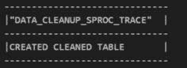

图 4.15 – 数据清理程序执行

跟踪信息现在在事件表中生成。我们可以直接查询事件表以获取跟踪信息。

### 查询跟踪

生成的跟踪可以从事件表中访问。可以通过运行以下查询访问从先前存储过程捕获的跟踪：

```py
session.sql("""
    SELECT
        TIMESTAMP as time,
        RESOURCE_ATTRIBUTES['snow.executable.name']
            as handler_name,
        RESOURCE_ATTRIBUTES['snow.executable.type']
            as handler_type,
        RECORD['name'] as event_name,
        RECORD_ATTRIBUTES as attributes
    FROM
        MY_EVENTS
    WHERE
        EVENT_NAME ='data_cleanup'
""").show(2)
```

我们使用 `data_cleanup` 事件名称进行查询。这返回了代码执行时捕获的两个跟踪：

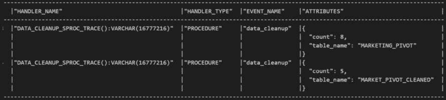

图 4.16 – 跟踪捕获信息

我们可以看到从存储过程的执行中捕获的属性。在清理了 `NULL` 值之后，详细信息返回了总数据计数，包括 `NULL` 和 `count` 值。

## 日志和跟踪的比较

以下表格比较了日志和跟踪，并列出了使用每种情况的场景：

| **特性** | **日志条目** | **跟踪事件** |
| --- | --- | --- |
| 预期用途 | 记录关于代码状态的详细但非结构化信息。使用这些信息来了解函数或过程特定调用期间发生了什么。 | 记录每次代码调用的简短但结构化摘要。聚合这些信息以了解代码在高级别上的行为。 |
| 结构作为有效载荷 | 无。日志条目只是一个字符串。 | 结构化，可以附加到跟踪事件上的属性。属性是键值对，可以很容易地通过 SQL 查询进行查询。 |
| 支持分组 | 否。每个日志条目都是一个独立的事件。 | 是。跟踪事件组织成跨度。一个跨度可以有自己的属性。 |
| 数量限制 | 无限制。你代码发出的所有日志条目都会被摄入到事件表中。 | 每个跨度中的跟踪事件数量限制为 128。跨度属性的数量也有限制。 |
| 对记录数据的查询复杂度 | 相对较高。您的查询必须解析每个日志条目以从中提取有意义的信息。 | 相对较低。您的查询可以利用跟踪事件的有序性质。 |

表 4.3 – 日志和跟踪之间的差异

日志和跟踪有助于调试 Snowpark，并且是高效 DataOps 的实用功能。

# 摘要

在本章中，我们详细介绍了在 Snowpark 中构建和部署具有弹性的数据管道，以及如何使用事件表启用日志记录和跟踪。通过程序化 ELT 方法以及日志记录和跟踪等特性，Snowpark 支持现代数据管道的开发，这使得开发者能够轻松实现 DataOps。我们还介绍了如何使用任务和任务图进行调度和部署管道。

在下一章中，我们将介绍如何使用 Snowpark 开发数据科学工作负载。
