# 使用 Snowpark 开发数据科学项目

云技术的出现引领了一个新的可能性时代。随着数据云的出现，一个统一数据存储、处理和分析的强大平台，数据科学家有许多机会探索、分析和从大量数据集中提取有意义的见解。在这个错综复杂的数字领域，Snowpark 这一前沿数据处理框架的作用变得至关重要。本章作为一本指导性的指南，深入探讨了使用 Snowpark 开发数据科学项目，揭示了其复杂性，并最大限度地利用了其潜力。

在本章中，我们将涵盖以下主要主题：

+   数据科学在数据云中

+   探索和准备数据

+   在 Snowpark 中训练**机器学习**（**ML**）模型

# 技术要求

为了本章，你需要一个活跃的 Snowflake 账户，并在本地安装了 Anaconda 的 Python。你可以在[`signup.snowflake.com/`](https://signup.snowflake.com/)注册 Snowflake 试用账户。

要配置 Anaconda，请遵循[`conda.io/projects/conda/en/latest/user-guide/getting-started.html`](https://conda.io/projects/conda/en/latest/user-guide/getting-started.html)。

此外，要安装和设置 VS Code 中的 Python，请遵循[`code.visualstudio.com/docs/python/python-tutorial`](https://code.visualstudio.com/docs/python/python-tutorial)。

要了解如何在 VS Code 中操作 Jupyter Notebook，请访问[`code.visualstudio.com/docs/datascience/jupyter-notebooks`](https://code.visualstudio.com/docs/datascience/jupyter-notebooks)。

本章的支持材料可在本书的 GitHub 存储库中找到，网址为[`github.com/PacktPublishing/The-Ultimate-Guide-To-Snowpark`](https://github.com/PacktPublishing/The-Ultimate-Guide-To-Snowpark)。

# 数据科学在数据云中

数据科学在数据云生态系统中超越了传统边界，提供了一个数据科学家可以利用分布式计算和高级分析能力的动态环境。通过能够无缝集成各种数据源，包括结构化和非结构化数据，数据云提供了一个数据探索和实验环境。我们将从这个部分开始，简要回顾数据科学和机器学习。

## 数据科学和机器学习概念

数据科学和机器学习已经迅速成为技术创新和商业创新的先锋，成为几乎所有行业中决策、战略规划和产品开发的核心组成部分。它们目前受欢迎和影响力的旅程是对多个因素的证明，包括技术的进步、数据的爆炸性增长以及可用计算能力的增加。本节将简要讨论数据科学和机器学习概念。

### 数据科学

数据科学是一个多学科领域，它依赖于各种软件工具、算法和机器学习（ML）原则，从大量数据集中提取有价值的见解。数据科学家在收集、转换和将数据转化为预测性和规范性见解方面发挥着关键作用。通过采用复杂技术，数据科学揭示了数据中的隐藏模式和有意义的关联，使企业能够基于经验证据做出明智的决策。

### 人工智能

**人工智能**（**AI**）包括创建能够自主处理信息和生成结果的智能机器和卓越计算机程序的科学和工程。人工智能系统旨在使用逻辑和推理解决复杂问题，类似于人类的认知过程。这些系统自主运行，旨在在决策和问题解决任务中模仿人类智能。

### 机器学习

机器学习（ML），作为人工智能（AI）的一个子集，涉及将专用算法集成到数据科学工作流程中。这些算法是精心设计的软件程序，旨在检测数据中的模式、识别相关性以及定位异常。机器学习算法擅长根据现有数据进行预测，并在遇到新数据和情境时不断学习和提高其准确性。与人类不同，机器学习算法可以处理数千个属性和特征，从而在庞大的数据集中发现独特的组合和相关性。这种能力使得机器学习在从大量数据集中提取有价值的见解和预测方面变得不可或缺。

现在我们已经明确了术语，我们将讨论数据云范式如何帮助组织的数据科学和机器学习（ML）的发展。

## 数据云范式

云端数据科学代表了数据驱动见解的获取和应用方式的范式转变。在这种创新方法中，数据科学流程、工具和技术无缝集成到云端，使组织能够利用可扩展基础设施和高级分析的力量。

这一范式的核心是数据云，这是一个超越传统数据存储和处理限制的动态生态系统。数据云范式代表了从传统数据孤岛到统一平台的地震式转变，其中结构化和非结构化数据无缝融合。通过分布式计算、并行处理和强大的数据管理，数据云为数据科学革命奠定了基础。赋予数据科学家能力的功能和工具无缝集成，并设计用于处理数据云内各种数据类型和分析工作负载。因此，数据云为运行数据科学和机器学习工作负载提供了各种优势。

### 数据云对数据科学的优势

Snowflake 的 Data Cloud 的一个关键优势是能够在没有硬件限制的约束下存储和处理大量数据。它提供了一个可扩展的解决方案来处理大量数据，使数据科学家能够在不担心计算或存储限制的情况下处理大量数据集。基于云的界面为数据科学家和分析师提供了一个协作和灵活的环境，并内置了协作功能、版本控制和通过 Snowpark 支持流行的数据科学库和框架。

此外，Data Cloud 通过管理服务提供了一系列针对数据科学任务定制的服务和资源，简化了这些流程，从数据摄取和准备到机器学习模型训练和部署。例如，可以使用无服务器计算自动化数据管道，机器学习模型可以在强大的 GPU 实例上训练，从而实现更快的实验和迭代。数据安全和合规性在数据科学中至关重要，尤其是在处理敏感信息时，Data Cloud 提供了不同的安全措施，包括加密、访问控制和行级策略，确保数据科学家可以以安全和合规的方式处理敏感数据，遵守行业法规和组织政策。Snowpark 框架是 Snowflake Data Cloud 的核心，以支持这些功能。下一节将讨论为什么使用 Snowpark 进行数据科学和机器学习。

## 为什么选择 Snowpark 进行数据科学和机器学习？

Snowpark 为数据工程师提供了无与伦比的集成能力，使他们能够无缝地与存储在大量和不同格式中的数据交互。其多功能的 API 简化了数据探索、转换和处理，为数据科学模型和机器学习开发奠定了坚实的基础，并赋予数据科学家充分利用其分析工作流程的潜力。数据科学团队现在可以专注于他们的核心任务，而无需烦恼于基础设施或环境维护。

Snowpark 在可扩展性和性能方面表现出色，这对于企业数据科学和机器学习工作负载至关重要；利用 Snowflake 的分布式架构以非凡的效率处理大量数据集和复杂计算，以及并行化处理任务和将工作负载分配到多个节点的能力，确保了闪电般的执行速度，即使在处理 PB 级数据时也是如此。这些功能与 Snowflake 的自动优化功能相结合，使数据科学家能够专注于他们的分析，而不受基础设施限制的负担。

Snowpark 提供了一系列高级分析能力，对于数据科学和 ML 任务是不可或缺的。从统计分析到预测建模、地理空间分析，甚至数据挖掘，它为数据科学家提供了一套全面的工具包，以探索复杂模式并提取宝贵见解。其对 ML 库和算法的支持进一步增强了其效用，使得能够开发用于分类、回归和聚类的复杂模型。凭借之前提到的丰富特性和功能，Snowpark 为数据科学和 ML 工作负载提供了许多好处。在下一节中，我们将探索 Snowpark ML 库及其不同的功能。

## Snowpark ML 简介

Snowpark 是 Snowflake 内部各种库和运行时的汇编，通过包含 Python 等语言，并在 Snowflake 基础设施中服务器端执行的代码执行，同时利用虚拟仓库，简化了非 SQL 代码的安全部署和处理。Snowpark 库的最新增补是 Snowpark ML。Snowpark ML 代表了 Snowflake 强大的数据处理能力与 ML 变革潜力的突破性融合。随着数据科学的前沿不断扩展，Snowpark ML 作为一个前沿框架出现，旨在赋予数据专业人士在 Snowflake 云环境中充分利用其数据的权力。

在其核心，Snowpark ML 被设计用来促进 Snowflake 的数据处理能力与高级 ML 技术之间的无缝集成。借助 Snowpark ML，数据科学家、分析师和工程师可以直接在 Snowflake 中利用熟悉的编程语言和库来开发复杂的 ML 模型。这种集成消除了数据存储、处理和建模之间的障碍，简化了端到端的数据科学工作流程。Snowpark ML 催化创新，使数据专业人士能够高效地探索、转换和建模数据。通过弥合数据处理与 ML 之间的差距，Snowpark ML 赋予组织在数字时代基于数据做出决策、发现宝贵见解并推动业务增长的权力。以下图显示了 Snowpark ML 框架：

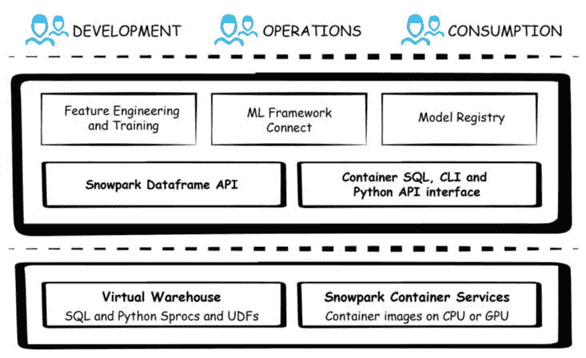

图 5.1 – Snowpark ML

上述架构由各种协同工作的组件组成。我们将在下一节中更详细地查看这些组件。

### Snowpark ML API

与帮助操作数据的 Snowpark DataFrame 类似，Snowpark ML 提供 API 作为名为`snowflake-ml`的 Python 库，以支持 ML 开发与部署的每个阶段，允许在 Snowflake 中支持预处理数据、训练、管理和部署 ML 模型：

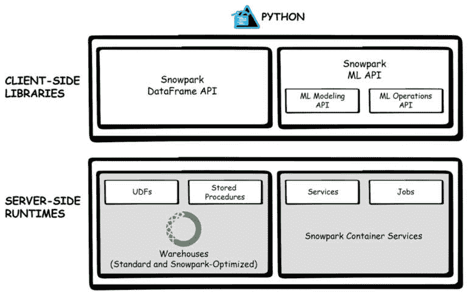

图 5.2 – Snowpark ML API

Snowpark 机器学习 API 包括用于开发和训练模型的 Snowpark 机器学习建模以及用于监控和操作模型的 Snowpark 机器学习操作。`snowflake.ml.modeling`模块提供了基于熟悉库（如 scikit-learn 和 XGBoost）的 API，用于预处理、特征工程和模型训练。完整的端到端机器学习体验可以使用 Snowpark 完成。我们将在下一节中介绍这一点。

## 使用 Snowpark 的端到端机器学习

寻求无缝、端到端的机器学习解决方案已成为当务之急，Snowpark 为端到端机器学习提供了一个全面的生态系统。本节将深入探讨利用 Snowpark 构建端到端机器学习管道的复杂世界，从数据摄取和预处理到模型开发、训练和部署，揭示在 Snowflake 强大框架内开发机器学习的无缝流程。

机器学习过程涉及通过数据处理解决复杂问题的系统方法。这通常包括定义问题、收集和准备数据、**探索性数据分析（EDA**）、特征工程、模型选择、训练、评估和部署等阶段，每个操作都至关重要且是迭代的。它允许数据科学家根据沿途获得的见解来完善他们的方法。这个过程通常是循环的，不断迭代以改进模型和预测：

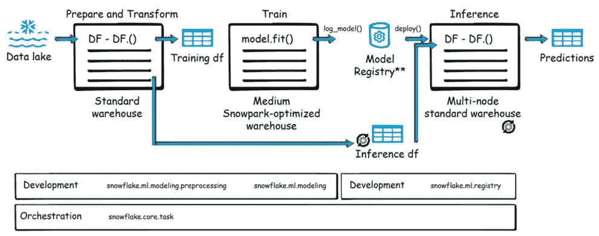

图 5.3 – 端到端机器学习流程

我们可以将机器学习阶段大致分为准备和转换、训练和构建模型以及干扰模型以获得预测结果。我们将在下面讨论这些步骤。

### 准备和转换数据

原始数据通常很杂乱，包含缺失值、异常值和不一致性。从多个系统中获取正确数据通常消耗了数据科学家的大部分时间。Snowflake 通过提供支持所有类型数据的受管数据云范式来解决此问题，该范式提供了一个统一的地方来即时存储和消费相关数据，以释放机器学习模型的力量。数据准备和转换过程包括数据探索分析（EDA）、清理和处理，并以特征工程结束。这一步骤还包括数据工程管道，它有助于应用数据转换，为下一步准备数据。对于数据预处理，可以使用`snowflake.ml.modeling`、预处理和 Snowpark 函数来转换数据。

#### 数据探索分析（EDA）

EDA（探索性数据分析）是一个关键步骤，涉及初步调查以了解数据的结构、模式和趋势，因为它有助于揭示隐藏的模式并指导特征选择。数据科学家和分析师与业务利益相关者紧密合作，定义需要回答的具体问题或需要解决的问题，这指导他们选择相关数据。通过图表、图形和统计摘要，数据科学家可以在数据集中识别模式、趋势、相关性和异常值，所有这些都为数据的分布提供了宝贵的见解，并帮助他们更好地理解数据以进行特征选择。

#### 数据清洗和预处理

数据清洗涉及处理缺失数据、纠正错误和确保一致性。通过预处理技术，如归一化、缩放和变换，以及各种采样技术，数据适用于训练模型，这些采样技术应用于评估数据子集，提供对其丰富性和变异性的见解。

#### 特征工程

特征工程涉及创建新特征或修改现有特征以增强机器学习模型的性能。这需要领域专业知识来识别可以提高预测准确性的相关特征。在 Snowflake 中对集中数据进行特征工程可以加速模型开发，降低成本，并使新特征得以重复使用。一些技术，如创建交互项和变换变量，可以从原始数据中提取有意义的信息，使其对建模更具信息量。

### 训练和构建模型

一旦数据准备就绪且特征已构建，下一步就是训练和开发模型。在这个阶段，数据科学家根据问题的性质，通过将数据子集或训练集传递给建模函数来推导预测函数，训练各种模型，如回归、分类、聚类或深度学习。模型的开发使用假设检验和推断统计的统计方法。根据数据，还使用了高级技术，如集成方法、神经网络和自然语言处理。

一旦模型已经开发，它将在训练集之外的数据上进行测试，以确定其有效性，这通常以预测强度和鲁棒性来衡量，并通过超参数调整对模型进行优化。交叉验证技术优化模型性能，确保准确预测和有价值的见解。

这些步骤的组合使数据科学家能够进行深入的特征工程，调整超参数，并迭代创建和评估机器学习模型。随着数据科学家对各种算法进行实验，评估每个模型的性能，并在所选模型上调整参数以优化针对其特定数据集的代码，直觉变成了准确的预测。`snowflake.ml.modeling` 可以通过使用 XGBoost 等算法的 `fit()` 方法进行训练。

### 推理

一旦模型被训练，Snowpark ML 支持它们的无缝部署和推理。模型可以用于推理，使组织能够根据预测洞察力做出数据驱动的决策。Snowpark ML 有一个模型注册表来管理和组织 Snowpark 模型在其生命周期中的所有阶段。模型注册表支持模型的版本控制，并存储有关模型、超参数和评估指标元数据信息，从而促进实验和模型比较。它还支持模型监控和审计，并有助于在从事模型工作的数据科学家之间进行协作。模型注册表是 Snowpark MLOps 的一部分，可以通过 `snowpark.ml.registry` 访问。可以使用 Snowflake Tasks 来编排管道。

现在我们已经建立了 Snowpark ML 的基础、其在机器学习中的位置以及 Snowpark 如何支持数据科学工作负载，我们将深入探讨 Snowpark 的完整数据科学场景。下一节将专注于探索和准备数据。

关于数据工程的说明

在下一节中，我们将使用 Snowpark Python 和 pandas 进行探索、转换和特征工程。随着我们使用 SnowparkML 构建模型，我们将结合本节前面讨论的一些步骤。

# 探索和准备数据

在机器学习过程的第一个步骤中，我们必须使用 Snowpark 在 Snowflake 中探索和准备数据，使其可用于训练机器学习模型。我们将使用 Kaggle 的共享单车数据集，该数据集提供了两年内租赁数据的每小时记录。主要目标是仅基于租赁期之前的信息，预测特定时间段内每小时租赁的自行车数量。本质上，该模型将利用历史数据，通过 Snowpark 预测未来的自行车租赁模式。有关特定数据集的更多信息已在相应的 GitHub 仓库中提供（[`github.com/PacktPublishing/The-Ultimate-Guide-To-Snowpark`](https://github.com/PacktPublishing/The-Ultimate-Guide-To-Snowpark)）。

数据探索使我们能够剖析数据，揭示可能否则隐藏的复杂细节，这为我们整个分析奠定了基础。我们将通过将数据集加载到 Snowpark DataFrame 中开始这个过程：

```py
df_table=session.table("BSD_TRAINING")
```

一旦数据成功加载，接下来的关键任务是全面了解数据集的规模：

```py
number_of_rows = df_table.count()
number_of_columns = len(df_table.columns)
```

幸运的是，Snowpark 提供了专门设计来简化这一关键任务的函数：


图 5.4 – 列总数

现在我们知道了数据的大小，让我们通过查看数据集的几行来对其有一个直观的了解：

```py
df_table.sample(n=2).show()
```

这将返回用于分析的数据的两行：

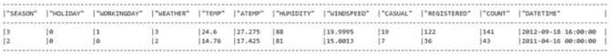

图 5.5 – 两行数据

如前图所示，`COUNT`列是`CASUAL`和`REGISTERED`的直接聚合。在数据科学中，这类变量通常被称为“泄漏变量”。当我们构建模型时，我们将深入探讨管理这些变量的策略。日期列始终是一个引人入胜且复杂的类别，需要我们应对。在此数据集中，我们可以从`DATETIME`列中创建有价值的新的特征，这可能会显著影响我们的响应变量。在我们开始数据清洗和特征工程过程之前，让我们查看列类型，以便更好地理解和做出更明智的决策：

```py
import pprint
data_types = df_table.schema
data_types = df_table.schema.fields
pprint.pprint(data_types)
```

这将给出每个字段的架构和数据类型，以便我们更好地理解数据：

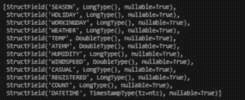

图 5.6 – 架构信息

现在我们已经具备了关于数据的基本信息，让我们开始寻找数据中的缺失值。

## 缺失值分析

在机器学习中，处理缺失值是一个基本的预处理步骤。不完整的数据可能会干扰模型训练并阻碍预测准确性，可能导致错误的结论或次优性能。通过系统地填充或填补这些空白，我们可以增强数据集的完整性，为机器学习算法提供更全面和一致的数据集，以便进行更稳健和可靠的分析和预测。这种做法类似于为我们提供模型所需的信息，以便做出明智的数据驱动决策。让我们检查数据集中是否存在任何缺失值：

```py
from snowflake.snowpark.functions import count, col
data_types = df_table.schema
print(data_types)
for column in df_table.columns:
    print(f"Null values in {column} is {number_of_rows - df_table.agg(count(col(column))).collect()[0][0]}")
```

上述代码帮助我们找出是否有任何值为空或缺失：

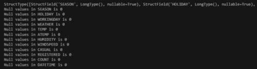

图 5.7 – 缺失值分析

我们对列中缺失值的初步检查显示，我们的数据集中没有缺失值。然而，更仔细的检查揭示了`WINDSPEED`列中存在许多 0，这表明可能存在缺失值。从逻辑上讲，风速不可能等于零，这意味着列中的每个`0`都表示一个缺失值：

```py
print(f"Zero Values in windspeed column is {df_table.filter(df_table['WINDSPEED']==0).count()}")
```

这将输出以下内容：


图 5.8 – 输出值

我们可以看到 `WINDSPEED` 列中有 `1313` 个值。由于该列包含缺失数据，接下来的挑战是确定一个有效的策略来填充这些缺失值。正如广泛认可的，存在各种方法来解决列中的缺失数据。在我们的案例中，我们将采用一种简单的填充方法，用列的平均值替换 0：

```py
from snowflake.snowpark.functions import iff, avg
wind_speed_mean = df_train.select(mean("windspeed")).collect()[0][0]
df_train = df_train.replace({0:wind_speed_mean}, subset=["windspeed"])
df_train.show()
df_train.write.mode("overwrite").save_as_table("model_data")
```

上一段代码用列的平均值替换了 0：

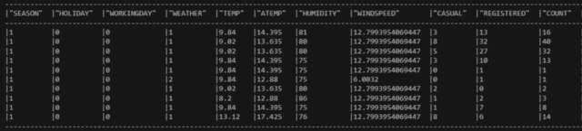

图 5.9 – 预处理数据

这标志着我们的预处理之旅结束。接下来，我们将执行异常值分析。

## 异常值分析

检测和移除异常值是提高模型准确性和鲁棒性的关键步骤。异常值是与大多数数据集显著偏离的数据点，通常源于错误、异常或罕见事件。这些偏差可能会不当地影响模型训练，导致预测偏差或降低泛化能力。通过识别和消除异常值，我们可以提高模型的质量和可靠性，并确保它们能够更好地从数据中辨别出有意义的模式。这种做法促进了更准确的预测和更高的弹性，最终有助于机器学习项目的整体成功。

我们将把 DataFrame 转换为 pandas DataFrame，以便我们可以进行有洞察力的分析，包括构建可视化来提取有意义的模式。我们的初步重点是 `COUNT` 列作为响应变量。在模型开发之前，确定 `COUNT` 列是否包含任何异常值至关重要：

```py
import seaborn as sns
import matplotlib.pyplot as plt
f, axes = plt.subplots(1, 2)
sns.boxplot(x=df_table.to_pandas()['COUNT'], ax=axes[0])
sns.boxplot(x=df_without_outlier.to_pandas()['COUNT'], ax=axes[1])
plt.show()
```

上一段代码使用 `seaborn` 和 `matplotlib` 库生成一个图表，帮助我们找到异常值：

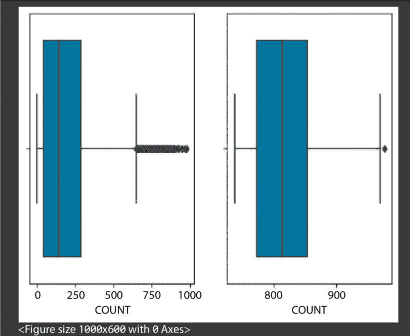

图 5.10 – 异常值图

如我们所见，`COUNT` 列显示出可能对模型性能产生负面影响且未得到充分处理的异常数据点。缓解异常值是一个关键的前处理步骤。一种广泛采用的方法是移除位于预定义阈值或允许范围之外的数据点，如下所述：

```py
from snowflake.snowpark.functions \
    import mean, stddev, abs, date_part
mean_value = df_table.select(mean("count")).collect()[0][0]
print(mean_value)
std_value = df_table.select(stddev("count")).collect()[0][0]
print(std_value)
df_without_outlier = df_table.filter(
    (abs(df_table["count"] - mean_value)) >= (3 * std_value))
df_without_outlier.show()
```

上一段代码使用 Snowpark 库分析存储在 `df_table` 中的数据集。它计算数据集中 `'count'` 列的平均值（平均）和标准差（数据分散程度的度量）。然后，它识别并从数据集中移除异常值。异常值是与平均值显著不同的数据点。在这种情况下，它将异常值定义为与平均值相差超过三个标准差的数据点。在识别这些异常值之后，它使用 `df_without_outlier.show()` 显示没有异常值的数据集，以帮助进行进一步分析：

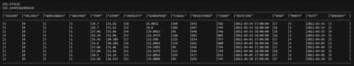

图 5.11 – 移除异常值

现在我们已经处理了异常值，我们可以进行相关性分析。

## 相关性分析

识别变量之间的相关性对于几个至关重要的原因至关重要。相关性提供了关于数据集中不同特征如何相互关联的宝贵见解。通过理解这些关系，机器学习模型可以做出更明智的预测，因为它们利用相关性的强度和方向来揭示模式和依赖关系。此外，识别和量化相关性有助于特征选择，其中不相关或高度相关的特征可以被排除，以提高模型效率和可解释性。它还有助于识别潜在的共线性问题，其中两个或更多特征高度相关，导致模型系数不稳定。认识和利用相关性使机器学习模型能够做出更好的预测并产生更稳健的结果，使其成为建模的基本方面。

```py
Chapter_5.ipynb:
```

```py
corr_matrix = df_without_outlier.to_pandas().corr()
plt.figure(figsize=(12, 6))
sns.heatmap(corr_matrix, cmap='coolwarm', annot=True)
```

上一段代码生成了相关矩阵的热图可视化：

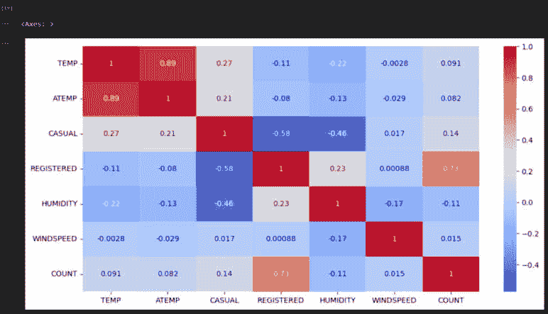

图 5.12 – 相关矩阵热图

此热图可视化揭示了`TEMP`和`ATEMP`变量之间存在显著的关联性，这表明了一种称为共线性的条件。当模型中的两个或多个预测变量高度相关时，就会发生共线性，这会扭曲模型的解释性和稳定性。为了减轻这个问题并确保我们分析的可信度，我们选择保留`TEMP`变量，同时在后续的建模工作中排除`ATEMP`的考虑。这个战略决策是为了保持模型稳健性并有效地捕捉数据的本质，而不受共线性干扰的影响。

## 泄露变量

数据科学中的**泄露变量**无意中包含了在现实世界的预测或决策过程中不可用的信息。消除它们至关重要，因为使用泄露变量可能导致模型性能过于乐观和结果不可靠。在数据预处理期间检测和排除这些变量是至关重要的，以确保我们的模型基于可访问的相同信息进行预测。通过这样做，我们防止了构建在历史数据上表现良好但在现实世界情况下无法执行的模型的风险，这是数据科学的一个关键目标。

如前所述，`CASUAL`、`REGISTERED`和`COUNT`列表现出高度共线性，其中`COUNT`是`CASUAL`和`REGISTERED`的显式求和。这种冗余使得包含所有三个变量不可取，导致泄漏变量情况。为了保持我们的模型构建过程的完整性，我们将从特征集中消除`CASUAL`和`REGISTERED`，从而减轻任何潜在的混淆效应，并确保模型能够基于最相关和非冗余的信息进行预测。下一步是对准备好的数据进行特征工程。

## 特征工程

在机器学习中，**特征工程**就像为特定工作制作完美的工具。它涉及从可用数据中选择、转换或创建新的特征（变量），使其更适合机器学习算法。这个过程至关重要，因为它有助于模型更好地理解数据中的模式和关系，从而提高预测和洞察力。通过精心设计特征，我们可以揭示隐藏信息，减少噪声，并提高模型性能，使其在构建有效和准确的机器学习系统中成为关键步骤。

分析数据表明，`DATETIME`列是此数据集中特征工程的有希望的候选者。鉴于预测结果依赖于时间因素，如一天中的时间和一周中的某一天，推导出时间相关特征具有至关重要的意义。提取这些时间特征至关重要，因为它可以增强模型性能，并通过捕捉数据集材料特性的关键细微差别来提高整体预测准确性：

```py
from snowflake.snowpark.functions import hour, month,to_date,dayofweek
df_table = df_table.with_column("hour", hour("DATETIME"))
df_table = df_table.with_column("month", month("DATETIME"))
df_table = df_table.with_column("date", to_date("DATETIME"))
df_table = df_table.with_column("weekday", dayofweek("DATETIME"))
df_table.show()
```

之前的代码通过从`DATETIME`列中提取特定的时间和日期细节来丰富 DataFrame，创建新的列：

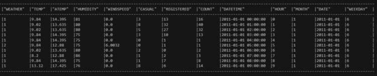

图 5.13 – DATETIME 数据

`hour`列告诉我们一天中的小时，`month`列识别月份，`date`列提取日期本身，而`weekday`列表示一周中的某一天。这些额外的列提供了对数据集中时间相关信息的更全面视角，增强了其深入分析和机器学习应用潜力。

这一步结束了我们的数据准备和探索之旅。下一节将使用这些准备好的数据，使用 Snowpark 构建和训练我们的模型。

关于模型构建过程的说明

在我们的模型构建过程中，我们不会包含迄今为止讨论的所有步骤。相反，我们将专注于两个重要的转换，以展示 Snowpark ML 管道。此外，附带的笔记本（**chapter_5.ipynb**）展示了使用 Python 的 scikit-learn 库进行模型构建以及如何将其作为存储过程调用。这将使您能够比较和对比通过 Snowpark ML 简化的模型构建过程。为了继续本章内容，您可以跳过使用 scikit-learn 部分进行模型构建的过程，直接进入笔记本中的 Snowpark ML 部分。

# 在 Snowpark 中训练 ML 模型

现在我们已经准备好了我们的数据集，我们旅程的巅峰就是模型构建过程，我们将利用 Snowpark ML 的力量。Snowpark ML 作为 Snowpark 工具箱中的最新成员，战略性地部署以简化模型构建过程的复杂性。当我们通过新颖的 ML 库进行模型构建过程的比较探索时，其优雅性变得显而易见。我们将首先开发我们将使用之前准备的数据来训练模型的管道：

```py
import snowflake.ml.modeling.preprocessing as snowml
from snowflake.ml.modeling.pipeline import Pipeline
import joblib
df = session.table("BSD_TRAINING")
df = df.drop("DATETIME","DATE")
CATEGORICAL_COLUMNS = ["SEASON","WEATHER"]
CATEGORICAL_COLUMNS_OHE = ["SEASON_OE","WEATHER_OE"]
MIN_MAX_COLUMNS = ["TEMP"]
import numpy as np
categories = {
    "SEASON": np.array([1,2,3,4]),
    "WEATHER": np.array([1,2,3,4]),
}
preprocessing_pipeline = Pipeline(
    steps=[
        (
            "OE",
            snowml.OrdinalEncoder(
                input_cols=CATEGORICAL_COLUMNS,
                output_cols=CATEGORICAL_COLUMNS_OHE,
                categories=categories
            )
        ),
        (
            "MMS",
            snowml.MinMaxScaler(
                clip=True,
                input_cols=MIN_MAX_COLUMNS,
                output_cols=MIN_MAX_COLUMNS,
            )
        )
    ]
)
PIPELINE_FILE = 'preprocessing_pipeline.joblib'
joblib.dump(preprocessing_pipeline, PIPELINE_FILE)
transformed_df = preprocessing_pipeline.fit(df).transform(df)
transformed_df.show()
session.file.put(PIPELINE_FILE,"@snowpark_test_stage",overwrite=True)
```

上述代码通过使用各种 Snowpark ML 函数为数据集创建预处理管道。导入`preprocessing`和`pipeline`模块，因为这些是开发和训练模型所必需的：

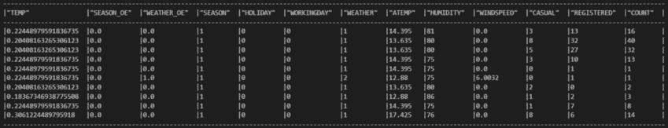

图 5.14 – 转换后的数据

管道包括对分类列（`SEASON`和`WEATHER`）进行顺序编码，对数值列（`TEMP`）进行 min-max 缩放。该管道使用`joblib`库保存到阶段，可用于未来分析的持续预处理。现在我们已经准备好了管道代码，我们将构建模型所需的特征：

```py
CATEGORICAL_COLUMNS = ["SEASON","WEATHER"]
CATEGORICAL_COLUMNS_OHE = ["SEASON_OE","WEATHER_OE"]
MIN_MAX_COLUMNS = ["TEMP","ATEMP"]
FEATURE_LIST = \
    ["HOLIDAY","WORKINGDAY","HUMIDITY","TEMP","ATEMP","WINDSPEED"]
LABEL_COLUMNS = ['COUNT']
OUTPUT_COLUMNS = ['PREDICTED_COUNT']
PIPELINE_FILE = 'preprocessing_pipeline.joblib'
preprocessing_pipeline = joblib.load(PIPELINE_FILE)
```

上述代码定义了表示分类列的列表、单热编码的分类列和用于 min-max 缩放的列。它还指定了 ML 模型的特征列表、标签列和输出列。加载了`preprocessing_pipeline.joblib`文件，并假设它包含之前保存的预处理管道。这些元素共同准备后续 ML 任务所需的数据和配置，确保对分类变量、特征缩放和基于预先建立的管道进行模型预测的一致处理。我们现在将数据分为训练集和测试集：

```py
bsd_train_df, bsd_test_df = df.random_split(
    weights=[0.7,0.3], seed=0)
train_df = preprocessing_pipeline.fit(
    bsd_train_df).transform(bsd_train_df)
test_df = preprocessing_pipeline.transform(bsd_test_df)
train_df.show()
test_df.show()
```

上述代码使用随机分割将数据集分为训练集（70%）和测试集（30%）。它应用之前定义的预处理管道来转换这两个集合，显示转换后的训练集和测试集，并确保模型训练和评估的预处理一致性。输出显示了不同的训练和测试数据：

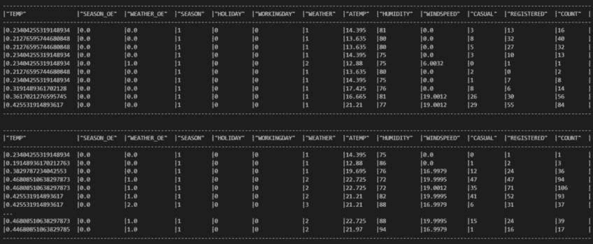

图 5.15 – 训练和测试数据集

接下来，我们将使用训练数据训练模型：

```py
from snowflake.ml.modeling.linear_model import LinearRegression
regressor = LinearRegression(
    input_cols=CATEGORICAL_COLUMNS_OHE+FEATURE_LIST,
    label_cols=LABEL_COLUMNS,
    output_cols=OUTPUT_COLUMNS
)
# Train
regressor.fit(train_df)
# Predict
result = regressor.predict(test_df)
result.show()
```

`LinearRegression` 类定义了模型，指定了输入列（一热编码后的分类列和附加特征）、标签列（目标变量，即 `COUNT`）和预测输出列。模型使用 `fit` 在转换后的训练数据集上训练，然后使用 `predict` 对转换后的测试数据集生成预测。显示的结果预测了模型在测试数据上的性能：

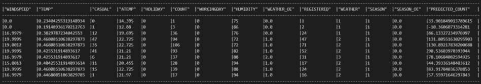

图 5.16 – 预测输出

下一步是计算各种性能指标以评估线性回归模型预测的准确性：

```py
from snowflake.ml.modeling.metrics import mean_squared_error, explained_variance_score, mean_absolute_error, mean_absolute_percentage_error, d2_absolute_error_score, d2_pinball_score
mse = mean_squared_error(df=result,
    y_true_col_names="COUNT",
    y_pred_col_names="PREDICTED_COUNT")
evs = explained_variance_score(df=result,
    y_true_col_names="COUNT",
    y_pred_col_names="PREDICTED_COUNT")
mae = mean_absolute_error(df=result,
    y_true_col_names="COUNT",
    y_pred_col_names="PREDICTED_COUNT")
mape = mean_absolute_percentage_error(df=result,
    y_true_col_names="COUNT",
    y_pred_col_names="PREDICTED_COUNT")
d2aes = d2_absolute_error_score(df=result,
    y_true_col_names="COUNT",
    y_pred_col_names="PREDICTED_COUNT")
d2ps = d2_pinball_score(df=result,
    y_true_col_names="COUNT",
    y_pred_col_names="PREDICTED_COUNT")
print(f"Mean squared error: {mse}")
print(f"explained_variance_score: {evs}")
print(f"mean_absolute_error: {mae}")
print(f"mean_absolute_percentage_error: {mape}")
print(f"d2_absolute_error_score: {d2aes}")
print(f"d2_pinball_score: {d2ps}")
```

上述代码计算了各种性能指标以评估线性回归模型预测的准确性。基于存储在 `result` DataFrame 中的实际（`COUNT`）和预测（`PREDICTED_COUNT`）值，计算了均方误差、解释方差得分、平均绝对误差、平均基本百分比误差、d2 确定性误差得分和 d2 针球得分等指标：


图 5.17 – 性能指标

这些性能指标全面评估了模型在预测准确性不同方面的性能。

模型结果和效率

呈现的模型指标可能需要展示更出色的结果。强调本案例研究的主要目标是阐明模型构建过程并突出 Snowpark ML 的促进作用。本章的重点在于说明线性回归模型的构建。

## Snowpark ML 的效率

在深入探究由 Snowpark ML 便利的模型构建过程的复杂性时，其精心设计的初始特点尤为突出。与传统方法的一个显著不同之处在于 Snowpark ML 与 scikit-learn 中发现的简化方法非常相似。一个显著的优势是消除了创建单独的**用户定义函数**（**UDFs**）和存储过程的必要性，从而简化了整个模型构建工作流程。

认识到 Snowpark ML 与 scikit-learn 无缝集成，同时在模型构建过程中遵循类似的传统规范至关重要。一个值得注意的区别是 scikit-learn 中数据必须以 pandas DataFrame 的形式传递。因此，在启动模型构建阶段之前，必须将 Snowflake 表转换为 pandas DataFrame。然而，务必注意潜在的内存限制，尤其是在处理大量数据集时。将大型表转换为 pandas DataFrame 需要大量的内存，因为整个数据集都加载到内存中。

相比之下，Snowpark ML 为模型构建过程提供了一个更原生且内存效率更高的方法。这种与 Snowflake 环境的原生集成不仅提高了工作流程的效率，还减轻了与大数据集相关的内存挑战。Snowpark ML 的应用成为在 Snowflake 生态系统中执行复杂模型构建任务的战略性和无缝选择。

# 摘要

Snowpark ML 成为数据科学家的一个多才多艺且强大的工具，使他们能够在 Snowflake 统一的数据库平台上处理复杂的数据科学任务。它与流行编程语言的集成、可扩展性和实时处理能力使其在从预测建模到实时分析和高级人工智能任务的各种应用中变得极其宝贵。借助 Snowpark ML，组织可以利用其数据的全部潜力，推动创新，并在当今以数据驱动为导向的竞争环境中获得优势。

在下一章中，我们将继续通过在 Snowflake 中部署模型并实现其运营来推进。
