# 使用 Snowpark 开发原生应用

在今天以数据驱动的世界中，对可操作洞察的需求达到了前所未有的高度。然而，传统的数据分析工作流程往往需要解决缓慢的处理时间、孤岛数据和复杂的开发程序等问题。这正是 Snowpark 凭借其原生应用的独特特性来拯救的地方。通过提供强大而创新的解决方案，Snowpark 克服了这些挑战，并通过在 Snowflake 市场中的分发为组织开辟了新的收入渠道。

在本章中，我们将涵盖以下主要主题：

+   原生应用框架简介

+   开发原生应用

+   发布原生应用

+   管理原生应用

# 技术要求

要设置环境，请参考上一章中的技术要求。支持材料可在[`github.com/PacktPublishing/The-Ultimate-Guide-To-Snowpark`](https://github.com/PacktPublishing/The-Ultimate-Guide-To-Snowpark)找到。

# 原生应用框架简介

数据分析已经超越了静态报告。在当今的商业环境中，实时洞察、交互式视觉和与操作工具的无缝集成需求极高。虽然使用 SQL 或预构建仪表板的传统方法有其位置，但它们需要更多的敏捷性和灵活性来满足现代数据探索的需求。这正是原生应用介入的地方，它们提供了即时和可操作的洞察的巨大潜力，并为你的数据分析开启了新的可能性。

Snowflake 原生应用通过允许你在数据云中直接开发应用程序，提供了一个独特的优势。这些应用程序与你的数据并存，消除了数据移动或外部连接器的需求。这消除了系统之间的数据传输瓶颈，并显著降低了网络延迟。Snowflake 的架构，针对并行处理和分布式存储进行了优化，比传统模型能更快地分析复杂查询和大数据集。此外，原生应用还受益于 Snowflake 的安全基础，它提供了一个多层安全架构，包括加密、访问控制和审计跟踪等特性，无需单独的基础设施。

## Snowflake 原生应用景观

Snowflake 原生应用框架是构建利用 Snowflake 核心功能的数据应用的有力工具。使用此框架，你可以通过与其他 Snowflake 账户共享数据和相关的业务逻辑来扩展 Snowflake 功能。这可以包括使用 Streamlit 应用、存储过程和用 Snowpark API、JavaScript 和 SQL 编写的函数。通过利用 Snowflake 的能力，你可以创建针对你独特需求的高级应用。

除了扩展 Snowflake 的功能外，Snowflake Native App Framework 还允许您与他人共享您的应用程序。您可以通过 Snowflake 市场的免费或付费列表分发您的应用程序，或者私下将它们分发给特定的消费者。此外，此框架还允许您使用 Streamlit 在应用程序中创建丰富的可视化。借助 Snowflake Native App Framework，您拥有创建强大、可扩展和灵活的数据应用程序所需的所有工具，以满足您组织的需要。

总结来说，Snowflake Native App Framework 为构建复杂的数据应用程序提供了一个全面的解决方案。无论您需要扩展 Snowflake 的功能、与他人共享应用程序，还是创建丰富的可视化，此框架都能满足您的需求。凭借其强大的功能和可扩展性，Snowflake Native App Framework 是任何希望利用 Snowflake 全部潜能构建数据应用程序的组织不可或缺的工具。

Snowflake 原生应用程序由定义应用程序核心功能的企业逻辑组成，包括数据转换、计算和模型预测等任务。数据模型可以使用 Snowpark 开发，原生应用程序利用 Snowflake 强大的引擎高效地与您的数据交互。Snowpark 使您能够操作表、查询数据集并提取有意义的见解。用户界面可以使用 Streamlit 开发，用户可以在 Snowflake 中以原生方式与应用程序交互。

Snowpark 通过提供几个关键特性来弥合传统数据分析与现代应用程序开发之间的差距，使其成为构建原生应用程序的理想引擎。应用程序可以无缝地与您的数据量一起扩展，消除了手动基础设施配置的需求。

在深入开发 Snowpark 应用程序之前，让我们了解 Native Apps 提供的优势。

## Native App Framework 组件

**Snowflake Native App Framework**的组件包括**提供者**，应用程序的开发者和分发者，以及**消费者**，他们访问提供者分发的数据和应用程序。Native App Framework 的高级组件如下图所示：

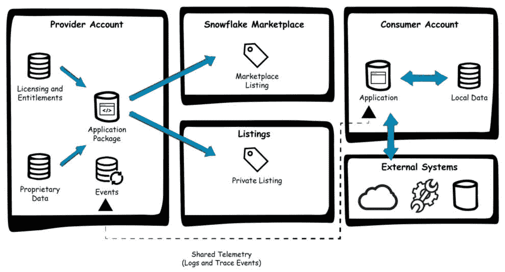

图 7.1 – Native App Framework 组件

提供者账户是应用程序开发和打包以供分发的地方。该包包括应用程序代码、Snowpark 模型和相关数据。它还包括应用程序包所需的各项许可证和权益。然后，应用程序被打包并可供分发。

提供者可以将包作为公共市场列表分发，供其他组织消费，或者通过私人列表分发，这也可以在同一个组织内部作为内部应用分发。消费者账户部署应用程序，并可以使用本地数据访问外部系统。此类应用可以使用 Python 中的 Streamlit 构建。

## Snowflake 中的 Streamlit

Streamlit 是一个开源的 Python 库，它使得创建和分享用于机器学习和数据科学的自定义 Web 应用变得简单。它允许你快速构建和部署强大的数据应用。Snowflake 中的 Streamlit 帮助你超越纯粹的数据，进入应用逻辑的领域，使应用变得生动，并将见解转化为行动和反应。使用 Snowflake 中的 Streamlit，你可以构建在 Snowflake 中处理和使用数据的应用，而无需将数据或应用代码移动到外部系统。原生应用可以直接将交互式数据可视化和用户界面嵌入到应用中，实现动态图表和图形，这些图表和图形在用户与数据交互时更新，并为用户提供交互式数据探索工具，以便深入挖掘并发现更深刻的见解。

让我们讨论原生应用提供的各种优势。

## 原生应用的优势

在 Snowflake 内部构建的原生应用为数据分析与决策提供了无与伦比的优势。原生应用提供了多项好处；通过提供 Snowpark 的简化开发，它们消除了与开发框架相关联的陡峭学习曲线。开发者可以无缝过渡到 Snowflake 强大云环境中的数据操作，从而实现快速创新。这使开发者能够专注于构建有影响力的应用和提取有价值的见解，而无需克服语法障碍。

Snowflake 与 Streamlit 的集成使得开发者能够在 Snowflake 内部直接释放他们现有的 Python 专长。开发者可以构建用于数据探索、机器学习和交互式仪表板的高级应用。这消除了环境切换，并在 Snowflake 安全且可扩展的环境中最大化了生产力。Snowflake 的*数据驻留*原则确保有价值的信息保持在安全范围内，显著降低了数据泄露的风险。

原生应用能够无缝地与现有的 Snowflake 功能和工具，如任务和流，进行接口交互，创建一个集成的分析环境。利用 Snowflake 任务进行自动执行和调度，结合 Snowflake 流或 Snowpipe 进行实时数据摄取和交付，确保持续更新并提升性能。Snowflake **用户定义函数**（**UDFs**）和存储过程也提高了灵活性并最小化了数据移动。我们将在下一节中探讨 Snowflake 中的 Streamlit。

随着我们深入本章内容，我们将利用熟悉的共享单车数据集及其在上一章中看到的关联 Snowpark 模型，并使用 Snowsight 开发 Streamlit 应用程序。

# 开发本地应用程序

第一步涉及开发一个 Streamlit 应用程序来展示 Snowpark 模型的开发。该应用程序提供了一个用户友好的界面，简化了对 Snowpark 底层数据和建模技术的探索和理解。在 Snowflake 中，可以通过 Snowsight 中的专用 Python 编辑器开发 Streamlit 应用程序。此编辑器使用户能够轻松地编写、编辑和执行 Streamlit 应用程序的代码。值得注意的是，它提供了自动完成和全面文档等宝贵功能，在利用 Streamlit 和 Snowpark 功能的同时，提供了一个顺畅直观的开发体验。我们将使用此编辑器来开发 Streamlit 应用程序。

让我们深入了解在 Snowflake 环境中创建 Streamlit 应用程序的详细步骤：

注意

用户在模式级别需要**CREATE STREAMLIT**权限来开发应用程序，并且此应用程序将利用仓库计算来运行，因此请适当选择仓库大小。X-Small 将足以用于本章中开发的 Streamlit 和本地应用程序。

1.  登录成功后，在 Snowsight 左侧导航栏中选择**项目**，然后选择**Streamlit**以启动 Streamlit 应用程序：

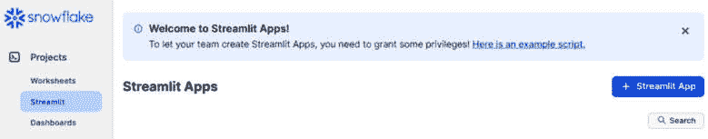

图 7.2 – Streamlit Snowsight

1.  在 Streamlit 项目部分，点击**+ Streamlit 应用程序**按钮以创建一个新的 Streamlit 应用程序：

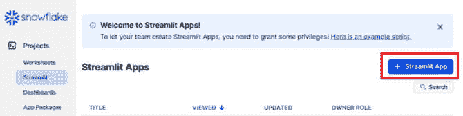

图 7.3 – Streamlit 应用程序创建

1.  点击按钮后，将出现**创建 Streamlit 应用程序**窗口。提供应用程序名称，如此处所示：

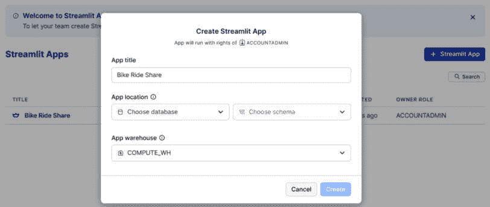

图 7.4 – 配置应用程序详情

1.  从下拉菜单中选择您希望执行应用程序查询的适当仓库。从相应的下拉菜单中指定应用程序将托管的数据库和模式：

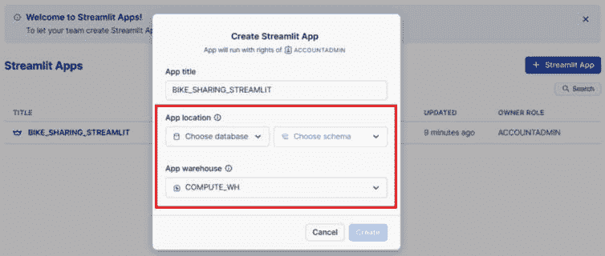

图 7.5 – 定义执行环境

1.  通过点击**创建**按钮完成创建过程，这将启动 Streamlit 应用程序的设置。创建成功后，Streamlit 将在您的 Snowflake 编辑器中启动，以**查看器**模式展示 Streamlit 应用程序的示例。此模式提供了应用程序将如何呈现给最终用户的预览，有助于可视化评估其用户界面：

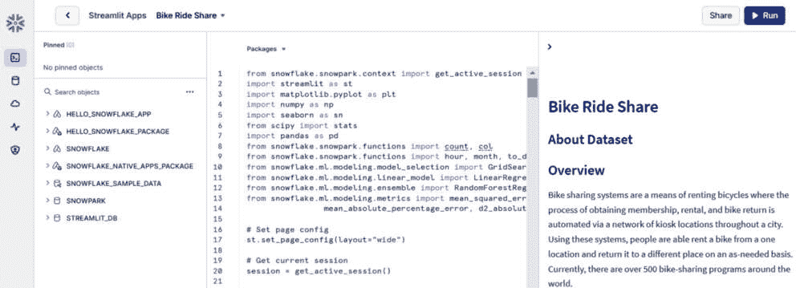

图 7.6 – Streamlit Snowflake 编辑器

在下一节中，我们将发现并熟悉 Streamlit 编辑器。

## Streamlit 编辑器

Snowflake 中的 Streamlit 编辑器有助于在 Snowflake 中开发 Streamlit 应用程序。编辑器集成在 Snowsight 界面中，使得创建应用程序更加容易，无需外部环境。Snowflake 中的 Streamlit 界面分为三个主要窗格。

对象浏览器可以查看你权限下可访问的数据库、模式和视图，有助于数据探索和访问。Streamlit 编辑器包含一个定制的 Python 编辑器，专门用于编写 Streamlit 应用程序代码，便于开发和定制。Streamlit 预览实时显示运行中的 Streamlit 应用程序，允许你在修改时观察其行为和外观。

默认情况下，只有 Streamlit 编辑器和预览窗格可见。然而，你可以根据个人喜好调整界面布局。使用 Snowflake 编辑器左下角的 **显示**/**隐藏** 按钮根据工作流程需求切换不同窗格的可见性。

现在我们已经熟悉了界面，接下来将在下一节创建我们的第一个 Streamlit 应用程序。

## 运行 Streamlit 应用程序

在本节中，我们将使用 GitHub 仓库中 `chapter_7` 文件夹下的 Streamlit 代码构建一个应用程序（[`github.com/PacktPublishing/The-Ultimate-Guide-To-Snowpark/tree/main/chapter_7`](https://github.com/PacktPublishing/The-Ultimate-Guide-To-Snowpark/tree/main/chapter_7)）。SnowparkML 代码在前几章中已有详细说明，并在仓库中提供。将仓库中的 `streamlit_bike_share_analysis.py` 文件复制粘贴到 Streamlit 编辑器中。该代码需要使用之前使用的 *Bike Sharing* 数据集创建的 `BSD_TRAIN` 表。可以通过运行 `chapter_7_data_load.ipynb` 文件来创建所需的表。

现在，通过选择 **运行** 选项来刷新应用程序，结果将在 Streamlit 预览窗格中更新：

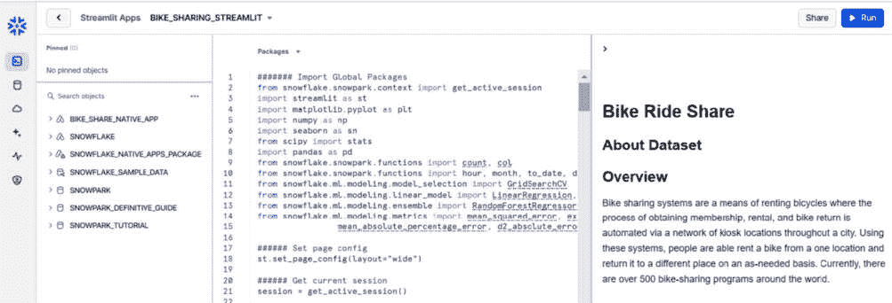

图 7.7 – Streamlit 应用预览

该代码需要在你的 Streamlit 环境中安装几个包。在代码编辑器中点击 **包** 按钮并选择以下包：

+   Matplotlib

+   Seaborn

+   SciPy

+   Snowflake-ml-python

你已在 Snowflake 中成功运行了第一个 Streamlit 应用程序。你可以在 Snowsight 环境中选择应用程序来执行：

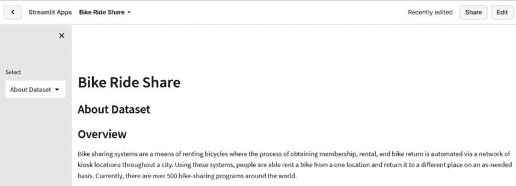

图 7.8 – Streamlit 应用

注意

Snowsight 为创建单页 Streamlit 应用程序提供了一个方便的平台。然而，部署多页 Streamlit 应用程序需要稍微不同的方法，需要使用 SQL 命令。一旦部署过程完成，您就可以在 Snowsight 的界面中无缝导航和交互多页应用程序。

在下一节中，我们将使用原生应用程序框架开发和推送 Streamlit 应用程序。

## 使用原生应用程序框架进行开发

现在，我们的 Streamlit 应用程序已经运行，让我们探索将其转换为 Snowflake 生态系统中的原生应用程序的过程。在本节中，我们将详细介绍如何利用原生应用程序框架开发应用程序，以便与其他 Snowflake 账户共享数据和相关的业务逻辑。我们将主要使用 Snowsight 网络界面来演示这一点，该界面也可以使用 VS Code 等客户端创建。

以下顺序步骤将把您的现有 Streamlit 应用程序转换为 Snowflake 中的原生应用程序：

1.  创建应用程序文件

1.  创建应用程序包

1.  上传应用程序文件到命名阶段

1.  安装应用程序

1.  版本控制应用程序

1.  测试应用程序

我们将从第一步开始，创建应用程序文件。

### 创建应用程序文件

创建应用程序文件包括创建设置脚本和清单文件，这些是原生应用程序框架必需的组件。

#### 创建设置脚本

设置脚本是一个 SQL 文件，当消费者在其账户中安装应用程序时自动执行。它简化了配置和设置过程，并包含配置应用程序所需的初始化指令。要启动创建设置脚本，请按照以下步骤操作：

1.  我们首先将在您的本地文件系统中创建一个目录结构。创建一个名为 **native_apps** 的文件夹，作为应用程序外部文件的根目录。

1.  在此文件夹中，创建一个名为 **scripts** 的子文件夹来存储脚本文件。此文件夹将包含应用程序所需的所有脚本文件。

1.  在 **scripts** 文件夹中，创建一个名为 **setup.sql** 的新文件，并添加以下语句：

    ```py
    -- Setup script for the Bike Share Streamlit application.
    CREATE APPLICATION ROLE app_public;
    CREATE OR ALTER VERSIONED SCHEMA code_schema;
    GRANT USAGE ON SCHEMA code_schema 
      TO APPLICATION ROLE app_public;
    CREATE STREAMLIT code_schema.bike_share_streamlit
      FROM '/streamlit'
      MAIN_FILE = '/streamlit_bike_share_analysis.py';
    GRANT USAGE ON STREAMLIT code_schema.bike_share_streamlit
      TO APPLICATION ROLE app_public;
    ```

随着我们进入本节，我们将看到之前代码的详细解释。

#### 创建 Streamlit 应用程序文件

我们将结合应用程序逻辑和 Streamlit 应用程序，利用其在数据科学和机器学习任务中的功能。利用 Streamlit 应用程序增强了用户交互并促进了数据可视化。我们将通过创建 Streamlit 应用程序开始这个过程：

1.  在 **native_apps** 目录中创建一个名为 **streamlit** 的子文件夹。

1.  在文件夹中，创建一个名为 **streamlit_bike_share_analysis.py** 的文件。该代码位于 **chapter_7** 文件夹内的存储库中。

1.  将以下代码复制并粘贴到该文件中并保存：

    ```py
    # Set page config
    st.set_page_config(layout="wide")
    # Get current session
    session = get_active_session()
    @st.cache_data()
    def load_data():
        # Load Bike Share data
        snow_df = session.table(
            "SNOWPARK_DEFINITIVE_GUIDE.MY_SCHEMA.BSD_TRAIN")
    ```

```py
streamlit_bike_share_analysis.py file under the chapter_7 folder in the book GitHub repository for the complete code.
```

#### 创建 README 文件

README 文件作为描述性指南，概述了应用程序的功能。在 Snowsight 中查看应用程序时可以轻松访问。要为应用程序生成 README 文件，请按照以下步骤操作：

1.  导航到**native_apps**目录并创建一个名为**readme.md**的文件。

1.  将以下内容填充到**readme.md**文件中，详细说明应用程序的目的和功能：

    ```py
    # Bike Sharing Analysis - Through Native Apps.
    This native app presents the analysis we performed on the Kaggle dataset - Bike sharing demand as an interactive dashboard
    ```

现在我们可以在下一节创建清单文件。

#### 创建清单文件

使用 YAML 语法的清单文件包含有关应用程序的基本配置细节。它是概述适当功能关键规范的基石文档，并且每个在原生应用程序框架中开发的应用程序都需要一个相应的清单文件。

要生成清单文件，请按以下步骤操作：

1.  在**native_apps**文件夹中，创建一个名为**manifest.yml**的新文件。

1.  将以下内容填充到**manifest.yml**文件中：

    ```py
    manifest_version: 1
    artifacts:
      setup_script: scripts/setup.sql
      readme: readme.md
    ```

`setup_script`属性指定了设置脚本相对于清单文件位置的路径。请确保指定的路径和文件名与之前创建的设置脚本完全一致。

注意

清单文件对您的项目至关重要。它必须命名为**manifest.yml**并放置在根目录。所有文件路径，包括设置脚本，都是相对于此文件位置的相对路径。**manifest_version**、**artifacts**和**setup_script**等基本属性是强制性的，以确保正确运行。您可以可选地包含**readme**属性以提供额外的文档。

在下一节中，我们将为原生应用程序创建应用程序包。

### 创建应用程序包

在本节中，您将创建一个应用程序包，它是应用程序资源的容器。应用程序包扩展 Snowflake 数据库，包括额外的应用程序相关信息，作为一个综合容器，包含共享数据内容和应用程序。要创建应用程序包，您的角色需要具有**创建应用程序包**的权限。执行以下命令以授予权限：

```py
GRANT CREATE APPLICATION PACKAGE ON ACCOUNT
  TO ROLE accountadmin;
```

执行后，您应该看到以下输出：

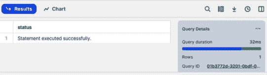

图 7.9 – 角色创建

现在，运行以下命令以创建`SNOWFLAKE_NATIVE_APPS_PACKAGE`应用程序包：

```py
CREATE APPLICATION PACKAGE snowflake_native_apps_package;
```

您将收到以下输出，确认已创建包：

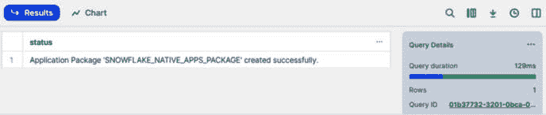

图 7.10 – 包创建

应用程序包将被创建，当前上下文将切换到`SNOWFLAKE_NATIVE_APPS_PACKAGE`。我们可以通过运行以下命令来确认包列表：

```py
SHOW APPLICATION PACKAGES;
```

这将显示以下输出：

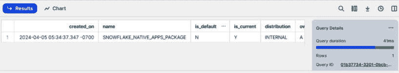

图 7.11 – 显示包

现在应用包已经创建，下一步是创建一个用于上传应用文件的命名阶段。通过运行以下命令切换到应用包的上下文：

```py
USE APPLICATION PACKAGE snowflake_native_apps_package;
```

这将显示以下输出：

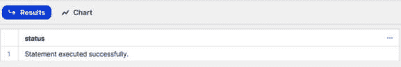

图 7.12 – 使用 snowflake_native_apps_package

我们需要一个架构来托管阶段。通过运行以下命令创建一个架构：

```py
CREATE SCHEMA my_schema;
```

架构创建后，您将看到以下消息：

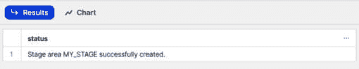

图 7.13 – 创建新架构

下一步是在此架构中创建阶段。通过运行以下代码创建一个阶段：

```py
CREATE OR REPLACE STAGE snowflake_native_apps_package.my_schema.my_stage FILE_FORMAT = (TYPE = 'csv' FIELD_DELIMITER = '|' SKIP_HEADER = 1);
```

通过这一步，您在应用包内建立了一个命名阶段，为上传构建应用所需的关键文件提供了一个指定的空间。

关于 setup.sql 的说明

以下 SQL 命令集是 **setup.sql** 的一部分，并打包在 **chapter_7** 中的原生应用文件夹内。此文件将被上传到阶段区域，并在我们创建原生应用时使用，因此不需要在 Snowflake 工作表中执行此代码。

让我们看看 `set.sql` 文件包含什么内容以创建一个原生应用应用。我们还将创建一个必需的应用角色。要创建应用角色，请运行以下命令：

```py
CREATE APPLICATION ROLE app_public;
CREATE OR ALTER VERSIONED SCHEMA code_schema;
GRANT USAGE ON SCHEMA code_schema TO APPLICATION ROLE app_public;
```

此代码初始化一个名为 `app_public` 的应用角色。然后创建或更新一个名为 `code_schema` 的版本化架构。最后，它授予 `app_public` 应用角色使用 `code_schema` 架构的权限。这种设置通常用于在数据库应用中管理访问控制和架构组织。

运行以下代码以集成 Streamlit 应用：

```py
CREATE STREAMLIT code_schema.bike_share_streamlit
  FROM '/streamlit'
  MAIN_FILE = '/streamlit_bike_share_analysis.py';
GRANT USAGE ON STREAMLIT code_schema.bike_share_streamlit
  TO APPLICATION ROLE app_public;
```

此代码在 `code_schema` 架构内创建一个名为 `bike_share_streamlit` 的 Streamlit 应用，其内容来自 `/streamlit` 目录，主文件来自 `/streamlit_bike_share_analysis.py`。然后它授予此 Streamlit 应用对 `app_public` 应用角色的使用权限，允许在应用范围内授权用户访问。这有助于将基于 Streamlit 的自行车共享分析工具集成到数据库设置中，并通过应用角色管理受控访问。

### 上传应用文件到命名阶段

应用文件需要上传到命名阶段。它们可以通过 Snowsight 或通过如 第二章 中所述的 Snowpark Python 代码上传，为使用 SnowSQL 客户端上传文件到阶段的读者，执行以下步骤：

1.  导航到您本地机器上的 **native_apps** 文件夹。

1.  运行以下 SnowSQL 命令上传所有文件夹和文件：

    ```py
    PUT file:///<path_to_your_root_folder>/native_apps/manifest.yml @snowflake_native_apps_package.my_schema.my_stage overwrite=true auto_compress=false;
    PUT file:///<path_to_your_root_folder>/native_apps/scripts/setup.sql @snowflake_native_apps_package.my_schema.my_stage/scripts overwrite=true auto_compress=false;
    PUT file:///<path_to_your_root_folder>/native_apps/streamlit/streamlit_bike_share_analysis.py @snowflake_native_apps_package.my_schema.my_stage/streamlit overwrite=true auto_compress=false;
    PUT file:///<path_to_your_root_folder>/native_apps/readme.md @snowflake_native_apps_package.my_schema.my_stage overwrite=true auto_compress=false;
    ```

1.  在工作表中运行以下命令以验证文件上传是否成功：

    ```py
    List @snowflake_native_apps_package.my_schema.my_stage;
    ```

    运行命令后，上传的文件将在输出中显示：

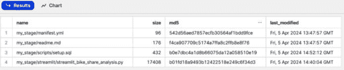

图 7.14 – 通过 SnowSQL 检查应用程序文件

我们也可以在 Snowsight 中检查应用程序文件：

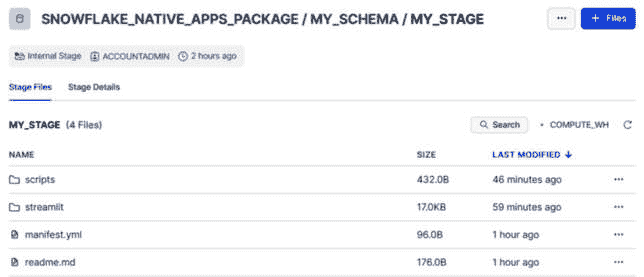

图 7.15 – 通过 Snowsight 检查应用程序文件

现在我们已经将文件上传到阶段，我们将安装应用程序包到 Snowflake。

### 安装应用程序

执行以下命令来安装应用程序：

```py
CREATE APPLICATION bike_share_native_app 
  FROM APPLICATION PACKAGE snowflake_native_apps_package 
  USING '@snowflake_native_apps_package.my_schema.my_stage';
```

这将在 Snowflake 内部自动创建一个新的当前版本的应用程序。原生应用程序还提供了对应用程序进行版本控制和更新版本的能力，我们将在下一节中介绍。

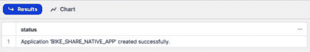

图 7.16 – 应用程序已安装

现在应用程序已安装，让我们更新应用程序的版本。

### 应用程序版本控制

在本节中，我们将更新应用程序的版本并将其安装到 Snowflake。我们将使用`ALTER APPLICATION PACKAGE`命令来更新先前创建的应用程序。要更新新版本，请按照以下步骤操作：

1.  运行以下命令将版本追加到**SNOWFLAKE_NATIVE_APPS_PACKAGE**：

    ```py
    ALTER APPLICATION PACKAGE snowflake_native_apps_package 
      ADD VERSION v1_0 
      USING '@ snowflake_native_apps_package.my_schema.my_stage';
    ```

    这将显示以下输出：

    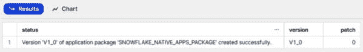

    图 7.17 – 修改应用程序版本

    此命令通过结合从先前部分上传到指定阶段的文件中派生的版本来修改应用程序包。

1.  接下来，通过执行以下命令确认版本更新的成功：

    ```py
    SHOW VERSIONS IN APPLICATION PACKAGE snowflake_native_apps_package;
    ```

    这将显示更新后的版本作为输出：

    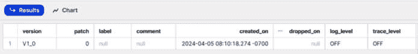

    图 7.18 – 应用程序的更新版本

    此命令提供了关于版本的额外见解，包括创建时间戳和审查状态。

1.  在您安装新版本之前，通过运行以下命令删除现有应用程序：

    ```py
    DROP APPLICATION bike_share_native_app;
    ```

    您应该看到以下确认消息：

    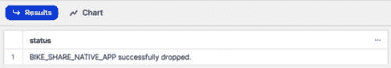

    图 7.19 – 应用程序已删除

    现在现有应用程序已被删除，我们可以安装新的应用程序。

1.  最后，要安装应用程序的新版本，请运行以下代码：

    ```py
    CREATE APPLICATION bike_share_native_app 
      FROM APPLICATION PACKAGE snowflake_native_apps_package 
      USING VERSION V1_0;
    ```

    这将基于指定的版本创建一个新的应用程序，确保您的应用程序包含所有最新的增强功能和特性。

注意

为**版本**提供的值作为标签，而不是数值或字符串值。需要注意的是，在添加新版本时，补丁号会自动设置为**0**。随后添加到该版本的补丁将自动递增。然而，在引入新版本，如**V1_1**时，该特定版本的补丁号将重置为**0**。

我们已成功部署新版本的应用程序。在下一节中，我们将在 Snowflake 环境中运行应用程序以测试它。

### 测试应用程序

在本节中，我们将在 Snowpark 中运行我们的本地应用程序以进行测试。虽然前面的章节主要使用 SQL 语句进行测试和信息检索，但 Snowsight 提供了另一种与您的应用程序交互和检查的界面。此外，您可以检查您已部署的 Streamlit 应用程序。要访问和探索 Snowsight 中的应用程序，请按照以下步骤操作：

1.  在 Snowsight 中，切换到**ACCOUNTADMIN**角色，该角色授予您在 Snowsight 中有效查看和管理应用程序所需的权限：

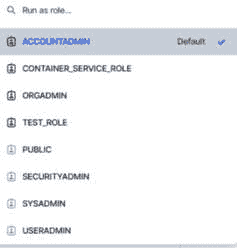

图 7.20 – 切换到 ACCOUNTADMIN 角色

1.  在 Snowsight 的直观导航菜单中，找到并选择**数据产品**选项，然后选择**应用程序**。此操作将您引导到 Snowflake 环境中已安装应用程序的仓库：

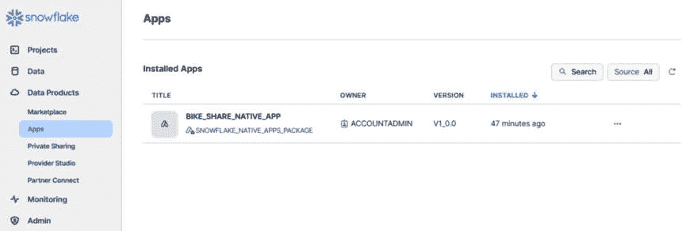

图 7.21 – 本地应用程序仓库

1.  在**已安装应用程序**列表中找到您的应用程序，并选择**BIKE_SHARE_NATIVE_APP**。此操作提供了您应用程序的全面视图，让您深入了解其各种组件和功能。**Readme**标签提供了访问您之前添加到 README 文件的内容，为您提供了关于应用程序目的和功能的见解：

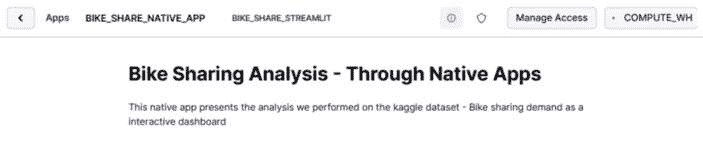

图 7.22 – 本地应用程序 README 文件

1.  定位并选择**BIKE_SHARE_STREAMLIT**以访问您部署的 Streamlit 应用程序。选择后，**SNOWFLAKE_NATIVE_APPS_PACKAGE**数据库的内容将在 Streamlit DataFrame 中展示，便于动态交互和数据可视化：

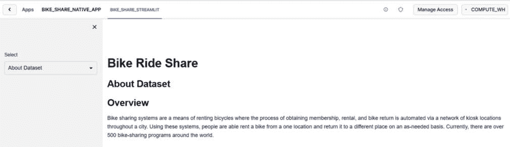

图 7.23 – 本地应用程序

步骤 4 的注意事项

在执行步骤 4 之前，请确保**chapter_7.sql**中**CREATE VIEW ON BSD TRAIN TABLE**部分下的所有命令都已执行。这是访问位于**SNOWPARK_DEFINITIVE_GUIDE**数据库中的**BSD_TRAIN**表所必需的。

Streamlit 应用程序在 Snowflake 环境中成功运行，突出了数据表示和交互功能。

在下一节中，我们将探讨如何发布本地应用程序。

# 发布本地应用程序

在本节中，我们将通过创建一个使用应用程序包作为核心数据内容的私密列表来检查应用程序的发布。此过程使您能够与其他 Snowflake 用户无缝共享应用程序，并使他们能够在自己的账户中安装和使用它。我们将首先设置发布指令。

## 设置默认发布指令

在继续创建列表之前，建立指定消费者可访问的应用程序版本的默认发布指令至关重要。要将版本`v1_0`和补丁`0`指定为默认发布指令，请执行以下命令：

```py
SHOW VERSIONS IN APPLICATION PACKAGE snowflake_native_apps_package;
```

这将显示以下输出：

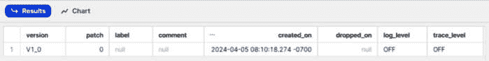

图 7.24 – 检查应用程序版本

输出确认了默认发布指令的成功建立，确保了版本管理的清晰和一致性。

在下一节中，我们将创建应用程序的列表。

## 为您的应用程序创建列表

在默认发布指令就绪的情况下，我们将为您的应用程序创建一个列表，将应用程序包作为其共享数据内容。按照以下步骤创建列表：

1.  通过导航到**数据产品** | **提供者工作室**来打开**提供者工作室**，以访问列表创建界面：

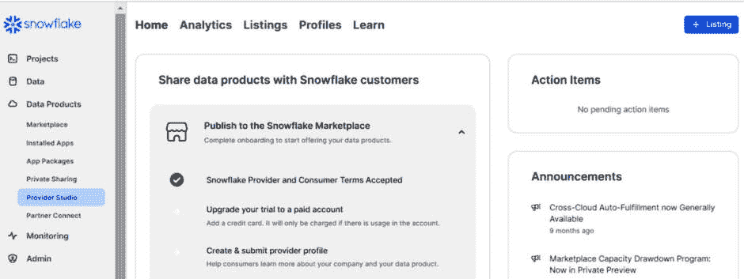

图 7.25 – 提供者工作室

1.  接下来，通过选择**+ 列表**来启动列表创建，打开**创建列表**窗口，提示您指定列表的名称和其他必要细节：

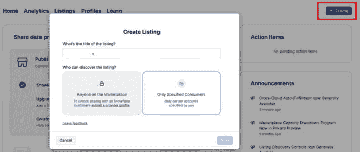

图 7.26 – 创建列表对话框

1.  为您的列表输入一个描述性的名称，并选择**仅指定消费者**可见性选项，以确保仅与特定账户进行私密共享。选择与列表关联的应用程序包，有效地将其链接为核心数据内容。提供您列表的全面描述，以便让潜在用户了解其功能和目的：

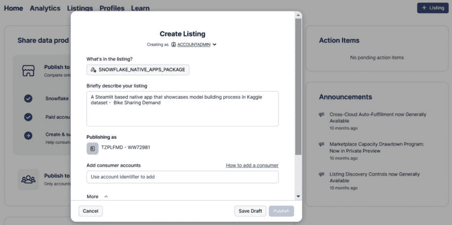

图 7.27 – 创建列表描述

1.  通过包含用于测试从列表安装应用程序的消费者体验的账户标识符来添加消费者账户：

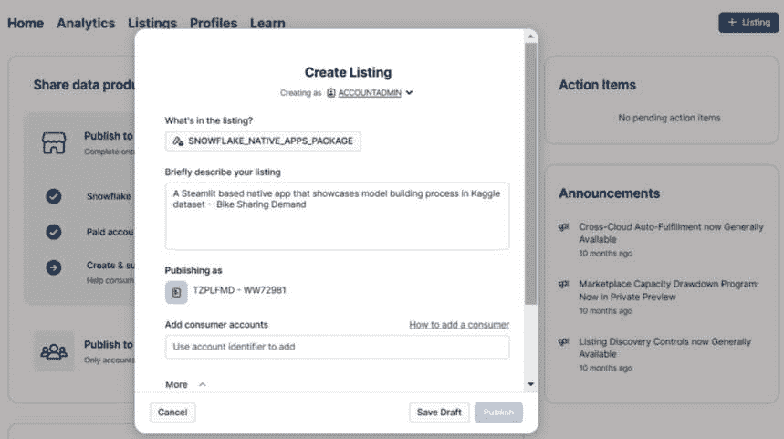

图 7.28 – 添加消费者账户

现在，您已成功创建了一个包含应用程序包作为共享数据内容的私密列表，便于在指定用户之间简化应用程序的传播和安装。

以下部分将讨论如何管理原生应用程序。

# 管理原生应用程序

配置和管理使用原生应用程序框架创建的已安装应用程序涉及各种任务，包括查看已安装应用程序、访问 README 信息、将应用程序角色授予账户角色以及卸载应用程序。让我们更详细地探讨每个方面。

## 查看已安装的应用程序

要访问和查看与您的账户关联的已安装应用程序或 Streamlit 应用程序，请按照以下步骤操作：

1.  在导航菜单中，选择**数据产品**和**应用程序**以访问已安装应用程序的列表：

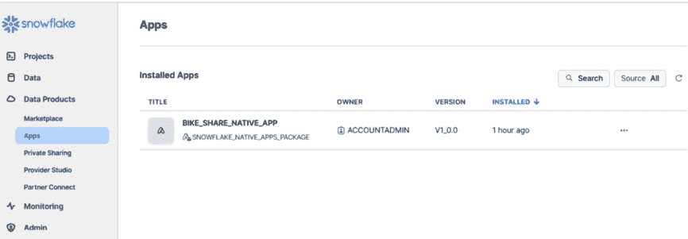

图 7.29 – 已安装应用程序列表

1.  查看已安装应用程序的列表，然后选择所需的应用程序。如果您选择一个应用程序，将显示应用程序界面：

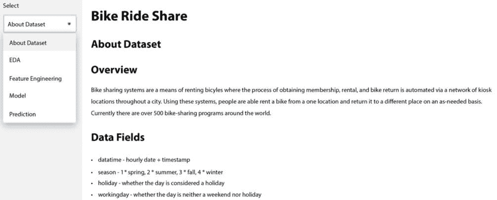

图 7.30 – Streamlit 应用程序

接下来，我们将介绍如何查看应用程序的 README。

## 查看应用程序的 README

README 提供了有意义的描述以及其他与该应用程序相关的详细信息。从列表中选择应用程序以访问 README，然后在工具栏中点击**README**图标以查看与应用程序关联的 README：

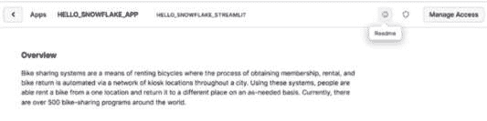

图 7.31 – Streamlit 的 README 信息

接下来，我们将介绍通过授予角色来管理应用程序访问权限。

## 管理应用程序访问

要授予应用程序角色访问权限，请选择应用程序并选择**管理访问**。点击**添加角色**，然后选择您想授予应用程序角色访问权限的账户角色。点击**完成**以确认：

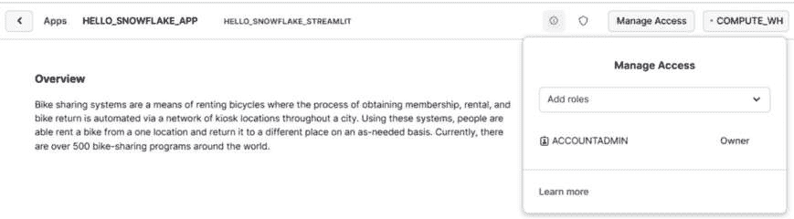

图 7.32 – 应用程序访问

或者，您可以在消费者账户中通过运行以下命令来将应用程序角色授予账户角色：

```py
GRANT APPLICATION ROLE bike_share_native_app.app_public
  TO ROLE <ACCOUNT ROLE>;
```

在最后一节，我们将学习如何卸载已安装的应用程序。

## 删除已安装的应用程序

应用程序可以使用 Snowsight UI 或命令行进行删除。要使用 Snowsight 删除应用程序，请点击应用程序旁边的省略号（**...**），然后选择**卸载**。通过选择**卸载**来确认操作：

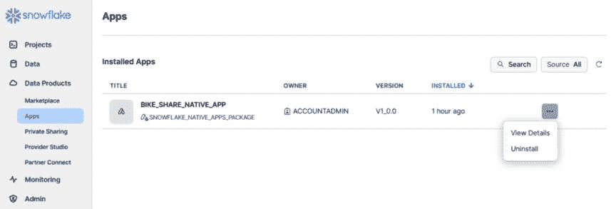

图 7.33 – 卸载应用程序

我们也可以通过在工作表中执行以下命令来通过命令行卸载它：

```py
DROP APPLICATION BIKE_SHARE_NATIVE_APP;
```

这就完成了原生应用程序的管理。Snowflake 提供了一种简单的方法来做这件事。我们将以总结结束本章。

# 总结

在本章中，我们探讨了 Snowflake 生态系统中的原生应用，揭示了其动态的景观和内在价值。本章从对 Snowflake 中原生应用的深入介绍开始，我们深入探讨了其基础方面，包括强大的安全特性和在更广泛的原生应用景观中的重要性。我们探讨了 Snowflake 中的 Streamlit，这是一个用于开发沉浸式数据科学和机器学习应用的强大工具。我们提供了 Streamlit 的全面概述，强调了其直观性和与 Snowflake 的无缝集成。我们指导读者通过在 Snowflake 中部署第一个 Streamlit 应用程序的过程，使他们能够利用这种强大的组合来获取数据驱动的洞察。

总体而言，本章提供了 Snowflake 中原生应用的全面概述，为您提供了利用这种创新技术在数据工作流程中充分发挥其潜能所需的知识和工具。在下一章中，我们将讨论 Snowpark 容器服务。
