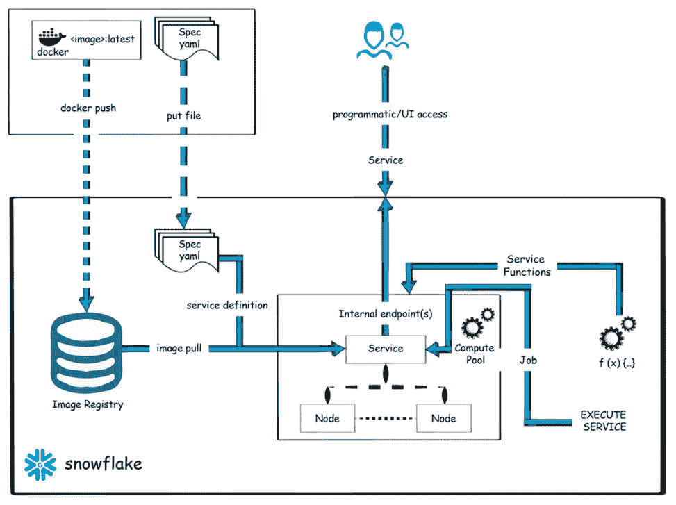

# 8

# 雪花容器服务简介

容器是使用多种语言打包代码的当代方法，确保在各种环境中实现无缝的可移植性和一致性。这对于高级 AI/ML 模型和全面的数据中心应用尤其如此。这些现代数据产品通常处理大量专有数据，在高效创建、开发和扩展工作负载方面提出了挑战。

开发人员和数据科学家通常花费更多的时间来管理计算资源和集群，而不是解决核心业务挑战。凭借其独特功能，Snowpark 容器服务为解决这个问题提供了一个无缝的解决方案。它允许应用程序和**大型语言模型**(**LLMs**)直接在 Snowflake 数据云中执行，从而减少了在资源管理上花费的时间和精力。本章将帮助您了解如何在 Snowpark 中部署应用程序和 LLMs。

在本章中，我们将涵盖以下主题：

+   雪花容器服务简介

+   设置 Snowpark 容器服务

+   设置 Snowpark 容器服务作业

+   使用 Snowpark 部署 LLMs

# 技术要求

要设置环境，请参考前一章中的技术要求。还需要 Docker 客户端和桌面；您可以从[`docs.docker.com/get-docker/`](https://huggingface.co/docs/hub/en/security-tokens)安装 Docker。

我们还将使用 Hugging Face API。要获取 Hugging Face API 令牌，请在[`huggingface.co/`](https://github.com/PacktPublishing/The-Ultimate-Guide-To-Snowpark)注册。

支持材料可在[`github.com/PacktPublishing/The-Ultimate-Guide-To-Snowpark`](https://github.com/PacktPublishing/The-Ultimate-Guide-To-Snowpark)获取。

# 雪花容器服务简介

雪花容器服务代表了一种全面的托管容器解决方案，旨在简化在 Snowflake 环境中部署、管理和扩展容器化应用程序。用户可以直接在 Snowflake 中执行容器化工作负载，从而无需将数据转移到 Snowflake 生态系统之外进行处理。Snowpark 容器服务引入了一个经过精心优化的**开放容器倡议**(**OCI**)运行时执行环境，适用于 Snowflake，使用户能够完美执行 OCI 镜像，同时利用 Snowflake 数据平台的强大功能。

Snowpark 容器服务扩展了 Snowpark 的功能，为开发者提供了一个可信且熟悉的环境，使他们能够在 Snowflake 受管数据域内无缝处理非 SQL 代码。这使得应用程序能够轻松执行诸如连接到 Snowflake、在 Snowflake 虚拟仓库中执行 SQL 查询、访问 Snowflake 阶段的文件以及使用 Snowpark 模型处理数据等任务。这种简化的集成促进了团队内部高效协作和专注的开发工作环境。

开发者可以创建满足他们需求的容器，提供可配置的硬件选项，包括 GPU 支持，通过 Snowpark 在 Snowflake 内实现广泛的 AI/ML 和应用工作负载。例如，数据科学团队可以通过利用 Python 库进行训练和推理来加速 ML 任务，同时执行资源密集型的生成式 AI 模型，如 LLM。应用开发者可以使用流行的框架设计和部署用户界面，而数据工程师可以在处理 SQL 或 Python DataFrame 操作的同一处理引擎中执行优化的逻辑。

在下一节中，我们将了解 Snowpark 容器服务中的数据安全是如何工作的。

关于 Snowpark 容器服务的注意事项

在撰写本章时，Snowpark 容器服务目前处于私有预览阶段。请注意，一旦它们对所有用户开放，API 方法可能与本书中描述的略有不同。我们鼓励您监控本书的 GitHub 存储库，以获取任何新的代码内容更改和更新：[`github.com/PacktPublishing/The-Ultimate-Guide-To-Snowpark`](https://github.com/PacktPublishing/The-Ultimate-Guide-To-Snowpark)

## Snowpark 容器服务中的数据安全

Snowpark 容器服务简化了全栈应用程序、LLM 和其他高级数据产品在数据环境中的安全部署。在 Snowpark 下，这种新的运行时选项简化了容器化工作负载（包括作业、服务和服务函数）的部署、管理和扩展，利用 Snowflake 管理的硬件配置基础设施，如 GPU。通过采用这种创新运行时，用户可以绕过管理计算资源和容器集群的复杂性，在不影响数据安全的前提下，无缝集成复杂的 AI/ML 模型和应用。在 Snowflake 环境中运行的容器无需将受管数据转移到 Snowflake 之外，从而最小化潜在的安全风险。这确保了利用内部开发解决方案或第三方产品（如通过 Snowflake Marketplace 可访问的 Snowflake Native Apps）的可靠和强大生态系统。

在下一节中，我们将探讨 Snowpark 容器的组成部分。

## Snowpark 容器的组成部分

Snowpark 容器服务为容器化应用程序和 AI/ML 模型的生命周期管理提供了一种简化和完全管理的途径。与其他解决方案不同，它提供了一个统一的解决方案，需要将容器注册库、管理服务和计算平台等不同组件组合在一起。整合这些元素消除了管理计算资源和集群的负担，从而加速了数据应用程序的开发和部署。

此外，Snowpark 容器服务通过提供简单性和可扩展性的结合简化了容器托管和部署。开发者只需提供他们的容器，Snowflake 就会处理托管和扩展，无需深入了解 Kubernetes。开发者可以使用 SQL、CLI 或 Python 接口与服务交互，满足不同的偏好和工作负载。Snowpark 容器提供两种不同的执行选项，以适应各种应用程序需求：通过使用服务函数的服务作业和计算池。以下图表显示了不同的组件：



图 8.1 – Snowpark 容器组件

让我们来看看每个选项：

+   **服务**：在 Snowflake 中，服务持续运行，就像一个网络服务一样，直到明确终止。这些服务托管在安全的入口端点，通常托管应用程序前端或 API。它们持续可用，以处理按需请求。

+   **作业**：这些是具有特定时间限制的进程，通常由人工启动或定期安排。它们包括各种任务，例如在 GPU 上启动用于机器学习训练的容器镜像，或使用封装在容器中的不同语言、框架或库执行数据管道中的步骤。

+   **服务函数**：函数是时间有限的进程，旨在接收输入、执行特定操作，并通过事件反复触发，利用您的容器化环境。

+   **计算池**：由一个或多个 **虚拟机**（VM）节点组成的计算池是 Snowflake 执行您的作业和服务的底层基础设施。

Snowpark 容器服务还允许开发者在他们的最终客户 Snowflake 账户中使用上述组件直接部署应用程序。这使得他们能够在 Snowflake 环境中安全地安装和运行最先进的产品，例如托管笔记本和大型语言模型（LLMs），从而保护提供商的知识产权。

在下一节中，我们将介绍如何设置 Snowpark 容器服务。

# 设置 Snowpark 容器服务

在本节中，我们将阐述探索 Snowpark 容器服务所需的基础知识。我们将使用 Docker 创建一个符合 OCI 标准的镜像以部署到 Snowpark。我们将从创建 Snowflake 对象开始。

## 创建 Snowflake 对象

要创建 Snowflake 对象，请按照以下步骤在 Snowsight 中使用 **ACCOUNTADMIN** 角色执行：

1.  使用以下命令创建一个名为 **test_role** 的角色。此角色将用于我们的 Snowpark 应用程序：

    ```py
    USE ROLE ACCOUNTADMIN;
    CREATE ROLE test_role;
    ```

    这将打印以下输出：


图 8.2 – Snowflake 角色

1.  通过运行以下命令创建一个数据库并授予数据库角色的访问权限：

    ```py
    CREATE DATABASE IF NOT EXISTS SNOWPARK_DEFINITIVE_GUIDE;
    GRANT OWNERSHIP ON DATABASE SNOWPARK_DEFINITIVE_GUIDE
      TO ROLE test_role COPY CURRENT GRANTS;
    ```

    这将显示以下输出：


图 8.3 – 授予权限

1.  我们将通过执行以下命令为该角色授予仓库的访问权限：

    ```py
    GRANT USAGE ON WAREHOUSE COMPUTE_WH TO ROLE test_role;
    ```

1.  接下来，我们将通过运行以下命令为 Snowflake 服务创建一个安全集成，以便安全地访问资源：

    ```py
    CREATE SECURITY INTEGRATION IF NOT EXISTS snowservices_ingress_oauth
      TYPE=oauth
      OAUTH_CLIENT=snowservices_ingress
      ENABLED=true;
    ```

    输出如下：


图 8.4 – 安全集成

1.  接下来，我们将通过运行以下命令将账户上的服务端点绑定到该角色。这允许从公共入口访问服务端点：

    ```py
    GRANT BIND SERVICE ENDPOINT ON ACCOUNT TO ROLE test_role;
    ```

    这将显示以下输出：


图 8.5 – 绑定服务端点

1.  最后，我们将通过运行以下命令创建一个计算池并将其分配给角色：

    ```py
    CREATE COMPUTE POOL snowpark_cs_compute_pool
    MIN_NODES = 1
    MAX_NODES = 1
    INSTANCE_FAMILY = CPU_X64_XS;
    GRANT USAGE, MONITOR ON
      COMPUTE POOL snowpark_cs_compute_pool TO ROLE test_role;
    ```

    这将显示以下输出：


图 8.6 – 计算池

1.  现在，我们已经创建了一个角色，**test_role**，以及我们将用于容器服务的必要 Snowflake 对象。现在，通过运行以下命令将角色授予你登录的用户：

    ```py
    GRANT ROLE test_role TO USER <user_name>;
    ```

1.  现在我们已经配置并准备好了角色，让我们创建必要的数据库范围对象：

    +   通过运行以下命令选择数据库：

        ```py
        USE DATABASE SNOWPARK_DEFINITIVE_GUIDE;
        ```

    +   通过运行以下代码创建一个名为 **MY_SCHEMA** 的模式：

        ```py
        CREATE SCHEMA IF NOT EXISTS MY_SCHEMA;
        ```

1.  通过运行以下命令创建一个存储容器镜像的图像存储库：

    ```py
    CREATE IMAGE REPOSITORY IF NOT EXISTS snowpark_cs_repository;
    ```

    一旦创建图像，你将看到以下输出：


图 8.7 – 图像存储库

1.  最后，通过运行以下命令创建一个用于上传文件的阶段：

    ```py
    CREATE STAGE IF NOT EXISTS snowpark_cs_stage
      DIRECTORY = ( ENABLE = true );
    ```

    你将看到以下输出：


图 8.8 – 阶段创建

我们将使用 HuffPost 数据集，该数据集可在 Kaggle 上找到。数据集包含在我们的代码存储库中。该数据集界定了从 2012 年到 2018 年 5 月的约 200,000 个标题，以及从 2018 年 5 月到 2022 年的额外 10,000 个标题，反映了网站运营动态的调整。

在下一节中，我们将设置服务。

## 设置服务

**Flask** 是一个轻量级的 Web 框架，它允许开发者轻松地在 Python 中创建 Web 应用程序。它被设计成灵活、模块化和易于使用，使其成为构建各种规模 Web 应用的流行选择。Flask 特别适合构建小型到中型 Web 应用程序，因为它提供了完成任务所需的功能，而不增加不必要的复杂性。

Flask 被用于广泛的用途，包括构建 Web API、开发微服务和创建简单的 Web 应用程序。它的灵活性和简单性使其成为希望快速原型设计和部署 Web 应用的开发者的热门选择。此外，Flask 可以轻松地通过各种第三方库和工具进行扩展，使其成为构建 Python 中 Web 应用程序的有力且多功能的工具。

我们将使用 Flask 来编写我们的服务代码，该代码运行一个持久化的服务以接收 HTTPS 请求。

关于过滤器服务的说明

在下一节中我们将讨论的过滤器服务只是一个简单的例子，因为我们的重点更多地在于解释如何设置 Snowpark 容器服务，而不是构建一个复杂的应用程序。通过遵循类似的步骤，可以开发出任何其他用例。

## 设置过滤器服务

在本节中，我们将设置一个名为 `filter_service` 的服务，该服务根据唯一 ID 过滤表格。我们将执行以下步骤来设置服务。

### 服务代码

你可以在代码仓库中找到一个包含创建过滤器服务代码的 Python 应用程序。首先，将提供的 zip 文件下载到指定的目录。下载完成后，继续提取其内容。你将遇到一个包含提取文件中的服务代码的 `service` 目录。该目录包括 Docker 文件、`filter_service.py` 和 UI 模板。

### Python 中的过滤器服务

以下 Python 脚本包含了我们服务的核心逻辑，封装了一个基于 Flask 的最小化 HTTP 服务器，并设计用于根据输入过滤表格。它具有双重用途：处理来自 Snowflake 服务函数的过滤请求，并为提交过滤请求提供 Web UI。

```py
@app.post("/filter")
def udf_calling_function():
    message = request.json
    logger.debug(f'Received request: {message}')
    if message is None or not message['data']:
        logger.info('Received empty message')
        return {}
    unique_id = message['data']
```

过滤函数促进了 Snowflake 服务函数与服务之间的通信。这个函数被 `@app.post()` 装饰器所装饰，表明它能够处理指向 `/filter` 路径的 HTTP `POST` 请求。在接收到此类请求后，该函数处理并返回请求体中封装的过滤结果：

```py
def ui():
    '''
    Main handler for providing a web UI.
    '''
    if request.method == "POST":
        # Getting input in HTML form
        input_text = request.form.get("input")
```

UI 函数段负责协调网页表单的展示和管理通过网页表单提交的筛选请求。使用 `@app.route()` 装饰器装饰的此函数被指定处理针对 `/ui` 路径的请求。当服务器接收到针对此路径的 HTTP `GET` 请求时，它将提供一个简单的 HTML 表单，提示用户输入一个字符串。随后，在表单提交后，将发送一个 HTTP `POST` 请求，服务器处理它，并在 HTTP 响应中返回原始字符串：

```py
@app.get("/healthcheck")
def readiness_probe():
    return "I'm ready!"
```

带有 `@app.get()` 装饰器的 `readiness_probe` 函数准备处理指向 `/healthcheck` 的请求。这个函数对于 Snowflake 验证服务的就绪状态至关重要。当 Snowflake 启动一个容器时，它将向此路径发送一个 HTTP `GET` 请求作为健康检查，确保只有健康的容器处理传入的流量。函数的实现是灵活的，可以适应各种操作以确保服务的就绪状态。

接下来，我们将查看目录中的 Dockerfile。

### Dockerfile

Dockerfile 作为使用 Docker 构建镜像的蓝图。它包括在 Docker 容器中安装 Flask 库的指令。Dockerfile 包含以下内容：

```py
ARG BASE_IMAGE=python:3.10-slim-buster
FROM $BASE_IMAGE
COPY filter_service.py ./
COPY templates/ ./templates/
RUN pip install --upgrade pip && \
    pip install flask && \
    pip install snowflake-snowpark-python[pandas]
CMD ["python3", "filter_service.py"]
```

`filter_service.py` 中的代码依赖于 Flask 来高效处理 HTTP 请求。

接下来，我们将检查 UI 模板。

### UI 模板

UI 模板文件位于 `/template/basic_ui.html`。它们渲染一个用于筛选服务公开端点的网页表单。当在带有 `/ui` 后缀的网页浏览器中加载公共端点 URL 时，将显示此表单。用户可以通过此表单输入一个字符串，并在提交后，服务将使用提交的字符串筛选表格，并在 HTTP 响应中返回。

在下一节中，我们将介绍服务函数。

### 服务函数

服务函数作为与您的服务通信的通道。一个带有指定参数的 `CREATE FUNCTION` 命令，例如 `filter_doc_udf` 函数：

```py
CREATE FUNCTION filter_doc_udf (InputText varchar)
  RETURNS varchar
  SERVICE=filter_service
  ENDPOINT=filterendpoint
  AS '/filter';
```

例如，这个函数接受一个字符串作为输入，并返回一个字符串，其中 `SERVICE` 属性指定服务（`filter_service`）和 `ENDPOINT` 属性指定用户友好的端点名称（`filterendpoint`）。`AS '/filter'` 指定服务路径，将其与 `filter_service.py` 内的相应函数关联。因此，调用此函数将触发 Snowflake 向服务容器内的指定路径发送请求。

在下一节中，我们将构建 Docker 镜像。

## 构建 Docker 镜像

在本节中，我们将使用与 Snowpark 兼容的 Linux/AMD64 基础构建镜像，并将其发送到您的账户镜像仓库。要构建 Docker 镜像，请执行以下步骤：

1.  通过执行以下 SQL 命令获取仓库 URL：

    ```py
    SHOW IMAGE REPOSITORIES;
    ```

    这将显示所有图像仓库：


图 8.9 – 镜像仓库

输出中的 **repository_url** 列提供了必要的 URL，而仓库 URL 中指定的主机名表示注册表主机名。

1.  以下命令需要在系统中安装 Docker Desktop。在执行命令之前，您可以从 [`www.docker.com/products/docker-desktop/`](https://www.docker.com/products/docker-desktop/) 安装它。接下来，在本地终端窗口中，切换到包含解压文件的 **service** 目录，并使用 Docker CLI 执行后续的 **docker build** 命令：

    ```py
    .) as the path for building the latest image from the Docker file. The output will be as follows:
    ```


图 8.10 – Docker 构建命令

1.  接下来，我们将使用 Snowflake 注册表对 Docker 进行身份验证。要使用 Snowflake 注册表对 Docker 进行身份验证，请执行以下命令：

    ```py
    docker login <registry_hostname> -u <username>
    ```

    为用户名参数指定您的 Snowflake 用户名。Docker 将提示您输入密码。使用 Snowflake 密码进行身份验证：

    

图 8.11 – 仓库登录

1.  最后，通过执行以下命令将镜像上传到 Docker 注册表：

    ```py
    docker push <orgname>-<acctname>.registry.snowflakecomputing.com/snowpark_definitive_guide/my_schema/snowpark_cs_repository/my_filter_service_image:latest
    ```

    您应该看到以下输出：


图 8.12 – 仓库推送

现在镜像已可在注册表中部署到容器服务。

在下一节中，我们将检查如何部署服务，但在将构建推送至 Snowflake 仓库之前进行本地测试始终是最佳实践。这部分内容超出了本书的范围，因此在本节中未进行解释。

## 部署服务

在本节中，我们将指导您部署服务并建立服务函数以方便与其通信。我们将首先部署服务，这需要现有的计算池。让我们先通过运行以下命令来检查计算池：

```py
DESCRIBE COMPUTE POOL snowpark_cs_compute_pool;
```


图 8.13 – 计算池

如果它处于 **启动** 状态，您需要等待它过渡到 **活动** 或 **空闲** 状态。

现在池已激活，我们可以在下一节创建服务。

### 创建服务

我们可以通过使用 `test_role` 运行服务来创建服务。为此，请运行以下命令：

```py
USE ROLE test_role;
CREATE SERVICE filter_service
  IN COMPUTE POOL snowpark_cs_compute_pool
  FROM SPECIFICATION $$
    spec:
      containers:
      - name: filter
        image: /snowpark_definitive_guide/my_schema/snowpark_cs_repository/my_filter_service_image:latest
        env:
          SERVER_PORT: 8000
        readinessProbe:
          port: 8000
          path: /healthcheck
      endpoints:
      - name: filterendpoint
        port: 8000
        public: true
      $$
  MIN_INSTANCES=1
  MAX_INSTANCES=1;
```

我们使用已构建的镜像来部署服务。服务应在 Snowflake 中创建。

一旦创建服务，你可以执行以下 SQL 命令来检查其状态：

```py
SELECT SYSTEM$GET_SERVICE_STATUS('filter_service');
```

输出应显示服务正在运行。可以通过运行以下命令来获取有关服务的详细信息：

```py
DESCRIBE SERVICE filter_service;
```

这将显示以下截图中的详细信息：


图 8.14 – 服务信息

在下一节中，我们将创建服务函数。

### 创建服务函数

服务函数执行过滤功能并将其与端点关联。要创建服务函数，执行以下命令：

```py
CREATE FUNCTION filter_doc_udf (InputText varchar)
RETURNS varchar
SERVICE=filter_service
ENDPOINT=filterendpoint
AS '/filter';
```

在这里，`SERVICE` 属性将 UDF 与 `filter_service` 服务链接起来，而 `ENDPOINT` 属性将其与服务内的 `filterendpoint` 端点关联起来。`AS '/filter'` 规范表示通向过滤服务器的 HTTP 路径，该路径可以在服务代码中找到。

一旦正确执行了前面的 SQL 语句，您可以在 Snowsight 下的 **函数** 中看到您创建的服务函数。


图 8.15 – 服务函数

现在函数已准备好执行。

### 执行函数

我们将通过运行以下命令切换到本章中创建的上下文：

```py
USE ROLE test_role;
USE DATABASE SNOWPARK_DEFINITIVE_GUIDE;
USE SCHEMA MY_SCHEMA;
USE WAREHOUSE compute_wh;
```

您应该获得以下确认：


图 8.16 – 函数执行

在设置好上下文后，您可以通过在查询中调用服务函数来启动与过滤服务的通信。要调用 `filter_doc_udf` 服务函数，执行以下 `SELECT` 语句，提供示例输入字符串 (`'122880'`):

```py
SELECT filter_doc_udf('122880');
```

执行此查询后，Snowflake 将向服务端点 (`filterendpoint`) 发送一个 `POST` 请求。在收到请求后，服务使用输入字符串来过滤 `UNIQUE_ID` 表，并在响应中发送适当的行，如下所示：


图 8.17 – 过滤功能

服务公开其端点，但仍然在 Snowflake 身份验证机制的安全保护下，如 `CREATE SERVICE` 命令中提供的内联说明所述。因此，您可以访问服务公开到互联网的 Web UI，并通过 Web 浏览器向服务发送请求。要找到服务公开的公共端点 URL，执行以下命令：

```py
SHOW ENDPOINTS IN SERVICE filter_service;
```

要访问 Web UI，将 `/ui` 添加到端点 URL，并将其粘贴到 Web 浏览器中。此操作将触发 `filter_service.py` 脚本中指定的 `ui()` 函数的执行：


图 8.18 – 服务 UI

请注意，您第一次访问端点 URL 时，系统会提示您登录到 Snowflake。请确保以创建服务的同一用户身份登录，以确保您拥有必要的权限。

我们已成功部署了服务和组件。在下一节中，我们将查看服务作业。

# 设置 Snowpark 容器服务作业

在本节中，我们将创建一个简单的作业，用于连接到 Snowflake 表，并通过生成新列执行一些特征工程任务。随后，我们将把结果数据保存到 Snowflake 环境中的同一表中。与服务不同，作业是短暂的，提供一次性的任务执行。

在下一节中，我们将设置容器作业。

## 设置作业

对于作业，我们不会使用服务的 Flask 服务器实现，而是将使用一个简单的`main.py`文件来执行作业操作。我们将执行以下步骤来设置作业。

### 作业代码

本节代码位于我们的 GitHub 仓库的`chapter_8`文件夹中。该文件夹包含以下文件，这些文件对于作业是必需的。

#### `main.py`文件

`main.py`文件是作业执行的核心 Python 脚本。其核心是以下`run_job()`函数，当脚本执行时会被调用。此函数在读取环境变量并利用它们为连接到 Snowflake 的各种重要参数设置默认值方面发挥着关键作用。

```py
def run_job():
    """
    Main body of this job.
    """
    logger = get_logger()
    logger.info("Job started")
    # Parse input arguments
    args = get_arg_parser().parse_args()
    table = args.table
    column = args.date_column
```

当镜像在 Snowflake 环境中运行时，Snowflake 会自动填充一些参数，但在本地测试镜像时需要显式提供。`run_job()`函数从规范中获取一个表名和一个用于特征工程的列。

#### Dockerfile

Dockerfile 封装了构建镜像所需的所有必要命令。此文件类似于我们在服务部分中实现的内容，确保了在不同 Snowpark 容器服务环境组件之间的连贯性和一致性。

#### 作业规范文件

以下作业规范文件为 Snowflake 提供了必要的容器配置信息。Snowflake 利用`my_job_spec.yaml`规范文件中提供的信息来无缝配置和执行您的作业。除了如`container.name`和`container.image`等必填字段外，此规范文件还包括可选字段，如`container.args`，它列出了作业执行所需的参数。

```py
spec:
  container:
  - name: main
    image: /snowpark_definitive_guide/my_schema/snowpark_cs_repository/my_job_image:latest
    env:
      SNOWFLAKE_WAREHOUSE: compute_wh
    args:
    - "--table=NEWS_CATEGORY"
    - "--date_column=DATE"
```

值得注意的是，`--query`参数指定了作业运行时要执行的查询，而`--result_table`参数标识了查询结果将存储的表。

在下一节中，我们将部署作业。

## 部署作业

要将您的作业规范文件（`my_job_spec.yaml`）上传到 Snowflake 环境，您有几个选项将其上传到指定的阶段：

+   **Snowsight 网页界面**：使用 Snowsight 网页界面提供了一个用户友好的方法来上传您的作业规范文件。按照我们在前几章中介绍的操作说明，您可以轻松地导航此过程并确保成功集成。

+   **SnowSQL 命令行界面 (CLI)**：或者，您可以使用 SnowSQL CLI 通过执行以下 **PUT** 命令语法来执行文件上传过程：

    ```py
    PUT command, detailed information regarding the uploaded file will be displayed in Snowsight:
    ```


图 8.19 – 作业上传

现在作业文件已上传，我们将在下一节中执行作业。

## 执行作业

要启动作业的执行，您将使用 `EXECUTE SERVICE` 命令，该命令作为启动指定任务的催化剂。运行以下命令以触发作业（由于我们当时处于私有预览阶段，此命令可能会更改）：

```py
EXECUTE SERVICE IN COMPUTE POOL snowpark_cs_compute_pool
  FROM @snowpark_cs_stage SPEC='my_job_spec.yaml';
```

或者，您可以使用以下方法：

```py
EXECUTE JOB SERVICE
  IN COMPUTE POOL snowpark_cs_compute_pool
  NAME = test_job
  FROM @SNOWPARK_CS_STAGE
  SPECIFICATION_FILE='my_job_spec.yaml';
```

指定的计算池 `snowpark_cs_compute_pool` 决定了作业成功执行所需的计算资源分配。`@snowpark_cs_stage` 符号表示在 Snowflake 中存储作业规范文件的指定阶段，便于无缝访问所需的配置细节。`my_job_spec.yaml` 文件指的是包含执行作业所需指令和参数的特定配置文件。成功执行命令应显示以下输出：


图 8.20 – 作业执行

执行后，作业将执行指定的 SQL 语句，并将结果数据保存到指定的表中，如作业规范文件（`my_job_spec.yaml`）中所述。需要注意的是，SQL 语句的执行并不在 Docker 容器内部进行。相反，容器连接到 Snowflake，利用 Snowflake 仓库高效地执行 SQL 语句。`EXECUTE SERVICE` 命令返回包含关键信息的输出，包括作业分配的 **UUID**（通用唯一标识符的缩写）。这个 UUID 作为执行作业的唯一标识符，有助于跟踪和监控其进度和状态。

在下一节中，我们将为 Snowpark 容器服务部署一个 LLM。

# 使用 Snowpark 部署 LLM

现代企业越来越要求将 LLM 与专有数据相结合。开源和专有模型在实现这一转型中发挥着关键作用。然而，主要挑战是找到一个能够有效利用 LLM 力量的强大平台。Snowflake 使组织能够将近乎神奇的生成式 AI 变换应用于其数据。通过在 Snowflake 内部利用高级 LLM 模型，组织可以高效地处理大量数据，实现生成式 AI 用例。在本节中，我们将讨论在 Snowpark 容器服务中部署 LLM 模型。

在本指南中，我们将探讨如何利用公开可访问的数据，通过部署来自 Hugging Face 存储库的 Llama 2 LLM，来展示 Snowflake 生态系统的变革能力。

注意

Meta 的 Llama 2，位于 Hugging Face 的库中，代表了先进的**自然语言处理**（NLP）技术。根据 Meta 的具体服务条款，你需要一个 Hugging Face 令牌才能通过 Hugging Face 访问 Llama 2。请访问[`huggingface.co/docs/hub/en/security-tokens`](https://huggingface.co/docs/hub/en/security-tokens)了解更多信息。

## 准备 LLM

我们将首先通过利用我们对 Hugging Face Transformers API 的便捷包装来准备 LLM，并利用 Hugging Face 的 Llama 2 7B 的能力。为此，请运行以下代码：

```py
HF_AUTH_TOKEN = " ************************* "
registry = model_registry.ModelRegistry(session=session, database_name="SNOWPARK_DEFINITIVE_GUIDE", schema_name="MY_SCHEMA", create_if_not_exists=True)
llama_model = huggingface_pipeline.HuggingFacePipelineModel(task="text-generation", model="meta-llama/Llama-2-7b-chat-hf", token=HF_AUTH_TOKEN, return_full_text=False, max_new_tokens=100)
```

确保将`HF_AUTH_TOKEN`替换为你在 Hugging Face 的令牌。代码创建模型注册库并将从 Hugging Face 注册库中获取的模型分配给模型。模型是从 Hugging Face 注册库中获取的，并直接导入到 Snowpark 中。

接下来，我们将在 Snowpark ML 中注册模型。

## 注册模型

接下来，我们将利用 Snowpark ML 中的模型注册库的`log_model` API 来注册模型。这包括指定一个模型名称和一个版本字符串，并提供上一步获得的模型：

```py
MODEL_NAME = "LLAMA2_MODEL_7b_CHAT"
MODEL_VERSION = "1"
llama_model=registry.log_model(
    model_name=MODEL_NAME,
    model_version=MODEL_VERSION,
    model=llama_model
)
```

您应该会看到以下类似的输出：


图 8.21 – 模型注册

模型现在已注册在注册库中。现在模型已准备就绪，我们将将其部署到容器服务。

## 将模型部署到 Snowpark 容器服务

现在，让我们将模型部署到我们的指定计算池。一旦部署过程开始，模型将作为 Snowpark 容器服务端点可用。运行以下代码将模型部署到容器服务。运行此步骤可能需要您将计算池更改为包含 GPU 实例，或者您可以创建一个新的包含 GPU 实例的计算池。

```py
llama_model.deploy(
  deployment_name="llama_predict",
  platform=deploy_platforms.TargetPlatform.SNOWPARK_CONTAINER_SERVICES,
  options={
            "compute_pool": "snowpark_cs_compute_pool",
            "num_gpus": 1
  },
)
"external_access_integrations": ["ALLOW_ALL_ACCESS_INTEGRATION"]
```

这个简化的部署过程突出了 Snowpark ML 如何简化 LLM 的部署，包括创建相应的 Snowpark 容器服务`SERVICE`定义，将模型及其运行时依赖项打包到 Docker 镜像中，并在指定的计算池中启动服务。

执行代码后，你应该会看到类似的输出：


图 8.22 – 将 LLM 模型部署到 Snowpark 容器服务

在下一节中，我们将在这个容器中执行此模型。

关于模型部署的注意事项

本节中仅显示了用于解释的代码片段。完整的代码可在 GitHub 中的**chapter_8.ipynb**笔记本中找到。您应该注意模型部署步骤，因为它需要相当多的时间和资源。

## 运行模型

通过提供包含提示的`inputs`列的`NEWS_CATEGORY`表子集来调用模型：

```py
res = llama_model_ref.predict( deployment_name=DEPLOYMENT_NAME, data=input_df )
```

这将生成一个包含模型对每行响应的输出列的 Snowpark DataFrame。原始响应将文本与预期的 JSON 输出交织在一起，如下所示：

```py
{
  "category": "Art",
  "keywords": [
    "Gertrude",
    "contemporary art",
    "democratization",
    "demystification"
  ],
  "importance": 9
}
```

使用 Snowpark 容器服务部署和执行 LLM 模型非常简单。

我们将以本章的总结结束。

# 摘要

在本章中，我们探讨了 Snowpark 容器服务，这是一个旨在简化 Snowflake 生态系统内容器化应用程序部署和管理的强大解决方案。我们讨论了 Snowpark 容器服务中作业和服务之间的区别，强调了它们各自的功能和用例。我们通过实际实施示例展示了如何有效地配置、部署和管理作业和服务。

此外，我们深入探讨了通过 Snowpark ML 的容器化，展示了 Snowflake 用户如何无缝地在他们的环境中利用高级 ML 模型。通过集成来自 Hugging Face 的语言模型，我们说明了 Snowpark ML 如何促进容器化模型的集成，使复杂的 NLP 任务能够直接在 Snowflake 中执行。总的来说，本章为您提供了利用 SCS 和 Snowpark ML 在数据驱动型项目中的变革性潜力的知识和工具。

总之，Snowpark 容器服务为寻求高效和可扩展数据处理解决方案的企业提供了一个有吸引力的价值主张。通过在 Snowflake 中直接执行容器化工作负载，Snowpark 消除了数据移动的需要，确保数据完整性并降低延迟。此外，Snowpark 简化了数据应用程序的开发和部署，使团队能够专注于创新而不是基础设施管理。自动化的容器管理进一步简化了运营任务，提高了整体的生产力和敏捷性。

有了这个，我们就结束了这本书。感谢您的阅读。
